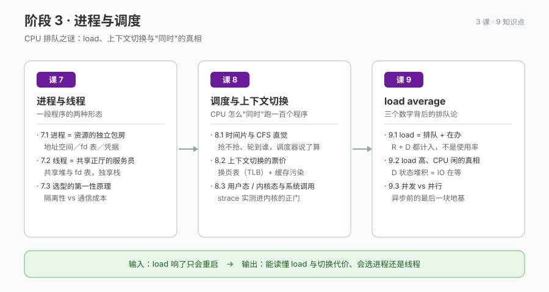

# 阶段 3 · 进程与调度

> CPU 排队之谜：load、上下文切换与"同时"的真相。

## 🎯 阶段目标

学完本阶段你能：读懂 CPU 的排队情况——load average 三个数字与 vmstat 的 r/b/cs 各在报什么，告别"load 响了只会重启"；说清进程与线程各自的家当与代价，能为一个具体场景选出该用进程还是线程；并量化"同时"这场魔术的票价——上下文切换到底贵在哪（页表与 TLB、缓存污染）。

## 📖 故事章节定位

体检报告翻到"CPU 排队"这一页：告警里 load 38 这个最熟悉的陌生数字，在本阶段被彻底读懂——order-service 到底是抢不到 CPU，还是卡在等 IO。

## 🔑 必须掌握的知识点

| 课 | 知识点 | 一句话要点 |
|----|--------|-----------|
| 课 7 | 7.1 进程：资源的独立包房 | 三件家当：地址空间／打开文件表／凭据；fork 复制（COW）；进程树与孤儿/僵尸 |
| 课 7 | 7.2 线程：共享正厅的服务员 | 共享堆/全局/fd 表，独享栈/寄存器；线程切换便宜在不换页表 |
| 课 7 | 7.3 进程 vs 线程选型的第一性原理 | 隔离性（崩了不连坐）vs 通信成本；进程池/线程池的由来；面试标准答法 |
| 课 8 | 8.1 时间片与 CFS 直觉 | 抢占式分时是"同时"魔术的原理；CFS 虚拟时钟直觉（不展开红黑树）；nice/renice 实测 |
| 课 8 | 8.2 上下文切换的票价 | 保存/恢复现场；进程切换额外换页表（TLB）；缓存污染；vmstat cs 列实测 |
| 课 8 | 8.3 用户态、内核态与系统调用 | 两态与特权级为何存在；系统调用 = 进内核正门；中断；strace 实测 |
| 课 9 | 9.1 load 是"排队 + 在办"的人数，不是 CPU 使用率 | 可运行(R) + 不可中断(D) 都计入；1/5/15 分钟的衰减；除以核心数才是拥挤度 |
| 课 9 | 9.2 load 高、CPU 闲的两种真相 | D 状态堆积 = IO 在等（容器内实测抬高 load 而 CPU 闲）；另一半是核少进程多 |
| 课 9 | 9.3 并发 vs 并行 | 并行 = 多核真同时；并发 = 交替发生看起来同时；单核也能高并发（伏笔课 11/12） |

## 🗺 本阶段路径图

## 课次一览

- [课 7《进程与线程：一段程序的两种形态》](lessons/lesson-07-进程与线程一段程序的两种形态.md)（✅ 已交付，2026-09-15）
- [课 8《调度与上下文切换：CPU 怎么"同时"跑一百个程序》](lessons/lesson-08-调度与上下文切换CPU怎么同时跑一百个程序.md)（✅ 已交付，2026-09-15）
- [课 9《load average：三个数字背后的排队论》](lessons/lesson-09-load-average三个数字背后的排队论.md)（✅ 已交付，2026-09-15）
