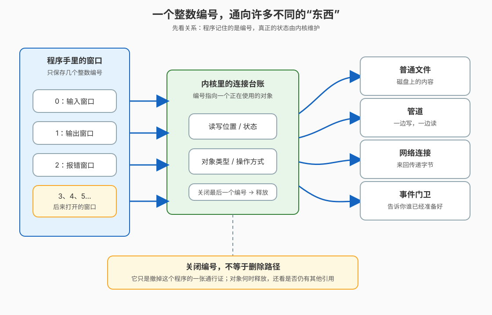
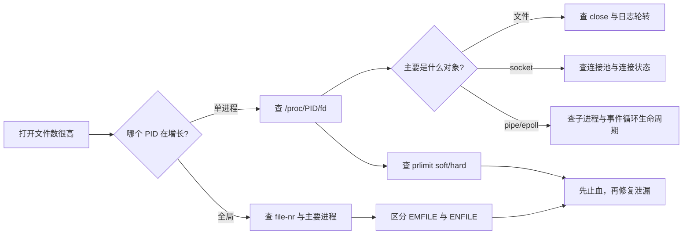

# 课 10 · 文件句柄：一切皆文件的入口

> 所属阶段：阶段 4《IO 与异步》｜实操环境：Docker Linux（Ubuntu 26.04；fd 类型实验补充使用 Python 3.13 slim）｜本课实测于 2026-09-15

> 📖 **文档核对留痕**：结论已按官方文档核对（核查于 2026-09）。本课特别收窄了三处容易混淆的口径：fd 是进程表里的整数索引，不是内核对象本身；“一切皆文件”是统一操作接口的设计比喻，不是所有内核对象都有路径；`RLIMIT_NOFILE` 是进程级上限，不能和系统级 `fs.file-max` 混为一谈。来源：[open(2)](https://man7.org/linux/man-pages/man2/open.2.html)、[dup(2)](https://man7.org/linux/man-pages/man2/dup.2.html)、[proc_pid_fd(5)](https://man7.org/linux/man-pages/man5/proc_pid_fd.5.html)、[getrlimit(2)](https://man7.org/linux/man-pages/man2/getrlimit.2.html)、[proc_sys_fs(5)](https://man7.org/linux/man-pages/man5/proc_sys_fs.5.html)、[Linux VFS 文档](https://docs.kernel.org/filesystems/vfs.html)。

## 📌 知识点导航

| 编号 | 知识点 | 状态 |
|---|---|---|
| 10.1 | fd：进程的窗口编号（面试高频） | ✅ |
| 10.2 | 一切皆文件：VFS 的统一接口 | ✅ |
| 10.3 | 句柄上限与泄漏 | ✅ |

## 🎯 本课目标

学完本课你将能：

- 解释 fd 是什么、为什么普通文件、pipe、socket、epoll 都能被进程用一个整数编号持有；
- 区分“进程自己的 fd 表”“内核共享的 open file description”和文件系统里的路径；
- 用 `/proc/<pid>/fd` 与 `lsof` 查出一个进程的句柄账本；
- 区分进程级 `RLIMIT_NOFILE`、系统级 `fs.file-max` 与 `nr_open`；
- 用 `ulimit`、`prlimit` 和 systemd drop-in 配置上限，并沿着 `Too many open files` 的证据链定位泄漏。

> ⚠️ 本课的容器命令都使用一次性 `--rm` 容器；配置持久化部分是给真实 Linux 主机或 systemd 服务的示例，不会修改本机 Docker Desktop 的 VM。

## 第一幕：起源与场景引入——“打开文件数 8 万”到底在说什么

周五晚上，order-service 的告警又亮了：

```text
接口变慢，当前打开文件数：80,000
```

“文件数”听起来像磁盘目录里有 8 万个文件。但值班工程师继续看进程，却发现其中一部分是 TCP 连接、一部分是日志文件，还有几条管道和事件监听器。它们为什么都被算进同一个数字？

因为进程并不直接拿着“文件对象”到处走。进程手里拿的是一串整数编号：编号 3 指向日志，编号 7 指向一个网络连接，编号 9 指向一个事件监听器。**编号是进程看世界的窗口；内核负责记住每扇窗口后面到底是什么。**

### 一句话本质

**fd（file descriptor，文件描述符）就是进程用来引用一个打开对象的整数编号。**统一使用编号，才让文件、管道、socket 和事件机制能被同一套进程资源管理方式串起来。

### 处境对照：不记账 vs 记账

| 做法 | 你会看到什么 | 代价 / 收益 |
|---|---|---|
| 只盯“打开文件数”这个总数 | 80,000 很吓人，但不知道是文件、连接还是泄漏 | 不能定位根因 |
| 拆成 fd 类型、进程上限、系统上限三本账 | `/proc/<pid>/fd` 能指出具体对象，`prlimit` 能指出限制 | 多一步观测，换来可执行的排障路径 |

## 第二幕：认知冲突——“一切皆文件”是不是说 socket 也在磁盘上

这里有三个反直觉问题：

1. 如果 fd 只是整数，为什么 `open()` 失败时会报 `Too many open files`？
2. 如果 socket 不是磁盘文件，为什么它也能出现在 `/proc/<pid>/fd`？
3. 容器里 `ulimit -n` 显示 `1048576`，是不是任何进程都能无限打开文件？

先给结论，再逐层拆开：

- **fd 是“编号”**，不是文件内容，也不是内核对象本体；
- **VFS / fd 接口提供统一入口**，但普通文件、pipe、socket、epoll 的操作语义仍然不同；
- **上限至少有三层**：当前进程的 `RLIMIT_NOFILE`、内核的 `nr_open` 天花板、系统级 `fs.file-max`；“把一个上限调大”不等于所有问题消失。

## 第三幕：层层揭示

### 一眼全局图



**看图：左边是进程记住的整数编号，中间是内核维护的连接台账，右边是普通文件、管道、网络连接和事件门卫等不同对象；关闭编号只是撤掉这扇窗口。**

### 本课地图

| 步骤 | 要解决的问题 | 对应知识点 |
|---|---|---|
| 第 1 步 | 进程手里的整数到底指向什么 | 10.1 fd：进程的窗口编号 |
| 第 2 步 | 为什么不同对象可以走统一入口，又为什么不能完全混用 | 10.2 一切皆文件：VFS 的统一接口 |
| 第 3 步 | “打开太多”到底是哪一层满了，怎样查与修 | 10.3 句柄上限与泄漏 |

### 知识点 10.1：fd 是进程的窗口编号（面试高频）

> 🧭 第 1/3 步｜承接：第二幕问“socket 为什么也能算打开文件” → 本步：先把进程手里的整数、内核对象和 `/proc` 观测入口对上号。

#### 一句话定义

**fd 是进程文件描述符表中的非负整数索引；系统调用用它找到对应的内核打开对象。**`open()` 成功时返回当前进程中最低的未占用 fd。

#### 直觉建立：进程的窗口牌

把进程想成一间办公室：

- `0` 是收件窗口：标准输入；
- `1` 是对外广播窗口：标准输出；
- `2` 是故障广播窗口：标准错误；
- `3`、`4`、`5`……是进程后来打开的文件、管道、连接或事件对象。

这张“窗口牌”只在**当前进程**内有意义。两个进程都可能有 fd `3`，但它们指向的对象完全可以不同；因此 fd 不是系统范围的文件编号。

类比的边界是：窗口牌本身不保存文件内容，也不代表路径。它只是一条引用；路径被删除后，一个已经打开的 fd 仍可能继续引用那个对象，直到最后的引用关闭。

#### 核心原理：三层对象不要混

| 层 | 人话 | 典型内容 |
|---|---|---|
| 进程 fd 表 | 这个进程手里的编号 | `3`、`4`、`7` |
| open file description | 内核记录的一次“打开关系” | 当前偏移、文件状态标志、指向的对象 |
| 文件系统对象 / 其他内核对象 | 编号最终指向的东西 | 普通文件、pipe、socket、匿名事件对象 |

`open()` 会返回最低可用编号；`dup()` 会再造一个编号，但两个编号可以指向同一个 open file description，因此共享文件偏移和状态标志。**“两个 fd”不一定等于“两个独立打开关系”。**

这也是重定向的底层直觉：shell 可以把某个文件 fd 复制到 `1`，之后程序照样对标准输出写；程序只看到“往 fd 1 写”，不必知道背后是终端还是文件。

#### 示例演示：同一个进程里的六种窗口

下面的实验使用 `python:3.13-slim` 只为了方便创建 pipe、socketpair 和 epoll；它仍然运行在 Docker Desktop 的 LinuxKit 内核中。

```bash
docker run --rm -i --platform linux/arm64 python:3.13-slim python3 - <<'PY'
import os
import resource
import select
import socket

file_fd = os.open('/tmp/fd-demo', os.O_CREAT | os.O_RDWR | os.O_TRUNC, 0o600)
pipe_r, pipe_w = os.pipe()
sock_a, sock_b = socket.socketpair()
epoll = select.epoll()

named = [
    ('regular-file', file_fd),
    ('pipe-read', pipe_r),
    ('pipe-write', pipe_w),
    ('socket-a', sock_a.fileno()),
    ('socket-b', sock_b.fileno()),
    ('epoll', epoll.fileno()),
]
print('rlimit_nofile=', resource.getrlimit(resource.RLIMIT_NOFILE))
print('stdio=', '0 stdin', '1 stdout', '2 stderr')
for label, fd in named:
    print(f'{label:13} fd={fd:2} -> {os.readlink(f"/proc/self/fd/{fd}")}')

probe = os.open('/dev/null', os.O_RDONLY)
os.close(probe)
reused = os.open('/dev/null', os.O_RDONLY)
print(f'lowest-free-reuse: closed_fd={probe} reopened_fd={reused}')

os.write(pipe_w, b'pipe')
print('pipe read via fd=', os.read(pipe_r, 4))
os.write(sock_a.fileno(), b'sock')
print('socket read via fd=', os.read(sock_b.fileno(), 4))

for fd in [file_fd, pipe_r, pipe_w, reused]:
    os.close(fd)
sock_a.close(); sock_b.close(); epoll.close()
PY
```

本次实测输出：

```text
rlimit_nofile= (1048576, 1048576)
stdio= 0 stdin 1 stdout 2 stderr
regular-file  fd= 3 -> /tmp/fd-demo
pipe-read     fd= 4 -> pipe:[7716411]
pipe-write    fd= 5 -> pipe:[7716411]
socket-a      fd= 6 -> socket:[7716412]
socket-b      fd= 7 -> socket:[7716413]
epoll         fd= 8 -> anon_inode:[eventpoll]
lowest-free-reuse: closed_fd=9 reopened_fd=9
pipe read via fd= b'pipe'
socket read via fd= b'sock'
```

读输出时抓住三件事：

1. 普通文件、pipe、socket、epoll 都被进程持有为整数 fd；
2. `/proc/self/fd/4` 与 `/proc/self/fd/5` 指向同一个 pipe 对象的两端；
3. fd `9` 关闭后马上又被最低可用规则复用，所以**不要把 fd 数字当成对象永久身份证**。

#### 常见误区

| 误区 | 修正 |
|---|---|
| fd 就是文件本身 | fd 是当前进程的索引；真正的打开状态在内核里 |
| fd `3` 在整台机器上唯一 | fd 只在进程上下文中解释 |
| `/proc/<pid>/fd/7` 一定是磁盘路径 | 它可能是 `pipe:[...]`、`socket:[...]` 或 `anon_inode:[...]` |
| 关闭 fd 会删除文件 | 关闭的是当前进程的一条引用；删除路径与释放对象是另一件事 |
| fd 数字越大，文件越“重要” | fd 分配通常从最低空位开始，数字只反映分配历史 |

#### 一句话记住

**fd 是进程的一张窗口牌：牌面是整数，窗口后面才是文件、管道、连接或事件对象。**

#### 行话锚定：在哪遇到

| 人话 | 行业标准叫法 | 典型位置 / 报错关键字 | 代价或边界 |
|---|---|---|---|
| 窗口编号 | file descriptor / fd | `open(2)` 返回值、`/proc/<pid>/fd` | 只对当前进程有意义 |
| 内核打开关系 | open file description | `open(2)`、`dup(2)`、共享文件偏移 | 不等于一个路径名 |
| 进程的窗口账本 | file descriptor table | 内核进程结构、`/proc` 观测 | fd 泄漏会让表持续增长 |

#### 📚 官方文档

- [open(2)](https://man7.org/linux/man-pages/man2/open.2.html)：fd 返回最低可用编号、open file description 与 `O_CLOEXEC`。
- [dup(2)](https://man7.org/linux/man-pages/man2/dup.2.html)：多个 fd 指向同一 open file description 时如何共享偏移与状态。
- [proc_pid_fd(5)](https://man7.org/linux/man-pages/man5/proc_pid_fd.5.html)：`/proc/<pid>/fd` 目录中符号链接的观测方式。
- [socketpair(2)](https://man7.org/linux/man-pages/man2/socketpair.2.html)：一对连接 socket 返回两个 fd。

### 知识点 10.2：一切皆文件是统一接口，不是字面事实

> 🧭 第 2/3 步｜承接：10.1 看到不同对象都能拿到 fd → 本步：解释内核为什么能用统一入口处理它们，以及统一到哪里会停止。

#### 一句话定义

**“一切皆文件”更准确的说法是：Linux 把许多资源包装成可由 fd 引用的对象，并让用户态通过一组相近的系统调用与工具组合它们。**它不是说 socket 在磁盘上有一个普通文件内容，也不是说所有对象都支持完全相同的操作。

#### 直觉建立：统一插座与不同电器

fd 像墙上的插座编号：普通文件、管道、网络连接都能插入这个编号体系，程序可以统一地调用 `close()` 断开；但插座后面的电器不同：

- 普通文件有位置，可以 `lseek()`；
- pipe 是单向或成对的字节流，读写双方有先后；
- socket 有连接、地址、半关闭等网络语义；
- epoll 是事件观察器，核心动作是等待就绪事件，不是把它当普通文件内容读取。

类比的边界是：**统一的是引用与一部分操作入口，不是对象的全部语义。**把“所有对象都能 `read()`”当成规则，会在 epoll、设备 ioctl、网络配置等处撞墙。

#### 核心原理：VFS 把路径和对象操作接起来

VFS（Virtual File System，虚拟文件系统）是内核里的抽象层：

1. `open("/path")` 先把路径解析成目录项和 inode；
2. 内核为这次打开关系创建 file object，并放入当前进程的 fd 表；
3. 后续 `read/write/close` 先用 fd 找到 file object，再调用该对象对应的操作实现。

因此，用户态看到的是“拿一个整数继续操作”；内核内部则根据对象类型分派到不同实现。VFS 官方文档明确把 file object 放进进程的 file descriptor table，并说明读写关闭会通过 fd 找到对应 file object。

| 资源 | 能否拿到 fd | 常见操作 | 不能偷换的语义 |
|---|---:|---|---|
| 普通文件 | ✅ | `open/read/write/close/lseek` | 有路径、偏移和持久化语义 |
| 管道 | ✅ | `pipe/read/write/close` | 没有普通文件路径；读写会受另一端影响 |
| socket | ✅ | `socket/send/recv/close`，也常可用 `read/write` | 有连接、地址和网络协议语义 |
| epoll | ✅ | `epoll_ctl/epoll_wait/close` | 它观察别的 fd，不是普通字节文件 |
| 网络配置对象 | 不一定按 fd 暴露 | netlink、ioctl、专用 API 等 | “一切皆文件”在这里是设计边界，不是字面保证 |

#### 示例演示：同一个 fd 体系，不同的对象行为

上一段实测已经用同一进程完成了两组操作：

- pipe：`os.write(pipe_w, b'pipe')` → `os.read(pipe_r, 4)`；
- socketpair：`os.write(sock_a.fileno(), b'sock')` → `os.read(sock_b.fileno(), 4)`。

两组都通过 fd 传递字节，但 `/proc/self/fd` 的目标分别是 `pipe:[...]` 与 `socket:[...]`。这就是“接口相似、语义不同”：工具可以复用，排障时仍要看对象类型。

一个更实用的例子是 shell 重定向：

```bash
printf '写入文件而不是终端\n' > /tmp/output.txt
cat /tmp/output.txt | wc -c
```

`printf` 不需要知道 `wc` 的实现；shell 通过 fd 和 pipe 把一个程序的输出接到另一个程序的输入。**组合能力来自统一的字节流入口，正确性仍取决于每个对象的语义。**

#### 常见误区

1. **“一切皆文件”= 所有东西都有 `/path`。**错误；很多对象只以匿名内核对象、socket 或专用接口存在。
2. **“有 fd 就能用 `lseek`。”**错误；pipe、socket 等通常没有普通文件偏移。
3. **“读写接口完全相同。”**错误；epoll 的核心是 `epoll_wait`，socket 还涉及连接和协议状态。
4. **“VFS 让所有文件系统实现都一样。”**错误；VFS 提供抽象，具体文件系统仍有自己的实现和限制。

#### 一句话记住

**“一切皆文件”真正想说的是：先统一引用入口，再让内核按对象类型分派；统一接口不抹平语义差异。**

#### 行话锚定：在哪遇到

| 人话 | 行业标准叫法 | 典型位置 / 报错关键字 | 边界 |
|---|---|---|---|
| 统一入口 | VFS（Virtual File System） | `open/read/write/close`、内核 `struct file` | 抽象层，不是一个真实磁盘文件 |
| 两端传字节 | pipe / FIFO | shell 管道、`pipe(7)` | 有缓冲与阻塞语义 |
| 网络窗口 | socket | `socket(2)`、`socketpair(2)`、`ss` | 由网络协议状态决定行为 |
| 事件门卫 | epoll instance | `epoll_create1`、`epoll_ctl`、`epoll_wait` | 监听 fd，不承载普通业务字节 |

#### 📚 官方文档

- [Linux VFS 文档](https://docs.kernel.org/filesystems/vfs.html)：路径解析、file object、fd table 与操作分派。
- [pipe(7)](https://man7.org/linux/man-pages/man7/pipe.7.html)：Linux 管道的字节流与阻塞语义。
- [socketpair(2)](https://man7.org/linux/man-pages/man2/socketpair.2.html)：连接 socket 对与 fd 返回值。
- [open(2)](https://man7.org/linux/man-pages/man2/open.2.html)：普通文件打开与文件状态标志。

### 知识点 10.3：句柄上限与泄漏

> 🧭 第 3/3 步｜承接：10.2 说明许多对象都进入 fd 体系 → 本步：把“打开太多”拆成进程级、内核天花板和系统级三层，并建立排障链。

#### 一句话定义

**句柄问题 = 进程不断持有 fd，却受到多层资源上限约束；泄漏的关键不是“文件太多”，而是引用没有按生命周期释放。**

#### 直觉建立：三道门

把打开一个对象想成进入场馆：

1. **进程门**：这个进程自己的 `RLIMIT_NOFILE` 能不能再拿一张票？不行通常得到 `EMFILE`。
2. **内核天花板**：`/proc/sys/fs/nr_open` 限制单进程上限最多能抬到哪里。
3. **系统总闸**：`/proc/sys/fs/file-max` 限制系统范围的 open file descriptions；撞到它通常对应 `ENFILE`。

类比边界是：现实中的限制还可能来自容器运行时、systemd、用户会话、epoll watch、内存和应用自身的连接池。只看一扇门，容易把“入口人数”误判成“根因”。

#### 核心原理：三层上限、两种错误

| 层级 | 观测 / 配置 | 作用范围 | 典型失败 |
|---|---|---|---|
| 进程软/硬限制 | `prlimit --pid PID --nofile`、`ulimit -n` | 当前进程及其后代 | `EMFILE` / `Too many open files` |
| 单进程上限天花板 | `/proc/sys/fs/nr_open` | 限制 `RLIMIT_NOFILE` 可提升到的最大值 | 想把进程上限抬过天花板失败 |
| 系统总 open file descriptions | `/proc/sys/fs/file-max`、`/proc/sys/fs/file-nr` | 所有进程共享的内核资源 | `ENFILE`，全局句柄紧张 |

`soft` 是当前生效值，进程通常可以把它降到更低；`hard` 是非特权进程不能超过的上界。**把 soft 调大只是放宽入口，不会替你关闭已经泄漏的 fd。**

#### 示例演示一：实际容器的默认上限不是“永远 1024”

先在 Ubuntu 26.04 容器里读三本账：

```bash
docker run --rm --platform linux/arm64 ubuntu:26.04 bash -lc '
  printf "ulimit_n=%s\n" "$(ulimit -n)"
  printf "prlimit_nofile="
  prlimit --nofile --output=SOFT,HARD --noheadings
  printf "fs_file_max="; cat /proc/sys/fs/file-max
  printf "fs_file_nr="; cat /proc/sys/fs/file-nr
  printf "fs_nr_open="; cat /proc/sys/fs/nr_open
'
```

本次实测输出：

```text
ulimit_n=1048576
prlimit_nofile=1048576 1048576
fs_file_max=801834
fs_file_nr=2976  0  801834
fs_nr_open=1048576
```

这组数字只属于本次 Docker Desktop LinuxKit VM / 容器环境，**不是所有 Linux 主机的默认值**。特别是 `fs_file-nr` 的第一列是已分配的 open file descriptions，不是某一个容器的 fd 数量。

#### 示例演示二：把进程上限降到 32，故意撞出真实报错

用 Python 在进程内部降低 `RLIMIT_NOFILE`，打开 `/dev/null` 直到失败：

```bash
docker run --rm -i --platform linux/arm64 python:3.13-slim python3 - <<'PY'
import os
import resource

print('before_rlimit_nofile=', resource.getrlimit(resource.RLIMIT_NOFILE))
resource.setrlimit(resource.RLIMIT_NOFILE, (32, 32))
print('after_rlimit_nofile=', resource.getrlimit(resource.RLIMIT_NOFILE))
opened = []
while True:
    try:
        opened.append(os.open('/dev/null', os.O_RDONLY))
    except OSError as exc:
        print('open_failed=', f'errno={exc.errno}', repr(exc.strerror),
              'opened_count=', len(opened), 'last_fd=', opened[-1])
        break
print('opened_fd_range=', (opened[0], opened[-1]))
for fd in opened:
    os.close(fd)
print('after_close_fd_count=', len(os.listdir('/proc/self/fd')))
PY
```

本次实测：

```text
before_rlimit_nofile= (1048576, 1048576)
after_rlimit_nofile= (32, 32)
open_failed= errno=24 'Too many open files' opened_count= 29 last_fd= 31
opened_fd_range= (3, 31)
after_close_fd_count= 4
```

为什么是 29 个而不是 32 个？因为 `0/1/2` 已经占用三个 fd，限制为 32 时可分配的编号正好是 `3..31` 共 29 个；真正要记住的是：**失败发生在进程级限制，错误号是 `EMFILE`（24），关闭 fd 后资源立即可复用。**

#### 示例演示三：`prlimit` 修改的是目标进程，不是系统总闸

```bash
docker run --rm --platform linux/arm64 ubuntu:26.04 bash -lc '
  printf "before="
  prlimit --pid $$ --nofile --output=SOFT,HARD --noheadings
  prlimit --pid $$ --nofile=64:64
  printf "after="
  prlimit --pid $$ --nofile --output=SOFT,HARD --noheadings
  printf "ulimit="; ulimit -n
'
```

实测输出：

```text
before=1048576 1048576
after=64 64
ulimit=64
```

`ulimit` 是 shell 内建命令，作用通常是当前 shell 及其后代；`prlimit` 可以读取或修改指定 PID 的资源限制。二者都不是修改 `/proc/sys/fs/file-max` 的替代品。

#### 示例演示四：泄漏的本质是“进程不放票”

下面让一个 Python 子进程打开 50 个 `/dev/null` 并保持 2 秒，父 shell 从 `/proc/<pid>/fd` 观察：

```bash
docker run --rm --platform linux/arm64 python:3.13-slim sh -c '
  python3 -c "import os,time; f=[open(\"/dev/null\") for _ in range(50)]; print(\"child_pid=\", os.getpid(), flush=True); time.sleep(2)" > /tmp/child.out &
  p=$!
  sleep 0.3
  cat /tmp/child.out
  printf "fd_count_while_open="
  ls /proc/$p/fd | wc -l
  wait $p
  printf "child_exit="; echo $?
'
```

实测输出：

```text
child_pid= 7
fd_count_while_open=53
child_exit=0
```

这个数字不是“文件大小”，而是进程持有的引用数量：标准输入输出错误 3 个，加上 50 个打开的 `/dev/null`。真实服务里的泄漏常见于异常分支没有 `close`、连接池没有上限、重试循环反复创建连接，或 `fork/exec` 时 fd 没有设置 close-on-exec。

#### 持久化配置：登录会话和 systemd 服务不是一回事

临时验证可以这样做：

```bash
ulimit -n 65536
# 或对指定 PID：
prlimit --pid "$PID" --nofile=65536:65536
```

登录会话的持久化示例（真实主机操作，先确认发行版的 PAM 配置）：

```text
# /etc/security/limits.conf
order-service soft nofile 65536
order-service hard nofile 65536
```

它只对经过相应 PAM session 的登录会话生效；改完后需要重新建立会话，不能指望已经运行的进程自动变大。

systemd 管理的服务不应依赖你在交互 shell 中执行过的 `ulimit`。用 drop-in：

```bash
sudo systemctl edit order-service.service
```

写入：

```ini
[Service]
LimitNOFILE=65536:65536
```

然后让 systemd 重新加载并重启该服务：

```bash
sudo systemctl daemon-reload
sudo systemctl restart order-service.service
prlimit --pid "$(pidof order-service)" --nofile
```

这里的关键不是背某个数字，而是**配置入口要和进程启动方式对齐**：shell 进程看 `ulimit`，登录会话看 PAM，systemd 服务看 unit 的 `LimitNOFILE`。不要直接改 `/usr/lib/systemd/system/` 里的发行版 unit；用 `/etc/systemd/system/<unit>.service.d/*.conf` 的 drop-in 才能避免包升级覆盖本地修改。

#### 常见误区

| 误区 | 修正 |
|---|---|
| 把 `ulimit -n 65536` 写进终端，就能修复线上服务 | 只影响该 shell 及后代；systemd 服务通常不继承你的交互 shell |
| 把 `fs.file-max` 调大就能解决 `EMFILE` | `EMFILE` 首先看进程级 `RLIMIT_NOFILE`；全局 `ENFILE` 才看系统总量 |
| “打开文件数”只包括磁盘文件 | socket、pipe、epoll 等也消耗 fd / 内核打开关系 |
| 提高上限就是修复 | 上限只是容量；泄漏仍会持续增长，还会消耗内核内存 |
| `lsof` 显示很多 fd 就一定是泄漏 | 守护进程可能本来就需要大量连接；要看数量随时间是否单向增长、是否与业务流量匹配 |
| `1024` 是 Linux 的固定 nofile 默认值 | 默认值取决于启动链路、发行版、systemd、容器运行时和环境；本次容器实测是 `1048576` |

#### 一句话记住

**先按 PID 查 fd 类型和增长趋势，再看进程级 soft/hard，最后才判断系统级 file-max；不要用“调大上限”替代关闭泄漏。**

#### 行话锚定：在哪遇到

| 人话 | 行业标准叫法 | 典型位置 / 报错关键字 | 作用范围 |
|---|---|---|---|
| 进程门 | `RLIMIT_NOFILE` / `nofile` | `ulimit -n`、`prlimit`、`EMFILE` | 单进程 |
| 系统总闸 | `fs.file-max` | `/proc/sys/fs/file-max`、`ENFILE` | 全系统 open file descriptions |
| 单进程天花板 | `fs.nr_open` | `/proc/sys/fs/nr_open` | 限制 `RLIMIT_NOFILE` 可提升值 |
| systemd 服务上限 | `LimitNOFILE=` | unit drop-in、`systemctl show` | 由 systemd 启动的服务 |

#### 📚 官方文档

- [getrlimit(2)](https://man7.org/linux/man-pages/man2/getrlimit.2.html)：`RLIMIT_NOFILE`、soft/hard limit 与 `EMFILE`。
- [prlimit(2)](https://man7.org/linux/man-pages/man2/prlimit.2.html)：读取或修改指定进程的资源限制。
- [proc_sys_fs(5)](https://man7.org/linux/man-pages/man5/proc_sys_fs.5.html)：`file-max`、`file-nr`、`nr_open` 的系统级口径。
- [limits.conf(5)](https://man7.org/linux/man-pages/man5/limits.conf.5.html)：登录会话资源限制配置格式与生效边界。
- [systemd.exec（官方 systemd 源码文档）](https://github.com/systemd/systemd/blob/main/man/systemd.exec.xml)：`LimitNOFILE=` 等服务进程资源限制。

## 第四幕：实操验证——从“句柄爆仓”走出一条排障链

现在回到最初的告警：打开文件数很高。不要先重启，也不要第一时间把限制抬到无限。按下面顺序收集同一时间窗口的证据。

### 1. 先确认是哪一个进程在增长

```bash
PID=12345
printf 'pid=%s\n' "$PID"
printf 'fd_count='; ls -1 "/proc/$PID/fd" | wc -l
printf 'nofile='; prlimit --pid "$PID" --nofile --output=SOFT,HARD --noheadings
```

如果这是容器内的 PID，先记住上一课的边界：PID namespace 可能让容器内编号和宿主视角不同；`/proc` 的观察要和你正在排查的进程视角保持一致。

### 2. 再看 fd 都是什么类型

```bash
ls -l "/proc/$PID/fd" | sed -n '1,30p'
for fd in /proc/$PID/fd/*; do
  printf '%s -> ' "${fd##*/}"
  readlink "$fd"
done | sort | sed -n '1,40p'
```

典型分类思路：

| 观测目标 | 可能含义 | 下一步 |
|---|---|---|
| `/path/to/*.log` 很多 | 日志文件没有关闭或轮转句柄残留 | 查日志库、轮转策略与异常路径 |
| `socket:[...]` 很多 | 连接池、客户端连接、TIME_WAIT 之外的持有者 | 用 `ss` 对照连接状态与应用连接池 |
| `pipe:[...]` 很多 | 子进程、日志管道或 IPC 没有收端/关端 | 查父子进程与 `close` 生命周期 |
| `anon_inode:[eventpoll]` | epoll 实例 | 继续查被监听的 fd 数与事件循环关闭路径 |

### 3. 用 `lsof` 把编号翻译成人话

如果目标主机已安装 `lsof`：

```bash
lsof -nP -p "$PID"
lsof -nP -p "$PID" | awk 'NR == 1 || $4 ~ /[0-9]+[uwr]/'
```

本次 Alpine 临时容器实测能正常列出自身 cwd、可执行文件、标准流和 `/proc` 目录；`lsof` 是辅助视图，最终仍以 `/proc/<pid>/fd` 和进程级限制为准：

```text
COMMAND PID USER  FD   TYPE DEVICE SIZE/OFF    NODE NAME
lsof      1 root cwd    DIR  0,100     4096  487572 /
lsof      1 root   0u   CHR    1,3      0t0       5 /dev/null
lsof      1 root   1w  FIFO  0,14      0t0 7715566 pipe
```

### 4. 最后才决定是容量不足还是泄漏

```bash
prlimit --pid "$PID" --nofile
cat /proc/sys/fs/nr_open
cat /proc/sys/fs/file-max
cat /proc/sys/fs/file-nr
```

用条件表收束：

| 条件 | 判断 | 动作 |
|---|---|---|
| 单个进程 fd 数接近 soft limit，且同类对象持续增长 | 进程级容量或泄漏 | 先止血限流 / 重启单实例，再定位 close、连接池和子进程生命周期 |
| 单进程不高，但多个进程合计逼近 `file-max` | 系统级资源紧张 | 找出主要消耗者，检查全局句柄与内核内存，再评估系统级容量 |
| fd 数稳定但请求仍慢 | 不一定是 fd 问题 | 回到上一课的 load、CPU、D 状态和 IO 指标，不要只盯句柄 |
| 提高 limit 后增长曲线不变 | 只是延迟爆炸时间 | 立即按泄漏排查，不把更大上限当修复 |

## 第五幕：体系收束——fd 是下一阶段 IO 的门牌号

本课把故事主线里的“打开文件数 8 万”拆成了三件事：

1. **10.1：看懂门牌号**——fd 是进程本地整数，指向内核打开关系；
2. **10.2：看懂统一入口**——VFS 和 fd 让不同对象可以组合，但对象语义仍不同；
3. **10.3：看懂爆仓边界**——`RLIMIT_NOFILE`、`nr_open`、`file-max` 是不同层的门。

接下来课 11 会把“调用方要不要等”和“谁负责搬数据”拆成两个维度，解释同步/异步与阻塞/非阻塞的四象限。**没有 fd 这张门牌表，epoll 就没有可监听的对象；没有 fd 生命周期意识，异步程序反而更容易泄漏。**

### 一图收束：从症状到动作



### 课后小测

<details>
<summary>题 1：同一个进程里 fd=3 被 close 后，下一次 open 很可能返回哪个编号？为什么？</summary>

答案：通常返回 `3`，因为 Linux 的 `open()` 会返回当前进程中最低的未占用 fd。但 fd 只是可复用的进程本地编号，不能把它当成对象永久 ID。
</details>

<details>
<summary>题 2：进程报 errno=24、Too many open files，应该先调大 fs.file-max 吗？</summary>

答案：不应该先调。errno=24 对应 `EMFILE`，优先检查该进程的 `RLIMIT_NOFILE`、`/proc/<pid>/fd` 数量和对象类型；只有遇到系统范围的 `ENFILE` 或全局 `file-max` 接近时，才进入系统级排查。
</details>

<details>
<summary>题 3：为什么 systemd 服务的 LimitNOFILE 不能靠你当前终端里的 ulimit -n 代替？</summary>

答案：systemd 服务由 systemd manager 启动，不是当前交互 shell 的子进程；它通常继承 unit / manager 的资源限制。应在 service drop-in 中设置 `LimitNOFILE=`，再 daemon-reload 并重启服务。
</details>

## 📋 命令速查卡

| 目的 | 命令 | 看什么 |
|---|---|---|
| 看当前 shell 上限 | `ulimit -n` | 当前 shell 的 soft nofile |
| 看指定进程上限 | `prlimit --pid PID --nofile` | soft / hard |
| 看进程 fd 数量 | `ls -1 /proc/PID/fd \| wc -l` | 当前引用数量 |
| 看 fd 指向 | `ls -l /proc/PID/fd` / `readlink /proc/PID/fd/*` | 文件、pipe、socket、epoll 类型 |
| 详细列账 | `lsof -nP -p PID` | 类型、访问模式、路径 / socket |
| 看系统总量 | `cat /proc/sys/fs/file-nr` | 已分配 / 空闲 / 上限 |
| 看系统总上限 | `cat /proc/sys/fs/file-max` | 全局 open file descriptions 上限 |
| 看单进程天花板 | `cat /proc/sys/fs/nr_open` | RLIMIT_NOFILE 可提升到的最大值 |
| 临时调整当前 shell | `ulimit -n 65536` | 只影响当前 shell 及后代 |
| 临时调整指定 PID | `prlimit --pid PID --nofile=65536:65536` | 修改该进程 soft/hard |
| systemd 持久化 | `systemctl edit SERVICE` + `LimitNOFILE=` | 服务启动链路的资源限制 |

> ⚠️ 看到 `Too many open files` 时，先保存 `/proc/PID/fd` 分类、fd 数量、soft/hard 和 `file-nr` 的同一时刻快照；不要只抄一个总数。

## 🚀 接力提示词

> 学完本课后，复制下面这段文字发给 AI，即可继续下一批：

```text
继续学 Linux 操作系统基础。我的学习档案在 operating-system/00-学习档案.md，
刚学完阶段 4《IO 与异步》的课 10《文件句柄：一切皆文件的入口》知识点 10.1、10.2、10.3，
请按大纲继续讲解课 11《同步异步 × 阻塞非阻塞：IO 的四象限》。
```

## 🧭 课程导航

- 上一课：[课 9《load average：三个数字背后的排队论》](../../3-进程与调度/lessons/lesson-09-load-average三个数字背后的排队论.md)
- 下一课：[课 11《同步异步 × 阻塞非阻塞：IO 的四象限》](lesson-11-同步异步与阻塞非阻塞IO的四象限.md)
- 返回目录：[02-课程目录](../../../02-课程目录.md)
