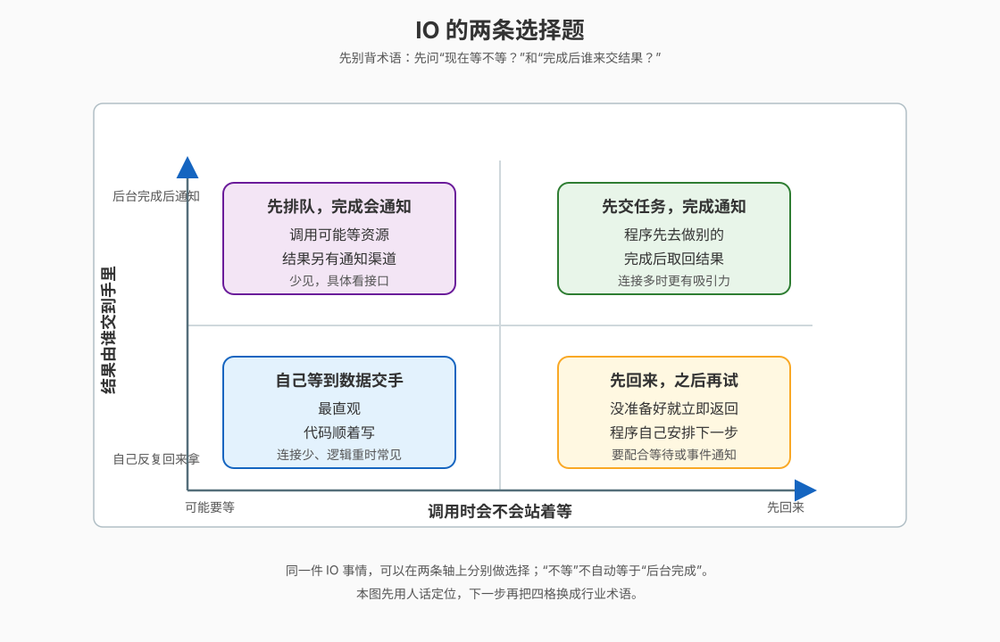
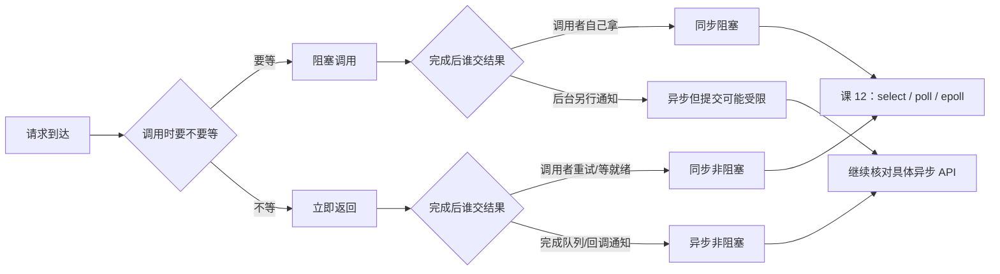

# 课 11 · 同步异步 × 阻塞非阻塞：IO 的四象限

> 所属阶段：阶段 4《IO 与异步》｜实操环境：Docker Linux（Ubuntu 26.04；阻塞线程与非阻塞 fd 实验使用 Python 3.13 slim）｜本课实测于 2026-09-16

> 📖 **文档核对留痕**：结论已按官方文档核对（核查于 2026-09）。本课特别收窄三处容易混淆的口径：`O_NONBLOCK` 只改变调用在“暂时不能完成”时的返回行为，不会自动把同步 I/O 变成异步；POSIX AIO 的“异步”是提交后由后台执行并另行通知，但 Linux 当前实现可能由用户态线程支撑；`io_uring` 是 Linux 专属的提交队列 / 完成队列接口，不能把所有“事件循环”都叫作内核真异步。来源：[fcntl(2)](https://man7.org/linux/man-pages/man2/fcntl.2.html)、[read(2)](https://man7.org/linux/man-pages/man2/read.2.html)、[write(2)](https://man7.org/linux/man-pages/man2/write.2.html)、[aio(7)](https://man7.org/linux/man-pages/man7/aio.7.html)、[io_uring(7)](https://man7.org/linux/man-pages/man7/io_uring.7.html)、[Python `fcntl` 文档](https://docs.python.org/3/library/fcntl.html)、[Python `threading` 文档](https://docs.python.org/3/library/threading.html)。

## 📌 知识点导航

| 编号 | 知识点 | 状态 |
|---|---|---|
| 11.1 | 两个维度到底在说什么（四象限）（面试高频） | ✅ |
| 11.2 | 阻塞时线程与 CPU 各自在哪 | ✅ |
| 11.3 | 异步的代价与适用边界 | ✅ |

## 🎯 本课目标

学完本课你将能：

- 用“调用方要不要等”和“完成后谁交结果”两个问题给 IO 模型定位；
- 解释阻塞调用时线程为何进入睡眠、CPU 为什么可以去运行别的任务；
- 说清非阻塞、事件驱动、后台线程和真正异步完成通知之间的边界；
- 算出“每连接一线程”的内存与调度账单，并为具体场景选择模型。

> ⚠️ 本课的 Docker 命令都使用一次性 `--rm` 容器；实验只观察容器内进程，不修改宿主机的线程栈、内核参数或网络配置。`io_uring` 只做官方语义定位，不在本课引入第三方绑定库。

## 第一幕：起源与场景引入——连接数一上来，线程为什么突然不够用了

周五晚，order-service 的流量没有翻十倍，连接数却从 200 涨到 10,000：大量客户端保持长连接，真正同时发请求的只有几百个。

最直觉的方案是：**一个连接配一个线程**。线程拿到连接后调用 `read()`；没数据就等，有数据就处理。200 个连接时它很舒服，10,000 个连接时，问题变成了：线程本身要占栈空间，睡醒要被调度，超时和取消还要逐个管理。

这时有人说：“改成非阻塞就行。”另一个人说：“要上异步。”两句话都可能对，也都可能把问题说错——**非阻塞和异步不是同一个维度**。

### 一句话本质

**本课把 IO 拆成两道独立选择题：调用这一刻要不要等，以及数据完成后由调用者自己取还是由后台通知。**先把两道题分开，才不会把“返回得快”误认为“工作已经完成”。

### 处境对照：同一万条连接，账单差在哪里

| 做法 | 连接空闲时发生什么 | 主要账单 |
|---|---|---|
| 每连接一个阻塞线程 | 10,000 个线程大多睡在等待数据 | 线程栈预留、线程管理、唤醒与切换；栈大小取决于运行时，不能直接等同于 RSS |
| 少量线程 + 非阻塞 / 事件驱动 | 少量线程管理大量 fd，只有就绪对象进入处理 | 代码要自己处理 `EAGAIN`、状态、超时与公平性 |
| 后台异步完成 | 调用方提交请求后先去做别的，完成时拿通知 | 生命周期、取消、错误传播和结果关联更复杂 |

> 量化锚点（假设值）：若每条线程预留 **1 MiB** 栈地址空间，10,000 条就是 `10,000 × 1 MiB = 10,000 MiB ≈ 9.77 GiB` 的虚拟地址空间；这是预留账，不等于全部已经驻留的物理内存。真正数字还会受 libc、语言运行时、线程栈配置与实际触页影响。

## 第二幕：认知冲突——“不等”为什么不等于“后台替你做完”

先暂停一下，回答三个问题：

1. `read()` 立刻返回，是因为数据已经复制到你的缓冲区，还是因为现在没有数据？
2. 一个线程卡在空 pipe 上时，它是否还一直占满 CPU？
3. `async` 这个词到底是在说“另起一个线程”，还是在说“完成后如何通知”？

如果把所有“快返回”的行为都叫异步，就会把下面三件事混为一谈：

| 表面现象 | 实际可能是什么 | 调用者接下来要做什么 |
|---|---|---|
| `read()` 立刻返回数据 | 数据已就绪，调用者自己完成读取 | 继续处理数据 |
| `read()` 立刻返回 `EAGAIN` | 数据暂时没就绪，操作没有完成 | 之后重试、等待就绪或交给事件循环 |
| 提交请求后稍后收到完成事件 | 后台执行完成了操作 | 根据请求 ID 取结果、处理错误与取消 |

第一种与第二种都可以是**同步接口**：调用者主动发起这次读，只是第二种不愿意在调用点等待。第三种才是我们通常说的**异步完成模型**。接下来用一张图把这两条轴固定下来。

## 第三幕：层层揭示——两条轴，四种组合

### 一眼全局图



看图：横向只问“调用时会不会站着等”，纵向只问“结果由谁交到手里”；四个格子是两条轴的组合，不能把右侧的“先回来”直接翻译成上侧的“后台完成”。

### 本课地图

| 步骤 | 要解决什么问题 | 对应知识点 |
|---|---|---|
| 第 1 步 | 把“等不等”和“谁交结果”拆成两道题 | 11.1 两个维度到底在说什么（四象限） |
| 第 2 步 | 看清线程睡在哪里、CPU 此时跑谁 | 11.2 阻塞时线程与 CPU 各自在哪 |
| 第 3 步 | 在吞吐、复杂度和可维护性之间做选择 | 11.3 异步的代价与适用边界 |

### 知识点 11.1：两个维度到底在说什么（四象限）（面试高频）

> 🧭 第 1/3 步｜承接：第二幕留下“返回快是不是工作已完成？” → 本步：用两条互相独立的轴，把四种情况分开。

#### 一句话定义

**阻塞 / 非阻塞描述一次调用是否在当前调用点等待；同步 / 异步描述 IO 完成与数据交付由谁负责、何时通知。**前者看“现在等不等”，后者看“完成后谁来交付”。

#### 直觉建立：提水桶和外卖

把 IO 想成取水：

- **同步**：你自己拿桶到水龙头，水装进你的桶，你自己知道装了多少；
- **异步**：你下单后先去做别的，水装好后有人按门铃，并告诉你是哪一单；
- **阻塞**：你在水龙头旁站着等桶装满；
- **非阻塞**：水龙头暂时没水就先回来，之后自己决定什么时候再问。

这个类比的边界很重要：现实中的“外卖员”暗示了一个独立后台人员，但软件里的异步可能由内核、运行时、线程池或设备共同完成；“非阻塞”只保证调用点不因当前条件而睡住，不保证后台已经替你搬完数据。

#### 核心原理：先看调用点，再看完成路径

一次读操作至少有三个时间点：

1. **提交 / 发起**：程序请求“从 fd 取数据”；
2. **数据准备**：设备、内核缓冲区或对端让数据变得可读；
3. **交付完成**：数据已经按接口约定放进调用者缓冲区，或通过完成事件报告结果。

阻塞只影响第 1 个时间点和第 2 个时间点之间调用者是否停在原地；同步 / 异步重点看第 3 个时间点由谁负责把结果交付给程序。

| 组合 | 调用点行为 | 完成路径 | 典型理解 |
|---|---|---|---|
| 同步 + 阻塞 | 调用者等到本次读写能推进或完成 | 调用者自己拿到结果 | 最顺着业务代码写，等待时线程睡眠 |
| 同步 + 非阻塞 | 条件不满足就立即返回，常见是 `EAGAIN` / `EWOULDBLOCK` | 调用者自己重试或先等待就绪 | “自己负责，但不在此刻站着等” |
| 异步 + 阻塞 | 提交动作本身可能因队列 / 资源而等待 | 操作完成后另行通知 | 概念上成立，具体接口是否这样实现要看文档 |
| 异步 + 非阻塞 | 提交不等待本次 IO 完成 | 后台完成并通过事件 / 回调 / 完成队列通知 | 适合批量挂起请求，但状态管理最复杂 |

> **四象限是分析工具，不是四个统一的 Linux API 名称。**例如 `O_NONBLOCK` 只作用于具体 fd 的调用行为；POSIX AIO 和 `io_uring` 的完成通知机制也各自不同。

#### “同步”不等于“阻塞”：最容易被问的反例

对一个空 pipe 的读操作：

```text
同步 + 阻塞：read() 直到有字节可读，然后把字节交给调用者
同步 + 非阻塞：read() 发现没有字节，立即返回 EAGAIN；调用者稍后自己再处理
```

两种情况下都是调用者主动调用 `read()`，并且由它负责把字节放进自己的缓冲区，所以都属于同步交付；区别只是调用点会不会睡住。

反过来，异步也不等于多线程：

```text
提交 read 请求 → 程序继续处理其他请求 → 完成事件携带 request_id 和结果
```

后台可以是内核队列，也可以是运行时的 worker thread。**“有没有线程”是实现问题，“完成结果是不是在原调用点同步交付”才是模型问题。**

#### 示例演示：非阻塞读到底返回了什么

下面的实验只把 pipe 的读端改成 `O_NONBLOCK`，不往 pipe 写数据就读一次：

```bash
docker run --rm -i --platform linux/arm64 python:3.13-slim python3 - <<'PY'
import errno
import fcntl
import os

read_fd, write_fd = os.pipe()
flags = fcntl.fcntl(read_fd, fcntl.F_GETFL)
fcntl.fcntl(read_fd, fcntl.F_SETFL, flags | os.O_NONBLOCK)
print('read_fd=', read_fd)
print('nonblock_enabled=', bool(fcntl.fcntl(read_fd, fcntl.F_GETFL) & os.O_NONBLOCK))
try:
    os.read(read_fd, 1)
except BlockingIOError as exc:
    print('empty_read=', f'errno={exc.errno}', repr(exc.strerror), 'is_EAGAIN=', exc.errno == errno.EAGAIN)
os.write(write_fd, b'OK')
print('read_after_write=', os.read(read_fd, 2))
os.close(read_fd)
os.close(write_fd)
PY
```

本次 Docker 实测输出：

```text
read_fd= 3
nonblock_enabled= True
empty_read= errno=11 'Resource temporarily unavailable' is_EAGAIN= True
read_after_write= b'OK'
```

这里的 `EAGAIN` 不是“出错后数据丢了”，而是告诉调用者：**这一次同步读取没有完成，之后由你决定重试、等待或转入事件循环。**对 socket，便携代码还应同时考虑 `EAGAIN` 和 `EWOULDBLOCK`，因为 POSIX 允许它们在该情形下不同。

#### 常见误区

| 误区 | 修正 |
|---|---|
| 非阻塞就是异步 | 非阻塞只改变调用点的等待行为；调用者仍可能自己反复尝试 |
| 同步就是一定阻塞 | 同步非阻塞完全成立：调用者自己发起，没准备好就拿到 `EAGAIN` |
| 异步就是开一个线程 | 线程可能是实现手段，也可能没有；模型关键在完成通知与数据交付 |
| `read()` 返回就代表请求完成 | 返回 `EAGAIN` 代表本次没有完成；返回小于请求长度也可能只是部分读取 |
| 四象限的每一格都有一个固定 Linux 命令 | 四象限是分析坐标；具体行为必须回到 API 文档和对象类型 |

#### 一句话记住

**先问“调用时等不等”，再问“完成后谁交结果”；非阻塞不自动等于异步，同步也不自动等于阻塞。**

#### 行话锚定：在哪遇到

| 人话 | 行业标准叫法 | 典型配置 / 在哪遇到 | 代价或边界 |
|---|---|---|---|
| 调用时站着等 | blocking I/O | 默认 `read` / `write`、线程状态 `S` / `D` | 代码直观；每个等待者占用一个执行载体 |
| 条件不满足先回来 | nonblocking I/O | `O_NONBLOCK`、`fcntl(F_SETFL)`、`EAGAIN` | 要自己安排重试或 readiness 等待，忙轮询会浪费 CPU |
| 自己发起并自己取结果 | synchronous I/O | `read(2)` / `write(2)` 调用与返回值 | 控制流清晰，但调用者承担等待与结果处理 |
| 后台完成再通知 | asynchronous I/O / completion-based I/O | POSIX AIO、`io_uring` CQE、回调 / future | 生命周期、错误、取消、结果关联更复杂 |

#### 📚 官方文档

- [fcntl(2)](https://man7.org/linux/man-pages/man2/fcntl.2.html)：`F_GETFL` / `F_SETFL` 与文件状态标志的操作入口。
- [read(2)](https://man7.org/linux/man-pages/man2/read.2.html)：非阻塞 fd 在暂时不能读取时返回 `EAGAIN` / `EWOULDBLOCK`，以及部分读取语义。
- [write(2)](https://man7.org/linux/man-pages/man2/write.2.html)：写入可能部分完成，pipe / socket 的阻塞与返回边界。
- [Python `fcntl` 文档](https://docs.python.org/3/library/fcntl.html)：Python `fcntl` 模块是 Unix `fcntl()` 的 fd 控制封装。

### 知识点 11.2：阻塞时线程与 CPU 各自在哪

> 🧭 第 2/3 步｜承接：11.1 说明阻塞只问“调用点等不等” → 本步：把一个真实阻塞线程放进 `/proc`，看它睡在哪里，以及 CPU 为什么还能运行别的任务。

#### 一句话定义

**阻塞 I/O 不是线程在用户态空转，而是线程进入内核等待队列；事件未到时它通常不占用 CPU，事件到来后再被唤醒并重新参与调度。**

#### 直觉建立：取号后坐下

把线程想成柜台办事的人：

- 它调用阻塞 `read()`，相当于取了“等数据”的号码；
- 内核把它放进对应对象的等待队列，线程从可运行队列退出；
- CPU 不需要盯着它，可以去运行其他 runnable 线程；
- pipe 有数据、socket 收到包或超时发生后，内核唤醒它，它再回到可运行队列。

类比的边界是：线程并不是“被 CPU 记住然后定时回来问一次”。唤醒由内核等待机制和对象事件驱动；而且不同对象、不同等待条件的状态可能不同，不能只凭 `S` 或 `D` 一个字母推断全部原因。

#### 核心原理：R → S / D → R

在 Linux 进程观察里，可以先用三段状态建立直觉：

| 状态 | 人话 | 对 CPU 的含义 |
|---|---|---|
| `R`（running / runnable） | 正在 CPU 上跑，或排队等 CPU | 会争用调度时间 |
| `S`（interruptible sleep） | 可被信号或事件唤醒的睡眠 | 当前不占 CPU，等待条件满足 |
| `D`（uninterruptible sleep） | 通常在不可中断的内核等待中 | 当前不占 CPU，但可能反映 IO / 设备等待；不能简单等同“磁盘慢” |

空 pipe 上的 `read()` 常见为 `S`；某些设备或存储路径可能出现 `D`。**“阻塞”是调用语义，“S/D”是观测到的线程状态，两者有关但不是同义词。**

用上一课的语言说：线程从 `R` 变成睡眠后，CPU 调度器就能选择另一个 `R` 任务；事件到来时，睡眠线程被唤醒，重新排队。若所有任务都在睡，CPU 可能空闲；若还有很多 runnable 任务，CPU 就去处理它们。

#### 数字算给你看：每连接一线程的账单

下面只计算**假设的栈地址空间**，不把它冒充成固定 RSS：

| 线程数 | 假设每线程预留栈 | 虚拟地址空间预留 | 还没算的账 |
|---:|---:|---:|---|
| 200 | 1 MiB | 200 MiB | 线程控制块、内核栈、已触页物理内存、调度与锁竞争 |
| 2,000 | 1 MiB | 2,000 MiB ≈ 1.95 GiB | 同上；还要考虑地址空间布局与运行时限制 |
| 10,000 | 1 MiB | 10,000 MiB ≈ 9.77 GiB | 唤醒 / 上下文切换、超时管理、应用级队列 |

如果运行时把栈预留调成 256 KiB，10,000 条的同一项假设会变成约 **2.44 GiB**；这说明“每线程栈多大”很重要，也说明**不能把一个宣传数字直接当作所有 Linux 线程的实际内存成本**。课 5 已讲过：虚拟地址空间预留与物理页驻留是两本账。

#### 示例演示：把线程卡在空 pipe 上，观察 `wchan`

这个实验让一个 Python 线程在空 pipe 的读端上阻塞，主线程从 `/proc/self/task/<tid>/status` 与 `wchan` 读取它的状态，然后写入一个字节将其唤醒：

```bash
docker run --rm -i --platform linux/arm64 python:3.13-slim python3 - <<'PY'
import os
import threading
import time

read_fd, write_fd = os.pipe()
ready = threading.Event()
worker_tid = {}

def worker():
    worker_tid['tid'] = threading.get_native_id()
    ready.set()
    data = os.read(read_fd, 1)
    print('worker_returned=', data.decode(), flush=True)

thread = threading.Thread(target=worker)
thread.start()
ready.wait()
time.sleep(0.2)
tid = worker_tid['tid']
status = open(f'/proc/self/task/{tid}/status').read().splitlines()
state = next(line.split(':', 1)[1].strip() for line in status if line.startswith('State:'))
wchan = open(f'/proc/self/task/{tid}/wchan').read().strip()
print('worker_tid=', tid)
print('state_before_write=', state)
print('wchan_before_write=', wchan)
os.write(write_fd, b'X')
thread.join()
os.close(read_fd)
os.close(write_fd)
PY
```

本次 Docker 实测输出：

```text
worker_tid= 7
state_before_write= S (sleeping)
wchan_before_write= pipe_read
worker_returned= X
```

读输出时不要把 `pipe_read` 背成固定字符串：等待点可能随内核版本、对象类型和实现路径变化。证据链真正说明的是：**线程在内核等待点睡眠；写端产生数据后，线程被唤醒并拿到 `X`。**

#### 常见误区

| 误区 | 修正 |
|---|---|
| 阻塞线程一直占满一个 CPU | 正常阻塞等待时线程睡眠；CPU 可以运行其他 runnable 任务 |
| 看到 `S` 就是用户态 `sleep()` | `S` 只说明可中断睡眠，需结合 `wchan`、系统调用和对象类型定位 |
| 看到 `D` 就能断言磁盘坏了 | `D` 代表不可中断等待的观测状态，原因要结合 IO、设备和内核路径判断 |
| 线程睡了就没有任何成本 | 仍有栈预留、线程管理、唤醒、调度、锁和上下文切换成本 |
| 10,000 × 1 MiB 就是 10 GiB RSS | 这是显式假设下的虚拟栈预留计算，不等于所有页都驻留 |

#### 一句话记住

**阻塞时线程通常睡在内核等待队列，CPU 去跑别人；但“睡着”不等于“没有成本”，线程数量仍会把内存和调度账单推高。**

#### 行话锚定：在哪遇到

| 人话 | 行业标准叫法 | 典型配置 / 在哪遇到 | 代价或边界 |
|---|---|---|---|
| 可运行或正在运行 | `R` / runnable | `/proc/<pid>/stat`、`ps`、`top` | runnable 多时会排队，不能简单看成正在占 CPU |
| 可中断睡眠 | `S` / interruptible sleep | `ps -eLo ... state,wchan`、`/proc/<pid>/task/<tid>/status` | 常见于等待 pipe、锁、条件或可被信号打断的事件 |
| 不可中断睡眠 | `D` / uninterruptible sleep | `ps`、`/proc`、load 的 D 口径 | 常见于部分 IO / 设备等待；根因不能只凭状态字母下结论 |
| 等待点 | wait channel / `wchan` | `/proc/<pid>/task/<tid>/wchan` | 是定位线索，不是跨版本稳定的业务 API |

#### 📚 官方文档

- [Python `threading` 文档](https://docs.python.org/3/library/threading.html)：线程适用于 IO-bound 任务，并提供 `get_native_id()` 等线程观测入口。
- [proc(5)](https://man7.org/linux/man-pages/man5/proc.5.html)：`/proc` 进程与线程观测入口。
- [proc_pid_status(5)](https://man7.org/linux/man-pages/man5/proc_pid_status.5.html)：进程状态字段与线程数量等信息。
- [sched(7)](https://man7.org/linux/man-pages/man7/sched.7.html)：Linux 调度策略与可运行任务的背景说明。

### 知识点 11.3：异步的代价与适用边界

> 🧭 第 3/3 步｜承接：11.2 证明阻塞线程会睡，但大量线程仍有账单 → 本步：比较线程、事件循环与完成通知，决定什么时候值得换模型。

#### 一句话定义

**异步把“等待完成”从当前控制流中移开，但同时把结果关联、错误传播、取消、超时和背压责任带进了应用。**它解决的是等待组织方式，不承诺业务逻辑自动变简单。

#### 直觉建立：前台取号与后台取货

同步阻塞像你在窗口前等办完一件事：顺序清楚，局部变量和异常栈都自然；异步像你取号后离开窗口，之后凭号码取结果：一个工作人员可以管理很多号码，但你必须保管号码、知道取消哪个、处理某个号码失败，以及多个结果到达时如何保持业务顺序。

类比的边界是：一个“工作人员”不一定对应一个 OS 线程；事件循环、线程池和内核完成队列都可能成为实现。也不能因为有回调就说“没有阻塞”——回调内部如果执行同步磁盘 IO 或长时间 CPU 计算，照样会阻塞它所在的执行载体。

#### 核心原理：高并发不是免费午餐

选择模型时，至少看五件事：

1. **连接数量**：大量空闲连接会不会占满线程或栈空间？
2. **IO 密度**：一次请求是在等网络，还是主要做 CPU 计算？
3. **库的形态**：数据库、文件、TLS、压缩库是否提供与你的模型匹配的接口？
4. **状态复杂度**：一个请求会不会跨越多个异步步骤，产生大量中间状态？
5. **失败语义**：超时、取消、重试、顺序和背压能不能被清楚表达？

异步真正带来的收益是：**把有限的执行载体从大量空闲等待中解放出来**。代价是：状态不再由一个顺序调用栈自然保存，而要显式放入请求对象、future、回调或状态机。

#### POSIX AIO 与 `io_uring`：只做边界定位

POSIX AIO 的典型形态是：用 `aio_read()` 提交请求，稍后用 `aio_error()` / `aio_return()` 查询，或通过 signal / thread 等方式获得通知。官方 `aio(7)` 明确指出：当前 Linux POSIX AIO 实现由 glibc 在用户空间提供，维护多个线程的成本可能较高、扩展性较差。

`io_uring` 是 Linux 专属的异步 I/O 接口：用户把请求放进 submission queue，内核把结果放进 completion queue；官方文档还明确提醒，多个请求可能以不同于提交顺序的顺序完成，应用必须用 `user_data` 等信息把完成事件关联回原请求。

因此本课只给出一个判断：

```text
“异步”是完成模型；“io_uring”是某个 Linux 异步接口；“事件循环”常常是非阻塞就绪通知模型。
三者有关，但不是同义词。
```

#### 策略—术语对照表

| 本课说法（人话） | 行业标准叫法 | 典型配置 / 在哪遇到 | 代价 |
|---|---|---|---|
| 一个连接一个线程 | thread-per-connection / thread-per-request | 阻塞 socket、传统同步服务 | 连接多时栈、线程数、切换与管理成本高 |
| 少量线程做阻塞工作 | bounded thread pool + blocking I/O | 线程池大小、队列长度、超时 | 阻塞任务会占住 worker；队列满时要处理背压 |
| 少量线程管理很多 fd | nonblocking I/O + event loop / readiness-based I/O | `O_NONBLOCK`、后续 `poll` / `epoll` | 状态机、边沿 / 电平语义、公平性与 loop 不得被长任务堵住 |
| 提交后收完成事件 | completion-based asynchronous I/O | POSIX AIO、`io_uring` SQ/CQ、future / callback | 请求关联、取消、完成顺序、缓冲区生命周期更难 |
| 混合使用 | hybrid I/O architecture | 事件循环 + CPU 线程池 + 阻塞库隔离 | 组件边界多，需要明确谁拥有线程、fd 和错误 |

#### 示例演示：两个场景，两个合理答案

**场景 A：2,000 个长连接，只有 20 个活跃请求。**

- 全部用阻塞线程：控制流简单，但空闲连接会占线程资源；
- 非阻塞 + 就绪事件：少量线程管理 2,000 个 fd，连接空闲时成本更低；但每个连接的半包、超时、写缓冲和取消都要显式维护。

**场景 B：20 个连接，每个请求都要调用成熟的阻塞数据库客户端并执行复杂业务。**

- 同步阻塞 + 有界线程池通常更容易审查、调试和回滚；
- 为了 20 个连接强行改成异步，可能需要异步数据库驱动、全链路 future 传递和新的事务错误处理，收益未必覆盖复杂度。

这不是“连接多就永远异步”的规则，而是一个有边界的决策：**连接数高且等待占比高时，异步 / 就绪驱动的收益更可能覆盖复杂度；连接少、逻辑重、阻塞库成熟时，同步阻塞反而可能是更稳的选择。**

#### 一个安全的混合形态

很多服务最终不是四选一，而是分层：

```text
网络接入：少量事件驱动线程管理大量连接
        ↓
CPU 密集任务：提交到有界 CPU 线程池
        ↓
暂时只有阻塞客户端的外部系统：隔离到有界阻塞线程池
        ↓
完成 / 超时 / 取消：统一回到请求状态机
```

这样做的关键不是“用了多少异步 API”，而是**不让一个阻塞调用拖住整个事件循环，也不让无界线程池把内存吃光**。课 12 会具体拆开 `select`、`poll`、`epoll` 与事件循环；本课只先把选择坐标系立好。

#### 常见误区

| 误区 | 修正 |
|---|---|
| 异步一定比同步快 | 异步主要减少空闲等待造成的执行载体浪费；回调、状态机、调度和关联也有成本 |
| 连接数高就必须全链路异步 | 连接数、IO 等待占比、库支持和团队维护能力要一起看；可以采用混合架构 |
| 事件循环里不能有任何阻塞调用 | 更准确的规则是：不能让不可控或长时间阻塞调用卡住承载大量连接的关键 loop；可隔离到有界线程池 |
| 用线程池就算异步 | 线程池可以提供并发或后台执行，但 worker 仍可能同步阻塞；不要仅凭“后台线程”贴标签 |
| POSIX AIO 一定是内核线程完成 | Linux 当前 POSIX AIO 的实现边界由 glibc 提供，可能使用用户态线程；要看具体实现与接口文档 |
| `io_uring` 完成顺序等于提交顺序 | 官方文档明确提示多个 in-flight 请求可能以不同顺序完成，必须关联请求标识 |

#### 一句话记住

**异步省的是等待时占住的执行载体，付出的是显式状态管理；先看连接与等待的规模，再看库和团队是否承受得起复杂度。**

#### 行话锚定：在哪遇到

| 人话 | 行业标准叫法 | 典型配置 / 在哪遇到 | 代价或边界 |
|---|---|---|---|
| 后台接着做 | asynchronous I/O | POSIX AIO、`io_uring`、语言运行时 async API | 需处理完成通知、缓冲区生命周期与错误 |
| 准备好了再叫我 | readiness-based I/O | `poll` / `epoll`、Reactor、事件循环 | “可读”不等于业务消息完整；仍要非阻塞地消费 |
| 一批工人 | thread pool | worker 数、任务队列、拒绝策略 | 阻塞任务占 worker；无界队列会隐藏背压 |
| 请求进行到哪一步 | state machine / continuation | future、callback、协程挂起点、请求上下文 | 状态与异常不再只存在于一条同步调用栈 |
| 完成回执 | completion queue / CQE | `io_uring` CQ、future result、回调参数 | 完成顺序可能变化，要用 request ID 关联 |

#### 📚 官方文档

- [aio(7)](https://man7.org/linux/man-pages/man7/aio.7.html)：POSIX AIO 的提交、通知方式与当前 Linux 用户态实现边界。
- [io_uring(7)](https://man7.org/linux/man-pages/man7/io_uring.7.html)：Linux 专属异步 I/O、submission queue / completion queue 与完成顺序。
- [Python `threading` 文档](https://docs.python.org/3/library/threading.html)：线程适合 IO-bound 工作；`ThreadPoolExecutor` 与 `asyncio` 是不同的并发路径。

## 第四幕：实操验证——同一个 pipe，分别看“睡着”和“立即回来”

这一幕把两个容易混淆的现象放在同一类对象上：

1. **阻塞读**：空 pipe 没数据，线程进入 `S`，等待点是 `pipe_read`；写入后线程被唤醒。
2. **非阻塞读**：空 pipe 没数据，调用立即返回 errno=11 `EAGAIN`；写入后下一次读成功。

### 验证一：阻塞线程不等于忙等 CPU

```bash
docker run --rm -i --platform linux/arm64 python:3.13-slim python3 - <<'PY'
import os
import threading
import time

read_fd, write_fd = os.pipe()
ready = threading.Event()
worker_tid = {}

def wait_for_byte():
    worker_tid['tid'] = threading.get_native_id()
    ready.set()
    os.read(read_fd, 1)

t = threading.Thread(target=wait_for_byte)
t.start()
ready.wait()
time.sleep(0.2)
tid = worker_tid['tid']
print('state=', next(line.split(':', 1)[1].strip()
                     for line in open(f'/proc/self/task/{tid}/status')
                     if line.startswith('State:')))
print('wchan=', open(f'/proc/self/task/{tid}/wchan').read().strip())
os.write(write_fd, b'X')
t.join()
os.close(read_fd)
os.close(write_fd)
PY
```

预期形态以本课实测为准：`state=S (sleeping)`、`wchan=pipe_read`，随后线程返回。`wchan` 是诊断线索，不应被当成跨内核版本固定 API。

### 验证二：非阻塞是“立刻告诉你没准备好”

```bash
docker run --rm -i --platform linux/arm64 python:3.13-slim python3 - <<'PY'
import errno
import fcntl
import os

r, w = os.pipe()
flags = fcntl.fcntl(r, fcntl.F_GETFL)
fcntl.fcntl(r, fcntl.F_SETFL, flags | os.O_NONBLOCK)
try:
    os.read(r, 1)
except OSError as exc:
    print('empty_read_errno=', exc.errno)
    print('empty_read_is_eagain=', exc.errno in (errno.EAGAIN, errno.EWOULDBLOCK))
os.write(w, b'K')
print('after_write=', os.read(r, 1))
os.close(r)
os.close(w)
PY
```

本次 Docker 实测输出：

```text
empty_read_errno= 11
empty_read_is_eagain= True
after_write= b'K'
```

这里最重要的不是 Python 异常长什么样，而是控制流：调用者没有在空 pipe 上睡住，**但数据也没有凭空完成**。如果紧接着用一个无限 `while` 循环反复读，反而会把“非阻塞”变成忙轮询，CPU 可能被白白打满；下一课会用 `poll` / `epoll` 解决“什么时候值得再试”。

### 验证三：现场排查命令

在真实 Linux 主机上，拿到目标 PID 后可以先看线程状态和等待点：

```bash
ps -eLo pid,tid,stat,wchan:24,comm --sort=stat
cat /proc/<PID>/task/<TID>/status
cat /proc/<PID>/task/<TID>/wchan
```

再结合上一课的 CPU / load 观测：

```bash
top -H -p <PID>
vmstat 1
```

读法是：线程很多但大多 `S`，CPU 不高，可能是大量等待；线程大量 `R` 且 runnable 排队，才更接近 CPU 竞争；出现 `D` 时要把 IO 统计、设备与调用链一起看。**不能只凭“线程多”或“状态字母”直接宣布根因。**

## 第五幕：体系收束——从“一个请求一条线”到“等待的组织方式”

本课把下一阶段的地基立在三个结论上：

1. **11.1：两条轴独立**——阻塞 / 非阻塞看调用点等不等；同步 / 异步看完成与交付由谁负责；
2. **11.2：阻塞不是忙等**——线程睡在内核等待队列，CPU 可以运行别人，但线程数量仍有内存和调度成本；
3. **11.3：异步是权衡**——它把等待组织得更高效，却把状态、取消、错误、顺序和背压带进应用。



### 课后小测

<details>
<summary>题 1：非阻塞 read() 返回 EAGAIN，数据已经被后台搬到你的缓冲区了吗？</summary>

答案：没有。它表示本次读取在当前条件下不能推进，调用立即返回；调用者之后可以重试、等待就绪或交给事件循环。非阻塞不等于异步完成。
</details>

<details>
<summary>题 2：一个线程阻塞在空 pipe 上时，为什么 CPU 还能运行其他线程？</summary>

答案：线程进入内核等待队列并从 runnable 集合中暂时退出，通常呈现为 `S` 睡眠；CPU 调度器会选择其他 runnable 任务。pipe 有数据后，内核唤醒该线程，它重新参与调度。
</details>

<details>
<summary>题 3：10,000 个连接是否必然应该使用异步？</summary>

答案：不必然。还要看连接是否长时间空闲、IO 等待占比、库是否支持、状态机复杂度、错误与取消语义，以及团队维护能力。连接多且 IO 密集时异步或就绪驱动更可能值得；连接少、逻辑重、阻塞库成熟时，有界线程池可能更稳。
</details>

## 📋 命令速查卡

| 目的 | 命令 / API | 看什么 |
|---|---|---|
| 查看 fd 当前状态标志 | `fcntl(fd, F_GETFL)` | 是否带 `O_NONBLOCK` 等文件状态标志 |
| 打开非阻塞模式 | `fcntl(fd, F_SETFL, flags \| O_NONBLOCK)` | 调用条件不满足时立即返回 |
| 读非阻塞 pipe / socket | `read(fd, buf, n)` | 空时常见 `EAGAIN` / `EWOULDBLOCK`；有数据也可能部分读取 |
| 看线程状态 | `ps -eLo pid,tid,stat,wchan:24,comm` | 哪些线程 `R/S/D`，睡在哪个等待点 |
| 看单线程详细状态 | `cat /proc/PID/task/TID/status` | 状态、线程与调度相关字段 |
| 看等待点 | `cat /proc/PID/task/TID/wchan` | 当前内核等待点线索，不是稳定业务 API |
| 按线程看 CPU | `top -H -p PID` | 是否有线程在跑满 CPU |
| 看系统级排队与等待 | `vmstat 1` | `r`、`b`、`cs`、`wa` 等窗口统计 |
| 定位 POSIX AIO | `aio_read` / `aio_error` / `aio_return` | 提交、查询错误、取完成结果 |
| 定位 Linux 真异步 | `io_uring` SQ / CQ | 提交队列、完成队列与请求关联 |

> ⚠️ 排查“服务卡住”时，先区分：线程是在 `S/D` 等待，还是在 `R` 竞争 CPU；再确认调用是阻塞、非阻塞还是完成通知模型。不要只看“线程数很多”就给出异步结论。

## 🚀 接力提示词

> 学完本课后，复制下面这段文字发给 AI，即可继续下一批：

```text
继续学 Linux 操作系统基础。我的学习档案在 operating-system/00-学习档案.md，
刚学完阶段 4《IO 与异步》的课 11《同步异步 × 阻塞非阻塞：IO 的四象限》知识点 11.1、11.2、11.3，
请按大纲继续讲解课 12《epoll：一个线程看住一万个连接》（12.1 select / poll / epoll：三代登记处 / 12.2 epoll 三件套与事件循环 / 12.3 Reactor 直觉）。
```

## 🧭 课程导航

- 上一课：[课 10《文件句柄：一切皆文件的入口》](lesson-10-文件句柄一切皆文件的入口.md)
- 下一课：[课 12《epoll：一个线程看住一万个连接》](lesson-12-epoll一个线程看住一万个连接.md)
- 返回目录：[02-课程目录](../../../02-课程目录.md)
