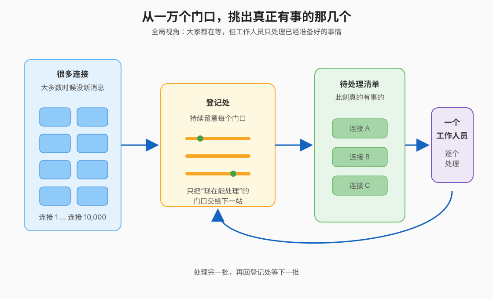
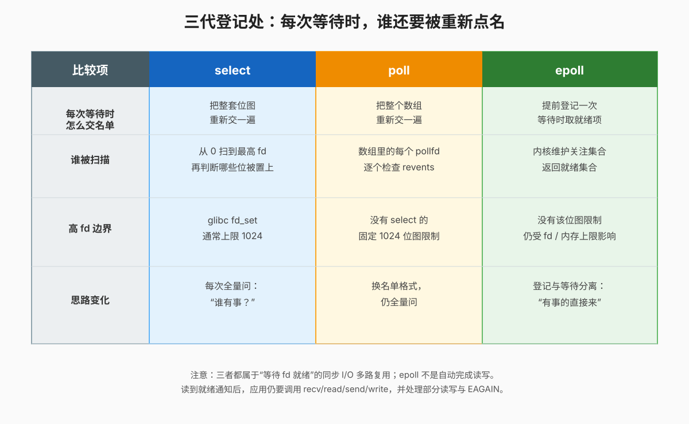
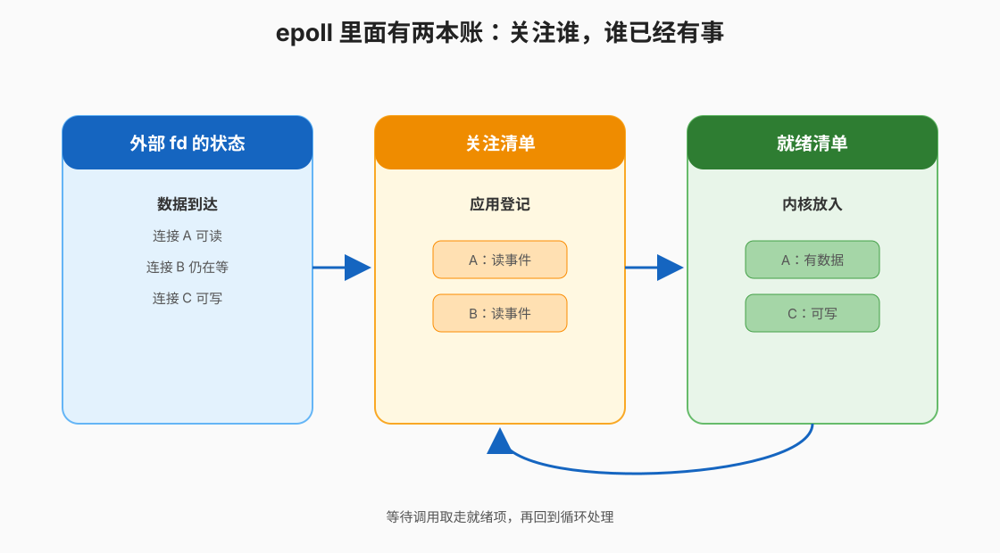
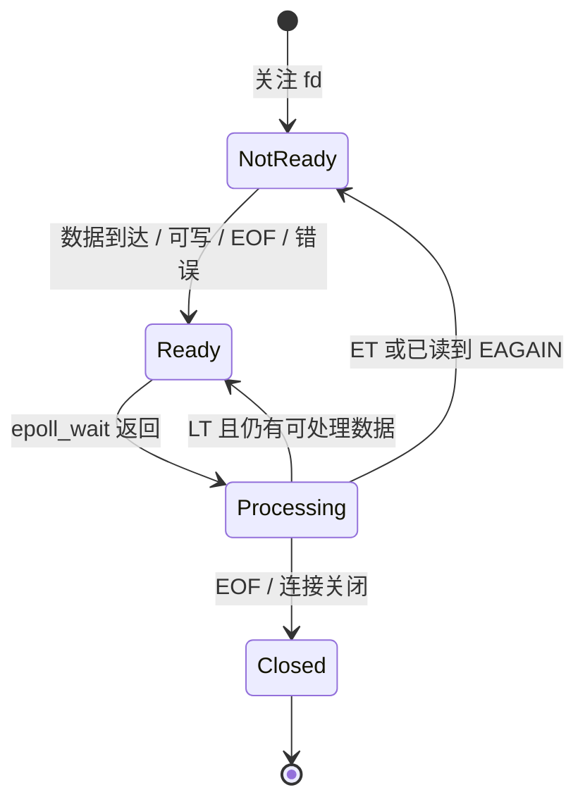
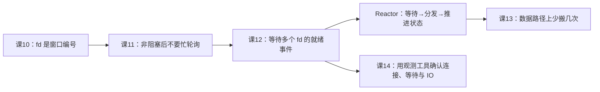

# 课 12 · epoll：一个线程看住一万个连接

> 所属阶段：阶段 4《IO 与异步》｜实操环境：Docker Linux（`python:3.13-slim`，linux/arm64）｜本课实测于 2026-09-16

> 📖 **文档核对留痕**：结论已按官方文档核对（核查于 2026-09）。本课特别收窄四处容易被旧教程带偏的口径：`select()` 的 `fd_set` 在 glibc 中通常受 `FD_SETSIZE=1024` 限制且每次调用会被原地改写；`poll()` 换成 `pollfd` 数组但仍是每次检查整张数组；`epoll` 从用户视角维护“关注集合”和“就绪集合”，不是自动替应用读写；Python `DefaultSelector` 会选择平台可用的高效实现，在本次 Linux 容器中实际为 `EpollSelector`。来源：[select(2)](https://man7.org/linux/man-pages/man2/select.2.html)、[poll(2)](https://man7.org/linux/man-pages/man2/poll.2.html)、[epoll(7)](https://man7.org/linux/man-pages/man7/epoll.7.html)、[epoll_create1(2)](https://man7.org/linux/man-pages/man2/epoll_create1.2.html)、[epoll_ctl(2)](https://man7.org/linux/man-pages/man2/epoll_ctl.2.html)、[epoll_wait(2)](https://man7.org/linux/man-pages/man2/epoll_wait.2.html)、[Python `selectors` 文档](https://docs.python.org/3/library/selectors.html)。

## 📌 知识点导航

| 编号 | 知识点 | 状态 |
|---|---|---|
| 12.1 | `select` / `poll` / `epoll`：三代登记处（面试高频） | ✅ |
| 12.2 | `epoll` 三件套与事件循环（面试高频） | ✅ |
| 12.3 | Reactor 直觉：你天天在用的东西 | ✅ |

## 🎯 本课目标

学完本课你将能：

- 说清 `select → poll → epoll` 三代接口分别解决了什么问题、又留下了什么代价；
- 讲出 `epoll_create1`、`epoll_ctl`、`epoll_wait` 三件套各自的职责；
- 用自己的话解释水平触发（Level-Triggered，LT）与边缘触发（Edge-Triggered，ET）的差异；
- 用 Python `selectors` 写出一个“等待就绪 → 分发处理 → 继续等待”的事件循环，并读懂它与 Linux `epoll` 的关系。

> ⚠️ 本课所有实验都使用一次性 `--rm` 容器，不修改宿主机的内核参数、网络配置或文件句柄上限。 `select` / `poll` / `epoll` 都是**就绪通知**模型：通知“现在做某个 I/O 不会立刻阻塞”，不等于内核替你完成了业务读写。

## 第一幕：起源与场景引入——一万个门口，为什么不能每次都挨个问

周五晚，order-service 的长连接数从 200 增到 10,000。真正同时有请求的仍只有几百条连接，其余连接都在等下一条消息。

最直觉的做法是“一个连接一个线程”。但课 11 已经算过：线程不仅要占栈地址空间，还要经历睡眠、唤醒和调度。于是工程师换了个想法：**让少数线程统一看守所有连接，只有真的能读或能写的连接才被叫醒处理。**

这条思路不是“把 `read()` 变魔法”，而是把问题拆成两步：先问“谁现在能做 I/O”，再对这些对象调用真正的 `read()` / `write()` / `recv()` / `send()`。

### 一句话本质

**`select`、`poll`、`epoll` 都是在大量 fd 中筛出“现在值得处理”的那几个；`epoll` 的关键变化是把“登记关注谁”和“这次返回谁就绪”分开。**

### 处境对照：同样是一万个连接，等待账单怎么变

| 做法 | 空闲连接发生什么 | 每轮等待的主要成本 |
|---|---|---|
| 一连接一阻塞线程 | 每个线程各自睡在自己的 `read()` | 线程栈、线程调度、唤醒与生命周期管理 |
| `select` / `poll` | 一个线程等待一张 fd 名单 | 每轮都重新带上整张名单并检查很多“不忙”的 fd |
| `epoll` | 一个线程提前登记，等待时取就绪项 | 内核维护集合、应用维护连接状态；仍要自己读写、处理半包和错误 |

> 量化锚点（**实验设定，不是性能承诺**）：本课会创建 1,100 个 pipe，并让最后一个 fd 就绪。在本次容器里，读端最大编号为 2,201；`select` 因 fd 超出位图范围失败，而 `poll` / `epoll` 都能直接返回这个就绪 fd。这个实验展示的是接口边界，不是三者的吞吐排名。

## 第二幕：认知冲突——“返回就绪”到底省掉了哪一部分工作

先暂停一下，设想事件循环正在管理 10,000 个 socket：

1. 如果每轮都把 10,000 个 fd 交给内核，内核是不是仍然要看 10,000 个？
2. `epoll_wait()` 返回一个 fd 后，数据是不是已经自动放进了应用的业务对象？
3. 如果一次只读走一半数据，下一次还应该被通知吗？

如果把“就绪通知”理解成“异步读写已经完成”，后面的 LT / ET 和事件循环都会讲反。准确的控制流是：

| 发生的事 | 内核做什么 | 应用还要做什么 |
|---|---|---|
| 注册连接 | 记住应用关心这个 fd 的哪些事件 | 保存 fd 与连接状态的对应关系 |
| 等待 | 没有事件时让等待线程睡眠；有事件时返回就绪项 | 取回事件，找到对应连接 |
| 处理 | 只提供“现在进行某类 I/O 不会立刻阻塞”的线索 | 调 `recv/read`，循环读到 `EAGAIN` 或读到 EOF，再推进业务状态 |

本课要解决的不是“哪个 API 名字最先进”，而是**为什么从全量点名，演进成提前登记、只取就绪**，以及这会把复杂度转移到哪里。

## 第三幕：层层揭示——从全量询问到就绪清单

### 一眼全局图



看图：左边是一万个连接，中间的登记处持续留意它们，右边只留下当前真的有事的几个，最后由一个工作人员处理并回到登记处继续等待。

### 本课地图

| 步骤 | 要解决什么问题 | 对应知识点 |
|---|---|---|
| 第 1 步 | 为什么“每轮全量询问”会浪费，以及三代接口怎样换思路 | 12.1 `select` / `poll` / `epoll`：三代登记处 |
| 第 2 步 | 怎样创建、登记、等待，并避免 LT / ET 把事件循环卡住 | 12.2 `epoll` 三件套与事件循环 |
| 第 3 步 | 把“等待 + 分发 + 状态推进”收束成可迁移的架构直觉 | 12.3 Reactor 直觉 |

### 知识点 12.1：`select` / `poll` / `epoll`：三代登记处（面试高频）

🧭 **第 1/3 步｜承接**：课 11 留下了“非阻塞后不能忙轮询”的问题 → 本步：找一个能睡眠等待、又能告诉我们“谁值得重试”的机制。

#### 一句话定义

**I/O 多路复用（I/O Multiplexing）让一个线程同时等待多个 fd 的就绪状态；`select`、`poll`、`epoll` 的差别主要在“名单怎么交给内核、每轮怎么找到就绪项”。**

这里的“就绪”对应官方文档的 ready：对请求的操作现在不会阻塞。它不是“业务消息完整”，也不是“应用缓冲区已经填好”。

#### 直觉建立：三代登记处

想象你管理一栋有 10,000 个房间的酒店：

- `select`：每次把一张固定大小的勾选表交给前台，前台检查后在原表上擦掉没事的房间；
- `poll`：把勾选表换成一摞结构化卡片，卡片数量不再受那张固定位图的 1,024 位限制，但前台每次仍要翻看整摞卡片；
- `epoll`：入住时登记一次，房间有事时被放入“待处理清单”，你等待时直接取清单。

类比的边界：真正的 fd 可能是 socket、pipe 或其他支持就绪语义的对象；普通文件通常被视为随时可读写，不能用这三种接口推断“磁盘一定快”。“前台检查了什么数据结构”是实现和接口协作的结果，不应把酒店类比当成 Linux 内核源码的逐字段承诺。

#### 核心原理：三次换挡，三种账单

**第一代：`select`——固定位图 + 每轮全量检查。**

`select()` 通过 `fd_set` 表示关注的读、写和异常条件；它的 `nfds` 表示检查到的最高 fd 加 1。官方 man page 明确警告：glibc 的 `fd_set` 通常受 `FD_SETSIZE=1024` 限制，fd 编号超过 1,023 就不适合放进这套位图。

还有一个很容易漏掉的细节：`select()` 返回时会**原地改写**这些集合，只留下当前就绪的 fd。因此循环调用时必须重新初始化集合；否则第二轮拿到的不是完整关注名单。

**第二代：`poll`——结构化数组 + 每轮仍扫描。**

`poll()` 的输入是 `pollfd` 数组：

```c
struct pollfd {
    int   fd;       /* 要关注的文件描述符 */
    short events;   /* 应用想关注的事件 */
    short revents;  /* 内核实际发现的事件 */
};
```

它摆脱了 `select` 那张固定大小位图的 1,024 fd 编号限制，但应用每次仍然把整个数组交给内核；内核也要逐项检查并填写 `revents`。所以 `poll` 解决了“高 fd / 固定位图”的问题，却没有从根本上消除“每轮全量扫描”的工作。

**第三代：`epoll`——关注集合 + 就绪集合。**

官方 `epoll(7)` 用两个集合解释它的核心：

1. **interest list（关注集合）**：应用登记想监控哪些 fd、哪些事件；
2. **ready list（就绪集合）**：内核根据 I/O 活动动态放入当前就绪的 fd。

这就是“登记一次，等待时取就绪项”的思路。经典资料常把内核实现简写为“红黑树 + 就绪链表”；学习 API 时更稳妥的记法是官方对外可观察的“关注集合 + 就绪集合”，不要把某个内核版本的内部数据结构当成 API 契约。



看图：三列分别展示名单的形态、每轮被检查的对象和思路变化；`select` / `poll` 仍偏向“全量问”，`epoll` 才把关注与就绪分开。

| 接口 | 应用交给内核的主要东西 | 每轮的主要工作 | 解决了什么 | 仍付出的代价 |
|---|---|---|---|---|
| `select` | `fd_set` 位图 | 检查到 `nfds`，返回时改写集合 | 早期多 fd 等待 | fd 编号通常不能超过 1,023；集合要反复重建 |
| `poll` | `pollfd[]` 数组 | 扫描数组并填写 `revents` | 去掉固定位图边界 | 每轮仍是 O(n) 级别的全量检查 |
| `epoll` | 关注集合中的注册项 | 等待并取就绪集合 | 关注与就绪分离，适合大量 fd | Linux 专属；应用要管理状态、生命周期、半包和背压 |

> **重要边界**：`epoll` 不是异步完成接口。它只告诉你“某个 fd 现在值得尝试 I/O”；应用仍要调用 `read` / `recv` / `write` / `send`，并处理部分读写、EOF、错误和 `EAGAIN`。

#### 示例演示：1,100 个 pipe 的高 fd 对照

```bash
docker run --rm -i --platform linux/arm64 python:3.13-slim \\
  python3 -u - <<'PY'
import os
import select

pipes = [os.pipe() for _ in range(1100)]
readers = [r for r, _ in pipes]
os.write(pipes[-1][1], b'X')

print('pipe_count=', len(pipes))
print('max_read_fd=', max(readers))
try:
    ready, _, _ = select.select(readers, [], [], 0)
    print('select_ready=', [fd for fd in ready[-3:]])
except (ValueError, OSError) as exc:
    print('select_error=', type(exc).__name__, str(exc))

poller = select.poll()
for fd in readers:
    poller.register(fd, select.POLLIN)
print('poll_ready=', poller.poll(0)[-1][0])

epoller = select.epoll()
for fd in readers:
    epoller.register(fd, select.EPOLLIN)
print('epoll_ready=', epoller.poll(0)[-1][0])

epoller.close()
for r, w in pipes:
    os.close(r)
    os.close(w)
PY
```

本次实测输出：

```text
pipe_count= 1100
max_read_fd= 2201
select_error= ValueError filedescriptor out of range in select()
poll_ready= 2201
epoll_ready= 2201
```

这里的 `ValueError` 是 Python 对底层 fd 范围限制的包装表现；它不是“select 代码写错了”，而是这个 fd 编号无法放进当前 `fd_set`。 `poll` 和 `epoll` 找到的是同一个就绪 pipe，证明本实验只改变了“如何等待”，没有改变“谁真正有数据”。

#### 常见误区

| 误区 | 修正 |
|---|---|
| `poll` 没有 1,024 限制，所以它和 `epoll` 一样快 | `poll` 解决的是位图边界，通常仍需每轮扫描整张数组；规模、就绪比例和实现细节都会影响真实表现 |
| `epoll` 返回就代表数据已经被读完 | 返回的是就绪事件；数据多少、是否完整、是否 EOF 都要由应用继续读判断 |
| `select` 返回后集合还是原来的关注集合 | 官方语义是集合会被原地改写，循环中要重建 |
| 所有 fd 都适合用 epoll 监控 | 普通文件的“随时可读写”语义、设备和特殊 fd 的支持情况不同，先看对象的就绪语义 |

#### 一句话记住

**`select` 是每轮带着位图全问，`poll` 是每轮带着数组全问，`epoll` 是提前登记、每轮只取有事的。**

#### 行话锚定：回工作现场怎么认

| 本课说法（人话） | 行业标准叫法 | 典型配置 / 在哪遇到 | 代价 |
|---|---|---|---|
| 固定位图点名 | `select()` / `fd_set` | C 网络程序、`FD_SET` / `FD_ISSET` | `FD_SETSIZE` 边界、集合原地改写、每轮检查 |
| 数组卡片点名 | `poll()` / `pollfd` / `events` / `revents` | POSIX/Linux socket 代码 | 数组仍需逐项检查 |
| 登记一次后取就绪 | `epoll(7)` / interest list / ready list | Linux 服务端、Python `selectors`、高并发网络库 | Linux 专属；状态机和生命周期复杂度转给应用 |

#### 📚 官方文档

- [`select(2)`](https://man7.org/linux/man-pages/man2/select.2.html)：`fd_set`、`FD_SETSIZE`、原地改写集合与 ready 语义。
- [`poll(2)`](https://man7.org/linux/man-pages/man2/poll.2.html)：`pollfd`、`events` / `revents` 与等待语义。
- [`epoll(7)`](https://man7.org/linux/man-pages/man7/epoll.7.html)：interest list、ready list 与 LT / ET。

### 知识点 12.2：`epoll` 三件套与事件循环（面试高频）

🧭 **第 2/3 步｜承接**：12.1 解决了“不要每轮全量询问”的问题 → 本步：把“登记、等待、处理”落成一条可运行的控制流，并处理事件重复通知的边界。

#### 一句话定义

**`epoll` 三件套把一个事件循环拆成：创建一个 epoll 实例、用 `epoll_ctl` 管理关注项、用 `epoll_wait` 取回就绪事件。**

#### 直觉建立：借书登记、到货通知、取书处理

把它想成图书馆：

- `epoll_create1`：开一个“待通知窗口”；
- `epoll_ctl(ADD/MOD/DEL)`：登记、修改或取消某本书的到货关注；
- `epoll_wait`：没有书到时就等，有书到时拿到“哪几本到了”的清单；
- `recv/read/write`：真正去取书或放书，`epoll_wait` 不替你完成这一步。

类比的边界：fd 关闭、连接半关闭、错误和事件重复通知都有精确 API 语义；“书到了”只对应 ready，不对应业务消息已经完整解析。尤其 ET 模式下，应用必须自己把当前能做的 I/O 尽量做完。

#### 核心原理：三件套 + 两种触发方式

**第一件：`epoll_create1` 创建实例。**

它返回一个新的 fd，后续所有 `epoll_ctl` / `epoll_wait` 都围绕这个 epoll fd 进行。 `epoll_create1(EPOLL_CLOEXEC)` 还可以在创建时设置 close-on-exec；本课只用 `flags=0`，避免把 fd 生命周期问题和触发模式混在一起。

**第二件：`epoll_ctl` 管理关注集合。**

三种操作对应三种生命周期动作：

| 操作 | 人话 | 常见时机 |
|---|---|---|
| `EPOLL_CTL_ADD` | 把 fd 加入关注集合 | 新连接建立、pipe/socket 准备好 |
| `EPOLL_CTL_MOD` | 修改关注事件或附带数据 | 从只读切换为读写、更新连接状态 |
| `EPOLL_CTL_DEL` | 从关注集合移除 | 连接关闭、对象不再使用 |

`struct epoll_event` 的 `events` 是事件位掩码，例如 `EPOLLIN` 表示可读；`data` 是应用让内核保存并在返回时带回的数据，常用来关联 fd 或连接对象。

**第三件：`epoll_wait` 取回就绪集合。**

没有事件时，调用线程可以阻塞等待；有事件、信号中断或超时则返回。返回事件里的 `data` 来自最近一次 `epoll_ctl(ADD/MOD)` 设置的值，应用借此找到对应的连接状态。

**LT：默认、只要条件仍成立就继续提醒。**

如果 pipe 里还有数据，下一次 `epoll_wait` 仍可能返回它。它更像“只要门口还有人，就继续叫号”，实现直观，适合先建立正确性。

**ET：只在状态发生变化时提醒。**

如果一次写入 2 KiB，第一次 `epoll_wait` 返回后应用只读 1 KiB，剩余 1 KiB 仍在缓冲区；但下一次不一定有新的边沿事件。官方建议 ET 配合非阻塞 fd，并持续读/写到 `EAGAIN`，再回到 `epoll_wait`。



看图：左边是外部 fd 的状态，中间是应用登记的关注集合，右边是内核动态生成的就绪集合；事件循环从右边取走就绪项后继续等待。



看图：事件循环从“等待”进入“处理”；LT 在条件仍成立时回到 Ready，ET 通常要求应用处理到 `EAGAIN` 才重新等待。

#### 示例演示：同一根 pipe，LT 与 ET 的第二次通知

```bash
docker run --rm -i --platform linux/arm64 python:3.13-slim \\
  python3 -u - <<'PY'
import os
import select

for name, flags in [('LT', select.EPOLLIN),
                    ('ET', select.EPOLLIN | select.EPOLLET)]:
    read_fd, write_fd = os.pipe()
    os.set_blocking(read_fd, False)
    ep = select.epoll()
    ep.register(read_fd, flags)
    os.write(write_fd, b'X' * 2048)
    first = ep.poll(0)
    os.read(read_fd, 1024)
    second = ep.poll(0)
    print(f'mode={name} first_events={len(first)} '
          f'second_events={len(second)} remaining_bytes=1024')
    ep.unregister(read_fd)
    ep.close()
    os.close(read_fd)
    os.close(write_fd)
PY
```

本次实测输出：

```text
mode=LT first_events=1 second_events=1 remaining_bytes=1024
mode=ET first_events=1 second_events=0 remaining_bytes=1024
```

这不是说 ET 把剩余数据丢了；数据还在，只是“状态没有再次从不可读变成可读”，所以没有新边沿。ET 的正确动作不是“收到一次只读一次”，而是**非阻塞地持续读到 `EAGAIN`，保存尚未完成的连接状态，再等待下一次事件**。

#### 示例演示：Python `selectors` 把平台差异藏在标准库后面

Python 的 `selectors.DefaultSelector` 会选择当前平台可用的高效实现；本次 Linux 容器实测，它是 `EpollSelector`。 `register()` 保存 fd、事件掩码和附带数据，`select()` 返回 `(SelectorKey, mask)`，应用再调用真正的 `recv()`。

```python
import selectors
import socket

left, right = socket.socketpair()
left.setblocking(False)
right.setblocking(False)

with selectors.DefaultSelector() as selector:
    selector.register(left, selectors.EVENT_READ, data='client-A')
    right.sendall(b'hello')

    for key, mask in selector.select(timeout=1):
        if mask & selectors.EVENT_READ:
            payload = key.fileobj.recv(4096)
            print(key.data, payload)

left.close()
right.close()
```

本次容器实测输出：

```text
selector_type= EpollSelector
selector_fd= 5
ready_count= 1
ready_fd= 3
ready_data= client-A
mask_is_read= True
payload= b'hello'
```

`selector_fd=5` 是本次进程里 epoll 实例的 fd；`ready_fd=3` 是被监控的 socket fd。编号会因进程启动时打开了哪些 fd 而变化，不能把 5 和 3 当固定答案。

#### 常见误区

| 误区 | 修正 |
|---|---|
| `epoll_wait` 返回后就不用再 `recv` | 仍要自己读取；通知只是就绪线索 |
| ET 比 LT 自动更快，拿来就换 | ET 减少重复通知，但状态机、非阻塞读写和 `EAGAIN` 处理更复杂；先用 LT 建正确性更稳妥 |
| `selectors` 就是“内核异步完成” | 它是 Python 对就绪多路复用的抽象；本次平台落到了 epoll readiness，不是 completion queue |
| 连接关闭只要 `unregister` 就够了 | 还要关闭 socket、清理连接状态；生产代码还需处理 EOF、错误、超时和未发送完的数据 |

#### 一句话记住

**`create` 开窗口，`ctl` 管关注，`wait` 拿就绪；LT 只要还有事就继续提醒，ET 只在变化时提醒并要求你处理到 `EAGAIN`。**

#### 行话锚定：三件套和触发模式

| 本课说法（人话） | 行业标准叫法 | 典型配置 / 在哪遇到 | 代价 |
|---|---|---|---|
| 开一个等待窗口 | `epoll_create1()` / `EPOLL_CLOEXEC` | Linux fd 生命周期、`strace` 的 `epoll_create1` | 多一个需要关闭的 epoll fd |
| 管关注名单 | `epoll_ctl()` / `EPOLL_CTL_ADD` / `MOD` / `DEL` | 新连接、事件切换、连接清理 | 注册状态和对象生命周期要一致 |
| 取当前就绪项 | `epoll_wait()` / `epoll_pwait()` | 事件循环阻塞点、`strace` | 超时、信号、返回事件数都要处理 |
| 条件还在就继续提醒 | Level-Triggered（LT） | 默认 epoll 行为 | 可能重复返回同一 fd，代码较直观 |
| 只在变化时提醒 | Edge-Triggered（ET）/ `EPOLLET` | 高性能事件循环、非阻塞 fd | 必须读写到 `EAGAIN`，状态机更复杂 |

#### 📚 官方文档

- [`epoll(7)`](https://man7.org/linux/man-pages/man7/epoll.7.html)：实例、关注集合、就绪集合与 LT / ET 的完整说明。
- [`epoll_create1(2)`](https://man7.org/linux/man-pages/man2/epoll_create1.2.html)：创建 epoll 实例并返回 fd。
- [`epoll_ctl(2)`](https://man7.org/linux/man-pages/man2/epoll_ctl.2.html)：`ADD` / `MOD` / `DEL` 与 `data` 关联。
- [`epoll_wait(2)`](https://man7.org/linux/man-pages/man2/epoll_wait.2.html)：取回就绪事件；无事件时阻塞。
- [Python `selectors`](https://docs.python.org/3/library/selectors.html)：`DefaultSelector`、`register`、`SelectorKey` 与事件掩码。

### 知识点 12.3：Reactor 直觉：你天天在用的东西

🧭 **第 3/3 步｜承接**：12.2 已能拿到就绪 fd → 本步：把“等待、分发、状态推进、再次等待”抽象成服务端架构骨架，并看清它不等于“所有工作都塞进一个线程”。

#### 一句话定义

**Reactor（反应器）是一种事件驱动结构：事件循环等待就绪事件，把事件分发给对应处理器，处理器推进连接状态，然后循环等待下一批事件。**

“一个线程看住一万个连接”说的是**一个线程负责等待和分发**，不是说一个线程必须完成所有 CPU 计算、数据库访问和文件处理。

#### 直觉建立：总机不是每个部门

把服务器想成一个总机：

1. 总机等电话进来；
2. 看来电号码和事件类型；
3. 把电话转给对应分机；
4. 分机处理一小段工作，留下“下一步做到哪”的记录；
5. 总机继续接下一通电话。

类比的边界：真实连接可能有半包、写缓冲、超时、取消、背压和跨线程交接；处理器不能在事件循环线程里长时间做阻塞数据库调用，否则“总机”自己也接不了别的电话。

#### 核心原理：四块骨架

一个最小 Reactor 可以写成下面的伪代码：

```text
创建监听 socket，并设置为非阻塞
创建 epoll 实例
把监听 socket 注册为“可读”

while 服务运行:
    就绪事件 = 等待事件
    for 事件 in 就绪事件:
        if 事件是监听 socket:
            循环 accept，直到 EAGAIN
            新连接设为非阻塞并注册为“可读”
        else:
            连接状态 = 从事件数据找到连接
            读取，直到 EAGAIN；推进协议解析状态
            如果有待发送数据：关注“可写”
            如果发送完成：取消“可写”关注
            如果 EOF / 错误：注销、关闭、释放状态
```

它有四个稳定角色：

| 角色 | 负责什么 | 不能偷懒的地方 |
|---|---|---|
| 等待器 | 阻塞等待就绪事件 | 超时、信号和返回值 |
| 分发器 | 根据 fd / `data` 找处理器 | fd 生命周期和状态映射 |
| 连接状态 | 保存半包、待发送数据、协议阶段 | 不能只依赖一次 `recv` |
| 工作执行器 | 做 CPU 密集或阻塞外部调用 | 不能长时间堵住事件循环 |

#### 反例对照：看起来能跑的 ET 代码为什么会“偶尔卡住”

**坏版本：收到一次事件，只读一次。**

```python
# 反例：ET 模式下只读一次，剩余数据可能永远等不到新边沿
events = epoll.poll()
for fd, mask in events:
    if mask & select.EPOLLIN:
        chunk = os.read(fd, 4096)
        handle(chunk)
```

它在小消息测试里可能完全正常；但如果一次到达 8 KiB、缓冲区只读出 4 KiB，剩余数据仍在 fd 内，却未必再触发边沿。

**改进版本：非阻塞地读到 `EAGAIN`，状态不完整就保存。**

```python
import errno

def drain_readable(fd, state):
    while True:
        try:
            chunk = os.read(fd, 4096)
        except BlockingIOError as exc:
            if exc.errno in (errno.EAGAIN, errno.EWOULDBLOCK):
                break
            raise
        if not chunk:                 # EOF
            state.closed = True
            break
        state.input_buffer.extend(chunk)
        state.advance_protocol()
```

这仍然不是完整生产服务器：还需要处理 `EINTR`、写缓冲、超时、取消、连接上限和错误隔离。但它体现了 ET 的关键纪律：**把“事件通知”当成开始处理的入口，把“处理到暂时做不了”为止当成一次处理单元。**

#### 示例演示：一个事件循环如何和真实 fd 对上

下面这段不是新的框架 API，而是把三件套的控制流压缩成 Python 标准库能运行的最小模型：

```python
import selectors
import socket

selector = selectors.DefaultSelector()
listener = socket.socket()
listener.setsockopt(socket.SOL_SOCKET, socket.SO_REUSEADDR, 1)
listener.bind(('127.0.0.1', 0))
listener.listen()
listener.setblocking(False)
selector.register(listener, selectors.EVENT_READ, data='acceptor')

try:
    while True:
        for key, mask in selector.select(timeout=1):
            if key.data == 'acceptor':
                connection, address = listener.accept()
                connection.setblocking(False)
                selector.register(connection, selectors.EVENT_READ,
                                  data={'peer': address})
            elif mask & selectors.EVENT_READ:
                data = key.fileobj.recv(4096)
                if data:
                    key.fileobj.sendall(data)  # 示例：回显
                else:
                    selector.unregister(key.fileobj)
                    key.fileobj.close()
finally:
    selector.close()
    listener.close()
```

这个例子为了突出骨架，省略了写缓冲、部分 `send`、协议解析和优雅退出；不要把它直接当生产服务器。它真正展示的是：监听 fd 和连接 fd 共用一个等待器；事件返回后按 `data` 分支；连接关闭时必须注销并关闭。

#### 场景决策：为什么“一个 Reactor”不等于“所有工作单线程”

| 场景 | 事件循环适合做什么 | 需要移走的工作 | 典型选择 |
|---|---|---|---|
| 10,000 条长连接、每条消息很小 | 等待连接、收包、协议状态推进 | CPU 密集计算、阻塞 DB / 文件 API | 一个或多个 Reactor + 有界工作池 |
| 20 条连接、每个请求都要复杂阻塞调用 | 等待收益有限，业务代码更重要 | 主要风险是并发失控而非 fd 扫描 | 有界线程池 + 阻塞 I/O，先保可维护性 |
| 连接多且部分操作可能阻塞 | 网络 I/O 用 Reactor | 阻塞客户端调用交给专门池 | 混合模型：事件循环、CPU 池、阻塞 I/O 池分工 |

决策口诀：**连接规模和空闲比例决定“等待方式”的收益；业务操作是否阻塞决定“执行工作”要不要离开事件循环。** 这也是课 11 的四象限和本课 Reactor 的连接点。

#### 常见误区

| 误区 | 修正 |
|---|---|
| Reactor = 单线程服务器 | 单线程是常见形态，不是定义；可以有多个 Reactor、多个分发线程或工作池 |
| 使用 epoll 后就能处理任意阻塞工作 | epoll 只管理被监控 fd 的就绪；阻塞 DB 客户端、复杂文件调用仍可能卡住当前线程 |
| 事件循环只要 `while True` 就完成了 | 还要有 fd→状态映射、读写缓冲、超时、注销、错误处理和背压 |
| 连接数越多越应该把所有代码改成 ET | ET 的收益和复杂度要结合负载、库支持、团队经验与正确性风险评估；LT 可能是更稳的选择 |

#### 一句话记住

**Reactor 不是一种神奇线程模型，而是一副骨架：等待就绪、分发事件、推进状态、再等待；真正耗时的工作要另找执行位置。**

#### 行话锚定：从课内骨架对到工程名词

| 本课说法（人话） | 行业标准叫法 | 典型配置 / 在哪遇到 | 代价 |
|---|---|---|---|
| 总机等待并分发 | Reactor / event loop / event dispatcher | Nginx、Redis、Node.js、Python asyncio 底层事件循环 | 回调或状态机复杂度、单线程长任务风险 |
| fd 有事才处理 | readiness notification / I/O multiplexing | `epoll_wait`、`selectors.select`、socket 事件 | 不是完成通知，应用仍要读写 |
| 保存做到哪一步 | connection state / protocol state machine | 半包解析、写缓冲、HTTP/TCP 协议处理 | 状态数量增多，测试要求更高 |
| 把慢工作移走 | worker pool / bounded executor | CPU 线程池、阻塞 I/O 专用池 | 队列、背压、线程池大小和结果回传要管理 |

#### 📚 官方文档

- [`epoll(7)`](https://man7.org/linux/man-pages/man7/epoll.7.html)：事件循环、就绪集合与 ET 建议用法。
- [Python `selectors`](https://docs.python.org/3/library/selectors.html)：多 fd readiness 抽象与 `DefaultSelector`。
- 课 11 的 [非阻塞 I/O 与 EAGAIN](lesson-11-同步异步与阻塞非阻塞IO的四象限.md)：本课 Reactor 状态推进的前置概念。

## 第四幕：实操验证——从 fd 边界到一个真实事件循环

### 4.1 机制验证 1：高 fd 上，三代接口返回什么

如果你只想复现 12.1 的核心差异，运行第一知识点中的 1,100 pipe 命令即可。重点观察：

- `select` 的失败点不是“没有事件”，而是 fd 编号无法进入 `fd_set`；
- `poll` / `epoll` 都返回 `2201`，说明最后一个 pipe 的可读事件被找到；
- 这里的 `2201` 是本次进程的 fd 编号，不是 API 保证的固定值。

### 4.2 机制验证 2：LT / ET 的剩余数据

运行 12.2 的 pipe 命令，确认同一批 2,048 字节只读 1,024 字节后：

```text
mode=LT first_events=1 second_events=1 remaining_bytes=1024
mode=ET first_events=1 second_events=0 remaining_bytes=1024
```

然后把实验改成下面的思考题：如果 ET 分支把 `os.read()` 放进循环，并在读到 `EAGAIN` 时退出，第二次 `epoll.poll(0)` 的行为会怎样？答案不是“数据消失”，而是“应用已经把当前能读的内容排空，后续等待新边沿”。

### 4.3 机制验证 3：`selectors` 的实际后端与系统调用

先运行标准库事件循环实验，确认 `DefaultSelector` 和返回的 `SelectorKey`：

```bash
docker run --rm -i --platform linux/arm64 python:3.13-slim \\
  python3 -u - <<'PY'
import selectors
import socket

left, right = socket.socketpair()
left.setblocking(False)
right.setblocking(False)
selector = selectors.DefaultSelector()
selector.register(left, selectors.EVENT_READ, data='client-A')
print('selector_type=', type(selector).__name__)
print('selector_fd=', selector.fileno())
right.sendall(b'hello')
events = selector.select(timeout=1)
print('ready_count=', len(events))
key, mask = events[0]
print('ready_fd=', key.fd)
print('ready_data=', key.data)
print('mask_is_read=', bool(mask & selectors.EVENT_READ))
print('payload=', key.fileobj.recv(5))
selector.unregister(left)
selector.close()
left.close()
right.close()
PY
```

本次实测输出：

```text
selector_type= EpollSelector
selector_fd= 5
ready_count= 1
ready_fd= 3
ready_data= client-A
mask_is_read= True
payload= b'hello'
```

若还要看系统调用边界，可以在一次性容器里临时安装 `strace`；安装发生在容器内部，容器退出后即丢弃：

```bash
docker run --rm -i --platform linux/arm64 python:3.13-slim sh -s <<'SH'
set -e
apt-get update -qq
DEBIAN_FRONTEND=noninteractive apt-get install -y -qq --no-install-recommends strace >/dev/null
strace -f -e trace=epoll_create1,epoll_ctl,epoll_wait,epoll_pwait,epoll_pwait2 \\
  python3 -u - <<'PY'
import selectors
import socket
import threading
import time

left, right = socket.socketpair()
left.setblocking(False)
selector = selectors.DefaultSelector()
selector.register(left, selectors.EVENT_READ, data='client-A')

def write_later():
    time.sleep(0.05)
    right.sendall(b'event')

threading.Thread(target=write_later, daemon=True).start()
key, mask = selector.select(timeout=1)[0]
print('event_loop_payload=', key.fileobj.recv(5))
selector.unregister(left)
selector.close()
left.close()
right.close()
PY
SH
```

本次实测的关键输出：

```text
epoll_create1(EPOLL_CLOEXEC)            = 3
epoll_create1(EPOLL_CLOEXEC)            = 5
epoll_ctl(5, EPOLL_CTL_ADD, 3, {events=EPOLLIN, data=0xffff00000003}) = 0
[pid    58] epoll_pwait(5, [{events=EPOLLIN, data=0xffff00000003}], 1, 1000, NULL, 8) = 1
event_loop_payload= b'event'
epoll_ctl(5, EPOLL_CTL_DEL, 3, ...)
```

地址和进程号会变化，省略号表示本次输出中的指针细节。这里有一个很有价值的边界：Python 这次没有直接显示 `epoll_wait`，而是调用了 `epoll_pwait`；不要把“某语言标准库的等待调用名称”硬编码成唯一实现，先看实际 trace 和官方文档对两者关系的说明。

### 4.4 回到 order-service：现在应该怎样观察

当线上看到“连接数很多但 CPU 不高”时，可以按下面顺序建立假设：

```bash
# 1. 先看进程和线程：是不是线程模型本身已经膨胀
ps -eLo pid,tid,stat,wchan:24,comm --sort=stat

# 2. 看 fd 数量：连接是否真的被一个进程持有
ls /proc/<PID>/fd | wc -l

# 3. 看 socket 状态：连接是 ESTABLISHED、等待还是异常关闭
ss -tanp

# 4. 看系统级等待与切换窗口
vmstat 1

# 5. 若程序使用事件循环，用 strace 观察等待/注册/读写边界
strace -f -e trace=epoll_ctl,epoll_wait,epoll_pwait,read,recvfrom,write,sendto -p <PID>
```

读法是：先把“连接多”与“线程多”分开，再把“等待器就绪”与“业务处理变慢”分开。 `epoll` 能减少空闲 fd 的等待检查，不会自动解决 CPU 密集逻辑、阻塞数据库、发送缓冲堆积或连接泄漏。

## 第五幕：体系收束——把三代接口放回整门课

现在把阶段 4 的链条串起来：



这张图的重点不是背 API，而是理解边界：

- 课 10 让你知道“连接、pipe、epoll 实例本身都通过 fd 进入进程”；
- 课 11 让你知道“非阻塞只是调用更快返回，不会自动通知你何时再试”；
- 课 12 给出就绪通知和事件循环，把“何时再试”交给内核等待器；
- 课 13 接下来追问“数据从文件到网卡到底搬了几次”；
- 课 14 再用 `ss`、`vmstat`、`iostat` 和 `strace` 判断瓶颈究竟在连接、CPU、等待还是数据搬运。

### 三句话收束

1. **`select` / `poll` / `epoll` 都是 readiness，不是 completion。**
2. **`epoll` 的核心不是名字，而是关注集合与就绪集合分离。**
3. **Reactor 的核心不是“单线程”，而是等待、分发、状态推进和再次等待。**

### 🐞 课后小测

<details>
<summary>问题 1：为什么 poll 没有 select 的 1024 fd 编号限制，却仍可能在大量连接下有扫描成本？</summary>

因为 `poll` 使用可变长度的 `pollfd` 数组，解决了固定大小 `fd_set` 的编号边界；但每次 `poll()` 仍把整张数组交给内核，内核通常要逐项检查并填写 `revents`，所以全量扫描成本仍在。
</details>

<details>
<summary>问题 2：ET 模式下，2 KiB 数据到达后只读 1 KiB，为什么下一次可能收不到事件？</summary>

因为 ET 只在状态变化时通知。第一次到达产生了从“不可读”到“可读”的边沿；只读一半后仍是“可读”，没有新边沿。正确做法是把 fd 设为非阻塞并持续读到 `EAGAIN`，同时保存尚未完成的协议状态。
</details>

<details>
<summary>问题 3：一个线程使用 epoll，就意味着所有业务代码必须在这个线程完成吗？</summary>

不意味着。这个线程适合做等待、分发和短小的状态推进；CPU 密集计算、阻塞数据库或阻塞文件调用应根据场景交给有界工作池或专用执行器，否则事件循环会被长任务堵住，其他连接也无法及时得到处理。
</details>

### 📋 命令与 API 速查卡

| 命令 / API | 用途 | 关键坑 |
|---|---|---|
| `select.select()` / `select(2)` | 通过 `fd_set` 等待读、写、异常就绪 | glibc `FD_SETSIZE` 通常为 1,024；集合返回后被改写 |
| `select.poll()` / `poll(2)` | 通过 `pollfd[]` 等待事件 | 没有固定位图限制，但每轮仍可能全量扫描 |
| `select.epoll()` | Python 直接创建 Linux epoll 对象 | Linux 专属；记得关闭并注销 fd |
| `epoll_create1` | 创建 epoll 实例并得到 epoll fd | epoll fd 自己也是 fd，受句柄上限影响 |
| `epoll_ctl(ADD/MOD/DEL)` | 管理关注集合 | fd 生命周期、事件掩码和 `data` 必须同步 |
| `epoll_wait` / `epoll_pwait` | 取回就绪事件 | 无事件时会阻塞；处理超时、信号和返回值 |
| `selectors.DefaultSelector` | Python 跨平台 readiness 抽象 | 当前平台实现可能不同；本 Linux 容器为 `EpollSelector` |
| `EPOLLIN` / `EPOLLOUT` | 可读 / 可写关注事件 | 可写不等于业务消息可写完，大写入仍可能部分完成 |
| `EPOLLET` | 边缘触发 | 非阻塞 fd，读写到 `EAGAIN`；不能只读一次 |
| `ss -tanp` | 看 socket 连接状态 | 需要匹配正确 PID / 权限，连接数不等于请求数 |
| `strace -e epoll_ctl,epoll_wait,epoll_pwait` | 看事件循环注册与等待 | 系统调用输出中的 fd / 地址 / PID 是动态值 |
| `vmstat 1` | 观察 runnable、阻塞、切换和 IO 等待窗口 | Docker Desktop 容器看到的是共享 Linux VM 的统计 |

### 🧭 课程导航

- 上一课：[课 11《同步异步 × 阻塞非阻塞：IO 的四象限》](lesson-11-同步异步与阻塞非阻塞IO的四象限.md)
- 下一课：[课 13《零拷贝与 DMA：数据少搬一次就快一分》](lesson-13-零拷贝与DMA数据少搬一次就快一分.md)
- 返回目录：[02-课程目录](../../../02-课程目录.md)

## 🚀 下一批接力提示词

> 学完本课后，**复制下面这段文字发给 AI**，即可无缝进入下一批：

```text
继续学 Linux 操作系统基础。我的学习档案在 operating-system/00-学习档案.md，
刚学完阶段 4《IO 与异步》的课 12《epoll：一个线程看住一万个连接》知识点 12.1、12.2、12.3，
请按大纲继续讲解课 13《零拷贝与 DMA：数据少搬一次就快一分》（13.1 一次文件下载，数据搬了几次家 / 13.2 mmap 与 sendfile：省一次是一次 / 13.3 值不值得上：零拷贝的决策边界）。
```
