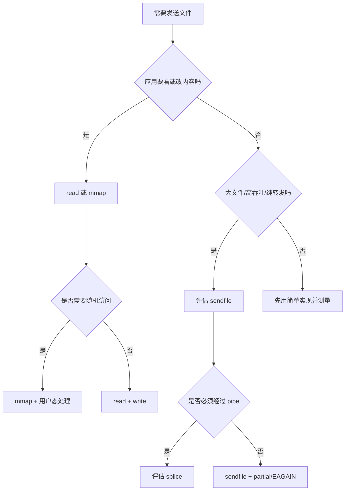
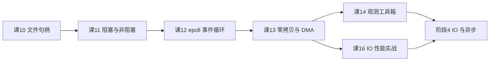

# 课 13 · 零拷贝与 DMA：数据少搬一次就快一分

> 阶段 4 · IO 与异步 ｜知识点 13.1、13.2、13.3 ｜更新于 2026-09-16

## 本课在故事主线中的情节定位

上一课，我们让一个线程用 `epoll` 看住一万个连接。现在问题换了：连接已经很多，但每个连接都在下载文件。如果每个字节都要在内核和用户程序之间来回搬家，线程少了，搬运工却没有少。

本课要回答的不是“零拷贝是不是更快”这一句口号，而是：

> 这份数据有没有必要进入用户态？如果没有，能不能让它少经过一次 CPU 拷贝？

> 📖 **文档核对留痕**：结论已按官方文档核对（核查于 2026-09）。本课特别收窄“DMA = 零拷贝”“sendfile 一次必定发完”“mmap 等于整文件装入内存”三处常见误解。来源：[mmap(2)](https://man7.org/linux/man-pages/man2/mmap.2.html)、[sendfile(2)](https://man7.org/linux/man-pages/man2/sendfile.2.html)、[splice(2)](https://man7.org/linux/man-pages/man2/splice.2.html)、[Linux DMA API HOWTO](https://docs.kernel.org/core-api/dma-api-howto.html)、[Python os.sendfile](https://docs.python.org/3/library/os.html#os.sendfile)。

## 📌 知识点导航

| 知识点 | 状态 | 学完后的能力 |
|---|---|---|
| 13.1 一次文件下载，数据搬了几次家 | ✅ | 区分 DMA、CPU 拷贝、用户态/内核态边界，并画出数据路径 |
| 13.2 mmap 与 sendfile：省一次是一次 | ✅ | 解释 `mmap`、`sendfile`、`splice` 各自省了什么 |
| 13.3 值不值得上：零拷贝的决策边界 | ✅ | 根据是否加工、数据大小、fd 类型、非阻塞语义做选择 |

## 🎯 本课目标

学完本课你将能：

- 数清一次“文件 → 网络”的典型数据路径，但不会把它机械地说成所有平台固定 4 次；
- 解释 DMA 为什么不等于“完全不搬”，零拷贝为什么也不等于“完全没有复制”；
- 使用 `mmap`、`sendfile`、`splice` 和 `strace` 做语义验证；
- 面对“要不要上零拷贝”时，先判断应用是否需要看到或加工数据。

## ⚠️ 实验边界

本课实验在 Docker Desktop 的 Linux 虚拟机中运行，容器架构为 `linux/arm64`。容器内看到的是 Linux 系统调用行为；磁盘、网卡和 Docker Desktop 虚拟化层还会改变真实硬件路径。因此，实验数字用于验证路径和边界，不代表所有机器都得到同样加速比例。

---

# 第一幕：场景引入——文件为什么要搬四次家

假设 `order-service` 要把一段 16 MiB 的订单日志发给客户端，最直观的代码是：

```python
data = os.read(file_fd, 1024 * 1024)
os.write(socket_fd, data)
```

这两行代码背后，一个典型的冷路径可能是：

1. 存储设备把数据 DMA 到内核 Page Cache；
2. CPU 把 Page Cache 复制到用户 buffer；
3. CPU 把用户 buffer 复制到内核 socket buffer；
4. 网卡把 socket buffer 中的数据 DMA 到设备。

如果文件已经在 Page Cache，第 1 步可能没有新的磁盘 DMA；硬件 offload 和虚拟化也可能改变细节。这个模型的价值，是先看清“数据经过了哪些对象”。

### 一句话本质

**本课把“文件必须经过用户态再发出去”改写成一个选择题：需要加工就让数据进用户态；只转发就尽量留在内核通路，少做一次 CPU copy。**

### 处境对照：同一段 16 MiB 文件，差别在哪里

| 做法 | 应用拿到什么 | 典型代价 | 本课要换来的收益 |
|---|---|---|---|
| `read + write` | 完整用户 buffer | 两次用户态相关 CPU 往返 | 实现直观、加工自由 |
| `mmap + write` | 文件页的地址视图 | 缺页与后续发送仍存在 | 少一次显式 `read` buffer 复制 |
| `sendfile` | 不拿完整文件内容 | fd 类型、短写、EAGAIN 边界 | 纯转发时让内核直接搬 |

## 四条路径先放在同一张桌子上

| 路径 | 用户态是否拿到完整数据 | 主要特点 | 适合 |
|---|---:|---|---|
| `read + write` | 是 | 两次显式用户态往返 | 解析、改写、加密、压缩 |
| `mmap + write` | 是，通过映射 | 少一次显式 `read` 复制 | 随机访问、少量加工 |
| `sendfile` | 否 | fd 到 fd 的内核转发 | 大文件纯发送 |
| `splice` | 否，经 pipe buffer | 内核通路，至少一端是 pipe | fd/pipe 组合 |

Docker Desktop 中同一轮 16 MiB TCP 发送的实测：

```text
mode=read+write sent=16777216 received=16777216 elapsed_ms=6.08
mode=mmap+write sent=16777216 received=16777216 elapsed_ms=5.47
mode=sendfile sent=16777216 received=16777216 elapsed_ms=4.37
```

三条路线都收到完整数据；只有一轮，不能当成通用基准。第一幕结论：**“少一次 CPU 拷贝”是机制收益；“快多少”必须靠具体负载测量。**

---

# 第二幕：认知冲突——DMA、拷贝、切换不是一回事

## 四个容易混在一起的词

| 词 | 描述什么 | 谁主要负责 |
|---|---|---|
| CPU 拷贝 | CPU 执行 load/store，把一片内存内容复制到另一片 | CPU |
| DMA | CPU 设置地址、长度和描述符后，设备直接与内存交换数据 | 设备/内存控制器 |
| 映射 | 给同一批物理页增加虚拟地址视图 | 内核页表/MMU |
| 用户态/内核态边界 | 系统调用进入和返回内核权限 | CPU/内核 |

所以：

- DMA 不是“没有数据移动”，而是让设备参与搬运；
- 零拷贝不是“一个字节都不复制”，通常指绕过用户态 buffer 的 CPU copy；
- “4 次态切换”常指 `read`、`write` 的进入/返回边界，不是上一课的线程上下文切换。

### 典型冷路径

```text
存储设备
  │ ① DMA：设备 → Page Cache
  ▼
内核 Page Cache
  │ ② CPU copy：Page Cache → 用户 buffer
  ▼
用户态程序
  │ ③ CPU copy：用户 buffer → socket buffer
  ▼
内核 socket buffer
  │ ④ DMA：socket buffer → 网卡
  ▼
网卡 → 网络
```

更精确的说法是：

> 典型文件发送路径有 4 次数据移动，其中 2 次通常由 CPU 完成；如果文件已在 Page Cache，第一次设备 DMA 不一定发生。

还要注意 IOMMU 可能映射设备 DMA 地址；网卡校验和、分段、虚拟化后端也会改变路径。

---

# 第三幕：层层揭示——三个知识点逐层拆开


> **读图指南**：横向看“存储设备 → Page Cache → 用户地址空间 → socket buffer → 网卡”的方向；纵向比较三种方案。第一行显示用户 buffer 和两次 CPU copy，第二行显示文件映射，第三行显示 `sendfile` 的内核内转移。图中 DMA/CPU copy 是典型路径，不是所有硬件唯一实现。

### 本课地图

| 步骤 | 要回答的问题 | 对应知识点 |
|---|---|---|
| 第 1 步 | 一次文件下载为什么会出现多次数据移动？ | 13.1：DMA、CPU copy 与系统调用边界 |
| 第 2 步 | `mmap`、`sendfile`、`splice` 各自把哪段通路留在内核？ | 13.2：三种 API 的语义和边界 |
| 第 3 步 | 什么场景值得上、什么场景应保持简单？ | 13.3：决策问题、短写与实测 |

🧭 **第 1/3 步**：先把“4 次拷贝”从口诀还原成对象之间的数据路径，再看 API 到底省了哪一步。

## 13.1 一次文件下载，数据搬了几次家（面试高频）

### 一句话定义

**典型 `read + write` 文件下载，会让数据在设备、Page Cache、用户 buffer、socket buffer 之间多次移动；零拷贝的目标是减少用户态参与的 CPU 拷贝。**

### 直觉建立与边界

把 Page Cache 想成仓库，用户态程序是办公室，socket buffer 是发货传送带：

- `read + write`：仓库 → 办公室 → 传送带；
- `mmap`：办公室开一扇能看仓库的窗，少一次显式搬运；
- `sendfile`：仓库管理员直接把货交给传送带；
- DMA：叉车按 CPU 的指令搬货，CPU 并没有“什么都没做”。

映射也不是“文件永久驻留 RAM”；页面仍可能按需调入、回收和再次缺页。

### 核心原理与示例

| 步骤 | 对象变化 | 典型执行者 |
|---|---|---|
| 1 | 存储设备 → Page Cache | 存储设备 DMA |
| 2 | Page Cache → 用户 buffer | CPU，`read` |
| 3 | 用户 buffer → socket buffer | CPU，`write` |
| 4 | socket buffer → 网卡 | 网卡 DMA |

若文件已命中 Page Cache，步骤 1 变成复用已有页；若使用 `sendfile`，步骤 2、3 的用户态完整 buffer 往返可以被绕开。

### 常见误区

| 误区 | 修正 |
|---|---|
| DMA 就是零拷贝 | DMA 只是设备参与搬运 |
| 零拷贝完全没有 copy | 内核、设备或协议栈仍可能有移动、引用或封装 |
| 4 次拷贝永远固定 | 这是典型模型，缓存、offload、虚拟化会改变细节 |
| 4 次态切换是 4 次线程切换 | 不是；这里是系统调用边界 |
| `sendfile` 一次就肯定发完 | 非阻塞 fd 可能短写或返回 `EAGAIN` |

### 一句话记住

> 说“4 次拷贝”时，要补上“典型冷路径、2 次 DMA + 2 次 CPU copy”的限定。

### 术语与官方文档

| 术语 | 这里的含义 |
|---|---|
| Page Cache | 内核缓存文件内容的页，回扣第 6 课 |
| socket buffer | 内核维护的网络发送缓冲结构 |
| 用户态 buffer | 应用可以直接读写的内存区域 |
| DMA | 设备在 CPU 设置后直接访问内存的传输机制 |

- [read(2)](https://man7.org/linux/man-pages/man2/read.2.html) 与 [write(2)](https://man7.org/linux/man-pages/man2/write.2.html)：读取/写入 fd，成功也可能只处理部分字节。
- [Linux DMA API HOWTO](https://docs.kernel.org/core-api/dma-api-howto.html)：CPU 虚拟地址、设备 DMA 地址和 IOMMU 映射的关系。

---

## 13.2 mmap 与 sendfile：省一次是一次
🧭 **第 2/3 步｜承接**：13.1 已经说明用户态 buffer 是两次 CPU 往返的关键位置 → 本步：比较把数据留在地址空间、fd 通路或 pipe 通路时，分别省了什么。

### 一句话定义

**`mmap` 改变应用访问文件的方式；`sendfile` 改变文件到另一个 fd 的传输方式；`splice` 则以 pipe 为条件提供内核通路。**

### 直觉建立：窗户、直达传送带、转运站

- `mmap`：应用通过虚拟地址看文件页，适合随机访问和少量加工；
- `sendfile`：应用提交源 fd、目标 fd、offset、count，内核完成转发；
- `splice`：通过 pipe buffer 连接 fd，至少一端必须是 pipe。

#### `mmap` 省在哪里

`mmap` 建立文件与进程虚拟地址空间的映射。访问尚未就绪的页时，可能触发缺页并调入文件内容。它省掉的是“`read` 显式复制到用户 buffer”这一层，不表示所有后续发送都自动零拷贝。

必须记住：

- 偏移通常要按页大小对齐；
- `MAP_SHARED` 与 `MAP_PRIVATE` 写入语义不同；
- 建立映射后 fd 可以关闭，映射本身仍可用；
- 映射页仍受 Page Cache、内存压力和缺页影响。

示意代码只展示访问形状，`socket_fd` 的创建省略：

```python
import mmap
import os

with open("orders.log", "rb") as f:
    size = os.fstat(f.fileno()).st_size
    with mmap.mmap(f.fileno(), size, access=mmap.ACCESS_READ) as view:
        chunk = view[:64 * 1024]
        # 这里可解析或少量加工；发送需一个已连接的 socket_fd
        # os.write(socket_fd, chunk)
```

#### `sendfile` 省在哪里

Linux 的 `sendfile(2)` 语义是 fd 到 fd 的内核内传输，避免先把完整数据拿到用户空间再写回内核。

生产代码必须处理：

1. 返回值是本次实际发送字节数，可能小于请求值；
2. 非阻塞 fd 可能返回 `EAGAIN`，交回上一课的 `epoll`；
3. 输入/输出 fd 有限制，不能假设任意两个 fd 都合法。

```python
import errno
import os

def send_file_nonblocking(file_fd, socket_fd, offset, total):
    sent = 0
    while sent < total:
        try:
            n = os.sendfile(socket_fd, file_fd, offset + sent, total - sent)
        except BlockingIOError as exc:
            if exc.errno == errno.EAGAIN:
                return sent, "WAIT_WRITABLE"
            raise
        if n == 0:
            break
        sent += n
    return sent, "DONE" if sent == total else "EOF_OR_SHORT"
```

#### `splice` 的边界

`splice` 在 fd 之间移动数据，但至少一端必须是 pipe。`SPLICE_F_MOVE` 是 hint，不保证页面永不复制；pipe buffer 通常通过引用页面来避免不必要的内容复制。它适合文件 → pipe → socket 一类通路，但要把 pipe 容量、阻塞和反压纳入状态机。


> **读图指南**：先看“用户态数据”列，再看“省掉什么”。`mmap` 不是纯转发工具；`sendfile` 的收益是应用不接触完整文件；`splice` 的关键是 pipe buffer 保持内核通路，不是承诺所有 copy 都消失。

### 常见误区

| 误区 | 修正 |
|---|---|
| `mmap` 一定比 `sendfile` 快 | 两者工作模型不同；随机访问与纯转发不能只比 API 名 |
| `sendfile` 没有 Page Cache | 典型 Linux 文件发送仍使用内核文件缓存 |
| `mmap` 一次加载整个文件 | 建立映射和页面实际调入是两件事 |
| `SPLICE_F_MOVE` 保证不复制 | 只是 hint，具体由内核和对象状态决定 |
| Java `transferTo`/Go `io.Copy` 一定等同于 sendfile | 运行时会按平台、fd 类型和版本选择实现 |

### 一句话记住

> `mmap` 是地址空间视角，`sendfile` 是 fd 到 fd 的内核转发，`splice` 是以 pipe 为条件的内核搬运。

### 术语与官方文档

- [mmap(2)](https://man7.org/linux/man-pages/man2/mmap.2.html)：映射、页对齐、`MAP_SHARED`/`MAP_PRIVATE` 与生命周期。
- [sendfile(2)](https://man7.org/linux/man-pages/man2/sendfile.2.html)：内核内传输、fd 限制、短发送与 `EAGAIN`。
- [splice(2)](https://man7.org/linux/man-pages/man2/splice.2.html)：pipe 约束、pipe buffer 引用和 `SPLICE_F_MOVE`。
- [Python mmap](https://docs.python.org/3/library/mmap.html)：Python 映射对象和偏移对齐约束。

---

## 13.3 值不值得上：零拷贝的决策边界
🧭 **第 3/3 步｜承接**：13.2 给了三种工具，但工具不是答案 → 本步：把“是否加工、数据量、反压和实现复杂度”放回一个决策表。

### 一句话定义

**零拷贝适合“大块数据、应用只转发”的路径；只要应用必须查看、修改、加密或压缩内容，数据就需要进入用户态。**

### 四个决策问题

1. 数据是不是文件或内核可直接转发的 fd？
2. 应用是否只转发，而不解析、脱敏、加密、压缩？
3. 数据量和并发是否足以覆盖额外复杂度？
4. 非阻塞发送能否正确处理短写、`EAGAIN` 和取消？

| 场景 | 首选 | 原因 |
|---|---|---|
| 大文件静态下载、纯转发 | `sendfile` | 减少用户态完整 buffer |
| 文件随机访问、少量解析 | `mmap` | 地址访问自然 |
| 改字段、压缩、加密 | `read`/`mmap` + 用户态处理 | 数据必须经过应用 |
| 小文件、低 QPS | 先用普通路径 | 复杂度收益可能不值 |
| fd 之间必须经过 pipe | `splice` | 接受 pipe 与反压约束 |



反例是把一次 `sendfile` 当成“肯定发完”：

```python
# 反例：非阻塞 socket 上假设一次就发完整文件
n = os.sendfile(sock_fd, file_fd, 0, file_size)
assert n == file_size
```

正确做法是保存已发送字节数，等待可写事件后从剩余 offset 继续。零拷贝减少搬运，`epoll` 处理反压。

### 四组实测证据

**16 MiB 三路线：**

```text
mode=read+write sent=16777216 received=16777216 elapsed_ms=6.08
mode=mmap+write sent=16777216 received=16777216 elapsed_ms=5.47
mode=sendfile sent=16777216 received=16777216 elapsed_ms=4.37
```

本轮 `sendfile` 领先，但只跑了一次且差距是毫秒级；正式决策应重复多轮，覆盖冷热缓存、文件大小、并发与真实网络。

**4 MiB 的 strace 关键形状：**

| 模式 | `read` | `write` | `sendfile` |
|---|---:|---:|---:|
| `read+write` | 65 | 29 | 0 |
| `mmap+write` | 60 | 3 | 0 |
| `sendfile` | 60 | 2 | 1 |

这些计数包含 Python 启动、导入和线程噪声；稳定信号是 `sendfile` 路径出现了关键系统调用，普通路径出现大量显式 `read`/`write`。

**非阻塞短写与 EAGAIN：**

```text
first_sendfile_bytes=80165
second_sendfile_error=BlockingIOError errno=11 is_EAGAIN=True
```

**file → pipe → file 的 splice：**

```text
spliced_into_pipe=4864
spliced_out_of_pipe=4864
bytes_match=True
```

**常见误区：**

| 误区 | 修正 |
|---|---|
| 有大文件就必须上零拷贝 | 先看是否纯转发，再看收益和复杂度 |
| 一次测速领先就是架构结论 | 重复测试并覆盖不同缓存、大小和并发 |
| `EAGAIN` 是 sendfile 数据损坏 | 非阻塞 fd 暂时不能继续，等待可写 |
| `mmap` 绕过内存压力 | 映射页仍受 Page Cache、缺页和回收影响 |
| 高层 API 名字相同，底层一定相同 | 结合平台文档、strace 或源码验证 |

### 一句话记住

> 先问“需不需要加工”，再看数据量与并发，最后用真实负载测量；别把接口名当成性能保证。

### 官方文档

- [Python os.sendfile](https://docs.python.org/3/library/os.html#os.sendfile)：返回实际发送字节数，EOF 返回 0。
- [Python os.splice](https://docs.python.org/3/library/os.html#os.splice)：Python 的 Linux `splice` 封装。
- [sendfile(2)](https://man7.org/linux/man-pages/man2/sendfile.2.html)：短发送、非阻塞 `EAGAIN` 与 fd 约束。
- [epoll(7)](https://man7.org/linux/man-pages/man7/epoll.7.html)：把暂时不可写纳入事件循环。

---

# 第四幕：实操验证——在容器里把边界跑出来

## 1. 确认环境与数据完整性

```bash
docker info --format 'client={{.ClientInfo.Version}} server={{.ServerVersion}} os={{.OperatingSystem}} arch={{.Architecture}}'
docker image inspect python:3.13-slim --format 'python_image={{.Os}}/{{.Architecture}}'
```

本次环境：

```text
client=29.4.1 server=29.4.1 os=Docker Desktop arch=aarch64
python_image=linux/arm64
```

所有容器使用 `--rm`，没有向学习仓库写测试文件。传输至少校验：

```python
assert sent == 16 * 1024 * 1024
assert received == sent
```

## 2. 看系统调用形状

```bash
strace -f -c -e trace=read,write,sendfile,mmap,munmap python transfer.py
```

先确认关键调用是否出现，再判断计数是否被解释器启动和库加载污染。

## 3. 验证映射偏移的对齐边界

```text
mmap_bad_offset_error=OSError errno=22 message=[Errno 22] Invalid argument
```

非页对齐 offset 得到 `EINVAL`，说明映射偏移不是可以随意填写的整数。

## 4. 放回服务器排障

```bash
grep -E '^(Cached|Dirty|Writeback):' /proc/meminfo
ss -tanp
strace -f -e trace=read,write,sendfile,splice,epoll_wait,epoll_pwait -p <PID>
```

- Page Cache / Dirty / Writeback：回扣第 6 课，观察缓存和回写压力；
- `ss`：观察 socket 堆积和发送端反压；
- `strace`：确认应用走 `read+write`、`sendfile` 还是 `splice`；
- `epoll_wait`：回扣第 12 课，确认非阻塞发送是否回到事件循环。

---

# 第五幕：体系收束——从“少搬一次”到“能做正确决策”



## 三句话收束

1. **DMA 是设备参与搬运，零拷贝是减少用户态 CPU 拷贝；两者相关，但不是同义词。**
2. **`mmap`、`sendfile`、`splice` 的差别，首先是数据是否需要进入用户态，其次才是 API 和性能。**
3. **零拷贝不是勋章：纯转发的大数据才值得优先评估；要加工的数据必须进入用户态，最终以真实负载测量为准。**

## 课后自测

<details>
<summary>题 1：为什么“4 次拷贝”不能脱离上下文直接背？</summary>

因为它是典型冷路径模型：2 次设备 DMA + 2 次 CPU copy。Page Cache 命中、硬件 offload、虚拟化和协议栈实现都会改变实际路径。

</details>

<details>
<summary>题 2：`mmap` 和 `sendfile` 的根本区别是什么？</summary>

`mmap` 让应用通过虚拟地址访问文件页，适合随机访问或加工；`sendfile` 让内核在 fd 之间转发数据，适合应用不需要查看文件内容的纯发送。

</details>

<details>
<summary>题 3：非阻塞 `sendfile` 返回 `EAGAIN` 时怎么办？</summary>

保留已发送字节数，把剩余范围保存到连接状态中；等待 socket 可写事件，再从剩余 offset 继续发送。

</details>

<details>
<summary>题 4：什么时候普通 `read + write` 反而更好？</summary>

数据量小、QPS 低、代码路径不敏感，或者应用需要解析、改写、脱敏、压缩、加密时。

</details>

## 命令与 API 速查卡

| 目的 | 命令/API |
|---|---|
| 文件映射 | `mmap.mmap(fd, size, access=mmap.ACCESS_READ)` |
| 文件到 socket | `os.sendfile(out_fd, in_fd, offset, count)` |
| pipe 通路 | `os.splice(src, dst, count)` |
| 观察调用 | `strace -f -c -e trace=read,write,sendfile,mmap,munmap ...` |
| 观察 socket | `ss -tanp` |
| 观察缓存回写 | `grep -E '^(Cached|Dirty|Writeback):' /proc/meminfo` |

## 学习导航

- 上一课：[课 12《epoll：一个线程看住一万个连接》](lesson-12-epoll一个线程看住一万个连接.md)
- 下一课：[课 14《观测工具箱：给服务器做体检》](../../5-综合会诊/lessons/lesson-14-观测工具箱给服务器做体检.md)
- 课程目录：[operating-system/02-课程目录.md](../../../02-课程目录.md)

## 接力提示词

继续学 Linux 操作系统基础。我的学习档案在 operating-system/00-学习档案.md，
刚学完阶段 4《IO 与异步》的课 13《零拷贝与 DMA：数据少搬一次就快一分》知识点 13.1、13.2、13.3，
请按大纲继续讲解课 14《观测工具箱：给服务器做体检》
（14.1 一组指标一个工具 / 14.2 读数的口径陷阱 / 14.3 压力复现实验）。

> 本课的核心不是背一个“零拷贝更快”的结论，而是建立一条可追查的因果链：数据经过哪些对象、哪一步由 CPU 复制、哪一步由 DMA 完成、应用是否真的需要看到它，以及非阻塞发送时如何把反压交回事件循环。
