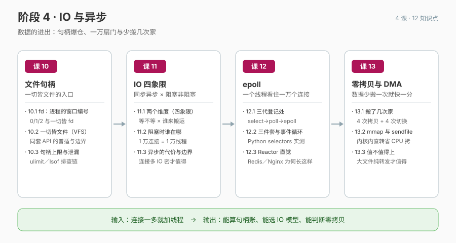

# 阶段 4 · IO 与异步

> 数据的进出：句柄爆仓、一万扇门与少搬几次家。

## 🎯 阶段目标

学完本阶段你能：算清一个进程的句柄账——fd 是什么、什么都是 fd、上限怎么调、泄漏怎么查；选对 IO 模型——用"阻塞/非阻塞 × 同步/异步"两个维度给场景定位，并算出"每连接一线程"的账单；判断零拷贝值不值得上——数清数据在服务器里搬了几次家、sendfile 省在哪。

## 📖 故事章节定位

告警单最后一句"打开文件数 8 万"把故事带进数据的进出通道：句柄是进程看世界的窗口、epoll 是看住一万扇门的门童、零拷贝是少搬几次家的艺术。

## 🔑 必须掌握的知识点

| 课 | 知识点 | 一句话要点 |
|----|--------|-----------|
| 课 10 | 10.1 fd：进程的窗口编号 | open 返回最小可用整数；0/1/2 三件套；socket/pipe/epoll/设备全是 fd；/proc 实测 |
| 课 10 | 10.2 一切皆文件：VFS 的统一接口 | 一套 open/read/write/close 走天下；好处 = 工具与组合复用；并非一切皆文件的诚实边界 |
| 课 10 | 10.3 句柄上限与泄漏 | 系统级 fs.file-max 与进程级 nofile 两级上限；ulimit/prlimit 与持久化配置；"Too many open files"排查链 |
| 课 11 | 11.1 两个维度到底在说什么（四象限） | 阻塞/非阻塞 = 调用方等不等；同步/异步 = 数据搬运谁负责；类比的失效边界 |
| 课 11 | 11.2 阻塞时线程与 CPU 各自在哪 | 线程睡在内核等事件；CPU 在跑别人；1 万连接 = 1 万线程的内存与切换账单 |
| 课 11 | 11.3 异步的代价与适用边界 | 回调地狱/状态机复杂度；连接多 IO 密 → 异步；连接少逻辑重 → 同步阻塞；真实世界混合形态 |
| 课 12 | 12.1 select / poll / epoll：三代登记处 | select 的 1024 限制与 O(n) 全量扫；poll 改了限制没改扫描；epoll = 登记一次 + 就绪回调 |
| 课 12 | 12.2 epoll 三件套与事件循环 | epoll_create/ctl/wait 各管什么；LT vs ET；用 Python selectors 跑通一个线程看多连接 |
| 课 12 | 12.3 Reactor 直觉 | 事件循环 = while + 就绪分发；Redis/Nginx/Node 单线程事件循环长这样；Go netpoller 回指 |
| 课 13 | 13.1 一次文件下载，数据搬了几次家 | read+write 的 4 次拷贝（2 DMA + 2 CPU）与 4 次态切换；DMA = 设备直搬；零拷贝的准确定义 |
| 课 13 | 13.2 mmap 与 sendfile | mmap 把文件映射进地址空间省 CPU 拷；sendfile 内核内直转（Kafka/Nginx 的选择） |
| 课 13 | 13.3 值不值得上：零拷贝的决策边界 | 大文件 + 纯转发 → 值得；小文件/需加工 → 不值得（数据必须进用户态）；容器内实测对比 |

## 🗺 本阶段路径图

## 课次一览

- [课 10《文件句柄：一切皆文件的入口》](lessons/lesson-10-文件句柄一切皆文件的入口.md)（✅ 已交付，2026-09-16）
- [课 11《同步异步 × 阻塞非阻塞：IO 的四象限》](lessons/lesson-11-同步异步与阻塞非阻塞IO的四象限.md)（✅ 已交付，2026-09-16）
- [课 12《epoll：一个线程看住一万个连接》](lessons/lesson-12-epoll一个线程看住一万个连接.md)（✅ 已交付，2026-09-16）
- [课 13《零拷贝与 DMA：数据少搬一次就快一分》](lessons/lesson-13-零拷贝与DMA数据少搬一次就快一分.md)（✅ 已交付，2026-09-16）
