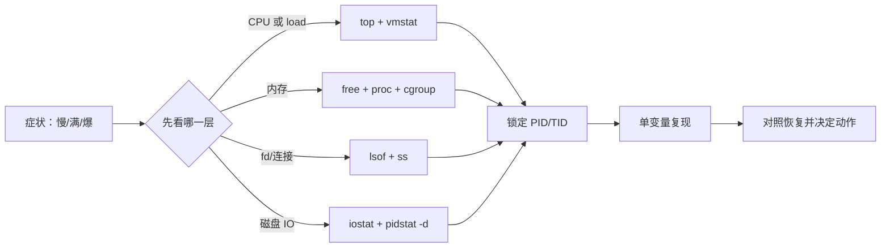

# 课 14 · 观测工具箱：给服务器做体检

> 阶段 5 · 综合会诊 ｜知识点 14.1、14.2、14.3 ｜更新于 2026-09-17

## 本课在故事主线中的情节定位

前四个阶段，我们已经认识了 CPU、缓存、虚拟内存、进程、调度、load、fd、epoll 和零拷贝。现在这些知识要第一次同时出现在一张值班桌上：服务器告警“接口变慢”，你手里有一堆数字，却不能把每个数字都当成答案。

本课要建立一条最小会诊链：

> 先说清楚想回答什么问题，再选对应的工具；读到数字后，校准它的范围、时间窗口和单位；最后用可控压力复现，而不是凭一眼红色数字下结论。

> 📖 **文档核对留痕**：工具职责、字段含义、首行统计口径与容器观测边界已按官方文档核对（核查于 2026-09）。本课特别收窄“load 就是 CPU 使用率”“buff/cache 都是程序吃掉的内存”“`%util=100%` 必然代表磁盘打满”三处常见误读。来源：[top(1)](https://man7.org/linux/man-pages/man1/top.1.html)、[ps(1)](https://man7.org/linux/man-pages/man1/ps.1.html)、[vmstat(8)](https://man7.org/linux/man-pages/man8/vmstat.8.html)、[free(1)](https://man7.org/linux/man-pages/man1/free.1.html)、[iostat(1)](https://man7.org/linux/man-pages/man1/iostat.1.html)、[pidstat(1)](https://man7.org/linux/man-pages/man1/pidstat.1.html)、[lsof(8)](https://man7.org/linux/man-pages/man8/lsof.8.html)、[ss(8)](https://man7.org/linux/man-pages/man8/ss.8.html)、[/proc/loadavg](https://man7.org/linux/man-pages/man5/proc_loadavg.5.html)、[/proc/meminfo](https://man7.org/linux/man-pages/man5/proc_meminfo.5.html)、[Docker 容器运行时指标](https://docs.docker.com/engine/containers/runmetrics/)。

## 📌 知识点导航

| 知识点 | 状态 | 学完后的能力 |
|---|---|---|
| 14.1 一组指标一个工具 | ✅ | 按问题选择 `top`、`vmstat`、`pidstat`、`lsof`、`ss`、`iostat`、`free`，知道每把尺子测谁 |
| 14.2 读数的口径陷阱 | ✅ | 校准 load/CPU%、VSZ/RSS、buff/cache、`us/sy/wa/si`、`%util` 与容器 cgroup 边界 |
| 14.3 压力复现实验 | ✅ | 在 Docker Linux 中造 CPU、fd、IO 压力，并同步观察指标联动与实验边界 |

## 🎯 本课目标

学完本课你将能：

- 面对“慢、满、爆、丢”这类模糊告警，先把它翻译成一个可观测问题；
- 用 `top`/`ps` 看对象，用 `vmstat` 看系统窗口，用 `pidstat` 看进程，用 `lsof` 看句柄，用 `ss` 看 socket，用 `iostat` 看设备；
- 解释“数字是真的，但结论错了”的典型原因：对象不同、时间窗口不同、归一化方式不同；
- 用一次只改变一个变量的压力实验，把现象、指标和机制连起来；
- 说清 Docker Desktop 中“宿主机 macOS、Docker Linux VM、容器 cgroup”三层观测边界。

## ⚠️ 实验边界

本课实验均使用一次性容器，不向学习仓库写测试文件：

```bash
docker info --format 'client={{.ClientInfo.Version}} server={{.ServerVersion}} os={{.OperatingSystem}} arch={{.Architecture}}'
docker image inspect ubuntu:26.04 --format 'ubuntu_image={{.Os}}/{{.Architecture}}'
```

本批次基线为：

```text
client=29.4.1 server=29.4.1 os=Docker Desktop arch=aarch64
ubuntu_image=linux/arm64
```

容器内实际看到的内核来自 Docker Desktop 的 LinuxKit VM；本轮输出中 `pidstat` 显示内核为 `6.12.76-linuxkit`、`(11 CPU)`。因此：

1. `top`、`vmstat`、`free`、`iostat` 等读取到的系统视图，可能是 Docker VM 的视图，不自动等于 macOS 宿主机视图；
2. `--memory=128m` 这样的 cgroup 限制，必须与 `/sys/fs/cgroup/memory.max` 一起看，不能只看 `free -h`；
3. `stress-ng` 的 IO 压力能验证指标联动，但是否出现稳定 `D` 状态会受虚拟磁盘、文件系统和调度时机影响；本轮确实观察到 IO wait 上升，但没有把 `D` 状态伪造成实验结果；
4. 实验数字只用于验证“谁会动、怎么动、为什么动”，不构成不同硬件上的性能基准。

---

# 第一幕：场景引入——值班桌上有七把尺子

周五晚，`order-service` 的接口延迟升高。监控截图里同时出现：

- load average 在上升；
- 某个进程 CPU 百分比很高；
- `buff/cache` 占了不少内存；
- “打开文件数”接近上限；
- 磁盘图表偶尔变红；
- 连接数也在上涨。

新人最容易做的事，是打开 `top`，盯着最大的那一行，然后宣布“CPU 有问题”。但这张图只回答了“此刻哪些任务在视图中比较突出”，它没有告诉你：系统是否在排队、哪个进程的 fd 在增长、磁盘是否真的成为瓶颈、内存限制到底是机器的还是容器的。

## 一句话本质

**观测工具是带测量对象和口径的仪器：先选问题，再选仪器，再解释数字，最后用复现实验验证因果。**

## 处境对照：同一个“变慢”，先问哪一句

| 你真正想问的问题 | 第一把尺子 | 它主要告诉你什么 | 下一步 |
|---|---|---|---|
| 谁正在吃 CPU？ | `top` / `ps` | 进程或线程的当前快照 | 用 `pidstat` 按时间窗口跟踪它 |
| 系统是在排队还是只是某进程忙？ | `vmstat` | runnable、阻塞、切换、换页、IO wait | 对照 load、CPU 和 IO |
| 这个 PID 在这几秒里到底做了什么？ | `pidstat` | 按进程的 CPU、IO、缺页等速率 | 继续看线程、系统调用或代码 |
| fd 都指向了什么？ | `lsof` | 普通文件、目录、设备、socket 等打开对象 | 分类计数，找泄漏或上限 |
| 网络连接卡在哪个状态？ | `ss` | socket 状态、队列与端点 | 对照应用并发和反压 |
| 设备是否在忙、IO 是否在排队？ | `iostat` | CPU IO wait 与设备延迟、队列、活动时间 | 看请求类型、文件路径和 Page Cache |
| 机器/容器还能不能分配内存？ | `free` + `/proc` + cgroup | available、swap、缓存与限制 | 对照进程 RSS 和容器 memory.current |

**工具的第一职责不是“给出根因”，而是把模糊症状切成一个更小的问题。**

---

# 第二幕：认知冲突——数字可以全是真的，结论仍然全错

想象三张同时出现的截图：

```text
load average: 8.00
某进程 %CPU: 100.0
free -h: buff/cache 5.0Gi
```

这三句话都可能是真的，却分别属于不同的对象、时间窗口和单位：

| 数字 | 它测量的对象 | 常见误读 |
|---|---|---|
| load | 可运行或等待磁盘 IO 的调度实体的平均数量 | 当成 CPU 使用率 |
| `%CPU` | 某个任务在采样窗口里占用的 CPU 时间 | 当成整机所有核都满 |
| `buff/cache` | 内核缓冲与缓存的占用估计 | 当成不可回收的应用内存 |
| RSS | 进程当前驻留在物理内存的页 | 当成该进程独占的全部物理内存 |
| `%util` | 设备有 IO 请求处于活动状态的时间比例 | 当成 SSD 的绝对容量百分比 |

## 体检报告先填三栏

每次读工具前，先在脑中填这三栏：

```text
范围 scope：系统 / 进程 / 线程 / 容器 cgroup？
窗口 window：快照 / 采样间隔 / 开机以来累计？
单位 unit：百分比 / 每秒速率 / 字节 / 队列长度？
```

如果三栏没有填清楚，后面的“高”和“低”都缺少参照系。

## 第一个冲突：load 高，不等于 CPU 高

第 9 课已经建立过这个边界：Linux 的 load average 包含运行队列中的任务，以及处于不可中断磁盘 IO 等待的任务；`/proc/loadavg` 的前三个字段是 1、5、15 分钟平均值。它是“系统中有多少工作在竞争或等待”的长期平滑量，不是 CPU 百分比。

因此至少有两种不同病例：

| 现象 | 更像什么 | 先看什么 |
|---|---|---|
| load 高，`us+sy` 也高，`id` 低 | CPU 竞争 | `top`、`vmstat r`、`pidstat` |
| load 高，但 CPU `id` 仍高，`wa` 或设备等待明显 | IO 排队 | `vmstat b/wa`、`iostat await/%util` |
| load 只是 1 分钟高，5/15 分钟较低 | 最近刚发生的短峰值 | 连续采样，不要只看一张截图 |

一个任务的 `%CPU=100%` 也不是“整机 100%”。在多核系统上，它通常表示这个任务吃满了一个逻辑 CPU；要判断整机是否饱和，还要看全局 `id`、run queue 和可用核数。

## 第二个冲突：VSZ 大，不等于 RSS 大

- **VSZ**：进程的虚拟地址空间规模，可能包含尚未触碰的映射、共享库、保留地址区；
- **RSS**：当前驻留在物理内存中的非换出页规模；
- 即使 RSS 很大，也不能简单相加得到进程总物理占用，因为共享库和共享页可能被多个进程共同计入。

类比：VSZ 是“你在城市里预留了多少地块”，RSS 是“现在已经盖起来、放进了物理内存的面积”。预留地块不等于已经花掉同样多的砖。

## 第三个冲突：buff/cache 多，可能是好事；available 低，才更值得紧张

`free` 从 `/proc/meminfo` 取数。官方口径中：

- `buff/cache` 是 buffers 与 cache 的合计；
- `available` 是在不换页的前提下，估计还能给新应用使用的内存；
- `used` 是 `total - available` 的计算值，不是“所有应用 RSS 的总和”。

所以读内存时优先问：`available` 还有多少、swap 是否在持续使用、进程 RSS 是否持续增长、容器 cgroup 是否已接近上限。不要只盯着 `free` 一列，也不要把所有 `buff/cache` 直接判成泄漏。

## 第四个冲突：`us/sy/wa/si` 是 CPU 时间去向，不是根因标签

在 `top`/`vmstat`/`iostat` 中，常见字段可以这样读：

| 字段 | 直觉 | 不能直接推出 |
|---|---|---|
| `us` / `%user` | 用户态执行消耗的 CPU 时间 | 一定是某个业务循环，需要看进程 |
| `sy` / `%system` | 内核态执行消耗的 CPU 时间 | 一定是磁盘，可能是系统调用、网络、驱动等 |
| `wa` / `%iowait` | CPU 空闲期间，系统有未完成磁盘 IO | 磁盘带宽已经达到物理极限 |
| `si` | 软件中断消耗的 CPU 时间 | 一定是网络，需要结合流量和软中断来源 |
| `id` / `%idle` | 空闲且没有待处理磁盘 IO 的 CPU 时间 | 系统完全健康，仍要看内存、fd、延迟 |

尤其是 `%iowait`：它是“CPU 在等 IO 时处于空闲”的统计，不是磁盘利用率本身；必须与 `iostat` 的设备字段、请求延迟和业务延迟一起看。

---

# 第三幕：层层揭示——一组问题对应一组工具


> **读图指南**：先从左上“症状 / 问题”出发，向右选择对应的测量对象；再沿黄色校准带检查范围、窗口、单位和边界；底部三步证据链表示“发现异常 → 锁定对象 → 复现验证”，不要直接从第一张图跳到根因结论。

## 本课地图

| 步骤 | 要回答的问题 | 对应知识点 |
|---|---|---|
| 第 1 步 | 七个常见工具各自测谁？ | 14.1：指标与工具的配对 |
| 第 2 步 | 为什么同一个数字会误导人？ | 14.2：范围、窗口、单位与边界 |
| 第 3 步 | 怎么把“我猜是它”变成可复验的证据？ | 14.3：受控压力与同步采样 |

🧭 **第 1/3 步**：先把工具当作“带刻度的尺子”，明确每把尺子测量的对象，再进入口径校准。

## 14.1 一组指标一个工具

### 一句话定义

**工具选择的第一原则是“问题 → 观测对象”，不是“我熟悉哪个命令就先敲哪个”。**

### 直觉建立与类比边界

把服务器体检想成给一辆车做检查：

- 仪表盘看全车当前状态，对应 `top` / `free`；
- 发动机转速曲线看一段时间内的变化，对应 `vmstat` / `pidstat`；
- 打开发动机舱看哪根管子接到了哪里，对应 `lsof`；
- 看轮胎和道路上的车流状态，对应 `ss`；
- 听某个车轮是否卡住、转速是否异常，对应 `iostat`。

类比的边界是：工具只提供观测证据，不替你完成因果证明。看到“轮子转得慢”不等于马上知道是刹车、轴承还是道路阻塞。

### 核心原理：对象、窗口、粒度三层配对

| 工具 | 主要对象 | 典型命令 | 最适合回答 |
|---|---|---|---|
| `top` | 系统 + 进程/线程快照 | `top -b -n 1`；线程用 `top -H` | 此刻谁在吃 CPU、内存、运行队列怎样 |
| `ps` | 进程/线程快照 | `ps -eo pid,ppid,stat,%cpu,%mem,comm` | 进程树、状态和一次性排序 |
| `vmstat` | 系统级时间窗口 | `vmstat 1 3` | runnable、阻塞、换页、块 IO、切换、CPU 去向 |
| `pidstat` | 单个任务的时间窗口 | `pidstat -p <PID> 1 3` | 该 PID 的 CPU、IO、缺页等速率 |
| `lsof` | 进程打开的对象 | `lsof -p <PID>` | fd 指向文件、目录、设备还是 socket |
| `ss` | socket 与队列状态 | `ss -s`；明细用 `ss -tanp` | 连接卡在何处、发送/接收队列是否堆积 |
| `iostat` | CPU 与块设备 | `iostat -xz 1 3` | IO wait、请求延迟、队列和设备活动时间 |
| `free` + `/proc` | 系统内存与 swap | `free -w -h`；`/proc/meminfo` | available、缓存、脏页、swap 的系统级视图 |
| cgroup 文件 | 容器边界 | `memory.current` / `memory.max` | 容器还能用多少，不被系统全局视图掩盖 |

### 示例演示：一条“CPU 变慢”最小链

```bash
# 1. 先看全局轮廓
top -b -n 1
vmstat 1 3

# 2. 找到 PID 后，不要继续盯着全局图
pidstat -p <PID> 1 3

# 3. 如果怀疑它阻塞或 IO，继续补对象信息
ps -L -p <PID> -o pid,tid,stat,psr,pcpu,wchan:24,comm
lsof -p <PID>
```

这里的分工是：`top` 发现，`vmstat` 判断系统级竞争，`pidstat` 锁定进程的时间行为，`ps -L` 切到线程粒度，`lsof` 补 fd 对象。每条命令都减少一个未知量。

### 常见误区

| 误区 | 修正 |
|---|---|
| 看到 CPU 高就只用 `top` | `top` 是发现工具；要看持续变化和归因，补 `vmstat`、`pidstat` |
| `ps` 能告诉我过去一分钟发生了什么 | `ps` 主要是快照；历史窗口用 `pidstat` 或持续采样 |
| `lsof` 只列普通文件 | 它还可列目录、设备、库、流和网络文件 |
| `ss` 能告诉我应用代码哪一行卡了 | `ss` 只告诉 socket 状态；代码级定位需回到日志、profiling 或系统调用 |
| `iostat` 看到设备行就等于找到了文件 | 块设备统计通常不直接给出业务文件路径，要继续关联进程、路径和 Page Cache |
| `free` 可以代替 cgroup 指标 | 在容器里必须同时看 cgroup 的 current/max；全局 `/proc/meminfo` 可能不是容器限额 |

### 一句话记住

> `top` 找谁，`vmstat` 看全局，`pidstat` 看某个任务，`lsof` 看 fd，`ss` 看 socket，`iostat` 看设备，`free` 看内存；工具顺序跟着问题走。

### 官方文档

- [`top(1)`](https://man7.org/linux/man-pages/man1/top.1.html)：动态显示进程和系统摘要。
- [`ps(1)`](https://man7.org/linux/man-pages/man1/ps.1.html)：报告当前进程的快照，可切到线程视图。
- [`vmstat(8)`](https://man7.org/linux/man-pages/man8/vmstat.8.html)：报告进程、内存、分页、块 IO、系统与 CPU 统计。
- [`pidstat(1)`](https://man7.org/linux/man-pages/man1/pidstat.1.html)：监视 Linux task，可按 PID 与时间间隔采样。
- [`lsof(8)`](https://man7.org/linux/man-pages/man8/lsof.8.html)：列出进程打开的文件及相关对象。
- [`ss(8)`](https://man7.org/linux/man-pages/man8/ss.8.html)：查看 socket 统计。
- [`iostat(1)`](https://man7.org/linux/man-pages/man1/iostat.1.html)：报告 CPU 与设备/分区的 IO 统计。

---

🧭 **第 2/3 步｜承接**：14.1 解决了“用哪把尺子” → 下一步要问“这把尺子刻度的分母、窗口和范围是什么”，否则读数仍可能被误解。

## 14.2 读数的口径陷阱

### 一句话定义

**正确读数 = 数值 + 测量对象 + 时间窗口 + 归一化方式 + 观测边界；缺一项，数字就可能被错误比较。**

### 直觉建立与类比边界

“100 公里”可以是每小时 100 公里、一天 100 公里，也可以是某辆车 100 公里、全车队 100 公里。服务器指标也一样：

- `%CPU=100` 是单个任务、单个核还是全机归一化？
- load `8` 是 1 分钟平均还是 15 分钟平均？机器有几个逻辑 CPU？
- `free -h` 是系统视图，还是容器的 memory.max？
- `iostat` 的首行是开机以来累计，还是刚刚这一秒？

类比的边界是：不要把所有指标强行换算成一个“健康分”。它们测的是不同阶段的链路：调度队列、CPU 时间、物理页、fd、socket、设备请求。

### 核心原理：四个高频读数陷阱

#### 陷阱 A：load 与 CPU% 不是同一条轴

`/proc/loadavg` 前三个数分别对应 1、5、15 分钟平均；其统计对象包括处于 `R` 的运行队列任务和处于 `D` 的磁盘 IO 等待任务。它回答“有多少调度实体正在竞争或等待”，而 CPU% 回答“CPU 时间花到哪里”。

用一个简化判断表：

| load | `us+sy` | `wa` / `b` | 初步方向 |
|---|---:|---:|---|
| 高 | 高 | 低 | CPU 竞争，继续找进程/线程 |
| 高 | 不高 | 高 | IO 等待或不可中断等待，继续看 `iostat` |
| 低 | 高 | 低 | 某个核/某个任务可能忙，但全局队列未必长 |
| 1 分钟高、5/15 分钟低 | 任意 | 任意 | 最近短峰值，需连续采样 |

注意：在多核系统上，单任务 100% 通常近似吃满一个逻辑 CPU；判断整机是否饱和要看全局空闲率、runnable 数与核数。

#### 陷阱 B：VSZ / RSS / cgroup 是三个边界

| 字段 | 主要回答 | 不能直接回答 |
|---|---|---|
| VSZ / VIRT | 进程映射/保留了多少虚拟地址空间 | 已经占用多少物理 RAM |
| RSS / RES | 当前有多少非换出页驻留 | 这些页是否都由该进程独占 |
| `memory.current` | 当前 cgroup 计费的内存 | 系统全局还剩多少 |
| `memory.max` | cgroup 允许的上限 | 容器一定能稳定用满这么多 |

#### 陷阱 C：buff/cache 与 available 必须成对看

一次 `free -w -h` 的实测输出为：

```text
               total        used        free      shared     buffers       cache   available
Mem:           7.7Gi       5.6Gi       554Mi        50Mi       267Mi       1.5Gi       2.1Gi
Swap:          1.0Gi       754Mi       269Mi
```

不能因为 `free` 只有 `554Mi` 就宣布“只剩 554Mi”；官方 `free(1)` 的 `available` 是无需换页时估计还能启动新应用的内存，且会考虑可回收的 Page Cache 与部分可回收 slab。反过来，也不能因为 `buff/cache` 大就保证内存永远无压力：其中并非每一页都能立即回收，`available`、swap、RSS 增长和回收活动要联合观察。

#### 陷阱 D：首行统计与后续采样不是一个窗口

| 工具 | 命令 | 首行/快照口径 | 连续行口径 |
|---|---|---|---|
| `top -b -n 1` | 一次批处理快照 | 当前视图 | 省略，交互模式才持续刷新 |
| `vmstat 1 3` | 系统采样 | 首次报告常含自开机以来平均 | 后续报告覆盖相邻 1 秒 |
| `iostat -xz 1 3` | 设备采样 | 首次报告默认可含自开机以来统计 | 后续报告覆盖相邻 1 秒；`-y` 可跳过首行 |
| `pidstat -p <PID> 1 3` | 任务采样 | 进程自启动以来的累计/初始状态取决于字段 | 后续报告覆盖间隔 |

因此，抓“刚刚发生的 IO 峰值”时，通常使用 `vmstat 1 3`、`iostat -y -xz 1 3`，并把首行与后两行分开看。不要把 `iostat` 的开机以来累计行和 `vmstat` 的 1 秒行直接横向比较。

### 示例演示：容器内 `free` 看到的不是 memory.max

```bash
docker run --rm --platform linux/arm64 --memory=128m ubuntu:26.04 \
  bash -lc 'echo -n "memory.max="; cat /sys/fs/cgroup/memory.max; free -h'
```

本轮实测：

```text
memory.max=134217728
               total        used        free      shared  buff/cache   available
Mem:           7.7Gi       5.6Gi       657Mi        45Mi       1.6Gi       2.0Gi
Swap:          1.0Gi       761Mi       262Mi
```

这不是 `free` 算错，而是两个文件回答不同问题：`free` 解析 `/proc/meminfo` 的系统内存视图；cgroup 文件表达该容器的资源边界。容器内排查 OOM 时，二者必须并读。

### `iostat %util` 的边界

`iostat -x` 的 `%util` 表示在统计窗口内，设备有 IO 请求处于活动状态的时间比例。对串行服务设备，接近 100% 可能意味着设备饱和；对能并行处理请求的现代 SSD、阵列或虚拟设备，单看 `%util` 不能代表完整的性能上限。还要一起看：

- `await`：平均请求服务时间，包含排队与服务时间；
- `aqu-sz`：平均队列长度；
- 读写速率与请求大小；
- 业务端到端延迟，以及 Page Cache 是否命中。

### 常见误区

| 误区 | 修正 |
|---|---|
| load=8 就是 CPU 800% | load 是任务竞争/IO 等待平均数，不是百分比 |
| 进程 `%CPU=100` 就是整机满载 | 先看逻辑 CPU 数与全局 `id`；可能只是一个核满 |
| VSZ=2GiB 表示进程已经吃掉 2GiB RAM | 先看 RSS，再考虑共享页和 cgroup 计费 |
| `free` 小于 1GiB 就快 OOM | 看 `available`、swap、RSS 增长和 cgroup 上限 |
| `buff/cache` 都能瞬间回收 | `available` 已是估计值，部分 slab/脏页仍有回收与回写成本 |
| `wa=20` 就说明磁盘 20% 忙 | `wa` 是 CPU 时间口径；设备状态要看 `iostat` |
| `%util=100` 在任何设备上都等于打满 | 并行设备与虚拟设备上需结合 await、队列和业务延迟 |
| 把首行 `vmstat/iostat` 当成当前这一秒 | 首行可能是开机以来平均，使用后续间隔行或 `-y` |

### 一句话记住

> 读指标先问四句：谁的？哪段时间？用什么分母？在哪一层边界内？

### 官方文档

- [`free(1)`](https://man7.org/linux/man-pages/man1/free.1.html)：`available` 的估计口径、`buff/cache` 与 `-w` 宽格式。
- [`/proc/loadavg`](https://man7.org/linux/man-pages/man5/proc_loadavg.5.html)：load 的 1/5/15 分钟以及 `R`/`D` 统计对象。
- [`/proc/meminfo`](https://man7.org/linux/man-pages/man5/proc_meminfo.5.html)：`MemAvailable`、`Cached`、`Dirty`、`Writeback` 等字段来源。
- [`iostat(1)`](https://man7.org/linux/man-pages/man1/iostat.1.html)：首行/间隔报告、`await`、`aqu-sz`、`%util` 的官方定义。
- [`pidstat(1)`](https://man7.org/linux/man-pages/man1/pidstat.1.html)：`%CPU`、`VSZ`、`RSS`、缺页与 `-I` 归一化选项。
- [Docker 容器资源约束](https://docs.docker.com/engine/containers/resource_constraints/)：容器的 memory/cgroup 限制；[运行时指标](https://docs.docker.com/engine/containers/runmetrics/)：从 cgroup 观察容器资源。

---

🧭 **第 3/3 步｜承接**：14.2 把数字的口径校准好了 → 最后不靠“看起来像”，而是主动制造一个变量，观察系统级、进程级和边界级指标是否按机制联动。

## 14.3 压力复现实验

### 一句话定义

**压力复现是控制变量实验：先采基线，只改变一个压力源，同时采集多层指标，清理后确认指标回落。**

### 直觉建立与类比边界

像给医生做负荷心电图：静息测一次，施加一个可控负荷，再观察心率、血压和波形如何一起变化。只看到心率升高，不足以证明心脏的哪一层出了问题；要看一组联动证据。

类比的边界是：生产系统不能随意烧 CPU、打满 fd 或制造 IO。压力实验应在隔离容器或明确的测试环境执行，有超时、有清理、有资源上限。

### 核心原理：五步实验协议

```text
基线 → 单变量注入 → 同步采样 → 清理 → 对照回落
```

每次实验至少记录：

1. **系统层**：`top`、`vmstat`、`free`、`iostat`；
2. **对象层**：`pidstat`、`ps`、`lsof`、`ss`；
3. **边界层**：`/proc` 与 cgroup 的 current/max；
4. **触发器**：PID、开始时间、结束时间、压力类型；
5. **限制**：超时、容器 `--memory/--cpus`、是否允许写临时文件。

### 实验 A：烧一个 CPU——为什么一个进程 100% 但整机仍有空闲

```bash
docker run --rm --platform linux/arm64 ubuntu:26.04 bash -lc '
  set -e
  export DEBIAN_FRONTEND=noninteractive
  apt-get update -qq
  apt-get install -y -qq procps sysstat >/dev/null
  yes >/dev/null & p=$!
  sleep 1
  echo "== pid=$p =="
  top -b -n 1 -p "$p" | sed -n "1,16p"
  echo "== vmstat =="
  vmstat 1 2
  echo "== pidstat =="
  pidstat -p "$p" 1 2
  kill "$p"
  wait "$p" 2>/dev/null || true
'
```

本轮 Docker 实测的关键片段：

```text
== pid=506 ==
%Cpu(s):  2.6 us,  6.8 sy,  0.0 ni, 90.6 id,  0.0 wa,  0.0 hi,  0.0 si,  0.0 st
  PID USER      PR  NI    VIRT    RES    SHR S  %CPU  %MEM     TIME+ COMMAND
  506 root      20   0   15784   5624   4484 R  90.9   0.1   0:01.20 yes

14:01:35        0       506   28.00   72.00    0.00    0.00  100.00     9  yes
14:01:36        0       506   28.00   72.00    0.00    0.00  100.00     9  yes
Average:        0       506   28.00   72.00    0.00    0.00  100.00     -  yes
```

解释：

- `pidstat` 在两个 1 秒窗口里把 `yes` 记为 `100.00%`；
- `top` 的一次批处理快照是 `90.9%`，它与 `pidstat` 的采样时刻/展示口径不同，不能机械比较到小数点；
- 全局 `id=90.6`，说明只有一个逻辑 CPU 忙，整台 11 CPU 的 VM 并未被一个任务全部吃光；
- `pidstat` 的 `%usr=28`、`%system=72` 还提醒我们：即使命令看起来是用户态工具，具体 CPU 时间也可能包含较多内核态消耗，不能只看“进程名”猜来源。

**本实验回答的问题**：进程 CPU 高吗？是的。整机 CPU 饱和吗？不是，仅凭这一进程不能这样说。下一步应进入课 15 的“进程 → 线程 → 它在忙什么”定位链。

### 实验 B：打开 40 个额外 fd——为什么 lsof 行数不等于 fd 数

```bash
docker run --rm --platform linux/arm64 ubuntu:26.04 bash -lc '
  set -e
  export DEBIAN_FRONTEND=noninteractive
  apt-get update -qq
  apt-get install -y -qq lsof procps >/dev/null
  (for i in $(seq 1 40); do
     eval "exec $((i+9))<>/dev/null"
   done
   echo "worker_pid=$$"
   sleep 5) & p=$!
  sleep 1
  echo "== pid=$p =="
  echo -n "proc_fd_count="
  find "/proc/$p/fd" -mindepth 1 -maxdepth 1 -type l | wc -l
  lsof -n -P -p "$p" | sed -n "1,12p"
  echo -n "lsof_rows="
  lsof -n -P -p "$p" | awk "NR>1 {n++} END {print n+0}"
  wait "$p"
'
```

本轮实测摘要：

```text
worker_pid=1
== pid=149 ==
proc_fd_count=43
COMMAND PID USER  FD   TYPE DEVICE SIZE/OFF     NODE NAME
sleep   149 root cwd    DIR  0,100     4096   548675 /
sleep   149 root rtd    DIR  0,100     4096   548675 /
sleep   149 root txt    REG  0,100 10577824   465894 /usr/lib/cargo/bin/coreutils/sleep
...
lsof_rows=52
```

这里有两个不同计数：

- `/proc/149/fd` 目录中的 `43` 是该进程当前 fd 目录项数量；
- `lsof` 的 `52` 行还包含 `cwd`、`rtd`、`txt`、动态库映射等打开对象，不等于“打开了 52 个 fd”；
- 额外 fd 指向 `/dev/null`，所以这次实验验证的是“句柄账本会增长”，不是网络连接泄漏。

**本实验回答的问题**：发现 fd 异常时，用 `/proc/<PID>/fd` 做数量确认，用 `lsof -p <PID>` 做对象分类；不要把 `lsof` 输出行数直接当成上限消耗量。

### 实验 C：制造文件 IO——load、wa 和 iostat 怎样联动

```bash
docker run --rm --platform linux/arm64 ubuntu:26.04 bash -lc '
  set -e
  export DEBIAN_FRONTEND=noninteractive
  apt-get update -qq
  apt-get install -y -qq procps sysstat stress-ng >/dev/null
  stress-ng --hdd 1 --hdd-bytes 128M --timeout 6s --metrics-brief >/tmp/stress.log 2>&1 & p=$!
  sleep 1
  echo "== worker pid=$p =="
  echo -n "loadavg="; cat /proc/loadavg
  ps -eo pid,ppid,stat,wchan:18,comm | sed -n "1,15p"
  echo "== vmstat =="; vmstat 1 3
  echo "== iostat =="; iostat -xz 1 3
  wait "$p"
  echo "== stress summary =="; cat /tmp/stress.log
'
```

本轮实测的关键片段：

```text
loadavg=4.50 4.04 3.85 2/1022 823
  820     1 SL   do_wait            stress-ng
  822   820 R    -                  stress-ng-hdd

vmstat（压力窗口）:
...  2  0 ...  0  0     0 1191916 ...  2  7 83  8  0  0
...  1  0 ...  0  0     0 1310892 ...  2  6 84  8  0  0

iostat（压力窗口）:
%user  %system  %iowait  %idle
  2.09      6.72      5.45   85.74
  1.81      7.07      6.07   85.04
vda ... w/s=1939.60 ... w_await=26.23 ... aqu-sz=51.18 ... %util=39.11
vda ... w/s=2140.00 ... w_await=22.84 ... aqu-sz=49.23 ... %util=41.50
```

解释：

- `vmstat` 的 `wa=8` 与 `iostat` 的 `%iowait≈5–6` 都说明 CPU 有时间处于等待磁盘 IO 的状态；
- `iostat` 同时给出写请求速率、`w_await`、队列长度和 `%util`，比单看 `wa` 更接近设备侧；
- 本次 `ps` 快照中的 `stress-ng-hdd` 是 `R`，没有稳定出现 `D`。这不是实验失败，而是 Docker Desktop 虚拟存储路径的边界：`D` 是可能发生的不可中断等待，不是每次 hdd 压力都必然在某一张快照中出现；
- `stress-ng` 最后报告本轮 `hdd` 运行 6 秒、`229376` bogo ops、`38201.40` bogo ops/s。这个吞吐数只属于本次 Docker VM 和压力参数，不可当物理磁盘基准。

**本实验回答的问题**：当 load 上升但 CPU 并没有全部忙时，是否存在 IO 等待？可以通过 `vmstat` 与 `iostat` 的同窗口联动来支持或否定这个假设；仍要继续关联业务延迟和具体 IO 来源。

### 实验后的清理检查

本课压力容器均使用 `--rm`，`yes` 进程在采样后显式 `kill`，`stress-ng` 有 `--timeout 6s`，fd 实验等待子进程自然退出。回到真实环境时，至少确认：

```bash
docker ps
docker stats --no-stream
```

不要在生产宿主机直接运行无限期的 `yes`、无上限的文件写入或未约束的内存分配。

### 常见误区

| 误区 | 修正 |
|---|---|
| 压力命令跑起来了，实验就完成了 | 必须同时看到对应层级指标变化，并在清理后复查回落 |
| `stress-ng --hdd` 一定能制造 `D` | IO 状态受文件系统、虚拟化和采样时机影响，未观察到就如实记录 |
| `lsof_rows` 就是 fd 数 | `lsof` 还列 cwd、库映射、socket 等对象；数量用 `/proc/<PID>/fd` 辅助确认 |
| `stress-ng` 一次同时烧 CPU、写盘、开 fd | 变量混在一起无法归因；一次只改变一个压力源 |
| 容器里 `free` 看着还有 2GiB，就能使用 2GiB | cgroup 可能只有 128MiB 上限，先看 `memory.max` |
| 采样结束后不清理也没关系 | 压力进程、临时文件和 fd 都可能污染后续实验或服务 |

### 一句话记住

> 好实验不是把数字推到最大，而是让一个变量变化、三层指标联动、清理后状态可回到基线。

### 官方文档

- [`vmstat(8)`](https://man7.org/linux/man-pages/man8/vmstat.8.html)：系统级采样窗口与 `r/b/cs/wa` 等字段。
- [`iostat(1)`](https://man7.org/linux/man-pages/man1/iostat.1.html)：设备请求、`await`、队列和 `%util`。
- [`pidstat(1)`](https://man7.org/linux/man-pages/man1/pidstat.1.html)：按 task 采样 CPU、IO 与内存字段。
- [`lsof(8)`](https://man7.org/linux/man-pages/man8/lsof.8.html)：按 PID 过滤打开对象。
- [Docker 容器资源约束](https://docs.docker.com/engine/containers/resource_constraints/)：为压力实验设置 cgroup 边界。

---

# 第四幕：实操验证——把“会看”变成一张会诊工作表

## 1. 先做一轮无侵入基线

进入线上主机或容器后，先把时间、范围和目标写下来：

```bash
date
uname -a
cat /proc/loadavg
free -w -h
vmstat 1 3
ss -s
```

基线的目标不是收集所有数据，而是回答：这次异常是全局还是局部、持续还是瞬时、CPU 还是 IO、机器边界还是容器边界。

## 2. 按“现象 → 第一证据 → 第二证据”取样

| 现象 | 第一证据 | 第二证据 | 不要马上做的事 |
|---|---|---|---|
| CPU 高 | `top -b -n 1` | `vmstat 1 3` + `pidstat -p <PID> 1 3` | 立刻 kill 最大进程 |
| load 高但 CPU 闲 | `vmstat 1 3` | `iostat -y -xz 1 3`、`ps` 看 `D` | 把 load 当 CPU 百分比 |
| 内存紧张 | `free -w -h` | `/proc/meminfo` + RSS + cgroup current/max | 直接清 Page Cache 或盲目加 swap |
| fd 接近上限 | `set -- /proc/<PID>/fd/*; echo "$#"` | `lsof -p <PID>` 分类 | 只提高 `ulimit` 掩盖泄漏 |
| 连接堆积 | `ss -s` | `ss -tanp` 看状态/队列 | 只看连接总数，不看状态分布 |
| 磁盘疑似瓶颈 | `iostat -y -xz 1 3` | `pidstat -d 1 3` + 业务延迟 | 只凭 `%util` 判断设备寿命 |

## 3. 把采样保存成“能比较”的证据

命令输出要带时间、PID 和间隔。例如：

```bash
pidstat -p <PID> -u -r -d 1 5
iostat -y -xz 1 5
```

同一病例至少保留一组“异常中”和一组“清理/恢复后”数据。没有恢复后对照，就很难证明压力源确实是因果链的一环。

## 4. 三个回扣，防止工具和机制脱节

| 当前看到的指标 | 回扣的机制课 | 追问 |
|---|---|---|
| `r`、`cs`、`us/sy` | 课 7–9 | 是任务多、切换贵，还是某个线程真的在算？ |
| `available`、`Cached`、`Dirty`、RSS | 课 5–6 | 是虚拟地址、驻留页、Page Cache 还是脏页回写？ |
| fd 数、socket 状态、`await`、`wa` | 课 10–13 | 是句柄泄漏、连接反压，还是数据路径/设备等待？ |

工具把症状切开，机制课才负责解释“为什么会这样”。

---

# 第五幕：体系收束——从七把尺子到一条排障链

## 一张最小会诊顺序



## 三句话收束

1. **先按问题选工具**：`top`/`ps` 看对象，`vmstat` 看系统窗口，`pidstat` 看任务，`lsof` 看 fd，`ss` 看 socket，`iostat` 看设备，`free` + cgroup 看内存边界。
2. **数字必须带口径**：load 不等于 CPU%，VSZ 不等于 RSS，buff/cache 不等于不可回收内存，`wa` 不等于磁盘利用率，`%util` 也不是所有设备的绝对饱和线。
3. **证据要能复验**：基线 → 单变量压力 → 同步采样 → 清理 → 回落；下一课再把这条工具链用在三个经典病例上。

## 课后自测

<details>
<summary>题 1：load average=8、CPU idle=70%，这两个数字矛盾吗？</summary>

不矛盾。load 还可能包含等待磁盘 IO 的 `D` 状态任务；CPU 有空闲时间不代表没有 IO 队列。应继续看 `vmstat b/wa`、`iostat await/%util` 和进程状态。

</details>

<details>
<summary>题 2：为什么不能把 `free -h` 的 free 列当成容器还剩的内存？</summary>

`free` 解析的是 `/proc/meminfo` 的系统视图；容器能否继续分配还受 cgroup `memory.max` 与 `memory.current` 约束。Docker 实测中 `memory.max=134217728`，但 `free` 仍显示系统总内存约 `7.7GiB`。

</details>

<details>
<summary>题 3：`lsof_rows=52` 是否表示进程用了 52 个 fd？</summary>

不是。`lsof` 还会列 `cwd`、`rtd`、`txt`、动态库映射和其他打开对象；fd 数量应辅助查看 `/proc/<PID>/fd`，本课实验中它们分别是 `43` 和 `52` 行。

</details>

<details>
<summary>题 4：为什么本课 IO 实验没有出现 D 状态，仍然有价值吗？</summary>

有价值。实验真实观察到 `vmstat wa=8`、`iostat %iowait≈5–6` 以及设备写请求/队列变化，证明了 IO 压力的联动；`D` 是否被某一张快照捕获受虚拟存储和采样时机影响，不能把“没有 D”改写成“有 D”。

</details>

## 📋 命令速查卡

| 目的 | 命令 |
|---|---|
| 系统/进程一次快照 | `top -b -n 1`、`ps -eo pid,ppid,stat,%cpu,%mem,comm` |
| 看线程而不是只看进程 | `top -H`、`ps -L -p <PID> -o pid,tid,stat,psr,pcpu,wchan:24,comm` |
| 系统级采样 | `vmstat 1 3` |
| 按进程看 CPU | `pidstat -p <PID> 1 3` |
| 按进程看 IO/缺页 | `pidstat -d -p <PID> 1 3`、`pidstat -r -p <PID> 1 3` |
| 进程 fd 数 | `set -- /proc/<PID>/fd/*; echo "$#"` |
| fd 对象分类 | `lsof -n -P -p <PID>` |
| socket 总览/明细 | `ss -s`、`ss -tanp` |
| 设备 IO 采样 | `iostat -y -xz 1 3` |
| 内存宽格式 | `free -w -h` |
| load 原始字段 | `cat /proc/loadavg` |
| 内存原始字段 | `grep -E '^(MemAvailable|Cached|Buffers|Dirty|Writeback|SwapFree):' /proc/meminfo` |
| 容器内存边界 | `cat /sys/fs/cgroup/memory.current /sys/fs/cgroup/memory.max` |
| 造 CPU 压力 | `yes >/dev/null`（限时、隔离环境） |
| 造 IO 压力 | `stress-ng --hdd 1 --timeout 6s`（限时、隔离环境） |

## 🧭 课程导航

- 上一课：[课 13《零拷贝与 DMA：数据少搬一次就快一分》](../../4-IO与异步/lessons/lesson-13-零拷贝与DMA数据少搬一次就快一分.md)
- 下一课：[课 15《三个经典病例：CPU 打满、句柄爆仓、内存失踪》](lesson-15-三个经典病例CPU打满句柄爆仓内存失踪.md)
- 课程目录：[operating-system/02-课程目录.md](../../../02-课程目录.md)

## 🚀 接力提示词

继续学 Linux 操作系统基础。我的学习档案在 operating-system/00-学习档案.md，
刚学完阶段 5《综合会诊》的课 14《观测工具箱：给服务器做体检》知识点 14.1、14.2、14.3，
请按大纲继续讲解课 15《三个经典病例：CPU 打满、句柄爆仓、内存失踪》
（15.1 病例一：CPU 100% 的定位链 / 15.2 病例二：Too many open files / 15.3 病例三：内存失踪）。

> 本课的核心不是背命令，而是把每个工具放回它的测量对象与口径：先发现，再锁定，再复现；下一课将在三种真实故障形状中练习这条链。
