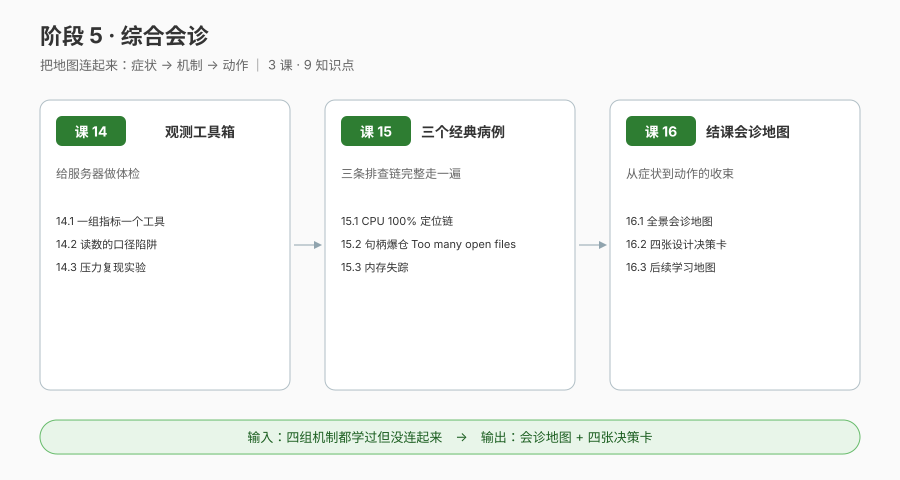

# 阶段 5 · 综合会诊

> 把地图连起来：症状 → 机制 → 动作

## 🎯 阶段目标

学完本阶段你将能：拿到一个系统现象（CPU 打满 / 句柄报错 / 内存吃紧），**会选对工具、会走排查链、知道止损动作**；并把前四个阶段的机制收束成一份个人版《症状 → 机制 → 动作》会诊地图，以及四张设计决策卡（线程池开多大 / 同步还是异步 / 要不要零拷贝 / 要不要 GPU，并延伸理解 NPU）。

## 📖 故事章节定位

会诊室——前四个阶段的检查项目在这里合成会诊报告：体检报告上的每一个数字，终于都能对上"它背后是谁在干活、下一步该敲什么命令"。

## 🔑 必须掌握的知识点

| 课 | 知识点 | 一句话要点 |
|----|--------|-----------|
| 14 | 14.1 一组指标一个工具 | 每个工具只回答一个问题：top 看谁吃 CPU、vmstat 看排队与切换、pidstat 按进程、lsof 看句柄、ss 看连接、iostat 判 IO 瓶颈 |
| 14 | 14.2 读数的口径陷阱 | load ≠ CPU 使用率、VSZ ≠ RSS、buff/cache 可回收——读错口径比不读更危险 |
| 14 | 14.3 压力复现实验 | 自己造压力（烧 CPU / 涨句柄 / 造 D 状态），亲眼看每个指标怎么动 |
| 15 | 15.1 病例一：CPU 100% 的定位链 | 进程 → 线程 → 它在忙什么；us/sy/wa 三种"满"是三种病 |
| 15 | 15.2 病例二：Too many open files | 报错 → lsof 计数 → 分类占用的 → 找泄漏源 → 调上限并知道代价 |
| 15 | 15.3 病例三：内存失踪 | available → RSS 涨的是谁 → 泄漏还是 Page Cache → swap/OOM 链 |
| 16 | 16.1 全景会诊地图 | 一张大表：现象 → 可能机制 → 查什么 → 调什么（收束全部 48 知识点） |
| 16 | 16.2 四张设计决策卡 | 每卡都给临界条件：什么情况选它、什么情况必须改选另一个 |
| 16 | 16.3 后续学习地图 | 性能工程 / eBPF / 内核机制三条深入路线，与 docker / go / PG 课程的联动点 |

## 🗺 本阶段路径图

## 课次一览

- [课 14《观测工具箱：给服务器做体检》](lessons/lesson-14-观测工具箱给服务器做体检.md)（✅ 已交付，2026-09-17）
- [课 15《三个经典病例：CPU 打满、句柄爆仓、内存失踪》](lessons/lesson-15-三个经典病例CPU打满句柄爆仓内存失踪.md)（✅ 已交付，2026-09-17）
- [课 16《结课会诊地图：从症状到动作》](lessons/lesson-16-结课会诊地图从症状到动作.md)（✅ 已交付，2026-09-17；阶段 5 闭环）
