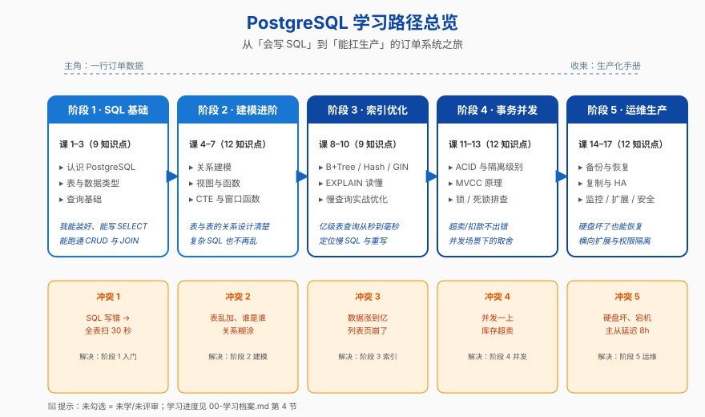

# 01-学习路径总览 · PostgreSQL

> 全课程的索引页：学习目标 + 故事主线 + 全阶段总览 + 阶段依赖图。打开本课程第一份应读此页。

---

## 学习目标

完成本课程后，你能独立完成"PG 选型 + 索引设计 + 事务取舍 + 主从延迟排查 + 慢查询优化"的完整任务，产出可用的《订单系统的 PG 生产化手册》。

**三轨并重**：

| 维度 | 形态 | 衡量标准 |
|---|---|---|
| 理解原理 | 机制讲透（MVCC / WAL / 优化器 / B+Tree / 隔离级别） | 说出"为什么 PG 这样设计"而不是"PG 提供这个功能" |
| 动手实操 | 每课配套可运行命令（Docker 容器环境），阶段 3 起带 EXPLAIN 解读练习 | 能独立用 psql 跑出课末速查卡全部示例 |
| 决策参考 | 何时该建索引 vs 不该建、长事务风险评估、主从延迟是否可接受、ORM 选型 | 能写一份"为什么我们选 PG + 这个索引 + 这种隔离级别"的简要论证 |

---

## 故事主线

- **主角**：一条订单（`order-service` 业务表里的一行数据）从被插入开始、反复被查询、被并发争抢、被运维保障的"一生"
- **冲突**：SQL 写错就慢、并发就打架、数据涨到亿就崩、机器坏就丢、备份不到位就是事故
- **收束**：能扛量、能并行、能恢复、能讲清为什么这套方案是对的



> 📖 **故事主线方向是否合适**：以订单系统的演进为主线（**主角**：一条订单 / **冲突**：从简单到崩 / **收束**：生产化手册）。不合适可调整，但已经按此主线写完所有阶段概览与课骨架了——**调主线 = 改一批文件，请慎重**。

---

## 全阶段总览

| 阶段 | 故事章节 | 课次 | 知识点 | 阶段目标 | 阶段内闭环 |
|---|---|---|---|---|---|
| **1 · SQL 与关系基础** | 把"业务"装进"结构" | 课 1–3 | 9 | 装好 PG、能写 CRUD、能跑基本查询 | 装库 → 建表 → 查数据 |
| **2 · 数据建模与 SQL 进阶** | 把"表"组织成"系统" | 课 4–7 | 12 | 建模不出错、SQL 写复杂也不乱 | 设计模型 → 写复杂查询 |
| **3 · 索引与查询优化** | 让查询飞起来 | 课 8–10 | 9 | 看懂 EXPLAIN、能定位慢查询 | 看懂计划 → 重写优化 |
| **4 · 事务/锁与并发** | 多请求不打架 | 课 11–13 | 12 | 知道事务怎么隔离、并发怎么不打架 | 隔离级别 → MVCC → 锁排查 |
| **5 · 运维与生产化** | 不只是能用，还要撑得住 | 课 14–17 | 12 | 备份恢复 / 主从 HA / 监控 / 扩展 / 安全 | 出事能救 / 横向扩展 |

**故事弧线**：阶段 1 = "会装会用" → 阶段 2 = "会写复杂" → 阶段 3 = "会优化" → 阶段 4 = "会设计并发方案" → 阶段 5 = "会扛生产"。

---

## 阶段依赖图

5 个阶段强有序，**前置阶段未完成时，后续阶段会卡壳**——例如阶段 3 假设你已经能写复杂 JOIN，阶段 4 假设你已经理解事务概念，阶段 5 假设你已经能看懂慢查询定位。

```
阶段 1 (SQL 基础)
   │
   ▼
阶段 2 (建模与 SQL 进阶)
   │
   ▼
阶段 3 (索引与优化) ◀── 阶段 2 必备
   │
   ▼
阶段 4 (事务与并发)
   │
   ▼
阶段 5 (运维与生产化) ◀── 阶段 3、4 必备
```

---

## 学习节奏建议

- **每周 3–5 课**：每课时长 60–90 分钟（含实操练习）
- **每课 2–3 个知识点优先**：第一遍先把每课最重要的 2–3 个吃透，剩下的回头补
- **实操 ≥ 30%**：每课第四幕必须有真命令、真结果，不要只看
- **阶段切换前做小结**：5 阶段完整跑完约 6–8 周

---

## 完成本课程后你能做的 5 件事

1. **设计**：为一个新业务设计 PG 表结构，**说清**为什么用这个主键、这个索引、这个约束
2. **定位**：拿到一条慢 SQL，能用 EXPLAIN 在 30 分钟内定位瓶颈并给出修复
3. **决策**：评估"事务隔离级别要不要用 Serializable""主从延迟 5 秒能不能接受"这类问题，给出有理由的判断
4. **运维**：能搭主从、配置备份、写监控告警规则、出事按手册排查
5. **写手册**：把全课程知识组装成一份《订单系统的 PG 生产化手册》（即结课综合实战项目）

---

## 跳读指南

| 你想快速拿到的能力 | 至少要学的课 |
|---|---|
| 能写日常 SQL | 阶段 1 全部 |
| 能看懂别人写的复杂 SQL | 阶段 1 + 阶段 2 |
| 能定位慢 SQL | 阶段 1 + 阶段 3 |
| 能扛并发不出事 | 阶段 1 + 阶段 4 |
| 能当 PG 运维 | 阶段 1 + 阶段 5 |
| 能做完整生产化决策 | 全部 5 阶段 |
