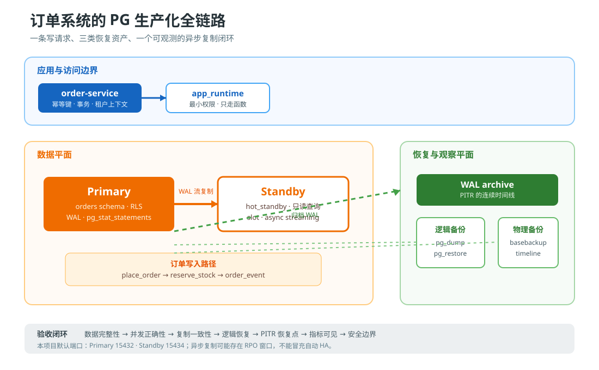

# 结课综合实战：订单系统的 PG 生产化手册

> Phase 3 · 跨阶段整合 + 设计决策 + 反例对照 + 验收清单

这不是把 17 课再抄一遍，而是把它们压缩成一份可以执行、可以解释、可以验收的
生产化手册：订单写入必须正确，故障后必须知道能恢复到哪里，主备状态必须看得见，
权限边界必须能被证明。

## 1. 项目任务

你要为一个多租户订单系统交付 PostgreSQL 数据层。系统包含租户、客户、商品、订单、
订单明细和订单事件，要求同时回答四个问题：

1. 正常写入时，如何保证幂等下单、库存不超卖、金额可对账？
2. 主库损坏或误删数据时，逻辑恢复、物理恢复和 PITR 各自怎么用？
3. 复制延迟、WAL、连接、死元组和慢语句从哪里看？
4. 当 RLS、同步复制、连接池、升级路径出现多种可行方案时，为什么选这一种？

本项目的默认实现使用 postgres:17，一主一物理备库，默认宿主端口为
15432 / 15434。端口只是为了避开本机其他 PostgreSQL 容器，不是生产标准。

## 2. 交付边界与非目标

### 在范围内

- 关系模型、约束、索引、视图、函数、触发器、递归 CTE、窗口查询和 JSONB 查询。
- 事务内幂等下单与原子库存扣减。
- 最小权限角色、SECURITY DEFINER 安全写入口和租户 RLS。
- pg_dump / pg_restore、pg_dumpall --globals-only、pg_basebackup、WAL 归档和 PITR。
- 异步物理流复制、复制槽、备库只读查询和手工提升演练。
- pg_stat_*、pg_stat_statements、慢查询与执行计划巡检。

### 不在范围内

- 这是一套本地可复现实验，不是可直接上线的 HA 产品。没有 Patroni、故障转移
  仲裁器、VIP/DNS 切换、自动 fencing 或云对象存储。
- 没有把明文演示密码当作生产凭据；.env.example 中的值只服务于本地演练。
- 没有伪装出零数据丢失：本项目使用异步复制，主库在最后一段 WAL 未到备库时故障，
  可能存在 RPO 窗口。
- 没有把连接池、跨大版本升级做成运行中的第三方服务；它们以设计决策和操作矩阵
  交付，避免把演练栈误认为完整生产平台。

## 3. 生产目标与非功能约束

| 目标 | 本项目的可验证定义 | 证据 |
|---|---|---|
| 业务正确性 | 同一幂等键返回同一个订单；并发库存只成功一次；订单金额可由明细重算 | scripts/verify.sh、scripts/concurrency.sh |
| 可恢复性 | 同时拥有逻辑、物理和连续 WAL 三类恢复资产；PITR 能停在命名恢复点 | scripts/backup.sh、restore-logical.sh、pitr.sh |
| 可观测性 | 能看到连接等待、复制状态/延迟、槽保留 WAL、checkpoint/WAL、表膨胀信号和语句 | sql/monitor.sql、sql/slow-query.sql |
| 安全边界 | 运行角色无超级用户；应用写入走受控函数；租户角色只能读自己的订单 | primary/initdb/02-grants.sql、scripts/verify.sh |
| 可复现性 | 新卷从零初始化；命令、版本、端口和清理方式写在实现目录 | 实现/README.md、docker-compose.yml |

这里的 RPO/RTO 是业务合同，不由“一主一备”四个字自动产生。验收只证明恢复
机制与演练链路存在；上线前仍要用实际数据量、归档介质和切换流程测出数字。

## 4. 架构图

写请求只进 Primary。Standby 是异步物理副本，默认用于恢复验证和可容忍延迟的
只读报表；不能把刚写入主库的请求立即发到备库并假定读后写一致。Primary 一边写
WAL，一边将 WAL 流给 Standby，并把 WAL 归档到本地演练目录；逻辑 dump、全局角色
dump 和物理 base backup 则形成三种不同粒度的恢复资产。

## 5. 快速开始

### 前置条件

- macOS/Linux shell、Docker Engine 和 Compose V2。
- 至少约 2 GB 可用容器磁盘；演练种子约 12,000 条订单。
- 先确认 docker info 可用；如果 Docker Desktop 未启动，先启动它。

### 运行

~~~bash
cd postgresql/projects/订单系统的\ PG\ 生产化手册/实现
bash scripts/up.sh
bash scripts/verify.sh
bash scripts/concurrency.sh
bash scripts/backup.sh
bash scripts/restore-logical.sh
bash scripts/pitr.sh
~~~

如果默认端口冲突：

~~~bash
cp .env.example .env
# 修改 .env 中的 PRIMARY_PORT / STANDBY_PORT
bash scripts/up.sh
~~~

查看查询、监控与执行计划：

~~~bash
docker compose -p pg-capstone -f docker-compose.yml exec -T primary \
  psql -X -U postgres -d order_service -f /dev/stdin < sql/order-report.sql
docker compose -p pg-capstone -f docker-compose.yml exec -T primary \
  psql -X -U postgres -d order_service -f /dev/stdin < sql/monitor.sql
docker compose -p pg-capstone -f docker-compose.yml exec -T primary \
  psql -X -U postgres -d order_service -f /dev/stdin < sql/slow-query.sql
~~~

结束本项目并删除本项目自己的容器和卷：

~~~bash
docker compose -p pg-capstone -f docker-compose.yml down -v
~~~

只对 pg-capstone 使用 down -v；不要对本机其他 PostgreSQL 或 ELK 项目执行。

## 6. 目录导航

| 路径 | 作用 |
|---|---|
| assets/order-system-pg-production-flow.svg | 应用、主库、备库、WAL、备份和监控的数据流图 |
| 实现/docker-compose.yml | 一主一备的 PG 17 演练栈 |
| 实现/primary/initdb/ | schema、角色、授权、种子数据；模板 SQL 放在 templates/ |
| 实现/scripts/ | 启动、冒烟、并发、备份、逻辑恢复和 PITR |
| 实现/sql/ | 报表、巡检、执行计划示例 |
| 设计决策.md | 5 个生产设计选择及替代方案 |
| 反例对照.md | 看起来合理但会在生产出事的方案 |
| 验收清单.md | 可逐条执行或口头解释的交付清单 |

## 7. 跨阶段整合：53 个知识点如何进入项目

> 档案中早期骨架曾估算 54 个知识点；按实际逐课展开，阶段计数为
> 9 + 12 + 9 + 10 + 13 = 53。以下映射以已交付正文为准。

### 阶段 1 · SQL 与关系基础（9）

| 知识点 | 在项目中的落点 | 回看 |
|---|---|---|
| 1.1 PostgreSQL 是什么 | 以服务端、数据库、schema、角色和客户端连接构成运行边界 | [课 1](../../stages/1-SQL与关系基础/lessons/lesson-01-认识PostgreSQL.md) |
| 1.2 安装与工具链 | Compose、psql、pg_dump、pg_basebackup 和脚本化入口 | [课 1](../../stages/1-SQL与关系基础/lessons/lesson-01-认识PostgreSQL.md) |
| 1.3 数据库与模式层级 | order_service 数据库与 orders schema 的命名边界 | [课 1](../../stages/1-SQL与关系基础/lessons/lesson-01-认识PostgreSQL.md) |
| 2.1 常用数据类型 | UUID、numeric(12,2)、timestamptz、JSONB、枚举式 text 约束 | [课 2](../../stages/1-SQL与关系基础/lessons/lesson-02-表与数据类型.md) |
| 2.2 建表语法与约束 | PK、FK、UNIQUE、CHECK、默认值与级联明细 | [课 2](../../stages/1-SQL与关系基础/lessons/lesson-02-表与数据类型.md) |
| 2.3 CRUD 基础 | 初始化种子、函数中的 INSERT/UPDATE/RETURNING 和报表 SELECT | [课 2](../../stages/1-SQL与关系基础/lessons/lesson-02-表与数据类型.md) |
| 3.1 WHERE / ORDER BY / LIMIT | 最近订单键集分页和低库存视图 | [课 3](../../stages/1-SQL与关系基础/lessons/lesson-03-查询基础.md) |
| 3.2 JOIN 家族 | 订单明细、客户、商品和汇总视图的连接 | [课 3](../../stages/1-SQL与关系基础/lessons/lesson-03-查询基础.md) |
| 3.3 聚合与 GROUP BY | 每日收入物化视图、客户 GMV 和库存聚合 | [课 3](../../stages/1-SQL与关系基础/lessons/lesson-03-查询基础.md) |

### 阶段 2 · 数据建模与 SQL 进阶（12）

| 知识点 | 在项目中的落点 | 回看 |
|---|---|---|
| 4.1 主键 / 外键 / 唯一约束 | 订单图谱的实体约束、幂等键唯一约束 | [课 4](../../stages/2-数据建模与SQL进阶/lessons/lesson-04-关系建模.md) |
| 4.2 一对多 / 多对多 / 自引用 | 订单—明细一对多、分类树自引用、商品分类关系 | [课 4](../../stages/2-数据建模与SQL进阶/lessons/lesson-04-关系建模.md) |
| 4.3 范式与反范式 | 金额保留在订单快照，报表用视图/物化视图派生 | [课 4](../../stages/2-数据建模与SQL进阶/lessons/lesson-04-关系建模.md) |
| 5.1 普通视图 / 可更新视图 / 物化视图 | order_summary、low_stock、revenue_by_day | [课 5](../../stages/2-数据建模与SQL进阶/lessons/lesson-05-视图与函数.md) |
| 5.2 函数与存储过程 | place_order、reserve_stock 作为事务边界 | [课 5](../../stages/2-数据建模与SQL进阶/lessons/lesson-05-视图与函数.md) |
| 5.3 触发器基础 | updated_at 自动维护；业务核心不隐藏在触发器里 | [课 5](../../stages/2-数据建模与SQL进阶/lessons/lesson-05-视图与函数.md) |
| 6.1 WITH 子句 | 初始化和报表查询使用 CTE 拆解阶段 | [课 6](../../stages/2-数据建模与SQL进阶/lessons/lesson-06-CTE与子查询.md) |
| 6.2 递归 CTE | sql/order-report.sql 输出分类树路径 | [课 6](../../stages/2-数据建模与SQL进阶/lessons/lesson-06-CTE与子查询.md) |
| 6.3 相关子查询 vs JOIN | 金额对账与汇总视图中对比选择，结合 EXPLAIN 验证 | [课 6](../../stages/2-数据建模与SQL进阶/lessons/lesson-06-CTE与子查询.md) |
| 7.1 OVER / PARTITION BY / ORDER BY | 客户 GMV 按租户分区并排序 | [课 7](../../stages/2-数据建模与SQL进阶/lessons/lesson-07-窗口函数.md) |
| 7.2 排名函数 | dense_rank() 生成租户内客户排名 | [课 7](../../stages/2-数据建模与SQL进阶/lessons/lesson-07-窗口函数.md) |
| 7.3 聚合窗口函数 + 滑动 | 报表保留逐客户行，同时计算分区聚合；扩展点可加滚动 GMV | [课 7](../../stages/2-数据建模与SQL进阶/lessons/lesson-07-窗口函数.md) |

### 阶段 3 · 索引与查询优化（9）

| 知识点 | 在项目中的落点 | 回看 |
|---|---|---|
| 8.1 B-Tree 索引原理 | 订单租户+时间复合索引支撑列表页 | [课 8](../../stages/3-索引与查询优化/lessons/lesson-08-索引原理.md) |
| 8.2 Hash / GIN / BRIN | JSONB GIN、时间 BRIN；Hash 不被预防性使用 | [课 8](../../stages/3-索引与查询优化/lessons/lesson-08-索引原理.md) |
| 8.3 组合索引与最左前缀 | (tenant_id, created_at, order_id) + INCLUDE 覆盖列表查询 | [课 8](../../stages/3-索引与查询优化/lessons/lesson-08-索引原理.md) |
| 9.1 EXPLAIN 读懂 | sql/slow-query.sql 对比实际执行与估算 | [课 9](../../stages/3-索引与查询优化/lessons/lesson-09-执行计划.md) |
| 9.2 常见算子 | 观察 Index Only Scan、Seq Scan 和排序代价 | [课 9](../../stages/3-索引与查询优化/lessons/lesson-09-执行计划.md) |
| 9.3 统计信息与 ANALYZE | 种子后 ANALYZE；监控脚本检查统计状态 | [课 9](../../stages/3-索引与查询优化/lessons/lesson-09-执行计划.md) |
| 10.1 慢查询日志 | log_min_duration_statement=250，并从统计视图回溯 | [课 10](../../stages/3-索引与查询优化/lessons/lesson-10-慢查询优化实战.md) |
| 10.2 索引陷阱 | 先 EXPLAIN，再用临时 enable_seqscan=off 证明索引可用 | [课 10](../../stages/3-索引与查询优化/lessons/lesson-10-慢查询优化实战.md) |
| 10.3 重写 SQL 的常见模式 | 键集分页替代深 OFFSET；报表拆成可解释的阶段 | [课 10](../../stages/3-索引与查询优化/lessons/lesson-10-慢查询优化实战.md) |

### 阶段 4 · 事务 / 锁与并发（10）

| 知识点 | 在项目中的落点 | 回看 |
|---|---|---|
| 11.1 ACID | 下单事务同时写订单、库存、明细和事件 | [课 11](../../stages/4-事务锁与并发/lessons/lesson-11-事务与隔离级别.md) |
| 11.2 四种隔离级别 | 默认 Read Committed 下用原子 UPDATE 保证库存不超卖 | [课 11](../../stages/4-事务锁与并发/lessons/lesson-11-事务与隔离级别.md) |
| 11.3 脏读 / 不可重复读 / 幻读 | concurrency.sh 把并发冲突变成可观察结果 | [课 11](../../stages/4-事务锁与并发/lessons/lesson-11-事务与隔离级别.md) |
| 12.1 MVCC 原理 | 复制、读报表和并发更新依赖版本可见性 | [课 12](../../stages/4-事务锁与并发/lessons/lesson-12-MVCC与并发控制.md) |
| 12.2 可见性规则与死元组 | pg_stat_user_tables.n_dead_tup 纳入巡检 | [课 12](../../stages/4-事务锁与并发/lessons/lesson-12-MVCC与并发控制.md) |
| 12.3 autovacuum 机制 | 默认 autovacuum 保留，监控表级清理与分析时间 | [课 12](../../stages/4-事务锁与并发/lessons/lesson-12-MVCC与并发控制.md) |
| 13.1 表锁 vs 行锁 | 库存更新依赖行级冲突，不用表锁串行化订单 | [课 13](../../stages/4-事务锁与并发/lessons/lesson-13-锁机制与死锁.md) |
| 13.2 显式锁 / 咨询锁 | 项目不滥用 advisory lock；把可证明约束留给 UPDATE | [课 13](../../stages/4-事务锁与并发/lessons/lesson-13-锁机制与死锁.md) |
| 13.3 死锁排查 | 监控等待事件、pg_stat_activity 和阻塞链入口 | [课 13](../../stages/4-事务锁与并发/lessons/lesson-13-锁机制与死锁.md) |
| 13.4 事务陷阱 | 明确函数事务边界、超时与备份脚本的错误处理 | [课 13](../../stages/4-事务锁与并发/lessons/lesson-13-锁机制与死锁.md) |

### 阶段 5 · 运维与生产化（13）

| 知识点 | 在项目中的落点 | 回看 |
|---|---|---|
| 14.1 pg_dump / pg_restore | custom dump + 独立恢复库验证；另备份 globals | [课 14](../../stages/5-运维与生产化/lessons/lesson-14-备份与恢复.md) |
| 14.2 物理备份（pg_basebackup） | streaming base backup 打包成物理 tar | [课 14](../../stages/5-运维与生产化/lessons/lesson-14-备份与恢复.md) |
| 14.3 PITR（基于 WAL 归档） | 命名恢复点后误删表，隔离实例恢复到恢复点 | [课 14](../../stages/5-运维与生产化/lessons/lesson-14-备份与恢复.md) |
| 15.1 流复制原理 | Primary WAL sender → Standby WAL receiver/startup | [课 15](../../stages/5-运维与生产化/lessons/lesson-15-复制与高可用.md) |
| 15.2 主从切换与复制槽 | pg_basebackup -R、物理槽和手工恢复验证 | [课 15](../../stages/5-运维与生产化/lessons/lesson-15-复制与高可用.md) |
| 15.3 HA 方案对比 | 文档明确 async、sync、自动编排的 RPO/RTO/复杂度取舍 | [课 15](../../stages/5-运维与生产化/lessons/lesson-15-复制与高可用.md) |
| 16.1 关键指标 | 连接、复制、WAL、checkpoint、表、数据库和语句七类指标 | [课 16](../../stages/5-运维与生产化/lessons/lesson-16-监控与性能.md) |
| 16.2 pg_stat_* 视图族 | pg_stat_activity、pg_stat_replication、pg_stat_wal 等 | [课 16](../../stages/5-运维与生产化/lessons/lesson-16-监控与性能.md) |
| 16.3 常用监控工具 | psql 巡检脚本和 pg_stat_statements，不依赖黑盒仪表盘 | [课 16](../../stages/5-运维与生产化/lessons/lesson-16-监控与性能.md) |
| 17.1 常用扩展 | pgcrypto、pg_stat_statements、JSONB/GIN 能力 | [课 17](../../stages/5-运维与生产化/lessons/lesson-17-扩展与安全.md) |
| 17.2 用户与权限 | postgres、app、report、tenant、replicator 五类角色分工 | [课 17](../../stages/5-运维与生产化/lessons/lesson-17-扩展与安全.md) |
| 17.3 连接池与连接管理 | 通过 max_connections 与角色边界保留连接管理决策入口 | [课 17](../../stages/5-运维与生产化/lessons/lesson-17-扩展与安全.md) |
| 17.4 升级与迁移路径 | 设计决策中给出 pg_upgrade、逻辑复制、dump 的选择矩阵 | [课 17](../../stages/5-运维与生产化/lessons/lesson-17-扩展与安全.md) |

## 8. 你交付时要能回答

- 哪些请求绝不能读备库？如果一定要读，如何处理复制延迟与读后写一致？
- 为什么既要逻辑备份，又要物理 base backup 和 WAL 归档？
- 为什么库存扣减选择“带条件的原子 UPDATE”，而不是先 SELECT 再 UPDATE？
- RLS 能保护谁？为什么 FORCE ROW LEVEL SECURITY 仍不能约束超级用户？
- 备库已经 streaming 是否等于“已经安全”？还需要看槽、WAL 保留和归档失败。
- 如果旧主库没有隔离就直接 promote，会出现什么双主风险？

答案不应是口号；应能指向脚本、SQL、执行计划、日志或验收结果。

## 9. 官方资料入口

- [PostgreSQL 17 Backup and Restore](https://www.postgresql.org/docs/17/backup.html)
- [PostgreSQL 17 High Availability, Load Balancing, and Replication](https://www.postgresql.org/docs/17/high-availability.html)
- [PostgreSQL 17 Monitoring Database Activity](https://www.postgresql.org/docs/17/monitoring.html)
- [PostgreSQL 17 Database Roles and Privileges](https://www.postgresql.org/docs/17/user-manag.html)
- [PostgreSQL 17 SQL Commands](https://www.postgresql.org/docs/17/sql.html)

课程级逐页索引见 [postgresql/web-index](../../web-index/INDEX.md)。
