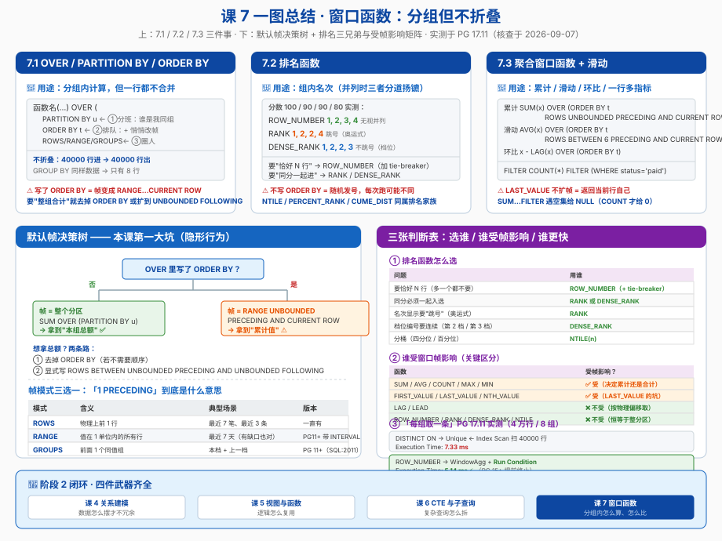

# 课 7 · 窗口函数

> 📍 故事中的位置：每个用户、每个部门、每个品类——主角开始被"分组后再排名"

## 本课目标

学完本课后，你能：

1. 用 `OVER (PARTITION BY ... ORDER BY ...)` 写出"分组内的运算"，并说清它和 `GROUP BY` 的本质区别（**不折叠**）
2. 用 `ROW_NUMBER` / `RANK` / `DENSE_RANK` 做排名，能**预判并列时会不会跳号**，并知道该选哪一个
3. 用聚合函数 + 帧子句做**累计 / 滑动**计算，用 `LAG` / `LEAD` 做环比，并用 `FILTER` 一行产出多个指标
4. 说清**默认帧**这个隐形陷阱：`SUM() OVER (ORDER BY x)` 到底是"分区合计"还是"累计值"

## 知识点清单

| 知识点 | 关键点 |
|---|---|
| **7.1 OVER / PARTITION BY / ORDER BY** | · 窗口函数的"**不折叠**"语义（每行都返回一行） · `PARTITION BY` = 分组但不合并 · `ORDER BY` 决定组内顺序（同时**悄悄改变窗口帧**） · 帧子句 `ROWS` / `RANGE` / `GROUPS` 三者差别（**PG 11+ 完整支持 SQL:2011**） · 默认帧陷阱：`ORDER BY` 存在时 = `RANGE UNBOUNDED PRECEDING AND CURRENT ROW` |
| **7.2 排名函数** | · `ROW_NUMBER`（强制唯一，永不并列） · `RANK`（并列同名次，**跳号**：1,2,2,4） · `DENSE_RANK`（并列同名次，**不跳号**：1,2,2,3） · `NTILE` / `PERCENT_RANK` / `CUME_DIST` · 三选一的决策判据 · `WINDOW` 命名窗口复用 |
| **7.3 聚合窗口函数 + 滑动** | · 聚合函数作窗口：`SUM/AVG/COUNT/MAX/MIN OVER (...)` · `LAG` / `LEAD` 取前后行（环比 / 同比） · `FIRST_VALUE` / `LAST_VALUE` / `NTH_VALUE` 与**帧陷阱** · 滑动窗口：`ROWS BETWEEN 6 PRECEDING AND CURRENT ROW` · `FILTER` 子句一行多指标 · `DISTINCT ON` vs `ROW_NUMBER() = 1` 的取舍 |

## 故事主线中的情节定位

主角开始被"**分组后再排名**"——"每个用户的消费金额在同等级用户里的排名"、"每个商品在所属品类里的销量排名"。读者第一次看到"**分组与不分组**"的差异：同样是按用户聚合，`GROUP BY` 把 8 个用户压成 8 行，窗口函数却让 40000 行订单**一行不少**，只是每行多背了一个"本用户总额"的标签。

## 正文

## 📌 知识点导航

本课首批（首批 = 课 7 全部 3 个知识点，阶段 2 **收官课**）覆盖：

| 节 | 知识点 | 核心问题 |
|---|---|---|
| 第三幕（一） | 7.1 OVER / PARTITION BY / ORDER BY | 怎么"分组但不合并"，以及帧到底框住了谁 |
| 第三幕（二） | 7.2 排名函数 | 并列的时候，名次怎么算才是对的 |
| 第三幕（三） | 7.3 聚合窗口函数 + 滑动 | 累计、滑动、环比怎么做，以及 FILTER 怎么用 |

---

## 第一幕 · 起源与场景引入

### 一个真实的工作场景

周五下午，PM 又来了，这次一口气提了四个需求：

> 1. 「给每个用户算一个**消费总额**，但要能看到每一笔订单——我要知道**这笔订单占他总额的百分之几**」
> 2. 「每个用户的订单按时间排个号，我要**每个人最近的三笔**」
> 3. 「按品类搞个**销量排行榜**，同分的商品要并列，但名次我想看**跳号的那种**（奥运式）」
> 4. 「做个日报：每日销售额、**累计销售额**、**近 3 日滑动平均**、以及**环比昨天涨了百分之几**」

你用已经学过的东西硬写：

```sql
-- 需求 1：用子查询 join 回来
SELECT o.id, o.user_id, o.amount, t.total
FROM finance.orders o
JOIN (SELECT user_id, SUM(amount) AS total FROM finance.orders GROUP BY user_id) t
  ON t.user_id = o.user_id;

-- 需求 4：累计销售额要自连接 + 求和
SELECT a.day, a.sales, SUM(b.sales) AS running
FROM daily_totals a
JOIN daily_totals b ON b.day <= a.day
GROUP BY a.day, a.sales;
```

**能跑，但每一个都要写一个自连接或者子查询**，而且需求 4 那个自连接是 **O(n²)** —— 10 天还好，1000 天就是 50 万行中间结果。

**窗口函数就是为这四个需求一起生的：**

```sql
-- 需求 1：一行都不折叠，每行背上"本用户总额"
SELECT id, user_id, amount,
       SUM(amount) OVER (PARTITION BY user_id) AS user_total
FROM finance.orders;

-- 需求 2：分组编号，取前三
SELECT * FROM (
    SELECT id, user_id, amount,
           ROW_NUMBER() OVER (PARTITION BY user_id ORDER BY created_at DESC) AS rn
    FROM finance.orders
) t WHERE rn <= 3;

-- 需求 3：奥运式排名
SELECT product_id, sales,
       RANK() OVER (PARTITION BY category_id ORDER BY sales DESC) AS rnk
FROM product_sales;

-- 需求 4：一次扫完，四个指标并列
SELECT day, sales,
       SUM(sales) OVER (ORDER BY day)                                        AS running,
       AVG(sales) OVER (ORDER BY day ROWS BETWEEN 2 PRECEDING AND CURRENT ROW) AS ma3,
       LAG(sales) OVER (ORDER BY day)                                        AS prev_day
FROM daily_totals;
```

**同一份数据、一次扫描、四个维度。** 这就是窗口函数的价值。

### 一个关于"不折叠"的小类比

把 SQL 的聚合想成**老师统计成绩**：

| 写法 | 老师在做什么 | 结果 |
|---|---|---|
| **`GROUP BY`** | 老师**收全班卷子**，算出"平均分 82"，写在黑板上 | 全班只剩**一个数字**，你看不到张三考了多少 |
| **窗口函数** | 老师**走到每张课桌前**，在张三卷子右上角写"班级平均 82" | **每张卷子都还在**，只是多了一个标签 |
| **相关子查询**（课 6） | 老师每看一张卷子，就**重新跑一趟办公室**查平均分 | 卷子也都在，但跑 40 趟 |
| **自连接** | 老师把**全班卷子复印 40 份**摊一地 | 卷子在，但地不够大 |

**窗口函数 = 一次扫描，给每行贴标签。** 卷子不折叠，也不用跑多趟。

> 💡 一句话：**`GROUP BY` 是把群体压成一行，窗口函数是把群体的信息"广播"回每一行。**

---

## 第二幕 · 认知冲突

窗口函数看起来就是"更好写的聚合"，**实际落地有 5 类隐藏陷阱**——而且网上大量的教程**说法已经过期**：

### 陷阱 1：以为它跟 `GROUP BY` 一样会合并行

```sql
SELECT user_id, SUM(amount) FROM finance.orders GROUP BY user_id;   -- 8 行
SELECT user_id, SUM(amount) OVER (PARTITION BY user_id) FROM finance.orders;  -- 40000 行！
```

**一个 8 行，一个 4 万行。** 忘了这点，你的 `COUNT(*)` 会突然从 8 变成 40000，报表直接翻倍。

### 陷阱 2：`SUM() OVER (ORDER BY x)` 不是"合计"，是"累计"

这是**本课最大的坑**，而且它是**隐形的**：

```sql
SUM(amount) OVER (PARTITION BY user_id)              -- ✅ 用户总额（无 ORDER BY = 整分区）
SUM(amount) OVER (PARTITION BY user_id ORDER BY created_at)  -- ⚠️ 累计到当前行为止！
```

只要你在 `OVER` 里写了 `ORDER BY`，PG 就会**悄悄把窗口帧改成** `RANGE BETWEEN UNBOUNDED PRECEDING AND CURRENT ROW`。你以为要的是总额，拿到的是流水账。

**想要总额怎么办？** 去掉 `ORDER BY`，或者显式写 `ROWS BETWEEN UNBOUNDED PRECEDING AND UNBOUNDED FOLLOWING`。

### 陷阱 3：`LAST_VALUE` 不返回最后一行

```sql
LAST_VALUE(sales) OVER (ORDER BY day)   -- 返回的是"当前行"，不是最后一行！
```

同样是默认帧害的：帧到 `CURRENT ROW` 就停了，所以"帧内最后一行"就是当前行自己。**必须显式扩到 `UNBOUNDED FOLLOWING`。**

### 陷阱 4：窗口函数不能进 `WHERE`

```sql
SELECT ..., ROW_NUMBER() OVER (...) AS rn FROM orders WHERE rn <= 3;
-- ERROR:  column "rn" does not exist
```

因为**执行顺序**是 `WHERE` → `GROUP BY` → 窗口函数 → `ORDER BY`。`WHERE` 跑的时候 `rn` 还没生出来。**必须包一层 CTE / 子查询。**

### 陷阱 5：以为 `DISTINCT ON` 一定比 `ROW_NUMBER()` 快 —— **PG 15/16 之后这话不成立了**

所有中文教程都在说"DISTINCT ON 更快"。**这句话在 PG 15 之后需要加限定条件。** 我在 PG 17.11 上实测（4 万行订单，8 个用户，有 `(user_id, created_at DESC)` 索引）：

| 写法 | 执行时间 | 执行计划 |
|---|---|---|
| `DISTINCT ON` | **7.33 ms** | `Unique` ← `Index Scan`（扫 40000 行） |
| `ROW_NUMBER()` + `WHERE rn = 1` | **5.14 ms** ⚡ | `WindowAgg` ← `Index Scan`，带 `Run Condition` |

**`ROW_NUMBER()` 反而更快。** 原因是 PG 15 引入、PG 16 加强的优化：规划器发现"外层只要 `rn <= N`，而 `row_number()` 单调递增"，于是把它下推成 **`Run Condition`**——一旦行号超过 N 就停止。全局 top-N 场景下这个差距是**数量级**的（本课实验 9d 实测：4 万行表取 top-5，**只读了 6 行，0.065 ms**）。

> ⚠️ **所以本课给的不是"哪个更快"的口号，而是"看执行计划里有没有 `Run Condition`"的判据。**

---

## 第三幕 · 层层揭示

### （一）7.1 OVER / PARTITION BY / ORDER BY

#### 一句话定义

> **窗口函数**在一组"与当前行相关的行"（称为**窗口 / window**）上做计算，**但不把多行合并成一行**——每一行都保留，只是多出一个计算列。

#### 直觉建立 · 一个随身计算器

给结果集的**每一行**发一个**随身计算器**。这个计算器：

- 能看到**同组**的其他行（`PARTITION BY` 决定"同组"是谁）
- 能按**指定顺序**看（`ORDER BY`）
- 能选择**只看队伍里的一段**（帧子句 `ROWS` / `RANGE` / `GROUPS`）

> **类比边界**：窗口函数不是"视图"，也不落盘；它只是**查询执行时的一个计算步骤**。它也不能进 `WHERE` / `HAVING`（必须先算出来再过滤）。

#### 核心原理 · `OVER` 的三层结构

```sql
函数名(...) OVER (
    PARTITION BY 分组列        -- ① 分班：决定"我的同学是谁"
    ORDER BY 排序列            -- ② 排队：决定"我在队伍第几个" + 悄悄改变帧
    帧模式 BETWEEN 起点 AND 终点  -- ③ 圈人：决定"我实际能看见哪几行"
)
```

| 层 | 作用 | 不写会怎样 |
|---|---|---|
| `PARTITION BY` | 把行分成互不干扰的组，函数**在组内**计算，跨组重置 | **整个结果集算一组** |
| `ORDER BY` | 决定组内顺序（排名 / 累计 / `LAG` 都需要它） | 顺序不确定；**且帧变成整分区** |
| 帧子句 | 圈定"当前行能看到哪几行" | 有 `ORDER BY` → `RANGE UNBOUNDED PRECEDING AND CURRENT ROW`；无 `ORDER BY` → 整分区 |

#### 帧模式三选一：`ROWS` / `RANGE` / `GROUPS`

| 模式 | "1 PRECEDING" 是什么意思 | 适合场景 | PG 版本 |
|---|---|---|---|
| **`ROWS`** | **物理上**的前 1 行 | "最近 7 笔订单"、"最近 3 条记录"——按**行数**算 | 一直支持 |
| **`RANGE`** | ORDER BY 值**在 1 个单位以内**的所有行 | "最近 7 天"（有日期缺口也对）、"同分数的人" | 一直支持；**PG 11+ 支持 `INTERVAL` 偏移** |
| **`GROUPS`** | 前面的 **1 个同值组**（peer group） | "我这一档 + 上一档" | **PG 11+**（SQL:2011） |

> **PG 11 官方 release notes 原文**："Window functions now support all framing options shown in the SQL:2011 standard, including `RANGE` distance `PRECEDING`/`FOLLOWING`, `GROUPS` mode, and frame exclusion options."（commit `0a459cec9`，Oliver Ford + Tom Lane，**核查于 2026-09-07**）

**帧边界关键字：**

| 边界 | 含义 |
|---|---|
| `UNBOUNDED PRECEDING` | 分区第一行 |
| `n PRECEDING` | 往前 n 行 / n 个单位 / n 个组 |
| `CURRENT ROW` | 当前行（`ROWS` 下 = 自己；`RANGE` 下 = **所有同值的行**） |
| `n FOLLOWING` | 往后 n 行 / n 个单位 / n 个组 |
| `UNBOUNDED FOLLOWING` | 分区最后一行 |

**PG 11+ 还有帧排除子句 `EXCLUDE`**（极少用，但知道它存在）：

| 子句 | 效果 |
|---|---|
| `EXCLUDE NO OTHERS` | 默认，都包含 |
| `EXCLUDE CURRENT ROW` | 排除当前行 |
| `EXCLUDE GROUP` | 排除当前行所在的同值组 |
| `EXCLUDE TIES` | 同值组里只保留当前行 |

#### 示例演示 · ROWS 与 RANGE 在并列值上的天壤之别

数据：每天两个班次（`早班` / `晚班`），`ORDER BY day` 时**每天两行是并列值**。

```sql
SELECT day, shift, sales,
       SUM(sales) OVER (ORDER BY day ROWS BETWEEN UNBOUNDED PRECEDING AND CURRENT ROW) AS sum_rows,
       SUM(sales) OVER (ORDER BY day)                                                   AS sum_default,
       SUM(sales) OVER (ORDER BY day RANGE BETWEEN UNBOUNDED PRECEDING AND CURRENT ROW) AS sum_range
FROM finance.daily_sales ORDER BY day, shift LIMIT 8;
```

**实测输出（PG 17.11）：**

```text
    day     | shift | sales  | sum_rows | sum_default | sum_range
------------+-------+--------+----------+-------------+-----------
 2026-08-01 | 早班  | 343.68 |   343.68 |      679.38 |    679.38
 2026-08-01 | 晚班  | 335.70 |   679.38 |      679.38 |    679.38
 2026-08-02 | 早班  | 297.64 |   977.02 |     1211.07 |   1211.07
 2026-08-02 | 晚班  | 234.05 |  1211.07 |     1211.07 |   1211.07
 2026-08-03 | 早班  |  73.00 |  1284.07 |     1621.38 |   1621.38
 2026-08-03 | 晚班  | 337.31 |  1621.38 |     1621.38 |   1621.38
 2026-08-04 | 早班  | 341.60 |  1962.98 |     2116.30 |   2116.30
 2026-08-04 | 晚班  | 153.32 |  2116.30 |     2116.30 |   2116.30
```

看第一行：`sum_rows = 343.68`（只算到早班），`sum_default = 679.38`（**一天两班都算进去了**）。

**这证明两件事：**
1. `sum_default` 和 `sum_range` **完全一样** → 默认帧确实是 `RANGE ... CURRENT ROW`
2. `RANGE` 下的 `CURRENT ROW` = "所有 `day` 相同的行"，**不是一行**

#### 示例演示 · 不带 `ORDER BY` 才是整分区

```sql
SELECT day, shift, sales,
       SUM(sales) OVER ()                 AS total_all,
       SUM(sales) OVER (PARTITION BY day) AS total_day
FROM finance.daily_sales ORDER BY day, shift LIMIT 4;
```

```text
    day     | shift | sales  | total_all | total_day
------------+-------+--------+-----------+-----------
 2026-08-01 | 早班  | 343.68 |   4487.53 |    679.38
 2026-08-01 | 晚班  | 335.70 |   4487.53 |    679.38
 2026-08-02 | 早班  | 297.64 |   4487.53 |    531.69
 2026-08-02 | 晚班  | 234.05 |   4487.53 |    531.69
```

**`OVER ()` 空括号 = 整张表一个窗口**，常用来算"占比的分母"。

#### 常见误区（7.1）

| # | ❌ 误区 | ✅ 正确 |
|---|---|---|
| 1 | "窗口函数跟 `GROUP BY` 差不多，都会减少行数" | **完全不减行**。4 万行进，4 万行出 |
| 2 | "`SUM(x) OVER (PARTITION BY u ORDER BY t)` 是用户总额" | 是**累计到当前行**。要总额就去掉 `ORDER BY` |
| 3 | "`ORDER BY` 只影响顺序" | **还改了窗口帧**——这才是隐形杀手 |
| 4 | "`ROWS` 和 `RANGE` 一样，随便写" | 有并列值时完全不同（见上面实测） |
| 5 | "`GROUPS` 是 PG 新出的，别用" | PG 11（2018）就有了，SQL:2011 标准，现在完全可以放心用 |
| 6 | "窗口函数可以写在 `WHERE` 里过滤" | **不行**，执行顺序在 `WHERE` 之后，必须包一层 |

#### 一句话记住

> **`PARTITION BY` 分班，`ORDER BY` 排队（并悄悄改帧），帧子句圈定能看见谁；不写 `ORDER BY` 才是"整班一起算"。**

#### 命令速查卡 · 7.1

```sql
-- 分组合计（不折叠）
SUM(amount)   OVER (PARTITION BY user_id)                  AS user_total
COUNT(*)      OVER (PARTITION BY user_id)                  AS user_cnt
-- 全局分母
SUM(amount)   OVER ()                                      AS grand_total
-- 占比
ROUND(100.0 * amount / SUM(amount) OVER (PARTITION BY user_id), 2) AS pct
-- 累计（显式写帧，别指望默认）
SUM(amount)   OVER (PARTITION BY user_id ORDER BY created_at
                    ROWS BETWEEN UNBOUNDED PRECEDING AND CURRENT ROW) AS running
-- 整分区聚合（防止被默认帧坑）
SUM(amount)   OVER (PARTITION BY user_id
                    ROWS BETWEEN UNBOUNDED PRECEDING AND UNBOUNDED FOLLOWING) AS total
-- 滑动：最近 7 行 / 最近 7 天
AVG(amount)   OVER (ORDER BY created_at ROWS BETWEEN 6 PRECEDING AND CURRENT ROW)  AS ma7_rows
AVG(amount)   OVER (ORDER BY created_at RANGE BETWEEN INTERVAL '6 days' PRECEDING AND CURRENT ROW) AS ma7_range
-- GROUPS（PG 11+）
SUM(sales)    OVER (ORDER BY day GROUPS BETWEEN 1 PRECEDING AND CURRENT ROW)  AS two_groups
-- 排除自己算平均（PG 11+）
AVG(x)        OVER (ORDER BY id ROWS BETWEEN UNBOUNDED PRECEDING AND UNBOUNDED FOLLOWING
                    EXCLUDE CURRENT ROW)                   AS avg_others
```

---

### （二）7.2 排名函数

#### 一句话定义

> **排名函数**给分区内的每一行一个"位置编号"。三兄弟（`ROW_NUMBER` / `RANK` / `DENSE_RANK`）**在列值不重复时结果完全一样，只在出现并列时分道扬镳**。

#### 直觉建立 · 三种发号码牌的方式

想象一场考试，分数是 `100, 90, 90, 80`：

| 函数 | 发牌规则 | 结果 | 类比 |
|---|---|---|---|
| **`ROW_NUMBER`** | 发**学号**：不管分数，一人一号，绝不重复 | 1, 2, 3, 4 | 排队叫号 |
| **`RANK`** | 发**奥运奖牌名次**：同分同名次，**后面的名次被吃掉** | 1, 2, 2, **4** | 两个金牌就没有银牌 |
| **`DENSE_RANK`** | 发**档位编号**：同分同档，**档号连续** | 1, 2, 2, **3** | 分数有几个不同的档 |

> **官方定义（PG 18 docs, Table 9.67，核查于 2026-09-07）**：
> - `row_number()` —— 分区内当前行的编号，从 1 开始
> - `rank()` —— 当前行的排名，**带间隔**；即"其同值组中第一行的 `row_number`"
> - `dense_rank()` —— 当前行的排名，**不带间隔**；本质是在数"有几个同值组"

> **类比边界**：这三个都**必须先有 `ORDER BY`** 才有意义（不写 `ORDER BY` 就是随机发号）；它们都不减少行数。

#### 核心原理 · 并列时到底发生了什么

关键概念：**同值组（peer group）** = `ORDER BY` 列值完全相同的那些行。

- `ROW_NUMBER` **无视**同值组 → 组内顺序不确定，结果**不稳定**
- `RANK` 用"同值组首行的行号"当名次 → 组里有 2 人，后面就空掉 1 个号
- `DENSE_RANK` 数"前面有几个同值组" → 永不空号

#### 示例演示 · 三兄弟实测对照

```sql
WITH s(name, score) AS (
    VALUES ('Ana',100), ('Bruno',90), ('Carla',90), ('Diego',80), ('Eva',70)
)
SELECT name, score,
       ROW_NUMBER() OVER (ORDER BY score DESC) AS rn,
       RANK()       OVER (ORDER BY score DESC) AS rnk,
       DENSE_RANK() OVER (ORDER BY score DESC) AS dense
FROM s ORDER BY score DESC, name;
```

**实测输出（PG 17.11）：**

```text
 name  | score | rn | rnk | dense
-------+-------+----+-----+-------
 Ana   |   100 |  1 |   1 |     1
 Bruno |    90 |  2 |   2 |     2
 Carla |    90 |  3 |   2 |     2
 Diego |    80 |  4 |   4 |     3
 Eva   |    70 |  5 |   5 |     4
```

盯住 Diego 那行：`RANK` 给他 **4**（2、3 号被并列吃掉了），`DENSE_RANK` 给他 **3**（不跳号），`ROW_NUMBER` 给他 4（只是恰好排第 4，跟并列无关）。

#### 示例演示 · 分组 top-N：三兄弟决定了"谁入选"

```sql
WITH s(uid, name, score) AS (
    VALUES (1,'A',100),(1,'B',90),(1,'C',90),(1,'D',80),
           (2,'E',70),(2,'F',70),(2,'G',70),(2,'H',60)
)
SELECT uid, name, score,
       ROW_NUMBER() OVER w AS rn,
       RANK()       OVER w AS rnk,
       DENSE_RANK() OVER w AS dense
FROM s WINDOW w AS (PARTITION BY uid ORDER BY score DESC)
ORDER BY uid, score DESC;
```

```text
 uid | name | score | rn | rnk | dense
-----+------+-------+----+-----+-------
   1 | A    |   100 |  1 |   1 |     1
   1 | B    |    90 |  2 |   2 |     2
   1 | C    |    90 |  3 |   2 |     2
   1 | D    |    80 |  4 |   4 |     3
   2 | E    |    70 |  1 |   1 |     1
   2 | F    |    70 |  2 |   1 |     1
   2 | G    |    70 |  3 |   1 |     1
   2 | H    |    60 |  4 |   4 |     2
```

**如果你写 `WHERE rn <= 2`（取每组前 2 名）：**
- 第 1 组：`ROW_NUMBER` 给 A、B（C 也是 90 分却被刷掉 ⚠️）；`RANK`/`DENSE_RANK` 给 A、B、C（同分一起进 ✅）
- 第 2 组：`ROW_NUMBER` 给 E、F；`RANK`/`DENSE_RANK` 给 E、F、G 三人

> 注意上面用了 **`WINDOW w AS (...)` 命名窗口**——三个函数共用一份定义，可读性好，**执行计划里也只出现一个 `WindowAgg`**（见实验 9a）。

#### 排名家族的另外三个

| 函数 | 作用 | 例子 |
|---|---|---|
| `NTILE(n)` | 把分区尽量均分成 n 桶，返回桶号 | `NTILE(4)` = 四等分（四分位） |
| `PERCENT_RANK()` | 相对排名 = `(rank - 1) / (分区总行数 - 1)`，取值 0~1 | 0 = 第一名 |
| `CUME_DIST()` | 累积分布 = `(前面行数 + 同值行数) / 总行数`，取值 `1/N`~1 | "我超过了百分之几的人" |

> ⚠️ **PG 未实现的 SQL 标准特性**（官方文档明确说明）：`LEAD` / `LAG` / `FIRST_VALUE` / `LAST_VALUE` / `NTH_VALUE` 的 **`IGNORE NULLS`** 选项 PG **不支持**，行为恒等于 `RESPECT NULLS`（NULL 照常参与）。`NTH_VALUE` 的 `FROM LAST` 也不支持。（**核查于 2026-09-07**）

#### 常见误区（7.2）

| # | ❌ 误区 | ✅ 正确 |
|---|---|---|
| 1 | "三个排名函数差不多，随便选一个" | 有并列时**结果完全不同**，直接决定谁进 top-N |
| 2 | "`ROW_NUMBER` 结果稳定" | **不加 tie-breaker 就不稳定**——同值行谁先谁后可以变。写 `ORDER BY score DESC, id` |
| 3 | "想让同分都入选，用 `ROW_NUMBER`" | 用 `RANK` 或 `DENSE_RANK`。`ROW_NUMBER` 会**静默砍掉同分的人** |
| 4 | "`RANK` 和 `DENSE_RANK` 只是名字不同" | `RANK` 跳号（1,2,2,4），`DENSE_RANK` 不跳号（1,2,2,3） |
| 5 | "排名函数可以不写 `ORDER BY`" | 不写就是**随机发号**，每次跑可能不一样 |
| 6 | "`ROW_NUMBER() <= N` 会把全表扫完" | PG 15+ 会下推成 `Run Condition` **提前终止**（实验 9d 实测 4 万行只读 6 行） |

#### 一句话记住

> **要"恰好 N 行"用 `ROW_NUMBER`（记得加 tie-breaker）；要"同分一起进"用 `RANK`；要"档位连续"用 `DENSE_RANK`。**

#### 命令速查卡 · 7.2

```sql
-- 分组 top-N（最常用模板）
WITH ranked AS (
    SELECT *, ROW_NUMBER() OVER (PARTITION BY user_id ORDER BY created_at DESC, id) AS rn
    FROM finance.orders
)
SELECT * FROM ranked WHERE rn <= 3;          -- 必须包一层

-- 同分一起进
... WHERE RANK() OVER (...) <= 3             -- 不能直接用，同样要包一层

-- 命名窗口复用（推荐）
SELECT ROW_NUMBER() OVER w AS rn,
       RANK()       OVER w AS rnk,
       DENSE_RANK() OVER w AS dense
FROM t WINDOW w AS (PARTITION BY uid ORDER BY score DESC);

-- 分位数
NTILE(4)        OVER (ORDER BY amount DESC) AS quartile
PERCENT_RANK()  OVER (ORDER BY amount DESC) AS pct_rank
CUME_DIST()     OVER (ORDER BY amount DESC) AS cume

-- 全局分页式 top-N（PG 15+ 提前终止）
SELECT * FROM (SELECT id, amount, ROW_NUMBER() OVER (ORDER BY amount DESC) AS rn FROM t) x
WHERE rn <= 5;
```

---

### （三）7.3 聚合窗口函数 + 滑动

#### 一句话定义

> **任何普通聚合函数**（`SUM` / `AVG` / `COUNT` / `MAX` / `MIN` / `STRING_AGG` …）只要后面跟 `OVER`，就变成窗口函数：它**在窗口帧内**聚合，**每行都产出一个值**。

#### 直觉建立 · 一个会滑动的框

想象一条时间轴上摆着每天的销售额。窗口帧就是**一个可以滑动的框**：

- 框的左边界钉死在起点、右边界跟着当前行走 → **累计值**
- 框的宽度固定为 7 天、整体跟着当前行滑 → **7 日滑动平均**
- 框撑满整个分区 → **分区合计**

`ROWS` 按"**几个格子**"量框宽，`RANGE` 按"**几格距离**"量框宽，`GROUPS` 按"**几摞（同值组）**"量框宽。

#### 核心原理 · 四类窗口函数

| 类别 | 成员 | 依赖 `ORDER BY`？ | 受帧影响？ |
|---|---|---|---|
| **聚合类** | `SUM` / `AVG` / `COUNT` / `MAX` / `MIN` / `STRING_AGG` | 决定是"累计"还是"合计" | ✅ 是 |
| **排名类** | `ROW_NUMBER` / `RANK` / `DENSE_RANK` / `NTILE` / `PERCENT_RANK` / `CUME_DIST` | **必须** | ❌ 否（恒等于整分区） |
| **取值类** | `LAG` / `LEAD` | **必须** | ❌ 否（按物理偏移取行） |
| **取值类** | `FIRST_VALUE` / `LAST_VALUE` / `NTH_VALUE` | **必须** | ✅ 是（**这就是 `LAST_VALUE` 的坑**） |

> 💡 记住这张表：**`LAG`/`LEAD`/排名函数不看帧，聚合和 `FIRST/LAST/NTH_VALUE` 看帧。**

#### 示例演示 · 累计 + 滑动 + 环比（一口气做完）

```sql
WITH d AS (SELECT day, SUM(sales) AS sales FROM finance.daily_sales GROUP BY day)
SELECT day, sales,
       SUM(sales) OVER (ORDER BY day)                                                AS running,
       ROUND(AVG(sales) OVER (ORDER BY day ROWS BETWEEN 2 PRECEDING AND CURRENT ROW), 2) AS ma3,
       LAG(sales)  OVER (ORDER BY day)                                               AS prev_day,
       ROUND(100.0 * (sales - LAG(sales) OVER (ORDER BY day))
                   / LAG(sales) OVER (ORDER BY day), 2)                              AS pct
FROM d ORDER BY day;
```

**实测输出（PG 17.11，节选前 6 行）：**

```text
    day     | sales  | running |  ma3   | prev_day |  pct
------------+--------+---------+--------+----------+--------
 2026-08-01 | 679.38 |  679.38 | 679.38 |          |
 2026-08-02 | 531.69 | 1211.07 | 605.54 |   679.38 | -21.74
 2026-08-03 | 410.31 | 1621.38 | 540.46 |   531.69 | -22.83
 2026-08-04 | 494.92 | 2116.30 | 478.97 |   410.31 |  20.62
 2026-08-05 | 547.23 | 2663.53 | 484.15 |   494.92 |  10.57
 2026-08-06 | 340.66 | 3004.19 | 460.94 |   547.23 | -37.75
```

- `running` 只增不减 → 累计
- `ma3` 是"今天 + 前两天"的平均 → 3 日滑动
- 第一行的 `LAG` 是 `NULL`（没有前一行），所以 `pct` 也是 `NULL` ✅ 正确行为

> **这里 `ma3` 用 `ROWS` 和 `RANGE` 结果一样**，因为聚合后每天只有一行、没有并列值。**有并列值时两者会分叉**（见实验 3）。

#### 示例演示 · `LAST_VALUE` 陷阱与修复

```sql
WITH d AS (SELECT day, SUM(sales) AS sales FROM finance.daily_sales GROUP BY day)
SELECT day, sales,
       LAST_VALUE(sales)  OVER (ORDER BY day) AS lv_bad,
       FIRST_VALUE(sales) OVER (ORDER BY day) AS fv_ok,
       LAST_VALUE(sales)  OVER (ORDER BY day ROWS BETWEEN UNBOUNDED PRECEDING AND UNBOUNDED FOLLOWING) AS lv_fixed
FROM d ORDER BY day LIMIT 6;
```

```text
    day     | sales  | lv_bad | fv_ok  | lv_fixed
------------+--------+--------+--------+----------
 2026-08-01 | 679.38 | 679.38 | 679.38 |   432.40
 2026-08-02 | 531.69 | 531.69 | 679.38 |   432.40
 2026-08-03 | 410.31 | 410.31 | 679.38 |   432.40
 2026-08-04 | 494.92 | 494.92 | 679.38 |   432.40
 2026-08-05 | 547.23 | 547.23 | 679.38 |   432.40
 2026-08-06 | 340.66 | 340.66 | 679.38 |   432.40
```

**`lv_bad` 每行的值 = 该行自己的 `sales`**（因为帧只到 `CURRENT ROW`）。`lv_fixed` 才是真正的"最后一天" = 432.40。

> 📌 **替代写法**：想要"分区最后一行"其实更简单的办法是 `ORDER BY day DESC` 后用 `FIRST_VALUE`——但那会改变整个窗口的顺序，所以**显式扩帧是更通用的解法**。

#### 示例演示 · `FILTER` 子句：一行多指标

`FILTER` 是 **PG 9.4 引入**的 SQL 标准语法（**核查于 2026-09-07**）：给**单个聚合函数**挂一个过滤条件，其他聚合不受影响。

```sql
SELECT COUNT(*)                                    AS all_cnt,
       COUNT(*) FILTER (WHERE status = 'paid')     AS paid_cnt,
       COUNT(*) FILTER (WHERE status = 'refunded') AS refund_cnt,
       ROUND(100.0 * COUNT(*) FILTER (WHERE status = 'paid') / COUNT(*), 2) AS paid_pct,
       SUM(amount) FILTER (WHERE status = 'paid')  AS paid_amount
FROM finance.orders;
```

```text
 all_cnt | paid_cnt | refund_cnt | paid_pct | paid_amount
---------+----------+------------+----------+-------------
   40000 |    20000 |       6667 |    50.00 | 20200215.88
```

**一次扫描，五个指标。** 用 `CASE WHEN` 也能写，但 `FILTER` 更直白：

```sql
-- 等价但更啰嗦
COUNT(CASE WHEN status = 'paid' THEN 1 END)
SUM(CASE WHEN status = 'paid' THEN amount ELSE 0 END)
```

实测两者结果完全一致（`3333` / `3360926.42`），**性能也基本无差别**——`FILTER` 赢在可读性。

> ⚠️ **`FILTER` 的 NULL 语义**：`COUNT(*) FILTER (WHERE 假)` 返回 **0**，但 `SUM(x) FILTER (WHERE 假)` 返回 **NULL**（不是 0）。要 0 就套 `COALESCE`。实测：

```text
 cnt_all | cnt_none | sum_none | sum_none_safe
---------+----------+----------+---------------
   40000 |        0 |          |             0
```

#### 示例演示 · `DISTINCT ON` vs `ROW_NUMBER() = 1` 的取舍

这是 PG 的一个**经典决策点**。需求："每个用户最近一笔订单"。

```sql
-- 写法 A：PG 独有能力
SELECT DISTINCT ON (user_id) user_id, id, amount, created_at
FROM finance.orders ORDER BY user_id, created_at DESC;

-- 写法 B：标准 SQL，可移植
SELECT user_id, id, amount, created_at FROM (
    SELECT user_id, id, amount, created_at,
           ROW_NUMBER() OVER (PARTITION BY user_id ORDER BY created_at DESC) AS rn
    FROM finance.orders
) t WHERE rn = 1;
```

**实测执行计划（PG 17.11，4 万行，`(user_id, created_at DESC)` 索引）：**

```text
-- A: DISTINCT ON
 Unique (actual time=0.019..7.309 rows=8 loops=1)
   ->  Index Scan using idx_orders_user_created on orders (actual rows=40000 loops=1)
 Execution Time: 7.325 ms

-- B: ROW_NUMBER
 Subquery Scan on t (actual time=0.009..5.122 rows=8 loops=1)
   Filter: (t.rn = 1)
   ->  WindowAgg (actual time=0.009..5.121 rows=8 loops=1)
         Run Condition: (row_number() OVER (?) <= 1)
         ->  Index Scan using idx_orders_user_created on orders (actual rows=40000 loops=1)
 Execution Time: 5.137 ms
```

**结论（PG 17 实测）：`ROW_NUMBER()` 反而略快** —— 因为 `Run Condition` 让它每个分区只取到第一行就停。

**这个优化是版本相关的：**

| PG 版本 | 行为 |
|---|---|
| PG 14 及更早 | `DISTINCT ON` 通常更快（无提前终止） |
| **PG 15** | 引入 `Run Condition`：单调递增函数（`row_number()` / `rank()` / `dense_rank()` / `count()`）配合外层 `<= N` 时**提前终止**（**核查于 2026-09-07**） |
| **PG 16** | 扩大覆盖到 `ntile()` / `cume_dist()` / `percent_rank()`；并允许"本该用 `RANGE` 但其实无所谓"的函数内部改用更快的 `ROWS` 模式（David Rowley + Erwin Brandstetter） |

**决策判据（不是背答案，看这四条）：**

| 场景 | 选谁 | 理由 |
|---|---|---|
| 只要每组**第一行**、且是 PG 专有代码 | 两者都行，**看执行计划** | PG 15+ `ROW_NUMBER` 常有 `Run Condition` 优势 |
| 要每组**前 N 行**（N > 1） | **只能 `ROW_NUMBER`** | `DISTINCT ON` 只能取 1 行 |
| 要**跨库移植**（MySQL 8 / Oracle / SQL Server） | **只能 `ROW_NUMBER`** | `DISTINCT ON` 是 PG 独有 |
| **每组行数特别多、组数很少**（1000 组 × 200 行） | 考虑 **`LATERAL`** | `DISTINCT ON`/`ROW_NUMBER` 都要扫全分区；`LATERAL` 每组只走索引一次 |

> ⚠️ **`DISTINCT ON` 的硬约束**：`DISTINCT ON` 的列**必须是 `ORDER BY` 的开头几列**，否则报错。实测：
> ```
> ERROR:  SELECT DISTINCT ON expressions must match initial ORDER BY expressions
> ```
> 另外**不写 `ORDER BY` 时结果不确定**（PG 返回"扫到的第一行"），必须加 tie-breaker（如 `, id DESC`）。

#### 常见误区（7.3）

| # | ❌ 误区 | ✅ 正确 |
|---|---|---|
| 1 | "`SUM(x) OVER (ORDER BY t)` 是总额" | 是**累计**。想要总额：去掉 `ORDER BY` 或显式 `UNBOUNDED FOLLOWING` |
| 2 | "`LAST_VALUE(x) OVER (ORDER BY t)` 返回最后一行" | 默认帧下返回**当前行**。必须 `ROWS BETWEEN UNBOUNDED PRECEDING AND UNBOUNDED FOLLOWING` |
| 3 | "`LAG` 也要配帧子句" | **不用**——`LAG`/`LEAD` 按物理偏移取行，不受帧影响 |
| 4 | "`FILTER` 是 PG 独有的" | 是 **SQL 标准**（PG 9.4+ 实现），MySQL 不支持但 Oracle/SQLite 有等价 |
| 5 | "`SUM(x) FILTER (WHERE 假)` 返回 0" | 返回 **NULL**。`COUNT` 才返回 0 |
| 6 | "`DISTINCT ON` 一定更快" | **PG 15+ 起不一定**——看执行计划里有没有 `Run Condition` |

#### 一句话记住

> **帧决定聚合看到谁；`LAG`/`LEAD` 和排名不看帧；`FILTER` 给单个聚合挂条件；每组取一条先看执行计划再说快慢。**

#### 命令速查卡 · 7.3

```sql
-- 累计
SUM(x) OVER (ORDER BY t ROWS BETWEEN UNBOUNDED PRECEDING AND CURRENT ROW)
-- 滑动（最近 7 行 / 最近 7 天）
AVG(x) OVER (ORDER BY t ROWS BETWEEN 6 PRECEDING AND CURRENT ROW)
AVG(x) OVER (ORDER BY t RANGE BETWEEN INTERVAL '6 days' PRECEDING AND CURRENT ROW)
-- 前后行
LAG(x)  OVER (PARTITION BY k ORDER BY t)              -- 上一行
LAG(x, 1, 0) OVER (PARTITION BY k ORDER BY t)         -- 无上一行时给 0
LEAD(x) OVER (PARTITION BY k ORDER BY t)              -- 下一行
-- 环比
x - LAG(x) OVER (ORDER BY t)                          AS diff
ROUND(100.0 * (x - LAG(x) OVER w) / LAG(x) OVER w, 2) AS pct   -- 配合 WINDOW w
-- 首末值（注意帧！）
FIRST_VALUE(x) OVER (ORDER BY t)                                                          -- 安全
LAST_VALUE(x)  OVER (ORDER BY t ROWS BETWEEN UNBOUNDED PRECEDING AND UNBOUNDED FOLLOWING) -- 必须扩帧
NTH_VALUE(x, 3) OVER (ORDER BY t ROWS BETWEEN UNBOUNDED PRECEDING AND UNBOUNDED FOLLOWING)
-- FILTER
COUNT(*) FILTER (WHERE cond)      AS cnt_cond
SUM(x)   FILTER (WHERE cond)      AS sum_cond           -- 注意可能 NULL
COALESCE(SUM(x) FILTER (WHERE cond), 0) AS sum_safe
-- FILTER 也能配窗口
COUNT(*) FILTER (WHERE status = 'paid') OVER (PARTITION BY user_id) AS paid_cnt_of_user
-- DISTINCT ON
SELECT DISTINCT ON (user_id) user_id, ... FROM orders ORDER BY user_id, created_at DESC, id DESC;
```

---

## 第四幕 · 实操验证

> 以下 9 组实验全部在 **PostgreSQL 17.11（Docker）** 上实跑。环境：`order_service` 库 / `finance` schema，40000 条订单 / 8 个用户 / 20 行日销售（每天两班，故意造并列值）。
>
> 起环境（若本机 5432 被占用，改用 5433）：
> ```bash
> docker run -d --name pg17 -e POSTGRES_PASSWORD=postgres \
>   -e POSTGRES_DB=order_service -p 5433:5432 postgres:17
> ```

### 实验 1 · 不折叠 vs 折叠：同一个 `SUM` 的两种命运

```sql
-- 1a GROUP BY：折叠成 8 行
SELECT user_id, COUNT(*) AS cnt, SUM(amount) AS total
FROM finance.orders GROUP BY user_id ORDER BY user_id;

-- 1b 窗口：40000 行一行不少
SELECT id, user_id, amount,
       SUM(amount) OVER (PARTITION BY user_id) AS user_total,
       COUNT(*)    OVER (PARTITION BY user_id) AS user_cnt
FROM finance.orders ORDER BY user_id, id LIMIT 10;
```

**1a 输出（8 行）：**

```text
 user_id | cnt  |   total
---------+------+------------
       1 | 5000 | 5002313.67
       2 | 5000 | 5002510.38
       3 | 5000 | 5039887.51
       4 | 5000 | 5030993.86
       5 | 5000 | 5114786.36
       6 | 5000 | 4978761.04
       7 | 5000 | 5089805.14
       8 | 5000 | 5052201.43
```

**1b 输出（前 10 行，注意 `user_total` 每行重复同一个值）：**

```text
 id | user_id | amount  | user_total | user_cnt
----+---------+---------+------------+----------
  8 |       1 |  417.02 | 5002313.67 |     5000
 16 |       1 |  992.61 | 5002313.67 |     5000
 24 |       1 |  357.54 | 5002313.67 |     5000
 32 |       1 | 1296.47 | 5002313.67 |     5000
 40 |       1 | 1283.51 | 5002313.67 |     5000
 48 |       1 | 1763.31 | 5002313.67 |     5000
 56 |       1 |  132.08 | 5002313.67 |     5000
 64 |       1 |  503.66 | 5002313.67 |     5000
 72 |       1 | 1027.96 | 5002313.67 |     5000
 80 |       1 | 1575.04 | 5002313.67 |     5000
```

✅ **验收点**：`GROUP BY` 把 40000 压成 8；窗口版本还是 40000 行，但每行都背着"本用户总额"。

### 实验 2 · 排名三兄弟与并列跳号

见第三幕 7.2 的两个实测输出。
✅ **验收点**：`RANK` 出现 `1,2,2,4`（跳号），`DENSE_RANK` 是 `1,2,2,3`（不跳号），`ROW_NUMBER` 是 `1,2,3,4`（无视并列）。

### 实验 3 · 默认帧陷阱：`ROWS` vs `RANGE` 在并列值上

见第三幕 7.1 的实测输出。
✅ **验收点**：第一行 `sum_rows = 343.68` 而 `sum_default = 679.38`，且 `sum_default == sum_range` —— 默认帧 = `RANGE ... CURRENT ROW`，`CURRENT ROW` 包含**所有同值行**。

### 实验 4 · `LAST_VALUE` 陷阱与修复

见第三幕 7.3。
✅ **验收点**：`lv_bad` 每行 = 自己；`lv_fixed` 全部 = 432.40（最后一天）。

### 实验 5 · 累计 / 滑动 / `GROUPS` 模式

```sql
-- 5b GROUPS 模式（PG 11+）：当前组 + 前一组
SELECT day, shift, sales,
       SUM(sales) OVER (ORDER BY day GROUPS BETWEEN 1 PRECEDING AND CURRENT ROW) AS groups_2,
       SUM(sales) OVER (ORDER BY day ROWS  BETWEEN 1 PRECEDING AND CURRENT ROW)  AS rows_2
FROM finance.daily_sales ORDER BY day, shift LIMIT 8;
```

```text
    day     | shift | sales  | groups_2 | rows_2
------------+-------+--------+----------+--------
 2026-08-01 | 早班  | 343.68 |   679.38 | 343.68
 2026-08-01 | 晚班  | 335.70 |   679.38 | 679.38
 2026-08-02 | 早班  | 297.64 |  1211.07 | 633.34
 2026-08-02 | 晚班  | 234.05 |  1211.07 | 531.69
 2026-08-03 | 早班  |  73.00 |   942.00 | 307.05
 2026-08-03 | 晚班  | 337.31 |   942.00 | 410.31
 2026-08-04 | 早班  | 341.60 |   905.23 | 678.91
 2026-08-04 | 晚班  | 153.32 |   905.23 | 494.92
```

✅ **验收点**：`GROUPS` 下同一天两行**值相同**（679.38 / 679.38）——因为它按"组"算；`ROWS` 下两行递增（343.68 → 679.38）——因为它按"行"算。

### 实验 6 · `LAG` 环比 + 窗口函数不能进 `WHERE`

```sql
-- 6b 报错复现
SELECT user_id, amount, ROW_NUMBER() OVER (PARTITION BY user_id ORDER BY amount DESC) AS rn
FROM finance.orders WHERE rn <= 3;
```

```text
ERROR:  column "rn" does not exist
LINE 2: FROM finance.orders WHERE rn <= 3;
                                  ^
```

✅ **验收点**：真实报错原文。正确写法是包一层 CTE / 子查询。

### 实验 7 · `FILTER` 一行多指标 + NULL 语义

见第三幕 7.3。
✅ **验收点**：`COUNT(*) FILTER (WHERE 假)` = **0**；`SUM(...) FILTER (WHERE 假)` = **NULL**。

### 实验 8 · `DISTINCT ON` vs `ROW_NUMBER()` 性能实测

见第三幕 7.3 的执行计划。

```sql
-- 8c DISTINCT ON 的硬约束：ORDER BY 必须匹配（报错复现）
SELECT DISTINCT ON (user_id) user_id, id, amount FROM finance.orders ORDER BY created_at DESC;
```

```text
ERROR:  SELECT DISTINCT ON expressions must match initial ORDER BY expressions
LINE 1: SELECT DISTINCT ON (user_id) user_id, id, amount FROM financ...
                            ^
```

✅ **验收点**：两个执行计划都在，且 `ROW_NUMBER` 版有 `Run Condition`。

### 实验 9 · 窗口定义复用 与 PG 15+ 提前终止

```sql
-- 9a 同一窗口定义（多函数复用）→ 1 个 WindowAgg
EXPLAIN (COSTS OFF)
SELECT user_id,
       ROW_NUMBER() OVER (PARTITION BY user_id ORDER BY created_at DESC) AS rn,
       RANK()       OVER (PARTITION BY user_id ORDER BY created_at DESC) AS rnk
FROM finance.orders;

-- 9b 不同窗口定义 → 2 个 WindowAgg
EXPLAIN (COSTS OFF)
SELECT user_id,
       ROW_NUMBER() OVER (PARTITION BY user_id ORDER BY created_at DESC) AS rn,
       SUM(amount)  OVER (PARTITION BY user_id)                          AS total
FROM finance.orders;
```

```text
--- 9a ---
 WindowAgg
   ->  Index Only Scan using idx_orders_user_created on orders

--- 9b ---
 WindowAgg
   ->  WindowAgg
         ->  Index Scan using idx_orders_user_created on orders
```

注意 9a 是 **Index Only Scan**（不回表），9b 退化成 **Index Scan** —— 多一个窗口定义，代价是实实在在的。

```sql
-- 9d 全局 top-N：PG 15+ 的 Run Condition 提前终止
CREATE INDEX idx_orders_amount ON finance.orders (amount DESC);
ANALYZE finance.orders;
EXPLAIN (ANALYZE, COSTS OFF)
SELECT * FROM (
    SELECT id, amount, ROW_NUMBER() OVER (ORDER BY amount DESC) AS rn
    FROM finance.orders
) t WHERE rn <= 5;
```

```text
 WindowAgg (actual time=0.032..0.041 rows=5 loops=1)
   Run Condition: (row_number() OVER (?) <= 5)
   ->  Index Scan using idx_orders_amount on orders (actual time=0.026..0.034 rows=6 loops=1)
 Planning Time: 0.211 ms
 Execution Time: 0.065 ms
```

✅ **验收点（本课最震撼的一条）**：40000 行的表取 top-5，**只读了 6 行**（`rows=6`），耗时 **0.065 ms**。

> ⚠️ **别过度乐观**：这是**无 `PARTITION BY`** 的场景。一旦写了 `PARTITION BY user_id`，每个分区都要走到自己的第 N 行，扫描量降不下来（实测 `rn <= 3` 仍扫 40000 行）。**提前终止省的是"分区内多余的行"，不是"后面的分区"。**

---

## 第五幕 · 体系收束

### 一张图总结本课



### 阶段 2 完整闭环

到这一课，**阶段 2「数据建模与 SQL 进阶」全部 12 个知识点交付完毕**。你现在手上的四件武器：

| 课 | 武器 | 解决什么 |
|---|---|---|
| 课 4 关系建模 | 主键 / 外键 / 范式 | **数据怎么摆才不冗余** |
| 课 5 视图与函数 | 视图 / 函数 / 触发器 | **逻辑怎么复用** |
| 课 6 CTE 与子查询 | WITH / 递归 CTE / 相关子查询 | **复杂查询怎么拆** |
| **课 7 窗口函数** | **OVER / 排名 / 帧 / 滑动** | **分组内怎么算、怎么比** |

**一条完整的查询流水线**现在长这样：

```sql
WITH monthly AS (                          -- 课 6：CTE 拆分步骤
    SELECT user_id, DATE_TRUNC('month', created_at) AS ym,
           SUM(amount) AS amount
    FROM finance.orders
    WHERE status = 'paid'                  -- 先过滤（窗口函数在 WHERE 之后）
    GROUP BY 1, 2
),
ranked AS (
    SELECT user_id, ym, amount,
           SUM(amount)   OVER (PARTITION BY user_id ORDER BY ym)        AS running,  -- 课 7 累计
           LAG(amount)   OVER (PARTITION BY user_id ORDER BY ym)        AS prev,     -- 课 7 环比
           DENSE_RANK()  OVER (PARTITION BY ym ORDER BY amount DESC)    AS tier      -- 课 7 排名
    FROM monthly
)
SELECT * FROM ranked WHERE tier <= 3 ORDER BY ym, tier;   -- 课 6：外层过滤窗口结果
```

**CTE 负责"分步骤"，窗口函数负责"分组内计算"，两者是绝配。**

### 事实速查表（本课新增，均核查于 2026-09-07）

| 条目 | 结论 | 来源 |
|---|---|---|
| 默认帧（有 `ORDER BY`） | `RANGE BETWEEN UNBOUNDED PRECEDING AND CURRENT ROW` | PG 官方文档 |
| 默认帧（无 `ORDER BY`） | 整个分区 | PG 官方文档 |
| `RANGE` 的 `CURRENT ROW` | = **所有 ORDER BY 值相同的行**（不是一行） | PG 官方文档 + 本课实测 |
| `GROUPS` 模式 | **PG 11+**（SQL:2011），按同值组计数 | PG 11 release notes（commit `0a459cec9`） |
| `RANGE` 带 `INTERVAL` 偏移 | **PG 11+** 支持 | PG 11 release notes |
| `EXCLUDE` 帧排除 | **PG 11+** 支持（4 种） | PG 11 release notes |
| `ROW_NUMBER` / `RANK` / `DENSE_RANK` | 无并列时相同；有并列时 `1,2,3,4` / `1,2,2,4` / `1,2,2,3` | PG 18 docs Table 9.67 + 本课实测 |
| `RANK` 的官方定义 | "其同值组中第一行的 `row_number`" | PG 18 docs |
| `DENSE_RANK` 的官方定义 | 本质在数"有几个同值组" | PG 18 docs |
| 聚合 + `ORDER BY` + 默认帧 | 产生 **"running sum"**（累计）行为 | PG 18 docs 原文 |
| 想聚合整个分区 | 去掉 `ORDER BY`，或 `ROWS BETWEEN UNBOUNDED PRECEDING AND UNBOUNDED FOLLOWING` | PG 18 docs 原文 |
| `LAG`/`LEAD`/`FIRST_VALUE` 的 `IGNORE NULLS` | **PG 未实现**，恒等于 `RESPECT NULLS` | PG 18 docs Note |
| `NTH_VALUE` 的 `FROM LAST` | **PG 未实现**，只支持 `FROM FIRST` | PG 18 docs Note |
| `FILTER` 子句 | SQL 标准，**PG 9.4+** 支持；只影响挂它的那个聚合 | PG 16 tutorial-agg + PG 9.4 wiki |
| `Run Condition` 提前终止 | **PG 15** 引入（`row_number()`/`rank()`/`dense_rank()`/`count()`）；**PG 16** 扩到 `ntile()`/`cume_dist()`/`percent_rank()` | PG 16 性能优化公告（David Rowley 等） |
| PG 16 ROWS 模式优化 | 本该用 `RANGE` 但其实无所谓的函数内部改用 `ROWS` | PG 16 release notes（David Rowley, Erwin Brandstetter） |
| `DISTINCT ON` 硬约束 | 列必须是 `ORDER BY` 的开头几列，否则报错 | 本课实测报错原文 |
| 本课运行环境 | **PostgreSQL 17.11**（Docker，aarch64） | 本课实测 `SELECT version()` |

### 决策心法：拿到一个"分组内计算"需求，问这 5 个问题

1. **要折叠成一行吗？** 要 → `GROUP BY`；不要（明细 + 汇总并列）→ 窗口函数
2. **要"每行一个值"还是"每组一个值"？** 前者 → 窗口；后者 → 聚合或 `DISTINCT ON`
3. **涉及顺序吗？**（累计 / 排名 / 环比）→ 必须写 `ORDER BY`，且**立刻检查帧对不对**
4. **有并列值吗？** 有 → 想清楚 `ROWS` / `RANGE` / `GROUPS` 哪个才对；排名用 `RANK` 还是 `DENSE_RANK`
5. **要过滤窗口结果？** → 包一层 CTE，别写进 `WHERE`

### 常见误区总表（本课 18 条）

见第三幕各知识点的「常见误区」小节（7.1 六条 / 7.2 六条 / 7.3 六条）。**最致命的三条**：

1. `SUM(x) OVER (ORDER BY t)` 是**累计**不是合计（隐形帧）
2. `LAST_VALUE(x) OVER (ORDER BY t)` 返回**当前行**（隐形帧）
3. `ROW_NUMBER` 做 top-N 会**静默砍掉同分的人**（该用 `RANK`）

---

## 🧭 课程导航

**上一课**：[课 6 CTE 与子查询](lesson-06-CTE与子查询.md)

**与前面几课的衔接**（伏笔回收）：

- **回收课 6**：课 6 说"窗口函数结果不能进 `WHERE`，必须包一层"——本课实验 6b **复现了那个报错**，并给出标准解法。课 6 的 CTE 在这里成了窗口函数的天然搭档（见第五幕的完整流水线）。
- **回收课 4**：课 4 埋的"每个用户最近一笔订单"（当时用 `DISTINCT ON` 随手写的），本课 7.3 给出 **`DISTINCT ON` vs `ROW_NUMBER()` 的完整决策表 + PG 17 实测执行计划**。
- **回收课 3**：课 3 的 `STRING_AGG` 在本课也能作窗口函数（`STRING_AGG(title, ',' ORDER BY ... ) OVER (PARTITION BY ...)`），聚合家族全员可窗口化。
- **回收课 5**：课 5 的物化视图存的是"预计算好的聚合"；窗口函数做的是**查询时的组内计算**——两者是"预计算 vs 实时算"的取舍，阶段 3 讲索引时会再碰面。

**下一课**：[课 8 索引原理](../3-索引与查询优化/lessons/lesson-08-索引原理.md)（跨阶段）

**阶段进度**：

- ✅ 阶段 1 · SQL 与关系基础（课 1–3，9 / 9 知识点）
- ✅ **阶段 2 · 数据建模与 SQL 进阶（课 4–7，12 / 12 知识点）** ← 本课收官
- ⬜ 阶段 3 · 索引与查询优化（课 8–10，9 知识点）
- ⬜ 阶段 4 · 事务/锁与并发（课 11–13，12 知识点）
- ⬜ 阶段 5 · 运维与生产化（课 14–17，12 知识点）

**🎉 阶段 2 闭环** —— 学完本课后，你应能：设计一个三表关系 / 用视图函数固化逻辑 / 写带 CTE 和窗口函数的复杂查询。

**下一阶段预告（索引与查询优化）**：你现在能写出很复杂的 SQL 了——但**为什么它慢**？课 8 会从 B+Tree 的物理结构讲起，回答"为什么 `WHERE a = 1 AND b = 2` 有时走索引有时不走"。本课实验 9 里你已经提前见过 `Index Only Scan` 这个词了，它会是课 8 的主角之一。

**返回目录**：[`02-课程目录.md`](../../02-课程目录.md)
