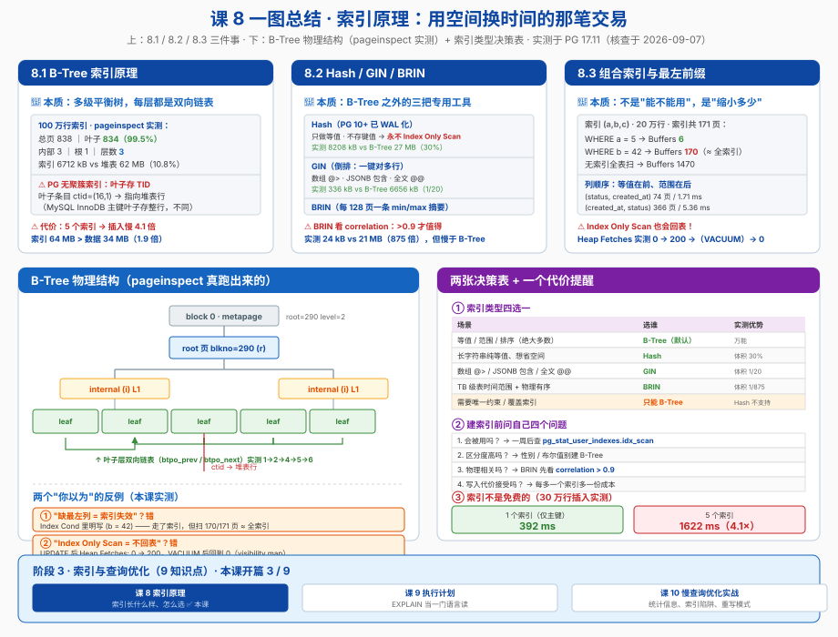

# 课 8 · 索引原理

> 📍 故事中的位置：主角（订单）淹没在百万级数据里——索引是数据库的目录，没有它，只能一页页翻

## 本课目标

学完本课后，你能：

1. **说出** PG 的 B-Tree 索引在物理上长什么样（页 / 层 / 双向链表 / 叶子指向堆表），并能用 `pageinspect` **亲眼看到**
2. **分清** Hash / GIN / BRIN 三种特殊索引各自的适用边界，给出选择理由而不是背结论
3. **设计**组合索引：知道**列顺序怎么排**、`INCLUDE` 怎么用、以及为什么 `Index Only Scan` 也会偷偷回表
4. **讲清索引的代价**：为什么"索引越多越好"是错的

## 知识点清单

| 知识点 | 关键点 |
|---|---|
| **8.1 B-Tree 索引原理** | · 页（page，8KB）与 B-Tree 的三层结构（meta / root / internal / leaf） · **每层都是双向链表**（顺序扫描的基础） · **叶子存 TID 指向堆表**（PG 无"聚簇索引"，与 MySQL InnoDB 关键差异） · 官方数据：**>99% 的页是叶子页**（本课实测 834/838） · 去重（PG 13+）与自底向上删除（PG 14+） · **索引的代价**：写入放大与空间 |
| **8.2 Hash / GIN / BRIN** | · **Hash**：只做等值，**PG 10+ 才 WAL 化**（老黄历要更新）；**永不 Index Only Scan**（不存键值） · **GIN**：倒排索引，数组 `@>` / JSONB 包含 / 全文检索；`fastupdate` 与 `gin_pending_list_limit`（默认 **4MB**） · **BRIN**：块范围摘要，`pages_per_range` 默认 **128**；**依赖物理相关性** · 四选一的决策表 |
| **8.3 组合索引与最左前缀** | · 官方精确规则（不是"缺左列就失效"那么简单） · 列顺序：**等值列在前、范围列在后** · 覆盖索引 `INCLUDE`（PG 11+） · **可见性地图（visibility map）**决定 `Index Only Scan` 是否真的不回表 · 函数索引与部分索引 |

## 故事主线中的情节定位

主角遇到"性能墙"——这是整个故事第一次出现"必须用对方法论"的章节。读者从这一章起开始区分"**会写 SQL**"与"**会写高性能 SQL**"。

前面 7 课你写的 SQL 都能跑对；从这一课开始，要能回答"**为什么它慢**"和"**该建什么索引**"。

## 正文

## 📌 知识点导航

本课首批（首批 = 课 8 全部 3 个知识点，阶段 3 **开篇课**）覆盖：

| 节 | 知识点 | 核心问题 |
|---|---|---|
| 第三幕（一） | 8.1 B-Tree 索引原理 | 索引在磁盘上到底是什么结构，代价是什么 |
| 第三幕（二） | 8.2 Hash / GIN / BRIN | 除了 B-Tree，什么时候该换别的 |
| 第三幕（三） | 8.3 组合索引与最左前缀 | 多列索引怎么排，`INCLUDE` 怎么用，为什么 Index Only Scan 也会回表 |

---

## 第一幕 · 起源与场景引入

### 一个真实的工作场景

订单表涨到了 **100 万行**。某天运营跑来问："用户 4242 一共下了多少单？"

```sql
SELECT count(*) FROM finance.orders_big WHERE user_id = 4242;
```

你敲下回车，等了 **23.8 毫秒**。听起来不多？但这个查询每秒要被调 200 次——**单这一个查询就吃掉了 4.8 个 CPU 秒/秒**。

你建了个索引：

```sql
CREATE INDEX idx_ob_user ON finance.orders_big (user_id);
```

再看执行计划：**0.081 毫秒**。

| | 耗时 | 读取的缓冲页数 |
|---|---|---|
| 无索引（Parallel Seq Scan） | **23.85 ms** | 7875 |
| 有索引（Index Only Scan） | **0.081 ms** | 4 |

**快了约 294 倍，I/O 少了约 1970 倍。**

这就是索引的威力。但下面这些事，索引**帮不了你**（而且没人提前告诉你）：

### 一个关于"目录"的小类比

把表想成**一本没有目录的 1000 页书**：

| 做法 | 类比 | 代价 |
|---|---|---|
| **全表扫描** | 从第 1 页翻到第 1000 页找"用户 4242" | 翻 1000 页 |
| **B-Tree 索引** | 书末的**索引页**："4242 → 第 137 页"，按数字排序，二分查找 | 翻 3~4 页索引 + 1 页正文 |
| **Hash 索引** | 一张**哈希表**：算一下"4242"在哪一格，直接跳过去 | 翻 1 页，但**只能查"等于 4242"**，问"大于 4242 的有哪些"就废了 |
| **BRIN 索引** | 每 128 页贴一张**便签**："这一摞里最小 100、最大 900" | 翻 8 张便签就能跳过 990 页，但**书必须按数字顺序装订** |
| **GIN 索引** | 书末的**关键词倒排表**："索引 → 第 12、58、137 页" | 一个词对应很多页，查"包含某关键词"极快 |

> 💡 **索引的本质**：用**空间 + 写入变慢**换**查询变快**。它是笔交易，不是免费的午餐。

---

## 第二幕 · 认知冲突

索引看起来就是"建了就快"，**实际落地有 5 类隐藏陷阱**——而且其中两条是**网上教程普遍说错的**：

### 陷阱 1："组合索引缺了最左列就完全失效" —— **这话不准确**

官方原文（PG 17 docs 11.3）说的是：

> "A multicolumn B-tree index can be used with query conditions that involve **any subset** of the index's columns, but the index is most efficient when there are constraints on the leading (leftmost) columns."

**能用于任意子集**，不是"失效"。区别在代价：本课实测（20 万行，`(a,b,c)` 索引，索引共 171 页）：

| 条件 | 执行计划 | 读的页数 |
|---|---|---|
| `WHERE a = 5` | Index Only Scan，`Index Cond: (a = 5)` | **6** |
| `WHERE b = 42` | Index Only Scan，`Index Cond: (b = 42)` | **170**（= 整个索引） |

**它走了索引，但把 171 页几乎全扫了一遍。** 优化器只是觉得"扫全索引 + 不回表"仍然比"扫全表 + 回表"便宜（全表要 1470 页）。

**所以正确的心智模型是**：不是"能不能用"，而是"**能缩小多少扫描范围**"。

### 陷阱 2：`Index Only Scan` 不代表不回表

计划里写着 `Index Only Scan`，你觉得万事大吉。但只要表**刚被 UPDATE 过**而 `VACUUM` 还没跑，它就会偷偷回表：

```text
Index Only Scan using idx_ob_user_inc on orders_big
  Heap Fetches: 200        ← 说好的"只走索引"呢？
```

本课实测：`Heap Fetches` **0 → 200 →（VACUUM 后）→ 0**。原因是**可见性地图（visibility map）**。详见 8.3。

### 陷阱 3：索引越多越好 —— **恰恰相反**

本课实测（30 万行插入）：

| 索引数 | 插入耗时 | 索引总大小 vs 表大小 |
|---|---|---|
| 1 个（主键） | **392 ms** | — |
| 5 个 | **1622 ms**（**4.1 倍**） | 索引 **64 MB** > 数据 **34 MB** |

**索引比数据还大 1.9 倍。** 每多一个索引，每次 INSERT / UPDATE / DELETE 都要多维护一棵树。

### 陷阱 4："PG 的 B+Tree 跟 MySQL 一样" —— **关键地方不一样**

- **MySQL InnoDB**：主键索引是**聚簇索引**，叶子节点**直接存整行数据**；二级索引叶子存**主键值**
- **PostgreSQL**：**没有聚簇索引概念**。表是"堆（heap）"，所有索引（包括主键索引）的叶子都是 **TID（页号 + 行号）指针**，指向堆表里的行

本课实测（`pageinspect` 看到叶子页条目）：

```text
 itemoffset |   ctid    | ...        ← ctid 就是"第几页第几行"
          1 | (16,1)    | 
          2 | (16,8292) |
```

**后果**：PG 的索引扫描**几乎总要回一次表**（除非覆盖索引 + visibility map 命中）。这也是为什么 PG 里 `INCLUDE` 覆盖索引特别有用。

> ⚠️ **术语说明**：PG 官方文档一律称 **B-Tree**（从不写 B+Tree）。它的叶子层确实有双向链表（行为上接近 B+Tree），但内部页结构与经典 B+Tree 不同。本课标题沿用通俗说法，正文一律用 PG 官方术语 **B-Tree**。

### 陷阱 5："Hash 索引不能用" —— **这是 PG 10 之前的老黄历**

- **PG 9.6 及更早**：Hash 索引**不写 WAL** → 崩溃后损坏、备库上根本没有这个索引 → 官方明令"不建议使用"
- **PG 10 起**：完全 WAL 化 → **崩溃安全、可复制、并发更好**

所以"别用 Hash 索引"这句话，**理由在 8 个版本前就消失了**。但 Hash 索引仍然很挑场景（见 8.2），所以正确说法不是"不能用"，而是"**只在长键等值查询上值得考虑**"。

---

## 第三幕 · 层层揭示

### （一）8.1 B-Tree 索引原理

#### 一句话定义

> **B-Tree 索引**是一棵**多级平衡树**，每一级（包括叶子层）的页都用**双向链表**串起来；叶子页里存的是"**键值 + 指向堆表行的 TID**"。

#### 直觉建立 · 一栋有目录的图书馆

| 概念 | 图书馆类比 | PG 实现 |
|---|---|---|
| **堆表（heap）** | 书架上的书，**按到货顺序摆放**（不按编号排） | 表的数据页 |
| **索引** | 检索台上的**卡片柜**，卡片按编号排序 | 独立的数据结构 |
| **卡片上的信息** | "编号 4242 → **A 区 3 排 16 号**" | `键值 → TID(页号, 行号)` |
| **meta 页** | 卡片柜本身的标签（共几层、根在哪） | block 0，固定位置 |
| **双向链表** | 卡片之间按顺序串着，可以从任意一张**往后翻** | `btpo_prev` / `btpo_next` |

> **类比边界**：索引不是"表的副本"，它**不存整行数据**（除 `INCLUDE` 列）；索引也不是"自动同步的视图"——它由每次 DML 同步维护，所以会拖慢写入。

#### 核心原理 · 四层结构

```
block 0              meta 页（固定位置：root 在哪、共几层）
block 290            root 页（level 2）      ← 本课实测 root = 290
block 3, 289, ...    internal 页（level 1）  ← 存"键值 + 下一层页号"
block 1,2,4,5,...    leaf 页（level 0）      ← 存"键值 + TID"，互相双向链表
```

**关键数字（本课 100 万行索引实测）：**

| 指标 | 实测值 | 官方说法 |
|---|---|---|
| 总页数 | 838 | — |
| 叶子页 | **834（99.5%）** | 官方："Typically, over 99% of all pages are leaf pages" ✅ |
| 内部页 | 3 | — |
| 根页 | 1 | — |
| 层数 | 3（level 2 = 根） | — |
| 索引大小 | 6712 kB vs 表 62 MB（**10.8%**） | — |
| 页大小 | 8192 B（8KB） | 默认 `block_size` |

#### 核心原理 · 每层都是双向链表

官方文档原文（PG 17 docs 64.1.4.1）：

> "PostgreSQL B-Tree indexes are multi-level tree structures, where **each level of the tree can be used as a doubly-linked list of pages**."

**本课实测**（连续叶子页的 `btpo_prev` / `btpo_next`）：

```text
 blkno | type | live_items | btpo_prev | btpo_next | btpo_level
-------+------+------------+-----------+-----------+------------
     1 | l    |         13 |         0 |         2 |          0
     2 | l    |         13 |         1 |         4 |          0
     4 | l    |         13 |         2 |         5 |          0
     5 | l    |         13 |         4 |         6 |          0
```

`1 → 2 → 4 → 5 → 6` 串成一条链（`btpo_prev = 0` 表示链头）。

**这条链表是 `ORDER BY` 走索引、范围扫描不用反复下钻的根本原因**——找到起点后顺着链往后读就行。

#### 核心原理 · 两个 PG 特有优化

| 优化 | 版本 | 作用 |
|---|---|---|
| **去重（Deduplication）** | **PG 13+**，默认开启 | 重复键值合并成一个"posting list"（键值存一次 + 排序的 TID 数组）。本课 `user_id` 只有 1 万个不同值 / 100 万行，实测叶子条目 `itemlen = 616` 就是 posting list |
| **自底向上删除（Bottom-up index deletion）** | **PG 14+** | 在页分裂前主动清理"版本churn"产生的垃圾索引元组，缓解 UPDATE 密集场景的索引膨胀 |

#### 示例演示 · 用 `pageinspect` 亲眼看结构

```sql
CREATE EXTENSION pageinspect;

-- ① 元信息：根在哪、几层
SELECT magic, version, root, level, fastroot, fastlevel FROM bt_metap('idx_ob_user');
--  magic  | version | root | level | fastroot | fastlevel
-- --------+---------+------+-------+----------+-----------
--  340322 |       4 |  290 |     2 |      290 |         2

-- ② 根页（type = 'r'）
SELECT blkno, type, live_items, btpo_level FROM bt_page_stats('idx_ob_user', 290);
--  blkno | type | live_items | btpo_level
-- -------+------+------------+------------
--    290 | r    |          3 |          2

-- ③ 叶子页条目：ctid 指向堆表行！
SELECT itemoffset, ctid, itemlen FROM bt_page_items('idx_ob_user', 2) LIMIT 3;
--  itemoffset |   ctid    | itemlen
-- ------------+-----------+---------
--           1 | (16,1)    |      16
--           2 | (16,8292) |     616
--           3 | (16,8292) |     616
```

> 💡 **`itemlen = 616`** 就是去重的证据：一个键值（4 字节 `user_id`）+ 一大串 TID 打包成一个 posting list，而不是 100 条独立条目。

#### 示例演示 · 索引的代价

```text
-- 30 万行插入
1 个索引（仅主键）: 392 ms
5 个索引:          1622 ms   ← 4.1 倍

-- 空间
堆表:   34 MB
索引:   64 MB   ← 比数据还大 1.9 倍
```

#### 常见误区（8.1）

| # | ❌ 误区 | ✅ 正确 |
|---|---|---|
| 1 | "PG 叫 B+Tree，跟 MySQL 一样" | PG 官方术语是 **B-Tree**；且**无聚簇索引**，叶子存 TID 指针 |
| 2 | "索引存的是行数据" | 只存**键值 + TID**（`INCLUDE` 列除外），取其他列要回表 |
| 3 | "索引不占地方" | 本课实测：索引 64 MB **大于** 堆表 34 MB |
| 4 | "多建几个索引没关系" | 30 万行插入从 392 ms → 1622 ms（**4.1 倍**） |
| 5 | "层数会很深" | 100 万行只要 **3 层**；官方说 >99% 的页是叶子页 |
| 6 | "双向链表只有叶子层有" | 官方原文：**每一层**都可以当双向链表用 |

#### 一句话记住

> **B-Tree = 3 层（根/内部/叶子）+ 每层双向链表 + 叶子存 TID 指向堆表；99% 的页是叶子页，代价是写入放大 4 倍。**

#### 命令速查卡 · 8.1

```sql
-- 看索引结构（pageinspect）
CREATE EXTENSION pageinspect;
SELECT * FROM bt_metap('索引名');                 -- root / level
SELECT * FROM bt_page_stats('索引名', 块号);       -- type(r/i/l) prev next level
SELECT * FROM bt_page_items('索引名', 块号);       -- ctid 指向堆表行

-- 看索引大小
SELECT indexrelname, pg_size_pretty(pg_relation_size(indexrelid))
FROM pg_stat_user_indexes WHERE relname = '表名' ORDER BY 2 DESC;

-- 索引使用率（找"建了从没用过"的索引）
SELECT indexrelname, idx_scan FROM pg_stat_user_indexes
WHERE relname = '表名' ORDER BY idx_scan;

-- 并发建索引（不阻塞写入）
CREATE INDEX CONCURRENTLY idx_name ON t (col);
```

---

### （二）8.2 Hash / GIN / BRIN

#### 一句话定义

> **Hash** 用哈希桶做等值定位；**GIN** 是倒排索引（一个键 → 多个行）；**BRIN** 存"一段物理块范围内的 min/max 摘要"。三者都是**在特定场景下替代 B-Tree** 的专用工具。

#### 直觉建立 · 三种不同的"目录"

| 索引 | 目录形式 | 擅长 | 不擅长 |
|---|---|---|---|
| **Hash** | 一个**哈希桶表**：算哈希直接跳格 | 超长字符串的**等值**查询 | 范围、排序、多列、覆盖 |
| **GIN** | 书末**关键词倒排表**："词 → 页码列表" | 数组包含、JSONB 包含、**全文检索** | 普通标量列（用 B-Tree） |
| **BRIN** | 每 128 页一张**便签**："这摞的 min~max" | 超大表的**时间范围**扫描 | 物理顺序与值无关的列 |

#### 核心原理与实测 · Hash 索引

**历史（重要，因为老教程还在传谣）：**

| 版本 | 状态 |
|---|---|
| PG 9.6 及更早 | **不写 WAL** → 崩溃后需 REINDEX；**不复制**到备库（备库上查会返回错误结果）。官方明令 discouraged |
| **PG 10+** | **完全 WAL 化** → 崩溃安全、可 PITR、可复制。并发与性能也一并改善（**核查于 2026-09-07**） |
| PG 11 | 支持**分区表**上的 Hash 索引 |

**硬限制（每条都是绝对的）：**

- ❌ 不支持**范围查询**（`>` `<` `BETWEEN`）
- ❌ 不支持 **`ORDER BY`**（哈希打乱了顺序）
- ❌ 不能**支撑 UNIQUE 约束**
- ❌ 不支持**多列索引**
- ❌ 不支持 **`INCLUDE`**（实测报错：`access method "hash" does not support included columns`）
- ❌ **永远不会有 Index Only Scan** —— 因为索引里**不存键的值**（只存 4 字节哈希码），必须回表确认

**本课实测**（30 万条 64 字符 token）：

```text
 hash_size | btree_size | heap_size
-----------+------------+-----------
 8208 kB   | 27 MB      | 31 MB
```

**Hash 索引只有 B-Tree 的 30%。** 这就是它的价值：**当键很长且只做等值查询时，省空间**（更多索引能塞进 shared buffers）。

#### 核心原理与实测 · GIN 索引

**倒排结构**：一个键值 → 一个 posting list（行 TID 列表）。所以天然适合"**一个值对应很多行**"的场景。

**三个典型用法（本课全部实测）：**

```sql
-- ① 数组包含
CREATE INDEX idx_docs_tags ON docs USING GIN (tags);
SELECT count(*) FROM docs WHERE tags @> ARRAY['urgent'];
-- Bitmap Index Scan on idx_docs_tags, Buffers: shared hit=7（堆要 2858 块）

-- ② JSONB 包含（jsonb_path_ops 更小更快）
CREATE INDEX idx_docs_meta ON docs USING GIN (meta jsonb_path_ops);
SELECT count(*) FROM docs WHERE meta @> '{"tenant": 42}';
-- Index Cond 命中，Buffers: shared hit=3

-- ③ 全文检索
CREATE INDEX idx_docs_tsv ON docs USING GIN (to_tsvector('simple', body));
SELECT count(*) FROM docs WHERE to_tsvector('simple', body) @@ to_tsquery('simple', 'zebra');
-- 0.131 ms（4 buffers）；强制 seqscan 对照：192.847 ms（2990 buffers）→ 约 1470 倍
```

**GIN 大小实测（10 万文档）：**

```text
    indexrelname     |  size
---------------------+---------
 idx_docs_tags       | 336 kB      ← GIN
 idx_docs_tags_btree | 6656 kB     ← 同列建 B-Tree
```

**GIN 只有 B-Tree 的 1/20。**

**GIN 的写入机制（重要运维知识）：**

- `fastupdate` **默认开启**：新条目先塞进一个**待处理列表（pending list）**，攒够再批量合并进主结构 —— 大幅提速写入
- `gin_pending_list_limit` 默认 **4096 kB = 4MB**（**核查于 2026-09-07**）；超过就触发批量合并
- 可以对单个索引覆盖：`CREATE INDEX ... WITH (gin_pending_list_limit = 8192)`
- 手工触发合并：`SELECT gin_clean_pending_list('索引名');`
- 查看 pending list：`CREATE EXTENSION pgstattuple; SELECT * FROM pgstatginindex('索引名');`

> ⚠️ **代价**：查询时要**同时扫主结构 + pending list**，所以 pending list 越大，**读越慢**。写入极多的场景要考虑关掉 `fastupdate` 或调小 limit。

#### 核心原理与实测 · BRIN 索引

**原理**：不去索引每一行，而是**每 `pages_per_range` 个物理页存一条摘要**（min/max）。查询时先看摘要，能跳过就跳过。

**关键前提：物理相关性（correlation）。**

```sql
SELECT attname, correlation FROM pg_stats WHERE tablename = 'orders_big';
```

本课实测（100 万行）：

```text
  attname   | correlation
------------+--------------
 created_at |    0.9995503   ← 几乎完美（按时间顺序插入）
 user_id    |  0.009077128   ← 几乎为零（随机分布）
 amount     | 0.0034487995
```

**经验阈值：`|correlation| > 0.9` 是 BRIN 的好候选；接近 0 就别建。**

**本课实测（100 万行 orders_big）：**

```text
 brin_size | btree_size | heap_size
-----------+------------+-----------
 24 kB     | 21 MB      | 62 MB
```

**BRIN 比 B-Tree 小 875 倍。**

**查询表现（查 1 天的数据，86400 行）：**

| 方案 | 耗时 | Buffers | 说明 |
|---|---|---|---|
| 全表扫描 | 29.45 ms | 7875 | — |
| **BRIN（pages_per_range=128）** | 14.10 ms | 971 | `Heap Blocks: lossy=963`，**`Rows Removed by Index Recheck: 35863`** |
| **BRIN（pages_per_range=32）** | 8.38 ms | 709 | `lossy=707`，**recheck 只去掉 3355 行** |
| B-Tree | 6.85 ms | 249 | 最快，但索引 21 MB |

> 🔑 **读懂 BRIN 的两个信号**：
> - `Heap Blocks: lossy=963` —— **lossy（有损）** 说明位图记的是"整块可能命中"，不是精确行
> - `Rows Removed by Index Recheck: 35863` —— 重检查时剔掉了多少**假阳性**。把 `pages_per_range` 从 128 调到 32，这个数从 **35863 降到 3355**（少 10.7 倍），查询也从 14.1 ms 降到 8.4 ms
>
> **调参规律**：`pages_per_range` 越小 → 摘要越精确 → recheck 越少 → 但索引越大

**BRIN 的其他要点：**

- `pages_per_range` 默认 **128**（= 128 × 8KB ≈ **1 MB** 堆数据一条摘要）
- 新插入的页**不会立刻被摘要**。要么等 `VACUUM`，要么建索引时开 `autosummarize = on`，要么手工 `SELECT brin_summarize_new_values('索引名');`
- **PG 14+** 新增两个算子族：`brin_minmax_multi_ops`（一段存多个 min/max 区间，抗离群值）和 `brin_bloom_ops`（布隆过滤，适合等值查询）

#### 决策表 · 四选一

| 场景 | 选谁 | 理由 |
|---|---|---|
| 绝大多数场景（等值 / 范围 / 排序） | **B-Tree** | 全能，默认选它 |
| 超长字符串（token / URL / SHA）**纯等值**，想省空间 | **Hash** | 实测只有 B-Tree 的 30% 大小 |
| 数组包含 `@>`、JSONB 包含、全文检索 | **GIN** | 倒排结构，实测比 B-Tree 小 20 倍 |
| 超大表（>1GB）的时间列**范围扫描**，且物理有序 | **BRIN** | 实测比 B-Tree 小 875 倍 |
| 需要唯一约束 | **只能 B-Tree** | Hash 不能支撑 UNIQUE |
| 需要覆盖索引（Index Only Scan） | **只能 B-Tree** | Hash 不存键值且不支持 `INCLUDE` |
| 地理位置 / 区间类型 | **GiST / SP-GiST**（本课不展开） | B-Tree 无法表达 |

#### 常见误区（8.2）

| # | ❌ 误区 | ✅ 正确 |
|---|---|---|
| 1 | "Hash 索引不能用（不写 WAL）" | **PG 10+ 已完全 WAL 化**。老黄历了 |
| 2 | "Hash 索引快，等值查询都该用" | 只在**长键 + 纯等值**上省空间有意义；且永不 Index Only Scan |
| 3 | "GIN 也能加速普通的 `WHERE col = x`" | 那是 B-Tree 的活。GIN 为"**一个键对多行**"而生 |
| 4 | "BRIN 索引小，所以大表都该建" | **看 correlation**。本课 `user_id` 相关性 0.009，建了等于白建 |
| 5 | "BRIN 建完立刻生效" | 新数据要等 `VACUUM` / `autosummarize` / 手工 `brin_summarize_new_values` |
| 6 | "GIN 的 fastupdate 是纯优化" | 它把成本推给了读：pending list 越大，**查询越慢** |

#### 一句话记住

> **Hash 省空间只管等值；GIN 倒排管"包含"；BRIN 靠物理相关性换 875 倍的空间；拿不准就用 B-Tree。**

#### 命令速查卡 · 8.2

```sql
-- Hash
CREATE INDEX ON sessions USING hash (token);

-- GIN：数组 / JSONB / 全文
CREATE INDEX ON docs USING GIN (tags);
CREATE INDEX ON docs USING GIN (meta jsonb_path_ops);
CREATE INDEX ON docs USING GIN (to_tsvector('simple', body));
SHOW gin_pending_list_limit;                          -- 默认 4MB
SELECT * FROM pgstatginindex('索引名');                -- pending list 状态
SELECT gin_clean_pending_list('索引名');               -- 手工合并

-- BRIN
SELECT attname, correlation FROM pg_stats WHERE tablename = '表名';   -- >0.9 才值得
CREATE INDEX ON t USING brin (created_at);                            -- pages_per_range=128
CREATE INDEX ON t USING brin (created_at) WITH (pages_per_range = 32, autosummarize = on);
SELECT brin_summarize_new_values('索引名');                            -- 手工摘要新页
-- PG 14+ 算子族
CREATE INDEX ON t USING brin (col brin_minmax_multi_ops);
CREATE INDEX ON t USING brin (col brin_bloom_ops);
```

---

### （三）8.3 组合索引与最左前缀

#### 一句话定义

> **组合索引**把多个列按**声明顺序**排成一个有序键；它**能**用于任意列子集，但只有**前导列上的等值约束**（加上第一个非等值列上的不等约束）才能真正缩小扫描范围。

#### 直觉建立 · 电话簿的排序

一本按「**姓 → 名**」排序的电话簿 `(姓, 名)`：

| 你要查 | 能不能用排序 | 怎么用 |
|---|---|---|
| 「姓 = 张」 | ✅ **极好用** | 直接翻到"张"那一段 |
| 「姓 = 张 AND 名 = 三」 | ✅ **最好用** | 直接定位到"张三" |
| 「姓 = 张 AND 名 > 三」 | ✅ 好用 | 从"张三"往后读 |
| **「名 = 三」**（不指定姓） | ⚠️ **能用但要全本翻** | 每个姓下面都要看看有没有"三" |

**最后一条就是"最左前缀"的真相：不是"不能用"，是"要把整本翻完"。**

#### 核心原理 · 官方的精确规则

PG 17 官方文档 11.3 原文（**核查于 2026-09-07**）：

> "The exact rule is that **equality constraints on leading columns, plus any inequality constraints on the first column that does not have an equality constraint**, will be used to limit the portion of the index that is scanned. **Constraints on columns to the right of these columns are checked in the index, so they save visits to the table proper, but they do not reduce the portion of the index that has to be scanned.**"

翻译成分步判据（索引 `(a, b, c)`）：

1. 从左到右走，**连续的等值列**都能缩小扫描范围
2. 遇到**第一个不等值列**，它的不等式**也能**缩小范围
3. 再往右的列：**只能在索引里做过滤（省回表），不缩小扫描范围**
4. 如果**前导列完全没约束**：整个索引都要扫

**官方给的例子**：索引 `(a, b, c)`，条件 `WHERE a = 5 AND b >= 42 AND c < 77`
→ 索引从 `a=5, b=42` 的第一项扫到 `a=5` 的最后一项；`c >= 77` 的条目会被跳过，**但仍然得扫过去**。

**其他要点：**
- 索引**最多 32 列**（含 `INCLUDE` 列）
- 官方建议：**超过 3 列的组合索引基本没用**，除非表的使用方式极其固定
- 只有 **B-Tree / GiST / GIN / BRIN** 支持多列；且 **GIN / BRIN 用哪一列效果都一样**（B-Tree 不是）

#### 示例演示 · 三种条件的扫描量（本课实测）

```sql
CREATE INDEX idx_demo_abc ON idx_demo (a, b, c);   -- 20 万行
```

| 条件 | Index Cond | Buffers | 解读 |
|---|---|---|---|
| `WHERE a = 5` | `(a = 5)` | **6** | 最左等值 → 只扫 6 页 |
| `WHERE b = 42` | `(b = 42)` | **170** | 非最左 → 扫了 **170 页**（索引共 **171 页**） |
| 无索引全表扫 | — | 1470 | 对照 |

**`b = 42` 的确走了索引（`Index Cond` 里明明白白写着），但几乎扫全了。** 这就是"能用但低效"的实证。

#### 示例演示 · 列顺序：等值在前，范围在后

同一个查询 `WHERE status = 'refunded' AND created_at >= ... AND created_at < ...`：

| 索引 | Buffers | 耗时 |
|---|---|---|
| **`(status, created_at)`**（等值在前 ✅） | **74** | **1.71 ms** |
| `(created_at, status)`（范围在前 ❌） | 366 | 5.36 ms |

**差 4.9 倍 buffers、3.1 倍时间。**

> **口诀**：**等值列在前，范围列在后；范围列之后的列只能"顺便过滤"。**

#### 示例演示 · `INCLUDE` 覆盖索引与可见性地图

需求：`SELECT amount FROM orders_big WHERE user_id = 4242`（100 行）。

**① 只有 `(user_id)` 索引 → 要回表：**

```text
 Bitmap Heap Scan on orders_big (actual rows=100)
   Recheck Cond: (user_id = 4242)
   Heap Blocks: exact=100
   Buffers: shared hit=78 read=25
 Execution Time: 2.883 ms
```

**② 加 `INCLUDE (amount)` → Index Only Scan：**

```sql
CREATE INDEX idx_ob_user_inc ON orders_big (user_id) INCLUDE (amount);
```

```text
 Index Only Scan using idx_ob_user_inc on orders_big (actual rows=100)
   Index Cond: (user_id = 4242)
   Heap Fetches: 0
   Buffers: shared hit=1 read=4
 Execution Time: 0.051 ms      ← 56 倍
```

**`INCLUDE` 列 vs 普通键列的区别：**

| | 键列 `(user_id)` | `INCLUDE` 列 `(amount)` |
|---|---|---|
| 存在内部页吗 | ✅ 是 | ❌ **只在叶子页** |
| 能用于 WHERE / ORDER BY | ✅ 能 | ❌ 不能 |
| 参与排序 | ✅ 是 | ❌ 否（不增加排序维护成本） |
| 作用 | 定位 | **只为了不回表** |

**③ 但是——UPDATE 之后 `Heap Fetches` 暴涨：**

```sql
UPDATE orders_big SET amount = amount + 1 WHERE user_id = 4242;   -- 改了 100 行
```

```text
 Index Only Scan using idx_ob_user_inc on orders_big
   Heap Fetches: 200      ← 从 0 变成 200！
```

**④ VACUUM 之后又回到 0：**

```sql
VACUUM (ANALYZE) orders_big;
-- Heap Fetches: 0
```

**为什么会这样？—— 可见性地图（Visibility Map）**

- MVCC 下，一行"当前事务能不能看见"这个信息**存在堆页面上**，不在索引里
- PG 用一张 **visibility map**（每个堆页 1 bit）标记"这个页的所有行对所有事务都可见"
- Index Only Scan 时：**bit = 1 → 直接用索引里的值**；**bit = 0 → 必须回表确认可见性**
- `UPDATE` 会把相关页的 bit 清 0；`VACUUM` 重新置 1

> 🔑 **诊断口诀**：看到 `Index Only Scan` 别急着高兴，**看 `Heap Fetches`**。
> - `Heap Fetches: 0` = 真正的只走索引
> - `Heap Fetches > 0` = VM 没跟上，**去查 `VACUUM` 是不是没跑**

#### 示例演示 · 函数索引与部分索引（顺带）

```sql
-- 函数索引：查询表达式必须与索引表达式完全一致
CREATE INDEX ON users (lower(email));
SELECT * FROM users WHERE lower(email) = 'a@b.com';   -- ✅ 命中
SELECT * FROM users WHERE upper(email) = 'A@B.COM';   -- ❌ 不命中

-- 部分索引：只索引关心的子集（PG 11+ 常用）
CREATE INDEX ON orders (created_at) WHERE status = 'pending';
-- 只有查询条件"蕴含"索引谓词时才会用
```

#### 常见误区（8.3）

| # | ❌ 误区 | ✅ 正确 |
|---|---|---|
| 1 | "缺最左列索引就完全失效" | **能用**，但会扫整个索引（实测 170/171 页） |
| 2 | "组合索引列顺序随便排" | **等值在前、范围在后**；实测差 3.1 倍 |
| 3 | "`Index Only Scan` 就是不回表" | 看 `Heap Fetches`。本课实测 0 → 200 → 0 |
| 4 | "`INCLUDE` 列也能用来过滤" | **不能**，只在叶子页，不参与搜索和排序 |
| 5 | "建了覆盖索引就一劳永逸" | 写入频繁 + VACUUM 跟不上 = 白建 |
| 6 | "多列索引列越多越好" | 官方：**超过 3 列基本没用**；上限 32 列 |

#### 一句话记住

> **等值在前范围在后；`INCLUDE` 只为不回表；`Index Only Scan` 真不回表要看 `Heap Fetches` 是不是 0。**

#### 命令速查卡 · 8.3

```sql
-- 组合索引（等值列在前）
CREATE INDEX ON orders (status, created_at);
-- 覆盖索引
CREATE INDEX ON orders (user_id) INCLUDE (amount);
-- 函数索引
CREATE INDEX ON users (lower(email));
CREATE INDEX ON events ((data ->> 'type'));
-- 部分索引
CREATE INDEX ON orders (created_at) WHERE status = 'pending';
-- 降序索引（混合排序方向）
CREATE INDEX ON orders (user_id, created_at DESC);
-- 并发建索引（生产必用）
CREATE INDEX CONCURRENTLY idx ON orders (user_id) INCLUDE (amount);

-- 诊断：Index Only Scan 是否真的不回表
EXPLAIN (ANALYZE, BUFFERS) SELECT amount FROM orders WHERE user_id = 4242;
-- 看 Heap Fetches

-- 诊断：索引有没有被用过
SELECT indexrelname, idx_scan, pg_size_pretty(pg_relation_size(indexrelid))
FROM pg_stat_user_indexes WHERE relname = 'orders' ORDER BY idx_scan;

-- 重建膨胀的索引
REINDEX INDEX CONCURRENTLY idx_name;
```

---

## 第四幕 · 实操验证

> 以下 9 组实验全部在 **PostgreSQL 17.11（Docker，端口 5433）** 上实跑。环境：`order_service` 库 / `finance` schema。
>
> 数据与规模：`orders_big` 100 万行、`idx_demo` 20 万行、`sessions` 30 万行（64 字符 token）、`docs` 10 万行。
>
> 起环境（若容器被清理）：
> ```bash
> export PATH="/usr/local/bin:$PATH"     # 否则报 docker-credential-desktop 找不到
> docker run -d --name pg17 -e POSTGRES_PASSWORD=postgres \
>   -e POSTGRES_DB=order_service -p 5433:5432 postgres:17
> ```

### 实验 1 · 有无索引的天壤之别

```sql
-- 建索引前
EXPLAIN (ANALYZE, BUFFERS, COSTS OFF)
SELECT count(*) FROM finance.orders_big WHERE user_id = 4242;
```

```text
 Finalize Aggregate (actual time=21.547..23.776 rows=1 loops=1)
   Buffers: shared hit=4905 read=2970
   ->  Gather (actual rows=3 loops=1)
         ->  Partial Aggregate (actual rows=1 loops=3)
               ->  Parallel Seq Scan on orders_big (actual rows=33 loops=3)
                     Filter: (user_id = 4242)
                     Rows Removed by Filter: 333300
 Execution Time: 23.854 ms
```

```sql
CREATE INDEX idx_ob_user ON finance.orders_big (user_id);
ANALYZE finance.orders_big;
-- 建索引后
```

```text
 Aggregate (actual time=0.043..0.043 rows=1 loops=1)
   Buffers: shared hit=1 read=3
   ->  Index Only Scan using idx_ob_user on orders_big (actual rows=100 loops=1)
         Index Cond: (user_id = 4242)
         Heap Fetches: 0
 Execution Time: 0.081 ms
```

✅ **验收点**：**23.85 ms → 0.081 ms（约 294 倍）**，缓冲区 7875 → 4。

### 实验 2 · 用 `pageinspect` 看见 B-Tree

```sql
CREATE EXTENSION pageinspect;
SELECT magic, version, root, level, fastroot, fastlevel FROM bt_metap('idx_ob_user');
SELECT blkno, type, live_items, btpo_prev, btpo_next, btpo_level FROM bt_page_stats('idx_ob_user', 290);
SELECT itemoffset, ctid, itemlen FROM bt_page_items('idx_ob_user', 2) LIMIT 3;
```

```text
 magic  | version | root | level | fastroot | fastlevel
--------+---------+------+-------+----------+-----------
 340322 |       4 |  290 |     2 |      290 |         2

 blkno | type | live_items | btpo_prev | btpo_next | btpo_level
-------+------+------------+-----------+-----------+------------
   290 | r    |          3 |         0 |         0 |          2

 itemoffset |   ctid    | itemlen
------------+-----------+---------
          1 | (16,1)    |      16
          2 | (16,8292) |     616
          3 | (16,8292) |     616
```

✅ **验收点**：`type = 'r'` 是根页、`level = 2`（3 层）；叶子条目的 `ctid` 指向堆表行（证明**非聚簇**）；`itemlen = 616` 是去重后的 posting list。

```sql
-- 叶子页占比与双向链表
SELECT count(*) AS total_pages,
       count(*) FILTER (WHERE type = 'l') AS leaf_pages FROM ...;
```

```text
 total_pages | leaf_pages | internal_pages | root_pages
-------------+------------+----------------+------------
         838 |        834 |              3 |          1
```

```text
 blkno | type | live_items | btpo_prev | btpo_next | btpo_level
-------+------+------------+-----------+-----------+------------
     1 | l    |         13 |         0 |         2 |          0
     2 | l    |         13 |         1 |         4 |          0
     4 | l    |         13 |         2 |         5 |          0
     5 | l    |         13 |         4 |         6 |          0
```

✅ **验收点**：叶子页占 **99.5%**（官方说 >99%）；`1→2→4→5→6` 双向链表清晰可见。

### 实验 3 · 组合索引：能用于任意子集，但代价差 28 倍

```sql
CREATE INDEX idx_demo_abc ON idx_demo (a, b, c);   -- 20 万行
SELECT pg_relation_size('idx_demo_abc')/8192 AS index_pages;   -- 171
EXPLAIN (ANALYZE, BUFFERS, COSTS OFF) SELECT count(*) FROM idx_demo WHERE a = 5;    -- 6 buffers
EXPLAIN (ANALYZE, BUFFERS, COSTS OFF) SELECT count(*) FROM idx_demo WHERE b = 42;   -- 170 buffers
EXPLAIN (ANALYZE, BUFFERS, COSTS OFF) SELECT count(*) FROM idx_demo;                -- 1470 buffers（全表）
```

| 条件 | Index Cond | Buffers |
|---|---|---|
| `a = 5` | `(a = 5)` | **6** |
| `b = 42` | `(b = 42)` | **170**（索引共 171 页） |
| 无索引全表 | — | 1470 |

✅ **验收点**：`b = 42` **走了索引**（`Index Cond` 里写着），但扫了 170/171 页 —— **"能用" ≠ "高效"**。

### 实验 4 · 列顺序：等值在前 vs 范围在前

```sql
CREATE INDEX idx_ob_status_created ON orders_big (status, created_at);
CREATE INDEX idx_ob_created_status ON orders_big (created_at, status);
EXPLAIN (ANALYZE, BUFFERS, COSTS OFF) SELECT count(*)
FROM orders_big
WHERE status = 'refunded' AND created_at >= '2024-01-05' AND created_at < '2024-01-06';
```

| 索引 | Buffers | 耗时 |
|---|---|---|
| `(status, created_at)` 等值在前 | **74** | **1.71 ms** |
| `(created_at, status)` 范围在前 | 366 | 5.36 ms |

✅ **验收点**：差 **4.9 倍 buffers / 3.1 倍时间**。

### 实验 5 · `INCLUDE` 覆盖索引与可见性地图（本课最反直觉的一组）

```sql
-- 5a 只有 (user_id) 索引
EXPLAIN (ANALYZE, BUFFERS, COSTS OFF) SELECT amount FROM orders_big WHERE user_id = 4242;
--    Bitmap Heap Scan ... Buffers: shared hit=78 read=25, Execution Time: 2.883 ms

-- 5b 加 INCLUDE
CREATE INDEX idx_ob_user_inc ON orders_big (user_id) INCLUDE (amount);
--    Index Only Scan ... Heap Fetches: 0, Buffers: shared hit=1 read=4, 0.051 ms

-- 5c 改数据
UPDATE orders_big SET amount = amount + 1 WHERE user_id = 4242;
--    Index Only Scan ... Heap Fetches: 200      ← 暴涨

-- 5d VACUUM
VACUUM (ANALYZE) orders_big;
--    Index Only Scan ... Heap Fetches: 0        ← 恢复
```

✅ **验收点**：`Heap Fetches` **0 → 200 → 0**。计划里写着 `Index Only Scan`，但只有 `Heap Fetches: 0` 才是真的没回表。

### 实验 6 · Hash 索引

```sql
CREATE INDEX idx_sess_hash  ON sessions USING hash (token);
CREATE INDEX idx_sess_btree ON sessions (token);
```

```text
 hash_size | btree_size | heap_size
-----------+------------+-----------
 8208 kB   | 27 MB      | 31 MB
```

```sql
-- 等值查询：永远是 Index Scan
EXPLAIN (ANALYZE, BUFFERS, COSTS OFF) SELECT id FROM sessions WHERE token = '...';
--    Index Scan using idx_sess_hash ... Buffers: shared hit=3, 0.013 ms

-- 范围查询：Hash 帮不上（优化器转去用 btree）
EXPLAIN (COSTS OFF) SELECT count(*) FROM sessions WHERE token > 'zzz';
--    Index Only Scan using idx_sess_btree ... Index Cond: (token > 'zzz')

-- INCLUDE：不支持（报错复现）
CREATE INDEX idx_sess_hash_inc ON sessions USING hash (token) INCLUDE (id);
-- ERROR:  access method "hash" does not support included columns
```

✅ **验收点**：Hash 只有 B-Tree 的 **30%** 大小；**永不 Index Only Scan**；`INCLUDE` 报错原文。

### 实验 7 · GIN 倒排索引

```sql
SHOW gin_pending_list_limit;      -- 4MB
CREATE INDEX idx_docs_tags ON docs USING GIN (tags);
CREATE INDEX idx_docs_meta ON docs USING GIN (meta jsonb_path_ops);
CREATE INDEX idx_docs_tsv  ON docs USING GIN (to_tsvector('simple', body));
```

```text
-- 数组包含
 Bitmap Heap Scan on docs (actual rows=25000)
   ->  Bitmap Index Scan on idx_docs_tags (actual rows=25000)
         Index Cond: (tags @> '{urgent}'::text[])
         Buffers: shared hit=7          ← 堆要 2858 块，索引只要 7 块

-- 全文检索（选择性高的词）
 Bitmap Index Scan on idx_docs_tsv ... Buffers: shared hit=4
 Execution Time: 0.131 ms
-- 强制 seqscan 对照：
 Parallel Seq Scan on docs ... Buffers: shared hit=2990
 Execution Time: 192.847 ms          ← 约 1470 倍
```

```text
    indexrelname     |  size
---------------------+---------
 idx_docs_tags       | 336 kB      ← GIN
 idx_docs_tags_btree | 6656 kB     ← 同列 B-Tree（1/20）
```

✅ **验收点**：`gin_pending_list_limit = 4MB`；GIN 比同列 B-Tree 小 **20 倍**；全文检索快约 **1470 倍**。

### 实验 8 · BRIN 块范围索引

```sql
SELECT attname, correlation FROM pg_stats WHERE tablename = 'orders_big';
CREATE INDEX idx_ob_created_brin  ON orders_big USING brin (created_at);
CREATE INDEX idx_ob_created_btree ON orders_big (created_at);
```

```text
  attname   | correlation
------------+--------------
 created_at |    0.9995503    ← 完美
 user_id    |  0.009077128    ← 几乎为零

 brin_size | btree_size | heap_size
-----------+------------+-----------
 24 kB     | 21 MB      | 62 MB      ← 875 倍
```

```sql
-- 只剩 BRIN 时（事务里临时移除 btree 索引）
EXPLAIN (ANALYZE, BUFFERS, COSTS OFF)
SELECT count(*) FROM orders_big WHERE created_at >= '2024-01-07' AND created_at < '2024-01-08';
```

```text
 Bitmap Heap Scan on orders_big (actual rows=86400)
   Recheck Cond: (...)
   Rows Removed by Index Recheck: 35863
   Heap Blocks: lossy=963
   Buffers: shared hit=971
   ->  Bitmap Index Scan on idx_ob_created_brin (actual rows=9630)
         Buffers: shared hit=8
 Execution Time: 14.100 ms
```

**四种方案对比（同一查询，86400 行）：**

| 方案 | 耗时 | Buffers | 索引大小 |
|---|---|---|---|
| Seq Scan | 29.45 ms | 7875 | — |
| BRIN `pages_per_range=128` | 14.10 ms | 971（recheck 去掉 35863 行） | **24 kB** |
| BRIN `pages_per_range=32` | 8.38 ms | 709（recheck 只去掉 3355 行） | 24 kB |
| B-Tree | 6.85 ms | 249 | 21 MB |

✅ **验收点**：BRIN 索引小 **875 倍**；把 `pages_per_range` 从 128 调到 32，recheck 假阳性从 **35863 降到 3355**（少 10.7 倍）。
> 注：本表 62 MB / 7937 页，128 和 32 都只生成几十~几百条摘要，所以**两者大小都显示 24 kB**（最小单位）。在真正的 TB 级表上大小差异才会显现。

### 实验 9 · 索引的代价：写入放大

```sql
CREATE TABLE write_cost (id bigserial PRIMARY KEY, a int, b int, c int, d text);
INSERT INTO write_cost SELECT g, g*2, g*3, 'x'||g FROM generate_series(1,300000) g;   -- 392 ms
CREATE INDEX wc_a ON write_cost(a);  CREATE INDEX wc_b ON write_cost(b);
CREATE INDEX wc_c ON write_cost(c);  CREATE INDEX wc_d ON write_cost(d);
INSERT INTO write_cost SELECT g, g*2, g*3, 'x'||g FROM generate_series(1,300000) g;   -- 1622 ms
```

```text
 indexes | heap  | all_indexes
---------+-------+-------------
       5 | 34 MB | 64 MB          ← 索引比数据大 1.9 倍
```

✅ **验收点**：1 个索引 → 392 ms，5 个索引 → **1622 ms（4.1 倍）**。

---

## 第五幕 · 体系收束

### 一张图总结本课



### 本课三张决策表

**① 索引类型四选一**

| 你的场景 | 选谁 |
|---|---|
| 等值 / 范围 / 排序（绝大多数） | **B-Tree** |
| 长字符串纯等值、想省空间 | **Hash** |
| 数组 `@>` / JSONB 包含 / 全文 `@@` | **GIN** |
| TB 级表的时间范围扫描 + 物理有序 | **BRIN** |
| 需要唯一约束 / 覆盖索引 | **只能 B-Tree** |

**② 建索引前问自己四个问题**

1. **这个索引会被用吗？** —— 建完一周后查 `pg_stat_user_indexes.idx_scan`，是 0 就删
2. **值的区分度高吗？** —— 性别、布尔值建 B-Tree 通常没意义（用部分索引或干脆不建）
3. **物理相关性如何？** —— 想用 BRIN 先查 `correlation`，>0.9 才值得
4. **写入放大的代价接受吗？** —— 每多一个索引，写入多一份成本（本课实测 4.1 倍）

**③ 诊断"为什么慢"的三步**

1. `EXPLAIN (ANALYZE, BUFFERS)` —— 看走没走索引、`Buffers` 多大
2. 看到 `Index Only Scan` → **看 `Heap Fetches`**，非 0 说明 VM 没跟上
3. 看到 `Seq Scan` → 先看 `Rows Removed by Filter`：如果过滤掉 99%，多半缺索引或统计信息过期

### 事实速查表（本课新增，均核查于 2026-09-07）

| 条目 | 结论 | 来源 |
|---|---|---|
| B-Tree 结构 | 多级树，**每一层都可作为双向链表**；meta 页在 block 0 | PG 17 docs 64.1.4.1 |
| 叶子页占比 | 官方："Typically, over **99%** of all pages are leaf pages"；**本课实测 834/838 = 99.5%** | 官方 + 本课实测 |
| 是否聚簇 | **否**。叶子存 **TID 指向堆表**，与 MySQL InnoDB 聚簇主键不同 | 本课 `pageinspect` 实测 `ctid` |
| 去重（deduplication） | **PG 13+**，默认开启；重复键值合并为 posting list | PG 13 docs（本课 `itemlen=616` 实证） |
| 自底向上索引删除 | **PG 14+**，页分裂前主动清理版本 churn | PG 17 docs 64.1.4.2 |
| Hash 索引 WAL 化 | **PG 10+** 完全 WAL 化，崩溃安全、可复制；此前不写 WAL（不建议使用） | PG 10 release notes |
| Hash 索引限制 | 无范围 / 无 ORDER BY / 不能支撑 UNIQUE / 无多列 / **无 `INCLUDE`** / **永不 Index Only Scan** | 本课实测（报错原文 + 执行计划） |
| `gin_pending_list_limit` | 默认 **4096 kB = 4MB**（最小 64kB），可按索引覆盖 | PG 官方文档 + pgpedia |
| GIN `fastupdate` | 默认开启；代价是**查询要额外扫 pending list** | PG 官方文档 |
| BRIN `pages_per_range` | 默认 **128**（≈ 1 MB 堆数据一条摘要） | PG 官方文档 / BRIN 实践 |
| BRIN 相关性要求 | `\|correlation\| > 0.9` 为强候选；本课 `created_at` = **0.9996**，`user_id` = **0.009** | 本课实测 |
| BRIN 摘要延迟 | 新页需 `VACUUM` / `autosummarize` / `brin_summarize_new_values()` | PG 官方文档 |
| BRIN 新算子族 | **PG 14+** `brin_minmax_multi_ops` / `brin_bloom_ops` | PG 14 release notes |
| 组合索引精确规则 | **前导等值列 + 第一个非等值列的不等式**缩小扫描范围；其右侧列**只过滤不缩小范围** | PG 17 docs 11.3 原文 |
| 组合索引列数上限 | **32 列**（含 `INCLUDE`）；官方建议**超过 3 列基本没用** | PG 17 docs 11.3 |
| 哪些类型支持多列 | B-Tree / GiST / GIN / BRIN；**GIN 与 BRIN 用哪一列效果相同** | PG 17 docs 11.3 |
| `INCLUDE` 覆盖索引 | **PG 11+**；列只存叶子页，不参与搜索与排序 | PG 官方文档 |
| Index Only Scan 的前提 | **可见性地图（VM）**该页 bit = 1，否则必须回表；`VACUUM` 置位，`UPDATE` 清位 | PG docs 11.9 + 本课实测 |
| 本课实测环境 | **PostgreSQL 17.11**，`block_size` 8192，Docker 端口 **5433** | 本课实测 |

### 常见误区总表（本课 18 条）

见第三幕各知识点的「常见误区」小节（8.1 六条 / 8.2 六条 / 8.3 六条）。**最致命的三条**：

1. **"缺最左列索引就失效"** —— 能用，但会扫整个索引（实测 170/171 页）
2. **`Index Only Scan` 也会回表** —— 看 `Heap Fetches`（实测 0 → 200 → 0）
3. **索引不是免费的** —— 5 个索引让插入慢 4.1 倍，索引比数据还大 1.9 倍

---

## 🧭 课程导航

**上一课**：[课 7 窗口函数](../2-数据建模与SQL进阶/lessons/lesson-07-窗口函数.md)（跨阶段）

**与前面几课的衔接**（伏笔回收）：

- **回收课 7**：课 7 实验 9a 里出现的 **`Index Only Scan`**（当时只当它是"更快"的符号），本课 8.3 完整解释了它：**需要覆盖索引 + visibility map 同时成立**，并给出 `Heap Fetches` 这个判据。
- **回收课 4**：课 4 反复强调"**外键引用侧 PG 不自动建索引**"——本课从原理上解释了为什么这件事代价很大：外键列没索引时，父表删一行就要全表扫子表。
- **回收课 3**：课 3 讲的**键集分页** `(created_at, id) < (?, ?)` 能被复合索引命中——本课 8.3 的"等值在前、范围在后"给出了列顺序的通用判据。
- **回收课 1**：课 1 只是把 PG 跑起来；本课第一次让你**看见 PG 内部**（`pageinspect` 看到真实的页结构）。

**下一课**：[课 9 执行计划](lesson-09-执行计划.md)

**阶段进度**：

- ✅ 阶段 1 · SQL 与关系基础（课 1–3，9 / 9 知识点）
- ✅ 阶段 2 · 数据建模与 SQL 进阶（课 4–7，12 / 12 知识点）
- ⬜ **阶段 3 · 索引与查询优化（课 8–10，9 知识点）** ← 本课开篇（3 / 9）
- ⬜ 阶段 4 · 事务/锁与并发（课 11–13，12 知识点）
- ⬜ 阶段 5 · 运维与生产化（课 14–17，12 知识点）

**下一课预告（执行计划）**：本课你已经会看三样东西了——**走没走索引**（`Index Scan` / `Seq Scan`）、**代价多大**（`Buffers`）、**有没有偷偷回表**（`Heap Fetches`）。但 `EXPLAIN` 的输出远不止这些：

- `cost=0.43..8.45` 这两个数字到底什么意思？
- 为什么有时候**估算 100 行、实际 10000 行**，然后整个计划就崩了？
- `Nested Loop` / `Hash Join` / `Merge Join` 优化器是怎么选的？
- 为什么 `ANALYZE` 跑完之后，一条慢查询自己就好了？

课 9 会把 **`EXPLAIN` 当成一门语言**来教，回答这些问题。本课的实验里你已经看到 `Rows Removed by Filter`、`Rows Removed by Index Recheck`、`lossy` 这些词了——它们都是课 9 的主角。

**返回目录**：[`02-课程目录.md`](../../02-课程目录.md)
