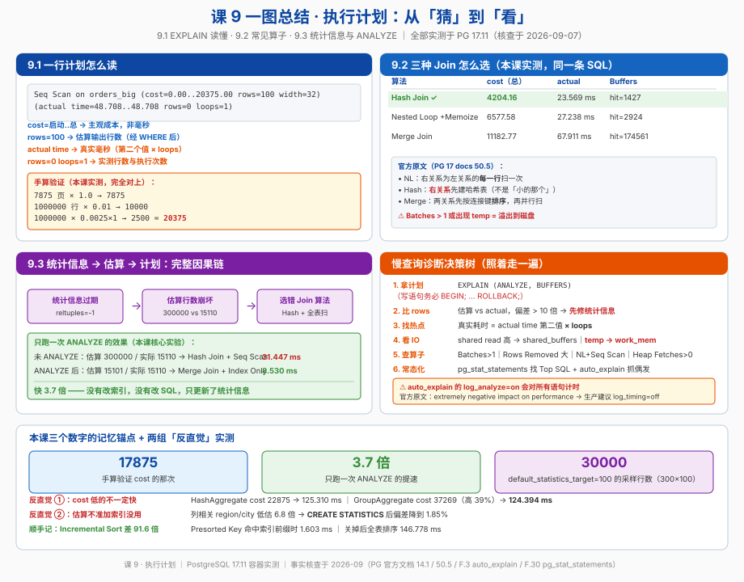

# 课 9 · 执行计划

> 📍 故事中的位置：主角被埋在数据堆里——EXPLAIN 就像 X 光，让你能看见 PG 内部在干什么

## 本课目标

学完本课后，你能：

1. 读懂 EXPLAIN 的每一个字段（cost / rows / width / actual time / loops / Buffers），并且能手算验证 cost
2. 识别常见算子（Seq Scan / Index Scan / Index Only Scan / Bitmap Heap Scan / Nested Loop / Hash Join / Merge Join / Sort / Aggregate / Materialize / Memoize），知道优化器为什么选它
3. 从「估算行数 vs 实际行数」的偏差反推统计信息问题，并用 `ANALYZE` / `CREATE STATISTICS` / `SET STATISTICS` 修好它
4. 在生产环境用 `auto_explain` + `pg_stat_statements` 自动捕获慢查询，而不是等人贴计划

## 知识点清单

| 知识点 | 关键点 |
|---|---|
| **9.1 EXPLAIN 读懂** | · EXPLAIN vs EXPLAIN ANALYZE（预估 vs 实测） · cost 单位的含义（磁盘页获取 + 处理代价） · rows 的"估计 vs 实际"差距 · 计划树从内到外的执行顺序 · BUFFERS 选项（看实际 IO） |
| **9.2 常见算子** | · 扫描（Seq Scan / Index Scan / Index Only Scan / Bitmap Heap Scan） · 连接（Nested Loop / Hash Join / Merge Join）的取舍 · 排序（Sort / Incremental Sort） · 聚合（Hash Aggregate / Group Aggregate） · 物化（Materialize） · `Limit` 与 CTE 物化的关系 |
| **9.3 统计信息与 ANALYZE** | · `pg_statistic` 与 `pg_stats` · 自动 ANALYZE 的触发条件 · 手动 `ANALYZE` 与 `VACUUM ANALYZE` · 默认统计目标与列级 `ALTER TABLE ... SET STATISTICS` |

## 故事主线中的情节定位

上一课（课 8）我们给主角修好了**路**——索引建好了。但路修好不等于车会走。
PG 里真正在"选路"的是优化器，而它选路的依据是**成本模型 + 统计信息**。
这一课就是让你拿到那张"路线图"，并且看得懂图上每个数字是怎么算出来的。

这是从"猜"到"看"的转变，也是从"会写 SQL"到"会诊断 SQL"的分水岭。

## 正文

## 📌 知识点导航

| 幕 | 内容 | 你会拿到的东西 |
|---|---|---|
| 第一幕 | 一个 8 秒的订单列表页 | 为什么必须先看计划再动手 |
| 第二幕 | 5 个会让你误判的陷阱 | 网传读法 vs 官方定义 |
| 第三幕 | 9.1 / 9.2 / 9.3 三块硬骨头 | 六要素完整展开 |
| 第四幕 | 9 组实验（本课全部实测） | 可复现的数字 |
| 第五幕 | 一张图 + 决策表 | 收进你的诊断手册 |

---

## 第一幕 · 起源与场景引入

### 一个真实的工作场景

周一早上，运营在群里 @ 你：

> 「订单列表页又卡了，翻到第 50 页要 8 秒。」

你打开代码，SQL 长这样：

```sql
SELECT o.order_no, o.amount, o.status, u.uname
FROM orders o
JOIN users u ON u.id = o.user_id
WHERE o.status = 'paid'
  AND o.created_at >= now() - interval '7 days'
ORDER BY o.created_at DESC
LIMIT 20 OFFSET 1000;
```

你的第一反应是什么？

大多数人会做下面三件事之一——**三件都可能是错的**：

1. 「加个索引吧」→ 加在哪个列？加完真的会走吗？
2. 「肯定是 JOIN 慢，拆成两条 SQL」→ 拆开可能更慢（网络往返 + 应用层 hash）
3. 「数据量太大了，上分库分表」→ 100 万行就分表，属于用大炮打蚊子

真正该做的第一件事只有一个：

```sql
EXPLAIN (ANALYZE, BUFFERS) SELECT ...;
```

**为什么必须先看计划？** 因为优化器选出来的执行方式，经常跟你在 SQL 字面里"看到"的顺序完全不一样。你写的是 `FROM orders JOIN users`，它实际可能先扫 users 再探 orders；你写了 `ORDER BY`，它实际可能根本不排序（走了有序索引）。**不看计划就优化，等于闭着眼睛修车。**

### 一个关于"体检报告"的小类比

把 `EXPLAIN` 想象成**体检报告**：

| 体检报告 | EXPLAIN |
|---|---|
| 预测风险值（模型算的） | `cost=0.00..17875.00`（成本模型算的） |
| 实际测量值（血糖仪读数） | `actual time=0.011..48.708`（真实毫秒） |
| 预测 vs 实测差很大 → 模型失准 | `rows=100` vs `actual rows=0` → 统计信息过期 |
| 各项指标（血压/血脂/心率） | `Buffers` / `Rows Removed by Filter` / `Batches` |
| 医生看的是**差异**，不是单个数字 | 你看的是**估算 vs 实测的差**，不是 cost 大小 |

关键洞察：**你不需要看懂每个数字，你只需要找出"对不上的那一个"。**

---

## 第二幕 · 认知冲突

下面 5 条是我在准备这课时，实测推翻（或被官方文档纠正）的流行说法。

### 陷阱 1："cost 后面的数字是毫秒" —— **完全不是**

**实测（本课，PG 17.11）：**

```
Seq Scan on orders_big  (cost=0.00..17875.00 rows=1000000 width=32)
```

`17875.00` 看着像是 17.8 秒，吓死人。但实际执行：

```
Seq Scan on orders_big  (cost=0.00..20375.00 rows=100 width=32)
                        (actual time=48.708..48.708 rows=0 loops=1)
Execution Time: 48.716 ms
```

**cost 20375，实际 48.7 毫秒。** 差了 400 倍量级，因为两者的单位根本不同。

官方文档（PG 18 docs, 14.1 Using EXPLAIN）原文（核查于 2026-09）：

> The costs are measured in **arbitrary units** determined by the planner's cost parameters. ... Traditional practice is to measure the costs in units of disk page fetches; that is, **`seq_page_cost` is conventionally set to 1.0**

以及关于 actual time：

> Note that the "actual time" values are in **milliseconds of real time**, whereas the `cost` estimates are expressed in arbitrary units; so they are unlikely to match up.

**记牢：cost 是"顺序读一个 8KB 页"为单位的主观成本；actual time 才是毫秒。两者不要互相换算。**

### 陷阱 2：`actual time` 直接读最外层找瓶颈 —— **会漏掉真正的热点**

因为 `loops` 的存在。官方原文（核查于 2026-09）：

> the `loops` value reports the total number of executions of the node, and the actual time and rows values shown are **averages per-execution**. ... **Multiply by the `loops` value to get the total time actually spent in the node.**

本课实测：

```
->  Index Only Scan using big_orders_uid_idx on big_orders o
    (cost=0.29..10.42 rows=400 width=4) (actual time=0.009..0.027 rows=400 loops=100)
```

单看 `0.027 ms` 你会以为它无关紧要。但 `loops=100` → **实际总耗时 0.027 × 100 = 2.7 ms**，而整个 Nested Loop 才 4.514 ms。这一个算子占了 60%。

**公式：`该节点真实总耗时 ≈ actual time 的第二个值 × loops`**

### 陷阱 3："Hash Join 是用小的那张表建 hash" —— **说法不严谨**

官方文档（PG 17 docs, 50.5 Planner/Optimizer）原文（核查于 2026-09）：

> *hash join*: **the right relation** is first scanned and loaded into a hash table, using its join attributes as hash keys. Next the left relation is scanned and the appropriate values of every row found are used as hash keys to locate the matching rows in the table.

注意官方说的是 **right relation（右关系）**，不是"小的那个"。

正确的因果是：**优化器会先决定把谁放右边（通常是估算行数少的那个），然后右边建 hash。** 所以"小的建 hash"是结果，不是规则。当优化器把大小判断错了，你就会看到一个巨大的 Hash 节点——这正是偏差的后果之一。

### 陷阱 4："cost 低的计划一定跑得快" —— **模型会错**

本课实测的反例（work_mem=64kB，同一条 `GROUP BY status`）：

| 计划 | cost | actual 执行时间 |
|---|---|---|
| `HashAggregate` | **22875.00**（优化器选了它） | 125.310 ms |
| `GroupAggregate`（强制） | 37269.63 | **124.394 ms**（反而略快） |

优化器选了 cost 低 39% 的那个，实际却慢了 0.7%。差距很小，但方向是反的——因为 `GroupAggregate` 走 `Index Only Scan` 拿到了有序输入，省掉了排序，而这一项在成本模型里被高估了。

**教训：cost 用于"排除明显更差"很可靠，用于"预测毫秒级胜负"不可靠。真正的裁判是 `actual time`。**

### 陷阱 5："统计信息不准就加索引" —— **南辕北辙**

本课实测：一张 60 万行的表，两个**相关列**（`region` 决定 `city`）：

```sql
WHERE region='西北' AND city='西北_c2'
```

- 优化器估算：**6276 行**
- 实际返回：**42670 行**
- **低估 6.8 倍**

这时候你加什么索引都没用——问题不在"找不到数据"，而在"优化器算错了要返回多少数据"，于是它可能选错 Join 算法、分配过小的 work_mem。

正解是告诉 PG「这两列是相关的」：

```sql
CREATE STATISTICS stts_region_city (dependencies, ndistinct) ON region, city FROM orders_skew;
ANALYZE orders_skew;
```

修复后估算 **43460 行**，实际 42670 行，**偏差降到 1.85%**。

---

## 第三幕 · 层层揭示

### （一）9.1 EXPLAIN 读懂

#### 一句话定义

`EXPLAIN` 显示优化器**打算**怎么执行（含估算成本）；`EXPLAIN ANALYZE` **真的执行一遍**并追加实测行数、耗时、IO。

#### 直觉建立 · 装修报价单

`EXPLAIN` 是**装修公司的报价单**（估算，可能漏项）；
`EXPLAIN ANALYZE` 是**装修完的实际账单**（真实花了多少）。

报价和账单对不上，说明报价模型有问题——你要么修模型（校准 cost 参数 / 更新统计信息），要么就别信这张报价单。

#### 核心原理 · 成本模型：三段公式

官方文档给出的基础公式（核查于 2026-09）：

```
cost = (disk pages read × seq_page_cost) + (rows scanned × cpu_tuple_cost)
```

默认参数：`seq_page_cost = 1.0`、`cpu_tuple_cost = 0.01`、`cpu_operator_cost = 0.0025`。

**但官方这只是最简版。** 完整一点的 Seq Scan 是三段：

```
Seq Scan cost = relpages × seq_page_cost          ← 读页的 IO 成本
              + reltuples × cpu_tuple_cost        ← 逐行处理的 CPU 成本
              + reltuples × cpu_operator_cost × 操作符次数   ← 每行做判断的 CPU 成本
```

**本课实测验证（这是本课我最喜欢的实验）：**

```sql
SELECT relpages, reltuples FROM pg_class WHERE relname='orders_big';
--  relpages | reltuples
--  ---------+-----------
--      7875 |   1000000
```

```sql
EXPLAIN SELECT * FROM orders_big;
--  Seq Scan on orders_big  (cost=0.00..17875.00 rows=1000000 width=32)
```

手算：

```
7875 × 1.0  +  1000000 × 0.01
=  7875     +  10000
=  17875.00          ← 与 EXPLAIN 输出完全一致 ✓
```

再带一个 WHERE：

```sql
EXPLAIN (ANALYZE, BUFFERS) SELECT * FROM orders_big WHERE amount > 900000;
--  Seq Scan on orders_big  (cost=0.00..20375.00 rows=100 width=32)
--                          (actual time=48.708..48.708 rows=0 loops=1)
--    Filter: (amount > '900000'::numeric)
--    Rows Removed by Filter: 1000000
```

手算：

```
7875 × 1.0  +  1000000 × 0.01  +  1000000 × 0.0025 × 1
=  7875     +  10000           +  2500
=  20375.00                    ← 再次完全一致 ✓
```

**你能手算验证，才叫真的读懂了。**

#### 核心原理 · 每个字段该怎么读

| 字段 | 含义 | 怎么用它 |
|---|---|---|
| `cost=A..B` | A = 启动成本（吐出第一行前）；B = 总成本 | 优化器比的是 **B** |
| `rows=N` | 该节点**输出**行数的估算值 | 与 `actual rows` 比，是**头号诊断信号** |
| `width=N` | 估算的平均行宽（字节） | 影响 sort / hash 的内存估算 |
| `actual time=A..B` | A/B 都是**毫秒**，真实值 | 找瓶颈看 B，且要 × loops |
| `rows=N`（actual 行内） | 真实返回行数（每次执行的平均） | 与估算 rows 对比 |
| `loops=N` | 节点被执行次数 | 总耗时 = actual time × loops |
| `Rows Removed by Filter: N` | 被过滤条件丢弃的行数 | 数字大 = 索引没覆盖到条件 |
| `Buffers: shared hit/read/temp` | 内存命中 / 磁盘读 / 临时文件 | `temp` 出现 = 溢出到磁盘 |
| `Filter:` | 取出行之后再逐行判断 | 与 `Index Cond` 对照看 |
| `Index Cond:` | 用索引本身定位行 | 有它才叫"走了索引" |
| `Planning Time` | 生成计划耗时，不含解析/重写 | OLTP 短查询里可能占大头 |
| `Execution Time` | 含触发器与启停，不含 planning | 用户感知的耗时 |

官方对 `Planning time` 的定义（核查于 2026-09）：

> The `Planning time` shown by `EXPLAIN ANALYZE` is the time it took to generate the query plan from the parsed query and optimize it. It does not include parsing or rewriting.

#### 核心原理 · 执行顺序：自底向上，但"拉"数据

计划树读法有两条铁律：

1. **缩进越深，越先执行**（叶子先跑）
2. **数据流向是自下而上"拉"**：父节点要一行，才去子节点取一行（火山模型 / Volcano）

所以 `Hash Join` 下面挂两个子节点时，顺序是：**先跑右边的 `Hash`（建哈希表），再跑左边的 `Seq Scan`（探查）**。

#### 核心原理 · EXPLAIN 选项全景

| 选项 | 需要 ANALYZE？ | 干什么 |
|---|---|---|
| `ANALYZE` | — | **真执行**，追加实测行数/耗时 |
| `VERBOSE` | 否 | 显示每个节点的 `Output:` 列清单 |
| `COSTS` | 否 | 显示 cost（默认开） |
| `BUFFERS` | **是** | 显示 shared hit/read/temp，官方："used with ANALYZE" |
| `TIMING` | 是 | 逐节点计时（默认开；关掉可降开销） |
| `WAL` | 是 | 显示 WAL 使用量 |
| `SETTINGS` | 否 | 显示**被改过**的影响计划的 GUC |
| `GENERIC_PLAN` | 否 | 用通用计划（看参数化 SQL 的计划） |
| `SERIALIZE` | 是 | **PG 17 新增**：把结果转成可传输形式并单独计时（可选 `text`/`binary`/`none`） |
| `MEMORY` | 否 | **PG 17 新增**：报告规划期内存用量（`used=` / `allocated=`） |
| `FORMAT` | 否 | TEXT（默认，人读）/ JSON / XML / YAML（机器读） |

> 📌 **`SERIALIZE` 与 `MEMORY` 是 PG 17 新增的。** PG 17 官方发布公告原文（核查于 2026-09）：“The EXPLAIN command ... adds two new options: SERIALIZE, which shows the amount of time it takes to convert data for network transmission, and MEMORY, which reports optimizer memory usage.”

日常调优一条命令就够：

```sql
EXPLAIN (ANALYZE, BUFFERS, VERBOSE) SELECT ...;
```

#### ⚠️ 核心原理 · EXPLAIN ANALYZE 会真的改数据

官方原文（核查于 2026-09）：

> Keep in mind that because `EXPLAIN ANALYZE` actually runs the query, any side-effects will happen as usual, even though whatever results the query might output are discarded...

官方给的防护写法：

```sql
BEGIN;
EXPLAIN ANALYZE UPDATE tenk1 SET hundred = hundred + 1 WHERE unique1 < 100;
ROLLBACK;
```

**对 INSERT / UPDATE / DELETE / MERGE，永远包在事务里回滚。**

#### 示例演示 · 完整读一遍（本课实测）

```
HashAggregate  (cost=1650.75..1651.75 rows=100 width=12) (actual time=7.318..7.324 rows=100 loops=1)
  Group Key: u.uname
  Batches: 1  Memory Usage: 24kB
  Buffers: shared hit=105 read=126
  ->  Nested Loop  (cost=0.29..1450.75 rows=40000 width=4) (actual time=0.021..4.514 rows=39963 loops=1)
        Buffers: shared hit=105 read=126
        ->  Seq Scan on small_users u  (cost=0.00..9.25 rows=100 width=8) (actual time=0.005..0.040 rows=100 loops=1)
              Filter: (city = 'BJ'::text)
              Rows Removed by Filter: 400
              Buffers: shared hit=3
        ->  Index Only Scan using big_orders_uid_idx on big_orders o  (cost=0.29..10.42 rows=400 width=4) (actual time=0.009..0.027 rows=400 loops=100)
              Index Cond: (uid = u.uid)
              Heap Fetches: 0
              Buffers: shared hit=102 read=126
Planning:
  Buffers: shared hit=222 read=3 dirtied=1
Planning Time: 0.384 ms
Execution Time: 7.355 ms
```

逐行解读：

1. **最外层 HashAggregate**：估算 100 组，实际 100 组 → **估算准确** ✓
2. **Nested Loop 估算 40000，实际 39963** → 偏差 0.09%，非常健康
3. **内层 Index Only Scan `loops=100`** → 外层 small_users 过滤后剩 100 行（BJ 城市的用户），所以内层跑 100 次
4. **内层总耗时** = 0.027 × 100 = **2.7 ms**（不是 0.027 ms）
5. **`Heap Fetches: 0`** → 全部命中 visibility map，一次没回表（课 8 的知识点在这里闭环了）
6. **`Buffers: shared hit=102 read=126`** → 命中率 102/(102+126) = 45%，偏低，冷缓存
7. **Planning Time 0.384 ms vs Execution Time 7.355 ms** → planning 占 5%，可接受

**诊断结论：这条 SQL 没问题。** 估算准、走索引、无溢出、无全表扫。

#### 示例演示 · 用 BUFFERS 判断瓶颈类型

| Buffers 表现 | 含义 | 动作 |
|---|---|---|
| `shared hit` 占绝大多数 | 数据在内存，纯 CPU 瓶颈 | 优化算子 / 减少行数 |
| `shared read` 很高 | 冷数据，大量 IO | 调大 `shared_buffers` / 预热 / 加覆盖索引 |
| **`temp read=6035 written=6076`** | **排序或 hash 溢出到磁盘** | **调大 `work_mem`** |
| `shared hit` 高但整体仍慢 | 命中率好，问题在行数或算子 | 看 `rows` 估算与 `Rows Removed` |

#### 常见误区（9.1）

| # | 误区 | 事实 |
|---|---|---|
| 1 | cost 是毫秒 | 是 arbitrary units，惯例以顺序读一页 = 1.0。只有 `actual time` 是毫秒（官方原文） |
| 2 | 最外层 `actual time` 就是节点耗时 | 要 **× loops**。官方原文明确说要乘 |
| 3 | 用不带 ANALYZE 的 EXPLAIN 判断"慢不慢" | 那只是优化器的**猜测**，没有任何真实数据 |
| 4 | EXPLAIN ANALYZE 对 UPDATE 是安全的 | 会真改数据。必须 `BEGIN; ... ROLLBACK;` |
| 5 | cost 越低实际越快 | 模型会错。本课实测出现 cost 低 39% 反而慢 0.7% |
| 6 | 只看执行时间，忽略 Planning Time | 高频短查询（OLTP）里 planning 可能占比很高，用 prepared statement 可复用计划 |

#### 一句话记住

> **cost 是报价，actual 是账单，loops 是次数；账单和报价对不上，先查统计信息，再动手改 SQL。**

#### 命令速查卡 · 9.1

```sql
-- 日常调优标准姿势
EXPLAIN (ANALYZE, BUFFERS, VERBOSE) SELECT ...;

-- 对写语句：必须包事务
BEGIN;
EXPLAIN (ANALYZE, BUFFERS) UPDATE orders SET status='paid' WHERE ...;
ROLLBACK;

-- 只要真实行数、不想要计时开销（降低测量扰动）
EXPLAIN (ANALYZE, TIMING off) SELECT ...;

-- 看参数化 SQL 的通用计划
EXPLAIN (GENERIC_PLAN) SELECT ...;

-- 机器可读（给工具/脚本用）
EXPLAIN (ANALYZE, BUFFERS, FORMAT JSON) SELECT ...;

-- 手算 Seq Scan 成本的三段公式
SELECT relpages, reltuples FROM pg_class WHERE relname = 'your_table';
-- cost ≈ relpages*1.0 + reltuples*0.01 + reltuples*0.0025*操作符数

-- 看看当前的成本参数
SELECT name, setting FROM pg_settings
WHERE name IN ('seq_page_cost','random_page_cost','cpu_tuple_cost',
               'cpu_index_tuple_cost','cpu_operator_cost');
```

---

### （二）9.2 常见算子

#### 一句话定义

算子（Plan Node）是执行计划的积木。扫描算子负责"取数据"，连接算子负责"拼数据"，排序/聚合算子负责"整理数据"。优化器的全部工作就是在这些积木的组合里挑最便宜的一套。

#### 直觉建立 · 三种 Join 就是三种"配对方式"

假设你要把 500 个用户和 20 万笔订单配对：

| 算法 | 现实类比 | 代价 |
|---|---|---|
| **Nested Loop** | 拿着 500 张用户卡片，每张去档案柜翻一次 | 翻 500 次，但每次都很快（有索引） |
| **Hash Join** | 先把 500 个用户做成一张速查表贴在墙上，然后拿 20 万笔订单逐笔去查 | 做表 1 次 + 查 20 万次 |
| **Merge Join** | 两边都先按 id 排好序，然后像合并两摞扑克牌一样一次扫过 | 排序 2 次 + 扫 1 遍 |

#### 核心原理 · 官方对三种 Join 的精确描述

PG 17 官方文档 50.5 节原文（核查于 2026-09）：

> - *nested loop join*: **The right relation is scanned once for every row found in the left relation.** This strategy is easy to implement but can be very time consuming. (However, if the right relation can be scanned with an index scan, this can be a good strategy. It is possible to use values from the current row of the left relation as keys for the index scan of the right.)
>
> - *merge join*: **Each relation is sorted on the join attributes before the join starts.** Then the two relations are scanned in parallel, and matching rows are combined to form join rows. This kind of join is attractive because each relation has to be scanned only once. The required sorting might be achieved either by an explicit sort step, or by scanning the relation in the proper order using an index on the join key.
>
> - *hash join*: **the right relation is first scanned and loaded into a hash table**, using its join attributes as hash keys. Next the left relation is scanned and the appropriate values of every row found are used as hash keys to locate the matching rows in the table.

三个要点：

1. **Nested Loop 的"右表扫 N 次"是灾难源**——除非右表有索引
2. **Merge Join 的排序可以靠索引免掉**——这是它能不能赢的关键
3. **Hash Join 建表的是右表**（不是"小的那个"，虽然优化器通常会把小的放右边）

#### 示例演示 · 本课实测：同一条 SQL，三种算法

```sql
SELECT u.uname, o.amount FROM small_users u
JOIN big_orders o ON o.uid = u.uid WHERE o.amount > 500;
```

| 强制的算法 | cost（总） | actual time | Buffers | 优化器评价 |
|---|---|---|---|---|
| **Hash Join**（默认自选） | **4204.16** | 23.569 ms | `shared hit=1427` | ✅ 选中 |
| Nested Loop (+ Memoize) | 6577.58 | 27.238 ms | `shared hit=2924` | 次优 |
| Merge Join | 11182.77 | 67.911 ms | `shared hit=174561 read=45` | 最差 |

**cost 排序与实际耗时排序完全一致**——这一次优化器选对了。

注意 Merge Join 的 `shared hit=174561`：它走 `big_orders_uid_idx` 按 uid 顺序扫，但 `amount` 在堆表里，每一行都要回表取 amount 做过滤，20 万行 = 17 万次回表。**Merge Join 本身不慢，是回表把它拖垮的。**

#### 核心原理 · Hash Join 的溢出：Batches

Hash 表必须放进 `work_mem`（默认 4MB）。放不下就**分批（Batches）**，批与批之间要落临时文件。

**本课实测（强制 Hash Join，只改 work_mem）：**

```
work_mem = 64kB:
  ->  Hash  (cost=17875.00..17875.00 rows=1000000 width=4) (actual time=176.548..176.548 rows=1000000 loops=1)
        Buckets: 4096 (originally 4096)  Batches: 1024 (originally 512)  Memory Usage: 97kB
        Buffers: shared hit=322 read=7553, temp written=2657
  ...
  Buffers: shared hit=1746 read=7553, temp read=6035 written=6076
  Execution Time: 1635.094 ms

work_mem = 64MB:
  ->  Hash  (cost=17875.00..17875.00 rows=1000000 width=4) (actual time=135.061..135.064 rows=1000000 loops=1)
        Buckets: 1048576  Batches: 1  Memory Usage: 43349kB
        Buffers: shared hit=354 read=7521
  Execution Time: 1624.565 ms
```

三个信号抓满：

1. **`Batches: 1024 (originally 512)`** → PG 运行时发现 512 批还不够，**动态翻倍到 1024**。`Batches > 1` 就是溢出
2. **`temp read=6035 written=6076`** → 真的写了 6076 个临时块
3. **`Memory Usage: 43349kB`** vs `97kB` → 单批需要 43MB，64kB 的 work_mem 根本装不下

> ⚠️ 这次实测里耗时只差 10ms（1635 vs 1624），因为数据已经在 OS 缓存里。**在生产环境的冷数据 + 机械盘上，Batches 溢出的代价通常是几倍到十几倍。** 不要因为本地测不出来就忽视它。

#### 核心原理 · 两个容易被忽略的算子

**① Memoize（PG 14+）** —— Nested Loop 的救星

本课实测：

```
->  Memoize  (cost=0.28..0.30 rows=1 width=8) (actual time=0.000..0.000 rows=1 loops=100158)
      Cache Key: o.uid
      Cache Mode: logical
      Hits: 99658  Misses: 500  Evictions: 0  Overflows: 0  Memory Usage: 55kB
      ->  Index Scan using small_users_pkey on small_users u  (actual time=0.000..0.000 rows=1 loops=500)
```

外层 100158 行，但内层索引**只真正跑了 500 次**（`loops=500`），其余 99658 次全部命中缓存。
**这就是为什么"Nested Loop 一定慢"是错的**——PG 14 之后它会自己加缓存。

**② Materialize** —— 用空间换重复扫描

本课实测（Merge Join 里）：

```
->  Materialize  (cost=0.42..21256.40 rows=1000000 width=4) (actual time=0.550..488.242 rows=20000001 loops=1)
      ->  Index Only Scan using idx_ob_user on orders_big ob  (actual time=0.540..4.575 rows=50001 loops=1)
```

内层只扫了 **50001 行**，却对外吐了 **20000001 行**——因为 Merge Join 需要反复回退读取。
`Materialize` 把结果缓存在内存里，避免了重复执行子树。**看到它不要急着"优化掉"。**

#### 核心原理 · 排序算子：Sort 与 Incremental Sort（PG 13+）

普通的 `Sort` 要把**全部输入**读上来排好序才能吐第一行（除非走 top-N）。
`Incremental Sort` 是 PG 13 的优化：**如果输入已经按前几个排序键有序，就只在组内排剩下的键。**

本课实测（同一条 SQL，只开关 `enable_incremental_sort`）：

```
── 开启 Incremental Sort（默认） ──
 Limit  (cost=8.07..9.85 rows=20 width=12) (actual time=1.566..1.568 rows=20 loops=1)
   ->  Incremental Sort  (cost=8.07..89164.19 rows=1000000 width=12) (actual time=1.560..1.561 rows=20 loops=1)
         Sort Key: user_id, created_at
         Presorted Key: user_id                     ← 已有序的前缀键
         Full-sort Groups: 1  Sort Method: top-N heapsort  Average Memory: 25kB  Peak Memory: 25kB
         Pre-sorted Groups: 1  Sort Method: top-N heapsort  Average Memory: 25kB  Peak Memory: 25kB
         ->  Index Scan using idx_ob_user on orders_big  (actual time=0.128..1.486 rows=101 loops=1)
 Execution Time: 1.603 ms      ← 只扫了 101 行

── 关闭 Incremental Sort ──
 Limit  (cost=44484.64..44484.69 rows=20 width=12) (actual time=146.742..146.744 rows=20 loops=1)
   ->  Sort  (cost=44484.64..46984.64 rows=1000000 width=12) (actual time=146.741..146.741 rows=20 loops=1)
         Sort Key: user_id, created_at
         Sort Method: top-N heapsort  Memory: 25kB
         ->  Seq Scan on orders_big  (cost=0.00..17875.00 rows=1000000 width=12) (actual ... rows=1000000 loops=1)
 Execution Time: 146.778 ms    ← 全表 100 万行
```

**差 91.6 倍。** 关键在那行 `Presorted Key: user_id`——`idx_ob_user` 已经保证输入按 `user_id` 有序，PG 只需要在每个 user 的小组内按 `created_at` 排，配合 `LIMIT` 的提前终止，扫 101 行就收工。

> 识别口诀：看到 `Incremental Sort` + `Presorted Key`，说明你有一组「前缀列上有索引 + 排序列是索引列 + 再跟排序列」的查询正在被高效执行。

#### 核心原理 · Limit 与 CTE 物化

**① Limit 会改变优化目标**

没有 `LIMIT` 时，优化器比的是 **cost 的第二个值（总成本）**；有 `LIMIT` 时，它更看重 **第一个值（启动成本）**——因为只要吐够 N 行就可以停。

本课实测（同一条 SQL）：

```
── 带 LIMIT 20 ──
 Limit  (cost=0.42..1.10 rows=20 width=32) (actual time=2.392..2.398 rows=20 loops=1)
   ->  Index Scan using idx_ob_created_btree on orders_big
       (cost=0.42..33868.31 rows=1000000 width=32) (actual time=2.390..2.394 rows=20 loops=1)
 Execution Time: 2.427 ms

── 不带 LIMIT ──
 Index Scan using idx_ob_created_btree on orders_big
 (cost=0.42..33868.31 rows=1000000 width=32) (actual time=0.055..229.885 rows=1000000 loops=1)
 Execution Time: 249.644 ms
```

**算子一模一样，但 `actual rows` 从 1000000 变成 20** —— 这就是提前终止。
所以读带 `LIMIT` 的计划时，**不要因为 `actual rows` 远小于估算 `rows` 就以为统计信息错了**，那是 LIMIT 的功劳。

**② CTE 物化会在计划里加一道墙**

课 6 讲过：PG 12+ 非递归 CTE 默认**内联**（不物化）。这在计划上体现为——有没有 `CTE Scan` 这个节点。

本课实测（同一个 CTE，只差 `MATERIALIZED` 关键字）：

```
── 默认（PG 12+ 内联）──
 Limit  (cost=0.00..0.36 rows=20 width=32) (actual time=0.010..0.012 rows=20 loops=1)
   ->  Seq Scan on orders_big  (cost=0.00..17875.00 rows=1000000 width=32) (actual ... rows=20 loops=1)
 启动成本 = 0.00        ← 立刻吐行

── 显式 MATERIALIZED ──
 Limit  (cost=17875.00..17875.40 rows=20 width=68) (actual time=0.009..0.012 rows=20 loops=1)
   CTE c
     ->  Seq Scan on orders_big  (cost=0.00..17875.00 rows=1000000 width=32) (actual ... rows=20 loops=1)
   ->  CTE Scan on c  (cost=0.00..20000.00 rows=1000000 width=68) (actual ... rows=20 loops=1)
 启动成本 = 17875.00    ← 必须先把 CTE 整块算完
```

三点观察：

1. **多了 `CTE c` + `CTE Scan on c` 两个节点** —— 这就是那道"墙"
2. **`Limit` 的启动成本从 `0.00` 变成 `17875.00`** —— 物化意味着"先干完再谈"
3. **`width` 从 32 变成 68** —— 元组经过 CTE 边界时被复制了一遍，规划器据此重新估算

> ⚠️ 诚实说明：这一组里两者 `Execution Time` 都是 0.03 ms 量级，**没有拉开差距**——因为 `CTE Scan` 是惰性的（父节点要一行它才取一行）。
> `MATERIALIZED` 真正有意义的地方是：① 阻止外层条件下推（你故意想让它先算完）；② CTE 被**引用多次**时只算一次。
> 别为了"性能"随手加 `MATERIALIZED`，先把计划跑出来看。

#### 核心原理 · 聚合算子：HashAggregate vs GroupAggregate

| 算子 | 要求 | 特点 |
|---|---|---|
| `HashAggregate` | 无 | 内存建 hash 分组，**不要求输入有序**，可能溢出 |
| `GroupAggregate` | **输入必须按分组键有序** | 流式处理，内存占用 O(组数)，无需排序时极省内存 |

本课实测（`GROUP BY status`，work_mem=64kB）：

| 计划 | cost | actual | 子节点 |
|---|---|---|---|
| `HashAggregate` | 22875.00 | 125.310 ms | `Seq Scan on orders_big` |
| `GroupAggregate`（`enable_hashagg=off`） | 37269.63 | 124.394 ms | `Index Only Scan using idx_ob_status_created` |

**反差点：** 优化器选了 cost 低 39% 的 HashAggregate，实际 GroupAggregate 反而快一点点——因为它走了有序索引，连排序都省了。

> 这一组数据想说明的是：**别迷信 cost 的小数点。** 当两个计划 cost 在同一量级时，用 `EXPLAIN ANALYZE` 各跑几次，让真实时间说话。

#### 核心原理 · 扫描算子速判

| 算子 | 什么时候出现 | 判断要点 |
|---|---|---|
| `Seq Scan` | 全表扫 | 大表 + `Rows Removed by Filter` 巨大 = 该加索引 |
| `Index Scan` | 索引定位 + 回表 | 看 `Heap Fetches` |
| `Index Only Scan` | 索引覆盖 + VM 全可见 | `Heap Fetches: 0` 才是真·不回表 |
| `Bitmap Heap Scan` | 中等选择性，多索引合并 | 看 `Recheck Cond`（有损需重查） |
| `Parallel Seq Scan` | 大表全扫 | 看 `Workers Launched` 是否等于 `Workers Planned` |

#### 常见误区（9.2）

| # | 误区 | 事实 |
|---|---|---|
| 1 | Nested Loop 一定慢 | 小驱动表 + 右表有索引时最快；PG 14+ 还有 Memoize 缓存（本课实测 99658 命中 / 500 未命中） |
| 2 | Hash Join 用小的那张表建 hash | 官方原文是 **right relation**。是优化器把小的放到了右边 |
| 3 | 有索引就一定走 Index Scan | 选择性差（比如 > 5% 的行）时 Seq Scan + 顺序 IO 反而更便宜 |
| 4 | 看到 Hash Join 就够了 | 必须看 `Batches`：`Batches > 1` 或出现 `temp` = 溢出到磁盘 |
| 5 | `Materialize` 是多余开销 | 它是在避免重复扫描子树，通常是优化器主动加的 |
| 6 | Sort 一定要显式排序 | 索引有序时可免排序（本课 GroupAggregate 就走了 `Index Only Scan`） |

#### 一句话记住

> **Nested Loop 靠索引，Hash Join 靠内存，Merge Join 靠有序；先看估算行数准不准，再看 Batches 有没有溢出。**

#### 命令速查卡 · 9.2

```sql
-- 强制某种 Join 做对照实验（仅会话内，用完 RESET）
SET enable_nestloop = off;   -- 禁 Nested Loop
SET enable_hashjoin = off;   -- 禁 Hash Join
SET enable_mergejoin = off;  -- 禁 Merge Join
SET enable_hashagg   = off;  -- 禁 HashAggregate
RESET enable_nestloop;

-- 只看计划不执行，快速对比
EXPLAIN SELECT ...;

-- 溢出诊断三连
SET work_mem = '64MB';            -- 会话内调大再跑一次对比
EXPLAIN (ANALYZE, BUFFERS) ...;   -- 找 Batches / temp read / temp written

-- 看并行是否真的起来了
EXPLAIN (ANALYZE) ...;            -- 对比 Workers Planned vs Workers Launched
SET max_parallel_workers_per_gather = 0;  -- 关掉并行，看串行计划（便于手算）
```

---

### （三）9.3 统计信息与 ANALYZE

#### 一句话定义

统计信息是优化器的**唯一输入**。`ANALYZE` 通过采样估算「表有多少行」「这列有多少个不同值」「值的分布长什么样」，优化器拿这些估算每个条件会过滤掉多少行——**估算错了，后面全错**。

#### 直觉建立 · 用旧地图导航

优化器手里只有一张**地图**（统计信息）。地图是三个月前画的，期间新修了高速、拆了桥。你让它规划路线，它当然会把你导向堵死的路口。

`ANALYZE` 就是**重新测绘这张地图**。地图旧了不是路的错，也不是车的错——但你不能怪导航把你带沟里，因为你没给它新地图。

#### 核心原理 · 统计信息存在哪

| 存储位置 | 内容 | 谁更新 |
|---|---|---|
| `pg_class.reltuples` | 表行数估算 | `VACUUM` / `ANALYZE` / 部分 DDL（如 `CREATE INDEX`） |
| `pg_class.relpages` | 表占用页数 | 同上 |
| `pg_class.relallvisible` | visibility map 中标记的页数 | 只有 `VACUUM` |
| `pg_statistic`（视图 `pg_stats`） | 列级直方图、高频值、NULL 比例、平均宽度、相关性 | **只有 `ANALYZE`（含 `VACUUM ANALYZE`）** |

> ⚠️ **单独跑 `VACUUM` 不会更新列级统计（`pg_statistic`）。** 想让优化器重新认识你的数据分布，必须 `ANALYZE`。

`pg_stats` 的关键列：

| 列 | 含义 | 读法 |
|---|---|---|
| `n_distinct` | 不同值个数 | **正数 = 绝对值**；**负数 = 占总行数的比例**（`-1` = 唯一） |
| `most_common_vals` | 高频值清单 | 最多 `default_statistics_target` 个 |
| `most_common_freqs` | 对应频率 | 与上式一一对应 |
| `histogram_bounds` | 非高频值的分布直方图 | 用于范围查询估算 |
| `null_frac` | NULL 占比 | — |
| `avg_width` | 平均字节宽 | 影响 `width` 与内存估算 |
| `correlation` | 物理顺序与逻辑顺序相关性 | 越接近 ±1，Index Scan 越便宜；BRIN 需要 > 0.9 |

本课实测：

```sql
SELECT attname, n_distinct, null_frac, avg_width,
       array_length(most_common_vals,1) AS mcv_len,
       array_length(histogram_bounds,1) AS hist_len
FROM pg_stats WHERE tablename='orders_skew' AND attname IN ('region','city');

--  attname | n_distinct | null_frac | avg_width | mcv_len | hist_len
--  --------+------------+-----------+-----------+---------+----------
--  region  |          7 |         0 |         7 |       7 |
--  city    |         85 |         0 |        10 |      85 |
```

**看 `hist_len` 是空的**——因为 7 个 region 全部进了 MCV 清单，没有"非高频值"剩下，直方图自然为空。这是正常的，不是缺失。

再看看 `orders_big`：

```
 user_id    | n_distinct = 10001    ← 正数：确实是 10001 个不同值
 status     | n_distinct = 4        ← 正数：4 个状态
 created_at | n_distinct = -1       ← 负数且为 -1：几乎唯一（distinct 数 ≈ 总行数）
```

#### 核心原理 · 采样：300 × default_statistics_target

社区共识（PostgresPro《Queries in PostgreSQL: 2. Statistics》与 AWS 官方博客一致表述；PG 官方文档只给出 "The default limit is presently 100 entries"）（核查于 2026-09）：

> To collect statistics, the analyzer randomly selects **300 × default_statistics_target** rows (the default value is 100, so **30,000 rows** in total). Table sizes are not taken into account here because overall dataset size has little effect on what sample size would be considered sufficient for accurate statistics.

本课实测：`SHOW default_statistics_target;` → `100`

| 设置 | 采样行数 | 代价 |
|---|---|---|
| `100`（默认） | 30,000 | 快 |
| `500` | 150,000 | ANALYZE 变慢，planning 也略慢 |
| `1000`（上限） | 300,000 | 明显变慢，只给极倾斜的关键列用 |

> 注意：**采样量与表大小无关。** 一张 10 亿行的表也只采 3 万行——这就是为什么大表更容易估算失准。

#### 核心原理 · 自动 ANALYZE 的触发条件

官方公式（核查于 2026-09）：

```
触发阈值 = autovacuum_analyze_threshold + autovacuum_analyze_scale_factor × reltuples
         = 50 + 0.1 × 表行数
```

本课实测确认默认值：

```
 default_statistics_target      | 100
 autovacuum_analyze_threshold   | 50
 autovacuum_analyze_scale_factor| 0.1
```

实测触发（往 `big_orders` 插 30000 行后）：

```sql
SELECT relname, n_live_tup, n_mod_since_analyze,
       round(50 + 0.1*n_live_tup) AS autoanalyze_threshold
FROM pg_stat_user_tables WHERE relname='big_orders';

--   relname   | n_live_tup | n_mod_since_analyze | autoanalyze_threshold
--  -----------+------------+---------------------+-----------------------
--   big_orders |     230000 |               30000 |                 23050
```

`30000 > 23050` → **下次 autovacuum 巡检就会触发 ANALYZE**。

> 💡 **这就是"批量导入后查询突然变慢"的根因**：你导了 3 万行，阈值是 23050，触发了；但如果只导了 2 万行，**不会触发**，优化器继续用旧地图。所以**批量导入后手动 `ANALYZE` 是好习惯**。

#### 示例演示 · 三种估算失准与三种修法

**类型 ①：从未 ANALYZE 的新表（高估）**

```sql
-- 30 万行，autovacuum_enabled = false，从未 ANALYZE
SELECT reltuples, relpages FROM pg_class WHERE relname='orders_fresh';
--  reltuples | relpages
--  ----------+----------
--         -1 |        0      ← -1 表示"从没统计过"（PG 14+ 的约定）
```

`reltuples = -1` 时，PG 假设表有 **10 页**，再按列类型宽度反推行数：

```
Seq Scan on orders_fresh  (cost=0.00..4740.75 rows=67620 width=0) (actual ... rows=3030 loops=1)
```

**估算 67620，实际 3030 → 高估 22 倍。**

修法：`ANALYZE orders_fresh;`

```
Seq Scan on orders_fresh  (cost=0.00..5955.00 rows=3139 width=0) (actual ... rows=3030 loops=1)
```

**估算 3139，实际 3030 → 偏差 3.6%。**

**类型 ②：估算偏差真的"毁掉"了计划（本课最重要的一组）**

同一条 JOIN，只差一次 `ANALYZE`：

```
──────── 未 ANALYZE ────────
 HashAggregate  (cost=7219.43..7224.43 rows=500)
   ->  Hash Join  (cost=14.25..5719.43 rows=300000 width=4) (actual time=0.134..29.799 rows=15110 loops=1)
         ->  Seq Scan on orders_fresh2 f  (cost=0.00..4911.00 rows=300000) (actual rows=300000)
 Execution Time: 31.447 ms        ← 估算 300000，实际 15110（高估 20 倍）→ 选了 Hash Join + 全表扫

──────── ANALYZE 之后 ────────
 HashAggregate  (cost=962.68..967.68 rows=500)
   ->  Merge Join  (cost=0.57..887.17 rows=15101 width=4) (actual time=0.009..6.876 rows=15110 loops=1)
         ->  Index Scan using small_users_pkey ...
         ->  Index Only Scan using orders_fresh2_uid_idx ... (actual rows=15111)
 Execution Time: 8.530 ms         ← 估算 15101，实际 15110（偏差 0.06%）→ 改走索引 Merge Join
```

**因果链完整闭合：**

```
统计信息过期 → 估算 300000（应为 15110）
            → 优化器判断"结果集巨大，Hash Join 划算"
            → 全表扫 30 万行
            → 31.4 ms

ANALYZE 后 → 估算 15101
            → 优化器判断"结果集很小，走索引更划算"
            → 只读 15111 行
            → 8.5 ms（快 3.7 倍）
```

**类型 ③：列相关（低估）—— 加索引没用**

```sql
-- region 决定 city（西北地区只有 2 个城市）
EXPLAIN (ANALYZE) SELECT count(*) FROM orders_skew WHERE region='西北' AND city='西北_c2';
--  Seq Scan on orders_skew  (cost=0.00..13568.00 rows=6276 width=0) (actual ... rows=42670 loops=1)
```

优化器默认**各列独立**，于是：

```
P(region='西北') × P(city='西北_c2') × 总行数
= (86840/600000) × (43360/600000) × 600000
= 0.1447 × 0.0723 × 600000
= 6276          ← 与 EXPLAIN 输出完全一致 ✓
```

但实际是 42670（因为 city 已经蕴含 region）——**低估 6.8 倍**。

修法：

```sql
CREATE STATISTICS stts_region_city (dependencies, ndistinct) ON region, city FROM orders_skew;
ANALYZE orders_skew;
```

```
 Seq Scan on orders_skew  (cost=0.00..13568.00 rows=43460 width=0) (actual ... rows=42670 loops=1)
```

**估算 43460，实际 42670 → 偏差 1.85%。**

#### 核心原理 · 生产环境怎么自动抓慢查询

**① `auto_explain`** —— 自动把慢语句的计划写进日志

官方文档（PG 17, F.3）要点（核查于 2026-09）：

| 参数 | 默认值 | 说明 |
|---|---|---|
| `auto_explain.log_min_duration` | **-1（禁用）** | 毫秒；`0` = 记录全部 |
| `auto_explain.log_analyze` | **off** | 是否用 `EXPLAIN ANALYZE`（含真实行数） |
| `auto_explain.log_buffers` | off | 需 `log_analyze=on` 才生效 |
| `auto_explain.log_timing` | **on** | 逐节点计时 |
| `auto_explain.log_triggers` | off | — |
| `auto_explain.log_verbose` | off | — |
| `auto_explain.log_settings` | off | 记录被改过的规划相关 GUC |
| `auto_explain.log_format` | **text** | text/xml/json/yaml |
| `auto_explain.log_level` | **LOG** | — |
| `auto_explain.log_nested_statements` | off | 函数内的嵌套语句 |
| `auto_explain.sample_rate` | **1** | 采样比例 |

⚠️ 官方对 `log_analyze` 的警告原文：

> When this parameter is on, per-plan-node timing occurs for all statements executed, whether or not they run long enough to actually get logged. **This can have an extremely negative impact on performance.**

**本课实测（会话级加载）：**

```sql
LOAD 'auto_explain';
SET auto_explain.log_min_duration = 0;
SET auto_explain.log_analyze = true;
SET auto_explain.log_buffers = true;
SET client_min_messages = LOG;
SELECT count(*) FROM orders_big WHERE status='paid';
```

日志输出：

```
LOG:  duration: 39.671 ms  plan:
Query Text: ... SELECT count(*) FROM orders_big WHERE status='paid';
Finalize Aggregate  (cost=14608.06..14608.07 rows=1 width=8) (actual time=38.426..39.665 rows=1 loops=1)
  Buffers: shared hit=100 read=7775
  ->  Gather  (cost=14607.85..14608.06 rows=2 width=8) (actual time=38.421..39.661 rows=3 loops=1)
        Workers Planned: 2
        Workers Launched: 2
        ->  Partial Aggregate  (cost=13607.85..13607.86 rows=1 width=8) (actual time=36.376..36.376 rows=1 loops=3)
              ->  Parallel Seq Scan on orders_big  (cost=0.00..13083.33 rows=209805 width=0)
                    (actual time=0.042..31.234 rows=166667 loops=3)
                    Filter: (status = 'paid'::text)
                    Rows Removed by Filter: 166667
```

**生产推荐配置（折中开销）：**

```sql
-- postgresql.conf
shared_preload_libraries = 'auto_explain'
auto_explain.log_min_duration = '1s'      -- 只记 1 秒以上的
auto_explain.log_analyze = on
auto_explain.log_buffers = on
auto_explain.log_timing = off             -- 关掉逐节点计时，大幅降开销
auto_explain.log_nested_statements = on
```

**② `pg_stat_statements`** —— 语句级聚合统计（找"哪些 SQL 最值得优化"）

官方文档（PG 17, F.30）要点（核查于 2026-09）：

- 必须加到 `shared_preload_libraries`，**需要重启**；还需要开启 `compute_query_id`（默认 `auto`）
- `pg_stat_statements.max` 默认 **5000**（只能启动时设置）
- `pg_stat_statements.track` 默认 **top**（`all` 会连函数内的嵌套语句一起记）
- `pg_stat_statements.track_planning` 默认 **off**
- **`total_exec_time` 不含 planning time**；计划时间看 `total_plan_time`
- **PG 13 起 `total_time` 更名为 `total_exec_time`**；PG 17 起 IO 时间列名为 `shared_blk_read_time` / `shared_blk_write_time`

**本课实测（真实启用过程）：**

```sql
ALTER SYSTEM SET shared_preload_libraries = 'pg_stat_statements';
ALTER SYSTEM SET pg_stat_statements.track = 'all';
-- 重启容器
CREATE EXTENSION IF NOT EXISTS pg_stat_statements;
```

跑几条 SQL 后查询：

```sql
SELECT left(query, 60) AS q, calls,
       round(total_exec_time::numeric,2) AS total_ms,
       round(mean_exec_time::numeric,3) AS mean_ms, rows,
       shared_blks_hit AS hit, shared_blks_read AS read
FROM pg_stat_statements
WHERE query NOT ILIKE '%pg_stat_statements%'
ORDER BY total_exec_time DESC LIMIT 5;
```

```
                             q                             | calls | total_ms | mean_ms | rows  | hit | read
-----------------------------------------------------------+-------+----------+---------+-------+-----+------
 SELECT count(*) FROM orders_big WHERE status=$1           |     2 |    45.08 |  22.539 |     2 |   7 | 8617
 SELECT user_id, count(*) FROM orders_big GROUP BY user_id |     1 |    36.82 |  36.816 | 10000 | 195 | 7680
 SELECT count(*) FROM big_orders WHERE amount>$1           |     1 |    13.49 |  13.492 |     1 |   0 | 1615
```

**注意 `status=$1`** —— 字面量被**归一化**成参数了，所以同一个模式的不同取值会合并计数。这正是 `pg_stat_statements` 比慢查询日志强的地方。

常用查询：

```sql
-- ① 按总耗时排（找"系统里最耗 CPU 的是谁"）
SELECT query, calls, round(total_exec_time::numeric) AS total_ms,
       round(mean_exec_time::numeric,2) AS mean_ms, rows
FROM pg_stat_statements ORDER BY total_exec_time DESC LIMIT 10;

-- ② 按平均耗时排（找"单条最慢的是谁"）
SELECT query, calls, round(mean_exec_time::numeric,2) AS mean_ms
FROM pg_stat_statements WHERE calls > 100
ORDER BY mean_exec_time DESC LIMIT 10;

-- ③ 按 IO 排（找"谁在读盘"）
SELECT query, calls, shared_blks_read, shared_blks_hit,
       round(100.0*shared_blks_hit/NULLIF(shared_blks_hit+shared_blks_read,0),1) AS hit_pct
FROM pg_stat_statements ORDER BY shared_blks_read DESC LIMIT 10;

-- ④ 找临时文件大户（排序/hash 溢出）
SELECT query, calls, temp_blks_written
FROM pg_stat_statements WHERE temp_blks_written > 0
ORDER BY temp_blks_written DESC LIMIT 10;

-- ⑤ 清空统计（做前后对比时用）
SELECT pg_stat_statements_reset();
```

#### 常见误区（9.3）

| # | 误区 | 事实 |
|---|---|---|
| 1 | `VACUUM` 会更新统计信息 | 只更新 `reltuples`/`relpages`/`relallvisible`。**列级直方图只有 `ANALYZE` 更新** |
| 2 | `n_distinct` 是精确值 | 是 3 万行采样的估算。正数 = 绝对个数，负数 = 占比（`-1` = 唯一） |
| 3 | ANALYZE 过一次就永远准 | 触发阈值是 `50 + 10% × 行数`。导 2 万行到 23 万行的表上，不会触发 |
| 4 | 估算不准就加索引 | 根因可能是**列相关**。加索引没用，要 `CREATE STATISTICS` |
| 5 | `statistics_target` 越大越好 | 采样 = 300×target，ANALYZE 与 planning 都变慢。只给极度倾斜的关键列调高 |
| 6 | `auto_explain` 开着没成本 | 官方明说 `log_analyze=on` 时对所有语句计时，"extremely negative impact"。生产建议 `log_timing=off` |

#### 一句话记住

> **优化器只认识统计信息，不认识你的数据。估算行数对不上实际行数，就是你该做的第一道题。**

#### 命令速查卡 · 9.3

```sql
-- 手动更新统计信息
ANALYZE 表名;                -- 整表
ANALYZE 表名 (列名);         -- 只分析某列
ANALYZE;                     -- 全库
VACUUM ANALYZE 表名;         -- 回收空间 + 更新统计

-- 看表级统计
SELECT relname, reltuples::bigint, relpages, relallvisible
FROM pg_class WHERE relname = 'your_table';

-- 看列级统计
SELECT attname, n_distinct, null_frac, avg_width, correlation,
       most_common_vals, most_common_freqs, histogram_bounds
FROM pg_stats WHERE tablename = 'your_table';

-- 看 autoanalyze 还差多少触发
SELECT relname, n_live_tup, n_mod_since_analyze,
       round(50 + 0.1*n_live_tup) AS threshold,
       last_autoanalyze, last_analyze
FROM pg_stat_user_tables WHERE relname = 'your_table';

-- 提高某列的统计精度（0~10000）
ALTER TABLE 表名 ALTER COLUMN 列名 SET STATISTICS 500;
ANALYZE 表名;

-- 告诉 PG 两列相关
CREATE STATISTICS 统计名 (dependencies, ndistinct) ON 列A, 列B FROM 表名;
ANALYZE 表名;
SELECT * FROM pg_statistic_ext;   -- 查看已建的扩展统计

-- 全局默认统计目标
SHOW default_statistics_target;   -- 默认 100 → 采样 30000 行

-- pg_stat_statements
CREATE EXTENSION IF NOT EXISTS pg_stat_statements;
SELECT query, calls, round(mean_exec_time::numeric,2) AS mean_ms, rows
FROM pg_stat_statements ORDER BY mean_exec_time DESC LIMIT 10;
SELECT pg_stat_statements_reset();

-- auto_explain（会话级临时开）
LOAD 'auto_explain';
SET auto_explain.log_min_duration = 0;
SET auto_explain.log_analyze = true;
SET client_min_messages = LOG;
```

---

## 第四幕 · 实操验证

> 以下全部为**本课在 PG 17.11 容器（pg17:5433）上的真实输出**。

### 实验 1 · 手算 cost：三段公式完全对上

```sql
SELECT relpages, reltuples FROM pg_class WHERE relname='orders_big';
--  7875 | 1000000

EXPLAIN SELECT * FROM orders_big;
--  Seq Scan on orders_big  (cost=0.00..17875.00 rows=1000000 width=32)

-- 手算：7875×1.0 + 1000000×0.01 = 17875  ✓

EXPLAIN (ANALYZE, BUFFERS) SELECT * FROM orders_big WHERE amount > 900000;
--  Seq Scan on orders_big  (cost=0.00..20375.00 rows=100 width=32)
--                          (actual time=48.708..48.708 rows=0 loops=1)
--    Filter: (amount > '900000'::numeric)
--    Rows Removed by Filter: 1000000
--    Buffers: shared hit=202 read=7673

-- 手算：7875×1.0 + 1000000×0.01 + 1000000×0.0025×1 = 20375  ✓
```

**结论：** cost 是纯模型计算，可以精确复现。同一计划里 `cost=20375` 对应 `actual time=48.708 ms` —— 两者无关。

### 实验 2 · loops 陷阱：0.027 ms 其实是 2.7 ms

```
Nested Loop  (actual time=0.021..4.514 rows=39963 loops=1)
  ->  Seq Scan on small_users u  (actual time=0.005..0.040 rows=100 loops=1)
  ->  Index Only Scan using big_orders_uid_idx on big_orders o
      (actual time=0.009..0.027 rows=400 loops=100)
```

- 内层单次 0.027 ms，但 `loops=100` → **实际 2.7 ms**
- 占 Nested Loop 总耗时 4.514 ms 的 **60%**
- 总行数 400 × 100 = 40000 ≈ 实际 39963 ✓

### 实验 3 · 三种 Join 算法：cost 排序 == 实测排序

| 算法 | cost 总 | actual time | 总执行时间 | Buffers |
|---|---|---|---|---|
| Hash Join（默认） | **4204.16** | 23.569 ms | 25.775 ms | hit=1427 |
| Nested Loop + Memoize | 6577.58 | 27.238 ms | 29.442 ms | hit=2924 |
| Merge Join | 11182.77 | 67.911 ms | 70.135 ms | hit=174561 read=45 |

优化器选了最便宜也最快的那个。Merge Join 输在 17 万次回表。

### 实验 4 · Hash 溢出：Batches 1024 + temp written 6076

```
work_mem='64kB'  → Buckets: 4096  Batches: 1024 (originally 512)  Memory Usage: 97kB
                   Buffers: ..., temp read=6035 written=6076     | Execution 1635.094 ms
work_mem='64MB'  → Buckets: 1048576  Batches: 1  Memory Usage: 43349kB
                   无 temp                                        | Execution 1624.565 ms
```

单批实际需要 43MB，`work_mem=64kB` 装不下，PG 动态把批次从 512 翻倍到 1024。

### 实验 5 · HashAggregate vs GroupAggregate：cost 低的不一定快

| 计划 | cost | actual |
|---|---|---|
| HashAggregate（优化器选） | 22875.00 | 125.310 ms |
| GroupAggregate（强制） | 37269.63 | **124.394 ms** |

GroupAggregate 走 `Index Only Scan` 拿到有序输入，省掉排序，抵消了 cost 劣势。

### 实验 6 · 从未 ANALYZE：高估 22 倍

```
ANALYZE 前：rows=67620（估算） vs 3030（实际）  → 高估 22.3 倍
ANALYZE 后：rows=3139  （估算） vs 3030（实际）  → 偏差 3.6%
```

`reltuples=-1` 是 PG 14+ 标记"从未统计过"的约定值。

### 实验 7 · 估算偏差真的毁掉了计划（本课核心）

| | 未 ANALYZE | ANALYZE 后 |
|---|---|---|
| 估算 Join 输出 | 300000 | **15101** |
| 实际 | 15110 | 15110 |
| 偏差 | **高估 19.9 倍** | 0.06% |
| 选中的算法 | Hash Join + Seq Scan | **Merge Join + Index Only Scan** |
| 扫描行数 | 300000 | 15111 |
| **Execution Time** | **31.447 ms** | **8.530 ms** |

**快 3.7 倍，只因为跑了一次 `ANALYZE`。**

### 实验 8 · 列相关：低估 6.8 倍，加索引无用

```
修复前：rows=6276（估算） vs 42670（实际）  → 低估 6.8 倍
        手算独立假设 0.1447 × 0.0723 × 600000 = 6276  ✓
修复后：rows=43460（估算） vs 42670（实际） → 偏差 1.85%
```

修复手段：`CREATE STATISTICS (dependencies, ndistinct) ON region, city` + `ANALYZE`。

### 实验 9 · 生产三件套实测

| 项目 | 实测值 |
|---|---|
| `default_statistics_target` | 100（采样 300×100 = 30000 行） |
| `autovacuum_analyze_threshold` | 50 |
| `autovacuum_analyze_scale_factor` | 0.1 |
| 插入 30000 行后 `n_mod_since_analyze` | 30000 > 23050（阈值）→ 触发 |
| `auto_explain` | `log_min_duration=0` + `log_analyze=on` → 日志输出完整计划 |
| `pg_stat_statements.max` | 5000 |
| `pg_stat_statements.track` | top（默认）/ all（本课改后） |
| `pg_stat_statements.track_planning` | off |
| 归一化效果 | `status=$1`（不同字面量合并计数） |

### 实验 10 · Incremental Sort：91.6 倍

| | 开启（默认） | 关闭 |
|---|---|---|
| 算子 | `Incremental Sort` + `Presorted Key: user_id` | `Sort` |
| 子节点 | `Index Scan using idx_ob_user`（101 行） | `Seq Scan`（1000000 行） |
| Execution Time | **1.603 ms** | 146.778 ms |

前提是输入已按排序键前缀有序。

### 实验 11 · LIMIT 改变优化目标 + CTE 物化的墙

| | 带 `LIMIT 20` | 不带 LIMIT |
|---|---|---|
| 算子 | 同一个 `Index Scan` | 同一个 `Index Scan` |
| `actual rows` | **20** | 1000000 |
| Execution Time | **2.427 ms** | 249.644 ms |

| | CTE 内联（PG 12+ 默认） | `MATERIALIZED` |
|---|---|---|
| 计划形状 | `Limit → Seq Scan` | `Limit → CTE Scan → CTE c → Seq Scan` |
| Limit 启动成本 | **0.00** | **17875.00** |
| width | 32 | 68 |

---

## 第五幕 · 体系收束

### 一张图总结本课



### 诊断慢查询的标准流程（决策树）

```
1. 拿到计划        EXPLAIN (ANALYZE, BUFFERS) <sql>;
                   （写语句必须 BEGIN; ... ROLLBACK;）
        ↓
2. 找估算失准      逐节点比对 rows（估算）vs actual rows
                   偏差 > 10 倍 → 停！先修统计信息，别改 SQL
        ↓              ANALYZE → 仍不准 → CREATE STATISTICS / SET STATISTICS
        ↓
3. 找真实热点      total = actual time 第二个值 × loops
                   注意顶层 Execution Time 与 Planning Time 的比例
        ↓
4. 看 IO           shared read 高 → shared_buffers / 预热
                   temp read/write 出现 → work_mem
        ↓
5. 看算子异常      Batches > 1            → work_mem
                   Rows Removed 巨大      → 索引没覆盖过滤条件
                   Nested Loop + Seq Scan → 连接列缺索引
                   Heap Fetches > 0       → VM 未更新（VACUUM）
        ↓
6. 生产常态化      pg_stat_statements 找 Top SQL
                   auto_explain 抓偶发慢查询
```

### 本课三个数字的记忆锚点

| 数字 | 是什么 |
|---|---|
| **17875** | 手算验证 cost 的那次（`7875×1.0 + 1000000×0.01`） |
| **3.7 倍** | 只跑一次 `ANALYZE` 带来的提速（31.4ms → 8.5ms） |
| **30000** | `default_statistics_target=100` 时的采样行数 |

### 与前后课的连接

- **← 课 8（索引原理）**：本课把 `Index Only Scan` 的 `Heap Fetches` 讲完了（课 8 只说了它依赖 visibility map）
- **→ 课 10（慢查询优化实战）**：本课给你"看"的能力，课 10 给你"改"的手法——把诊断结论落成具体的索引、SQL 改写与参数调整

### 给你的行动清单

1. 把你项目里最慢的 3 条 SQL 拿出来，跑一遍 `EXPLAIN (ANALYZE, BUFFERS)`，把 `rows` 与 `actual rows` 抄成对照表
2. 找出偏差最大的那个节点，判断它是「从未 ANALYZE」还是「列相关」，用对应的修法处理
3. 在开发库把 `pg_stat_statements` 装上，跑一轮压测，用「按 total_exec_time 排」找出真正的 Top 5

---

## 🧭 课程导航

- 上一课：[课 8 索引原理](lesson-08-索引原理.md)
- 下一课：[课 10 慢查询优化实战](lesson-10-慢查询优化实战.md)
- 返回目录：[`02-课程目录.md`](../../02-课程目录.md)
