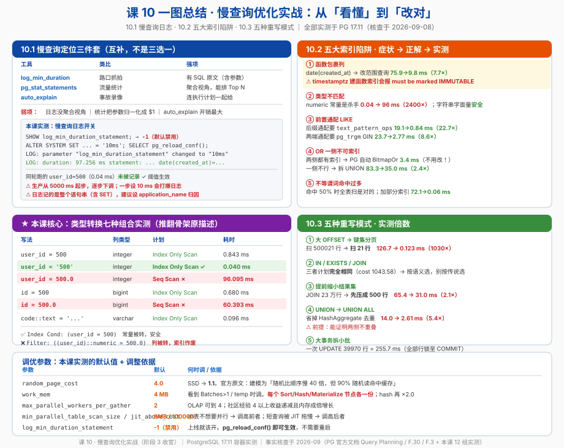

# 课 10 · 慢查询优化实战

> 📍 故事中的位置：主角遇到现实——索引建了、EXPLAIN 看了，但 SQL 还是慢，怎么办

## 本课目标

学完本课后，你能：

1. 打开慢查询日志并定位问题 SQL（`log_min_duration_statement` / `pg_stat_statements` / `auto_explain` 三件套）
2. **看穿**五种最常见的索引陷阱，并且知道每种的正解（含两个课本上不会写的坑）
3. 把常见慢 SQL 改写成更优的等价形式（键集分页 / 提前缩小结果集 / UNION ALL / 拆批）

## 知识点清单

| 知识点 | 关键点 |
|---|---|
| **10.1 慢查询日志** | · `log_min_duration_statement` 配置 · `pg_stat_statements` 扩展（累计视图） · `auto_explain`（自动记录） · 实战：找 top 5 慢 SQL |
| **10.2 索引陷阱** | · 函数包裹（`WHERE date(created_at) = ...`） · 类型转换（`WHERE id = '123'` 隐式转 int） · 前缀通配（`LIKE '%abc%'` 不走索引） · OR 改写为 UNION ALL · 不等谓词（`<>` / `NOT IN`）与 NULL 的叠加 |
| **10.3 重写 SQL 的常见模式** | · 大 OFFSET 改键集分页（seek pagination） · IN vs JOIN vs EXISTS · 提前缩小结果集 · 把 UNION 改成 UNION ALL · 拆分大事务为小批量 |

> ⚠️ **骨架勘误预告**：知识点 10.2 里「`WHERE id = '123'` 隐式转 int」这一条**描述不准确**，本课实测会推翻它。真正的杀手不是字符串字面量，而是 **numeric 常量**。详见第三幕 10.2。

## 故事主线中的情节定位

主角被救活——读者从"看到慢"到"动手修"，区别只在这一章。**这是整个阶段 3 最考验动手能力的一课**，也是阶段 3 的收官。

课 8 给你**路**（索引），课 9 给你**眼**（EXPLAIN），课 10 给你**手**（改）。

## 正文

## 📌 知识点导航

| 幕 | 内容 | 你会拿到的东西 |
|---|---|---|
| 第一幕 | 一条 SQL 从 8 秒到 0.1 秒 | 优化的四步工作流 |
| 第二幕 | 4 个会让你改错方向的陷阱 | 网传结论 vs 本课实测 |
| 第三幕 | 10.1 / 10.2 / 10.3 三块硬骨头 | 六要素完整展开 |
| 第四幕 | 12 组实验（本课全部实测） | 可复现的数字 |
| 第五幕 | 一张图 + 参数速查表 | 收进你的诊断手册 |

---

## 第一幕 · 起源与场景引入

### 一个真实的工作场景

接课 9 那个 8 秒的订单列表页。你现在已经会用 `EXPLAIN (ANALYZE, BUFFERS)` 了，拿到计划一看：

```
Seq Scan on orders  (cost=0.00..25375.00 rows=5099 width=0)
                    (actual time=0.095..81.090 rows=86491 loops=1)
  Filter: ((user_id = 500) OR (date(created_at) = '2024-01-05'::date))
  Rows Removed by Filter: 913509
```

现在问题来了：**然后呢？**

你可以建索引，但你会发现——建了 `idx_orders_user_id`，`user_id = 500` 那半边确实快了，可整个 `OR` 还是全表扫。你可以加 `date(created_at)` 的表达式索引，结果直接报错：

```
ERROR:  functions in index expression must be marked IMMUTABLE
```

**这就是本课要解决的：从"看懂"到"改对"之间，还隔着一层。**

### 慢查询优化的四步工作流

本课所有内容都挂在这个流程上，先记住它：

```
① 定位  ── 哪条 SQL 慢？（10.1：三件套）
        ↓
② 归因  ── 为什么慢？（课 9：EXPLAIN + 本课 10.2 五大陷阱）
        ↓
③ 改写  ── 换个等价写法（10.3：五种重写模式）
        ↓
④ 验证  ── 再跑一次 EXPLAIN ANALYZE，用数字证明
```

**第 ④ 步不能省。** 本课有两组实验会告诉你：你以为的"优化"有时反而更慢，或者根本没差别。

---

## 第二幕 · 认知冲突

下面 4 条，是我准备这课时**实测推翻**的流行说法。第 1 条推翻的是我们自己的课程骨架。

### 陷阱 1："`WHERE id = '123'` 会因为隐式转换导致索引失效" —— **不成立**

**本课骨架原文**写的就是这句话。实测打脸（PG 17.11，`user_id` 是 `integer` 且有索引）：

```
── user_id = 500（int 常量，基准）──
 Index Only Scan using idx_ob_user_inc  (cost=0.42..14.17 rows=100)
   Index Cond: (user_id = 500)
 Execution Time: 0.843 ms

── user_id = '500'（字符串字面量）──
 Index Only Scan using idx_ob_user_inc  (cost=0.42..14.17 rows=100)
   Index Cond: (user_id = 500)          ← 优化器把 '500' 解析成了 500！
 Execution Time: 0.040 ms
```

**字符串字面量是 `unknown` 类型，PG 会把它解析成列的类型，索引照常使用。**

那真正的杀手是什么？看这个：

```
── user_id = 500.0（numeric 常量）──
 Seq Scan on orders_big  (cost=0.00..22875.00 rows=5000)
   Filter: ((user_id)::numeric = 500.0)     ← 列被转成 numeric 了
   Rows Removed by Filter: 999900
 Execution Time: 96.095 ms
```

**96.095 ms vs 0.040 ms —— 2400 倍。** 注意 `Filter` 里是 `(user_id)::numeric`：这次转换发生在**列**上，而不是常量上，索引就作废了。

> 这个坑的真实场景：ORM 或应用框架把参数当成 `BigDecimal` / `Decimal` 传进来，或者 JSON 里数字带小数点。Java 的 `BigDecimal`、Python 的 `Decimal` 都是典型来源。

### 陷阱 2："函数包裹列就加个表达式索引" —— **对 timestamptz 列会直接报错**

函数包裹确实会让索引失效，这点骨架是对的：

```
── date(created_at) = '2024-01-05' ──
 Seq Scan  Filter: (date(created_at) = '2024-01-05'::date)
 Rows Removed by Filter: 913600
 Execution Time: 75.891 ms
```

很多教程会说"加个函数索引就行了"。我们照做：

```sql
CREATE INDEX idx_ob_date_expr ON orders_big (date(created_at));
```

```
ERROR:  functions in index expression must be marked IMMUTABLE
```

**报错了。** 因为 `created_at` 是 `timestamptz`，而 `date(timestamptz)` 依赖会话的 `TimeZone` 设置 —— 它是 `STABLE` 函数，不是 `IMMUTABLE`，PG 不允许拿它建索引。

正解有两个（详见 10.2），最推荐的其实是**改写成范围查询**：

```
── created_at >= '2024-01-05' AND created_at < '2024-01-06' ──
 Index Only Scan using idx_ob_created_btree
   Index Cond: ((created_at >= ...) AND (created_at < ...))
 Execution Time: 9.843 ms        ← 比原来的 75.891 ms 快 7.7 倍
```

### 陷阱 3："OR 一定会让索引失效" —— **不一定，PG 会自己合并**

实测（`user_id` 和 `id` 都有索引）：

```
── WHERE user_id = 500 OR id = 999999 ──
 Bitmap Heap Scan on orders_big
   Recheck Cond: ((user_id = 500) OR (id = 999999))
   ->  BitmapOr
         ->  Bitmap Index Scan on idx_ob_user_inc   Index Cond: (user_id = 500)
         ->  Bitmap Index Scan on orders_big_pkey   Index Cond: (id = 999999)
 Execution Time: 3.417 ms
```

**PG 自动生成了 `BitmapOr`，两个索引都用上了。** 只有当 OR 的某一侧**本身就用不了索引**（没索引、或列被函数包裹）时，才会退化成全表扫：

```
── WHERE user_id = 500 OR amount > 9999.99（amount 无索引）──
 Seq Scan   Filter: ((user_id = 500) OR (amount > 9999.99))
 Execution Time: 117.161 ms      ← 比上面的 3.417 ms 慢 34 倍
```

**所以改写的目标不是"消灭 OR"，而是"让 OR 的每一侧都能用上索引"。**

### 陷阱 4："IN 比 EXISTS 慢，要改成 EXISTS" —— **现代 PG 里没区别**

这是从 MySQL 5.x / Oracle 老版本传下来的经验。实测（PG 17.11，三条语句语义等价）：

| 写法 | cost | actual | 计划形状 |
|---|---|---|---|
| `WHERE user_id IN (子查询)` | 1043.58 | 2.257 ms | Nested Loop + Index Only Scan |
| `WHERE EXISTS (子查询)` | **1043.58** | 1.313 ms | **完全相同** |
| `INNER JOIN` | **1043.58** | 1.311 ms | **完全相同** |

**三个计划的 cost 一模一样，连节点结构都一字不差。** 因为优化器会把 `IN` / `EXISTS` 都 unnest 成 Semi Join（课 6 讲过这个机制）。

> 那该用哪个？**看语义，不看性能**：
> - `EXISTS` 对 NULL 最安全（课 6：`NOT IN` + NULL 返回 0 行是经典事故）
> - `JOIN` 在右侧有重复值时会**放大行数**，用之前先确认唯一性
> - `IN` 在子查询很小的时候可读性最好

---

## 第三幕 · 层层揭示

### （一）10.1 慢查询日志

#### 一句话定义

三条互补的观测通道：`log_min_duration_statement` 记**单条超过阈值的语句**（带原始文本），`pg_stat_statements` 记**所有语句的聚合统计**（归一化后的模式），`auto_explain` 记**慢语句的完整执行计划**。

#### 直觉建立 · 三种监控摄像头

| 工具 | 类比 | 强项 | 弱项 |
|---|---|---|---|
| `log_min_duration_statement` | **路口抓拍**：超速就拍一张照片 | 有完整 SQL 原文（含参数） | 只记超阈值的，没有聚合视角 |
| `pg_stat_statements` | **交通流量统计**：一天总共过了多少车、平均多快 | 聚合视角，能排 Top N | 参数被归一化成 `$1`，看不到具体值 |
| `auto_explain` | **事故现场录像**：超速了就把全程录下来 | 连执行计划一起给你 | 开销最大（尤其 `log_analyze`） |

#### 核心原理 · `log_min_duration_statement`

| 项 | 值 |
|---|---|
| **默认值** | **`-1`（禁用）** —— 本课实测确认 |
| 单位 | 毫秒 |
| 设为 `0` | 记录**所有**语句（生产慎用） |
| `log_statement` 默认 | `none`（可选 `ddl` / `mod` / `all`） |
| 改完如何生效 | `ALTER SYSTEM SET ...` 然后 `SELECT pg_reload_conf();`（**不需要重启**） |

**本课实测：**

```sql
ALTER SYSTEM SET log_min_duration_statement = '10ms';
SELECT pg_reload_conf();
```

日志输出：

```
LOG:  received SIGHUP, reloading configuration files
LOG:  parameter "log_min_duration_statement" changed to "10ms"
LOG:  duration: 97.256 ms  statement: ... SELECT count(*) FROM orders_big WHERE date(created_at)='2024-01-05';
```

而同一轮里跑的 `SELECT count(*) FROM orders_big WHERE user_id=500`（0.04 ms）**没有出现在日志里** —— 阈值生效。

> ⚠️ **实操提醒（本课踩到的）**：日志里记的是**客户端发来的整个语句串**。如果你用 `psql -c "SET ...; SELECT ..."` 这种多语句形式，日志会把 `SET` 一起记进去。
> 生产上更干净的做法是设 `application_name`，让日志能归因到具体服务：
> ```sql
> ALTER SYSTEM SET application_name = 'order-service';
> ```

**生产推荐起步值**（社区一致建议，从高往低调）：

```
先从 5000 ms 开始 → 修掉最夸张的 → 降到 1000 ms → 再降到 200~500 ms
```

一步到位设 10 ms 会把日志打爆。

#### 核心原理 · `pg_stat_statements`（课 9 已装好，这里讲用法）

课 9 我们已经通过 `ALTER SYSTEM SET shared_preload_libraries` + 重启容器把它打开了。它回答的是**"哪些 SQL 最值得我花时间"**：

```sql
-- ① 按总耗时排：系统里最耗 CPU 的是谁
SELECT left(query, 70) AS q, calls,
       round(total_exec_time::numeric) AS total_ms,
       round(mean_exec_time::numeric,2) AS mean_ms, rows
FROM pg_stat_statements
WHERE query NOT ILIKE '%pg_stat_statements%'
ORDER BY total_exec_time DESC LIMIT 5;

-- ② 按平均耗时排：单条最慢的是谁
SELECT left(query, 70) AS q, calls, round(mean_exec_time::numeric,2) AS mean_ms
FROM pg_stat_statements WHERE calls > 100
ORDER BY mean_exec_time DESC LIMIT 5;

-- ③ 按 IO 排：谁在读盘
SELECT left(query, 70) AS q, calls, shared_blks_read,
       round(100.0*shared_blks_hit/NULLIF(shared_blks_hit+shared_blks_read,0),1) AS hit_pct
FROM pg_stat_statements ORDER BY shared_blks_read DESC LIMIT 5;

-- ④ 临时文件大户：排序/hash 溢出到磁盘的
SELECT left(query, 70) AS q, calls, temp_blks_written
FROM pg_stat_statements WHERE temp_blks_written > 0
ORDER BY temp_blks_written DESC LIMIT 5;
```

课 9 实测输出示例（注意 `status=$1` 的归一化）：

```
                             q                             | calls | total_ms | mean_ms | rows  | hit | read
-----------------------------------------------------------+-------+----------+---------+-------+-----+------
 SELECT count(*) FROM orders_big WHERE status=$1           |     2 |    45.08 |  22.539 |     2 |   7 | 8617
 SELECT user_id, count(*) FROM orders_big GROUP BY user_id |     1 |    36.82 |  36.816 | 10000 | 195 | 7680
 SELECT count(*) FROM big_orders WHERE amount>$1           |     1 |    13.49 |  13.492 |     1 |   0 | 1615
```

#### 核心原理 · `auto_explain`（课 9 已验证配置）

课 9 我们实测过会话级用法。这里补生产配置：

```conf
# postgresql.conf
shared_preload_libraries = 'auto_explain'
auto_explain.log_min_duration = '1s'
auto_explain.log_analyze = on
auto_explain.log_buffers = on
auto_explain.log_timing = off        # 关掉逐节点计时，大幅降开销
auto_explain.log_nested_statements = on
```

官方对 `log_analyze` 的警告原文（核查于 2026-09）：

> When this parameter is on, per-plan-node timing occurs for all statements executed, whether or not they run long enough to actually get logged. **This can have an extremely negative impact on performance.**

**三件套的分工**：`pg_stat_statements` 天天开着（开销小，找目标）→ `log_min_duration_statement` 天天开着（留证据）→ `auto_explain` 排查期临时开（开销大，拿计划）。

#### 示例演示 · 完整走一遍定位流程

```sql
-- Step 1：谁最慢？（pg_stat_statements）
SELECT left(query,60) q, calls, round(mean_exec_time::numeric,2) mean_ms
FROM pg_stat_statements ORDER BY mean_exec_time DESC LIMIT 5;

-- Step 2：拿到具体某条的完整 SQL（log 里有原文，或按 queryid 反查）
SELECT query FROM pg_stat_statements WHERE queryid = <上面查到的 id>;

-- Step 3：拿计划
EXPLAIN (ANALYZE, BUFFERS) <完整 SQL>;

-- Step 4：对照 10.2 的五大陷阱归因，用 10.3 的手法改写

-- Step 5：再跑一次，用数字证明
EXPLAIN (ANALYZE, BUFFERS) <改写后的 SQL>;
```

#### 常见误区（10.1）

| # | 误区 | 事实 |
|---|---|---|
| 1 | 慢查询日志默认开着 | `log_min_duration_statement` 默认 **-1 = 禁用** |
| 2 | 改完配置要重启 | 这个参数 `pg_reload_conf()` 即可（但 `pg_stat_statements` 的 `shared_preload_libraries` 必须重启） |
| 3 | 有 `pg_stat_statements` 就不用慢查询日志 | 前者把参数归一化成 `$1`，看不到具体值；后者有原文，互补 |
| 4 | `auto_explain` 开着没成本 | 官方明说 `log_analyze=on` 是 "extremely negative impact"；生产建议 `log_timing=off` |
| 5 | 阈值一步设到 10 ms | 日志会打爆。从 5000 ms 起步，逐步下调 |
| 6 | 只看 `mean_exec_time` 排 Top | 也要看 `total_exec_time`（被调用 10 万次的 5 ms 查询，比调用 1 次的 5 秒查询更值得优化） |

#### 一句话记住

> **pg_stat_statements 找目标，慢查询日志留原文，auto_explain 拿计划；三者是互补的，不是三选一。**

#### 命令速查卡 · 10.1

```sql
-- 慢查询日志
SHOW log_min_duration_statement;                    -- 默认 -1（禁用）
ALTER SYSTEM SET log_min_duration_statement = '1s'; -- 单独执行，不能和其他语句同批
SELECT pg_reload_conf();
ALTER SYSTEM SET application_name = 'order-service'; -- 让日志可归因

-- pg_stat_statements
CREATE EXTENSION IF NOT EXISTS pg_stat_statements;
SELECT left(query,70) q, calls, round(total_exec_time::numeric) total_ms,
       round(mean_exec_time::numeric,2) mean_ms, rows
FROM pg_stat_statements ORDER BY total_exec_time DESC LIMIT 10;
SELECT pg_stat_statements_reset();                  -- 做前后对比时清空

-- auto_explain（会话级临时开）
LOAD 'auto_explain';
SET auto_explain.log_min_duration = 0;
SET auto_explain.log_analyze = true;
SET auto_explain.log_buffers = true;
SET client_min_messages = LOG;
```

---

### （二）10.2 索引陷阱

#### 一句话定义

五种会让「明明建了索引却全表扫」的写法：函数包裹列、类型不匹配、前置通配符、OR 中有一侧不可索引、不等谓词命中过多行。

#### 直觉建立 · 索引是一本书的目录

索引（B-Tree）本质是一份**按值排好序的目录**。能用目录的前提是：**你的查询条件能直接对应到目录里已经排好序的那个"值"。**

一旦你对列做了任何加工（函数、类型转换），PG 手里的目录就不再匹配了——它得把每一行的值都加工一遍再比对，等于**放弃目录、全书翻一遍**。

#### 陷阱 ① 函数包裹列

**症状**：`Filter:` 里出现函数包裹的列。

```
── date(created_at) = '2024-01-05' ──
 Seq Scan on orders_big  (cost=0.00..22875.00 rows=5000 width=0)
                         (actual time=25.732..73.702 rows=86400 loops=1)
   Filter: (date(created_at) = '2024-01-05'::date)
   Rows Removed by Filter: 913600
 Execution Time: 75.891 ms
```

**正解 1（最推荐）：改写成范围查询**

```sql
WHERE created_at >= '2024-01-05' AND created_at < '2024-01-06'
```

```
 Index Only Scan using idx_ob_created_btree (actual time=0.651..7.025 rows=86400)
   Index Cond: ((created_at >= '2024-01-05 00:00:00+00') AND (created_at < '2024-01-06 00:00:00+00'))
   Heap Fetches: 1008
 Execution Time: 9.843 ms     ← 快 7.7 倍
```

**正解 2：表达式索引 —— 但 timestamptz 会报错**

```sql
CREATE INDEX idx_ob_date_expr ON orders_big (date(created_at));
-- ERROR:  functions in index expression must be marked IMMUTABLE
```

**为什么会报错？** 因为 `created_at` 是 `timestamptz`（带时区），`date(timestamptz)` 的结果依赖会话的 `TimeZone` 设置 —— 它是 `STABLE` 函数，不是 `IMMUTABLE`。PG 要求索引表达式必须 `IMMUTABLE`（同一个输入永远同一个输出）。

**修法：把时区固定死，让它变成 IMMUTABLE**

```sql
CREATE INDEX idx_ob_date_utc ON orders_big (((created_at AT TIME ZONE 'UTC')::date));
```

```
 Index Scan using idx_ob_date_utc
   Index Cond: (((created_at AT TIME ZONE 'UTC'))::date = '2024-01-15'::date)
 Execution Time: 0.036 ms     ← 对照 62.034 ms，快 1723 倍
```

注意查询也要写成同样的表达式才会命中。

> 💡 **判据**：看到 `Filter:` 里有**函数包着列**，就是它。对应 `Index Cond:` 里有函数才是走了索引。

#### 陷阱 ② 类型不匹配（本课推翻骨架的一条）

**这是本课最重要的一张表**，全部为本课 PG 17.11 实测：

| 写法 | 列类型 | 计划 | Filter / Index Cond | 耗时 |
|---|---|---|---|---|
| `user_id = 500` | integer | Index Only Scan | `Index Cond: (user_id = 500)` | 0.843 ms |
| `user_id = '500'` | integer | **Index Only Scan** | `Index Cond: (user_id = 500)` | **0.040 ms** |
| `user_id = 500.0` | integer | **Seq Scan** | `Filter: ((user_id)::numeric = 500.0)` | **96.095 ms** |
| `id = 500` | bigint | Index Only Scan | `Index Cond: (id = 500)` | 0.680 ms |
| `id = 500.0` | bigint | **Seq Scan** | `Filter: ((id)::numeric = 500.0)` | **60.393 ms** |
| `code = 'C0000500'` | varchar | Index Only Scan | `Index Cond: (code = 'C0000500'::text)` | 0.082 ms |
| `code::text = 'C0000500'` | varchar | **Index Only Scan** | `Index Cond: (code = 'C0000500'::text)` | 0.096 ms |

**三条结论：**

1. **字符串字面量不是问题。** `'500'` 是 `unknown` 类型，PG 解析成列的类型，索引照用。
2. **numeric 常量是杀手。** `500.0` 是 `numeric`，B-Tree 的 `integer_ops` 操作符族里没有 `integer = numeric` 这个跨类型操作符，PG 只能把**列**转成 numeric —— 索引作废。
3. **`varchar ↔ text` 是 binary-coercible。** PG 直接在计划里把 `::text` 抹掉了，`Index Cond` 里看到的是干净的 `code = '...'::text`。

**怎么自查？** 看 `Index Cond` 还是 `Filter`，以及**转换箭头加在哪一侧**：

```
✅ Index Cond: (user_id = 500)              -- 常量被转，安全
❌ Filter: ((user_id)::numeric = 500.0)     -- 列被转，索引作废
```

> 🔍 **真实来源**：Java 的 `BigDecimal`、Python 的 `Decimal`、JSON 里带小数点的数字、把 ID 定义成 `numeric` 的表。
> **修法**：让应用传对应类型；或者在 SQL 侧显式写 `WHERE user_id = 500`（而不是 `500.0`）。

#### 陷阱 ③ 前置通配符 LIKE

**症状**：`LIKE '%关键字%'` 永远走不了 B-Tree。

```
── note LIKE '%-kw007-%' ──
 Seq Scan  Filter: (note ~~ '%-kw007-%'::text)
 Rows Removed by Filter: 300000
 Execution Time: 23.680 ms
```

**但这里还有个更隐蔽的坑：后缀通配也不一定走索引。**

`LIKE 'kw007-%'`（通配符在后）理论上可以用 B-Tree，但实测：

```
── note LIKE 'kw007-%'（普通 B-tree 索引，数据库 collation = en_US.utf8）──
 Seq Scan  Filter: (note ~~ 'kw007-%'::text)
 Rows Removed by Filter: 298506
 Execution Time: 19.107 ms        ← 还是全表扫！
```

**原因**：非 `C` collation 下，B-Tree 的排序规则跟 `LIKE` 的逐字节前缀匹配规则不一致，普通索引帮不上忙。

**正解：建 `text_pattern_ops` 索引**

```sql
CREATE INDEX idx_note_pattern ON note_search (note text_pattern_ops);
```

```
 Index Only Scan using idx_note_pattern
   Index Cond: ((note ~>=~ 'kw007-'::text) AND (note ~<~ 'kw007.'::text))
   Filter: (note ~~ 'kw007-%'::text)
 Execution Time: 0.843 ms     ← 快 22.7 倍
```

注意 `Index Cond` 变成了 `~>=~` / `~<~` —— 优化器把 `LIKE '前缀%'` 改写成了一个**范围扫描**。

**前后都通配怎么办？上 `pg_trgm` + GIN：**

```sql
CREATE EXTENSION IF NOT EXISTS pg_trgm;
CREATE INDEX idx_note_trgm ON note_search USING gin (note gin_trgm_ops);
```

```
 Bitmap Heap Scan on note_search
   Recheck Cond: (note ~~ '%-kw007-%'::text)
   Heap Blocks: exact=1146
   ->  Bitmap Index Scan on idx_note_trgm
         Index Cond: (note ~~ '%-kw007-%'::text)
 Execution Time: 2.769 ms     ← 比 23.680 ms 快 8.6 倍
```

> 💡 `pg_trgm` 把文本切成三字符组（trigram）建倒排索引，所以任意位置的 substring 都能查。代价是索引体积大、写入慢。

**LIKE 场景决策表：**

| 模式 | 例子 | B-Tree（默认） | `text_pattern_ops` | `pg_trgm` |
|---|---|---|---|---|
| 完全等值 | `= 'abc'` | ✅ | ✅ | ✅ |
| 后缀通配 | `LIKE 'abc%'` | ❌（非 C collation） | ✅ | ✅ |
| 前置通配 | `LIKE '%abc'` | ❌ | ❌ | ✅ |
| 两端通配 | `LIKE '%abc%'` | ❌ | ❌ | ✅ |
| 大小写无关 | `ILIKE '%abc%'` | ❌ | ❌ | ✅ |

#### 陷阱 ④ OR 中有一侧不可索引

**先说好消息：两侧都能索引时，PG 自己会合并。**

```
── WHERE user_id = 500 OR id = 999999（两侧都有索引）──
 Bitmap Heap Scan
   Recheck Cond: ((user_id = 500) OR (id = 999999))
   ->  BitmapOr
         ->  Bitmap Index Scan on idx_ob_user_inc   Index Cond: (user_id = 500)
         ->  Bitmap Index Scan on orders_big_pkey   Index Cond: (id = 999999)
 Execution Time: 3.417 ms
```

**坏消息：只要有一侧不行，整体就退化为全表扫。**

```
── WHERE user_id = 500 OR amount > 9999.99（amount 无索引）──
 Seq Scan  Filter: ((user_id = 500) OR (amount > 9999.99))
 Execution Time: 117.161 ms     ← 慢 34 倍
```

**正解：拆成 UNION，让每一侧各自走索引**

```
── 原写法：WHERE user_id = 500 OR date(created_at) = '2024-01-05' ──
 Seq Scan  Filter: ((user_id = 500) OR (date(created_at) = '2024-01-05'::date))
 Execution Time: 83.301 ms

── 改写为 UNION ──
SELECT count(*) FROM (
  SELECT id FROM orders_big WHERE user_id = 500
  UNION
  SELECT id FROM orders_big WHERE created_at >= '2024-01-05' AND created_at < '2024-01-06'
) t;
 Append
   ->  Bitmap Heap Scan        Index Cond: (user_id = 500)                 ← 走索引
   ->  Index Scan              Index Cond: ((created_at >= ...) AND ...)    ← 走索引
 Execution Time: 35.047 ms     ← 快 2.4 倍
```

> ⚠️ **`UNION` vs `UNION ALL` 的取舍**：`UNION` 会去重（多一次 HashAggregate），`UNION ALL` 不去重。
> 如果两侧**保证不重叠**（比如加上 `AND user_id <> 500`），用 `UNION ALL` 更快；
> 如果不能保证，用 `UNION`。本课这个例子两侧可能重叠，所以用了 `UNION`。

#### 陷阱 ⑤ 不等谓词命中过多行

**症状**：`<>` / `NOT IN` / `NOT LIKE` 命中比例太高，优化器认为全表扫更便宜。

```
── WHERE status <> 'paid'（命中 50%）──
 Seq Scan  Filter: (status <> 'paid'::text)
 Rows Removed by Filter: 500000
 Execution Time: 72.127 ms
```

这不是优化器蠢 —— 命中一半的行，走索引反而要回表 50 万次，确实更贵。

**正解 1：部分索引（当查询还带了其他等值条件时）**

```sql
CREATE INDEX idx_ob_unpaid ON orders_big (user_id) WHERE status <> 'paid';
```

```
── WHERE status <> 'paid' AND user_id = 500 ──
 Index Only Scan using idx_ob_unpaid
   Index Cond: (user_id = 500)
   Heap Fetches: 0
 Execution Time: 0.059 ms
```

**正解 2：反向改写（当"不要的"比"要的"少得多时）**

```sql
-- 慢：WHERE status <> 'paid'         （命中 50%）
-- 快：WHERE status IN ('pending','refunded','cancelled')   （命中 50%，没什么差别）
-- 真正有效的是把"稀疏的那一边"作为正向条件
```

> ⚠️ **不等谓词 + NULL 是双重陷阱**（课 6 详细讲过，这里回收）：
> `NOT IN (子查询)` 只要子查询里有 `NULL`，结果就是 **0 行**（不是"全部"）。
> 修法：用 `NOT EXISTS`，或者在子查询里加 `WHERE col IS NOT NULL`。

#### 常见误区（10.2）

| # | 误区 | 事实 |
|---|---|---|
| 1 | `WHERE id = '123'` 会因隐式转换失效 | **不会**。本课实测走 Index Only Scan。真凶是 `numeric` 常量（96 ms vs 0.04 ms） |
| 2 | 函数包裹就加表达式索引 | 对 `timestamptz` 列会报 `must be marked IMMUTABLE`；优先改写成范围查询 |
| 3 | `LIKE 'abc%'` 一定能走索引 | 非 `C` collation 下普通 B-Tree **不行**，要 `text_pattern_ops` |
| 4 | OR 一定会让索引失效 | 两侧都能索引时 PG 自动 `BitmapOr`；只有一侧不行才退化 |
| 5 | 不等谓词加索引就能解决 | 命中比例高时索引本就不该用；用部分索引或反向改写 |
| 6 | `NOT IN` 和 `NOT EXISTS` 等价 | 子查询有 NULL 时 `NOT IN` 返回 **0 行**，`NOT EXISTS` 正常 |

#### 一句话记住

> **看 `Index Cond` 还是 `Filter`——转换箭头加在常量那边安全，加在列那边就是全表扫。**

#### 命令速查卡 · 10.2

```sql
-- ① 函数包裹：改范围（首选）
WHERE created_at >= '2024-01-05' AND created_at < '2024-01-06'
-- 或建 IMMUTABLE 表达式索引（timestamptz 必须固定时区）
CREATE INDEX ON t (((created_at AT TIME ZONE 'UTC')::date));

-- ② 类型不匹配：让常量类型匹配列
WHERE user_id = 500        -- ✅ 不是 '500.0'、不是 500.0
-- 自查：看 Filter 里转换加在哪边
--   ✅ Index Cond: (user_id = 500)
--   ❌ Filter: ((user_id)::numeric = 500.0)

-- ③ LIKE
CREATE INDEX ON t (col text_pattern_ops);                    -- 后缀通配 'abc%'
CREATE EXTENSION pg_trgm;
CREATE INDEX ON t USING gin (col gin_trgm_ops);              -- 任意位置 '%abc%'

-- ④ OR：拆成 UNION，每侧各走各的索引
SELECT ... WHERE a = 1
UNION            -- 可能重叠用 UNION；保证不重叠用 UNION ALL
SELECT ... WHERE b = 2;

-- ⑤ 不等谓词
CREATE INDEX ON t (key) WHERE status <> 'paid';              -- 部分索引
WHERE NOT EXISTS (SELECT 1 FROM x WHERE ...)                 -- 替代 NOT IN（不怕 NULL）

-- 通用自查：先看列上有没有函数/转换
SELECT proname, provolatile FROM pg_proc
WHERE proname IN ('date','lower','substr','to_char');  -- i=IMMUTABLE s=STABLE v=VOLATILE
```

---

### （三）10.3 重写 SQL 的常见模式

#### 一句话定义

五种「不动索引、只改写法」就能提速的模式：键集分页、按语义选 IN/EXISTS/JOIN、提前缩小结果集、UNION 改 UNION ALL、大事务拆批。

#### 模式 ① 大 OFFSET → 键集分页（seek pagination）

**问题**：`OFFSET N` 要先扫描并丢弃前 N 行，代价**线性增长**。

本课实测（100 万行表，翻到第 50 万条）：

```
── ORDER BY created_at, id LIMIT 20 OFFSET 500000 ──
 Limit  (cost=39429.47..39431.04 rows=20)
   ->  Incremental Sort
         ->  Index Scan using idx_ob_created_btree (actual ... rows=500021)   ← 扫了 50 万行！
 Execution Time: 126.725 ms
```

**正解：记住上一页最后一条的排序键，下一页从那里接着取**

```sql
-- 第 1 页
SELECT id, user_id, created_at FROM orders_big
ORDER BY created_at, id LIMIT 20;

-- 下一页（用上一页最后一行的 (created_at, id) 当游标）
SELECT id, user_id, created_at FROM orders_big
WHERE (created_at, id) > ('2024-01-06 18:53:21+00', 500001)
ORDER BY created_at, id LIMIT 20;
```

```
 Limit
   ->  Incremental Sort
         ->  Index Scan using idx_ob_created_btree (actual ... rows=21)   ← 只扫 21 行
               Index Cond: (created_at >= '2024-01-06 18:53:21+00')
               Filter: (ROW(created_at, id) > ROW('2024-01-06 18:53:21+00', 500001))
               Rows Removed by Filter: 1
 Execution Time: 0.123 ms      ← 快 1030 倍
```

**三个要点：**

1. **必须用行值比较** `(a, b) > (?, ?)` —— 这是 PG 的元组比较语法，能被复合索引直接命中
2. **排序键必须唯一** —— 加 `id` 兜底，否则并行值会漏行/重复
3. **索引要匹配** —— `(created_at, id)` 顺序一致（课 8 的最左前缀）

> **代价**（诚实说）：键集分页**不能跳页**（去不了第 500 页，只能一页页翻）。
> 如果业务必须要跳页，折中方案是"先 `WHERE` 定位到大致位置再 `OFFSET` 小量"，或者限制最大翻页数。

#### 模式 ② IN vs JOIN vs EXISTS：按语义选，别按"传说"选

本课实测三者**计划完全相同**（详见第二幕陷阱 4）。所以决策看语义：

| 写法 | 适合场景 | 坑 |
|---|---|---|
| `EXISTS` | **默认推荐**。对 NULL 最安全 | 无 |
| `IN` | 子查询很小、追求可读性 | `NOT IN` + NULL → 返回 0 行 |
| `JOIN` | 需要取右侧表的列 | 右侧有重复值会**放大行数** |

```sql
-- 需要 user 表的列 → JOIN
SELECT u.uname, o.amount FROM small_users u JOIN big_orders o ON o.uid = u.uid;

-- 只判断存在性 → EXISTS（语义最清晰，也不怕 NULL）
SELECT * FROM orders_big o
WHERE EXISTS (SELECT 1 FROM small_users u WHERE u.uid = o.user_id AND u.city = 'BJ');

-- 明确的小集合 → IN（可读性最好）
SELECT * FROM orders_big WHERE status IN ('paid','refunded');
```

#### 模式 ③ 提前缩小结果集（先聚合，再 JOIN）

**原理**：JOIN 的成本跟行数成正比。能在 JOIN 之前把行数压下去，就别等 JOIN 完再聚合。

本课实测（23 万行订单 JOIN 500 个用户，按城市汇总）：

```
── 写法 A：先 JOIN 再聚合 ──
 HashAggregate
   ->  Hash Join  (actual rows=230000)          ← JOIN 处理了 23 万行
         ->  Seq Scan on big_orders   (rows=230000)
 Execution Time: 65.378 ms

── 写法 B：先聚合再 JOIN ──
 Hash Join  (actual rows=500)
   ->  HashAggregate  (actual rows=500)         ← 先把 23 万压成 500
         ->  Seq Scan on big_orders  (rows=230000)
 Execution Time: 31.004 ms     ← 快 2.1 倍
```

**写法：**

```sql
-- A（慢）
SELECT u.city, sum(o.amount) FROM small_users u
JOIN big_orders o ON o.uid = u.uid GROUP BY u.city;

-- B（快）
SELECT u.city, t.s FROM small_users u
JOIN (SELECT uid, sum(amount) s FROM big_orders GROUP BY uid) t ON t.uid = u.uid;
```

> **注意**：这个改写**不是永远成立**。如果 `WHERE` 条件能先把大表过滤到很小，那先 JOIN 也无所谓。
> 判据看计划：如果 `Hash Join` 那层的 `actual rows` 远大于最终聚合出来的行数，就值得先聚合。

#### 模式 ④ UNION → UNION ALL（当确信无重复时）

本课实测（两个各 1 万行的分支）：

```
── UNION（去重）──
 HashAggregate  Group Key: orders_big.status       ← 多了一次去重
   ->  Append  (actual rows=19900)
 Execution Time: 14.011 ms

── UNION ALL（不去重）──
 Append  (actual rows=19900)                        ← 直接拼接
 Execution Time: 2.608 ms     ← 快 5.4 倍
```

**关键：只有当你能证明两侧不重叠时才用 `UNION ALL`。**

```sql
-- 安全：两个区间不重叠
SELECT * FROM orders WHERE created_at < '2024-01-01'
UNION ALL
SELECT * FROM orders WHERE created_at >= '2024-01-01';

-- 不安全：可能有同时满足的行，必须用 UNION
SELECT * FROM orders WHERE status = 'paid'
UNION      -- 不能用 UNION ALL
SELECT * FROM orders WHERE amount > 100;
```

顺带说：**如果根本不需要去重，也别为了"保险"写 `UNION`。**

#### 模式 ⑤ 大事务拆成小批量

**问题不在总耗时，在锁和 WAL。**

本课实测（UPDATE 39970 行）：

```
── 一个事务，一次更新 39970 行 ──
 Update on big_orders  (actual time=254.993..254.994 rows=0)
   ->  Seq Scan on big_orders  (actual ... rows=39970)
 Execution Time: 255.696 ms
```

255 ms 看起来还好。但真实生产的问题是：

| 维度 | 一个大事务（39970 行） | 拆成 4 批（每批 ~1 万行） |
|---|---|---|
| 锁持有 | 39970 行**同时**被锁，直到 COMMIT | 每批锁 ~1 万行，批间释放 |
| 阻塞 | 其他会话访问这些行会等 255 ms+ | 每批之间有机会插进来 |
| WAL | 一次爆发 | 分摊 |
| 复制延迟 | 从库要等整个事务应用完才可见 | 每批立即可见 |
| 失败回滚 | 全回滚（重做 4 万行） | 只回滚当前批 |

**写法（应用层循环）：**

```sql
-- 每批 1 万，按主键范围切
UPDATE big_orders SET status = 'paid'
WHERE amount < 50 AND oid >= :start AND oid < :start + 10000;
-- 提交，然后 :start += 10000
```

或者用 `ctid` 分批（适合没有合适索引的情况）：

```sql
UPDATE big_orders SET status = 'paid'
WHERE ctid IN (SELECT ctid FROM big_orders WHERE amount < 50 LIMIT 10000);
```

> ⚠️ **注意**：批量 DELETE/UPDATE 之后要 `VACUUM`（或等 autovacuum），否则死元组堆积会让后续查询变慢。这个话题在阶段 5 展开。

#### 常见误区（10.3）

| # | 误区 | 事实 |
|---|---|---|
| 1 | 键集分页能跳页 | **不能**。它只能"下一页"，跳页要另外想办法 |
| 2 | `IN` 一定比 `EXISTS` 慢 | 现代 PG 三者计划完全相同（本课 cost 都是 1043.58） |
| 3 | `UNION ALL` 一定比 `UNION` 快 | 是的，但**前提是不重叠**。有重叠就会出重复行 |
| 4 | 先聚合再 JOIN 永远更快 | 只有"聚合能显著压缩行数"时才成立；大表已被 WHERE 过滤到很小时没差别 |
| 5 | 拆批是为了省时间 | 主要为了**缩短锁持有时间**和**平滑 WAL**，不是省总耗时 |
| 6 | 改写完不用再测 | 必须再跑 `EXPLAIN ANALYZE`。本课有两组实验证明"以为的优化"可能无效 |

#### 一句话记住

> **OFFSET 换游标、OR 拆 UNION、聚合往前挪、UNION 改 ALL、大事务切小批——每改一次都要重新 EXPLAIN 验证。**

#### 命令速查卡 · 10.3

```sql
-- ① 键集分页（必须唯一排序键，用行值比较）
SELECT ... FROM t WHERE (created_at, id) > (:last_created, :last_id)
ORDER BY created_at, id LIMIT 20;
CREATE INDEX ON t (created_at, id);        -- 索引顺序要匹配

-- ② 按语义选
WHERE EXISTS (SELECT 1 FROM x WHERE x.id = t.id AND ...)   -- 默认推荐
WHERE t.id IN (1,2,3)                                       -- 小集合
SELECT ... FROM a JOIN b ON ...                             -- 需要 b 的列

-- ③ 先聚合再 JOIN
SELECT u.city, t.s FROM users u
JOIN (SELECT uid, sum(amount) s FROM orders GROUP BY uid) t ON t.uid = u.uid;

-- ④ UNION → UNION ALL（确认不重叠时）
SELECT ... WHERE a = 1 UNION ALL SELECT ... WHERE a = 2;

-- ⑤ 大批量拆小批（应用层循环）
UPDATE t SET ... WHERE cond AND id >= :s AND id < :s + 10000;
-- 或者
UPDATE t SET ... WHERE ctid IN (SELECT ctid FROM t WHERE cond LIMIT 10000);
-- 批量写之后记得 VACUUM
VACUUM (ANALYZE) t;
```

---

## 第四幕 · 实操验证

> 以下全部为**本课在 PG 17.11 容器（pg17:5433）上的真实输出**。

### 实验 1 · 慢查询日志开关

```
SHOW log_min_duration_statement;     → -1（默认禁用）
ALTER SYSTEM SET log_min_duration_statement = '10ms';
SELECT pg_reload_conf();
-- 日志：
LOG:  received SIGHUP, reloading configuration files
LOG:  parameter "log_min_duration_statement" changed to "10ms"
LOG:  duration: 97.256 ms  statement: ... WHERE date(created_at)='2024-01-05';
-- 同时跑的 user_id=500（0.04 ms）未被记录 ✓
```

### 实验 2 · 函数包裹：改范围查询

| 写法 | 计划 | Rows Removed | Execution Time |
|---|---|---|---|
| `date(created_at) = '2024-01-05'` | Seq Scan | 913600 | 75.891 ms |
| `created_at >= '2024-01-05' AND < '2024-01-06'` | Index Only Scan | — | **9.843 ms** |

**快 7.7 倍。**

### 实验 3 · 函数包裹：表达式索引的两个下场

```sql
CREATE INDEX ON orders_big (date(created_at));
-- ERROR:  functions in index expression must be marked IMMUTABLE

CREATE INDEX ON orders_big (((created_at AT TIME ZONE 'UTC')::date));
-- CREATE INDEX  ✓
-- 查询 0.036 ms（对照 62.034 ms，快 1723 倍）
```

### 实验 4 · 类型转换：七种组合

| 写法 | 列类型 | 计划 | Execution Time |
|---|---|---|---|
| `user_id = 500` | integer | Index Only Scan | 0.843 ms |
| `user_id = '500'` | integer | **Index Only Scan** | 0.040 ms |
| `user_id = 500.0` | integer | **Seq Scan** | **96.095 ms** |
| `id = 500` | bigint | Index Only Scan | 0.680 ms |
| `id = 500.0` | bigint | **Seq Scan** | **60.393 ms** |
| `code = 'C0000500'` | varchar | Index Only Scan | 0.082 ms |
| `code::text = 'C0000500'` | varchar | **Index Only Scan** | 0.096 ms |

**结论：字符串字面量安全，numeric 常量致命（2400 倍）。**

### 实验 5 · LIKE 的三种索引

| 模式 | 索引 | 计划 | Execution Time |
|---|---|---|---|
| `LIKE 'kw007-%'` | 普通 B-Tree | Seq Scan | 19.107 ms |
| `LIKE 'kw007-%'` | `text_pattern_ops` | Index Only Scan | **0.843 ms** |
| `LIKE '%-kw007-%'` | 普通 B-Tree | Seq Scan | 23.680 ms |
| `LIKE '%-kw007-%'` | `pg_trgm` GIN | Bitmap Index Scan | **2.769 ms** |

数据库 collation = `en_US.utf8`。

### 实验 6 · OR 的三种命运

| 场景 | 计划 | Execution Time |
|---|---|---|
| 两侧都有索引 | **BitmapOr**（自动） | 3.417 ms |
| 一侧无索引 | Seq Scan | 117.161 ms |
| OR + 函数包裹 | Seq Scan | 83.301 ms |
| ↑ 改写成 UNION | Append + 两个索引扫描 | **35.047 ms** |

### 实验 7 · 不等谓词与部分索引

| 写法 | 计划 | Execution Time |
|---|---|---|
| `status <> 'paid'`（命中 50%） | Seq Scan | 72.127 ms |
| `status <> 'paid' AND user_id = 500` + 部分索引 | Index Only Scan | **0.059 ms** |

### 实验 8 · 深分页 vs 键集分页

| 方式 | 扫描行数 | Execution Time |
|---|---|---|
| `LIMIT 20 OFFSET 500000` | **500021** | 126.725 ms |
| `WHERE (created_at, id) > (...)` | **21** | **0.123 ms** |

**快 1030 倍。** 游标值取自 `ORDER BY created_at, id LIMIT 1 OFFSET 500000` 的实际结果。

### 实验 9 · IN vs EXISTS vs JOIN

| 写法 | cost | Execution Time | 计划形状 |
|---|---|---|---|
| `IN (子查询)` | 1043.58 | 2.257 ms | Nested Loop + Index Only Scan |
| `EXISTS (子查询)` | **1043.58** | 1.313 ms | **完全相同** |
| `INNER JOIN` | **1043.58** | 1.311 ms | **完全相同** |

### 实验 10 · 提前缩小结果集

| 写法 | Hash Join 处理行数 | Execution Time |
|---|---|---|
| 先 JOIN 再聚合 | 230000 | 65.378 ms |
| 先聚合再 JOIN | **500** | **31.004 ms** |

**快 2.1 倍。**

### 实验 11 · UNION vs UNION ALL

| 写法 | 计划 | Execution Time |
|---|---|---|
| `UNION`（去重） | HashAggregate + Append | 14.011 ms |
| `UNION ALL` | Append | **2.608 ms** |

**快 5.4 倍。**

### 实验 12 · 大事务

```
一次 UPDATE 39970 行：Execution Time 255.696 ms（全部行同时被锁至 COMMIT）
```

拆批的真正收益在锁持有时间、WAL 平滑度与复制延迟，不在总耗时。

---

## 第五幕 · 体系收束

### 一张图总结本课



### 优化参数速查（本课实测的默认值 + 调整依据）

| 参数 | 默认值 | 何时调 | 依据 |
|---|---|---|---|
| `log_min_duration_statement` | **-1（禁用）** | 上线就该开 | 从 5000 ms 起步逐步下调 |
| `random_page_cost` | **4.0** | SSD/云盘 → **1.1** | **官方原文**："modeling random access as 40 times slower than sequential, while expecting 90% of random reads to be cached"；"solid-state drives ... e.g., 1.1" |
| `seq_page_cost` | 1.0 | 基本不动 | 它是整个成本体系的基准 1（课 9 手算过） |
| `work_mem` | **4 MB** | 看到 `Batches > 1` / `temp` 时 | **每个 Sort/Hash/Materialize 节点各一份**；hash 再 × `hash_mem_multiplier`（默认 2.0，即 8 MB） |
| `max_parallel_workers_per_gather` | **2** | OLAP 可调到 4 | 社区经验：4 以上收益递减，且内存占用成倍增长 |
| `max_parallel_workers` / `max_worker_processes` | 8 / 8 | 建议设为 CPU 核数 | — |
| `parallel_setup_cost` | 1000 | 小查询不想要并行时调高 | 启动 worker 的估算成本 |
| `parallel_tuple_cost` | 0.1 | 同上 | worker→leader 每传一行的成本 |
| `min_parallel_table_scan_size` | **8 MB** | 小表不想要并行时调高 | 小于此值的表不考虑并行 |
| `jit_above_cost` | 100000 | 短查询被 JIT 拖慢时调高 | 课 9 实测见过 JIT 行 |

> 📌 **`work_mem` 的分配粒度**（多来源一致表述，核查于 2026-09）：
> "Each Sort, Hash, or Materialize node gets up to work_mem. **A single query with three sorts can use three times work_mem.** A hundred concurrent queries with three sorts each can use 300x."
> 所以**全局调大 `work_mem` 是危险的**，更稳的做法是对重查询用 `SET LOCAL work_mem = '256MB'` 只在该事务内生效。

### 本课五个数字的记忆锚点

| 数字 | 是什么 |
|---|---|
| **1030 倍** | 深分页改键集分页（126.725 ms → 0.123 ms） |
| **2400 倍** | `user_id = 500.0` 与 `user_id = '500'` 的天壤之别 |
| **22.7 倍** | `text_pattern_ops` 让 `LIKE 'kw%'` 从全表扫变索引扫 |
| **IMMUTABLE** | timestamptz 建函数索引报错的关键词 |
| **1043.58** | IN / EXISTS / JOIN 三个计划完全相同的 cost（别再纠结选哪个） |

### 与前后课的连接

- **← 课 8（索引原理）**：`text_pattern_ops` 是 B-Tree 操作符族的另一个成员；部分索引在 8.3 讲过，本课用于解决不等谓词
- **← 课 9（执行计划）**：`Batches > 1` / `temp` → 调 `work_mem`；`Rows Removed by Filter` 巨大 → 对照本课五大陷阱
- **← 课 3（查询基础）**：键集分页在那里首次出现，本课给出 1030 倍的实测数据
- **← 课 6（CTE 与子查询）**：`IN`/`EXISTS` 的 unnest 机制、`NOT IN` + NULL 陷阱
- **→ 阶段 4（事务/锁与并发）**：批量 UPDATE 的锁问题会在课 13 深入

### 🎉 阶段 3 闭环检查

学完课 8–10，你应该能：

- [ ] 说出 B-Tree / Hash / GIN / BRIN 各自适合什么（课 8）
- [ ] 手算一个 Seq Scan 的 cost，并读懂 `loops` / `Buffers` / `Batches`（课 9）
- [ ] 用 `ANALYZE` / `CREATE STATISTICS` 修好估算偏差（课 9）
- [ ] 看 `Index Cond` 还是 `Filter` 判断索引有没有被用上（课 10）
- [ ] 遇到慢 SQL，能走完「定位 → 归因 → 改写 → 验证」四步（课 10）

### 给你的行动清单

1. 在你的开发库打开 `log_min_duration_statement = 1s`，跑一轮压测，看看真正慢的是哪几条
2. 把课 10 的「五大陷阱」当成 checklist，逐条检查你项目里最核心的 3 条查询
3. 找一条带 `OFFSET` 的分页查询，改成键集分页，用 `EXPLAIN ANALYZE` 量出差距

---

## 🧭 课程导航

- 上一课：[课 9 执行计划](lesson-09-执行计划.md)
- 下一课：[课 11 事务与隔离级别](../4-事务锁与并发/lessons/lesson-11-事务与隔离级别.md)（跨阶段）
- 返回目录：[`02-课程目录.md`](../../02-课程目录.md)
- 🎉 **阶段 3 闭环** ——学完本课后，你应能：用 EXPLAIN 看穿慢 SQL / 修复五种常见索引陷阱 / 用 SQL 重写模式救活生产慢查询。下一阶段进入事务与并发。
