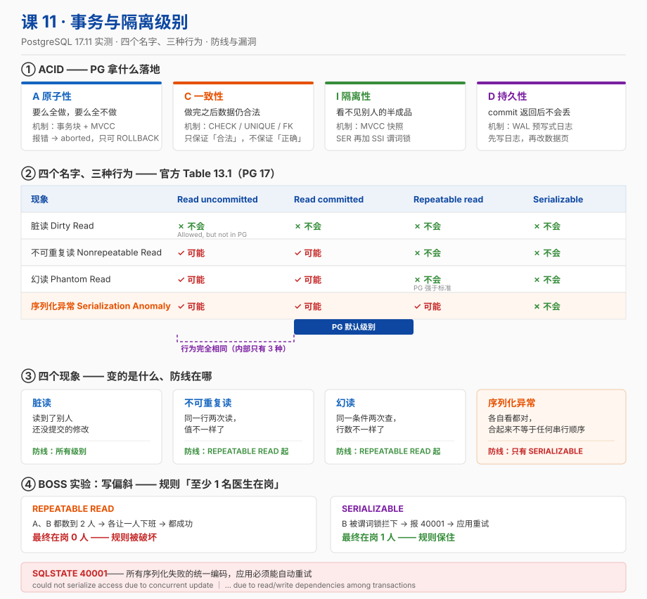

# 课 11 · 事务与隔离级别

> 📍 故事中的位置：主角一行订单第一次被两个请求同时争抢——并发问题露出獠牙

## 本课目标

学完本课后，你能：

1. **口述**：ACID 四个性质在 PG 里分别靠什么机制落地（不是背定义，是能指出具体机制）
2. **说清**：四种隔离级别的本质差别，以及 PG 里"四个名字、三种行为"的真相
3. **识别并复现**：脏读 / 不可重复读 / 幻读 / 序列化异常，知道哪个级别防得住哪个
4. **躲开**：两个生产上真会丢钱的坑——**丢失更新**与**写偏斜**

## 知识点清单

| 知识点 | 关键点 |
|---|---|
| **11.1 ACID** | · 原子性（事务整体成功 / 整体失败） · 一致性（约束 + 触发器级别的"业务一致性"） · 隔离性（并发事务的相互可见性） · 持久性（commit 后落盘） · PG 用 MVCC + WAL 落地这四个性质 |
| **11.2 四种隔离级别** | · 标准的四个级别（SQL 标准定义） · PG 的三个（**READ UNCOMMITTED 在 PG 等价于 READ COMMITTED**） · `SET TRANSACTION ISOLATION LEVEL ...` 设置 · READ COMMITTED 是 PG 默认 |
| **11.3 脏读 / 不可重复读 / 幻读** | · 脏读：读到别人未提交的数据（PG 在 READ COMMITTED 已防住） · 不可重复读：同一事务两次读同一条数据不一致 · 幻读：同一事务两次读"范围"行数变了 · 实验复现三个现象 |

> ⚠️ **骨架勘误预告（两条，都是本课实测推翻的）**
>
> 1. 知识点 11.2 写「PG 只有三个隔离级别」——**说法不严谨**。PG 接受 **4 个名字**，`SHOW transaction_isolation` 也**原样回显 4 个值**（包括 `read uncommitted`），只是内部**行为**只有 3 种。详见第二幕陷阱 1。
> 2. 知识点 11.3 按 SQL 标准暗示「REPEATABLE READ 会有幻读」——**在 PG 里不成立**。PG 的 RR **连幻读都防住了**（比标准更强）。但别高兴太早：**防住幻读 ≠ 防住写偏斜**。详见第二幕陷阱 3。

## 故事主线中的情节定位

主角遇到"两个请求争抢"——这是订单系统从上线的第一天就会遇上的事。读者通过具体实验学会"什么叫并发问题"。

课 8–10 解决的是**一个人问得慢**；课 11 开始解决**两个人同时问**。

这是阶段 4 的开篇，也是整个课程里**第一次需要开两个会话**才能讲清楚的课。

## 正文

## 📌 知识点导航

| 幕 | 内容 | 你会拿到的东西 |
|---|---|---|
| 第一幕 | 两次扣款，余额只少了 100 | 并发问题的四个长相 |
| 第二幕 | 5 个会让你写错代码的陷阱 | 网传结论 vs 本课实测 |
| 第三幕 | 11.1 / 11.2 / 11.3 三块硬骨头 | 六要素完整展开 |
| 第四幕 | 24 组实验（双会话实测） | 可复现的数字与报错原文 |
| 第五幕 | 一张图 + 决策速查表 | 收进你的设计手册 |

---

## 第一幕 · 起源与场景引入

### 一个真实的工作场景

接课 10 的订单系统。现在业务跑起来了，某天客服收到投诉："我账户里 1000 块，下了两单 100 块的，怎么还剩 900？"

你去看代码，逻辑清清楚楚：

```python
# 伪代码：扣款
balance = db.query("SELECT balance FROM accounts WHERE id = 1")   # 读到 1000
if balance >= amount:
    db.execute("UPDATE accounts SET balance = %s WHERE id = 1", balance - amount)
    db.commit()
```

单看这段代码，**没有任何问题**。判据有、扣减对、字段是 `numeric(12,2)` 不丢精度、还有 `CHECK (balance >= 0)` 兜底。

问题在于：**两个请求同一时刻都读到了 1000，都算出 900，都写回 900**。两次扣款，只生效了一次。

这不是 bug，这是**并发**。而"事务"和"隔离级别"就是数据库给你用来描述和控制这件事的工具。

### 本课要回答的四个问题

| 问题 | 对应知识 |
|---|---|
| 我怎么保证"要么全做，要么全不做"？ | 原子性（A） |
| 我怎么保证余额不会变成负数？ | 一致性（C） |
| 我怎么保证另一个请求不干扰我？ | 隔离性（I） |
| 我怎么保证 commit 返回后不会丢？ | 持久性（D） |

以及最后一个、也是最容易翻车的：

> **"隔离"到什么程度才够？** ——这就是四个隔离级别要回答的。

---

## 第二幕 · 认知冲突

这一幕的每一条，都是网上广为流传、但在 PG 17 上**实测不成立**或**被严重简化**的说法。

### 陷阱 1："PostgreSQL 只实现了三种隔离级别" —— **说半句**

更准确的说法是：**PG 接受四个名字，回显四个值，但只实现三种行为。**（核查于 2026-09，PG 17 官方文档 13.2）

官方原文：

> "In PostgreSQL, you can request any of the four standard transaction isolation levels, but internally only three distinct isolation levels are implemented, i.e., PostgreSQL's Read Uncommitted mode behaves like Read Committed. This is because it is the only sensible way to map the standard isolation levels to PostgreSQL's multiversion concurrency control architecture."

但**很多人因此以为 `SHOW transaction_isolation` 会显示 `read committed`**。实测（实验 S10）打脸：

```
BEGIN ISOLATION LEVEL READ UNCOMMITTED   → SHOW 返回: read uncommitted
BEGIN ISOLATION LEVEL READ COMMITTED     → SHOW 返回: read committed
BEGIN ISOLATION LEVEL REPEATABLE READ    → SHOW 返回: repeatable read
BEGIN ISOLATION LEVEL SERIALIZABLE       → SHOW 返回: serializable
```

**`SHOW` 回显的是你请求的级别，不是内部实际行为。** 想验证 READ UNCOMMITTED 到底有没有用，只能看**现象**——实测（实验 E4）：另一个会话未提交的修改，你读不到。

> **结论**：别拿 `SHOW transaction_isolation` 当"PG 有几个级别"的证据。名字是 4 个，行为是 3 种。

### 陷阱 2："REPEATABLE READ 会有幻读" —— **在 PG 里不成立**

这是 SQL 标准的说法：**标准允许** REPEATABLE READ 出现幻读（幻读是 SERIALIZABLE 才必须防的）。

但 PG 官方原文（核查于 2026-09）：

> "The table also shows that PostgreSQL's Repeatable Read implementation does not allow phantom reads. This is acceptable under the SQL standard because the standard specifies which anomalies must *not* occur at certain isolation levels; **higher guarantees are acceptable**."

实测（实验 E8）：

```
B: BEGIN ISOLATION LEVEL REPEATABLE READ;
B: SELECT count(*) FROM orders_tx WHERE status = 'paid';   → 0
A: INSERT INTO orders_tx VALUES (102,'paid'); COMMIT;      → A 提交了新行
B: SELECT count(*) FROM orders_tx WHERE status = 'paid';   → 0   ← 还是 0！
```

对照 READ COMMITTED（实验 E7）：同样是 0，第二次变成 **1**。

> **结论**：如果你是从 MySQL 转过来的，注意这个差异——**PG 的 RR 比 MySQL 的 RR 更强**（MySQL InnoDB 的 RR 靠 next-key lock 防幻读，PG 靠快照）。别拿 MySQL 的隔离级别经验直接套 PG。

### 陷阱 3："REPEATABLE READ 已经很强了，SERIALIZABLE 用不上" —— **这是最贵的误解**

RR 防住了脏读、不可重复读、幻读，看起来该防的都防了。但官方 Table 13.1 里还有一个格子是 **Possible**：**Serialization Anomaly（序列化异常）**。

最经典的形态叫**写偏斜（write skew）**。本课实验 S6 实测：

| | REPEATABLE READ | SERIALIZABLE |
|---|---|---|
| A 数在岗医生 | 2 | 2 |
| B 数在岗医生 | 2 | 2 |
| A 让 Alice 下班并提交 | ✅ 成功 | ✅ 成功 |
| B 让 Bob 下班 | ✅ **成功** | ❌ **40001 报错** |
| 最终在岗人数 | **0（违反"至少 1 人在岗"规则）** | **1（规则保住）** |

两个事务各自读到的都是"有 2 个人在岗，我走一个还剩 1 个"——**各自看都对，合起来就错了**。RR 完全发现不了这件事，因为两个事务改的是**不同的行**（Alice 和 Bob），没有"并发更新同一行"的冲突。

只有 SERIALIZABLE 用**谓词锁**盯住了"A 的写影响了 B 的读"这条依赖，才把这个事务拦下来。

> **结论**：RR 防的是"同一份数据被并发改"，SERIALIZABLE 防的是"**两个事务的读写互相踩**"。后者才是真正难发现的那类 bug。

### 陷阱 4："先 SELECT 检查一下，再 UPDATE 就安全了" —— **这正是丢钱的方式**

实验 S2 实测（初始余额 1000，两个请求各扣 100）：

```
A: SELECT balance → 1000        （应用层算：1000 - 100 = 900）
B: SELECT balance → 1000        （应用层算：1000 - 100 = 900）
A: UPDATE balance = 900; COMMIT;
B: UPDATE balance = 900; COMMIT;
最终余额 = 900.00   ← 应为 800，丢了 100
```

**`CHECK (balance >= 0)` 拦不住它**——900 是合法的。约束只能保证"值合法"，保证不了"值正确"。

正解有三条（按推荐度）：

| 方案 | 做法 | 实测结果 |
|---|---|---|
| ① 把计算放进 SQL | `UPDATE ... SET balance = balance - 100` | ✅ 800（实验 S3） |
| ② 锁住读到的行 | `SELECT ... FOR UPDATE` | ✅ 800（实验 S4） |
| ③ 乐观锁 | `UPDATE ... WHERE id=1 AND balance = 1000`，看影响行数 | 影响 0 行就重试 |

### 陷阱 5："事务里的 SELECT 看到的一定是同一个数据库" —— **取决于隔离级别**

实验 S7 用 `pg_current_snapshot()` 把"快照"这个抽象概念直接打印出来：

```
=== READ COMMITTED ===
  同事务内第一次: 1047:1047:
  同事务内第二次: 1048:1048:     ← 变了！每条语句新快照

=== REPEATABLE READ ===
  同事务内第一次: 1049:1049:
  同事务内第二次: 1049:1049:     ← 一模一样，事务级快照
```

官方原文（核查于 2026-09）：

> "This level is different from Read Committed in that a query in a repeatable read transaction sees a snapshot as of the start of **the first non-transaction-control statement in the transaction**, not as of the start of the current statement within the transaction."

注意这句里的 **first non-transaction-control statement**——快照是**第一条真正的 SQL**（不是 `BEGIN`、不是 `SET TRANSACTION`）开始时取的。

---

## 第三幕 · 层层揭示

## （一）11.1 ACID

### ① 一句话定义

**ACID 是事务的四个保证：原子性（Atomicity）保证"要么全做要么全不做"，一致性（Consistency）保证"做完之后数据仍然合法"，隔离性（Isolation）保证"并发的事务互相看不见半成品"，持久性（Durability）保证"commit 返回后就不会丢"。**

### ② 直觉建立：把数据库想象成一家银行

| 性质 | 银行类比 | 如果它不成立 |
|---|---|---|
| **A** 原子性 | 转账是"从你账户扣"和"给他账户加"两笔，**柜员要么两笔都记，要么一笔都不记** | 你被扣了，对方没到账 |
| **C** 一致性 | 银行的规矩：余额不能为负、账号不能重复、转账双方必须存在 | 余额 -99499 元 |
| **I** 隔离性 | 你在查余额时，**看不到另一个柜员正在操作的、还没敲章的单子** | 你看到"扣了但还没加"的中间态 |
| **D** 持久性 | 柜员说"办好了"之后，**哪怕立刻停电，这笔也还在** | 停电后钱凭空消失 |

关键在于：**这四条不是同一层的东西**。

- A、I、D 是数据库**给你**的保证（机制层）
- C 是**你和数据库一起**达成的（应用层 + 约束层）

这点很多人搞混：**数据库只能保证"数据满足你声明的约束"，保证不了"数据符合你的业务"**。余额不能为负是 C；"两次扣款要扣两次"不是数据库能替你保证的（见陷阱 4）。

**关于 C 里的"触发器"**：PG 有个别的库不太好做的东西——**约束触发器（constraint trigger）**：

```sql
CREATE CONSTRAINT TRIGGER check_shift_cover
  AFTER UPDATE ON finance.doctors
  DEFERRABLE INITIALLY DEFERRED
  FOR EACH ROW EXECUTE FUNCTION assert_at_least_one_on_call();
```

它用 `CREATE CONSTRAINT TRIGGER` 创建（只能用 `AFTER` + `FOR EACH ROW`），并且可以标 `DEFERRABLE INITIALLY DEFERRED`——**检查被推迟到 COMMIT 那一刻才做**。这一点很关键：普通触发器是"改一行检查一行"，会误伤"先让 Alice 下班、再让 Carol 上班"这种中间态；约束触发器只看**最终状态**。

> 📌 这是把**跨行业务规则**交给数据库守住的正规做法之一。另一条路是 `SERIALIZABLE`（见 11.3 的写偏斜）。二者可以叠加使用。

### ③ 核心原理：PG 用什么落地这四条

| 性质 | PG 的落地机制 | 关键参数 / 对象 |
|---|---|---|
| **A 原子性** | **事务块 + MVCC**。失败的事务被标记为 aborted，其后所有语句直接拒绝，只能 ROLLBACK | `BEGIN` / `COMMIT` / `ROLLBACK` / `SAVEPOINT` |
| **C 一致性** | **约束系统**（NOT NULL / CHECK / UNIQUE / PRIMARY KEY / FOREIGN KEY / EXCLUDE）+ **触发器** | `CREATE TABLE ... CHECK (...)`、`CREATE CONSTRAINT TRIGGER` |
| **I 隔离性** | **MVCC 快照**（每条语句或每个事务一个快照）+ **隔离级别**；SERIALIZABLE 额外用 **SSI 谓词锁** | `default_transaction_isolation`、`pg_locks` 里的 `SIReadLock` |
| **D 持久性** | **WAL（预写式日志）**：改数据页之前，先把描述这次修改的日志刷到磁盘 | `fsync` / `synchronous_commit` / `full_page_writes` |

**WAL 为什么能保证 D？** 官方原文（核查于 2026-09，PG 17 文档 28.3）：

> "WAL's central concept is that changes to data files (where tables and indexes reside) **must be written only after those changes have been logged**, that is, after WAL records describing the changes have been flushed to permanent storage. If we follow this procedure, we do not need to flush data pages to disk on every transaction commit, because we know that in the event of a crash we will be able to recover the database using the log: any changes that have not been applied to the data pages can be redone from the WAL records. (This is roll-forward recovery, also known as REDO.)"

一句话：**不用每次 commit 都刷脏页，只要 WAL 落盘就算数**。这也是为什么 WAL 顺序写比随机刷页快得多。

**MVCC 为什么能保证 I？** 官方原文（核查于 2026-09，PG 17 文档 13.1）：

> "This means that each SQL statement sees a snapshot of data (a *database version*) as it was some time ago, regardless of the current state of the underlying data. This prevents statements from viewing inconsistent data produced by concurrent transactions performing updates on the same data rows, providing *transaction isolation* for each database session."

以及那句最出名的：

> "in MVCC locks acquired for querying (reading) data do not conflict with locks acquired for writing data, and so **reading never blocks writing and writing never blocks reading**."

### ④ 示例演示

**实验 E1 —— 原子性：一条失败，全部作废**

```sql
SELECT * FROM finance.accounts_t ORDER BY id;
--  id | owner | balance
-- ----+-------+---------
--   1 | Alice | 1000.00
--   2 | Bob   |  500.00

BEGIN;
UPDATE finance.accounts_t SET balance = balance - 100   WHERE id = 1;   -- 成功
UPDATE finance.accounts_t SET balance = balance - 99999 WHERE id = 2;   -- 炸了
```

```
ERROR:  new row for relation "accounts_t" violates check constraint "balance_nonneg"
DETAIL:  Failing row contains (2, Bob, -99499.00).
```

此时事务进入 **aborted 状态**，你**什么都做不了**，连 `SELECT 1;` 都会被拒（实测输出为空——语句直接被丢弃）。只能：

```sql
ROLLBACK;
SELECT * FROM finance.accounts_t ORDER BY id;
--   1 | Alice | 1000.00   ← Alice 那 100 块一分没动
--   2 | Bob   |  500.00
```

> **这就是原子性**：第一条 UPDATE 明明"成功"了（返回了 `UPDATE 1`），但整笔还是被抹掉了。

**实验 E2 —— SAVEPOINT：只想撤销一部分**

有时候你不希望一条错误废掉整个事务。PG 官方的说法（核查于 2026-09，文档 3.4）：

> "`ROLLBACK TO` is the only way to regain control of a transaction block that was put in aborted state by the system due to an error, short of rolling it back completely and starting again."

```sql
BEGIN;
UPDATE finance.accounts_t SET balance = balance - 100 WHERE id = 1;
SAVEPOINT sp1;
UPDATE finance.accounts_t SET balance = balance - 99999 WHERE id = 2;   -- 炸了
ROLLBACK TO sp1;                                                        -- 救回来
UPDATE finance.accounts_t SET balance = balance + 100 WHERE id = 2;     -- 换个合法操作
COMMIT;
```

```
 id | owner | balance
----+-------+---------
  1 | Alice |  900.00
  2 | Bob   |  600.00
```

**事务没废，Alice 那 100 块保住了。** 这就是 SAVEPOINT 的价值——它是**错误恢复**工具，不只是"部分回滚"工具。

**实验 E3 —— 持久性：WAL LSN 前进了**

```sql
SELECT pg_current_wal_lsn();                                    -- 0/550E96F8
UPDATE finance.accounts_t SET balance = balance + 1 WHERE id = 1;
SELECT pg_current_wal_lsn();                                    -- 0/550E9768
```

LSN 前进了 `0x70` = **112 字节**——一条 UPDATE 的 WAL 记录。同时确认本机参数：

```
 synchronous_commit | on
 fsync              | on
 full_page_writes   | on
```

> ⚠️ **诚实标注**：本课**没有**做 `kill -9` 断电实测（风险高、会中断容器）。上面的证据只能说明"WAL 写了、参数开着"，不是"崩了能恢复"的直接证明。想真验证，可以在测试环境：`CHECKPOINT` → 写入 → `pg_ctl stop -m immediate` → 重启 → 查数据。

**实验 S9 —— 单条语句也是事务**

官方原文（核查于 2026-09，文档 3.4）：

> "PostgreSQL actually treats every SQL statement as being executed within a transaction. If you do not issue a `BEGIN` command, then each individual statement has an implicit `BEGIN` and (if successful) `COMMIT` wrapped around it."

实测：不写 `BEGIN` 直接 `UPDATE ... SET balance = 4242`，随后 `ROLLBACK` 无效（因为没有事务可回滚），另一个会话立刻看到 4242。

### ⑤ 常见误区（6 条）

**误区 1：以为 `CHECK` 能防止"余额算错"。**
`CHECK (balance >= 0)` 只拦"负数"。陷阱 4 里余额变成 900（合法但错误），它一声不吭。**约束保证合法性，不保证正确性。**

**误区 2：以为事务里某条语句报错后，前面的还能提交。**
不能。PG 里一旦报错，事务就 aborted，只能 `ROLLBACK`（或用 `ROLLBACK TO` 回到 savepoint）。**这是 PG 和 MySQL 的一个显著差异**——MySQL 里你可以"忽略错误继续"。

**误区 3：以为 `SAVEPOINT` 是嵌套事务。**
不是。PG **没有真正的嵌套事务**。SAVEPOINT 只是事务内的一个回滚点，所有 savepoint 共享同一个事务 ID，一起提交、一起回滚。

**误区 4：以为关掉 `synchronous_commit` 就会"丢数据"。**
丢的确实是数据，但**不是损坏**。官方原文（核查于 2026-09，PG 17 文档 28.4）：

> "The risk that is taken by using asynchronous commit is of **data loss, not data corruption**. If the database should crash, it will recover by replaying WAL up to the last record that was flushed. The database will therefore be restored to a self-consistent state, but any transactions that were not yet flushed to disk will not be reflected in that state."

风险窗口有多大？官方给了精确数字：

> "The duration of the risk window is limited because a background process (the "WAL writer") flushes unwritten WAL records to disk every `wal_writer_delay` milliseconds. **The actual maximum duration of the risk window is three times `wal_writer_delay`** because the WAL writer is designed to favor writing whole pages at a time during busy periods."

本机实测 `wal_writer_delay = 200ms` → **风险窗口最大约 600 ms**。所以它是**用 600 ms 的持久性换吞吐**，不是"关掉就完蛋"。

**误区 5：以为 `fsync = off` 也只是丢几百毫秒。**
**完全不是一回事。** 官方原文（核查于 2026-09，PG 17 文档 28.4）：

> "Asynchronous commit provides behavior different from setting `fsync` = off. `fsync` is a server-wide setting that will alter the behavior of all transactions. It disables all logic within PostgreSQL that attempts to synchronize writes to different portions of the database, and therefore a system crash (that is, a hardware or operating system crash, not a failure of PostgreSQL itself) could result in **arbitrarily bad corruption of the database state**."

注意关键词 **arbitrarily bad corruption**（任意程度的损坏）——不是丢事务，是**库可能废掉**。官方还补了一句：

> "In many scenarios, asynchronous commit provides most of the performance improvement that could be obtained by turning off `fsync`, but without the risk of data corruption."

**所以：想要性能就调 `synchronous_commit`，永远别关 `fsync`。**

**误区 6：以为"只读查询不需要事务"。**
PG 里**单条语句本来就是事务**，所以单条 SELECT 天然有一致性快照。但**多条 SELECT**如果不包在 `BEGIN` 里，就会看到不同的数据库状态（见陷阱 5）。需要"几张报表对得上"的场景，必须显式开事务 + `REPEATABLE READ`。

### ⑥ 一句话记住

> **ACID 里，A/I/D 是数据库给你的机制，C 是你和数据库签的合同——你只把"余额不能为负"写进合同，数据库就只保证这一条。**

### 命令速查卡 · ACID

```sql
-- 事务块
BEGIN;                                    -- 或 START TRANSACTION
COMMIT;                                   -- 或 END
ROLLBACK;

-- 部分回滚（也是错误后唯一的自救手段）
SAVEPOINT sp1;
ROLLBACK TO sp1;                          -- 回到 sp1，sp1 本身仍然有效
RELEASE sp1;                              -- 释放（之后就不能再回滚到它了）

-- 只读事务（禁止 INSERT/UPDATE/DELETE/MERGE/DDL）
BEGIN READ ONLY;

-- 持久性相关
SHOW fsync;                               -- 生产永远 on
SHOW synchronous_commit;                  -- on / remote_apply / remote_write / local / off
SHOW full_page_writes;                    -- on（防止部分写）
SELECT pg_current_wal_lsn();              -- 当前 WAL 位置
SELECT pg_walfile_name_offset(pg_current_wal_lsn());
SET LOCAL synchronous_commit = off;       -- 只在当前事务内放宽（推荐姿势）
```

---

## （二）11.2 四种隔离级别

### ① 一句话定义

**隔离级别是"你允许别的并发事务把你的数据搅到什么程度"的档位，从松到紧是 READ UNCOMMITTED → READ COMMITTED → REPEATABLE READ → SERIALIZABLE；PG 接受这 4 个名字，但内部只实现 3 种行为（RU = RC），默认 READ COMMITTED。**

### ② 直觉建立：三副眼镜

把每个事务想象成戴眼镜看数据库：

| 级别 | 眼镜的换法 |
|---|---|
| **READ COMMITTED** | **每执行一条 SQL 就换一副新眼镜**——总能看到最新的、已经提交的世界 |
| **REPEATABLE READ** | **进事务时戴一副，全程不换**——不管外面怎么变，你看到的是进屋那一刻的世界 |
| **SERIALIZABLE** | **进事务时戴一副，而且身后站了个监考老师**——你读过的范围被人改了，老师就会把你叫停（40001） |

READ UNCOMMITTED 在 PG 里就是"给你一副 RC 的眼镜，但吊牌上写着 RU"。

**为什么"每语句一副眼镜"会出问题？** 因为你在同一个事务里的两条 SQL 之间，世界可能变了。这就是不可重复读。

**为什么"全程一副眼镜"还不够？** 因为你**看到的**是老世界，但**写的时候**是在新世界上写。你基于"2 个人在岗"做的决策，落到现实里可能已经只剩 1 个人了。这就是写偏斜。

### ③ 核心原理

**官方 Table 13.1（核查于 2026-09，PG 17 文档 13.2）**：

| Isolation Level | Dirty Read | Nonrepeatable Read | Phantom Read | Serialization Anomaly |
|---|---|---|---|---|
| Read uncommitted | Allowed, but not in PG | Possible | Possible | Possible |
| Read committed | Not possible | Possible | Possible | Possible |
| Repeatable read | Not possible | Not possible | **Allowed, but not in PG** | Possible |
| Serializable | Not possible | Not possible | Not possible | Not possible |

注意两处 **"Allowed, but not in PG"**——这是官方文档里最有意思的两格，意思是"标准允许，但 PG 不给"。

**默认级别**（官方原文）：

> "*Read Committed* is the default isolation level in PostgreSQL."

补充一点（核查于 2026-09，`SET TRANSACTION` 手册页 Compatibility 段）：

> "`SERIALIZABLE` is the default transaction isolation level in the standard. In PostgreSQL the default is ordinarily `READ COMMITTED`, but you can change it as mentioned above."

**READ COMMITTED 的精确语义**（官方原文）：

> "When a transaction uses this isolation level, a `SELECT` query (without a `FOR UPDATE/SHARE` clause) sees only data committed before the query began; it never sees either uncommitted data or changes committed by concurrent transactions during the query's execution. In effect, a `SELECT` query sees a snapshot of the database as of the instant the query begins to run."

以及那句关键的：

> "Also note that **two successive `SELECT` commands can see different data**, even though they are within a single transaction, if other transactions commit changes after the first `SELECT` starts and before the second `SELECT` starts."

**REPEATABLE READ 的精确语义**：

> "The *Repeatable Read* isolation level only sees data committed before the transaction began; it never sees either uncommitted data or changes committed by concurrent transactions during the transaction execution. (However, each query does see the effects of previous updates executed within its own transaction, even though they are not yet committed.)"

**SERIALIZABLE 的实现**（官方原文）：

> "The Serializable isolation level is implemented using a technique known in academic database literature as **Serializable Snapshot Isolation**, which builds on Snapshot Isolation by adding checks for serialization anomalies."

> "To guarantee true serializability PostgreSQL uses ***predicate locking***, which means that it keeps locks which allow it to determine when a write would have had an impact on the result of a previous read from a concurrent transaction, had it run first."

谓词锁在 `pg_locks` 里以 `SIReadLock` 模式出现（本课实验 E14 实测到 `relation | SIReadLock | 1`）。

官方还提醒了一件事（核查于 2026-09）：

> "A sequential scan will always necessitate a relation-level predicate lock. This can result in an increased rate of serialization failures."

**也就是说：SERIALIZABLE 下表太小导致全表扫时，会把整张表都锁进谓词锁，冲突率飙升。** 这是 SERIALIZABLE 的一个真实成本。

### ④ 示例演示

**设置方式（三种）**

```sql
-- ① 写在 BEGIN 上（最常用）
BEGIN ISOLATION LEVEL REPEATABLE READ;
BEGIN TRANSACTION ISOLATION LEVEL SERIALIZABLE, READ ONLY, DEFERRABLE;

-- ② 事务内第一条语句之前
BEGIN;
SET TRANSACTION ISOLATION LEVEL SERIALIZABLE;

-- ③ 改会话默认值
SET SESSION CHARACTERISTICS AS TRANSACTION ISOLATION LEVEL REPEATABLE READ;
-- 等价于：SET default_transaction_isolation = 'repeatable read';
```

**实验 E9 —— 时序限制（两条报错都要记住）**

```sql
-- ✅ 第一条语句之前改：OK
BEGIN;
SET TRANSACTION ISOLATION LEVEL SERIALIZABLE;
SHOW transaction_isolation;      -- serializable

-- ❌ 已经跑过 SELECT 再改：报错
BEGIN;
SELECT 1;
SET TRANSACTION ISOLATION LEVEL SERIALIZABLE;
```
```
ERROR:  SET TRANSACTION ISOLATION LEVEL must be called before any query
```

```sql
-- ❌ 没有 BEGIN 就 SET TRANSACTION：只有警告，完全无效
SET TRANSACTION ISOLATION LEVEL SERIALIZABLE;
```
```
WARNING:  SET TRANSACTION can only be used in transaction blocks
```

> 第二个尤其阴：它**不报错**，只是警告。如果你在脚本里这么写，你以为开了 SERIALIZABLE，其实什么都没发生。

**实验 S10 —— 四个名字，四个回显**

```
BEGIN ISOLATION LEVEL READ UNCOMMITTED   → SHOW 返回: read uncommitted
BEGIN ISOLATION LEVEL READ COMMITTED     → SHOW 返回: read committed
BEGIN ISOLATION LEVEL REPEATABLE READ    → SHOW 返回: repeatable read
BEGIN ISOLATION LEVEL SERIALIZABLE       → SHOW 返回: serializable
```

**实验 E10 —— READ ONLY 事务**

```sql
BEGIN READ ONLY;
UPDATE finance.accounts_t SET balance = 0 WHERE id = 1;
```
```
ERROR:  cannot execute UPDATE in a read-only transaction
```

**实验 E15 —— SERIALIZABLE READ ONLY DEFERRABLE**

官方原文（核查于 2026-09，`SET TRANSACTION` 手册页）：

> "The `DEFERRABLE` transaction property has no effect unless the transaction is also `SERIALIZABLE` and `READ ONLY`. When all three of these properties are selected for a transaction, the transaction may block when first acquiring its snapshot, after which it is able to run without the normal overhead of a `SERIALIZABLE` transaction and without any risk of contributing to or being canceled by a serialization failure. **This mode is well suited for long-running reports or backups.**"

```sql
BEGIN TRANSACTION ISOLATION LEVEL SERIALIZABLE, READ ONLY, DEFERRABLE;
SHOW transaction_isolation;      -- serializable
SELECT count(*) FROM finance.mytab;   -- 5
COMMIT;
```

> **这是 pg_dump 在 SERIALIZABLE 模式下的做法**：宁可启动时等一下，换取全程零冲突风险。

### ⑤ 常见误区（6 条）

**误区 1：以为 `SHOW transaction_isolation` 能告诉你"实际行为"。**
不能，它回显你请求的级别（含 `read uncommitted`）。见陷阱 1。

**误区 2：以为隔离级别随时能改。**
只能在事务的**第一条非事务控制语句之前**改。跑过 `SELECT 1` 之后再改就报 `must be called before any query`。

**误区 3：以为 `SET TRANSACTION` 放在脚本开头就够了。**
如果脚本没发 `BEGIN`，它只会给个 WARNING 然后失效。**ORM 里尤其常见**——你以为开了 SERIALIZABLE，其实 autocommit 下一句都没生效。

**误区 4：以为 SERIALIZABLE 会让事务互相阻塞。**
官方原文说得很清楚（核查于 2026-09）：

> "This monitoring does not introduce any blocking beyond that present in repeatable read"

**SERIALIZABLE 不比 RR 多阻塞**，只是多了**检测开销**和**被回滚的概率**。唯一的例外是 `SERIALIZABLE READ ONLY DEFERRABLE`——它在获取快照时**可能**阻塞（官方说这是"the *only* case where Serializable transactions block but Repeatable Read transactions don't"）。

**误区 5：以为 RC 下 `UPDATE` 一定按"事务开始时的世界"找行。**
不是。`UPDATE`/`DELETE`/`SELECT FOR UPDATE` 用的是**命令开始时**的快照。更要命的是：如果目标行被并发事务改了，它会**等**对方提交，然后**重新求值 WHERE**。实验 S5 实测：

```
初始：5 行 pending（id 1..5）
A: BEGIN; UPDATE orders_tx SET status='paid' WHERE id <= 3;     -- 未提交
B:      UPDATE orders_tx SET status='shipped' WHERE status='pending';
       ↑ 阻塞，等 A
A: COMMIT;
B: → 只影响了 2 行（id 4,5）！
```

B 的 WHERE 条件是 `status='pending'`，但 A 提交后 id≤3 已经不是 pending 了，所以 B **只改了剩下的 2 行**。这是正确行为，但如果你以为它改了 5 行，就会出事。

**误区 6：以为 SERIALIZABLE 下"先查再插"就不会主键冲突。**
官方原文明确说（核查于 2026-09）：

> "it is possible to see unique constraint violations caused by conflicts with overlapping Serializable transactions even after explicitly checking that the key isn't present before attempting to insert it."

实验 S8 在 REPEATABLE READ 下也复现了这件事：B 的快照里 `id=999` 是 0 行，插入时照样 `duplicate key value violates unique constraint "orders_tx_pkey"`。**因为唯一索引这种物理约束，永远看"最新的真实世界"，不看你的快照。**

### ⑥ 一句话记住

> **RC = 每条语句一副新眼镜；RR = 进事务时戴一副不换；SERIALIZABLE = 不换眼镜 + 身后站了个监考老师，谁动了你读过的东西就把谁叫停。**

### 命令速查卡 · 隔离级别

```sql
-- 查看
SHOW default_transaction_isolation;      -- 会话默认值（PG: read committed）
SHOW transaction_isolation;              -- 当前事务实际请求值
SELECT current_setting('transaction_isolation');

-- 设置（三种方式，见上文示例）
BEGIN ISOLATION LEVEL SERIALIZABLE;
SET TRANSACTION ISOLATION LEVEL REPEATABLE READ;   -- 必须在首条语句前
SET SESSION CHARACTERISTICS AS TRANSACTION ISOLATION LEVEL REPEATABLE READ;

-- 常用组合
BEGIN READ ONLY;
BEGIN TRANSACTION ISOLATION LEVEL SERIALIZABLE, READ ONLY, DEFERRABLE;

-- SERIALIZABLE 相关
SELECT locktype, mode, count(*)
FROM pg_locks WHERE mode = 'SIReadLock' GROUP BY 1, 2;
SHOW max_pred_locks_per_transaction;      -- 默认 64
SHOW max_pred_locks_per_relation;
SHOW max_pred_locks_per_page;

-- 快照（把抽象概念打印出来）
SELECT pg_current_snapshot();             -- 形如 1049:1049:
SELECT pg_current_xact_id();              -- 当前事务 ID（只读事务不分配）
```

---

## （三）11.3 脏读 / 不可重复读 / 幻读

### ① 一句话定义

- **脏读（Dirty Read）**：读到了别人**还没提交**的修改。
- **不可重复读（Nonrepeatable Read）**：同一事务里两次读**同一行**，值不一样了（因为别人提交了对这行的 UPDATE/DELETE）。
- **幻读（Phantom Read）**：同一事务里两次按**同一条件**查询，**行数**不一样了（因为别人提交了对这个范围的 INSERT）。
- **序列化异常（Serialization Anomaly）**（第四个，也是最难的那个）：两个事务**各自看都合理**，但合起来的结果**不等于任何串行执行顺序**的结果。

### ② 直觉建立：不可重复读 vs 幻读，到底差在哪

这是最容易混淆的一对。记住这个判据：

| | 变的是什么 | 别人的操作 | 锁定对象 |
|---|---|---|---|
| **不可重复读** | 同一行的**值** | `UPDATE` / `DELETE` 了**你读过的那行** | 单行 |
| **幻读** | 结果集的**行数** | `INSERT` 了**新行**（你之前根本没读到过） | 一个范围 |

**类比**：你点名册点了一遍，第二次点名时——
- 不可重复读 = **同一个人的名字改了**（张三改叫张四）
- 幻读 = **多出来一个人**（来了个新同学）

**序列化异常则完全是另一回事**：它跟"读到什么"无关，而是**"两个事务的读和写形成了环"**。医生值班那个例子：A 读了"有 2 人在岗"然后写 Alice，B 读了"有 2 人在岗"然后写 Bob。A 的写影响了 B 的**读前提**，B 的写又影响了 A 的**读前提**——形成环了。

### ③ 核心原理：四个现象的精确定义与 PG 的防线

| 现象 | PG 靠什么防 | 在哪个级别被防住 |
|---|---|---|
| 脏读 | **MVCC**：未提交的元组对任何快照都不可见 | **所有级别**（含 RC） |
| 不可重复读 | **事务级快照**（RR 起）+ 并发更新时报错（RR 起） | RR 及以上 |
| 幻读 | **事务级快照**：事务开始后新插入的行不在快照里 | **RR 及以上**（PG 强于标准） |
| 序列化异常 | **SSI 谓词锁**：检测读写依赖环 | 仅 SERIALIZABLE |

**两个报错，都要认识**（核查于 2026-09，PG 17 文档 13.2）：

```sql
-- REPEATABLE READ / SERIALIZABLE 下，你要改的行已被别的并发事务改过
ERROR:  could not serialize access due to concurrent update

-- SERIALIZABLE 下，检测到读写依赖环
ERROR:  could not serialize access due to read/write dependencies among transactions
DETAIL: Reason code: Canceled on identification as a pivot, during write.
HINT:   The transaction might succeed if retried.
```

两者都是 **SQLSTATE 40001**。官方原文（核查于 2026-09）：

> "It is important that an environment which uses this technique have a generalized way of handling serialization failures (**which always return with an SQLSTATE value of '40001'**), because it will be very hard to predict exactly which transactions might contribute to the read/write dependencies and need to be rolled back to prevent serialization anomalies."

**这句话是工程上的关键指令**：用 RR/SERIALIZABLE 的应用，**必须**在框架层做 40001 自动重试。否则就是把"数据错"换成了"用户看到报错"。

### ④ 示例演示

**实验 E4 —— 脏读：想犯都犯不出来**

```
A: BEGIN; UPDATE accounts_t SET balance = balance - 300 WHERE id = 1;   -- 未提交
A: SELECT balance FROM accounts_t WHERE id = 1;   → 700.00   （自己看得到）
B: SELECT balance FROM accounts_t WHERE id = 1;   → 1000.00  （别人看不到）
B: BEGIN ISOLATION LEVEL READ UNCOMMITTED;
B: SHOW transaction_isolation;                    → read uncommitted
B: SELECT balance FROM accounts_t WHERE id = 1;   → 1000.00  （RU 也看不到！）
A: ROLLBACK;
```

> **PG 在任何级别都不给你脏读**（Table 13.1 第一列全是 `Not possible` / `Allowed, but not in PG`）。这是 MVCC 架构的必然结果，不是配置出来的。

**实验 E5 vs E6 —— 不可重复读**

```
=== READ COMMITTED（发生）===
B: BEGIN;
B: SELECT balance ...  → 1000.00
A: UPDATE ... SET balance = balance - 300; COMMIT;
B: SELECT balance ...  → 700.00        ← 同一个事务里，值变了

=== REPEATABLE READ（防住）===
B: BEGIN ISOLATION LEVEL REPEATABLE READ;
B: SELECT balance ...  → 1000.00
A: UPDATE ... SET balance = balance - 300; COMMIT;
B: SELECT balance ...  → 1000.00       ← 纹丝不动
B: COMMIT;
B: SELECT balance ...  → 700.00        ← 提交后的新事务才看到
```

**实验 E7 vs E8 —— 幻读**

```
=== READ COMMITTED（发生）===
B: BEGIN;
B: SELECT count(*) FROM orders_tx WHERE status='paid';   → 0
A: INSERT INTO orders_tx VALUES (101,'paid'); COMMIT;
B: SELECT count(*) FROM orders_tx WHERE status='paid';   → 1     ← 幻读

=== REPEATABLE READ（也防住）===
B: BEGIN ISOLATION LEVEL REPEATABLE READ;
B: SELECT count(*) FROM orders_tx WHERE status='paid';   → 0
A: INSERT INTO orders_tx VALUES (102,'paid'); COMMIT;
B: SELECT count(*) FROM orders_tx WHERE status='paid';   → 0     ← 没有幻读！
```

**实验 —— 序列化异常（官方 `mytab` 例子，PG 17 文档 13.2.3）**

初始数据：

```
 class | value
-------+-------
     1 |    10
     1 |    20
     2 |   100
     2 |   200
```

- A: `SELECT SUM(value) WHERE class = 1` → **30**，然后插入 `(2, 30)`
- B: `SELECT SUM(value) WHERE class = 2` → **300**，然后插入 `(1, 300)`

如果两个事务都成功，那么：
- 若 A 先执行，B 应该算出 `100 + 200 + 30 = 330`，而不是 300
- 若 B 先执行，A 应该算出 `10 + 20 + 300 = 330`，而不是 30

**没有任何串行顺序能得到"30 和 300"这个结果。** 实测：

```
=== REPEATABLE READ ===
[RR] A: SUM(class=1) → 30
[RR] B: SUM(class=2) → 300
[RR] A: INSERT (2, 30); COMMIT;      ✅ 成功
[RR] B: INSERT (1, 300);             ✅ 也成功！
[RR] 最终 mytab（6 行）:
  1 | 10 / 1 | 20 / 1 | 300
  2 | 30 / 2 | 100 / 2 | 200        ← 数据"不可能"出现，但它出现了

=== SERIALIZABLE ===
[SER] A: SUM(class=1) → 30
[SER] B: SUM(class=2) → 300
[SER] A: INSERT (2, 30); COMMIT;     ✅ 成功
[SER] B: INSERT (1, 300);            ❌ 报错 ↓
```

```
ERROR:  could not serialize access due to read/write dependencies among transactions
DETAIL:  Reason code: Canceled on identification as a pivot, during write.
HINT:   The transaction might succeed if retried.
```

```
[SER] 最终 mytab（5 行）:
  1 | 10 / 1 | 20
  2 | 30 / 2 | 100 / 2 | 200        ← 只有 A 的写入生效
```

**实验 S6 —— 写偏斜（本课 BOSS）**

业务规则：**任何时刻至少有 1 名医生在岗**。

```sql
CREATE TABLE finance.doctors (name text PRIMARY KEY, on_call boolean NOT NULL);
INSERT INTO finance.doctors VALUES ('Alice', true), ('Bob', true);
```

| 步骤 | REPEATABLE READ | SERIALIZABLE |
|---|---|---|
| A: `SELECT count(*) WHERE on_call` | 2 | 2 |
| B: `SELECT count(*) WHERE on_call` | 2 | 2 |
| A: `UPDATE doctors SET on_call=false WHERE name='Alice'; COMMIT;` | ✅ | ✅ |
| B: `UPDATE doctors SET on_call=false WHERE name='Bob';` | ✅ **成功** | ❌ **40001** |
| **最终在岗人数** | **0（规则被破坏）** | **1（规则保住）** |

> **这是本课最重要的一组对比。** RR 的检查是"你读的行有没有被别人改"——Alice 和 Bob 是不同的行，所以没冲突。SERIALIZABLE 的检查是"**你读的范围**有没有被别人的写影响"——A 写了 `doctors` 表里 on_call 的范围，正好是 B 读的范围，环形成了，拦。

### ⑤ 常见误区（6 条）

**误区 1：把"不可重复读"和"幻读"当成一回事。**
不是。前者是**同一行的值变了**（UPDATE/DELETE 造成），后者是**多出来/少掉了行**（INSERT 造成）。PG 对两者的防线都在 RR，但触发条件不同。

**误区 2：以为"不可重复读"是个纯粹的坏东西。**
不是。RC 下每条语句看到最新数据，这对**长时间跑的批处理**是好事（不会一直读老数据）。RR 的"一致性"是有代价的：**你基于老数据做的决策可能是错的**（写偏斜）。

**误区 3：以为 RR 下读到的数据一定"是真的"。**
它是**过去某个时刻的真实**。实验 S8 里 B 的快照说"没有 id=999"，但 id=999 真实存在——B 插的时候就撞主键了。**快照给你一致性，不给你"当前真相"。**

**误区 4：以为 SERIALIZABLE 下只读事务也会被回滚。**
官方原文（核查于 2026-09）：

> "Note that only updating transactions might need to be retried; **read-only transactions will never have serialization conflicts**."

实验 E6 也验证了：B 在 RR 下读两次中间，A 提交了更新，B 第二次读返回老值，**没有任何报错**。

**误区 5：用了 RR/SERIALIZABLE 但没做 40001 重试。**
官方明确要求"a generalized way of handling serialization failures"。没有重试机制，你只是把"数据静默变错"换成了"用户看到 500 错误"——**不一定更划算**，但至少是可发现的。所以：**上 RR/SER 就必须配套重试**。

**误区 6：以为提高隔离级别能解决丢失更新。**
**不能。** 实验 S2 在默认的 READ COMMITTED 下丢钱，但你换成 SERIALIZABLE 一样会丢——因为两个事务做的事是"读 1000 → 写 900"，在数据库眼里两次写都是"把余额设为 900"，没有冲突可检测（**SERIALIZABLE 会检测到这个，但结果是你得到一个 40001 报错，不是自动变对**）。

> 丢失更新的正解永远是**改写法**（陷阱 4 的①②③），不是**升级隔离级别**。隔离级别管的是"看到什么"，不是"怎么算"。

### ⑥ 一句话记住

> **脏读 = 读到别人没提交的（PG 永远不给）；不可重复读 = 同一行的值变了；幻读 = 行数变了；序列化异常 = 各自都对、合起来不可能。前三个 RR 全防住，第四个只有 SERIALIZABLE 管。**

### 命令速查卡 · 三个现象

```sql
-- 复现脏读（复现不出来，这正是结论）
-- 会话 A
BEGIN; UPDATE accounts_t SET balance = balance - 300 WHERE id = 1;
-- 会话 B（读到的是旧值）
SELECT balance FROM accounts_t WHERE id = 1;

-- 复现不可重复读（RC 发生 / RR 不发生）
-- 会话 B
BEGIN ISOLATION LEVEL {READ COMMITTED | REPEATABLE READ};
SELECT balance FROM accounts_t WHERE id = 1;
-- 会话 A
UPDATE accounts_t SET balance = balance - 300 WHERE id = 1; COMMIT;
-- 会话 B 再读
SELECT balance FROM accounts_t WHERE id = 1;

-- 复现幻读（RC 发生 / RR 不发生）
-- 会话 B
BEGIN ISOLATION LEVEL {READ COMMITTED | REPEATABLE READ};
SELECT count(*) FROM orders_tx WHERE status = 'paid';
-- 会话 A
INSERT INTO orders_tx VALUES (101,'paid'); COMMIT;
-- 会话 B 再数
SELECT count(*) FROM orders_tx WHERE status = 'paid';

-- 抓取 SQLSTATE（verbose 模式）
\set VERBOSITY verbose
-- ERROR:  40001: could not serialize access due to concurrent update
-- LOCATION:  ExecUpdate, nodeModifyTable.c:2415
\set VERBOSITY default
```

---

## 第四幕 · 实操验证

> 全部数据来自本机 `pg17` 容器（**PostgreSQL 17.11**，`order_service` 库，`finance` schema），双会话实测。
>
> **编号规则**：`E` 开头是第一轮实验（ACID 与三个现象），`S` 开头是第二/三轮补充实验（阻塞场景、写偏斜、丢失更新）。文中按主题引用，不按执行顺序。

### 实验总览

| # | 实验 | 关键观测 | 结论 |
|---|---|---|---|
| E1 | 原子性：CHECK 违规 | 事务 aborted，`SELECT 1` 都被拒；ROLLBACK 后回到 1000/500 | A ✓ |
| E2 | SAVEPOINT 自救 | `ROLLBACK TO sp1` 后继续，最终 900/600 | 错误可局部恢复 |
| E3 | WAL LSN | `0/550E96F8` → `0/550E9768`（+112 B） | D 的机制证据 |
| S9 | 隐式事务 | 无 BEGIN 的 UPDATE 立刻对其他会话可见 | 单语句 = 事务 |
| E4 | 脏读 | A 未提交的 700，B **和 RU 下的 B** 都读到 1000 | PG 无脏读 |
| E5 | 不可重复读（RC） | 1000 → 700 | RC 会发生 |
| E6 | 不可重复读（RR） | 1000 → 1000（COMMIT 后才 700） | RR 防住 |
| E7 | 幻读（RC） | 0 → 1 | RC 会发生 |
| E8 | 幻读（RR） | 0 → 0 | **RR 也防住** |
| S7 | 快照可视化 | RC：1047→1048；RR：1049→1049 | 快照粒度差异 |
| E9 | SET TRANSACTION 时序 | `must be called before any query` / WARNING 无效 | 两个坑 |
| E10 | READ ONLY | `cannot execute UPDATE in a read-only transaction` | — |
| E15 | SER+RO+DEFERRABLE | 正常执行 | 报表/备份姿势 |
| S10 | 四名字四回显 | RU 也显示 `read uncommitted` | SHOW 不等于行为 |
| S1 | 40001 SQLSTATE | `ERROR: 40001: could not serialize access due to concurrent update` | 重试依据 |
| E11 | RR 并发更新 | `could not serialize access due to concurrent update` | RR 也报错 |
| mytab | 序列化异常（RR） | 两边都成功，留下 6 行"不可能"的数据 | RR 防不住 |
| mytab | 序列化异常（SER） | B 报 40001，最终 5 行 | SER 防住 |
| S6 | 写偏斜（RR） | 最终在岗 **0** 人 | 规则被破坏 |
| S6 | 写偏斜（SER） | B 报 40001，最终在岗 **1** 人 | 规则保住 |
| S2 | 丢失更新 | 1000 → **900**（应为 800） | 应用层读改写丢钱 |
| S3 | SQL 内计算 | B 阻塞 1.5s+ 后返回，最终 800 | 正解 ① |
| S4 | FOR UPDATE | B 读到 **900**（不是 1000），最终 800 | 正解 ② |
| S5 | RC 下重求值 WHERE | B 只影响 **2** 行（id 4,5），不是 5 行 | UPDATE 用命令级快照 |
| S8 | 快照 vs 唯一索引 | 快照里 0 行，插入仍 `duplicate key` | 物理约束看真实世界 |
| E14 | SIReadLock | `relation \| SIReadLock \| 1`，COMMIT 后 0 | 谓词锁可见 |

### 环境准备（可复现）

```bash
export PATH="/usr/local/bin:$PATH"     # docker 在 /usr/local/bin
docker start pg17                       # 端口 5433
```

```sql
CREATE TABLE finance.accounts_t (
  id      int PRIMARY KEY,
  owner   text NOT NULL,
  balance numeric(12,2) NOT NULL,
  CONSTRAINT balance_nonneg CHECK (balance >= 0)
);
INSERT INTO finance.accounts_t VALUES (1,'Alice',1000.00), (2,'Bob',500.00);

CREATE TABLE finance.orders_tx (id int PRIMARY KEY, status text NOT NULL);
INSERT INTO finance.orders_tx SELECT g, 'pending' FROM generate_series(1,5) g;

CREATE TABLE finance.mytab (class int, value int);
INSERT INTO finance.mytab VALUES (1,10),(1,20),(2,100),(2,200);

CREATE TABLE finance.doctors (name text PRIMARY KEY, on_call boolean NOT NULL);
INSERT INTO finance.doctors VALUES ('Alice', true), ('Bob', true);
```

> 💡 **并发实验怎么跑**：开两个终端各连一个 `psql`。凡是会**阻塞**的语句（如 `UPDATE` 同一行、`SELECT ... FOR UPDATE`），先在一个会话发，去另一个会话 `COMMIT`，再回来看第一个会话的返回——**阻塞本身就是最重要的观测**。

---

## 第五幕 · 体系收束

### 一张图总结本课



### 隔离级别决策速查

| 你的场景 | 推荐级别 | 还要注意什么 |
|---|---|---|
| 普通 OLTP 增删改查 | **READ COMMITTED**（默认） | 涉及"读—判断—写"的，必须改写法（陷阱 4） |
| 报表 / 对账（多次读要一致） | **REPEATABLE READ**（`READ ONLY`） | 只读事务永不冲突，官方保证 |
| 备份 / 长事务导出 | **SERIALIZABLE READ ONLY DEFERRABLE** | 官方原文：适合 long-running reports or backups |
| 库存扣减 / 余额变更 | **READ COMMITTED + 正确写法** | `SET balance = balance - N` 或 `FOR UPDATE`，**别靠升级隔离级别** |
| 有跨行业务规则（如"至少 1 人在岗"） | **SERIALIZABLE** | **必须**配 40001 自动重试 |
| 批量导入 | READ COMMITTED | 拆小事务，避免长事务持锁 |

### 本课五个记忆锚点

| 锚点 | 是什么 |
|---|---|
| **三个名字四种行为** | PG 接受 4 个级别名、回显 4 个值，内部只有 3 种行为（RU = RC） |
| **Allowed, but not in PG** | 官方 Table 13.1 里出现两次，指脏读和幻读——PG 比标准更强 |
| **40001** | 所有序列化失败的 SQLSTATE，应用必须能自动重试 |
| **0 vs 1** | 医生值班：RR 最终在岗 0 人（违规），SER 在岗 1 人（保住） |
| **900 ≠ 800** | 丢失更新：两次扣 100，余额剩 900 |

### 与前后课的连接

- **← 课 3（查询基础）**：第一次写 `UPDATE`/`DELETE`，那时没讲它们也是事务
- **← 课 10（慢查询优化）**：课 10 提到"大事务要拆小"，本课给出理由——长事务持锁 + 快照老化
- **→ 课 12（MVCC 与并发控制）**：本课的"快照"只是个抽象，课 12 会打开它——`xmin`/`xmax`/`cmin`/`cmax`、死元组、`VACUUM`
- **→ 课 13（锁与死锁）**：本课的"阻塞"（S3/S4/S5 里 B 等 A）会在课 13 变成可观测的 `pg_locks` 与死锁检测

### 给你的行动清单

1. **审计你项目里的"读—判断—写"**：搜 `SELECT` 后紧跟 `UPDATE` 且两次之间有应用层计算的代码，改成本课的三条正解之一
2. **确认 ORM 的事务设置真的生效了**：`SET TRANSACTION` 没有 `BEGIN` 时只给 WARNING——在你的框架里打一条日志验证 `SHOW transaction_isolation`
3. **给跨行业务规则配 SERIALIZABLE + 重试**：先找出"至少/至多/总量"这类规则，它们都是写偏斜的温床
4. **把 40001 加进你的异常重试白名单**：这是官方明确要求的，不是可选项

---

## 🧭 课程导航

- 上一课：[课 10 慢查询优化实战](../3-索引与查询优化/lessons/lesson-10-慢查询优化实战.md)（跨阶段）
- 下一课：[课 12 MVCC 与并发控制](lesson-12-MVCC与并发控制.md)
- 返回目录：[`02-课程目录.md`](../../02-课程目录.md)
