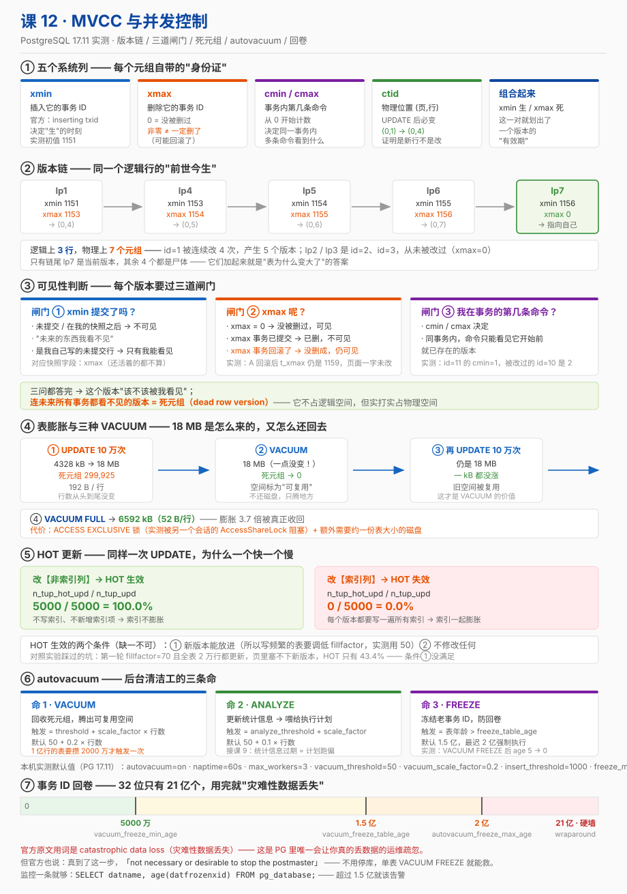

# 课 12 · MVCC 与并发控制

> 📍 故事中的位置：主角拿到了一份"历史快照"——MVCC 让你读到一致性的过去，而不是被并发修改污染的现场

## 本课目标

学完本课后，你能：

1. **画出来**：PG 的 MVCC 机制（每行有 `xmin` / `xmax`，事务用快照选可见版本）
2. **说出**：死元组是什么、为什么会堆积、`autovacuum` 怎么清理
3. **调优**：能根据业务调 `autovacuum_*` 参数

## 知识点清单

| 知识点 | 关键点 |
|---|---|
| **12.1 MVCC 原理** | · 多版本并发控制 vs 锁并发控制 · 每行的 `xmin` / `xmax` 隐藏列 · 事务快照（snapshot）· `txid_current_snapshot()`（**已废弃 → `pg_current_snapshot()`**） · UPDATE / DELETE 不删行，而是标记 `xmax` |
| **12.2 可见性规则与死元组** | · 可见性判断（事务快照 vs 行 xmin/xmax） · 死元组（dead tuple）的形成 · `pg_stat_user_tables.n_dead_tup` 与 `n_live_tup` · 表膨胀（bloat）的危害 |
| **12.3 autovacuum 机制** | · autovacuum 工作原理（轮询 + vacuum + analyze） · `autovacuum_vacuum_scale_factor` / `autovacuum_analyze_scale_factor` · 表级调优：`ALTER TABLE ... SET (autovacuum_vacuum_scale_factor = ...)` · `VACUUM` / `VACUUM FULL` / `pg_repack` 的差别 |

> ⚠️ **骨架勘误预告（三条，都是本课实测/核查发现的）**
>
> 1. 知识点 12.1 写的 `txid_current_snapshot()` **已被官方标记 Deprecated**（PG 13 起改名）。新名字是 **`pg_current_snapshot()`**。详见第二幕陷阱 1。
> 2. 官方术语是 **dead row versions**（死行版本），不是社区口语的 "dead tuples"；膨胀的官方用词是 **bloated**。本课两个都讲，但你会知道哪个能拿去查文档。
> 3. 上一课断点里建议核查的 `old_snapshot_threshold`，**在 PG 17 已被移除**（实测 `unrecognized configuration parameter`）。详见 12.3。

## 故事主线中的情节定位

主角被看清楚——读者通过这一章学到"PG 怎么让一千个并发事务同时插入 / 更新而不打架"。这是 PG 跟很多其他数据库的本质差异点。

课 11 讲了**现象**（脏读、不可重复读、幻读），课 12 打开**黑盒**：那些现象背后的机器到底是怎么转的。

## 正文

## 📌 知识点导航

| 幕 | 内容 | 你会拿到的东西 |
|---|---|---|
| 第一幕 | 磁盘没满，但表从 4 MB 涨到 18 MB | MVCC 的第一条代价 |
| 第二幕 | 5 个关于 UPDATE/DELETE/VACUUM 的误解 | 网传结论 vs 本课实测 |
| 第三幕 | 12.1 / 12.2 / 12.3 三块硬骨头 | 六要素完整展开 |
| 第四幕 | 24 组实验（`pageinspect` 看物理页） | 可复现的数字 |
| 第五幕 | 一张图 + 调优速查表 | 收进你的运维手册 |

---

## 第一幕 · 起源与场景引入

### 一个真实的工作场景

接课 11。运营跑来问："订单表怎么突然占 18 MB 了？我昨天看才 4 MB，行数一条没变啊。"

你查了一下：

```sql
SELECT count(*) FROM orders;                                -- 100000      ← 行数没变
SELECT pg_size_pretty(pg_relation_size('orders'));           -- 18 MB       ← 体积涨了 4 倍
```

再看一眼统计：

```sql
SELECT n_live_tup, n_dead_tup FROM pg_stat_user_tables WHERE relname = 'orders';
--  n_live_tup | n_dead_tup
-- ------------+------------
--       100000 |     299925
```

**10 万活行，30 万死行。** 这 30 万"尸体"就躺在磁盘上，占着地方，还会拖慢每一条全表扫描。

这不是 bug，这是 **MVCC 的代价**。课 11 里你享受的"读不阻塞写、写不阻塞读""每个事务看到一致的快照"——全靠这套"留旧版本"的机制换来。而代价就是：**有人得去收尸**。

### 本课要回答的四个问题

| 问题 | 对应知识 |
|---|---|
| 一行数据的"多个版本"到底存在哪？ | 12.1 MVCC 原理 |
| 数据库怎么决定"这个版本你该不该看见"？ | 12.2 可见性规则 |
| 看不见的版本什么时候被清掉？ | 12.2 死元组 + 12.3 autovacuum |
| 清理跟不上会怎样？怎么调？ | 12.3 autovacuum 机制 |

---

## 第二幕 · 认知冲突

### 陷阱 1："`UPDATE` 是就地修改那一行" —— **完全不是**

这是从 MySQL/Oracle 转过来的人最容易带错的心智模型。

实测（实验 B）。三行数据，把 `id=1` 改一下：

```sql
-- 改之前
 ctid  | xmin | xmax | id | val
-------+------+------+----+-----
 (0,1) | 1151 |    0 |  1 | v1
 (0,2) | 1151 |    0 |  2 | v2
 (0,3) | 1151 |    0 |  3 | v3

UPDATE finance.mvcc_demo SET val = 'v1-new' WHERE id = 1;

-- 改之后
 ctid  | xmin | xmax | id |  val
-------+------+------+----+--------
 (0,4) | 1153 |    0 |  1 | v1-new     ← ctid 变了！xmin 变了！
 (0,2) | 1151 |    0 |  2 | v2
 (0,3) | 1151 |    0 |  3 | v3
```

**`ctid` 从 `(0,1)` 变成了 `(0,4)`**——这是一条**物理上全新的行**，`(0,1)` 那个旧版本还躺在原地。

用 `pageinspect` 直接看磁盘上的页（实验 C），真相一览无余：

```
 lp | lp_off | lp_len | t_xmin | t_xmax | t_ctid |        data_head
----+--------+--------+--------+--------+--------+--------------------------
  1 |   8160 |     31 |   1151 |   1153 | (0,4)  | \x01000000077631         ← 旧版本 v1
  2 |   8128 |     31 |   1151 |      0 | (0,2)  | \x02000000077632
  3 |   8096 |     31 |   1151 |      0 | (0,3)  | \x03000000077633
  4 |   8056 |     35 |   1153 |      0 | (0,4)  | \x010000000f76312d6e6577 ← 新版本 v1-new
```

看 `lp=1` 那一行：**`t_xmax = 1153`**（杀它的事务），**`t_ctid = (0,4)`**（指向它的接班人）。这就是**版本链**。

> **一句话**：`UPDATE` = `INSERT` 一个新版本 + 给旧版本盖上 `xmax` 的章。

**顺带把骨架勘误说了**：骨架 12.1 写的 `txid_current_snapshot()`，官方已归入 **Table 9.84 Deprecated**（PG 13 起）。新名对照：

| 旧名（Deprecated） | 新名 |
|---|---|
| `txid_current()` | `pg_current_xact_id()` |
| **`txid_current_snapshot()`** | **`pg_current_snapshot()`** |
| `txid_snapshot_xmin()` | `pg_snapshot_xmin()` |
| `txid_snapshot_xmax()` | `pg_snapshot_xmax()` |
| `txid_snapshot_xip()` | `pg_snapshot_xip()` |
| `txid_visible_in_snapshot()` | `pg_visible_in_snapshot()` |
| `txid_status()` | `pg_xact_status()` |

实测两者此刻返回值相同（`1160:1160:`），但**新代码一律用 `pg_current_snapshot()`**——旧名"may be removed from a future release"。

### 陷阱 2："`DELETE` 之后数据就没了" —— **它还在那儿**

实测（实验 E）：

```
 lp | t_xmin | t_xmax | t_ctid
----+--------+--------+--------
  3 |   1151 |   1157 | (0,3)      ← DELETE id=3 之后，行还在，只是 xmax 被写了
```

`DELETE` 只是把 `xmax` 设成当前事务 ID。**数据一个字节都没动。** 这就是为什么 PG 的 `DELETE` 可以很快，也这就是为什么删了大表之后磁盘不会变小。

### 陷阱 3："`VACUUM` 能回收磁盘空间" —— **它只把空间标为"可复用"**

这是运维上最常见的期望落差。实测（实验 J / K）：

| 步骤 | 表体积 | `n_dead_tup` |
|---|---|---|
| 膨胀到顶 | **18 MB** | 299925 |
| `VACUUM` 之后 | **18 MB（纹丝不动）** | **0** ✅ |
| 再全表 UPDATE 一次 | **18 MB（没涨！）** | 0 |
| `VACUUM FULL` 之后 | **6592 kB（真小了）** | 0 |

看明白了吗？

- **`VACUUM` 不还磁盘，但把空间改成"可复用"**——所以下一步 UPDATE 时体积**不涨了**（18 MB → 18 MB）。这才是它的价值：**阻止继续膨胀**。
- **`VACUUM FULL` 才真把空间还给操作系统**，但它要 `ACCESS EXCLUSIVE` 锁（实测：B 会话只要持有一个 `AccessShareLock`，A 的 `VACUUM FULL` 就一直卡着），还要临时占用**约等于表大小**的额外磁盘。

官方原文（核查于 2026-09，PG 17 文档 24.1.2）：

> "The standard form of `VACUUM` removes dead row versions in tables and indexes and marks the space available for future reuse. However, it will not return the space to the operating system, except in the special case where one or more pages at the end of a table become entirely free and an exclusive table lock can be easily obtained."

> "In contrast, `VACUUM FULL` actively compacts tables by writing a complete new version of the table file with no dead space. This minimizes the size of the table, but can take a long time. It also requires extra disk space for the new copy of the table, until the operation completes."

### 陷阱 4："autovacuum 开着就高枕无忧了" —— **大表上它可能永远追不上**

autovacuum 的触发公式（官方原文，核查于 2026-09，PG 17 文档 19.10）：

> "`autovacuum_vacuum_scale_factor` ... Specifies a fraction of the table size to add to `autovacuum_vacuum_threshold` when deciding whether to trigger a `VACUUM`. The default is 0.2 (20% of table size)."

也就是：

```
触发 VACUUM 的死元组数 = autovacuum_vacuum_threshold + autovacuum_vacuum_scale_factor × 表行数
                       = 50 + 0.2 × 行数
```

实测（实验 P）：

| 表行数 | 触发一次 VACUUM 要攒多少死元组 | 触发一次 ANALYZE |
|---|---|---|
| 10 万 | 20,050 | 10,050 |
| 100 万 | 200,050 | 100,050 |
| 1000 万 | **2,000,050** | 1,000,050 |
| 1 亿 | **20,000,050** | 10,000,050 |

**1 亿行的表，要攒 2000 万个死元组才触发一次。** 等它攒够，你的表早就膨胀完了，而且一次要清理 2000 万行——慢、占 IO。

正解：**大表必须设表级参数**。

```sql
ALTER TABLE big_table SET (
  autovacuum_vacuum_scale_factor = 0.02,   -- 2% 而不是 20%
  autovacuum_vacuum_threshold    = 10000
);
```

### 陷阱 5："`xmax` 非零说明这行被删了" —— **不一定，它现在很可能还好好的**

官方原文（核查于 2026-09，PG 17 文档 5.6）：

> "`xmax` — The identity (transaction ID) of the deleting transaction, or zero for an undeleted row version. **It is possible for this column to be nonzero in a visible row version.** That usually indicates that the deleting transaction hasn't committed yet, or that an attempted deletion was rolled back."

实测（实验 G）：A 会话改了 `id=2` 但没提交，B 会话看同一行——

```
-- B 看到的
 ctid  | xmin | xmax | id | val
-------+------+------+----+-----
 (0,2) | 1151 | 1159 |  2 | v2      ← xmax=1159 非零，但值还是 v2，行是可见的！
```

**`xmax` 非零只是"有人动了它"，不等于"它死了"。** 要不要真当它死了，得去查那个事务**提没提交**（`pg_xact` / CLOG）。

---

## 第三幕 · 层层揭示

## （一）12.1 MVCC 原理

### ① 一句话定义

**MVCC（多版本并发控制）让同一行在磁盘上可以同时存在多个版本，每个事务按自己的快照挑出该看的那一个；`UPDATE` 不是覆盖而是新增版本 + 给旧版本打 `xmax`，`DELETE` 只是打 `xmax`，真正的清理交给 `VACUUM`。**

### ② 直觉建立：把数据库想象成一本"永不擦改的账本"

| 现实世界 | PG 的对应 |
|---|---|
| 会计不擦掉写错的数字，而是**划一道横线，在旁边写新的** | `UPDATE` = 写新版本 + 旧版本标 `xmax` |
| 横线划掉的数字**还在纸上**，只是不算数了 | 旧版本还在页里，成了死元组 |
| 每个查账的人拿到的是**某一时刻的复印件** | 每个事务拿到一份快照 |
| 复印件发出去之后，账本再怎么改，复印件不变 | RR 隔离级别下，事务内看到的世界恒定 |
| 隔一段时间要**重新装订账本**，把划掉的页抽掉 | `VACUUM` 回收空间 |

**这个模型解释了 MVCC 的一切**：

- 为什么读不阻塞写？——读者看复印件，写者改原件，互不干扰
- 为什么会有死元组？——划掉的旧数字没被撕掉
- 为什么表会膨胀？——复印件发得越多，不能撕的页越多
- 为什么长事务有害？——你手里那本"很久以前的复印件"没还回来，那之后所有被划掉的页都不能撕

### ③ 核心原理

**五个系统列**（官方原文，核查于 2026-09，PG 17 文档 5.6）：

| 列 | 官方定义 |
|---|---|
| `xmin` | "The identity (transaction ID) of the **inserting** transaction for this row version." |
| `xmax` | "The identity (transaction ID) of the **deleting** transaction, or zero for an undeleted row version." |
| `cmin` | "The command identifier (starting at zero) within the inserting transaction." |
| `cmax` | "The command identifier within the deleting transaction, or zero." |
| `ctid` | "The physical location of the row version within its table." |

注意官方那句伏笔（5.6 节末尾）：

> "Transaction identifiers are also **32-bit** quantities. In a long-lived database it is possible for transaction IDs to **wrap around**."

**32 位**——这就是 12.3 讲回卷的根源。

官方还提醒（核查于 2026-09）：

> "It is unwise, however, to depend on the uniqueness of transaction IDs over the long term (more than one billion transactions)."

**快照的格式**（官方原文，核查于 2026-09，PG 17 文档 9.27.8）：

> "`pg_snapshot`'s textual representation is `xmin : xmax : xip_list`. For example `10:20:10,14,15` means `xmin=10, xmax=20, xip_list=10, 14, 15`."

官方 Table 9.83 的三个字段：

| 字段 | 官方解释 |
|---|---|
| `xmin` | "**Lowest transaction ID that was still active.** All transaction IDs less than `xmin` are either committed and visible, or rolled back and dead." |
| `xmax` | "**One past the highest completed transaction ID.** All transaction IDs greater than or equal to `xmax` had not yet completed as of the time of the snapshot, and thus are invisible." |
| `xip_list` | "**Transactions in progress at the time of the snapshot.** A transaction ID that is `xmin <= X < xmax` and not in this list was already completed at the time of the snapshot, and thus is either visible or dead according to its commit status." |

**`MVCC` 为什么能不阻塞**（官方原文，核查于 2026-09，文档 13.1）：

> "in MVCC locks acquired for querying (reading) data do not conflict with locks acquired for writing data, and so **reading never blocks writing and writing never blocks reading**."

### ④ 示例演示

**实验 A —— 系统列初见**

```sql
CREATE TABLE finance.mvcc_demo (id int PRIMARY KEY, val text);
INSERT INTO finance.mvcc_demo VALUES (1,'v1'),(2,'v2'),(3,'v3');

SELECT ctid, xmin, xmax, cmin, cmax, id, val FROM finance.mvcc_demo ORDER BY id;
 ctid  | xmin | xmax | cmin | cmax | id | val
-------+------+------+------+------+----+-----
 (0,1) | 1151 |    0 |    0 |    0 |  1 | v1
 (0,2) | 1151 |    0 |    0 |    0 |  2 | v2
 (0,3) | 1151 |    0 |    0 |    0 |  3 | v3
```

三行同一个 `xmin`（一条 INSERT 语句 = 一个事务），`xmax` 都是 0（没人删过）。

**实验 D —— 版本链：逻辑 3 行，物理 7 个元组**

连续把 `id=1` 改 4 次，然后看物理页：

```
 lp | t_xmin | t_xmax | t_ctid
----+--------+--------+--------
  1 |   1151 |   1153 | (0,4)     ← 初版，被 1153 杀，指向 lp4
  2 |   1151 |      0 | (0,2)
  3 |   1151 |      0 | (0,3)
  4 |   1153 |   1154 | (0,5)     ← 二版，被 1154 杀，指向 lp5
  5 |   1154 |   1155 | (0,6)     ← 三版
  6 |   1155 |   1156 | (0,7)     ← 四版
  7 |   1156 |      0 | (0,7)     ← 当前版本（t_ctid 指向自己）

SELECT count(*) FROM finance.mvcc_demo;   -- 3
```

**逻辑上 3 行，物理上 7 个元组。** 那条链 `lp1 → lp4 → lp5 → lp6 → lp7` 就是 `id=1` 的"前世今生"。

页头也印证了（实验 C-2）：

```
    lsn     | lower | upper | pagesize | prune_xid
------------+-------+-------+----------+-----------
 0/691EB400 |    40 |  8056 |     8192 |      1153
```

`lower=40`（4 个 line pointer 占 40 字节）、`upper=8056`（数据从页尾往前堆）、`prune_xid=1153`（提示可以剪枝了）。

**实验 F —— `cmin` / `cmax`：同一事务内的命令编号**

```sql
BEGIN;
INSERT INTO finance.mvcc_demo VALUES (10,'a');           -- cmin = 0
INSERT INTO finance.mvcc_demo VALUES (11,'b');           -- cmin = 1
UPDATE finance.mvcc_demo SET val = 'a2' WHERE id = 10;   -- cmin = 2
SELECT ctid, xmin, xmax, cmin, cmax, id, val FROM finance.mvcc_demo WHERE id >= 10;
  ctid  | xmin | xmax | cmin | cmax | id | val
 -------+------+------+------+------+----+-----
  (0,10)| 1158 |    0 |    2 |    2 | 10 | a2
  (0,9) | 1158 |    0 |    1 |    1 | 11 | b
COMMIT;
```

有意思的是物理页上 `lp=8` 那一行（实验 G-4）：

```
  8 |   1158 |   1158 | (0,10)     ← t_xmin = t_xmax！
```

`id=10` 的初版被**同一个事务**自己杀掉了（`cmin=0` 插入、`cmin=2` 更新）。**`t_xmin = t_xmax` 是"同事务内自改"的典型特征。**

**实验 H —— 快照与可见性判断**

```sql
SELECT pg_current_snapshot();                     -- 1160:1160:
SELECT pg_current_xact_id();                      -- 1160

-- 拆开看
SELECT pg_snapshot_xmin(pg_current_snapshot()) AS xmin,
       pg_snapshot_xmax(pg_current_snapshot()) AS xmax,
       pg_snapshot_xip(pg_current_snapshot()) AS xip;

-- 判断某个 xid 在某个快照里是否可见
SELECT pg_visible_in_snapshot('1151'::xid8, pg_current_snapshot());
SELECT pg_xact_status('1151'::xid8);              -- committed / aborted / in progress
```

### ⑤ 常见误区（6 条）

**误区 1：以为 `xmin` / `xmax` 是"创建时间"和"修改时间"。**
不是，它们是**事务 ID**，跟时间没有直接关系。你没法从 `xmin` 反推出"这行什么时候插入的"（除非开了 `track_commit_timestamp`，默认是 `off`）。

**误区 2：以为 `ctid` 可以当主键用。**
官方原文（核查于 2026-09）：

> "a row's `ctid` will change if it is updated or moved by `VACUUM FULL`. Therefore `ctid` should not be used as a row identifier. A primary key should be used to identify logical rows."

**误区 3：以为每个事务都一定有事务 ID。**
不是。**只读事务不分配 xid**（PG 的重要优化）。你在只读事务里调 `pg_current_xact_id()` 才会被分配一个。这也是"只读事务永不发生序列化冲突"（课 11 官方原文）在性能上同样成立的原因。

**误区 4：以为 `xmax = 0` 才叫"这行活着"。**
绝大多数时候对，但不严谨——`xmax` 非零也可能可见（陷阱 5）。真正的可见性要靠**快照 + 提交状态**一起判断。

**误区 5：以为索引里也有版本信息。**
**索引里没有 `xmin`/`xmax`。** 索引项只是"指向某个堆元组"，判断可见性必须回堆表。这正是 **Index Only Scan 依赖可见性地图（VM）** 的原因（课 8 讲过 `Heap Fetches`）——只有 VM 说"这页全可见"，才能跳过回表。

**误区 6：以为旧版本一定要等 `VACUUM` 才能回收。**
不一定。**HOT（Heap Only Tuple）更新**可以在同一页内完成，旧版本在下一次访问该页时被"页内剪枝"（heap page pruning）就地回收，不必等 VACUUM。实测见 12.3。

### ⑥ 一句话记住

> **`UPDATE` = 写新行 + 给旧行盖 `xmax`；`DELETE` = 只盖 `xmax`。所以读永远不阻塞写，代价是尸体要有人收。**

### 命令速查卡 · MVCC

```sql
-- 系统列（直接 SELECT 就行）
SELECT ctid, xmin, xmax, cmin, cmax, * FROM t;

-- 事务 ID 与快照
SELECT pg_current_xact_id();                  -- 当前事务 ID（只读事务调用才分配）
SELECT pg_current_xact_id_if_assigned();      -- 没分配就返回 NULL（不强制分配）
SELECT pg_current_snapshot();                 -- xmin:xmax:xip_list
SELECT pg_snapshot_xmin(pg_current_snapshot());
SELECT pg_snapshot_xmax(pg_current_snapshot());
SELECT * FROM pg_snapshot_xip(pg_current_snapshot());
SELECT pg_visible_in_snapshot('1151'::xid8, pg_current_snapshot());
SELECT pg_xact_status('1151'::xid8);          -- in progress / committed / aborted

-- 物理层（pageinspect）
SELECT lp, lp_off, lp_len, t_xmin, t_xmax, t_ctid, t_data
FROM heap_page_items(get_raw_page('finance.mvcc_demo', 0));
SELECT * FROM page_header(get_raw_page('finance.mvcc_demo', 0));

-- ⛔ Deprecated（PG 13 起），新代码别用
-- txid_current() / txid_current_snapshot() / txid_snapshot_xip() / txid_visible_in_snapshot()
```

---

## （二）12.2 可见性规则与死元组

### ① 一句话定义

**可见性判断就是三问：插入它的事务（`xmin`）在我的快照里算"已提交"吗？删除它的事务（`xmax`）算"已提交"吗？两问都答完就知道这个版本该不该被我看见；而"谁都不该看见的版本"就是死元组（dead row version）。**

### ② 直觉建立：三道闸门

把每个元组版本想象成要过三道闸门才能被你看见：

```
                    ┌─ 闸门 1：xmin 在我的快照里算"已提交"吗？
                    │         否 → 看不见（还没提交，或已回滚）
   一个行版本 ──────┼─ 闸门 2：xmax 是 0 吗？
                    │         是 → 看得见 ✓
                    │
                    └─ 闸门 3：xmax 非 0，那它在我的快照里算"已提交"吗？
                              是 → 看不见（已被删）✗
                              否 → 看得见 ✓（删它的人还没提交 / 已回滚）
```

**闸门 3 就是陷阱 5 那个反直觉情况**：A 改了但没提交，B 依然看得见旧版本。

**那"死元组"是什么？** 就是**对所有现存的、以及未来可能开启的事务，都过不了闸门的版本**。

关键难点在于：**数据库怎么知道"未来不会有事务要看它"？** 答案是：算出"最老的还活着的事务"，比它还老的版本就安全了。这也解释了——

> **为什么长事务有害**：一个跑了 3 小时的老事务会把"最老活事务"钉在 3 小时前，这 3 小时内产生的所有死元组**一个都不能回收**。

### ③ 核心原理

**死元组怎么形成**（官方原文，核查于 2026-09，PG 17 文档 24.1.2）：

> "In PostgreSQL, an `UPDATE` or `DELETE` of a row does not immediately remove the old version of the row. This approach is necessary to gain the benefits of multiversion concurrency control (MVCC...): the row version must not be deleted while it is still potentially visible to other transactions. But eventually, an outdated or deleted row version is no longer of interest to any transaction. **The space it occupies must then be reclaimed for reuse by new rows, to avoid unbounded growth of disk space requirements. This is done by running `VACUUM`.**"

**⚠️ 术语提醒**：官方用的是 **dead row versions**，不是社区常说的 "dead tuples"；膨胀的官方用词是 **bloated**（文档 24.1 里查不到名词 "bloat"）：

> "The difficulty with doing vacuuming according to a fixed schedule is that if a table has an unexpected spike in update activity, it may get **bloated** to the point that `VACUUM FULL` is really necessary to reclaim space."

**膨胀的危害**（三个层面）：

1. **磁盘**：白占空间
2. **查询**：全表扫描要读更多页。实测（实验 I-4）膨胀 4 倍后，一个简单的 `count(*)` 要扫 `Buffers: shared hit=2345`
3. **索引**：索引项也指向死元组，索引一起膨胀

**怎么看见死元组**：

| 来源 | 字段 | 特点 |
|---|---|---|
| `pg_stat_user_tables` | `n_live_tup` / `n_dead_tup` | **估算值**，由统计收集器维护，有延迟 |
| `pgstattuple` | `dead_tuple_count` / `dead_tuple_percent` | **精确值**，但要全表扫描，有代价 |
| `pageinspect` | 堆页里的 `t_xmax` | 物理真相，最底层 |

### ④ 示例演示

**实验 I' —— 10 万行表，连续三次全表 UPDATE（关掉 autovacuum 做对照）**

| 阶段 | 表体积 | `n_dead_tup` |
|---|---|---|
| 初始 | 4328 kB | 0 |
| 第 1 次全表 UPDATE | 8648 kB | 100,000 |
| 第 2 次全表 UPDATE | 13 MB | 200,000 |
| 第 3 次全表 UPDATE | **18 MB** | **299,925** |

**行数一条没变（10 万），体积涨了 4.2 倍。**

换算成每行占用（实验 Q），这是最直观的膨胀证据：

```sql
SELECT pg_size_pretty(pg_relation_size('finance.bloat_withvac')) AS heap,
       pg_relation_size('finance.bloat_withvac')/100000 AS bytes_per_row;
```

| 状态 | 表体积 | **每行占用** |
|---|---|---|
| 膨胀后 | 18 MB | **192 字节** |
| `VACUUM FULL` 后 | 5096 kB | **52 字节** |

**同一批数据，每行从 52 字节涨到 192 字节——3.7 倍膨胀。**

**实验 G —— 可见性的反直觉案例**

```
-- A 会话（未提交）
BEGIN;
UPDATE finance.mvcc_demo SET val = 'v2-pending' WHERE id = 2;

-- A 自己看
  ctid  | xmin | xmax | id |    val
 -------+------+------+----+------------
  (0,11)| 1159 |    0 |  2 | v2-pending     ← 新的 ctid，xmax=0

-- B 会话看同一行
  ctid  | xmin | xmax | id | val
 -------+------+------+----+-----
  (0,2) | 1151 | 1159 |  2 | v2             ← 旧版本，xmax=1159，但依然可见！
```

**两个会话同时看着"同一行"，看到的是两个不同的物理元组。** 这就是 MVCC 的本质——不是"一行数据有两个值"，而是"磁盘上真的有两个版本"。

**实验 G-5 —— A 回滚之后**

A `ROLLBACK` 后，B 再查物理页，`lp=2` 的 `t_xmax` **仍然是 1159**：

```
  2 |   1151 |   1159 | (0,11)
```

**页面上一个字节都没改。** 1159 这个事务到底提没提交，不在页里，在 **`pg_xact`（CLOG）** 里——PG 只需要在那里记两个 bit。这也是为什么事务回滚是"瞬间"的：根本不用去改数据页。

### ⑤ 常见误区（6 条）

**误区 1：以为 `n_dead_tup` 是精确值。**
不是。`pg_stat_user_tables` 的 `n_live_tup` / `n_dead_tup` 是**估算值**（采样得出，且有更新延迟）。想要精确值用 `pgstattuple`，但那要全表扫描。排查时可以先 `SELECT pg_stat_force_next_flush();`（PG 15+）强制刷新。

**误区 2：以为 `VACUUM` 能让查询变快。**
不一定。`VACUUM` 主要作用是**回收空间供复用**，它**不整理数据顺序、不重建索引**。想让扫描真正变快要 `VACUUM FULL` / `CLUSTER` / `pg_repack`（都会重写表）。

**误区 3：以为死元组只来自 UPDATE / DELETE。**
**回滚的 INSERT 也会产生死元组**——插进去的行没人看得见，就是死元组。大事务回滚后记得看看 `n_dead_tup`。

**误区 4：以为 `n_dead_tup` 高就一定有问题。**
要看**比例**。1 亿行的表有 20 万死元组完全可以接受；1 万行的表有 20 万就是灾难。判据是 `n_dead_tup / n_live_tup`。

**误区 5：以为长事务只是"占着连接"。**
长事务真正的杀伤力是**钉住最老快照**，让 autovacuum 无法回收它之后的任何死元组。**一个 `BEGIN` 之后忘了 `COMMIT` 的 psql 窗口，能让整库膨胀。** 这是生产上最常见的事故之一（课 13 会讲怎么查 `idle in transaction`）。

**误区 6：以为 HOT 更新不产生死元组。**
产生，但**回收得快**。HOT 更新在同一页内完成，PG 可以在下次访问该页时就地"剪枝"，不用等 VACUUM。这是 HOT 的真正价值。

### ⑥ 一句话记住

> **死元组 = 谁都看不见的版本；它不占逻辑空间，但占物理空间；长事务会钉住"谁都看不见"的那条线，让尸体越堆越多。**

### 命令速查卡 · 死元组与膨胀

```sql
-- 看死元组（估算）
SELECT relname, n_live_tup, n_dead_tup,
       round(100.0 * n_dead_tup / NULLIF(n_live_tup,0), 1) AS dead_pct,
       last_autovacuum, last_autoanalyze, autovacuum_count
FROM pg_stat_user_tables
ORDER BY n_dead_tup DESC;

-- 看真实占比（精确，但全表扫描，有代价）
SELECT tuple_count, dead_tuple_count,
       round(dead_tuple_percent::numeric, 2) AS dead_pct,
       pg_size_pretty(dead_tuple_len::bigint) AS dead_size
FROM pgstattuple('finance.orders');

-- 看膨胀（每行实际占用）
SELECT pg_size_pretty(pg_relation_size('finance.orders')) AS heap,
       pg_relation_size('finance.orders') / NULLIF((SELECT count(*) FROM finance.orders),0)
         AS bytes_per_row;

-- 统计刷新（PG 15+；pg_stat_* 有延迟，排查时先刷一下）
SELECT pg_stat_force_next_flush();
SELECT pg_stat_reset_single_table_counters('finance.orders'::regclass);

-- 找出"钉住快照"的元凶（长事务）
SELECT pid, state, now() - xact_start AS xact_age, left(query, 60)
FROM pg_stat_activity
WHERE xact_start IS NOT NULL
ORDER BY xact_start;
```

---

## （三）12.3 autovacuum 机制

### ① 一句话定义

**autovacuum 是 PG 的后台清理守护进程：按 `autovacuum_naptime` 轮询各库，对"死元组超过阈值"的表自动发 `VACUUM`、对"变更超过阈值"的表自动发 `ANALYZE`；它还有一条不可关闭的底线职责——防止事务 ID 回卷。**

### ② 直觉建立：三个清洁工

| 清洁工 | 什么时候来 | 干什么 | 能不能不让他来 |
|---|---|---|---|
| **普通 autovacuum** | 轮询到、且死元组超阈值 | 清死元组、更新统计 | 能（表级关掉，但不建议） |
| **防回卷 autovacuum** | 表年龄逼近 `autovacuum_freeze_max_age` | 冻结旧元组 | **不能**，官方明说 |
| **手动 VACUUM** | 你发命令 | 同上 + 时机可控 | — |

官方原文（核查于 2026-09，PG 17 文档 19.10）：

> "Note that even when this parameter [`autovacuum`] is disabled, the system will launch autovacuum processes if necessary to **prevent transaction ID wraparound**."

**为什么"防回卷"这么硬？** 因为事务 ID 是 **32 位**的。官方原文（核查于 2026-09，PG 17 文档 24.1.5）：

> "PostgreSQL's MVCC transaction semantics depend on being able to compare transaction ID (XID) numbers... But since transaction IDs have limited size (32 bits) a cluster that runs for a long time (more than 4 billion transactions) would suffer *transaction ID wraparound*: the XID counter wraps around to zero, and all of a sudden transactions that were in the past appear to be in the future — which means their output become invisible. **In short, catastrophic data loss.** (Actually the data is still there, but that's cold comfort if you cannot get at it.) To avoid this, it is necessary to vacuum every table in every database **at least once every two billion transactions**."

**"catastrophic data loss"** —— 官方用词罕见地重。

### ③ 核心原理

**autovacuum 参数（本机 PG 17.11 实测，核查于 2026-09）**：

| 参数 | 默认值 | 作用 |
|---|---|---|
| `autovacuum` | **on** | 总开关 |
| `autovacuum_max_workers` | **3** | 同时最多几个 worker（只能启动时设） |
| `autovacuum_naptime` | **60 s** | 轮询间隔 |
| `autovacuum_vacuum_threshold` | **50** | 触发 VACUUM 的最小变更行数 |
| `autovacuum_vacuum_scale_factor` | **0.2** | 加上表行数的 20% |
| `autovacuum_vacuum_insert_threshold` | **1000** | （PG 13+）纯插入也能触发 |
| `autovacuum_vacuum_insert_scale_factor` | **0.2** | 同上 |
| `autovacuum_analyze_threshold` | **50** | 触发 ANALYZE 的最小变更行数 |
| `autovacuum_analyze_scale_factor` | **0.1** | 加上表行数的 10% |
| `autovacuum_vacuum_cost_delay` | **2 ms** | 节流：每攒够 cost 就睡一会儿 |
| `autovacuum_vacuum_cost_limit` | **-1**（用 `vacuum_cost_limit`） | 攒够多少 cost 睡一次 |
| `autovacuum_freeze_max_age` | **200,000,000** | 表年龄到这就强制 VACUUM |
| `autovacuum_multixact_freeze_max_age` | **400,000,000** | 多事务 ID 版本 |
| `vacuum_freeze_min_age` | **50,000,000** | 元组至少这么老才冻结 |
| `vacuum_freeze_table_age` | **150,000,000** | 表到这年龄触发 aggressive vacuum |
| `track_counts` | **on** | autovacuum 的前提（必须开） |

**回卷的两道告警线**（官方原文，核查于 2026-09）：

```
-- 距离回卷还有 4000 万事务时
WARNING:  database "mydb" must be vacuumed within 39985967 transactions
HINT:  To avoid XID assignment failures, execute a database-wide VACUUM in that database.

-- 距离回卷只剩 300 万事务时：拒绝分配新 XID
ERROR:  database is not accepting commands that assign new transaction IDs
        to avoid wraparound data loss in database "mydb"
HINT:  Execute a database-wide VACUUM in that database.
```

进入这个状态后（官方原文）：

> "any transactions already in progress can continue, but **only read-only transactions can be started**. Operations that modify database records or truncate relations will fail. **The `VACUUM` command can still be run normally.**"

**注意最后一句：VACUUM 还能跑**——所以这个状态可恢复，不用停库。官方还特意说（核查于 2026-09）：

> "contrary to what was sometimes recommended in earlier releases, **it is not necessary or desirable to stop the postmaster or enter single user-mode** in order to restore normal operation."

**三种"整理表"手段的对比**：

| 手段 | 还磁盘 | 锁 | 额外磁盘 | 重建索引 | 适用场景 |
|---|---|---|---|---|---|
| `VACUUM` | ❌ | 不阻塞读写 | 无 | ❌ | 日常，防膨胀 |
| `VACUUM FULL` | ✅ | **ACCESS EXCLUSIVE** | **≈ 表大小** | ✅ | 已膨胀，能接受停机 |
| `CLUSTER` | ✅ | ACCESS EXCLUSIVE | ≈ 表大小 | ✅ | 想顺便按索引排序 |
| `pg_repack` | ✅ | 极短 | ≈ 表大小 | ✅ | **在线**整理（第三方扩展） |

> 📌 `pg_repack` **不在 PG 官方文档里**（本次核查：PG 17 文档 24.1 完全未出现该词）。它是社区扩展，本课只作为"生产常用方案"提及，不作为官方结论。官方给的等价选项是 `VACUUM FULL` / `CLUSTER` / `ALTER TABLE` 的重写变体。

**⚠️ PG 17 变更：`old_snapshot_threshold` 已被移除**（实测）：

```sql
SHOW old_snapshot_threshold;
-- ERROR:  unrecognized configuration parameter "old_snapshot_threshold"
```

这个参数原本用于限制"快照太老"，PG 17 已移除。相关需求现在靠 `idle_in_transaction_session_timeout`（课 13）从源头掐掉长事务。

### ④ 示例演示

**实验 J —— `VACUUM` 不还磁盘，但空间可复用**

| 步骤 | 表体积 | `n_dead_tup` |
|---|---|---|
| 膨胀到顶 | 18 MB | 299,925 |
| `VACUUM;` | **18 MB（不变）** | **0** |
| 再跑一次全表 UPDATE | **18 MB（不涨！）** | 0 |

**第三步是关键**：空间被标记可复用后，新的 UPDATE 直接复用旧位置，体积不再增长。

**实验 K —— `VACUUM FULL` 真的会阻塞**

```
B: BEGIN; SELECT count(*) FROM finance.bloat_demo;   -- B 只持有一个 AccessShareLock
A: VACUUM FULL finance.bloat_demo;                   -- 卡住，2 秒后仍未返回
B: COMMIT;                                            -- 释放锁
A: （解除阻塞，执行完成）
-- 体积：18 MB → 6592 kB
```

**实验 L —— `VACUUM` 不能在事务块里**

```sql
BEGIN;
VACUUM finance.bloat_demo;
-- ERROR:  VACUUM cannot run inside a transaction block
```

**实验 M'' —— HOT 更新的对照（本课最漂亮的一组对比）**

同一张表（`fillfactor=50`），同样的 5000 行：

```sql
-- ① 更新【非索引列】
UPDATE finance.hot_demo2 SET plain_col = plain_col || 'x' WHERE id <= 5000;
 n_tup_upd | n_tup_hot_upd | hot_pct
-----------+---------------+---------
      5000 |          5000 |   100.0      ← 全是 HOT

-- ② 更新【索引列】
UPDATE finance.hot_demo2 SET indexed_col = indexed_col + 1 WHERE id <= 5000;
 n_tup_upd | n_tup_hot_upd | hot_pct
-----------+---------------+---------
      5000 |             0 |     0.0      ← 一个 HOT 都没有
```

**为什么？** HOT（Heap Only Tuple）的前提是**新版本能放在同一个页里，且不触碰任何索引列**。改了索引列就必须在索引里插入新项，HOT 失效。

> **工程含义**：`fillfactor` 留白 + 尽量不改索引列 = 大幅减少索引膨胀和 VACUUM 压力。写频繁的表值得设 `fillfactor = 70~90`。

**实验 O —— 真实看到 autovacuum 被触发**

```sql
-- 把轮询间隔临时调到 3 秒做观察（实验后已还原为 1min）
ALTER SYSTEM SET autovacuum_naptime = '3s';
SELECT pg_reload_conf();

-- 建一张表，表级阈值设得很小：1% + 100
CREATE TABLE finance.av_demo (id int PRIMARY KEY, val text)
  WITH (autovacuum_vacuum_scale_factor = 0.01, autovacuum_vacuum_threshold = 100);

-- 更新 2 万行，刚过阈值
UPDATE finance.av_demo SET val = val || '-x' WHERE id <= 20000;
--  n_dead_tup = 20000, last_autovacuum = （空）

-- ... 等 12 秒 ...
--  n_dead_tup = 0, autovacuum_count = 1, last_autovacuum = 2026-09-10 13:58:02+00
```

**`autovacuum_count` 从 0 变成 1，死元组清零** —— 这就是 autovacuum 在工作。

**实验 N —— FREEZE 与回卷**

```sql
-- 各表的 xid 年龄
SELECT relname, age(relfrozenxid) FROM pg_class WHERE relkind='r' AND ... ;
  relname    | xid_age
-------------+---------
  users      |     360
  categories |     359
  products   |     358
  orders     |     352

-- 数据库级
SELECT datname, age(datfrozenxid) FROM pg_database;
  order_service | 370

-- VACUUM FREEZE 前后
SELECT age(relfrozenxid) FROM pg_class WHERE relname = 'hot_demo';   -- 5
VACUUM FREEZE finance.hot_demo;
SELECT age(relfrozenxid) FROM pg_class WHERE relname = 'hot_demo';   -- 0
```

**距离 `autovacuum_freeze_max_age`（2 亿）还很远**——但这个数要**持续监控**，一旦接近就是 P0 级告警。

### ⑤ 常见误区（6 条）

**误区 1：以为 autovacuum 会整理数据、让表变小。**
不会。它只清死元组供复用。想缩小得 `VACUUM FULL` / `pg_repack`。

**误区 2：以为把 `autovacuum` 关了能省资源。**
官方明说：就算关了，防回卷的 autovacuum 照样启动。而且你会立刻开始膨胀。**关 autovacuum 是生产事故的头号来源之一。**

**误区 3：以为 `autovacuum_vacuum_scale_factor = 0.2` 对所有表都合适。**
小表合适，大表不合适（陷阱 4）。**1 亿行的表要攒 2000 万死元组才动一次。** 大表必须设表级参数。

**误区 4：以为 `VACUUM FULL` 是"更好的 VACUUM"，可以常跑。**
不是。它要 `ACCESS EXCLUSIVE` 锁（全表阻塞）+ 额外一份磁盘 + 重建索引。官方原文（核查于 2026-09）：

> "Generally, therefore, administrators should strive to use standard `VACUUM` and avoid `VACUUM FULL`."

**误区 5：以为 `autovacuum_max_workers = 3` 可以随便调大。**
能调大，但 worker 之间**共享 cost limit**（官方：*"the value is distributed proportionally among the running autovacuum workers"*）。调到 6 个 worker，每个分到的 IO 预算就减半，可能谁都干不完。

**误区 6：以为防回卷告警出现时应该停库进单用户模式。**
官方明确说**不要**（"not necessary or desirable to stop the postmaster"）。直接跑 `VACUUM` 就行——它在这个状态下依然可用。

### ⑥ 一句话记住

> **autovacuum 有三条命：清死元组（可调）、更新统计（可调）、防回卷（不可关）。表越大，`scale_factor` 越要调小；事务越长，死元组越清不掉。**

### 命令速查卡 · autovacuum

```sql
-- 表级调优（推荐做法，不动全局）
ALTER TABLE big_table SET (
  autovacuum_vacuum_scale_factor  = 0.02,    -- 2% 而不是 20%
  autovacuum_vacuum_threshold     = 10000,
  autovacuum_analyze_scale_factor = 0.01,
  autovacuum_vacuum_cost_delay    = 0        -- 紧要的表可以让它全速跑
);
ALTER TABLE append_only_log SET (autovacuum_vacuum_insert_scale_factor = 0.05);
ALTER TABLE tiny_hot_table  SET (autovacuum_enabled = false);   -- 极小且被频繁更新的表，谨慎

-- 查看已设的表级参数
SELECT relname, reloptions FROM pg_class WHERE reloptions IS NOT NULL;

-- 监控
SELECT relname, n_live_tup, n_dead_tup, last_autovacuum, autovacuum_count
FROM pg_stat_user_tables ORDER BY n_dead_tup DESC;

-- 回卷监控（P0 级）
SELECT datname, age(datfrozenxid) AS xid_age,
       round(100.0 * age(datfrozenxid) / 2000000000, 2) AS pct_of_limit
FROM pg_database ORDER BY 2 DESC;

SELECT c.relname, age(c.relfrozenxid) AS xid_age
FROM pg_class c JOIN pg_namespace n ON n.oid = c.relnamespace
WHERE c.relkind IN ('r','m','t') AND n.nspname NOT IN ('pg_catalog','information_schema')
ORDER BY 2 DESC LIMIT 20;

-- 手工干预
VACUUM (VERBOSE, ANALYZE) finance.orders;   -- 日常
VACUUM (FREEZE, VERBOSE) finance.orders;    -- 顺带冻结
VACUUM FULL finance.orders;                 -- 重写表（阻塞！）
```

---

## 第四幕 · 实操验证

> 全部数据来自本机 `pg17` 容器（**PostgreSQL 17.11**，`order_service` 库，`finance` schema）实测。

### 实验总览

| # | 实验 | 关键观测 | 结论 |
|---|---|---|---|
| A | 系统列初见 | `xmin=1151` / `xmax=0` / `ctid=(0,1)` / `cmin=cmax=0` | 五个系统列可读 |
| B | UPDATE 不删行 | `ctid` `(0,1)` → **`(0,4)`**，`xmin` 1151 → 1153 | 新版本是物理新行 |
| C | 物理页真相 | `lp1: t_xmin=1151 t_xmax=1153 t_ctid=(0,4)` | 版本链可见 |
| C-2 | 页头 | `lower=40 / upper=8056 / prune_xid=1153` | 页内布局 |
| D | 版本链 | `lp1→lp4→lp5→lp6→lp7`，**逻辑 3 行 / 物理 7 元组** | 膨胀的本质 |
| E | DELETE | `lp3 t_xmax=1157`，行仍在 | 只标记，不删除 |
| F | cmin/cmax | `id=11` cmin=1；`id=10`（被改）cmin=2 | 事务内命令编号 |
| G | 未提交的更新 | B 看 `id=2`：**`xmax=1159` 但值仍是 v2** | xmax 非零 ≠ 已删 |
| G-4 | 同事务自改 | `lp8: t_xmin=1158 t_xmax=1158 t_ctid=(0,10)` | 自己杀自己 |
| G-5 | 回滚后 | `t_xmax` **仍是 1159**，页面一字未改 | 提交状态在 CLOG |
| H | 快照 | `1160:1160:`；新旧函数返回相同值 | 骨架勘误点 |
| I' | 死元组堆积 | 4328 kB → 8648 → 13 MB → **18 MB**；dead 0 → 100k → 200k → **299925** | 体积涨 4.2 倍 |
| I-4 | 膨胀后的扫描 | `Parallel Seq Scan ... Buffers: shared hit=2345` | 查询变慢 |
| Q | 每行占用 | 膨胀后 **192 B/行** → VACUUM FULL 后 **52 B/行** | **3.7 倍膨胀** |
| J | VACUUM | 体积 **18 MB 不变**，dead → 0 | 不还磁盘 |
| J-3 | 空间复用 | VACUUM 后再 UPDATE，体积 **仍 18 MB** | 阻止继续膨胀 |
| K | VACUUM FULL | 被 B 的 AccessShareLock **阻塞**；完成后 18 MB → **6592 kB** | 真缩小，但要排他锁 |
| L | VACUUM 限制 | `ERROR: VACUUM cannot run inside a transaction block` | 不能在事务里 |
| M''-1 | HOT（非索引列） | 5000 / **5000 = 100.0%** | 全 HOT |
| M''-2 | HOT（索引列） | 5000 / **0 = 0.0%** | 零 HOT |
| O | autovacuum 触发 | dead 20000 → **0**，`autovacuum_count` 0 → **1** | 真实触发可见 |
| P | 大表阈值 | 1 亿行 → 要攒 **2000 万**死元组 | 20% 的困境 |
| N-1 | xid 年龄 | users 360 / orders 352 / orders_big 329 | 距 2 亿很远 |
| N-3 | VACUUM FREEZE | age **5 → 0** | 冻结生效 |
| N-5 | old_snapshot_threshold | `unrecognized configuration parameter` | **PG 17 已移除** |

### 环境准备（可复现）

```bash
export PATH="/usr/local/bin:$PATH"     # docker 在 /usr/local/bin
docker start pg17                       # 端口 5433
```

```sql
-- MVCC 演示表
CREATE TABLE finance.mvcc_demo (id int PRIMARY KEY, val text);
INSERT INTO finance.mvcc_demo VALUES (1,'v1'),(2,'v2'),(3,'v3');

-- 膨胀演示表（关掉 autovacuum 才能看见死元组堆积）
CREATE TABLE finance.bloat_novac (id int PRIMARY KEY, val text)
  WITH (autovacuum_enabled = false);
INSERT INTO finance.bloat_novac SELECT g, 'v'||g FROM generate_series(1,100000) g;

-- HOT 演示表（fillfactor 留白）
CREATE TABLE finance.hot_demo2 (id int PRIMARY KEY, indexed_col int, plain_col text)
  WITH (fillfactor = 50, autovacuum_enabled = false);
CREATE INDEX idx_hot2_indexed ON finance.hot_demo2(indexed_col);

-- 扩展
CREATE EXTENSION IF NOT EXISTS pageinspect;   -- 看物理页
CREATE EXTENSION IF NOT EXISTS pgstattuple;   -- 看真实死元组占比
```

> 💡 **`pageinspect` 是本课的显微镜**：`heap_page_items(get_raw_page('t', 0))` 能直接看到 `t_xmin` / `t_xmax` / `t_ctid`，把抽象的 MVCC 变成看得见的表格。课 8 用它看过 B-Tree 页结构，本课用它看堆页。
>
> 💡 **想看见死元组堆积，必须先关掉该表的 autovacuum**（`WITH (autovacuum_enabled = false)`）。开着的话后台清洁工会在你观测之前就收走了——本课第一轮实验就踩了这个坑。

---

## 第五幕 · 体系收束

### 一张图总结本课



### autovacuum 调优速查

| 症状 | 先查什么 | 怎么调 |
|---|---|---|
| 表持续膨胀 | `n_dead_tup / n_live_tup` | 大表设表级 `scale_factor = 0.01~0.05` |
| autovacuum 总在跑但追不上 | `autovacuum_count` 增长快 | 调 `autovacuum_vacuum_cost_delay = 0`、加 worker |
| 死元组清不掉 | **长事务** | `pg_stat_activity` 找 `xact_start` 很老的，杀掉；设 `idle_in_transaction_session_timeout` |
| 纯插入的表索引膨胀 | `autovacuum_vacuum_insert_threshold` | PG 13+ 已默认 1000，可调小 |
| 已经膨胀完了 | 体积 vs 行数 | 维护窗口 `VACUUM FULL` / 在线 `pg_repack` |
| 靠近回卷 | `age(datfrozenxid)` | 立刻 `VACUUM FREEZE`（**不用停库**） |

### 本课五个记忆锚点

| 锚点 | 是什么 |
|---|---|
| **(0,1) → (0,4)** | UPDATE 后 ctid 变了——新版本是物理新行 |
| **3 行 / 7 元组** | 逻辑 3 行，物理 7 个版本（版本链 lp1→lp4→lp5→lp6→lp7） |
| **192 B vs 52 B** | 膨胀 3.7 倍的直观换算（每行占用） |
| **18 MB → 18 MB** | VACUUM 不还磁盘，但空间可复用（再 UPDATE 不涨） |
| **100% vs 0%** | HOT：改非索引列 100%，改索引列 0% |

### 与前后课的连接

- **← 课 8（索引原理）**：`Heap Fetches` 为什么会出现——因为索引里没有版本信息，可见性要回堆表判；本课解释了根因
- **← 课 9（执行计划）**：`ANALYZE` 更新统计信息，而 `ANALYZE` 正是 autovacuum 的另一半职责（`autovacuum_analyze_*`）
- **← 课 11（事务与隔离级别）**：本课打开课 11 的黑盒——快照长什么样、RR 为什么能防幻读、为什么 `pg_current_snapshot()` 在 RC / RR 下行为不同
- **→ 课 13（锁与死锁）**：本课的 `VACUUM FULL` 阻塞、`AccessShareLock` 会在课 13 变成可观测的 `pg_locks` 与死锁检测；长事务的排查也会在那里补完

### 给你的行动清单

1. **给你的大表设表级 autovacuum 参数**：找出超过 1000 万行的表，把 `scale_factor` 从 0.2 降到 0.02
2. **建一条回卷监控**：`SELECT datname, age(datfrozenxid) FROM pg_database`，超过 1.5 亿就告警
3. **查一次长事务**：`SELECT pid, now()-xact_start, state, query FROM pg_stat_activity WHERE xact_start IS NOT NULL ORDER BY 2 DESC`——如果最老的是几小时前，你已经找到膨胀的原因了
4. **给写频繁的表设 `fillfactor`**：`ALTER TABLE t SET (fillfactor = 80)`，然后检查 `n_tup_hot_upd / n_tup_upd` 是否上升
5. **把 `txid_*` 从你的脚本里换掉**：换成 `pg_current_xact_id()` / `pg_current_snapshot()`

### 官方文档入口（PG 17 · 2026-09 核查，链接均可访问）

| 本课内容 | 官方页面 |
|---|---|
| 五个系统列 `xmin` / `xmax` / `cmin` / `cmax` / `ctid`（文档 5.6） | https://www.postgresql.org/docs/17/ddl-system-columns.html |
| 快照函数 `pg_current_snapshot()`、快照格式 `xmin:xmax:xip_list`、Deprecated 对照表（文档 9.27） | https://www.postgresql.org/docs/17/functions-info.html |
| VACUUM 为什么必要、VACUUM vs VACUUM FULL、事务 ID 回卷（文档 24.1） | https://www.postgresql.org/docs/17/routine-vacuuming.html |
| autovacuum 全部参数与默认值（文档 19.10） | https://www.postgresql.org/docs/17/runtime-config-autovacuum.html |

> 课 11 起体例是「标章节号 + 核查时间」，本表是把这些章节号对应的可点击入口补齐——正文里凡是写了「PG 17 文档 X.Y」的地方，都能在这里找到原页。

---

## 🧭 课程导航

- 上一课：[课 11 事务与隔离级别](lesson-11-事务与隔离级别.md)
- 下一课：[课 13 锁机制与死锁](lesson-13-锁机制与死锁.md)
- 返回目录：[`02-课程目录.md`](../../02-课程目录.md)
