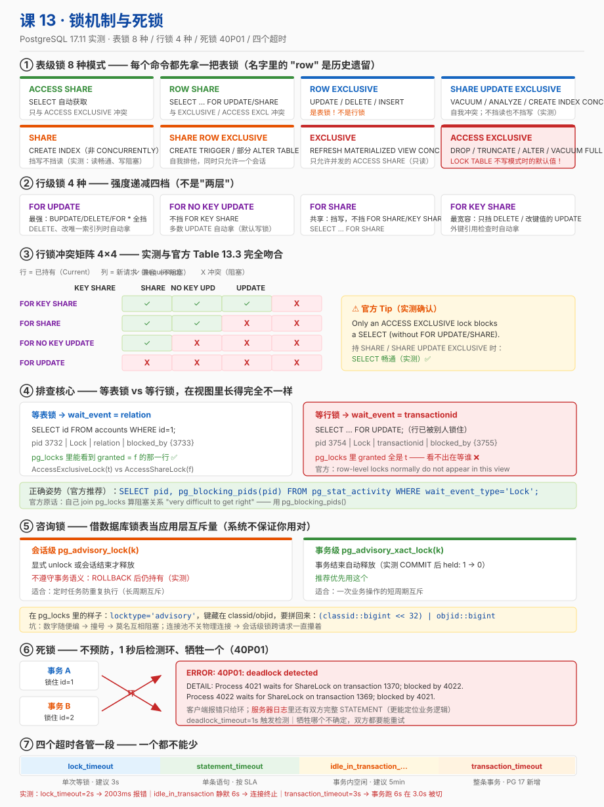

# 课 13 · 锁机制与死锁

> 📍 故事中的位置：两个请求互相等待——主角被死锁卡住，业务 30 秒无响应

## 本课目标

学完本课后，你能：

1. **说出**：PG 的表锁 vs 行锁的层级
2. **使用**：显式锁 / 咨询锁的正确场景
3. **定位死锁**：用 `pg_stat_activity` / `pg_locks` / `pg_blocking_pids()` / `pg_stat_activity.wait_event` 排查
4. **避开陷阱**：长事务 / 序列化冲突的常见反模式

## 知识点清单

| 知识点 | 关键点 |
|---|---|
| **13.1 表锁 vs 行锁** | · 表级锁 8 种模式（`ACCESS SHARE` / `ROW EXCLUSIVE` / ...） · 行锁的四种模式（`FOR UPDATE` / `FOR NO KEY UPDATE` / `FOR SHARE` / `FOR KEY SHARE`） · 锁等待与 `lock_timeout` |
| **13.2 显式锁 / 咨询锁** | · `LOCK TABLE ... IN ... MODE` 的使用 · **咨询锁**（advisory lock）：应用层协作 · 何时该用咨询锁（秒杀、分布式协调） |
| **13.3 死锁排查** | · `pg_stat_activity.wait_event_type = 'Lock'` · `pg_locks` 视图的结构 · **行锁不在 `pg_locks` 里**，等的是 `transactionid` · `log_lock_waits` 配置 · `pg_blocking_pids()` |
| **13.4 事务陷阱** | · 长事务的危害（死元组堆积 / 索引膨胀 / 复制延迟） · `idle_in_transaction_session_timeout` · **PG 17 新增 `transaction_timeout`** · SERIALIZABLE 冲突与 40001 错误 · 幂等设计的数据库侧支撑（`ON CONFLICT ... DO UPDATE`） |

> ⚠️ **骨架勘误预告（四条，都是本课实测/核查发现的）**
>
> 1. 骨架说「行锁的**两层**」不准确——官方是**四种**行级锁模式（`FOR UPDATE` / `FOR NO KEY UPDATE` / `FOR SHARE` / `FOR KEY SHARE`），它们按锁强度排成四档，不是两层。详见 13.1。
> 2. **骨架把 `pg_locks.tuple` 列为排查行锁的手段——这条路基本走不通。** 官方原文：*row-level locks normally do not appear in this view*。等行锁的会话在 `pg_locks` 里表现为**等对方的 `transactionid`**，`wait_event` 也是 `transactionid` 而不是 `tuple`。这是本课最重要的一条排障事实（陷阱 2 + 13.3）。
> 3. 骨架说「用脚本自动抓死锁日志」——方向对，但官方明确**不推荐自己 join `pg_locks` 来算阻塞关系**：*this is very difficult to get right in detail ... It is better to use the `pg_blocking_pids()` function*。本课改用官方推荐方案。
> 4. 骨架 13.4 漏了 **PG 17 新增的 `transaction_timeout`**（实测存在，默认 0）。它和 `idle_in_transaction_session_timeout` 是**两个不同维度**的超时，本课都会实测。

## 故事主线中的情节定位

主角被卡死——课 11 讲「事务看到什么」，课 12 讲「版本怎么活」，本课讲「**多个事务抢同一份数据时，谁先谁后、谁等谁、谁把谁拖死**」。

课 12 埋的两个伏笔在这里收网：

- `VACUUM FULL` 被另一个会话的 `AccessShareLock` 阻塞（课 12 实验 K）——那时你只看到「被阻塞」，本课告诉你它拿的是什么锁、为什么冲突。
- 长事务钉住死元组（课 12 说「一个忘了 COMMIT 的窗口能让整库膨胀」）——本课给出**可观测的证据**（`10000 are dead but not yet removable`）和**两个能自动兜底的参数**。

## 正文

## 📌 知识点导航

| 幕 | 内容 | 你会拿到的东西 |
|---|---|---|
| 第一幕 | 1976 年那篇论文 + 一次 30 秒无响应的救火 | 锁从哪来、为什么至今还在 |
| 第二幕 | 5 个关于锁的流行误解 | 网传结论 vs 本课实测 |
| 第三幕 | 13.1 / 13.2 / 13.3 / 13.4 四块硬骨头 | 六要素完整展开 |
| 第四幕 | 30+ 组实验（锁矩阵 / 咨询锁 / 死锁 / 陷阱） | 可复现的数字 |
| 第五幕 | 一张图 + 排障速查表 + 阶段闭环 | 收进你的运维手册 |

---

## 第一幕 · 起源与场景引入

### 起源：1976 年那篇论文

并发写的麻烦，比关系数据库还老。

1976 年，IBM 的 **Kapali Eswaran、Jim Gray、Raymond Lorie、Irving Traiger** 在《Communications of the ACM》上发表了一篇论文——**《The Notions of Consistency and Predicate Locks in a Database System》**（CACM 19(11): 624-633）。这篇论文干了两件影响至今的事：

1. **发明了两阶段锁协议（2PL, Two-Phase Locking）**——把每个事务切成「只加锁的阶段」和「只放锁的阶段」，中间不许回头。论文证明了：只要所有事务都守这个规矩，并发执行的结果就一定等价于某个串行顺序。这就是今天说的**可串行化**。
2. **提出了谓词锁（predicate locks）**——用来解决「按条件查一批记录」时的幻读问题。

而这篇论文里还有一句被后来者反复引用的话：**2PL 只保证可串行化，不保证无死锁**。可串行化和无死锁是**两个独立的性质**。

快进到今天：

- PG 选择了**另一条路**（MVCC，课 12）来让「读不阻塞写、写不阻塞读」。但**锁并没有消失**——它退到了幕后，只在「写 vs 写」和「显式要求」时出场。
- 死锁问题**从 1976 年一直活到今天**。PG 的解法是：不消灭死锁，而是在它发生时**检测并牺牲一个**（13.3）。
- 谓词锁那套思路，正是课 11 里 `SERIALIZABLE` 用的 **SIReadLock / 谓词锁**的祖先。

> 📌 所以本课讲的东西有一半是 1976 年的老问题、老方案。**新在 PG 怎么实现它、怎么观测它、怎么在你的应用里避开它。**
> （起源事实核查于 2026-09，来源：CACM 19(11) 原文记录 / Jim Gray 论文综述 arXiv:2310.04601 / 多所高校教材附录）

### 一个真实的工作场景

周一上午十点，订单服务报警：

```
P99 响应时间: 50ms → 30,000ms
接口超时率:  0.01% → 47%
```

你登上数据库，第一件事是看**现在有哪些会话在等什么**：

```sql
SELECT pid, state, wait_event_type, wait_event,
       now() - xact_start AS xact_age,
       left(query, 60) AS query
FROM pg_stat_activity
WHERE state <> 'idle' ORDER BY xact_start;
```

一眼看到一个刺眼的组合：

| pid | state | wait_event_type | wait_event | xact_age |
|---|---|---|---|---|
| 3977 | active | **Lock** | **transactionid** | 2m18s |
| 3970 | **idle in transaction** | Client | — | **3m02s** |

**注意这两行**：

- 3977 在**等锁**（`wait_event_type = Lock`），而且等的对象类型是 **`transactionid`**——不是 `relation`、更不是 `tuple`。这一点非常关键，后面会讲透。
- 3970 **什么都没在干**（`idle in transaction`），但它就是不放锁。它是元凶。

这就是本课要拆解的场景。它每天都在生产环境发生，而绝大多数人第一次遇到时，会在 `pg_locks` 里找半天找不到「谁锁了哪一行」。

### 本课要回答的五个问题

| 问题 | 对应知识 |
|---|---|
| 为什么我把 `pg_locks` 翻遍了也没看到行锁？ | 13.3（陷阱 2） |
| 「读会被写阻塞」是真的吗？ | 13.1 |
| 表锁有几种？我的 `UPDATE` 拿了哪一种？ | 13.1 |
| 什么时候该用咨询锁，什么时候是滥用？ | 13.2 |
| 死锁了怎么查？怎么防？超时参数该设哪个？ | 13.3 + 13.4 |

---

## 第二幕 · 认知冲突

### 陷阱 1：「锁就是行锁，表锁是老数据库的东西」——**错，每个命令都先拿表锁**

这是从「只知道行锁」的认知里带出来的误解。

在 PG 里，**任何一条访问表的语句，都会先在表上拿一个锁**，然后再根据需要拿行锁。实测（实验 A）：

| 命令 | 在 `finance.accounts` 上自动获取的表锁 |
|---|---|
| `SELECT` | `AccessShareLock` |
| `UPDATE` / `DELETE` / `INSERT` | `RowExclusiveLock` |
| `SELECT ... FOR UPDATE` / `FOR NO KEY UPDATE` / `FOR SHARE` / `FOR KEY SHARE` | `RowShareLock` |
| `CREATE INDEX`（不带 `CONCURRENTLY`） | `ShareLock` |
| `ANALYZE` | `ShareUpdateExclusiveLock` |
| `VACUUM`（不带 `FULL`） | `ShareUpdateExclusiveLock`（大表抓拍成功） |
| `ALTER TABLE ... ADD COLUMN` | `AccessExclusiveLock` |
| `TRUNCATE` | `AccessExclusiveLock` + `ShareLock` |
| `LOCK TABLE`（不写模式） | `AccessExclusiveLock` |

官方对这件事有一段很容易被忽略的说明（核查于 2026-09，PG 17 文档 13.3.1）：

> Remember that all of these lock modes are table-level locks, even if the name contains the word "row"; **the names of the lock modes are historical**.

**`ROW EXCLUSIVE` 是表级锁**。名字里的 "row" 是历史遗留，不代表粒度。这三个字坑过很多人。

### 陷阱 2：「行锁当然能在 `pg_locks` 里查到」——**基本查不到**

这是本课最重要的一条。官方原文（PG 17 文档 52.12，核查于 2026-09）：

> Although tuples are a lockable type of object, information about row-level locks is stored **on disk, not in memory**, and therefore **row-level locks normally do not appear in this view**. If a process is waiting for a row-level lock, it will usually appear in the view as **waiting for the permanent transaction ID of the current holder** of that row lock.

翻译成人话：

- 行锁**记在磁盘上的行本身**（还记得课 12 的 `xmax` 吗？行锁就藏在那里），不在内存的锁表里，所以 `pg_locks` 里**没有一行 `granted = false` 的行锁**。
- 一个会话等行锁时，你在 `pg_stat_activity` 看到的是 `wait_event_type = Lock`、`wait_event = **transactionid**`，在 `pg_locks` 里看到的是他**在等对方的那个事务 ID**。

实测证据（实验 G-2）：HOLDER 用 `SELECT ... FOR UPDATE` 锁住 `id=1`，WAITER 去改同一行：

```sql
-- WAITER 在等
 pid  | wait_event_type |  wait_event
------+-----------------+---------------
 3754 | Lock            | transactionid     ← 不是 tuple，不是 relation

-- pg_locks 里关于 WAITER 的全部行
 pid  | locktype |        mode         | granted |      rel
------+----------+---------------------+---------+---------------
 3754 | tuple    | AccessExclusiveLock | **t**   | accounts      ← 他自己的
 3754 | relation | RowShareLock        | t       | accounts
 3754 | relation | RowShareLock        | t       | accounts_pkey
```

**注意 `granted` 全是 `t`**——`pg_locks` 里根本看不到「他在等什么」。想知道「被谁挡了」，只有一个正确工具：

```sql
SELECT pid, pg_blocking_pids(pid) AS blocked_by, left(query,50)
FROM pg_stat_activity WHERE wait_event_type = 'Lock';
```

### 陷阱 3：「读会被写阻塞」——**官方：只有 ACCESS EXCLUSIVE 能阻塞纯 SELECT**

很多人从「数据库要加锁保护数据」推出一条错论：一个会话在改数据，另一个会话读该表就会被挡住。

官方原文（PG 17 文档 13.3.1，核查于 2026-09）把这件事说得很干脆：

> **Only an `ACCESS EXCLUSIVE` lock blocks a `SELECT` (without `FOR UPDATE/SHARE`) statement.**

实测（实验 B、D、E）：持 `ACCESS EXCLUSIVE` 时纯 `SELECT` 被阻塞 3.0 秒；而持 `SHARE`（`CREATE INDEX` 用的模式）和 `SHARE UPDATE EXCLUSIVE`（`VACUUM` 用的模式）时，`SELECT` 完全畅通。

**真正会阻塞 `SELECT` 的日常操作，其实只有几个**：`ALTER TABLE`、`TRUNCATE`、`DROP TABLE`、`VACUUM FULL`、`REINDEX`、`CLUSTER`。它们都要 `ACCESS EXCLUSIVE`——所以**在生产环境执行 DDL 前排队等锁，才是「读被卡住」的真实原因**（课 12 你已经见过一次：`VACUUM FULL` 被阻塞）。

### 陷阱 4：「咨询锁就是普通锁，事务结束就释放」——**会话级咨询锁不遵守事务语义**

咨询锁（advisory lock）是应用自己定义含义的锁。官方原文（PG 17 文档 13.3.5）：

> Once acquired at session level, an advisory lock is held **until explicitly released or the session ends**. Unlike standard lock requests, **session-level advisory lock requests do not honor transaction semantics**: a lock acquired during a transaction that is later rolled back **will still be held** following the rollback.

实测（实验 J-5）：在事务里拿 `pg_advisory_lock(999)`，然后 `ROLLBACK`——锁**还在**：

```sql
BEGIN; SELECT pg_advisory_lock(999); ROLLBACK;
-- 查 pg_locks：bigint_key = 999, granted = t   ← 回滚没有释放它
```

这是**有意设计**的：咨询锁服务于「应用层互斥」（如定时任务防重复执行），这类场景本来就不该被事务边界搅和。但如果你把它当普通锁用，就会出现「接口早就返回了，锁还攥着」的灵异现象。

### 陷阱 5：「超时设一个 `statement_timeout` 就够了」——**不够，那是三个不同维度**

这是生产事故的高发区。PG 的超时不是一个参数，而是一组**管不同东西**的参数：

| 参数 | 管什么 | 默认值 | 实测行为 |
|---|---|---|---|
| `lock_timeout` | 单次**等锁**超时 | `0`（禁用） | 等 2s 报 `canceling statement due to lock timeout`（实测 2003.119 ms） |
| `statement_timeout` | 单条**语句**总时长 | `0`（禁用） | — |
| `idle_in_transaction_session_timeout` | 事务开着但**客户端不发指令**的时长 | `0`（禁用） | 静默 6s → 连接被切断（实测） |
| `transaction_timeout`（**PG 17 新增**） | **整条事务**的总时长 | `0`（禁用） | 事务里跑 6s → 3.0s 时被切断（实测） |

**关键区别**：

- `lock_timeout` 只在**等锁**时计时，且**每次加锁尝试各自计时**（官方原文：*The time limit applies separately to each lock acquisition attempt*）。
- `statement_timeout` **管不了** `idle in transaction`——因为那时根本没有语句在跑。这正是第一幕那台数据库 P99 飙到 30 秒却没人被拦住的原因。
- `idle_in_transaction_session_timeout` **管不了**「事务里一直在跑慢查询」——官方定义是「waiting for a client query」，服务端忙的时候不算 idle。**这就是我第一轮实验踩的坑**（用 `pg_sleep` 测它，结果超时不触发）。
- `transaction_timeout` 才是兜底的那个：不管你是空闲还是忙，**整条事务超过就切**。

---

## 第三幕 · 层层揭示

### （一）13.1 表锁 vs 行锁

#### ① 一句话定义

**PG 的锁分两层：表级锁管「这张表能不能被这样访问」，行级锁管「这一行能不能被这样改」；任何语句先拿表锁，必要时再拿行锁。**

#### ② 直觉建立

把一张表想成一栋**图书馆**：

- **表锁** = 门口那块牌子。它是「本馆今日状态」的声明——「正常开放」「仅限阅览，不外借」「闭馆整理」。
- **行锁** = 借阅某本书时插在书里的借书卡。

有意思的类比失效点在这里：现实中去改动一本书，**不需要先把整馆状态改掉**。但 PG 里不一样——`UPDATE` 一定会先在门口挂上 `ROW EXCLUSIVE` 这块牌，再去动那几行的借书卡。

所以判据是：

> **表锁回答「能不能访问这张表」，行锁回答「能不能动这一行」。**

再记住一句话：**表锁的名字有误导性**。`ROW EXCLUSIVE`、`ROW SHARE` 都是**表级**锁，名字里的 "row" 只表示「我打算动行」，不表示粒度。

#### ③ 核心原理

**表级锁的 8 种模式**（官方名称 + 官方一句话含义，核查于 2026-09，PG 17 文档 13.3.1）：

| 模式 | 内部名 | 官方含义 | 谁会自动拿它 |
|---|---|---|---|
| `ACCESS SHARE` | `AccessShareLock` | 只与 `ACCESS EXCLUSIVE` 冲突 | `SELECT` |
| `ROW SHARE` | `RowShareLock` | 与 `EXCLUSIVE`、`ACCESS EXCLUSIVE` 冲突 | `SELECT ... FOR UPDATE/SHARE` 系列 |
| `ROW EXCLUSIVE` | `RowExclusiveLock` | 与 `SHARE`、`SHARE ROW EXCLUSIVE`、`EXCLUSIVE`、`ACCESS EXCLUSIVE` 冲突 | `UPDATE` / `DELETE` / `INSERT` / `MERGE` |
| `SHARE UPDATE EXCLUSIVE` | `ShareUpdateExclusiveLock` | **自我冲突**；保护表免受并发 schema 变更与 `VACUUM` | `VACUUM`（非 FULL）/ `ANALYZE` / `CREATE INDEX CONCURRENTLY` |
| `SHARE` | `ShareLock` | 保护表免受并发数据变更（允许读） | `CREATE INDEX`（非 CONCURRENTLY） |
| `SHARE ROW EXCLUSIVE` | `ShareRowExclusiveLock` | 自我排他，同时只能一个会话持有 | `CREATE TRIGGER`、部分 `ALTER TABLE` |
| `EXCLUSIVE` | `ExclusiveLock` | 只允许并发的 `ACCESS SHARE`（即只允许读） | `REFRESH MATERIALIZED VIEW CONCURRENTLY` |
| `ACCESS EXCLUSIVE` | `AccessExclusiveLock` | 与所有模式冲突，独占 | `DROP TABLE` / `TRUNCATE` / `REINDEX` / `CLUSTER` / `VACUUM FULL` / 多数 `ALTER TABLE` |

两条官方补充说明，都很有用：

> Two transactions cannot hold locks of conflicting modes on the same table at the same time. (**However, a transaction never conflicts with itself.**)

> Notice in particular that some lock modes are **self-conflicting** (for example, an `ACCESS EXCLUSIVE` lock cannot be held by more than one transaction at a time) while others are **not self-conflicting** (for example, an `ACCESS SHARE` lock can be held by multiple transactions).

「自己和自己不冲突」这条解释了一个常见困惑：为什么同一个事务里先 `LOCK TABLE t IN ACCESS EXCLUSIVE MODE` 再 `SELECT t` 不会卡住。

**行级锁的四种模式**（官方描述，同文档 13.3.2）：

| 模式 | 强度 | 官方描述要点 | 谁会自动拿它 |
|---|---|---|---|
| `FOR UPDATE` | 最强 | 「阻止其它事务 `UPDATE` / `DELETE` / `SELECT FOR UPDATE` / `FOR NO KEY UPDATE` / `FOR SHARE` / `FOR KEY SHARE` 这些行」 | `DELETE` 某行；`UPDATE` 改了**可用于外键的唯一索引列** |
| `FOR NO KEY UPDATE` | ↓ | 与 `FOR UPDATE` 相同但更弱：**不阻塞** `SELECT FOR KEY SHARE` | 大多数不拿 `FOR UPDATE` 的 `UPDATE` |
| `FOR SHARE` | ↓ | 共享锁：阻塞其它事务的 `UPDATE` / `DELETE` / `FOR UPDATE` / `FOR NO KEY UPDATE`，**不阻塞** `FOR SHARE` / `FOR KEY SHARE` | `SELECT ... FOR SHARE` |
| `FOR KEY SHARE` | 最弱 | 阻塞 `DELETE` 和「改键值的 `UPDATE`」，**连 `FOR NO KEY UPDATE` 都不阻塞** | `SELECT ... FOR KEY SHARE` |

官方还有一句话概括了行锁的职责边界：

> Row-level locks **do not affect data querying**; they block only **writers and lockers** to the same row.

**行锁只挡写和要锁的人，不挡读。** 这是 MVCC 留给世界的礼物。

**四种行锁的冲突矩阵**（实测，见 ④；与官方 Table 13.3 一致）：

```
          B 请求→   FOR KEY SHARE   FOR SHARE   FOR NO KEY UPDATE   FOR UPDATE
A 已持有↓
FOR KEY SHARE           ✓             ✓              ✓               X
FOR SHARE               ✓             ✓              X               X
FOR NO KEY UPDATE       ✓             X              X               X
FOR UPDATE              X             X              X               X
```

规律很整齐：**越往下越强，越往右越强；强的一方挡得住弱的一方，弱的一方挡不住强的**。`FOR KEY SHARE` 是最宽容的（只挡「改键」，因为那是外键完整性关心的唯一事情）。

#### ④ 示例演示

**实验 A · 各命令自动获取的表锁**（`BEGIN` → 执行命令 → 查 `pg_locks` → `ROLLBACK`）：

```
SELECT                        → AccessShareLock
UPDATE                        → RowExclusiveLock
SELECT ... FOR UPDATE         → RowShareLock
CREATE INDEX                  → ShareLock
ANALYZE                       → ShareUpdateExclusiveLock
ALTER TABLE ADD COLUMN        → AccessExclusiveLock
TRUNCATE                      → AccessExclusiveLock + ShareLock
LOCK TABLE（不写模式）          → AccessExclusiveLock
```

**实验 A-3 · 显式 `LOCK TABLE` 八种模式**（与官方名称一一对应，八发八中）：

```
IN ACCESS SHARE MODE          → AccessShareLock
IN ROW SHARE MODE             → RowShareLock
IN ROW EXCLUSIVE MODE         → RowExclusiveLock
IN SHARE UPDATE EXCLUSIVE MODE→ ShareUpdateExclusiveLock
IN SHARE MODE                 → ShareLock
IN SHARE ROW EXCLUSIVE MODE   → ShareRowExclusiveLock
IN EXCLUSIVE MODE             → ExclusiveLock
IN ACCESS EXCLUSIVE MODE      → AccessExclusiveLock
```

**实验 A-2 · VACUUM 的锁**（100 万行表，高频轮询抓拍）——抓到了：

```
mode                     | granted
-------------------------+---------
ShareUpdateExclusiveLock | t
```

这解释了课 12 的一个悬念：**为什么 `VACUUM` 能和 `SELECT`/`UPDATE` 并行**——它拿的 `SHARE UPDATE EXCLUSIVE` 与 `AccessShareLock`、`RowExclusiveLock` 都不冲突。但**两个 `VACUUM` 之间会互相排队**（自我冲突）。

**实验 B · `ACCESS EXCLUSIVE` 阻塞纯 SELECT**（官方 Tip 实测）：

```
WAITER: SELECT id, balance FROM finance.accounts WHERE id = 1;
  pid  | wait_event_type | wait_event | blocked_by
-------+-----------------+------------+------------
  3732 | Lock            | relation   | {3733}

pg_locks:
  pid  |        mode         | granted |   rel
-------+---------------------+---------+----------
  3733 | AccessExclusiveLock | t       | accounts
  3732 | AccessShareLock     | f       | accounts   ← 唯一一个 granted=f
```

等 **3.0 秒**（HOLDER `ROLLBACK` 的那一刻）后放行，拿到结果。

**实验 C · `ROW EXCLUSIVE` 之间不冲突**：A 改 `id=1` 未提交，B 同时改 `id=2` —— **两个都成功**，谁也不等谁。这就是「行锁不挡不相关的行」的直观证据。

**实验 D · `SHARE` 阻塞写、不阻塞读**：持 `SHARE` 时 `SELECT` 返回正常，`UPDATE` 被阻塞（`ShareLock granted=t` vs `RowExclusiveLock granted=f`）。

**实验 E · `SHARE UPDATE EXCLUSIVE` 既不阻塞读也不阻塞写**，但第二个想拿同样模式的会话被阻塞（自我冲突）。

**实验 I · 四种行锁的 4×4 冲突矩阵**（阻塞观察法，无歧义）：

```
A＼B                KEY SHARE   SHARE   NO KEY UPDATE   UPDATE
FOR KEY SHARE        ✓          ✓        ✓              X
FOR SHARE            ✓          ✓        X              X
FOR NO KEY UPDATE    ✓          X        X              X
FOR UPDATE           X          X        X              X
```

> ⚠️ **这个矩阵我第一次测错了，而且错得很有教育意义。**
>
> 第一版我用「加 `NOWAIT`，看有没有报 `could not obtain lock`」来判断冲突。结果 `B 请求 FOR UPDATE` 那一整列全是 ✓（兼容）——**与官方 Table 13.3 直接矛盾**。我很确定官方不会错，于是单独重测：A 持 `FOR KEY SHARE`、B 请求 `FOR UPDATE NOWAIT` —— 报错清清楚楚：`55P03: could not obtain lock on row`。
>
> 根因：psql 把错误写到 **stderr**，我把它和 stdout 合并读取时，**ERROR 的输出被延迟到了下一次读取**，于是「报错」被算成了「没报错」。
>
> 改用**阻塞观察法**（B 发不带 `NOWAIT` 的语句，等 1.8 秒看它是否返回）后，矩阵与官方完全吻合。
>
> **教训**：判断「冲突/不冲突」这种二元结论时，不要依赖错误文本是否出现在输出里——**依赖可观测的行为**（有没有阻塞）。你在生产排查时也一样：`pg_stat_activity` 的 `wait_event` 比任何日志都可信。

**实验 F · `lock_timeout` 实测**（这是生产上最该配的参数之一）：

```
SET lock_timeout = '2s';
SELECT id FROM finance.accounts WHERE id = 1;
ERROR:  canceling statement due to lock timeout
Time: 2003.119 ms
```

**2 秒就放弃，而不是无限等下去**。对比第一幕那台数据库：如果配了 `lock_timeout`，那个请求在 2 秒时就返回错误，而不是让用户等 30 秒。

**实验 G · `NOWAIT` 与 `SKIP LOCKED`**：

```sql
SELECT * FROM accounts WHERE id = 1 FOR UPDATE NOWAIT;
-- ERROR:  55P03: could not obtain lock on row in relation "accounts"
```

```sql
-- HOLDER 锁住 task 1,2，然后其他会话：
SELECT id, payload FROM finance.task_queue ORDER BY id FOR UPDATE SKIP LOCKED;
--  id | payload
-- ----+---------
--   3 | task-3      ← 1,2 被跳过，不等
--   4 | task-4
--   5 | task-5
```

`SKIP LOCKED` 是**队列/任务分发**的标准解法：多个 worker 抢任务时，谁也不用等谁。

#### ⑤ 常见误区

**误区 1：以为 `ROW EXCLUSIVE` 是行锁。** 它是**表级**锁，只是「我打算动行」的意思。官方原话：*even if the name contains the word "row"; the names of the lock modes are historical*。

**误区 2：以为行锁能在 `pg_locks` 里查到。** 行锁信息存在**磁盘上的行**里，不在内存锁表。等行锁时表现为等 `transactionid`。

**误区 3：以为加了 `FOR UPDATE` 就能防住所有并发。** `FOR UPDATE` 是**悲观锁**，它自身会带来阻塞与死锁风险，且**必须与事务配合**（自动提交模式下 `SELECT ... FOR UPDATE` 执行完锁就放了，等于没锁）。

**误区 4：以为 `LOCK TABLE` 不写模式就是行锁或轻量锁。** 官方原文：*This is also the default lock mode for `LOCK TABLE` statements that do not specify a mode explicitly* —— 默认就是 `ACCESS EXCLUSIVE`，最重的那把。实测确认。（所以「`LOCK TABLE t` 顺手写一下」是危险习惯。）

**误区 5：以为 `lock_timeout` 设了就不会被锁拖死。** 它只作用于**等锁**。一个**不需要等锁**但极慢的语句照样跑满，那要 `statement_timeout`。

**误区 6：以为冲突是「读被写挡」或「写被读挡」。** 官方：*Row-level locks ... block only writers and lockers*。表级层面，除了 `ACCESS EXCLUSIVE`，**没有任何模式能挡住纯 `SELECT`**。

#### ⑥ 一句话记住

> **表锁管「表能不能这样访问」，行锁管「行能不能这样改」；读永远不挡写、写永远不挡读，除非有人挂了 `ACCESS EXCLUSIVE` 这块牌子。**

#### 命令速查卡 · 看懂锁

```sql
-- 我这条语句拿了什么表锁？（事务里查）
SELECT mode, granted FROM pg_locks WHERE relation = 'finance.accounts'::regclass;

-- 现在谁在等锁？被谁挡住？
SELECT pid, wait_event_type, wait_event, pg_blocking_pids(pid) AS blocked_by,
       left(query, 60) AS query
FROM pg_stat_activity WHERE wait_event_type = 'Lock';

-- 显式加锁（谨慎！默认就是最重的 ACCESS EXCLUSIVE）
LOCK TABLE t IN SHARE MODE;                     -- 显式指定模式
SELECT ... FOR UPDATE NOWAIT;                    -- 拿不到就报错，不等待
SELECT ... FOR UPDATE SKIP LOCKED;               -- 跳过被锁的行
SET lock_timeout = '2s';                         -- 等锁最多 2 秒
```

#### 📚 官方文档

- 表级锁 8 种模式与 Table 13.2 冲突矩阵：[13.3.1. Table-Level Locks](https://www.postgresql.org/docs/17/explicit-locking.html#LOCKING-TABLES)（核查于 2026-09）
- 行级锁 4 种模式与 Table 13.3：[13.3.2. Row-Level Locks](https://www.postgresql.org/docs/17/explicit-locking.html#LOCKING-ROWS)（核查于 2026-09）

---

### （二）13.2 显式锁 / 咨询锁

#### ① 一句话定义

**显式锁是「我主动要求数据库锁住某个对象」，咨询锁是「借数据库的锁表，给应用自己定义的某个数字加锁」——后者与数据无关，纯粹当分布式互斥量用。**

#### ② 直觉建立

想象一栋写字楼：

- **显式锁**（`LOCK TABLE` / `FOR UPDATE`）= 你去物业登记「这间会议室我包了」。物业（数据库）知道这间房是什么，会拦住别人。
- **咨询锁** = 你在**前台存包柜**里占了一个格子，柜子编号（比如 `12345`）**是你自己定的**。前台不知道 12345 代表「订单 42 的处理权」还是「这个定时任务今天跑过了」——它只负责「这个号被占了，别人拿不到」。

官方对这个类比有段很准确的话（PG 17 文档 13.3.5）：

> These are called **advisory locks**, because **the system does not enforce their use** — it is up to the application to use them correctly.

**系统不保证你用得对。** 你拿 `pg_advisory_lock(42)` 说是为了「订单 42」，但另一个开发者完全可以用同一个 42 表示别的意思——撞号了他们就会莫名其妙互相阻塞。这是咨询锁最大的使用风险。

#### ③ 核心原理

**显式锁**：`LOCK TABLE` 让你主动拿表锁。官方提醒了两个要点：

1. **不写模式 = `ACCESS EXCLUSIVE`**（最重）。
2. `LOCK TABLE` 只在**事务内**有意义（`ACCESS SHARE`/`ROW SHARE` 这类短暂锁在自动提交下瞬间释放，等于没加）。

```sql
BEGIN;
LOCK TABLE finance.accounts IN SHARE MODE;   -- 阻塞写，允许读
-- ... 做需要「这张表不会有人改」的事 ...
COMMIT;
```

**咨询锁：两个维度**

| 维度 | 会话级（session） | 事务级（transaction） |
|---|---|---|
| 函数 | `pg_advisory_lock()` / `pg_try_advisory_lock()` | `pg_advisory_xact_lock()` / `pg_try_advisory_xact_lock()` |
| 释放时机 | **显式 `pg_advisory_unlock()` 或会话结束** | **事务结束自动释放** |
| 遵守事务语义 | **否**（回滚不释放） | 是 |
| 可重入 | 是（同一进程可多次获取，需同样次数解锁） | — |
| 适用场景 | 长周期互斥（定时任务防重复执行） | 短周期互斥（一次业务操作） |

官方关于「不遵守事务语义」的原文：

> session-level advisory lock requests **do not honor transaction semantics**: a lock acquired during a transaction that is later rolled back **will still be held** following the rollback, and likewise an unlock is effective even if the calling transaction fails later.

**键的两种形态**（官方）：

- 单个 `bigint`：`pg_advisory_lock(12345)`
- 两个 `int`：`pg_advisory_lock(1, 2)` —— 常用于 `(业务类型, 业务 ID)` 组合

在 `pg_locks` 里的表示（官方给出的反解公式）：

```sql
-- bigint 键：高 32 位在 classid，低 32 位在 objid，objsubid = 1
(classid::bigint << 32) | objid::bigint
-- 两个 int 键：第一个在 classid，第二个在 objid，objsubid = 2
```

**为什么咨询锁比「表里存个标记位」更好？** 官方给了三个理由：

> While a flag stored in a table could be used for the same purpose, advisory locks are **faster**, **avoid table bloat**, and are **automatically cleaned up by the server at the end of the session**.

第三条最值钱：**进程崩溃时，操作系统回收连接，锁自动释放**。用表标记位的话，你还需要一个「僵尸标记清理」机制。

#### ④ 示例演示

**实验 J-1/2 · 咨询锁的基本互斥**：

```sql
-- A
SELECT pg_advisory_lock(123);        -- 成功
-- B（另一个会话）
SELECT pg_try_advisory_lock(123);    --  f     ← 拿不到，但不阻塞
```

`try_` 版本立刻返回 `true`/`false`，**业界用它做「抢到就干活，抢不到就跳过」**（比如定时任务）。

**实验 J-4 · 在 `pg_locks` 里看咨询锁**：

```sql
SELECT pid, locktype, mode, granted, objsubid,
       (classid::bigint << 32) | objid::bigint AS bigint_key
FROM pg_locks WHERE locktype = 'advisory';
```

```
 pid  | locktype |     mode      | granted | objsubid | bigint_key
------+----------+---------------+---------+----------+------------
 3843 | advisory | ExclusiveLock | t       |        1 |        123
 3844 | advisory | ExclusiveLock | t       |        1 |        456
```

`locktype = 'advisory'`、`mode` 恒为 `ExclusiveLock`（咨询锁没有共享模式），**键要从 `classid`/`objid` 拼回来才看得懂**——这是很多人「在 `pg_locks` 里看到莫名其妙数字」的原因。

**实验 J-5 · 会话级不遵守事务语义**（陷阱 4 的证据）：

```sql
BEGIN; SELECT pg_advisory_lock(999); ROLLBACK;
-- 再查：
 bigint_key |     mode      | granted
------------+---------------+---------
        999 | ExclusiveLock | t         ← 回滚了，锁还活着
```

**实验 J-7 · 事务级会自动释放**：

```sql
BEGIN; SELECT pg_advisory_xact_lock(777);   -- held = 1
COMMIT;
-- still_held = 0                              ← 自动释放
```

**实验 J-8 · 秒杀 / 幂等的真实用法**：

```sql
-- 用 hashtext 把业务键映射成 bigint，避免人工编号撞号
SELECT pg_try_advisory_lock(hashtext('order:' || 42)::bigint);   -- A: t
SELECT pg_try_advisory_lock(hashtext('order:' || 42)::bigint);   -- B: f  ← 同一订单被挡住
```

#### ⑤ 常见误区

**误区 1：以为咨询锁和事务绑定。** 会话级不绑定（实测回滚后仍在）。要自动释放请用 `_xact_` 版本。

**误区 2：以为咨询锁能保护数据。** 它**完全不碰数据**。两个事务各自 `pg_advisory_lock(999)` 拿到不同号，然后同时更新同一行——数据库照样按行锁规则处理，咨询锁一根手指都没拦。**咨询锁只能保护「你自觉用它保护的逻辑」。**

**误区 3：以为咨询锁数字随便编。** 撞号会导致**莫名其妙的互相阻塞**，而且极难排查（因为数字本身没语义）。生产上推荐 `hashtext('业务域:业务ID')` 或集中登记键空间。

**误区 4：以为 `pg_try_advisory_lock` 失败一定要重试。** 大多数场景「抢不到就跳过」才是正确语义（定时任务：上一轮还没跑完就别启动新的）。

**误区 5：以为会话级咨询锁会随连接池归还而释放。** 连接池通常**不关闭物理连接**——`pg_advisory_lock` 会**跨请求一直攥着**，直到那个物理连接真正断开。这是连接池 + 咨询锁的经典事故组合。

**误区 6：以为咨询锁会出现在普通 `pg_locks` 查询里一眼可见。** 它确实在 `pg_locks`，但 `relation` 为 NULL、键藏在 `classid/objid` 里——不加 `locktype = 'advisory'` 过滤很容易看漏。

#### ⑥ 一句话记住

> **显式锁是让数据库帮你挡人，咨询锁是借数据库的锁表当互斥量；前者靠数据库的规矩，后者全靠你自己的自觉。**

#### 命令速查卡 · 显式锁与咨询锁

```sql
-- 显式表锁（不写模式 = ACCESS EXCLUSIVE，务必写清楚）
BEGIN; LOCK TABLE t IN SHARE MODE; ... COMMIT;

-- 会话级咨询锁（必须显式解锁；不遵守事务语义）
SELECT pg_advisory_lock(123);          -- 阻塞直到拿到
SELECT pg_try_advisory_lock(123);      -- 立刻返回 true/false
SELECT pg_advisory_unlock(123);        -- 解锁（可重入，需解够次数）

-- 事务级咨询锁（事务结束自动释放，推荐优先用）
BEGIN; SELECT pg_advisory_xact_lock(123); ... COMMIT;

-- 用业务键（避免撞号）
SELECT pg_try_advisory_lock(hashtext('order:'||42)::bigint);

-- 查所有咨询锁
SELECT pid, (classid::bigint << 32) | objid::bigint AS key, objsubid, granted
FROM pg_locks WHERE locktype = 'advisory';

-- 批量清理某会话的咨询锁（谨慎）
SELECT pg_advisory_unlock_all();
```

#### 📚 官方文档

- Advisory Locks 官方说明（会话级 vs 事务级 / 键编码）：[13.3.5. Advisory Locks](https://www.postgresql.org/docs/17/explicit-locking.html#ADVISORY-LOCKS)（核查于 2026-09）
- 咨询锁函数清单：[9.27.10. Advisory Lock Functions](https://www.postgresql.org/docs/17/functions-admin.html#FUNCTIONS-ADVISORY-LOCKS)（核查于 2026-09）

---

### （三）13.3 死锁排查

#### ① 一句话定义

**死锁是「A 等 B、B 等 A」的循环等待；PG 的做法不是预防它，而是用 `deadlock_timeout`（默认 1 秒）检测环，然后牺牲其中一个事务，让另一个跑完。**

#### ② 直觉建立

**两辆车在窄巷里对头相遇**：谁都过不去，因为对方占着路。唯一的出路是**有一辆车倒回去**。

PG 的选择很务实：

- 不试图「预防」死锁（那需要预先声明所有要用的锁，代价太高）
- 而是**等一等看看**——官方原文说得很坦诚：

> The check for deadlock is **relatively expensive**, so the server doesn't run it every time it waits for a lock. We **optimistically assume that deadlocks are not common** in production applications and just wait on the lock for a while before checking for a deadlock.

所以流程是：等锁 → 等满 `deadlock_timeout`（默认 1s）→ 检查有没有形成环 → 有环就报 `40P01` 并回滚其中一个。

**这里有个反直觉的推论**：`deadlock_timeout` **不是**「死锁多久被发现」的精确值，而是「**检查的触发门槛**」。如果两个事务在 0.5 秒内就互相死锁了，检查仍会在 1 秒时才做。官方也给了调优建议：

> Ideally the setting should **exceed your typical transaction time**, so as to improve the odds that a lock will be released before the waiter decides to check for deadlock.

#### ③ 核心原理

**死锁的官方示例**（PG 17 文档 13.3.4，核查于 2026-09）：

```sql
-- 事务一
UPDATE accounts SET balance = balance + 100.00 WHERE acctnum = 11111;   -- 锁住 11111
-- 事务二
UPDATE accounts SET balance = balance + 100.00 WHERE acctnum = 22222;   -- 锁住 22222
UPDATE accounts SET balance = balance - 100.00 WHERE acctnum = 11111;   -- 等 11111
-- 事务一（此时形成环）
UPDATE accounts SET balance = balance - 100.00 WHERE acctnum = 22222;   -- 等 22222 → 死锁
```

官方对检测结果的说明：

> PostgreSQL **automatically detects** deadlock situations and resolves them by **aborting one of the transactions** involved, allowing the other(s) to complete. (Exactly which transaction will be aborted is **difficult to predict and should not be relied upon**.)

**「牺牲哪个不确定，不要依赖它」**——这是个很实在的警告。所以应用侧的正确姿势是：**把 40001 和 40P01 都加进重试白名单**，而不是假设「肯定是对方被牺牲」。

**排障三板斧**

| 工具 | 回答什么问题 | 关键点 |
|---|---|---|
| `pg_stat_activity` | 谁在等？等什么？等多久了？ | `wait_event_type = 'Lock'`，`wait_event` 区分 `relation` / `transactionid` / `tuple` 等 |
| `pg_blocking_pids(pid)` | **谁挡住了我？** | 官方推荐的唯一正确方式 |
| 服务器日志 | 死锁回环的完整现场 | `deadlock detected` + 两个进程的 `STATEMENT` |

**为什么官方不推荐自己 join `pg_locks`**（原文，PG 17 文档 52.12）：

> While it is possible to obtain information about which processes block which other processes by joining `pg_locks` against itself, this is **very difficult to get right in detail**. Such a query would have to encode knowledge about which lock modes conflict with which others. Worse, the `pg_locks` view **does not expose information about which processes are ahead of which others in lock wait queues**... **It is better to use the `pg_blocking_pids()` function.**

**关于 `log_lock_waits`**（官方，PG 17 文档 19.8）：

> Controls whether a log message is produced when a session **waits longer than `deadlock_timeout`** to acquire a lock. This is useful in determining if lock waits are causing poor performance. **The default is `off`.**

注意它和 `deadlock_timeout` 是**同一个门槛**——`deadlock_timeout` 既是「检查死锁的等待时长」，也是「打印锁等待日志的阈值」。官方原话：*When `log_lock_waits` is set, this parameter also determines the amount of time to wait before a log message is issued about the lock wait.*

**所以排查锁问题的第一步配置，就这两条**：

```
log_lock_waits = on          # 默认 off，打开才有锁等待日志
deadlock_timeout = 1s        # 默认 1s；排查期可临时调到 500ms 让日志更早出现
```

#### ④ 示例演示

**实验 K · 死锁复现**（官方 accounts 例子，PG 17.11 实测）：

```
K-1 A: BEGIN; UPDATE ... WHERE id = 1;      -- A 锁住 id=1
K-2 B: BEGIN; UPDATE ... WHERE id = 2;      -- B 锁住 id=2
K-3 B: UPDATE ... WHERE id = 1;             -- 阻塞

  pid  | state  | wait_event_type |  wait_event   | blocked_by
-------+--------+-----------------+---------------+------------
 3844  | active | Lock            | transactionid | {3843}

K-4 A: UPDATE ... WHERE id = 2;             -- 形成环 → 1.0 秒后死锁检测介入
A 的结果：ERROR:  deadlock detected
```

**实验 L · 死锁的完整报错与 SQLSTATE**：

```
ERROR:  40P01: deadlock detected
DETAIL:  Process 4021 waits for ShareLock on transaction 1370; blocked by process 4022.
         Process 4022 waits for ShareLock on transaction 1369; blocked by process 4021.
HINT:  See server log for query details.
CONTEXT:  while updating tuple (0,53) in relation "accounts"
LOCATION:  DeadLockReport, deadlock.c:1130
```

**这段报错本身就是一张死锁环的说明书**：

- `40P01` = `deadlock_detected`（要进重试白名单的码）
- `DETAIL` 的两行把环画出来了：4021 等 4022，4022 等 4021
- `waits for ShareLock on transaction 1370` —— **注意这里等的是 `transaction`，不是行**。这又一次印证陷阱 2：行锁等待对外表现为「等对方的事务 ID」。

**实验 K-5 · 服务器日志里的完整现场**（死锁信息比客户端报错更全）：

```
2026-09-10 15:06:51.484 UTC [3843] ERROR:  deadlock detected
2026-09-10 15:06:51.484 UTC [3843] DETAIL:  Process 3843 waits for ShareLock on transaction 1287; blocked by process 3844.
        Process 3844 waits for ShareLock on transaction 1286; blocked by process 3843.
        Process 3843: UPDATE finance.accounts SET balance = balance - 100 WHERE id = 2;
        Process 3844: UPDATE finance.accounts SET balance = balance - 100 WHERE id = 1;
2026-09-10 15:06:51.484 UTC [3843] CONTEXT:  while updating tuple (0,25) in relation "accounts"
2026-09-10 15:06:51.484 UTC [3843] STATEMENT:  UPDATE finance.accounts SET balance = balance - 100 WHERE id = 2;
```

**日志比客户端多出来的东西**：**两个进程各自的完整语句**。客户端只告诉你「你被谁挡了」，日志告诉你「对方正在跑哪条 SQL」——这才是定位业务逻辑问题的关键。

**实验 S · 排障一条龙**（一条 SQL 拿到「谁在等、被谁挡、挡人者在干嘛」）：

```sql
SELECT w.pid AS waiting_pid, w.wait_event_type, w.wait_event,
       pg_blocking_pids(w.pid) AS blocking_pids,
       left(regexp_replace(w.query,'\s+',' ','g'),36) AS waiting_query,
       h.state AS holder_state,
       round(extract(epoch from (now()-h.xact_start))::numeric,1) AS holder_xact_s,
       left(regexp_replace(h.query,'\s+',' ','g'),36) AS holder_query
FROM pg_stat_activity w
JOIN LATERAL unnest(pg_blocking_pids(w.pid)) AS bp(pid) ON true
JOIN pg_stat_activity h ON h.pid = bp.pid
WHERE w.wait_event_type = 'Lock';
```

实测输出：

```
 waiting_pid | wait_event_type |  wait_event   | blocking_pids |      waiting_query      |    holder_state     | holder_xact_s |     holder_query
-------------+-----------------+---------------+---------------+-------------------------+---------------------+---------------+----------------------
        3977 | Lock            | transactionid | {3970}        | UPDATE finance.accounts | idle in transaction |           3.0 | UPDATE finance.accounts
```

**一行就结案**：3977 在等 3970；而 3970 的状态是 **`idle in transaction`**、事务已经开了 3 秒、正在跑的语句是 `UPDATE`。

**「持锁者自己不干活」这件事，就是第一幕那张截图的完整解释**——也是 13.4 的主题。

#### ⑤ 常见误区

**误区 1：以为死锁是 PG 的 bug。** 死锁是**并发系统的固有现象**，1976 年那篇论文就说明了 2PL 只保证可串行化、不保证无死锁。PG 检测并解决它，是正确行为。

**误区 2：以为能看到「谁锁了哪一行」。** `pg_locks` 里看不到行锁（陷阱 2）。硬找会浪费大量时间——用 `pg_blocking_pids()`。

**误区 3：以为 `deadlock_timeout` 越小越好。** 官方明确说死锁检查「relatively expensive」，且建议该值**应大于典型事务时长**。设成 1ms 只会让正常等待也被反复检查。

**误区 4：以为 `log_lock_waits = on` 就能记下所有锁等待。** 官方：它记录的是**超过 `deadlock_timeout` 的等待**。1 秒内的等待不记。

**误区 5：以为死锁只能靠加索引/改 SQL 解决。** 最有效的办法是**统一加锁顺序**（比如所有事务都按 `id` 升序更新），从根上消除环。其次是缩短事务、把 40001/40P01 纳入重试。

**误区 6：以为「谁被牺牲」是确定的（总是后到的那个）。** 官方原文：*Exactly which transaction will be aborted is **difficult to predict and should not be relied upon***。两边都必须能重试。

#### ⑥ 一句话记住

> **PG 不预防死锁，只在 1 秒后检测环、牺牲一个；排查靠 `pg_blocking_pids()` 而不是硬翻 `pg_locks`；根治靠统一加锁顺序。**

#### 命令速查卡 · 死锁与锁等待排查

```sql
-- ① 一眼看谁在等锁、被谁挡
SELECT pid, wait_event_type, wait_event, pg_blocking_pids(pid) AS blocked_by,
       now() - xact_start AS xact_age, left(query, 60)
FROM pg_stat_activity WHERE wait_event_type = 'Lock';

-- ② 排障一条龙：等待者 + 持锁者（含持锁者状态）——见上文实验 S 完整 SQL

-- ③ 查所有未授予的锁（等锁快照）
SELECT * FROM pg_locks WHERE NOT granted;

-- ④ 看锁的等待队列（谁排在谁前面，pg_locks 不提供，需 log_lock_waits）
SELECT pid, pg_blocking_pids(pid) FROM pg_stat_activity WHERE cardinality(pg_blocking_pids(pid)) > 0;

-- ⑤ 终止阻塞源头（谨慎！确认后再执行）
SELECT pg_terminate_backend(pid) FROM pg_stat_activity WHERE pid = <blocker_pid>;
-- 只取消当前语句、不断开连接：
SELECT pg_cancel_backend(<blocker_pid>);

-- ⑥ 排查期配置（临时，会话级可 SET）
SET log_lock_waits = on;          -- 默认 off
SET deadlock_timeout = '500ms';   -- 让锁等待日志更早出现
```

**待开启的服务器配置**（写进 `postgresql.conf`，需 reload）：

```
log_lock_waits = on
deadlock_timeout = 1s        # 生产保持 1s；排查期可临时调小
```

#### 📚 官方文档

- 死锁机制与官方示例：[13.3.4. Deadlocks](https://www.postgresql.org/docs/17/explicit-locking.html#LOCKING-DEADLOCKS)（核查于 2026-09）
- `pg_locks` 列定义与「行锁不出现在此视图」：[52.12. pg_locks](https://www.postgresql.org/docs/17/view-pg-locks.html)（核查于 2026-09）
- `deadlock_timeout` / `max_locks_per_transaction`：[19.12. Lock Management](https://www.postgresql.org/docs/17/runtime-config-locks.html)（核查于 2026-09）
- `log_lock_waits`：[19.8. Error Reporting and Logging](https://www.postgresql.org/docs/17/runtime-config-logging.html#GUC-LOG-LOCK-WAITS)（核查于 2026-09）
- 等待事件类型与含义：[27.2. The Cumulative Statistics System](https://www.postgresql.org/docs/17/monitoring-stats.html#WAIT-EVENT-TABLE)（核查于 2026-09）

---

### （四）13.4 事务陷阱

#### ① 一句话定义

**事务陷阱的本质是「事务开得太久」：它不报错、不报警，但会攥着锁、钉住快照、挡住 `VACUUM`——生产上最贵的故障都是这种「静默损坏」。**

#### ② 直觉建立

回到图书馆：

- **长时间占着借书卡不还** = 长事务：别人借不到这本书（锁），而且「书架上过期未清理的旧卡片」也不能扔（死元组回收被钉住）。
- **`idle in transaction`** = 更糟的一种：「人已经走了，借书卡还插在书里」。图书馆既不能把书借给别人，也不能整理书架。

**为什么它是最危险的**：因为它**没有任何外部症状**。CPU 不高、内存不高、磁盘不涨、慢查询日志里也没有它——它只是静静地卡着别人。

#### ③ 核心原理

**长事务的四宗罪**

| 危害 | 机制 | 你能看到的信号 |
|---|---|---|
| **锁被长期占用** | 事务持有的锁直到 `COMMIT`/`ROLLBACK` 才放 | `pg_locks` / `pg_blocking_pids`（实验 M-3） |
| **死元组无法回收** | 事务的 `backend_xmin` 钉住 `removable cutoff` | `VACUUM VERBOSE` 报 `N are dead but not yet removable`（实验 P） |
| **表/索引膨胀** | 上一条的直接后果（课 12） | `n_dead_tup` 居高不下 |
| **复制延迟 / 回卷风险** | 从库要等主库的老事务；`xmin` 钉住会累积（课 12） | 从库 `pg_stat_replication` 延迟 |

**实验 M-3 · 实证「idle 也在攥锁」**：

```
A: BEGIN; SELECT * FROM finance.accounts WHERE id=1;   -- 然后什么都不做

 pid  |        state        | xact_s |  locktype  |      mode       | granted |      rel
------+---------------------+--------+------------+-----------------+---------+---------------
 3999 | idle in transaction |    1.5 | relation   | AccessShareLock | t       | accounts_pkey
 3999 | idle in transaction |    1.5 | relation   | AccessShareLock | t       | accounts
 3999 | idle in transaction |    1.5 | virtualxid | ExclusiveLock   | t       |
```

**事务开着、应用早就「查完了」，但两个 `AccessShareLock` 一直攥着。** 此时任何 `ALTER TABLE`（要 `ACCESS EXCLUSIVE`）都会被它挡住。

**四道防线：四个超时参数，各管一段**

| 参数 | 管的区间 | 默认 | 该设成什么 |
|---|---|---|---|
| `lock_timeout` | 单次等锁 | `0` | **`2s`~`5s`**（强烈建议设） |
| `statement_timeout` | 单条语句 | `0` | 按接口 SLA 设（如 `30s`） |
| `idle_in_transaction_session_timeout` | 事务内空闲 | `0` | **`30s`~`5min`**（强烈建议设） |
| `transaction_timeout`（PG 17 新） | 整条事务总时长 | `0` | 按业务最长事务设（如 `10min`） |

**实验 N · `idle_in_transaction_session_timeout` 实测**（注意我第一轮踩的坑）：

```
N-2 设 3s，事务内【客户端静默 6 秒】：
SELECT 1 ...  → [连接已被服务器终止]

N-3 服务器日志：
2026-09-10 15:17:19.108 UTC [3999] FATAL:  terminating connection due to idle-in-transaction timeout

N-4 对照：不开事务时静默 6 秒 → 正常活着
```

> ⚠️ **我第一轮测错了，值得写下来。** 我最初的测法是 `BEGIN; SELECT pg_sleep(6);`——结果**超时没触发**。
> 原因：官方定义是「has been **idle** (that is, **waiting for a client query**)」。`pg_sleep(6)` 期间服务端是 `active`（正在执行），**不是 idle**。
> 正确测法是：`BEGIN` 后**客户端什么都不发**，静默 6 秒再发下一条 → 立刻看到连接被终止。
> **这个细节恰恰是它的适用边界**：`idle_in_transaction_session_timeout` 只能防「应用忘了提交」，**防不住「事务里跑了个 10 分钟的慢查询」**。

**实验 O · `transaction_timeout` 补上那个缺口**（PG 17 新增，实测）：

```
O-2 设 3s，事务里 pg_sleep(6)（服务端一直在忙）：
SELECT pg_sleep(6) ...  → [连接已被服务器终止]，耗时 3.0s

服务器日志：FATAL:  terminating connection due to transaction timeout
```

官方定义（PG 17 文档 19.11）：*Terminate any session that spans longer than the specified amount of time in a transaction. The limit applies both to explicit transactions (started with `BEGIN`) and to an implicitly started transaction corresponding to a single statement.*

**两个参数的边界**：

- 事务**空闲**太久 → `idle_in_transaction_session_timeout`
- 事务**总时长**太久（不管在忙什么）→ `transaction_timeout`

**实验 P · 长事务钉死死元组**（课 12 那句「一个忘了 COMMIT 的窗口能让整库膨胀」的实测证据）：

```
P-1 A: BEGIN ISOLATION LEVEL REPEATABLE READ; SELECT count(*) FROM finance.bloat_lt;
P-2 A 钉住的 backend_xmin = 1362

P-3 B: UPDATE 全表 1 万行 → 死元组 10000

P-4 VACUUM（A 事务还开着）：
    tuples: 0 removed, 20000 remain, **10000 are dead but not yet removable**
    removable cutoff: 1362, which was 1 XIDs old when operation ended
    → 死元组仍是 10000

P-5 A COMMIT 后再 VACUUM：
    tuples: **10000 removed**, 10000 remain, 0 are dead but not yet removable
    removable cutoff: 1363
    → 死元组 0
```

**`removable cutoff: 1362` 就是 A 的 `backend_xmin` 的值**——VACUUM 只能回收 `1362` 之前的东西，而 B 产生的死元组正好卡在它后面。**长事务一天不结束，这些死元组就一天不清。**

> 💡 **第一轮实验时我用的是普通只读事务（`SELECT count(*)`）——死元组照样被回收了。** 原因是只读事务**不分配真实事务 ID**（`xmin` 是虚拟的），对回收的阻碍有限。换成 `REPEATABLE READ`（或任何写事务）后才复现出「钉住」效果。
> **面试/实战要点**：真正致命的是**「开了事务 + 拿过快照 + 迟迟不结束」**，尤其是**执行过写操作**的长事务。

**序列化冲突（40001）：用重试，不要用「升级锁」**

课 11 讲过写偏斜与 SSI。这里补上**工程侧的正确姿态**：

```
R-3 B 也改同一行：
ERROR:  40001: could not serialize access due to concurrent update
LOCATION:  ExecUpdate, nodeModifyTable.c:2415

R-4 B ROLLBACK 后重试 → 第二次成功
```

**官方明确要求**：`SERIALIZABLE` 下应用**必须**能重试。这不是「可选优化」，是使用前提。

**幂等：把重复请求拦在数据库里**

```
Q-1 INSERT ... VALUES ('SO-42', 100.00)                              → hit_count = 1
Q-2 INSERT ... ON CONFLICT (order_no) DO UPDATE SET hit_count = +1   → hit_count = 2
Q-3 再来一次                                                          → hit_count = 3
Q-4 不用 ON CONFLICT：
    ERROR:  duplicate key value violates unique constraint "order_idem_pkey"
Q-5 最终只有一行，amount 仍是 100.00（没被重复累加）
```

**`ON CONFLICT ... DO UPDATE` 的价值**：重复提交既不报错、也不重复下单，**由数据库的原子性保证**，不依赖应用层的「先查后写」（那个有竞态）。

#### ④ 示例演示

见上（实验 M-3 / N / O / P / R / Q 全部是本节内容）。

**给生产环境的「三道闸」配置示例**：

```sql
-- ① 全局兜底（写 postgresql.conf 或 ALTER SYSTEM）
ALTER SYSTEM SET idle_in_transaction_session_timeout = '5min';
ALTER SYSTEM SET transaction_timeout = '30min';        -- PG 17+
ALTER SYSTEM SET log_lock_waits = on;

-- ② 应用连接级别（连接池的 connect 参数里加）
SET lock_timeout = '3s';           -- 等锁不超过 3 秒，快速失败
SET statement_timeout = '30s';     -- 单条语句不超过 30 秒

-- ③ 特定高风险操作临时收紧（如 DDL 维护窗口）
BEGIN;
SET LOCAL lock_timeout = '5s';     -- 只在本事务内生效
ALTER TABLE finance.orders ADD COLUMN note text;
COMMIT;
```

`SET LOCAL` 的用法值得记住：**DDL 最怕的就是「排队等锁把后面全堵住」**。给 DDL 加一个 `lock_timeout`，拿不到锁就快速失败、稍后重试，比让 `ALTER TABLE` 卡在那里强得多。

#### ⑤ 常见误区

**误区 1：以为 `idle in transaction` 无害（「它又没在跑查询」）。** 它攥着锁、钉着快照（实验 M-3）。这是生产上最贵的静默故障。

**误区 2：以为 `statement_timeout` 能兜住一切。** 它管不了空闲事务，也管不了「事务里跑了很多条各自不超时的语句」。

**误区 3：以为 `idle_in_transaction_session_timeout` 能防慢事务。** 官方定义是「等待客户端查询」才算 idle。事务里跑 10 分钟慢查询它不管——那要靠 `transaction_timeout`（PG 17+）。

**误区 4：以为长事务只影响自己。** 它钉住 `backend_xmin` 导致**整库**的死元组不能回收（实验 P），影响的是所有表。

**误区 5：以为 `SERIALIZABLE` 报 40001 是「用错了」。** 那是**正常工作机制**。官方要求应用必须实现重试；不重试才是用错。

**误区 6：以为幂等靠应用「先查再写」就够了。** 查和写之间有窗口（课 11 的丢失更新就是它）。真正的原子幂等要靠 `ON CONFLICT` 或唯一约束。

#### ⑥ 一句话记住

> **事务越短越安全；`idle in transaction` 是无声的杀手；四个超时参数各管一段，一个都不能少；`40001` 要重试，幂等交给 `ON CONFLICT`。**

#### 命令速查卡 · 事务陷阱排查

```sql
-- ① 找出所有「开着没提交」的事务（按年龄排序，最老的排最前）
SELECT pid, state, now() - xact_start AS xact_age, now() - state_change AS idle_age,
       left(query, 60) AS last_query
FROM pg_stat_activity
WHERE xact_start IS NOT NULL
ORDER BY xact_start LIMIT 10;

-- ② 专门找 idle in transaction
SELECT pid, now() - xact_start AS xact_age, now() - state_change AS idle_for,
       left(query, 60)
FROM pg_stat_activity
WHERE state = 'idle in transaction'
ORDER BY state_change LIMIT 10;

-- ③ 谁钉住了 VACUUM？（backend_xmin 越小越致命）
SELECT pid, backend_xmin, age(backend_xmin) AS xmin_age, state, left(query,50)
FROM pg_stat_activity WHERE backend_xmin IS NOT NULL ORDER BY backend_xmin;

-- ④ 杀掉长空闲事务（确认后再执行）
SELECT pg_terminate_backend(pid) FROM pg_stat_activity
WHERE state = 'idle in transaction' AND now() - state_change > interval '10 minutes';

-- ⑤ 四个超时（按需组合，建议写进连接池配置）
SET lock_timeout = '3s';
SET statement_timeout = '30s';
SET idle_in_transaction_session_timeout = '5min';
SET transaction_timeout = '30min';      -- PG 17+

-- ⑥ DDL 专用：SET LOCAL 让 DDL 抢不到锁就快速失败
BEGIN; SET LOCAL lock_timeout = '5s';
ALTER TABLE t ADD COLUMN c int;
COMMIT;

-- ⑦ 原子幂等
INSERT INTO t (k, v) VALUES ('k1', 1)
ON CONFLICT (k) DO UPDATE SET v = EXCLUDED.v, updated_at = now();
```

#### 📚 官方文档

- `lock_timeout` / `idle_in_transaction_session_timeout` / `transaction_timeout` / `statement_timeout`：[19.11.1. Statement Behavior](https://www.postgresql.org/docs/17/runtime-config-client.html#RUNTIME-CONFIG-CLIENT-STATEMENT)（核查于 2026-09）
- `INSERT ... ON CONFLICT`：[INSERT](https://www.postgresql.org/docs/17/sql-insert.html)（核查于 2026-09）
- 序列化失败与重试要求：[13.2.3. Serializable Isolation Level](https://www.postgresql.org/docs/17/transaction-iso.html#XACT-SERIALIZABLE)（核查于 2026-09）

---

## 第四幕 · 实操验证

### 30+ 组实验总览

| 编号 | 实验 | 关键结果 |
|---|---|---|
| A | 各命令自动获取的表锁 | `SELECT`→`AccessShareLock`，`UPDATE`→`RowExclusiveLock`，`ANALYZE`→`ShareUpdateExclusiveLock`，`ALTER TABLE`→`AccessExclusiveLock` |
| A-2 | VACUUM 的锁（大表抓拍） | 抓到 `ShareUpdateExclusiveLock` |
| A-3 | `LOCK TABLE` 八种模式 | 八发八中，与官方名称一一对应 |
| B | `ACCESS EXCLUSIVE` 阻塞 SELECT | 等 3.0 秒；`wait_event=relation`；唯一 `granted=f` 的行 |
| C | `ROW EXCLUSIVE` 不冲突 | 两会话同时改不同行，都不阻塞 |
| D | `SHARE` 阻塞写、不阻塞读 | 读畅通 / 写等 `ShareLock` |
| E | `SHARE UPDATE EXCLUSIVE` | 读写都不挡；两个同模式自我冲突 |
| F | `lock_timeout=2s` | `canceling statement due to lock timeout`，**2003.119 ms** |
| G-1 | `NOWAIT` | `55P03: could not obtain lock on row`（`heap_lock_tuple, heapam.c:5256`） |
| G-2 | 不带 `NOWAIT` | `wait_event=transactionid`；`pg_locks` 里**没有 `granted=f` 的锁行** |
| H | `SKIP LOCKED` | 持锁 1,2 时返回 3,4,5 |
| I | 行锁 4×4 冲突矩阵 | 与官方 Table 13.3 完全吻合（第一版测错，见 13.1④） |
| J-1~8 | 咨询锁 | `try_` 返回 `f`；`pg_locks` 里 `bigint_key=123`；**回滚后仍在**；`_xact_` 版 COMMIT 后自动释放 |
| K | 死锁复现 | 1.0 秒后 `deadlock detected` |
| K-5 | 死锁服务器日志 | 含两个进程的完整 `STATEMENT` |
| L | 死锁 SQLSTATE | `40P01`（`deadlock.c:1130`） |
| M-3 | idle in transaction 持锁 | 持有 2 个 `AccessShareLock` + `virtualxid` |
| N | `idle_in_transaction_session_timeout=3s` | 静默 6s → 连接终止；日志 `FATAL: ... idle-in-transaction timeout` |
| O | `transaction_timeout=3s`（PG 17 新） | 事务内 `pg_sleep(6)` → 3.0s 被切；日志 `FATAL: ... transaction timeout` |
| P | 长事务钉死死元组 | VACUUM 报 **`10000 are dead but not yet removable`**；提交后 `10000 removed` |
| Q | `ON CONFLICT DO UPDATE` | `hit_count` 1→2→3，只有一行，金额不重复累加 |
| R | SERIALIZABLE 40001 | `40001: could not serialize access due to concurrent update`；重试成功 |
| S | 排障一条龙 | 一行查出「等待者 + 持锁者 + 持锁者状态是 `idle in transaction`」 |

> 📁 **实验脚本与本表全部输出已归档**：`stages/4-事务锁与并发/labs/`（含 `README.md` 脚本↔实验编号对照表）。正文里每一段输出都能在该目录找到对应的真实运行存档。

### 环境准备（可复现）

```bash
export PATH="/usr/local/bin:$PATH"     # docker 在 /usr/local/bin
docker start pg17                       # 端口 5433
```

```sql
-- 本课新增表
CREATE TABLE finance.accounts (
  id int PRIMARY KEY, owner text,
  balance numeric(12,2) NOT NULL DEFAULT 0, CHECK (balance >= 0));
INSERT INTO finance.accounts VALUES (1,'alice',1000.00),(2,'bob',1000.00),(3,'carol',1000.00);

CREATE TABLE finance.task_queue (id serial PRIMARY KEY, payload text, status text DEFAULT 'pending');
INSERT INTO finance.task_queue (payload) SELECT 'task-'||g FROM generate_series(1,5) g;

CREATE TABLE finance.inventory (id int PRIMARY KEY, name text, qty int NOT NULL);
INSERT INTO finance.inventory VALUES (1,'phone',100),(2,'laptop',50);

-- 长事务实验专用（关 autovacuum，1 万行）
CREATE TABLE finance.bloat_lt (id int PRIMARY KEY, v text) WITH (autovacuum_enabled = false);
INSERT INTO finance.bloat_lt SELECT g, 'v'||g FROM generate_series(1,10000) g;
```

> 💡 **并发实验的驱动纪律（阶段 4 通用，本课升级版）**：三个长驻 `docker exec -i psql` 子进程扮演 **持锁者 / 等待者 / 观察者**。
>
> **本课血泪教训（两次）**：
>
> 1. **判断「是否阻塞」时，不要依赖错误文本是否出现**——psql 的 stderr 与 stdout 合并读取时，ERROR 会**延迟到下一次读取**，把「报错」误判成「没报错」。要用**行为判据**（等 1.8 秒看语句是否返回）。
> 2. **不要用阻塞式 `readline` 做「超时读取」**——没有数据时它会**永久挂住**，`while time.time() < deadline` 根本不生效。正确做法是**后台读取线程 + 队列 + `queue.get(timeout=...)`**。
>
> 这两个坑都写进了实验脚本，`pg17` 环境的并发实验以后直接复用。

---

## 第五幕 · 体系收束

### 一张图总结本课



### 死锁 / 锁等待排障速查（症状 → 动作）

| 症状 | 先查什么 | 怎么处置 |
|---|---|---|
| 请求 30s 无响应、P99 飙升 | `pg_stat_activity WHERE wait_event_type='Lock'` | 看 `pg_blocking_pids()` 找到源头 |
| 找到的持锁者是 `idle in transaction` | 它的 `xact_age` / `state_change` | 先 `pg_terminate_backend` 止血；再配 `idle_in_transaction_session_timeout` |
| `pg_locks` 里找不到行锁 | 看 `wait_event` 是不是 `transactionid` | **正常现象**（行锁在磁盘上）；改用 `pg_blocking_pids()` |
| 报 `40P01 deadlock detected` | 服务器日志（含双方 SQL） | 统一加锁顺序；把 40P01 加进重试白名单 |
| 报 `40001 could not serialize` | 是否用了 SERIALIZABLE | **重试**（官方要求）；不是 bug |
| 报 `55P03 could not obtain lock` | 是否用了 `NOWAIT` | 预期行为；改 `SKIP LOCKED` 或加重试 |
| 报 `canceling statement due to lock timeout` | `lock_timeout` 设置 | 快速失败已达成；重试或缩短持锁事务 |
| `ALTER TABLE` 卡住不动 | 谁在挡（多半是长事务） | `SET LOCAL lock_timeout` 后重试；避开业务高峰 |
| 死元组清不掉 / 表持续膨胀 | `pg_stat_activity.backend_xmin` | 找最老的 `xact_start`；这是课 12 的根因 |
| 表锁等待在高峰期集中出现 | 是否有 `VACUUM FULL` / `REINDEX` / `CLUSTER` | 换 `CREATE INDEX CONCURRENTLY` / `pg_repack`（课 12） |

### 本课五个记忆锚点

| 锚点 | 是什么 |
|---|---|
| **`wait_event = transactionid`** | 等行锁的标志——**不是 `tuple`、不是 `relation`** |
| **`pg_locks` 里没有 `granted = f` 的行锁** | 行锁记在磁盘上的行里，不在内存锁表 |
| **`ROW EXCLUSIVE` 是表锁** | 名字里的 "row" 是历史遗留 |
| **只有 `ACCESS EXCLUSIVE` 挡得住纯 SELECT** | 官方 Tip 原话 |
| **`10000 are dead but not yet removable`** | 长事务钉住死元组的实测证据（`removable cutoff` = 最老 `backend_xmin`） |

### 与前后课的连接

- **← 课 11（事务与隔离级别）**：40001 / 写偏斜 / SSI 谓词锁，在本课落到「重试白名单 + `pg_blocking_pids` 排查」的工程动作上；1976 年论文提出的 **predicate locks** 正是 SSI 的祖先
- **← 课 12（MVCC 与并发控制）**：本课为「长事务有害」提供了**可观测证据**（`dead but not yet removable`）与两个兜底参数；课 12 的 `VACUUM FULL` 被阻塞，在本课解释为 `AccessExclusiveLock` 等 `AccessShareLock`
- **← 课 9（执行计划）**：锁等待**不计入** `EXPLAIN ANALYZE` 的耗时——慢查询排查要先分清「真慢」和「在等锁」
- **→ 课 14（备份与恢复，阶段 5 开篇）**：`pg_dump` / `VACUUM FULL` 都拿重锁；备份窗口怎么避开业务高峰，下阶段讲
- **→ 课 16（监控与性能）**：本课的锁等待指标（`pg_locks` 未授予数、长事务年龄）会成为监控项

### 🎉 阶段 4 闭环

选三个阶段的问题各问自己一遍：

1. **识别问题**（课 11）：脏读、不可重复读、幻读、写偏斜——分别在什么隔离级别下会发生？
2. **解释机制**（课 12）：为什么 `UPDATE` 后 `ctid` 会变？死元组怎么产生、谁负责清？
3. **排查故障**（课 13）：一个请求等了 30 秒，你怎么在 3 条 SQL 内定位到元凶？

三题都能答，阶段 4「多请求不打架」这块就落地了。

### 给你的行动清单

1. **给所有生产连接配上 `lock_timeout`**：`SET lock_timeout = '3s'`——这是投入产出比最高的一条
2. **打开 `log_lock_waits = on`**（默认 off），并确认 `deadlock_timeout` 的当前值
3. **给数据库加上 `idle_in_transaction_session_timeout`**（建议 `5min`）；PG 17+ 再加 `transaction_timeout`
4. **把 `40P01` 和 `40001` 加进重试白名单**——官方要求，不是可选项
5. **统一批量更新/删除的加锁顺序**（按主键升序），从根上减少死锁
6. **审计你的连接池**：有没有会话级咨询锁跨请求被攥着？有没有 `idle in transaction` 没被回收？
7. **DML 用 `ON CONFLICT` 替代「先查后写」**，把幂等下沉到数据库
8. **DDL 加 `SET LOCAL lock_timeout`**，避免 `ALTER TABLE` 排队把业务堵死

### 📚 官方文档入口（PG 17 · 2026-09 核查，链接均可访问）

| 本课内容 | 官方页面 |
|---|---|
| 表级锁 8 种 / 行级锁 4 种 / 死锁 / 咨询锁（文档 13.3） | https://www.postgresql.org/docs/17/explicit-locking.html |
| `pg_locks` 列定义、`locktype` 取值、行锁不在其中（文档 52.12） | https://www.postgresql.org/docs/17/view-pg-locks.html |
| `deadlock_timeout` / `max_locks_per_transaction`（文档 19.12） | https://www.postgresql.org/docs/17/runtime-config-locks.html |
| `log_lock_waits`（文档 19.8） | https://www.postgresql.org/docs/17/runtime-config-logging.html |
| `lock_timeout` / `idle_in_transaction_session_timeout` / `transaction_timeout`（文档 19.11） | https://www.postgresql.org/docs/17/runtime-config-client.html |
| `pg_blocking_pids()` 与锁等待事件（文档 9.27 / 27.2） | https://www.postgresql.org/docs/17/functions-info.html |

### 🚀 下一批接力提示词

> 阶段 4 已闭环。**复制下面这段文字发给 AI**，即可进入阶段 5（运维与生产化）：

```
继续学 PostgreSQL。我的学习档案在 postgresql/00-学习档案.md，
阶段 4（事务/锁与并发）已闭环（课 11 + 课 12 + 课 13），
请按大纲继续讲解阶段 5 课 14《备份与恢复》的三个知识点。
```

---

## 🧭 课程导航

- 上一课：[课 12 MVCC 与并发控制](lesson-12-MVCC与并发控制.md)
- 下一课：[课 14 备份与恢复](../5-运维与生产化/lessons/lesson-14-备份与恢复.md)（跨阶段）
- 返回目录：[`02-课程目录.md`](../../02-课程目录.md)
- 🎉 **阶段 4 闭环** ——学完本课后，你应能：识别三种并发问题 / 解释 MVCC 工作机制 / 排查死锁与长事务。下一阶段进入运维与生产化。
