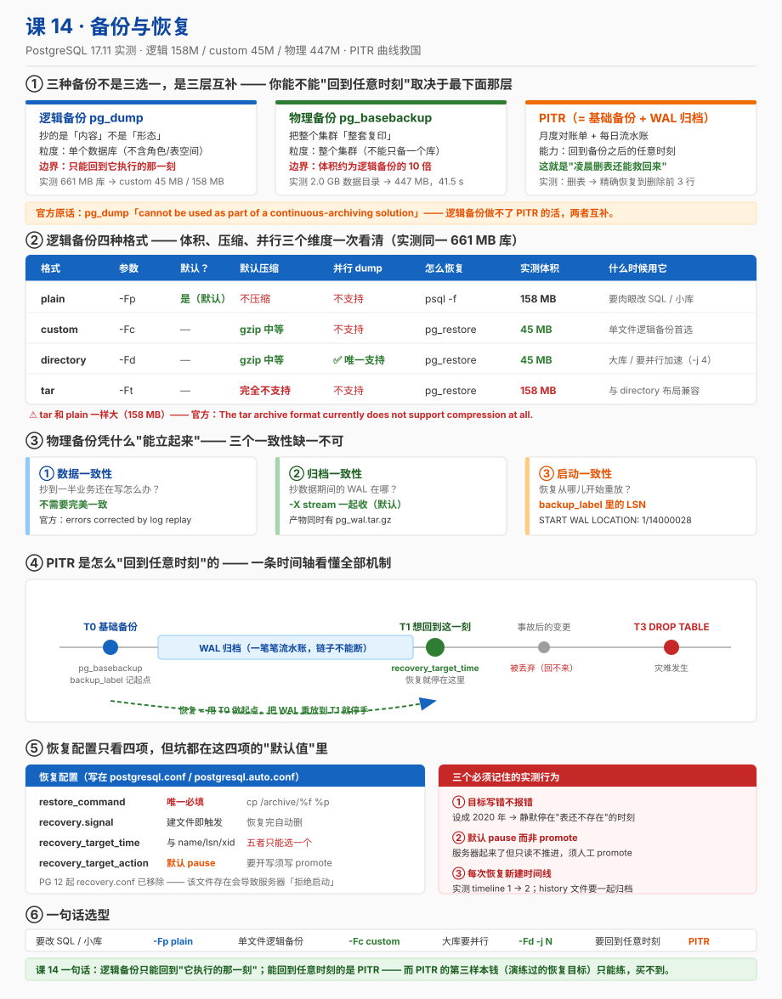

# 课 14 · 备份与恢复

> 📍 故事中的位置：硬盘坏了——主角差点消失，备份恢复把你从事故里捞出来

## 本课目标

学完本课后，你能：

1. 选对备份方式（逻辑 / 物理 / PITR），能说清各自的代价
2. 用 `pg_dump` / `pg_restore` 做逻辑备份并验证可恢复
3. 用 `pg_basebackup` 做物理备份并理解基于 WAL 的 PITR

## 知识点清单

| 知识点 | 关键点 |
|---|---|
| **14.1 pg_dump / pg_restore** | · `pg_dump` 三种格式（plain SQL / custom / directory） · `pg_dumpall`（备份全局对象：角色 / 表空间） · `pg_restore` 恢复命令 · 逻辑备份的代价（大库慢 / 不一致） |
| **14.2 物理备份（pg_basebackup）** | · `pg_basebackup` 的工作方式 · 备份的三个一致性（数据 / 归档 / 启动） · `tar` 格式 vs `plain` 格式 · 物理备份的恢复步骤 |
| **14.3 PITR（基于 WAL 归档）** | · `wal_level = replica` · `archive_mode` / `archive_command` · `recovery.conf`（PG 12+ 改 `postgresql.auto.conf`） · PITR 的实际演练（"删了表能恢复到删除前的任意时刻"） |

## 故事主线中的情节定位

这是故事的「**救生圈**」——业务上线第一天就该想好怎么备份。读者通过本课获得"出大事能救回来"的能力。

## 正文

> 本课所有输出均来自 **PostgreSQL 17.11**（Docker 容器 `pg17`，端口 5433）真实运行，脚本与原始输出归档在 [`labs/`](labs/)（含 `README.md` 脚本↔实验编号对照表）。

## 📌 知识点导航

| 知识点 | 一句话 | 关键实测数字 |
|---|---|---|
| [14.1 `pg_dump` / `pg_restore`](#一141-pg_dump--pg_restore) | 把库"导出成可重建的指令" | 661 MB 库 → plain 158M / custom **45M** / tar **158M（不压缩）** |
| [14.2 物理备份 `pg_basebackup`](#二142-物理备份pg_basebackup) | 把整个集群"整套复印" | 2.0 GB 数据目录 → **447 MB**，**41.5 s** |
| [14.3 PITR](#三143-pitr基于-wal-归档) | 基础备份 + WAL = 能回到任意时刻 | 删表后精确恢复到删除前，**timeline 1 → 2** |

## 第一幕 · 起源与场景引入

### 起源：备份这件事的三次进化

PostgreSQL 的备份能力不是一次设计出来的，而是被"库越来越大"这个现实一步步逼出来的（以下均为联网核实的历史事实，核查于 2026-09）：

| 时间 | 版本 | 发生了什么 | 为什么重要 |
|---|---|---|---|
| **2001-04** | PostgreSQL **7.1** | 引入 **WAL**（预写日志），但当时它**只是实现细节——不能读、不能归档**（Peter Eisentraut《The history of replication in PostgreSQL》）；同年 `pg_dump` 大改造（Philip Warner），**新增 tar 格式**并**新增 `pg_restore` 命令** | 备份第一次有了"归档文件"形态，而不只是一坨 SQL 文本 |
| **2005-01** | PostgreSQL **8.0** | 引入 **PITR（时间点恢复）**：可以把 WAL 拷到别处、之后回放，"全部回放或回放到某个时间点"。官方动机是**把 `pg_dump` 从备份重担下解放出来**——库一大，全量 dump 就不实际了 | 备份从"只能回到昨天"变成"能回到任意时刻" |
| **2011-09** | PostgreSQL **9.1** | 引入 **`pg_basebackup`** ——用一条普通的 libpq 连接把基础备份拉下来，不再需要 rsync 之类的外部工具与复杂的免密配置 | 物理备份从"手工 + 外部工具"变成数据库自带命令 |
| **2019-10** | PostgreSQL **12** | **`recovery.conf` 被移除**。官方原文：*`recovery.conf` is no longer used, and **the server will not start if that file exists***；改用 `postgresql.conf` + `recovery.signal` / `standby.signal` | 大量 12 之前的教程从这里开始失效 |
| **2024-09** | PostgreSQL **17** | `pg_basebackup` 支持 **`--incremental` 增量备份**，配合新命令 **`pg_combinebackup`** 合成（官方版本说明原文：*incremental backup (`--incremental`) only works with server version 17 and later*） | 物理备份第一次能"只备份变化的部分" |

一句话概括这条演进线：**先是能导出（pg_dump），再是能回到任意时刻（PITR），最后是备份本身也能变快（增量）**。

### 一个真实的工作场景

凌晨 2 点 47 分。值班的小林接到告警：订单列表页 500。

他连上库看了一眼，手一抖——本来要清掉测试数据的那条 SQL 写成了：

```sql
DROP TABLE finance.orders;      -- 少了 WHERE，多了 DROP
```

执行完的第 3 秒他就反应过来了。但表已经没了，`orders` 里是 300 万行正在被业务读写的订单。

此刻他只有两条路：

1. **拿昨天凌晨的全量备份盖回去** → 丢掉今天一整天的新订单（不可接受）；
2. **回到"删除前一刻"** → 只有一条路：**PITR**。

他还有 10 分钟就是早高峰。本课要回答的就是：**在平时把什么准备好，事故来的时候才能选第 2 条路。**

### 本课要回答的四个问题

1. 平时到底该做哪种备份？（逻辑 / 物理 / PITR 不是三选一）
2. `pg_dump` 导出来的四种格式，到底该选哪个？
3. `pg_basebackup` 备的是"什么"？它凭什么能保证一致？
4. PITR 的"能回到任意时刻"，机械上是怎么做到的？——以及**它在什么情况下会静默失败**？

## 第二幕 · 认知冲突

先把你脑子里几个"听起来很合理"的直觉推翻。这五个陷阱贯穿全课。

### 陷阱 1：「我有 `pg_dump` 定时任务，备份这事儿就搞定了」

官方把这件事说得很直接（PG 17 docs 25.3，核查于 2026-09）：

> `pg_dump` and `pg_dumpall` do not produce file-system-level backups and **cannot be used as part of a continuous-archiving solution**. Such dumps are *logical* and do not contain enough information to be used by WAL replay.

翻译：逻辑备份**只能回到它自己执行的那个时刻**。你有每天 3 点的 dump，那你的最坏情况就是**丢掉 24 小时**。

而第 2 幕场景里小林要的是"回到 5 分钟前"——这是逻辑备份**做不到**的事，不是"做得慢"。**这两种备份不是替代关系，是互补关系。**

### 陷阱 2：「备份做完了，任务显示成功，就是有备份了」

**没验证过的备份，等于没有备份。** 这句话在生产上有两个具体含义：

- 备份文件本身可能损坏（磁盘坏块、传输截断）；
- 备份"能解开"不等于"能恢复"——权限、表空间路径、扩展依赖都可能在恢复时才炸。

PG 17 给了一个专门的校验工具 `pg_verifybackup`，实测（实验 D-4）：

```text
$ pg_verifybackup /var/lib/postgresql/backup/unpacked
backup successfully verified
```

**注意它汇报的是"文件与清单一致"，不是"恢复后业务正确"。** 真正可信的验证只有一种：**定期真的恢复一遍**。本课第四幕的 PITR 演练就是这件事的完整版。

### 陷阱 3：「`tar` 格式能压缩，肯定比 plain 省空间」

这是最容易踩的直觉。实测（实验 A-1，同一个 661 MB 的库）：

| 格式 | 体积 |
|---|---|
| `-Fp` plain | 158 MB |
| `-Fc` custom | **45 MB** |
| `-Fd` directory | **45 MB** |
| `-Ft` tar | **158 MB** |

**tar 和 plain 一模一样大。** 官方原文：*The tar archive format currently does not support compression at all.*（`-Z` 对 tar 无效。）

真正压得动的是 **custom 和 directory**——它们默认就用 gzip 中等档压缩，实测 158 MB → 45 MB，**3.5 倍**。

### 陷阱 4：「恢复就是把备份盖回主库」

如果你在主库上做 PITR 恢复，**你是在用一个还没验证过的备份，覆盖掉一个还在运行的生产库**——这是把一次事故变成两次。

正确的姿势是：**在另一处恢复，验证无误后再切过去。** 本课实验 E 就是这么做的：

- 主库照常在 `5432`（容器内端口）上跑业务；
- 恢复实例起在 `5434`，用的是备份副本 `l14_backup` 的一份拷贝；
- 验证通过后，才由运维决定何时把流量切过去。

### 陷阱 5：「恢复目标时间写错，最多就是没恢复成功」

**这是本课最危险的一条。** 我们把 `recovery_target_time` 故意设成一个早于备份的荒谬时间（`2020-01-01`），实测结果（实验 E-12）：

```text
LOG:  starting point-in-time recovery to 2020-01-01 00:00:00+00
LOG:  recovery stopping before commit of transaction 2505, time 2026-09-10 15:41:45.029573+00
LOG:  pausing at the end of recovery
```

**它没报错，服务器起来了，还"启动成功"了。** 但你去查数据：

```sql
SELECT count(*) FROM finance.pitr_demo;
ERROR:  relation "finance.pitr_demo" does not exist
```

它停在了一个**比"建表"还早**的时刻——数据一点没救回来，而且**没有任何报错提醒你**。

两个原因叠加造成了这种"静默失败"：

1. 目标时间早于所有可用 WAL 记录时，PG 只能停在**最早可达的一致性点**；
2. `recovery_target_action` 的**默认值是 `pause`**（官方原文：*The default is `pause`, which means recovery will be paused*），而 `pause` 状态下服务器起来但**只读、不推进**。

**所以：恢复演练不是可选项，而是 PITR 的一部分。** 你必须在真正的灾难之前，就知道"恢复目标该怎么写、恢复出来对不对"。

## 第三幕 · 层层揭示

### （一）14.1 `pg_dump` / `pg_restore`

> **决策点标注**：本知识点含"格式怎么选"的决策，答案不唯一——见 ⑤ 误区 6 的判据。

#### ① 一句话定义

**`pg_dump` 把"数据库当前的样子"导出成一份可以重建它的文件；`pg_restore` 负责把这份文件（除 plain 外）重新灌回数据库。**

#### ② 直觉建立

**类比：抄账本 vs 复印账本。**

`pg_dump` 像是**把账本抄成一份"操作指令清单"**——"建一张这样的表""往里面插这些行"。它记录的是**内容**，不是**物理形态**。你把清单拿到任何一台 PG 上执行，都能得到内容相同的库。

`pg_basebackup`（14.2 讲）则像是**把账本整套复印**——连装订线、页码、边角折痕都一模一样。

**类比失效的边界**：抄账本会**丢失账本的物理历史**。`pg_dump` 恢复出来的表：

- 行是"新插入"的，所以 `ctid` 全新、`xmin` 全新（课 12 的 MVCC 视角）；
- 膨胀（膨胀的页、死元组）**被顺手清理掉了**——这也是为什么它常常比原库小得多（661 MB → 45 MB）；
- 索引是**重建**的，`pg_class.relfilenode` 不同。

这三点在"迁移到新机器"时是优点，在"法医级取证"时是缺点。

#### ③ 核心原理

**（a）四种格式：一张表看清全部差异**

| 格式 | 参数 | 默认？ | 默认压缩 | 支持 `-j` 并行 | 用 `pg_restore` 恢复？ | 典型用途 |
|---|---|---|---|---|---|---|
| plain | `-Fp` | ✅ **默认** | 不压缩 | ❌ | ❌（`psql -f`） | 小库、需要肉眼可读 / 手工改 SQL |
| custom | `-Fc` | | ✅ gzip 中等 | ❌ | ✅ | **单个备份文件的默认首选** |
| directory | `-Fd` | | ✅ gzip 中等 | ✅ **唯一** | ✅ | **大库、要并行加速** |
| tar | `-Ft` | | ❌ **完全不支持** | ❌ | ✅ | 与 directory 布局兼容，但压不了也并行不了 |

官方对 custom / directory 的评价（PG 17 docs app-pgdump，核查于 2026-09）：

> The most flexible output file formats are the "custom" format (`-Fc`) and the "directory" format (`-Fd`). They allow for selection and reordering of all archived items, support parallel restoration, and are compressed by default. **The "directory" format is the only format that supports parallel dumps.**

**（b）一致性：不阻塞、但"一致"是有条件的**

官方原文（同页）：

> `pg_dump` makes consistent backups even if the database is being used concurrently. `pg_dump` does not block other users accessing the database (readers or writers).

"不阻塞"是真的（它只拿 `ACCESS SHARE`，课 13 你已知道这与写不冲突）。但"一致"这件事有个坑，官方也写明了：

> To perform a parallel dump, the database server needs to support **synchronized snapshots**... `pg_dump -j` uses multiple database connections... Without the synchronized snapshot feature, the different worker jobs wouldn't be guaranteed to see the same data in each connection, **which could lead to an inconsistent backup**.

也就是说：**`-j` 一致性依赖 synchronized snapshots（PG 9.2+ 引入，从库上是 10+）**。这是"并行 dump 会不会导出一份互相矛盾的数据"的关键保障。

**（c）`pg_dump` 不管全局对象**

官方原文（同页）：

> `pg_dump` only dumps a single database. To back up an entire cluster, or to back up **global objects that are common to all databases in a cluster (such as roles and tablespaces)**, use `pg_dumpall`.

实测印证（实验 C）：

```text
$ grep -c 'CREATE ROLE' a_plain.sql
0                                    ← pg_dump 里根本没有角色定义
$ pg_dumpall -U postgres --globals-only | grep -c 'CREATE ROLE'
1                                    ← 只有 pg_dumpall 才有
```

**所以"完整备份一个集群"至少需要两条命令**：`pg_dumpall --globals-only`（角色/表空间）+ 对每个库 `pg_dump`。

**（d）退出码语义：默认"忍着把活干完"**

`pg_restore` 默认**不因为错误中止**，它会继续把整份归档跑完，最后汇总一句 `errors ignored on restore: N`；但**最终退出码仍为 1**。而 `-e/--exit-on-error` 是"遇到第一个错就停"。实测差别（实验 B-4）：

| 命令 | 报错条数 | 说明 |
|---|---|---|
| `pg_restore -d b_restored a_custom.dump` | **113** | 把整份归档跑完了 |
| `pg_restore -d b_restored -e a_custom.dump` | **1** | 第一个错误立刻停 |

**这个区别在自动化脚本里很重要**：不加 `-e`，你会跑完一个"报了一堆错、但退出码非 0"的过程；加 `-e`，你能拿到**第一条**错误的现场。

**（e）`-j` 并行的真实代价**

官方原文：*`pg_dump` will open `njobs` + 1 connections to the database, so make sure your `max_connections` setting is high enough*。

**`-j 4` 会开 5 个连接。** 在按连接数收费的云上，这不是免费的。

#### ④ 示例演示

**A. 四种格式跑一遍（实验 A-1）**

```bash
$ pg_dump -U postgres -d order_service -Fp -f a_plain.sql
$ pg_dump -U postgres -d order_service -Fc -f a_custom.dump
$ pg_dump -U postgres -d order_service -Fd -j 4 -f a_dir
$ pg_dump -U postgres -d order_service -Ft -f a_tar.tar

$ du -sh a_plain.sql a_custom.dump a_dir a_tar.tar
158M	a_plain.sql
45M	a_custom.dump
45M	a_dir
158M	a_tar.tar          ← tar 完全不压缩，与 plain 一样大
```

（源库大小：`661 MB`；`finance` schema 共 24 张表。）

**B. 看一眼每种格式"长什么样"（实验 A-2）**

plain 的头部——注意第 5 行那个 `\restrict`，这是 **PG 17 的新特性**（`--restrict-key`，默认会生成一个随机键）：

```sql
$ head -14 a_plain.sql
--
-- PostgreSQL database dump
--

\restrict 9js9DH7fDw56F5mgiu4jwNdUisOUpgqiZB3ahMXCelKwpkP0yvpciSVVcHIos2k

-- Dumped from database version 17.11 (Debian 17.11-1.pgdg13+2)
-- Dumped by pg_dump version 17.11 (Debian 17.11-1.pgdg13+2)

SET statement_timeout = 0;
...
```

数据是怎么装进去的？plain 用的是 `COPY ... FROM stdin`（比一行一条 `INSERT` 快得多）：

```sql
$ grep -n "^COPY " a_plain.sql | head -3
702:COPY finance.accounts (id, owner, balance) FROM stdin;
713:COPY finance.accounts_t (id, owner, balance) FROM stdin;
723:COPY finance.big_orders (oid, uid, amount, status) FROM stdin;
$ grep -c "^COPY " a_plain.sql
24                                    ← 24 张表 = 24 条 COPY
```

custom 是**二进制**（开头是 `PGDMP` 魔数）：

```text
$ head -c 48 a_custom.dump | od -c | head -2
0000000   P   G   D   M   P 001 020  \0 004  \b 001 001  \0 002  \0  \0
```

directory 是**"一表一文件"的 gz 集合**：

```text
$ ls -la a_dir/ | head -8
-rw-r--r-- 1 root root      178 3718.dat.gz
-rw-r--r-- 1 root root 11680366 3727.dat.gz      ← 大表各自一个文件
-rw-r--r-- 1 root root 12162017 3731.dat.gz
...
$ ls a_dir | wc -l
25                                    ← 24 张表 + 1 个 toc.dat
```

tar 里则是 `toc.dat` + 各表 `.dat`：

```text
$ tar -tf a_tar.tar | head -4
toc.dat
3751.dat
3746.dat
3736.dat
```

**C. `pg_restore` 读不了 plain（实验 B-1）**

```text
$ pg_restore -l a_plain.sql
pg_restore: error: input file appears to be a text format dump. Please use psql.
```

**记住这条分配**：plain → 用 `psql -f`；另外三种 → 用 `pg_restore`。

**D. 完整恢复到一个新库（实验 B-3）**

```bash
$ createdb -U postgres -T template0 b_restored     # 从 template0 保证是干净空库
$ time pg_restore -U postgres -d b_restored -j 4 a_dir
real	0m4.118s
```

验证（这才是"恢复成功"的证据，不是命令退出码）：

```sql
SELECT 'orders_big='||count(*) FROM finance.orders_big;   -- orders_big=1000000
SELECT 'accounts='||count(*)   FROM finance.accounts;      -- accounts=3
SELECT 'tables='||count(*)     FROM pg_tables WHERE schemaname='finance';  -- tables=24
SELECT 'db_size='||pg_size_pretty(pg_database_size('b_restored'));  -- db_size=656 MB
```

**24 张表、100 万行校验全部通过，耗时 4.1 秒。**

**E. `-t` 单表恢复的真实坑（实验 B-2）**

```text
$ pg_restore -U postgres -d b_single -n finance -t accounts a_custom.dump
pg_restore: error: could not execute query: ERROR:  schema "finance" does not exist
Command was: COPY finance.accounts (id, owner, balance) FROM stdin;
pg_restore: warning: errors ignored on restore: 3
```

官方早就警告过（PG 17 docs app-pgrestore，核查于 2026-09）：

> When `-t` is specified, **`pg_restore` makes no attempt to restore any other database objects that the selected table(s) might depend upon.** Therefore, there is no guarantee that a specific-table restore into a clean database will succeed.

**`-n finance -t accounts` 看着像"把 finance schema 里的 accounts 表恢复出来"，实际是"只恢复 accounts 表本身，schema 不给你建"。** 正确做法是先 `-s`（建结构）再 `-t`，或者手动先 `CREATE SCHEMA`。

**F. `--schema-only` / `--data-only`（实验 B-7）**

```text
$ pg_restore -d b_schema -s a_custom.dump     # 只结构
[schema-only] accounts 行数: 0
$ pg_restore -d b_schema -a a_custom.dump     # 只数据
[先 -s 再 -a] accounts 行数: 3
```

补数据时还顺带撞见一个真实警告（外键 + 装载顺序）：

```text
DETAIL:  Key (user_id)=(2) is not present in table "users".
pg_restore: warning: errors ignored on restore: 1
```

`--data-only` **不保证按外键顺序装载数据**。单表恢复还好，跨表恢复要留意这类警告。

#### ⑤ 常见误区

**误区 1：以为「有 `pg_dump` 就等于有备份了」。** 逻辑备份**只能回到 dump 那一刻**，官方明确它**不能**作为连续归档方案。要"回到任意时刻"必须上 PITR。

**误区 2：以为 `pg_dump` 会锁表、影响业务。** 官方：*does not block other users accessing the database (readers or writers)*。它拿的是 `ACCESS SHARE`（课 13 的表级锁矩阵：这个模式与一切写不冲突）。**真正会被 dump 拖慢的是磁盘 IO，不是锁。**

**误区 3：以为 `-j` 什么格式都能用。** 只有 **directory** 支持并行转储（官方原文）；并行**恢复**则 custom / directory 都行。而且 `-j N` 会开 **N+1** 个连接。

**误区 4：以为 `pg_dump` 备份了"整个服务器"。** 它只备**一个库**，且**不含角色、表空间**等全局对象（实测 `CREATE ROLE` 出现 0 次）。完整的集群迁移 = `pg_dumpall --globals-only` + 逐库 `pg_dump`。

**误区 5：以为 `pg_restore` 失败了会停下来报错。** 实测：报 113 个错还继续跑完，退出码才是 1。**自动化脚本务必显式判退出码，需要"第一条错误"就加 `-e`。**

**误区 6：以为格式选择只看"哪个小"。** 判据其实是四条：**要不要肉眼可读改 SQL**（→ plain）、**要不要单文件好传**（→ custom）、**要不要并行**（→ directory）、**要不要跨版本兼容**（tar 与 directory 布局兼容）。**"体积最小"这件事 custom 和 directory 是并列的**，不构成区分理由。

#### ⑥ 一句话记住

> **`pg_dump` 抄的是"内容"不是"形态"，所以它又小又快又不锁表，代价是只能回到它执行的那一刻；要选格式就记三条——单文件要改选 plain，图省心地小选 custom，图快选 directory（唯一能并行）。**

#### 命令速查卡 · 逻辑备份

```sql
-- ① 备份：四种格式
pg_dump -Fp                       -f db.sql   dbname   -- plain（默认，psql -f 执行）
pg_dump -Fc                       -f db.dump  dbname   -- custom（单文件，默认 gzip）
pg_dump -Fd -j 4                  -f db_dir   dbname   -- directory（唯一支持并行）
pg_dump -Ft                       -f db.tar   dbname   -- tar（不压缩、不并行）

-- 按需选压缩算法（custom/directory 默认 gzip）
pg_dump -Fc -Z zstd:9 -f db.dump dbname
pg_dump -Fc -Z lz4    -f db.dump dbname

-- ② 全局对象（pg_dump 不管角色/表空间）
pg_dumpall --globals-only  -f globals.sql        -- 角色 + 表空间
pg_dumpall --roles-only    -f roles.sql          -- 只角色

-- ③ 恢复
psql      -f db.sql                     dbname   -- plain 只能这样恢复
pg_restore -d dbname  db.dump                    -- 直接连库恢复
pg_restore -d dbname -j 4 db_dir                 -- 并行恢复（custom/directory）
pg_restore -d dbname --clean --if-exists db.dump -- 覆盖已有对象不报错
pg_restore -d dbname -e db.dump                  -- 第一个错误就停
pg_restore -l db.dump                            -- 看目录（TOC）
pg_restore -l db.dump > list.txt                 -- 导出目录，手改后再用 -L 指定

-- ④ 部分恢复
pg_restore -d dbname -s          db.dump         -- 只结构
pg_restore -d dbname -a          db.dump         -- 只数据
pg_restore -d dbname -n finance -t accounts db.dump   -- ⚠️ 不自动建 schema

-- ⑤ 恢复前先建一个干净空库（从 template0，避免带进 template1 的本地对象）
createdb -U postgres -T template0 newdb
```

#### 📚 官方文档（PG 17，核查于 2026-09）

- [`pg_dump`](https://www.postgresql.org/docs/17/app-pgdump.html) —— 四种格式、`-j` 限制、压缩选项、一致性保证
- [`pg_restore`](https://www.postgresql.org/docs/17/app-pgrestore.html) —— `-l` / `-L` / `-e` / `--clean --if-exists` / `-t` 的依赖警告
- [`pg_dumpall`](https://www.postgresql.org/docs/17/app-pg-dumpall.html) —— `--globals-only` / `--roles-only`

### （二）14.2 物理备份（`pg_basebackup`）

#### ① 一句话定义

**`pg_basebackup` 把整个数据库集群的数据目录"成套复制"一份物理备份，并在复制期间自动保证这份副本可以被 WAL 回放成一致的库。**

#### ② 直觉建立

**类比：给整个办公室拍一张"带时间戳的全景照"。**

逻辑备份是"抄一遍文件柜里的文件内容"；物理备份是"把整个办公室（含文件柜、便签、白板）整套复制一份"。

**类比失效的边界**（三条，都实测过）：

1. **不能只复制一个库**——官方原文：*It always backs up the whole database cluster*。你想只备份 `order_service`，只能走 `pg_dump`。
2. **副本必须配 WAL 才能用**——单独一份数据目录副本是"不一致的"（相当于断电瞬间的现场），要靠备份期间同步收下的 WAL 才能真正立起来。
3. **"完整复制"不代表"复制得整齐"**——官方明说它**不要求**文件系统级的一致性：

   > We do not need a perfectly consistent file system backup as the starting point. **Any internal inconsistency in the backup will be corrected by log replay** (this is not significantly different from what happens during crash recovery).

   这就是为什么它只需 `tar` 这种归档工具、而不需要文件系统快照能力。

#### ③ 核心原理

**（a）它怎么工作**

- 走的是**复制协议连接**（不是普通 SQL 连接）：需要 `REPLICATION` 权限或超级用户，且 `pg_hba.conf` 要允许复制连接；
- 服务器要配 `max_wal_senders`（本机实测 `10`，足够）；
- 它会**自动让服务器进入和退出备份模式**——你不用再手工敲 `pg_start_backup()`。

**（b）"三个一致性"——这是本知识点最重要的一张表**

物理备份能不能用，取决于三件事同时成立：

| # | 一致性 | 问的问题 | 靠什么保证 | 本课实测证据 |
|---|---|---|---|---|
| 1 | **数据一致性** | 数据目录抄了一半时业务还在写，抄出来的不是"四不像"吗？ | **不要求**——不完整的地方由 WAL 回放补齐（官方：*corrected by log replay*） | 恢复实例起来后 `consistent recovery state reached` |
| 2 | **归档一致性** | 抄数据期间产生的那批 WAL 在哪？ | `-X stream`（**默认**）或 `-X fetch` 把 WAL 一起收进来；`-X none` 就要自己保证有归档 | 产物里同时有 `base.tar.gz` 与 `pg_wal.tar.gz` |
| 3 | **启动一致性** | 恢复时怎么知道"从哪开始重放"？ | 备份里写入的 **`backup_label`**（记录 START/CHECKPOINT LSN 与时间线） | 实测 `backup_label`：`START WAL LOCATION: 1/14000028` |

`backup_label` 实测内容：

```text
$ cat unpacked/backup_label
START WAL LOCATION: 1/14000028 (file 000000010000000100000014)
CHECKPOINT LOCATION: 1/14000080
BACKUP METHOD: streamed
BACKUP FROM: primary
START TIME: 2026-09-10 15:39:57 UTC
LABEL: pg_basebackup base backup
START TIMELINE: 1
```

**这三个 LSN 就是 14.3 PITR 的"起点"**——后面你会看到恢复日志里出现的 `redo starts at 1/17000028` 正是同一类东西。

**（c）关键参数矩阵**

| 参数 | 取值 | 默认 | 说明 |
|---|---|---|---|
| `-F` / `--format` | `p`(plain) / `t`(tar) | **plain** | plain 直接落成数据目录；tar 落成 `base.tar` + 各表空间 tar |
| `-X` / `--wal-method` | `n` / `f`(fetch) / `s`(stream) | **stream** | stream 会额外开**第二个**复制连接 |
| `-z` / `--compress` | 算法[:级别] | 无 | **仅 tar 格式有意义**（plain 是目录，没法压成单包） |
| `--target` | `client` / `server:/path` / `blackhole` | client | **不能与 `-X stream` 同用**（因 WAL 流由客户端实现） |
| `-R` / `--write-recovery-conf` | — | 关 | 写 `standby.signal` 并把连接串追加进 `postgresql.auto.conf`（搭从库用） |
| `-C` / `-S slot` | — | — | `-C` 创建复制槽、`-S` 指定槽名；**只能配 `-X stream`** |
| `--manifest-checksums` | `NONE`/`CRC32C`/`SHA256`… | **CRC32C** | 备份清单的每文件校验算法 |

**（d）备份清单与校验：`backup_manifest` + `pg_verifybackup`**

PG 13+ 的 `pg_basebackup` 默认产出一份 `backup_manifest`（JSON），逐个文件记录大小、时间与校验和。实测：

```text
$ head -c 200 backup_manifest
{ "PostgreSQL-Backup-Manifest-Version": 2,
"System-Identifier": 7682798685620764710,
"Files": [
{ "Path": "backup_label", "Size": 227, ... "Checksum-Algorithm": "CRC32C", "Checksum": "c81cd87c" },
...
$ grep -o '"Path"' backup_manifest | wc -l
2633                                   ← 2633 个文件进入清单
```

然后用 `pg_verifybackup` 校验：

```text
$ pg_verifybackup /var/lib/postgresql/backup/unpacked
backup successfully verified
```

**注意一个实测踩到的坑**：`pg_verifybackup` **不能**直接对 tar 备份的目录跑——

```text
$ pg_verifybackup /var/lib/postgresql/backup/base      # 这是 tar 产物所在目录
pg_verifybackup: error: "base/25560/26361" is present in the manifest but not on disk
pg_verifybackup: error: could not open directory ".../base/pg_wal": No such file or directory
pg_verifybackup: error: WAL parsing failed for timeline 1
```

因为 tar 是**压缩包**，清单里的"文件"当然不在磁盘上。**必须先 `tar -xzf` 解包（并把 `backup_manifest` 一并放进解包目录）再校验。**

**（e）PG 17 新增：增量备份**

```bash
pg_basebackup --incremental=/path/to/older/backup_manifest -D /path/to/new_incremental
pg_combinebackup /path/to/full  /path/to/incr  -o /path/to/combined
```

官方版本说明原文：*incremental backup (`--incremental`) only works with server version 17 and later*。

机制是：拿上一次备份的清单，让服务器**只发送发生过变化的块**。**增量备份不能直接用**，必须先用 `pg_combinebackup` 与它所依赖的前序备份合成一个完整备份——再走 14.3 的恢复流程。

**（f）物理备份的恢复步骤（官方 25.3.5 十步压缩版）**

```text
① 停掉要恢复的服务器
② 把数据目录（与表空间）备份成一个临时副本 —— 留退路
③ 清空目标数据目录
④ 把基础备份的文件放回去（属主必须是数据库系统用户，不是 root！）
   └ 若用的是增量备份，先用 pg_combinebackup 与所有前序备份合成
⑤ 清掉 pg_wal/ 里"从当前集群带过来的" WAL
   └ 备份自己带来的 WAL（pg_basebackup 产出的）要保留
⑥ 写恢复配置 + 建 recovery.signal（PG 12+ 的写法）
⑦ 启动。恢复完成后 recovery.signal 会被自动删除，转入正常运行
⑧ 核对数据
```

#### ④ 示例演示

**A. 全量物理备份（实验 D-1，tar + gzip）**

```bash
$ psql -U postgres -c "CHECKPOINT;"        # 先清脏页，缩短 backup start 的等待
$ time pg_basebackup -U postgres -D /var/lib/postgresql/backup/base -Ft -z -P
2111657/2111657 kB (100%), 1/1 tablespace

real	0m41.531s
```

产物：

```text
$ ls -la /var/lib/postgresql/backup/base/
-rw------- 1 root root   381356 backup_manifest
-rw------- 1 root root 467790490 base.tar.gz       ← 446 MB
-rw------- 1 root root     17109 pg_wal.tar.gz     ← 17 KB
```

**三个数字要记住**：

| 项 | 值 |
|---|---|
| 数据目录总大小 | **2,111,657 kB ≈ 2.0 GB** |
| tar.gz 产物 | **447 MB** |
| 耗时 | **41.5 s** |

**B. 物理 vs 逻辑的体积对照（这才是选型的依据）**

| 备份方式 | 产物体积 | 相对源库 |
|---|---|---|
| 逻辑 custom（压缩） | 45 MB | 最小 |
| 逻辑 plain | 158 MB | 中 |
| **物理 tar.gz** | **447 MB** | **最大** |
| 源数据目录 | 3.0 GB | — |

**物理备份的体积通常是逻辑备份的 10 倍左右**——因为它把索引、膨胀空间、`pg_wal`、以及**其他库**（`postgres` / `template*` 的目录）全部包含在内。官方也承认这点：*They are also much larger than `pg_dump` dumps, so in some cases the speed advantage might be negated.*

**代价换来的是能力**：只有物理备份能作为 PITR 的起点。

#### ⑤ 常见误区

**误区 1：以为可以用 `cp -r` 直接复制数据目录当备份。** 运行中的 `cp` 复制出来的目录**内部不一致**（缺 WAL 收尾），直接拿来启动可能起不来或数据错乱。要么停库再拷，要么用 `pg_basebackup` 自动处理这一致性。

**误区 2：以为 `pg_basebackup` 能只备份一个库。** 官方：*It always backs up the whole database cluster*。库级粒度只能走 `pg_dump`。

**误区 3：以为 tar 格式能压缩。** 官方原文：*The tar archive format currently does not support compression at all.*。`-z` 对 tar 才有意义是因为 tar 是单包；**directory / plain 是目录结构，`-z` 无从谈起**（custom 有自己的内建压缩）。

**误区 4：以为要手工敲 `pg_start_backup()` / `pg_stop_backup()`。** `pg_basebackup` 会自动进入/退出备份模式。**手工那套是"低层文件系统备份"的做法**（官方 25.3.2 节），跟 pg_basebackup 是两条路。另注：这两个函数在 **PG 15 已改名**为 `pg_backup_start()` / `pg_backup_stop()`。

**误区 5：以为 `pg_verifybackup` 能校验任何形态的备份。** 实测：对 **tar 产物目录**直接跑会报 *is present in the manifest but not on disk*。要先解包。而且它只验证"文件 vs 清单"，**不验证"这份备份能不能恢复出正确的数据"**。

**误区 6：以为增量备份（PG 17）可以直接用。** 不能。官方：增量备份必须先由 `pg_combinebackup` 与**它所依赖的完整备份链**合成才能恢复。而且 `--incremental` **只支持 server 17+**，混用旧版本会直接失败。

#### ⑥ 一句话记住

> **`pg_basebackup` 的产物是"一份需要配 WAL 才能立起来的现场照"：数据可以不一致（WAL 会补），但 WAL 必须一起收、`backup_label` 必须在——而它的代价是体积约等于逻辑备份的 10 倍。**

#### 命令速查卡 · 物理备份

```sql
-- ① 全量物理备份（最常用：tar + gzip，WAL 流式）
pg_basebackup -D /backup/base -Ft -z -P

-- plain 格式（直接是数据目录，便于立即拿去恢复）
pg_basebackup -D /backup/base -Fp -X stream -c fast

-- 压缩算法（PG 15+ 新语法；仅 tar 格式）
pg_basebackup -D /backup/base -Ft --compress=gzip:9
pg_basebackup -D /backup/base -Ft --compress=zstd:9

-- 用复制槽（避免备份期间 WAL 被删）
pg_basebackup -D /backup/base -Ft -z -C -S my_slot
pg_basebackup -D /backup/base -Ft -z --no-slot      -- 无空闲槽时退让

-- 搭从库用（写 standby.signal + 连接串）
pg_basebackup -D /var/lib/pg/data -Fp -R -X stream

-- 备份到服务器本地路径（不能与 -X stream 同用）
pg_basebackup --target=server:/backup/base -Ft -X fetch

-- ② PG 17 增量备份
pg_basebackup --incremental=/path/older/backup_manifest -D /backup/incr
pg_combinebackup /backup/full /backup/incr -o /backup/combined

-- ③ 校验（必须对「解包后」的目录，manifest 要在目录里）
tar -xzf base.tar.gz -C unpacked/
tar -xzf pg_wal.tar.gz -C unpacked/pg_wal/
cp backup_manifest unpacked/
pg_verifybackup unpacked            -- backup successfully verified

-- ④ 查看备份元信息
cat unpacked/backup_label           -- START/CHECKPOINT LSN、时间线、备份方式
head -c 200 base/backup_manifest    -- 清单版本、System-Identifier

-- ⑤ 恢复前必备确认
psql -c "SHOW max_wal_senders;"     -- 至少能提供一个 walsender
psql -c "SELECT * FROM pg_hba_conf;" -- local replication 必须允许（用 pg_hba_file_rules 查）
SELECT * FROM pg_hba_file_rules WHERE type='local';
```

#### 📚 官方文档（PG 17，核查于 2026-09）

- [`pg_basebackup`](https://www.postgresql.org/docs/17/app-pgbasebackup.html) —— 格式 / WAL 方法 / `--target` 限制 / 17 增量备份
- [Backup and Restore](https://www.postgresql.org/docs/17/backup.html) —— 备份方式总览与选型
- [`pg_verifybackup`](https://www.postgresql.org/docs/17/app-pgverifybackup.html) —— 清单校验
- [`pg_combinebackup`](https://www.postgresql.org/docs/17/app-pgcombinebackup.html) —— 增量备份合成

### （三）14.3 PITR（基于 WAL 归档）

#### ① 一句话定义

**PITR（Point-In-Time Recovery）= 一份基础备份 + 从备份结束到目标时刻的全部 WAL ⇒ 可以把集群恢复到"备份之后、归档范围内的任意一个时刻"。**

#### ② 直觉建立

**类比：月度对账单 + 每日流水账。**

- **基础备份** = 每月 1 号打印一份"账户余额对账单"（这份很重要、也很贵）；
- **WAL 归档** = 之后每一天的流水账（很轻、几乎没成本）；
- **恢复** = 拿对账单做起点，把流水一笔笔重放，**重放到你想要的那一天就停手**。

于是你就能回答那个救命的问题：**"上周三下午 3 点 07 分，我的订单表长什么样？"**

**类比失效的边界（关键）**：**流水账一旦断链，这中间的时间就永远回不去了。**

如果你某天的流水账没记上（归档失败、归档命令写错、磁盘满了），那么"对账单 + 后续流水"这个链条就断了——你只能恢复到断点之前。这也是官方那句建议的来由：

> you should set up and test your procedure for archiving WAL files **before** you take your first base backup.

#### ③ 核心原理

**（a）三个参数的联动关系**

```text
wal_level  ──必须是 replica 或更高──┐
                                    ├──→ 才能开 archive_mode
archive_mode = on ──────────────────┘
       │
       └──→ 才会把"写满的 WAL 段"交给 archive_command

archive_command = '... %p ... %f ...'   ← 真正干活的一句 shell
```

实测参数默认值（本机 PG 17.11）：

| 参数 | 默认值 | 能否 reload | 说明 |
|---|---|---|---|
| `wal_level` | `replica` ✅ | ❌ 需重启 | PG 17 默认就是 replica，**开箱支持归档** |
| `archive_mode` | `off` | ❌ **需重启** | 取值 `off` / `on` / `always` |
| `archive_command` | 空字符串 | ✅ 可 reload | 空着 = 暂时不归档，但仍**持续堆积 WAL** |
| `archive_timeout` | `0` | ✅ 可 reload | 官方建议 1 分钟左右；太小会把归档目录吹大 |
| `max_wal_senders` | `10` | ❌ 需重启 | |
| `full_page_writes` | `on` ✅ | ❌ 需重启 | 从库做备份的前提 |

`archive_mode` 的 `on` vs `always`（官方原文）：

> During normal operation, there is no difference between the two modes, but when set to `always` the WAL archiver is enabled also during archive recovery or standby mode.

**`always` 是为"从库也要归档"的场景准备的**——本机实验用 `on` 就够。

`archive_command` 的**退出码契约**（官方原文，非常容易忽视）：

> It is important that the archive command **return zero exit status if and only if it succeeds**. Upon getting a zero result, PostgreSQL will assume that the file has been successfully archived, and will remove or recycle it. However, a nonzero status tells PostgreSQL that the file was not archived; it will try again periodically until it succeeds.

还有一条防覆盖规则：

> Archive commands and libraries should generally be designed to **refuse to overwrite any pre-existing archive file**.

所以官方示例与本文实验都用这个形式（先测存在再拷）：

```bash
archive_command = 'test ! -f /mnt/server/archivedir/%f && cp %p /mnt/server/archivedir/%f'
```

⚠️ **反面教材**：把 `archive_command` 设成 `/bin/true` —— 官方点名批评：

> Setting `archive_command` to a command that does nothing but return true, e.g., `/bin/true` ... effectively disables archiving, but also **breaks the chain of WAL files needed for archive recovery**.

**归档"看起来成功"，实际上你的 PITR 能力已经废了。** 这是最隐蔽的一种备份故障。

**（b）恢复侧：PG 12 之后怎么写**

官方恢复流程（节选，PG 17 docs 25.3.5，核查于 2026-09）：

> Set recovery configuration settings in `postgresql.conf` and create a file `recovery.signal` in the cluster data directory.

```text
改配置  →  recovery 参数写进 postgresql.conf（或 postgresql.auto.conf）
放信号  →  在数据目录建 recovery.signal 文件
启动    →  服务器进入恢复模式，回放 WAL
完成    →  服务器自动删除 recovery.signal，转入正常读写
```

**两个信号文件的区别**（官方原文）：

> To start the server in **standby mode**, create a file called `standby.signal`... To start the server in **targeted recovery mode**, create a file called `recovery.signal`. **If both `standby.signal` and `recovery.signal` files are created, standby mode takes precedence.**

| 信号文件 | 用途 | 行为 |
|---|---|---|
| `recovery.signal` | **PITR**（本课） | 回放完归档 WAL 或到达 target 就结束 |
| `standby.signal` | **搭从库**（课 15） | 不停在"归档结束"，持续连主库拉新 WAL |
| 两个都在 | — | **standby 优先** |

⚠️ **骨架勘误（本课第 1 处）**：骨架写「`recovery.conf`（PG 12+ 改 `postgresql.auto.conf`）」。**准确说法是"移进 `postgresql.conf`"**。`postgresql.auto.conf` 只是 `ALTER SYSTEM` 与 `pg_basebackup -R` 的落点之一，两者都可能承载恢复参数（本文实验就写在 `postgresql.auto.conf` 里，因为它天然是"机器生成的、追加式"的文件，适合演练脚本）。要点在**"不再有 recovery.conf 这个文件"**，而不在"改到了哪个文件"。

更狠的一条是 PG 12 官方版本说明的原文：

> `recovery.conf` is no longer used, and **the server will not start if that file exists**.

**不是"忽略它"，是"启动直接失败"。** 从 PG 11 升到 12 时，运维如果留着旧的 `recovery.conf`，升级后库起不来。

**（c）`restore_command` 是唯一必填项**

官方原文：

> The one thing that you absolutely must specify is the `restore_command`, which tells PostgreSQL how to retrieve archived WAL file segments.

```bash
restore_command = 'cp /mnt/server/archivedir/%f %p'
```

`%f` 是归档里的文件名，`%p` 是服务器要写入的路径。官方对它的失败语义说得很清楚：

> It is important that the command return **nonzero exit status on failure**. The command *will* be called requesting files that are not present in the archive; it must return nonzero when so asked. **This is not an error condition.**

所以恢复日志里出现 `file not found` 是**正常的**——它表示"归档里没有下一段了，恢复该结束了"。这也是很多人第一次做 PITR 时被吓到的地方。

**（d）`recovery_target` 家族全表**

| 参数 | 取值 | 默认 | 怎么用 |
|---|---|---|---|
| `recovery_target` | 只允许 `'immediate'` | 未设（= 恢复到 WAL 末尾） | 恢复到"备份结束的一致点"就停 |
| `recovery_target_name` | 命名恢复点 | — | 配合 `pg_create_restore_point('名字')`，**最精确** |
| `recovery_target_time` | timestamp | — | 常用，**但要小心第 2 幕陷阱 5** |
| `recovery_target_xid` | 事务 ID | — | 官方提示：事务 ID 顺序 ≠ 提交顺序，实际不好用 |
| `recovery_target_lsn` | `pg_lsn` | — | 按 WAL 位置停 |
| `recovery_target_inclusive` | `on` / `off` | **`on`** | `on` = 包含恰好命中目标的事务 |
| `recovery_target_timeline` | 数字 / `current` / `latest` | **`latest`** | 沿哪条时间线恢复 |
| `recovery_target_action` | `pause` / `promote` / `shutdown` | **`pause`** | 到达目标后干什么 |

三条硬约束（官方原文）：

1. *At most one of `recovery_target`, `recovery_target_lsn`, `recovery_target_name`, `recovery_target_time`, or `recovery_target_xid` can be used* —— **五个里最多只能设一个**，设两个会直接报错；
2. 这些参数**只能在服务器启动时设置**（`server start` 级）；
3. *The stop point must be after the ending time of the base backup* —— **不能恢复到"备份还在进行中"的那一刻**。

**`recovery_target_action` 默认 `pause` 这一点，是本课实测踩到的最大的坑**——见陷阱 5 与第四幕实验 E-12。

**（e）时间线（timeline）：为什么恢复完 ID 会变**

官方用"时间旅行 / 平行宇宙"来打比方——非常贴切：

> The ability to restore the database to a previous point in time creates some complexities that are akin to science-fiction stories about time travel and parallel universes.

你把库恢复到周二 15:00（"新历史"），然后**继续在上面跑业务**（产生了新的 WAL）。此时"旧历史"里 15:00 之后的那批 WAL 还在归档目录里。**如果新老 WAL 用同一套编号，它们会互相覆盖。**

PostgreSQL 的解法是**时间线**：

> Whenever an archive recovery completes, a new timeline is created to identify the series of WAL records generated after that recovery. The timeline ID number is part of WAL segment file names.

实测印证（实验 E-10）：

```sql
SELECT timeline_id FROM pg_control_checkpoint();       -- 主库(5433): 1
SELECT timeline_id FROM pg_control_checkpoint();       -- 恢复实例(5434): 2
```

每次恢复完成都会新增一条时间线，并生成一个 **timeline history 文件**（记录"这条线从哪条线、什么时刻分叉出来"）。官方要求把它**和 WAL 一起归档**：

> These history files are necessary to allow the system to pick the right WAL segment files when recovering from an archive that contains multiple timelines. Therefore, they are archived into the WAL archive area just like WAL segment files.

**恢复时如果没把 history 文件放进归档目录，就会挑错 WAL（或多时间线场景直接失败）。**

**（f）监控归档是否真的在工作**

```sql
SELECT archived_count, failed_count, last_archived_wal, last_failed_wal FROM pg_stat_archiver;
```

实测：

```text
 archived_count | failed_count |    last_archived_wal
----------------+--------------+-------------------------
              5 |            0 | 000000010000000100000017
```

**`failed_count` 长期不为 0 = 你的 PITR 能力正在静默腐烂。** 这个视图应该是监控面板的常客。

#### ④ 示例演示（完整演练）

以下是第四幕实验 E 的完整过程，**每一步都有真实输出**。"凌晨 2 点删表"那个场景，我们真的复现了一遍。

**E-1. 拍基础备份（plain 格式，产物直接就是数据目录）**

```text
$ time pg_basebackup -U postgres -D l14_backup -Fp -X stream -c fast
real	0m3.848s
$ du -sh l14_backup
2.1G	l14_backup
```

**E-2. 写入 3 行"事故前"的数据**

```sql
CREATE TABLE finance.pitr_demo (id int PRIMARY KEY, note text, created timestamptz DEFAULT clock_timestamp());
INSERT INTO finance.pitr_demo (id, note) VALUES (1,'事故前-A'),(2,'事故前-B'),(3,'事故前-C');
```

```text
 id |   note   |            created
----+----------+-------------------------------
  1 | 事故前-A | 2026-09-10 15:41:45.030598+00
  2 | 事故前-B | 2026-09-10 15:41:45.030682+00
  3 | 事故前-C | 2026-09-10 15:41:45.030684+00
```

**E-3. 记录恢复目标 T1，并建一个命名恢复点（双保险）**

```text
T1 = 2026-09-10 15:41:45.059928+00
$ SELECT pg_create_restore_point('before_accident');
 pg_create_restore_point
-------------------------
 1/1802A640
```

**E-4. 事故之后又写入一行（这行不该被恢复回来）**

```text
INSERT 0 1
当前行数: 4
```

**E-5. 灾难发生——误删表**

```text
$ DROP TABLE finance.pitr_demo;
DROP TABLE
$ SELECT * FROM finance.pitr_demo;
ERROR:  relation "finance.pitr_demo" does not exist
```

**E-6 ~ E-9. 恢复：复制备份 → 写恢复配置 → 起恢复实例**

```bash
cp -a l14_backup restore && chown -R postgres:postgres restore

cat >> restore/postgresql.auto.conf <<'EOF'
restore_command = 'cp /var/lib/postgresql/archive/%f %p'
recovery_target_time = '2026-09-10 15:41:45.059928+00'
recovery_target_action = 'promote'
port = 5434
archive_mode = off
EOF
touch restore/recovery.signal
su postgres -c "pg_ctl -D /var/lib/postgresql/restore -l /tmp/restore.log -w start"
```

```text
waiting for server to start.... done
server started
/var/run/postgresql:5434 - accepting connections
```

**E-10. 恢复结果——这就是"救回来"的样子**

```text
 id |   note   |            created
----+----------+-------------------------------
  1 | 事故前-A | 2026-09-10 15:41:45.030598+00
  2 | 事故前-B | 2026-09-10 15:41:45.030682+00
  3 | 事故前-C | 2026-09-10 15:41:45.030684+00
(3 rows)

恢复后行数: 3
id=4 的行数（应为 0）: 0        ← 事故后的那行没有回来，恢复点卡得准

$ ls restore/recovery.signal
ls: cannot access '.../recovery.signal': No such file or directory
                                ← 恢复完成后被自动删除（官方行为）

主库(5433) timeline     = 1
恢复实例(5434) timeline = 2     ← 新的时间线
```

**E-11. 服务端日志——机械上到底发生了什么**

这是本课最有价值的一段证据，逐行读：

```text
LOG:  starting backup recovery with redo LSN 1/17000028, checkpoint LSN 1/17000080, on timeline ID 1
LOG:  starting point-in-time recovery to 2026-09-10 15:41:45.059928+00
LOG:  redo starts at 1/17000028
LOG:  completed backup recovery with redo LSN 1/17000028 and end LSN 1/17000120
LOG:  consistent recovery state reached at 1/17000120
LOG:  recovery stopping before commit of transaction 2507, time 2026-09-10 15:41:47.108843+00
LOG:  redo done at 1/1802A6E0 system usage: CPU: user: 0.00 s, system: 0.00 s, elapsed: 0.01 s
LOG:  selected new timeline ID: 2
LOG:  archive recovery complete
```

- 第 1 行：从备份的 `backup_label` 里读到 redo 起点（**这就是 14.2 讲的那三个 LSN 的用途**）；
- 第 5 行：**一致性状态达成**——到这一步，这份备份已经可以立起来了；
- 第 6 行：**`stopping before commit of transaction 2507`** —— 事务 2507 就是"插入第 4 行"那个事务（时间 15:41:47），它被**精确地排除**在恢复之外；
- 第 8 行：**新建时间线 2**；
- 第 9 行：恢复完成，转入正常服务。

**E-12. 反面对照——目标写错的静默失败（一定要看）**

把 `recovery_target_time` 设成 `2020-01-01`（早于备份）：

```text
LOG:  starting point-in-time recovery to 2020-01-01 00:00:00+00
LOG:  recovery stopping before commit of transaction 2505, time 2026-09-10 15:41:45.029573+00
LOG:  pausing at the end of recovery
```

```text
$ pg_is_in_recovery()          → true
$ SHOW recovery_target_action; → pause
$ SELECT count(*) FROM finance.pitr_demo;
ERROR:  relation "finance.pitr_demo" does not exist      ← 停在"表还没建"的时刻
```

**它没报错、服务器"启动成功"、但数据一点没救回来。** 这次演练最大的收获就是这个认知：**恢复目标写错不会给你报错，只会给你一个错误的世界。** 所以恢复演练必须做，且必须**验证数据**而不能只看"服务器起来了"。

（另外注意 `pausing` 而非 `promote`：因为 E-12 的配置里**没写** `recovery_target_action`，用的是默认值 `pause`。而 E-9 里显式写了 `promote`，所以它直接转入可读写。）

#### ⑤ 常见误区

**误区 1：以为"有归档目录"就等于"有 PITR 能力"。** 归档目录里没有可用的 WAL 段（`archive_command` 写错、指向不存在目录、或被设成 `/bin/true`）时，归档"看起来在跑"，但链子已经断了。**用 `pg_stat_archiver.failed_count` 和定期恢复演练来验证。**

**误区 2：以为 `recovery.conf` 还能用。** PG 12 起**该文件存在会导致服务器拒绝启动**（官方原文：*the server will not start if that file exists*）。它已经不存在"忽略 / 兼容"这回事。

**误区 3：以为恢复完成就是"可以写入了"。** 取决于 `recovery_target_action`，默认是 **`pause`**——服务器起来但**只读不推进**（实测 `pg_is_in_recovery() = true`）。要自动转可读写必须显式写 `recovery_target_action = 'promote'`。

**误区 4：以为恢复日志里的 `file not found` 是错误。** 官方原文：*The command will be called requesting files that are not present in the archive; it must return nonzero when so asked. **This is not an error condition.*** 正常的 PITR 就是**以"找不到下一段"结束**的。

**误区 5：以为恢复完就没事了。** 恢复会**新建时间线**（实测 1→2）。如果你之后又把这条新线上的 WAL 归档，**timeline history 文件必须一起进归档目录**，否则下次多时间线恢复会挑错 WAL。

**误区 6：以为可以恢复到"备份刚开始的那一刻"。** 官方：*The stop point must be after the ending time of the base backup, i.e., the end time of `pg_backup_stop`.*。而且实测更危险：**设过头不会报错，会静默停在别处**（见陷阱 5 / E-12）。

#### ⑥ 一句话记住

> **PITR 的本钱是三样东西：一份基础备份、一条不断链的 WAL 归档、以及一个"演练过"的恢复目标——前两样能买，第三样只能练。**

#### 命令速查卡 · PITR

```sql
-- ① 开启归档（前两个需要重启，第三个可 reload）
ALTER SYSTEM SET wal_level = 'replica';              -- PG 17 默认已是，无需动
ALTER SYSTEM SET archive_mode = 'on';                -- ⚠️ server start 级 → 必须重启
ALTER SYSTEM SET archive_command = 'test ! -f /archive/%f && cp %p /archive/%f';
ALTER SYSTEM SET archive_timeout = '60s';            -- 建议 1 分钟左右
-- 宿主机：docker restart pg17

-- ② 确认归档真的在工作
SELECT archived_count, failed_count, last_archived_wal, last_failed_wal
FROM pg_stat_archiver;                               -- failed_count 必须长期为 0
SELECT pg_switch_wal();                              -- 手工切一段，逼它归档

-- ③ 打一个命名恢复点（比时间更好用，用于关键变更前）
SELECT pg_create_restore_point('before_migration');

-- ④ 恢复配置（写进 postgresql.conf 或 postgresql.auto.conf）
--    然后 touch recovery.signal，再启动
restore_command      = 'cp /archive/%f %p'           -- 唯一必填
recovery_target_time = '2026-09-10 15:41:45.059928+00'
recovery_target_action = 'promote'                   -- 默认是 pause；promote 才自动开写
-- recovery_target_name = 'before_migration';        -- 与 time 只能二选一
-- recovery_target_inclusive = 'on';                 -- 默认 on
-- recovery_target_timeline  = 'latest';             -- 默认 latest

-- ⑤ 观察恢复进度与结果
SELECT pg_is_in_recovery();                          -- t = 还在恢复中
SELECT timeline_id FROM pg_control_checkpoint();     -- 恢复后应 +1
-- 服务端日志关键字：consistent recovery state reached / recovery stopping before /
--                  selected new timeline ID / archive recovery complete

-- ⑥ 恢复完成检查
ls $PGDATA/recovery.signal                           -- 应已被自动删除
```

#### 📚 官方文档（PG 17，核查于 2026-09）

- [Continuous Archiving and Point-in-Time Recovery (PITR)](https://www.postgresql.org/docs/17/continuous-archiving.html) —— 25.3 全节，恢复十步流程

## 第四幕 · 实操验证

### 实验总览（12 组，全部实跑）

| 编号 | 实验 | 关键结果 |
|---|---|---|
| A-1 | `pg_dump` 四种格式 | plain 158M / custom 45M / directory 45M / tar **158M（不压缩）** |
| A-2 | 格式内部结构 | plain 含 `\restrict`（PG 17 新）+ 24 条 `COPY`；custom 是 `PGDMP` 二进制；directory 25 个 `.gz`；tar 含 `toc.dat` |
| B-1 | `pg_restore` 读 plain | `input file appears to be a text format dump. Please use psql.` |
| B-2 | `-t` 单表恢复 | `ERROR: schema "finance" does not exist` —— 不恢复依赖对象 |
| B-3 | 完整恢复到新库 | **4.118 s**，24 张表 / 100 万行校验通过 / 656 MB |
| B-4 | 默认 vs `-e` | 不加 `-e` 报 **113** 个错跑完；加 `-e` 报 **1** 个就停 |
| B-5 | `--clean --if-exists` | 重复恢复无报错 |
| B-7 | `-s` / `-a` | 结构 0 行 → 补数据 3 行；撞见外键装载顺序警告 |
| C | `pg_dumpall --globals-only` | `CREATE ROLE` 只在 globals 里（pg_dump 里 0 次） |
| D | `pg_basebackup -Ft -z` | 2.0 GB 目录 → **447 MB**，**41.5 s**；`pg_verifybackup`：2633 文件 / CRC32C |
| D-3 | tar 直接校验 | 报 `is present in the manifest but not on disk`（需先解包） |
| E-1~E-11 | **PITR 完整演练** | 删表 → 恢复到删除前 3 行；id=4 未回来；timeline **1 → 2** |
| E-12 | **目标设错对照** | **不报错**，静默停在"表还不存在"的时刻 + `pausing` |

### 环境准备（可复现）

```bash
export PATH="/usr/local/bin:$PATH"     # docker 在 /usr/local/bin
docker start pg17                       # 端口 5433
docker exec -it pg17 psql -U postgres -d order_service
```

```sql
-- 本课演示表
CREATE TABLE finance.pitr_demo (
  id int PRIMARY KEY,
  note text,
  created timestamptz DEFAULT clock_timestamp()
);
```

```bash
# 课 14 起需要归档能力（本机 wal_level / full_page_writes 已开箱满足）
docker exec pg17 psql -U postgres -c "ALTER SYSTEM SET archive_mode='on';"
docker exec pg17 psql -U postgres -c "ALTER SYSTEM SET archive_command='test ! -f /var/lib/postgresql/archive/%f && cp %p /var/lib/postgresql/archive/%f';"
docker exec pg17 bash -c "mkdir -p /var/lib/postgresql/archive && chown postgres:postgres /var/lib/postgresql/archive"
docker restart pg17                     # archive_mode 是 server start 级参数
```

> 💡 **演练纪律（课 14 新增，阶段 5 通用）**：
>
> 1. **恢复演练永远在"另一处"做**——本文用 `5434` 端口起独立实例，主库 `5432` 全程不受影响；
> 2. **备份原件绝不当恢复目录用**——先 `cp -a` 一份再改，出错了还能重来；
> 3. **`createdb` / `dropdb` 必须显式带 `-U postgres`**（容器内以 root 执行会报 `role "root" does not exist`）；
> 4. **`pg_basebackup` 要给足超时**——本文实测 41.5 s，跑之前先 `CHECKPOINT;` 可少等一轮。

## 第五幕 · 体系收束

### 一张图总结本课



### 选型决策表：什么场景用哪种备份

| 你的需求 | 选它 | 为什么 |
|---|---|---|
| 小库迁移 / 要人工改 SQL | `pg_dump -Fp` | 纯文本可读可改 |
| 单库的日常逻辑备份 | `pg_dump -Fc` | 单文件、默认压缩、可选择性恢复 |
| 大库 / 要快 | `pg_dump -Fd -j N` | **唯一支持并行转储**的格式 |
| 集群整体迁移（含角色/表空间） | `pg_dumpall --globals-only` + 逐库 dump | `pg_dump` 不含全局对象 |
| 要能"回到任意时刻" | `pg_basebackup` + WAL 归档（PITR） | 逻辑备份做不到这件事 |
| 搭从库 / 高可用 | `pg_basebackup -R -X stream` | 直接写 `standby.signal` + 连接串（课 15 展开） |
| 只想校验备份文件有没有坏 | `pg_verifybackup` | 对**解包后**的目录跑 |
| 验证"这份备份能不能真的恢复" | **只能演练** | 没有工具能替代真实恢复 |

### 本课五个记忆锚点

1. **逻辑备份只能回到"它执行的那一刻"**——要"回到任意时刻"必须 PITR。两者互补不是替代（官方：*cannot be used as part of a continuous-archiving solution*）。
2. **`tar` 不压缩、`-j` 只认 directory**——两个最容易记反的参数事实。
3. **`pg_dump` 不管角色和表空间**——`CREATE ROLE` 在它的输出里出现 0 次。
4. **物理备份的三个一致性：数据可以不齐、WAL 必须一起收、`backup_label` 必须在**——第二个是链子，第三个是起点。
5. **`recovery_target_action` 默认 `pause`；目标写错不报错**——这是本课最贵的一条，用演练换来的。

### 与前后课的连接

- **回指课 12（MVCC）**：`pg_dump` 恢复出来的表**没有旧版本、没有膨胀**——因为它抄的是"内容"而非"物理形态"（这也是它比原库小得多的原因）。
- **回指课 13（锁）**：`pg_dump` 拿 `ACCESS SHARE`，与一切写不冲突——课 13 那张表级锁冲突矩阵在这里直接兑现；PITR 演练里"主库全程不受影响"也依赖这一点。
- **回指课 8 / 9（索引 / 执行计划）**：恢复后索引是**重建**的，统计信息**不在 dump 里**（官方：*The dump file produced by pg_dump does not contain the statistics used by the optimizer*）——所以刚恢复完的库，**记得跑一次 `ANALYZE`**，否则计划可能很糟。
- **前瞻课 15（复制与高可用）**：本课的 `pg_basebackup -R`、`standby.signal`、WAL 归档目录，正是搭建物理从库的三块积木；`recovery_target_timeline` 也会在故障切换里再次出现。

### 🎉 阶段 5 开篇

你刚完成了阶段 5 的第一课。回顾一下你现在具备的能力：

1. **能选对备份方式**：说清逻辑 / 物理 / PITR 各自的边界与代价；
2. **能独立完成一次逻辑备份与恢复**，并知道怎么校验（数据行数，不是退出码）；
3. **能搭起 WAL 归档并完成一次 PITR 演练**——包括"目标写错会静默失败"这个最贵的认知。

接下来三课会把"运维能力"补齐：课 15 讲**复制与高可用**（把今天学的 `-R` 和 WAL 变成一台真正能接管的从库）、课 16 讲**监控与性能**、课 17 讲**扩展与安全**。

### 给你的行动清单

1. **今天就查一件事**：你的生产库有没有开 `archive_mode`？如果开了，`pg_stat_archiver.failed_count` 是多少？
2. **给最关键的一张表配一条逻辑备份**：`pg_dump -Fc -t 关键表`，并**真的恢复到一个临时库**验证行数。
3. **写一个"恢复演练"日历提醒**：哪怕每季度一次。演练内容就照本课实验 E 的十二步走一遍。
4. **把 `pg_stat_archiver.failed_count` 加进监控**——这是"PITR 能力是否还活着"的唯一指示灯。
5. **检查你的恢复配置里有没有写 `recovery_target_action`**——不写就是默认 `pause`，恢复完还得人工 promote。
6. **恢复完记得 `ANALYZE`**——dump 里不含统计信息。

### 📚 官方文档入口（PG 17 · 2026-09 核查，链接均可访问）

| 主题 | 链接 |
|---|---|
| `pg_dump` | https://www.postgresql.org/docs/17/app-pgdump.html |
| `pg_dumpall` | https://www.postgresql.org/docs/17/app-pg-dumpall.html |
| `pg_restore` | https://www.postgresql.org/docs/17/app-pgrestore.html |
| `pg_basebackup` | https://www.postgresql.org/docs/17/app-pgbasebackup.html |
| `pg_verifybackup` | https://www.postgresql.org/docs/17/app-pgverifybackup.html |
| `pg_combinebackup`（PG 17 新增） | https://www.postgresql.org/docs/17/app-pgcombinebackup.html |
| 备份与恢复总览（25.1） | https://www.postgresql.org/docs/17/backup.html |
| 连续归档与 PITR（25.3） | https://www.postgresql.org/docs/17/continuous-archiving.html |
| WAL 配置（19.5，含归档与恢复目标） | https://www.postgresql.org/docs/17/runtime-config-wal.html |
| PG 12 版本说明（`recovery.conf` 移除） | https://www.postgresql.org/docs/12/release-12.html |

### 🚀 下一批接力提示词

> 学完本课后，**复制下面这段文字发给 AI**，即可无缝进入下一课（无需重新描述上下文）：

```
继续学 PostgreSQL。我的学习档案在 postgresql/00-学习档案.md，
刚学完阶段 5《运维与生产化》的课 14《备份与恢复》（14.1 pg_dump/pg_restore、14.2 物理备份 pg_basebackup、14.3 PITR），
请按大纲继续讲解阶段 5 课 15《复制与高可用》的知识点。
```

## 🧭 课程导航

- 上一课：[课 13 锁机制与死锁](../4-事务锁与并发/lessons/lesson-13-锁机制与死锁.md)（跨阶段）
- 下一课：[课 15 复制与高可用](lesson-15-复制与高可用.md)
- 返回目录：[`02-课程目录.md`](../../02-课程目录.md)
