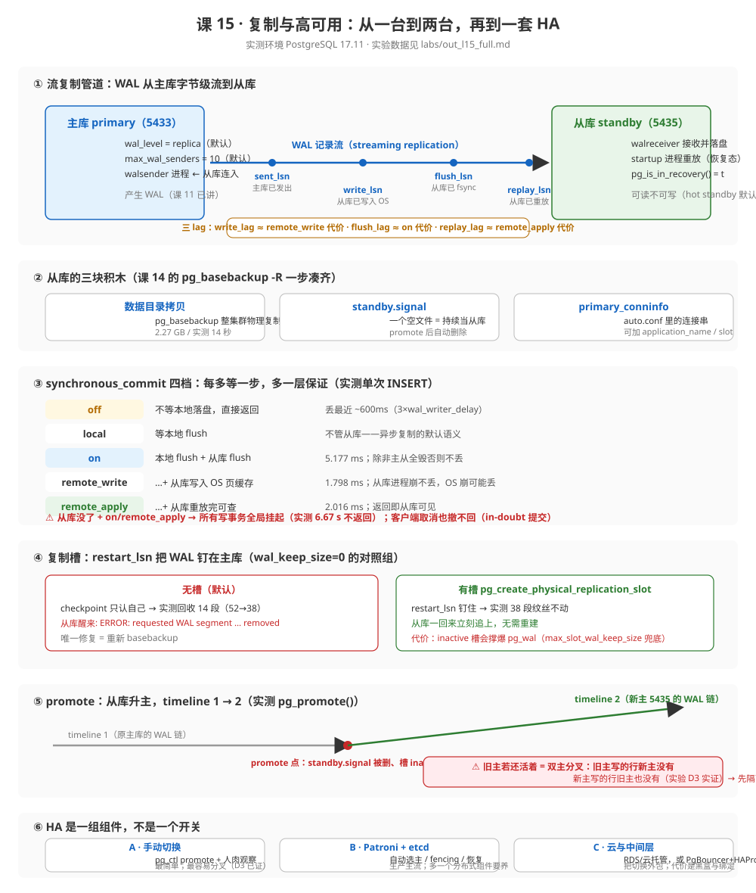

# 课 15 · 复制与高可用

> 📍 故事中的位置：主库崩了——主角被复制到第二台机器，业务没中断

## 本课目标

学完本课后，你能：

1. **画出来**：流复制的 WAL 接收 / 重放流程，并说清四个 LSN 与三个 lag 各在哪一步
2. **配置**：主从流复制、复制槽、级联复制，并用 `pg_ctl promote` / `pg_promote()` 完成一次手动切换
3. **决策**：是否需要 Patroni / PgBouncer / HAProxy / etcd，以及它们的适用边界

## 知识点清单

| 知识点 | 关键点 |
|---|---|
| **15.1 流复制原理** | · WAL 接收与重放进程（`walreceiver` / `startup`） · 同步 vs 异步复制（`synchronous_standby_names`） · 复制协议与关键参数（`primary_slot_name` / `wal_keep_size`） |
| **15.2 主从切换与复制槽** | · 手动切换：`pg_ctl promote`（从库升主） · 复制槽的代价 · 物理复制槽与逻辑复制槽 · 级联复制（standby → standby） |
| **15.3 HA 方案对比** | · **方案 A**：手动切换（最简、最容易出错） · **方案 B**：Patroni + etcd（最主流的自动 HA） · **方案 C**：PgBouncer（连接池）+ HAProxy（VIP） · 决策矩阵（场景 / 人力 / 风险） |

## 故事主线中的情节定位

主角被复制到第二台机器——读者通过本章建立"HA 是一组组件而非单一开关"的系统认知。本课是 PG 学习里"开发到运维"的真正分水岭。

## 正文

> 本课所有输出均来自 **PostgreSQL 17.11**（Docker 容器 `pg17`，端口 5433 = 主库；`pg17-standby`，端口 5435 = 从库；`pg17-standby2`，端口 5436 = 级联从库，实验后删除）真实运行，脚本与原始输出归档在 [`labs/`](labs/)（`l15_labs.sh` + `out_l15_full.md`）。

## 📌 知识点导航

| 知识点 | 一句话 | 关键实测数字 |
|---|---|---|
| [15.1 流复制原理](#一151-流复制原理) | WAL 从主库字节级直播到从库 | 2.27 GB 从库 **14 秒**建好；四档延迟 on **5.177 ms** |
| [15.2 主从切换与复制槽](#二152-主从切换与复制槽) | 槽把 WAL 钉住，promote 把从库转正 | 无槽回收 **14 段** WAL vs 有槽 **0 段**；timeline **1 → 2** |
| [15.3 HA 方案对比](#三153-ha-方案对比决策点) | HA 是一组组件，不是一个开关 | 双主分叉实测：旧主的行新主 **0 条**看到 |

## 第一幕 · 起源与场景引入

### 起源：复制能力不是设计出来的，是被"停机时间"逼出来的

课 14 讲过：2005 年的 PG 8.0 有了 PITR——能把 WAL 回放到任意时刻。但 PITR 是"事后救人"，业务要的是"事前就有一台现成的顶上"。于是同样这根 WAL 管道，被一步步逼成了复制能力（以下均为联网核实的历史事实，核查于 2026-09-11）：

| 时间 | 版本 | 发生了什么 | 为什么重要 |
|---|---|---|---|
| **2010-09** | PostgreSQL **9.0** | **流复制（streaming replication）+ 热备（hot standby）** 同版本落地（此前 PG **没有任何内置复制**，只能靠 Slony 这类外部工具）；在 9.0 之前，"另一台机器"只能靠 16 MB 一个的 WAL 文件段"日志传送"——一段一段地拷，一段还没拷完就落后一段 | 备份管道第一次变成**实时管道**；从库第一次可以**边恢复边查** |
| **2014-12** | PostgreSQL **9.4** | **复制槽（replication slots）**（官方版本说明：*Replication slots allow preservation of resources like WAL files on the primary until they are no longer needed by standby servers*） | 主库第一次"知道"从库需要什么——WAL 不会在从库断线时被回收 |
| **2016-09** | PostgreSQL **9.6** | 同步复制支持**多台从库 + 法定人数（quorum，`ANY n` 语法）** | "不丢数据"不再绑定在一台从库身上 |
| **2017-10** | PostgreSQL **10** | **逻辑复制**（publish/subscribe）上线——以表为单位、跨大版本、订阅端可写 | 复制第一次有了"物理/逻辑"两条路线 |
| **2024-09** | PostgreSQL **17** | **`pg_createsubscriber`**：把一台**物理从库**直接改造成**逻辑订阅者**，跳过逻辑复制的全量初始拷贝（官方：*does not copy the initial table data*） | 两种路线之间第一次有了"转换通道" |

一句话概括这条演进线：**先是能实时传（9.0），再是传的东西不丢（9.4），然后是丢不丢可以按需选（9.6）、按表选（10），最后是两种选法还能互相转换（17）**。

### 一个真实的工作场景

凌晨 3 点 12 分，订单库所在的那台物理机 RAID 卡烧了，机器彻底起不来。

值班的你第一反应是课 14 的肌肉记忆：我们有 PITR。但打开监控才发现两个坏消息：

1. 最近一次基础备份是 8 小时前的，归档目录里 WAL 缺了一段（`pg_stat_archiver.failed_count` 早就不是 0 了）——**最坏要丢 8 小时订单**；
2. 按上次演练实测，2 GB 库完整恢复要 4 分钟起步，还得加上应用改连接串、预热缓存的时间——**恢复窗口至少半小时**。

而 CEO 只问了一句：**"为什么不能有一台现成的机器，马上顶上？"**

这就是复制与高可用要回答的问题。它和备份的本质区别是：**备份是"把过去存起来"（RPO 靠它），复制是"把现在摊开"（RTO 靠它）**——两者互补，谁也替代不了谁。

### 本课要回答的四个问题

1. WAL 是怎么从主库"流"到从库的？中间几个进程、几个位置、几个延迟？（15.1）
2. 从库断线期间，主库凭什么"留着"它需要的 WAL？复制槽是干什么的？（15.2）
3. 从库怎么变成主库？变完之后，旧的那台怎么办？（15.2）
4. 生产上要不要上 Patroni 这类工具？什么时候手动切换就够了？（15.3）

## 第二幕 · 认知冲突

### 陷阱 1：「配了从库，数据就不会丢了」

流复制**默认是异步的**。官方原文（PG 17 docs 26.2.5，核查于 2026-09-11）：*It should be noted that log shipping is **asynchronous**, i.e., the WAL records are shipped after transaction commit. As a result, there is a window for data loss should the primary server suffer a catastrophic failure*——**事务提交在先，WAL 传到在后**。主库确认提交的那一刻，那条 WAL 可能还在网络管道里。从库不是保险柜，是"稍慢一点的镜子"。

### 陷阱 2：「从库挂了，主库总该照常跑吧——毕竟主库没坏」

如果只是异步复制，是的。但一旦你为了"不丢数据"开了**同步复制**，答案恰恰相反。本课实测（实验 B-3）：停掉从库后，主库上一条普通 `INSERT` **挂起 6.67 秒不返回**（被 timeout 强杀），且**其他会话的 UPDATE 同样卡死**——挂起是**全局**的，不是发起会话自己的。更反直觉的是被杀的那个事务：从库一回来，它**最终提交了**（实验 B-4 重插同一主键报 `duplicate key`）。**同步复制把"写的能力"抵押给了从库的存活**。这是本课最贵的一条认知。

### 陷阱 3：「主从延迟就一个数，看监控面板上那个就行」

`pg_stat_replication` 上有三个 lag：`write_lag`、`flush_lag`、`replay_lag`，官方明确它们对应**三种不同的保证**（PG 17 docs 27.2，核查于 2026-09-11）：write ≈ 从库写到了 OS，flush ≈ 从库落了盘，replay ≈ 从库重放完**可查了**。把三个数看成一个数的人，解释不了"为什么 remote_apply 的写比 on 还能更快返回"这类现象。

### 陷阱 4：「复制槽建了就是保险，不用管它」

槽确实能钉住 WAL（实验 C-3：停从库 + 写 200 MB WAL + CHECKPOINT，**38 段纹丝不动**）。但官方有一段专门警示（PG 17 docs 26.2.6，核查于 2026-09-11）：*Beware that replication slots can cause the server to retain so many WAL segments that they fill up the space allocated for `pg_wal`*——**一个没人消费的槽，会无声地把主库磁盘吃满**。保险柜变成定时炸弹，只隔一个"从库回来"。

### 陷阱 5：「promote 完，切换就结束了」

本课实验 D-3 的实测结果：promote 之后旧主**如果还活着**，两台机器各自收写——旧主写入的行，新主 **0 条**看到；新主写入的行，旧主也 **0 条**看到。这不是理论上的"脑裂风险"，是 5 分钟就能亲手复现的数据分叉。**切换的最后一步不是把从库升主，而是确认旧主已经死透（或者先隔离它）**。

### 陷阱 6（环境附赠）：容器直连必报错，pg_hba 放行了也不行

本课在 Docker Desktop 上踩了两级坑，都是真实运维里"复制连不上"的微缩版：① 容器间网桥直连报 `Cannot assign requested address`（不是 refused！），绕行走 `host.docker.internal`；② pg_hba 补了 replication 行还报 `no pg_hba.conf entry for replication connection from host "169.254.169.254"`——经宿主端口映射进来的**源 IP 是 Docker VM 的 link-local 地址**，白名单要写它。排障教训：**报错里的"from host X"告诉你的是"它以为的源 IP"，不是你以为的源 IP**。

## 第三幕 · 层层揭示

### （一）15.1 流复制原理

#### ① 一句话定义

**流复制 = 主库把 WAL 记录字节级地"直播"给从库，从库实时重放同一份变更流**——从库是主库的物理级镜像（不是数据拷贝，是"变更过程"的转播）。

#### ② 直觉建立

课 14 讲 WAL 归档时说过：WAL 文件 16 MB 一段。把一段一段的文件拷给另一台机器再回放，像**录播**——一集录完才能传，一集没传完就落后一整集（官方叫 log shipping，日志传送）。流复制是**直播**：主库每生成一条 WAL 记录，不等凑满 16 MB，立刻通过网络推给从库。官方对两者延迟的对比（26.2.5）：文件传送的数据丢失窗口要靠 `archive_timeout` 挤压（官方建议最小 1 分钟），而流复制 *typically under one second*。

类比边界：直播的主播（主库）和观众（从库）看到的**是同一条时间线**——这是"物理"复制：从库重放的正是主库写下的每一个字节变更，连块级结构都一样。所以物理从库**必须和主库同大版本**（官方：跨大版本的 log shipping 不可行；minor 版本一致最稳）。要跨版本、要只复制几张表、要订阅端可写——那是课外的另一条路：逻辑复制（本课 15.3 末尾给它的位置）。

还有一个官方术语要先钉死：**warm standby vs hot standby**（26.1）。warm = 那台备库**连都连不上**，只能干等 promote；hot = 备库**可以连上来跑只读查询**（PG 9.0 引入）。由 `hot_standby` 参数控制，**默认 `on`**（本机实测确认）——所以你今天起一台从库，天生就是 hot 的。

#### ③ 核心原理

**管道两端的三个进程**。主库侧一个 walsender 进程服务一个从库（占一个 `max_wal_senders` 名额，默认 10）；从库侧 walreceiver 负责收流落盘，startup 进程负责重放（骨架把接收和重放混写成一个进程名，按官方口径是这两个：**walreceiver 收、startup 重放**）。从库视角自己是恢复态：`pg_is_in_recovery() = t`。

**四个 LSN 标记流水的四个位置**（官方 27.2 字段定义，实测值见第四幕）：

| 字段 | 位置 | 官方含义（节译） |
|---|---|---|
| `sent_lsn` | 主库 | 已在此连接上**发出**的 WAL 位置 |
| `write_lsn` | 从库 | 已**写到磁盘（OS 层）** |
| `flush_lsn` | 从库 | 已 **fsync 落盘** |
| `replay_lsn` | 从库 | 已**重放进库**（可查） |

**三个 lag = 三种同步档位的实际代价**。官方原文把它们和 `synchronous_commit` 三档一一对应：`write_lag` 可用来估算 `remote_write` 档的提交延迟，`flush_lag` 对应 `on`，`replay_lag` 对应 `remote_apply`。实测还有一个细节：`sync_state = async` 时三列是 NULL——异步从库不发送带确认语义的反馈，**没有同步承诺就没有 lag 数字**。

**主库侧的默认值是好消息**。本机实测（实验 A-1）：`wal_level = replica`、`max_wal_senders = 10`、`max_replication_slots = 10`，**全是默认值**——PG 17 开箱就支持流复制，你要配的只有两件事：建一个带 `REPLICATION` 权限的角色，在 `pg_hba.conf` 里放行 `replication` 数据库的来源 IP。

**异步是默认，同步靠点名**。`synchronous_standby_names` 按**从库自己报名的 `application_name`** 点名（官方：*The name of a standby server for this purpose is the application_name setting of the standby*；不设置时默认是 `walreceiver`）。两种点名语法（PG 9.6+）：

```text
FIRST 1 (standby1, standby2)   # 优先级制：按顺序挑 1 台确认（standby1 永远优先）
ANY 1 (standby1, standby2)     # 法定人数制：任意 1 台确认就行（quorum）
```

同步的代价模型，官方一句话钉死（26.2.8）：*The minimum wait time is the **round-trip time** between primary and standby*——同步提交的下限就是一次网络往返，物理定律，调参调不掉。

#### ④ 示例演示

实验 A 组（完整输出见 `labs/out_l15_full.md`）：

```console
# ① 主库默认值开箱即满足（A-1）
$ docker exec pg17 psql -U postgres -t -c "SHOW wal_level; SHOW max_wal_senders;"
 replica
 10

# ② 一条命令，2.27 GB 的从库 14 秒建好（A-2）
$ pg_basebackup -h host.docker.internal -p 5433 -U replicator \
    -D /var/lib/postgresql/data -Fp -X stream -R -P --checkpoint=fast
2378493/2378493 kB (100%), 1/1 tablespace
# -R 的两个产物：standby.signal（空文件）+ auto.conf 里的 primary_conninfo

# ③ 主库立刻看到 walsender（A-3）
$ SELECT pid, usename, application_name, state, sync_state, sent_lsn, replay_lsn FROM pg_stat_replication;
  pid  | usename    | application_name | state     | sync_state | sent_lsn   | replay_lsn
 28757 | replicator | walreceiver      | streaming | async      | 1/1C000060 | 1/1C000060
#                                                        ↑异步       ↑发送位置 = 重放位置 = 实时追平

# ④ 主库写入，从库立即可见（A-4，无 sleep 直查）
主库: INSERT INTO finance.replication_demo VALUES (1,'主库刚写的订单');
从库读到: |  1 | 主库刚写的订单
主库当前LSN:    1/1C029070
从库已重放LSN:  1/1C029070      # 完全一致

# ⑤ 同步四档实测（B-2，同一会话顺序跑；先 ALTER SYSTEM 开同步）
SET synchronous_commit = 'local';        INSERT → 2.372 ms   # 只等本地
SET synchronous_commit = 'on';           INSERT → 5.177 ms   # 本地+远端两次 flush（最贵）
SET synchronous_commit = 'remote_write'; INSERT → 1.798 ms
SET synchronous_commit = 'remote_apply'; INSERT → 2.016 ms   # 返回即从库可查
 application_name | sync_state | write_lag | flush_lag | replay_lag
 standby1         | sync       | 0.731 ms  | 1.029 ms  | 1.124 ms
```

两个必须一起说的实情：单次 INSERT 有毫秒级抖动，量级结论（on 最贵，因为多一次远端 fsync 往返）比具体毫秒可靠；`synchronous_standby_names` **不能会话级 SET**——实测报 `cannot be changed now`，它只能 `ALTER SYSTEM` + reload，而 `synchronous_commit` 可以会话级切（这就是"重要数据同步、日志类异步"的官方推荐玩法）。

#### ⑤ 常见误区

| # | 误区 | 真相 |
|---|---|---|
| 1 | 从库 = 热备份，可以替代 PITR | 从库重放主库的**误操作**和正常写入一样快（DROP TABLE 立刻同步过去）；"回到过去"只有课 14 的 PITR 能做 |
| 2 | `wal_level` 要手动改成 `replica` | PG 17 默认就是 `replica`；`minimal` 反而是退化（不支持复制/归档），`logical` 只为逻辑解码加信息 |
| 3 | 同步挂起只是发起会话的事 | `synchronous_standby_names` 生效时所有 `synchronous_commit=on` 的会话一起等（实测 B-3c 全局卡死） |
| 4 | 客户端断开/超时能取消卡住的同步提交 | commit 等待阶段事务已 in-doubt，取消无效；从库回来后照样提交（实测 B-4 duplicate key） |
| 5 | 三个 lag 随便看一个 | write/flush/replay 分别对应 remote_write/on/remote_apply 三种承诺；async 时恒为 NULL |
| 6 | 容器里连不上 = pg_hba 没配好 | 先看报错里的 `from host X`——源 IP 可能是你想不到的地址（本机是 Docker VM 的 169.254.169.254） |
| 7 | `application_name` 是展示用的名字 | 同步点名、监控归因都靠它；不给从库报名，`ANY 1 (standby1)` 永远匹配不上 |

#### ⑥ 一句话记住

**流复制是 WAL 的直播：默认异步（镜像慢一拍），点名才同步（写能力抵押给从库）；四个 LSN 标四个位置，三个 lag 标三种承诺。**

#### 命令速查卡 · 流复制

| 命令 / 参数 | 说明 | 坑 |
|---|---|---|
| `CREATE ROLE ... REPLICATION LOGIN` | 复制专用角色 | 只许复制不许登录执行 SQL 的最小权限思路 |
| `host replication replicator <IP>/32 scram-sha-256` | pg_hba 放行 | 数据库字段要写 `replication`；来源 IP 看报错里的实际值 |
| `pg_basebackup -R -X stream --slot=槽名` | 一条命令变从库 | `-R` 自动写 `standby.signal` + `primary_conninfo`；先 `CHECKPOINT` 防卡 |
| `SELECT * FROM pg_stat_replication;` | 主库看下游 | 只显示**直接**下游；看不到孙辈 |
| `SELECT * FROM pg_stat_wal_receiver;` | 从库看上游 | 从库连不上时这里是 0 行——排障第一站 |
| `SHOW synchronous_commit;` / `SET synchronous_commit = ...` | 会话级切档 | `off` 不是损坏风险（丢最近 ~600ms），`fsync=off` 才是 |
| `ALTER SYSTEM SET synchronous_standby_names = 'ANY 1 (standby1)'` | 开同步 | 不能 SET；名字 = 从库 conninfo 里的 application_name |

#### 📚 官方文档（PG 17，核查于 2026-09-11）

- [26.2.5 Streaming Replication](https://www.postgresql.org/docs/17/warm-standby.html#STREAMING-REPLICATION) —— "typically under one second"
- [26.2.8 Synchronous Replication](https://www.postgresql.org/docs/17/warm-standby.html#SYNCHRONOUS-REPLICATION) —— 2-safe 术语与 round-trip 下限
- [27.2 pg_stat_replication](https://www.postgresql.org/docs/17/monitoring-stats.html#PG-STAT-REPLICATION-VIEW) —— 四 LSN + 三 lag 官方定义
- [19.5.1 synchronous_commit](https://www.postgresql.org/docs/17/runtime-config-wal.html#GUC-SYNCHRONOUS-COMMIT) —— Table 19.1 五档保证矩阵

### （二）15.2 主从切换与复制槽

#### ① 一句话定义

**复制槽是主库上"替断线的从库占住 WAL"的预约凭证；promote 是把从库从"复述者"转正为"讲述者"的一次性操作**——转正后它有自己的时间线，旧主的故事到此为止。

#### ② 直觉建立

先想清楚没有槽时的困境：从库断线了，主库根本**不知道**有人的历史还停在三小时前——checkpoint 一到，旧 WAL 段该回收就回收（官方：`wal_keep_size = 0` 默认时，*the system doesn't keep any extra segments for standby purposes*）。等从库回来要补的是三小时前的流水，而流水已经当废纸卖掉了。

复制槽就是**图书馆的预约架**：从库断线前在主库登记一个"我要从第 X 页接着看"（`restart_lsn`），主库从此不清理 X 之后的任何一页——不管你多久不来。官方对它的定义（26.2.6，核查于 2026-09-11）：*an automated way to ensure that the primary server does not remove WAL segments until they have been received by all standbys*。

类比边界：预约架**只保留、不送货**——槽不会把 WAL 送给从库，还是得从库自己回来连上取。而且架子的容量就是主库磁盘：占座的人永远不来，图书馆就被书淹了。

promote 则像**实习转正**：从库一直是"复述主库讲过的话"，promote 让它开始讲自己的话。从转正那一刻起，它和原主库的故事**分家**——PG 用 timeline（时间线）编号标记这个分家：转正一次，timeline + 1（课 14 的 PITR 演练里你已经见过 1 → 2，原理相同）。

#### ③ 核心原理

**槽怎么工作**：主库为每个槽维护 `restart_lsn`——回收 WAL 时"至少要保到这个位置"。看家视图是 `pg_replication_slots`：

| 字段 | 含义 | 排障看点 |
|---|---|---|
| `active` | 槽是否被占用 | 长期 `f` 的槽 = 没人消费 = WAL 堆积中 |
| `restart_lsn` | 钉住的位置 | 主库继续写入它却不动 → 磁盘在漏气 |
| `wal_status` | 被钉 WAL 的健康度 | `reserved` 正常 → `extended` → `unreserved` 接近危险 → `lost` 已丢 |

**两种槽**：物理槽（`pg_create_physical_replication_slot`）给流复制从库用，钉的是 WAL 段；逻辑槽（`pg_create_logical_replication_slot`）给逻辑复制/变更订阅用，除了 WAL 还**钉死元组**（配合 `hot_standby_feedback` 防止主库 VACUUM 掉订阅还没消费的行——课 12 的死元组在这里多了一条来源）。**槽一次只能被一个从库消费**——这个限制马上会在级联实验里咬你一口。

**兜底参数**：`max_slot_wal_keep_size`（默认 `-1` = 不限）给槽的"占座"设上限，超过就丢弃保护（`wal_status` 走向 `lost`）——官方 Caution 的那句 *fill up the space allocated for `pg_wal`*，就是靠它兜住。磁盘安全比数据完整更优先：WAL 被槽撑爆的是**主库**，主库挂了全完。

**级联复制（cascading replication）**：从库自己也可以开 walsender 收"孙辈"。官方定义（26.2.7）：*allows a standby server to accept replication connections and stream WAL records to other standbys, acting as a relay*——用途直说了：*reduce the number of direct connections to the primary and also to minimize inter-site bandwidth overheads*（少占主库连接、跨机房省带宽）。两个硬事实：① 主库 `pg_stat_replication` **只显示直接下游**（官方：*Only directly connected standbys are listed*——孙辈在祖辈的监控里隐身）；② 每台从库只连一个上游。

**手动切换（promote）**：两条等价路——`pg_ctl promote -D <数据目录>` 或 SQL `SELECT pg_promote()`（PG 17 签名：`pg_promote(wait boolean DEFAULT true, wait_seconds integer DEFAULT 60)`）。实测发生的四件事（实验 D-1）：

```text
pg_is_in_recovery() → f        # 脱离恢复态，可以写了
standby.signal → 自动删除      # "持续当从库"的标志没了
timeline → 1 变 2              # 分家：新主开始自己的 WAL 链
主库上的槽 → inactive          # 从库不再连旧主，槽空转
```

第四件是隐形雷：**promote 之后，旧主上替它建的槽没人消费了**——它开始无声堆积 WAL。切换清单里必须有一条"处理旧主上的槽"。

#### ④ 示例演示

实验 C 组 + D 组（完整输出见 `labs/out_l15_full.md`）：

```console
# ① 无槽对照组：停从库 → 写 200MB WAL → CHECKPOINT（C-2）
52 段 / 816 MB → checkpoint → 38 段 / 592 MB      # 回收 14 段
从库回来时主库日志反复刷:
ERROR:  requested WAL segment 000000010000000100000021 has already been removed
# 唯一修复 = 重新 basebackup

# ② 有槽对照组：--slot=l15_slot 重建从库后重演（C-3）
 slot_name | active | restart_lsn | wal_status
 l15_slot  | t      | 1/2F000000  | reserved
停从库 → 写 200 万行 → CHECKPOINT →
38 段 / 592 MB                                    # 一段不回收
l15_slot | f | 1/2F000060 | reserved              # restart_lsn 钉在原地
从库一回来 → 追平 → restart_lsn 推进到 1/3B000000  # 预约架随消费前移

# ③ 级联：standby2 从 standby(5435) 拉备份（C-4）
主库 pg_stat_replication: 1 行                     # 只见直接下游
standby 下游数: 1                                  # 一收一发 = cascading standby
主库写 id=401 → standby2 立即读到                  # 三级穿透

# ④ promote（D-1）
SELECT pg_promote();                               # → t
pg_is_in_recovery: f     standby.signal: 没了     timeline: 1→2     槽: inactive

# ⑤ 脑裂分叉（D-3）：promote 后旧主 5433 还活着
旧主写 id=501 → 新主5435 count: 0                  # 分叉实锤
新主写 id=502 → 旧主5433 count: 0
# 而级联从库 standby2 无缝跟随新主（recovery_target_timeline=latest 默认）
```

级联实验还贡献了一个比预期更深的坑：standby2 用 `pg_basebackup -R` 从 standby 搭建时，**auto.conf 原样继承了上游的 `primary_slot_name='l15_slot'`**——可那个槽在主库上，standby 上根本没有！walreceiver 反复申请槽失败，而错误**不进任何一方的日志**（从库进程的 stderr 早被丢弃），只能从 `pg_stat_wal_receiver` 是 0 行反推。**用备份搭第二台从库时，槽配置和连接串是必须人工审查的继承物**。

#### ⑤ 常见误区

| # | 误区 | 真相 |
|---|---|---|
| 1 | 槽会自动把 WAL 送给从库 | 槽只保留不投递；投递靠从库自己回来连 |
| 2 | 建了槽就高枕无忧 | 槽无人消费 = 主库磁盘倒计时；`max_slot_wal_keep_size` 必须设 |
| 3 | 删了从库就完事 | 从库下线前先 `pg_drop_replication_slot()`；inactive 槽是最常见的磁盘事故源 |
| 4 | 一个槽可以多台从库共用 | 官方语义一次一个消费者；级联第二台若继承了第一台的槽名，会反复重试失败 |
| 5 | `pg_ctl promote` 与删 `standby.signal` + 重启是两套机制 | 删文件也能触发，但 promote 是**等待切换完成**的规范路径（pg_promote 默认等 60 秒） |
| 6 | promote 后级联从库要手动改指向 | `recovery_target_timeline = latest`（默认）让它们自动跟随新 timeline——但**仅限上游确实切过去了** |
| 7 | 主库 `pg_stat_replication` 能看到全部层级 | 只见直接下游；级联层级要用下一级的视图看 |
| 8 | 从库永远落后主库一点点 | 追平状态下 sent = replay（实测 `1/1C029070 = 1/1C029070`）；有 lag 才是异常 |

#### ⑥ 一句话记住

**槽 = 用磁盘换"从库断线也不丢流水"；promote = 转正 + 分家（timeline + 1）+ 旧主必须先隔离；级联 = 一收一发，监控只见直接下游。**

#### 命令速查卡 · 复制槽与切换

| 命令 | 说明 | 坑 |
|---|---|---|
| `SELECT * FROM pg_create_physical_replication_slot('s1');` | 建物理槽 | 槽名全库唯一；建了不用就开始占座 |
| `SELECT pg_drop_replication_slot('s1');` | 删槽 | 下线从库前必做；`DROP SLOT` 不是合法 SQL（实测语法错） |
| `SELECT slot_name, active, restart_lsn, wal_status FROM pg_replication_slots;` | 槽体检 | `active=f` 且 `restart_lsn` 不动 = 磁盘在漏气 |
| `pg_basebackup ... -R --slot=s1` | 从库一步挂槽 | 槽同时只能一个消费者；给第二台从库要先换槽名/清配置 |
| `ALTER SYSTEM SET max_slot_wal_keep_size = '10GB';` | 槽占座上限 | 默认 `-1` 不限；生产必设 |
| `SELECT pg_promote(wait_seconds := 60);` | 从库转正 | 等待完成再返回；转正前先确认旧主已隔离 |
| `SELECT timeline_id FROM pg_control_checkpoint();` | 看时间线 | 每次转正 +1；对照主从判断"谁在新链上" |

#### 📚 官方文档（PG 17，核查于 2026-09-11）

- [26.2.6 Replication Slots](https://www.postgresql.org/docs/17/warm-standby.html#STREAMING-REPLICATION-SLOTS) —— 定义与 Caution
- [26.2.7 Cascading Replication](https://www.postgresql.org/docs/17/warm-standby.html#CASCADING-REPLICATION) —— 级联定位与 upstream/downstream
- [26.3 Failover](https://www.postgresql.org/docs/17/warm-standby-failover.html) —— promote 与时间线（PG 17 起为独立页面）
- [app-pgctl promote](https://www.postgresql.org/docs/17/app-pg-ctl.html) / [pg_promote()](https://www.postgresql.org/docs/17/functions-admin.html#FUNCTIONS-RECOVERY-CONTROL) —— 两种触发方式

### （三）15.3 HA 方案对比（决策点）

#### ① 一句话定义

**HA 不是 PG 的一个开关，而是一组各管一段的组件：谁决定切换（failover 决策）、谁挡在切换瞬间的流量（接入层）、谁来保证切换不出第二次事故（fencing）**——选 HA 方案 = 选这三段各用什么。

#### ② 直觉建立

替补席类比：流复制解决的是"**替补队员随时热身**"（从库数据实时追平）；HA 要回答的是"**谁喊换人、怎么保证场上倒下的人不再抢球**"。实验 D-3 的双主分叉就是"替补上场了，场上的人爬起来接着踢"——两个球、两套比分，观众（应用）看到的订单数据从此对不上。

所以任何像样的 HA 方案都要有 **fencing（隔离）**：先确认旧主真的失能（拔网线 / STONITH / 只读锁死），再让新主上岗。手动方案里 fencing 靠人肉纪律（"promote 前先拔电源"），自动化方案里靠工具与分布式共识。

#### ③ 核心原理

**三段拆开看**（这是把"HA 是一组组件"变成可操作判断的框架）：

| 组件段 | 职责 | 手动方案 | 自动化方案 | 云方案 |
|---|---|---|---|---|
| **决策**：谁发现主库挂了并宣布换人 | 监控 + 选主 | DBA 值班 + `pg_ctl promote` | **Patroni + etcd/Consul**（DCS 共识选主） | 云厂商控制面（RDS Multi-AZ 等） |
| **fencing**：保证旧主不复活抢写 | 隔离旧主 | 人肉：先关旧主再 promote | Patroni 调 `pg_ctl stop`/rewind 旧主降级 | 平台内置（不可见） |
| **接入**：应用连谁 | VIP/DNS/代理 | 改连接串（停机窗口长） | **HAProxy** 健康检查 + Patroni REST 判主备 | 云端浮动 IP/endpoint |

**方案 B 为什么是主流**：Patroni 把"决策 + fencing"自动化，etcd 提供**共识**——三个节点里至少两个同意"主库挂了"，才允许换人，防的就是 D-3 那种"监控误判 → 双主"。代价清单同样清楚：多养一套 etcd（奇数节点，3 台起步）、Patroni 接管后**直接手改 PG 配置会被改回**（配置进 DCS 管理）、故障场景更复杂（etcd 自己挂了怎么办）。社区还有 repmgr、pg_auto_failover 两个同类（前者贴管理任务、后者微软出品自带监控节点），选型思路一致：**共识 + fencing 的自动化程度不同，风险结构相同**。

**方案 C 的正确位置**：PgBouncer 和 HAProxy 根本不做 failover——PgBouncer 是**连接池**（课 17 展开：PG 每连接一进程，池化省的是内存和 fork），HAProxy 是**流量分发的入口**（靠健康检查把写流量指向"当前的主"）。它们是自动 HA 的**接入层配件**，不是决策者。把"上了 HAProxy = 高可用"当结论的人，在主库挂掉时会发现流量被指到一台同样挂着代理的尸体上。

**同步复制在 HA 里的位置**：它不决定"谁当主"，它决定"换主瞬间最多丢多少"。官方理论术语（26.2.8）：`on` 档是 **2-safe replication**（两台都落盘才算提交），`remote_write` 档是 **group-1-safe**。实测数据给这个理论一个体感：`on` 档 5.177 ms ≈ local（2.372 ms）+ 一次容器内往返；跨机房时这个往返是 10ms 起步——**同步复制跨城部署要三思**，官方那句 round-trip 下限就是物理墙。

**PG 17 的增量**：`pg_createsubscriber` 把物理从库**原地转成逻辑订阅者**（官方：*creates a new logical replica from a physical standby server*，*does not copy the initial table data*）——大库上逻辑复制最疼的全量初始拷贝被跳过。它把"物理/逻辑"从二选一变成了可迁移路径：先用物理从库扩读、后期要按表订阅/跨版本升级时，原地转逻辑。（PG 10 逻辑复制的完整展开超出本课，结课项目后会作为延伸方向。）

#### ④ 示例演示

把三方案放进同一个场景对比——**凌晨主库 RAID 卡烧了（第一幕那个场景）**：

- **方案 A（手动）**：你被电话叫醒 → 确认旧主真死透了（⚠ D-3 教训：如果它只是网络抖动没死透，promote 就是分叉现场）→ 从库 promote → 改应用连接串/切 DNS → 业务恢复。RTO = 你的响应时间（分钟到小时），RPO = promote 那一刻的 replay_lsn 与最后提交的差（异步从库秒级），风险 = **所有环节靠人**。
- **方案 B（Patroni）**：etcd 30 秒内判主 → Patroni 先确认旧主失能（fencing）→ 提升最健康的从库 → HAProxy 健康检查自动把流量切到新主 → 应用无感。RTO = 秒到 30 秒，代价 = 常驻维护 etcd + Patroni + 严格纪律（别再手动改配置）。
- **方案 C（云）**：云平台自动换主、endpoint 不变。RTO 最小，代价 = 每月账单、黑盒切换（出问题你看不到内部）、锁定风险。

三个方案都建立在**你已经会的三块积木**上（15.1/15.2）：任何一家的底层都是 `pg_basebackup` + 流复制 + `pg_promote`——工具包装的是决策与 fencing，不是别的魔法。

#### ⑤ 常见误区

| # | 误区 | 真相 |
|---|---|---|
| 1 | 上了流复制 = 高可用 | 复制只是"热身"；没有决策与 fencing 的复制，切换照样是人工事故现场 |
| 2 | 上了 HAProxy = 高可用 | 它是接入层；决策层（谁当主）不解决，代理只会把流量指向尸体 |
| 3 | 同步复制能替代 fencing | 同步只保证"换主不丢已提交"，不阻止旧主复活抢写（D-3 的两台都可写） |
| 4 | Patroni 上线后 PG 是我的了 | 配置归 DCS 管，手改会被拉回；运维心智要从"管 PG"变成"管 Patroni" |
| 5 | 异步从库不会丢数据 | 默认异步有数据丢失窗口（26.2.5 官方原文）；要收紧必须 `synchronous_commit` 上档，且接受挂起风险（B-3） |
| 6 | 跨城同步复制是标配 | round-trip 是物理下限；跨城 10ms+ 往返写吞吐崩塌，同步适合同机房/同城 |
| 7 | RPO=0 必须上最贵的方案 | 小团队用"一台同步从库 + 手动切换 runbook"就能做到换主不丢数据（2-safe）；先问自己值不值得养 etcd |

#### ⑥ 一句话记住

**HA = 决策（谁换人）+ fencing（旧主别抢球）+ 接入（观众看哪边）；复制只负责热身， Patroni 把前两段自动化，PgBouncer/HAProxy 只管最后一段。**

#### 决策矩阵 · 我该用哪套（决策点，没有唯一答案）

| 你的情况 | 建议 | 理由 | 代价 |
|---|---|---|---|
| 单机业务，能容忍 30 分钟停机 | 只做备份 + PITR（课 14） | 复制的维护成本 > 停机损失 | 无 |
| 有 1–2 台从库扛读，DBA 值班响应 | **方案 A**：手动 promote + runbook | 秒级 RPO（异步）/ 2-safe（同步），切换是低频事件 | 响应时间；D-3 类翻车靠纪律防 |
| 核心交易库，要自动切换 | **方案 B**：Patroni + etcd（3 节点）+ HAProxy | 共识选主 + fencing 全自动，社区事实标准 | 多养 2–3 个 etcd；配置纪律 |
| 不想养运维，可接受云绑定 | **方案 C**：云托管 | 切换外包，endpoint 不变 | 账单 + 黑盒 + 迁移成本 |
| 想读扩展 + 按表订阅/跨版本 | 物理从库 + PG 17 `pg_createsubscriber` 转逻辑 | 跳过全量初始拷贝 | 逻辑复制的限制（无 DDL 同步等） |

#### 📚 官方文档（PG 17，核查于 2026-09-11）

- [26.1 Comparison of Different Solutions](https://www.postgresql.org/docs/17/high-availability.html) —— 同步问题为什么没有万能解
- [26.3 Failover](https://www.postgresql.org/docs/17/warm-standby-failover.html) —— 官方切换流程
- [app-pgcreatesubscriber](https://www.postgresql.org/docs/17/app-pgcreatesubscriber.html) —— PG 17 物理转逻辑
- [Patroni 文档（社区工具，非官方 PG）](https://patroni.readthedocs.io/) —— 决策/fencing/DCS 的实现参考

## 第四幕 · 实操验证

### 实验总览（14 组，全部实跑）

| 组 | 实验 | 验证什么 | 关键结果 |
|---|---|---|---|
| A1 | 主库三件套默认值 | 开箱支持流复制 | `wal_level=replica` / senders=10 / slots=10 |
| A2 | `pg_basebackup -R` 建从库 | 三块积木一步凑齐 | 2.27 GB → **14 s**；signal + conninfo 自动写 |
| A3 | 复制建立双向视图 | walsender / walreceiver 对视 | streaming / sent=replay=1/1C000060 |
| A4 | 写入即达 | 异步流复制延迟 | 无 sleep 直查可见；LSN 完全一致 |
| A5 | 从库视角 | `pg_stat_wal_receiver` | sender=5433，status=streaming |
| B1 | `application_name` 报名 | 同步点名的前提 | walreceiver → standby1 |
| B2′ | `SET synchronous_standby_names` | 骨架未料的实测 | **cannot be changed now**（只能 ALTER SYSTEM） |
| B2 | 四档延迟 | 每档多等一步 | local 2.37 / **on 5.18** / rw 1.80 / ra 2.02 ms |
| B3 | 停从库后写事务 | 同步挂起全局性 | **6.67 s 不返回**；其他会话 4.0 s 卡死 |
| B4 | in-doubt 提交 | 取消救不了 commit | 从库恢复后 id=301 **最终落地**（duplicate） |
| C2 | 无槽 + checkpoint | WAL 回收后果 | **52→38 段**；从库 `already been removed` |
| C3 | 有槽对照 | restart_lsn 钉住 | 停从库写 200MB → **38 段不变** |
| C4 | 级联三台 | relay 拓扑 | 主库只见 1 行下游；standby2 从 5435 取流 |
| D1-D3 | promote / 跟随 / 分叉 | 切换全链 | signal 自动删 / timeline **1→2** / **双主分叉 0 条可见** |

### 环境准备（可复现）

```bash
# 主库：容器 pg17（5433，课程既有）；从库：新容器挂 volume（不初始化数据目录）
docker network create pgnet && docker network connect pgnet pg17
docker run -d --name pg17-standby --network pgnet --memory 1g -p 5435:5432 \
  -v pg17-standby-data:/var/lib/postgresql/data postgres:17 sleep infinity
# 主库三件套（两件事：角色 + pg_hba；wal_level 等默认已满足）
docker exec pg17 psql -U postgres -c "CREATE ROLE replicator WITH REPLICATION LOGIN PASSWORD '***';"
docker exec pg17 bash -c "echo 'host replication replicator 169.254.169.254/32 scram-sha-256' >> /var/lib/postgresql/data/pg_hba.conf"
docker exec pg17 psql -U postgres -c "SELECT pg_reload_conf();"
# 一条命令变从库（三块积木）
docker exec pg17 psql -U postgres -c "CHECKPOINT;"
docker exec -u postgres -e PGPASSWORD=*** pg17-standby pg_basebackup \
  -h host.docker.internal -p 5433 -U replicator -D /var/lib/postgresql/data \
  -Fp -X stream -R -P --slot=l15_slot --checkpoint=fast
docker exec -u postgres -d pg17-standby postgres -D /var/lib/postgresql/data
```

> 💡 **演练纪律（课 15 新增，阶段 5 通用）**：
>
> 1. **实验全程不改主库全局参数**——同步复制用 `ALTER SYSTEM` 开、**做完立刻 RESET**；先在"从库健在"时配置，再做"停从库"压力测试，避免主库卡死在实验中途；
> 2. **每个对照组只改一个变量**——C2（无槽）与 C3（有槽）用同一写 WAL 脚本、同一 checkpoint 时机；
> 3. **promote 永远在从库上做，主库 5433 全程不碰**——分叉实验做完立刻复位（删级联库、重建从库），不让"双主"状态过夜；
> 4. **从库连不上先看 `pg_stat_wal_receiver`**——主库视图看不到"想连而没连上"的从库。

## 第五幕 · 体系收束

### 一张图总结本课



### 决策速查表：这张表回答"我现在要不要"

| 你想要 | 上什么 | 起点配置 |
|---|---|---|
| 主库挂了另一台顶上 | 流复制从库 | `pg_basebackup -R` + 监控 `pg_stat_replication` |
| 换主瞬间不丢已提交数据 | 同步复制 | `synchronous_standby_names='ANY 1(...)'` + 设 `max_slot_wal_keep_size` |
| 从库断线几天回来还能追 | 物理复制槽 | `--slot` 挂槽 + 盯 `pg_replication_slots.wal_status` |
| 主库带宽紧张 / 跨机房省流 | 级联 | 从库上加 walsender 配置，新从库指向上游 |
| 自动故障切换 | Patroni + etcd | 接受多养一套共识组件 |
| 大库要转逻辑订阅 | PG 17 `pg_createsubscriber` | 物理从库原地转换，跳过初始拷贝 |

### 本课五个记忆锚点

1. **异步是默认，同步靠点名**——点名按 `application_name`，代价下限是一次网络往返（round-trip）。
2. **从库没了，写也停了**——同步复制把写能力抵押给从库（实测全局挂起 6.67 s），且取消救不了 in-doubt 提交。
3. **槽 = 用磁盘换流水**——无槽 checkpoint 回收 14 段，有槽 0 段；inactive 槽会撑爆 `pg_wal`，`max_slot_wal_keep_size` 必须设。
4. **promote = 转正 + 分家**——timeline 1→2、`standby.signal` 自动删、旧主上的槽转 inactive。
5. **切换最后一步是隔离旧主**——D-3 实测双主各自收写互不可见；没有 fencing 的 promote 是分叉现场。

### 与前后课的连接

- **回指课 11（WAL）**：流复制的"货"就是课 11 讲的 WAL——`synchronous_commit` 五档在 11.2 出现过（异步提交风险窗口 3×wal_writer_delay），本课补上了远端视角的完整矩阵（Table 19.1）。
- **回指课 14（备份）**：`pg_basebackup -R` 就是课 14 D 组实验的产物直接变成从库；PITR 演练的 timeline 1→2 与 promote 的 timeline 变化是**同一机制**。
- **回指课 13（锁/排障手法）**：从库连不上时"从 `pg_stat_wal_receiver` 为 0 行反推"和课 13"从行为取证"是同一套方法论——错误日志不在的地方，视图里一定留了痕迹。
- **前瞻课 16（监控与性能）**：本课的 `pg_stat_replication` 三 lag、`pg_replication_slots.wal_status` 都会进监控清单；"从库读冲突取消查询"（`pg_stat_database_conflicts`）是 hot standby 的坑，课 16 展开。
- **前瞻课 17（连接管理）**：PgBouncer 的正式位置在课 17——本课只确认了它"不是 failover 工具"。

### 🎉 阶段 5 进行中

你刚完成了阶段 5 的第二课。回顾一下你现在具备的能力：

1. **能搭**：一条 `pg_basebackup -R` 建从库，一条 `pg_promote()` 完成切换；
2. **能守**：复制槽 + `max_slot_wal_keep_size` 管住磁盘，`pg_stat_replication` 三 lag 看懂延迟；
3. **能选**：手动 / Patroni / 云三套 HA 的边界与代价说得清。

接下来课 16《监控与性能》把"看得见"补齐——本课的三 lag、槽状态都会变成监控指标；课 17《扩展与安全》收官阶段 5。

### 给你的行动清单

1. **今天就查**：生产库有没有从库？有，`SELECT application_name, state, sync_state, write_lag, flush_lag, replay_lag FROM pg_stat_replication;` 贴出来看一眼。
2. **查槽**：`SELECT slot_name, active, restart_lsn, wal_status FROM pg_replication_slots;`——`active=f` 超过一天的槽，要么删掉要么给它配 `max_slot_wal_keep_size`。
3. **写一页切换 runbook**：promote 前的第一条永远是"确认旧主已失能/已隔离"（D-3 教训写进去）。
4. **同步复制若已开启**：把"从库失联 → 写挂起"写进告警——这是比主库宕机更早到来的事故（写挂起时业务先于机器倒下）。
5. **别用主库做实验**：本课所有破坏性实验都在独立容器上做，你的生产库欠一份同样的隔离纪律。

### 📚 官方文档入口（PG 17 · 2026-09 核查，链接均可访问）

| 主题 | 链接 |
|---|---|
| 高可用全景（26.1） | https://www.postgresql.org/docs/17/high-availability.html |
| 日志传送从库（26.2，含 26.2.5 流复制 / 26.2.6 槽 / 26.2.7 级联 / 26.2.8 同步） | https://www.postgresql.org/docs/17/warm-standby.html |
| Hot Standby（26.4，读冲突） | https://www.postgresql.org/docs/17/hot-standby.html |
| 复制参数（19.6） | https://www.postgresql.org/docs/17/runtime-config-replication.html |
| `pg_stat_replication`（27.2） | https://www.postgresql.org/docs/17/monitoring-stats.html |
| `pg_ctl promote` | https://www.postgresql.org/docs/17/app-pg-ctl.html |
| `pg_promote()` 等恢复控制函数 | https://www.postgresql.org/docs/17/functions-admin.html |
| `pg_createsubscriber`（PG 17 新增） | https://www.postgresql.org/docs/17/app-pgcreatesubscriber.html |
| 流复制协议（53.4） | https://www.postgresql.org/docs/17/protocol-replication.html |

### 🚀 下一批接力提示词

> 学完本课后，**复制下面这段文字发给 AI**，即可无缝进入下一课（无需重新描述上下文）：

```
继续学 PostgreSQL。我的学习档案在 postgresql/00-学习档案.md，
刚学完阶段 5《运维与生产化》的课 15《复制与高可用》（15.1 流复制原理、15.2 主从切换与复制槽、15.3 HA 方案对比），
请按大纲继续讲解阶段 5 课 16《监控与性能》的知识点。
```

## 🧭 课程导航

- 上一课：[课 14 备份与恢复](lesson-14-备份与恢复.md)
- 下一课：[课 16 监控与性能](lesson-16-监控与性能.md)
- 返回目录：[`02-课程目录.md`](../../02-课程目录.md)
