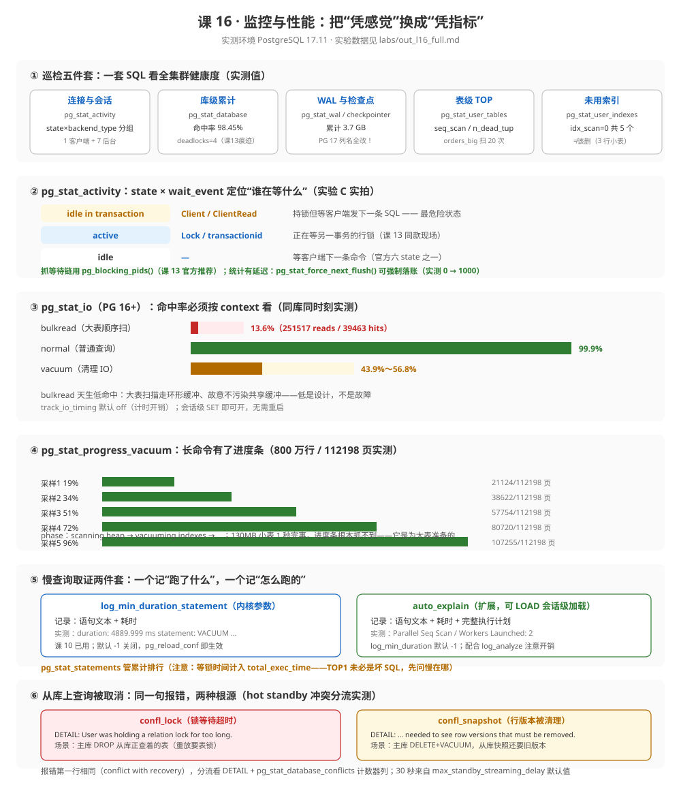

# 课 16 · 监控与性能

> 📍 故事中的位置：生产上线——主角需要被实时观察，谁来看着表里那些缓慢的数字

## 本课目标

学完本课后，你能：

1. **说出**：PG 生产环境的**五大核心监控指标**，以及每个指标去哪个视图取、阈值怎么定
2. **会用**：`pg_stat_activity` / `pg_stat_database` / `pg_stat_user_tables` 等视图族，配合等待事件现场抓真凶
3. **搭建**：用 `pg_stat_statements` / `auto_explain` 做慢查询采集，并知道 Prometheus + Grafana 在生态里的位置

## 知识点清单

| 知识点 | 关键点 |
|---|---|
| **16.1 关键指标** | · **连接数**（`pg_stat_activity` count） · **TPS / QPS**（`pg_stat_database`） · **缓存命中率**（`pg_stat_database` 计算） · **主从延迟**（`pg_stat_replication`） · **长事务 / 锁等待**（`pg_stat_activity`） · 阈值经验值（命中率 ≥ 99%、长事务 > 5 分钟告警） |
| **16.2 pg_stat_* 视图族** | · `pg_stat_activity`（会话 / 当前 SQL） · `pg_stat_database`（库级累计） · `pg_stat_user_tables`（表级 seq scan / idx scan / dead tuple） · `pg_stat_user_indexes`（索引使用率） · `pg_statio_*`（IO 统计） |
| **16.3 常用监控工具** | · `pg_stat_statements`（SQL 级别累计 + 总耗时排序） · `auto_explain`（自动 EXPLAIN 慢查询） · 集成方案（Prometheus `postgres_exporter` + Grafana） · pgAdmin 4 的轻量监控视图 |

## 故事主线中的情节定位

主角被实时观察——读者通过本章把"凭感觉调优"换成"凭指标调优"。这是工程师成熟度的分水岭。

## 正文

> 本课所有输出均来自 **PostgreSQL 17.11**（Docker 容器 `pg17`，端口 5433 = 主库；`pg17-standby`，端口 5435 = 从库，课 15 基线）真实运行。这个课程库已连续运行多天、跑过 15 课的实验——**统计视图里的"脏数据"（deadlocks=4、TOP1 等 34 秒的 UPDATE）正好是本课最好的教材**。脚本与原始输出归档在 [`labs/`](labs/)（`l16_labs.sh` + `out_l16_full.md`）。

## 📌 知识点导航

| 知识点 | 一句话 | 关键实测数字 |
|---|---|---|
| [16.1 关键指标](#一161-关键指标) | 五个数字回答"库现在健康吗" | 命中率 **98.45%**（低于 99% 经验线但不是故障） |
| [16.2 pg_stat_* 视图族](#二162-pg_stat_-视图族) | 每个视图是一层镜头：库 → 表 → 会话 | bulkread 命中 **13.6%** vs normal **99.9%** |
| [16.3 常用监控工具](#三163-常用监控工具) | 排行榜找嫌疑，执行计划定罪 | auto_explain 记下 **Workers Launched: 2** |

## 第一幕 · 起源与场景引入

### 起源：监控能力也是一层层长出来的

PG 的监控体系不是一天建成的——每一步都是为了回答上一版回答不了的问题（以下均为联网核实的历史事实，核查于 2026-09-11）：

| 时间 | 版本 | 发生了什么 | 为什么重要 |
|---|---|---|---|
| **2009-07** | PostgreSQL **8.4** | **`pg_stat_statements`** 首次引入（contrib 扩展）——把执行过的 SQL 的耗时累计起来 | 第一次能回答"我的库时间都花在哪些 SQL 上" |
| **2012-09** | PostgreSQL **9.2** | `pg_stat_statements` 支持 **SQL 文本归一化**（官方版本说明：*Allow pg_stat_statements to aggregate similar queries via SQL text normalization*）——字面量参数折叠成 `$1`，一百万次调用聚成一行 | 排行榜从"每条 SQL 一行"变成"每类 SQL 一行"，可用性质变 |
| **2016-09** | PostgreSQL **9.6** | `pg_stat_activity` 新增 **`wait_event_type` / `wait_event`** 两列；同时引入**通用进度上报设施**（`pg_stat_progress_vacuum` 等） | "等待"第一次有了名字——之前只有一个布尔 `waiting`；长命令第一次有了进度条 |
| **2023-09** | PostgreSQL **16** | 新视图 **`pg_stat_io`**（官方版本说明：*Allow monitoring of I/O statistics using the new pg_stat_io view*）——IO 统计按 backend_type × context × object 拆开 | "命中率"第一次能分清是"普通查询"还是"大表扫描" |
| **2024-09** | PostgreSQL **17** | **`pg_stat_bgwriter` 拆成三个视图**（`pg_stat_checkpointer` / `pg_stat_bgwriter` / `pg_stat_wal` 各归其位），**列名随之全改**（`checkpoints_timed` → `num_timed`） | 大量基于 PG 16 及更早的监控 SQL / exporter 配置在这里静默失效 |

一句话概括：**先知道时间花在哪（8.4），再聚成类（9.2），再看懂等待（9.6），再看懂 IO（16），最后各归其位（17）**。

### 一个真实的工作场景

你的订单库今天上线了。第一波真实流量进来，老板发来一条消息："**感觉页面有点慢，你看下数据库。**"

你连上库，然后发现自己两手空空：

- "慢"是多少？——没有基线，不知道正常值长什么样；
- 是数据库慢，还是应用慢？——没有分层指标，说不清；
- 就算慢，慢在哪个 SQL？——没有采集，只剩猜。

"感觉慢"是形容词，监控的工作是把它变成**可以对照的数字**。本课要做的事：用一套自带的、零依赖的视图族 + 两个扩展，把"看下数据库"变成 5 分钟内可执行的检查清单——至于 Grafana 面板，那是把这些数字画出来而已（16.3 会给它正确的位置）。

### 本课要回答的四个问题

1. 库健康不健康，看哪几个数字？阈值怎么定才不是瞎猜？（16.1）
2. `pg_stat_*` 这几十个视图怎么记？哪些每天看、哪些出事才看？（16.2）
3. 一条 SQL 慢，怎么从"排行榜嫌疑"走到"执行计划定罪"？（16.3）
4. 从库也是生产节点，它的监控和主库差在哪？（16.2 / 16.3，回收课 15 伏笔）

## 第二幕 · 认知冲突

### 陷阱 1：「监控就是装个 Grafana」

面板只是把数字画出来。**没有采集（extension 没装、`track_io_timing` 没开）、没有基线（正常值多少没人知道）、没有归因路径（数字异常了往下查什么）**的面板，只是把"感觉慢"换成了"感觉图不对"。本课的顺序是：指标 → 视图 → 采集工具 → 最后才是面板。

### 陷阱 2：「缓存命中率必须 99% 以上，低了就是出事了」

本课实测：这个跑了多天实验的课程库命中率 **98.45%**——低于 99% 经验线，但没有任何故障。更有意思的是 `pg_stat_io` 的实测（实验 D-2）：**同一时刻、同一个库，普通查询命中率 99.9%，大表扫描（bulkread）只有 13.6%**——bulkread 天生走环形缓冲、故意不污染共享缓冲（PG 8.1 引入的 ring buffer 设计），低是设计不是病。**先问"哪个 context"，再谈阈值**。

### 陷阱 3：「统计视图里的数字是实时的」

实测（实验 B-1）：INSERT 1000 行后**立刻**查 `pg_stat_user_tables`，`n_tup_ins = 0`——统计是**延迟落账**的（默认约 500ms 一轮批量汇总）。官方为此提供了 `pg_stat_force_next_flush()` 强制落账，实测调用后立刻变 1000。**把统计延迟当成数据没写入，是监控排障里最冤的误判**。

### 陷阱 4：「`pg_stat_statements` 排行第一的 SQL 就是慢 SQL」

实测本库 TOP 1：一条 `UPDATE finance.accounts SET balance = balance …`，`mean_exec_time = 34.9 秒`——但它根本不是坏 SQL：它是课 13 的锁实验语句，**等锁的 30 秒被计入执行时间**。排行榜给的是"嫌疑"，不是"判决"——总耗时长可能因为单条慢、调用多、或者只是在等别人。

### 陷阱 5：「监控了主库就等于监控了全部」

两个坑。① 主库的 `pg_stat_replication` **只显示直接下游**（课 15 实测官方原文）——级联的孙辈在主库监控里隐身；② 从库有主库没有的故障类型：**读冲突取消**（hot standby 上重放与查询打架）。本课实测从库上两种冲突（F-2a/F-2b）：报错第一行一字不差，DETAIL 与计数器列却分流到 `confl_lock` 和 `confl_snapshot` 两个不同位置——**只监控主库的人，永远看不到从库上的这两种事故**。

## 第三幕 · 层层揭示

### （一）16.1 关键指标

#### ① 一句话定义

**核心指标 = 五个能直接回答"库现在健康吗"的数字：连接与会话、吞吐（TPS）、缓存命中率、主从延迟、长事务与锁等待**——每个都有官方视图、取数 SQL 与告警阈值。

#### ② 直觉建立

把数据库想成一家医院，五个指标就是五个分诊台：

- **连接数**（挂号人数）：`pg_stat_activity` 数一数——人数爆了连健康人都挤不进来（官方镜像默认 `max_connections=100`）；
- **吞吐**（接诊量）：`pg_stat_database` 的 `xact_commit` 差分——每秒提交了多少事务；
- **缓存命中率**（药在不在手边）：`blks_hit / (blks_hit + blks_read)`——要去仓库（磁盘）拿药的比例；
- **主从延迟**（分院的病历同步没跟上）：课 15 的 `pg_stat_replication.replay_lsn` 差值；
- **长事务 / 锁等待**（哪张诊台堵了）：`pg_stat_activity` 的 state 与 wait_event。

#### ③ 核心原理

**统计系统是异步的**。PG 用后台机制异步收集全库计数（该系统历代版本几经重构），视图读的是**落账后的快照**——官方提供 `pg_stat_force_next_flush()` 让你强制落账（本课实测 0 → 1000）。它的推论：**监控采集周期别低于 1 秒**，否则你在采集"半个快照"。

**命中率公式与它的边界**：`round(100.0*blks_hit/nullif(blks_hit+blks_read,0), 2)`。注意两点：它是**自启动以来的累计值**（陡变比绝对值有意义）；它不分 context（16.2 的 `pg_stat_io` 才分）。

**阈值经验值的诚实说法**：命中率 ≥ 99%、长事务 > 5 分钟告警——这些是**社区经验默认值，不是官方规范**（官方文档从不给阈值）。正确用法是先跑一周记下你自己的基线，再设"偏离基线就告警"。本库实测 98.45% 没有任何故障，就是活例子。

**PG 17 的视图拆分**（骨架没料到的事实，实测踩中）：`pg_stat_bgwriter` 一个视图拆成三个——`pg_stat_checkpointer`（`num_timed` / `num_requested`，**旧列名 `checkpoints_timed` 已不存在**）、`pg_stat_bgwriter`（瘦身到 3 列）、`pg_stat_wal`（WAL 生成量）。升级 17 后，旧版监控 SQL 会在这一列名上报错——**这正是"监控 SQL 也是代码，要跟版本走"的实证**。

#### ④ 示例演示

实验 A 组——一套可复制的巡检 SQL，全部真实输出（节选，完整见 `labs/out_l16_full.md`）：

```sql
-- ② 库级累计 + 命中率
SELECT datname, xact_commit, deadlocks,
       round(100.0*blks_hit/nullif(blks_hit+blks_read,0), 2) AS 命中率_pct
FROM pg_stat_database WHERE datname='order_service';
    datname    | xact_commit | deadlocks | 命中率_pct
 order_service |        7489 |         4 |      98.45

-- ③ WAL 与检查点（PG 17 新列名）
SELECT wal_records, pg_size_pretty(wal_bytes::numeric) AS wal总量 FROM pg_stat_wal;
 SELECT num_timed, num_requested FROM pg_stat_checkpointer;
 wal_records | wal总量
    27874774 | 3707 MB          ← 15 课实验的真实产出
 num_timed: 604（定时）/ num_requested: 21（请求式，多为手工 CHECKPOINT）

-- ⑤ 疑似未使用索引
SELECT indexrelname, pg_size_pretty(pg_relation_size(indexrelid))
FROM pg_stat_user_indexes WHERE idx_scan = 0 AND relname LIKE 'orders%';
 orders_pkey / orders_order_no_key / …（5 个）
```

注意 A-5 的反转：这 5 个 `idx_scan=0` 的索引**一个都不该删**——`orders` 是 3 行的小表，seq scan 更便宜，而且统计只从上次 reset 起算。"看到 0 就删索引"和"看到 98% 就报警"是同一种错误：**把数字当结论，而不是当线索**。

#### ⑤ 常见误区

| # | 误区 | 真相 |
|---|---|---|
| 1 | 命中率 < 99% = 出事 | 经验值不是官方规范；本库实测 98.45% 无故障。先看 context（pg_stat_io）与趋势 |
| 2 | 统计视图是实时的 | 异步落账，默认几百毫秒延迟；`pg_stat_force_next_flush()` 可强制（实测） |
| 3 | 监控 SQL 一次写好到处能用 | PG 17 把 `pg_stat_bgwriter` 拆三视图且列名全改（实测 `checkpoints_timed` 报 column not exist） |
| 4 | TPS 直接读 `xact_commit` | 那是**累计值**；TPS 是差分（两次采样相减 ÷ 时间） |
| 5 | `deadlocks` > 0 就要处理 | 本库 4 次全是课 13 实验产物；偶发死锁被 PG 自动解开（课 13），要盯的是**频率趋势** |

#### ⑥ 一句话记住

**五个数字分诊：连接、吞吐、命中率、延迟、堵点；累计值要做差分，经验值要建基线，PG 17 的列名要重抄。**

#### 命令速查卡 · 五大指标

| 指标 | 取数 | 阈值思路 |
|---|---|---|
| 连接数 | `SELECT count(*) FROM pg_stat_activity;`（按 state 分组） | 逼近 `max_connections` 的 80% 告警 |
| TPS | `xact_commit` 两次采样差分 | 对比自己的基线曲线 |
| 命中率 | `blks_hit/(blks_hit+blks_read)` | 看趋势陡降，不看绝对值；分 context 后再看 |
| 主从延迟 | `pg_wal_lsn_diff(pg_current_wal_lsn(), replay_lsn)` | 字节数比秒数诚实（lag 列 async 时为 NULL） |
| 长事务 | `state='idle in transaction'` + `now()-xact_start` | > 5 分钟告警（经验值）；它钉死元组（课 12）与锁（课 13） |

#### 📚 官方文档（PG 17，核查于 2026-09-11）

- [27.1 监控该看什么](https://www.postgresql.org/docs/17/monitoring.html) —— 官方维度清单（Unix 工具 / 累计统计 / 日志 / 进程状态 / 磁盘）
- [28.2 累计统计系统](https://www.postgresql.org/docs/17/monitoring-stats.html) —— 全部视图的权威字段定义
- [19.9 统计收集参数](https://www.postgresql.org/docs/17/runtime-config-statistics.html) —— `track_io_timing` 默认 off 及开销说明

### （二）16.2 pg_stat_* 视图族

#### ① 一句话定义

**`pg_stat_*` 是一层层放大镜头：库（`pg_stat_database`）→ 表/索引（`pg_stat_user_tables` / `_indexes`）→ 会话（`pg_stat_activity`）→ 等待原因（wait_event）→ IO 明细（`pg_stat_io`）**——排障就是沿着镜头从模糊到清晰。

#### ② 直觉建立

医院类比继续：`pg_stat_database` 是全院大屏（每天的接诊总量），`pg_stat_user_tables` 是科室报表（哪个科室排队最长），`pg_stat_activity` 是诊室门口的叫号屏（**现在**谁在看、看到第几号），wait_event 是医生手里的病因条（"在等化验结果"= IO，"在等另一间诊室的会诊"= Lock）。

镜头的记忆法不是背视图名，是记**排障路径**：出事 → 先看大屏哪个指标坏了（16.1）→ 下钻到表/会话层找具体对象 → 用 wait_event 定性（等 IO？等锁？等客户端？）→ 交给 16.3 的工具定罪。

#### ③ 核心原理

**`pg_stat_activity` 是最重要的单视图**。每行一个后端进程，两个关键维度（官方 28.2.3）：

- `state` 六个值：`active`（正在执行）/ `idle`（等客户端）/ **`idle in transaction`**（事务开着但没在跑——最危险）/ `idle in transaction (aborted)` / `fastpath function call` / `disabled`；
- `wait_event_type` 九大类（官方 Table 27.4）：`LWLock` / `Lock` / `BufferPin` / `Activity` / `Client` / `Extension` / `IPC` / `Timeout` / `IO`。

两者组合才是真相：**`state=active` + `wait_event_type=Lock`** = 正在执行的语句在等锁；**`state=idle in transaction` + `wait_event_type=Client`** = 持着锁/快照但人在摸鱼——后者是课 13/12 两次点名的生产杀手。实测"三态合影"（实验 C-1）：

```text
  pid  |        state        | wait_event_type |  wait_event   | query
 29700 | idle in transaction | Client          | ClientRead    | UPDATE …（持锁者）
 29701 | active              | Lock            | transactionid | UPDATE …（等待者）
```

配合 `pg_blocking_pids()`（课 13 官方推荐）一步查出谁堵谁：等待 29701 ← 持锁 29700。

**表/索引级镜头**：`pg_stat_user_tables` 的 `seq_scan / idx_scan / n_live_tup / n_dead_tup / last_autovacuum`——课 12 的 autovacuum 观察、本课 A-4 的 TOP 都从这里取。`pg_stat_user_indexes` 的 `idx_scan` 是"索引使用率"唯一官方数据源（但只反映自上次 reset 起的频率，见 A-5 反转）。

**`pg_stat_io`（PG 16+）是 context 分层的开端**：每行按 `backend_type × context × object` 拆分，其中 context 的官方取值直接解释了命中率悖论（28.2.13）：`normal`（走共享缓冲）/ **`bulkread`**（大表顺序扫走小环形缓冲）/ **`vacuum`**（清理走自己的环形缓冲）/ `bulkwrite`（如 COPY）。实测（D-2）同一时刻：`normal 99.9%` vs `bulkread 13.6%`——**大表扫描命中低是它刻意绕开共享缓冲的设计结果**（避免把热数据挤出缓冲），不是故障。官方还提醒 `track_io_timing` 默认 off（计时本身有开销），会话级 `SET` 即可开。

**从库专属镜头（回收课 15 伏笔）**：`pg_stat_database_conflicts` 是从库上"重放与查询打架"的官方计数器，五列按冲突根源分流：`confl_tablespace / confl_lock / confl_snapshot / confl_bufferpin / confl_deadlock`（另 PG 17 增 `confl_active_logicalslot`）。本课把其中两列做成了现场标本（实验 F-2，详见 16.3 之后的第四幕与 labs）：**报错第一行完全相同，DETAIL 与计数器列不同**——

```text
confl_lock 场景：     DETAIL: User was holding a relation lock for too long.
confl_snapshot 场景： DETAIL: User query might have needed to see row versions that must be removed.
```

#### ④ 示例演示

除上面的三态合影外，本组两个实验直接产出"以后每天都用"的东西：

- **B-1 统计延迟**：INSERT 后立刻查 = 0 → `pg_stat_force_next_flush()` → 1000。采集脚本里每次采样前调一次，杜绝"半个快照"。
- **E-1 VACUUM 进度条**（`pg_stat_progress_vacuum`，9.6 引入）：对 800 万行 / 400 万 dead tuple 的表跑 VACUUM，0.8 秒一采样抓到完整推进曲线：

```text
scanning heap | 21124/112198 (19%)
scanning heap | 38622/112198 (34%)
scanning heap | 57754/112198 (51%)
scanning heap | 80720/112198 (72%)
scanning heap | 107255/112198 (96%)
```

进度条家族（官方 27.4）覆盖 ANALYZE / CLUSTER / COPY / CREATE INDEX / VACUUM / base backup——**130MB 小表 1 秒完事根本抓不到**，它和很多监控一样，是为"够大的工作"准备的。

#### ⑤ 常见误区

| # | 误区 | 真相 |
|---|---|---|
| 1 | 只背视图名不记排障路径 | 镜头要串成路径：指标 → 表/会话 → wait_event → 工具定罪 |
| 2 | `state=active` 就是在干活 | active + `wait_event_type=Lock` 是在排队；active + IO 才是真在搬数据 |
| 3 | `idle` 与 `idle in transaction` 混为一谈 | 前者无害（连接池常态），后者钉死元组与锁——监控要分开计数 |
| 4 | 大表扫描把命中率拉低 = 内存不够 | bulkread 天生走环形缓冲（实测 13.6%），先分 context 再下结论 |
| 5 | 从库不需要单独监控 | 主库只见直接下游；从库有专属故障（读冲突取消）与专属计数器（五列分流） |
| 6 | 进度条随时都能看 | 小命令太快抓不到（实测 130MB VACUUM 秒完）；它服务于长命令 |

#### ⑥ 一句话记住

**库 → 表 → 会话 → 等待 → IO，一层层下钻；state 和 wait_event 组合才是真相；从库要加一台自己的镜头。**

#### 命令速查卡 · 视图族

| 视图 / 函数 | 用途 | 坑 |
|---|---|---|
| `pg_stat_activity` | 会话与等待现场 | `datname IS NOT NULL` 过滤自己；后台进程 state 为 NULL |
| `pg_blocking_pids(pid)` | 等待链 | 官方推荐，别自己 join pg_locks（课 13） |
| `pg_stat_database` | 库级累计/命中率 | 累计值做差分；PG 17 别再查 bgwriter 的旧列 |
| `pg_stat_user_tables` | 表级扫描/死元组 | 记得 `pg_stat_force_next_flush()` |
| `pg_stat_user_indexes` | 索引使用率 | `idx_scan=0` 先查表多大、统计多久 |
| `pg_stat_io` | IO 分层（PG 16+） | `track_io_timing` 默认 off；context 分 bulkread/vacuum |
| `pg_stat_progress_vacuum` | 长命令进度 | 27.4 家族还有 CREATE INDEX / COPY / base backup |
| `pg_stat_database_conflicts` | 从库读冲突（从库上查） | 五列按根源分流，看 DETAIL 对号 |
| `pg_stat_force_next_flush()` | 强制落账 | 采样脚本必配 |

#### 📚 官方文档（PG 17，核查于 2026-09-11）

- [28.2.3 pg_stat_activity](https://www.postgresql.org/docs/17/monitoring-stats.html#PG-STAT-ACTIVITY-VIEW) —— state 六值 + wait_event 引用
- [28.2.13 pg_stat_io](https://www.postgresql.org/docs/17/monitoring-stats.html#PG-STAT-IO-VIEW) —— context 四值官方定义
- [28.2.18 pg_stat_database_conflicts](https://www.postgresql.org/docs/17/monitoring-stats.html#PG-STAT-DATABASE-CONFLICTS-VIEW) —— 冲突五列
- [27.4 进度上报](https://www.postgresql.org/docs/17/progress-reporting.html) —— 六个进度视图

### （三）16.3 常用监控工具

#### ① 一句话定义

**慢查询取证是一条流水线：`pg_stat_statements` 找嫌疑（累计排行）→ `auto_explain` 定罪（自动记录执行计划）→ `log_min_duration_statement` 存档（语句文本）→ Prometheus/Grafana 值班（展示与告警）**——每件工具管一段，别指望一个工具全包。

#### ② 直觉建立

刑侦类比：`pg_stat_statements` 是派出所的**案发率统计**（哪类案子最多）——它告诉你该去哪条街巡逻；`auto_explain` 是**行车记录仪**（案发瞬间自动拍下全过程）——它给你现场证据；`log_min_duration_statement` 是**值班记录本**（记下"几点发生了什么"）——它负责存档。Grafana 是**监控大屏**——把所有监控摄像头投在墙上。**大屏不破案，破案靠前两个**。

#### ③ 核心原理

**`pg_stat_statements` 的正确读法**（本课库已启用，课 9 起 `track=all`）：

- 排序口径决定结论：`total_exec_time`（总耗时，被调用次数放大的元凶）/ `mean_exec_time`（均耗时，单条慢的元凶）/ `calls`（高频低耗，累计起来也很贵）——**三个排序各看一眼**；
- 官方语义陷阱（课 9 已核，本课实测再现）：`total_exec_time` **不含 planning time**（那在 `total_plan_time`）；PG 17 的 IO 列改名 `shared_blk_read_time`（旧名 `blk_read_time` 失效）；
- **等锁时间计入执行时间**：实测 TOP 1 `mean 34880.88 ms` 的 UPDATE 是课 13 锁实验语句（实验 C-2 里那条被卡 30 秒的同类操作）——排行榜第一 ≠ SQL 烂；
- 归一化：字面量折叠成 `$1`（9.2 起），一百万次调用一行聚合——这是它和日志的本质区别。

**`auto_explain` 的正确开法**：官方定位（F.3）：*provides a means for logging execution plans of slow statements automatically, without having to run EXPLAIN by hand*。关键事实：**`LOAD 'auto_explain';` 可以会话级加载**（官方原文，superuser），不一定要 `shared_preload_libraries` + 重启——本课实测：

```sql
LOAD 'auto_explain';
SET auto_explain.log_min_duration = 0;   -- 0 = 全记，-1 默认关闭
SET auto_explain.log_analyze = on;       -- 加 actual time，有额外开销
SELECT count(*) FROM finance.io_big WHERE bucket = 42;
```

日志（stderr → docker logs）里自动出现完整计划，还带来意外收获——800 万行 count 自动并行（`Workers Launched: 2`），auto_explain 连并行计划一起记录：

```text
LOG:  duration: 260.126 ms  plan:
	Query Text: SELECT count(*) FROM finance.io_big WHERE bucket = 42;
	Finalize Aggregate … (actual time=257.793..260.117 rows=1 loops=1)
	  ->  Gather …
	        Workers Planned: 2
	        Workers Launched: 2
	        ->  Parallel Seq Scan on io_big (actual time=148.711..247.289 rows=26667 loops=3)
```

**与 `log_min_duration_statement` 的分工**（同屏对照，同一份日志里两条记录）：内核参数只记**语句文本 + 耗时**（`LOG: duration: 4889.999 ms statement: VACUUM …`），auto_explain 多给**执行计划**。前者轻（所有会话全局生效），后者重（带计划与 actual time）——生产组合通常是：全局开 `log_min_duration_statement = 1000`，auto_explain 用 `shared_preload_libraries` 常驻 + `log_min_duration = 5000` 只抓重案。

**Prometheus + Grafana 的位置**：`postgres_exporter` 把这些视图按固定间隔抓成指标，Prometheus 存时序，Grafana 画面板——**它只是 16.1/16.2 那些查询的定时执行器 + 可视化**。没有本课的视图知识，exporter 配置文件里几百个指标名就是一行行无意义的天书；有了它，每个面板图例你都能说出"这查的是哪个视图的哪列、为什么值得看"。pgAdmin 4 的 Dashboard 是同一套视图的最小可视化，个人开发够用。

#### ④ 示例演示

实验 E-3——`pg_stat_statements` TOP 3 真实输出：

```text
 total_ms  | calls | mean_ms  | rows | blk_read_ms |                     query
 453451.4  |    13 | 34880.88 |   13 |         0.0 | UPDATE finance.accounts SET balance = balance
 129100.0  |    12 | 10758.34 |   12 |         0.0 | SELECT id FROM finance.accounts WHERE id=$1 FO
  22002.1  |     5 |  4400.42 |   5  |         0.0 | UPDATE finance.replication_demo SET note=$1 WH
```

读法示范：TOP 1 的 34.9 秒均值不是 SQL 慢（是课 13 的锁等待实验），**用 auto_explain 或课 9 的 EXPLAIN 复盘才能定罪**——"排行榜 → 计划"的流水线走完才算排障闭环。

#### ⑤ 常见误区

| # | 误区 | 真相 |
|---|---|---|
| 1 | auto_explain 必须改 `shared_preload_libraries` 重启 | 官方支持会话级 `LOAD 'auto_explain';`（实测）；常驻才需要 preload |
| 2 | auto_explain / `log_min_duration_statement` 二选一 | 分工不同：一个多给计划，一个轻量全局；生产常两者同开不同阈值 |
| 3 | TOP 1 就是坏 SQL | 等锁计入 total/mean（实测 34.9 s 的锁实验语句）；三个排序口径各看一遍 |
| 4 | `total_exec_time` 包含解析与规划 | 官方：不含 planning（在 `total_plan_time`）；PG 17 IO 列已改名 `shared_blk_read_time` |
| 5 | Grafana 装好 = 监控建成 | 面板只是视图的画皮；采集（track 参数/extension）与归因路径才是内核 |
| 6 | `pg_stat_statements` 的 max 越大越好 | 默认 5000 条、重启可调；每条有固定内存成本，且 reset 后全清 |

#### ⑥ 一句话记住

**排行榜找嫌疑（三种排序），auto_explain 定罪（LOAD 就能用），日志做存档，Grafana 只负责把证据投上墙。**

#### 命令速查卡 · 工具链

| 工具 | 开启方式 | 关键参数 / 坑 |
|---|---|---|
| `pg_stat_statements` | `shared_preload_libraries` + `CREATE EXTENSION`（课 9 已开） | `total_exec_time` 不含 planning；max=5000 重启可调；`pg_stat_statements_reset()` 全清 |
| `auto_explain` | 会话 `LOAD 'auto_explain';`（superuser）或 preload | `log_min_duration` 默认 -1；`log_analyze=on` 有开销；计划进 stderr/日志 |
| `log_min_duration_statement` | `ALTER SYSTEM … + pg_reload_conf()`（课 10 实测无需重启） | 记文本不记计划；全局生效注意日志量 |
| `pg_stat_reset_single_table_counters(regclass)` | 单表计数器清零 | 排障对照用；别在监控采集时清 |
| `pg_test_timing` | 测 `track_io_timing` 计时开销 | 开 timing 前先测（官方建议） |
| `postgres_exporter` | 独立进程抓视图 → Prometheus | PG 17 拆视图后旧查询文件要更新列名 |

#### 📚 官方文档（PG 17，核查于 2026-09-11）

- [F.30 pg_stat_statements](https://www.postgresql.org/docs/17/pgstatstatements.html) —— 字段语义与 reset 函数
- [F.3 auto_explain](https://www.postgresql.org/docs/17/auto-explain.html) —— 参数默认值与 LOAD 用法
- [19.8 慢查询日志](https://www.postgresql.org/docs/17/runtime-config-logging.html) —— `log_min_duration_statement` 与日志前缀
- [F.38 pg_test_timing](https://www.postgresql.org/docs/17/pgtesttiming.html) —— 计时开销测量

## 第四幕 · 实操验证

### 实验总览（17 组，全部实跑）

| 组 | 实验 | 验证什么 | 关键结果 |
|---|---|---|---|
| A1 | 连接与会话构成 | 五指标之一：连接 | 1 客户端 + 7 后台；state 分组 |
| A2 | 库级累计与命中率 | 五指标之二/三 | 98.45%（无故障，破"99% 教条"） |
| A3 | WAL 与 checkpoint | PG 17 三视图 | `num_timed` 新列名；WAL 累计 3.7 GB |
| A4 | 表级 TOP | 表层镜头 | orders_big seq_scan=20 有归因 |
| A5 | 未使用索引 | idx_scan=0 反转 | 5 个全是 3 行小表，不该删 |
| B1 | 统计延迟 | 异步落账 | 0 → force → **1000** |
| B2 | 单表重置 | 计数器可控 | reset 后归零 |
| C1 | 三态合影 | state × wait_event | `idle in transaction/ClientRead` vs `active/Lock` |
| C2 | 等待链 | `pg_blocking_pids()` | 29701 ← 29700 一步定位 |
| D1 | track_io_timing | 会话级可开 | 无需重启；backend_type 10 种 |
| D2 | bulkread 对照 | context 分层 | **13.6% vs 99.9%** |
| D3 | vacuum 行 | context 实证 | autovacuum worker 的 vacuum 行可见 |
| E1 | VACUUM 进度条 | 长命令可观测 | 19%→34%→51%→72%→96% |
| E2 | auto_explain | 自动取证 | 计划进日志 + 并行 Workers: 2 |
| E3 | pg_stat_statements | 排行榜读法 | TOP1 34.9s 是等锁非慢 SQL |
| F1 | 延迟仪表盘 | 从库视角 | async 时 replay_lag=NULL |
| F2 | 读冲突分流 | 从库专属故障 | 同报错两 DETAIL：`confl_lock` / `confl_snapshot` 各 +1 |

### 环境准备（可复现）

```bash
# 主从基线沿用课 15（pg17:5433 / pg17-standby:5435）；pg_stat_statements 课 9 已启用
# 本课无新增常驻配置——track_io_timing 用会话级 SET，auto_explain 用会话级 LOAD
docker exec pg17 psql -U postgres -d order_service -c "SELECT count(*) FROM pg_stat_statements;"  # 确认扩展在
```

> 💡 **演练纪律（课 16 新增，阶段 5 通用）**：
>
> 1. **读冲突实验在从库做、写操作在主库做**——从库上直接写会直接报错，这本身就是教学点（实验 F-2 的报错值得先猜再跑）；
> 2. **制造等待用"管道 + sleep 保活"**——heredoc 输完后 psql 退出、事务回滚（课 15 已踩过一次）；
> 3. **进度条实验要用大表**——130MB 的 VACUUM 一秒完事，800 万行才能抓到 5 个采样；
> 4. **累计值实验后记录"账本痕迹"**（deadlocks=4、TOP1 等）——它们是下一轮监控的基线，不是垃圾数据。

## 第五幕 · 体系收束

### 一张图总结本课



### 决策速查表：出事时先看哪里

| 症状 | 第一镜头 | 下钻 |
|---|---|---|
| 应用整体变慢 | `pg_stat_database` 吞吐差分 + 命中率趋势 | 慢在哪 → `pg_stat_statements` 三排序 |
| 某条接口慢 | `pg_stat_statements` 定位 queryid | `auto_explain` / 课 9 EXPLAIN 看计划 |
| 连接报 too many clients | `pg_stat_activity` 按 state 分组 | 谁占着：`idle in transaction` 长名单 → 停机风险 |
| 主从延迟大 | 主库 `pg_stat_replication` LSN 差 | 从库 `pg_stat_database_conflicts` 看有没有读冲突卡重放 |
| 磁盘涨 | `pg_stat_user_tables` n_dead_tup + 表大小 | 课 12 的膨胀三步（VACUUM → FULL → repack 权衡） |
| 从库查询莫名被取消 | 从库 `pg_stat_database_conflicts` | DETAIL 分流：confl_lock / confl_snapshot |

### 本课五个记忆锚点

1. **命中率要分 context**——同库同时刻 normal 99.9% vs bulkread 13.6%（PG 16 的 `pg_stat_io` 之前，这个悖论无解）。
2. **统计是异步账本**——刚提交的不在视图里，`pg_stat_force_next_flush()` 是官方落账按钮（实测 0→1000）。
3. **排行榜给嫌疑不给判决**——TOP1 的 34.9 秒是等锁，不是 SQL 烂；`total_exec_time` 还不含 planning。
4. **auto_explain 一句 LOAD 就能用**——不用重启；计划自动进日志，连并行 Workers 都记录。
5. **从库有专属事故**——同句报错两种根源（confl_lock / confl_snapshot），分流看 DETAIL 与计数器列。

### 与前后课的连接

- **回指课 9 / 10**：`pg_stat_statements`（课 9 启用）、`log_min_duration_statement`（课 10 开 10ms）在本课完成"从参数到方法"的闭环——排行榜 → EXPLAIN 定罪的流水线就是课 10 四步工作流的监控端。
- **回指课 12 / 13**：`n_dead_tup`（膨胀）、`idle in transaction`（钉元组与锁）、`pg_blocking_pids()` 全部在本课的巡检 SQL 里就位——阶段 4 的知识变成日常镜头。
- **回指课 15**：三 lag 仪表盘、`pg_stat_replication` 只见直接下游、`pg_stat_database_conflicts`——从库监控的三个角落全部回收。
- **前瞻课 17**：连接数逼近上限的解药是 PgBouncer（连接池，17.3）；`pg_stat_user_functions` 想有用要先 `track_functions`（17.1 扩展话题收尾）。

### 🎉 阶段 5 冲刺

你刚完成了阶段 5 的第三课。回顾一下你现在具备的能力：

1. **有一套巡检 SQL**：五个指标、一张速查卡，五分钟看清库的状态；
2. **有一条排障流水线**：排行榜 → 计划 → 定罪，全程官方工具；
3. **有一个从库视角**：延迟、槽状态、读冲突，主库看不到的你能看到。

课 17《扩展与安全》是阶段 5 收官——扩展生态、权限模型、连接池与升级路径，之后就是阶段 5 闭环与结课实战项目。

### 给你的行动清单

1. **把 A 组五件套存成 `巡检.sql`**：改成本库的对象名，每天上班先跑一遍，连续跑一周记下基线；
2. **给采集脚本加一行 `pg_stat_force_next_flush();`**——在每次采样前（实测证明不加会读半个快照）；
3. **检查你的 PG 17 库有没有旧版监控 SQL**：搜 `checkpoints_timed` / `blk_read_time`——它们在 17 里已改名（本课实测报错）；
4. **从库上单开一个仪表盘**：`pg_stat_database_conflicts` 五列 + `pg_stat_replication` LSN 差值，别只看主库；
5. **给 auto_explain 一个会话级试用**：`LOAD 'auto_explain'; SET auto_explain.log_min_duration=0;` 跑一条慢查询，看日志里的计划——比手跑 EXPLAIN 多一份"案发当时"的实况。

### 📚 官方文档入口（PG 17 · 2026-09 核查，链接均可访问）

| 主题 | 链接 |
|---|---|
| 监控总纲（27.1） | https://www.postgresql.org/docs/17/monitoring.html |
| 累计统计系统（28.2，全部视图字段） | https://www.postgresql.org/docs/17/monitoring-stats.html |
| 进度上报（27.4） | https://www.postgresql.org/docs/17/progress-reporting.html |
| 统计收集参数（19.9） | https://www.postgresql.org/docs/17/runtime-config-statistics.html |
| `pg_stat_statements`（F.30） | https://www.postgresql.org/docs/17/pgstatstatements.html |
| `auto_explain`（F.3） | https://www.postgresql.org/docs/17/auto-explain.html |
| 慢查询日志（19.8） | https://www.postgresql.org/docs/17/runtime-config-logging.html |
| Hot Standby 冲突处理（26.4.2） | https://www.postgresql.org/docs/17/hot-standby.html#HOT-STANDBY-CONFLICT |

### 🚀 下一批接力提示词

> 学完本课后，**复制下面这段文字发给 AI**，即可无缝进入下一课（无需重新描述上下文）：

```
继续学 PostgreSQL。我的学习档案在 postgresql/00-学习档案.md，
刚学完阶段 5《运维与生产化》的课 16《监控与性能》（16.1 关键指标、16.2 pg_stat_* 视图族、16.3 常用监控工具），
请按大纲继续讲解阶段 5 课 17《扩展与安全》的知识点。
```

## 🧭 课程导航

- 上一课：[课 15 复制与高可用](lesson-15-复制与高可用.md)
- 下一课：[课 17 扩展与安全](lesson-17-扩展与安全.md)
- 返回目录：[`02-课程目录.md`](../../02-课程目录.md)
