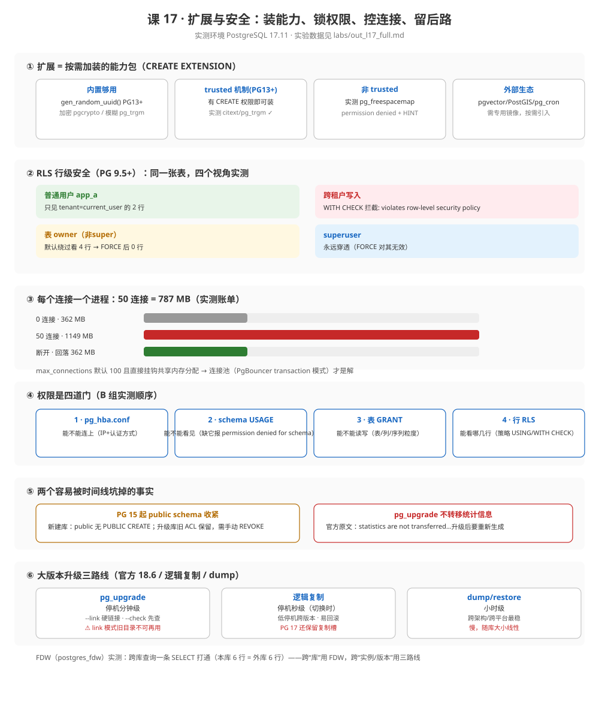

# 课 17 · 扩展与安全

> 📍 故事中的位置：订单系统越用越多——主角需要扩展能力（全文搜索 / 向量 / GIS），也需要被权限隔离保护

## 本课目标

学完本课后，你能：

1. **选对**：在合适场景用合适的扩展（PostGIS / pg_trgm / uuid-ossp / pgvector / pg_cron）
2. **配置**：用户与角色管理、行级安全（RLS）、连接池
3. **走过**：PG 大版本升级与数据迁移路径

## 知识点清单

| 知识点 | 关键点 |
|---|---|
| **17.1 常用扩展** | · `pg_trgm`（模糊匹配 / 全文检索基础） · `PostGIS`（地理信息数据） · `uuid-ossp` / `pgcrypto`（UUID / 加密） · `pgvector`（向量检索，AI 时代常用） · `pg_cron`（定时任务） · `CREATE EXTENSION` 安装与启用 |
| **17.2 用户与权限** | · 角色 vs 用户（PG 11+ 统一为 role） · `GRANT` / `REVOKE` 精细化 · 默认权限与 `ALTER DEFAULT PRIVILEGES` · **行级安全**（RLS：`CREATE POLICY ... USING ...`） · 连接权限与 `pg_hba.conf` |
| **17.3 连接池与连接管理** | · 为什么需要连接池（PG 每连接一个进程） · **PgBouncer** 三种模式（session / transaction / statement） · 应用侧连接池（JDBC pgpool / SQLAlchemy pool） · `max_connections` 的代价 |
| **17.4 升级与迁移路径** | · PG 大版本升级方式（`pg_upgrade`） · 跨平台数据迁移（`pg_dump` / 逻辑复制 / FDW） · 跨数据库迁移（PG ↔ MySQL 的工具链） · 升级时的回归测试策略 |

## 故事主线中的情节定位

主角被武装起来——扩展打开新能力，权限隔离保护数据安全，连接池扛住流量，迁移路径保证未来。读者通过本章完成"PG 全栈工程师"的最后一块拼图。

## 正文

> 本课所有输出均来自 **PostgreSQL 17.11**（Docker 容器 `pg17`，端口 5433）真实运行。实验结束时角色与实验表已全部清理（复现命令在 [`labs/`](labs/) `out_l17_full.md`）。

## 📌 知识点导航

| 知识点 | 一句话 | 关键实测数字 |
|---|---|---|
| [17.1 常用扩展](#一171-常用扩展) | 能力按需加装，trusted 决定谁能装 | 普通用户装 trusted ✓ / 非 trusted **permission denied** |
| [17.2 用户与权限](#二172-用户与权限) | 四道门：连上→看见→读写→行级 | RLS 四象限全实测；50 连接 **787 MB**（见 17.3） |
| [17.3 连接池与连接管理](#三173-连接池与连接管理) | 每连接一个进程，池化是必然 | 每连接净增 **≈15.7 MB** 内存 |
| [17.4 升级与迁移路径](#四174-升级与迁移路径) | 三条路线按停机窗口选 | FDW 跨库查询一条 SELECT 打通 |

## 第一幕 · 起源与场景引入

### 起源：安全与能力都是被事故推着长的

课 14–16 备好了"出事能救、挂了能顶、坏了能看见"，本课补最后一块：**平时谁能碰、未来怎么走**。这条线上有四个里程碑（联网核实，核查于 2026-09-11）：

| 时间 | 版本 | 发生了什么 | 为什么重要 |
|---|---|---|---|
| **2010-09** | PostgreSQL **9.0** | **`pg_upgrade`**（前身外部工具 pg_migrator）并入官方 | 大版本升级第一次不用 dump 全量重灌 |
| **2015-10** | PostgreSQL **9.5** | **行级安全 RLS**（官方 release notes：*Add row-level security control*） | 多租户隔离第一次进内核，不用再靠应用层 WHERE 拼接 |
| **2020-09** | PostgreSQL **13** | **trusted 扩展**（官方 feature matrix：标记 trusted 的扩展可被非超级用户安装） | 云时代"用户也要装扩展"成为可能 |
| **2022-10** | PostgreSQL **15** | **public schema 收紧**：撤回 PUBLIC 的 CREATE 权限，public 归 `pg_database_owner` 所有 | 修掉一个存在了 20+ 年的默认开放写权限 |

一句话概括：**能力在长大（9.0 升级通道 → 9.5 行级隔离 → 13 自助扩展），默认权限在收紧（15）**。

### 一个真实的工作场景

订单系统进入第二年，PM 排了三个新需求：

1. 搜品类名要支持**错别字**（" iphone " 搜得到 iPhone）——模糊检索；
2. 商户后台要**互相看不到对方的订单**——多租户隔离，且要求"数据库层面保证，不靠应用代码自觉"；
3. 用户量涨了，连接数偶尔打满 `max_connections=100`——连接告警。

而且 CTO 加了一条：**明年要把 PG 15 升到 17，怎么把停机压到最低？**

四个需求对应本课四个知识点：扩展、RLS、连接池、升级路径。它们都不需要换数据库——**PG 的答案是"装"（扩展）+"配"（RLS/连接池）+"走"（升级通道）**。

### 本课要回答的四个问题

1. 扩展怎么装、谁能装？内置与外部生态的边界在哪？（17.1）
2. 权限的"四道门"分别在哪？多租户隔离怎么做到数据库层？（17.2）
3. 一个连接到底贵在哪？池化省的是什么？（17.3）
4. 大版本升级的三条路各付什么代价？（17.4）

## 第二幕 · 认知冲突

### 陷阱 1：「PG 的功能就是内核那些，缺的就得换库」

PG 的功能模型是**内核 + 扩展**：`CREATE EXTENSION` 之后，PostGIS、pgvector、pg_cron 这类能力直接长进 SQL 里（新类型、新操作符、新索引支持）。本课实测扩展清单（`pg_available_extensions`）：**官方镜像自带 45 个可装扩展**——很多人没用过 PG，是因为只见过它"素颜"的样子。

### 陷阱 2：「给了用户 CREATE 权限，他就能装任何扩展」

PG 13 之前确实如此（装扩展要超级用户）。13 起加了 **trusted** 标记：trusted 扩展有 CREATE 权限就能装，非 trusted 依然要超级用户。本课实测双对照：dev1（普通用户）装 `pg_trgm`/`citext` **成功**；装 `pg_freespacemap` 报 `ERROR: permission denied to create extension … HINT: Must be superuser`。**"CREATE 权限"不再是万能钥匙**。

### 陷阱 3：「给用户授了表权限，他就能查了」

本课实测（B-1）：`GRANT SELECT ON finance.orders_big TO devs` 后，devs 的成员照样报 `permission denied for schema finance`——**缺 schema 的 USAGE**。权限是四道门：pg_hba（能不能连上）→ schema USAGE（能不能看见）→ 表 GRANT（能不能读写）→ RLS（能看哪几行）。**漏任何一道门，后面的授权都是摆设**。

### 陷阱 4：「表 owner 自己当然不受 RLS 限制」

一半对。官方原文（ddl-rowsecurity）：*Table owners **normally** bypass row security as well, though a table owner can choose to be subject to row security with **`ALTER TABLE ... FORCE ROW LEVEL SECURITY`***——owner 是"默认绕过"，FORCE 可以收紧；**但 superuser 永远穿透**（*Superusers and roles with the BYPASSRLS attribute always bypass*），FORCE 对 postgres 无效。本课实测把两句话都验证了（B-4 象限 3/4）。

### 陷阱 5：「PG 17 的 pg_upgrade 会把统计信息带过去，升级完不用 ANALYZE」

**这是错的，而且官方文档明说**（pgupgrade.html，核查于 2026-09-11）：*"statistics are not transferred by pg_upgrade, you will be instructed to run a command to regenerate that information at the end of the upgrade"*——统计信息**不随升级转移**，升级完要按提示重建（呼应课 9/10：估算行数一错计划全歪）。备课阶段这个传言差点写进大纲，核查时被官方原文推翻。**PG 17 的 pg_upgrade 真正保留的是逻辑复制槽与订阅状态**（release-17 原文），外加新增 `--copy-file-range` 加速。

## 第三幕 · 层层揭示

### （一）17.1 常用扩展

#### ① 一句话定义

**扩展 = 一份"安装进数据库"的能力包**——`CREATE EXTENSION` 之后，它的函数、类型、操作符、索引支持成为该库 SQL 的一部分；`trusted` 标记决定安装门槛。

#### ② 直觉建立

把 PG 想成手机：内核是操作系统，扩展是 App。装完 pg_trgm，SQL 里多了 `%`/`similarity()`；装完 PostGIS，多了 geography 类型和 GiST 空间索引。**"换数据库"之前先问"有没有扩展"**——本课的错别字搜索、多租户、定时任务，全是装/配出来的。

类比边界：App 要挑版本（扩展有 PG 大版本兼容矩阵）；**外部生态扩展不在官方镜像里**——pgvector、PostGIS、pg_cron 都要专用镜像（如 `pgvector/pgvector:pg17`）或自行编译，本课的 `postgres:17` 里 `pg_available_extensions` 只有官方 contrib 的 45 个。

#### ③ 核心原理

**安装三层**：① 二进制/控制文件随软件包来（`postgresql-contrib` / 专用镜像）→ ② `CREATE EXTENSION name` 在**某个库内**启用（扩展是库级对象，不是实例级）→ ③ `ALTER EXTENSION UPDATE` 升级其版本。**pg_extension.extowner** 是扩展的主人（实测：dev1 装的扩展 owner=dev1；官方语义——扩展对象归调用者，内部对象归 bootstrap superuser）。

**trusted 机制（PG 13+）**：扩展控制文件里 `trusted = true` 的（官方 createextension 原文：*can be installed by any user who has CREATE privilege on the current database*），否则必须 superuser。查询标记：`pg_available_extension_versions.trusted`（本机实测：citext=t、pg_freespacemap=f）。

**选型速记**（详细对照见第四幕实验 A-1/A-2 与官方 contrib 清单）：

| 需求 | 扩展 | 本课状态 |
|---|---|---|
| UUID | **内置 `gen_random_uuid()`**（PG 13+） | 实测 ✓；uuid-ossp 的 `uuid_generate_v4()` 是老路线 |
| 加密哈希 | pgcrypto（digest/crypt/pgp） | 实测 `digest(...,'sha256')` ✓ |
| 模糊/相似检索 | pg_trgm（课 10 已用于 LIKE 加速） | 已装（GIN 索引） |
| 数据页透视 | pageinspect / pgstattuple（课 8/12） | 已装 |
| 向量检索 | pgvector（AI 场景） | 不在官方镜像，需专用镜像 |
| 地理信息 | PostGIS | 同上；自带类型+索引一整套 |
| 定时任务 | pg_cron | 同上；官方镜像外 |

#### ④ 示例演示

```sql
-- A-1/A-2：盘点与安装
SELECT count(*) FROM pg_available_extensions;          -- 45（官方镜像）
CREATE EXTENSION pgcrypto;  CREATE EXTENSION "uuid-ossp";
SELECT gen_random_uuid(), uuid_generate_v4(),
       encode(digest('订单-2026-09-11','sha256'),'hex');
-- 162e262c-… | 69441668-… | 693e04af…

-- A-3：trusted 双对照（完整输出见 labs）
CREATE ROLE dev1 LOGIN; GRANT CONNECT, CREATE ON DATABASE order_service TO dev1;
SET ROLE dev1;
CREATE EXTENSION pg_trgm;          -- trusted → ✓（extowner 实测 = dev1）
CREATE EXTENSION citext;           -- trusted → ✓
CREATE EXTENSION pg_freespacemap;  -- 非 trusted → ERROR: permission denied to create extension
                                   --           HINT: Must be superuser to create this extension.
```

#### ⑤ 常见误区

| # | 误区 | 真相 |
|---|---|---|
| 1 | 扩展是实例级安装 | 库级——每个想用的库都要各自 CREATE EXTENSION |
| 2 | `gen_random_uuid()` 要装 uuid-ossp | PG 13 起内核内置（uuid-ossp 反而成了老路线） |
| 3 | 有 CREATE 就能装任何扩展 | 只对 trusted 扩展成立（实测非 trusted 报 permission denied） |
| 4 | pgvector/PostGIS 用官方镜像就能装 | 控制文件与二进制不在 `postgres:` 官方镜像里，需专用镜像 |
| 5 | 卸载扩展 = 删数据 | DROP EXTENSION 删的是函数/类型等对象；表里的数据列若用了其类型会连带受限（CASCADE 慎用） |

#### ⑥ 一句话记住

**扩展按需装、库级生效；trusted 决定谁能装；外部生态换专用镜像；内置有的别装扩展。**

#### 命令速查卡 · 扩展

| 命令 | 说明 | 坑 |
|---|---|---|
| `SELECT * FROM pg_available_extensions;` | 有什么可装 | 加 `pg_available_extension_versions.trusted` 看谁能装 |
| `CREATE EXTENSION name;` | 库内启用 | 非 trusted 需 superuser；报错带 HINT |
| `ALTER EXTENSION name UPDATE;` | 升级扩展版本 | 大版本升级 PG 后检查扩展兼容 |
| `SELECT extname, extowner::regrole FROM pg_extension;` | 已装清单与主人 | owner 是调用安装的用户 |
| `\dx` | psql 快捷查看 | 等价于查 pg_extension |

#### 📚 官方文档（PG 17，核查于 2026-09-11）

- [36.16 扩展打包（trusted 定义）](https://www.postgresql.org/docs/17/extend-extensions.html) —— 控制文件与 trusted 语义
- [CREATE EXTENSION](https://www.postgresql.org/docs/17/sql-createextension.html) —— *"marked trusted … any user who has CREATE privilege"*
- [附录 F 官方附带模块](https://www.postgresql.org/docs/17/contrib.html) —— 45 个 contrib 扩展的权威清单

### （二）17.2 用户与权限

#### ① 一句话定义

**PG 里只有角色（role）一种主体**——能 LOGIN 的叫用户、被 GRANT 的叫组，官方定义（sql-createrole）：*a role can be considered a "user", a "group", or both*；权限模型是四道门 + 行级策略。

#### ② 直觉建立

机场安检类比：pg_hba.conf 是**航站楼大门**（凭证不对进不来）；schema USAGE 是**登机口通道**（进了航站楼还得找到你的口）；表 GRANT 是**舱门**（ Economic舱能不能进头等舱）；RLS 是**座位号**（上了飞机你只能坐自己的座）。本课实测里最有教学价值的一幕：dev1 拿到了"舱门钥匙"（表 GRANT）却卡在"通道"（schema USAGE）——**四道门缺一不可，且按顺序检查**。

#### ③ 核心原理

**角色即用户即组**：`CREATE ROLE` 与 `CREATE USER` 等价（USER = 带 LOGIN 的 ROLE）。**成员关系**：`GRANT devs TO dev1` 让 dev1 成为成员；INHERIT 属性决定成员是否自动获得组的权限（默认继承），`SET ROLE devs` 可临时切换身份。角色是**集群级**的（一个角色在所有库里可见）。

**四道门**（本课实测顺序验证）：

| 门 | 控制什么 | 关键命令 |
|---|---|---|
| 1 · pg_hba.conf | 能不能连上（来源 IP + 认证方法） | `host all all 0.0.0.0/0 scram-sha-256`；**自上而下第一条匹配生效**；reload 即生效 |
| 2 · schema USAGE | 能不能看见对象 | `GRANT USAGE ON SCHEMA finance TO …`（B-1 实测缺它必报错） |
| 3 · 表/列 GRANT | 能不能读写 | 对象级、列级、序列级；`ALTER DEFAULT PRIVILEGES` 管**未来**的对象（B-2 实测新建表自动获得 SELECT） |
| 4 · 行 RLS | 能看哪几行 | `ENABLE ROW LEVEL SECURITY` + `CREATE POLICY … USING / WITH CHECK` |

**RLS 的完整语义**（官方 ddl-rowsecurity + 本课四象限实测）：

- 策略表达式**先于用户查询条件**逐行求值；`USING` 管读、`WITH CHECK` 管写（新行违反 → `ERROR: new row violates row-level security policy`，实测 B-4 象限 2）；
- **owner 默认绕过**，`FORCE ROW LEVEL SECURITY` 可让 owner 也受策略约束（实测：FORCE 前 4 行 → FORCE 后 0 行）；
- **superuser 与 BYPASSRLS 角色永远绕过**（实测 postgres 始终 4 行）——FORCE 管不住超级用户；
- RLS 是 PG 9.5+（2015），多租户隔离第一次进内核。

**public schema 的历史欠账（PG 15）**：15 之前 PUBLIC 对 public schema 有 CREATE——任何能连上的用户都能在里面建对象。15 起新库默认收紧（本课实测：dev1 建表直接 `permission denied for schema public`）。**注意升级库不自动收紧**（pg_upgrade 保留旧 ACL），老库要手动 `REVOKE CREATE ON SCHEMA public FROM PUBLIC;`。

#### ④ 示例演示

RLS 四象限完整实测（B-4，全部第一手输出）：

```sql
CREATE TABLE finance.orders_rls(id int, tenant text, amount numeric);
ALTER TABLE finance.orders_rls ENABLE ROW LEVEL SECURITY;
CREATE POLICY tenant_isolation ON finance.orders_rls
  USING (tenant = current_user) WITH CHECK (tenant = current_user);
-- ⚠ 租户值必须与角色名逐字相等（'app_a'），写成 'a' 会全表 0 行（本课实测踩中）
```

| 视角 | 实测结果 |
|---|---|
| app_a SELECT | 只见自己 2 行（id 1,2） |
| app_b INSERT (tenant='app_a') | `ERROR: new row violates row-level security policy`（WITH CHECK） |
| 非 super owner | 默认 4 行（绕过）→ FORCE 后 **0 行**（受策略约束） |
| postgres（superuser） | 永远 4 行 |

#### ⑤ 常见误区

| # | 误区 | 真相 |
|---|---|---|
| 1 | 用户和角色是两种东西 | 官方：role 可视为 user、group 或两者；CREATE USER 只是带 LOGIN 的语法糖 |
| 2 | 授了表权限就万事大吉 | schema USAGE 是前置门（实测 B-1 卡住）；pg_hba 是更前置的门 |
| 3 | RLS 开了就自动生效 | 只是"准备好了"；还要 CREATE POLICY，且 owner/superuser/BYPASSRLS 绕过 |
| 4 | FORCE 能管住超级用户 | 管不住（官方原文 + 实测 4 行）；审计要靠 superuser 行为纪律 |
| 5 | RLS 策略只影响查询 | USING 管已有行可见性，WITH CHECK 管新写入行——两个表达式可以不同 |
| 6 | 升级到 PG 15 后 public 自动收紧 | 升级保留旧 ACL（外部核实），老库需手动 REVOKE |

#### ⑥ 一句话记住

**角色三合一（user/group/both），权限四道门（hba→USAGE→GRANT→RLS）；RLS 管"哪几行"，FORCE 管不住 superuser。**

#### 命令速查卡 · 角色与权限

| 命令 | 说明 | 坑 |
|---|---|---|
| `CREATE ROLE name LOGIN PASSWORD '…';` | 建可登录角色 | 集群级；密码按 `password_encryption` 存储 |
| `GRANT group TO user;` / `SET ROLE` | 组员身份与临时切换 | INHERIT 默认自动继承 |
| `GRANT USAGE ON SCHEMA s TO r;` | 打开"看见"的门 | 缺它 = permission denied for schema |
| `ALTER DEFAULT PRIVILEGES IN SCHEMA s GRANT …` | 未来对象自动授权 | 只影响**设置者**之后创建的对象 |
| `CREATE POLICY p USING (…) WITH CHECK (…);` | RLS 策略 | 先 ENABLE ROW LEVEL SECURITY |
| `ALTER TABLE t FORCE ROW LEVEL SECURITY;` | 约束 owner | 对 superuser 无效 |
| `REASSIGN OWNED BY old TO postgres;` | 删角色前的资产转移 | **ALTER EXTENSION 没有 OWNER TO**（实测 syntax error） |
| `SELECT pg_reload_conf();` | pg_hba 改完生效 | 不需重启；`pg_hba_file_rules` 可预检 |

#### 📚 官方文档（PG 17，核查于 2026-09-11）

- [21.1 角色与 21.2 角色属性](https://www.postgresql.org/docs/17/user-manag.html) —— 角色即用户
- [5.8 权限](https://www.postgresql.org/docs/17/ddl-priv.html) / [行级安全](https://www.postgresql.org/docs/17/ddl-rowsecurity.html) —— 四道门与策略语义
- [20.1 pg_hba.conf](https://www.postgresql.org/docs/17/client-authentication.html) —— 匹配顺序
- [CREATE ROLE](https://www.postgresql.org/docs/17/sql-createrole.html) —— 全部属性

### （三）17.3 连接池与连接管理

#### ① 一句话定义

**PG 的每个连接是一个独立后端进程**——内存成本线性叠加，所以应用要么自带池、要么前置 PgBouncer，把"几百个应用连接"复用成"几十个数据库连接"。

#### ② 直觉建立

餐厅类比：每个连接是一张**专属桌子配一名服务员**（后端进程）。客人（应用请求）坐满桌子，后来的人只能排队（连接报错）。连接池 = **翻台**：一桌吃完立刻接待下一桌。PgBouncer 的三种模式就是三种翻台策略：session 模式（客人包桌一顿饭）、transaction 模式（每点完一轮菜就翻台）、statement 模式（每上一道菜就翻台）。翻得越快容量越大，但对"客人要求记住前情"越不友好。

#### ③ 核心原理

**连接为什么贵**：PG 是进程模型（不是线程模型），每个连接 fork 一个后端进程 + 分配私有内存。官方（19.3）：`max_connections` 默认 **100**，且 *"PostgreSQL sizes certain resources based directly on the value of max_connections"*——调大它，共享内存等资源分配**随之直接上涨**；还有一个 PG 16+ 的 `reserved_connections` 给复制与超级用户留座。

**本课实测账单（C-1）**：起 50 个空闲连接 → postgres 进程 RSS 从 **361.9 MB 涨到 1148.9 MB**（净增 787 MB，**≈15.7 MB/连接**）→ 断开后精确回落 361.9 MB。按这个单价：**500 连接 ≈ 7.9 GB，还没算查询本身**——"连接数打满"告警的本质是内存与进程数危机。

**防线组合**（从应用侧到数据库侧）：应用自带池（JDBC HikariCP / SQLAlchemy pool，每应用实例一个池）→ **PgBouncer**（多实例共享一个池）→ 数据库侧超时兜底（课 13 实测四超时 + PG 14 的 `idle_session_timeout`）。**根治思路：池里连接数 ≤ 2×核数** 起步（社区经验值），让 PG 把 CPU 花在查询上而不是进程调度上。

**PgBouncer 三模式**（官方无专章，以下引 PgBouncer 官方文档，核查于 2026-09-11）：

| 模式 | 连接绑定 | 代价 |
|---|---|---|
| session | 客户端整个会话独占服务端连接 | 池化效果最差 |
| transaction | 每个事务借还连接 | **主流**；会话级特性（SET 之外的会话状态、通知监听）跨事务失效；协议级 prepared statements 需 PgBouncer 1.21+ |
| statement | 每语句借还 | 不支持多语句事务 |

#### ④ 示例演示

C-1 的完整实测（截图级数据，`labs/out_l17_full.md`）：

```text
连接前: postgres 进程 RSS 总计 361.934 MB
50 连接: 客户端后端进程 50 / RSS 总计 1148.86 MB   ← 净增 ≈ 15.7 MB/连接
断开后: RSS 回落 361.934 MB                         ← 精确回落，无泄漏
```

这个实验也回答了一个常见问题：**空闲连接不免费**——它们各占一个进程与几 MB 私有内存，这正是"应用占着连接不用也算资源"的物理依据。

#### ⑤ 常见误区

| # | 误区 | 真相 |
|---|---|---|
| 1 | 调大 max_connections 就能扛更多用户 | 每连接 ≈15.7 MB 起步（实测），且共享内存直接挂钩该值；调大是加成本不是加能力 |
| 2 | 连接池 = PG 自带 | PG 内核没有内建连接池；应用侧池或 PgBouncer 是外挂 |
| 3 | transaction 模式无副作用 | 会话级状态跨事务失效；老版本 prepared statements 不兼容（1.21+ 支持） |
| 4 | 空闲连接无害 | 实测每连接持续占用内存；空闲也是成本 |
| 5 | 池越大越好 | 活跃连接超过核数 2–4 倍只会增加调度与锁竞争（课 13 的锁排队就是教训） |

#### ⑥ 一句话记住

**一连接一进程 ≈15.7 MB（实测）；池化翻台，transaction 模式是默认选择，会话级状态是它的税。**

#### 命令速查卡 · 连接管理

| 命令 / 参数 | 说明 | 坑 |
|---|---|---|
| `SHOW max_connections;` | 上限（默认 100） | server start 级；直接挂钩共享内存 |
| `SELECT count(*) FROM pg_stat_activity;` | 当前连接 | 配合课 16 五件套 |
| `idle_session_timeout` | 掐空闲会话（PG 14+） | 池化环境慎用（池连接常驻是特性） |
| PgBouncer `pool_mode=transaction` | 主流池模式 | 预编译语句需 1.21+ |
| 应用池上限设计 | 每实例池 × 实例数 ≤ 2×核数起步 | 100 个实例 × 每池 50 = 5000 连接的事故 |

#### 📚 官方文档与第三方（核查于 2026-09-11）

- [19.3 连接与认证](https://www.postgresql.org/docs/17/runtime-config-connection.html) —— max_connections 与资源挂钩原文
- [18.4 内核资源](https://www.postgresql.org/docs/17/kernel-resources.html) —— 每连接的 OS 资源
- [PgBouncer 官方配置文档（第三方）](https://www.pgbouncer.org/config.html) —— pool_mode 三模式

### （四）17.4 升级与迁移路径

#### ① 一句话定义

**大版本升级三条路：`pg_upgrade`（原地换引擎，分钟级停机）、逻辑复制（新旧并行，秒级切换）、dump/restore（逻辑搬家，最慢最稳）**——按"能停多久、能不能回滚"选。

#### ② 直觉建立

搬家类比：pg_upgrade 是**旧家具整体搬进新房子**（数据文件原地改造，家具不换但停水停电半天——分钟级）；逻辑复制是**先在新家住下、老房子继续住，最后挑个好日子换门牌**（新旧并行，随时切回）；dump/restore 是**把所有东西打包清单重置**（最慢，但跨城市——跨架构/跨平台——都能搬）。

#### ③ 核心原理

**pg_upgrade（官方 18.6）**：前提是新旧二进制都在、旧库以干净方式关闭；`--check` 只体检不升级；`--link` 用硬链接免拷贝（分钟级完成），**代价是旧数据目录升级后不可再用**（回滚只能靠备份）。两个官方事实必须背下来：

1. **统计信息不转移**：*"statistics are not transferred by pg_upgrade, you will be instructed to run a command to regenerate that information at the end of the upgrade"*——升级完按提示重建统计（课 9 讲过：统计一错，计划全歪）；
2. **PG 17 的升级增强**：pg_upgrade 现在保留**发布端的逻辑复制槽与订阅端完整状态**（release-17 原文：*"pg_upgrade now preserves logical replication slots on publishers and full subscription state on subscribers"*），并新增 `--copy-file-range` 加速——它让"用逻辑复制链做连续滚动升级"成为可能。

**升级后的隐形断点**：PG 15 的 public schema 收紧**不会**在 pg_upgrade 后自动生效（升级保留旧 ACL）——老库升级后需手动 `REVOKE CREATE ON SCHEMA public FROM PUBLIC;`（外部核实，Percona/depesz）。

**三路线对比**（决策表）：

| 路线 | 停机 | 回滚 | 适用 |
|---|---|---|---|
| pg_upgrade（--link） | 分钟级 | 难（旧目录失效）→ 必须先备份 | 同机同架构、能接受分钟停机 |
| 逻辑复制 | 秒级（切换时刻） | 容易（切回旧主） | 低停机；PG 10+ 跨版本 |
| dump/restore | 小时级起 | 重跑 dump | 跨架构/跨平台、小库 |

**跨"库"与跨"实例"**：同一实例内跨库查另一库——标准 SQL 不支持，官方路径是 **postgres_fdw**（课 1 伏笔，本课实测打通）；跨实例/跨版本迁移则用上面三路线。**PG ↔ MySQL** 的迁移没有官方工具：实用组合是 FDW（mysql_fdw）小范围同步 + ETL 工具（如 pg_chameleon、DataX）全量搬迁——迁移后必须做行数与抽样校验（课 14 的校验纪律通用）。

#### ④ 示例演示

D-1 实测——postgres_fdw 一步打通跨库查询：

```sql
CREATE EXTENSION postgres_fdw;
CREATE SERVER other_db FOREIGN DATA WRAPPER postgres_fdw
  OPTIONS (host '127.0.0.1', port '5432', dbname 'b_restored');
CREATE USER MAPPING FOR postgres SERVER other_db OPTIONS (user 'postgres');
IMPORT FOREIGN SCHEMA finance LIMIT TO (categories) FROM SERVER other_db INTO foreign_b;
SELECT count(*) FROM foreign_b.categories;   -- → 6（与本库 finance.categories 一致）
```

回归测试策略（升级演练必做）：升级前在旧库记录**指标快照**（课 16 的巡检五件套输出 + 关键查询的 EXPLAIN 计划），升级后逐条对比——计划突变就是统计信息或优化器行为变化的信号（这正是课 9/10 方法的迁移场景复用）。

#### ⑤ 常见误区

| # | 误区 | 真相 |
|---|---|---|
| 1 | pg_upgrade 保留统计信息 | 官方明文不转移，升级后按提示重建（正文陷阱 5） |
| 2 | --link 模式还能回滚到旧目录 | 旧数据目录升级后不可再用——**先备份再 --link** |
| 3 | 升级到 15+ public 自动收紧 | 旧 ACL 保留，需手动 REVOKE |
| 4 | FDW 能跨大版本升级 | FDW 是跨**库/实例**查询通道；跨**大版本**服务器升级仍走三路线（FDW 版本兼容需各自验证） |
| 5 | 升级只看数据完整性 | 计划、扩展兼容（17.1）、字符序默认值都可能变——回归测试是升级的一部分 |

#### ⑥ 一句话记住

**能停几分钟用 pg_upgrade（先备份、补统计），停不了就逻辑复制（PG 17 连复制槽都保留），跨架构才用 dump；升级后两件事：重建统计 + 检查 public schema。**

#### 命令速查卡 · 升级与迁移

| 命令 | 说明 | 坑 |
|---|---|---|
| `pg_upgrade --check` | 只体检不升级 | 一次暴露全部前置问题 |
| `pg_upgrade --link --jobs 4` | 硬链接 + 并行 | 旧目录失效；先备份 |
| 升级后统计重建 | 按官方提示执行 | 不做 = 计划劣化（课 9 机制） |
| `CREATE EXTENSION postgres_fdw;` + `IMPORT FOREIGN SCHEMA` | 跨库查询/搬迁 | 用户映射的账号权限决定能导什么 |
| 逻辑复制升级 | 旧版(≥10)做发布端，新版订阅 | 大对象不走逻辑复制 |

#### 📚 官方文档（PG 17，核查于 2026-09-11）

- [pg_upgrade（18.6）](https://www.postgresql.org/docs/17/pgupgrade.html) —— 官方统计信息句与步骤
- [逻辑复制](https://www.postgresql.org/docs/17/logical-replication.html) —— 低停机升级通道
- [PG 17 release notes](https://www.postgresql.org/docs/17/release-17.html) —— 复制槽保留与 `--copy-file-range`
- [postgres_fdw（F.38）](https://www.postgresql.org/docs/17/postgres-fdw.html) —— 跨库查询

## 第四幕 · 实操验证

### 实验总览（11 组，全部实跑）

| 组 | 实验 | 验证什么 | 关键结果 |
|---|---|---|---|
| A1 | 扩展盘点 | 生态边界 | 官方镜像可装 **45** 个；已装 5 个（前课资产） |
| A2 | pgcrypto + uuid-ossp | 内置 vs 扩展 | `gen_random_uuid()`（内置）与 `digest(...,'sha256')` ✓ |
| A3 | trusted 双对照 | 谁能装扩展 | dev1 装 trusted ✓；非 trusted 报 **permission denied + HINT** |
| B1 | 组继承 + USAGE | 第二道门 | 缺 USAGE 报 `permission denied for schema`；补授即通 |
| B2 | 默认权限 | 未来对象自动授权 | 新建表未手动授，devs 已有 SELECT ✓ |
| B3 | public schema | PG 15 收紧 | dev1 建表 `permission denied for schema public` |
| B4 | RLS 四象限 | 行级安全全语义 | 用户隔离 ✓ / WITH CHECK 拦截 ✓ / owner 绕过→FORCE 受限 ✓ / superuser 穿透 ✓ |
| C1 | 50 连接账单 | 连接的真实代价 | **+787 MB（≈15.7 MB/连接）**，断开精确回落 |
| D1 | postgres_fdw | 跨库查询 | 外库 categories 6 行 = 本库对照 ✓ |
| — | C3 / D2 / D3 | PgBouncer 与升级 | 纸面（官方引句见正文，PgBouncer 官方无 PG 专章） |

### 环境准备（可复现）

```bash
# 主库沿用 pg17（5433）；本课全部实验在主库、以会话级 SET ROLE 模拟多用户
docker exec -i pg17 psql -U postgres -d order_service  # 后按正文 A→B→C→D 顺序复现
```

> 💡 **演练纪律（课 17，阶段 5 收官）**：
>
> 1. **用 SET ROLE 模拟多用户，不用真开 N 个连接**——身份切换留在一条会话里，实验结束 RESET ROLE；
> 2. **RLS 实验的租户值必须与角色名逐字相等**——`'a'` 和 `'app_a'` 不匹配，全表 0 行（实测踩中）；
> 3. **演示 FORCE 必须用非超级用户 owner**——FORCE 对 superuser 无效（实测）；
> 4. **删角色前先 REASSIGN OWNED**——扩展等资产的 owner 转移给 postgres，再 DROP OWNED + DROP ROLE（`ALTER EXTENSION … OWNER TO` 不存在，实测）。

## 第五幕 · 体系收束

### 一张图总结本课



### 决策速查表：本课四个问题的答案

| 问题 | 一句话答案 | 出处 |
|---|---|---|
| 要新能力怎么办 | 先查内置与 contrib（45 个），再考虑专用镜像扩展 | 17.1 |
| 谁能看哪几行 | 四道门 + RLS 策略；FORCE 管不住 superuser | 17.2 |
| 连接数怎么扛 | 池化：应用池 + PgBouncer transaction 模式；max_connections 不是旋钮是账单 | 17.3 |
| 大版本怎么升 | 分钟停机 pg_upgrade / 秒级逻辑复制 / 跨架构 dump；升级后补统计 | 17.4 |

### 本课五个记忆锚点

1. **trusted 是扩展的门槛标记**——普通用户装 trusted ✓、非 trusted 报 permission denied（实测）；`gen_random_uuid()` PG 13 起内置。
2. **权限是四道门**——pg_hba → schema USAGE → 表 GRANT → 行 RLS；漏任何一道，后面全白配（实测卡在 USAGE）。
3. **RLS 四象限**——用户隔离 / WITH CHECK 拦写入 / owner 可被 FORCE 约束 / superuser 永远穿透。
4. **一连接一进程 ≈15.7 MB**——50 连接实测 +787 MB；max_connections 直接挂钩共享内存。
5. **pg_upgrade 不带统计信息**——官方明文；升级后重建统计 + 手动收紧 public（PG 15 变更不自动生效）。

### 与前后课的连接（全课程回顾）

- **回指课 1**：第一课说"跨库查询标准 SQL 不支持、需 FDW"——本课 D-1 用 postgres_fdw 兑现。
- **回指课 8 / 10 / 12**：pageinspect / pg_trgm / pgstattuple 三个"实验工具"在本课被正式定位为**生产扩展**——扩展不是冷知识，你已经在用。
- **回指课 13 / 16**：连接数打满的进程危机（本课 15.7 MB/连接）与监控五件套（上课）是同一枚硬币的两面。
- **回指课 14 / 15**：升级三路线全部建立在备份与复制上——pg_upgrade 前先备份、逻辑复制升级直接复用从库。

### 🎉 阶段 5 闭环 · 全课程 17 课闭环

学完本课，阶段 5 的运维能力全部到位：**搭主从（15）/ 配备份（14）/ 上监控（16）/ 用扩展（17）/ 控权限（17）/ 扛连接（17）/ 走迁移（17）**。回顾整个课程：阶段 1 把业务装进结构 → 阶段 2 把表组织成系统 → 阶段 3 让查询飞起来 → 阶段 4 让并发不打架 → 阶段 5 让它稳稳地跑——**主角（一行订单）从被插入到被守护的完整一生走完了**。

**接下来做结课综合实战项目（Phase 3）《订单系统的 PG 生产化手册》**——把 54 个知识点焊成一份可以拿去 production 的完整手册。

### 给你的行动清单

1. **给生产库做一次"四道门"审计**：每个业务账号走一遍 pg_hba → USAGE → GRANT → RLS 的检查表，找出"只有表权限没管 USAGE/RLS"的半吊子授权；
2. **多租户场景评估 RLS**：把应用里散落的 `WHERE tenant_id = ?` 至少对一个核心表下沉到 RLS 策略，应用少一层"忘了过滤"的心智负担；
3. **给连接做一次体检**：`SELECT state, count(*) FROM pg_stat_activity GROUP BY 1;` + 内存账单（15.7 MB × 连接数），对照本课实测评估要不要上 PgBouncer；
4. **写下你自己的升级 runbook**：pg_upgrade / 逻辑复制 / dump 三选一 + 回归测试清单（课 16 巡检 SQL 直接复用）；
5. **清点你库里的扩展**：`SELECT extname, extowner::regrole FROM pg_extension;`——有没有装了没人用、owner 已经离职的扩展？

### 📚 官方文档入口（PG 17 · 2026-09 核查，链接均可访问）

| 主题 | 链接 |
|---|---|
| 角色管理（21.1/21.2） | https://www.postgresql.org/docs/17/user-manag.html |
| 权限（5.8）/ RLS | https://www.postgresql.org/docs/17/ddl-priv.html · https://www.postgresql.org/docs/17/ddl-rowsecurity.html |
| 客户端认证（20.1） | https://www.postgresql.org/docs/17/client-authentication.html |
| 连接参数（19.3） | https://www.postgresql.org/docs/17/runtime-config-connection.html |
| 扩展打包与 trusted（36.16） | https://www.postgresql.org/docs/17/extend-extensions.html |
| 官方 contrib 清单（附录 F） | https://www.postgresql.org/docs/17/contrib.html |
| pg_upgrade（18.6） | https://www.postgresql.org/docs/17/pgupgrade.html |
| 逻辑复制（30 章） | https://www.postgresql.org/docs/17/logical-replication.html |
| postgres_fdw（F.38） | https://www.postgresql.org/docs/17/postgres-fdw.html |

### 🚀 下一批接力提示词

> 学完本课后，**复制下面这段文字发给 AI**，即可进入结课综合实战项目（无需重新描述上下文）：

```
继续学 PostgreSQL。我的学习档案在 postgresql/00-学习档案.md，
刚学完阶段 5《运维与生产化》全部四课（课 14 备份与恢复、课 15 复制与高可用、课 16 监控与性能、课 17 扩展与安全），
54 个知识点已全部交付。请按大纲进入结课综合实战项目《订单系统的 PG 生产化手册》
（Phase 3：跨阶段整合 + 设计决策 + 反例对照 + 验收清单）。
```

## 🧭 课程导航

- 上一课：[课 16 监控与性能](lesson-16-监控与性能.md)
- 下一课：**🎉 课程知识已讲完——接下来做[结课综合实战项目](../../../02-课程目录.md)**
- 返回目录：[`02-课程目录.md`](../../02-课程目录.md)
