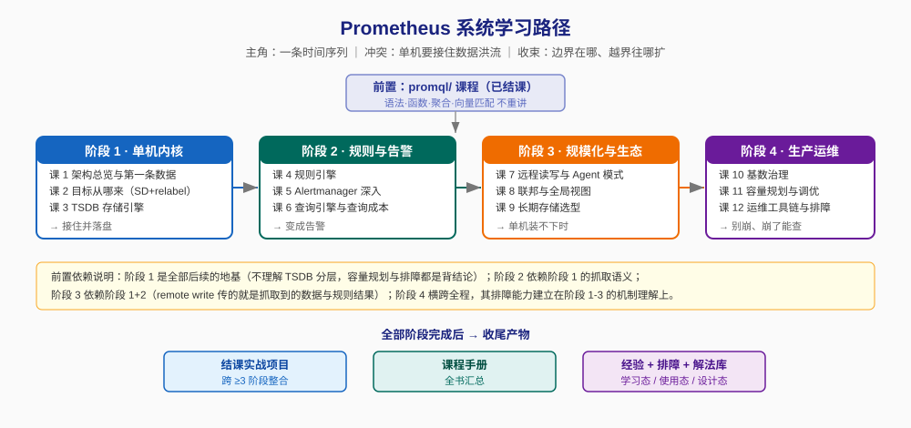

# Prometheus 学习路径总览

> 本文件是活文档，随学习进度动态调整。
> **课程定位**：讲「Prometheus 这个系统本身怎么工作」，不是讲 PromQL 查询语言（那门课在 `../promql/`，已结课）。

## 🎯 学习目标

- **目标类型**：动手实操 + 理解机制
- **目标说明**：能独立部署、调优、排障一套生产级 Prometheus，并能说清一个样本从被抓取到被告警的完整链路；面对"该不该上 Thanos""要不要切 native histogram"这类问题时能做出有依据的判断。
- **前置要求**：已完成 `../promql/` 课程（或等效的 PromQL 能力）。本课的 PromQL 语法一律不重讲。

> 学习目标是全局基准，决定各阶段/课的取舍与实操比重。目标变更时更新此处，并同步调整相关课。

## 故事主线

- **主角**：一条叫 `http_requests_total{job="api",instance="10.0.0.1:8080",status="500"}` 的时间序列
- **冲突**：它每 15 秒诞生一个样本，一天 5760 个，乘以十万条序列——这条数据洪流要被接住、存下来、能秒级查、能在出事时叫醒人，而 Prometheus 只是个**单机**程序，没有集群、没有分布式存储
- **收束**：学完能回答"这套单机架构的边界在哪、越界时该往哪个方向扩、以及为什么它这么设计了十年还没被淘汰"

> 整个课程是这条故事线的展开。阶段 1 讲它怎么被接住和存下，阶段 2 讲它怎么变成告警，阶段 3 讲单机装不下时怎么办，阶段 4 讲怎么让它别崩。

## 学习路径图

## 阶段总览

### 阶段 1：单机内核（预计 2–3 周）

- **目标**：能说清一个样本从 target 暴露到落进磁盘的完整路径，能独立配置抓取与改写
- **学习重点**：
  - 拉取模型到底拉了什么（不只是"拉"，还包括元数据、协议协商、失败语义）
  - 目标从哪来：`static_configs` → 服务发现 → relabel 三段改写（这是 Prometheus 配置里最反直觉、也最容易出错的一块）
  - TSDB 的分层结构：head / WAL / block / compaction（**理解了这个，容量规划和排障才有根**）
- **必须掌握**：能看着 `TSDB 目录结构` 说出每个文件的作用；能写一个 relabel_configs 把 `__meta_*` 元标签转成业务标签
- **对应课**：[课 1 架构总览与第一条数据](stages/1-单机内核/lessons/lesson-01-架构总览与第一条数据.md)、[课 2 目标从哪来](stages/1-单机内核/lessons/lesson-02-目标从哪来.md)、[课 3 TSDB 存储引擎](stages/1-单机内核/lessons/lesson-03-TSDB存储引擎.md)

### 阶段 2：规则与告警（预计 2 周）

- **目标**：能解释规则组何时求值、告警为什么抖、Alertmanager 怎么把 1000 条告警压成 1 条通知
- **学习重点**：
  - 规则组评估机制与 `evaluation_interval` 的真实含义（**不是"多久检查一次"那么简单**）
  - Alertmanager 的分组 / 抑制 / 静默 / 路由树四件套，以及 alert 状态机
  - 查询引擎怎么执行 PromQL、staleness 机制、查询成本的来源
- **必须掌握**：能画出一条告警从 firing 到收到通知的完整时序；能说清 `for` 与 `group_wait` 的交互
- **对应课**：课 4 规则引擎、课 5 Alertmanager 深入、课 6 查询引擎与查询成本

### 阶段 3：规模化与生态（预计 2–3 周）

- **目标**：能判断"单机装不下时该往哪走"，并对 Thanos / Mimir / VictoriaMetrics 给出有依据的选型
- **学习重点**：
  - remote write 的队列、重试、WAL 重放语义（**丢数据的重灾区**）
  - 联邦与 HA 双写的真实代价，external labels 为什么错了会毁掉全局查询
  - 三条长期存储路线的架构差异与选型决策框架
- **必须掌握**：能画出 remote write 的完整数据路径并指出每个可能的丢数据点；能给出选型结论并说明代价
- **对应课**：课 7 远程读写与 Agent 模式、课 8 联邦与全局视图、课 9 长期存储选型

### 阶段 4：生产运维（预计 2 周）

- **目标**：能让一套 Prometheus 长期稳定跑着不崩，崩了能快速定位
- **学习重点**：
  - 基数（cardinality）是 Prometheus 的头号杀手——来源、诊断、控制
  - 容量估算的实测方法（不是拍脑袋的"每序列 2 字节"）
  - promtool、TSDB admin API、排障方法论
- **必须掌握**：能独立诊断一次 Prometheus OOM 的根因；能用 promtool 在做变更前验证规则与配置
- **对应课**：课 10 基数治理、课 11 容量规划与调优、课 12 运维工具链与排障

## 当前进度

- [x] 阶段 1：单机内核（✅ 已完成 2026-09-04 — 课 1-3 全部交付，9/9 知识点）
- [x] 阶段 2：规则与告警（✅ 已完成 2026-09-04 — 课 4、5、6 全部交付，9/9 知识点）
- [x] 阶段 3：规模化与生态（**已完成** — 课 7 ✅、课 8 ✅、课 9 ✅ 全部交付 2026-09-07，9/9 知识点；课 9 过事实核查闸门，核查 13 条版本漂移）
- [x] 阶段 4：生产运维（✅ 已完成 — 课 10、课 11、课 12 全部交付 2026-09-07，9/9 知识点）
- [x] **综合实战项目**（Phase 3 ✅ 已完成 2026-09-07 — 《多集群统一监控平台》，10 容器完整可运行，验收 13/13 PASS）

> 总进度：**36/36 知识点**（阶段 1–4 各 9 个，全部完成）+ **综合实战项目已完成**。
> ✅ Phase 4 课程手册汇总已于 2026-09-08 完成（[final-课程手册.md](final-课程手册.md)）。
> ✅ Phase 5 收尾三件套已于 2026-09-07 交付完成。
> 🎉 **Prometheus 课程全部完结**：36/36 知识点 + 综合实战项目 + 三件套 + 课程手册。

## 综合实战项目

- **项目名**：[多集群统一监控平台](projects/多集群统一监控平台/README.md)
- **一句话**：三环境（prod/staging/dev）Prometheus → Mimir 长期存储 → 全局查询视图 + 分层告警
- **覆盖**：阶段 1（3 个知识点）、阶段 2（3 个）、阶段 3（5 个）、阶段 4（3 个）——**四阶段全覆盖**
- **规模**：10 容器、14 个实现文件、3 个真权衡决策
- **验收**：`cd 实现/ && docker compose up -d && ./verify.sh` → 13 项断言全 PASS

## 环境说明

所有实操在 **WSL Ubuntu 24.04.4 LTS + Docker 29.4.1** 内完成，版本基线：

| 组件 | 版本 |
|------|------|
| Prometheus | 3.14.0 |
| Alertmanager | 0.30.0 |
| node_exporter | 1.10.2 |
| Pushgateway | 1.11.1 |

> 详见 [00-学习档案.md](00-学习档案.md) 的「环境基线」章节。Windows 侧无 docker 命令，须经 `bash.exe -c "..."` 执行。
