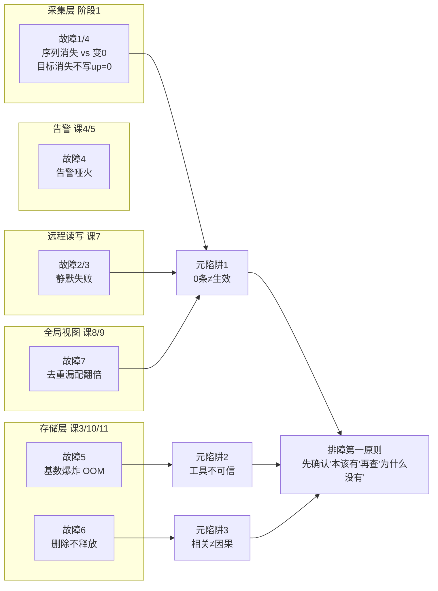

# Prometheus 实战经验

> 这份材料讲的是**课堂不教的那一半**：什么时候不该用、会怎么崩、崩了怎么查。
> 出事时别翻这份，翻 [09-排障速查手册.md](09-排障速查手册.md)。
>
> 本材料生成于**课程已完成阶段**（12 课 + 综合实战项目均完成）。
> 所有标注「实测」的数字均来自本机真实环境（WSL Ubuntu 24.04 + Docker 29.4.1 +
> Prometheus v3.14.0 + Mimir 3.2.0），**未实测的一律显式标注**，不拿推演冒充实测。

## 适用边界与反模式

> "不该用"比"怎么用"更值钱——这是从"会用"到"用对"的分界线。

| 场景 | 为什么不适合 | 该用什么替代 |
|------|-------------|-------------|
| **要 100% 精确的计费/对账** | Prometheus 是**采样**存储：抓取间隔 15s，失败就丢点 | 业务库精确流水，Prometheus 只做趋势 |
| **要保存原始事件明细** | 指标是聚合后的数字，「哪个用户 3 点 14 分失败」它答不了 | 日志（Loki/ELK）+ 链路追踪 |
| **高基数字段分析**（user_id / order_no） | 每个取值一条新序列，历史上多次 OOM 事故的根因 | 日志与数仓 |
| **亚秒级精度告警** | 抓取间隔 + 评估间隔 + `for` 叠加，最快十几秒级 | 客户端埋点直报 / 流式计算 |
| **年级数据归档** | 本地默认只留 15 天 | Thanos / Mimir / VM 长期存储 |
| **分位数跨实例平均** | 分位数**不可加**，3 个实例的 P95 求平均是数学错误 | 先 `sum by (le)` 合并桶再算 |

### 高频反模式（能跑，但迟早出事）

1. **用 `xxx == 0` 判断服务存活**：抓取失败写的是 stale marker，序列**直接消失**不是变 0 → 必须用 `up == 0`（课 1 实测）
2. **目标消失还指望 `up=0`**：从 SD 名单消失后 target 直接移除，**连 `up=0` 都不写** → K8s 缩容后告警静默的经典根因，要用 `absent()`（课 2 实测）
3. **全局开 `honor_labels: true`**：把身份控制权交给被监控方，两个应用写相同 `instance` 会**静默混数据** → 只在联邦和 Pushgateway 开（课 2 实测）
4. **用 `in - sent` 判断 remote write 丢数据**：两者口径不同，实测有约 **-1450 的恒定偏移**，不是丢失 → 看 `failed_total` 和是否单调扩大（课 7 实测）
5. **后端慢就加 shard**：shard 解决"发得慢"，不解决"发不出"。后端 5xx 时加并发只会让 500 来得更快（课 7）
6. **用 `count({__name__=~".+"})` 做日常监控**：它扫全库，命中全部序列才真的贵（课 6 实测 0.12s → 0.36s）
7. **拿单次 `docker stats` 当容量依据**：并发查询峰值是稳态的 **2.96 倍**（课 11 实测）
8. **按稳态内存配 limit**：同上，必须留 2~3 倍余量
9. **告警阈值抄别人的**：阈值必须基于自己环境的水位实测（课 11 实测：阈值贴着水位会变成永久 firing 的狼来了）
10. **`scrape_timeout` > `scrape_interval`**：**启动即失败**，不会带病运行（课 11 实测）


---

## 高频故障模式

> 每条固定**五段式**：症状 → 根因 → 排查路径 → 修复 → 预防。
> 全部症状均为**可观测**的具体现象。

### 故障模式 1：remote write 一直失败，但没有任何报错

- **症状（可观测）**：全局视图查不到数据；Prometheus 日志**没有 error**；`up` 指标正常；targets 页面全绿
- **根因**：remote write 的失败**不体现为报错**。
  - 后端返回 500 是**可重试错误**，`failed_total` **不计数**（课 7 实测：后端挂掉时 `failed = 0`）
  - 队列满（`pending > capacity`）**也不丢数据**——外面还有 WAL 兜底（课 7 实测 `pending` 可达 1199 > capacity 1000）
  - 真正的 silent killer 是 **WAL 截断**：它甚至不产生任何"失败"指标
- **排查路径**：
  1. 查 `prometheus_remote_storage_samples_failed_total`（永久失败，**真正丢数据**）
  2. 查 `prometheus_remote_storage_samples_retried_total`（重试，说明后端在报错）
  3. 查 `prometheus_remote_storage_pending_samples` 的**趋势**——持续上涨才是问题
  4. ⚠️ **不要用 `samples_in_total - samples_total` 算丢失**：两者标签口径不同，实测有约 **-1450 的恒定偏移**
- **修复**：先恢复后端；`pending` 积压会在恢复后快速回落（课 7 实测：1199 → 100 以下约 30 秒，因为恢复期发送速率是正常的约 2 倍）
- **预防**：给 `failed_total > 0`、`retried_total` 增长率、`pending` 持续高位配告警；并**配一条监控链路自身的告警**（否则链路断了三天你都不知道）

> 对应速查条目：[09-排障速查手册.md](09-排障速查手册.md) · 症状 4

---

### 故障模式 2：remote read 查不到数据，接口却说成功

- **症状（可观测）**：查询返回 `{"status":"success"}`，`result` 是**空数组**；Grafana 显示 "No Data"；**没有任何报错**
- **根因**：remote read 的失败是**静默**的，真实原因被塞进 `warnings` 字段。
  课 7 实测：VictoriaMetrics 单节点版不支持 `/api/v1/read` 路径，返回 400，但 Prometheus 侧：

  ```json
  {"status":"success", "data":{"resultType":"vector","result":[]}, "warnings":["..."]}
  ```

  **这是本课程第三次遇到同类陷阱**（课 6 recording rule 未生效、课 8 webhook 地址写错 DNS 失败）。
  共同点：**"0 条"和"生效了"在观察结果上完全一样**。
- **排查路径**：
  1. **永远先看完整的 JSON 响应**，特别是 `warnings` 字段——只看 `status` 会漏掉一切
  2. 用 `-v` 或直接看原始响应体，不要只看 Grafana 的 "No Data"
- **修复**：换成支持 `/api/v1/read` 的后端，或改用 remote write + 查询走远端原生 API
- **预防**：把"检查 `warnings`"写进排障 SOP 第一条

> 对应速查条目：[09-排障速查手册.md](09-排障速查手册.md) · 症状 2

---

### 故障模式 3：全局视图查不到任何数据（external_labels 污染）

- **症状（可观测）**：全局层 `/api/v1/query` 返回 `status=success`、`result` 为空、`warnings` 为空；
  但直接查 Mimir 数据**明明都在**
- **根因**：**全局层自己配了 `external_labels`**，而这个标签会被**附加到 remote read 的查询选择器**上。

  实战项目中实测抓到的 Mimir 访问日志：

  ```
  param_matchers_0="{__name__=\"up\",cluster=\"global\"}"   response_series_count=0   status=success
  ```

  全局层写了 `cluster: global`，于是它查的是"cluster=global 的数据"——
  而真实 cluster 是 `prod-shanghai` / `staging-shanghai` / `dev-shanghai`，**永远匹配不上**。

  这是 external_labels **三段式**的 read 分支：
  | 阶段 | external_labels 的行为 |
  |------|----------------------|
  | remote **write** 时 | 附加到**发出的样本**上 |
  | remote **read** 时 | 附加到**查询选择器**上（本故障的成因） |
  | 返回给客户端时 | 从结果中**剥离** |
- **排查路径**：
  1. 先确认 Mimir 侧数据存在（带 `X-Scope-OrgID` 直查）
  2. 看 **Mimir / 后端的访问日志**，找 `param_matchers`——这是唯一能看到真实查询条件的地方
  3. 对比：日志里的 matcher 是否多了你没写的标签
- **修复**：**全局查询层删掉 `external_labels`**。它只做查询，不该给自己贴身份标签
- **预防**：记住"写入方贴标签，查询方不贴"。联邦的叶子节点要贴，全局节点不贴

> 对应速查条目：[09-排障速查手册.md](09-排障速查手册.md) · 症状 3


---

### 故障模式 4：服务真的挂了，告警却一条不响

- **症状（可观测）**：服务不可用，但 Alertmanager 里空空如也；或者反过来，告警在 Prometheus 里 firing，却没人收到通知
- **根因**：三种不同成因，必须分开看

  | 成因 | 机制 | 出处 |
  |------|------|------|
  | **用业务指标判存活** | 抓取失败时业务序列**消失**不是变 0，`xxx == 0` 永远不成立 | 课 1 实测 |
  | **目标从 SD 消失** | target 直接移除，**连 `up=0` 都不写**，`up==0` 规则不触发 | 课 2 实测（K8s 缩容经典场景） |
  | **Alertmanager 地址配错** | 规则管理器仍显示 firing，但推送失败；告警"在响却没人收到" | 课 1 |

- **排查路径**：
  1. 先区分是"没产生告警"还是"产生了没送达"：查 Prometheus `/api/v1/rules` 看状态，再查 Alertmanager `/api/v2/alerts`
  2. 若规则没触发 → 检查用的是 `up` 还是业务指标；检查 target 是否还在列表里
  3. 若规则在 firing 但 AM 没有 → 查 Prometheus 日志里的推送失败
- **修复**：存活判断一律用 `up == 0`；目标可能消失的场景补 `absent()`
- **预防**：把 `up` 和 `absent()` 配成基础告警，别依赖业务指标判存活

> 对应速查条目：[09-排障速查手册.md](09-排障速查手册.md) · 症状 5

---

### 故障模式 5：序列数悄悄涨到 OOM，所有 target 都是绿的

- **症状（可观测）**：Prometheus 内存缓慢上涨 → 某天凌晨 OOM 被 kill。
  **期间所有 target `up=1`，没有任何一条告警报"基数爆炸"**
- **根因**：基数膨胀在业务指标上看起来"很正常"——每个指标都还在，只是组合数变多了。
  两个放大器：
  - **标签笛卡尔积**：加一个 1000 种取值的标签，序列数 ×1000（课 3：序列数 = 标签值组合数）
  - **histogram 桶放大**：一个 histogram 按桶展开成 N 条序列。
    实战项目实测：8 个桶边界（`0.01/0.05/0.1/0.25/0.5/1.0/2.5/+Inf`），
    bucket 序列 96 条；课 10 实测 11 个自定义桶 + `+Inf` = 12 桶 × 3 route = **36 条**
- **排查路径**：
  1. `prometheus_tsdb_head_series`（**必须先配 self-scrape**，否则查不到——课 10/11 亲历）
  2. `topk(10, count by (__name__)({__name__=~".+"}))` 找最大头
  3. `count by (job) (up)` 定位是哪个 job 在涨
  4. ⚠️ **日常监控不要用 `count({__name__=~".+"})`**，它扫全库
- **修复**：抓取端三件套——`metric_relabel_configs` drop 高基数标签 / `sample_limit` / `label_limit`
- **预防**：给 `head_series` 的**增长率**配告警（不是绝对值）；知道自己的基线

> ⚠️ **`sample_limit` / `label_limit` 是熔断不是限流**：触发后整个 target `up=0`（课 10 实测：
> `scrape_samples_scraped=3573` 抓取发生了，但 `health=down`、`up=0`）。
> 且 `label_limit` 是 **per-target 全局**的，会误伤标签多的正常指标（课 10 实测拦在了 GC 指标上）。

> 对应速查条目：[09-排障速查手册.md](09-排障速查手册.md) · 症状 6

---

### 故障模式 6：删了数据，磁盘一点没小

- **症状（可观测）**：`delete_series` 返回 **204**，但磁盘占用纹丝不动
- **根因**：删除只写 **tombstone**（墓碑标记），**物理删除要等 compaction**。
  更深一层：**保留策略按整个 block 删，不按序列删**（课 3 实测：61 个 block 设 `retention.time=2h` 后剩 5 个，
  日志全是 `Deleting obsolete block`，没有任何逐序列删除记录）
- **排查路径**：
  1. 确认是"删了没释放"还是"根本没删"：查 tombstone 数量
  2. 用 admin API `cleanTombstones` 强制清理（课 12 实测）
  3. 确认 compaction 是否真的跑了
- **修复**：`cleanTombstones` + 等 compaction；或调整 retention 让它整块过期
- **预防**：**"精确保留 N 天"是不可能的**——磁盘占用会在 block 周期上波动，容量规划要留余量

> 对应速查条目：[09-排障速查手册.md](09-排障速查手册.md) · 症状 7


---

### 故障模式 7：聚合查询全部翻倍，且没有任何报错

- **症状（可观测）**：所有 `sum` / `avg` / `count` 的结果都是预期的**两倍**，但不报任何错
- **根因**：HA 副本去重**漏配**。Thanos 需要 `--query.replica-label` 才去重，
  漏配时两个副本的数据都被算进去。
  课 9 实测：设对了 `sum = 62162`，漏配 `sum = 124347`——**精确翻倍，且不报错**

  三个方案的"去重"**并不等价**（课 9 实测结论）：
  | 方案 | 去重机制 | 漏配后果 |
  |------|---------|---------|
  | Thanos | 查询层去重，需显式配 `--query.replica-label` | 聚合翻倍（实测 62162 vs 124347） |
  | Mimir | HA tracker | 依赖正确配置 |
  | VM | 写入/查询时按 `dedup.minScrapeInterval` 合并**标签完全相同**的序列 | 值跳变（课 8 实测 4605.37 ~ 4670.70） |
- **排查路径**：
  1. 先确认是不是真的翻倍：找一个已知答案的指标对比单副本 vs 双副本结果
  2. 检查去重相关 flag / 配置是否存在
- **修复**：补上 replica-label 配置
- **预防**：部署后**必须用一个已知答案的查询验证去重生效**。
  ⚠️ 注意"0 条"可能是配置没生效，也可能是去重成功——**二者观察结果一样，含义相反**

> 对应速查条目：[09-排障速查手册.md](09-排障速查手册.md) · 症状 8

---

### 故障模式 8：配置改了却不生效

- **症状（可观测）**：reload 成功、日志无报错，但行为没变
- **根因**：三类，实测各有出处

  | 现象 | 原因 | 出处 |
  |------|------|------|
  | **retention 改小不生效** | retention **不支持热加载**，必须重启 | 课 11 实测 |
  | **新规则查不到数据** | 新增规则要等**一个完整 `interval`** 才产出数据（课 6 实测 `interval: 5s` 要等约 45 秒） | 课 4 / 课 6 实测 |
  | **规则没加载** | `rule_files` 没在 `prometheus.yml` 里声明 | 课 6 实测 |
  | **`promtool check config` 过了但 relabel 无效** | 它**不查元标签是否存在**（实测放行 `__meta_nonexistent__`） | 课 12 实测 |
  | **remote write 字段名写错却没报错** | 只在启动/reload 时报错，之后**静默使用默认值** | 课 7 实测 |

- **排查路径**：先分清"配置没加载"还是"加载了但没到生效时机"，再看是否需要重启
- **修复**：按上表对应处理
- **预防**：改配置后用 `promtool` 预检；改 retention 直接安排重启

> 对应速查条目：[09-排障速查手册.md](09-排障速查手册.md) · 症状 9

---

## 本课程反复出现的三个元陷阱

> 这三条不是某个组件的坑，是**贯穿 12 课的思维陷阱**。它们才是真正值钱的部分。

### 元陷阱 1：「0 条」不等于「生效了」

本课程**至少遇到过 5 次**（课 9 明确记录"这是第三次"）：

| 出处 | 观察到的"0" | 真实含义 |
|------|------------|---------|
| 课 6 | recording rule 查询 0 条 | 规则**没生效**，测的是查空指标的开销 |
| 课 8 | webhook 收到 0 条通知 | 地址写成遗留容器名，**DNS 失败**，不是去重成功 |
| 课 9 | `tools bucket` 校验全 ACCEPTED | 工具报错掩盖了真实校验结果 |
| 课 7 | remote read 返回 0 条 + status=success | 后端**不支持该路径** |
| 实战项目 | 全局视图 0 条 + status=success | external_labels 污染了查询条件 |

**自问**：我看到"没有数据"时，有没有先确认"数据本该存在"？

### 元陷阱 2：用可能出错的工具验证可能出错的组件

课 12 的原话：**排障最大的坑是用可能出错的工具去验证可能出错的组件**。

- `promtool check config` 过了 ≠ 配置对（不查元标签）
- `promtool check healthy` **探不了远端**（实测它连的是硬编码 `localhost:9090`）
- `up=1` ≠ 健康（基数可以在所有 target 都绿的时候涨到 OOM）
- `scrape_duration_seconds` 在 target down 时**不可信**（超时时它被截断，课 12 实测 1.0009s vs 真实 5.99s）

**自问**：我这个判断依据，本身会不会也在故障影响范围内？

### 元陷阱 3：把「相关」当成「因果」

- 「正则慢所以要避免 `.*`」→ 课 6 实测推翻：等值 126.2ms vs 无界正则 123.5ms，
  差 2.7ms，**远小于** 10ms 标准差。真正贵的是**命中多少条**，不是正则本身
- 「加 step 图就不准了」→ 未必，取决于你要看什么
- 「磁盘满了是 retention 没生效」→ 可能是 compaction 还没跑

**自问**：我有没有做过对照实验，确认两组真的触发了不同代码路径？

---

## 一图总结：故障模式与知识点映射



---

## 课程导航

- **上一份**：[综合实战项目](projects/多集群统一监控平台/README.md) —— 三环境统一监控平台
- **下一份**：[09-排障速查手册.md](09-排障速查手册.md) —— 出事时翻这份
- **配套**：[10-场景解法库.md](10-场景解法库.md) —— 要设计时读这份
- **回索引**：[02-课程目录.md](02-课程目录.md)

> 想深挖某条故障的机制原理，回对应课文：
> 故障 1 → [课 7](stages/3-规模化与生态/lessons/lesson-07-远程读写与Agent模式.md) ｜
> 故障 2/3 → [课 7](stages/3-规模化与生态/lessons/lesson-07-远程读写与Agent模式.md) ｜
> 故障 4 → [课 1](stages/1-单机内核/lessons/lesson-01-架构总览与第一条数据.md)、[课 2](stages/1-单机内核/lessons/lesson-02-目标从哪来.md) ｜
> 故障 5 → [课 10](stages/4-生产运维/lessons/lesson-10-基数治理.md) ｜
> 故障 6 → [课 3](stages/1-单机内核/lessons/lesson-03-TSDB存储引擎.md)、[课 12](stages/4-生产运维/lessons/lesson-12-运维工具链与排障.md) ｜
> 故障 7 → [课 9](stages/3-规模化与生态/lessons/lesson-09-长期存储选型.md)
