# Prometheus 系统学习 · 课程手册

> 本手册是 12 课 + 综合实战项目的**汇总索引与主线串联**。
> 想看某课的完整推演、实操命令与评审记录，点各课的链接进原文——**手册不替代课文**。
>
> 配套三件套（学完之后看）：[实战经验](08-实战经验.md) ｜ [排障速查手册](09-排障速查手册.md) ｜ [场景解法库](10-场景解法库.md)
>
> **课程定位**：讲「Prometheus 这个系统本身怎么工作」，不是讲 PromQL 查询语言（那门课在 `../promql/`，已结课）。
> 本手册一律不重讲 PromQL 语法，但会标注哪些结论与 PromQL 课程互补。

## 怎么读这份手册

| 你现在的状态 | 从这里开始 |
|------------|-----------|
| 第一次接触，想先建立全局印象 | 先看「故事主线」，再看「阶段总览」 |
| 学完了，想复习某个知识点 | 用「知识点总索引」定位，点进对应课 |
| 忘了某个数字，想快速查 | 「全局速查：最容易忘的硬数字」 |
| 想知道这套东西能干嘛 | 「综合实战项目」+ [场景解法库](10-场景解法库.md) |
| 生产出事了 | **别看这份**，直接翻 [09-排障速查手册.md](09-排障速查手册.md) |

## 故事主线：一条序列的一生

- **主角**：`http_requests_total{job="api",instance="10.0.0.1:8080",status="500"}` —— 一条时间序列
- **冲突**：它每 15 秒诞生一个样本，一天 5760 个，乘以十万条序列——这条数据洪流要被接住、存下来、能秒级查、能在出事时叫醒人，而 **Prometheus 只是个单机程序**，没有集群、没有分布式存储
- **收束**：学完能回答"这套单机架构的边界在哪、越界时该往哪个方向扩、以及为什么它这么设计了十年还没被淘汰"

四个阶段就是这条故事线的四幕：

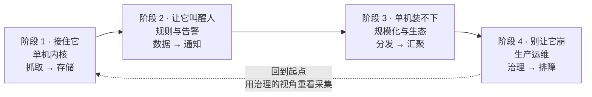

> 注意最后那条**回边**：学完阶段 4 的基数治理，你会重新理解阶段 1 的标签设计——
> 这不是循环，是螺旋。课程里很多"当时觉得懂了"的点，都要到后面才真正闭合。

---

## 全局速查：最容易忘的硬数字

> 全部为本机实测（WSL Ubuntu 24.04.4 LTS + Docker 29.4.1 + Prometheus 3.14.0）。
> **未实测的一律标注**，不拿推演冒充实测。

### 环境基线

| 组件 | 版本 |
|------|------|
| Prometheus | 3.14.0 |
| Alertmanager | 0.30.0 |
| node_exporter | 1.10.2 |
| Pushgateway | 1.11.1 |
| Mimir | 3.2.0 |
| 操作系统 | WSL Ubuntu 24.04.4 LTS |
| Docker | 29.4.1 |

### 存储与容量

| 项 | 实测值 | 出处 |
|----|-------|------|
| 每序列内存（1 标签） | **1.662 KiB**（拟合 R²=0.9969） | 课 11 |
| 每标签内存 | **0.202 KiB/序列** | 课 11 |
| 空实例内存 | **29.10 MiB**（拟合截距 27.71 MiB，互相印证） | 课 11 |
| 并发查询峰值 / 稳态 | **2.96 倍** | 课 11 |
| 保留删除粒度 | **按整个 block 删**，不按序列删 | 课 3 |

### 抓取与序列

| 项 | 实测值 | 出处 |
|----|-------|------|
| 序列数 = ? | **标签值组合数**（笛卡尔积） | 课 3 |
| histogram 放大 | 11 桶 + `+Inf` = 12 条/维度（3 route → 36 条） | 课 10 |
| `sample_limit` 触发后 | 整个 target **`up=0`**（是熔断不是限流） | 课 10 |
| target down 时的 `scrape_duration_seconds` | **不可信**，被截断（显示 1.0009s vs 真实 5.99s） | 课 12 |

### 告警链路

| 项 | 实测值 | 出处 |
|----|-------|------|
| prod 故障 → Alertmanager 收到 | **38 秒** | 实战项目 |
| prod 故障 → pager 送达 | **40 秒** | 实战项目 |
| `for: 1m` 的降噪效果 | 告警段数 21 → 8 | 课 11 |
| 路由树匹配语义 | **命中即停**（不是找最精确） | 课 5 |

### 查询成本

| 项 | 实测值 | 出处 |
|----|-------|------|
| 噪声基线 | 中位数 131.5ms，波动 113.0~140.2ms（±27ms） | 课 6 |
| 正则 vs 等值 | 无界正则 123.5ms vs 等值 126.2ms——**差 2.7ms，远小于噪声** | 课 6 |
| 降本最有效的手段 | 减**点数**（加大 step / 缩短窗口），实测降 6.7 倍 | 课 6 |
| recording rule 预聚合 | 降 26%~56% | 课 6 |
| remote read 查询放大 | **2.69 倍**起 | 课 7 |

### 远程读写

| 项 | 实测值 | 出处 |
|----|-------|------|
| 后端 500 时 `failed_total` | **不计数**（500 是可重试错误） | 课 7 |
| 队列满时丢数据吗 | **不丢**，外面有 WAL 兜底（`pending` 可达 1199 > capacity 1000） | 课 7 |
| `in - sent` 能算丢失吗 | **不能**，口径不同，有约 **-1450 的恒定偏移** | 课 7 |
| remote read 失败的表现 | `status=success` + 空结果，原因在 **`warnings`** | 课 7 |


---

## 知识点总索引

36 个知识点，按"你会在什么场景用到它"重新组织（不是按课序）。

| 我想搞清楚… | 知识点 | 课 |
|-----------|-------|-----|
| Prometheus 内部有哪些部件、各自管什么 | 整体架构与组件边界 | [课 1](stages/1-单机内核/lessons/lesson-01-架构总览与第一条数据.md) |
| "拉取"到底拉了什么，失败时会怎样 | 拉取模型的完整语义 | [课 1](stages/1-单机内核/lessons/lesson-01-架构总览与第一条数据.md) |
| 我自己的程序怎么暴露指标 | Exporter 生态与指标暴露 | [课 1](stages/1-单机内核/lessons/lesson-01-架构总览与第一条数据.md) |
| 目标列表从哪来、怎么动态发现 | 服务发现机制 | [课 2](stages/1-单机内核/lessons/lesson-02-目标从哪来.md) |
| 标签怎么改写，三段 relabel 有什么区别 | relabel_configs 三段改写 | [课 2](stages/1-单机内核/lessons/lesson-02-目标从哪来.md) |
| 标签冲突了听谁的 | honor_labels 与标签冲突 | [课 2](stages/1-单机内核/lessons/lesson-02-目标从哪来.md) |
| 一条序列在磁盘上是什么 | 物理视角的数据模型 | [课 3](stages/1-单机内核/lessons/lesson-03-TSDB存储引擎.md) |
| 进程崩了数据为什么还在 | WAL 与 checkpoint | [课 3](stages/1-单机内核/lessons/lesson-03-TSDB存储引擎.md) |
| 数据多久归档一次、什么时候被删 | block、compaction 与保留 | [课 3](stages/1-单机内核/lessons/lesson-03-TSDB存储引擎.md) |
| 规则什么时候求值、为什么新规则查不到 | 规则组与评估机制 | [课 4](stages/2-规则与告警/lessons/lesson-04-规则引擎.md) |
| 怎么把贵查询固化下来 | recording rules | [课 4](stages/2-规则与告警/lessons/lesson-04-规则引擎.md) |
| 告警从产生到 firing 经历了什么 | 告警规则与状态机 | [课 4](stages/2-规则与告警/lessons/lesson-04-规则引擎.md) |
| 1000 条告警怎么压成 1 条通知 | 告警的到达与去重（分组） | [课 5](stages/2-规则与告警/lessons/lesson-05-Alertmanager深入.md) |
| 告警该发给谁 | 路由树与匹配 | [课 5](stages/2-规则与告警/lessons/lesson-05-Alertmanager深入.md) |
| 怎么让告警临时闭嘴 | 抑制、静默与时间窗口 | [课 5](stages/2-规则与告警/lessons/lesson-05-Alertmanager深入.md) |
| 一条 PromQL 是怎么被执行的 | PromQL 执行流程 | [课 6](stages/2-规则与告警/lessons/lesson-06-查询引擎与查询成本.md) |
| 消失的目标为什么返回空而不是 0 | staleness marker 与 lookback delta | [课 6](stages/2-规则与告警/lessons/lesson-06-查询引擎与查询成本.md) |
| 查询太慢怎么改便宜 | 查询成本控制 | [课 6](stages/2-规则与告警/lessons/lesson-06-查询引擎与查询成本.md) |
| 数据怎么发到远端、会不会丢 | remote write 协议与队列 | [课 7](stages/3-规模化与生态/lessons/lesson-07-远程读写与Agent模式.md) |
| 怎么查远端的历史数据 | remote read | [课 7](stages/3-规模化与生态/lessons/lesson-07-远程读写与Agent模式.md) |
| 只要采集不要存储和告警的模式 | Agent 模式 | [课 7](stages/3-规模化与生态/lessons/lesson-07-远程读写与Agent模式.md) |
| 多台 Prometheus 怎么汇总（联邦） | federation | [课 8](stages/3-规模化与生态/lessons/lesson-08-联邦与全局视图.md) |
| 双副本下的数据一致性 | HA 与数据一致性 | [课 8](stages/3-规模化与生态/lessons/lesson-08-联邦与全局视图.md) |
| external labels 到底该怎么配 | external labels 的正确用法 | [课 8](stages/3-规模化与生态/lessons/lesson-08-联邦与全局视图.md) |
| Thanos / Mimir / VM 架构差在哪 | 三种架构路线的组件与数据流 | [课 9](stages/3-规模化与生态/lessons/lesson-09-长期存储选型.md) |
| 我该选哪个长期存储 | 选型决策框架 | [课 9](stages/3-规模化与生态/lessons/lesson-09-长期存储选型.md) |
| Prometheus 和 OTel 什么关系 | 与 OpenTelemetry 的关系边界 | [课 9](stages/3-规模化与生态/lessons/lesson-09-长期存储选型.md) |
| remote read 两种模式的区别 | remote read 两种模式 | [课 9](stages/3-规模化与生态/lessons/lesson-09-长期存储选型.md) |
| 序列数暴涨的原因 | 基数的来源与量级 | [课 10](stages/4-生产运维/lessons/lesson-10-基数治理.md) |
| 怎么找出是谁在涨 | 诊断高基数 | [课 10](stages/4-生产运维/lessons/lesson-10-基数治理.md) |
| 怎么控制基数、副作用是什么 | 控制手段 | [课 10](stages/4-生产运维/lessons/lesson-10-基数治理.md) |
| 要多少内存和磁盘 | 内存与磁盘估算 | [课 11](stages/4-生产运维/lessons/lesson-11-容量规划与调优.md) |
| 有哪些关键调优参数 | 关键调优参数 | [课 11](stages/4-生产运维/lessons/lesson-11-容量规划与调优.md) |
| 怎么监控 Prometheus 自己 | 监控 Prometheus 自身 | [课 11](stages/4-生产运维/lessons/lesson-11-容量规划与调优.md) |
| 变更前怎么验证配置 | promtool 工具链 | [课 12](stages/4-生产运维/lessons/lesson-12-运维工具链与排障.md) |
| 怎么管理 TSDB、删数据 | TSDB 管理与 admin API | [课 12](stages/4-生产运维/lessons/lesson-12-运维工具链与排障.md) |
| 出事了从哪下手 | 排障方法论 | [课 12](stages/4-生产运维/lessons/lesson-12-运维工具链与排障.md) |

---

# 阶段 1 · 单机内核 —— 接住它

> **本阶段目标**：能说清一个样本从 target 的 `/metrics` 端点被抓取、解析、到落进 TSDB 磁盘的完整路径，
> 并指出每一步可能失败的地方。

**阶段一图总结**：样本的完整生命周期

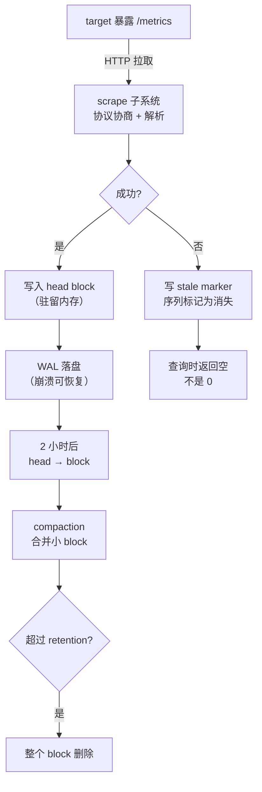

---

## 课 1 · 架构总览与第一条数据

> 完整课文：[lesson-01-架构总览与第一条数据.md](stages/1-单机内核/lessons/lesson-01-架构总览与第一条数据.md)

### 三个知识点

1. **整体架构与组件边界** —— Prometheus 内部四个子系统（scrape / TSDB / rules / HTTP API）各管什么，
   以及 Alertmanager、Pushgateway、exporter 各自为什么存在
2. **拉取模型的完整语义** —— 不只是"定期来拉"：它拉**带类型的文本**，会协商协议，会记录元数据，
   **失败时有明确的 staleness 语义**
3. **Exporter 生态与指标暴露** —— 三种形态：原生暴露 / 独立 exporter / Pushgateway 中转

### 本课最重要的一句话

> 目标挂了之后，查询返回的是**断的**，不是 **0**。

这条语义贯穿全课：它是后面讲告警抖动（课 4）、查询断点（课 6）、
以及"为什么不能用 `xxx == 0` 判存活"（[故障模式 4](08-实战经验.md)）的根。

### 一图总结

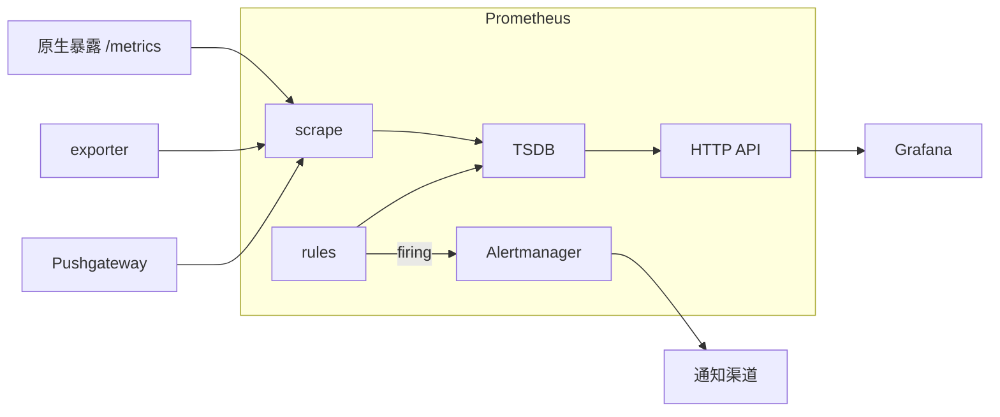

---

## 课 2 · 目标从哪来

> 完整课文：[lesson-02-目标从哪来.md](stages/1-单机内核/lessons/lesson-02-目标从哪来.md)

### 三个知识点

1. **服务发现机制** —— SD 的输出是**一组带 `__meta_*` 的 target**；
   无 K8s 环境下可用 `file_sd_configs` 等价复现动态发现语义
2. **relabel_configs 三段改写** —— `relabel_configs` / `metric_relabel_configs` / `alert_relabel_configs`，
   各有各的作用时机
3. **honor_labels 与标签冲突** —— 三种取值下冲突的解决结果

### 本课最重要的一句话

> **目标从 SD 名单消失 ≠ 抓取失败**。前者 target 直接移除，**连 `up=0` 都不写**。

这是 K8s 缩容后告警静默的经典根因。区分二者：

| 场景 | `up` 的值 | 告警该怎么写 |
|------|----------|-------------|
| 抓取失败（进程在但端口不通） | `up = 0` | `up == 0` |
| 目标消失（缩容 / 下线） | **序列不存在** | `absent(up{...})` |

### 一图总结：relabel 的三段时机

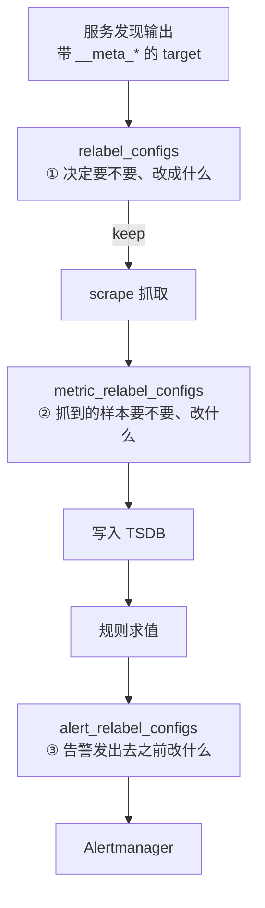

---

## 课 3 · TSDB 存储引擎

> 完整课文：[lesson-03-TSDB存储引擎.md](stages/1-单机内核/lessons/lesson-03-TSDB存储引擎.md)

### 三个知识点

1. **物理视角的数据模型** —— 一条序列 = 一个 series ref；**序列数 = 标签值组合数**
2. **WAL 与 checkpoint** —— 崩溃后重放 WAL 恢复数据，checkpoint 控制 WAL 大小
3. **block、compaction 与保留** —— block 的时间跨度、合并规则、**删除粒度**

### 本课最重要的一句话

> 保留是**按整个 block 删**，不按序列删。

由此推出一个反直觉但很重要的结论：**"精确保留 N 天"是不可能的**。
磁盘占用会在 block 周期上波动，容量规划必须留余量。

实测：61 个 block 设 `retention.time=2h` 后剩 5 个，日志全是 `Deleting obsolete block`，
没有任何逐序列删除的记录。

### 一图总结

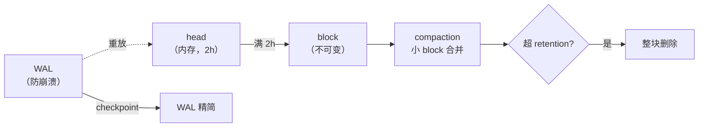

> **与 PromQL 课程的分工**：`promql/` 课 2 讲**逻辑视角**（指标 / 标签 / 时间序列），
> 本课讲**物理视角**（series ref / chunk / block）。两者是同一件事的两个面。


---

# 阶段 2 · 规则与告警 —— 让它叫醒人

> **本阶段目标**：能解释规则组何时求值、告警为什么抖、Alertmanager 怎么把 1000 条告警压成 1 条通知。

**阶段一图总结**：一条告警的完整生命周期

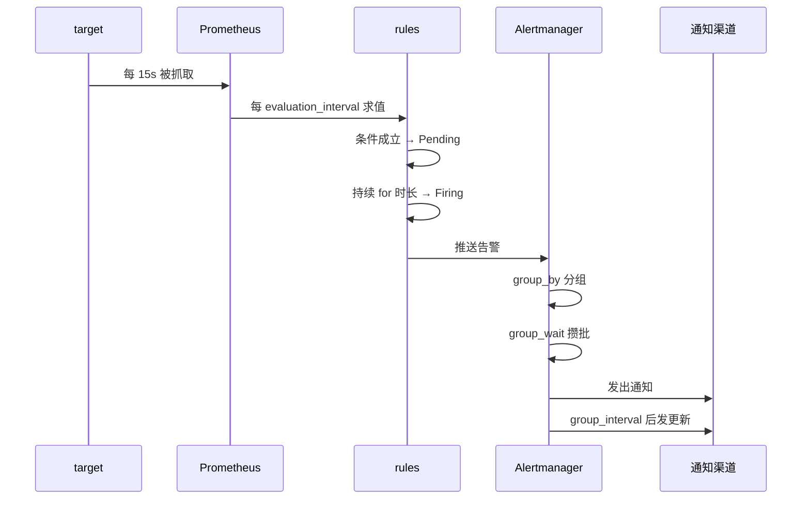

---

## 课 4 · 规则引擎

> 完整课文：[lesson-04-规则引擎.md](stages/2-规则与告警/lessons/lesson-04-规则引擎.md)

### 三个知识点

1. **规则组与评估机制** —— 组内串行、组间并行；`evaluation_interval` 的真实含义
2. **recording rules** —— 把贵查询固化的手段
3. **告警规则与状态机** —— Inactive → Pending → Firing

### 本课最重要的一句话

> 新增的 recording rule **不会立刻有数据**——要等**一个完整的 interval**。

课 6 实测：`interval: 5s` 的规则，实测要等约 **45 秒**才查得到。
这条解释了大量"我明明配了规则为什么查不到"的困惑——
**注意它和"规则没生效"长得一模一样**（见 [元陷阱 1](08-实战经验.md)）。

### 状态机与 `for` 的真实代价

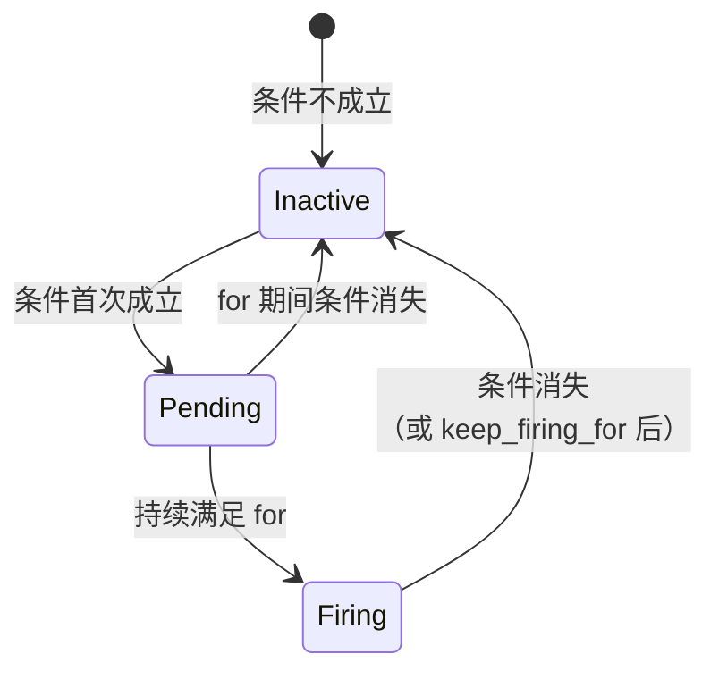

> ⚠️ **`for` 会让告警变慢，这是真的**。别骗自己说"只是过滤抖动"——
> 它的作用是**用延迟换准确率**（课 11 实测：同一段曲线 `for: 1m` 把告警段数从 21 压到 8）。
> 你要决定这个交换值不值。

---

## 课 5 · Alertmanager 深入

> 完整课文：[lesson-05-Alertmanager深入.md](stages/2-规则与告警/lessons/lesson-05-Alertmanager深入.md)

### 三个知识点

1. **告警的到达与去重（分组）** —— 三个时间参数：`group_wait` / `group_interval` / `repeat_interval`
2. **路由树与匹配** —— 三个语义：顺序、**命中即停**、`continue`
3. **抑制、静默与时间窗口** —— 三要素；抑制不能撤回已发出的通知

### 本课最重要的一句话

> 路由**命中即停**，不是找最精确的匹配。

课 5 实测的反面案例：把 `team="payments"` 放在 `NodeDown` 之前，
结果 `NodeDown` 被前者吃掉，infra 团队收到 **0 条**。

**推论（实战项目的设计基础）**：泛化规则必须放最后。

### 三个时间参数（最容易混的一对）

| 参数 | 管什么 | 常见误解 |
|------|-------|---------|
| `group_wait` | 第一条告警来后**攒多久**再发 | 以为是"间隔" |
| `group_interval` | 同组**后续变化**多久发一次 | 和 repeat 搞混 |
| `repeat_interval` | 没变化时多久**重发**一次 | 以为是 group_interval |

### 一图总结：告警的完整生命周期

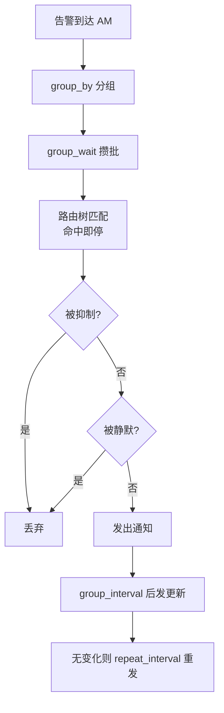

---

## 课 6 · 查询引擎与查询成本

> 完整课文：[lesson-06-查询引擎与查询成本.md](stages/2-规则与告警/lessons/lesson-06-查询引擎与查询成本.md)

### 三个知识点

1. **PromQL 执行流程** —— 一次查询走过的四步
2. **staleness marker 与 lookback delta** —— 为什么消失的目标返回"空"而不是"0"
3. **查询成本控制** —— 怎么把一条贵查询改便宜

### 本课最重要的一句话

> 查询成本 ≈ **序列数 × 点数**。要降本，先减**点数**，不是先减序列数。

课 6 实测：点数从 133 万降到 2 万（67 倍），耗时降 **6.7 倍**——
而减少序列数的降本效果远不如它。

### 本课推翻的三个直觉

| 直觉 | 实测结论 |
|------|---------|
| 「查询慢是因为序列多」 | **不完整**：一条查 1 条序列但 step=1s / 15 天的查询，可能比查 20000 条 / step=60s / 5 分钟的**慢得多** |
| 「正则匹配器很贵，避免 `.*`」 | **错**：无界正则 123.5ms vs 等值 126.2ms，差 2.7ms，**远小于 10ms 标准差**。真正贵的是命中多少条 |
| 「目标挂了查询应该返回 0」 | **错**：返回**空**（staleness + lookback delta 的作用） |

### 本课的方法论（比知识点更重要）

测量任何东西之前，**先测噪声基线**。课 6 实测中位数 131.5ms、波动 ±27ms——
不先测基线，你会把噪声当成结论。正确姿势：

1. 测噪声基线（重复采样取中位数）
2. 把负载放大到**远超噪声带**（否则测不出来）
3. 墙钟耗时 + 返回点数一起看

> ⚠️ **用自监控指标度量单次查询成本不可行**：那些 counter 按 `scrape_interval` 批量更新，
> 无法归因到单次查询（课 6 实测：连跑 5 次只有 1 次采到增量）。


---

# 阶段 3 · 规模化与生态 —— 单机装不下了

> **本阶段目标**：能判断"单机装不下时该往哪走"，并对 Thanos / Mimir / VictoriaMetrics 给出有依据的选型。

**阶段一图总结**：数据怎么走出单机

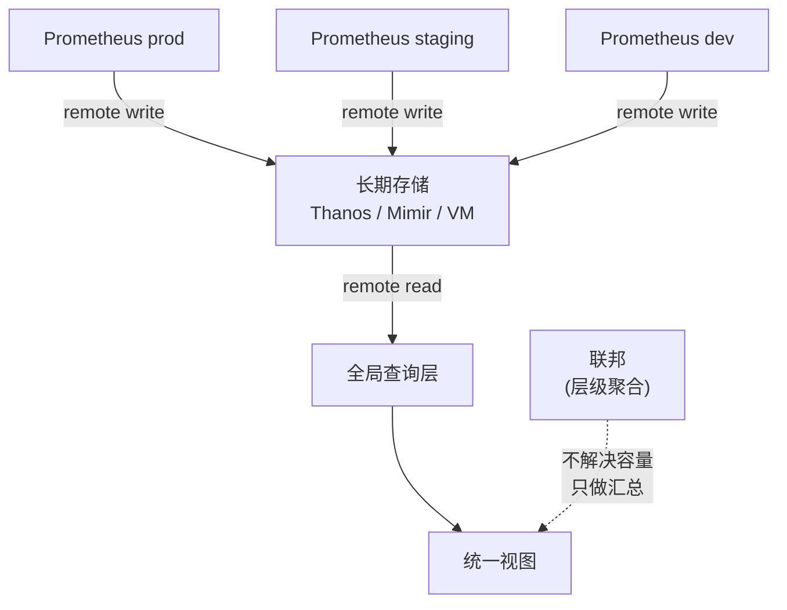

---

## 课 7 · 远程读写与 Agent 模式

> 完整课文：[lesson-07-远程读写与Agent模式.md](stages/3-规模化与生态/lessons/lesson-07-远程读写与Agent模式.md)

### 三个知识点

1. **remote write 协议与队列** —— 队列、重试、WAL 重放语义（**丢数据的重灾区**）
2. **remote read** —— 查历史数据的两种模式
3. **Agent 模式** —— 只要采集，不要存储和告警

### 本课最重要的一句话

> remote write 的失败**不体现为报错**，remote read 的失败是**静默**的（原因在 `warnings` 里）。

这是本课程"静默失败"主题最集中的一课。三个必须记住的语义：

| 你以为 | 实测结论 |
|-------|---------|
| 后端挂了 `failed_total` 会涨 | **不会**——500 是**可重试错误**，不计入 `failed_total`（实测 `failed = 0`） |
| 队列满了会丢数据 | **不会**——外面还有 WAL 兜底（实测 `pending` 可达 1199 > capacity 1000） |
| `in - sent` 能算出丢了少 | **不能**——口径不同，实测有约 **-1450 的恒定偏移** |

### external_labels 的三段式（本课核心）

| 阶段 | 行为 |
|------|------|
| remote **write** 时 | 附加到**发出的样本**上 |
| remote **read** 时 | 附加到**查询选择器**上 ← 全局视图查不到数据的头号根因 |
| 返回客户端时 | 从结果中**剥离** |

> **口诀**：**写入方贴标签，查询方不贴。**
> 实战项目里真实踩过这个坑：全局层写了 `cluster: global`，于是它查的是
> "cluster=global 的数据"，而真实值是 `prod-shanghai` 等——**永远匹配不上，且不报错**。
> 详见 [09-排障速查手册](09-排障速查手册.md) · 症状 3。

### 决策清单：什么时候用什么

| 场景 | 选择 |
|------|------|
| 只采集、集中存储、本地不查 | **Agent 模式** |
| 要留本地查询能力 + 远端备份 | remote write（普通模式） |
| 查历史数据（偶尔） | remote read |
| Grafana 日常仪表盘 | **不要用 remote read**（查询放大 2.69x 起），数据源直连长期存储 |

---

## 课 8 · 联邦与全局视图

> 完整课文：[lesson-08-联邦与全局视图.md](stages/3-规模化与生态/lessons/lesson-08-联邦与全局视图.md)

### 三个知识点

1. **federation** —— 层级聚合
2. **HA 与数据一致性** —— 双副本下的数据差异
3. **external labels 的正确用法**

### 本课最重要的一句话

> **联邦不解决容量问题**——它只是把聚合结果再抓一遍，原始数据仍在叶子节点。

联邦抓的是**聚合后的结果**，因此会**丢失原始维度**。要真正的容量扩展，走 remote write + 长期存储。

### 三个假象与实测

| 假象 | 实测结论 |
|------|---------|
| 「联邦就是把数据同步过来」 | 联邦抓的是**聚合结果**，原始数据仍在叶子节点 |
| 「两个 Prometheus 抓同样目标，数据应一样」 | **不一样**——抓取时刻不同导致值跳变（实测 4605.37 ~ 4670.70） |
| 「AM 起两个副本，通知应只发一条」 | 需要 gossip 配置；配错了会重复发送 |

### 联邦 vs HA vs 远程写

| 维度 | 联邦 | HA 双写 | 远程写 |
|------|------|--------|-------|
| 解决容量 | ❌ | ❌ | ✅ |
| 保留原始维度 | ❌（聚合后丢失） | ✅ | ✅ |
| 数据一致性 | 取决于抓取时刻 | 需后端去重 | 最好 |
| 典型用途 | 层级汇总 | 高可用 | 长期存储 |

---

## 课 9 · 长期存储选型

> 完整课文：[lesson-09-长期存储选型.md](stages/3-规模化与生态/lessons/lesson-09-长期存储选型.md)

### 四个知识点

1. **三种架构路线的组件构成与数据流**
2. **选型决策框架** —— 四个维度
3. **与 OpenTelemetry 的关系边界**
4. **remote read 两种模式的区别**（补做课 7 挂账项）

### 本课最重要的一句话

> 三个方案的"去重"**不是同一件事**，配错会让所有聚合**翻倍且不报错**。

课 9 实测：Thanos 设对 `--query.replica-label` 时 `sum = 62162`，漏配时 `sum = 124347`——**精确翻倍**。

| 方案 | 去重机制 | 漏配后果 |
|------|---------|---------|
| Thanos | 查询层去重，需显式配 `--query.replica-label` | 聚合翻倍（62162 vs 124347） |
| Mimir | HA tracker | 依赖正确配置 |
| VM | 合并**标签完全相同**的序列 | 值跳变（4605.37 ~ 4670.70） |

### 选型决策框架

| 你的首要约束 | 选 |
|------------|-----|
| **需要多租户隔离**（最刚性） | **Mimir**（存储级隔离，实测无租户头 401） |
| 想最小改动现有 Prometheus | **Thanos**（代价：compactor 必须单例 + 去重漏配风险） |
| 资源受限、单团队 | **VM**（注意：单节点→集群迁移时查询 URL 要加 `/select/<tenantID>/` 前缀） |

### 必背的四条硬约束

1. **Thanos compactor 必须单例**——多副本会冲突
2. **Mimir 的 S3 配置只有 10 个字段**，照 Thanos 习惯加 `force_path_style: true` 会**直接启动失败**
3. **VM 单节点不支持 `/api/v1/read`**
4. **部署后必须验证去重生效**——用**已知答案**的查询验证，别用"有没有数据"验证

> ⚠️ **不要拿资源占用数字直接横比**：本实验数据量仅几百条序列，
> 小规模下的数字不代表生产表现。


---

# 阶段 4 · 生产运维 —— 别让它在半夜崩

> **本阶段目标**：能让一套 Prometheus 长期稳定跑着不崩，崩了能快速定位。

**阶段一图总结**：治理与排障的闭环

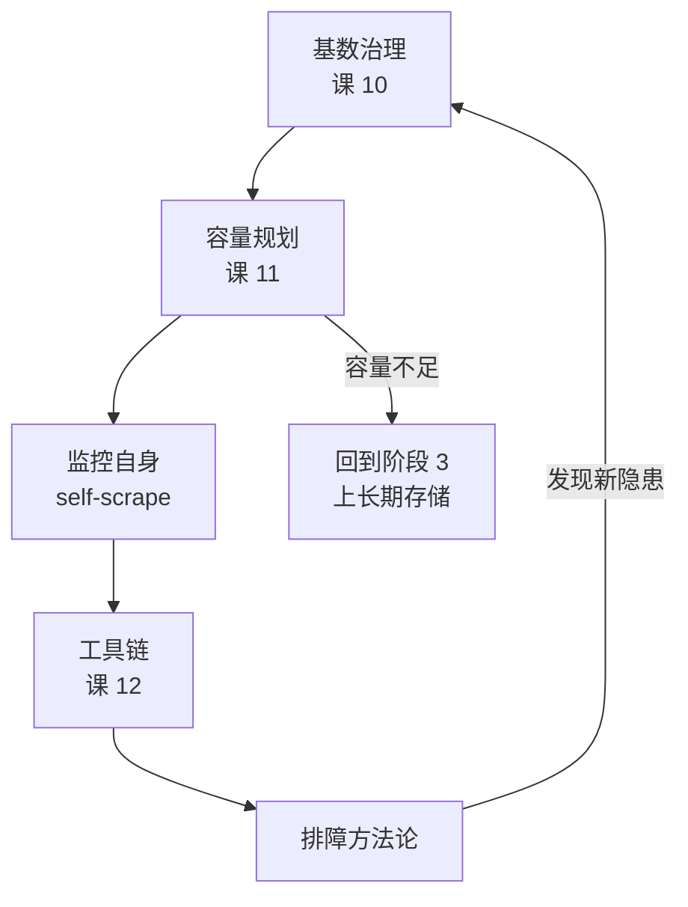

---

## 课 10 · 基数治理

> 完整课文：[lesson-10-基数治理.md](stages/4-生产运维/lessons/lesson-10-基数治理.md)

### 三个知识点

1. **基数的来源与量级** —— 序列数 = 标签值组合数
2. **诊断高基数** —— 用 TSDB API 定位元凶
3. **控制手段** —— 四种手段与各自的副作用

### 本课最重要的一句话

> **基数可以在所有 target 都 `up=1` 的时候悄悄涨到 OOM**——期间没有任何告警。

### 两个放大器

| 放大器 | 机制 | 实测 |
|-------|------|------|
| **标签笛卡尔积** | 加一个 1000 种取值的标签 = 序列数 ×1000 | 课 3 |
| **histogram 桶** | 一个 histogram 展开成 N 条序列 | 11 桶 + `+Inf` = 12 条/维度（3 route → **36 条**） |

### 四种控制手段的副作用（重点）

| 手段 | 副作用 |
|------|-------|
| `metric_relabel_configs` drop | 需维护规则；写错会误删别的标签 |
| `sample_limit` | **熔断不是限流**——触发后整个 target `up=0` |
| `label_limit` | **per-target 全局**，会误伤标签多的正常指标（实测拦在了无关的 GC 指标上） |
| 抓取端聚合 | 失去原始维度 |

> ⚠️ **必须先配 self-scrape** 才能查到 `prometheus_tsdb_head_series`
> （课 10 亲历：配了之后指标数 6 → **328**）。

---

## 课 11 · 容量规划与调优

> 完整课文：[lesson-11-容量规划与调优.md](stages/4-生产运维/lessons/lesson-11-容量规划与调优.md)

### 三个知识点

1. **内存与磁盘估算** —— 量出你自己的系数
2. **关键调优参数** —— 以及哪些不支持热加载
3. **监控 Prometheus 自身** —— self-scrape

### 本课最重要的一句话

> **稳态内存 ≠ 峰值内存**，实测差 **2.96 倍**。按稳态配 limit 必炸。

### 实测系数（本机环境）

| 项 | 实测值 | 说明 |
|----|-------|------|
| 每序列内存（1 标签） | **1.662 KiB** | 拟合 R²=0.9969 |
| 每标签内存 | **0.202 KiB/序列** | — |
| 空实例内存 | **29.10 MiB** | 拟合截距 27.71 MiB，互相印证 |
| 并发查询峰值/稳态 | **2.96 倍** | 必须留 2~3 倍余量 |

> ⚠️ 实测系数比业界常见的经验值**小 2~4 倍**——因为本环境的序列标签维度不同（课 11 专门做过解释）。
> **别直接抄业界值，也别直接抄本课的系数**，用自己的环境量一遍。

### 必背的硬约束

1. **`retention` 不支持热加载**——改了必须重启
2. **`scrape_timeout` > `scrape_interval` 会启动即失败**（好消息：不会带病运行）
3. 按**峰值**配内存，不是稳态
4. **监控 Prometheus 自身**（self-scrape 是前提）

---

## 课 12 · 运维工具链与排障

> 完整课文：[lesson-12-运维工具链与排障.md](stages/4-生产运维/lessons/lesson-12-运维工具链与排障.md)

### 三个知识点

1. **promtool 工具链** —— 变更前验证
2. **TSDB 管理与 admin API** —— 快照、删除序列
3. **排障方法论** —— 出事了从哪下手

### 本课最重要的一句话

> 排障最大的坑是**用可能出错的工具去验证可能出错的组件**。

### 工具的能力边界（比"怎么用"更重要）

| 工具 | 能拦什么 | **拦不住什么** |
|------|---------|--------------|
| `promtool check config` | 语法、字段名 | **不查元标签是否存在**（实测放行 `__meta_nonexistent__`） |
| `promtool check rules` | 规则语法 | 逻辑上没意义的规则 |
| `promtool check healthy` | 本机健康 | **探不了远端**（连的是硬编码 `localhost:9090`） |
| `up = 1` | 抓取成功 | **基数可以在全绿时涨到 OOM** |
| `scrape_duration_seconds` | 抓取耗时 | **target down 时不可信**（实测显示 1.0009s vs 真实 5.99s） |

> **一句话记住**：`check config` 是**拼写检查，不是作文批改**。

### 删除数据

> `delete_series` 是**记账不是擦除**——它只写 tombstone，物理删除要等 compaction。

```bash
# 强制清理 tombstone（需 --web.enable-admin-api）
curl -X POST 'http://localhost:9090/api/v1/admin/tsdb/clean_tombstones'
```

---

# 综合实战项目

> 完整项目：[多集群统一监控平台](projects/多集群统一监控平台/README.md)
> ｜ [设计决策](projects/多集群统一监控平台/设计决策.md) ｜ [反例对照](projects/多集群统一监控平台/反例对照.md) ｜ [验收清单](projects/多集群统一监控平台/验收清单.md)

## 一句话需求

把三个环境（prod / staging / dev）的 Prometheus 数据汇聚到统一长期存储，提供全局查询视图，并按环境分层告警——**让同一套监控能力既能看到全局，又不会被 dev 的噪声吵醒值班**。

## 为什么要做这个

每课的第四幕只验证**单个知识点**。真实工作里没人问你"remote write 的队列参数是什么"，
问的是"三个集群的监控怎么统一管"。这个项目就是把四阶段的散装知识**焊成一次完整交付**。

## 覆盖知识点地图（四阶段全覆盖）

| 阶段 | 覆盖知识点 | 数量 |
|------|-----------|------|
| 阶段 1 单机内核 | 整体架构与组件边界、拉取模型完整语义、Exporter 生态 | 3 |
| 阶段 2 规则与告警 | 规则组与评估、告警状态机、路由树与匹配 | 3 |
| 阶段 3 规模化 | remote write 队列、remote read、Agent 模式、federation、external labels、选型 | 5 |
| 阶段 4 生产运维 | 基数来源与量级、诊断高基数、控制手段 | 3 |

## 设计决策摘要（3 个真权衡）

| 决策点 | 选择 | 放弃的方案 | 代价 |
|-------|------|-----------|------|
| 1 · 长期存储选型 | **Mimir 单体模式**（1 容器 72MB） | Thanos（组件多）、VM（迁移成本高） | 单体模式无高可用 |
| 2 · 全局视图 | **remote read** | 联邦（丢失原始维度） | 查询放大，不适合日常仪表盘 |
| 3 · 告警分层 | **严重程度由路由树决定** | 规则里写死 severity | 需设计路由树 |

**决策点 3 的收益**：新增环境时**不用改任何规则**，只改路由树。
这正是"分离事实与判断"的价值（详见 [场景解法库](10-场景解法库.md) 的共同主线）。

## 四项非功能约束

| 约束 | 怎么落实的 |
|------|-----------|
| **成本** | 三环境共用镜像与规则文件；Mimir 单体模式 |
| **安全 / 隔离** | Mimir 多租户**存储级隔离**，无租户头返回 401 |
| **可维护性** | 告警严重程度由路由树决定，新增环境不改规则 |
| **性能** | remote read 承担全局查询；Mimir 侧按租户限流 |

> 诚实说明：**性能**一项主要是**规避而非优化**——本演示规模太小，没有做真正的性能调优。

## 运行与验收

```bash
cd 实现/
docker compose up -d     # 首次约 60 秒（Mimir 就绪较慢）
./verify.sh              # 一键验收，13 项断言
docker compose down -v   # 清理
```

**必须在 WSL 里跑**（Docker 环境在 WSL Ubuntu 中）。若 `./verify.sh` 报 `Permission denied`，用 `bash verify.sh`。

**实测基线**：全库 2858 条序列、业务 `http_requests_total` 24 条、bucket 96 条；
prod 故障 → Alertmanager **38 秒** → pager **40 秒**。

## 本项目踩的坑（最有价值的部分）

1. **全局层配了 `external_labels` 导致查不到任何数据**——它被附加到查询选择器上。
   Mimir 日志里能看到 `param_matchers_0="{__name__="up",cluster="global"}"`。
   **修复：全局查询层删掉 `external_labels`**
2. **全局层真实端口是 19520**，不是想当然的端口——`docker ps` 显示 `Up` 不代表端口通，
   用 `docker port` 查真实映射
3. **容器 "Up" 但日志里有 `See you next time!`** —— 进程重启过，状态显示会掩盖这个事实


---

# 学完之后：三件套

课文讲的是 **happy path**，三件套补的是另外一半。按你的状态选：

| 你的状态 | 该看哪份 | 回答什么问题 |
|---------|---------|------------|
| **学习态**（坐着读，要懂为什么） | [08-实战经验.md](08-实战经验.md) | 会踩什么坑、为什么会踩 |
| **使用态**（崩了翻，只要答案） | [09-排障速查手册.md](09-排障速查手册.md) | 出错了怎么止血 |
| **设计态**（主动想，怎么设计） | [10-场景解法库.md](10-场景解法库.md) | 新要求来了怎么设计 |

> 三份**分工不能混**：手册只给动作、经验层讲原理、解法库给多方案权衡。
> 混在一起会同时毁掉三个——学习时读不到原理、紧急时读不完、设计时看不到选项。

**三件套速览**：

- [08 实战经验](08-实战经验.md)：10 条反模式 + **8 个故障模式**（五段式）+ **3 个元陷阱**
- [09 排障速查手册](09-排障速查手册.md)：**12 个症状条目**，按"一眼识别 → 止血 → 定位 → 修复"
- [10 场景解法库](10-场景解法库.md)：**6 个设计场景**，每场景 4-5 个方案含代价

---

# 全课收束：如果只能带走五件事

12 课讲了 36 个知识点，但真正改变你工作方式的，是这五条**思维层面的结论**：

### 1. 「0 条」不等于「生效了」

本课程**至少 5 次**遇到这个陷阱（recording rule 未生效、webhook DNS 失败、
remote read 路径不支持、external_labels 污染、`tools bucket` 掩盖报错）。

**自问**：我看到"没有数据"时，有没有先确认"数据本该存在"？

### 2. 失败常常是静默的

`status=success` + 空结果，是 Prometheus 生态**最常见**的故障形态。

**自问**：我看的是**完整响应**（含 `warnings`）还是只有 `status`？

### 3. 别用可能出错的工具验证可能出错的组件

`up=1` 不代表健康、`check config` 过了不代表配置对、
`scrape_duration_seconds` 在 target down 时是假的。

**自问**：我这个判断依据，本身会不会也在故障影响范围内？

### 4. 相关不等于因果

「正则慢所以要避免 `.*`」被实测推翻（差 2.7ms，远小于 10ms 噪声）。
「加 step 图就不准了」未必。「磁盘满了是 retention 没生效」可能是 compaction 还没跑。

**自问**：我做过对照实验吗？两组真的触发了不同代码路径吗？

### 5. 先分清「事实」和「判断」，再决定它们放哪一层

告警规则只声明"有没有问题"（事实），严重程度交给路由树（判断）——
于是新增环境时改一处配置，而不是 N 条规则。

**这是从"会用"到"用对"的分界线。**

---

## 全课一图总结

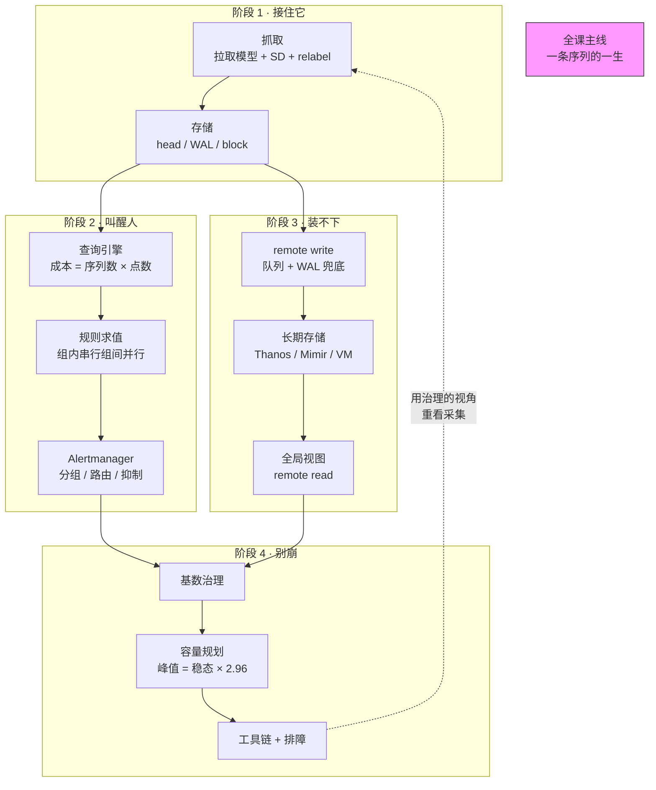

---

## 课程导航

| 去哪 | 链接 |
|------|------|
| 课程目录（12 课索引） | [02-课程目录.md](02-课程目录.md) |
| 学习路径总览（进度 + 阶段目标） | [01-学习路径总览.md](01-学习路径总览.md) |
| 学习档案（进度、评审记录、断点） | [00-学习档案.md](00-学习档案.md) |
| 评审清单（质量门禁） | [00-评审清单.md](00-评审清单.md) |
| 实战经验（8 个故障模式） | [08-实战经验.md](08-实战经验.md) |
| 排障速查手册（12 个症状） | [09-排障速查手册.md](09-排障速查手册.md) |
| 场景解法库（6 个场景） | [10-场景解法库.md](10-场景解法库.md) |
| 综合实战项目 | [多集群统一监控平台](projects/多集群统一监控平台/README.md) |

### 与姊妹课程的关系

| 课程 | 分工 | 状态 |
|------|------|------|
| `../promql/` | **PromQL 查询语言**（怎么写查询） | ✅ 已结课 |
| 本课程 `prometheus/` | **Prometheus 系统本身**（怎么工作、怎么运维） | ✅ 已完结（36/36） |

> 两门课互补：PromQL 课教你**怎么问问题**，本课程教你**这套系统怎么回答问题、以及它什么时候答不上来**。
> 本课程一律不重讲 PromQL 语法——需要复习时回 `../promql/`。

---

## 手册完整性声明

| 检查项 | 状态 |
|-------|------|
| 12 课是否全部纳入 | ✅ 课 1–12 全部收录，各课均含知识点 + 最重要一句话 + 一图总结 |
| 各课「一图总结」是否保留 | ✅ 阶段 1–4 各含阶段级一图总结，课 1–7 含课级 Mermaid 图 |
| 路径总览是否出现在开头 | ✅「故事主线」+「全局速查：最容易忘的硬数字」 |
| 实战项目是否收录 | ✅ 含需求 + 覆盖地图 + 3 个设计决策 + 4 项约束 + 链接回 README |
| 知识点总索引 | ✅ 36 个知识点，按"用得到它的场景"重新组织 |
| 三件套是否索引 | ✅「学完之后：三件套」章节 |

**手册状态**：✅ 2026-09-08 交付，Phase 4 完成。
**课程总进度**：36/36 知识点 + 综合实战项目 + 三件套 + 本手册 —— **Prometheus 课程全部完结**。
