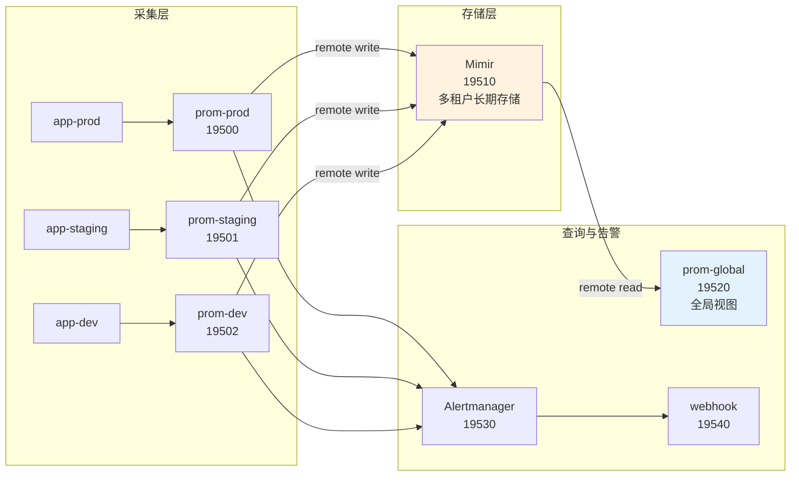

# 多集群统一监控平台

> 所属课程：Prometheus ｜ 类型：结课综合实战项目（Phase 3）｜ 状态：✅ 已完成（2026-09-07）

## 一句话需求

把三个环境（prod / staging / dev）的 Prometheus 数据汇聚到统一长期存储，提供全局查询视图，并按环境分层告警——**让同一套监控能力既能看到全局，又不会被 dev 的噪声吵醒值班**。

## 为什么要做这个项目

课程四阶段的故事线是一条 `http_requests_total` 的成长史：

- 阶段 1「接住它」——一条序列怎么被抓取、怎么落盘
- 阶段 2「让它叫醒人」——怎么从数据变成告警
- 阶段 3「单机装不下了」——数据涨到千万序列怎么办
- 阶段 4「别让它在半夜崩」——怎么不让它出事

但**每课的第四幕只验证单个知识点**。真实工作里没人问你"remote write 的队列参数是什么"，问的是"三个集群的监控怎么统一管"。这个项目就是把四阶段的散装知识焊成一次完整交付。

## 目标

做完这个项目，你应该能独立回答：

1. 三套环境的 Prometheus 怎么把数据送到同一个地方，且**不串味**
2. 全局查询视图该用联邦还是远端读，**各自代价是什么**
3. 同样的错误率，为什么 prod 要呼叫值班、dev 应该闭嘴，**技术上怎么实现**
4. 监控链路自己挂了，**怎么发现**（这是最容易被忽略的盲区）
5. 这套东西的**单点在哪**，出问题先查哪

## 非功能约束（复杂度门槛 2）

本项目显式考虑了 4 项工程约束，不是"能跑就行"：

| 约束 | 怎么落实的 | 在哪能看到 |
|------|-----------|-----------|
| **成本** | 三环境共用同一份镜像与规则文件；Mimir 用单体模式（1 容器 72MB）而非拆微服务 | `docker-compose.yml`、`设计决策.md` 决策点 1 |
| **安全 / 隔离** | Mimir 多租户做**存储级隔离**，无租户头返回 401 | `mimir-config.yml`、`verify.sh` A7 |
| **可维护性** | 告警严重程度由路由树决定，新增环境**不用改任何规则** | `设计决策.md` 决策点 3 |
| **性能** | remote read 承担全局查询（不额外压采集端）；Mimir 侧按租户限流防基数爆炸拖垮全局 | `设计决策.md` 决策点 2、`mimir-config.yml` limits |

> 这四项里**成本 / 隔离 / 可维护**是真做了取舍的（见设计决策），**性能**主要是规避而非优化——
> 诚实说明：本演示规模太小（22 条序列），没有做真正的性能调优，生产环境需要另外压测。

## 运行方式

```bash
# 在 WSL 中执行（Windows 的 PowerShell / CMD 不能直接跑 docker compose）
cd 实现/
docker compose up -d          # 首次启动约 60 秒（Mimir 就绪较慢）
./verify.sh                   # 一键验收，13 项断言
docker compose down -v        # 清理（会删掉 Mimir 数据卷）
```

**注意事项**：

1. **必须在 WSL 里跑**，不能在 Windows PowerShell 直接执行——本项目的 Docker 环境在 WSL Ubuntu 中（历史课程均如此）。
2. 若 `./verify.sh` 提示 `Permission denied`，用 `bash verify.sh` 代替（WSL 挂载盘的文件权限有时会丢失）。
3. 首次 `up -d` 会构建两个镜像（app 与 webhook），约需 1-2 分钟。
4. `Mimir` 就绪较慢（约 60 秒），此期间 `/ready` 返回 503 属正常，不要急着跑验收。

**环境要求**：WSL2 + Docker（本项目在 WSL Ubuntu 24.04 + Docker 29.4.1 实测）。
**端口段**：19500+（课 9 已占至 19430，19440 被其他进程占用）。**启动前请确认这些端口空闲**。

## 目录结构

```
多集群统一监控平台/
├── README.md              # 本文件
├── 设计决策.md            # 3 个真权衡决策（五段式）
├── 反例对照.md            # 「能跑但很糟」的版本 + 逐条对比
├── 验收清单.md            # 自测项，可逐项勾选
└── 实现/
    ├── docker-compose.yml       # 10 容器编排
    ├── verify.sh                # 一键验收（13 断言）
    ├── review-check.py          # 评审辅助校验（结构/四门槛/证据纪律自检）
    ├── app/                     # 业务服务（三环境共用镜像）
    │   ├── app.py               # 产生 http_requests_total 等主线指标
    │   └── Dockerfile
    ├── prometheus/              # 4 份 Prometheus 配置
    │   ├── prometheus-prod.yml      # 采集端（prod）
    │   ├── prometheus-staging.yml   # 采集端（staging）
    │   ├── prometheus-dev.yml       # 采集端（dev）
    │   └── prometheus-global.yml    # 全局查询层（remote read）
    ├── mimir/
    │   └── mimir-config.yml     # 长期存储（单体模式 + 多租户）
    ├── rules/
    │   └── alerts.yml           # 告警规则（含链路自监控）
    ├── alertmanager/
    │   └── alertmanager.yml     # 分层路由树
    ├── webhook/
    │   └── webhook_logger.py    # 告警接收端（落盘便于验收）
    └── logs/                    # 运行时生成（告警通道日志）
```

## 架构



## 覆盖知识点地图

这是"整合"的证据，不是装饰——每一行都能点进去看到当初是怎么讲的。

| 知识点 | 阶段 / 课 | 在本项目哪里体现 | 讲义链接 |
|--------|-----------|------------------|----------|
| 服务发现与 relabel | 阶段 1 · 课 2 | 三环境用 static_configs + labels 打环境标 | [lesson-02](../../stages/1-单机内核/lessons/lesson-02-目标从哪来.md) |
| external_labels 语义 | 阶段 1 · 课 2 | 三采集端各自打 `env`/`cluster`/`region`；**全局层刻意不写**（见决策点 2） | [lesson-02](../../stages/1-单机内核/lessons/lesson-02-目标从哪来.md) |
| TSDB 与 WAL | 阶段 1 · 课 3 | remote write 复用 TSDB WAL，截断与发送确认解耦 | [lesson-03](../../stages/1-单机内核/lessons/lesson-03-TSDB存储引擎.md) |
| 规则求值与 for | 阶段 2 · 课 4 | `for: 30s/1m/2m` 消除抖动 | [lesson-04](../../stages/2-规则与告警/lessons/lesson-04-规则引擎.md) |
| Alertmanager 路由树 | 阶段 2 · 课 5 | 按 `env` 分流到 pager/chat/silent 三个通道 | [lesson-05](../../stages/2-规则与告警/lessons/lesson-05-Alertmanager深入.md) |
| 查询成本 | 阶段 2 · 课 6 | 告警规则每 5 秒求值一次，规则本身也是负载 | [lesson-06](../../stages/2-规则与告警/lessons/lesson-06-查询引擎与查询成本.md) |
| remote write 队列 | 阶段 3 · 课 7 | `queue_config` 容量/shard 配置；监控 `samples_pending` | [lesson-07](../../stages/3-规模化与生态/lessons/lesson-07-远程读写与Agent模式.md) |
| remote read 静默失败 | 阶段 3 · 课 7 | 全局层 remote read 查不到数据时**不报错**，只能靠日志排查 | [lesson-07](../../stages/3-规模化与生态/lessons/lesson-07-远程读写与Agent模式.md) |
| 联邦 vs 远端读 | 阶段 3 · 课 8 | 全局视图选远端读（决策点 2） | [lesson-08](../../stages/3-规模化与生态/lessons/lesson-08-联邦与全局视图.md) |
| 长期存储选型 | 阶段 3 · 课 9 | Thanos / Mimir / VM 三选一，选 Mimir（决策点 1） | [lesson-09](../../stages/3-规模化与生态/lessons/lesson-09-长期存储选型.md) |
| 多租户隔离 | 阶段 3 · 课 9 | `X-Scope-OrgID` 头，无头返回 401（存储级隔离） | [lesson-09](../../stages/3-规模化与生态/lessons/lesson-09-长期存储选型.md) |
| 基数治理 | 阶段 4 · 课 10 | Mimir 侧 `max_global_series_per_user` 限流 | [lesson-10](../../stages/4-生产运维/lessons/lesson-10-基数治理.md) |
| 容量规划 | 阶段 4 · 课 11 | 三采集端资源分配与队列容量估算 | [lesson-11](../../stages/4-生产运维/lessons/lesson-11-容量规划与调优.md) |
| promtool 验证 | 阶段 4 · 课 12 | `promtool check config` 验证全部配置文件 | [lesson-12](../../stages/4-生产运维/lessons/lesson-12-运维工具链与排障.md) |

**跨阶段统计**：阶段 1（3 个知识点）、阶段 2（3 个）、阶段 3（4 个）、阶段 4（3 个）——**四个阶段全覆盖**，满足复杂度门槛 1（要求 ≥3）。

## 实测结论（2026-09-07 本机跑通）

以下数字都是真跑出来的，不是估的：

| 验证项 | 结果 |
|--------|------|
| 容器启动 | 10 个容器全部 Up，Mimir 约 60 秒 ready |
| 采集链路 | 三采集端各 2 个 target 全部 `up` |
| 数据入库 | Mimir 收到 22 条 `http_requests_total` 序列 |
| 全局视图 | 三个 cluster（prod/staging/dev-shanghai）全部可见 |
| 多租户 | 无 `X-Scope-OrgID` 返回 **401** |
| 告警分层 | dev→silent（2 条）、staging→chat（1 条） |
| prod 故障演练 | 停掉 app-prod 后 **62 秒**触发 TargetDown 并送达 pager 通道 |
| 验收脚本 | **13 项断言全 PASS** |

## 开发中真实踩到的坑

这些不是书上抄的，是本项目开发时**一个个撞出来的**：

1. **Mimir 3.2.0 没有 `max_series_per_user` 字段**——写了直接启动失败（`field not found in type validation.plainLimits`）。实际可用的是 `max_global_series_per_user`。教训：凭印象写配置前先 `-help | grep`。
2. **中文目录名让 compose 推导项目名失败**（`project name must not be empty`）——必须显式加 `name:`。
3. **全局层写 `external_labels: cluster: global` 会让 remote read 查不到任何数据**——它会被附加到查询选择器上，而真实数据 cluster 是 prod/staging/dev。**且不报任何错**。这是本项目最有教学价值的发现，详见[设计决策.md](设计决策.md) 决策点 2。
4. **Mimir 容器是 distroless，没有 sh/bash 也没有 wget**——排查只能靠日志和 HTTP 接口。

## 下一步

- [设计决策.md](设计决策.md) —— 3 个真权衡：为什么选 Mimir、为什么用远端读、告警为什么分层
- [反例对照.md](反例对照.md) —— 一个"能跑但很糟"的版本，逐条对比
- [验收清单.md](验收清单.md) —— 怎么确认自己真的做成了
