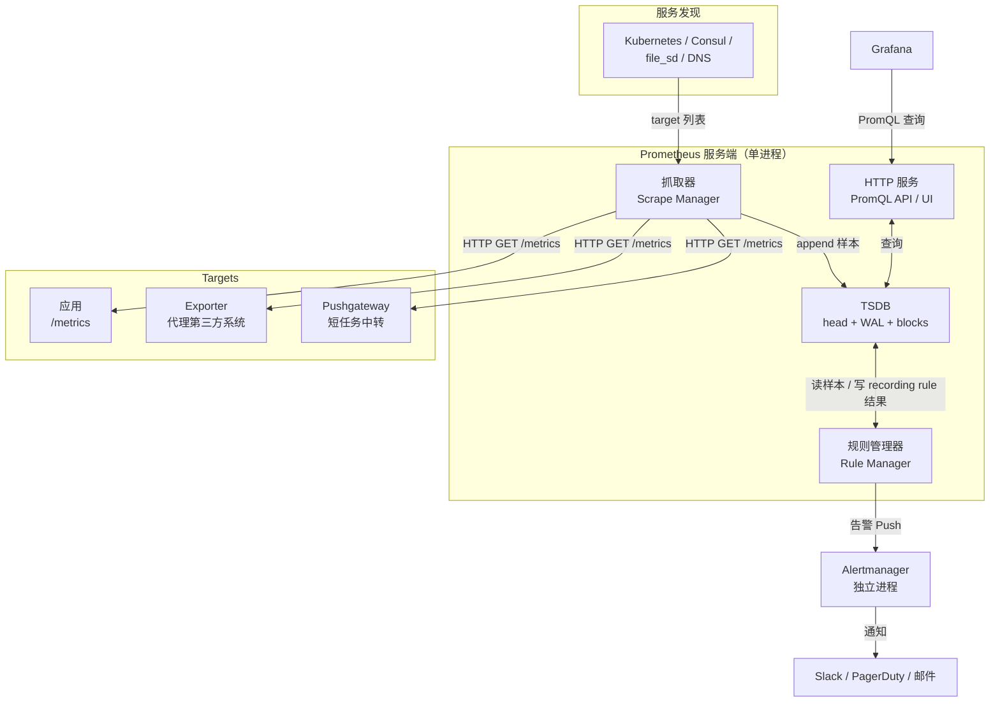
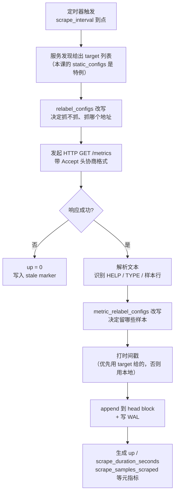
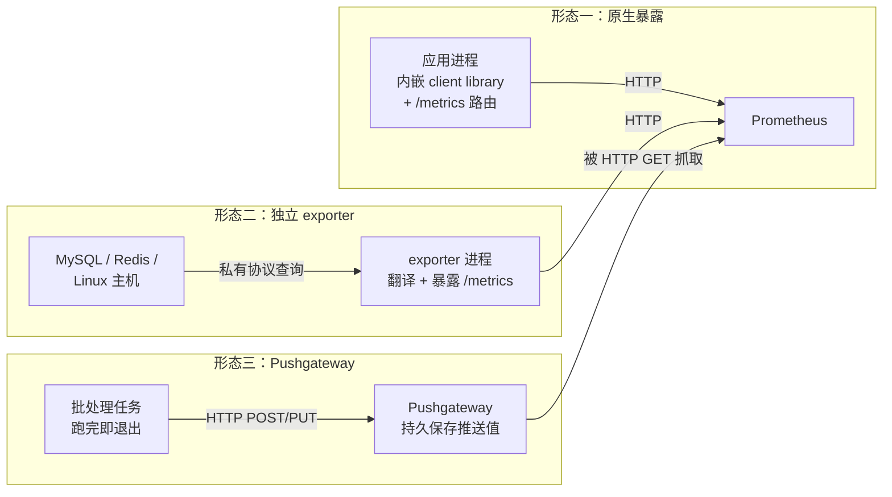
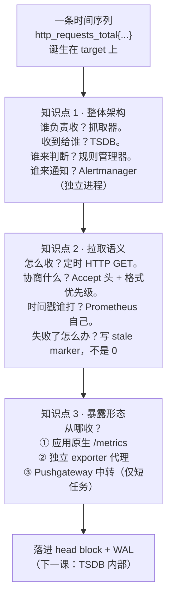
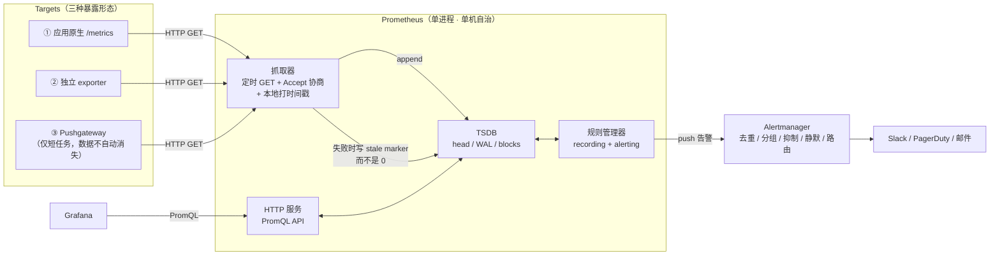

# 第 1 课：架构总览与第一条数据

> 所属阶段：阶段 1《单机内核》｜ 水平：进阶 ｜ 本课知识点：整体架构与组件边界、拉取模型的完整语义、Exporter 生态与指标暴露
> 故事情节：主角第一次登场——一条 `http_requests_total` 时间序列在 target 上诞生了，Prometheus 怎么知道它存在、怎么把它捞回来
> 前置课程：`promql/`（4 阶段 12 课，2026-08 结课）。本课的 PromQL 语法、四种指标类型的逻辑语义均视为已掌握，需要时给一句定位，不重讲。

## 🎯 本课目标

- 画出 Prometheus 内部子系统关系图，说清 scrape / TSDB / rules / HTTP API 各自的职责边界
- 说清**一次 scrape 的完整生命周期**（从发起请求到样本落进 head），并指出每一步可能失败的地方
- 区分为指标暴露的三种形态，能为短生命周期任务设计正确的上报方式

---

## 第一幕：起源与场景引入

> 🏛️ **起源**：2012 年，两位前 Google 工程师 Matt T. Proud 与 Julius Volz 先后加入 SoundCloud，被委以提升系统可靠性的任务。他们怀念在 Google 用过的内部监控系统 Borgmon，于是先是利用业余时间、后来越来越多地占用工作时间，从零写出了 Prometheus（*核查于 2026-09*）。项目 2015 年 1 月公开发布，2016 年 5 月成为 CNCF 继 Kubernetes 之后第二个托管项目，2018 年 8 月毕业。Go 语言 + 自带 TSDB + 拉取模型这三条设计，从第一版定下后**十多年没变过**。

**场景**：凌晨三点，你的订单服务挂了。

你揉着眼睛打开监控，想回答三个问题：**它什么时候开始挂的？挂之前有什么征兆？还有别的服务受影响吗？**

如果监控系统是推模型的（应用主动把指标推给中心节点），你现在看到的是一片空白——因为服务挂了，它就不推数据了。于是你面临一个经典的分辨难题：**"没收到数据"到底是因为服务死了，还是因为服务活着但刚好没人访问、没有新指标可推？** 推模型分不清这两件事。

Prometheus 的做法完全反过来：它不管服务死活，每隔 15 秒主动去敲一次门："你还活着吗？把当前所有指标的值给我。"敲不开门，这件事本身就是一个信号。

> 🎬 **场景**：服务挂了，监控系统必须能区分"它死了"和"它只是没话说"——Prometheus 用"主动去拉"这件事本身完成了健康检查。

---

## 第二幕：认知冲突

看起来"主动去拉"很自然。但你很快会撞上三个说不通的地方：

**第一，它怎么知道要敲哪些门？** 你的服务在 Kubernetes 里每几分钟就扩缩容一次，Pod 的 IP 一直在变。写死一个 IP 列表显然行不通。

**第二，它拉回来的到底是什么？** 你在浏览器里打开 `http://your-app:8080/metrics`，看到的是一堆纯文本。这些文本是怎么变成"某个时间点的值"的？时间戳是谁打的？

**第三，也是最反直觉的一个**：服务挂掉之后，你去查它过去的指标，得到的结果是**空的**——不是 0，是查不到。为什么是断的而不是 0？这个"断"是怎么记录的？

> ❓ **问题**：Prometheus 主动拉取的这一整套动作，每一步到底做了什么？为什么目标消失时查询结果是**断**的，而不是 0？

---

## 第三幕：层层揭示

### 知识点 1：整体架构与组件边界

> 本知识点关键点：四大子系统的职责边界 / 组件为什么各自独立 / 单机设计哲学

#### 一句话定义

Prometheus 服务端是一个**单进程、自带存储**的程序，内部由四个子系统构成：抓取器负责"收"，TSDB 负责"存"，规则管理器负责"算"，HTTP 服务负责"答"；告警的"通知"部分则被刻意拆到了一个独立进程 Alertmanager 里。

#### 直觉建立（类比）

把 Prometheus 想象成一个**记者在跑新闻**。

抓取器是他的两条腿——按固定的时间表（每 15 秒）去各个采访对象（target）那里敲门收集素材。TSDB 是他的笔记本——所有素材按时间顺序记下来，随时可以翻。规则管理器是他的大脑——一边翻笔记本一边判断"这个情况够不够得上写进稿子"。HTTP 服务是他的嘴——别人（Grafana、你、告警系统）问他什么，他就回答什么。

关键点在于：**这个记者是一个人干活，而且他只带这一本笔记本**。他没有后端数据库，没有分布式集群，没有消息队列。

> 💡 **类比的边界**：记者写错了可以涂掉重来，但 TSDB 里的样本是**不可变的**——一旦写进去就不能修改，只能等它按保留策略过期。另外记者可以主动决定去采访谁，而 Prometheus 抓取哪些目标，是由配置文件和服务发现共同决定的。

#### 核心原理

Prometheus 服务端进程内部的数据流，以及它与外部组件的关系：



这张图里最值得停下来想清楚的，是**边界为什么划在这里**：

| 子系统 | 输入 | 输出 | 不负责什么 |
|--------|------|------|------------|
| 抓取器（Scrape Manager） | 服务发现给的 target 列表 + 抓取间隔 | 一批带时间戳的样本 | 不管数据存多久、不判断是否该告警 |
| TSDB | 追加进来的样本 | 按时间范围查询的样本 | 不知道样本是谁抓来的、不主动做任何计算 |
| 规则管理器（Rule Manager） | PromQL 表达式 + 评估间隔 | recording rule 结果写回 TSDB；告警推给 Alertmanager | 不负责发通知、不管通知发给了谁 |
| HTTP 服务 | PromQL 查询请求 | 查询结果 | 不存储任何东西，是纯粹的无状态查询层 |

**为什么 Alertmanager 是独立进程？** 这是 Prometheus 架构里最容易被忽略、却最能体现设计哲学的一刀。告警的生命周期天然分成两半：**判断**（这个条件成立了吗）和**通知**（该告诉谁、怎么告诉、要不要合并、要不要暂时闭嘴）。

前半件事是无状态的、可重复的，做错了重算一遍就行；后半件事充满脏活——去重、分组、抑制、静默、按值班表路由、重试、限流。把这两件事揉进一个进程，Prometheus 就会被"通知渠道配置"这种与采集完全无关的需求拖累。拆开之后：Prometheus 只管算，算完把告警推给 Alertmanager 就完事；**多个 Prometheus 可以共享一个 Alertmanager**，告警去重才能真正生效（这一点在阶段 2 课 5 会展开）。

**"每个 Prometheus 服务器都是自治的单机节点"**——这句话是理解后面所有内容的钥匙。它意味着：

- 没有集群协调、没有分片、没有副本同步协议。你有三个 Prometheus，就是三个互不相识的单机。
- 好处是**部署和运维极简**，一个二进制 + 一个配置文件就能跑，故障域清晰。
- 代价是**单机容量就是硬上限**，且**高可用要靠"跑两个一样的实例"这种笨办法**（数据各自独立，查谁都行，但两边的数据不会自动合并）。

这个取舍贯穿整个课程：阶段 3 讲的所有规模化方案（remote write、联邦、Thanos/Mimir），本质上都是在给"单机自治"这个决定打补丁。

#### 示例演示

启动实验环境后，先看 Prometheus 自己暴露的子系统指标——注意这些指标只有**配置了自抓取**之后才会出现：

```bash
# Prometheus 默认不监控自己，必须显式配一个 job 指向自己
curl -s 'http://localhost:9095/api/v1/query?query=prometheus_tsdb_head_series' \
  | python3 -m json.tool | grep -E '"value"'
```

预期输出（本机实测，2026-09-04，Prometheus 3.14.0）：

```json
"value": [ 1788491280.123, "1762" ]
```

这个 `1762` 就是当前 head block 里活跃的序列数——**TSDB 的"存"**。

> ⚠️ **这一步最能说明"组件边界"**：把配置文件里 `job_name: prometheus` 那一段删掉再 reload，上面这条查询会返回**完全空的结果**。也就是说，**Prometheus 默认不监控自己**——它对自己的 TSDB 里有多少序列、抓取器发现多少 target，一概不知，除非你显式告诉它去抓自己。这是新手最常困惑的一点："为什么我查 `prometheus_tsdb_head_series` 什么都没有？"

再看抓取器和服务发现的自我观测：

```bash
curl -s 'http://localhost:9095/api/v1/query?query=prometheus_sd_discovered_targets' \
  | python3 -c "import json,sys; [print(r['metric'], r['value'][1]) for r in json.load(sys.stdin)['data']['result']]"
```

输出显示每个 job 发现了多少 target——这是**抓取器**的输入端。四类指标分别对应图中四个子系统，它们互相之间不共享状态，只通过 TSDB 交换数据。

#### 常见误区

1. **"Prometheus 自带告警"所以不用装 Alertmanager**：这是错的。Prometheus 只做告警的**判断**，真正把消息发到 Slack / 邮件 / PagerDuty、以及去重和抑制，全在 Alertmanager。只装 Prometheus 你会得到一堆"正在 firing"的告警，然后什么也不会发生。
2. **"规则管理器会把告警发出去"**：规则管理器只负责把告警**推给** Alertmanager。如果 Alertmanager 地址配错或不可达，告警会在 Prometheus 的日志里报推送失败，而告警状态依然显示 firing——这是线上常见的"告警明明在响却没人收到"的根因。

#### 一句话记住

**抓取器收、TSDB 存、规则管理器算、HTTP 答；告警的"通知"被刻意拆出去给 Alertmanager，而每一个 Prometheus 都是一个互不认识的单机。**

#### 官方文档

- [Prometheus 官方架构总览](https://prometheus.io/docs/introduction/overview/)：组件划分与设计哲学的权威说明。

---

### 知识点 2：拉取模型的完整语义

> 本知识点关键点：一次 scrape 的生命周期 / 协议协商与 Accept 头 / 失败与 staleness 语义

#### 一句话定义

一次 scrape 就是：抓取器按定时器向 target 发起一个 HTTP GET 请求，用 `Accept` 头协商暴露格式，解析响应文本，为每个样本**打上自己认为的时间戳**，然后追加（append）进 TSDB 的 head block；失败时不是写入 0，而是标记该序列为**陈旧（stale）**。

#### 直觉建立（类比）

还是那位记者，但这次把动作拆到最细。

他有个闹钟（定时器），每 15 秒响一次。闹钟一响，他就出门去敲一家的门（HTTP GET），并且**递上一张名片说明自己想看什么格式的素材**（`Accept` 头）。对方把素材递出来（响应文本），他当场在素材上**盖一个时间戳章**——注意，这个章是他自己的表打的时间，**不是对方素材上写的时间**。然后他把盖了章的素材按顺序贴进笔记本（append 到 head）。

如果敲门没人应（抓取失败），他**不会在笔记本上写"这家今天 0 条素材"**——他会在这一页贴一个标记："从这里开始，这家的数据不可信了"（stale marker）。

> 💡 **类比的边界**：真实机制里，Prometheus 的时间戳**通常**取请求开始的时间，但如果目标自己在响应里带了毫秒级时间戳（`OpenMetrics` 或文本格式的 `timestamp` 字段），Prometheus 会用目标给的时间戳。另外，stale marker 不是一个持久化的"标记文件"，它是写入 TSDB 的一个特殊值，查询时遇到它就停止往前追溯。

#### 核心原理

一次 scrape 的完整生命周期：



**每一步可能失败的地方**（这是排查抓取问题的地图）：

| 阶段 | 失败表现 | 排查用的指标 |
|------|----------|--------------|
| 服务发现 | target 压根没出现在列表里 | `prometheus_sd_discovered_targets` |
| relabel 改写 | target 被 drop 掉了，或地址被改错 | Targets 页面的 `scrapeUrl` |
| HTTP 请求 | 连接超时 / 404 / 401 | `up{job="..."} == 0`、`scrape_duration_seconds` 逼近 `scrape_timeout` |
| 解析 | 格式非法（比如 HELP 与 TYPE 不匹配） | `up == 0` + 日志里的 parse error |
| 追加 | 样本数超限（`sample_limit`） | `prometheus_target_scrapes_exceeded_sample_limit_total` |

**协议协商**：Prometheus 抓取时会发送 `Accept` 头，按优先级列出它能接受的所有格式。这不是装饰，是真实生效的协商——实测（本机 Prometheus 3.14.0）默认发送的 `Accept` 头是：

```
Accept: text/plain;version=1.0.0;escaping=allow-utf-8;q=0.6,text/plain;version=0.0.4;q=0.5,application/openmetrics-text;version=1.0.0;escaping=allow-utf-8;q=0.4,*/*;q=0.3
Accept-Encoding: gzip
User-Agent: Prometheus/3.14.0
X-Prometheus-Scrape-Timeout-Seconds: 5
```

三个 `q=` 参数就是优先级：**PrometheusText1.0.0（q=0.6）> PrometheusText0.0.4（q=0.5）> OpenMetricsText1.0.0（q=0.4）**。这个顺序可以用 `scrape_protocols` 配置改写。把配置改成优先 OpenMetrics 后，实测 `Accept` 头立刻变成：

```
Accept: application/openmetrics-text;version=1.0.0;escaping=allow-utf-8;q=0.6,text/plain;version=1.0.0;escaping=allow-utf-8;q=0.5,text/plain;version=0.0.4;q=0.4,*/*;q=0.3
```

注意最后那个 `*/*;q=0.3`——这是一个兜底，意思是"如果你实在一种都不认，给我什么文本都行"。这就是为什么一个随便返回纯文本的接口，Prometheus 有时也能抓到东西（但很可能解析得一塌糊涂）。

**抓取失败的语义：stale marker，不是 0。** 这是本课最重要的一个机制，也是后面所有告警与查询行为的根。

当抓取失败时：

- `up` 指标会被写入 **0**（因为 `up` 是 Prometheus 自己生成的，它明确知道"这次没抓到"）；
- 但**业务序列（比如 `http_requests_total`）不会被写入 0**，而是被写入一个 **stale marker**（一个特殊的 NaN 值，内部叫做 `StaleNaN`）。

stale marker 的作用是告诉查询引擎："这条序列到这里就断了，别再往前追溯了。" 于是你查询这条序列时，在 staleness 时间点之后**查不到任何值**——不是 0，是空。

这个设计是对的。想一下如果写入 0 会怎样：你的服务挂了，`http_requests_total` 突然变成 0，那么 `rate(http_requests_total[5m])` 会因为计数器"重置"而算出一个巨大的负修正值，然后你的"错误率"告警会疯狂乱响。**写入 stale marker 而不是 0，正是为了让"没数据"和"数据是 0"这两件事保持可区分。**

#### 示例演示

先做一次成功的抓取，观察元指标：

```bash
curl -s 'http://localhost:9095/api/v1/query?query=scrape_duration_seconds' \
  | python3 -c "import json,sys; [print(f\"{r['metric']['job']:12s} {r['metric']['instance']:24s} {r['value'][1]}\") for r in json.load(sys.stdin)['data']['result']]"
```

本机实测输出：

```
demo-app      demo-app:8080            0.001302917
prometheus    localhost:9090           0.003150929
pushgateway   pushgateway:9091         0.001387357
node          node-exporter:9100       0.009243098
```

`scrape_samples_scraped` 则显示每个 target 每轮抓到多少样本：`demo-app` 只有 5 个（我们手写的），`node` 有 929 个（node-exporter 的体量）。

现在把目标停掉，观察 staleness：

```bash
docker stop demo-app
sleep 20
curl -s 'http://localhost:9095/api/v1/query?query=up{job="demo-app"}' \
  | python3 -c "import json,sys; print('up =', json.load(sys.stdin)['data']['result'][0]['value'][1])"
curl -s 'http://localhost:9095/api/v1/query?query=demo_http_requests_total' \
  | python3 -c "import json,sys; d=json.load(sys.stdin)['data']['result']; print('业务序列结果:', d if d else '空 —— 序列已标记 stale')"
```

本机实测输出：

```
up = 0
业务序列结果: 空 —— 序列已标记 stale
```

**`up` 是 0，但业务序列是空的。** 这两行输出就是"抓取失败语义"的全部答案，也是阶段 2 讲告警时 `up == 0` 这个经典告警规则的由来——你不能用 `http_requests_total == 0` 来判断服务挂了，因为它根本不会返回 0。

#### 常见误区

1. **"抓取失败后指标会变成 0，所以我可以用 `xxx == 0` 判断服务挂了"**：错。抓取失败后业务序列是**空**的，不是 0。判断服务存活必须用 `up` 指标。这是新手最常踩的坑，也是 `up == 0` 成为 Prometheus 世界第一条告警规则的原因。
2. **"时间戳是 target 打的"**：不完全对。Prometheus 默认用**自己的**时间戳（请求发起时刻），只有当 target 在响应里显式带了毫秒时间戳时才用 target 的。这个区别在排查"数据时间对不上"时很关键——如果你看到所有样本的时间戳都完美对齐到抓取时刻，那是正常的。
3. **"`scrape_interval` 越短越好"**：错。抓取间隔直接决定样本量，样本量决定 TSDB 的磁盘和内存占用。每 15 秒抓一次 vs 每 5 秒抓一次，数据量差 3 倍。这也是阶段 4 容量规划的起点。

#### 一句话记住

**一次 scrape = 定时 GET + Accept 协商 + 本地打时间戳 + append 进 head；抓取失败时写的是 stale marker 而不是 0，所以"没数据"和"数据是 0"永远可区分。**

#### 官方文档

- [Prometheus 抓取配置文档](https://prometheus.io/docs/prometheus/latest/configuration/configuration/#scrape_config)：`scrape_interval`、`scrape_timeout`、`scrape_protocols` 的完整说明。
- [Prometheus 暴露格式文档](https://prometheus.io/docs/instrumenting/exposition_formats/)：文本格式与 OpenMetrics 的字段定义。

---

### 知识点 3：Exporter 生态与指标暴露

> 本知识点关键点：原生暴露 vs 独立 exporter / Pushgateway 的定位与陷阱 / 暴露格式要求

#### 一句话定义

Prometheus 只认一件事：**一个返回特定格式文本的 HTTP 端点**。提供这个端点有三种形态——应用自己原生暴露、独立 exporter 代理第三方系统、Pushgateway 为短生命周期任务做中转。

#### 直觉建立（类比）

还是记者敲门。他要的是"一份按固定格式写好的素材"。至于这份素材是谁准备的，他不在乎：

- **形态一**：采访对象自己会写，他直接敲门拿（应用原生暴露）。
- **形态二**：采访对象是个不会写字的人（比如一台 MySQL 服务器，它压根不知道 Prometheus 是什么），于是配了个**翻译**站在门口，把他的话翻译成格式文本（独立 exporter）。
- **形态三**：采访对象是**临时工**，干两分钟就走人了（批处理任务）。记者按 15 秒的节奏去敲，很可能一次都敲不到。于是设了个**留言板**，临时工干完活把结果写在留言板上，记者照常来敲留言板的门（Pushgateway）。

> 💡 **类比的边界**：真实世界里，"翻译"（exporter）是**无状态**的——它不缓存任何历史值，每次被问到时，它去问背后的系统"你现在是多少"，然后当场翻译。这意味着 exporter 挂了 = 这个系统的指标全断，且**断掉期间的历史数据永远补不回来**（因为没有缓存）。另外，留言板（Pushgateway）上的字**擦不掉**——临时工走了，字还留在上面。

#### 核心原理

三种形态的对比：



**形态一：应用原生 `/metrics`。** 用官方 client library（Go / Java / Python / Rust 等）在应用里注册指标，并在 HTTP 路由上挂一个 `/metrics`。这是最理想的形态——指标由应用自己维护，语义最准确，也没有额外组件。本课的 `demo-app` 连 client library 都没用，直接手写了暴露格式，长这样（实测输出）：

```
# HELP demo_http_requests_total 演示用请求计数器
# TYPE demo_http_requests_total counter
demo_http_requests_total{endpoint="GET /"} 0
demo_http_requests_total{endpoint="GET /order"} 20
# HELP demo_http_request_status_total 按状态码分组的请求数
# TYPE demo_http_request_status_total counter
demo_http_request_status_total{status="200"} 17
demo_http_request_status_total{status="500"} 3
# HELP demo_build_info 构建信息，值恒为 1
# TYPE demo_build_info gauge
demo_build_info{version="1.0.0"} 1
```

这就是暴露格式的**全部要求**：`# HELP` 行（说明）、`# TYPE` 行（类型）、样本行（`名称{标签} 值`）。只要你的接口能吐出这种文本，Prometheus 就能抓。

**形态二：独立 exporter。** 针对无法修改源码的第三方系统（MySQL、Redis、Nginx、Linux 主机本身）。exporter 是一个独立进程，它用系统自己的协议（SQL 查询、info 命令、读 `/proc`）拿到状态，翻译成暴露格式，然后在自己的 `/metrics` 上提供出去。本课用的 `node-exporter` 就是典型——它读 `/proc` 和 `/sys`，把 Linux 主机指标翻译成 Prometheus 格式，一轮抓到 **929 个样本**（实测）。

**形态三：Pushgateway。** 这是**唯一**的推模型入口，专门为短生命周期任务（cron job、批处理）设计。任务结束前把结果 HTTP PUT/POST 到 Pushgateway，Pushgateway 保存下来，等 Prometheus 按正常节奏来抓。

**Pushgateway 的两个经典陷阱**，官方文档自己都在劝退：

**陷阱一：数据永不消失。** Pushgateway 会**永久保留**你推送的值，直到你显式删除。一个跑了 30 秒的批处理任务推了一次结果，三个小时后你去查，那个值还在那里，看起来就像"这个任务刚刚成功过"。更糟的是，如果你基于它配了告警（比如"批处理超过 2 小时没成功就告警"），它将**永远不会触发**——因为那个成功的时间戳一直停在那儿。

**陷阱二：单点 + 无服务发现。** Pushgateway 是唯一一个"被抓取但没有对应真实服务"的组件。它没有服务发现，`instance` 标签是**假的**（指向 Pushgateway 自己，而不是真正干活的那台机器）。一旦它挂了，所有批处理任务的指标全部消失，而且你**分不清是任务没跑，还是 Pushgateway 挂了**。

**正确的使用姿势**（如果非用不可）：

- 用 `push_time_seconds` 指标（Pushgateway 自动为每个 group 生成）判断推送的新鲜度，而不是直接信任业务值。
- 任务失败时也要推送（推一个失败标记），或者用 `--persistence.file` 之外的手段保证清理。
- 任务结束前用 **HTTP DELETE** 显式清理自己的 group，而不是依赖任何自动过期。

#### 示例演示

形态一与形态二的抓取结果（实测，Targets 页面数据）：

```bash
curl -s 'http://localhost:9095/api/v1/targets?state=active' \
  | python3 -c "import json,sys; [print(f\"{t['labels']['job']:12s} {t['scrapeUrl']:40s} {t['health']}\") for t in json.load(sys.stdin)['data']['activeTargets']]"
```

输出：

```
demo-app     http://demo-app:8080/metrics         up
node         http://node-exporter:9100/metrics    up
prometheus   http://localhost:9090/metrics        up
pushgateway  http://pushgateway:9091/metrics      up
```

形态三的完整演示——推送、观察"数据永不消失"、然后显式删除：

```bash
# 1) 模拟一个批处理任务，跑完就退出，推送一次结果
NOW=$(date +%s)
printf '# TYPE batch_last_run_timestamp_seconds gauge\nbatch_last_run_timestamp_seconds %s\n' "$NOW" \
  | docker exec -i prometheus wget -qO- --post-file=- \
      'http://pushgateway:9091/metrics/job/nightly-batch/instance/batch-01'

sleep 10
# 2) 查询：值在那里
curl -s 'http://localhost:9095/api/v1/query?query=batch_last_run_timestamp_seconds' \
  | python3 -c "import json,sys; [print(r['metric'], '->', r['value'][1]) for r in json.load(sys.stdin)['data']['result']]"
```

实测输出（注意标签被 `honor_labels: true` 保留了）：

```
{'__name__': 'batch_last_run_timestamp_seconds', 'instance': 'batch-01', 'job': 'nightly-batch'} -> 1788491518
```

**关键观察**：等 30 秒后再查，值依然是 `1788491518`，纹丝不动。**那个任务早就退出了，但 Pushgateway 还在替它汇报"我刚刚成功过"。**

```bash
# 3) 正解一：用 push_time_seconds 判断新鲜度（而不是信任业务值）
curl -s 'http://localhost:9095/api/v1/query?query=push_time_seconds' \
  | python3 -c "import json,sys; [print(r['metric']['job'], '-> 推送于', r['value'][1]) for r in json.load(sys.stdin)['data']['result']]"

# 4) 正解二：任务结束前显式 DELETE 清理自己的 group
docker exec demo-app python3 -c "
import urllib.request
r = urllib.request.Request('http://pushgateway:9091/metrics/job/nightly-batch/instance/batch-01', method='DELETE')
print('HTTP', urllib.request.urlopen(r, timeout=10).status)"
```

实测：`DELETE` 返回 `HTTP 202`，随后该序列从查询结果中消失。**只有显式 DELETE 才能让数据从 Pushgateway 消失，没有任何自动过期机制。**

**给短生命周期任务设计上报方式的决策路径**：

| 场景 | 推荐做法 | 理由 |
|------|----------|------|
| 任务能改造成常驻服务 | 让它常驻并原生暴露 `/metrics` | 最干净，彻底绕开 Pushgateway |
| 必须是短任务，且关心"每次运行的结果" | Pushgateway + 任务末尾 DELETE + 用 `push_time_seconds` 告警 | 承认 Pushgateway 的局限，用纪律补上 |
| 只关心"任务是否成功、耗时多久" | 让**调度器**（cron 的 wrapper、K8s Job controller）暴露指标 | 指标归属常驻的调度器，语义更准 |
| 关心任务内部的细粒度过程指标 | 任务内用 remote write 直接推送到远端存储（阶段 3 课 7） | 绕过 Pushgateway 的单点与"永不消失"问题 |

#### 常见误区

1. **"Pushgateway 是通用的推模型入口，服务不好抓取就用它"**：官方文档明确反对这种用法。Pushgateway 唯一的合法场景是**短生命周期任务**。把常驻服务推给它，你会同时失去健康检查（Prometheus 抓的是 Pushgateway，不是你的服务，服务挂了 `up` 还是 1）、服务发现，以及数据自动清理。
2. **"exporter 会缓存数据，它挂一会儿没关系"**：不会。exporter 是无状态的，它挂了期间的数据**永久丢失**，补不回来。这也是为什么 exporter 自身必须被监控（用 `up` 指标）。
3. **"暴露格式只要有 `名称 值` 就行"**：能抓，但不规范。缺 `# TYPE` 行会导致 Prometheus 无法确定指标类型，`rate()` 等函数对未声明类型的指标行为会变得微妙；缺 `# HELP` 则丧失可读性。**始终写全 HELP + TYPE + 样本行。**

#### 一句话记住

**Prometheus 只认"一个吐特定格式文本的 HTTP 端点"：应用能改就自己暴露，改不了就上 exporter，只有跑完就退出的短任务才值得动用 Pushgateway——而它的数据永不消失，必须由你显式 DELETE。**

#### 官方文档

- [Exporters 与集成官方列表](https://prometheus.io/docs/instrumenting/exporters/)：官方与社区 exporter 的索引。
- [Pushgateway 官方文档](https://prometheus.io/docs/practices/pushing/)：含官方对"何时不该用 Pushgateway"的明确警告。
- [编写 exporter 的官方指南](https://prometheus.io/docs/instrumenting/writing_exporters/)：暴露格式的完整规范。

---

## 第四幕：实操验证

下面把三个知识点串成一条完整链路：**起环境 → 确认抓取 → 产生流量 → 观察落盘 → 制造故障 → 验证语义**。

### 步骤 0：准备实验目录与示例应用

```bash
mkdir -p ~/prometheus-lab/lesson-01/app
```

创建 `~/prometheus-lab/lesson-01/app/demo_app.py`：

```python
import time
import random
from http.server import BaseHTTPRequestHandler, HTTPServer

# 全局计数器：模拟一个长期运行的服务自己暴露指标
REQUESTS = {"GET /": 0, "GET /order": 0}
STATUSES = {"200": 0, "500": 0}


def bump(endpoint):
    """每次请求累加计数器，并按 8% 概率制造一次 500。"""
    REQUESTS[endpoint] += 1
    status = "500" if random.random() < 0.08 else "200"
    STATUSES[status] += 1
    return status


def render_metrics():
    """手写 Prometheus 文本暴露格式。"""
    lines = [
        "# HELP demo_http_requests_total 演示用请求计数器",
        "# TYPE demo_http_requests_total counter",
    ]
    for endpoint, value in REQUESTS.items():
        lines.append(f'demo_http_requests_total{{endpoint="{endpoint}"}} {value}')
    lines.append("# HELP demo_http_request_status_total 按状态码分组的请求数")
    lines.append("# TYPE demo_http_request_status_total counter")
    for status, value in STATUSES.items():
        lines.append(f'demo_http_request_status_total{{status="{status}"}} {value}')
    lines.append("# HELP demo_build_info 构建信息，值恒为 1")
    lines.append("# TYPE demo_build_info gauge")
    lines.append('demo_build_info{version="1.0.0"} 1')
    return "\n".join(lines) + "\n"


class Handler(BaseHTTPRequestHandler):
    def do_GET(self):
        if self.path == "/metrics":
            body = render_metrics().encode("utf-8")
            self.send_response(200)
            self.send_header("Content-Type", "text/plain; version=0.0.4; charset=utf-8")
            self.send_header("Content-Length", str(len(body)))
            self.end_headers()
            self.wfile.write(body)
            return

        endpoint = "GET /order" if self.path == "/order" else "GET /"
        status = bump(endpoint)
        body = f"hello from demo-app, path={self.path}, status={status}\n".encode("utf-8")
        self.send_response(int(status))
        self.send_header("Content-Length", str(len(body)))
        self.end_headers()
        self.wfile.write(body)

    def log_message(self, fmt, *args):
        pass


if __name__ == "__main__":
    print("demo-app listening on :8080", flush=True)
    HTTPServer(("0.0.0.0", 8080), Handler).serve_forever()
```

创建 `~/prometheus-lab/lesson-01/prometheus.yml`：

```yaml
global:
  scrape_interval: 5s
  evaluation_interval: 5s
  external_labels:
    cluster: lesson-01

scrape_configs:
  # 自己抓自己：Prometheus 默认不会监控自己，必须显式配置
  - job_name: prometheus
    static_configs:
      - targets:
          - localhost:9090

  - job_name: demo-app
    metrics_path: /metrics
    static_configs:
      - targets:
          - demo-app:8080

  - job_name: node
    static_configs:
      - targets:
          - node-exporter:9100

  - job_name: pushgateway
    honor_labels: true
    static_configs:
      - targets:
          - pushgateway:9091
```

### 步骤 1：起环境

```bash
cd ~/prometheus-lab/lesson-01
docker network create lesson01-net

docker run -d --name demo-app --network lesson01-net \
  -v "$PWD/app":/app -w /app \
  python:3.12-slim python demo_app.py

docker run -d --name node-exporter --network lesson01-net \
  prom/node-exporter:v1.10.2

docker run -d --name pushgateway --network lesson01-net -p 9091:9091 \
  prom/pushgateway:v1.11.1

docker run -d --name prometheus --network lesson01-net -p 9095:9090 \
  -v "$PWD/prometheus.yml":/etc/prometheus/prometheus.yml \
  prom/prometheus:v3.14.0 \
  --config.file=/etc/prometheus/prometheus.yml \
  --storage.tsdb.path=/prometheus \
  --web.enable-lifecycle
```

> 宿主端口用 **9095** 而不是默认的 9090，是因为本机 9090 已被其他进程占用；容器内部仍是 9090，所以自抓取写 `localhost:9090`。如果你的 9090 空闲，直接写 `-p 9090:9090` 即可。

### 步骤 2：确认四个 target 全部 up

```bash
sleep 10
curl -s 'http://localhost:9095/api/v1/targets?state=active' \
  | python3 -c "import json,sys; [print(f\"{t['labels']['job']:12s} {t['scrapeUrl']:40s} {t['health']}\") for t in json.load(sys.stdin)['data']['activeTargets']]"
```

预期输出（本机实测 2026-09-04）：

```
demo-app     http://demo-app:8080/metrics         up
node         http://node-exporter:9100/metrics    up
prometheus   http://localhost:9090/metrics        up
pushgateway  http://pushgateway:9091/metrics      up
```

### 步骤 3：看第一条数据（主角的诞生）

```bash
curl -s 'http://localhost:9095/api/v1/query?query=demo_http_requests_total' \
  | python3 -c "import json,sys; [print(r['metric'], '->', r['value'][1]) for r in json.load(sys.stdin)['data']['result']]"
```

输出（此时还没人访问，两个端点都是 0，但**序列已经存在了**）：

```
{'__name__': 'demo_http_requests_total', 'endpoint': 'GET /', 'instance': 'demo-app:8080', 'job': 'demo-app'} -> 0
{'__name__': 'demo_http_requests_total', 'endpoint': 'GET /order', 'instance': 'demo-app:8080', 'job': 'demo-app'} -> 0
```

注意这两条序列的完整标签集：`__name__` + `endpoint`（应用自己的业务标签）+ `instance` 和 `job`（**Prometheus 附加的**，标识这个 target 是谁）。这就是"数据模型的物理视角"——下一课会展开。

### 步骤 4：产生流量，看计数器递增

```bash
for i in $(seq 1 20); do
  docker exec prometheus wget -qO- http://demo-app:8080/order
done
sleep 12
curl -s 'http://localhost:9095/api/v1/query?query=demo_http_requests_total' \
  | python3 -c "import json,sys; [print(r['metric']['endpoint'], '->', r['value'][1]) for r in json.load(sys.stdin)['data']['result']]"
```

预期输出（本机实测；`status` 的 200/500 分布是 8% 概率随机产生，**每次跑的具体数字会浮动**）：

```
GET /      -> 0
GET /order -> 20
```

### 步骤 5：观察抓取过程的元指标

```bash
curl -s 'http://localhost:9095/api/v1/query?query=scrape_duration_seconds' \
  | python3 -c "import json,sys; [print(f\"{r['metric']['job']:12s} {r['metric']['instance']:24s} {r['value'][1]}\") for r in json.load(sys.stdin)['data']['result']]"
```

预期输出（本机实测，单位秒；数值随负载浮动）：

```
demo-app      demo-app:8080            0.001302917
prometheus    localhost:9090           0.003150929
pushgateway   pushgateway:9091         0.001387357
node          node-exporter:9100       0.009243098
```

`scrape_samples_scraped` 显示每轮抓到的样本数（实测 `demo-app` 5 个、`node` 929 个）。**这个数字直接决定了你的存储开销**——阶段 4 容量规划的核心公式就从这里出发。

### 步骤 6：制造故障，验证 stale marker

```bash
docker stop demo-app
sleep 20
echo "--- up ---"
curl -s 'http://localhost:9095/api/v1/query?query=up{job="demo-app"}' \
  | python3 -c "import json,sys; print(json.load(sys.stdin)['data']['result'][0]['value'][1])"
echo "--- 业务序列 ---"
curl -s 'http://localhost:9095/api/v1/query?query=demo_http_requests_total' \
  | python3 -c "import json,sys; d=json.load(sys.stdin)['data']['result']; print(d if d else '(空) 序列已标记 stale')"
```

预期输出：

```
--- up ---
0
--- 业务序列 ---
(空) 序列已标记 stale
```

**这就是本课的核心结论**：`up` 是 0，业务序列是空的。

### 步骤 7：验证 Pushgateway 陷阱

```bash
docker start demo-app
sleep 3

# 推送一次（模拟批处理任务跑完就退出）
NOW=$(date +%s)
printf '# TYPE batch_last_run_timestamp_seconds gauge\nbatch_last_run_timestamp_seconds %s\n' "$NOW" \
  | docker exec -i prometheus wget -qO- --post-file=- \
      'http://pushgateway:9091/metrics/job/nightly-batch/instance/batch-01'

sleep 10
curl -s 'http://localhost:9095/api/v1/query?query=batch_last_run_timestamp_seconds' \
  | python3 -c "import json,sys; [print(r['metric'], '->', r['value'][1]) for r in json.load(sys.stdin)['data']['result']]"
```

预期输出（实测）：

```
{'__name__': 'batch_last_run_timestamp_seconds', 'instance': 'batch-01', 'job': 'nightly-batch'} -> 1788491518
```

等 30 秒再查，**值纹丝不动**——任务早退出了，Pushgateway 还在替它汇报。只有显式 DELETE 才能清除：

```bash
docker exec demo-app python3 -c "
import urllib.request
r = urllib.request.Request('http://pushgateway:9091/metrics/job/nightly-batch/instance/batch-01', method='DELETE')
print('HTTP', urllib.request.urlopen(r, timeout=10).status)"
```

预期输出：`HTTP 202`，随后该序列从查询结果中消失。

> ⚠️ **命令避坑**：推送时用的是 `wget -qO- --post-file=-`，最后那个 `-` 表示"从 stdin 读请求体"。**不要写成 `--post-data -`**——busybox wget 会把 `-` 当成字面量的请求体内容，导致 Pushgateway 返回 `HTTP 400 Bad Request`（实测踩过）。删除同理：busybox wget **不支持** `--method=DELETE`，所以这里借用 `demo-app` 容器里的 `python3` 发 DELETE。（真实环境里用 `curl -X DELETE` 一行就够了，只是 Prometheus 官方镜像里没有 curl。）

> ✅ **回扣场景**：回到第一幕——凌晨三点服务挂了。现在你知道 Prometheus 是怎么回答那三个问题的了：**它每 5 秒（本实验）敲一次门，敲不开就记 `up=0` 并把业务序列标记为 stale**。所以你能在监控上看到一条清晰的、从某个时刻开始断开的曲线，而不是一片空白或一条虚假的 0 线。健康检查是**采集动作的副产品**，这就是拉取模型最大的价值。

### 清理

```bash
docker rm -f demo-app node-exporter pushgateway prometheus
docker network rm lesson01-net
```

---

## 第五幕：体系收束

三个知识点其实在回答同一个问题的三个层面：**谁在收（架构）、怎么收（拉取语义）、从哪收（暴露形态）**。



> 📍 **全局定位**：本课是阶段 1《单机内核》的第一课，回答了"数据是怎么进来的"。三个知识点覆盖了从 target 到 head 的完整入口链路，但**样本进了 head 之后发生了什么**（head 的内存结构、WAL 怎么保证崩溃恢复、block 怎么落盘与压缩）还没讲。
> 🔗 **下一步**：下一课《目标从哪来》要解决本课故意绕开的一个问题——`prometheus.yml` 里那几个写死的地址，在生产环境里根本不可行。服务发现怎么产出 target 列表？`relabel_configs` 三段改写各自在什么时机生效？`honor_labels` 为什么默认是 `false`（本课 Pushgateway 那个 `honor_labels: true` 就是伏笔）？

---

## 🐞 常见误区

1. **"服务挂了指标会变成 0"**：不会，是**空**（stale marker）。判断存活必须用 `up`。这是全课最高频的误解。
2. **"Prometheus 装好就能告警"**：不能。它只做判断，通知在 Alertmanager。没配 Alertmanager，告警只在 UI 上 firing，没人会收到消息。
3. **"Pushgateway 是通用的推模型入口"**：不是，它只为短生命周期任务设计。常驻服务推给它，会同时失去健康检查、服务发现和数据自动清理。
4. **"exporter 会缓存数据，挂一会儿没关系"**：不会，exporter 无状态，挂掉期间的数据永久丢失。
5. **"Prometheus 会监控自己"**：不会，必须显式配一个 job 指向 `localhost:9090`。不配的话，`prometheus_tsdb_head_series` 这类自我观测指标一个都没有。
6. **"抓取间隔越短数据越准"**：抓取间隔直接乘以样本量，样本量决定内存和磁盘。这是容量规划的第一张多米诺骨牌。

## 一图总结



## 课后小测

**Q1**：一个服务挂掉后，你查询它的 `http_requests_total` 会得到什么？
- A. 0
- B. 最后一次成功抓取的值
- C. 空结果（序列被标记 stale）
- D. NaN

<details><summary>答案与解析</summary>

**答案：C**。抓取失败时 Prometheus 写入的是 stale marker（一个特殊的 NaN），它告诉查询引擎"这条序列断了"，所以查询返回空而不是 0。这个设计让"没数据"和"数据是 0"保持可区分，避免 `rate()` 因计数器"重置"算出错误结果。判断服务存活要用 `up` 指标。

</details>

**Q2**：关于 Alertmanager，下列说法正确的是？
- A. 它是 Prometheus 进程内的一个模块，负责告警判断
- B. 它是独立进程，负责去重、分组、抑制、静默与路由；Prometheus 只负责判断
- C. 它负责存储时序数据，Prometheus 只负责抓取
- D. 每台 Prometheus 必须配一个专属的 Alertmanager

<details><summary>答案与解析</summary>

**答案：B**。告警被刻意拆成"判断"与"通知"两半：Prometheus 的规则管理器只做判断并把告警推给 Alertmanager，去重、分组、抑制、静默、路由全在 Alertmanager。A 错在"进程内模块"；C 把 TSDB 的职责安错了；D 错在"专属"——多个 Prometheus 共享一个 Alertmanager 才能让跨实例的告警去重真正生效。

</details>

**Q3**：下列哪个场景**适合**使用 Pushgateway？
- A. 一个长期运行的 Web 服务，因为它在 NAT 后面不好抓取
- B. 一个每天凌晨跑 3 分钟的批处理任务，需要上报"本次处理了多少条记录"
- C. 一个常驻的微服务，想自己控制推送节奏
- D. 一个 Redis 实例，想让 Prometheus 采集它的指标

<details><summary>答案与解析</summary>

**答案：B**。Pushgateway 唯一被官方认可的场景是短生命周期任务（跑完即退出，来不及被抓取）。A、C 都是常驻服务，用 Pushgateway 会同时失去健康检查、服务发现和数据自动清理；D 应该用 redis_exporter（形态二）。另外即使选 B，也必须配套：任务末尾显式 DELETE，并用 `push_time_seconds` 做告警。

</details>

**Q4**：Prometheus 抓取时发送的 `Accept` 头里，多个格式用 `q=` 参数排序。这个顺序的作用是什么？
- A. 决定压缩算法
- B. 决定 Prometheus 解析响应时的严格程度
- C. 与目标协商使用哪种暴露格式，目标应返回列表中它支持的最高优先级格式
- D. 决定抓取超时时间

<details><summary>答案与解析</summary>

**答案：C**。`Accept` 头是 HTTP 内容协商机制，Prometheus 用它告诉目标"我按这个优先级支持这些格式"，目标应返回它支持的最高优先级格式。这个顺序可用 `scrape_protocols` 配置改写（实测：把 OpenMetrics 提到第一位后，`Accept` 头立刻变成 OpenMetrics 优先）。列表末尾的 `*/*;q=0.3` 是兜底。

</details>

## 📌 本课速览

- **四个子系统，各管一段**：抓取器收、TSDB 存、规则管理器算、HTTP 服务答；告警的"通知"被刻意拆给独立进程 Alertmanager，判断与通知分离是这块架构最核心的一刀。
- **每一个 Prometheus 都是自治单机**：没有集群、没有分片、没有副本同步。好处是部署极简、故障域清晰，代价是单机容量即硬上限——阶段 3 的所有方案都是在给这个决定打补丁。
- **一次 scrape 的完整语义**：定时 HTTP GET → `Accept` 头协商格式（实测默认 `PrometheusText1.0.0 > 0.0.4 > OpenMetrics`，可用 `scrape_protocols` 改写）→ Prometheus 自己打时间戳 → append 进 head + 写 WAL。
- **抓取失败写的是 stale marker，不是 0**：`up` 变 0，但业务序列直接**消失**（查询返回空）。这让"没数据"与"数据是 0"永远可区分，也是 `up == 0` 成为第一条告警规则的原因。
- **三种暴露形态各归其位**：应用能改就原生 `/metrics`；改不了就上独立 exporter（无状态，挂了期间数据永久丢失）；只有跑完就退出的短任务才动用 Pushgateway。
- **Pushgateway 的两大陷阱**：数据永不消失（任务死了指标还活着，告警永远不恢复）、单点且无服务发现（分不清任务没跑还是网关挂了）。正解是任务末尾显式 DELETE + 用 `push_time_seconds` 判断新鲜度。
- **Prometheus 默认不监控自己**：必须显式配一个 job 指向 `localhost:9090`，否则 `prometheus_tsdb_head_series` 这类自我观测指标一个都没有。

## 🧭 课程导航

| 上一课 | 本课 | 下一课 |
|--------|------|--------|
| —（阶段 1 第一课） | ✅ 架构总览与第一条数据 | [目标从哪来](./lesson-02-目标从哪来.md) |

[课程目录](../../../02-课程目录.md) ｜ [阶段 1 概览](../overview.md) ｜ [学习路径总览](../../../01-学习路径总览.md)

## 🚀 下一批接力提示词

> 学完本批后，**复制下面这段文字发给 AI**，即可无缝进入下一批（无需重新描述上下文）：

```
继续学 Prometheus。我的学习档案在 prometheus/00-学习档案.md，
刚学完阶段 1《单机内核》的课《架构总览与第一条数据》知识点 整体架构与组件边界、拉取模型的完整语义、Exporter 生态与指标暴露，
请按大纲继续讲解下一批知识点。
```
