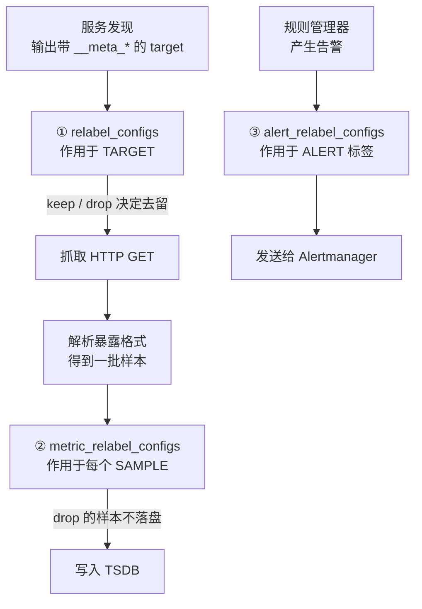
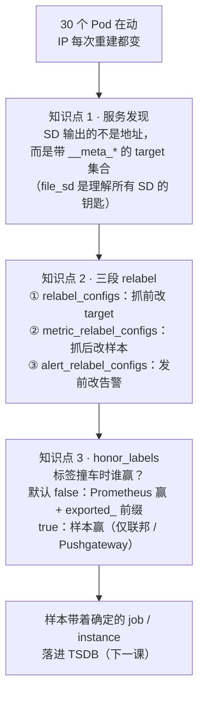
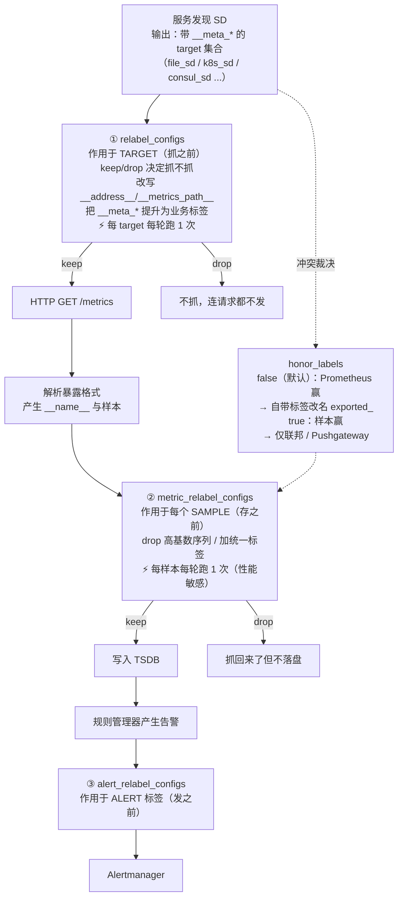

# 第 2 课：目标从哪来

> 所属阶段：阶段 1《单机内核》｜ 水平：进阶 ｜ 本课知识点：服务发现机制、relabel_configs 三段改写、honor_labels 与标签冲突
> 故事情节：主角有了名字——Prometheus 怎么在动态变化的基础设施里找到它，又怎么把一堆 `__meta_*` 元标签变成人能读懂的业务标签
> 前置课程：`promql/`（4 阶段 12 课，2026-08 结课）。本课的 PromQL 语法、四种指标类型的逻辑语义均视为已掌握，需要时给一句定位，不重讲。

## 🎯 本课目标

- 说清服务发现的输出契约（一组带 `__meta_*` 的 target），能在无 K8s 环境下用 `file_sd_configs` 等价复现
- 独立写出三段 relabel 配置，并说清各自的作用时机与执行顺序
- 解释 `honor_labels` 两种取值下的冲突解决结果，以及为什么默认是 `false`

---

## 第一幕：起源与场景引入

> 🏛️ **起源**：Prometheus 诞生在 SoundCloud，那时的服务部署还是"一台机器一个进程、IP 相对固定"的年代。配置文件里写死几个地址，虽然笨，但能用。真正把这套做法逼到墙角的是 Kubernetes——Pod 的名字是随机的，IP 每次重建都变，扩缩容一天发生几百次。"写死地址"这件事，在容器编排时代干脆不可行了。
>
> 于是 Prometheus 从设计上就把"目标是谁"和"怎么抓"彻底分开：前者交给**服务发现**，后者由抓取器负责。这个分离是 2015 年就定下的架构，正好赶上 K8s 的浪潮。（*背景核查于 2026-09*）

**场景**：你的服务跑在 Kubernetes 上，有 30 个 Pod。

早上 9 点流量高峰，HPA 自动扩容到 80 个；晚上 11 点缩回 8 个。每个 Pod 的 IP 都是重建时现分的，名字是 `order-service-7d4f8b9c-x2k9p` 这种随机串。

你要监控它们。请问：配置文件里该写什么？

如果还在写 `static_configs`，那你写下的每一个地址，都会在下次扩容时变成一堆 `connection refused`。更糟的是，扩容出来的 50 个新 Pod **根本不会出现在监控里**——它们安静地跑着，出了问题你毫无察觉。

> 🎬 **场景**：目标在动，配置不能跟着动。Prometheus 的回答是：把"发现目标"这件事从配置里彻底抽走，交给服务发现。

---

## 第二幕：认知冲突

服务发现听起来就是"自动拿到地址列表"。但你一上手就会发现三件说不通的事：

**第一，服务发现给你的根本不是"地址"。** 你去翻 K8s 服务发现的文档，会发现它返回的不是 `10.0.0.5:8080` 这么一个简单的字符串，而是一大坨字段——`__meta_kubernetes_pod_name`、`__meta_kubernetes_namespace`、`__meta_kubernetes_pod_label_app`、`__meta_kubernetes_node_name`……几十个带 `__meta_` 前缀的东西。**为什么不是直接给地址？**

**第二，这些 `__meta_*` 东西既不能查，也不落盘。** 你抓取、存好之后去查 `app_build_info`，会发现那些 `__meta_kubernetes_pod_name` 一个都没了。它们去哪了？**如果它们不落盘，我要它们干什么？**

**第三，最让人崩溃的一个**：你明明配置了 `job_name: order`，结果查出来的样本上，`job` 标签居然不是 `order`，而是一个你在配置文件里从没写过的值；而样本自带的 `job` 则变成了 `exported_job` 这种怪名字。**谁动了我的标签？**

> ❓ **问题**：服务发现到底输出了什么？那些 `__meta_*` 标签是怎么变成业务标签的？以及——当 Prometheus 想加的标签和样本自带的标签撞车时，到底谁说了算？

---

## 第三幕：层层揭示

### 知识点 1：服务发现机制

> 本知识点关键点：SD 的输出契约 / file_sd 与动态 SD 的等价性 / 刷新与失效

#### 一句话定义

服务发现（Service Discovery，SD）的输出**不是"目标地址"**，而是一组**带 `__meta_*` 元标签的 target 集合**；Prometheus 定期向 SD 拉取这个集合，每个 SD 实现只负责"把基础设施里现存的东西翻译成这个格式"，之后的所有处理逻辑完全一致。

#### 直觉建立（类比）

把服务发现想象成**公司的前台**。

抓取器是快递员，每天按点来问前台："今天要送快递的都有哪些人？"前台不是简单报一串名字，而是递上一张**花名册**——上面除了工位号（地址），还有部门、职级、所属项目、办公区……一大堆信息。

快递员拿到花名册后，会自己挑出需要的：把"部门"抄到包裹单上，把"办公区=仓库"的行划掉（不送），把工位号按规矩改写成统一的格式。**花名册上那些原始信息，最终不会出现在包裹单上**——它们只是快递员做决定的依据。

`__meta_*` 就是花名册上的原始信息，`relabel_configs` 就是快递员挑挑改改的那套动作。

> 💡 **类比的边界**：真实机制里，前台的名单是**全量替换**的——每次刷新都给你一份完整的新名单，不是增量。这意味着：某个目标只要没出现在这次名单里，它就被认为**从世界上消失了**（不只是"这次没抓到"）。这个区别在讲"目标消失 vs 抓取失败"时会非常关键。

#### 核心原理

**SD 的输出契约**。所有 SD 实现（K8s、Consul、EC2、DNS、file……）都遵守同一个输出格式：

```json
[
  {
    "targets": ["<host:port>", "..."],
    "labels": {
      "__meta_xxx": "some value",
      "__meta_yyy": "another value"
    }
  }
]
```

这个结构有两个约定：

1. `targets` 里的每个 `host:port` 会被放进内部标签 `__address__`；
2. `labels` 里的每个键值对都是**元标签**，名称一律以 `__` 开头（各 SD 实现约定用 `__meta_` 前缀，但这只是惯例）。

**为什么是"元标签"而不是"地址"？** 因为 Prometheus 必须在**决定抓不抓**之前就知道目标的身份。想象一个 K8s 集群里有 500 个 Pod，你只想抓其中带 `monitoring=enabled` 标签的那些，且想给每个样本打上 `namespace` 和 `pod` 两个业务标签。如果 SD 只给地址，Prometheus 拿到地址后无从判断——它不知道这个 IP 对应哪个 Pod、属于哪个 namespace。

有了元标签，Prometheus 就有了**做决策的全部依据**：`__meta_kubernetes_namespace`、`__meta_kubernetes_pod_label_monitoring`、`__meta_kubernetes_pod_name` 全都在手，接下来只是配置怎么写的问题。

**元标签不会落盘**。这是设计而非缺陷：`__meta_*` 是"决策依据"，不是"数据的一部分"。它们唯一的归宿是被 `relabel_configs` 读取、判断、提升——**没有被显式保留的元标签，在 relabel 结束后全部丢弃**。这就是为什么你存下来的样本上从来看不到 `__meta_` 前缀。

**`file_sd_configs` 是理解所有 SD 的钥匙。** 因为它把上面这套输出契约**显式摊开**给你看——你得自己手写一个 JSON 文件，把元标签一个个写进去。而 K8s SD 是 Prometheus 内部帮你生成了同样的结构。所以：

> **学会了 `file_sd_configs`，就等于学会了所有 SD。** 剩下的只是"元标签从哪来"不同而已。

这也意味着，**没有 K8s 环境也能完整学会服务发现**——用 file_sd 手写一份等价的元标签，所有 relabel 逻辑一模一样。

**刷新与失效**：SD 按 `refresh_interval`（file_sd 默认 5m，各 SD 实现不同）定期重新拉取**全量**名单。这带来两个必须刻进肌肉记忆的行为：

| 情况 | 表现 | 关键区别 |
|------|------|----------|
| 目标还"活着"但抓不到（进程挂了、网络断了） | 仍在 SD 名单里 → target 保持存在，`health=down`，`up=0`，序列标记 stale | **主动探测失败** |
| 目标从 SD 名单里消失（Pod 被删、缩容了） | target 直接从列表移除 → **连 `up=0` 都不会写**，序列直接标记 stale | **压根不知道它存在过** |

**这两者都导致序列变 stale，但排查时的意义完全不同**：前者是"我知道你在，但你不应声"，后者是"你已经不在我的世界模型里了"。**基于 `up` 的告警对第二种情况完全无效**——因为 `up` 序列本身也消失了。这是 K8s 环境下"缩容后告警不响"的经典根因，正确做法是用 `absent()` 判断目标是否消失（阶段 2 讲告警时展开）。

#### 示例演示

先看 SD 的原始输出契约（`targets.json` 里我们手写了三个 `__meta_*`）：

```json
[
  {
    "targets": ["app-order-1:8080", "app-order-2:8080"],
    "labels": { "__meta_service": "order", "__meta_env": "prod", "__meta_team": "trade" }
  },
  {
    "targets": ["app-payment-1:8080"],
    "labels": { "__meta_service": "payment", "__meta_env": "prod", "__meta_team": "pay" }
  },
  {
    "targets": ["app-user-1:8080"],
    "labels": { "__meta_service": "user", "__meta_env": "staging", "__meta_team": "account" }
  }
]
```

配置 `keep` 只抓生产环境后，看 Prometheus 实际看到什么（实测，本机 Prometheus 3.14.0）：

```bash
curl -s 'http://localhost:9096/api/v1/targets?state=active' \
  | python3 -c "
import json,sys
d=json.load(sys.stdin)
for t in d['data']['activeTargets']:
    if t['labels']['job']=='file-sd-demo':
        print(t['scrapeUrl'], json.dumps(t['labels'], ensure_ascii=False))"
```

输出：

```
http://app-order-1:8080/metrics   {"env": "prod", "instance": "app-order-1:8080", "job": "file-sd-demo", "service": "order", "team": "trade"}
http://app-order-2:8080/metrics   {"env": "prod", "instance": "app-order-2:8080", "job": "file-sd-demo", "service": "order", "team": "trade"}
http://app-payment-1:8080/metrics {"env": "prod", "instance": "app-payment-1:8080", "job": "file-sd-demo", "service": "payment", "team": "pay"}
```

三个 target，staging 的 `app-user-1` 被 `keep` 过滤掉了。再看被丢弃的那个，注意它**保留了完整的元标签**（实测）：

```bash
curl -s 'http://localhost:9096/api/v1/targets?state=dropped' | python3 -m json.tool | head -20
```

输出（节选）：

```json
"discoveredLabels": {
  "__address__": "app-user-1:8080",
  "__meta_env": "staging",
  "__meta_filepath": "/etc/prometheus/sd/targets.json",
  "__meta_service": "user",
  "__meta_team": "account",
  "__metrics_path__": "/metrics",
  "__scheme__": "http"
}
```

**这就是 SD 输出契约的活标本**：`__address__` 来自 `targets` 字段，`__meta_*` 来自 `labels` 字段，还有 `__metrics_path__`、`__scheme__` 这些 Prometheus 自动补的内部标签（下一知识点展开）。

**动态刷新实测**——往 `targets.json` 里追加一个 target，等 20 秒（刷新周期 15s）：

```
修改前:  app-order-1  app-order-2  app-payment-1
追加后:  app-order-1  app-order-2  app-payment-1  app-payment-2   ← 自动出现
删除后:  app-payment-1  app-payment-2                              ← app-order-2 自动消失
```

**改文件即可，不用重启 Prometheus。** 这就是 file_sd 在生产上的真实用法：由 CMDB / 发布系统 / 定时任务生成这个 JSON，Prometheus 自动跟随。

#### 常见误区

1. **"服务发现返回的是 IP 列表"**：错。返回的是**带 `__meta_*` 元标签的 target 集合**。地址只是其中一个叫 `__address__` 的内部标签。理解这一点，才能理解为什relabel 能做那么多事。
2. **"目标消失了会写 `up=0`"**：不会。目标从 SD 名单消失后，target 直接从列表移除，**连 `up=0` 都不写**。这是 K8s 缩容后告警静默的经典根因，要用 `absent()` 兜底。
3. **"`__meta_*` 标签会被存进 TSDB"**：不会。元标签是决策依据，relabel 结束后未被显式保留的全部丢弃。想留住就得用 `relabel_configs` 把它们"提升"成正式标签。

#### 一句话记住

**服务发现输出的不是地址，而是一组带 `__meta_*` 元标签的 target；这些元标签是给 relabel 做决策用的"材料"，不落盘——而 `file_sd` 把这套契约显式摊开，学它就等于学所有 SD。**

#### 官方文档

- [Prometheus 服务发现配置](https://prometheus.io/docs/prometheus/latest/configuration/configuration/#scrape_config)：各 SD 实现的配置与元标签清单。
- [file_sd_config 文档](https://prometheus.io/docs/prometheus/latest/configuration/configuration/#file_sd_config)：文件格式与刷新行为。

---

### 知识点 2：relabel_configs 三段改写

> 本知识点关键点：relabel_configs 作用于 target / metric_relabel_configs 作用于样本 / alert_relabel_configs 作用于告警

#### 一句话定义

Prometheus 有三个改写点：**`relabel_configs`** 在服务发现之后、抓取之前作用于 **target**（决定抓不抓、抓哪个地址、带什么标签）；**`metric_relabel_configs`** 在抓取解析之后、写入 TSDB 之前作用于**每个样本**（决定留哪些序列、样本加什么标签）；**`alert_relabel_configs`** 在告警发送给 Alertmanager 之前作用于**告警的标签**（决定告警怎么路由）。

#### 直觉建立（类比）

接着前台的比喻，但这次把快递员的动作拆成三段。

**第一段（relabel_configs）**：快递员拿到花名册后，先做**筛选和规划**——"仓库区的不送"（`drop`）、"只送 A 栋"（`keep`）、"把'部门'这栏抄到我的送货单上"（`replace` 提升标签）、"工位号统统改写成 A 栋-XXX 格式"（改写 `__address__`）。**这一段的产出是"今天要送的清单"**，此时还没出门。

**第二段（metric_relabel_configs）**：快递员到了工位，对方递出一堆包裹。他**逐个检查每个包裹**——"这个包裹超重，不收"（`drop` 某条序列）、"这个包裹统一贴个'易碎'标签"（`replace` 加标签）。**这一段作用在每个包裹上，不影响"去不去这个工位"。**

**第三段（alert_relabel_configs）**：快递员回到站点，把今天有问题的包裹**汇总成一张报告**交给经理。在交出去之前，他给报告加上"紧急""需要经理签字"这样的分类标签——**这影响的是报告怎么被处理，不改包裹本身。**

> 💡 **类比的边界**：真实机制里，第一段和第二段的**触发频率天差地别**：第一段每个 target 每次 SD 刷新才跑一次（几分钟一次）；第二段是**每个样本、每一轮抓取都要跑**（每秒几千到几百万次）。所以 **`metric_relabel_configs` 是性能敏感区**——能用第一段做的事，绝不要放到第二段。

#### 核心原理

三段改写在一整条流水线上的位置：



**内部约定标签**（relabel 的"寄存器"）：

| 标签 | 含义 | 谁设的 |
|------|------|--------|
| `__address__` | 抓取地址 `host:port`，**最终会成为 `instance` 标签** | SD 从 `targets` 字段填入 |
| `__scheme__` | `http` 或 `https` | 配置默认值 |
| `__metrics_path__` | 抓取路径，默认 `/metrics` | 配置默认值 |
| `__name__` | 指标名（仅在 metric_relabel 阶段可用） | 解析样本时产生 |
| `__meta_*` | 各 SD 实现提供的元信息 | SD 实现 |
| `__param_<name>` | 会作为 URL 查询参数发送 | 配置 |

**所有以 `__` 开头的标签都是"内部标签"，在 relabel 结束后全部丢弃**，不会落盘。

**常用 action 一览**：

| action | 作用对象 | 行为 |
|--------|----------|------|
| `replace`（默认） | 单个标签 | 把 `source_labels` 拼接后用 `regex` 匹配，按 `replacement` 生成新值写入 `target_label` |
| `keep` | target / 样本 | `regex` 不匹配 `source_labels` 的**丢弃该 target/样本** |
| `drop` | target / 样本 | `regex` 匹配 `source_labels` 的**丢弃该 target/样本** |
| `labelmap` | 整组标签 | 用 `regex` 匹配**标签名**，匹配到的标签重命名为 `replacement` |
| `labeldrop` | 整组标签 | `regex` 匹配的**标签删除** |
| `labelkeep` | 整组标签 | `regex` **不匹配**的标签删除（白名单） |
| `hashmod` | 单个标签 | 对 `source_labels` 做哈希取模，用于**抓取分片** |

**执行顺序的三条硬规则**：

1. **同一段内，规则按书写顺序依次执行**，前一条的输出是后一条的输入。所以 `drop` 写在前能省掉后面的无效计算。
2. **`relabel_configs` 在抓取之前，`metric_relabel_configs` 在抓取之后**。前者决定"抓不抓"，后者决定"存不存"。**在前者 drop 掉目标，连 HTTP 请求都不发；在后者 drop 掉样本，数据已经抓回来了只是不存。**
3. **只有 `metric_relabel_configs` 能看到 `__name__`**——因为指标名是在解析响应之后才产生的。

**性能铁律**：`relabel_configs` 每个 target 每轮**只跑一次**，`metric_relabel_configs` 每个样本每轮**都跑一次**。一个 target 一轮返回 500 条样本，意味着后者要执行 500 次。

所以：

- **丢弃整个目标 → 用 `relabel_configs`**（省掉一次 HTTP 往返）
- **丢弃某个指标 → 只能用 `metric_relabel_configs`**（但要想清楚：既然整条序列都不要，是不是干脆别抓？）
- **降低基数（drop 高基数标签）→ 用 `metric_relabel_configs` 的 `labeldrop`**（这是它最正当的用途，见阶段 4 课 10 基数治理）

#### 示例演示

**第一段：`relabel_configs` 把元标签提升为业务标签，并过滤目标**（实测输出）：

```yaml
relabel_configs:
  - source_labels: [__meta_service]
    target_label: service      # __meta_service=order -> service=order
  - source_labels: [__meta_env]
    target_label: env
  - source_labels: [__meta_team]
    target_label: team
  - source_labels: [__meta_env]
    regex: "prod"
    action: keep               # 只保留生产环境
```

结果（实测）：staging 的 `app-user-1` 被过滤，剩下三个 target 都带上了 `service` / `env` / `team` 三个业务标签。

**改写抓取地址**也是第一段的活：

```yaml
  - source_labels: [__address__]
    target_label: __address__
    regex: "([^:]+)(:[0-9]+)?"
    replacement: "$1:8080"
    action: replace
```

**第二段：`metric_relabel_configs` 丢弃高基数指标 + 给样本打标**（实测输出）：

```yaml
metric_relabel_configs:
  - source_labels: [__name__]
    regex: "app_debug_user_id"
    action: drop               # 这条序列不落盘
  - target_label: scraped_by
    replacement: "lesson-02-prom"
    action: replace            # 给所有样本加标签
```

实测对比（同样的应用，两个 job 配置不同）：

```
job=metric-relabel-demo  app_debug_user_id -> 无结果（已被 drop）
job=honor-normal         app_debug_user_id -> 有 1 条（未被丢弃）
```

加了 `scraped_by` 的样本（实测）：

```json
{"__name__": "app_build_info", "app": "order", "env": "prod",
 "instance": "app-order-1:8080", "job": "metric-relabel-demo",
 "region": "cn-south", "scraped_by": "lesson-02-prom", "version": "1.2.3"}
```

而对照组 `honor-normal` 的同类样本**没有** `scraped_by`——证明这个标签确实是第二段加上去的，不是应用给的。

**第三段：`alert_relabel_configs`** 要到阶段 2 讲告警时才有用武之地，此处只给一个骨架，说明它的位置：

```yaml
alerting:
  alert_relabel_configs:
    - target_label: severity_hint
      replacement: "page-on-call"
      action: replace
  alertmanagers:
    - static_configs:
        - targets: ["alertmanager:9093"]
```

#### 常见误区

1. **"用 `metric_relabel_configs` 丢弃不需要的目标"**：错，方向反了。丢弃**整个目标**要用 `relabel_configs`——在发出 HTTP 请求之前就决定不去。用 `metric_relabel_configs` 丢弃的话，数据已经被抓回来了，白白浪费一次网络往返和一轮解析。
2. **"两段 relabel 写法完全一样，所以随便放哪段"**：语法确实一样，但**执行时机和频率天差地别**。第二段每个样本跑一次，是性能敏感区；第一段每个 target 每轮只跑一次。
3. **"在 `relabel_configs` 里用 `__name__` 过滤指标"**：不行。`__name__` 要等抓取解析之后才存在，`relabel_configs` 阶段根本看不到它。过滤指标名只能用 `metric_relabel_configs`。

#### 一句话记住

**`relabel_configs` 抓前改 target（决定抓不抓、抓哪、带什么标签），`metric_relabel_configs` 抓后改样本（决定存不存，性能敏感），`alert_relabel_configs` 发前改告警标签（决定怎么路由）——三段语法相同，时机与频率截然不同。**

#### 官方文档

- [relabel_config 完整文档](https://prometheus.io/docs/prometheus/latest/configuration/configuration/#relabel_config)：所有 action 与字段定义。
- [relabeling 最佳实践](https://prometheus.io/docs/guides/understanding-metric-types/)（相关章节）：官方对 relabel 用法的说明。

---

### 知识点 3：honor_labels 与标签冲突

> 本知识点关键点：两种取值的行为 / 为什么默认丢弃 target 自带标签 / `exported_` 前缀的由来

#### 一句话定义

`honor_labels` 决定当**样本自带的标签**与 **Prometheus 要附加的标签**（`job`、`instance`、以及 SD 生成的标签）重名时谁赢：默认 `false` 时 Prometheus 赢，样本自带的同名标签被改名为 `exported_<name>`；设为 `true` 时样本赢，Prometheus 放弃附加自己那一份。

#### 直觉建立（类比）

想象一封**寄到公司前台的信**。

信本身（样本）写着"收件人：张三"（自带 `instance=张三`）。但公司前台（Prometheus）有自己的规矩：所有信件必须登记"收件部门"（`job`）和"投递工位号"（`instance`）。

- **`honor_labels: false`（默认）**：前台说"我按我的规矩登记"。于是信封上写的是 `instance=前台抄下的工位号`，而原来那个"张三"没丢——**被挪到了信封背面，标注为"寄件人写的收件人：张三"**（这就是 `exported_instance`）。
- **`honor_labels: true`**：前台说"信上写谁就谁"。于是 `instance=张三`，前台自己那份登记**干脆不写**。

> 💡 **类比的边界**：真实机制里，`honor_labels` **只管 `job` 和 `instance` 这类"Prometheus 服务端要附加的标签"的冲突**，不管应用之间标签名的冲突。而且设为 `true` 后有个反直觉的副作用：**目标页面上看到的 `instance` 和样本里存的 `instance` 会不一致**——这一点必须用实测说话，下面会看到。

#### 核心原理

**冲突从哪来？** 三段标签可能撞车：

1. **Prometheus 必定附加的**：`job`（取 `job_name`）和 `instance`（取 `__address__`）；
2. **SD / relabel 生成的**：比如你把 `__meta_env` 提升成了 `env`；
3. **样本自带的**：应用自己暴露的标签里，可能恰好也有 `job`、`instance`、`env`。

第 3 类与第 1、2 类撞车时，就靠 `honor_labels` 裁决。

**行为对照表**（这是本知识点的核心）：

| 取值 | 冲突时谁赢 | 样本自带标签的命运 | 典型用途 |
|------|-----------|-------------------|----------|
| `false`（**默认**） | Prometheus 赢 | 冲突标签改名 `exported_<name>`，**非冲突标签原样保留** | 绝大多数场景 |
| `true` | 样本赢 | 原样保留；Prometheus **放弃附加**自己那份冲突标签 | 联邦（federation）、Pushgateway |

**为什么默认是 `false`？** 这是本课最值得停下来想清楚的一句话设计。

`job` 和 `instance` 是 Prometheus **唯二保证存在的标签**——它们标识"这条数据是谁、从哪来"。这个保证是**整个查询体系的地基**：你写 `up{job="order"} < 1` 做告警，写 `sum by (instance) (...)` 做聚合，全都建立在"`job`/`instance` 一定存在且由 Prometheus 统一分配"这个前提上。

如果默认 `true`，那么任何一个应用只要在暴露格式里写一行 `instance="我高兴写什么写什么"`，就能**污染整个监控体系的身份系统**。想象一个应用不小心写了 `instance="localhost"`——所有实例的数据会挤在同一个 `instance` 下互相覆盖；更恶劣的情况是**两个不同应用写了同一个 `instance`**，数据直接混在一起，且**没有任何报错**。

所以默认值的选择是：**宁可把应用给的标签改名（`exported_`），也要保证 `job`/`instance` 始终由 Prometheus 掌控。** 数据不丢（改名保留了），但身份不乱。

**`honor_labels: true` 的两个合法场景**（官方文档明确列举）：

1. **联邦（federation）**：上级 Prometheus 抓下级的 `/federate` 端点时，下级返回的样本**已经带有** `job`/`instance`，且那才是真正的身份。此时必须 `true`，否则下级的所有实例会被改名成 `exported_instance`，联邦彻底失效。
2. **抓 Pushgateway**：**这正是课 1 埋下的伏笔**。Pushgateway 里存的是批处理任务推上来的指标，任务在推送时通过 URL 路径 `/metrics/job/<job>/instance/<instance>` 指定了自己的 `job` 和 `instance`——那才是真正干活的那台机器的身份。如果按默认 `false`，这些值会被改成 `exported_job`/`exported_instance`，而 Prometheus 附加的 `instance` 会变成 **Pushgateway 自己的地址**（课 1 实测正是如此：不设 `honor_labels` 时所有批处理任务的 `instance` 都指向 pushgateway 容器）。所以抓 Pushgateway **必须** `honor_labels: true`。

**风险**：开了 `true` 就等于把身份控制权交给了被监控方。用途 2 之所以安全，是因为 Pushgateway 的数据由你自己的任务推送，身份可控；而给一个普通应用开 `true`，等于允许它冒用任意 `job`/`instance`。

#### 示例演示

准备一个"自带 `job`/`instance` 标签"的应用（故意制造冲突），实测它暴露的文本：

```
app_build_info{app="conflict",env="prod",version="1.2.3",region="cn-south",job="i-am-the-real-job",instance="i-am-the-real-instance:9999"} 1
```

用两个 job 抓**同一个** target，唯一区别是 `honor_labels`：

```yaml
  - job_name: honor-false
    honor_labels: false
    static_configs:
      - targets: [app-conflict:8080]

  - job_name: honor-true
    honor_labels: true
    static_configs:
      - targets: [app-conflict:8080]
```

**`honor-false` 的结果**（实测）：

```json
{"__name__": "app_build_info", "app": "conflict", "env": "prod",
 "exported_instance": "i-am-the-real-instance:9999",
 "exported_job": "i-am-the-real-job",
 "instance": "app-conflict:8080", "job": "honor-false",
 "region": "cn-south", "version": "1.2.3"}
```

样本自带的 `job` / `instance` 被改名成了 `exported_job` / `exported_instance`，Prometheus 的 `job=honor-false`、`instance=app-conflict:8080` 正常附加。**注意 `app`、`env`、`version`、`region` 这些不冲突的标签原样保留**——改名只发生在冲突的那几个上。

**`honor-true` 的结果**（实测，这是本课最反直觉的一幕）：

```bash
curl -s -G 'http://localhost:9096/api/v1/query' \
  --data-urlencode 'query=app_build_info{job="honor-true"}'
```

返回 **空结果**。数据去哪了？

```bash
curl -s -G 'http://localhost:9096/api/v1/query' \
  --data-urlencode 'query=app_build_info{instance="i-am-the-real-instance:9999"}'
```

返回：

```json
{"__name__": "app_build_info", "app": "conflict", "env": "prod",
 "instance": "i-am-the-real-instance:9999", "job": "i-am-the-real-job",
 "region": "cn-south", "version": "1.2.3"}
```

**它活在 `job="i-am-the-real-job"` 下面，而不是 `job="honor-true"`。** 因为 `honor_labels: true` 让样本自带的值赢了，`job_name` 配置的那份被**完全丢弃**。

这带来一个必须记住的排查陷阱：

```
targets 页面：job=honor-true  instance=app-conflict:8080   health=up
实际样本里：  job=i-am-the-real-job  instance=i-am-the-real-instance:9999
```

**两者不一致！** 你在 UI 上看到这个 target 是 `up` 的、属于 `honor-true` 这个 job，但按 `job="honor-true"` 去查样本却什么都查不到。这就是 `honor_labels: true` 的代价——**它让"配置的身份"和"存储的身份"脱钩**。

值得注意：`up` 指标**不受影响**（实测三个 job 的 `up` 都正常，`instance` 仍是真实抓取地址），因为 `up` 是 Prometheus 自己生成的元指标，不是样本自带的。所以**用 `up` 做存活判断在 `honor_labels: true` 下依然可靠**——这算是不幸中的万幸。

**顺带回收课 1 的伏笔**：课 1 配置文件里 pushgateway 那个 job 为什么要写 `honor_labels: true`？现在答案清楚了——不写的话，所有批处理任务推送时通过 URL 路径指定的 `job`/`instance` 会被改成 `exported_job`/`exported_instance`，而 Prometheus 会把 `instance` 赋成 **Pushgateway 自己的地址**（`pushgateway:9091`）。那样你就分不清这批数据到底是哪台机器上的哪个任务产生的了。

#### 常见误区

1. **"默认会丢掉应用给的标签"**：不会丢，是**改名**成 `exported_<name>`。数据完整保留，只是不占用 `job`/`instance` 这两个关键位置。
2. **"`honor_labels: true` 之后按 job 名还能查到"**：查不到。样本会活在它**自带**的 `job` 值下面，配置的 `job_name` 被完全丢弃。这是 UI 显示 `up` 但按 job 查不到数据的最常见原因。
3. **"为了保留应用的标签就全局开 `honor_labels: true`"**：绝对不要。这等于把监控体系的身份控制权交给被监控方，两个应用写了相同的 `instance` 会导致数据静默混在一起。**只在联邦和 Pushgateway 这两个明确场景下开。**

#### 一句话记住

**默认 `honor_labels: false` 时，Prometheus 的 `job`/`instance` 赢，样本自带的同名标签改名 `exported_<name>`（数据不丢）；设为 `true` 则样本赢、Prometheus 放弃附加——代价是"配置的身份"与"存储的身份"脱钩，所以只在联邦和 Pushgateway 这两个场景开。**

#### 官方文档

- [scrape_config 中 honor_labels 的官方定义](https://prometheus.io/docs/prometheus/latest/configuration/configuration/#scrape_config)：取值与 `exported_` 行为的权威说明。

---

## 第四幕：实操验证

把三个知识点串成一条完整链路：**起多实例环境 → 用 file_sd 喂目标 → 三段 relabel 处理 → 制造标签冲突 → 观察 SD 热刷新**。

### 步骤 0：准备示例应用

```bash
mkdir -p ~/prometheus-lab/lesson-02/app ~/prometheus-lab/lesson-02/sd
```

创建 `~/prometheus-lab/lesson-02/app/multi_app.py`（一个镜像跑出多个"不同服务"的应用）：

```python
import os
import time
from http.server import BaseHTTPRequestHandler, HTTPServer

# 由环境变量注入身份，这样一个镜像能跑出多个"不同的服务"
APP_NAME = os.environ.get("APP_NAME", "unknown")
ENV_NAME = os.environ.get("ENV_NAME", "dev")
VERSION = os.environ.get("VERSION", "1.0.0")
REGION = os.environ.get("REGION", "cn-south")

# 关键开关：打开后，暴露的样本会自带 job / instance 标签，
# 用于演示 honor_labels 的标签冲突
FAKE_LABELS = os.environ.get("FAKE_LABELS", "0") == "1"

START = time.time()


def base_labels(extra=""):
    """拼出标签串。FAKE_LABELS 打开时故意带上 job / instance。"""
    parts = [
        'app="%s"' % APP_NAME,
        'env="%s"' % ENV_NAME,
        'version="%s"' % VERSION,
        'region="%s"' % REGION,
    ]
    if FAKE_LABELS:
        # 故意与 Prometheus 自动附加的 job / instance 冲突
        parts.append('job="i-am-the-real-job"')
        parts.append('instance="i-am-the-real-instance:9999"')
    if extra:
        parts.append(extra)
    return ",".join(parts)


def render_metrics():
    uptime = int(time.time() - START)
    lines = []

    lines.append("# HELP app_requests_total 演示用请求计数器")
    lines.append("# TYPE app_requests_total counter")
    lines.append("app_requests_total{%s} %d" % (base_labels(), uptime * 3))
    lines.append("app_requests_total{%s} %d" % (base_labels('route="/health"'), uptime))

    lines.append("# HELP app_build_info 构建信息，值恒为 1")
    lines.append("# TYPE app_build_info gauge")
    lines.append("app_build_info{%s} 1" % base_labels())

    # 这条只在高基数演示（metric_relabel drop）时才有意义
    lines.append("# HELP app_debug_user_id 演示用的高基数调试指标")
    lines.append("# TYPE app_debug_user_id gauge")
    lines.append("app_debug_user_id{%s} 1" % base_labels('user_id="u-10001"'))

    return "\n".join(lines) + "\n"


class Handler(BaseHTTPRequestHandler):
    def do_GET(self):
        if self.path == "/metrics":
            body = render_metrics().encode("utf-8")
            self.send_response(200)
            self.send_header("Content-Type", "text/plain; version=0.0.4; charset=utf-8")
            self.send_header("Content-Length", str(len(body)))
            self.end_headers()
            self.wfile.write(body)
            return

        body = ("hello from %s (env=%s)\n" % (APP_NAME, ENV_NAME)).encode("utf-8")
        self.send_response(200)
        self.send_header("Content-Length", str(len(body)))
        self.end_headers()
        self.wfile.write(body)

    def log_message(self, fmt, *args):
        pass


if __name__ == "__main__":
    print("multi-app listening on :8080 app=%s env=%s fake_labels=%s"
          % (APP_NAME, ENV_NAME, FAKE_LABELS), flush=True)
    HTTPServer(("0.0.0.0", 8080), Handler).serve_forever()
```

### 步骤 1：写 SD 的 targets 文件与服务发现配置

创建 `~/prometheus-lab/lesson-02/sd/targets.json`：

```json
[
  {
    "targets": ["app-order-1:8080", "app-order-2:8080"],
    "labels": {
      "__meta_service": "order",
      "__meta_env": "prod",
      "__meta_team": "trade"
    }
  },
  {
    "targets": ["app-payment-1:8080"],
    "labels": {
      "__meta_service": "payment",
      "__meta_env": "prod",
      "__meta_team": "pay"
    }
  },
  {
    "targets": ["app-user-1:8080"],
    "labels": {
      "__meta_service": "user",
      "__meta_env": "staging",
      "__meta_team": "account"
    }
  }
]
```

创建 `~/prometheus-lab/lesson-02/prometheus.yml`：

```yaml
global:
  scrape_interval: 5s
  evaluation_interval: 5s

scrape_configs:
  # ========== 知识点 1：服务发现的输出契约 ==========
  - job_name: file-sd-demo
    file_sd_configs:
      - files:
          - /etc/prometheus/sd/targets.json
        refresh_interval: 15s
    relabel_configs:
      - source_labels: [__meta_service]
        target_label: service
      - source_labels: [__meta_env]
        target_label: env
      - source_labels: [__meta_team]
        target_label: team
      - source_labels: [__meta_env]
        regex: "prod"
        action: keep

  # ========== 知识点 2：metric_relabel_configs（作用于样本） ==========
  - job_name: metric-relabel-demo
    file_sd_configs:
      - files:
          - /etc/prometheus/sd/targets.json
    relabel_configs:
      - source_labels: [__meta_env]
        regex: "prod"
        action: keep
    metric_relabel_configs:
      - source_labels: [__name__]
        regex: "app_debug_user_id"
        action: drop
      - target_label: scraped_by
        replacement: "lesson-02-prom"
        action: replace

  # ========== 知识点 3：honor_labels 标签冲突 ==========
  - job_name: honor-false
    honor_labels: false
    static_configs:
      - targets:
          - app-conflict:8080

  - job_name: honor-true
    honor_labels: true
    static_configs:
      - targets:
          - app-conflict:8080

  - job_name: honor-normal
    honor_labels: false
    static_configs:
      - targets:
          - app-order-1:8080
```

### 步骤 2：起环境

```bash
cd ~/prometheus-lab/lesson-02
docker network create lesson02-net

run_app() {
  name="$1"; app="$2"; env="$3"; fake="$4"
  docker run -d --name "$name" --network lesson02-net \
    -e APP_NAME="$app" -e ENV_NAME="$env" -e FAKE_LABELS="$fake" \
    -e VERSION="1.2.3" -e REGION="cn-south" \
    -v "$PWD/app":/app -w /app \
    python:3.12-slim python multi_app.py >/dev/null
}

run_app app-order-1   order   prod    0
run_app app-order-2   order   prod    0
run_app app-payment-1 payment prod    0
run_app app-user-1    user    staging 0
run_app app-conflict  conflict prod   1

docker run -d --name prometheus-l2 --network lesson02-net -p 9096:9090 \
  -v "$PWD/prometheus.yml":/etc/prometheus/prometheus.yml \
  -v "$PWD/sd":/etc/prometheus/sd \
  prom/prometheus:v3.14.0 \
  --config.file=/etc/prometheus/prometheus.yml \
  --storage.tsdb.path=/prometheus \
  --web.enable-lifecycle
```

> 宿主端口用 **9096**（课 1 的 9095 和宿主机的 9090 都已被占用）。如果你的环境空闲，用 9090 即可。

> ⚠️ **命令避坑：PromQL 里的花括号必须 URL 编码。**
> 直接写 `curl -s 'http://localhost:9096/api/v1/query?query=up{job="x"}'` 会返回 **HTTP 400**（`parse error: unexpected "="`）——因为 `{` 和 `}` 是 URL 里的非安全字符，服务端会把它们当成参数边界处理掉。
> 三个可选写法，本课统一用第一个：
> ```bash
> # ① 推荐：让 curl 自动编码，可读性最好
> curl -s -G 'http://localhost:9096/api/v1/query' --data-urlencode 'query=up{job="x"}'
> # ② 手动编码花括号
> curl -s 'http://localhost:9096/api/v1/query?query=up%7Bjob="x"%7D'
> # ③ 不带花括号的查询可以直接拼（但一旦带选择器就必须编码）
> curl -s 'http://localhost:9096/api/v1/query?query=up'
> ```
> 这个坑与引号无关——单引号、双引号、反斜杠转义全都救不了，根因就在花括号。浏览器和 Grafana 会自动帮你编码，所以只在手写 `curl` 时才会撞上。

### 步骤 3：验证服务发现的输出契约与 keep 过滤

```bash
sleep 12
curl -s 'http://localhost:9096/api/v1/targets?state=active' \
  | python3 -c "
import json,sys
d=json.load(sys.stdin)
for t in d['data']['activeTargets']:
    if t['labels']['job']=='file-sd-demo':
        print(t['scrapeUrl'], json.dumps(t['labels'], ensure_ascii=False))"
```

预期输出（本机实测 2026-09-04）：

```
http://app-order-1:8080/metrics   {"env": "prod", "instance": "app-order-1:8080", "job": "file-sd-demo", "service": "order", "team": "trade"}
http://app-order-2:8080/metrics   {"env": "prod", "instance": "app-order-2:8080", "job": "file-sd-demo", "service": "order", "team": "trade"}
http://app-payment-1:8080/metrics {"env": "prod", "instance": "app-payment-1:8080", "job": "file-sd-demo", "service": "payment", "team": "pay"}
```

staging 的 `app-user-1` 被 `keep` 过滤掉了。看被丢弃的 target，注意它保留了完整元标签：

```bash
curl -s 'http://localhost:9096/api/v1/targets?state=dropped' | python3 -m json.tool | head -20
```

预期输出（节选，实测）：

```json
"discoveredLabels": {
  "__address__": "app-user-1:8080",
  "__meta_env": "staging",
  "__meta_filepath": "/etc/prometheus/sd/targets.json",
  "__meta_service": "user",
  "__meta_team": "account",
  "__metrics_path__": "/metrics",
  "__scheme__": "http"
}
```

### 步骤 4：验证 metric_relabel 的 drop 与加标签

```bash
echo "--- 高基数指标是否被 drop ---"
for job in metric-relabel-demo honor-normal; do
  curl -s -G 'http://localhost:9096/api/v1/query' \
    --data-urlencode "query=app_debug_user_id{job=\"$job\"}" \
    | python3 -c "
import json,sys
d=json.load(sys.stdin)['data']['result']
print('  $job ->', ('有 %d 条' % len(d)) if d else '无结果（已被 drop）')"
done

echo "--- scraped_by 标签是否加上 ---"
curl -s -G 'http://localhost:9096/api/v1/query' \
  --data-urlencode 'query=app_build_info{job="metric-relabel-demo"}' \
  | python3 -c "
import json,sys
for r in json.load(sys.stdin)['data']['result']:
    print('  ', json.dumps(r['metric'], ensure_ascii=False, sort_keys=True))"
```

预期输出（实测）：

```
--- 高基数指标是否被 drop ---
  metric-relabel-demo -> 无结果（已被 drop）
  honor-normal -> 有 1 条
--- scraped_by 标签是否加上 ---
   {"__name__": "app_build_info", "app": "order", "env": "prod", "instance": "app-order-1:8080", "job": "metric-relabel-demo", "region": "cn-south", "scraped_by": "lesson-02-prom", "version": "1.2.3"}
   {"__name__": "app_build_info", "app": "payment", "env": "prod", "instance": "app-payment-1:8080", "job": "metric-relabel-demo", "region": "cn-south", "scraped_by": "lesson-02-prom", "version": "1.2.3"}
   {"__name__": "app_build_info", "app": "order", "env": "prod", "instance": "app-order-2:8080", "job": "metric-relabel-demo", "region": "cn-south", "scraped_by": "lesson-02-prom", "version": "1.2.3"}
```

对照组 `honor-normal` 的同类样本没有 `scraped_by`（实测），证明这个标签确实是第二段加上去的。

### 步骤 5：验证 honor_labels 的标签冲突

先看冲突应用暴露的原始文本：

```bash
docker exec prometheus-l2 wget -qO- http://app-conflict:8080/metrics | head -8
```

预期输出（实测，注意它自带 `job` 和 `instance`）：

```
app_build_info{app="conflict",env="prod",version="1.2.3",region="cn-south",job="i-am-the-real-job",instance="i-am-the-real-instance:9999"} 1
```

**`honor-false` 的结果：**

```bash
curl -s -G 'http://localhost:9096/api/v1/query' \
  --data-urlencode 'query=app_build_info{job="honor-false"}' \
  | python3 -c "
import json,sys
for r in json.load(sys.stdin)['data']['result']:
    print(json.dumps(r['metric'], ensure_ascii=False, sort_keys=True))"
```

预期输出（实测）——注意 `exported_job` / `exported_instance`：

```json
{"__name__": "app_build_info", "app": "conflict", "env": "prod", "exported_instance": "i-am-the-real-instance:9999", "exported_job": "i-am-the-real-job", "instance": "app-conflict:8080", "job": "honor-false", "region": "cn-south", "version": "1.2.3"}
```

**`honor-true` 的结果（本课最反直觉的一幕）：**

```bash
echo "--- 按配置的 job 名查 ---"
curl -s -G 'http://localhost:9096/api/v1/query' \
  --data-urlencode 'query=app_build_info{job="honor-true"}' \
  | python3 -c "import json,sys; d=json.load(sys.stdin)['data']['result']; print('  ', d if d else '空结果')"

echo "--- 按样本自带的 instance 查 ---"
curl -s -G 'http://localhost:9096/api/v1/query' \
  --data-urlencode 'query=app_build_info{instance="i-am-the-real-instance:9999"}' \
  | python3 -c "
import json,sys
for r in json.load(sys.stdin)['data']['result']:
    print('  ', json.dumps(r['metric'], ensure_ascii=False, sort_keys=True))"
```

预期输出（实测）：

```
--- 按配置的 job 名查 ---
   空结果
--- 按样本自带的 instance 查 ---
    {"__name__": "app_build_info", "app": "conflict", "env": "prod", "instance": "i-am-the-real-instance:9999", "job": "i-am-the-real-job", "region": "cn-south", "version": "1.2.3"}
```

**它活在 `job="i-am-the-real-job"` 下面。** targets 页面显示 `job=honor-true`、`health=up`，但按 `job="honor-true"` 查样本却什么都查不到——这就是 `honor_labels: true` 的代价。

同时验证 `up` 不受影响（实测三个 job 的 `up` 都是 1，`instance` 仍是真实抓取地址）：

```bash
curl -s -G 'http://localhost:9096/api/v1/query' \
  --data-urlencode 'query=up{job=~"honor-.*"}' \
  | python3 -c "
import json,sys
for r in json.load(sys.stdin)['data']['result']:
    m=r['metric']
    print('  job=%-14s instance=%-24s -> %s' % (m.get('job'), m.get('instance'), r['value'][1]))"
```

### 步骤 6：验证 SD 热刷新

```bash
# 追加一个新 target
python3 -c "
import json
p='sd/targets.json'
d=json.load(open(p))
d.append({'targets':['app-payment-2:8080'],'labels':{'__meta_service':'payment','__meta_env':'prod','__meta_team':'pay'}})
json.dump(d, open(p,'w'), ensure_ascii=False, indent=2)
print('已追加 app-payment-2')"

sleep 20
curl -s 'http://localhost:9096/api/v1/targets?state=active' \
  | python3 -c "
import json,sys
d=json.load(sys.stdin)
print('  ', sorted(t['labels']['instance'] for t in d['data']['activeTargets'] if t['labels']['job']=='file-sd-demo'))"
```

预期输出（实测，刷新周期 15s，无需重启）：

```
已追加 app-payment-2
   ['app-order-1:8080', 'app-order-2:8080', 'app-payment-1:8080', 'app-payment-2:8080']
```

再把 `app-order-2` 从文件里删掉，等 20 秒，它会**自动消失**。

### 步骤 7：验证"目标消失"与"抓取失败"的区别

```bash
docker stop app-order-1
sleep 20
curl -s 'http://localhost:9096/api/v1/targets' \
  | python3 -c "
import json,sys
d=json.load(sys.stdin)
for t in d['data']['activeTargets']:
    if 'app-order-1' in t['labels'].get('instance',''):
        print('  job=%-20s health=%s' % (t['labels']['job'], t['health']))"
```

预期输出（实测）——**目标还在列表里，只是 `health=down`**：

```
  job=file-sd-demo health=down
  job=honor-normal health=down
```

对比：如果把这个 target 从 `targets.json` 里**删掉**，它会**直接从 active 列表消失**，连 `up=0` 都不写。这就是为什么 K8s 缩容后基于 `up` 的告警会静默。

### 清理

```bash
docker rm -f app-order-1 app-order-2 app-payment-1 app-user-1 app-conflict prometheus-l2
docker network rm lesson02-net
```

> ✅ **回扣场景**：回到第一幕——30 个 Pod 扩到 80 个再缩回 8 个。现在整条链路清楚了：K8s SD 定期把现存 Pod 翻译成带 `__meta_kubernetes_*` 的 target 集合；`relabel_configs` 把 `__meta_kubernetes_namespace`、`__meta_kubernetes_pod_name` 提升成业务标签，并用 `keep` 过滤掉不需要监控的；`metric_relabel_configs` 在样本落盘前丢掉高基数序列。扩容出来的新 Pod 会自动进入监控，缩容掉的会自动消失——**配置文件一行都不用改**。

---

## 第五幕：体系收束

三个知识点是同一条流水线上的三个环节：**目标从哪来（SD）→ 目标怎么被加工（relabel）→ 身份归谁（honor_labels）**。



> 📍 **全局定位**：本课与课 1 合起来，覆盖了样本**进入 TSDB 之前**的完整链路。课 1 讲"怎么抓"，本课讲"抓谁、怎么加工"。至此，"数据是怎么进来的"这个问题回答完毕。
> 🔗 **下一步**：下一课《TSDB 存储引擎》要进入 Prometheus 的内部——样本进了 head block 之后发生了什么？为什么 2 小时要切一个 block？WAL 怎么保证崩溃不丢数据？compaction 为什么要合并？这些问题决定了 Prometheus 的内存占用和磁盘行为，是阶段 4 容量规划的直接基础。

---

## 🐞 常见误区

1. **"服务发现返回的是 IP 列表"**：错。返回的是带 `__meta_*` 元标签的 target 集合，地址只是其中一个 `__address__` 标签。
2. **"目标消失了会写 `up=0`"**：不会。从 SD 名单消失后 target 直接移除，**连 `up=0` 都不写**——这是 K8s 缩容后告警静默的经典根因，要用 `absent()` 兜底。
3. **"用 `metric_relabel_configs` 丢弃整个目标"**：方向反了。丢目标用 `relabel_configs`（抓前，省 HTTP 往返）；`metric_relabel_configs` 是抓后逐样本执行，性能敏感。
4. **"在 `relabel_configs` 里用 `__name__` 过滤指标"**：不行。`__name__` 要等解析之后才存在，那段看不到它。
5. **"默认 `honor_labels: false` 会丢掉应用给的标签"**：不会丢，是改名 `exported_<name>` 保留下来。
6. **"开了 `honor_labels: true` 按 job 名还能查到"**：查不到，样本会活在它自带的值下面。UI 显示 `up` 但查不到数据，多半是这个原因。

## 一图总结



## 课后小测

**Q1**：一个 Pod 被缩容删除（从服务发现名单中消失），Prometheus 会怎么做？
- A. 写 `up=0`
- B. 保留最后一次的值不动
- C. 把该 target 从列表移除，既不写 `up=0` 也不保留值
- D. 报错并记录到日志

<details><summary>答案与解析</summary>

**答案：C**。目标从 SD 名单消失后，Prometheus 认为它"从世界上消失了"，target 直接从列表移除，**连 `up=0` 都不会写**。这与"抓取失败"（target 仍在名单里、写 `up=0`）是两种情况。正因如此，K8s 缩容后基于 `up` 的告警会静默失效，需要用 `absent()` 判断目标是否消失。

</details>

**Q2**：你想丢弃某个 target 上一条名为 `app_debug_user_id` 的高基数指标，应该配置在哪一段？
- A. `relabel_configs`，用 `source_labels: [__name__]`
- B. `metric_relabel_configs`，用 `source_labels: [__name__]`
- C. 两段都行，效果一样
- D. `alert_relabel_configs`

<details><summary>答案与解析</summary>

**答案：B**。`__name__` 只有在解析响应之后才存在，所以过滤指标名**只能**用 `metric_relabel_configs`。A 错在阶段不对——`relabel_configs` 阶段根本看不到 `__name__`。C 错在"效果一样"：两段时机与执行频率完全不同（前者每 target 每轮 1 次，后者每样本每轮 1 次）。不过要注意：如果整条序列都不要，更优的做法往往是在 `relabel_configs` 里 drop 掉整个目标，连 HTTP 请求都不发。

</details>

**Q3**：某 job 配置了 `honor_labels: true`，targets 页面显示 `job=my-app`、`health=up`，但查询 `app_build_info{job="my-app"}` 返回空。最可能的原因是？
- A. Prometheus 配置错误，target 其实没在抓
- B. 样本自带了 `job` 标签，`honor_labels: true` 让它赢了，样本存储在样本自带的 job 值下
- C. 样本被 `metric_relabel_configs` 全部 drop 了
- D. TSDB 数据损坏

<details><summary>答案与解析</summary>

**答案：B**。这正是 `honor_labels: true` 的语义：样本自带标签优先，Prometheus 放弃附加自己那份 `job`/`instance`。于是样本活在它自带的 `job` 值下面，与 UI 上显示的 `job_name` 脱钩。A 可排除（targets 页面显示 `up`）；C 会导致所有指标都查不到，而非仅按 job 查不到；D 概率极低。**排查手法**：查 `up{job="my-app"}`（元指标不受影响）确认抓取正常，再不带 job 条件查指标名，看它的 `job` 到底是什么值。

</details>

**Q4**：关于 `honor_labels`，下列说法正确的是？
- A. 全局开启是最好的实践，能完整保留应用的所有标签
- B. 默认 `false` 会丢弃应用自带的冲突标签
- C. 默认 `false` 时冲突标签被改名为 `exported_<name>` 保留，只保证 `job`/`instance` 由 Prometheus 掌控
- D. 只有联邦场景需要 `true`，Pushgateway 不需要

<details><summary>答案与解析</summary>

**答案：C**。默认 `false` 不是丢弃，是改名保留——这样既保全了数据，又保证了 `job`/`instance` 这两个"身份标签"始终由 Prometheus 统一分配（这是整个查询体系的地基）。A 错在"全局开启"：那等于把身份控制权交给被监控方，两个应用写了相同的 `instance` 会导致数据静默混合。B 错在"丢弃"。D 错在 Pushgateway 不需要——官方文档明确列举联邦与 Pushgateway 两个场景；课 1 的伏笔正是"抓 Pushgateway 必须设 `true`，否则所有任务的 `instance` 都会变成 Pushgateway 自己的地址"。

</details>

## 📌 本课速览

- **SD 输出的不是地址，是带 `__meta_*` 的 target 集合**；元标签是给 relabel 做决策的"材料"，relabel 结束后未显式保留的全部丢弃、不落盘。
- **`file_sd_configs` 是理解所有 SD 的钥匙**——它把输出契约显式摊开成一份 JSON。学会了它，K8s/Consul/EC2 SD 只是"元标签从哪来"不同，后续 relabel 逻辑完全一致。所以没有 K8s 也能完整学会服务发现。
- **三段 relabel 时机不同**：`relabel_configs` 抓前改 target（决定抓不抓、抓哪、带什么标签）；`metric_relabel_configs` 抓后逐样本改（决定存不存，**性能敏感**）；`alert_relabel_configs` 发前改告警标签（决定路由）。
- **性能铁律**：第一段每 target 每轮只跑 1 次，第二段每样本每轮都跑一次（一个 target 返回 500 条样本就是 500 次）。能用第一段做的事绝不要放到第二段。
- **`__name__` 只在第二段可见**（解析之后才产生），所以过滤指标名只能用 `metric_relabel_configs`。
- **`honor_labels` 默认 `false` 的理由**：`job`/`instance` 是 Prometheus 唯二保证存在的身份标签，是整个查询体系的地基。宁可把冲突标签改名 `exported_*` 保留，也不让应用污染身份系统。
- **`honor_labels: true` 的代价**：样本活在它自带的 `job` 值下，与配置的 `job_name` 脱钩——UI 显示 `up` 但按 job 查不到数据。只在联邦与 Pushgateway 两个场景开（课 1 的伏笔在此回收）。
- **目标"消失"与"抓取失败"是两回事**：抓取失败写 `up=0`；从 SD 名单消失则 target 直接移除、连 `up=0` 都不写——K8s 缩容后告警静默的根因，须用 `absent()` 兜底。

## 🧭 课程导航

| 上一课 | 本课 | 下一课 |
|--------|------|--------|
| [架构总览与第一条数据](./lesson-01-架构总览与第一条数据.md) | ✅ 目标从哪来 | [TSDB存储引擎](./lesson-03-TSDB存储引擎.md) |

[课程目录](../../../02-课程目录.md) ｜ [阶段 1 概览](../overview.md) ｜ [学习路径总览](../../../01-学习路径总览.md)

## 🚀 下一批接力提示词

> 学完本批后，**复制下面这段文字发给 AI**，即可无缝进入下一批（无需重新描述上下文）：

```
继续学 Prometheus。我的学习档案在 prometheus/00-学习档案.md，
刚学完阶段 1《单机内核》的课《目标从哪来》知识点 服务发现机制、relabel_configs 三段改写、honor_labels 与标签冲突，
请按大纲继续讲解下一批知识点。
```
