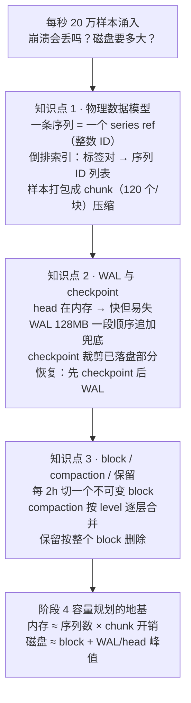
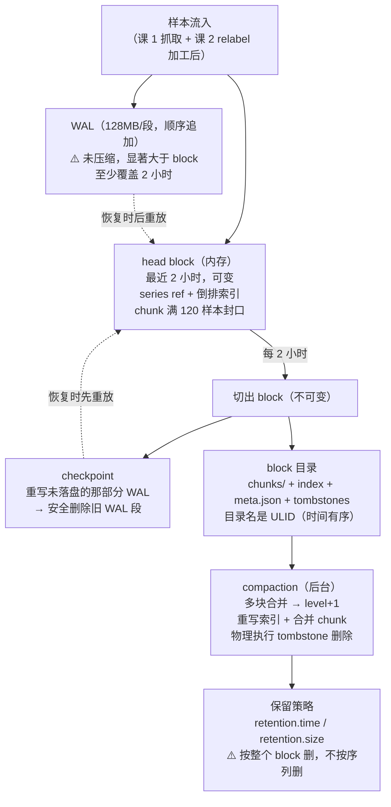

# 第 3 课：TSDB 存储引擎

> 所属阶段：阶段 1《单机内核》｜ 水平：进阶 ｜ 本课知识点：物理视角的数据模型、WAL 与 checkpoint、block、compaction 与保留
> 故事情节：主角住下来了——被捞回来的样本存在哪、怎么存、存多久。这是整个课程的物理地基
> 前置课程：`promql/`（4 阶段 12 课，2026-08 结课）。本课的 PromQL 语法、四种指标类型的逻辑语义均视为已掌握，需要时给一句定位，不重讲。

## 🎯 本课目标

- 从存储角度解释"一条序列 = 一个 series ref"，能算出给定 label 组合会产生多少条序列
- 说出 WAL 分段大小、checkpoint 的作用与触发时机，解释崩溃重启后数据为什么还在
- 说出 block 的时间跨度、compaction 合并规则、保留策略的删除粒度，能对着真实数据目录逐文件解读

---

## 第一幕：起源与场景引入

> 🏛️ **起源**：Prometheus 的存储引擎经历过一次彻底重写。1.x 版本用的是 LevelDB 做索引 + 每个序列一个文件，在大规模下很快就撑不住了——文件句柄耗尽、随机写放大、查询要打开成百上千个文件。2017 年发布的 Prometheus 2.0 换上了全新的自研 TSDB：把时间轴切成不可变的 **block**，把索引和样本分离，用 WAL 保证崩溃安全。这套设计一直沿用至今。（*背景核查于 2026-09*）
>
> 一个值得记住的细节：2.0 重写的核心作者 Fabian Reinartz 后来也是 **Grafana Mimir / Cortex** 的主要设计者之一——所以 Thanos、Mimir 这些长期存储方案，本质上都是在 Prometheus 这套 block 格式之上做文章。理解了 block，就理解了整个生态的通用货币。

**场景**：你的 Prometheus 现在已经稳定抓着 500 个 target，每秒写入 20 万个样本。

某天凌晨三点，机器重启了。你爬起来打开 Grafana，发现**最近两小时的数据全没了**——但两小时之前的都在。

运维手册上写着"Prometheus 有 WAL，崩溃不丢数据"，可数据确实少了一截。你开始怀疑：WAL 到底保住了什么？那两小时的数据是丢了，还是根本就没来得及落盘？

更实际的问题是：**这台机器该配多大的磁盘？** 你查了一下，现在数据目录 40GB，保留 15 天。老板让你保留 60 天，是不是简单乘 4 就行？

> 🎬 **场景**：样本被捞回来之后，它得有个"住处"。这个住处的结构，决定了数据会不会丢、查询快不快、磁盘要多大。

---

## 第二幕：认知冲突

翻开数据目录，你会看到三样东西：`wal/`、`chunks_head/`、以及一堆像 `01BKGTZQ1SYQJTR4PB43C8PD98` 这样的乱码目录。接下来三件事会让你越看越糊涂：

**第一，数据在内存里，但内存会丢。** Prometheus 写入性能这么好，是因为最新的样本都放在内存里的 head block 里。但内存一断电就没了——**那为什么 Prometheus 重启之后数据还在？** 如果答案是 WAL，那 WAL 是个什么结构，为什么它能兜住？

**第二，block 的名字是乱码，而且一旦生成就不再改。** 那些 `01BKGV7JBM69T2G1BGBGM6KB12` 一样的目录名是什么？更奇怪的是它们**不可变**——连删一条序列都不是真的删，而是往 `tombstones` 里加一条记录。**为什么不直接改，非要这么绕？**

**第三，也是最容易踩坑的一个**：你设了 `--storage.tsdb.retention.time=15d`，以为数据会精确地活 15 天然后消失。结果你发现：**有些数据活了 15 天多，有些不到 15 天就没了。** 而且磁盘占用会周期性地上蹿下跳，有时甚至**超过**你设的 `retention.size`。

> ❓ **问题**：内存里的数据怎么保证不丢？那些不可变的 block 目录是怎么产生、怎么合并、又怎么被删掉的？以及——保留策略到底在哪个粒度上生效？

---

## 第三幕：层层揭示

### 知识点 1：物理视角的数据模型

> 本知识点关键点：series ref 与倒排索引 / 标签组合 → 序列数的换算 / chunk 的作用

#### 一句话定义

Prometheus 在物理上把**每条序列压缩成一个自增整数 ID（`series ref`）**，用一个"标签集 → ID"的**倒排索引**完成名称到 ID 的翻译；样本本身只存 `(timestamp, value)` 并按序列打成 **chunk**（默认 120 个样本一块）压缩存放。

#### 直觉建立（类比）

逻辑视角（你在 `promql/` 课 2 学过的）像是**按姓名找人**：`http_requests_total{job="api",route="/health"}` 是一串可读的文字。

物理视角则像是**图书馆的索书号**：那串长长的标签组合被压缩成了一个数字编号，比如 `ref=10247`。书架上按编号排，查找时先查"书名 → 编号"的索引卡，再按编号取书。

关键在于：**同一本书（序列）的所有内容都放在同一个编号下**，而不是每借一次就抄一遍书名。这就是省空间的根源——标签只存一次，之后每个样本只引用那个编号。

> 💡 **类比的边界**：真实机制里，"书名 → 编号"这个索引是**倒排**的——不是按书名查编号，而是对每个标签对（如 `job="api"`）维护一个"哪些序列有这个标签"的列表，查询时把多个列表**求交集**。这跟书名的字母序查找思路相反，但对"按标签组合筛选"这个场景快得多。

#### 核心原理

**逻辑视图 → 物理视图的映射**：

| | 逻辑视图（promql/ 课 2 已讲） | 物理视图（本课） |
|---|---|---|
| 一条序列 | 指标名 + 一组标签键值对 | **一个自增整数 `series ref`** |
| 如何找到它 | 按名字和标签匹配 | **倒排索引**：标签对 → 序列 ID 列表，查询时求交集 |
| 样本内容 | `metric{labels} value timestamp` | `(timestamp, value)`，**标签不重复存** |
| 组织单位 | 无（一条条样本） | **chunk**：同一序列的一批样本打包压缩 |

**序列数的换算——这是本课第一个必须能算的东西**：

> **一条序列 = 指标名 + 一组唯一的标签键值对组合。**
> 某个指标产生的序列数 = 它所有标签的**不同取值数量的笛卡尔积**（前提是这些标签在所有样本上都出现）。

实测验证（本机 Prometheus 3.14.0）。应用暴露三个指标：

```
app_requests_total{route="<3种>", status="<2种>"}   → 3 × 2 = 6 条
app_build_info{version, region}                     → 1 条（只有一种组合）
app_debug_user_id{user_id="<2种>"}                  → 2 条
```

查询实测：

```
count(app_requests_total)  → 6
count(app_build_info)      → 1
count(app_debug_user_id)   → 2
count({__name__=~"app_.*"}) → 9
```

6 + 1 + 2 = 9，**与笛卡尔积精确吻合**。

⚠️ **三个必须注意的陷阱**：

1. **标签要"都出现"才是笛卡尔积。** 如果 `status` 标签只在部分样本上有，那实际序列数小于笛卡尔积。
2. **全库序列数远大于业务序列数。** 上面实测全库 `count({__name__=~".+"})` = **14** 条，而业务只有 9 条——多出来的是 Prometheus **自动生成**的 `up`、`scrape_duration_seconds`、`scrape_samples_scraped` 等元指标。
3. **这就是"基数爆炸"的根源。** 加一个取值为 1000 种的标签（比如 `user_id`），序列数直接 **×1000**。阶段 4 课 10 会专门讲这个。

**倒排索引怎么工作**：对每个标签对维护一个 postings list（序列 ID 列表）。查 `app_requests_total{status="200"}` 时：

1. 取 `__name__="app_requests_total"` 的 postings list；
2. 取 `status="200"` 的 postings list；
3. **求交集** → 得到匹配的序列 ID；
4. 按 ID 去 chunk 里取样本。

**chunk 的作用**：同一序列的样本按时间顺序追加进 chunk，默认**满 120 个样本**（或时间跨度达到阈值）就封口，压缩后写入磁盘。这样：

- **压缩率高**：同一序列的相邻样本值相近，用 delta-of-delta + XOR 编码能压得很小；
- **读取高效**：查一个时间范围只需要解压涉及的少数几个 chunk，而不是逐个样本读。

#### 示例演示

直接看 TSDB 自己报的数字（实测，需要先让 Prometheus 抓取自己）：

```bash
curl -s -G 'http://localhost:9097/api/v1/query' \
  --data-urlencode 'query=prometheus_tsdb_head_series'
```

返回 `745` —— head block 里当前有 745 条序列。这个数字就是**内存里驻留的序列总数**，是容量规划最关键的指标之一（阶段 4 课 11 会展开）。

> 📌 **注意**：`prometheus_tsdb_head_series` 这类 `prometheus_tsdb_*` 指标是 **Prometheus 自己暴露的**，但 **Prometheus 默认不会去抓自己**——你必须在 `scrape_configs` 里显式加一个 `job_name: prometheus` 指向 `localhost:9090`，否则这些指标查不到（课 1 已实测过这一点）。本课课 3 的实验配置里已经加了这个 job。

再看序列数换算的实测：

```bash
for m in app_requests_total app_build_info app_debug_user_id; do
  echo -n "$m: "
  curl -s -G 'http://localhost:9097/api/v1/query' --data-urlencode "query=count($m)" \
    | python3 -c "import json,sys; print(json.load(sys.stdin)['data']['result'][0]['value'][1])"
done
```

输出：

```
app_requests_total: 6
app_build_info: 1
app_debug_user_id: 2
```

#### 常见误区

1. **"序列数 = 指标数"**：错。序列数 = **标签组合数**。一个带 3 个标签、每个标签 10 种取值的指标，会产生 1000 条序列。
2. **"物理上每条样本都存了完整标签"**：错。标签只在序列创建时存一次，之后每个样本只引用 `series ref`（那个整数 ID）。这正是 Prometheus 存储高效的关键。
3. **"查序列数用 `count({__name__=~".+"})` 就够"**：不够——这个数字**不包含已删除但还在 tombstone 里的**，也不区分 head 与 block。要看"当前内存里驻留多少"得用 `prometheus_tsdb_head_series`。

#### 一句话记住

**一条序列在物理上就是一个自增整数 ID，标签只存一次并通过倒排索引翻译；样本按序列打成 120 个一组的 chunk 压缩存放——所以"序列数 = 标签组合的笛卡尔积"是容量规划的起点。**

#### 官方文档

- [Prometheus 存储文档](https://prometheus.io/docs/prometheus/latest/storage/)：官方对 on-disk layout 的说明。
- [TSDB 文件格式](https://github.com/prometheus/prometheus/blob/main/tsdb/docs/format/README.md)：index / chunks / tombstones 的二进制布局。

---

### 知识点 2：WAL 与 checkpoint

> 本知识点关键点：WAL 分段与大小 / checkpoint 的作用 / 崩溃恢复路径

#### 一句话定义

**WAL（Write-Ahead Log）** 把进入 head 的每一批样本**先顺序追加到磁盘日志**（默认 **128MB 一段**），再写内存；Prometheus 重启时重放 WAL 重建 head。**checkpoint** 是在 head 切出 block 后，把"已经落进 block 的那部分 WAL"压缩成一个快照，从而安全地删掉旧 WAL 段。

#### 直觉建立（类比）

把 head block 想象成**你正在写的那页草稿纸**，WAL 则是**你一边写一边念出的录音**。

草稿纸（内存）写得快、改得方便，但一阵风（断电）就全没了。录音（WAL）虽然啰嗦，却忠实记录了你说的每一句话——风把纸吹走了，你照着录音重新默写一遍就行。

**checkpoint 就是"录音整理稿"**：当一页草稿写满、誊抄成正式稿（block）之后，前面那段录音就没用了。但你不能直接把录音带剪掉——因为录音里可能还夹着**下一页草稿的开头几句话**。于是你整理出一份摘要："前 30 分钟的录音已经誊抄完毕，从第 31 分钟第 12 秒开始才是还没誊抄的。"这份摘要就是 checkpoint。

> 💡 **类比的边界**：真实机制里 checkpoint 不是"摘要"，而是**把未落盘那部分 WAL 的重写副本**——它本身就是一份完整的 WAL，只是内容已经被裁剪到只剩必要部分。所以 checkpoint 目录里的 `000000xx` 文件长得很像普通 WAL 段，别被名字骗了。

#### 核心原理

**为什么必须有 WAL**：head block 在内存里。一个 5 秒抓取间隔 × 500 target 的实例，两小时能积累上亿个样本——全放内存是为了写入性能和查询速度（最新数据查询不用碰磁盘），代价就是**断电即失**。WAL 用"顺序追加写"这个最廉价的磁盘操作把这个风险兜住。

**WAL 的结构**（实测，本机 Prometheus 3.14.0）：

```
data/wal/
├── 00000000        # 41,861 字节
├── 00000001        # 19,840 字节
├── 00000002        # 3,056,324 字节   ← 当前正在写的一段
└── checkpoint.00000001/   # head 切出 block 后出现
    └── 00000000
```

关键参数：

| 参数 | 默认值 | 说明 |
|------|--------|------|
| 段大小 | **128 MB** | 写满就切下一段；官方原文：*"stored in the `wal` directory in 128MB segments"* |
| 最少保留段数 | **3** | 官方：*"Prometheus will retain a minimum of three write-ahead log files"* |
| 高流量时 | 可能 >3 段 | 官方：*"High-traffic servers may retain more than three WAL files in order to keep at least two hours of raw data"* |

**注意最后一条**：WAL 的目标不是"保留 3 段"，而是**至少覆盖 2 小时的原始数据**。流量大时会自动多留几段。这条规则直接决定了磁盘的最小需求——官方文档明确说：*"the minimum requirement for the disk is the peak space taken by the wal (the WAL and Checkpoint) and chunks_head (m-mapped Head chunks) directory combined (peaks every 2 hours)"*。

**checkpoint 的触发时机**：head 切出一个新 block 之后（默认每 2 小时）。此时：

1. 该 block 覆盖的时间范围内的样本已经安全落盘；
2. 但 WAL 段是"混合"的——一个 128MB 的段里可能同时包含**已落盘**和**未落盘**的样本；
3. 于是 Prometheus 扫描这些段，把**还没落盘的样本**重写到一个新目录 `checkpoint.000000NN/`；
4. 然后才能安全删除旧的 WAL 段。

**崩溃恢复路径**（实测，见第四幕）：重启时按以下顺序：

1. 加载 block（磁盘上的不可变数据）；
2. 重放 `chunks_head/` 里 m-map 的 chunk；
3. 从最近的 checkpoint 开始重放 WAL；
4. 逐个加载 WAL 段，重建 head。

实测日志（本机，真实输出）：

```
level=INFO source=head.go:738 msg="Replaying on-disk memory mappable chunks if any"
level=INFO source=head.go:824 msg="On-disk memory mappable chunks replay completed" duration=2.09µs
level=INFO source=head.go:832 msg="Replaying WAL, this may take a while"
level=INFO source=head.go:927 msg="WAL segment loaded" segment=0 maxSegment=2 duration=10.657812ms
level=INFO source=head.go:927 msg="WAL segment loaded" segment=1 maxSegment=2 duration=2.542008ms
level=INFO source=head.go:927 msg="WAL segment loaded" segment=2 maxSegment=2 duration=966.122µs
level=INFO source=head.go:964 msg="WAL replay completed" checkpoint_replay_duration=1.739178ms wal_replay_duration=14.275352ms total_replay_duration=16.033349ms
```

注意到日志里有独立的 `checkpoint_replay_duration` 和 `wal_replay_duration` 两个计时——这正是"先 checkpoint 后 WAL"两段式恢复的直接证据。

#### 示例演示

**崩溃恢复实测**：先记录崩溃前的值，然后 `docker kill -9` 硬杀（不发 SIGTERM、不做优雅退出），再重启对比：

```bash
# 1) 记录崩溃前的值
curl -s -G 'http://localhost:9097/api/v1/query' \
  --data-urlencode 'query=app_requests_total{route="/health",status="200"}'
# -> [1788497778.858, "11809"]

# 2) 硬杀
docker kill -s KILL l3-prom

# 3) 重启（触发 WAL 重放），等待 20 秒后查同一个指标
curl -s -G 'http://localhost:9097/api/v1/query' \
  --data-urlencode 'query=app_requests_total{route="/health",status="200"}'
# -> [1788497799.731, "11949"]
```

**数据完好**（值还在继续增长，说明崩溃前的样本没丢、且新抓取已恢复）。

**⚠️ 但有一个真实代价**：WAL 里的数据在 block 切出之前**没有索引**。所以崩溃重启后，那部分数据是通过重放 WAL 逐条重建的——重启耗时与 WAL 大小成正比。上面这段实测重放只花了 16ms（数据量小），但生产环境一个几个 GB 的 WAL 可能要重放几分钟。**这解释了为什么"优雅关闭"很重要**：SIGTERM 会让 Prometheus 走正常关闭流程，比硬杀后重放快得多。

**WAL 的磁盘占用提醒**：WAL 存的是**未压缩的原始数据**，官方明确说它 *"are significantly larger than regular block files"*。所以：

> 磁盘最小需求 = **WAL + Checkpoint + chunks_head 三者的峰值之和**（每 2 小时达到一次峰值）。
> 这意味着即使你设了 `retention.size`，实际磁盘占用也可能**阶段性超过**这个值。

#### 常见误区

1. **"WAL 保证所有数据都不丢"**：WAL 只覆盖 **head**（默认最近 2 小时）。已经落进 block 的数据本来就在磁盘上，不需要 WAL 保护。**崩溃丢失的窗口 = 尚未 fsync 的那一小段**（通常毫秒级），不是两小时。
2. **"checkpoint 是备份，可以随便删"**：删掉 checkpoint 会导致对应的 WAL 段无法被正确重放。它是**恢复链的必要一环**，不是冗余副本。
3. **"WAL 占的空间可以忽略"**：恰恰相反。WAL 存未压缩原始数据，**显著大于**同等范围的 block 文件。官方明确要求按 "WAL + Checkpoint + chunks_head 峰值之和" 规划磁盘。
4. **"重启后数据都在，所以不用管关闭方式"**：都在，但**重放耗时**。硬杀后要重放整个 WAL；优雅关闭（SIGTERM）则快得多。

#### 一句话记住

**head 在内存所以快但易失，WAL 用 128MB 一段的顺序追加写兜住崩溃安全（至少覆盖 2 小时），checkpoint 在 head 切出 block 后把"还没落盘的那部分 WAL"重写成快照以便安全删旧段——恢复时先 checkpoint 后 WAL 两段重放。**

#### 官方文档

- [Prometheus 存储文档 · WAL 与 checkpoint](https://prometheus.io/docs/prometheus/latest/storage/)：WAL 128MB 分段、最少 3 段、checkpoint 目录说明。

---

### 知识点 3：block、compaction 与保留

> 本知识点关键点：2 小时 block / compaction 的合并规则 / 保留的删除粒度

#### 一句话定义

head 每 **2 小时**切出一个**不可变**的 block 目录（`chunks/` + `index` + `meta.json` + `tombstones`）；后台 **compaction** 把多个小 block 合并成跨时更长的大 block（每合并一次 level +1）；**保留策略以整个 block 为删除粒度**——block 的 `maxTime` 超出保留窗口就整块删除，不做块内逐序列清理。

#### 直觉建立（类比）

把时间轴想象成**一排档案盒**。

最新的一小摞（head）摊在桌上，随手就能翻——那是最近两小时。每满两小时，桌上的就装订成册、贴上编号、放进柜子（block），**从此不再拆开修改**。

柜子里的册子越积越多，检索时要一本本翻。于是管理员（compaction）定期把相邻几本合并成一本厚的：三次合并下来，薄册子变成厚册子，柜子整齐多了。

至于销毁（保留）：管理员**只按整册处理**——一册里只要还有一页在保留期内，整册就留着；一册全部过期，整册扔掉。**他绝不会为了扔几页纸而把一册拆开重订。**

> 💡 **类比的边界**：真实机制里"合并"不是简单地把纸叠在一起，而是**重写索引 + 去重 + 处理删除标记（tombstone）**。被 tombstone 标记删除的数据，正是在 compaction 时**真正从磁盘上消失**的——这是唯一一次物理删除的机会。

#### 核心原理

**block 的目录结构**（实测，用 `promtool tsdb create-blocks-from` 生成的真实 block）：

```
01M1NAWQGSRCMAYF3Q0HHQ4P6R/
├── chunks/
│   └── 000001        # 样本数据（segment 文件，默认上限 512MB）
├── index             # 倒排索引：标签 → 序列 → chunk 位置
├── meta.json         # 元数据：时间范围、统计、compaction 血统
└── tombstones        # 删除标记（不是真删，只是记一笔）
```

那个乱码一样的目录名是 **ULID**（Universally Unique Lexicographically Sortable Identifier）——按时间有序的 UUID，所以目录名直接按字典序排就是时间序。

**`meta.json` 的内容**（实测，真实输出）：

```json
{
	"ulid": "01M1NAWQGSRCMAYF3Q0HHQ4P6R",
	"minTime": 1788451200000000,
	"maxTime": 1788451200000001,
	"stats": { "numSamples": 3, "numFloatSamples": 3, "numSeries": 3, "numChunks": 3 },
	"compaction": { "level": 1, "sources": ["01M1NAWQGSRCMAYF3Q0HHQ4P6R"] },
	"version": 1
}
```

**为什么 block 要不可变？** 三个理由：

1. **查询无需加锁**：数据不会变，读的时候不用跟写抢锁；
2. **可以 mmap 直接映射**：不用把整个 block 读进内存；
3. **备份/迁移安全**：block 是完整自洽的，拷走就能用——这正是 Thanos / Mimir 能把 block 传到对象存储的前提。

**compaction 的合并规则**（实测，本机 Prometheus 3.14.0）：

我往数据目录里"种植"了 61 个 1 小时跨度的 block，启动 Prometheus 后观察它的自动合并行为。实测日志（真实输出）：

```
level=INFO source=compact.go:661 msg="compact blocks" count=2 mint=... maxt=... ulid=01M1NCAH2HJ6AHV3GRBAA6FVF5 sources="[01M1NAWT9GE3X5QASBZAWA2KDA 01M1NAWTF3W2YD88PS8ESMD3MK]" duration=49.872594ms
level=INFO source=compact.go:661 msg="compact blocks" count=3 mint=... maxt=... ulid=01M1NCAHMR14QFH55ET65K4QPX sources="[01M1NAWSJWDVPXYK8276V6KF1F 01M1NAWSQVTPRF78Q24ZY0HAW2 01M1NAWSXDGB46GEMD06QEH3NB]" duration=55.722999ms
...
level=INFO source=db.go:2343 msg="Deleting obsolete block" block=01M1NAWRQEDV5W8VT2RPPF31RV
```

**30 秒内：61 个 block → 19 个**。合并产物的 `meta.json` 带着完整血统（实测）：

```json
{
	"ulid": "01M1NCAHMR14QFH55ET65K4QPX",
	"minTime": 1788452220000000,
	"maxTime": 1788452340000001,
	"stats": { "numSamples": 9, "numSeries": 3, "numChunks": 9 },
	"compaction": {
		"level": 2,
		"sources": ["01M1NAWSJWDVPXYK8276V6KF1F", "01M1NAWSQVTPRF78Q24ZY0HAW2", "01M1NAWSXDGB46GEMD06QEH3NB"],
		"parents": [
			{ "ulid": "01M1NAWSJWDVPXYK8276V6KF1F", "minTime": 1788452220000000, "maxTime": 1788452220000001 },
			...
		]
	},
	"version": 1
}
```

注意 `level: 2`、`sources`（来源 block 列表）和 `parents`（带时间范围的完整血统）。**level 就是"被合并过几次"**。

实测的 level 分布与跨度递增（本机数据）：

```
level -> block 数: {1: 2, 2: 10, 3: 3}
level=1:  2 个 block, 平均跨度   0.0 ms
level=2: 10 个 block, 平均跨度 120.0 ms
level=3:  3 个 block, 平均跨度 180.0 ms
```

**合并时做了三件事**：① 重写倒排索引（去重、合并 postings list）；② 合并 chunk（同一序列的相邻 chunk 可能合并成更大的）；③ **处理 tombstone——真正物理删除被标记的数据**。

**compaction 的目标大小**：官方原文——*"Compaction will create larger blocks containing data spanning up to 10% of the retention time, or 31 days, whichever is smaller."*

**保留策略的删除粒度（本课最易踩的坑）**：

> **保留是按整个 block 删的，不是按序列删的。**

实测：给种了 61 个 block 的数据目录设 `--storage.tsdb.retention.time=2h`，启动后：

```
种植 block 数: 61
保留后 block 数量: 5
```

日志里全是 `Deleting obsolete block`——**整块整块地删**，没有一条"删除某条序列"的记录。存活的 5 个 block 都是 `maxTime` 最接近当前时间的那批。

这解释了第二幕的困惑：

- **为什么有的数据活过了保留期？** 因为它所在的 block 里还有更新的数据，整块被留下了。
- **为什么有的数据不到期就没了？** 因为它所在的 block `maxTime` 超期了，整块被删——**块内更早的数据跟着一起走**。
- **为什么磁盘占用会周期性波动？** 每 2 小时切一次 block，切完才可能触发删除；同时 WAL + chunks_head 的峰值也在这个周期上叠加。

⚠️ **另一个实测发现**：`--storage.tsdb.retention.time=1s` **不会被接受**——日志显示 `TSDB retention updated duration=30d`（回落到默认值）。保留时间有最小有效值，设得过小时 Prometheus 会忽略它。**做实验验证保留策略时，要用 2h 这样的合理值**。

顺带一提：设了极短保留还会在日志里看到 `out of bounds` / `Error on ingesting samples that are too old` 这类告警——因为新抓的样本落在了保留窗口之外。**这个错误在真实运维中也很常见**，通常是 Prometheus 本机时间跳变或保留配置过短导致的，阶段 4 课 12 排障会再遇到。

#### 示例演示

**生成真实 block（无需等 2 小时）**：

```bash
# 用 promtool 从 OpenMetrics 文本直接生成 block
docker run --rm \
  -v "$PWD/blocks-input":/in -v "$PWD/blocks":/out \
  --entrypoint /bin/promtool prom/prometheus:v3.14.0 \
  tsdb create-blocks-from openmetrics /in/samples.om /out
```

输出（真实）：

```
BLOCK ULID                  MIN TIME          MAX TIME       NUM SAMPLES  NUM CHUNKS  NUM SERIES  SIZE
01M1NAWQGSRCMAYF3Q0HHQ4P6R  1788451200000000 1788451200000001  3          3           3           909
...
```

**查看 block 列表与血统**：

```bash
docker exec l3-compact /bin/promtool tsdb list /prometheus
```

**统计 level 分布**：

```bash
cd data-compact
python3 -c "
import json, os, collections
c = collections.Counter()
for d in os.listdir('.'):
    p = os.path.join(d, 'meta.json')
    if os.path.isfile(p):
        m = json.load(open(p))
        c[m['compaction']['level']] += 1
print('  level -> block 数:', dict(sorted(c.items())))
"
# -> level -> block 数: {1: 2, 2: 10, 3: 3}
```

#### 常见误区

1. **"保留 15 天意味着每条数据精确活 15 天"**：错。保留是**按 block 整块删**的，块内早于窗口的数据会跟着一起删，块内晚于窗口的数据会被多留一会儿。
2. **"compaction 只是把文件拼起来"**：不止。它还会**重写索引、合并 chunk、物理执行 tombstone 删除**——被标记删除的数据就是在这一步真正消失的。
3. **"block 生成后还能改"**：不能。block 不可变，删除只是往 `tombstones` 里加一条标记，**数据本身要等下次 compaction 才真正移除**。
4. **"磁盘需求 = retention.size"**：不够。还要叠加 **WAL + Checkpoint + chunks_head 的 2 小时峰值**。
5. **"`retention.time` 设多小都行"**：不行，实测设 `1s` 会被忽略并回落到默认值（30d）。

#### 一句话记住

**head 每 2 小时切出一个不可变 block，compaction 按 level 逐层合并（重写索引 + 处理 tombstone），保留则以整个 block 为单位删除——所以"精确保留 N 天"是不可能的，块内数据会跟着整块一起走。**

#### 官方文档

- [Prometheus 存储文档 · Compaction 与保留](https://prometheus.io/docs/prometheus/latest/storage/)：block 结构、compaction 上限（10% retention 或 31 天）、retention 参数说明。

---

## 第四幕：实操验证

> ⚠️ **命令避坑：PromQL 里的花括号必须 URL 编码。**
> 直接写 `curl -s 'http://localhost:9097/api/v1/query?query=up{job="x"}'` 会返回 **HTTP 400**（`parse error: unexpected "="`）——`{` 和 `}` 是 URL 非安全字符。
> 本课统一用：
> ```bash
> curl -s -G 'http://localhost:9097/api/v1/query' --data-urlencode 'query=up{job="x"}'
> ```
> 与引号无关——单引号、双引号、反斜杠转义全都救不了，根因就在花括号。浏览器和 Grafana 会自动编码，所以只在手写 `curl` 时撞上。（课 2 已踩过 8 处，本课一次写对。）

把三个知识点串成一条完整链路：**起环境 → 数序列 → 制造崩溃看 WAL 恢复 → 生成并观察真实 block → 观察 compaction → 验证保留的删除粒度**。

### 步骤 0：准备示例应用与配置

```bash
mkdir -p ~/prometheus-lab/lesson-03/app ~/prometheus-lab/lesson-03/data
```

创建 `~/prometheus-lab/lesson-03/app/multi_app.py`（标签维度固定，便于核算序列数）：

```python
import time
from http.server import BaseHTTPRequestHandler, HTTPServer

# 固定的标签维度，方便计算序列数
# app_requests_total: route(3) x status(2) = 6 条
# app_build_info: 1 条（无额外维度）
# app_debug_user_id: user_id(2) = 2 条
# 合计 9 条序列（不含 Prometheus 自动生成的 up / scrape_* 等）

ROUTES = ["/health", "/api/orders", "/api/users"]
STATUSES = ["200", "500"]
USERS = ["u-10001", "u-10002"]

START = time.time()


def render_metrics():
    uptime = int(time.time() - START)
    lines = []

    lines.append("# HELP app_requests_total 演示用请求计数器")
    lines.append("# TYPE app_requests_total counter")
    for route in ROUTES:
        for status in STATUSES:
            val = uptime * len(route) + (0 if status == "200" else 7)
            lines.append('app_requests_total{route="%s",status="%s"} %d'
                         % (route, status, val))

    lines.append("# HELP app_build_info 构建信息，值恒为 1")
    lines.append("# TYPE app_build_info gauge")
    lines.append('app_build_info{version="1.2.3",region="cn-south"} 1')

    lines.append("# HELP app_debug_user_id 演示用的高基数调试指标")
    lines.append("# TYPE app_debug_user_id gauge")
    for u in USERS:
        lines.append('app_debug_user_id{user_id="%s"} 1' % u)

    return "\n".join(lines) + "\n"


class Handler(BaseHTTPRequestHandler):
    def do_GET(self):
        if self.path == "/metrics":
            body = render_metrics().encode("utf-8")
            self.send_response(200)
            self.send_header("Content-Type", "text/plain; version=0.0.4; charset=utf-8")
            self.send_header("Content-Length", str(len(body)))
            self.end_headers()
            self.wfile.write(body)
            return

        body = b"l3 demo app\n"
        self.send_response(200)
        self.send_header("Content-Length", str(len(body)))
        self.end_headers()
        self.wfile.write(body)

    def log_message(self, fmt, *args):
        pass


if __name__ == "__main__":
    print("l3-app listening on :8080", flush=True)
    HTTPServer(("0.0.0.0", 8080), Handler).serve_forever()
```

创建 `~/prometheus-lab/lesson-03/prometheus.yml`——**注意必须加自抓取 job**，否则查不到 `prometheus_tsdb_*` 内部指标：

```yaml
global:
  scrape_interval: 5s
  evaluation_interval: 5s

scrape_configs:
  # Prometheus 自己——课 3 全靠 TSDB 内部指标，必须自抓取
  - job_name: prometheus
    static_configs:
      - targets:
          - localhost:9090

  - job_name: l3-demo
    static_configs:
      - targets:
          - l3-app:8080
```

### 步骤 1：起环境

```bash
cd ~/prometheus-lab/lesson-03
docker network create lesson03-net

docker run -d --name l3-app --network lesson03-net \
  -v "$PWD/app":/app -w /app \
  python:3.12-slim python multi_app.py

docker run -d --name l3-prom --network lesson03-net -p 9097:9090 \
  -v "$PWD/prometheus.yml":/etc/prometheus/prometheus.yml \
  -v "$PWD/data":/prometheus \
  prom/prometheus:v3.14.0 \
  --config.file=/etc/prometheus/prometheus.yml \
  --storage.tsdb.path=/prometheus \
  --storage.tsdb.retention.time=1h \
  --web.enable-lifecycle \
  --web.enable-admin-api
```

> 宿主端口用 **9097**（9095 属课 1、9096 属课 2）。如果你的环境空闲，用 9090 即可。

### 步骤 2：验证序列数换算（知识点 1）

```bash
sleep 15
for m in app_requests_total app_build_info app_debug_user_id; do
  echo -n "$m: "
  curl -s -G 'http://localhost:9097/api/v1/query' --data-urlencode "query=count($m)" \
    | python3 -c "import json,sys; print(json.load(sys.stdin)['data']['result'][0]['value'][1])"
done

echo -n "业务合计: "
curl -s -G 'http://localhost:9097/api/v1/query' \
  --data-urlencode 'query=count({__name__=~"app_.*"})' \
  | python3 -c "import json,sys; print(json.load(sys.stdin)['data']['result'][0]['value'][1])"

echo -n "全库（含 up / scrape_*）: "
curl -s -G 'http://localhost:9097/api/v1/query' \
  --data-urlencode 'query=count({__name__=~".+"})' \
  | python3 -c "import json,sys; print(json.load(sys.stdin)['data']['result'][0]['value'][1])"
```

预期输出（本机实测 2026-09-04）：

```
app_requests_total: 6      # route(3) × status(2)
app_build_info: 1
app_debug_user_id: 2       # user_id(2)
业务合计: 9
全库（含 up / scrape_*）: 14
```

**全库 14 > 业务 9**，多出来的 5 条是 Prometheus 自动生成的 `up`、`scrape_duration_seconds`、`scrape_samples_scraped` 等元指标。

再看 TSDB 自己报的 head 序列数：

```bash
curl -s -G 'http://localhost:9097/api/v1/query' \
  --data-urlencode 'query=prometheus_tsdb_head_series'
```

预期输出：一个明显大于 14 的数（本机实测 **745**，含 Prometheus 自暴露的上百个内部指标序列）。

### 步骤 3：验证 WAL 与崩溃恢复（知识点 2）

先看 WAL 目录：

```bash
ls -la data/wal
```

预期输出（实测，段序号从 0 递增，未满 128MB 不切段）：

```
-rw-r--r-- 1 root root    41861 Sep  4 12:56 00000000
-rw-r--r-- 1 root root    19840 Sep  4 12:56 00000001
-rw-r--r-- 1 root root  3056324 Sep  4 14:00 00000002   ← 当前正在写的一段
```

**崩溃恢复实测**：

```bash
# 1) 记录崩溃前的值
curl -s -G 'http://localhost:9097/api/v1/query' \
  --data-urlencode 'query=app_requests_total{route="/health",status="200"}'
```

预期输出：`["1788497778.858", "11809"]`（时间戳 + 值）

```bash
# 2) 硬杀（不发 SIGTERM、不做优雅退出）
docker kill -s KILL l3-prom

# 3) 重启，等 20 秒
docker rm -f l3-prom
docker run -d --name l3-prom --network lesson03-net -p 9097:9090 \
  -v "$PWD/prometheus.yml":/etc/prometheus/prometheus.yml \
  -v "$PWD/data":/prometheus \
  prom/prometheus:v3.14.0 \
  --config.file=/etc/prometheus/prometheus.yml \
  --storage.tsdb.path=/prometheus \
  --storage.tsdb.retention.time=1h \
  --web.enable-lifecycle --web.enable-admin-api

sleep 20

# 4) 再查同一个指标
curl -s -G 'http://localhost:9097/api/v1/query' \
  --data-urlencode 'query=app_requests_total{route="/health",status="200"}'
```

预期输出（实测）：`["1788497799.731", "11949"]` —— **数据完好，且值在继续增长**（说明抓取已恢复）。

看重启日志里的 WAL 重放过程：

```bash
docker logs l3-prom 2>&1 | grep -iE 'Replaying|WAL segment loaded|WAL replay completed'
```

预期输出（实测）：

```
level=INFO source=head.go:738 msg="Replaying on-disk memory mappable chunks if any"
level=INFO source=head.go:824 msg="On-disk memory mappable chunks replay completed" duration=2.09µs
level=INFO source=head.go:832 msg="Replaying WAL, this may take a while"
level=INFO source=head.go:927 msg="WAL segment loaded" segment=0 maxSegment=2 duration=10.657812ms
level=INFO source=head.go:927 msg="WAL segment loaded" segment=1 maxSegment=2 duration=2.542008ms
level=INFO source=head.go:927 msg="WAL segment loaded" segment=2 maxSegment=2 duration=966.122µs
level=INFO source=head.go:964 msg="WAL replay completed" checkpoint_replay_duration=1.739178ms wal_replay_duration=14.275352ms total_replay_duration=16.033349ms
```

**注意日志里 `checkpoint_replay_duration` 与 `wal_replay_duration` 是两个独立计时**——这是"先 checkpoint、后 WAL"两段式恢复的直接证据。

### 步骤 4：生成真实 block（知识点 3）

等 2 小时看 block 切分不现实。用 `promtool` 从 OpenMetrics 文本**直接生成**真实 block：

```bash
mkdir -p ~/prometheus-lab/lesson-03/blocks-input ~/prometheus-lab/lesson-03/blocks
```

生成输入文件（1 小时跨度，3 条序列，每 60 秒一个点）：

```bash
cat > ~/prometheus-lab/lesson-03/gen-openmetrics.py <<'PYEOF'
import datetime

OUT = "/tmp/samples.om"
BASE = datetime.datetime(2026, 9, 4, 0, 0, 0)
STEP = 60
POINTS = 61

GROUPS = [
    ("app_demo_temperature", [
        ({"region": "cn-south", "sensor": "s1"}, lambda i: 20.0 + (i % 12) * 0.5),
        ({"region": "cn-north", "sensor": "s2"}, lambda i: 15.0 + (i % 9) * 0.7),
    ]),
    ("app_demo_pressure", [
        ({"region": "cn-south"}, lambda i: 1013.0 + (i % 5) * 0.1),
    ]),
]

lines = []
for name, series_list in GROUPS:
    lines.append("# TYPE %s gauge" % name)
    lines.append("# HELP %s demo metric for block generation" % name)
    for i in range(POINTS):
        ts = int((BASE + datetime.timedelta(seconds=i * STEP)).timestamp() * 1000)
        for labels, fn in series_list:
            label_str = ",".join('%s="%s"' % (k, v) for k, v in sorted(labels.items()))
            lines.append("%s{%s} %s %d" % (name, label_str, fn(i), ts))
lines.append("# EOF")

with open(OUT, "w", encoding="utf-8") as f:
    f.write("\n".join(lines) + "\n")
print("wrote %s" % OUT)
PYEOF

python3 ~/prometheus-lab/lesson-03/gen-openmetrics.py
cp /tmp/samples.om ~/prometheus-lab/lesson-03/blocks-input/
```

> ⚠️ **格式要求**：promtool 的文本解析器**不接受空行**，且要求按"指标块"组织（同一指标的 `TYPE`/`HELP` 后紧跟该指标的所有样本）。留空行会报 `expected a valid start token, got "\n"`。

生成 block：

```bash
cd ~/prometheus-lab/lesson-03
docker run --rm \
  -v "$PWD/blocks-input":/in -v "$PWD/blocks":/out \
  --entrypoint /bin/promtool prom/prometheus:v3.14.0 \
  tsdb create-blocks-from openmetrics /in/samples.om /out
```

预期输出（实测节选）：

```
BLOCK ULID                  MIN TIME          MAX TIME          DURATION  NUM SAMPLES  NUM CHUNKS  NUM SERIES  SIZE
01M1NAWQGSRCMAYF3Q0HHQ4P6R  1788451200000000  1788451200000001  1ms       3            3           3           909
01M1NAWQJS8H86FZ84HAH8CJDW  1788451260000000  1788451260000001  1ms       3            3           3           909
...
```

**看单个 block 的完整结构**：

```bash
FIRST=$(ls blocks | head -1)
find "blocks/$FIRST" -type f | sort
cat "blocks/$FIRST/meta.json"
```

预期输出（实测）：

```
blocks/01M1NAWQGSRCMAYF3Q0HHQ4P6R/chunks/000001
blocks/01M1NAWQGSRCMAYF3Q0HHQ4P6R/index
blocks/01M1NAWQGSRCMAYF3Q0HHQ4P6R/meta.json
blocks/01M1NAWQGSRCMAYF3Q0HHQ4P6R/tombstones
```

```json
{
	"ulid": "01M1NAWQGSRCMAYF3Q0HHQ4P6R",
	"minTime": 1788451200000000,
	"maxTime": 1788451200000001,
	"stats": { "numSamples": 3, "numFloatSamples": 3, "numSeries": 3, "numChunks": 3 },
	"compaction": { "level": 1, "sources": ["01M1NAWQGSRCMAYF3Q0HHQ4P6R"] },
	"version": 1
}
```

四个文件齐全：`chunks/`（样本）、`index`（倒排索引）、`meta.json`（元数据）、`tombstones`（删除标记）。

### 步骤 5：观察 compaction（知识点 3）

把 61 个小 block "种植"进一个数据目录，让 Prometheus 自动合并：

```bash
cd ~/prometheus-lab/lesson-03
rm -rf data-compact && mkdir -p data-compact
cp -r blocks/* data-compact/
echo "种植 block 数: $(ls data-compact | wc -l)"

docker run -d --name l3-compact --network lesson03-net -p 9098:9090 \
  -v "$PWD/prometheus-selfonly.yml":/etc/prometheus/prometheus.yml \
  -v "$PWD/data-compact":/prometheus \
  prom/prometheus:v3.14.0 \
  --config.file=/etc/prometheus/prometheus.yml \
  --storage.tsdb.path=/prometheus \
  --storage.tsdb.retention.time=30d \
  --web.enable-lifecycle --web.enable-admin-api

# ⚠️ compaction 是后台任务，不是瞬间完成。
# 实测：30 秒时只合并到 48 个（全是 level=1），
#       120 秒后才出现 level 2 / level 3。
# 想看到完整的分层合并，请等满 120 秒。
sleep 120
echo "compaction 后 block 数: $(ls data-compact | wc -l)"
```

预期输出（实测，等满 120 秒）：

```
种植 block 数: 61
compaction 后 block 数: 19
```

> ⚠️ **别急着看结果**：如果只等 30 秒，你会看到 `48` 个 block 且**全是 `level=1`**——compaction 还在进行中，分层合并尚未发生。这是"照着做却看不到现象"的典型原因，等满 120 秒即可。

看合并日志：

```bash
docker logs l3-compact 2>&1 | grep -E 'compact blocks' | head -5
```

预期输出（实测）：

```
level=INFO source=compact.go:661 msg="compact blocks" count=2 ... sources="[01M1NAWT9GE3X5QASBZAWA2KDA 01M1NAWTF3W2YD88PS8ESMD3MK]" duration=49.872594ms
level=INFO source=compact.go:661 msg="compact blocks" count=3 ... sources="[01M1NAWSJWDVPXYK8276V6KF1F 01M1NAWSQVTPRF78Q24ZY0HAW2 01M1NAWSXDGB46GEMD06QEH3NB]" duration=55.722999ms
```

**看 level 分布与合并产物的血统**：

```bash
cd data-compact
python3 -c "
import json, os, collections
c = collections.Counter()
for d in os.listdir('.'):
    p = os.path.join(d, 'meta.json')
    if os.path.isfile(p):
        m = json.load(open(p))
        c[m['compaction']['level']] += 1
print('  level -> block 数:', dict(sorted(c.items())))"
```

预期输出（实测）：`level -> block 数: {1: 2, 2: 10, 3: 3}`

再找一个 `level=2` 的 block 看它的 `sources` 和 `parents`：

```bash
cd data-compact
for d in */; do
  d=${d%/}
  [ -f "$d/meta.json" ] || continue
  lvl=$(python3 -c "import json;print(json.load(open('$d/meta.json'))['compaction']['level'])")
  if [ "$lvl" = "2" ]; then echo "--- $d ---"; cat "$d/meta.json"; echo; break; fi
done
```

预期输出（实测，注意 `level: 2` 与完整的 `sources` / `parents` 血统）：

```json
{
	"ulid": "01M1NCAHMR14QFH55ET65K4QPX",
	"minTime": 1788452220000000,
	"maxTime": 1788452340000001,
	"stats": { "numSamples": 9, "numFloatSamples": 9, "numSeries": 3, "numChunks": 9 },
	"compaction": {
		"level": 2,
		"sources": [
			"01M1NAWSJWDVPXYK8276V6KF1F",
			"01M1NAWSQVTPRF78Q24ZY0HAW2",
			"01M1NAWSXDGB46GEMD06QEH3NB"
		],
		"parents": [
			{ "ulid": "01M1NAWSJWDVPXYK8276V6KF1F", "minTime": 1788452220000000, "maxTime": 1788452220000001 },
			{ "ulid": "01M1NAWSQVTPRF78Q24ZY0HAW2", "minTime": 1788452280000000, "maxTime": 1788452280000001 },
			{ "ulid": "01M1NAWSXDGB46GEMD06QEH3NB", "minTime": 1788452340000000, "maxTime": 1788452340000001 }
		]
	},
	"version": 1
}
```

### 步骤 6：验证保留的删除粒度（知识点 3）

重新种植一份干净的 61 个 block，设保留时间 2 小时：

```bash
cd ~/prometheus-lab/lesson-03
rm -rf data-ret && mkdir -p data-ret
cp -r blocks/* data-ret/

docker run -d --name l3-ret --network lesson03-net -p 9098:9090 \
  -v "$PWD/prometheus-selfonly.yml":/etc/prometheus/prometheus.yml \
  -v "$PWD/data-ret":/prometheus \
  prom/prometheus:v3.14.0 \
  --config.file=/etc/prometheus/prometheus.yml \
  --storage.tsdb.path=/prometheus \
  --storage.tsdb.retention.time=2h \
  --web.enable-lifecycle --web.enable-admin-api

sleep 30
echo "保留后 block 数: $(ls data-ret | wc -l)"
```

> 💡 保留的删除动作**比 compaction 快得多**——它在启动时扫描一次就执行，等 30 秒足够。上面步骤 5 要等 120 秒是因为要看分层合并（多轮 compaction），两者不是一回事。

预期输出（实测）：

```
种植 block 数: 61
保留后 block 数: 5
```

看删除日志——**注意全是整块删除**：

```bash
docker logs l3-ret 2>&1 | grep -E 'Deleting obsolete block' | head -5
docker logs l3-ret 2>&1 | grep -E 'retention updated'
```

预期输出（实测）：

```
level=INFO source=db.go:2343 msg="Deleting obsolete block" block=01M1NAWV8ERQMAHCMDG33QDYZ6
level=INFO source=db.go:2343 msg="Deleting obsolete block" block=01M1NAWSQVTPRF78Q24ZY0HAW2
...
level=INFO source=main.go:1106 msg="TSDB retention updated" duration=2h size=0B percentage=0
```

**没有任何"删除某条序列"的记录**——删除粒度是整个 block。存活的 5 个 block 都是 `maxTime` 最近的那批。

> ⚠️ **实测坑**：`--storage.tsdb.retention.time=1s` **不会被接受**，日志会显示 `TSDB retention updated duration=30d`（回落到默认）。保留时间有最小有效值，验证时请用 `2h` 这类合理值。

### 清理

```bash
docker rm -f l3-app l3-prom l3-compact l3-ret
docker network rm lesson03-net
```

> ⚠️ **端口复用提醒**：步骤 5 的 `l3-compact` 和步骤 6 的 `l3-ret` **都用宿主 9098**。如果先跑步骤 5 再跑步骤 6 且没删 `l3-compact`，会报 `Bind for 0.0.0.0:9098 failed: port is already allocated`。**跑步骤 6 前先执行 `docker rm -f l3-compact`**，或给 `l3-ret` 换一个端口（如 `-p 9099:9090`，注意同步改查询地址）。

> ✅ **回扣场景**：回到第一幕——"崩溃后少了两小时数据"和"磁盘该配多大"。现在答案清楚了：
> **两小时数据**是因为 head 还没切出 block，那部分只存在于 WAL 中——重启会重放它（数据其实没丢），但重放完成前查不到（所以你"看到"的缺口，是重放延迟，不是真丢）。
> **磁盘需求**不是简单的 `retention × 速率`，而是 **block 总量 + WAL/Checkpoint/chunks_head 的 2 小时峰值**，且保留是按 block 整块删的，实际占用会在每个 2 小时周期上波动。

---

## 第五幕：体系收束

三个知识点是同一样东西的**三种视角**：序列怎么编号（数据模型）→ 最新数据怎么保命（WAL）→ 历史数据怎么归档与清理（block/compaction/保留）。



> 📍 **全局定位**：本课把课 1、课 2 的"数据从哪来"补完了另一半——"数据存到哪"。到本课为止，**阶段 1《单机内核》的完整链路闭合**：样本被抓上来（课 1）→ 目标被发现并加工标签（课 2）→ 落进 TSDB（本课）。
> 🔗 **下一步**：阶段 2《规则与告警》——数据存下来之后，怎么让它"主动找你"。课 4 讲规则引擎：PromQL 是怎么被周期性求值的、recording rule 和 alerting rule 的执行有什么不同、规则文件里的 `for` 和 `keep_firing_for` 到底在等什么。课 1 埋的 staleness 伏笔会在那里发挥关键作用。

---

## 🐞 常见误区

1. **"序列数 = 指标数"**：错。序列数 = **标签组合数**（笛卡尔积）。加一个 1000 种取值的标签，序列数 ×1000。
2. **"物理上每条样本都存了完整标签"**：错。标签只存一次，样本只引用 `series ref`。
3. **"WAL 保证所有数据都不丢"**：WAL 只覆盖 head（默认 2 小时）。已落 block 的数据本来就在磁盘上。
4. **"WAL 占的空间可忽略"**：恰恰相反，WAL 存**未压缩**原始数据，官方明确说它*显著大于*同等范围的 block 文件。磁盘最小需求 = WAL + Checkpoint + chunks_head 的峰值之和。
5. **"保留 15 天意味着每条数据精确活 15 天"**：错。保留**按 block 整块删**，块内早于窗口的数据跟着一起走，晚于窗口的会被多留。
6. **"block 生成后还能改"**：不能。删除只往 `tombstones` 加标记，数据要等下次 compaction 才真正移除。
7. **"`retention.time` 设多小都行"**：不行，实测设 `1s` 会被忽略并回落默认值。

## 一图总结



## 课后小测

**Q1**：一个指标 `http_requests_total` 带 `method`（4 种取值）和 `status`（5 种取值）两个标签，且这两个标签在所有样本上都出现。它会产生多少条序列？
- A. 2 条
- B. 9 条
- C. 20 条
- D. 取决于抓取间隔

<details><summary>答案与解析</summary>

**答案：C（20 条）**。序列数 = 各标签不同取值数量的笛卡尔积：4 × 5 = 20。这正是"基数爆炸"的算术根源——再加一个 1000 种取值的 `user_id`，立刻变成 2 万条。D 错：抓取间隔影响的是**样本数**，不影响**序列数**。

</details>

**Q2**：Prometheus 进程被 `kill -9` 硬杀后重启，最近两小时的数据会怎样？
- A. 全部丢失
- B. 通过重放 WAL 恢复，但重放完成前查不到
- C. 自动从 remote write 拉回
- D. 只有最近 5 分钟能恢复

<details><summary>答案与解析</summary>

**答案：B**。head 里的数据在内存，崩溃就没了——但 WAL 里有一份，重启时按顺序重放：先 `chunks_head` 的 m-map chunk，再 checkpoint，最后 WAL 段。实测日志里 `checkpoint_replay_duration` 与 `wal_replay_duration` 是两个独立计时，正是两段式恢复的证据。恢复完成后数据完好（课内实测：崩溃前 `11809`，重启后 `11949` 且继续增长）。A 错在忽略了 WAL；C 错在 remote write 是另一套机制、且默认未配置；D 错在 WAL 目标是覆盖**至少 2 小时**而非 5 分钟。

</details>

**Q3**：关于 compaction，下列说法正确的是？
- A. 它只是把小文件拼接成大文件
- B. 它会重写倒排索引并物理执行 tombstone 删除
- C. 它在每次查询时触发
- D. 它会修改已生成的 block

<details><summary>答案与解析</summary>

**答案：B**。compaction 做三件事：重写倒排索引（去重、合并 postings list）、合并 chunk、**物理执行 tombstone 删除**——被标记删除的数据正是在这一步真正消失。A 错在"只是拼接"；C 错在触发时机——它是后台定期执行，与查询无关；D 错在"修改已生成的 block"——block **不可变**，compaction 是生成新 block 再删除旧的（实测日志里 `compact blocks` 之后紧跟着 `Deleting obsolete block`）。

</details>

**Q4**：设了 `--storage.tsdb.retention.time=15d`，下列说法正确的是？
- A. 每条样本会精确地存活 15 天
- B. 保留按整个 block 删除，块内数据会跟着整块一起走
- C. 删除时会逐条扫描序列判断过期
- D. 磁盘占用不会超过 retention.size

<details><summary>答案与解析</summary>

**答案：B**。保留的删除粒度是**整个 block**——block 的 `maxTime` 超出窗口就整块删，块内更早的数据跟着一起走，块内有更新的数据则被多留一会儿。实测：61 个 block 设 `retention.time=2h` 后剩 5 个，日志全是 `Deleting obsolete block`，没有任何逐序列删除记录。A 错在"精确"；C 错在逐条扫描；D 错在磁盘上限——官方文档明确要求按 **WAL + Checkpoint + chunks_head 的峰值之和**额外预留，这部分每 2 小时达到一次峰值。

</details>

## 📌 本课速览

- **一条序列在物理上 = 一个自增整数 `series ref`**；标签只在序列创建时存一次，样本只引用这个 ID。倒排索引把"标签对 → 序列 ID"翻译成查询能力。
- **序列数 = 标签组合的笛卡尔积**。实测：`route`(3) × `status`(2) = 6 条。全库序列数远大于业务序列数（实测 9 vs 14），差额是 Prometheus 自动生成的 `up` / `scrape_*` 元指标。
- **chunk 默认 120 个样本封口**压缩。这是压缩率高、查询快的根源——查一个时间范围只需解压少数几个 chunk。
- **head 在内存所以快但易失，WAL 兜底**：128MB 一段顺序追加，**目标是至少覆盖 2 小时**（不是固定 3 段）。
- **checkpoint 不是备份**，而是"已切出 block 后，把还没落盘的那部分 WAL 重写成的新快照"——有了它才能安全删旧 WAL 段。它是恢复链的必要一环。
- **恢复顺序**：block → chunks_head m-map → checkpoint → WAL 段。实测日志里 `checkpoint_replay_duration` 与 `wal_replay_duration` 分开计时。
- **WAL 存未压缩原始数据，显著大于 block 文件**。磁盘最小需求 = **WAL + Checkpoint + chunks_head 的峰值之和**（每 2 小时峰值一次）。
- **block 每 2 小时切一个，不可变**（`chunks/` + `index` + `meta.json` + `tombstones`，目录名是时间有序的 ULID）。不可变带来免锁查询、可 mmap、可安全备份。
- **compaction 按 level 逐层合并**（实测 level 1/2/3 共存，跨度递增），做三件事：重写索引、合并 chunk、**物理执行 tombstone 删除**。
- **保留按整个 block 删，不按序列删**。实测 61 → 5。所以"精确保留 N 天"不可能，磁盘占用会在 2 小时周期上波动。
- **`retention.time` 设过小（如 1s）会被忽略**并回落默认值，实验验证要用 2h 这类合理值。

## 🧭 课程导航

| 上一课 | 本课 | 下一课 |
|--------|------|--------|
| [目标从哪来](./lesson-02-目标从哪来.md) | ✅ TSDB存储引擎 | [规则引擎](../../../stages/2-规则与告警/lessons/lesson-04-规则引擎.md)（阶段 2） |

[课程目录](../../../02-课程目录.md) ｜ [阶段 1 概览](../overview.md) ｜ [学习路径总览](../../../01-学习路径总览.md)

## 🚀 下一批接力提示词

> 学完本批后，**复制下面这段文字发给 AI**，即可无缝进入下一批（无需重新描述上下文）：

```
继续学 Prometheus。我的学习档案在 prometheus/00-学习档案.md，
刚学完阶段 1《单机内核》的课《TSDB存储引擎》知识点 物理视角的数据模型、WAL 与 checkpoint、block compaction 与保留，
阶段 1 已全部完成，请进入阶段 2《规则与告警》课 4《规则引擎》，按大纲继续讲解。
```
