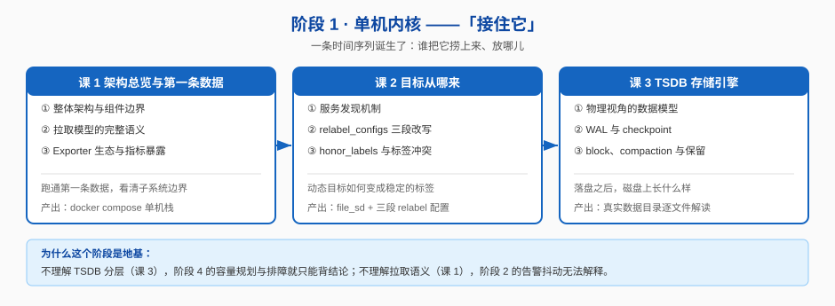

# 阶段 1：单机内核

> 所属课程：Prometheus ｜ 故事章节：**"接住它"** —— 一条时间序列诞生了，谁把它捞上来、放哪儿 ｜ 上一阶段：无（起始阶段）

## 🎯 本阶段目标

- 能说清一个样本从 target 的 `/metrics` 端点被抓取、解析、到落进 TSDB 磁盘的完整路径，并指出每一步可能失败的地方
- 能独立编写抓取配置：从静态目标到服务发现，从元标签到 relabel 改写
- 能看着一个真实的 TSDB 数据目录，说出每个子目录与文件的作用，并解释它们为什么这么设计

## 📍 学习重点

- **拉取模型的完整语义**（不只是"Prometheus 定期来拉"）：它拉的是带类型的文本，会协商协议，会记录元数据，失败时有明确的 staleness 语义。这一层理解不牢，后面讲告警抖动、查询断点全是背结论。
- **服务发现 + relabel 三段改写**：这是 Prometheus 配置里最反直觉、线上最容易出错的一块。`__meta_*` 元标签来自 SD，`__address__`/`__scheme__` 等是内部约定标签，三段 relabel 各有各的作用时机——混在一起就调不通。
- **TSDB 分层结构（head / WAL / block / compaction）**：这是整个课程的物理地基。**理解了这个，阶段 4 的容量规划与排障才有根**；不理解，就只能在出事时背"重启然后祈祷"。

## ✅ 必须掌握的知识点

| 知识点 | 所属课 | 学完应能 |
|--------|--------|----------|
| 整体架构与组件边界 | 课 1 | 画出 Prometheus 内部子系统关系图，说清 scrape / TSDB / rules / HTTP API 各自的职责边界，以及 Alertmanager、Pushgateway、exporter 各自为什么存在 |
| 拉取模型的完整语义 | 课 1 | 说清一次 scrape 的完整生命周期（含协议协商、解析、staleness 标记），能解释"目标挂了之后查询为什么是断的而不是 0" |
| Exporter 生态与指标暴露 | 课 1 | 区分 exporter 的三种形态（原生暴露 / 独立 exporter / Pushgateway 中转），能为一个短生命周期任务设计正确的指标上报方式 |
| 服务发现机制 | 课 2 | 说清 SD 的输出是什么（一组带 `__meta_*` 的 target），并能在无 K8s 环境下用 `file_sd_configs` 等价复现动态发现的语义 |
| relabel_configs 三段改写 | 课 2 | 独立写出 `relabel_configs` / `metric_relabel_configs` / `alert_relabel_configs` 并说清各自的作用时机与执行顺序 |
| honor_labels 与标签冲突 | 课 2 | 解释 `honor_labels` 三种取值下标签冲突的解决结果，以及为什么默认是 `false` 会丢弃 target 自带标签 |
| 物理视角的数据模型 | 课 3 | 从存储角度解释"一条序列 = 一个 series ref"，能算出给定 label 组合会产生多少条序列（衔接 `promql/` 课 2 的逻辑视角） |
| WAL 与 checkpoint | 课 3 | 说出 WAL 分段文件大小、checkpoint 的作用与触发时机，解释"进程崩溃后重启为什么数据还在" |
| block、compaction 与保留 | 课 3 | 说出 block 的时间跨度、compaction 的合并规则、`--storage.tsdb.retention.time` 的删除粒度 |

## 🗺️ 本阶段路径图

## 本阶段产出

- [x] [lessons/lesson-01-架构总览与第一条数据.md](./lessons/lesson-01-架构总览与第一条数据.md) — 2026-09-04 交付，双视角评审 P0 清零
- [x] [lessons/lesson-02-目标从哪来.md](./lessons/lesson-02-目标从哪来.md) — 2026-09-04 交付，双视角评审 P0 清零
- [x] [lessons/lesson-03-TSDB存储引擎.md](./lessons/lesson-03-TSDB存储引擎.md) — 2026-09-04 交付，双视角评审 P0 清零

**阶段 1 状态**：✅ **已完成**（2026-09-04）。9 个知识点全部交付，三课均通过双视角评审且 P0 清零。样本从"被抓上来"到"落进磁盘"的完整链路已闭合。
