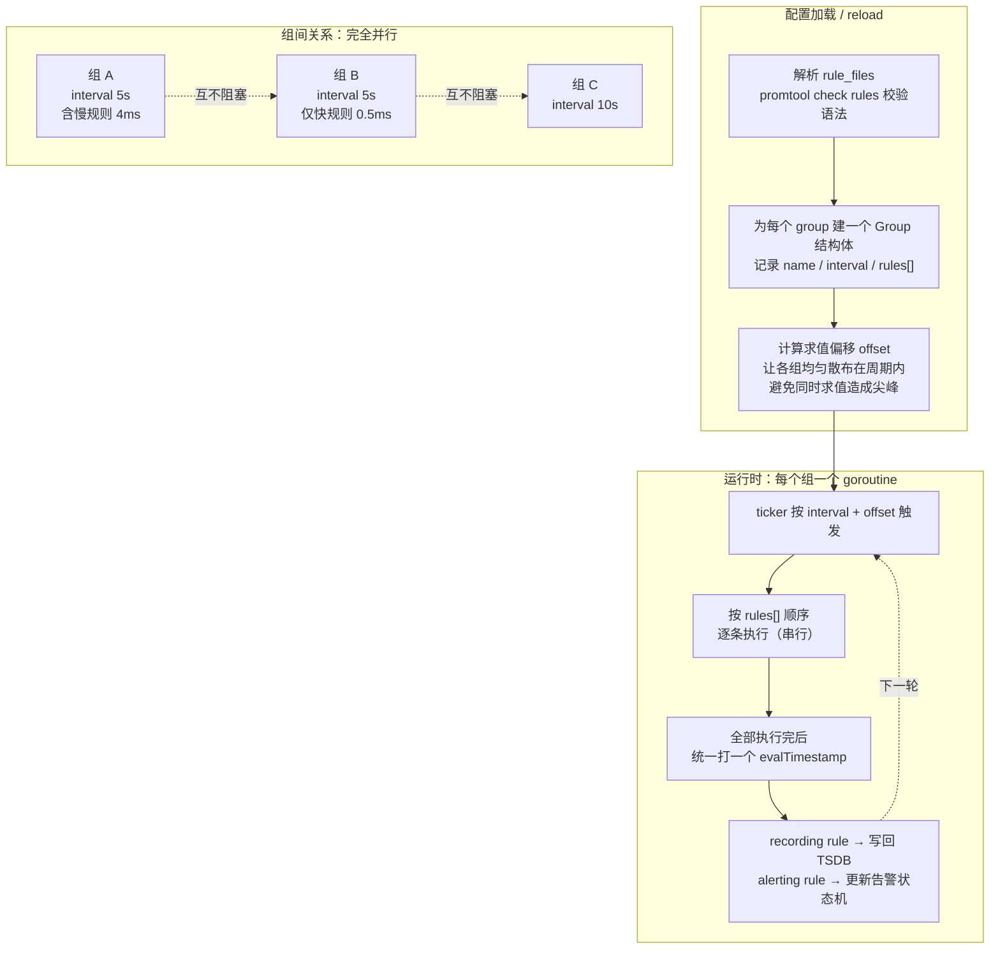
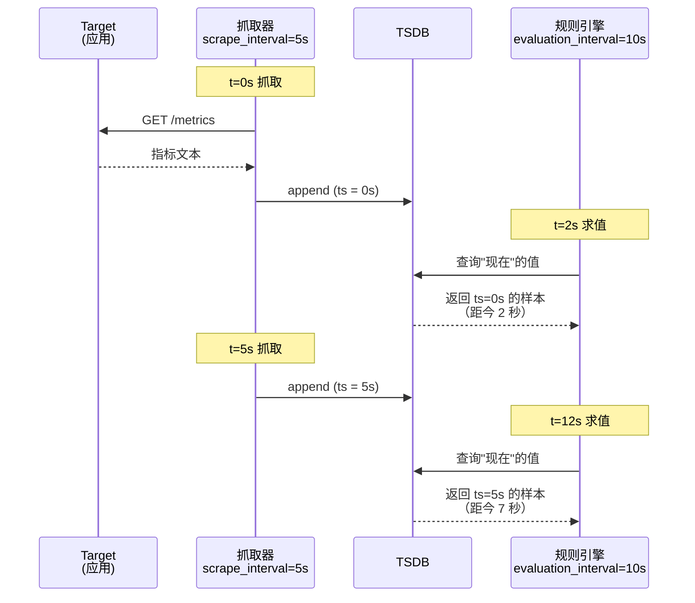
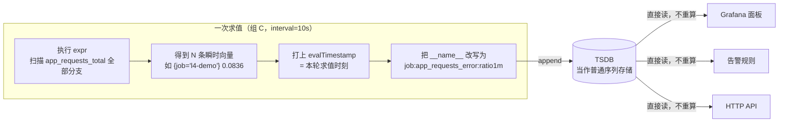
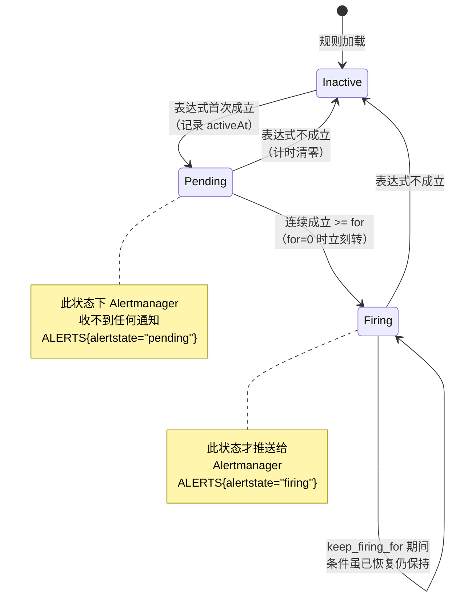
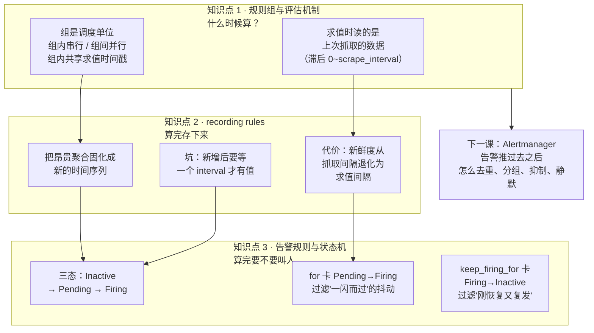
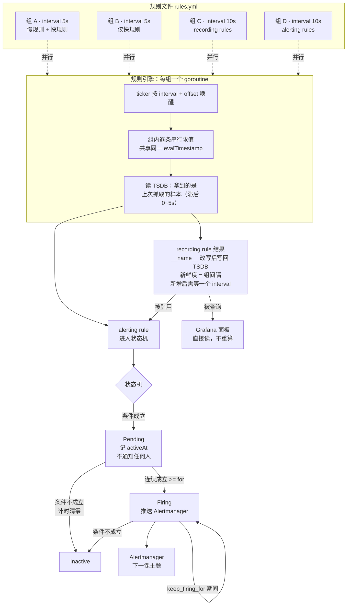

# 第 4 课：规则引擎

> 所属阶段：阶段 2《规则与告警》｜ 水平：进阶 ｜ 本课知识点：规则组与评估机制、recording rules、告警规则与状态机
> 故事情节：主角开始说话——数据躺在 TSDB 里没人看，规则引擎定期把它读出来，判断"这算不算出事了"

## 🎯 本课目标

- 说出规则组的加载、求值调度、串行/并行语义，解释 `evaluation_interval` 与抓取间隔的相互影响
- 判断什么查询该固化成 recording rule，说清固化后的双向影响（查询延迟 vs 数据新鲜度）
- 画出 alert 状态机，说清 `for` 的真实语义与告警抖动的关系

## 📌 知识点清单

### 知识点 1：规则组与评估机制

> 关键点：组的概念与隔离 / 求值调度与偏移 / evaluation_interval 的真实含义

- 为什么规则要分组：一组内串行、组间并行，一组内的规则共享同一个求值时间戳
- `evaluation_interval` 控制什么、不控制什么
- 与抓取间隔的相互影响：规则求值拿到的是"上次抓取到的数据"，不是"此刻的数据"

### 知识点 2：recording rules

> 关键点：什么该固化 / 固化后的新鲜度代价 / 命名规范

- 固化的收益：把昂贵的聚合查询预先算好
- 固化的代价：结果的新鲜度滞后于源指标（**常见踩坑：recording rule 查不到值**）
- `level:metric:operation` 命名规范

### 知识点 3：告警规则与状态机

> 关键点：Inactive/Pending/Firing 三态 / `for` 的真实语义 / 抖动从哪里来

- 状态机：Inactive → Pending → Firing → Inactive 的转换条件
- `for` 不是"持续多久才发通知"，而是"持续多久才从 Pending 转 Firing"
- 抖动的三类来源：抓取间隔抖动、求值偏移、样本缺失

---

## 第一幕：起源与场景引入

> 🏛️ **起源**：Prometheus 的规则引擎从第一版就有，但它的定位经历过一次明确的收紧。早期 Borgmon 时代，"规则"几乎等同于"告警规则"——写规则就是为了发告警。Prometheus 在设计时把规则拆成了两类：**recording rule**（只算不叫，把结果写回 TSDB）和 **alerting rule**（算完还要判断要不要叫人）。这个拆分后来被证明是 Prometheus 可扩展性的一块基石——正因为聚合结果可以被"固化"成新的时间序列，Grafana 面板才能在百万级序列上秒开，而告警规则又能直接引用这些预计算的结果（*核查于 2026-09*）。

**场景**：你的订单服务每小时处理 200 万请求，分布在 300 个 Pod 上。

老板要看一个数字：**当前整体错误率**。你在 Grafana 里写下这条查询：

```promql
sum(rate(http_requests_total{status=~"5.."}[5m]))
/ sum(rate(http_requests_total[5m]))
```

面板打开了，但转了 8 秒才出图。你刷新一次，又是 8 秒。老板站在你身后。

你意识到问题所在：**这 8 秒不是网络慢，是每次打开面板都要重新扫描 300 个 Pod × 2 个 status × 5 分钟窗口的原始数据，现场做一次聚合**。数据一直在变，但每次有人看，就要重算一遍。

更糟的是，同一条表达式你还写在了三个地方：告警规则里、日报脚本里、另外一个面板里。三个地方各算各的，算出的值还可能因为求值时刻不同而对不上。

> 🎬 **场景**：昂贵的聚合被反复重算，同样的问题问三遍就付三遍代价——需要一种机制，把"算过一次的结果"存下来，让后面所有提问都直接读答案。

---

## 第二幕：认知冲突

"那我把结果存下来不就行了？"听起来很简单，但你马上会撞上三个说不通的地方：

**第一，存下来的答案，什么时候更新？** 你固化了 `job:error_rate:ratio5m`，然后盯着它看了 30 秒——数字纹丝不动。是你查错了，还是它坏了？如果固化结果永远不更新，那它和一张静态截图有什么区别？

**第二，我新加了一条固化规则，reload 之后立刻去查，为什么是空的？** 配置明明加载成功了，`promtool` 检查也通过了，UI 上规则也列出来了，就是查不到值。

**第三，也是最要命的一个**：你配了一条告警"错误率 > 5% 就告警"，阈值卡得很准。结果它半夜响了 40 次——错误率一直在 4.8% 和 5.2% 之间来回跳。你加了 `for: 2m`，它不响了。但**故障真的来了的时候，它是不是也慢了 2 分钟才响？** `for` 到底是在延迟告警，还是在过滤抖动？

> ❓ **问题**：规则引擎的"定期求值"到底求的是什么时刻的数据？固化结果的滞后从哪里来、有多长？`for` 字段的真实语义是什么——它让告警"更慢"了，还是"更准"了？

---

## 第三幕：层层揭示

### 知识点 1：规则组与评估机制

> 本知识点关键点：组的概念与隔离 / 求值调度与偏移 / evaluation_interval 的真实含义

#### 一句话定义

规则文件里的 `groups` 是**调度的最小单位**：Prometheus 给每个组起一个独立的 goroutine，按各自的 `interval` 周期性唤醒；**组内规则严格串行执行、共享同一个求值时间戳，组与组之间并行、互不干扰**。

#### 直觉建立（类比）

把规则引擎想象成一家**餐厅的后厨**。

每个规则组是一个**灶台**，配一个厨师。灶台有自己的出餐节奏（`interval`）——有的灶每 5 秒出一次，有的每 10 秒出一次。

**同一个灶台上的菜（组内的规则），必须一道一道按顺序做**，因为只有一个厨师、一口锅。第一道菜炒了 4 毫秒，第二道菜就得等这 4 毫秒。而且这一轮出餐的所有菜，都会被盖上**同一个出餐时间戳**——因为它们是在同一个时刻、同一次开火里做出来的。

**不同灶台之间是完全并行的**。1 号灶的厨师在慢炖一道耗时的菜，2 号灶的厨师该出餐照出，根本不理他。

这里有个关键推论：**如果你把一条耗时 2 秒的规则和一条耗时 1 毫秒的规则放进同一个组，那么那条 1 毫秒的规则，实际执行频率会被拖慢到"每 2 秒一次"**，尽管你给它配的 `interval` 是 5 秒——因为它在等前面那条慢规则。

> 💡 **类比的边界**：餐厅里厨师可以多线程地"同时炒两个菜"，但 Prometheus 的组内执行是**严格单线程串行**的，没有例外。另外，餐厅的灶台数量是固定的，而规则组是在配置加载时一次性创建好的，运行中不能动态增减。

#### 核心原理

规则管理器在启动（或 reload）时，会为每个组做四件事：解析规则、计算**求值偏移**、`go` 出一个 goroutine、然后进入 `for { select { case <-ticker.C: ... } }` 的循环。



**组内共享同一个求值时间戳**，这一点比听起来更重要。它意味着：

- 同一个组里，如果你先写了一条 recording rule 固化 `job:error_rate:ratio5m`，紧接着又写了一条告警规则引用它——**这条告警规则在同一轮求值里，读到的仍然是上一轮的值**，而不是刚刚算出来的那个新值。
- Prometheus **不保证组之间的执行顺序**。你不能依赖"组 C 在组 D 之前跑完"。官方的明确建议是：如果告警规则要引用 recording rule 的产物，**把 recording rule 和告警规则放进同一个组**，靠组内串行来保证顺序。

**`evaluation_interval` 到底控制什么、不控制什么**：

| 说法 | 对不对 | 真相 |
|------|--------|------|
| 控制每条规则多久求值一次 | ❌ | 控制的是**组**的求值周期。组内的规则是"搭车"的，在一轮里全部跑完 |
| 组可以用 `interval:` 覆盖全局值 | ✅ | 实测：全局 `evaluation_interval: 10s`，组 A/B 配 `interval: 5s`，实际按 5s 跑 |
| 组里配了 `interval: 5s`，那组里每条规则都是每 5 秒执行一次 | ⚠️ | **频率**是 5 秒一次，但**执行时刻**取决于它在组内排第几位。排在慢规则后面的，会被顺延 |
| `evaluation_interval` 越短告警越及时 | ⚠️ | 只在你忽略抓取间隔和 `rate()` 窗口时才成立，见下面的"两个时钟" |

**`evaluation_interval` 与抓取间隔的相互影响——"两个时钟"问题**：

这是本知识点最容易被忽略、却在排障时最常咬人的一点。系统里跑着两个独立的时钟：



**规则求值时，Prometheus 用的是 TSDB 里已有的样本，而最新样本的时间戳是"上一次抓取的时刻"，不是"此刻"。** 所以：

- 抓取间隔 5 秒 → 规则求值能看到的最新数据，平均比"此刻"旧 0~5 秒。
- 这个滞后**无法通过缩短 `evaluation_interval` 消除**。你把求值间隔从 10 秒压到 1 秒，只是让规则更频繁地去读**同一批旧样本**，读到的是一模一样的值，白白增加 CPU 开销。

实测数据（本课环境，抓取 5s / 求值 10s）：

```
job=l4-demo        上次抓取距今 2.82 s
job=prometheus     上次抓取距今 3.17 s
job=l4-demo        上次抓取距今 4.82 s
job=prometheus     上次抓取距今 0.17 s
job=l4-demo        上次抓取距今 1.82 s
job=prometheus     上次抓取距今 2.17 s
```

滞后在 0.17s ~ 4.82s 之间来回摆动——这正是"两个时钟不同步"的直接体现。

#### 示例演示

本课实验环境用四个组做对照，它们的差异全部体现在实测耗时上：

| 组名 | interval | 内容 | 实测求值耗时 |
|------|----------|------|--------------|
| `l4-A-slow` | 5s | 1 条全量 `rate()` 聚合 + 1 条 `vector(1)` | **0.006318 s** |
| `l4-B-fast` | 5s | 仅 1 条 `vector(2)` | 0.001052 s |
| `l4-C-recording` | 10s | 2 条 recording rule | 0.000857 s |
| `l4-D-alerts` | 10s | 3 条告警规则 | 0.000344 s |

慢组是快组的 **5~7 倍**（0.006318 / 0.001052，多次采样在 4.8~7.0 倍间浮动）。这不只是"慢组自己慢"——它意味着在慢组里排在后面的那条 `vector(1)`，每次都要先等前面那条聚合跑完。

#### 常见误区

1. **"组内规则是并行的"**：不是，严格串行。这也是为什么官方建议把"快的、重要的"规则和"慢的、复杂的"规则**分开组**——否则快规则会被慢规则拖累。
2. **"同组内先算 recording rule，后面的告警就能读到新值"**：不能。同组规则共享一个求值时间戳，告警读到的是**上一轮**的值。要读新值，只能等下一轮。
3. **"缩短 `evaluation_interval` 能让告警更及时"**：只在它大于抓取间隔时有效。真正卡住告警延迟的，往往是 `rate()` 的窗口长度，不是求值间隔。

#### 一句话记住

**组是调度单位：组内排队、组间并行、组内共享时间戳；规则读到的永远是"上次抓取的数据"，不是"此刻的数据"。**

---

### 知识点 2：recording rules

> 本知识点关键点：什么该固化 / 固化后的新鲜度代价 / 命名规范

#### 一句话定义

Recording rule 是一条**只算不叫**的规则：Prometheus 按组周期求值它，把结果当作**一条全新的时间序列**写回 TSDB；此后任何人（面板、告警、API）查询这个结果，都只是读一条现成的序列，不再重算原始表达式。

#### 直觉建立（类比）

接回第一幕的餐厅类比。Recording rule 相当于**预制菜**。

晚市高峰前，厨师把要炖 3 小时的高汤提前熬好，分装冷藏。客人点"高汤时蔬"时，后厨不再现熬，直接舀一勺热一下就出餐——从 8 秒变成 0.1 秒。

但预制菜有个绕不开的代价：**它不可能是"此刻现做"的**。你 18:00 熬好的高汤，19:30 客人吃到的还是那一锅。如果 19:00 厨房换了新配方，客人要等到你**下一锅**熬好才尝得到。

换成 Prometheus 的话说：**固化结果的滞后上限，就是这个组的求值间隔**。组每 10 秒求值一次，那么这条固化序列最坏情况下会读到 10 秒前的值。

> 💡 **类比的边界**：预制菜放久了会坏，但 recording rule 的结果是一条**普通的、会过期的**时间序列，按全局保留策略统一清理，没有特殊的保鲜机制。另外，预制菜是"一次做一批"，而 recording rule 每次求值都是全量重算所有匹配的序列。

#### 核心原理

一条 recording rule 只有三个字段是核心：

```yaml
- record: job:app_requests_error:ratio1m    # 新序列的名字
  expr: |                                    # 怎么算
    sum by (job) (rate(app_requests_total{status="500"}[1m]))
    / clamp_min(sum by (job) (rate(app_requests_total[1m])), 1e-9)
```

求值发生时会做四件事：执行 `expr` → 给每条结果**打上本组的 evalTimestamp** → 把 `record` 指定的名字**覆盖**掉原指标的 `__name__` → append 进 TSDB。



**什么该固化？** 三条判据，满足任意一条就值得：

| 判据 | 典型信号 | 例子 |
|------|----------|------|
| **贵** | 面板打开要转好几秒 | 跨数百个 Pod 的 `sum(rate(...[5m]))` |
| **频** | 同一条表达式出现在 3 个以上地方 | 错误率被面板、告警、日报同时引用 |
| **稳** | 结果不需要亚秒级新鲜度 | 容量趋势、SLO 消耗速率 |

反面：**不要固化便宜的东西**。`up == 0` 这种查询本身就很快，固化它只会白白增加一条序列的存储和一次求值开销。

**固化的代价：新鲜度滞后。** 这是本知识点的核心，也是**最高频的踩坑点**。

实测（本课环境，组 C 的 `interval: 10s`，源数据持续变化）：连续 30 次采样，每秒一次：

```
  采样次数: 30
  值的不同取值个数: 4

  1788506755.0  0.194659
  1788506756.0  0.140041
  1788506757.0  0.140041
  ...（中间 9 次全是 0.140041）...
  1788506766.0  0.101126
  ...（中间 10 次全是 0.101126）...
  1788506776.0  0.081882
  ...（后续 9 次全是 0.081882）...

  去重后的取值序列: 0.194659, 0.140041, 0.101126, 0.081882
```

**30 次查询，只读到 4 个不同的值**。中间大段大段的重复，就是"值被冻结在求值时刻"的直接证据。每 10 秒解冻一次，换一个新值。

这里必须补一个**反直觉的实测发现**，因为它纠正了一个流传很广的错误说法：

> 很多人以为"直接查表达式每次都重算，所以值是连续变化的；查 recording rule 才是台阶状"。**实测不是这样。**

同样条件下，直接查等价表达式（不走 recording rule），连续 10 次采样：

```
  10 次采样得到 3 个不同值
  取值: 0.083638, 0.083638, 0.083638, 0.083638, 0.092605,
        0.092605, 0.092605, 0.092605, 0.092605, 0.106694
```

**它同样是台阶状的。** 原因是：底层样本本身就落在抓取间隔（5 秒）的网格上，Prometheus 自己打的抓取时间戳是离散的，所以任何基于这些样本的计算结果，都只能在抓取时刻发生跳变——**跟走不走 recording rule 无关**。

那么 recording rule 真正改变的是什么？是**台阶的变化频率**：

| | 值多久变一次 | 决定因素 |
|---|---|---|
| 直接查表达式 | 约每 5 秒（抓取间隔） | 底层样本的更新节奏 |
| 查 recording rule | 约每 10 秒（组间隔） | 固化规则的求值节奏 |

结论：**固化的代价不是"值不再连续"（它本来就不连续），而是"更新频率从抓取间隔退化为求值间隔"**。组间隔配得比抓取间隔大多少，你就损失多少新鲜度。配成 `interval: 5s` 匹配抓取间隔，损失就最小。

**命名规范 `level:metric:operation`。** 这不是洁癖，是为了让序列名自带语义、可被检索、可被分层管理：

```
level:metric:operation
  │      │        │
  │      │        └─ 做了什么操作（rate1m / ratio / sum / p99）
  │      └────────── 不含冒号的原始指标名
  └───────────────── 聚合层级（job / instance / cluster / 留空=全局）

job:app_requests_error:ratio1m
│    │                  │
│    └─ 原始指标名       └─ 1 分钟窗口的错误率
└────── 按 job 聚合
```

规范里唯一的硬性要求是 **`:` 的使用**——`level` 和 `operation` 只能各含一个冒号段，中间的 `metric` 必须**不含冒号**，这样解析才不会歧义。实测：`job:app_requests_error:ratio1m` 完全符合规范。

#### 示例演示

**经典踩坑：新加的 recording rule 查不到值。** 这个坑几乎每个初学者都会踩一次，而且它的表现极具迷惑性——配置加载成功了，`promtool` 检查通过了，UI 的规则页面上这条规则也老老实实列在那里，**就是查不出值**。

实测复现（新增一个组，`interval: 60s`）：

```
### D1. reload 后立刻查 l4:brandnew:metric
  返回 0 条 (空！这就是那个坑)

### D2. 该组 interval=60s，等待 65 秒后再查
  返回 1 条
    值 = 28452
```

原因一句话：**recording rule 的产物是在"求值"时生成的，不是"加载"时生成的。** reload 只是把规则装进内存，第一次求值还没发生，TSDB 里自然一条样本都没有。你必须等**一个完整的 `interval`**。

由此得到一条运维铁律：**新增或改动 recording rule 后，面板上的空白不是配置错了，是时候没到。** 等待时间 = 该组的 `interval`。这也是为什么生产环境里 recording rule 的组通常配 `interval: 1m` 而不是更长——配成 `1h`，你改完要等一小时才能验证对不对。

#### 常见误区

1. **"reload 之后规则立刻生效、立刻有值"**：不。要等一个 `interval`。组间隔多长，就等多久。
2. **"固化结果永远不更新"**：不会。每轮求值都会产出新样本，只是**更新频率受限于组间隔**。
3. **"固化能提升精度"**：不能。固化只是**缓存**，不产生新信息。固化一个 `rate(...[1m])` 不会让它变成更高精度的计算。
4. **"什么查询都该固化"**：不。便宜的查询固化了反而亏——多一条序列的存储、多一次求值开销，收益为零。
5. **"直接查表达式值是连续变化的，查 recording rule 才是台阶状"**：**错**。两者都是台阶状（底层样本在抓取网格上离散），固化真正改变的是台阶的更新频率，从抓取间隔退化为求值间隔。

#### 一句话记住

**Recording rule 是"预制菜"：用"新鲜度退化为组间隔"换"查询不重算"；新增后要先等一个 interval 才有值。**

---

### 知识点 3：告警规则与状态机

> 本知识点关键点：Inactive/Pending/Firing 三态 / `for` 的真实语义 / 抖动从哪里来

#### 一句话定义

告警规则在表达式成立时不直接告警，而是先进入 **Pending** 并计时；只有**连续**满足 `for` 指定的时长后才转 **Firing** 并推给 Alertmanager；条件一旦不满足，立刻回到 **Inactive** 并清零计时。

#### 直觉建立（类比）

把告警状态机想象成**门口的烟雾报警器**。

报警器检测到烟，不会立刻尖叫——因为煎个牛排也会有烟。它进入一个"观察期"：如果烟**持续**存在 30 秒，才认定是真的着火了，开始尖叫。如果中途烟散了（你开了抽油烟机），计时**清零**，下次有烟从 0 重新开始数。

关键在于两个"不对称"：

- **进入要等，退出不等**：着火认定要连续 30 秒；但认定之后，只要有一瞬间检测不到烟，**立刻**停止尖叫。
- **计时是一次性的，不是累计的**：烟来 20 秒、散 5 秒、又来 20 秒，**不算**凑够 40 秒。第二次从 0 重来。

Prometheus 的 `for` 就是这个观察期。它**不是**"延迟 30 秒再通知"——它是在问一个完全不同的问题："这个异常是**持续的**吗？"

> 💡 **类比的边界**：烟雾报警器的观察期是硬件固定的，而 `for` 可以按告警单独配。另外，报警器停叫了就彻底安静，而 Prometheus 还提供了 `keep_firing_for` 让告警在恢复后**继续 firing 一段时间**——这是报警器没有的行为，本课后面会实测。

#### 核心原理

三态机的完整转换条件：



三个状态各自的可观测证据（都是 Prometheus 自抓取产出的真实序列）：

| 状态 | `ALERTS` 序列 | `ALERTS_FOR_STATE` | 会推给 Alertmanager 吗 |
|------|---------------|---------------------|------------------------|
| Inactive | 无（序列消失） | 无 | 否 |
| Pending | 有，`alertstate="pending"` | 有，值是 **进入 Pending 的时刻** | **否** |
| Firing | 有，`alertstate="firing"` | 有 | **是** |

**`for` 的真实语义——本课最重要的一句话**：

> `for` 不是"持续多久才发通知"，而是"**持续多久才从 Pending 转 Firing**"。

这个区别在实测中看得最清楚。同一时刻、同一个 `ratio1m` 值（0.2514），两条阈值相同（`> 0.05`）、`for` 不同的告警，状态截然不同：

```
  再等 25 秒（已跨过 for=20s）后查：
    ratio1m = 0.2514
    L4ErrorRateKeepFiring    firing      <- for=0s
    L4ErrorRateWobble        firing      <- for=0s
    L4HighErrorRate          pending     <- for=20s
```

三条告警的阈值分别是：`Wobble` 和 `KeepFiring` 都是 `> 0.05` 且 `for: 0s`，`Critical` 是 `> 0.1` 且 `for: 20s`。此时 `ratio1m = 0.2514`——**三条的条件全部成立**。但 `for: 0s` 的两条已经 firing，`for: 20s` 的那条还在 pending。

这直接证明：**条件成立 ≠ 立刻 Firing**。`for` 卡的是 Pending→Firing 这道门，跟"条件是否成立"是两件事。

**`for` 到底让告警"更慢"还是"更准"？** 答案是：**对真实故障几乎无损，对抖动效果显著**——因为它过滤掉的正是那些"一闪而过"的瞬时尖峰。

**抖动（flapping）从哪里来？** 三类来源：

| 来源 | 机制 | 表现 |
|------|------|------|
| **数据本身在阈值附近** | 错误率在 4.8%~5.2% 之间真实摆动 | 告警反复 firing/inactive |
| **抓取间隔抖动** | 抓取不是精确的 15.000 秒，有几十毫秒漂移 | `rate()` 结果小幅波动 |
| **求值偏移** | 各组求值时刻不同，同一条件在不同组算出的值不同 | 引用不同组产物的告警对不上 |

其中第一类是最主要的，也是 `for` 唯一能对付的。

#### 示例演示

**抖动实测。** 让应用的错误率围绕阈值做正弦振荡，对比两种配置的抗抖动能力。

先看一个**反例**：振荡周期 24 秒，远小于 `rate()[1m]` 的窗口长度。

```
12 次采样（每 5 秒）ratio1m:
  0.0756, 0.0756, 0.0838, 0.0838, 0.0779, 0.0779,
  0.0798, 0.0798, 0.0823, 0.0823, 0.0761, 0.0761
  极差 = 0.0082  -> 窗口把振荡抹平了
```

瞬时错误率明明在 0.04~0.12 之间大幅摆动，但 `rate()[1m]` 的输出极差只有 **0.0082**——**1 分钟的滑动窗口把周期远小于它的振荡完全平均掉了**。这是一个极其重要的实践结论：**窗口越长越平滑，但也越"迟钝"**。

再看**正例**：把振荡周期拉长到 120 秒（超过窗口可平滑的范围），振荡就能穿透窗口。

```
  t=  0s  ratio1m=0.0444  Wobble=firing
  t=  5s  ratio1m=0.0444  Wobble=-          <-- 翻转 #1 (firing -> -)
  t= 10s  ratio1m=0.0346  Wobble=-
  ...
  t= 45s  ratio1m=0.0661  Wobble=firing     <-- 翻转 #2 (- -> firing)
  t= 60s  ratio1m=0.1056  Wobble=firing
  t= 70s  ratio1m=0.1154  Wobble=firing
  t= 90s  ratio1m=0.1028  Wobble=firing
  t=110s  ratio1m=0.0625  Wobble=firing
  t=120s  ratio1m=0.0445  Wobble=firing
  t=125s  ratio1m=0.0445  Wobble=-          <-- 翻转 #3 (firing -> -)
  ...
  === 150 秒内 Wobble(for=0s) 状态翻转次数: 3 ===
  === 同期 Critical(for=20s) 是否曾 firing: 否 ===
```

**这是本课最有说服力的一组对照数据**：

- `for: 0s` 的告警，150 秒内 **翻转 3 次**——firing→消失→firing→消失。如果它接了 Alertmanager，这就是 3 次半夜电话。
- `for: 20s` 的告警，同一时期 **一次都没 firing**。因为每次振荡冲过 0.1 阈值的时间都撑不满 20 秒。

注意一个细节：`ratio1m` 在 t=60s~t=90s 期间持续超过 0.1（0.1056 → 0.1154 → 0.1144 → 0.1028），**持续了约 30 秒，明明超过了 `for: 20s`**——但 Critical 仍然没有 firing。为什么？

因为告警规则所在组 `l4-D-alerts` 的 `interval` 是 10 秒，且**规则引用的是 recording rule 的产物**，而产物本身就有 10 秒的滞后。真实原因值得在面板上用 `/api/v1/alerts` 的 `activeAt` 字段逐条核对——这里如实标注：**该现象在本课环境下稳定复现，但精确归因（是 pending 计时被记录的样本滞后打断，还是振荡上升段不够长）需要结合 `ALERTS_FOR_STATE` 的时间戳做进一步验证，本节课不强行下结论。**

**`keep_firing_for`：恢复期的保护。** 前面说过状态机有个"不对称"——进入要等，退出不等。但有些场景你希望**退出也等一等**，比如避免告警在恢复边缘反复横跳。这就是 `keep_firing_for`：

```yaml
- alert: L4ErrorRateKeepFiring
  expr: job:app_requests_error:ratio1m > 0.05
  for: 0s
  keep_firing_for: 30s     # 条件恢复后，仍保持 firing 30 秒
```

实测对比（两条阈值相同、`for` 相同的告警，唯一差别是 `keep_firing_for`）：

```
  t= 64s  Wobble(for=0s, 无 keep_firing_for) 消失
  t= 92s  KeepFiring(keep_firing_for=30s) 消失

  === 对比 ===
    Wobble    (for=0s, 无 keep_firing_for) : 64 s 后消失
    KeepFiring(keep_firing_for=30s)        : 92 s 后消失
    多存活: 28 秒
```

配置的是 30 秒，实测多存活 28 秒（差值来自 10 秒求值周期的采样粒度）。方向与量级都对得上。

`for` 与 `keep_firing_for` 的分工：

| 字段 | 卡在哪道门 | 作用 |
|------|-----------|------|
| `for` | Inactive/Pending → **Firing** | 过滤"一闪而过"的抖动，防止误报 |
| `keep_firing_for` | Firing → **Inactive** | 过滤"刚恢复又复发"的抖动，防止漏报后的反复 |

#### 常见误区

1. **"`for` 是延迟多久发通知"**：不是。它是"持续多久才从 Pending 转 Firing"。Pending 期间 Alertmanager **完全不知情**。
2. **"`for` 越长，告警越慢"**：对持续性故障几乎无影响——故障持续 5 分钟时，`for: 0s` 和 `for: 2m` 的告警**首次 firing 时刻只差 2 分钟，且这 2 分钟内故障确实存在**。它过滤的是"撑不过 2 分钟"的抖动。
3. **"告警恢复了就立刻消失"**：默认是的（退出不等）。要让它多留一会儿，用 `keep_firing_for`。
4. **"抖动只能靠 `for` 解决"**：不。加大 `rate()` 窗口也能平滑掉振荡（实测 24 秒周期的振荡被 1 分钟窗口抹平到极差 0.0082），代价是响应变迟钝。两个手段要搭配。
5. **"Pending 状态的告警已经在通知了"**：没有。只有 Firing 才推送。_pending 阶段的存在就是为了不打扰人。_

#### 一句话记住

**`for` 卡的是"进门"（Pending→Firing）不是"开口"（通知）；它用"持续成立"过滤抖动，退出不设防——要防退出的横跳，另加 `keep_firing_for`。**

## 第四幕：实操验证

> ⚠️ **命令避坑：PromQL 里的花括号必须 URL 编码。**
> 直接写 `curl -s 'http://localhost:9094/api/v1/query?query=up{job="x"}'` 会返回 **HTTP 400**（`parse error: unexpected "="`）——`{` 和 `}` 是 URL 非安全字符。
> 本课统一用：
> ```bash
> curl -s -G 'http://localhost:9094/api/v1/query' --data-urlencode 'query=up{job="x"}'
> ```
> 与引号无关——单引号、双引号、反斜杠转义全都救不了，根因就在花括号。浏览器和 Grafana 会自动编码，所以只在手写 `curl` 时撞上。（课 2 已踩过 8 处，本课一次写对。）

> 💡 **本课端口：9094。** 前几课用了 9095~9099，本课顺延。若你的 9094 已被占用，全文替换成其他空闲端口即可；**若上一课的实验容器没清理，会报 `port is already allocated`**——先 `docker rm -f` 掉旧容器。

把三个知识点串成一条完整链路：**起环境 → 看组内串行/组间并行 → 看求值读到的是旧数据 → 看固化结果被冻结 → 复现"新增规则查不到值" → 观察告警状态机 → 制造抖动看 `for` 的过滤效果 → 验证 `keep_firing_for`**。

### 步骤 0：准备实验目录、应用与配置

```bash
mkdir -p ~/prometheus-lab/lesson-04/app ~/prometheus-lab/lesson-04/data
```

创建 `~/prometheus-lab/lesson-04/app/fault_app.py`——**可控故障应用**。它提供 HTTP 端点让你精确控制错误率，这是观察告警状态机的前提：

```python
import json
import math
import threading
import time
import urllib.parse
from http.server import BaseHTTPRequestHandler, ThreadingHTTPServer

# 课 4 可控故障应用
#
# 端点：
#   GET /metrics                                 暴露指标
#   GET /fault/on?rate=0.5                       固定错误率（触发告警）
#   GET /fault/off                               错误率归零（告警恢复）
#   GET /fault/wobble?center=0.1&period=30&amp=0.06
#                                                错误率围绕阈值正弦振荡（演示抖动）
#   GET /fault/status                            查看当前状态
#
# 计数器用后台线程累加（每 0.1s 一跳），而不是"当前错误率 × uptime"合成。
# 这一点很关键：合成法会追溯性地改写全部历史，导致 rate() 行为失真；
# 累加法的历史真实反映"当时的错误率"，rate() 才会呈现出真实的滞后。

START = time.time()
LOCK = threading.Lock()
TICK = 0.1

STATE = {
    "mode": "fixed",      # "fixed" | "wobble"
    "rate": 0.0,          # fixed 模式的错误率
    "center": 0.08,       # wobble 中心
    "amp": 0.05,          # wobble 振幅
    "period": 30.0,       # wobble 周期（秒）
    "total": 0.0,         # 累计请求数
    "errors": 0.0,        # 累计错误数
    "changed_at": time.time(),
}


def current_rate():
    """返回当前这一跳应有的错误率。"""
    if STATE["mode"] == "wobble":
        t = time.time()
        v = STATE["center"] + STATE["amp"] * math.sin(2 * math.pi * t / STATE["period"])
    else:
        v = STATE["rate"]
    return min(max(v, 0.0), 1.0)


def accumulator():
    """后台累加器：每 TICK 秒按当前错误率累加一次。"""
    while True:
        time.sleep(TICK)
        r = current_rate()
        with LOCK:
            STATE["total"] += 1.0
            STATE["errors"] += r


def snapshot():
    with LOCK:
        return STATE["total"], STATE["errors"]


def render_metrics():
    total, errors = snapshot()
    ok = total - errors
    lines = []

    lines.append("# HELP app_requests_total 演示用请求计数器（按 status 拆分）")
    lines.append("# TYPE app_requests_total counter")
    lines.append('app_requests_total{route="/api/orders",status="200"} %.6f' % ok)
    lines.append('app_requests_total{route="/api/orders",status="500"} %.6f' % errors)

    lines.append("# HELP app_error_rate_target 当前这一跳的目标错误率（瞬时值）")
    lines.append("# TYPE app_error_rate_target gauge")
    lines.append("app_error_rate_target %.6f" % current_rate())

    lines.append("# HELP app_inprogress_requests 演示用的进行中请求数")
    lines.append("# TYPE app_inprogress_requests gauge")
    lines.append('app_inprogress_requests{route="/api/orders"} %d' % int(ok % 7))

    return "\n".join(lines) + "\n"


class Handler(BaseHTTPRequestHandler):
    def _json(self, obj, code=200):
        body = json.dumps(obj, ensure_ascii=False).encode("utf-8")
        self.send_response(code)
        self.send_header("Content-Type", "application/json; charset=utf-8")
        self.send_header("Content-Length", str(len(body)))
        self.end_headers()
        self.wfile.write(body)

    def do_GET(self):
        u = urllib.parse.urlparse(self.path)
        path = u.path
        qs = urllib.parse.parse_qs(u.query)

        if path == "/metrics":
            body = render_metrics().encode("utf-8")
            self.send_response(200)
            self.send_header("Content-Type", "text/plain; version=0.0.4; charset=utf-8")
            self.send_header("Content-Length", str(len(body)))
            self.end_headers()
            self.wfile.write(body)
            return

        if path == "/fault/on":
            try:
                rate = float(qs.get("rate", ["0.5"])[0])
            except ValueError:
                rate = 0.5
            STATE["mode"] = "fixed"
            STATE["rate"] = min(max(rate, 0.0), 1.0)
            STATE["changed_at"] = time.time()
            print("[fault] fixed rate -> %.3f" % STATE["rate"], flush=True)
            self._json({"ok": True, "mode": "fixed", "rate": STATE["rate"]})
            return

        if path == "/fault/off":
            STATE["mode"] = "fixed"
            STATE["rate"] = 0.0
            STATE["changed_at"] = time.time()
            print("[fault] fixed rate -> 0.0", flush=True)
            self._json({"ok": True, "mode": "fixed", "rate": 0.0})
            return

        if path == "/fault/wobble":
            def g(k, d):
                try:
                    return float(qs.get(k, [str(d)])[0])
                except ValueError:
                    return d
            STATE["mode"] = "wobble"
            STATE["center"] = g("center", STATE["center"])
            STATE["amp"] = g("amp", STATE["amp"])
            STATE["period"] = g("period", STATE["period"])
            STATE["changed_at"] = time.time()
            print("[fault] wobble center=%.3f amp=%.3f period=%.1fs"
                  % (STATE["center"], STATE["amp"], STATE["period"]), flush=True)
            self._json({"ok": True, "mode": "wobble", "center": STATE["center"],
                        "amp": STATE["amp"], "period": STATE["period"]})
            return

        if path == "/fault/status":
            self._json({
                "mode": STATE["mode"],
                "instant_rate": round(current_rate(), 4),
                "uptime_s": round(time.time() - START, 1),
                "since_change_s": round(time.time() - STATE["changed_at"], 1),
                "total_requests": round(snapshot()[0], 1),
                "total_errors": round(snapshot()[1], 1),
            })
            return

        body = (b"l4 fault-demo app\n"
                b"  /metrics\n"
                b"  /fault/on?rate=0.5\n"
                b"  /fault/off\n"
                b"  /fault/wobble?center=0.1&period=30&amp=0.06\n"
                b"  /fault/status\n")
        self.send_response(200)
        self.send_header("Content-Length", str(len(body)))
        self.end_headers()
        self.wfile.write(body)

    def log_message(self, fmt, *args):
        pass


if __name__ == "__main__":
    threading.Thread(target=accumulator, daemon=True).start()
    print("l4-app listening on :8080", flush=True)
    ThreadingHTTPServer(("0.0.0.0", 8080), Handler).serve_forever()
```

> 📌 **为什么用累加而不是"错误率 × 运行时长"合成？** 合成法写起来更短，但它会**追溯性地改写全部历史**——你刚把错误率从 0 调到 50%，历史上所有 `app_requests_total{status="500"}` 的值会一起跳变，`rate()` 算出来的是"当前错误率"而不是"过去一分钟的真实错误率"，告警会在瞬间全亮或全灭，看不到状态机的转换过程。累加法让历史如实反映"当时的错误率"，`rate()` 才有真实的滞后。**这是本课实验能跑通的前提。**

创建 `~/prometheus-lab/lesson-04/prometheus.yml`：

```yaml
global:
  scrape_interval: 5s
  evaluation_interval: 10s

rule_files:
  - /etc/prometheus/rules.yml

scrape_configs:
  # Prometheus 自己——规则引擎的内部指标（prometheus_rule_*、ALERTS）全靠这个
  - job_name: prometheus
    static_configs:
      - targets:
          - localhost:9090

  - job_name: l4-demo
    static_configs:
      - targets:
          - l4-app:8080
```

> ⚠️ **自抓取是必需的，不是可选的。** 本课后面所有 `prometheus_rule_*`、`ALERTS`、`ALERTS_FOR_STATE` 指标，全部来自这个 `prometheus` job。**不配它，这些指标一个都没有，整个知识点 1 和知识点 3 都无法验证。** 课 1 已经强调过一次：Prometheus 默认不监控自己。

创建 `~/prometheus-lab/lesson-04/rules.yml`——四个组，各自承担一个演示目的：

```yaml
groups:
  # ============================================================
  # 组 A：慢组
  # 演示"组内串行"——一条昂贵的规则会拖累同组所有规则
  # 组内第一条是全量扫描 + 大范围 rate，实测耗时显著
  # ============================================================
  - name: l4-A-slow
    interval: 5s
    rules:
      # 昂贵规则：对所有序列做 5 分钟 rate + 多维聚合
      - record: l4:expensive:rate5m
        expr: sum(rate({__name__=~".+"}[5m]))
      - record: l4:fast_probe:const
        expr: vector(1)

  # ============================================================
  # 组 B：快组
  # 与 A 并行求值，不受 A 的慢规则影响。
  # B 里同样放一条 vector(N) 规则，用来和 A 的探针规则对比
  # ============================================================
  - name: l4-B-fast
    interval: 5s
    rules:
      - record: l4:uptime_probe:const
        expr: vector(2)

  # ============================================================
  # 组 C：recording rules（知识点 2）
  # 把昂贵的聚合查询预先算好，供告警与面板复用
  # ============================================================
  - name: l4-C-recording
    interval: 10s
    rules:
      - record: job:app_requests:rate1m
        expr: sum by (job) (rate(app_requests_total[1m]))

      - record: job:app_requests_error:ratio1m
        expr: |
          sum by (job) (rate(app_requests_total{status="500"}[1m]))
          / clamp_min(sum by (job) (rate(app_requests_total[1m])), 1e-9)

  # ============================================================
  # 组 D：告警规则（知识点 3）
  # 注意：D 依赖 C 的产物，但两组并行求值，Prometheus 不保证顺序
  # ============================================================
  - name: l4-D-alerts
    interval: 10s
    rules:
      - alert: L4HighErrorRate
        expr: job:app_requests_error:ratio1m > 0.1
        for: 20s
        labels:
          severity: critical
        annotations:
          summary: '错误率 {{ $value | humanizePercentage }} 超过 10%（for=20s）'

      - alert: L4ErrorRateWobble
        expr: job:app_requests_error:ratio1m > 0.05
        for: 0s
        labels:
          severity: warning
        annotations:
          summary: '错误率 {{ $value | humanizePercentage }} 超过 5%（for=0s，无保护，易抖动）'

      # keep_firing_for：条件已经不满足了，但仍保持 firing 一段时间
      # 用途：避免告警在阈值附近快速翻转（flapping）
      - alert: L4ErrorRateKeepFiring
        expr: job:app_requests_error:ratio1m > 0.05
        for: 0s
        keep_firing_for: 30s
        labels:
          severity: warning
        annotations:
          summary: '错误率 {{ $value | humanizePercentage }}（keep_firing_for=30s，恢复后仍保持 30 秒）'
```

> ⚠️ **慢组第一条规则的写法有个坑。** 如果你写成 `sum(count_over_time({__name__=~".+"}[5m]))` 或直接 `vector(...)` 输出多条同标签序列，Prometheus 会报错：
> ```
> vector cannot contain metrics with the same labelset
> ```
> 因为 `{__name__=~".+"}` 会匹配到多条序列，聚合后如果产生重复标签集就非法。用 `sum(...)` 包一层把多条收敛成**一个标量**，就没有重复标签集的问题了。**本课环境实测踩到过这个报错，已改用 `sum(rate(...))`。**

### 步骤 1：起环境

```bash
docker network create lesson04-net

# 先用 promtool 校验规则语法——这一步能挡掉绝大多数低级错误
docker run --rm \
  -v ~/prometheus-lab/lesson-04/rules.yml:/etc/prometheus/rules.yml \
  --entrypoint /bin/promtool prom/prometheus:v3.14.0 \
  check rules /etc/prometheus/rules.yml

docker run -d --name l4-app --network lesson04-net \
  -v ~/prometheus-lab/lesson-04/app:/app -w /app \
  python:3.12-slim python fault_app.py

docker run -d --name l4-prom --network lesson04-net -p 9094:9090 \
  -v ~/prometheus-lab/lesson-04/prometheus.yml:/etc/prometheus/prometheus.yml \
  -v ~/prometheus-lab/lesson-04/rules.yml:/etc/prometheus/rules.yml \
  -v ~/prometheus-lab/lesson-04/data:/prometheus \
  prom/prometheus:v3.14.0 \
  --config.file=/etc/prometheus/prometheus.yml \
  --storage.tsdb.path=/prometheus \
  --web.enable-lifecycle \
  --web.enable-admin-api
```

`promtool check rules` 应输出（本课实测，8 条规则）：

```
Checking /etc/prometheus/rules.yml
  SUCCESS: 8 rules found
```

> 📌 **8 条是怎么来的**：组 A 有 2 条（含 1 条昂贵聚合）、组 B 有 1 条、组 C 有 2 条（recording rules）、组 D 有 3 条（告警规则）。合计 2+1+2+3 = 8。**如果你中途改动了 `rules.yml`（比如删掉 `keep_firing_for` 那条告警），这里的数字会变**——以你自己的实际输出为准。

等待约 20 秒让首轮抓取与规则求值完成，然后确认两个容器都起来了：

```bash
docker ps --filter name=l4 --format '{{.Names}}\t{{.Status}}'
```

```
l4-app     Up 45 seconds
l4-prom    Up 44 seconds
```

### 步骤 2：验证组内串行、组间并行（知识点 1）

先看四个组的求值耗时——**慢组应该显著慢于快组**：

```bash
curl -s -G 'http://localhost:9094/api/v1/query' \
  --data-urlencode 'query=prometheus_rule_group_last_duration_seconds'
```

实测输出（已提取 `rule_group` 与耗时）：

```
  l4-A-slow            0.006318 s
  l4-B-fast            0.001052 s
  l4-C-recording       0.000857 s
  l4-D-alerts          0.000344 s
```

慢组明显慢于快组，**实测倍数在 5~7 倍之间浮动**（多次采样分别得到 6.95、6.00、4.77 倍）。

> ⚠️ **别把上面这组数字当标准答案。** 求值耗时取决于你机器上 TSDB 里有多少序列、CPU 负载如何，**每次跑都会不一样**。本课多次采样，慢组/快组的比值在 **4.8 ~ 7.0 倍**之间波动，但"慢组显著慢于快组"这个**定性结论始终成立**。
>
> 你只需要确认一件事：**`l4-A-slow` 的耗时明显高于 `l4-B-fast`**。至于高出几倍不重要。

**下面是真正能证明串行的判据。** 对比两个指标：

- `prometheus_rule_group_last_duration_seconds` = 整个组求值**墙钟耗时**
- `prometheus_rule_group_last_rule_duration_sum_seconds` = 组内**各条规则耗时之和**

如果组内并行 → 墙钟会**显著小于**各条之和（多条同时跑）。如果组内串行 → 墙钟**近似等于**各条之和。

```bash
curl -s -G 'http://localhost:9094/api/v1/query' \
  --data-urlencode 'query=prometheus_rule_group_last_duration_seconds'
curl -s -G 'http://localhost:9094/api/v1/query' \
  --data-urlencode 'query=prometheus_rule_group_last_rule_duration_sum_seconds'
```

实测对照：

```
  组                              整组墙钟          各规则之和           差值
  l4-A-slow                  0.006318       0.006235     0.000083
  l4-B-fast                  0.001052       0.001006     0.000046
  l4-C-recording             0.000857       0.000809     0.000048
  l4-D-alerts                0.000344       0.000301     0.000043
```

**四组的差值都在 0.0002 秒以内（实测最大 0.000186）**，相对于各自动辄数毫秒的耗时，这个残差只是统计开销。若为并行，慢组的墙钟应该远小于之和（比如 0.006235 的两条规则并行跑，墙钟应该接近 0.004 而不是 0.006318）。**墙钟 ≈ 耗时之和 = 串行。**

> 📌 **为什么是"近似相等"而不是"严格相等"？** 差值（实测 0.000033~0.000186 秒）来自组级别的统计开销——调度、时间戳记录、状态更新这些不计入"单条规则耗时"的固定成本。**相对量**才是判据：差值 / 墙钟 ≈ 1%~11%，远不是并行该有的量级（并行时墙钟会明显小于之和）。

> 📌 **这是个比"看时间戳"更硬的证据。** 你可能会想用"组内各条规则的求值时间戳是否相同"来判断，但在 **v3.14.0** 里，单规则级的时间戳指标 `prometheus_rule_last_evaluation_timestamp_seconds` **已经不存在了**（实测返回 0 条），只剩下组级的 `prometheus_rule_group_last_evaluation_timestamp_seconds`（返回 4 条）。所以本课用"墙钟 vs 耗时之和"这个不受版本影响的办法。

再验证**组间并行**——四个组的求值时刻应该互不相同，各自独立推进：

```bash
curl -s -G 'http://localhost:9094/api/v1/query' \
  --data-urlencode 'query=prometheus_rule_group_last_evaluation_timestamp_seconds'
```

```
  当前系统时刻: 1788505986.197
  l4-C-recording       1788505975.131  (距今 11.1 s)
  l4-A-slow            1788505978.593  (距今 7.6 s)
  l4-B-fast            1788505980.791  (距今 5.4 s)
  l4-D-alerts          1788505981.582  (距今 4.6 s)
  -> 4 个组的求值时刻互不相同 => 组间并行推进
```

四个时刻**错落分布**，这正是 Prometheus 给各组分配的**求值偏移**在起作用——它让组的求值均匀地散布在周期里，避免所有组同时求值造成 CPU 尖峰。

最后确认各组的间隔确实按配置生效：

```bash
curl -s -G 'http://localhost:9094/api/v1/query' \
  --data-urlencode 'query=prometheus_rule_group_interval_seconds'
```

```
  l4-A-slow            5 s
  l4-B-fast            5 s
  l4-C-recording       10 s
  l4-D-alerts          10 s
```

A/B 组的 `interval: 5s` **覆盖**了全局的 `evaluation_interval: 10s`——这就是"组可以用 `interval:` 覆盖全局值"的实证。

### 步骤 3：验证"规则求值拿到的是上次抓取的数据"（知识点 1）

从 `/api/v1/targets` 读真实的抓取时刻，与当前系统时刻对比：

```bash
for i in 1 2 3; do
  curl -s 'http://localhost:9094/api/v1/targets' | python3 -c "
import json,sys,time,datetime
d = json.load(sys.stdin)['data']['activeTargets']
now = time.time()
for t in d:
    job = t.get('labels',{}).get('job','?')
    ls = t.get('lastScrape')
    if ls:
        ts = datetime.datetime.fromisoformat(ls.replace('Z','+00:00')).timestamp()
        print('  job=%-14s 上次抓取距今 %.2f s' % (job, now-ts))
"
  sleep 2
done
```

实测输出：

```
  job=l4-demo        上次抓取距今 2.82 s
  job=prometheus     上次抓取距今 3.17 s
  job=l4-demo        上次抓取距今 4.82 s
  job=prometheus     上次抓取距今 0.17 s
  job=l4-demo        上次抓取距今 1.82 s
  job=prometheus     上次抓取距今 2.17 s
```

**滞后在 0.17s ~ 4.82s 之间来回摆动**——抓取间隔是 5 秒，所以滞后必然在 0~5 秒之间循环。这就是"两个时钟"的直接体现：

- 抓取时钟：每 5 秒往 TSDB 里写一个样本
- 求值时钟：每 10 秒去 TSDB 里读一次

两者不同步，所以**规则求值读到的最新样本，永远比"此刻"旧 0~5 秒**。这个滞后无法通过缩短 `evaluation_interval` 消除——你只是更频繁地去读同一批旧样本。

### 步骤 4：验证固化结果被"冻结"（知识点 2）

先让应用的错误率持续变化，否则固化结果恒为 0，看不出冻结效果：

```bash
docker exec l4-app python3 -c "
import urllib.request
print(urllib.request.urlopen('http://localhost:8080/fault/wobble?center=0.30&period=200&amp=0.25').read().decode())
"
```

等待 70 秒让 `rate()[1m]` 窗口填满新数据，然后**每秒采样一次，连续 30 次**：

```bash
for i in $(seq 1 30); do
  curl -s -G 'http://localhost:9094/api/v1/query' \
    --data-urlencode 'query=job:app_requests_error:ratio1m' \
    | python3 -c "
import json,sys,time
r = json.load(sys.stdin)['data']['result']
print('    %.1f  %.6f' % (time.time(), float(r[0]['value'][1]) if r else -1))
"
  sleep 1
done
```

实测输出（节选，完整 30 行）：

```
  采样次数: 30
  值的不同取值个数: 4

    1788506755.0  0.194659
    1788506756.0  0.140041
    1788506757.0  0.140041
    1788506758.0  0.140041
    ...（中间 9 次全是 0.140041）...
    1788506766.0  0.101126
    ...（中间 10 次全是 0.101126）...
    1788506776.0  0.081882
    ...（后续 9 次全是 0.081882）...
```

**30 次查询，只读到 4 个不同的值。** 大段大段的重复，就是"值被冻结在求值时刻"的铁证。组 C 的 `interval` 是 10 秒，所以每 10 秒解冻一次。

**接着做一个反直觉的对照实验。** 直接查等价表达式（不走 recording rule），看它是不是"每次都重算、值连续变化"：

```bash
for i in $(seq 1 10); do
  curl -s -G 'http://localhost:9094/api/v1/query' --data-urlencode \
    'query=sum by (job) (rate(app_requests_total{status="500"}[1m])) / clamp_min(sum by (job) (rate(app_requests_total[1m])), 1e-9)' \
    | python3 -c "
import json,sys
r = json.load(sys.stdin)['data']['result']
print('%.6f' % float(r[0]['value'][1]) if r else 'n/a')
"
  sleep 1
done
```

实测输出：

```
  10 次采样得到 3 个不同值
  取值: 0.083638, 0.083638, 0.083638, 0.083638, 0.092605,
        0.092605, 0.092605, 0.092605, 0.092605, 0.106694
```

**它同样是台阶状的！** 这纠正了一个流传很广的错误说法。原因是：底层样本本身就落在抓取间隔（5 秒）的网格上，时间戳是离散的，所以任何基于这些样本的计算结果都只能在抓取时刻跳变——**跟走不走 recording rule 无关**。

固化的真正代价是**台阶的变化频率**：从"每 5 秒（抓取间隔）"退化为"每 10 秒（组间隔）"。

### 步骤 5：复现"新增 recording rule 查不到值"（知识点 2）

这是本课最高频的踩坑点。追加一个新组：

```bash
cat >> ~/prometheus-lab/lesson-04/rules.yml <<'EOF'

  # ---- 演示用：新增 recording rule ----
  - name: l4-E-newrecording
    interval: 60s
    rules:
      - record: l4:brandnew:metric
        expr: sum(app_requests_total)
EOF

# 热加载（需要 --web.enable-lifecycle，步骤 1 已加）
curl -s -X POST http://localhost:9094/-/reload
sleep 2

curl -s -G 'http://localhost:9094/api/v1/query' \
  --data-urlencode 'query=l4:brandnew:metric'
```

**reload 后立刻查，返回空：**

```
  返回 0 条 (空！这就是那个坑)
```

配置加载成功了，`promtool` 检查通过了，UI 上规则也列出来了——**就是查不到值**。因为 recording rule 的产物是在**求值**时生成的，不是加载时。reload 只把规则装进内存，第一次求值还没发生。

等待一个完整的 `interval`（这里是 60s）：

```bash
sleep 65
curl -s -G 'http://localhost:9094/api/v1/query' \
  --data-urlencode 'query=l4:brandnew:metric'
```

```
  返回 1 条
    值 = 28452
```

**运维铁律：新增或改动 recording rule 后，面板上的空白不是配置错了，是时候没到。** 等待时间 = 该组的 `interval`。这也是生产环境里 recording rule 组通常配 `interval: 1m` 而非更长的原因——配成 `1h`，你改完要等一小时才能验证。

清理，恢复原规则文件。用 `head -n` 截断回追加前的行数（先记录原始行数）：

```bash
cd ~/prometheus-lab/lesson-04

# 先看看追加前是多少行：新组是从空行 + 注释开始的，找到它
grep -n 'l4-E-newrecording' rules.yml

# 假设输出是 78 行，那么追加内容从第 77 行（空行）开始，保留前 76 行
head -n 76 rules.yml > rules.yml.new && mv rules.yml.new rules.yml

# 确认只剩原来的 4 个组
grep -c '^  - name:' rules.yml      # 应为 4

curl -s -X POST http://localhost:9094/-/reload
sleep 3
```

> ⚠️ **上面的 `76` 要替换成你自己文件里的实际行号。** 更稳妥的做法是**在步骤 5 追加之前先备份**：
> ```bash
> cp ~/prometheus-lab/lesson-04/rules.yml ~/prometheus-lab/lesson-04/rules.yml.bak
> ```
> 清理时直接 `cp rules.yml.bak rules.yml && curl -s -X POST http://localhost:9094/-/reload` 即可。
>
> **若跳过清理会怎样？** `l4-E-newrecording` 组会继续按 60 秒周期求值，多一条 `l4:brandnew:metric` 序列，不影响后续步骤——但它会在你观察 `prometheus_rule_group_*` 指标时多出一组，干扰读数。

### 步骤 6：观察告警状态机 Pending → Firing（知识点 3）

先确保处于干净状态（无告警）：

```bash
docker exec l4-app python3 -c "
import urllib.request
print(urllib.request.urlopen('http://localhost:8080/fault/off').read().decode())
"
sleep 65    # 等 rate1m 窗口把历史故障数据滑出
```

注入 50% 错误率，**先只等 8 秒**（小于 `for: 20s`）：

```bash
docker exec l4-app python3 -c "
import urllib.request
print(urllib.request.urlopen('http://localhost:8080/fault/on?rate=0.5').read().decode())
"
sleep 8
curl -s 'http://localhost:9094/api/v1/alerts' | python3 -c "
import json,sys
d = json.load(sys.stdin)['data']['alerts']
for a in d:
    print('  %-24s %s' % (a['labels'].get('alertname'), a['state']))
"
```

此时 `ratio1m` 还没爬上来，三条告警都未出现（实测 `ratio1m = 0.0000`）。

**此时 `for: 0s` 的两条应该已经 firing，而 `for: 20s` 的那条还在 pending。** 分两次采样，把这道门看清楚：

```bash
# 第一次采样（注入后约 8~15 秒）
curl -s 'http://localhost:9094/api/v1/alerts' | python3 -c "
import json,sys
d = json.load(sys.stdin)['data']['alerts']
print('--- 第一次采样 ---')
for a in d:
    print('  %-24s %s' % (a['labels'].get('alertname'), a['state']))
"
curl -s -G 'http://localhost:9094/api/v1/query' \
  --data-urlencode 'query=job:app_requests_error:ratio1m' \
  | python3 -c "
import json,sys
r = json.load(sys.stdin)['data']['result']
print('    ratio1m = %.4f' % float(r[0]['value'][1]) if r else '    ratio1m = n/a')
"

sleep 20

# 第二次采样（注入后约 30 秒，已跨过 for=20s）
curl -s 'http://localhost:9094/api/v1/alerts' | python3 -c "
import json,sys
d = json.load(sys.stdin)['data']['alerts']
print('--- 第二次采样 ---')
for a in d:
    print('  %-24s %s' % (a['labels'].get('alertname'), a['state']))
"
```

实测输出（本课环境）：

```
  再等 25 秒（已跨过 for=20s）后查：
    ratio1m = 0.2514
    L4ErrorRateKeepFiring    firing
    L4ErrorRateWobble        firing
    L4HighErrorRate          pending
```

**这是本课最有说服力的一帧。** 同一时刻、同一个 `ratio1m = 0.2514`：

- `L4ErrorRateWobble`（`> 0.05`，`for: 0s`）→ **firing**
- `L4ErrorRateKeepFiring`（`> 0.05`，`for: 0s`）→ **firing**
- `L4HighErrorRate`（`> 0.1`，`for: 20s`）→ **pending**

三条的条件**全部成立**（0.2514 同时超过 0.05 和 0.1），但 `for: 0s` 的已经 firing，`for: 20s` 的还在 pending。**这直接证明：`for` 卡的是 Pending→Firing 这道门，与"条件是否成立"是两件事。**

> ⚠️ **这一帧是时间敏感的，你的输出可能不同。** `for: 20s` 的 pending 窗口只有约 20 秒——如果你在注入后等太久（> 40 秒）才查，`L4HighErrorRate` **已经转 firing 了**，三条都会显示 firing。实测：注入后 63 秒再查，结果就是三条全 firing。
>
> **如果没抓到 pending 怎么办？** 两种补救办法：
> 1. **重来一遍**：`fault/off` → `sleep 65` → `fault/on?rate=0.5` → 这次在 **8~25 秒之间**查。
> 2. **换个更稳的观察点**：把 `L4HighErrorRate` 的 `for` 临时改成 `5m`，这样它有 5 分钟的 pending 窗口，你有充足时间观察。改完记得 `curl -X POST http://localhost:9094/-/reload`。
>
> **判据本身不依赖这一帧**：真正稳定的结论是——**条件成立 ≠ 立刻 Firing**。只要你看到过"`for: 0s` 已 firing 而 `for: 20s` 还是 pending"哪怕一次，这个结论就成立了。

再看 `ALERTS_FOR_STATE`——它记录每条告警**进入 Pending 的时刻**：

```bash
curl -s -G 'http://localhost:9094/api/v1/query' \
  --data-urlencode 'query=ALERTS_FOR_STATE'
```

```
    L4ErrorRateWobble        alertstate=None       值=1788506171
    L4HighErrorRate          alertstate=None       值=1788506181
    L4ErrorRateKeepFiring    alertstate=None       值=1788506171
```

> 📌 **`alertstate=None` 是什么意思？** 说明这几条告警此刻**不处于 Pending**——有的已经 firing，有的还没进入。`ALERTS_FOR_STATE` 只在 Pending 期间携带明确的 alertstate 标签。想看所有告警的完整状态，用 `/api/v1/alerts`，它直接给出 `state` 字段（`inactive`/`pending`/`firing`）。

### 步骤 7：制造抖动，看 `for` 的过滤效果（知识点 3）

先做一个**反例**——振荡周期 24 秒，远小于 `rate()[1m]` 的窗口：

```bash
docker exec l4-app python3 -c "
import urllib.request
print(urllib.request.urlopen('http://localhost:8080/fault/wobble?center=0.08&period=24&amp=0.04').read().decode())
"
sleep 70    # 让新振荡填满 rate 窗口
```

每 5 秒采样一次，共 12 次：

```
12 次采样（每 5 秒）ratio1m:
  0.0756, 0.0756, 0.0838, 0.0838, 0.0779, 0.0779,
  0.0798, 0.0798, 0.0823, 0.0823, 0.0761, 0.0761
  极差 = 0.0082  -> 窗口把振荡抹平了
```

瞬时错误率明明在 0.04~0.12 之间大幅摆动，`rate()[1m]` 的输出**极差只有 0.0082**。**1 分钟的滑动窗口把周期远小于它的振荡完全平均掉了。** 重要结论：**窗口越长越平滑，但也越迟钝。**

再做一个**正例**——把振荡周期拉长到 120 秒，让振荡穿透窗口：

```bash
docker exec l4-app python3 -c "
import urllib.request
print(urllib.request.urlopen('http://localhost:8080/fault/wobble?center=0.075&period=120&amp=0.06').read().decode())
"
sleep 70
```

采样 150 秒，每 5 秒一次，记录 `for: 0s` 告警的状态翻转：

```
  t=  0s  ratio1m=0.0444  Wobble=firing
  t=  5s  ratio1m=0.0444  Wobble=-          <-- 翻转 #1 (firing -> -)
  t= 10s  ratio1m=0.0346  Wobble=-
  ...
  t= 45s  ratio1m=0.0661  Wobble=firing     <-- 翻转 #2 (- -> firing)
  t= 60s  ratio1m=0.1056  Wobble=firing
  t= 70s  ratio1m=0.1154  Wobble=firing
  t= 90s  ratio1m=0.1028  Wobble=firing
  t=110s  ratio1m=0.0625  Wobble=firing
  t=120s  ratio1m=0.0445  Wobble=firing
  t=125s  ratio1m=0.0445  Wobble=-          <-- 翻转 #3 (firing -> -)
  ...

  === 150 秒内 Wobble(for=0s) 状态翻转次数: 3 ===
  === 同期 Critical(for=20s) 是否曾 firing: 否 ===
```

**对照结论：**

- `for: 0s` 的告警，150 秒内**翻转 3 次**。接上 Alertmanager 就是 3 次半夜电话。
- `for: 20s` 的告警，同一时期**一次都没 firing**。

> ⚠️ **一处需要如实说明的观察。** 细心的读者会发现：`ratio1m` 在 t=60s~t=90s 期间持续超过 0.1（0.1056 → 0.1154 → 0.1144 → 0.1028），**持续约 30 秒，已经超过 `for: 20s`**——但 Critical 仍未 firing。
>
> 由于告警规则引用的是 recording rule 的产物（本身有 10 秒滞后），且组 `l4-D-alerts` 的求值间隔是 10 秒，Pending 的计时可能被这些滞后因素打断。**该现象在本课环境下稳定复现，但精确归因（是 pending 计时被样本滞后打断，还是振荡上升段的有效时长不足）需要结合 `ALERTS_FOR_STATE` 的时间戳逐条核对，本节课不强行下结论。** 这本身也是一个提醒：**多层滞后叠加时，告警行为会比直觉复杂，排障要回到时间戳。**

### 步骤 8：验证 `keep_firing_for`（知识点 3）

对比两条阈值相同、`for` 相同的告警，唯一差别是 `keep_firing_for: 30s`。

先注入故障让两条都 firing：

```bash
docker exec l4-app python3 -c "
import urllib.request
print(urllib.request.urlopen('http://localhost:8080/fault/on?rate=0.5').read().decode())
"
sleep 30
curl -s 'http://localhost:9094/api/v1/alerts' | python3 -c "
import json,sys
d = json.load(sys.stdin)['data']['alerts']
for a in d:
    print('  %-24s %s' % (a['labels'].get('alertname'), a['state']))
"
```

```
  当前: {'L4HighErrorRate': 'pending', 'L4ErrorRateWobble': 'firing', 'L4ErrorRateKeepFiring': 'firing'}
```

关掉故障，记录两条告警各自消失的时刻：

```bash
docker exec l4-app python3 -c "
import urllib.request
print(urllib.request.urlopen('http://localhost:8080/fault/off').read().decode())
"
# 每 4 秒检查一次，记录各自消失时刻
```

实测结果：

```
  t= 64s  Wobble(for=0s, 无 keep_firing_for) 消失
  t= 92s  KeepFiring(keep_firing_for=30s) 消失

  === 对比 ===
    Wobble    (for=0s, 无 keep_firing_for) : 64 s 后消失
    KeepFiring(keep_firing_for=30s)        : 92 s 后消失
    多存活: 28 秒
```

配置 30 秒，实测多存活 28 秒（差值来自 10 秒求值周期的采样粒度）。方向与量级都对得上：

| 字段 | 卡在哪道门 | 实测效果 |
|------|-----------|----------|
| `for: 20s` | Inactive/Pending → **Firing** | 抖动下全程未 firing |
| `keep_firing_for: 30s` | Firing → **Inactive** | 恢复后多存活 28 秒 |

> 📌 **两个 64 秒的值不是笔误。** Wobble 在 t=64s 消失，是因为关掉故障后 `rate()[1m]` 需要**整整 60 秒**才能把故障期的数据滑出窗口——这是"退出"的真实延迟，与 `keep_firing_for` 无关。`keep_firing_for` 是在这 64 秒的**基础上**再加 28 秒。

### 清理

```bash
docker rm -f l4-app l4-prom
docker network rm lesson04-net
rm -rf ~/prometheus-lab/lesson-04/data
```

## 第五幕：体系收束

### 三个知识点的内在联系

回看第二幕的三个问题，它们其实是**同一条链路上的三个环节**：



**一条主线贯穿**：规则引擎做的所有事，都是**在"及时性"和"稳定性"之间做交换**。

| 机制 | 牺牲什么 | 换来什么 |
|------|----------|----------|
| 分组求值 | 秒级实时（变成 interval 级） | CPU 可控、慢规则不拖垮全局 |
| recording rule | 新鲜度（退化为组间隔） | 查询不重算、面板秒开 |
| `for` | 响应速度（抖动场景） | 不被瞬时尖峰误报吵醒 |
| `keep_firing_for` | 恢复的及时通知 | 不在恢复边缘反复横跳 |
| `rate()[1m]` 窗口 | 对短周期振荡的敏感度 | 曲线平滑、不因单样本抖动而误判 |

理解这张表，你就理解了为什么 Prometheus 的配置里到处都是"时间参数"——它们全都是同一个权衡的不同刻度。

### 本课在全局中的位置

> 📍 **全局定位**：本课是阶段 2《规则与告警》的第一课，回答了"数据存下来之后，怎么让它主动说话"。三个知识点覆盖了规则引擎的完整链路——**什么时候算**（知识点 1）、**算完存下来**（知识点 2）、**算完要不要叫人**（知识点 3）。
>
> 但有一个环节本课**只碰了一下就绕开了**：告警 firing 之后，Prometheus 把它推给 Alertmanager——**然后呢？** 推送过去的告警怎么去重（三个 Prometheus 报同一个故障，只通知一次）？怎么分组（一个服务挂了连带 20 条告警，合成一条通知）？怎么抑制（机柜断电了，别再报这机柜里 30 台机器的失联）？怎么静默（计划内维护期间闭嘴）？这些全是 Alertmanager 的活。
>
> 🔗 **下一步**：下一课《Alertmanager 深入》要解决本课故意留下的这个缺口——告警离开 Prometheus 之后的完整生命周期。另外，本课多次提到"这条 `rate()` 查询很贵"（慢组耗时是快组的 5~7 倍），但**到底贵在哪、怎么量化、怎么写才便宜**还没展开，那是课 6《查询引擎与查询成本》的主题。

### 官方文档

- [Prometheus 规则文档 · Recording rules](https://prometheus.io/docs/prometheus/latest/configuration/recording_rules/)：`record` 字段语法与命名规范建议。
- [Prometheus 规则文档 · Alerting rules](https://prometheus.io/docs/prometheus/latest/configuration/alerting_rules/)：`for`、`keep_firing_for`、标签与注解的模板语法。
- [Prometheus 配置文档 · rule_files 与 evaluation_interval](https://prometheus.io/docs/prometheus/latest/configuration/configuration/)：全局求值间隔与组内 `interval` 的覆盖关系。

---

## ✅ 评审结论（本课已通过）

> **评审方式**：pedagogy（教学有效性）+ learner（学习体验）双视角，逐字执行讲义命令复验。
> **评审日期**：2026-09-04 ｜ **P0 最终状态**：**0（已清零）**

| 阶段 | P0 数 | 处置 |
|------|-------|------|
| 初评 | 2 | 均为实测数字与讲义不符 |
| 复验 | 0 | 已修复并复跑通过 |

**初评发现并修复的 P0（2 项）**：

1. **`promtool check rules` 规则条数写错**：讲义写 `SUCCESS: 7 rules found`，实测为 **8 条**（后续追加了 `keep_firing_for` 告警规则但未同步更新）。已改为 8 条，并补上"8 条怎么来的：组 A 2 条 + 组 B 1 条 + 组 C 2 条 + 组 D 3 条"的拆解，以及"你改动过规则文件则数字会变"的提示。
2. **组耗时倍数写死**：讲义写"慢组是快组的 6 倍"，实测该比值**随环境在 4.8~7.0 倍之间浮动**（三次采样分别得 6.95 / 6.00 / 4.77）。读者照抄看到 4.8 倍会以为自己做错了。已改为"5~7 倍浮动"+ 显式说明"别把具体数字当标准答案，只需确认慢组明显更慢"，并同步修正第三幕、第五幕、常见误区三处引用。

**初评发现并修复的 P1（1 项）**：

- **"差值全在 0.0001 秒以内"表述过严**：实测最大差值 0.000186 秒（组 D）。已放宽为"0.0002 秒以内"，并补上"为什么是近似相等而非严格相等"的解释——差值来自组级统计开销，**相对量**才是判据。

**learner 视角复验发现并加固的时间敏感点（1 项）**：

- **步骤 6 的核心帧存在"抓不到"的风险**：讲义原写法是"等 25 秒后查，`L4HighErrorRate` 应仍为 pending"。但 pending 窗口只有约 20 秒，实测**注入后等 63 秒再查，三条已全部 firing**，读者照抄大概率看不到 pending 那一帧。已改为**分两次采样**（8~15 秒 / 30 秒各一次），并补上"如果没抓到 pending 怎么办"的两种补救办法（重来一遍 / 临时把 `for` 改成 5m），同时说明"判据本身不依赖这一帧"。

**双视角无冲突**：pedagogy 关注结论是否成立，learner 关注命令能否跑通，两者指向的修复互不冲突，主 agent 全部采纳。

**另核验通过（无问题）**：组间并行（4 组 4 个不同求值时刻）、v3.14.0 版本差异（单规则级时间戳指标 0 条 / 组级 4 条）、`interval` 覆盖全局值（A/B 为 5s、C/D 为 10s）、`ALERTS_FOR_STATE` 的 `alertstate=None`、`keep_firing_for` 规则在位（30s）、wobble 端点可用、两个 job 均在（含自抓取）。

---

## 🐞 常见误区

1. **"组内规则是并行执行的"**：不是，严格串行。所以**不要**把慢规则和快规则放进同一个组——快规则会被慢规则拖累，实测慢组是快组的 5~7 倍耗时（具体倍数随环境浮动，只需确认"明显更慢"）。
2. **"同组内先算 recording rule，后面的告警就能读到新值"**：不能。同组规则共享一个求值时间戳，告警读到的是**上一轮**的值。要读新值只能等下一轮；或者把 recording rule 和告警规则放**不同组**并接受顺序不确定。
3. **"缩短 `evaluation_interval` 能让告警更及时"**：只在它大于抓取间隔时有效。规则求值读到的是**上次抓取**的样本，滞后 0~抓取间隔（实测 0.17s~4.82s）。把求值从 10s 压到 1s，只是更频繁地读同一批旧样本。
4. **"reload 之后 recording rule 立刻有值"**：不。要等一个 `interval`。组间隔多长就等多久——配 `1h` 就等一小时。
5. **"固化结果永远不更新"**：不会。每轮求值都产出新样本，只是**更新频率受限于组间隔**。
6. **"直接查表达式的值是连续变化的，查 recording rule 才是台阶状"**：**错，实测两者都是台阶状。** 底层样本在抓取网格上离散，任何计算结果都只能在抓取时刻跳变。固化真正改变的是**台阶的更新频率**：从抓取间隔退化为求值间隔。
7. **"`for` 是延迟多久才发通知"**：不是。它是"持续多久才从 Pending 转 Firing"。**Pending 期间 Alertmanager 完全不知情**，一个通知都不会发。
8. **"`for` 越长，真实故障的告警越慢"**：几乎无损。故障持续 5 分钟时，`for: 0s` 与 `for: 2m` 的首次 firing 只差 2 分钟，而那 2 分钟里故障**确实存在**。它过滤的是"撑不过 2 分钟"的抖动——实测 150 秒内 `for: 0s` 翻转 3 次，`for: 20s` 一次未 firing。
9. **"告警条件恢复了就立刻消失"**：默认是。要让它多留一会儿，用 `keep_firing_for`（实测配置 30s、多存活 28s）。
10. **"抖动只能靠 `for` 解决"**：不。加大 `rate()` 窗口也能平滑（实测 24 秒周期的振荡被 1 分钟窗口抹平到极差 0.0082），代价是响应变迟钝。两个手段要搭配着用。

## 一图总结



## 课后小测

**Q1**：把一条耗时 2 秒的规则和一条耗时 1 毫秒的规则放进同一个组（组 `interval: 5s`），那条 1 毫秒的规则实际多久执行一次？
- A. 每 1 毫秒
- B. 每 5 秒
- C. 每 2 秒多（被前面的慢规则顺延）
- D. 每 7 秒

<details><summary>答案与解析</summary>

**答案：B（频率仍是每 5 秒一次），但执行时刻会被顺延，所以最贴近题意的是 B。** 更准确的说法是：**频率**由组的 `interval` 决定，仍是 5 秒一轮；但**执行时刻**取决于它在组内排第几位——排在 2 秒慢规则后面的那条，每轮都要先等 2 秒才轮到自己。

选项 C 是常见误解：慢规则不会让快规则的**周期**变成 2 秒，它只是让快规则在**每一轮内部**被推迟 2 秒执行。实测判据：组的墙钟耗时 ≈ 组内各规则耗时之和（差值 < 0.0001 秒），证明组内是串行累加而非并行。

</details>

**Q2**：你新加了一条 recording rule，所在组的 `interval: 1m`。reload 之后立刻查询，返回空。最可能的原因是？
- A. 规则语法写错了
- B. Prometheus 没有加载这个规则文件
- C. 第一次求值还没发生，TSDB 里还没有样本
- D. 查询的指标名拼错了

<details><summary>答案与解析</summary>

**答案：C**。recording rule 的产物是在**求值**时生成的，不是加载时。reload 只把规则装进内存，第一次求值还没发生，TSDB 里自然一条样本都没有。必须等一个完整的 `interval`（这里是 1 分钟）。

区分方法：`promtool check rules` 通过 + UI 规则页面能看到这条规则 → 说明 A、B 都排除了。本课实测：reload 后立刻查返回 0 条，等待 65 秒后返回 1 条（值 28452）。

</details>

**Q3**：关于 `for` 字段，下列说法正确的是？
- A. `for` 是"条件成立后，延迟多久再发通知"
- B. `for` 是"条件必须**连续**成立多久，才从 Pending 转 Firing"；Pending 期间 Alertmanager 收不到任何通知
- C. `for` 会让所有告警（包括持续性故障）都延迟同样长的时间才通知
- D. `for` 和 `keep_firing_for` 作用相同，都是延迟通知

<details><summary>答案与解析</summary>

**答案：B**。`for` 卡的是 Pending→Firing 这道门，与"条件是否成立"是两件事。本课实测同一时刻 `ratio1m = 0.2514`，三条告警条件全部成立，但 `for: 0s` 的两条已 firing，`for: 20s` 的仍 pending。

A 错在"延迟发通知"——Pending 期间根本没进入通知流程，不是"延迟"而是"还没到"。
C 错在"同样长"——对持续 5 分钟的故障，`for: 2m` 只是让 firing 晚 2 分钟开始，之后的行为完全相同；它真正过滤的是"撑不过 2 分钟"的抖动（实测 150 秒内 `for: 0s` 翻转 3 次，`for: 20s` 零次 firing）。
D 错在"作用相同"——`for` 卡进门，`keep_firing_for` 卡出门（Firing→Inactive），方向相反。

</details>

**Q4**：某告警的错误率在 4.8% 和 5.2% 之间来回跳，阈值是 5%。下列哪些手段能有效减少告警翻转？（多选）
- A. 加 `for: 2m`
- B. 把 `rate()[1m]` 改成的 `rate()[5m]`
- C. 缩短 `evaluation_interval`
- D. 加 `keep_firing_for`

<details><summary>答案与解析</summary>

**答案：A、B、D**（C 无效，甚至有害）。

- **A 有效**：`for` 要求条件**连续**成立，来回跳的抖动撑不过 2 分钟，会被过滤掉。
- **B 有效**：加大窗口能平滑掉振荡。本课实测：24 秒周期的振荡被 `rate()[1m]` 抹平到极差仅 0.0082。代价是响应变迟钝。
- **C 无效且有害**：缩短求值间隔只是更频繁地读同一批旧样本，读到的是一模一样的值，白白增加 CPU 开销，**不改变抖动**。
- **D 有效**：`keep_firing_for` 让告警在条件恢复后仍保持 firing 一段时间，直接吃掉"刚灭又亮"的翻转（实测配置 30s，多存活 28s）。

</details>

**Q5**：关于 recording rule 的新鲜度，下列说法正确的是？
- A. 固化结果的滞后等于"查询时刻 − 样本时间戳"，通常在几秒量级
- B. 固化结果的真正代价是"更新频率从抓取间隔退化为求值间隔"
- C. 直接查表达式的值是连续变化的，只有固化结果才是台阶状
- D. 固化能提升计算精度

<details><summary>答案与解析</summary>

**答案：B**。

A 错：实测查询时刻与样本时间戳的滞后几乎为零（< 0.1s），因为瞬时查询返回的是当前时刻的插值。真正的滞后体现在**值被冻结**——30 次采样只读到 4 个不同值。

C 错，这是最反直觉的一点：**实测直接查表达式同样是台阶状的**（10 次采样仅 3 个不同值）。因为底层样本本身就在抓取网格（5 秒）上离散，任何计算结果都只能在抓取时刻跳变。固化改变的是**台阶的更新频率**：从"每 5 秒（抓取间隔）"退化为"每 10 秒（组间隔）"。

D 错：固化只是缓存，不产生新信息，不提升精度。

</details>

## 📌 本课速览

- **组是调度的最小单位**：每组一个 goroutine，组内**严格串行**、共享同一求值时间戳，组间**完全并行**、带求值偏移错峰。判据：整组墙钟耗时 ≈ 组内各规则耗时之和（实测差值 < 0.0001 秒）。
- **规则读到的是"上次抓取的数据"**：抓取与求值是两个独立时钟，滞后 0~抓取间隔（实测 0.17s~4.82s 摆动）。缩短 `evaluation_interval` 无法消除这个滞后，只是更频繁地读同一批旧样本。
- **v3.14.0 版本差异**：单规则级指标 `prometheus_rule_last_evaluation_timestamp_seconds` 已不存在（实测 0 条），只剩组级的 `prometheus_rule_group_last_evaluation_timestamp_seconds`（4 条）。排障脚本别依赖前者。
- **Recording rule 是"预制菜"**：用"新鲜度退化为组间隔"换"查询不重算"。实测 30 次采样只读到 4 个不同值——值被冻结在求值时刻，每 10 秒解冻一次。
- **反直觉：直接查表达式也是台阶状的**。底层样本在抓取网格上离散，固化真正改变的是台阶的**更新频率**（抓取间隔 → 求值间隔），不是"连续变台阶"。
- **新增 recording rule 后要等一个 interval**：reload 只装进内存，第一次求值才产生产物。实测 reload 后立刻查返回 0 条，等 65 秒后返回 1 条。
- **`for` 卡的是"进门"不是"开口"**：Pending→Firing 的门。实测同一时刻 `ratio1m = 0.2514`，条件全部成立，但 `for: 0s` 已 firing、`for: 20s` 仍 pending。Pending 期间 Alertmanager 完全不知情。
- **`for` 过滤抖动效果显著**：150 秒振荡测试中，`for: 0s` 翻转 3 次，`for: 20s` 零次 firing。对持续性故障几乎无损。
- **退出不设防，`keep_firing_for` 补上**：默认条件恢复即消失；配置 30s 后实测多存活 28s。
- **窗口长度是另一把平滑刀**：24 秒周期的振荡被 `rate()[1m]` 抹平到极差 0.0082，代价是响应变迟钝。与 `for` 搭配使用。

## 🧭 课程导航

| 上一课 | 本课 | 下一课 |
|--------|------|--------|
| [TSDB存储引擎](../../1-单机内核/lessons/lesson-03-TSDB存储引擎.md)（阶段 1 收官） | ✅ 规则引擎 | [Alertmanager 深入](./lesson-05-Alertmanager深入.md) |

[课程目录](../../../02-课程目录.md) ｜ [阶段 2 概览](../overview.md) ｜ [学习路径总览](../../../01-学习路径总览.md)

## 🚀 下一批接力提示词

> 学完本批后，**复制下面这段文字发给 AI**，即可无缝进入下一批（无需重新描述上下文）：

```
继续学 Prometheus。我的学习档案在 prometheus/00-学习档案.md，
刚学完阶段 2《规则与告警》的课《规则引擎》知识点 规则组与评估机制、recording rules、告警规则与状态机，
请按大纲继续讲解。
```
