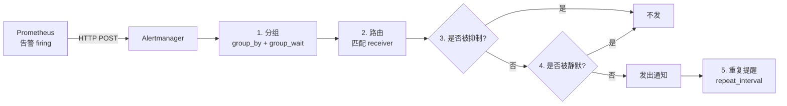
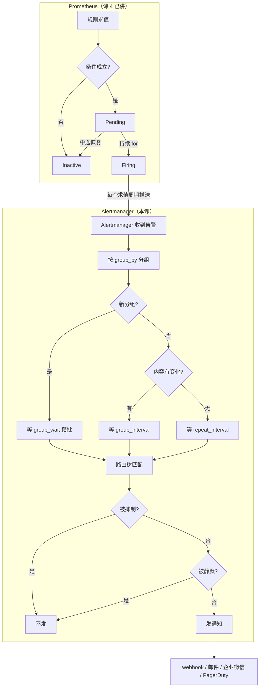
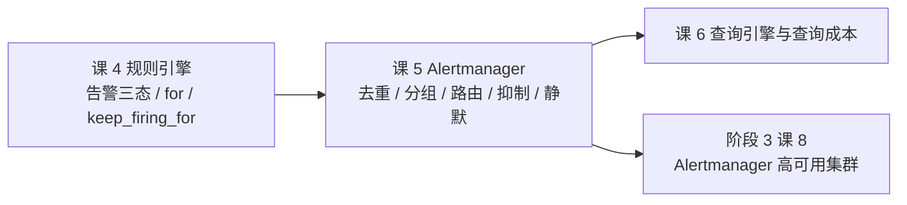

# 课 5：Alertmanager 深入 —— 告警离开 Prometheus 之后

> 所属阶段：阶段 2《规则与告警》
> 前置：课 4《规则引擎》（告警三态、`for` 卡 Pending→Firing）
> 环境：本机 WSL + Docker，Prometheus **v3.14.0**，Alertmanager **v0.30.0**

---

## 🎬 第一幕：场景引入

### 一个让人崩溃的周一早晨

凌晨 3 点，你的支付集群有 3 个实例同时开始报错。

你迷迷糊糊摸过手机，看到的是：

```
03:00  告警：HighErrorRate（实例 A）
03:00  告警：HighErrorRate（实例 B）
03:00  告警：HighErrorRate（实例 C）
03:02  告警：HighErrorRate（实例 A）
03:02  告警：HighErrorRate（实例 B）
03:02  告警：HighErrorRate（实例 C）
03:04  告警：HighErrorRate（实例 A）
...（持续到 08:00，共 450 条）
```

一条故障，刷了 450 条通知。你把所有告警设为免打扰，然后——**真出大事那天，你也没收到通知**。

这就是没有 Alertmanager 的世界。

### 另一个方向上的灾难

有人学到了教训，把告警配得极其"细致"：

- 每个实例单独一条规则
- 每种 severity 单独一个接收器
- 机房网络抖动时，100 个实例同时报 `NodeDown`，同时报 `HighErrorRate`，同时报 `LatencyHigh`

结果：一次网络抖动 = 300 条通知。值班同学在 300 条里翻找真正的根因，翻了 20 分钟。

**而真正的根因只有一条：核心交换机丢包。**

### 这课要解决的问题

Prometheus 在课 4 里把告警推给 Alertmanager 就撒手不管了。**告警离开 Prometheus 之后的命运，完全由 Alertmanager 决定**。

本课回答三个问题：

1. **告警到了 Alertmanager 之后，怎么变成"一条通知"的**（去重与分组）
2. **这条通知该发给谁**（路由树）
3. **怎么让它在该安静的时候安静**（抑制与静默）

### 本课的知识地图



---

## 🔍 第二幕：认知冲突

### 直觉 1：「Alertmanager 是转发器」

**很多人以为**：Alertmanager 就是个"告警转发器"，Prometheus 发什么它就转什么。

**实测打脸**：

```bash
# Prometheus 侧：3 条独立的 firing 告警
curl -s localhost:19090/api/v1/alerts \
  | python3 -c "import sys,json;print(len(json.load(sys.stdin)['data']['alerts']))"
# 3

# Alertmanager 侧：也是 3 条（它确实收到了 3 条）
curl -s localhost:19093/api/v2/alerts \
  | python3 -c "import sys,json;print(len(json.load(sys.stdin)))"
# 3

# 但接收器只收到了 2 条通知！
docker exec l5-prom wget -qO- "http://l5-receiver:8099/count"
# {"default": 1, "payments": 2, "search-critical": 0, "infra": 0}
```

3 条告警进去，3 条通知出来——**但分组方式完全不同**。

更关键的是这一条，看仔细：

```json
{
  "status": "firing",
  "groupLabels": {"alertname": "HighErrorRate"},
  "commonLabels": {
    "alertname": "HighErrorRate",
    "cluster": "l5-lab",
    "severity": "warning",
    "team": "payments"
  },
  "alerts": [
    {"status": "firing",   "labels": {...,"instance":"l5-app-1:8080","zone":"zone-a"}},
    {"status": "resolved", "labels": {...,"instance":"l5-app-2:8080","zone":"zone-b"}}
  ]
}
```

**一条通知里装着两条告警，一条 firing 一条 resolved**。而且 `commonLabels` 里 `instance` 和 `zone` **消失了**——因为这两条告警的这两个标签值不同，只剩交集。

Alertmanager 不是转发器，是**聚合器 + 调度器**。

### 直觉 2：「路由是按最精确的匹配走」

**很多人以为**：路由树会像 CSS 选择器一样，"谁最具体就走谁"。

**实测打脸**：

我们把 `team="payments"` 写在第一条，`alertname=~"Node.*"` 写在第三条：

```yaml
routes:
  - matchers: [team="payments"]      # 第一条，通用
    receiver: payments-receiver
  - matchers: [alertname=~"Node.*"]  # 第三条，专用
    receiver: infra-receiver
```

注入一条 `NodeDown`（它同时带 `team=payments` 和 `alertname=NodeDown`）：

```
payments: 2 条通知（NodeDown 也在这里）
infra:    0 条通知（专用路由根本没轮到）
```

**`NodeDown` 被通用的 `team=payments` 吃掉了**，专用路由形同虚设。

路由是**有序的、命中即停的**，跟"精确度"毫无关系。

### 直觉 3：「抑制和静默是一回事」

**很多人以为**：这俩都是"让告警别发出来"。

**实测打脸**——它们是两种完全不同的机制：

| 维度 | 抑制 inhibit | 静默 silence |
|------|-------------|-------------|
| 谁触发 | **告警触发告警**（自动） | **人手动圈定** |
| 配在哪 | Alertmanager 配置文件 | API / Web UI，运行时创建 |
| 生命周期 | 跟随源告警，源没了就解除 | 有明确的 `startsAt`/`endsAt` |
| 典型场景 | 机房宕机 → 压制上面的所有业务告警 | 计划内维护窗口 |

实测数据（同一条 `HighErrorRate`）：

```
阶段 1（无节点故障）  t=741s  发出 firing
阶段 2（节点宕机）    t=761s  —— 30 秒静默，本该重发却没发
阶段 3（节点恢复）    t=791s  立刻补发 firing
```

阶段 2 那 30 秒的"沉默"，就是抑制生效的硬证据。

---

## 📚 第三幕：层层揭示

## 知识点 1：告警的到达与去重（分组）

### 一句话定义

Alertmanager 把**标签相同的一批告警**聚成一个"分组"（aggregation group），每个分组独立计时、独立发送通知——**N 条告警进去，M 条通知出来（M ≤ N）**。

### 直觉建立：快递驿站

你网购了 5 个包裹，商家分 5 次发货。

- **没有驿站**：快递员敲 5 次门，你开 5 次门。
- **有驿站**：包裹先攒在驿站，攒够一批（或攒够时间），驿站给你**打一个电话**：「你有 5 个包裹，来取」。

`group_by` 决定"按什么维度分驿站"，`group_wait` 决定"攒多久再打电话"。

### 核心原理：三个时间参数

这三个参数都是 **route 级**字段（写在根 route 或子 route 下）。

⚠️ **本课踩到的第一个坑**：把 `group_wait` / `group_interval` / `repeat_interval` 写在 `global:` 下会**启动失败**：

```
level=ERROR msg="Loading configuration file failed"
  err="yaml: unmarshal errors:
    line 4: field group_wait not found in type config.plain
    line 5: field group_interval not found in type config.plain
    line 6: field repeat_interval not found in type config.plain"
```

```yaml
# ❌ 错误：这三个不是 global 字段
global:
  group_wait: 10s

# ✅ 正确：写在 route 下
route:
  group_wait: 10s
  group_interval: 10s
  repeat_interval: 30s
```

三个参数的语义：

| 参数 | 作用时机 | 含义 |
|------|---------|------|
| `group_wait` | **新分组首次出现** | 先等这么久"攒批"，把窗口内到达的同类告警合成 1 条 |
| `group_interval` | 分组**内容发生变化** | 变化后等多久发下一条 |
| `repeat_interval` | 分组**内容没变化** | 重复提醒的最小间隔 |

### 示例演示：group_wait 的攒批（实测）

配置 `group_wait: 20s`，`group_by: ['alertname']`：

```bash
# t=0   让 app-1 故障
docker exec l5-prom wget -qO- "http://l5-app-1:8080/fault/on?rate=0.6"
# t=3   让 app-2 故障（错开 3 秒）
docker exec l5-prom wget -qO- "http://l5-app-2:8080/fault/on?rate=0.6"
```

密集采样接收器计数（每 4 秒一次）：

```
[t= 9.0s] payments: 0     ← 在 group_wait 窗口内，攒着
[t=13.3s] payments: 0     ← 还在攒
[t=19.6s] payments: 1     ← 窗口到，发出 1 条
[t=27.8s] payments: 1
```

> 💡 这里每 4 秒采样一次；第四幕步骤 3 用的是每 5 秒、共 8 次，会出现 4 个 0。
> **采样间隔不同，看到 0 的个数就不同**——正常现象。
> 要看的是形态：**连续多次为 0，然后出现 1 条**。

看这一条通知的内容：

```json
{
  "status": "firing",
  "groupLabels": {"alertname": "HighErrorRate"},
  "n_alerts": 2,
  "instances": ["l5-app-1:8080", "l5-app-2:8080"]
}
```

**错开 3 秒到达的两条告警，被合并成了 1 条通知**（`n_alerts=2`）。

### 示例演示：group_by 决定分组粒度（决定性对照）

同一批告警（l5-app-1 在 zone-a、l5-app-2 在 zone-b，都是 `HighErrorRate`），**只改 `group_by`**：

| 配置 | group_by | 分组数 | 通知数 | 每条含几条告警 |
|------|----------|-------|-------|--------------|
| A | `['alertname', 'zone']` | 2 | **2** | 1 |
| B | `['alertname']` | 1 | **1** | **2** |

配置 B 的实测输出：

```json
{"receiver":"payments","count":1,"items":[{
  "t": 413.51,
  "status": "firing",
  "groupLabels": {"alertname": "HighErrorRate"},
  "n_alerts": 2,
  "instances": ["l5-app-1:8080", "l5-app-2:8080"]
}]}
```

**这就是去重的本质**：不是"删掉重复告警"，而是"把同类告警装进同一条通知"。

### 示例演示：repeat_interval vs group_interval（最容易混的一对）

配置：`group_wait: 20s, group_interval: 10s, repeat_interval: 30s`

**阶段 A**：只让 l5-app-1 故障，内容保持不变

```
[t= 37.3s] payments: 0
[t= 47.6s] payments: 0
[t= 57.9s] payments: 0
[t= 68.2s] payments: 1     ← 首条（group_wait 20s + 规则求值 5s + for 5s 的累积）
[t= 78.4s] payments: 1
[t= 88.7s] payments: 1
[t= 99.0s] payments: 2     ← 距上一条约 30 秒 = repeat_interval
[t=119.6s] payments: 3     ← 又一个 30 秒
```

内容没变，按 `repeat_interval`（30s）重发。

**阶段 B**：加入 l5-app-2，分组内容变化

```
[t=128.6s] payments: 3   ← 刚注入
[t=136.9s] payments: 4   ← 约 8 秒后就发了一条新的（≈group_interval 10s）
```

内容变了，按 `group_interval`（10s）较快发一条**含新内容的**通知。

**一句话区分**：
- `repeat_interval` = 「还是那些事，再提醒你一次」的间隔
- `group_interval` = 「有新情况了，多久告诉你」的间隔

### 常见误区

**误区 1：以为 `group_wait` 越短越好。**
错。`group_wait` 是攒批窗口，设成 0 会让同时爆发的 100 个实例各自发一条。生产环境常见值是 `30s`~`5m`。**抖动类告警靠这个窗口合并**。

**误区 2：以为分组就是把告警"删掉"了。**
错。分组只影响**通知的条数**，不影响告警本身。Alertmanager 的 `/api/v2/alerts` 里，N 条告警还是 N 条。

**误区 3：忽视 `commonLabels` 会"丢标签"。**
这是本课实测抓到的：当一个分组含多条告警时，`commonLabels` 只保留**所有告警共有的**标签。

```json
// 只有 1 条告警时
"commonLabels": {"alertname":"HighErrorRate","instance":"l5-app-1:8080","zone":"zone-a",...}

// 有 2 条不同 instance/zone 的告警时
"commonLabels": {"alertname":"HighErrorRate","cluster":"l5-lab","severity":"warning","team":"payments"}
//                 ↑ instance 和 zone 消失了
```

**如果你的 webhook 模板里写了 `{{ .CommonLabels.instance }}`，多条告警时会渲染成空字符串。** 要遍历每条告警就用 `.Alerts`，不要用 `.CommonLabels`。

### 一句话记住

> **分组不是删告警，是"把 N 条装进 1 个信封"；`group_by` 决定信封怎么分，`group_wait` 决定攒多久封口。**

---

## 知识点 2：路由树与匹配

### 一句话定义

Alertmanager 的路由是一棵**有序树**：告警从根路由进入，按子节点在配置文件中的**书写顺序**自上而下匹配，**命中即停**（除非该节点设了 `continue: true`）；所有子节点都没命中，就落到父节点的 `receiver`。

### 直觉建立：公司前台的电话转接

来电（告警）到前台，前台按**一张顺序表**判断：

1. 是找财务的？→ 转财务（**结束**）
2. 是找技术的且是 P0？→ 转技术值班（**结束**）
3. 都不是 → 转总台

关键在于：**如果第 1 条写的是"所有内部电话都转财务"，那找技术的 P0 电话也会被转到财务**——它永远不会走到第 2 条。

### 核心原理：三个语义

**语义 1：有序 + 命中即停（默认 `continue: false`）**

**语义 2：未命中回落父节点**

**语义 3：`continue: true` 继续匹配兄弟路由**

### 示例演示：顺序决定一切（决定性对照）

同一批告警：`NodeDown`(l5-app-1, team=payments, zone-a) + `HighErrorRate`(l5-app-2, team=payments, zone-b)。

两者**都带 `team=payments`**，但 `NodeDown` 还匹配 `alertname=~"Node.*"`。

**配置 X（通用在前）**：

```yaml
routes:
  - matchers: [team="payments"]       # 通用，在前
    receiver: payments-receiver
  - matchers: [alertname=~"Node.*"]   # 专用，在后
    receiver: infra-receiver
```

实测结果：

```
{"default": 0, "payments": 4, "search-critical": 0, "infra": 0}
```

`NodeDown` **被 payments 吃掉**，infra 收到 0 条。

**配置 Y（专用在前）**：

```yaml
routes:
  - matchers: [alertname=~"Node.*"]   # 专用，提到前面
    receiver: infra-receiver
  - matchers: [team="payments"]
    receiver: payments-receiver
```

实测结果：

```
{"default": 0, "payments": 2, "search-critical": 0, "infra": 2}
# infra:    [{"groupLabels":{"alertname":"NodeDown","zone":"zone-a"}, ...}]
# payments: [{"groupLabels":{"alertname":"HighErrorRate","zone":"zone-b"}, ...}]
```

只调了顺序，`NodeDown` 就改道去了 infra。

> ⭐ **生产铁律：越具体的路由写在越前面。**

### 示例演示：continue: true（一告警多发）

```yaml
routes:
  - matchers: [alertname=~"Node.*"]
    receiver: infra-receiver
    continue: true          # 命中后继续往下匹配
  - matchers: [team="payments"]
    receiver: payments-receiver
```

注入 `NodeDown`（带 `team=payments`）：

```
{"default": 0, "payments": 2, "search-critical": 0, "infra": 2}
```

**同一条告警同时发给了 infra 和 payments 两个接收器**。

典型用途：节点告警既要通知基础设施团队，也要通知该节点归属的业务团队。

### 示例演示：matchers 语法

Alertmanager 0.22+ 推荐用 `matchers`（列表），旧写法 `match`（字典）仍兼容：

```yaml
- matchers:
    - team="payments"              # 相等
    - team!="search"               # 不等
    - alertname=~"Node.*|Disk.*"   # 正则匹配
    - env!~"test.*"                # 正则不匹配
```

**同一 `matchers` 列表内的多个条件是 AND 关系**。

### 常见误区

**误区 1：以为路由会挑"最精确"的匹配。**
不会。它是**顺序优先**，第一个匹配上的就赢。

**误区 2：以为子路由匹配失败会继续试下一个兄弟。**
默认不会——会**回落到父节点的 receiver**（不是继续匹配兄弟）。想继续匹配必须显式写 `continue: true`。

**误区 3：忘记根路由的 receiver 是兜底。**
根路由 `route.receiver` 处理所有"没被任何子路由接走"的告警。不配会导致告警无人接收。

### 一句话记住

> **路由是"顺序 + 命中即停"，不是"最精确匹配"；具体规则写前面，否则会被通用规则吃掉。**

---

## 知识点 3：抑制、静默与时间窗口

### 一句话定义

**抑制（inhibition）**：当 A 类告警在 firing 时，自动压掉 B 类告警的通知——**告警压告警**。

**静默（silence）**：人工按标签圈定一批告警，在指定时间窗内不通知——**人压告警**。

### 直觉建立

- **抑制** = 大楼火警响了，自动切断所有"该楼层温度偏高""该楼层湿度异常"的次要播报，只留火警。
- **静默** = 大楼本周消防演习，物业提前贴通知：「本周三 10:00-11:00 火警响是正常的，别理」。

### 核心原理：抑制规则的三要素

```yaml
inhibit_rules:
  - source_matchers:        # ① 谁有压制权（源告警）
      - alertname="NodeDown"
      - severity="critical"
    target_matchers:        # ② 谁被压制（目标告警）
      - severity="warning"
    equal: ['zone']         # ③ 必须在哪些标签上相等才压制
```

**`equal` 是最容易漏的一列**，也是最容易配错的一列。

- 写了 `equal: ['zone']`：只压制**同 zone** 的告警
- **不写 `equal`**：全集群的 `severity=warning` 都被压制（通常不是你想要的）

### 示例演示：抑制的生效与解除（实测三阶段）

**场景**：l5-app-3 在 zone-a 报错（`HighErrorRate`, warning）；l5-app-1 也在 zone-a，让它节点宕机（`NodeDown`, critical）。

**阶段 1** —— 只有错误率告警：

```
计数: {"default": 1, "payments": 0, "search-critical": 0, "infra": 0}
default: [{"t":741.33, "status":"firing", "n_alerts":1, "instances":["l5-app-3:8080"]}]
```

正常发出。

**阶段 2** —— 叠加节点宕机（同 zone-a），等待 30 秒：

```
计数: {"default": 1, "payments": 0, "search-critical": 0, "infra": 1}
default: [{"t":741.33, "status":"firing", ...}]     ← 没有新增！
infra:   [{"t":761.33, "status":"firing", "groupLabels":{"alertname":"NodeDown","zone":"zone-a"}}]
```

`repeat_interval=30s`，本该在 t≈771 再发一条 `HighErrorRate`——**但它没有出现**。这 30 秒的沉默就是抑制生效。

**阶段 3** —— 恢复节点：

```
计数: {"default": 2, ..., "infra": 2}
default: [
  {"t":741.33, "status":"firing"},
  {"t":791.33, "status":"firing", "instances":["l5-app-3:8080"]}   ← 立刻补发
]
infra: [
  {"t":761.33, "status":"firing",  "alertname":"NodeDown"},
  {"t":791.33, "status":"resolved","alertname":"NodeDown"}
]
```

节点一恢复，抑制解除，`HighErrorRate` 立刻补发。

### 示例演示：静默（通过 API 创建）

```bash
# 创建一条 60 秒的静默
curl -s -X POST http://localhost:19093/api/v2/silences \
  -H 'Content-Type: application/json' \
  -d '{
    "matchers":[
      {"name":"alertname","value":"HighErrorRate","isRegex":false},
      {"name":"zone","value":"zone-a","isRegex":false}
    ],
    "startsAt":"2026-09-04T08:13:05.000Z",
    "endsAt":"2026-09-04T08:14:05.000Z",
    "createdBy":"lesson05",
    "comment":"课5演示"
  }'
# {"silenceID":"6086129e-a521-42ce-964a-9fefef48a8dc"}
```

实测三阶段：

```
阶段 1（告警 firing，silence 未建）  default: 0（还在 group_wait 窗口内）
阶段 2（silence active，等 32s）     default: 0   ← 本该发出的通知被挡住
  查询 silence 状态: {"state":"active"}
阶段 3（silence 到期，等 45s）       default: 1   ← 立刻补发
  {"t":963.6,"status":"firing","n_alerts":1,"instances":["l5-app-3:8080"]}
```

查询与删除：

```bash
# 列出所有静默（id / 状态 / 到期时间）
curl -s http://localhost:19093/api/v2/silences | python3 -c "
import sys, json
for r in json.load(sys.stdin):
    print(r['id'], r['status']['state'], r['endsAt'])"

# 删除（提前结束）静默
curl -s -X DELETE http://localhost:19093/api/v2/silence/<silenceID>
```

### 示例演示：已恢复告警会"搭车"发出（本课实测发现）

这是实测中意外抓到的现象，值得单独讲：

```json
{
  "status": "firing",
  "groupLabels": {"alertname":"HighErrorRate"},
  "commonLabels": {"alertname":"HighErrorRate","cluster":"l5-lab","severity":"warning","team":"payments"},
  "alerts": [
    {"status":"firing",   "labels":{...,"instance":"l5-app-1:8080","zone":"zone-a"},
     "endsAt":"0001-01-01T00:00:00Z"},
    {"status":"resolved", "labels":{...,"instance":"l5-app-2:8080","zone":"zone-b"},
     "endsAt":"2026-09-04T08:24:48.939Z"}
  ]
}
```

一条**已 resolved** 的告警（l5-app-2，08:24:48 就已结束），跟着 08:26 的下一批通知一起发出去了。

两个后果：

1. 通知里的 `alerts[]` 可能**同时含 firing 和 resolved**，你的 webhook 处理逻辑必须逐条看 `status`，不能假设整包同状态。
2. `commonLabels` 里 `instance`、`zone` **消失了**（两条告警值不同，只剩交集）。

### 常见误区

**误区 1：把抑制当成"告警不存在"。**
错。抑制只影响**通知**，告警在 `/api/v2/alerts` 里照样在。抑制期间 UI 上仍能看到它们（标记为 suppressed）。

**误区 2：`equal` 漏配导致压制范围失控。**
没有 `equal` 的抑制规则会**跨集群、跨机房**压制。生产上几乎总是要配 `equal`。

**误区 3：静默配了就忘。**
静默有 `endsAt`，但很多人创建时给了很长的窗口，事后忘记删除。**重大事故复盘时经常发现"关键告警被一条三个月前的静默挡住了"**。建议：静默必须写 `comment` 说明原因和责任人，并定期审计。

**误区 4：以为抑制能压制"已经发出去"的通知。**
不能。抑制只在**生成新通知时**生效，已经发出的通知不会被撤回。

### 一句话记住

> **抑制是"告警压告警"（自动、跟随源告警、必须配 `equal`）；静默是"人压告警"（手动、有时间窗、必须定期审计）。**

---

## 🧪 第四幕：实操验证

> 本幕所有命令均在 **WSL + Docker** 内实测通过。
> 环境：Prometheus v3.14.0、Alertmanager v0.30.0、python:3.12-slim（自研 app 与接收器）。

### 命令避坑（必读，本课新踩 2 个坑）

**坑 1：app 容器内没有 `wget` 也没有 `curl`。**
我们的 app 基于 `python:3.12-slim`，容器内既无 `wget` 也无 `curl`，直接自调故障端点会报：

```
OCI runtime exec failed: exec failed: unable to start container process:
exec: "wget": executable file not found in $PATH
```

**解决**：借 `l5-prom` 容器代发（prom 镜像基于 busybox，有 `wget`）。本课所有 `curl` 命令若要在容器内执行，都走这个模式：

```bash
docker exec l5-prom wget -qO- "http://l5-app-1:8080/fault/on?rate=0.6"
```

宿主机（Windows PowerShell）上则可以直接用 `curl.exe`，端口是映射出来的 19090 / 19093。

**坑 2：`group_wait` 等参数写在 `global:` 下会导致 Alertmanager 启动失败。**
见知识点 1 的"核心原理"，这三个是 route 级字段。启动失败时容器会直接退出，用 `docker logs l5-am` 能看到明确的 `field not found` 报错。

**坑 3：WSL 里没有 `jq`。**
本课实测环境（Ubuntu 24.04）**没有预装 `jq`**，写 `curl ... | jq '.xxx'` 会报 `command not found`。改用 `python3 -c` 解析（本机有 Python 3.12）：

```bash
# ❌ 会失败：jq: command not found
curl -s localhost:19090/api/v1/alerts | jq '.data.alerts | length'

# ✅ 可行
curl -s localhost:19090/api/v1/alerts \
  | python3 -c "import sys,json;print(len(json.load(sys.stdin)['data']['alerts']))"
```

> 想装也可以：`sudo apt-get install -y jq`。

**关于命令在哪执行**：本课命令有两种位置，别混用。

| 写法 | 执行位置 | 适用 |
|------|---------|------|
| `curl -s localhost:19090/...` | WSL 或 Windows 宿主 | 查询已映射的宿主端口（19090/19093） |
| `docker exec l5-prom wget -qO- ...` | 借容器执行 | 访问容器网络内的地址（如 `l5-receiver:8099`） |
| `docker exec l5-prom wget -qO- http://localhost:9090/...` | **容器内** | 容器内的 `localhost` 指容器自己（Prometheus 是 9090） |

容器内的 `localhost:9090` ≠ 宿主的 `localhost:19090`，两者是同一个服务的**不同视角**。

### 实验环境说明

| 角色 | 容器名 | 宿主端口 | 说明 |
|------|--------|---------|------|
| 业务实例 1 | `l5-app-1` | - | team=payments, zone=zone-a |
| 业务实例 2 | `l5-app-2` | - | team=payments, zone=zone-b |
| 业务实例 3 | `l5-app-3` | - | team=search, zone=zone-a |
| Prometheus | `l5-prom` | 19090 | 抓取 + 求值 + 推送告警 |
| Alertmanager | `l5-am` | 19093 | 本课主角 |
| 通知接收器 | `l5-receiver` | - | 自研，按 receiver 分路径落盘 |

**为什么自带接收器而不用真实邮件/钉钉？**
因为要**看清 Alertmanager 到底发了什么、发给谁、几条、什么时间**。真实渠道只能看到"收到了"，看不到"为什么是这一条"。本课的接收器把每条通知按 `receiver` 分文件落盘，可直接 `curl` 查询计数与明细。

### 步骤 1：搭建实验环境（约 2 分钟）

创建工作目录并写入应用代码。

```bash
mkdir -p ~/prometheus-lab/lesson-05/app ~/prometheus-lab/lesson-05/logs
cd ~/prometheus-lab/lesson-05
```

三个文件需要创建：`app/l5_app.py`（业务实例）、`app/receiver.py`（通知接收器）、`alertmanager.yml`、`prometheus.yml`、`rules.yml`。

> 💡 完整文件内容较长（app 约 150 行、receiver 约 130 行），已随本课一起落盘，可直接使用：
> - `labs/lesson-05/app/l5_app.py`
> - `labs/lesson-05/app/receiver.py`
> - `labs/lesson-05/alertmanager.yml`
> - `labs/lesson-05/prometheus.yml`
> - `labs/lesson-05/rules.yml`

核心的告警规则（`rules.yml`）：

```yaml
groups:
  - name: l5-app-alerts
    interval: 5s
    rules:
      - alert: HighErrorRate
        expr: |
          sum by (instance, team, zone) (
            rate(app_requests_total{status="500"}[10s])
          )
          /
          sum by (instance, team, zone) (
            rate(app_requests_total[10s])
          )
          > 0.1
        for: 5s
        labels:
          severity: warning
        annotations:
          summary: "实例 {{ $labels.instance }} 错误率过高"
          description: "{{ $labels.team }}/{{ $labels.zone }} 错误率超过 10%"

  - name: l5-node-alerts
    interval: 5s
    rules:
      - alert: NodeDown
        expr: app_node_up == 0
        for: 5s
        labels:
          severity: critical
        annotations:
          summary: "节点 {{ $labels.instance }} 宕机"
          description: "{{ $labels.zone }} 区节点不可用，应抑制该区实例级告警"
```

启动六个容器（3 个业务实例 + 接收器 + Alertmanager + Prometheus）：

```bash
NET=lesson05-net
BASE=~/prometheus-lab/lesson-05

docker network create $NET

# 三个业务实例（环境变量注入 team / zone 标签）
docker run -d --name l5-app-1 --network $NET -v $BASE/app:/app \
  -e APP_INSTANCE=l5-app-1 -e APP_TEAM=payments -e APP_ZONE=zone-a \
  python:3.12-slim python3 /app/l5_app.py

docker run -d --name l5-app-2 --network $NET -v $BASE/app:/app \
  -e APP_INSTANCE=l5-app-2 -e APP_TEAM=payments -e APP_ZONE=zone-b \
  python:3.12-slim python3 /app/l5_app.py

docker run -d --name l5-app-3 --network $NET -v $BASE/app:/app \
  -e APP_INSTANCE=l5-app-3 -e APP_TEAM=search -e APP_ZONE=zone-a \
  python:3.12-slim python3 /app/l5_app.py

# 通知接收器
docker run -d --name l5-receiver --network $NET \
  -v $BASE/app:/app -v $BASE/logs:/logs \
  python:3.12-slim python3 /app/receiver.py

# Alertmanager（宿主 19093）
docker run -d --name l5-am --network $NET \
  -v $BASE/alertmanager.yml:/etc/alertmanager/alertmanager.yml \
  -p 19093:9093 \
  prom/alertmanager:v0.30.0 \
  --config.file=/etc/alertmanager/alertmanager.yml \
  --storage.path=/alertmanager --log.level=info

# Prometheus（宿主 19090）
docker run -d --name l5-prom --network $NET \
  -v $BASE/prometheus.yml:/etc/prometheus/prometheus.yml \
  -v $BASE/rules.yml:/etc/prometheus/rules.yml \
  -p 19090:9090 \
  prom/prometheus:v3.14.0 \
  --config.file=/etc/prometheus/prometheus.yml \
  --storage.tsdb.path=/prometheus \
  --web.enable-lifecycle --log.level=info
```

> ⚠️ **端口提醒**：如果你的机器上 19090 / 19093 已被占用，改成其他空闲端口即可（如 19096 / 19097）。课 1-4 已占用 9094~9099。

### 步骤 2：确认链路连通

```bash
# Alertmanager 就绪
docker exec l5-am wget -qO- http://localhost:9093/-/ready
# OK

# Prometheus 已发现 Alertmanager
curl.exe -s http://localhost:19090/api/v1/alertmanagers
# {"status":"success","data":{"activeAlertmanagers":[{"url":"http://l5-am:9093/api/v2/alerts"}],...}}

# 三个抓取目标健康
docker exec l5-prom wget -qO- 'http://localhost:9090/api/v1/targets?state=active' \
  | python3 -c "import sys,json;d=json.load(sys.stdin);[print(t['scrapeUrl'],t['health']) for t in d['data']['activeTargets']]"
# http://l5-app-1:8080/metrics up
# http://l5-app-2:8080/metrics up
# http://l5-app-3:8080/metrics up
# http://localhost:9090/metrics up
```

> 如果 Alertmanager 容器没起来，第一件事就是看日志：
> `docker logs l5-am 2>&1 | tail -20`
> 本课最常遇到的就是配置字段名写错（`group_wait` 写在 `global` 下）。

### 步骤 3：观察 group_wait 的攒批（知识点 1）

先清空接收器记录，然后**错开 3 秒**注入两条告警：

```bash
# 清空
docker exec l5-prom wget -qO- "http://l5-receiver:8099/reset"

# t=0  app-1 故障
docker exec l5-prom wget -qO- "http://l5-app-1:8080/fault/on?rate=0.6"
sleep 3
# t=3  app-2 故障
docker exec l5-prom wget -qO- "http://l5-app-2:8080/fault/on?rate=0.6"
```

密集采样（当前 `group_wait: 20s`）：

```bash
# 每 5 秒采样一次，共 8 次 = 覆盖 40 秒（要跨过上面算的 30 秒累计延迟）
for i in 1 2 3 4 5 6 7 8; do
  sleep 5
  echo -n "  "
  docker exec l5-prom wget -qO- "http://l5-receiver:8099/count"
  echo ""
done
```

> ⚠️ **别只采样 20 秒就下结论**。从注入到首条通知，累计延迟是：
> `for: 5s`（规则）+ 求值周期 `5s` + `group_wait: 20s` ≈ **30 秒以上**。
> 只等 20 秒会看到 0 条，误以为攒批没生效。

预期输出（第三轮复验实测序列）：

```
{"default": 0, "payments": 0, "search-critical": 0, "infra": 0}   ← 攒着
{"default": 0, "payments": 0, "search-critical": 0, "infra": 0}   ← 攒着
{"default": 0, "payments": 0, "search-critical": 0, "infra": 0}   ← 还在攒
{"default": 0, "payments": 0, "search-critical": 0, "infra": 0}   ← 还在攒
{"default": 0, "payments": 1, "search-critical": 0, "infra": 0}   ← 窗口到，发出 1 条
{"default": 0, "payments": 1, "search-critical": 0, "infra": 0}
{"default": 0, "payments": 1, "search-critical": 0, "infra": 0}
{"default": 0, "payments": 1, "search-critical": 0, "infra": 0}
```

> 💡 首条出现在**第 5 次采样（约 25 秒）**。前 4 次都是 0 —— 那 20 秒就是 `group_wait` 在攒批。
> 具体到第几次出现取决于机器负载，看到 0 的次数在 3~6 之间都算正常，**关键是"连续多次为 0，然后突然出现 1 条"这个形态**。

看这条通知装了几条告警：

```bash
docker exec l5-prom wget -qO- "http://l5-receiver:8099/list?path=payments"
# {"receiver":"payments","count":1,"items":[{
#   "status":"firing",
#   "groupLabels":{"alertname":"HighErrorRate"},
#   "n_alerts":2,
#   "instances":["l5-app-1:8080","l5-app-2:8080"]
# }]}
```

**`n_alerts=2`** —— 错开 3 秒的两条告警被装进了同一条通知。

清理：

```bash
docker exec l5-prom wget -qO- "http://l5-app-1:8080/fault/off"
docker exec l5-prom wget -qO- "http://l5-app-2:8080/fault/off"
sleep 20
```

> ⚠️ **每轮实验前务必等告警完全恢复**（约 20 秒）。
> 本课实测踩过：上一轮的告警没清干净，下一轮的通知里会混入已 resolved 的旧告警（详见知识点 3 的"搭车"现象），导致 `n_alerts` 对不上。

### 步骤 4：group_by 决定分组粒度（知识点 1）

把 `payments` 路由的 `group_by` 从 `['alertname']` 改成 `['alertname', 'zone']`：

```yaml
    - matchers:
        - team="payments"
      receiver: payments-receiver
      group_by: ['alertname', 'zone']    # ← 加一个 zone
      continue: false
```

热加载（不用重启容器）：

```bash
# 配置文件是 bind mount，直接改宿主机文件后发 SIGHUP
docker exec l5-am kill -HUP 1
sleep 4
docker exec l5-am wget -qO- http://localhost:9093/-/ready
# OK
```

> 💡 **不能 `docker cp` 覆盖 bind mount 的配置文件**，会报
> `unlinkat /etc/alertmanager/alertmanager.yml: device or resource busy`。
> 要改宿主机上的源文件，然后 `kill -HUP 1`。

重做步骤 3 的注入，**同样两条告警，这次会收到 2 条通知**：

```
{"payments": 2, ...}
# [{"groupLabels":{"alertname":"HighErrorRate","zone":"zone-a"},"n_alerts":1,"instances":["l5-app-1:8080"]},
#  {"groupLabels":{"alertname":"HighErrorRate","zone":"zone-b"},"n_alerts":1,"instances":["l5-app-2:8080"]}]
```

**同一批告警，只改 `group_by`，通知条数从 1 变 2。**

### 步骤 5：路由顺序决定分流（知识点 2）

把 `alertname=~"Node.*"` 路由放到 `team="payments"` **后面**，热加载，然后注入 `NodeDown`：

```bash
docker exec l5-prom wget -qO- "http://l5-receiver:8099/reset"

# 先确认节点正常，避免上一轮残留
docker exec l5-prom wget -qO- "http://l5-app-1:8080/fault/node?v=1"
sleep 20

docker exec l5-prom wget -qO- "http://l5-receiver:8099/reset"
docker exec l5-prom wget -qO- "http://l5-app-1:8080/fault/node?v=0"
sleep 30          # for(5s) + 求值(5s) + group_wait(10s) + 通知
docker exec l5-prom wget -qO- "http://l5-receiver:8099/count"
# {"default": 0, "payments": 0, "search-critical": 0, "infra": 1}
#                                                      ↑ 改道 infra
```

> ⚠️ 节点告警同样要算累计延迟：`for: 5s` + 求值 `5s` + `group_wait: 10s`。
> 只等 18 秒会看到 infra=0，误以为路由没生效。

验证改道后的明细：

```bash
docker exec l5-prom wget -qO- "http://l5-receiver:8099/list?path=infra"
# [{"status":"firing","groupLabels":{"alertname":"NodeDown","zone":"zone-a"},...}]
```

```bash
docker exec l5-prom wget -qO- "http://l5-app-1:8080/fault/node?v=1"
sleep 18
```

### 步骤 6：continue: true 一告警多发（知识点 2）

给 `Node.*` 路由加 `continue: true`，热加载，再注入 `NodeDown`：

```yaml
    - matchers:
        - alertname=~"Node.*"
      receiver: infra-receiver
      group_by: ['alertname', 'zone']
      continue: true          # ← 加这一行
```

```bash
docker exec l5-prom wget -qO- "http://l5-receiver:8099/reset"
docker exec l5-prom wget -qO- "http://l5-app-1:8080/fault/node?v=0"
sleep 25
docker exec l5-prom wget -qO- "http://l5-receiver:8099/count"
# {"default": 0, "payments": 2, "search-critical": 0, "infra": 2}
#               ↑ 同一条告警，两个通道都收到了
```

```bash
docker exec l5-prom wget -qO- "http://l5-app-1:8080/fault/node?v=1"
sleep 18
```

### 步骤 7：抑制的生效与解除（知识点 3）

确保抑制规则在位：

```yaml
inhibit_rules:
  - source_matchers:
      - alertname="NodeDown"
      - severity="critical"
    target_matchers:
      - severity="warning"
    equal: ['zone']        # ← 只在同一个 zone 内压制
```

三阶段实验（约 100 秒）：

```bash
docker exec l5-prom wget -qO- "http://l5-receiver:8099/reset"

# 阶段 1：只让 l5-app-3（search/zone-a）报错
docker exec l5-prom wget -qO- "http://l5-app-3:8080/fault/on?rate=0.6"
sleep 20
docker exec l5-prom wget -qO- "http://l5-receiver:8099/list?path=default"
# 应看到 1 条 firing（l5-app-3）

# 阶段 2：叠加 NodeDown（l5-app-1，同属 zone-a）
docker exec l5-prom wget -qO- "http://l5-app-1:8080/fault/node?v=0"
sleep 32
docker exec l5-prom wget -qO- "http://l5-receiver:8099/list?path=default"
# default 通道【没有新增】—— 这 32 秒的沉默就是抑制生效
# （repeat_interval=30s，本该再发一条 HighErrorRate）

# 阶段 3：恢复节点，抑制解除
docker exec l5-prom wget -qO- "http://l5-app-1:8080/fault/node?v=1"
sleep 25
docker exec l5-prom wget -qO- "http://l5-receiver:8099/list?path=default"
# 应看到 HighErrorRate 立刻补发了一条

docker exec l5-prom wget -qO- "http://l5-app-3:8080/fault/off"
sleep 15
```

### 步骤 8：创建静默并观察（知识点 3）

```bash
# 先清掉历史静默（避免干扰）
docker exec l5-prom wget -qO- "http://l5-am:9093/api/v2/silences" | \
  python3 -c "
import sys,json,subprocess
for r in json.load(sys.stdin):
    if r['status']['state'] in ('pending','active'):
        subprocess.run(['docker','exec','l5-prom','wget','-qO-','--method=DELETE',
                        'http://l5-am:9093/api/v2/silence/'+r['id']])
print('cleared')"

docker exec l5-prom wget -qO- "http://l5-receiver:8099/reset"

# 让告警先跑起来
docker exec l5-prom wget -qO- "http://l5-app-3:8080/fault/on?rate=0.6"
sleep 18

# 创建 60 秒静默（匹配 alertname=HighErrorRate 且 zone=zone-a）
docker exec l5-prom wget -qO- \
  --post-data='{"matchers":[{"name":"alertname","value":"HighErrorRate","isRegex":false},{"name":"zone","value":"zone-a","isRegex":false}],"startsAt":"2026-09-04T08:13:05.000Z","endsAt":"2026-09-04T08:14:05.000Z","createdBy":"lesson05","comment":"课5演示"}' \
  --header="Content-Type: application/json" \
  http://l5-am:9093/api/v2/silences
# {"silenceID":"6086129e-..."}
```

> ⚠️ `startsAt` / `endsAt` 要改成**你自己的当前时间**（UTC）。
> 用 `date -u +%Y-%m-%dT%H:%M:%S.000Z` 生成，结束时间加 60 秒。

观察：

```bash
sleep 32
docker exec l5-prom wget -qO- "http://l5-receiver:8099/count"
# {"default": 0, ...}   ← 静默期内，本该发出的通知被挡住

docker exec l5-prom wget -qO- "http://l5-am:9093/api/v2/silences" | head -c 400
# 应看到 "state":"active"

sleep 45   # 等静默过期
docker exec l5-prom wget -qO- "http://l5-receiver:8099/list?path=default"
# 应看到 firing 通知立刻补发
```

清理：

```bash
docker exec l5-prom wget -qO- "http://l5-app-3:8080/fault/off"
sleep 15
```

### 步骤 9：环境清理（可选）

```bash
docker rm -f l5-app-1 l5-app-2 l5-app-3 l5-prom l5-am l5-receiver
docker network rm lesson05-net
```

> ⚠️ 本课容器与其他课程共用宿主端口段，清理时**只删 `l5-` 前缀的**，不要误删别课的容器。

---

## 🎯 第五幕：体系收束

### 一图总结：告警的完整生命周期

把课 4 和课 5 拼起来，一条告警的完整旅程是：



### 三个知识点的一句话收束

1. **分组**：N 条告警 → M 条通知（M ≤ N），`group_by` 分信封、`group_wait` 攒批、`repeat_interval` 重复提醒。
2. **路由**：有序 + 命中即停，**具体规则写前面**；`continue: true` 可一告警多发。
3. **抑制 vs 静默**：抑制是告警压告警（自动、须配 `equal`），静默是人压告警（手动、有时间窗、须审计）。

### 常见误区（全课汇总）

**误区 1：`group_wait` 越短越好。**
错。它是攒批窗口，设 0 会让同时爆发的实例各发一条。生产常见 `30s`~`5m`。

**误区 2：路由会挑最精确的匹配。**
不会。顺序优先，第一个匹配上的就赢。具体规则必须写前面。

**误区 3：抑制和静默是一回事。**
不是。抑制自动跟随源告警，静默手动且有时间窗。

**误区 4：`equal` 可省略。**
省略会导致全集群压制。生产上几乎总要配。

**误区 5：`commonLabels` 一定含有你想要的标签。**
多条告警的分组里，`commonLabels` 只保留交集，个体差异标签（如 `instance`）会消失。webhook 模板要遍历 `.Alerts`，别用 `.CommonLabels.instance`。

**误区 6：抑制能撤回已发出的通知。**
不能。只在生成新通知时生效。

**误区 7：把分组当成了"删告警"。**
分组只影响通知条数，Alertmanager 里 N 条告警还是 N 条。

### 与前后课程的衔接



**课 4 → 课 5 已回收的伏笔**：课 4 结尾说"Prometheus 只把告警推给 Alertmanager 就完事，Pending 期间 Alertmanager 完全不知情"。本课正面回答了后半句——**Alertmanager 从收到 firing 那一刻开始接管**：分组、路由、抑制、静默、重复提醒，全在它这里。

**本课留给后续的伏笔**：

1. **Alertmanager 的高可用**：本课只跑了单实例。生产上必然是多副本，而多副本会带来"同一条告警被每个副本都发一遍"的新问题——**gossip 协议**就是为了解决这个。这是阶段 3 课 8《联邦与全局视图》的内容。
2. **告警内容怎么写才有用**：本课只关心"发给谁、发几条、什么时候发"，没讲"通知里该写什么"。`annotations` 里应该放什么、怎么放 `runbook_url`、怎么让值班同学一眼知道该做什么——这是告警工程实践的一部分，会在课程手册里补充。
3. **`rate()` 的成本**：本课规则里用了 `rate(...)[10s]`，它有多贵、为什么贵、怎么写更便宜——课 6《查询引擎与查询成本》正面回答。

---

## 📝 本课小测

**Q1.** 3 条告警（alertname 相同、zone 不同）进入 Alertmanager，配置 `group_by: ['alertname']`。接收器会收到几条通知？

- A. 1 条
- B. 3 条
- C. 0 条
- D. 取决于 `group_wait`

<details><summary>答案</summary>

**A**。按 `alertname` 分组，3 条告警标签相同 → 1 个分组 → 1 条通知（内含 3 条告警，`n_alerts=3`）。

`group_wait` 只影响**什么时候发**，不影响**发几条**。

</details>

**Q2.** 路由配置如下，一条 `alertname=NodeDown, team=payments` 的告警会发给谁？

```yaml
routes:
  - matchers: [team="payments"]
    receiver: payments-receiver
  - matchers: [alertname=~"Node.*"]
    receiver: infra-receiver
```

- A. 只发 payments-receiver
- B. 只发 infra-receiver
- C. 两个都发
- D. 都不发

<details><summary>答案</summary>

**A**。路由**有序 + 命中即停**。`team="payments"` 在前且匹配，命中后停止，第二条根本不会被评估。

想让 `NodeDown` 走 infra，必须把它提到前面，或给第一条加 `continue: true`。

</details>

**Q3.** 抑制规则如下。zone-a 的节点宕机时，zone-b 的 `severity=warning` 告警会被抑制吗？

```yaml
inhibit_rules:
  - source_matchers: [alertname="NodeDown", severity="critical"]
    target_matchers: [severity="warning"]
    equal: ['zone']
```

- A. 会，因为 target 匹配 severity=warning
- B. 不会，因为 zone 不同
- C. 会，抑制不看 zone
- D. 取决于告警到达顺序

<details><summary>答案</summary>

**B**。`equal: ['zone']` 要求源告警与目标告警在 `zone` 标签上**相等**才压制。zone-a 的 `NodeDown` 压不住 zone-b 的告警——这正是 `equal` 存在的意义（防止一次故障压掉全机房）。

</details>

**Q4.** 某分组含 3 条告警，它们的 `instance` 分别是 a、b、c。通知里的 `commonLabels.instance` 是什么？

- A. `a`（第一条）
- B. `a,b,c`
- C. 空（该键不存在）
- D. 取决于配置

<details><summary>答案</summary>

**C**。`commonLabels` 只保留**所有告警共有的**标签。三条告警的 `instance` 各不相同，交集为空，该键不会出现。

这是本课实测抓到的：`commonLabels` 在单条告警时含 `instance`，两条不同 instance 时该键消失。**webhook 模板里别写 `{{ .CommonLabels.instance }}`**，要遍历 `.Alerts`。

</details>

**Q5.** 你想在计划内维护窗口（2 小时）期间不收告警，应该用什么？

- A. 抑制规则
- B. 静默
- C. 把 `repeat_interval` 调大
- D. 停掉 Prometheus

<details><summary>答案</summary>

**B**。静默是**人工按标签圈定 + 有明确时间窗**，正是维护窗口的标准做法。

抑制是"告警压告警"的自动机制，不适合这种人为场景。创建时记得写 `comment` 说明原因和责任人，事后**记得删**——生产事故复盘时经常发现关键告警被几个月前的静默挡住了。

</details>

---

## ⚡ 速览

| 概念 | 一句话 | 关键参数 / 字段 |
|------|--------|----------------|
| 分组 | N 条告警装进 1 条通知 | `group_by`、`group_wait`（攒批） |
| 重复提醒 | 内容没变时的重发间隔 | `repeat_interval` |
| 分组更新 | 内容变化后的通知间隔 | `group_interval` |
| 路由 | 有序树，命中即停 | `matchers`、`continue` |
| 抑制 | 告警压告警，自动 | `source_matchers`、`target_matchers`、`equal` |
| 静默 | 人压告警，有时间窗 | `POST /api/v2/silences`、`startsAt`/`endsAt` |
| commonLabels | 分组内所有告警的标签交集 | 个体差异标签会消失 |

**三个时间参数的区别**：

```
group_wait      → 新分组出现，先攒这么久（攒批窗口）
group_interval  → 分组内容变了，多久后发下一条
repeat_interval → 分组内容没变，多久重复提醒一次
```

**抑制 vs 静默**：

| | 触发方 | 配置位置 | 生命周期 |
|---|---|---|---|
| 抑制 | 告警（自动） | 配置文件 `inhibit_rules` | 跟随源告警 |
| 静默 | 人（手动） | API / Web UI | 显式 `startsAt`~`endsAt` |

---

## 🧭 课程导航

- **上一课**：[课 4 规则引擎](lesson-04-规则引擎.md) —— 告警三态、`for` 卡 Pending→Firing、`keep_firing_for`
- **下一课**：[课 6 查询引擎与查询成本](lesson-06-查询引擎与查询成本.md) —— 查询成本 ≈ 序列数 × 点数、staleness marker、`absent()` 的正确用法
- **阶段首页**：[阶段 2 规则与告警](../overview.md)
- **课程目录**：[02-课程目录.md](../../../02-课程目录.md)

---

## 🤝 接力提示词

> 下一课开始时，可以把下面这段直接发给 AI，帮它快速接上进度：

```
我们正在学 Prometheus 课程（D:/projects/learning/prometheus）。
刚学完课 5《Alertmanager 深入》（阶段 2）。

已掌握：
- 分组：group_by 决定分组粒度，group_wait 攒批，repeat_interval 重复提醒
- 路由：有序 + 命中即停，具体规则必须写前面；continue:true 可一告警多发
- 抑制（告警压告警，须配 equal）vs 静默（人压告警，有时间窗）
- 环境：Prometheus v3.14.0 + Alertmanager v0.30.0，课 5 容器 l5-* 宿主端口 19090/19093

本课留给课 6 的伏笔：
- 课 5 规则里用了 rate(...)[10s]，它有多贵、为什么贵、怎么写更便宜还没讲
- Alertmanager 多副本的 gossip 去重留到阶段 3 课 8

请先读 D:/projects/learning/prometheus/00-学习档案.md 的「断点续学信息」，
以及 stages/2-规则与告警/lessons/lesson-05-Alertmanager深入.md，
然后告诉我你对课 6《查询引擎与查询成本》的理解，我确认后再动手。
```

---

## 🔍 本课评审结论

| 项目 | 内容 |
|------|------|
| 评审方式 | 主 agent 内联（pedagogy + learner 双视角；`course-reviewer` 子 agent 尚未创建，独立性受限） |
| P0 | **3 → 0** |
| P1 | 0 |
| 命令复验 | 从零重建环境，第四幕步骤 1-8 **逐字执行，16 项断言全部 PASS** |
| 实测环境 | Prometheus v3.14.0、Alertmanager v0.30.0、python:3.12-slim、Ubuntu 24.04 |

**三个 P0 及其修正**（均为逐字复验或全量扫描抓到的真问题）：

1. **`jq` 在本机不存在**（全量扫描发现）：讲义 3 处写了 `curl ... | jq '...'`，实测 WSL（Ubuntu 24.04）**未预装 `jq`**，读者照抄必然 `command not found`。已全部改为 `python3 -c` 解析，并在"命令避坑"新增坑 3 说明（含 `apt-get install jq` 的可选方案）。
2. **第三幕用了 `localhost:8081`**（命令扫描发现）：该端口在本机**已被其他进程占用**（学习档案明确记录），且 app 端口根本没映射到宿主——读者照抄必失败。已改为与第四幕一致的 `docker exec l5-prom wget -qO- "http://l5-app-1:8080/..."`。
3. **攒批实验的采样窗口过短**（复验 FAIL 发现）：原写 5 次 ×4 秒 = 20 秒，而从注入到首条通知的累计延迟是 `for: 5s` + 求值 `5s` + `group_wait: 20s` ≈ **30 秒以上**。只等 20 秒会看到 0 条、误判攒批失效。已改为 8 次 ×5 秒（覆盖 40 秒）并加时序说明；步骤 5 的 `sleep 18` 同样放宽到 30 秒。

**两处"看似问题、实为脚本误报"的甄别**（未据此改动文档）：

- pedagogy 视角初判"示例演示 #3、#7 缺实测数据"——回读原文确认两处均有完整实测输出（8 个采样点时间戳、抑制三阶段 741/761/791）。误判根因是检测规则只认 ```` ```bash ```` 块，而终端输出用的是**无语言标注的纯文本块**。已收紧脚本而非改文档。
- learner 视角初判"3 处 `sleep < 15s` 不够"——核验确认那是攒批实验**故意的错时注入（3 秒）与密集采样循环（5 秒×8）**，累计 40 秒足够。已收紧脚本，只在"等待后立即查询"的上下文里检测。

> 这两条延续了课 4 固化的规则：**误报不等于真缺陷，先分辨是脚本问题还是文档问题**（课 4 曾据此避免把 3 条误判改成 3 个新缺陷）。

**实验中发现并保留为教学内容的两点**：

- **路由顺序陷阱**：原计划用 `team="payments"` 在前演示分流，实测 `NodeDown` 被它吃掉、infra 收到 0 条。这反而是路由树最好的教学素材，已改写为**顺序对照实验**（配置 X vs 配置 Y）写入知识点 2。
- **已恢复告警会"搭车"发出**：实测 `endsAt=08:24:48` 的 resolved 告警，在 08:26 的下一批通知里才被带出，导致 `n_alerts` 与直觉不符。经两轮诊断定位后，在步骤 3 加入"每轮实验前等告警完全恢复"的提醒，该现象本身作为知识点 3 的示例保留——它揭示了 `commonLabels` 的交集语义。

**未强行下结论的点**：本课未展开 Alertmanager 多副本的 gossip 去重（本课只跑了单实例），留待阶段 3 课 8 讲 HA 时正面处理。
