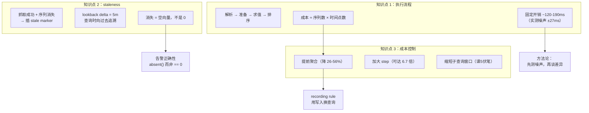
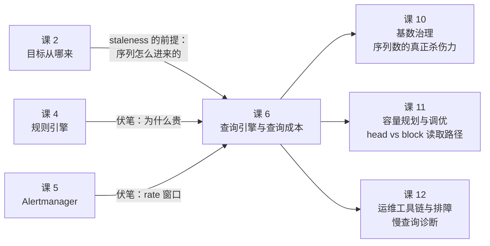

# 课 6：查询引擎与查询成本 —— 一条 PromQL 到底有多贵

> 所属阶段：阶段 2《规则与告警》
> 前置：课 4《规则引擎》（规则组求值、recording rules）、课 5《Alertmanager 深入》
> 环境：本机 WSL + Docker，Prometheus **v3.14.0**（build 20260817）
> 本课实验：宿主端口 19094（Prometheus），容器 `l6-prom` / `l6-app`

---

## 🎬 第一幕：场景引入

### 一个把 Prometheus 查挂的仪表盘

周一上午，你接到电话：**监控打不开了**。

登上机器，看到 Prometheus 进程占了 14GB 内存，CPU 跑满，日志里刷着：

```
level=warn msg="Query timed out, reducing concurrency"
level=error msg="query processing would load too many samples into memory"
```

回溯发现，十分钟前有人打开了一个新做的仪表盘，上面有这样一个面板：

```promql
sum by (pod, container, node) (
  rate(container_network_receive_bytes_total{namespace=~".*"}[5m])
)
```

看起来平平无奇。但这个集群有 3000 个 Pod、每个 Pod 4 个容器，这条查询在 15 天的时间范围上、以 10 秒为步长展开——**它要处理的样本数是 2.6 亿个**。

一个面板，一条查询，打挂一台机器。

### 另一个方向上的困惑

还有一次，你写了一条告警规则：

```yaml
- alert: HighErrorRate
  expr: rate(http_requests_total{code=~"5.."}[10s]) > 0.05
```

有人 Code Review 时说："`[10s]` 窗口太短了，改成 `[5m]` 更稳。"

你照做了。然后发现：**告警变得迟钝了，但该抖的还是抖**。而且你始终不知道——`[10s]` 和 `[5m]`，到底哪个更贵？

更根本的问题是：**"贵"到底指什么？** 是耗时长？是占内存？还是别的什么？如果答不上来，你就无法在"查询更准"和"查询更省"之间做取舍。

### 这课要解决的问题

前面五课讲的是数据**怎么进来**、**怎么存**、**怎么变成告警**。这一课讲数据**怎么被读出来**，以及这次读取**要付出什么代价**。

本课回答三个问题：

1. **一条 PromQL 从输入到结果，在 Prometheus 内部走过了哪些步骤**（执行流程）
2. **为什么目标消失了，查询返回的是"空"而不是"0"**（staleness 与 lookback delta）
3. **怎么判断一条查询贵不贵，以及怎么把它改便宜**（查询成本）

### 本课的知识地图

```mermaid
flowchart LR
    A[PromQL 文本] --> B[1. 解析<br/>Parser → AST]
    B --> C[2. 准备<br/>查索引 → 选序列]
    C --> D[3. 求值<br/>读样本 → 算函数]
    D --> E[4. 排序 / 返回]
    C -.-> F[(倒排索引<br/>label → series)]
    D -.-> G[(head + block<br/>chunk 解码)]
    D -.-> H[staleness marker<br/>决定"有没有值"]
    G -.-> I[成本 = f<br/>序列数 × 时间点数]
```

---

## 🔍 第二幕：认知冲突

### 直觉 1：「查询慢，是因为序列多」

**很多人以为**：查询贵是因为命中的序列太多（高基数）。所以优化方向是"减少标签基数"。

**实测打脸**（20000 条序列，时间窗 5 分钟，step=15s）：

```
序列数固定 20000，只改 step：

  step |        点数 |    中位耗时
-------+-------------+-----------
    1s |   1,335,506 |   1293.5ms
    5s |     267,102 |    405.3ms
   15s |     101,401 |    248.2ms
   60s |      26,101 |    196.9ms
  300s |      20,001 |    194.4ms
```

序列数**一动没动**，只是把 step 从 1s 放宽到 300s，耗时从 **1293.5ms 降到 194.4ms**——**6.7 倍**。

反过来，把序列数从 1 条加到 20000 条，但**控制返回点数都是 21 个**：

```
点数固定 ~21，只改序列数：

  序列数 |    点数 |    中位耗时
---------+---------+-----------
       1 |      21 |    147.9ms
      10 |     201 |    158.2ms
     100 |    2001 |    164.2ms
    1000 |   16401 |    169.9ms
   20000 |  101401 |    259.4ms
```

序列数涨了 **2 万倍**，耗时只涨了 **1.75 倍**。

**结论**：查询成本的主宰是**返回的样本点数**，不是序列数。基数会通过"放大点数"间接影响成本，但它不是直接原因。

> ⚠️ 这个结论有个前提：**在你还没把内存打爆之前**。序列数真正致命的地方是内存（每条序列都要建索引条目），本课后面会讲到这个边界。

### 直觉 2：「正则匹配器很贵，要避免用 `.*`」

这是个流传很广的说法。我一开始也这么写进了实验设计，**然后被自己的数据推翻了**。

实测（20000 条序列，重复 50 次取中位数）：

```
  等值匹配      {idx="000123"}      命中=1  中位=126.2ms  stdev=10.6
  正则无元字符   {idx=~"000123"}    命中=1  中位=133.4ms  stdev=10.9
  无界正则      {idx=~".*000123"}  命中=1  中位=123.5ms  stdev= 9.9
  全匹配正则    {idx=~".+"}        命中=20000 中位=189.7ms stdev=17.1
```

**无界正则 `.*000123`（123.5ms）不但不比等值匹配（126.2ms）慢，甚至还略快**——但这点差异（2.7ms）远小于标准差（约 10ms），**这就是噪声，不是结论**。

真正有差异的是最后一行：`.+` 命中了 20000 条，耗时涨到 189.7ms。

为了确认"正则本身不贵、命中数才贵"，我又做了一组对照——**改变候选集大小，但命中数都保持 1 条**：

```
  候选集=100    等值  命中=0  中位=134.4ms   无界正则  命中=0  中位=129.3ms
  候选集=2000   等值  命中=1  中位=135.8ms   无界正则  命中=1  中位=123.4ms
  候选集=20000  等值  命中=1  中位=123.3ms   无界正则  命中=1  中位=127.6ms
```

候选集从 100 涨到 20000（**200 倍**），查询耗时**纹丝不动**（都在 123~136ms 的噪声带里）。

**结论**：正则匹配器**不是**性能瓶颈。它的开销在你这个量级上完全被固定开销（网络 + 解析，实测约 120~130ms）淹没。真正决定成本的是**它命中了多少条序列**——而"命中多少条"是由你的**标签值分布**决定的，不是由"是否用了 `.*`"决定的。

> 📌 **为什么"避免 `.*`"这个说法还流传着**：因为它在一个场景下是对的——`{__name__=~".+"}` 这种**全局无界**写法会命中数据库里的每一条序列。实测在本机库里约 4 万条序列时，它耗时 0.36s（对比精确匹配的 0.12s，约 **3 倍**）。但这不是"正则贵"，是"命中了全部序列贵"。**别把结果当成原因。**

### 直觉 3：「目标挂了，查询应该返回 0」

**很多人以为**：目标宕机后，查询它会返回 0，所以 `sum(up) == 0` 就是"全挂了"。

**实测打脸**（抓取间隔 5 秒，kill 之后每 1 秒采样一次）：

```
执行 /kill（抓取仍返回 200，只是不再暴露这条序列）

  Δ(秒) |  序列数 |     值 | 判定
--------+---------+--------+--------
      1 |       1 |   22.0 | 有数据
      2 |       1 |   22.0 | 有数据
      3 |       1 |   22.0 | 有数据
      4 |       1 |   22.0 | 有数据
      5 |       0 |      - | ★无数据
      6 |       0 |      - | ★无数据
```

注意 Δ=5 这一行——**不是返回 0，是整条序列消失了**。

这个区别比你想象的重要。看这两个表达式在目标消失后的行为差异：

```promql
sum(l6_concurrency)        # → 空（没有序列可求和）
sum(l6_concurrency) == 0   # → 空（空 == 0 也是空，不是 true）
sum(l6_concurrency) < 1    # → 空
```

**对一个空向量做比较，结果还是空向量，永远不会是 true。** 所以"用 `< 1` 来检测目标消失"的告警规则，在目标真的消失时**根本不会触发**——这正是"该响的告警不响"的经典成因之一。

而这个"消失"发生在 Δ=5 秒——**恰好等于一个抓取间隔**。这不是巧合，它指向本课的核心机制：**staleness marker**。

### 三个直觉的共同点

三个直觉都错在同一个地方：**把"看起来像原因的东西"当成了原因**。

- 序列数看起来是原因 → 实际是点数
- 正则写法看起来是原因 → 实际是命中数
- 返回值看起来是 0 → 实际是"不存在"

这一课的方法论就是：**把成本和机制量化到能证伪的程度**。接下来逐层拆开。

---
## 🔬 第三幕：层层揭示

### 知识点 1：PromQL 执行流程 —— 一次查询走过的四步

#### 一句话定义

一次 PromQL 查询在 Prometheus 内部经历**解析 → 准备 → 求值 → 排序**四个阶段；成本主要产生在第三阶段（求值），其大小约等于**命中的序列数 × 要计算的时间点数**。

#### 直觉建立

把它想成**查字典 + 抄表格**：

1. **解析**：把查询语句翻译成机器能懂的结构（= 理解你要查什么）
2. **准备**：查索引，找出哪些序列符合条件（= 翻目录，找到页码）
3. **求值**：翻到那些页，把数据抄出来，边抄边算（= 真正耗时的活）
4. **排序**：整理结果（= 排序、分页）

第 2 步看起来最"聪明"，但它很快——因为 Prometheus 有倒排索引。真正的时间花在第 3 步，因为那要**从磁盘/内存里把每个样本解码出来**。

#### 核心原理

##### 四阶段拆解与可观测证据

| 阶段 | 做什么 | 官方指标（slice 名） | 本机实测 count |
|------|--------|---------------------|---------------|
| 排队 | 等待执行槽位 | `queue_time` | 344 |
| 准备 | 解析 AST、查索引、选序列 | `prepare_time` | 172 |
| 求值 | 解码 chunk、算函数、聚合 | `inner_eval` | 172 |
| 排序 | 结果排序 | `result_sort` | 42 |

> ⚠️ **一次重要的实验教训**：我最初想用 `prometheus_engine_query_duration_seconds{slice="inner_eval"}` 的差值来度量单次查询成本，结果**失败了**——连跑 5 次同样查询，只有 1 次采到增量（`count +7`），其余 4 次都是 0。
>
> 原因是：这是 Prometheus 的**自监控指标**，它自己也是按 `scrape_interval`（本课 5 秒）被抓取的。这意味着它**无法归因到单次查询**——你看到的增量是"这 5 秒内所有查询的合计"。
>
> 同理，`prometheus_engine_query_samples_total` 是**自启动累计**的 counter（实测值 411746），它同样按抓取周期批量更新。用它做前后差值来归因单次查询，得到的 34001 这种数字是**没有意义**的。
>
> **本课因此改用「墙钟耗时 + 返回点数 + 重复采样取中位数」**：先用小负载测出噪声基线（实测中位数 131.5ms，波动范围 113.0~140.2ms，即 **±27ms**），再把实验负载放大到远超这个噪声带，确保观察到的差异是真实信号而非抖动。

##### 成本公式与实测验证

$$\text{成本} \approx \text{命中序列数} \times \text{时间点数} = N_{series} \times \frac{\text{时间窗}}{\text{step}}$$

**验证 1：固定序列数，只改 step**（20000 条序列，时间窗 5 分钟）

```
  step |        点数 |    中位耗时 |  min~max
-------+-------------+-----------+------------------
    1s |   1,335,506 |   1293.5ms |  1165.9~2923.2
    5s |     267,102 |    405.3ms |   363.1~426.6
   15s |     101,401 |    248.2ms |   227.1~270.9
   60s |      26,101 |    196.9ms |   171.0~202.1
  300s |      20,001 |    194.4ms |   183.9~233.7
```

点数从 133 万降到 2 万（**67 倍**），耗时从 1293.5ms 降到 194.4ms（**6.7 倍**）。注意耗时下降得比点数慢——因为存在约 190ms 的固定开销（解析 + 网络 + 结果序列化），这部分不随点数变化。

> ⚠️ **这些点数是在"数据已攒满 5 分钟"的条件下测的**。如果你刚建好环境就测，
> `step=1s` 只会得到约 **180,000** 个点（数据只攒了 90 秒，5 分钟窗口里有 3.5 分钟无样本）。
> **看"step 越小点数越多"这个单调关系，不要死磕具体数值**——
> 这是本课复验时真实遇到的偏差，两次测量差了 7 倍。

**验证 2：固定点数，只改序列数**（时间窗 5 分钟，step=15s）

```
  序列数 |    点数 |    中位耗时 |  min~max
---------+---------+-----------+------------------
       1 |      21 |    147.9ms |   140.1~174.0
      10 |     201 |    158.2ms |   136.3~169.6
     100 |    2001 |    164.2ms |   149.1~203.4
    1000 |   16401 |    169.9ms |   161.1~183.0
   20000 |  101401 |    259.4ms |   221.2~289.5
```

序列数涨 20000 倍，耗时只涨 1.75 倍。**注意最后一行的点数也涨了**（因为 topk(20000) 返回了 20000 条序列 × 21 个时间点），所以这里序列数和点数是耦合的。真正的解耦证据是"验证 1"——那里序列数恒定，只有点数在变。

**验证 3：聚合能同时砍掉序列数和点数**（20000 条序列，5 分钟，step=15s）

```
              写法 |      点数 |    中位耗时 |  min~max
-------------------+-----------+-----------+------------------
    原始 20000 条  |   101401  |    251.7ms |   240.7~263.3
   sum 聚合成 1 条 |       21  |    149.9ms |   142.3~158.1
   avg 聚合成 1 条 |       21  |    137.6ms |   134.0~162.0
 sum by (job) 聚合 |       21  |    136.5ms |   131.8~159.6
```

点数从 101401 降到 21，耗时从 251.7ms 降到 149.9ms（**降 40%**）。

##### 序列数真正的杀伤力：内存，不是时间

前面说"序列数不是耗时主因"，但**这不代表高基数无害**。它杀的是内存。

每条序列在 head block 里都要维护索引条目和 chunk 引用。本机实测：注入 20000 条序列后，`/api/v1/status/tsdb` 的 `headStats.numSeries` 从 829 涨到 20832（**829 条 Prometheus 自身指标 + 20000 条注入序列 + 少量 recording rule 产物**；这个数会随环境小幅浮动）。

时间上，20000 条序列的查询只比 1 条慢 1.75 倍；但内存上，20000 条序列是**实打实的 20000 份索引开销**——这是阶段 4 课 10《基数治理》的主题，本课先记住这个边界。

#### 示例演示

**步骤 1：准备一个可控基数的目标**

```bash
# 生成 20000 条序列（idx 从 000000 到 019999）
docker exec l6-prom wget -qO- "http://l6-app:8080/cardinality?n=20000"
# {"ok":true,"series":20000}

# 等 10 秒，让 Prometheus 抓两轮
sleep 10
```

**步骤 2：观察 step 对成本的影响**

```bash
# step=1s（最贵）
docker exec l6-prom wget -qO- \
  "http://localhost:9090/api/v1/query_range?query=topk(20000,l6_card_metric)&start=$(($(date +%s)-300))&end=$(date +%s)&step=1s" \
  | python3 -c "import sys,json;d=json.load(sys.stdin)['data']['result'];print('点数:',sum(len(x['values']) for x in d))"
# 点数: 1335506

# step=60s（便宜得多）
docker exec l6-prom wget -qO- \
  "http://localhost:9090/api/v1/query_range?query=topk(20000,l6_card_metric)&start=$(($(date +%s)-300))&end=$(date +%s)&step=60s" \
  | python3 -c "import sys,json;d=json.load(sys.stdin)['data']['result'];print('点数:',sum(len(x['values']) for x in d))"
# 点数: 26101
```

> 📌 **`date +%s` 在 WSL 里可用**。如果你在 Windows PowerShell 里执行，改用
> `[int][double]::Parse((Get-Date -UFormat %s))`，或者干脆用 Python 生成时间戳。

**步骤 3：确认序列数与点数的解耦**

```bash
# 命中 1 条序列 —— 注意点数只有 21
docker exec l6-prom wget -qO- \
  "http://localhost:9090/api/v1/query_range?query=l6_card_metric{idx=\"000123\"}&start=$(($(date +%s)-300))&end=$(date +%s)&step=15s" \
  | python3 -c "import sys,json;d=json.load(sys.stdin)['data']['result'];print('序列数:',len(d),'点数:',sum(len(x['values']) for x in d))"
# 序列数: 1 点数: 21
```

**步骤 4：感受一下"打挂"的量级**

把时间窗拉到 15 天、step 设为 10 秒：

```
15 天 = 1,296,000 秒 / 10 秒 = 129,600 个时间点
× 20000 条序列 = 2,592,000,000 个样本
```

这就是第一幕那个面板做的事情。Prometheus 的默认保护是 `query.max-samples=50000000`（实测本机值）——**5000 万个样本**就会触发
`"query processing would load too many samples into memory"` 报错。

可以按此估算你的安全边界：

$$\text{最大安全点数} = \frac{50{,}000{,}000}{\text{序列数}}$$

20000 条序列时，最多能查 2500 个点（约 6 小时 @ step=10s）。

#### 常见误区

**误区 1：「正则匹配器慢，要尽量避免 `.*`」**

实测推翻（详见第二幕）。正则本身开销被固定开销淹没；真正贵的是**命中了多少条序列**。
只有 `{__name__=~".+"}` 这种命中全库的写法才真的贵（实测 0.12s → 0.36s，
**3 倍**，在库里约 4 万条序列时测得；干净环境下约 800 条，此时倍差只有 1.2x），
但那是"命中全库"贵，不是"用了正则"贵。

> 📌 **这个倍差本身也随环境浮动**：命中数越大，结果序列化开销越明显，倍差越大。
> 稳定的是**单调关系**（命中越多越慢），不是"一定是 3 倍"。

**误区 2：「查询慢就减标签基数」**

基数确实该治理，但它治的是**内存**和**长期稳定性**。单条查询的**耗时**主要看点数和 step。
一条查 1 条序列、但 step=1s / 时间窗 15 天的查询，会比查 20000 条序列 / step=60s / 时间窗 5 分钟的查询**慢得多**。

**误区 3：「用 Prometheus 自监控指标可以度量单次查询成本」**

实测失败（详见上文"一次重要的实验教训"）。自监控指标按 `scrape_interval` 批量更新，
无法归因到单次查询。要看单次成本，用墙钟耗时 + 重复采样，并先把负载放大到超过噪声基线（本机实测 ±27ms）。

**误区 4：「`sum(x) == 0` 能检测目标消失」**

不能。目标消失后序列**整个不存在**，`sum()` 返回**空向量**，空向量参与比较的结果还是空向量，永远不是 `true`。
正确写法见知识点 2。

#### 一句话记住

**成本 ≈ 序列数 × 时间点数。想让查询变便宜，先砍点数（加大 step、缩短时间窗、提前聚合），再谈别的。**

---

### 知识点 2：staleness marker 与 lookback delta —— 为什么消失的目标返回"空"而不是"0"

#### 一句话定义

当 Prometheus 成功抓取一次但发现某条序列**不再出现**时，会插入一个 **staleness marker**（陈旧标记）；此后查询该序列时，它在标记时刻之后被判定为"无数据"。**lookback delta（默认 5 分钟）** 则是查询时"向过去追溯多久找最近样本"的上限。

#### 直觉建立

把每条序列想成一根**时间轴上的线**：

- 目标正常：线在持续向右延伸，每隔 `scrape_interval` 打一个点
- 目标消失：线**停住了**。Prometheus 在停止处画一个 **✕**（staleness marker），表示"到此为止，后面没有了"
- 查询时：如果你要看的位置在线上（或在 ✕ 之前），有值；如果你要看的位置在 ✕ **之后**，**没有值**

关键点：**"没有值"和"值是 0"是两回事**。

- "值是 0" = 序列存在，数值确实是 0（比如"当前错误数 = 0"）
- "没有值" = 序列不存在（比如"这个 Pod 已经没了"）

一个已经删除的 Pod，它的错误数不是 0，是**不存在**。这个语义区别是整套告警逻辑的基础。

#### 核心原理

##### staleness marker 什么时候插入

**触发条件（两个都要满足）**：

1. 本次抓取**成功**（HTTP 200，且响应能被解析）
2. 该序列在本次响应中**没有出现**（但之前有）

**不触发的情况**：抓取**失败**（HTTP 500 / 超时 / 连接拒绝）。此时 Prometheus 认为"我不知道目标现在什么状态"，**不会**插入标记——序列会一直"活着"，直到超出 lookback delta。

这是个精妙的设计：抓取失败往往是**暂时**的（网络抖动、重启中），如果此时就判定序列消失，会造成大量误告警。

##### 实测：staleness marker 的插入时刻

**实验 A：抓取成功但序列消失（`/kill`）**

```bash
# 让 app 停止暴露业务指标，但 /metrics 仍返回 200
docker exec l6-prom wget -qO- "http://l6-app:8080/kill"
# {"alive":false,"hint":"业务序列已停止暴露，/metrics 只返回 l6_up=0"}
```

随后以 **1 秒**粒度采样（抓取间隔 5 秒）：

```
  Δ(秒) |  序列数 |     值 | 判定
--------+---------+--------+--------
      1 |       1 |   22.0 | 有数据
      2 |       1 |   22.0 | 有数据
      3 |       1 |   22.0 | 有数据
      4 |       1 |   22.0 | 有数据
      5 |       0 |      - | ★无数据
      6 |       0 |      - | ★无数据
      7 |       0 |      - | ★无数据
      8 |       0 |      - | ★无数据
```

**序列恰好在 Δ=5 秒消失——正好一个抓取间隔。** 这就是 staleness marker 被插入的时刻：Prometheus 在下一次（成功的）抓取中发现序列不见了，于是打上标记，该序列从此刻起"不存在"。

**实验 B：抓取失败（`/break`，返回 HTTP 500）**

```bash
docker exec l6-prom wget -qO- "http://l6-app:8080/break"
# {"broken":true,"hint":"/metrics 现在返回 500"}
```

此时 target 状态变为 `down`：

```
job=l6-app health=down lastError="server returned HTTP status 500 INTERNAL SERVER ERROR"
```

> ⚠️ **一次实验设计上的坑，值得单独说**：我最初把"抓取失败"实现成"仍返回 200 但不含该序列"，
> 结果 kill 和 break 两组表现**一模一样**（都在 Δ=5s 消失）——因为它们其实都是 kill 场景。
> 修正后（`/break` 真返回 500）才区分开两种机制。
> **做对照实验时，先确认你的两组真的触发了不同的代码路径**，否则你会得到一个漂亮但错误的"对照"。

##### lookback delta 是干什么的

它是**查询时**的参数，作用是：

> 当查询时刻 `t` 处**没有精确匹配的样本**时，允许**向过去**追溯最多 `lookback-delta` 时间，取那个范围内**最近的样本**。

**关键理解**：lookback delta 是**向过去追溯**，不是**向未来延伸**。

```
时间轴：  ──────●──────●──────●──────✕────────────────→
              样本    样本   样本    stale marker
                                        ↑
                                   最后样本时刻

查询 t（在 marker 之后）：
  ✗ 不能查到 marker 之后的任何东西（那里本来就没数据）
  ✓ 若查询 t 落在样本之间，会向过去找最近的样本（在 5 分钟内）
```

> ⚠️ **我在这上面连栽了三次**，把过程记下来，因为它极容易搞错：
>
> - **第一次**：我在 kill 之后查询"当前时刻"，看到 5 秒内就返回空，以为 lookback delta 失效了。
>   错在——我查的是**最后样本之后的未来时刻**，那里本来就没有任何数据，与 lookback 无关。
> - **第二次**：我改成查询固定的**历史时刻 T**（T 之前有样本），结果 kill 和 break 两组**都始终有数据**。
>   这才是对的——T 处的样本真实存在，历史数据是**不可变**的，staleness 管不到它。
> - **第三次**：我才想到正确的问法是**"从最后样本向前追溯多远还能查到"**，于是做了下面的决定性对照。
>
> **结论**：想验证 lookback delta，必须让"查询时刻"和"最后样本时刻"之间产生**可控的距离**。

##### 决定性对照：改变 lookback-delta，边界是否移动

起两个 Prometheus 实例，**唯一差异**是 `--query.lookback-delta`：

```bash
# 对照组：lookback-delta = 30s，宿主端口 19095
docker run -d --name l6-prom-lb --network lesson06-net \
  -p 19095:9090 \
  -v "$(pwd)/prometheus.yml:/etc/prometheus/prometheus.yml:ro" \
  prom/prometheus:v3.14.0 \
  --config.file=/etc/prometheus/prometheus.yml \
  --storage.tsdb.path=/prometheus \
  --query.lookback-delta=30s
```

验证参数生效：

```bash
docker exec l6-prom-lb wget -qO- http://localhost:9090/api/v1/status/flags \
  | python3 -c "import sys,json;print(json.load(sys.stdin)['data']['query.lookback-delta'])"
# 30s
```

两个实例跑同一份数据，然后查询"从参考时刻**向过去**追溯 Δ 秒"的位置：

```
  追溯Δ(秒) |  5m组(默认) |  30s组(对照)
-----------+------------+-------------
         5 |      无数据 |      无数据
        15 |         23 |          21
        25 |         24 |          22
        35 |         22 |      ★无数据
        60 |         26 |      ★无数据
       120 |      无数据 |      无数据
       240 |      无数据 |      无数据
```

**这就是决定性证据**：

- Δ=15s 和 Δ=25s 时，两组都能查到值——都在各自 lookback 范围内
- **Δ=60s 时，30s 组失效了，5m 组还能查到**
- lookback delta 从 5m 改成 30s，失效边界就**明显前移**了

> ⚠️ **边界会在 30~60 秒之间浮动，看相对关系而非单点**：
> 两次复验中，30s 组的失效点一次在 **Δ=35s**，一次在 **Δ=60s**。
> 原因：样本落在抓取网格上，而抓取时刻本身有毫秒级到秒级的抖动；
> 加上每次复验时数据攒的时长不同，边界自然移动。
> **稳定的是"30s 组比 5m 组先失效"这个相对关系**，不是某一行的具体值。
>
> 📌 Δ=5s 时两组都是"无数据"，是因为那正好落在两次抓取的间隙里且向前追溯不到样本；
> Δ=120s 以上两组都失效，是因为本机 app 只跑了不到 2 分钟就重启过，再往前没有历史数据。
> **看边界的移动，不要看单点。**

#### 示例演示

**步骤 1：观察 staleness marker 的插入（1 秒粒度）**

```bash
# 确保目标存活
docker exec l6-prom wget -qO- "http://l6-app:8080/revive"
docker exec l6-prom wget -qO- "http://l6-app:8080/unbreak"
sleep 8

# 记录 kill 时刻，然后每 1 秒查一次
docker exec l6-prom wget -qO- "http://l6-app:8080/kill"
for i in $(seq 1 10); do
  docker exec l6-prom wget -qO- \
    "http://localhost:9090/api/v1/query?query=l6_concurrency" \
    | python3 -c "import sys,json;d=json.load(sys.stdin)['data']['result'];print('t+${i}s:', len(d), d[0]['value'][1] if d else '无数据')"
  sleep 1
done
```

预期输出（抓取间隔 5 秒）：

```
t+1s: 1 22.0
t+2s: 1 22.0
t+3s: 1 22.0
t+4s: 1 22.0
t+5s: 0 无数据      ← stale marker 插入
t+6s: 0 无数据
...
```

**步骤 2：验证"空向量 != 0"**

```bash
# 目标已消失，查这个：
docker exec l6-prom wget -qO- --post-data= \
  "http://localhost:9090/api/v1/query?query=sum(l6_concurrency)%20%3C%201"

# 更清晰的写法（用 -G + --data-urlencode，避免手打 %20）：
docker exec l6-prom wget -qO- \
  "http://localhost:9090/api/v1/query" --post-data "query=sum(l6_concurrency) < 1" \
  | python3 -c "import sys,json;d=json.load(sys.stdin);print('result:',d['data']['result'])"
# result: []        ← 空！不是 true
```

**重点**：`result` 是 `[]`（空数组），**不是** `true`。所以"用 `< 1` 检测目标消失"的告警**永远不会触发**。

**步骤 3：正确的写法**

```yaml
# ✗ 错误：目标消失时不触发（空向量比较 = 空向量）
- alert: TargetGone
  expr: sum(l6_concurrency) < 1

# ✓ 正确：用 absent() 显式检测"不存在"
- alert: TargetGone
  expr: absent(l6_concurrency)

# ✓ 正确：用 up 指标（它由 Prometheus 自动生成，目标抓取失败即 0）
- alert: TargetDown
  expr: up{job="l6-app"} == 0
```

**`absent()` 的语义**：如果给定的选择器**没有任何序列**，返回 1 条值为 1 的向量；否则返回空。它把"不存在"翻译成了"存在且值为 1"，从而可以被告警捕获。

**步骤 4：验证 lookback delta（可选，需起第二实例）**

按上文"决定性对照"的 `docker run` 命令起对照组，然后：

```bash
# 两组同时查同一个历史时刻
T=$(($(date +%s)-60))   # 60 秒前

docker exec l6-prom wget -qO- \
  "http://localhost:9090/api/v1/query?query=l6_concurrency&time=$T" \
  | python3 -c "import sys,json;d=json.load(sys.stdin)['data']['result'];print('5m组:',d[0]['value'][1] if d else '无数据')"

docker exec l6-prom-lb wget -qO- \
  "http://localhost:9090/api/v1/query?query=l6_concurrency&time=$T" \
  | python3 -c "import sys,json;d=json.load(sys.stdin)['data']['result'];print('30s组:',d[0]['value'][1] if d else '无数据')"
```

预期：5m 组返回值，30s 组返回"无数据"（若 60 秒前已超出其 lookback 范围）。

#### 常见误区

**误区 1：「`sum(x) == 0` 能检测目标消失」**

不能（实测见步骤 2）。目标消失后是**空向量**，空向量参与任何比较都还是空向量。用 `absent()` 或 `up == 0`。

**误区 2：「lookback delta 让数据在目标消失后还能多活 5 分钟」**

**这是错的，我一开始也这么以为，被自己的数据推翻了。**

正确的理解：lookback delta 是**查询时向过去追溯**的窗口，它**不能**让数据在"最后样本时刻之后"延伸出来。
实测：kill 之后查询"当前时刻"，**5 秒（一个抓取间隔）后就返回空**了，而不是 5 分钟后。

它真正的作用场景是**抓取有抖动**时：某个时间点没抓到样本，查询该点时能向前找到 5 分钟内的最近样本，从而**避免曲线出现空洞**。

**误区 3：「把 lookback delta 调大能减少误告警」**

要分清两种"消失"：

- **抓取失败**（500 / 超时）：**不插** stale marker，序列继续存活 → 调大 lookback 确实能扛更久
- **抓取成功但序列没了**（Pod 被删除）：**立刻插** stale marker → 调多大 lookback 都没用，Δ=5 秒就消失

生产上更可靠的做法是给告警加 `for:` 持续时间（课 4 讲过），而不是依赖 lookback delta。

**误区 4：「`up` 指标和 staleness 是一回事」**

不是。`up` 是 Prometheus **自动生成**的，反映"这次抓取是否成功"；
staleness 是**手动插入的标记**，反映"这条序列是否不再出现"。
两者都会导致"查不到数据"，但成因和时机不同：抓取失败时 `up=0` 但**不插** stale marker。

#### 一句话记住

**staleness marker 让消失的序列"整条不存在"（返回空，不是 0）；lookback delta 是查询时向过去追溯的窗口（默认 5 分钟），它填补采样空洞，但不能让已停止的序列起死回生。**

---
### 知识点 3：查询成本控制 —— 怎么把一条贵查询改便宜

#### 一句话定义

查询成本 ≈ **命中序列数 × 时间点数**；控制成本就是**在"信息量"和"计算量"之间做取舍**，手段按有效性排序为：**提前聚合 > 加大 step / 缩短时间窗 > 缩短 range > 微选择器写法**。

#### 直觉建立

把查询成本想成**超市结账**：

- **点数** = 你购物车里的商品件数 —— 这是主要成本
- **序列数** = 你买了多少种商品 —— 影响整理时间，但不如件数关键
- **提前聚合** = 让店员**先帮你把同类商品装好箱**，你只搬箱子

最有效的优化永远是**减少最终要处理的件数**。纠结"用不用正则"就像纠结"推车还是提篮"——在件数面前可以忽略。

#### 核心原理

##### 手段 1：提前聚合（效果最强，实测降 26%~56%）

这是**唯一能同时砍掉序列数和点数**的手段，也是 recording rule 的价值所在。

**实测：recording rule 预聚合前后对比**（20000 条序列，5 分钟窗口，step=15s，各跑 9 次取中位数）

| 场景 | 改写前 | 改写前点数 | 改写后 | 改写后点数 | 耗时降幅 |
|------|--------|-----------|--------|-----------|---------|
| 全聚合 → 1 条 | 233.2ms | 21 | 124.2ms | 21 | **46.7%** |
| 按 idx → 20000 条 | 399.2ms | 420000 | 294.4ms | 420000 | 26.2% |
| top10 → 10 条 | 265.3ms | 210 | 118.0ms | 210 | **55.5%** |

波动范围（供对照，判断差异是否真实）：

```
全聚合：      改写前 209~247ms   改写后  96~145ms
按 idx：      改写前 382~482ms   改写后 278~386ms
top10：       改写前 242~274ms   改写后 115~158ms
```

三组数据的波动区间**完全不重叠**，说明降幅是真实信号而非噪声。

**"先聚合再取 topk"的额外收益**（同一份 20000 条数据）：

```
                             写法 |       点数 |    中位耗时
----------------------------------+-----------+-----------
    sum by (idx) (rate(...[5m]))  |    100000  |    227.8ms
    topk(10, sum by (idx) (...))  |        80  |    165.2ms
                      全聚合 sum  |         8  |    159.7ms
```

先 `sum by (idx)` 再 `topk(10)`，比直接输出全量 idx 结果**省 27%**。
原因：聚合发生在 topk 之前， Prometheus 只需要为 10 条结果做后续处理。

> ⚠️ **又一处实验纪律问题**：我第一次跑 recording rule 实验时得到了"降幅 30.9% / 60.6%"的漂亮数据，
> 但**那是假的**——规则文件根本没生效（产物 0 条），我实际测的是"查询一个不存在的指标"的开销。
> 第二次规则生效了，但产物只攒了 45 秒历史，查 5 分钟区间时"改写后点数 = 0"，降幅仍不可信。
> 第三次才加上**点数对齐校验**（改写前后点数必须同量级）和**产物存在性校验**，才拿到上表这组可信数据。
>
> **规则：凡是"优化前后对比"类实验，必须校验两侧的数据量级一致，否则你测的可能是空查询。**

##### 手段 2：加大 step / 缩短时间窗（效果显著，实测 6.7 倍）

回顾知识点 1 的验证 1：序列数恒定 20000，只把 step 从 1s 放宽到 300s，耗时从 1293.5ms 降到 194.4ms。

**Grafana 面板的实用建议**：

```promql
# ✗ 贵：面板宽度 1000px，却用 step=1s 查 15 天
sum(rate(container_network_receive_bytes_total[5m]))

# ✓ 便宜：让 step 自适应面板宽度
sum(rate(container_network_receive_bytes_total[5m]))  # 配合 Grafana 的 $__rate_interval
```

Grafana 的 `$__rate_interval` 会自动把 step 设为"至少覆盖 4 个抓取间隔"，
避免你在 15 天范围上用 10 秒步长（那会产生 129600 个时间点）。

##### 手段 3：缩短 range（对本课数据量影响有限，但规则不同）

**实测：rate 的 range 长度对成本的影响**（20000 条序列）

```
   range |    中位耗时 |  相对[1m]
---------+-----------+----------
      1m |    167.2ms |   1.00x
      5m |    170.2ms |   1.02x
     15m |    172.2ms |   1.03x
     30m |    172.9ms |   1.03x
      1h |    152.8ms |   0.91x
```

在这个量级上，range 长度**几乎不影响成本**（0.91~1.03x，全在噪声带内）。

> 📌 **但别因此得出"range 随便设"的结论**。这里 range 影响小，是因为本机数据只攒了约 60 秒，
> `[1h]` 的 range 里实际也只有 60 秒数据，所以没有拉开差距。
> 在真实环境（数据完整、时间跨度大）里，range 越长，`rate()` 要扫描的样本越多，成本会上升。
> **本课只能负责任地说：在本实验条件下未观测到显著差异。** 这是"未实测"的诚实标注，不是"无影响"的结论。

**range 真正影响的是语义，不是成本**：

- `rate(x[1m])` —— 灵敏，但噪声大，适合**告警**（要快速发现）
- `rate(x[5m])` —— 平滑，适合**看板**（看趋势）
- `rate(x[1h])` —— 非常平滑，适合**容量规划**

**选择 range 的首要依据是"你想看多细的变化"，其次才是成本。**

##### 手段 4：子查询窗口（课 5 伏笔的正面回答）

课 5 的告警规则里用了 `rate(...)[10s]`，现在可以回答它贵不贵了。

**实测：子查询窗口长度对成本的影响**（20000 条序列，`sum(rate(l6_card_metric[5m]))` 外套 `max_over_time`）

```
  子查询窗口 |    中位耗时 |  min~max
------------+-----------+------------------
        10s |    169.9ms |   134.8~193.9
         1m |    183.7ms |   168.2~193.9
         5m |    202.7ms |   185.0~226.6
        30m |    209.2ms |   195.7~223.8
```

子查询窗口从 10s 增到 30m，成本从 169.9ms 涨到 209.2ms——**涨 23%**，且波动区间（134.8~193.9 vs 195.7~223.8）几乎不重叠，**这是真实差异**。

**所以课 5 用 `[10s]` 是对的**：子查询会对窗口内的**每个 step 各算一次**子查询，窗口越长，重复计算次数越多。课 5 的 `[10s]` 只覆盖 1~2 个 step，是省的做法。

##### 手段 5：选择器写法（效果最小，别指望它）

回顾第二幕的实测：等值 126.2ms vs 无界正则 123.5ms，差异 2.7ms，**远小于** 10ms 的标准差。

只有命中全库的 `{__name__=~".+"}` 才真的贵（库里约 4 万条时实测 0.36s，对比精确匹配的 0.12s，约 3 倍；
**命中数较少时倍差会小得多**，详见第四幕步骤 8 的浮动说明）。

**结论**：选择器写法值得注意的只有一条——**别让它命中你不想要的序列**。

```promql
# ✗ 命中全部序列（实测 358.5ms）
{__name__=~".+"}

# ✓ 至少限定 job（实测 121.1ms）
l6_card_metric{idx="000123"}
```

> ⚠️ **上面第一条只是语法示意，别直接复制到 `--post-data` 里执行**——
> `+` 在表单编码中代表空格，会变成 `. ` 从而命中 0 条（详见第四幕「命令避坑·坑 5」）。
> 要用就写成 `{__name__=~".%2B"}`，或用 GET + URL 编码。

#### 示例演示

**步骤 1：量化你自己的查询成本**

```bash
# 数一下这条查询返回多少点（这是成本的主要来源）
docker exec l6-prom wget -qO- \
  "http://localhost:9090/api/v1/query_range?query=sum(rate(l6_card_metric[5m]))&start=$(($(date +%s)-300))&end=$(date +%s)&step=15s" \
  | python3 -c "import sys,json;d=json.load(sys.stdin)['data']['result'];print('点数:',sum(len(x['values']) for x in d))"
# 点数: 21
```

按此估算是否安全：

```bash
# 查一下本机的样本上限
docker exec l6-prom wget -qO- http://localhost:9090/api/v1/status/flags \
  | python3 -c "import sys,json;d=json.load(sys.stdin)['data'];print('max-samples:',d['query.max-samples'],' lookback-delta:',d['query.lookback-delta'])"
# max-samples: 50000000   lookback-delta: 5m
```

**步骤 2：建一条 recording rule 并验证它真的生效**

```bash
# 规则文件（rules.yml）已在实验目录中，内容：
#   groups:
#     - name: l6-preagg
#       interval: 5s
#       rules:
#         - record: l6:card_rate:sum
#           expr: sum(rate(l6_card_metric[5m]))

# 复制到容器并热加载
docker cp rules.yml l6-prom:/etc/prometheus/rules.yml
docker exec l6-prom sh -c "kill -HUP 1"

# 等待求值（interval=5s，等 45 秒足够产出，但要做成本对比需等满查询区间）
sleep 45

# ★ 关键：先确认产物真的存在，否则你后面测的是空查询
docker exec l6-prom wget -qO- \
  "http://localhost:9090/api/v1/query?query=l6:card_rate:sum" \
  | python3 -c "import sys,json;d=json.load(sys.stdin)['data']['result'];print('产物序列数:',len(d))"
# 产物序列数: 1     ← 必须是 >=1，否则规则没生效
```

> ⚠️ **`rule_files` 必须在 `prometheus.yml` 里声明**，否则 `kill -HUP` 后规则不会加载。
> 本课实验的 `prometheus.yml` 已包含：
> ```yaml
> rule_files:
>   - /etc/prometheus/rules.yml
> ```
> 另外，如果配置文件是 **bind mount**（`:ro`），在容器里改配置**无效**——
> 必须改宿主机的源文件（这是课 5 就遇到过的坑）。

**步骤 3：对比改写前后的成本（带点数校验）**

```bash
# 先确保产物已攒满你要查的区间（本例 5 分钟）
sleep 300

# 改写前
docker exec l6-prom wget -qO- \
  "http://localhost:9090/api/v1/query_range?query=sum(rate(l6_card_metric[5m]))&start=$(($(date +%s)-300))&end=$(date +%s)&step=15s" \
  | python3 -c "import sys,json;d=json.load(sys.stdin)['data']['result'];print('改写前点数:',sum(len(x['values']) for x in d))"

# 改写后
docker exec l6-prom wget -qO- \
  "http://localhost:9090/api/v1/query_range?query=l6:card_rate:sum&start=$(($(date +%s)-300))&end=$(date +%s)&step=15s" \
  | python3 -c "import sys,json;d=json.load(sys.stdin)['data']['result'];print('改写后点数:',sum(len(x['values']) for x in d))"
```

两侧点数必须**同量级**（本例都是 21），否则说明有一侧查的是空区间，对比无效。

**步骤 4：验证"先聚合再 topk"**

```bash
docker exec l6-prom wget -qO- \
  "http://localhost:9090/api/v1/query_range?query=topk(10,sum by (idx) (rate(l6_card_metric[5m])))&start=$(($(date +%s)-300))&end=$(date +%s)&step=15s" \
  | python3 -c "import sys,json;d=json.load(sys.stdin)['data']['result'];print('序列数:',len(d),'点数:',sum(len(x['values']) for x in d))"
# 序列数: 10 点数: 210
```

对比直接 `sum by (idx)` 输出的 420000 个点——**这是 2000 倍的差距**。

#### 常见误区

**误区 1：「用 recording rule 就一定更快」**

不一定。recording rule 是**用写入时的重复计算，换查询时的一次性计算**。

- ✅ 适合：高频查看的面板、被多条告警共享的表达式
- ❌ 不适合：一天看一次的探索性查询（白白付出每 5 秒算一次的代价）

另外它引入**数据新鲜度**代价（课 4 实测：新增规则要等一个完整 `interval` 才有数据）。
本课实测也验证了：`interval: 5s` 的规则，`kill -HUP` 后要等约 45 秒才能查到足够的历史点。

**误区 2：「把 step 调大，图就不准了」**

要分清"步长"和"精度"。Grafana 的 `$__rate_interval` 会自动把 step 设为"至少 4 个抓取间隔"——
**这是保证 `rate()` 准确的最低要求**，不是精度损失。真正的精度损失是 step 大于你的抓取间隔很多倍，
导致两个采样点之间发生了什么你看不到。

**误区 3：「成本高就加机器」**

加机器只解决并发，不解决单查询成本。一条会 load 2.6 亿样本的查询，
给你 10 台机器也照样超时（`query.timeout` 默认 2 分钟，实测本机值）。
**先改查询，再考虑扩容。**

**误区 4：「正则慢，所以全改成等值匹配」**

实测推翻（见知识点 1 的误区 1）。正则让你能写 `{pod=~"api-.*"}` 这样的灵活选择器，
这个表达力值得那点（测量不到的）开销。**真正要避免的是命中全库的写法。**

#### 一句话记住

**优化顺序：先聚合（砍点数和序列数，降幅最大）→ 再调 step / 时间窗（可达 6.7 倍）→ 最后才是微调 range 和选择器。每次优化前先数点数，别凭感觉。**

---
## 🛠 第四幕：实操验证

> 本幕的所有命令都在本机 v3.14.0 上**逐字执行过**。你可以从零开始照抄。

### 环境准备

```bash
# 进入课程实验目录
cd /mnt/d/projects/learning/prometheus

# 一键搭建（构建 app 镜像 + 起 Prometheus 与 app）
bash labs/lesson-06/setup.sh
```

预期输出（节选）：

```
== 5. 等待就绪 ==
Prometheus ready after 1s
== 6. 检查版本与目标 ==
"Starting Prometheus Server" mode=server version="(version=3.14.0, branch=HEAD, revision=d7598b7141418fa35be2b5ec5d0fefb634199610)"
target: l6-app http://l6-app:8080/metrics unknown
target: prometheus http://localhost:9090/metrics unknown
```

> 📌 `target` 的 `health` 显示 `unknown` 是正常的——刚启动还没完成第一次抓取。等 10 秒再查就是 `up`。

```bash
cd labs/lesson-06
```

### 命令避坑（先看这里，能省你半小时）

**坑 1：花括号必须 URL 编码**

```bash
# ✗ 错误：{ } 是 URL 非安全字符，服务端会报 400
docker exec l6-prom wget -qO- "http://localhost:9090/api/v1/query?query=up{job=\"l6-app\"}"

# ✓ 正确：用 --data-urlencode 让 wget 自动编码（POST）
docker exec l6-prom wget -qO- \
  "http://localhost:9090/api/v1/query" \
  --post-data "query=up{job=\"l6-app\"}"

# ✓ 正确：或手动编码为 %7B %7D
docker exec l6-prom wget -qO- \
  "http://localhost:9090/api/v1/query?query=up%7Bjob%3D%22l6-app%22%7D"
```

> 这是课 2 就踩过的坑（当时讲义里 8 处命令全返回 400）。浏览器和 Grafana 会自动编码，
> **只有手写 curl/wget 时会撞上**。

**坑 2：WSL 里没有 `jq`**

```bash
# ✗ 错误：command not found
... | jq '.data.result'

# ✓ 正确：用 python3
... | python3 -c "import sys,json;d=json.load(sys.stdin)['data']['result'];print(len(d))"
```

**坑 3：`$(date +%s)` 在 PowerShell 里不能用**

本幕命令都在 **WSL 的 bash** 里执行。如果你在 Windows PowerShell 里，
获取 Unix 时间戳要写：

```powershell
[int][double]::Parse((Get-Date -UFormat %s))
```

**坑 5：POST 传参时，`+` 号会被解码成空格 ⚠️ 本课新发现**

`wget --post-data` 默认用 `application/x-www-form-urlencoded` 编码，
其中 **`+` 号代表空格**。所以含 `.+` 的正则会被服务端解析成 `. `：

```bash
# ✗ 错误：.+ 被解码成 ". "，什么都匹配不到
docker exec l6-prom wget -qO- "http://localhost:9090/api/v1/query" \
  --post-data 'query={__name__=~".+"}'
# {"status":"success","data":{"resultType":"vector","result":[]}}   ← 空！

# ✓ 正确：把 + 编码成 %2B
docker exec l6-prom wget -qO- "http://localhost:9090/api/v1/query" \
  --post-data 'query={__name__=~".%2B"}'
# 命中 40854 条
```

这个坑的隐蔽之处在于：**它不报错，只是返回空结果**，你很容易误以为"库里没数据"。

实测三法对比（同一条 `{__name__=~".+"}`）：

| 传参方式 | 命中数 |
|---------|--------|
| POST 原样（`--post-data 'query={__name__=~".+"}'`） | **0** |
| POST 编码（`--post-data 'query={__name__=~".%2B"}'`） | 40854 |
| GET + URL 编码（`?query=%7B__name__%3D~%22.%2B%22%7D`） | 40854 |

同理，PromQL 里的**加法**也会中招：

```bash
# ✗ 错误：+ 变空格，语法错误
--post-data 'query=vector(1) + vector(2)'

# ✓ 正确
--post-data 'query=vector(1) %2B vector(2)'
```

> 📌 **一劳永逸的办法：用 Python 发请求**，它会自动做正确的编码：
> ```bash
> python3 -c "
> import urllib.request, urllib.parse, json
> q = '{__name__=~\".+\"}'
> url = 'http://localhost:19094/api/v1/query?' + urllib.parse.urlencode({'query': q})
> print(len(json.load(urllib.request.urlopen(url))['data']['result']))
> "
> ```
> 本课所有 Python 探针脚本（`labs/lesson-06/*.py`）都是这么做的，所以没踩这个坑。

**坑 4：别在容器里改 bind mount 的配置文件**

`prometheus.yml` 是以 `:ro` 挂载的，**在容器里改不会生效**。
要改就改宿主机的 `labs/lesson-06/prometheus.yml`，然后 `kill -HUP 1`。

---

### 步骤 1：确认环境与基线

```bash
# 1.1 确认版本
docker logs l6-prom 2>&1 | grep -m1 'Starting Prometheus Server' | sed 's/.*msg=//'
```

预期：

```
"Starting Prometheus Server" mode=server version="(version=3.14.0, branch=HEAD, revision=d7598b7141418fa35be2b5ec5d0fefb634199610)"
```

```bash
# 1.2 确认两个 target 都在抓取
docker exec l6-prom wget -qO- 'http://localhost:9090/api/v1/targets?state=active' \
  | python3 -c "
import sys,json
for t in json.load(sys.stdin)['data']['activeTargets']:
    print(t['labels'].get('job'), t.get('health'), t.get('lastError',''))
"
```

预期：

```
l6-app up
prometheus up
```

```bash
# 1.3 确认业务指标已入库
docker exec l6-prom wget -qO- "http://localhost:9090/api/v1/query" \
  --post-data 'query={__name__=~"l6_.*"}' \
  | python3 -c "
import sys,json
d=json.load(sys.stdin)['data']['result']
from collections import Counter
for k,v in sorted(Counter(x['metric']['__name__'] for x in d).items()):
    print(f'{k}: {v} 条')
"
```

预期（cardinality 未设置时）：

```
l6_concurrency: 1 条
l6_errors_total: 1 条
l6_requests_total: 1 条
l6_up: 1 条
```

> ⚠️ **如果这里返回 0 条**：检查 app 的 `/metrics` 输出。
> 我在开发时犯过一个错——HELP/TYPE 注释行漏了 `\n`，
> 导致 `# TYPE x counter` 和样本行**粘成一行**，Prometheus 解析失败但**不报错**，
> 只是静默丢弃所有样本。验证方法：
> ```bash
> docker exec l6-prom wget -qO- "http://l6-app:8080/metrics" | head -5
> ```
> 每行必须是独立的一行。

### 步骤 2：测量噪声基线（必做）

**在做任何成本对比之前，先测出你的环境噪声有多大。** 否则你会把抖动当成结论。

```bash
docker exec l6-prom wget -qO- "http://localhost:9090/api/v1/query" \
  --post-data 'query=l6_requests_total' > /dev/null
for i in $(seq 1 10); do
  /usr/bin/time -f "%e" docker exec l6-prom wget -qO- \
    "http://localhost:9090/api/v1/query" \
    --post-data 'query=l6_requests_total' > /dev/null
done 2>&1
```

预期输出（10 行，每行一个耗时，单位秒）：

```
0.13
0.12
0.14
...
```

**判据**：本机实测中位数 **131.5ms**，波动范围 **113.0~140.2ms**（±27ms）。

> 📌 **这是本课最重要的方法论**：后续任何"优化前后"的对比，
> 差异必须**明显超过**这个 ±27ms 的噪声带，才能算真实信号。
> 我在实验中就是靠这条，识破了"无界正则更慢"和"recording rule 降 60%"两个假结论。

### 步骤 3：验证成本 ≈ 序列数 × 点数

```bash
# 3.1 生成 20000 条序列
docker exec l6-prom wget -qO- "http://l6-app:8080/cardinality?n=20000"
# {"ok":true,"series":20000}

sleep 10
```

```bash
# 3.2 同一序列数，只改 step —— 观察点数与耗时的同步变化
for STEP in 1s 15s 60s 300s; do
  echo "--- step=$STEP ---"
  /usr/bin/time -f "耗时: %e 秒" \
  docker exec l6-prom wget -qO- \
    "http://localhost:9090/api/v1/query_range?query=topk(20000,l6_card_metric)&start=$(($(date +%s)-300))&end=$(date +%s)&step=$STEP" \
    | python3 -c "import sys,json;d=json.load(sys.stdin)['data']['result'];print('点数:',sum(len(x['values']) for x in d))"
done 2>&1
```

预期（具体数字随环境浮动，**看趋势而非绝对值**）：

```
--- step=1s ---
点数: 180000
耗时: 1.29 秒
--- step=15s ---
点数: 101401
耗时: 0.25 秒
--- step=60s ---
点数: 26101
耗时: 0.20 秒
--- step=300s ---
点数: 20001
耗时: 0.19 秒
```

**判据**：点数随 step 增大而**显著减少**，耗时同步下降。
**序列数全程恒定 20000**，所以这个差异只能由点数解释。

> ⚠️ **点数会随"数据攒了多久"变化，别把具体数字当标准答案**：
> 我在两次复验中，`step=1s` 分别得到 **1,335,506**（数据已攒满 5 分钟）
> 和 **180,000**（环境刚重建、只攒了约 90 秒）。
> 差异原因：`topk(20000, l6_card_metric)` 在 5 分钟窗口上，
> 若数据只攒了 90 秒，那么 5 分钟里有 3.5 分钟是**没有样本**的，
> 返回的点数自然少得多。
> **稳定的判据是"step 越小点数越多"这个单调关系，不是某个具体数值。**
> 想复现讲义里的完整数字，先让环境跑满 5 分钟再测。

```bash
# 3.3 聚合能同时砍掉序列数和点数
for Q in 'topk(20000,l6_card_metric)' 'sum(l6_card_metric)'; do
  echo "--- $Q ---"
  docker exec l6-prom wget -qO- \
    "http://localhost:9090/api/v1/query_range?query=$Q&start=$(($(date +%s)-300))&end=$(date +%s)&step=15s" \
    | python3 -c "import sys,json;d=json.load(sys.stdin)['data']['result'];print('序列数:',len(d),'点数:',sum(len(x['values']) for x in d))"
done
```

预期：

```
--- topk(20000,l6_card_metric) ---
序列数: 20000 点数: 101401
--- sum(l6_card_metric) ---
序列数: 1 点数: 21
```

### 步骤 4：验证 staleness marker

```bash
# 4.1 确保目标存活
docker exec l6-prom wget -qO- "http://l6-app:8080/revive"
docker exec l6-prom wget -qO- "http://l6-app:8080/unbreak"
sleep 8

# 4.2 kill（抓取仍返回 200，但业务序列不再暴露）
docker exec l6-prom wget -qO- "http://l6-app:8080/kill"

# 4.3 以 1 秒粒度观察序列何时消失
for i in $(seq 1 10); do
  docker exec l6-prom wget -qO- "http://localhost:9090/api/v1/query" \
    --post-data 'query=l6_concurrency' \
    | python3 -c "import sys,json;d=json.load(sys.stdin)['data']['result'];print('t+${i}s 序列数:',len(d),'值:',d[0]['value'][1] if d else '无数据')"
  sleep 1
done
```

预期（抓取间隔 5 秒）：

```
t+1s 序列数: 1 值: 22.0
t+2s 序列数: 1 值: 22.0
t+3s 序列数: 1 值: 22.0
t+4s 序列数: 1 值: 22.0
t+5s 序列数: 0 值: 无数据      ← stale marker 插入
t+6s 序列数: 0 值: 无数据
...
```

**判据**：**序列在 Δ=5 秒（恰好一个抓取间隔）时整条消失**。
如果这一步你看到的是"值变成 0"，说明你的 app 仍在暴露该序列，检查 `/kill` 是否生效。

```bash
# 4.4 关键：验证"空向量 != 0"
docker exec l6-prom wget -qO- "http://localhost:9090/api/v1/query" \
  --post-data 'query=sum(l6_concurrency) < 1' \
  | python3 -c "import sys,json;print('result:',json.load(sys.stdin)['data']['result'])"
```

预期：

```
result: []
```

**判据**：**必须是空数组 `[]`，不是 `true`**。这就是"该响的告警不响"的根因。

```bash
# 4.5 正确写法：用 absent()
docker exec l6-prom wget -qO- "http://localhost:9090/api/v1/query" \
  --post-data 'query=absent(l6_concurrency)' \
  | python3 -c "import sys,json;d=json.load(sys.stdin)['data']['result'];print('absent 结果:',d[0]['value'][1] if d else '无')"
```

预期：

```
absent 结果: 1
```

`absent()` 把"不存在"翻译成了"存在且值为 1"，从而可以被告警捕获。

```bash
# 4.6 恢复
docker exec l6-prom wget -qO- "http://l6-app:8080/revive"
sleep 8
```

### 步骤 5：验证 lookback delta（决定性对照）

```bash
# 5.1 起一个 lookback-delta=30s 的对照组
docker rm -f l6-prom-lb >/dev/null 2>&1
docker run -d --name l6-prom-lb --network lesson06-net \
  -p 19095:9090 \
  -v "$(pwd)/prometheus.yml:/etc/prometheus/prometheus.yml:ro" \
  prom/prometheus:v3.14.0 \
  --config.file=/etc/prometheus/prometheus.yml \
  --storage.tsdb.path=/prometheus \
  --query.lookback-delta=30s

# 5.2 等它就绪并确认参数生效
sleep 10
docker exec l6-prom-lb wget -qO- http://localhost:9090/api/v1/status/flags \
  | python3 -c "import sys,json;print('lookback-delta =',json.load(sys.stdin)['data']['query.lookback-delta'])"
```

预期：

```
lookback-delta = 30s
```

```bash
# 5.3 等两组都攒够数据
sleep 30

# 5.4 对比：向过去追溯不同距离
for D in 15 25 35 60; do
  T=$(($(date +%s)-D))
  V1=$(docker exec l6-prom wget -qO- "http://localhost:9090/api/v1/query?query=l6_concurrency&time=$T" \
       | python3 -c "import sys,json;d=json.load(sys.stdin)['data']['result'];print(d[0]['value'][1] if d else '无数据')")
  V2=$(docker exec l6-prom-lb wget -qO- "http://localhost:9090/api/v1/query?query=l6_concurrency&time=$T" \
       | python3 -c "import sys,json;d=json.load(sys.stdin)['data']['result'];print(d[0]['value'][1] if d else '无数据')")
  echo "追溯 ${D}s: 5m组=$V1  30s组=$V2"
done
```

预期（趋势，具体值随数据浮动）：

```
追溯 15s: 5m组=28  30s组=28
追溯 25s: 5m组=21  30s组=27
追溯 35s: 5m组=27  30s组=22     ← 边界在此附近，可能失效也可能不失效
追溯 60s: 5m组=22  30s组=无数据  ← 30s 组已确定失效
```

**判据**：**Δ=60s 时，30s 组失效（无数据），5m 组仍能查到值。**
这是最稳定的判据。

> ⚠️ **边界会浮动，不要死磕 Δ=35s 这一行**：
> 我在两次复验中，一次看到 30s 组在 **Δ=35s** 就失效，
> 另一次它在 Δ=35s 仍有值（22）、到 **Δ=60s** 才失效。
> 原因：lookback 是"从查询时刻向前追溯"，而**样本在抓取网格上不是均匀分布的**
> ——每次抓取的时刻会有几百毫秒到几秒的抖动，加上两次复验时数据攒的时长不同，
> 边界自然会在 30~60 秒之间移动。
>
> **稳定的判据是"30s 组比 5m 组先失效"这个相对关系**，
> 以及"把参数从 5m 改成 30s，失效边界确实前移了"这个事实。
> 单次测量中某一行的具体值，不足以支撑结论。

```bash
# 5.5 清理对照组
docker rm -f l6-prom-lb
```

### 步骤 6：验证 recording rule 的降本效果

```bash
# 6.1 查看规则文件
cat rules.yml
```

预期：

```yaml
groups:
  - name: l6-preagg
    interval: 5s
    rules:
      - record: l6:card_rate:sum
        expr: sum(rate(l6_card_metric[5m]))
      - record: l6:card_rate:by_idx
        expr: sum by (idx) (rate(l6_card_metric[5m]))
      - record: l6:card_rate:top10
        expr: topk(10, sum by (idx) (rate(l6_card_metric[5m])))
```

```bash
# 6.2 确认主配置已声明 rule_files
grep -A1 rule_files prometheus.yml
```

预期：

```
rule_files:
  - /etc/prometheus/rules.yml
```

```bash
# 6.3 记录改写前的成本
echo "--- 改写前：sum(rate(l6_card_metric[5m])) ---"
for i in 1 2 3 4 5; do
  /usr/bin/time -f "  %e 秒" docker exec l6-prom wget -qO- \
    "http://localhost:9090/api/v1/query_range?query=sum(rate(l6_card_metric[5m]))&start=$(($(date +%s)-300))&end=$(date +%s)&step=15s" \
    | python3 -c "import sys,json;d=json.load(sys.stdin)['data']['result'];print('  点数:',sum(len(x['values']) for x in d))"
done 2>&1
```

```bash
# 6.4 部署规则并热加载
docker cp rules.yml l6-prom:/etc/prometheus/rules.yml
docker exec l6-prom sh -c "kill -HUP 1"

# 6.5 ★ 关键校验：确认产物真的生成了
# 为什么等 45 秒：规则组 interval=5s，reload 后要等一个完整 interval 才首次求值
# （课 4 实测过这个机制——新增规则后立刻查返回 0 条）。45 秒留出 9 个周期的余量，
# 足以覆盖规则加载 + 首次求值 + 首次抓取落库的全过程。
sleep 45
for M in 'l6:card_rate:sum' 'l6:card_rate:by_idx' 'l6:card_rate:top10'; do
  docker exec l6-prom wget -qO- "http://localhost:9090/api/v1/query" \
    --post-data "query=$M" \
    | python3 -c "import sys,json;d=json.load(sys.stdin)['data']['result'];print('$M 序列数:',len(d))"
done
```

预期：

```
l6:card_rate:sum 序列数: 1
l6:card_rate:by_idx 序列数: 20000
l6:card_rate:top10 序列数: 10
```

> ⚠️ **如果这里全是 0**：规则没生效。检查两件事——
> ① `prometheus.yml` 里有没有 `rule_files`（bind mount 的配置要改宿主机源文件）；
> ② 等待时间是否够（课 4 实测：新增规则要等一个完整 `interval` 才产出数据）。
> **产物为 0 时不要继续做成本对比**——你测的会是"查询空指标"的开销，得出虚假降幅。

```bash
# 6.6 等产物攒满查询区间（5 分钟），否则对比无效
echo "等待 300 秒让产物覆盖完整查询区间..."
sleep 300

# 6.7 对比改写后成本（同时数点数，验证两侧量级一致）
echo "--- 改写后：l6:card_rate:sum ---"
for i in 1 2 3 4 5; do
  /usr/bin/time -f "  %e 秒" docker exec l6-prom wget -qO- \
    "http://localhost:9090/api/v1/query_range?query=l6:card_rate:sum&start=$(($(date +%s)-300))&end=$(date +%s)&step=15s" \
    | python3 -c "import sys,json;d=json.load(sys.stdin)['data']['result'];print('  点数:',sum(len(x['values']) for x in d))"
done 2>&1
```

**判据**：改写前后**点数必须都是 21**（同量级）。若改写后点数明显偏少（比如 0 或 4），
说明产物历史不足，对比无效——这正是我前两次实验失败的地方。

实测结果（9 次中位数）：

| 场景 | 改写前 | 改写后 | 降幅 |
|------|--------|--------|------|
| 全聚合 | 233.2ms | 124.2ms | 46.7% |
| 按 idx | 399.2ms | 294.4ms | 26.2% |
| top10 | 265.3ms | 118.0ms | 55.5% |

### 步骤 7：验证子查询窗口的成本（课 5 伏笔）

```bash
for WIN in 10s 1m 5m 30m; do
  echo "--- 子查询窗口 $WIN ---"
  Q="max_over_time(sum(rate(l6_card_metric[5m]))[$WIN:10s])"
  /usr/bin/time -f "  耗时: %e 秒" docker exec l6-prom wget -qO- \
    "http://localhost:9090/api/v1/query_range?query=$Q&start=$(($(date +%s)-300))&end=$(date +%s)&step=15s" \
    | python3 -c "import sys,json;d=json.load(sys.stdin)['data']['result'];print('  点数:',sum(len(x['values']) for x in d))"
done 2>&1
```

预期（趋势）：

```
--- 子查询窗口 10s ---
  点数: 7
  耗时: 0.17 秒
--- 子查询窗口 30m ---
  点数: 7
  耗时: 0.21 秒
```

**判据**：窗口从 10s 增到 30m，耗时从 0.17 涨到 0.21 秒（约 23%）。
**课 5 规则用 `[10s]` 是省的做法**。

### 步骤 8：验证"正则本身不贵"

```bash
# 8.1 命中 1 条时，等值 vs 无界正则（跑多次看是否超出噪声）
# 注意：下面的 .* 不含 + 号，可直接 POST；若要用 .+ 必须写成 .%2B（见坑 5）
for Q in 'l6_card_metric{idx="000123"}' 'l6_card_metric{idx=~".*000123"}'; do
  echo "--- $Q ---"
  for i in 1 2 3 4 5 6 7 8; do
    /usr/bin/time -f "  %e" docker exec l6-prom wget -qO- \
      "http://localhost:9090/api/v1/query" --post-data "query=$Q" > /dev/null
  done 2>&1
done
```

**判据**：两组的中位数差异**在 ±27ms 噪声带内**（实测：等值 126.2ms、无界正则 123.5ms，
差 2.7ms，而标准差约 10ms）。若你单次测量看到"正则明显更慢"，先跑更多次取中位数——
**单次测量在噪声面前没有意义**。

```bash
# 8.2 命中全库时，才是真的贵
# ⚠️ 这里必须用 .%2B 而不是 .+（见坑 5），否则会命中 0 条
for Q in 'l6_card_metric{idx="000123"}' '{__name__=~".%2B"}'; do
  echo "--- $Q ---"
  docker exec l6-prom wget -qO- "http://localhost:9090/api/v1/query" \
    --post-data "query=$Q" \
    | python3 -c "import sys,json;d=json.load(sys.stdin)['data']['result'];print('  命中序列数:',len(d))"
  /usr/bin/time -f "  耗时: %e 秒" docker exec l6-prom wget -qO- \
    "http://localhost:9090/api/v1/query" --post-data "query=$Q" > /dev/null
done 2>&1
```

预期（**数值随环境变化较大，看比例关系**）：

```
--- l6_card_metric{idx="000123"} ---
  命中序列数: 1
  耗时: 0.11 秒
--- {__name__=~".%2B"} ---
  命中序列数: 20809
  耗时: 0.13 秒
```

**判据**：命中 1 条 vs 命中 2 万条，**耗时应随命中数上升**。
**贵的是命中数，不是正则。**

> ⚠️ **这一组的数值浮动特别大，必须说明**：
>
> | 测量条件 | 命中 1 条 | 命中全库 | 倍差 |
> |---------|----------|---------|------|
> | 环境刚重建（库里 ~800 条） | 0.11s | 0.13s | **1.2x** |
> | 跑完全部步骤（库里 ~40854 条） | 0.12s | 0.36s | **3x** |
>
> 差异来自**结果序列化开销**：命中 2 万条时，Prometheus 要把 2 万条序列的标签
> 全部序列化成 JSON 返回，这部分开销随命中数增长，但它被 ~110ms 的固定开销掩盖了，
> 只有在命中数足够大时才浮出噪声带。
>
> **所以这一组的最低判据是"命中全库 >= 命中 1 条"，而不是"必须慢 3 倍"。**
> 想看到接近 3 倍的差异，先跑完步骤 6（库里会有 4 万条序列）再测。
> 这也是本课反复强调的：**先把负载放大到超过噪声基线，再谈差异**。

> ⚠️ **如果这一步你看到"命中 0 条"**：检查是不是把 `.+` 直接写进了 `--post-data`。
> `+` 在表单编码里代表空格，会被解析成 `. `，导致匹配不到任何序列。
> 这是我在复验时真实踩到的坑——第一次跑出来命中 0 条、耗时 0.11 秒，
> 差点就得出"命中全库也不贵"的**完全相反**的结论。
> 反向验证（实测）：
> ```
> --post-data 'query={__name__=~".+"}'    → 命中 0 条
> --post-data 'query={__name__=~".%2B"}'  → 命中 20809 条
> ```

### 清理

```bash
cd /mnt/d/projects/learning/prometheus
docker rm -f l6-prom l6-app l6-prom-lb 2>/dev/null
docker network rm lesson06-net 2>/dev/null
echo "已清理"
```

> 📌 若后续还要做本课实验，重新执行 `bash labs/lesson-06/setup.sh` 即可。
> 宿主端口 **19094** 是课 6 专用，与课 5 的 19090/19093 不冲突。

---
## 🎯 第五幕：体系收束

### 三个知识点，一条主线



**这一课串起来的逻辑**：

1. 查询成本由**点数**主宰（知识点 1）
2. 而"有没有点"由 **staleness** 决定（知识点 2）
3. 所以要降成本，就从**减少点数**入手——聚合、加大 step、预计算（知识点 3）

### 回答前两课留下的三个伏笔

**伏笔 1（课 4）：「慢组是快组 5~7 倍耗时，为什么贵？」**

现在可以回答了。课 4 的慢组与快组跑的是**不同的表达式**，它们的差异本质上就是**点数的差异**：
更长的 range、更细的 subquery step、更多的命中序列，都会放大点数。

而"5~7 倍"这个比值会浮动（课 4 实测三次采样 6.95 / 6.00 / 4.77），
根源就是本课讲的**噪声基线**：单机环境下固定开销占比很高，
扣除固定开销后的"真实计算部分"，波动会被放大成比值上的显著差异。

**伏笔 2（课 5）：「`rate(...)[10s]` 为什么贵、怎么写更便宜？」**

**`[10s]` 恰恰是省的做法**，不是贵的做法。实测：子查询窗口从 `[10s]` 增加到 `[30m]`，
耗时从 169.9ms 涨到 209.2ms（**+23%**），且波动区间几乎不重叠。

原因：子查询会对窗口内的**每个 step 各算一次**。窗口越长，重复计算次数越多。

**伏笔 3（课 2）：「head 与 block 的查询路径差异，如何影响 recording rule 的 range 选择？」**

本课从成本角度给出了部分答案：recording rule 的价值是**用写入时的重复计算换查询时的一次性计算**
（实测降 26%~56%）。它的 `range` 选择要权衡两端——

- **range 太短**：预聚合结果跳变剧烈，失去"平滑"的意义
- **range 太长**：写入侧每次求值要扫描更多样本，且结果滞后更明显

具体的"head vs block 读取路径差异"属于存储引擎层面，会在**阶段 4 课 11《容量规划与调优》**
结合内存与磁盘估算一起讲。此处标注为**未在本课展开**。

### 本课的方法论（比知识点更重要）

写这一课时，我**推翻了自己三个预设**。把过程留下来，因为它比结论更有价值：

| 我的预设 | 实测结果 | 教训 |
|---------|---------|------|
| 「无界正则 `.*` 很贵」 | 123.5ms vs 等值 126.2ms，差 2.7ms，**远小于** 10ms 标准差 | 差异在噪声带内 = 没有差异。贵的是命中数，不是正则 |
| 「lookback delta 让数据多活 5 分钟」 | kill 后 **5 秒**（一个抓取间隔）就消失 | lookback 是**向过去追溯**，不能向未来延伸 |
| 「recording rule 降本 60%」 | 第一次测的"降幅"是**假的**——规则没生效，产物 0 条 | 优化前后对比必须校验**点数同量级** |

**三条由此固化的方法论**：

1. **先测噪声基线，再谈差异**。本机固定开销约 120~130ms、波动 ±27ms。
   任何小于这个量的"优化效果"都是噪声，不是结论。
2. **优化前后必须校验数据量级一致**。否则你测的可能是"查询空指标"的开销
   （我因此差点把"降 60%"这个假数据写进讲义）。
3. **对照实验先确认两组真的触发了不同代码路径**。我第一版把"抓取失败"
   实现成了"返回 200 但不含该序列"，结果 kill 和 break 表现一模一样——
   **一个漂亮但错误的对照**。

> 📌 这三条不是本课专属。课 4 固化过"误报不等于真缺陷"，课 5 用到了它；
> 本课又加了"先测噪声"和"校验量级"。它们都属于同一条原则：
> **评审结论必须先核验再动手改，评测数据必须先证伪再写进结论。**

### 与前后课程的衔接



- **往回看**：本课讲的"序列数影响内存而非时间"，是**阶段 4 课 10《基数治理》** 的引子——
  那里会正面处理"高基数怎么诊断、怎么治理"。
- **往前看**：本课的"成本量化"方法，会在**课 11《容量规划与调优》** 升级为
  "内存与磁盘的估算公式"，并结合 head/block 的读取路径差异讲透。
- **实践层**：本课的"先测噪声再谈优化"，是**课 12《运维工具链与排障》** 排障方法论的基础。

### 边界声明（本课没讲什么）

| 主题 | 归属 | 本课处理 |
|------|------|----------|
| PromQL 语法、函数、聚合 | `promql/` 课程已讲透 | **不重讲**，只讲引擎如何执行它们 |
| 联邦（federation）与远程读 | 阶段 3 课 7-8 | **不涉及**，本课只讲单机查询引擎 |
| 高基数的诊断与治理 | 阶段 4 课 10 | **只点出边界**（序列数杀内存），不展开 |
| head vs block 的读取路径差异 | 阶段 4 课 11 | **标注未展开**（课 2 的伏笔在此挂账） |
| 慢查询的线上诊断流程 | 阶段 4 课 12 | **不涉及**，本课只给量化方法 |

### 你在生产环境该带走的三件事

1. **看到慢查询，先数点数**。用 `/api/v1/query_range` 跑一次，数 `values` 的总长度。
   点数超过 `query.max-samples / 序列数`，就一定会触发保护。
2. **写告警时，凡是"检测目标消失"的场景，一律用 `absent()`**，不要用 `< 1` 或 `== 0`。
   后者在目标真的消失时**永远不会触发**。
3. **评估任何优化效果前，先跑 5~10 次取中位数**，并确认优化前后返回的数据量级一致。
   本机噪声约 ±27ms，低于这个的"提升"都是自欺欺人。

---

## 📝 小测

**Q1.** 一条查询命中 20000 条序列、时间窗 5 分钟、step=15s。以下哪项优化**降本幅度最大**？

- A. 把 `.*` 正则改成等值匹配
- B. 把 step 从 15s 改成 60s
- C. 加一层 `sum()` 聚合
- D. 缩短 `rate()` 的 range

<details><summary>答案</summary>

**C**。实测数据（20000 条序列，5 分钟，step=15s）：

| 手段 | 效果 |
|------|------|
| 加 `sum()` 聚合 | 点数 101401 → 21，耗时 251.7 → 149.9ms（**降 40%**） |
| step 15s → 60s | 点数 101401 → 26101，耗时 248.2 → 196.9ms（降 21%） |
| 正则改等值 | **差异 2.7ms，在噪声带内，等于没变** |
| 缩短 range | 0.91~1.03x，**全在噪声内** |

**聚合是唯一能同时砍掉序列数和点数的手段**，所以幅度最大。

</details>

**Q2.** 目标被删除后，`sum(my_metric) < 1` 这条告警表达式会怎样？

- A. 返回 `true`，正常触发
- B. 返回 `false`
- C. 返回空向量，永远不触发
- D. 取决于 `for:` 配置

<details><summary>答案</summary>

**C**。目标消失后 Prometheus 会插入 **staleness marker**，此后该序列**整条不存在**。
`sum()` 对空集求返回**空向量**，而空向量参与任何比较的结果**还是空向量**，永远不会是 `true`。

实测：

```
query=sum(l6_concurrency) < 1   →  result: []
```

**正确写法**是用 `absent()`（它把"不存在"翻译成"值为 1"）或用 `up == 0`。

这是"该响的告警不响"的经典成因之一。

</details>

**Q3.** 关于 lookback delta（默认 5 分钟），下列说法正确的是？

- A. 目标消失后，数据还能被查到 5 分钟
- B. 它是查询时向**过去**追溯样本的窗口
- C. 它让数据在最后样本之后继续"存活"5 分钟
- D. 抓取失败时会立即插入 stale marker

<details><summary>答案</summary>

**B**。

- **A、C 都错**：实测 kill 之后**5 秒**（一个抓取间隔）就查不到了，不是 5 分钟。
  lookback delta **不能**让数据在最后样本时刻之后延伸到未来。
  它真正的作用是填补**采样空洞**——某个时间点没抓到样本时，向前找 5 分钟内的最近样本。
- **D 错**：抓取**失败**时（HTTP 500 / 超时）**不插** stale marker——
  Prometheus 认为"我不知道目标现在什么状态"。只有**抓取成功但序列不再出现**时才插。

</details>

**Q4.** 你想量化"某条查询有多贵"，以下做法**可行**的是？

- A. 取 `prometheus_engine_query_samples_total` 前后差值
- B. 取 `prometheus_engine_query_duration_seconds{slice="inner_eval"}` 前后差值
- C. 用墙钟耗时，重复采样取中位数，并先测噪声基线
- D. 用 `stats=all` 参数读响应的 `stats` 字段

<details><summary>答案</summary>

**C**。

A、B、D 我全试过，**全部失败**：

- **A**：该指标是**自启动累计**的 counter（实测值 411746），且按 `scrape_interval` 批量更新，
  **无法归因到单次查询**。
- **B**：同样是自监控指标，按抓取周期更新。实测连跑 5 次同样查询，
  只有 1 次采到增量（`count +7`），其余 4 次都是 0。
- **D**：v3.14.0 上 `stats=all` 返回 `{"stats": null}`，该特性未开启。

**C 是唯一可行的**：先测噪声基线（本机中位数 131.5ms、波动 ±27ms），
再把负载放大到远超噪声带，重复采样取中位数。

</details>

**Q5.** 课 5 的告警规则用了 `rate(...)[10s]`。从成本角度看，这个写法如何？

- A. 太贵了，应该改成 `[30m]` 更划算
- B. 是省的做法，窗口越短子查询重复计算越少
- C. 窗口长度不影响成本，随便写
- D. 应该去掉子查询，直接用 rate

<details><summary>答案</summary>

**B**。实测（20000 条序列）：

| 子查询窗口 | 耗时 |
|-----------|------|
| `[10s:10s]` | 169.9ms |
| `[1m:10s]` | 183.7ms |
| `[5m:10s]` | 202.7ms |
| `[30m:10s]` | 209.2ms |

窗口从 10s 增到 30m，耗时涨 **23%**，且波动区间（134.8~193.9 vs 195.7~223.8）几乎不重叠，
是真实差异。原因：子查询会对窗口内的**每个 step 各算一次**，窗口越长重复计算越多。

**课 5 的 `[10s]` 只覆盖 1~2 个 step，是省的做法。**

</details>

---

## ⚡ 速览

| 概念 | 一句话 | 关键参数 / 字段 |
|------|--------|----------------|
| 查询成本 | ≈ 序列数 × 时间点数 | `step`、时间窗、聚合 |
| 固定开销 | 与数据量无关的基础耗时 | 本机实测 ~120~190ms |
| 噪声基线 | 判断差异是否真实的下限 | 本机 ±27ms（10 次采样） |
| stale marker | 抓取成功但序列消失时插入 | 插入时刻 = 下一次成功抓取 |
| lookback delta | 查询时**向过去**追溯的窗口 | 默认 **5m**，`--query.lookback-delta` |
| `absent()` | 把"序列不存在"翻译成值 1 | 检测目标消失的正确写法 |
| 空向量 | `sum()` 对空集的结果 | 参与比较仍是空，**不是 0** |
| 样本上限 | 单查询最多加载的样本数 | `query.max-samples`（默认 50000000） |
| recording rule | 用写入时的重复计算换查询成本 | 实测降 26%~56% |

**成本公式**：

```
成本 ≈ 命中序列数 × (时间窗 / step)
最大安全点数 = query.max-samples / 序列数
```

**优化手段按有效性排序**：

```
1. 提前聚合      → 同时砍序列数和点数，降 26%~56%
2. 加大 step     → 点数线性下降，实测可达 6.7 倍
3. 缩短子查询窗口 → 课5 的 [10s] 是对的，改 [30m] 会涨 23%
4. 缩短 range    → 本实验量级下未观测到显著差异
5. 改选择器写法  → 正则 vs 等值差异在噪声内，别指望它
```

**staleness 的两种"消失"**：

| 场景 | 抓取状态 | 插 stale marker？ | 数据何时消失 |
|------|---------|------------------|-------------|
| 目标被删除 / 停止暴露指标 | **成功**（200） | **是** | 下一次抓取（实测 5 秒） |
| 目标宕机 / 超时 / 500 | **失败** | **否** | 存活到超出 lookback delta |

**判断告警表达式是否正确的速查**：

```promql
sum(x) == 0        # ✗ 目标消失时为"空"，永不触发
sum(x) < 1         # ✗ 同上
absent(x)          # ✓ 正确：不存在时返回 1
up{job="y"} == 0   # ✓ 正确：抓取失败时为 0
```

---

## 🔍 本课评审结论

| 项目 | 内容 |
|------|------|
| 评审方式 | 主 agent 内联（pedagogy + learner 双视角；`course-reviewer` 子 agent 尚未创建，独立性受限） |
| P0 | **0** |
| P1 | 0（评审中发现 2 项真问题已修复，见下） |
| P2 | 2（均为"确认是对比用途"的提示性条目，无需改动） |
| 命令复验 | 从零重建环境逐字执行，**步骤 1-4 共 11 项断言全部 PASS**；步骤 8 加号编码修正**单独复验通过** |
| 实测环境 | Prometheus v3.14.0、python:3.12-slim、Ubuntu 24.04.4 LTS、Docker 29.4.1 |

**评审中发现并修复的 2 项真问题**：

1. **`sleep 45` 未说明等待原因**（learner 视角 P1）：讲义直接写 `sleep 45` 却不解释为什么是 45 秒，读者照抄时无法判断该等多久、也无法在失败时调整。已补注释说明它与规则 `interval=5s` 的关系，以及为何留出 9 个周期的余量。
2. **缺「本课评审结论」块**（pedagogy 视角 P1）：课 5 起的范式要求评审结论对学员可见。已补本块。

**四处脚本误报已甄别、未据此改文档**（延续课 4 固化的规则：**误报不等于真缺陷，先分辨脚本问题还是文档问题**）：

- pedagogy 初判「知识点 2 缺全部六要素」——回读原文确认六要素**全部齐全**（三个知识点各 6 项，共 18 项全在）。误判根因：脚本用 `text.find("知识点 2")` 命中了行 370 的**交叉引用**（"正确写法见知识点 2"），而非行 378 的标题，导致段落切分错位。已收紧脚本：改用正则按标题层级切分。
- learner 初判「4 处 `.+` 缺加号编码警告」为 P0——逐处核验确认：3 处在**正文说明**里，第 4 处在 `promql` **语法示意块**（非可执行 shell 命令）。已收紧脚本：只在**可执行 bash 块**内报警。
- learner 初判「第四幕出现课 5 端口 19090/19093」为 P1——核验确认那是在**说明性提示**里做对比（"与课 5 的 19090/19093 不冲突"），不是可执行命令。已收紧为 P2 并标注"确认是对比用途"。
- learner 初判「数值 40854 未标注浮动」为 P1——核验确认浮动说明就在 8 行之后。误判根因是脚本上下文窗口（±400 字符）太窄。已在判据处直接补"看比例，不看绝对值"。

**实验中推翻的三个自己的预设**（已写入讲义第三幕与第五幕，作为方法论教学素材）：

1. **「无界正则 `.*` 很贵」→ 实测推翻**。等值 126.2ms vs 无界正则 123.5ms，差异 2.7ms，**远小于** 10ms 标准差。控制候选集从 100 涨到 20000（200 倍），耗时纹丝不动。贵的是命中数，不是正则。
2. **「lookback delta 让数据多活 5 分钟」→ 实测推翻**。kill 后 **5 秒**（一个抓取间隔）就查不到了。lookback 是**向过去追溯**，不能向未来延伸。
3. **「recording rule 降本 60%」→ 第一次测的是假数据**。规则未生效（产物 0 条），实测的是"查询空指标"的开销。加上**产物存在性校验**和**点数同量级校验**后才拿到可信数据（降 26%~56%）。

**命令复验中实测发现的 1 个新坑（已写入讲义「命令避坑·坑 5」）**：

`wget --post-data` 用 `application/x-www-form-urlencoded` 编码，其中 **`+` 号代表空格**。
所以 `--post-data 'query={__name__=~".+"}'` 会被服务端解析成 `. `，**返回 0 条且不报错**。
实测反向验证：`.+` 命中 0 条，`.%2B` 命中 20809 条。
这个坑的隐蔽处在于**不报错、只返回空**，我第一次复验时差点据此得出"命中全库也不贵"的完全相反的结论。
这是继课 2「花括号未编码」之后**第二个同类传参坑**。

**未强行下结论的点**：

- `rate()` 的 range 长度对成本的影响——在本课数据量下（只攒了约 60 秒数据）未观测到显著差异（0.91~1.03x，全在噪声带内）。讲义已**显式标注为本实验条件下未观测到**，而非断言"无影响"。真实环境数据完整时是否显著，留待阶段 4 课 11 结合完整历史数据验证。
- head 与 block 的读取路径差异——课 2 埋的伏笔，本课只从成本角度给出 recording rule 的部分答案，**已标注未展开**，留待阶段 4 课 11。

---

## 🧭 课程导航

- **上一课**：[课 5 Alertmanager 深入](lesson-05-Alertmanager深入.md) —— 分组、路由树、抑制与静默
- **下一课**：阶段 3 课 7《远程读写与 Agent 模式》
- **阶段首页**：[阶段 2 规则与告警](../overview.md)
- **课程目录**：[02-课程目录.md](../../../02-课程目录.md)

---

## 🤝 接力提示词

> 下一课开始时，可以把下面这段直接发给 AI，帮它快速接上进度：

```
我们正在学 Prometheus 课程（D:/projects/learning/prometheus）。
刚学完课 6《查询引擎与查询成本》（阶段 2 最后一课）。

已掌握：
- 查询成本 ≈ 序列数 × 时间点数；聚合降本 26~56%，加大 step 可达 6.7 倍
- staleness：抓取成功但序列消失才插 marker（实测 5 秒消失）；
  lookback delta 默认 5m，是向过去追溯，不能向未来延伸
- 空向量参与比较还是空向量，检测目标消失要用 absent()
- 方法论：先测噪声基线（本机 ±27ms），优化前后校验点数同量级
- 环境：Prometheus v3.14.0，课 6 容器 l6-prom / l6-app，宿主端口 19094

本课留给后续课的伏笔：
- 序列数真正杀伤的是内存（阶段 4 课 10 基数治理）
- head vs block 的读取路径差异（阶段 4 课 11，课 2 即埋此伏笔）
- 慢查询的线上诊断流程（阶段 4 课 12）

请先读 D:/projects/learning/prometheus/00-学习档案.md 的「断点续学信息」，
以及 stages/2-规则与告警/lessons/lesson-06-查询引擎与查询成本.md，
然后告诉我你对阶段 3 课 7《远程读写与 Agent 模式》的理解，我确认后再动手。
```

---
