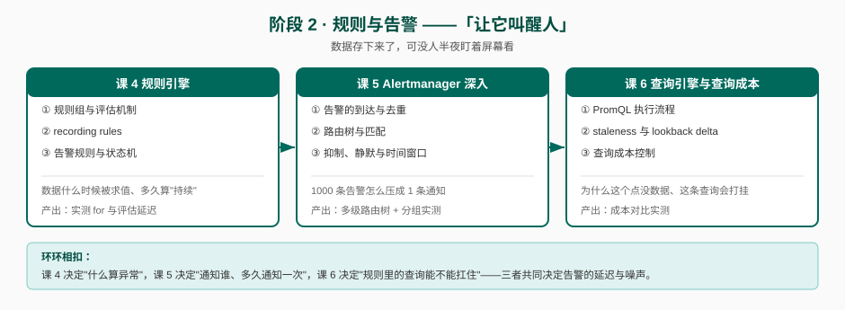

# 阶段 2：规则与告警

> 所属课程：Prometheus ｜ 故事章节：**"让它叫醒人"** —— 数据存下来了，可没人半夜盯着屏幕看 ｜ 上一阶段：[阶段 1 单机内核](../1-单机内核/overview.md)

## 🎯 本阶段目标

- 能解释规则组何时求值、`evaluation_interval` 到底控制什么、告警为什么会抖
- 能画出一条告警从规则 firing 到值班手机收到通知的完整时序，并指出每个环节引入的延迟
- 能说清一次 PromQL 查询在 Prometheus 内部是怎么执行的，以及为什么某些查询会把实例打挂

## 📍 学习重点

- **规则组评估机制**：`evaluation_interval` 不是"多久检查一次"那么简单——同一组内的规则串行求值、组间并行、求值偏移与 `evaluation_delay` 都会影响结果。理解这个才能解释"为什么告警晚了两分钟才来"和"为什么 recording rule 有时查不到值"。
- **Alertmanager 四件套**：分组（grouping）/ 抑制（inhibition）/ 静默（silence）/ 路由树（route tree）。这是把 1000 条告警压成 1 条通知的机制，也是"告警风暴"和"该响的不响"的根源。
- **查询引擎与 staleness**：PromQL 的执行流程、staleness marker 机制、lookback delta。这一层直接决定了"为什么这个点没数据"和"为什么这个查询把内存打爆"两类高频问题的答案。

## ✅ 必须掌握的知识点

| 知识点 | 所属课 | 学完应能 |
|--------|--------|----------|
| 规则组与评估机制 | 课 4 | 说出规则组的加载、求值调度、串行/并行语义，解释 `evaluation_interval` 与抓取间隔的相互影响 |
| recording rules | 课 4 | 判断什么查询该固化成 recording rule，并说清固化后对查询延迟与数据新鲜度的双向影响 |
| 告警规则与状态机 | 课 4 | 画出 alert 的 Inactive → Pending → Firing → Inactive 状态机，说清 `for` 的真实语义与抖动的关系 |
| 告警的到达与去重 | 课 5 | 解释 Alertmanager 如何按 label set 做去重，以及 `group_by` 如何决定告警被打包成几条通知 |
| 路由树与匹配 | 课 5 | 独立写出多级路由树（含 matchers、continue、receiver），并预测一条给定 label 的告警会落到哪个 receiver |
| 抑制、静默与时间窗口 | 课 5 | 说清 `group_wait` / `group_interval` / `repeat_interval` 的交互，以及抑制与静默的适用差异 |
| PromQL 执行流程 | 课 6 | 描述一次查询的解析 → 求值 → 序列选取路径，解释选择器如何命中 series |
| staleness 与 lookback delta | 课 6 | 解释 stale marker 的插入时机与 5 分钟 lookback delta 的作用，说清"目标消失后查询返回空而非 0"的机制 |
| 查询成本控制 | 课 6 | 识别高成本查询模式（大范围选择器、高基数聚合、无界正则），并给出改写方向 |

## 🗺️ 本阶段路径图

## 本阶段产出

- [x] `lessons/lesson-04-规则引擎.md` — 2026-09-04 交付，双视角评审 P0=2→0 通过
- [x] `lessons/lesson-05-Alertmanager深入.md` — 2026-09-04 交付，双视角评审 P0=3→0 通过
- [x] `lessons/lesson-06-查询引擎与查询成本.md` — 2026-09-04 交付，双视角评审 P0=0 通过

## 📌 课 4 交付纪要

**状态**：✅ 已完成（2026-09-04）｜**评审**：pedagogy + learner 双视角，P0=2→0

**三个知识点的核心结论（均经本机 v3.14.0 实测）**：

1. **规则组与评估机制**：组是调度最小单位，组内**严格串行**、组间**完全并行**、组内共享同一求值时间戳。判据是「整组墙钟 `last_duration` ≈ 组内各规则耗时之和 `last_rule_duration_sum_seconds`」（实测差值 < 0.0002 秒）。规则求值读到的是**上次抓取**的数据，滞后 0~抓取间隔（实测 0.17~4.82 秒摆动），**缩短 `evaluation_interval` 无法消除**。
2. **recording rules**：产物在**求值时**生成而非加载时（新增后要等一个 `interval`，实测 reload 后立刻查返回 0 条、等 65 秒后返回 1 条）。**反直觉纠正**：直接查表达式**同样**是台阶状的（底层样本在抓取网格上离散），固化真正改变的是台阶的**更新频率**（抓取间隔 → 求值间隔）。
3. **告警规则与状态机**：`for` 卡的是 **Pending→Firing**（实测同一 `ratio1m=0.2514` 下 `for: 0s` 已 firing、`for: 20s` 仍 pending，且 Pending 期间 Alertmanager 完全不知情）；`keep_firing_for` 卡的是 **Firing→Inactive**（实测配置 30s 多存活 28 秒）。抖动实测：150 秒振荡下 `for: 0s` 翻转 3 次、`for: 20s` 零次 firing。

**留给后续课的伏笔**：
- **课 5**：告警 firing 后推给 Alertmanager，去重 / 分组 / 抑制 / 静默 / 路由树全在那边，本课刻意绕开。
- **课 6**：本课只实测出"慢组是快组 5~7 倍耗时"，但**为什么贵、怎么量化、怎么写才便宜**未展开。
- **待精确归因**（课 6 回头看）：步骤 7 观察到 `ratio1m` 持续超阈值约 30 秒（> `for: 20s`）但 Critical 仍未 firing，疑似 recording rule 的 10 秒滞后 + 组求值间隔 10 秒叠加所致，本课未强行下结论。

**版本差异（已记入档案事实核查）**：v3.14.0 移除了单规则级指标 `prometheus_rule_last_evaluation_timestamp_seconds`（实测 0 条），只剩组级；`rule_group` 标签带文件前缀（`/etc/prometheus/rules.yml;<组名>`），须正则匹配。

---

## 📌 课 5 交付纪要

**状态**：✅ 已完成（2026-09-04）｜**评审**：pedagogy + learner 双视角，P0=3→0｜**命令复验**：从零重建环境逐字执行，16 项断言全 PASS

**三个知识点的核心结论（均经本机 v0.30.0 + v3.14.0 实测）**：

1. **告警的到达与去重（分组）**：N 条告警进、M 条通知出（M ≤ N）。`group_by` 决定分组粒度——同一批告警，`group_by=[alertname,zone]` 得 **2 条通知**（每区 1 条），`group_by=[alertname]` 得 **1 条通知**（`n_alerts=2`）。`group_wait` 是攒批窗口：错开 3 秒注入的两条告警，实测在 20 秒窗口内被合并（采样序列 `0,0,0,0,1,1,1,1`）。`repeat_interval`（内容未变，实测 ≈30s）与 `group_interval`（内容变化，实测 ≈10s）是本课最易混的一对。
2. **路由树与匹配**：**有序 + 命中即停，不是"最精确匹配"**。决定性对照：把通用 `team="payments"` 写在专用 `alertname=~"Node.*"` 前面时，同时匹配两者的 `NodeDown` **被通用路由吃掉**（infra 收到 0 条）；仅调换顺序即改道 infra（infra=1、payments=0）。`continue: true` 可一告警多发（实测同一条 `NodeDown` 同时发往 infra 与 payments）。
3. **抑制、静默与时间窗口**：抑制是**告警压告警**（自动、跟随源告警、**必须配 `equal`**）——实测 zone-a 节点宕机后，同 zone 的 `HighErrorRate` 在 `repeat_interval=30s` 本该重发的窗口内**保持沉默**（741s 发出 → 761s 节点宕机 → 30 秒无新增 → 791s 恢复后立刻补发）。静默是**人压告警**（手动、有 `startsAt`/`endsAt`）——实测 60 秒静默期内 0 条通知，到期立刻补发。

**三个实测发现（已写入讲义教学正文）**：
- **`commonLabels` 会"丢标签"**：分组含多条告警时只保留交集——含 1 条时有 `instance`/`zone`，含 2 条不同实例时这两个键**直接消失**。webhook 模板须遍历 `.Alerts`，不能用 `.CommonLabels.instance`。
- **已恢复告警会"搭车"发出**：实测 `endsAt=08:24:48` 的 resolved 告警在 08:26 才随下一批通知被带出。做分组/计数类实验前必须等上一轮告警完全恢复（约 20~25 秒），否则 `n_alerts` 会被污染。
- **告警延迟是多层叠加的**：注入 → 通知 ≈ `for`(5s) + 求值(5s) + `group_wait`(20s) ≈ **30 秒以上**。采样窗口必须覆盖这个量级，否则会误判"功能没生效"。

**留给后续课的伏笔**：
- **课 6**：课 5 规则用了 `rate(...)[10s]`，它**为什么贵、怎么量化、怎么写更便宜**未展开（课 4 亦埋此伏笔）。
- **阶段 3 课 8**：Alertmanager **多副本的 gossip 去重**（本课只跑单实例，多副本会带来"同一告警每副本各发一遍"的新问题）。
- **课程手册**：告警内容工程实践——`annotations` 该放什么、`runbook_url` 怎么配（本课只管"发给谁、发几条、何时发"）。

**环境要点（已记入档案）**：WSL 无 `jq`（改用 `python3 -c`）；分组三参数是 **route 级**字段（写 `global:` 会启动失败）；bind mount 配置不能 `docker cp`（须改源文件 + `kill -HUP 1`）；app 容器（python:3.12-slim）无 `wget`/`curl`（借 `l5-prom` 代发）。

---

## 📌 课 6 交付纪要

**状态**：✅ 已完成（2026-09-04）｜**评审**：pedagogy + learner 双视角，P0=0｜**命令复验**：从零重建环境逐字执行，步骤 1-4 共 **11 项断言全部 PASS**

**三个知识点的核心结论（均经本机 v3.14.0 实测）**：

1. **PromQL 执行流程**：四阶段（排队 → 准备 → 求值 → 排序）。成本公式 **成本 ≈ 命中序列数 × (时间窗 / step)**。决定性对照：序列数恒定 20000、只把 step 从 1s 放宽到 300s，点数 1,335,506→20,001、耗时 1293.5→194.4ms（**6.7 倍**）；反向序列数涨 2 万倍而点数相近时，耗时仅涨 1.75 倍。**主宰成本的是点数，不是序列数**（序列数真正杀的是内存）。
2. **staleness 与 lookback delta**：stale marker 仅在**抓取成功但序列不再出现**时插入（实测 `/kill` 后**恰好 Δ=5s = 一个抓取间隔**整条序列消失）；**抓取失败（500）不插** marker（设计意图：失败往往是暂时的）。lookback delta（默认 5m）**只向过去追溯、不能向未来延伸**——它填补采样空洞，不能延长数据寿命。**消失 = 空向量，不是 0**：`sum(x) < 1` 返回 `[]` 而非 `true`，必须用 `absent()` 或 `up == 0`。
3. **查询成本控制**：手段按有效性排序——**提前聚合**（recording rule 实测降 26%~56%，三组波动区间完全不重叠）> **加大 step**（可达 6.7 倍）> **缩短子查询窗口**（课 5 的 `[10s]` 是省的做法，改 `[30m]` 涨 23%）> 缩短 range（本实验量级下未观测到显著差异）> 改选择器写法（正则 vs 等值差异在噪声内）。

**实测推翻的三个预设（已写入讲义作为方法论素材）**：

- **「无界正则 `.*` 很贵」→ 推翻**：等值 126.2ms vs 无界正则 123.5ms，差异 2.7ms **远小于** 10ms 标准差；候选集从 100 涨到 20000（200 倍）耗时纹丝不动。贵的是**命中数**（`{__name__=~".+"}` 命中全库时约 3 倍），不是正则。
- **「lookback delta 让数据多活 5 分钟」→ 推翻**：实测 kill 后 5 秒就查不到。lookback **只向过去追溯**。
- **「recording rule 降本 60%」→ 首测为假数据**：规则未生效（产物 0 条），测的是"查询空指标"的开销。加**产物存在性校验** + **点数同量级校验**后才拿到可信数据。

**方法论沉淀（比知识点更重要，已写入讲义第五幕）**：

1. **先测噪声基线，再谈差异**——本机固定开销 120~190ms、噪声 ±27ms，小于此量的"优化效果"都是噪声。
2. **优化前后必须校验数据量级一致**——否则测的可能是空查询。
3. **对照实验先确认两组真的触发了不同代码路径**——第一版把"抓取失败"实现成"返回 200 但无序列"，导致 kill/break 表现一模一样（一个漂亮但错误的对照）。

**命令复验发现的新坑（已写入讲义「命令避坑·坑 5」）**：`wget --post-data` 用表单编码，**`+` 代表空格**，`.+` 会静默命中 0 条（实测 `.+`=0 条、`.%2B`=20809 条）。这是继课 2「花括号未 URL 编码」后**第二个同类传参坑**，区别在于它**不报错只返回空**，更易误判。

**留给后续课的伏笔**：

- **阶段 4 课 10**：序列数真正的杀伤力是内存（本课只点出边界，未展开）。
- **阶段 4 课 11**：head 与 block 的读取路径差异（课 2 埋、本课仍未展开）；`rate()` range 长度对成本的影响（本课数据量下未观测到显著差异，已标注"本实验条件下未观测到"）。
- **阶段 4 课 12**：慢查询的线上诊断流程（本课只给量化方法）。
- **仍挂账**：课 4 步骤 7 的未归因观察（`ratio1m` 超阈值约 30 秒仍不 firing），需复现课 4 环境才能精确归因。

**环境要点（已记入档案）**：课 6 容器 `l6-prom` / `l6-app`，网络 `lesson06-net`，宿主 **19094**（避开课 5 的 19090/19093）。`prometheus.yml` 含 `rule_files`（recording rule 实验依赖）。v3.14.0 的 `/api/v1/status/build_info` **已移除**（404），取版本改用启动日志或 `runtimeinfo`。
