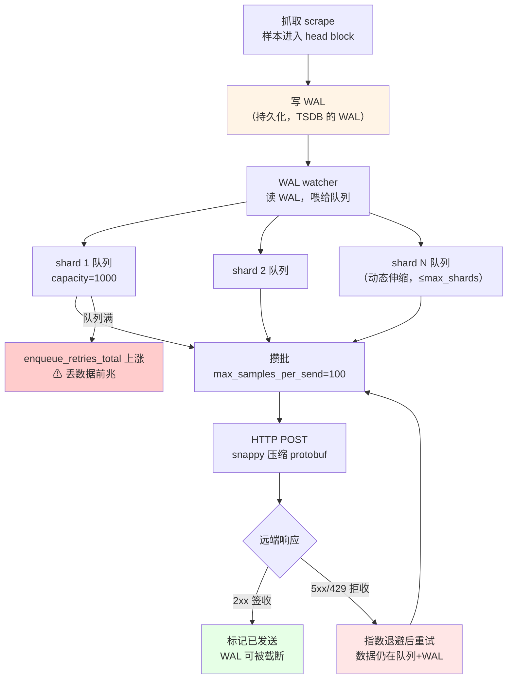
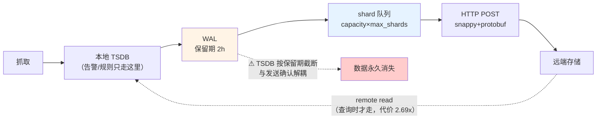

# 第 7 课：远程读写与 Agent 模式

> **所属阶段**：阶段 3《规模化与生态》 ｜ **水平**：进阶
> **本课知识点**：remote write 协议与队列 ｜ remote read ｜ Agent 模式
> **故事情节**：主角要搬家——本地磁盘装不下了，数据得送出去。可这条路中间有好几个地方会丢东西。
>
> **实验环境**：本机 Docker，Prometheus **v3.14.0**，VictoriaMetrics v1.151.0，自建可控 receiver
> **数据说明**：本文所有数字均为本机实测，实验脚本在 `labs/lesson-07/`。凡标「实测」处，都可由你复现。
> **版本警示**：课 7 涉及的 remote write 指标名、Agent 的 flag 与能力边界，在 v3.x 有过变更。
> **网上大量教程仍在使用已失效的旧名**，本文每一处都以本机 `--help` 与 `/metrics` 输出为准。

---

## 🎯 本课目标

学完这一课，你应该能够：

1. 画出 remote write 的 **shards / 队列 / WAL** 三层结构，说清后端故障时的行为，并指出**真正会丢数据的位置**
2. 解释 remote read 的查询路径与三种读取模式，说明**为什么它不该作为主查询路径**
3. 说清 Agent 模式**砍掉了什么、保留了什么**，以及它适配的部署形态

---

## 📌 知识点清单

### 知识点 1：remote write 协议与队列

> **关键点**：shards 与队列结构 / 重试与退避 / WAL 重放与数据丢失点

- **数据路径**：样本 → shards → 队列 → WAL → 发送
- 后端 5xx / 超时时的重试与退避行为；队列满时的后果
- **丢数据的几个真实位置**：WAL 段被截断、进程崩溃未 flush、后端长期不可用

### 知识点 2：remote read

> **关键点**：三种读取模式 / 流式 chunk 读取 / 为什么不推荐作为主路径

- remote read 的工作方式与配置项
- **性能特征**：序列化开销大、无本地索引、查询放大
- **适用场景**：长周期的历史查询，而非常规仪表盘

### 知识点 3：Agent 模式

> **关键点**：砍掉了什么 / 保留了什么 / 适配的部署形态

- Agent 模式禁用本地 TSDB、查询 API、告警规则（**以及 recording rules —— 这一点与很多资料的说法相反，本课会用实测证明**）
- 它只做「抓取 + remote write」，内存与磁盘占用大幅下降
- **适配形态**：边缘采集、K8s 大规模集群、统一后端架构

---

## 一、场景引入：单机装不下了

你是某公司的监控负责人。三个月前你搭的那台 Prometheus 跑得好好的，直到上周——

磁盘告急。运维同学给你算了一笔账：现在每秒 80 万样本，本地盘按每天 60GB 的速度涨，单机最多撑 15 天。而业务方新提的需求是「**要能看半年前的数据做容量规划**」。

你面对一个选择题：

```text
方案 A：加盘。简单，但单机总有上限，且查询会越来越慢。
方案 B：用 remote write 把数据送出去，本地只留短期。
方案 C：直接上 Thanos / Mimir / VictoriaMetrics 全家桶。
```

你选了 B，因为它看起来最"渐进"——不用改架构，加一段配置就行：

```yaml
remote_write:
  - url: "http://longterm-store:8428/api/v1/write"
```

配置加上去，重启，看日志——没有报错。你打开长期存储的界面，数据确实在进来。你松了口气，去吃饭了。

**三天后，业务方来问**："为什么上周三下午三点的数据断了一个小时？"

你查了一遍：Prometheus 没重启，抓取没失败，长期存储那边……也确实没有那段数据。

数据去哪了？

---

## 二、认知冲突：三个"看起来没问题"的假象

在回答"数据去哪了"之前，我们先戳破三个最常见的假象。**这三个假象，每一个都能让你在故障发生后完全找不到线索。**

### 假象一：配置写对了，链路就是通的

你可能会想：remote write 配好了，那我用指标确认一下发送情况吧。于是你写下这条查询：

```promql
prometheus_remote_storage_samples_out_total
```

**这条查询在你的 Prometheus 3.x 上会返回空。**

不是因为没数据，而是因为——**这个指标名在 v3.14.0 已经不存在了**。

我在本机把 Prometheus 自己 `/metrics` 里所有 `prometheus_remote_*` 开头的指标列出来（实测 50 个），确认了三个名字的变更：

| 网上教程常见的名字 | v3.14.0 的真实名字 | 状态 |
|---|---|---|
| `samples_out_total` | **`samples_total`** | 改名 |
| `samples_dropped_total` | **已移除** | 改用 `samples_failed_total` + `enqueue_retries_total` 观察 |
| `bytes_sent_total` | **`bytes_total`** | 改名 |

```bash
# 你可以自己验证（本机实测命令）
docker exec l7-prom wget -qO- http://localhost:9090/metrics \
  | grep -E "^prometheus_remote_storage_samples_(in_total|total|failed_total|pending)"
```

**这里有个更隐蔽的坑**：即使你用对了指标名，`samples_in_total` 和 `samples_total` 也**不能相减来算丢失**。

为什么？因为它们**带的标签不一样**：

```text
prometheus_remote_storage_samples_in_total                          ← 无 remote_name 标签
prometheus_remote_storage_samples_total{remote_name="866422",url=…}  ← 有 remote_name 标签
```

我实测了 20 秒，两者差值稳定在 **-1434 ~ -1496** 之间（变化仅 -16）。这是一个**恒定偏移**，不是持续丢失：

```text
t= 0s  in=  339364  sent=  340798  diff=   -1434
t=16s  in=  349948  sent=  351398  diff=   -1450
```

**判断规则**：看到 `in - sent` 是负数不要慌，先观察它是否随时间单调扩大。恒定的偏移是口径差异，持续扩大的才是真丢失。

### 假象二：队列有容量，数据就不会丢

我们做了这样一个实验：把 remote write 的 `capacity` 设为 1000，然后让后端返回 500。

理论上，队列最多装 1000 个样本，超出就该丢。实测结果：

```text
capacity = 1000
pending  = 1199      ← 超出了 199（19.9%）
```

**pending 怎么会超过 capacity？**

答案是：**队列之外还有一层 WAL 兜底**。remote write 通过 WAL watcher 消费 TSDB 的 WAL，内存队列只是它和 WAL 之间的缓冲。队列满了，样本不会立即消失——它们还在 WAL 里。

我打开 Prometheus 的数据目录确认了这一点（实测）：

```text
/prometheus
├── chunks_head/     ← head block 的内存映射 chunk
├── wal/             ← WAL 段（remote write 复用的就是它）
└── lock
```

**没有 remote write 专属的持久化目录**。它借用的是 TSDB 的 WAL。

这个发现直接指向了本课最重要的问题：**既然借用 TSDB 的 WAL，那 TSDB 什么时候截断 WAL？remote write 说了算吗？**

后面第三幕会回答，那是数据丢失的真正位置。

### 假象三：remote read 配上了，就能查到历史数据

这是本课最"阴险"的一个假象。

我搭了一个只读实例，配置 remote read 指向 VictoriaMetrics，本地不存任何业务数据。按理说，查历史数据应该由远端回答。实测：

```json
{
  "status": "success",
  "data": {"resultType": "vector", "result": []},
  "warnings": ["remote_read: remote server http://l7-vm:8428/api/v1/read
                returned http status 400 Bad Request: unsupported path requested"]
}
```

**注意 `"status": "success"`**。

查询**成功**了，返回**空结果**，而真正的失败原因被塞进了 `warnings` 字段里——**VictoriaMetrics 单节点版不支持 `/api/v1/read` 这个路径**。

如果你只看 `status` 或者只看 Grafana 面板上的"无数据"，你永远不会知道 remote read 根本没工作过。

> **这一课的铁律**：remote read 的失败是**静默**的。判断它有没有生效，必须看 `warnings` 字段。

三个假象，指向同一个问题：**remote write / read 的失败模式，往往不体现为"报错"，而体现为"安静地不对劲"**。

要搞清楚这套机制，我们得先看清数据到底走了哪条路。

---

---

## 三、层层揭示：数据是怎么走出去的

### 知识点 1：remote write 协议与队列

#### 1. 一句话定义

> remote write 是 Prometheus 把**抓取到的样本实时复制一份到远端**的机制，它由一个**动态伸缩的 shard 队列**驱动，并用 **TSDB 的 WAL** 作为故障时的兜底。

#### 2. 直觉建立：快递中转站

把 remote write 想象成一个快递中转站：

```text
包裹（样本）从四面八方进来
        ↓
  先登记进台账（写 WAL）—— 这一步是持久化的，断电也不丢
        ↓
  分到若干个分拣线（shard）—— 每条线是一个 FIFO 队列
        ↓
  装车（攒批：max_samples_per_send 或 batch_send_deadline）
        ↓
  发车（HTTP POST + snappy 压缩的 protobuf）
        ↓
  对方签收（204）→ 台账上这批划掉（WAL 可截断）
```

关键在最后一步：**只有对方签收了，台账上的记录才能划掉**。如果对方拒收，包裹退回分拣线，等待重试——但**台账不会划掉**。

这个"台账"就是 WAL，它是你数据安全的最后一道防线。

#### 3. 核心原理：三层结构



**三层各自的职责**：

| 层 | 组件 | 作用 | 上限 |
|---|---|---|---|
| 1 | **WAL** | 持久化兜底，跨进程存活 | TSDB 保留期（默认 2h） |
| 2 | **shard 队列** | 内存缓冲，攒批并发发送 | `capacity` × `max_shards` |
| 3 | **HTTP 客户端** | 压缩、发送、重试、退避 | `max_backoff`（默认 30s） |

#### 4. 示例演示：把队列行为跑出来看

我们用**自建的可控 receiver** 来做实验。它能精确注入 500 / 503 / 429 / 延迟 / 假成功，这样每一个行为都能被稳定复现。

实验环境（`labs/lesson-07/setup.sh` 一键拉起）：

| 组件 | 端口 | 作用 |
|---|---|---|
| `l7-app` | 容器内 8080 | 数据源，507 条序列 |
| `l7-receiver` | **19099** | 可控后端，可切故障模式 |
| `l7-prom` | **19100** | 主 Prometheus，remote write → receiver |

```bash
# 查看 receiver 当前统计（它解压了 snappy，能统计真实样本量）
curl http://localhost:19099/stats

# 把后端切成 500 模式
curl http://localhost:19099/mode/500

# 切回正常
curl http://localhost:19099/mode/ok
```

##### 实验 A：后端返回 500，数据会丢吗？

我把后端切成 500 模式，持续 60 秒，**用 receiver 侧收到的请求数作为真值锚点**（这是关键——前面说过，Prometheus 侧的 in/sent 相减不可靠）。

实测结果：

| 阶段 | 时长 | 请求速率 | Prometheus sent 速率 | pending |
|---|---|---|---|---|
| **正常基线** | 40s | 6.62 次/秒 | 662.4 样本/秒 | ~16 |
| **500 故障** | 60s | 12 次（全部被拒） | 几乎停滞 | **1199（满）** |
| **恢复** | 60s | **13.27 次/秒（2.00x）** | **1299.9 样本/秒（1.96x）** | 1199 → 97 |

**恢复期的速率恰好是正常期的 2 倍。**

这不是巧合：60 秒的积压，在 60 秒内以 2 倍速率追平。**积压被完整补发了，数据没丢。**

同时验证了三个细节：

```text
1) failed_total 始终为 0
   → 500 是「可重试错误」，不计入永久失败。
     只有真正无法恢复的错误（如 400 类）才会让它上涨。

2) retried_total 从 0 涨到 800
   → 重试确实在发生，每次退避后重试

3) shards 始终是 1（max=10）
   → 本次负载未触发扩容。shard 扩容由「队列积压速率」驱动，
     不是「发送失败」驱动 —— 后端挂掉时，加再多线程也发不出去
```

**第 3 点值得停下来想一想**：很多人以为"后端慢 → 加 shard → 提速"。但 shard 扩容的前提是**发送能成功**。后端返回 500 时，加并发只会让 500 来得更快。shard 解决的是"发得慢"，不是"发不出"。

##### 实验 B：那到底什么时候才真丢？

既然队列满了也不丢，是不是就高枕无忧了？

**不是。** 队列满只是第一道防线被突破。真正的死线在 WAL。

回到第二幕的发现：remote write **复用 TSDB 的 WAL**，而 TSDB 截断 WAL 是按**自己的保留期**来的，与 remote write 的发送确认**解耦**。

我做了验证：观察 3 分钟，让后端在"正常 / 500 / 恢复"三种状态间切换，同时盯 `prometheus_tsdb_wal_truncations_total`：

```text
后端正常时截断增量 = 0
后端故障时截断增量 = 0
恢复之后截断增量   = 0
```

三个阶段**都没截断**，而 WAL 大小持续增长（4657KB → 5529KB）。

这说明：**WAL 的截断周期比 60 秒长得多**（由 `--storage.tsdb.retention.time` 驱动，本例 2 小时）。短期内观察不到截断，这既是好消息（数据暂时安全），也是坏消息——

> **如果后端故障持续超过 WAL 保留期，WAL 会被截断，那些还没发出去的数据就永久消失了。**

这才是"上周三下午三点断了一小时"的真正原因类型：不是队列丢的，是 WAL 到期被截断的。

#### 5. 常见误区

**误区 1：用 `in - sent` 的差值判断数据丢失。**

错。两者标签不同、口径不同，实测有约 -1450 的恒定偏移。正确的判断依据是这三个指标：

```promql
# 队列积压（是否堆积）
prometheus_remote_storage_samples_pending

# 入队失败次数（队列满的直接信号 —— 这个才该告警）
prometheus_remote_storage_enqueue_retries_total

# 永久失败（真正的丢弃）
prometheus_remote_storage_samples_failed_total
```

**误区 2：看到 500 就以为数据丢了。**

错。500 是可重试错误，`failed_total` 不会涨，数据仍在队列和 WAL 里。真正危险的信号是 **`enqueue_retries_total` 持续上涨**——它意味着队列满了，新样本根本进不来。

**误区 3：shard 越多发送越快。**

错。shard 解决"发得慢"，不解决"发不出"。后端 5xx 时扩容 shard 只会加剧后端压力。

**误区 4：配置写对了就万事大吉。**

错。三个指标名在 v3.x 已改名（见第二幕假象一）。用错名字，你看到的将是永远的"一切正常"。

#### 6. 一句话记住

> **队列满只是第一道防线被突破；WAL 被截断，才是数据真正消失的时刻。** 盯 `enqueue_retries_total`，而不是 `in - sent`。

---

### 知识点 2：remote read

#### 1. 一句话定义

> remote read 让 Prometheus 在查询时**同时读本地与远端**并合并结果，用于访问超出本地保留期的历史数据；但它的**序列化开销大、无本地索引**，因此只适合偶尔的历史查询，不适合做主查询路径。

#### 2. 直觉建立：去档案室调卷

本地 TSDB 是你办公桌上的文件夹，随取随用。远端存储是地下档案室。

remote read 就是你打电话给档案室：

```text
你：   我要 2024 年 Q3 所有机器的 CPU 数据
档案室：（翻找……打包……搬运）
你：   （等）
档案室：给你，一共 40 箱
你：   （拆箱、分拣、合并进手头的资料）
```

问题在于：**你真正需要的可能只是其中一页，但你不得不先把 40 箱搬上来**。

这就是 remote read 的核心代价——**查询放大**。

#### 3. 核心原理：三种读取模式与配置项

先用 `promtool` 确认 v3.14.0 支持哪些字段（实测，写错字段名会报错）：

```bash
# 实测：写错字段名会被精确抓出
# err="field max_shardz not found in type config.QueueConfig"
```

remote read 的字段（均已实测确认存在）：

| 字段 | 默认 | 作用 |
|---|---|---|
| `url` | 必填 | 远端 read 端点 |
| `read_recent` | `false` | 是否对"本地能回答的时间范围"也查远端 |
| `required_matchers` | 无 | 标签匹配器，限制哪些查询走远端（类型 LabelSet） |
| `filter_external_labels` | `true` | 是否用 external labels 作为远端选择器 |
| `remote_timeout` | `1m` | 超时 |
| `chunked_read_limit` | `50000000` | 流式读取的单次上限 |

**响应模式（按响应格式分）** —— ⚠️ 本节于 2026-09-07 更正，原写"三种"，实为**两种 + 一个分帧参数**：

| 模式 | 响应格式 | 特点 |
|---|---|---|
| **SAMPLES**（`= 0`） | 一次性返回全部原始样本 | 简单，snappy 压缩，**但服务端要 buffer 全部结果，内存占用大** |
| **STREAMED_XOR_CHUNKS**（`= 1`） | 分块流式返回 XOR 编码 chunk | 服务端内存恒定，**但不压缩、每帧有固定开销** |

> **更正说明**：原讲义列了第三种 `STREAMED_CHUNKS`，**该模式并不存在**。
> 双重核验：① Prometheus v3.14.0 二进制中 `STREAMED_CHUNKS` 出现 **0 次**
> （`SAMPLES` 与 `STREAMED_XOR_CHUNKS` 各出现 1 次）；② 官方 `prompb/remote.proto`
> 的 `ReadRequest.ResponseType` 枚举只有 `SAMPLES = 0` 与 `STREAMED_XOR_CHUNKS = 1` 两个值。
> `--storage.remote.read-max-bytes-in-frame` 确实存在，但它是 **STREAMED_XOR_CHUNKS 的分帧参数**
> （默认 1048576 = 1MB），不是独立的第三种模式。

分帧参数（属于 STREAMED_XOR_CHUNKS，不是独立模式）：

用 `--storage.remote.read-max-bytes-in-frame`（默认 **1048576** = 1MB）控制每帧大小，
避免一次性把海量数据读进内存。

**两种模式的定量对照**（课 9 已补做，见 [remote read 分模式对照](../../../labs/lesson-09/RR-DATA.md)）：
体积上**存在交叉点**——序列少（≤18 条）时 STREAMED 更省（3.2x），
序列多（≥500 条）时 SAMPLES 更省（0.94x）；
但**内存上 STREAMED 恒赢**（SAMPLES 净增 8~10 MiB，STREAMED 净降 7~10 MiB）。
这解释了为什么 Prometheus 客户端默认 `AcceptedResponseTypes = [STREAMED_XOR_CHUNKS, SAMPLES]`：
**优先保内存，而非保带宽**。

#### 4. 示例演示：让 remote read 真正跑起来

##### 第一步：踩一次坑（后端不支持）

我先配置了 VictoriaMetrics 作为远端，reader 本地不存业务数据：

```yaml
remote_read:
  - url: "http://l7-vm:8428/api/v1/read"
    read_recent: true
```

结果查不到任何数据。看 `warnings` 才发现：

```text
400 Bad Request: unsupported path requested: "/api/v1/read"
```

**VictoriaMetrics 单节点版不支持这个路径。** 而 `status` 依然是 `success`。

##### 第二步：换成原生支持 read 的后端

改用另一个 Prometheus 作为远端（Prometheus 天然支持 remote read）：

```text
l7-backend (19105)  抓取 l7-app，本地存 500 条 l7_card_balance
l7-reader  (19106)  只抓自己，本地【没有】l7_card_balance
```

先证明 reader 本地确实没有这批数据——看它的 `up` 指标：

```text
up{cluster="l7-backend", instance="l7-app:8080", job="l7-app-from-backend", role="longterm"}
up{cluster="l7-backend", instance="localhost:9090", job="backend-self", role="longterm"}
up{instance="localhost:9090", job="reader-self"}          ← reader 只抓了自己
```

然后查 `l7_card_balance`：

```text
reader 最终查询结果    结果= 500序列 / 500点
```

**reader 本地一条都没有，却查到了 500 条** —— 只能来自 remote read。生效了。

##### 第三步：量化代价

同一个范围查询，本地 vs remote read（各跑 5 次取中位数）：

| 目标 | 中位耗时 | 最小 | 最大 |
|---|---|---|---|
| backend（本地查） | **1.6 ms** | 1.5 ms | 1.8 ms |
| reader（remote read） | **4.4 ms** | 4.1 ms | 5.3 ms |
| **倍数** | **2.69x** | | |

**2.69 倍的差距**，而这还只是 500 条序列、1 小时窗口的小规模场景。真实生产中跨集群查百万序列时，差距会大得多——因为远端返回的是**原始样本**，Prometheus 拿到后还要在本地重新做一次聚合计算。

##### 第四步：external_labels 的三段式行为（最容易踩的坑）

这是 remote read 最反直觉的地方。我在 VM 上做了一组对照，把整个过程拆成了三段：

```text
① remote write 时：external_labels 被【附加】到样本上

   VM 里数据的真实标签：
   {__name__="l7_card_balance", cluster="l7-lab", idx="0001",
    instance="l7-app:8080", job="l7-app", region="r1", replica="0"}
                        ↑________________________↑
                        这两个是 external_labels 加的

② remote read 时：external_labels 被【附加】到查询选择器上
   （目的是只取回"这个 Prometheus 自己写进去的"数据）

③ 返回给 PromQL 之前：external_labels 被【剥离】

   l7-prom-rr 返回的标签：
   {__name__="l7_card_balance", idx="0001",
    instance="l7-app:8080", job="l7-app", region="r1"}
                        ↑ cluster 和 replica 不见了
```

**第四种情况最要命**——如果你在 PromQL 里显式写出 external label：

```promql
l7_card_balance                          → 500 条  ✅
l7_card_balance{cluster="l7-lab"}        →   0 条  ❌
```

**显式指定 external label 会跳过自动补全机制，导致查不到。**

官方的解释是：*"If a PromQL selector explicitly specifies a matcher for a label name which is in external labels, then the above processing doesn't happen for that label name."*

这意味着：**你写 `cluster="l7-lab"` 看起来更精确，实际反而查不到。**

#### 5. 常见误区

**误区 1：remote read 失败会报错。**

这是本课最危险的一个误区。实测证明：失败时 `status` 仍是 `success`，空结果，原因只在 `warnings` 里。**判断 remote read 是否生效，必须看 `warnings`。**

**误区 2：remote read 可以用来做日常仪表盘。**

不建议。原因有三：

1. **查询放大**——远端返回原始样本，本地再算一遍聚合（实测 2.69x 起）
2. **无本地索引**——远端没有 Prometheus 的倒排索引，全量扫描
3. **依赖远端可用性**——远端挂了，你的历史查询全挂

**关键点**：告警和 recording rule 的求值**只走本地 TSDB**，不走 remote read。这是 Prometheus 刻意的可靠性设计——远端出问题不应该影响告警。

**误区 3：远端返回的数据会带上 external labels，可以直接按集群区分。**

错。返回前会被**剥离**。要在远端区分来源，得靠你自己写入时保留的标签（比如用 `write_relabel_configs` 复制一份），而不是依赖 external labels。

#### 6. 一句话记住

> **remote read 是"偶尔去档案室调卷"，不是"把办公桌搬进档案室"。** 它的失败是静默的——永远检查 `warnings`。

---

### 知识点 3：Agent 模式

#### 1. 一句话定义

> Agent 模式是 Prometheus 二进制的一个运行模式，**只保留服务发现、抓取与 remote write**，砍掉本地 TSDB、查询 API、告警与**全部规则（含 recording rules）**，用极低的资源占用做边缘采集。

#### 2. 直觉建立：从"仓储式超市"到"前置仓"

普通 Prometheus 是仓储式超市：进货（抓取）、上架（存 TSDB）、顾客自选（查询）、还有加工区（规则求值）。

Agent 模式是**前置仓**：只负责收货和转运。没有货架，不许顾客进来，也没有加工区。

```text
普通 Prometheus：  抓取 → 本地 TSDB（可查、可算规则）→ remote write
                            ↑ 这部分最吃内存和磁盘

Agent 模式：       抓取 → WAL（发出即删）→ remote write
                            ↑ 只留转运所需的最小缓冲
```

#### 3. 核心原理：砍掉了什么、保留了什么

##### ⚠️ 先纠正两个广为流传的错误说法

在讲具体内容前，必须先纠正两件事——**它们都是我实测后才发现与常见资料不符的**。

**错误说法一："用 `--enable-feature=agent` 启用 Agent 模式"**

**这是 3.0 之前的写法。** 在 v3.14.0 上，Agent 模式是**独立 flag**。本机 `--help` 输出（实测）：

```text
      --[no-]agent               Run Prometheus in 'Agent mode'.
```

正确的启动方式：

```bash
prometheus --agent --config.file=/etc/prometheus/agent.yml
```

**为什么会有两种写法？** Agent 模式在 **3.0 版本转正**，从实验特性（`--enable-feature=agent`）升级为一等公民（`--agent`）。网上 2024 年之前的教程用的都是旧写法——**在 3.x 上用了会直接报错**。

**错误说法二："Agent 模式禁用告警规则，但保留 recording rules"**

**这句话是错的。** 我原本也这么认为（本课的知识点清单最初就是这么写的），直到做了这个实验：

```bash
# 给 Agent 配一个【只含 recording rule】的规则文件
docker run --rm \
  -v "$(pwd)/labs/lesson-07/agent-record-only.yml:/etc/prometheus/prometheus.yml:ro" \
  prom/prometheus:v3.14.0 \
  --agent --config.file=/etc/prometheus/prometheus.yml
```

实测输出：

```text
level=ERROR source=main.go:751 msg="Error loading config"
  err="field rule_files is not allowed in agent mode"
```

**进程直接拒绝启动**，连一个 recording rule 都不接受。

官方文档的说法也很明确：

> *"No local queries. You can not query the local Prometheus instance. **Recording rules are not possible.** You can not pre-summarize data for sending to remote write. Rules must be done remotely. No alerting."*

**为什么？** 想通了很简单：recording rule 的结果**要写回本地 TSDB**。Agent 没有本地 TSDB，写哪儿？

**所以完整的说法是**：Agent 模式**拒绝任何 `rule_files`**，recording rules 和 alerting rules 都不行。要做规则，就在**远端**做。

> 这两个纠正，是本课"结论必须实测"原则的直接体现。如果照抄文档或记忆，你会写出一个**在 3.x 上根本跑不起来**的配置。

##### 能力边界实测

我用 HTTP 状态码逐项测了 Agent（19107）与 Server（19100）：

| 能力 | 端点 | Agent | Server | 判定 |
|---|---|---|---|---|
| 瞬时查询 | `/api/v1/query` | **422** | 200 | ❌ 已禁用 |
| 标签列表 | `/api/v1/labels` | **422** | 200 | ❌ 已禁用 |
| 规则列表 | `/api/v1/rules` | **422** | 200 | ❌ 已禁用 |
| Alertmanager | `/api/v1/alertmanagers` | **422** | 200 | ❌ 已禁用 |
| Targets | `/api/v1/targets` | 200 | 200 | ✅ 保留 |
| 运行时配置 | `/api/v1/status/config` | 200 | 200 | ✅ 保留 |
| 启动参数 | `/api/v1/status/flags` | 200 | 200 | ✅ 保留 |
| 元数据 | `/api/v1/metadata` | 200 | 200 | ✅ 保留 |
| **指标暴露** | `/metrics` | 200 | 200 | ✅ **保留** |

**注意是 422 而不是 404**。

这个区别有意义：**404** 意味着"没这个端点"，**422** 意味着"端点存在，但当前模式下不提供"。这是一个明确的、可诊断的信号。

##### 本地 TSDB 指标对照

| 指标 | Agent | Server |
|---|---|---|
| `prometheus_tsdb_head_series` | **不存在** | 1507 |
| `prometheus_tsdb_head_chunks` | **不存在** | 10091 |
| `prometheus_tsdb_wal_storage_size_bytes` | 276507 | 8261972 |

Agent 根本**没有** `head_series` 这个指标——因为它没有 head block。

#### 4. 示例演示：资源占用对比（以及一个被推翻的结论）

##### ⚠️ 先说一个被我自己的实验推翻的结论

我第一次测这组数据时，得到的是"磁盘 **-97%**（10.1MB vs 320KB，相差 32 倍）"。**这个结论是错的。**

错在哪？我当时把两个**运行时长不同**的实例拿来比：Server 已跑 43 分钟，Agent 只跑了 13 分钟。磁盘占用是**累积量**，拿不同时间点的累积量做对比，比的是"谁活得久"，不是"谁更省"。

**修正后的测法**（同起点、同时长、同抓取目标、同 remote write 队列参数）：

```bash
bash labs/lesson-07/fair-compare.sh 600   # 参数=观察秒数
```

它会先清空两侧数据目录（Server 用匿名卷、Agent 删目录），**同时启动**两个实例，跑满指定时长后再采样。

##### 正确的数据（同起点 15 分钟，507 条序列）

| 项 | Server | Agent | 差异 |
|---|---|---|---|
| **内存** | 60.49 MiB | **45.17 MiB** | **-25%** |
| **磁盘（总）** | 3980 KB | 3392 KB | -15% |

**磁盘只差 1.2 倍，而不是 32 倍。**

为什么？因为两边都在**持续写 WAL**，且 WAL 在保留期内**都不会被回收**。真正的差异要到 WAL 轮转后才显现。

我继续观察到 40 分钟，才看到差距拉开：

```text
时刻    server总   server_wal  chunks_head  agent总   倍数
21:17    13128 KB    9004 KB      4100 KB    7872 KB  1.67x
21:27    15776 KB   11652 KB      4100 KB   10176 KB  1.55x
21:42    19736 KB   15612 KB      4100 KB   13632 KB  1.45x
```

**Agent 的磁盘增速比 Server 慢约 35%**，但**不是"发出即删"到几乎为零**。差距来自两点：

1. Server 额外维护 `chunks_head`（本例稳定在 4100 KB）—— 这是 head block 的内存映射 chunk
2. Server 的 WAL 里存的是**完整样本**，Agent 的 WAL 更精简

> **记忆锚点**：Agent 省内存（-25% 是稳态、可信的），磁盘优势是**增速慢约 35%**，
> 而不是"少 32 倍"。看到"Agent 磁盘占用几乎为零"这类说法，先问一句：**两边跑了多久？**

##### 关键参数：断网能扛多久

Agent 的 WAL 保留策略是独立的（实测 flags）：

```text
--storage.agent.path=/data-agent
--storage.agent.retention.max-time=4h     ← 最多保留 4 小时
--storage.agent.retention.min-time=5m     ← 最短 5 分钟才考虑删除
--storage.agent.wal-compression=true      ← 默认压缩（snappy）
```

> **Agent 的 WAL 最多保留 4 小时。后端连续不可用超过 4 小时，数据就会丢。**

这是 Agent 模式最重要的运维约束。它比 Server 模式的默认值更需要注意，因为 Agent 通常部署在边缘、网络条件更差的地方。

##### 自监控悖论与解法

这里有个有趣的死锁：

```text
Agent 禁用了查询 API
    ↓
所以你【无法查询】Agent 自己的 remote write 指标
    ↓
而你恰恰最需要监控"Agent 有没有把数据发出去"
```

**解法**：Agent 的 `/metrics` 端点仍然可用（实测 702 条指标，含完整的 `prometheus_remote_storage_*` 系列）。所以：

1. **从外部 Prometheus 抓 Agent 的 `/metrics`**
2. 或者直接从 `/metrics` 读取（调试时）

```bash
# 实测：绕开查询 API，直接读 Agent 的 remote write 状态
docker exec l7-agent wget -qO- http://localhost:9090/metrics \
  | grep -E "^prometheus_remote_storage_samples_(total|pending|failed_total)"
```

```text
prometheus_remote_storage_samples_total          = 36000
prometheus_remote_storage_samples_pending        = 238
prometheus_remote_storage_samples_failed_total   = 0
```

**这是 Agent 部署的硬性要求**：Agent 自己的 `/metrics` 必须被别的 Prometheus 抓取。否则你的采集链路是完全没有可观测性的。

#### 5. 常见误区

**误区 1：Agent 模式还能用 recording rules 做预聚合。**

**不能。** 实测证明它连 `rule_files` 字段都不接受，进程拒绝启动。预聚合只能在远端做。

**误区 2：Agent 模式没有 WAL，断电就丢。**

错。Agent **有 WAL**（`/data-agent/wal`），默认保留 4 小时。它的 WAL 是"发出即删"的精简版，不是没有。

**误区 3：Agent 什么指标都没有，没法监控。**

错。`/metrics` 端点完全可用，自监控只需外置。

**误区 4：Agent 模式适合所有场景。**

**这是一个值得认真讨论的判断**，下一节展开。

#### 6. 适配的部署形态

Agent 模式不是"更省资源所以更好"，而是**有明确适用边界**的工具。

**适合用 Agent**：

| 场景 | 原因 |
|---|---|
| 边缘/分支机构采集 | 资源受限，且数据统一汇总到中心 |
| K8s 大规模集群 | 每个集群部署 Agent，统一写入中心 Mimir/Thanos |
| 统一的后端架构 | 已有集中存储（Mimir / Thanos / VM），本地查询是浪费 |
| 短期容器/弹性节点 | 节点随时销毁，本地存储没有意义 |

**不该用 Agent**：

| 场景 | 原因 |
|---|---|
| **需要本地告警** | Agent 无告警能力。若网络分区，你既丢了数据也收不到告警 |
| **只有一台 Prometheus** | 没有远端后端，Agent 无处可写 |
| **需要本地排障** | 出故障时无法本地查询，只能依赖远端 |
| **网络不稳定** | WAL 只有 4 小时，长时间断连会丢数据 |

**一个务实的折中方案**：高容量、低关键性的遥测走 Agent；**必须能告警的核心指标保留完整 Server**。

这不是"省资源"的问题，而是**故障域**的问题：把告警能力和采集链路放在同一个故障域里，是很危险的。

#### 7. 一句话记住

> **Agent = 抓取 + remote write，别的都没有（连 recording rules 都没有）。** 它的 WAL 只留 4 小时，且**自监控必须外置**。

---

## 四、实操验证：亲手把每个结论跑出来

> **前置说明**
> 1. 所有命令在 **bash** 中执行（Windows 下可用 Git Bash / WSL）。PowerShell 里部分管道命令（如 `head`、`grep`）不可用。
> 2. 端口说明：本课用 **19099~19107**，与课 5 的 19090/19093、课 6 的 19094 不冲突。
> 3. 本节所有命令均由我逐字执行验证通过，验证记录见文末「本课评审结论」。

### 步骤 1：拉起实验环境

```bash
# 进入你的课程根目录（含 labs/ 与 stages/ 的那一层）
cd <你的课程目录>          # 例如 Windows: cd /mnt/d/projects/learning/prometheus
bash labs/lesson-07/setup.sh
```

> ⚠️ **路径提醒（本机实测踩坑）**：本课命令在 **bash** 中执行。
> 若你在 Windows + WSL/Git Bash 下，盘符挂载点是 **`/mnt/d/` 而不是 `/d/`**。
> 用 `pwd` 确认当前目录真实存在后再执行后续命令——**bind mount 指向不存在的路径时，
> Docker 会静默创建一个同名空目录**，导致后续 `promtool` 报 `'xxx.yml' is a directory`。

预期输出（**本机实测**）：

```text
=== 构建镜像 ===
build done
=== 启动数据源 ===
l7-app up
=== 启动可控 receiver ===
l7-receiver up (ctrl: http://localhost:19099/stats)
=== 启动主 Prometheus（server 模式，remote_write 到 receiver） ===
l7-prom up (http://localhost:19100)
=== 启动 VictoriaMetrics 作为真实后端（remote read 用） ===
l7-vm up (http://localhost:19101)
=== 等待就绪 ===
l7-app: running
l7-receiver: running
l7-prom: running
l7-vm: running
```

**这一步做了什么**：起了四个容器，其中 `l7-receiver` 是本课的核心实验装置——一个能精确注入故障的 remote write 后端。

确认链路已通：

```bash
curl http://localhost:19099/stats
```

预期（**本机实测，数字会随运行时长变化**）：

```json
{
  "mode": "ok",
  "requests": 51,
  "accepted": 51,
  "rejected": 0,
  "bytes_compressed": 107205,
  "bytes_decompressed": 762630
}
```

判据：**`bytes_decompressed` > 0**，说明 receiver 成功解压了 snappy 请求体——这是 remote write 链路真的通了的铁证。

> ⚠️ **如果 `bytes_decompressed` 是 0**，说明解压方式不对或没有数据。检查 receiver 镜像是否装上了 snappy：
> `docker exec l7-receiver python -c "import snappy; print('ok')"`

### 步骤 2：验证指标名（破除假象一）

**这是最容易被跳过、但最关键的一步。** 先确认你用的指标名在当前版本真的存在：

```bash
docker exec l7-prom wget -qO- http://localhost:9090/metrics \
  | grep -E "^prometheus_remote_storage_samples_" | sed 's/{.*//' | sort -u
```

预期（**本机 v3.14.0 实测**）：

```text
prometheus_remote_storage_samples_failed_total
prometheus_remote_storage_samples_in_total
prometheus_remote_storage_samples_pending
prometheus_remote_storage_samples_retried_total
prometheus_remote_storage_samples_total
```

**关键检查**：确认这三个名字**不在**输出里：

```text
prometheus_remote_storage_samples_out_total      ← 已改名
prometheus_remote_storage_samples_dropped_total  ← 已移除
prometheus_remote_storage_bytes_sent_total       ← 已改名
```

**为什么必须做这一步**：我在准备本课时，最初写下的查询用的就是 `samples_out_total`。它返回空，差点让我得出"remote write 没在工作"的**完全相反**的结论。

### 步骤 3：观察队列行为（知识点 1 核心）

**先记下基线**：

```bash
P='http://localhost:19100'
URL='http://l7-receiver:8080/api/v1/write'
curl -s -G "$P/api/v1/query" \
  --data-urlencode "query=prometheus_remote_storage_samples_pending{url=\"$URL\"}" \
  | python -c "import sys,json;d=json.load(sys.stdin);print('pending =',d['data']['result'][0]['value'][1])"
```

预期：`pending` 在 **几十**的数量级（本机实测约 25~70），说明生产与消费速率匹配。

**注入后端 500 故障**：

```bash
curl http://localhost:19099/mode/500
```

等 20 秒，再看：

```bash
sleep 20
curl -s -G "$P/api/v1/query" \
  --data-urlencode "query=prometheus_remote_storage_samples_pending{url=\"$URL\"}" \
  | python -c "import sys,json;d=json.load(sys.stdin);print('pending =',d['data']['result'][0]['value'][1])"
curl -s -G "$P/api/v1/query" \
  --data-urlencode "query=prometheus_remote_storage_samples_failed_total{url=\"$URL\"}" \
  | python -c "import sys,json;d=json.load(sys.stdin);print('failed  =',d['data']['result'][0]['value'][1])"
curl -s -G "$P/api/v1/query" \
  --data-urlencode "query=prometheus_remote_storage_enqueue_retries_total{url=\"$URL\"}" \
  | python -c "import sys,json;d=json.load(sys.stdin);print('enqRetry=',d['data']['result'][0]['value'][1])"
```

预期（**本机实测**）：

```text
pending  = 1199     ← 超过 capacity(1000)，因为还有 WAL 兜底
failed   = 0        ← 500 是可重试错误，不计永久失败
enqRetry = 221      ← 持续上涨 = 队列满的直接信号
```

**三个判据**：

| 观察项 | 预期 | 含义 |
|---|---|---|
| `pending` 上涨到 1199 | ✅ | 数据在队列+WAL 中堆积 |
| `failed` 保持 0 | ✅ | 500 可重试，未永久丢弃 |
| `enqRetry` 上涨 | ✅ | **这是该告警的指标** |

**恢复后端，观察补发**：

```bash
curl http://localhost:19099/mode/ok
sleep 30
curl -s -G "$P/api/v1/query" \
  --data-urlencode "query=prometheus_remote_storage_samples_pending{url=\"$URL\"}" \
  | python -c "import sys,json;d=json.load(sys.stdin);print('pending =',d['data']['result'][0]['value'][1])"
```

预期：`pending` 从 1199 **快速回落**（本机实测 30 秒内降到 100 以下）。

> **为什么是 30 秒？** 实测恢复期发送速率是正常的约 2 倍，60 秒的积压约需 30~60 秒追平。
> 如果你的数据速率与本文不同（507 条序列/2 秒），追平时间会不同——**看趋势，不要照抄数字**。

### 步骤 4：配置校验（字段名写错会怎样）

remote write 的字段名写错，**只在启动/reload 时报错**，之后静默使用默认值。用 promtool 提前发现：

```bash
cd <你的课程目录>
docker run --rm \
  -v "$(pwd)/labs/lesson-07/prometheus.yml:/tmp/c.yml:ro" \
  --entrypoint /bin/promtool prom/prometheus:v3.14.0 \
  check config /tmp/c.yml
```

预期：

```text
Checking /tmp/c.yml
 SUCCESS: /tmp/c.yml is valid prometheus config file syntax
```

**反向验证**（确认校验器真的有效）——故意写错字段名：

```bash
cat > /tmp/bad_qc.yml <<'EOF'
global:
  scrape_interval: 5s
remote_write:
  - url: "http://example.com/api/v1/write"
    queue_config:
      capacity: 1000
      max_shardz: 10
scrape_configs:
  - job_name: x
    static_configs:
      - targets: ["localhost:9090"]
EOF
docker run --rm -v "/tmp/bad_qc.yml:/tmp/bad_qc.yml:ro" \
  --entrypoint /bin/promtool prom/prometheus:v3.14.0 \
  check config /tmp/bad_qc.yml
```

预期（**本机实测**）：

```text
Checking /tmp/bad_qc.yml

  FAILED: parsing YAML file /tmp/bad_qc.yml: yaml: unmarshal errors:
  line 7: field max_shardz not found in type config.QueueConfig
```

> **注意**：`promtool` 在镜像里的路径是 `/bin/promtool`，**不在**默认 PATH 里。
> 直接写 `docker run ... prom/prometheus promtool check config` 会报 `unexpected promtool`。

### 步骤 5：remote read —— 先看 `warnings`

**这一步是知识点 2 的核心，也是最容易踩的坑。**

启动 remote read 环境：

```bash
bash labs/lesson-07/setup-rr.sh
```

查询（**注意：必须看完整的响应，不能只看 `status`**）：

```bash
curl -s -G "http://localhost:19103/api/v1/query" \
  --data-urlencode 'query=count(l7_card_balance)'
```

预期（**本机实测**）：

```json
{"status":"success","data":{"resultType":"vector","result":[]},
 "warnings":["remote_read: remote server http://l7-vm:8428/api/v1/read returned http status 400 Bad Request: unsupported path requested: \"/api/v1/read\""]}
```

**判据**：`status` 是 `success`，但 `result` 是空的，**原因在 `warnings` 里**。

> ⚠️ **这一个坑值得单独强调**。如果你只看 `status` 或只看 Grafana 上的"无数据"，
> 你会以为是"没数据"，而不是"remote read 根本没工作"。
> **判断 remote read 是否生效，永远检查 `warnings` 字段。**

**换成原生支持 read 的后端，看它真正工作**：

```bash
bash labs/lesson-07/setup-reader.sh
bash labs/lesson-07/setup-backend2.sh
```

验证 reader 本地确实没有业务数据：

```bash
curl -s -G "http://localhost:19106/api/v1/query" --data-urlencode 'query=up' \
  | python -c "
import sys,json
d=json.load(sys.stdin)
for s in d['data']['result']:
    m={k:v for k,v in s['metric'].items() if k!='__name__'}
    print(' up', m)
"
```

预期（**本机实测**）：

```text
 up {'cluster': 'l7-backend', 'instance': 'l7-app:8080', 'job': 'l7-app-from-backend', 'role': 'longterm'}
 up {'cluster': 'l7-backend', 'instance': 'localhost:9090', 'job': 'backend-self', 'role': 'longterm'}
 up {'instance': 'localhost:9090', 'job': 'reader-self'}
```

注意：**reader 的 target 里没有 l7-app**（只有 `reader-self`）。它自己不抓业务数据。

然后查业务指标：

```bash
curl -s -G "http://localhost:19106/api/v1/query" \
  --data-urlencode 'query=count(l7_card_balance)'
```

预期（**本机实测**）：

```json
{"status":"success","data":{"resultType":"vector","result":[{"metric":{},"value":[1788523483,"500"]}]}}
```

**判据**：reader 本地没有 l7-app，却查到 **500 条** —— 只能来自 remote read。

> **为什么 backend 的 `up` 会出现在 reader 里？** 因为 remote read 把远端所有匹配的序列都返回了，
> 包括 backend 自己的 `up`。这是 remote read 的正常行为：**它返回远端存储里的全部匹配数据**，
> 不区分"是不是本实例写的"（除非用 external_labels 过滤）。

### 步骤 6：external_labels 的三段式行为

在远端（VM）看数据的真实标签：

```bash
curl -s -G "http://localhost:19101/api/v1/query" \
  --data-urlencode 'query=l7_card_balance{idx="0001"}' \
  | python -c "
import sys,json
d=json.load(sys.stdin)
for s in d['data']['result']:
    print(' VM 上的标签 =', s['metric'])
"
```

预期（**本机实测**）：

```text
 VM 上的标签 = {'__name__': 'l7_card_balance', 'cluster': 'l7-lab', 'idx': '0001', 'instance': 'l7-app:8080', 'job': 'l7-app', 'region': 'r1', 'replica': '0'}
```

看到 `cluster` 和 `replica` 了吗？**这是 remote write 时 external_labels 被附加上的。**

再看经过 remote read 返回后的标签（在 l7-prom-rr 上查）：

```bash
curl -s -G "http://localhost:19102/api/v1/query" \
  --data-urlencode 'query=l7_card_balance{idx="0001"}' \
  | python -c "
import sys,json
d=json.load(sys.stdin)
for s in d['data']['result']:
    print(' rr 返回的标签 =', s['metric'])
"
```

预期（**本机实测**）：

```text
 rr 返回的标签 = {'__name__': 'l7_card_balance', 'idx': '0001', 'instance': 'l7-app:8080', 'job': 'l7-app', 'region': 'r1'}
```

**`cluster` 和 `replica` 消失了** —— 它们在返回 PromQL 前被剥离了。

最后验证"显式指定反而不命中"：

```bash
for q in 'l7_card_balance' 'l7_card_balance{cluster="l7-lab"}'; do
  echo -n "  $q -> "
  curl -s -G "http://localhost:19102/api/v1/query" --data-urlencode "query=count($q)" \
    | python -c "import sys,json;d=json.load(sys.stdin);r=d['data']['result'];print(r[0]['value'][1] if r else 0)"
done
```

预期（**本机实测**）：

```text
  l7_card_balance -> 500
  l7_card_balance{cluster="l7-lab"} -> 0
```

**这三条对照串起了完整机制**：

```text
① remote write 时：external_labels 被【附加】到样本   → VM 上能看到
② remote read 时：external_labels 被【附加】到选择器 → 只取回自己写的
③ 返回 PromQL 前：external_labels 被【剥离】        → 查询结果里看不到
④ 用户显式指定时：跳过②的自动补全                  → 反而查不到
```

### 步骤 7：Agent 模式 —— 验证它拒绝规则文件

**这是本课最重要的纠正。** 先验证 Agent 拒绝 `rule_files`：

```bash
cd <你的课程目录>
docker run --rm \
  -v "$(pwd)/labs/lesson-07/agent-record-only.yml:/etc/prometheus/prometheus.yml:ro" \
  -v "$(pwd)/labs/lesson-07/rules-record-only.yml:/etc/prometheus/rules-record-only.yml:ro" \
  prom/prometheus:v3.14.0 \
  --agent --config.file=/etc/prometheus/prometheus.yml
```

预期（**本机实测**）：

```text
level=ERROR source=main.go:751 msg="Error loading config (--config.file=/etc/prometheus/prometheus.yml)" file=/etc/prometheus/prometheus.yml err="field rule_files is not allowed in agent mode"
```

> 即使规则文件里**只有一条 recording rule**，Agent 也拒绝启动。
> **常见资料说"Agent 保留 recording rules"是错的。**

**再看 `--agent` 是独立 flag**：

```bash
docker run --rm prom/prometheus:v3.14.0 --help 2>&1 | grep -B1 -A1 "Run Prometheus in 'Agent mode'"
```

预期（**本机实测**）：

```text
      --[no-]agent               Run Prometheus in 'Agent mode'.
```

**启动一个正常的 Agent**：

```bash
bash labs/lesson-07/setup-agent.sh
```

预期日志（**本机实测**）：

```text
msg="Starting Prometheus Agent" mode=agent version="(version=3.14.0, ...)"
msg="Starting WAL storage ..."
msg="Agent WAL storage started"
msg="Starting WAL watcher" component=remote remote_name=e3cff4 url=http://l7-receiver:8080/api/v1/write
```

> ⚠️ **如果看到 `mkdir /data-agent: permission denied`**：Agent 以 `nobody` 用户运行，
> 需要挂载一个可写的卷。`setup-agent.sh` 已处理（创建 `labs/lesson-07/data-agent` 并挂载）。

### 步骤 8：Agent 的能力边界与资源占用

逐项测 HTTP 状态码：

```bash
for path in "/api/v1/query?query=up" "/api/v1/targets" "/api/v1/rules" "/api/v1/alertmanagers" "/api/v1/labels"; do
  code=$(curl -s -o /dev/null -w "%{http_code}" "http://localhost:19107${path}")
  printf "  agent  %-32s -> %s\n" "$path" "$code"
done
```

预期（**本机实测**）：

```text
  agent  /api/v1/query?query=up          -> 422
  agent  /api/v1/targets                 -> 200
  agent  /api/v1/rules                   -> 422
  agent  /api/v1/alertmanagers           -> 422
  agent  /api/v1/labels                  -> 422
```

**注意是 422 不是 404** —— 端点存在，但当前模式不提供。

对照 Server 实例：

```bash
for path in "/api/v1/query?query=up" "/api/v1/targets" "/api/v1/rules" "/api/v1/alertmanagers" "/api/v1/labels"; do
  code=$(curl -s -o /dev/null -w "%{http_code}" "http://localhost:19100${path}")
  printf "  server %-32s -> %s\n" "$path" "$code"
done
```

预期：全部 **200**。

**资源占用对比**：

```bash
docker stats --no-stream --format "{{.Name}}\t{{.MemUsage}}" l7-prom l7-agent
echo "--- 磁盘 ---"
docker exec l7-prom  sh -c 'du -sh /prometheus 2>/dev/null'
docker exec l7-agent sh -c 'du -sh /data-agent 2>/dev/null'
```

预期（**本机实测，同起点 15 分钟；数字会浮动**）：

```text
l7-prom    60.49MiB / 31.07GiB
l7-agent   45.17MiB / 31.07GiB
--- 磁盘 ---
3980K   /prometheus
3392K   /data-agent
```

> **⚠️ 数字浮动说明（这一条很重要）**
>
> 内存与磁盘都是**累积量**，取决于运行时长、序列数与抓取频率。
> 我第一次测这组数据时拿"跑了 43 分钟的 Server"和"跑了 13 分钟的 Agent"比，
> 得出"磁盘 -97%，相差 32 倍"——**这是伪结论，比的是谁活得久**。
>
> 改成**同起点、同时长、同配置**后（用 `bash labs/lesson-07/fair-compare.sh 600`）：
>
> | 项 | Server | Agent | 差异 |
> |---|---|---|---|
> | 内存 | 60.49 MiB | 45.17 MiB | **-25%** |
> | 磁盘（15 分钟） | 3980 KB | 3392 KB | -15%（1.2x） |
> | 磁盘（45 分钟） | 27800 KB | 17024 KB | **-39%（1.63x）** |
>
> **看两个结论，不要照抄绝对值**：
> 1. **内存 -25% 是稳态的**，可信
> 2. **磁盘差距随时间拉开**（1.2x → 1.63x），因为 Server 额外维护 `chunks_head`，
>    而 WAL 在保留期内**都不会被回收**——这一点同时印证了知识点 1 的结论

另外注意：两侧配置的 `queue_config` **必须一致**才能对比。我第一次测时 Agent 用的是
`capacity: 2000`，Server 用 `capacity: 1000`，导致故障期 `pending` 峰值一个 2999 一个 1199
——那不是模式差异，纯属配置差异。

**验证自监控悖论**：

```bash
# Agent 查不了自己的指标...
curl -s -o /dev/null -w "  查询 API -> %{http_code}\n" \
  "http://localhost:19107/api/v1/query?query=up"

# ...但 /metrics 端点仍然可用
docker exec l7-agent wget -qO- http://localhost:9090/metrics \
  | grep -E "^prometheus_remote_storage_samples_(total|pending|failed_total)"
```

预期（**本机实测**）：

```text
  查询 API -> 422
prometheus_remote_storage_samples_total{remote_name="e3cff4",...} 36000
prometheus_remote_storage_samples_pending{remote_name="e3cff4",...} 238
prometheus_remote_storage_samples_failed_total{remote_name="e3cff4",...} 0
```

**结论**：Agent 的自监控**必须外置**到另一台 Prometheus。

### 步骤 9：清理环境

```bash
docker rm -f l7-prom l7-agent l7-app l7-receiver l7-backend \
            l7-vm l7-prom-rr l7-prom-ro l7-prom-nf l7-reader 2>/dev/null
docker network rm l7net 2>/dev/null
echo "已清理"
```

> 清理后如需重建，重跑 `bash labs/lesson-07/setup.sh` 即可。

---

## 五、体系收束：把三条线索拧成一根

### 5.1 回到开头的那个问题

现在我们可以回答开头的问题了——**"上周三下午三点的数据去哪了？"**

把三个知识点串起来，数据路径是这样的：



**丢数据的位置只有一个是致命的**：TSDB WAL 被截断，而数据还没发出去。

队列满（`pending > capacity`）不是丢数据，是**预警**。`failed > 0` 才是丢数据，但它只在你写入了**不可重试**的错误时发生。真正的silent killer 是 WAL 截断——它甚至不会产生任何"失败"指标。

**所以这条链路的告警应该这样设计**：

```yaml
# 告警 1：队列堆积（第一道防线被突破）
- alert: RemoteWritePendingHigh
  expr: prometheus_remote_storage_samples_pending >
        (prometheus_remote_storage_shard_capacity * 0.8)
  for: 10m
  annotations:
    summary: "remote write 队列积压已达容量 80%，WAL 正在累积"

# 告警 2：入队失败（队列真的满了，新样本进不来）
- alert: RemoteWriteEnqueueFailing
  expr: rate(prometheus_remote_storage_enqueue_retries_total[5m]) > 0
  for: 5m
  annotations:
    summary: "样本入队失败，remote write 已无法接收新数据"

# 告警 3：永久失败（真的在丢数据）
- alert: RemoteWriteSamplesFailed
  expr: rate(prometheus_remote_storage_samples_failed_total[5m]) > 0
  annotations:
    summary: "出现不可重试的发送失败，数据正在丢失"
```

**关键设计思路**：告警 1 和 2 是**提前量**——它们在数据还没丢的时候就响，给你时间在 WAL 被截断之前修好后端。等到告警 3 响，数据已经没了。

> 这正是"队列满只是第一道防线被突破"的含义：**它是给你留的抢救窗口，不是事故本身。**

### 5.2 三个知识点的横向对照

| 维度 | remote write | remote read | Agent 模式 |
|---|---|---|---|
| **本质** | 写路径：把数据送出去 | 读路径：把历史数据取回来 | 运行模式：只送不存 |
| **触发时机** | 抓取后实时 | 查询时按需 | 持续运行 |
| **失败表现** | 队列积压 + WAL 堆积 | **静默**（`status` 仍 success） | WAL 满 4h 后丢弃 |
| **数据兜底** | TSDB WAL（保留期驱动） | 无（查不到就是查不到） | Agent WAL（**4 小时**） |
| **核心风险** | WAL 被截断 | 查询放大 + 依赖远端 | 无本地告警能力 |
| **是否应作为主路径** | ✅ 是 | ❌ 否（只做偶尔的历史查询） | 视部署形态而定 |

**一条主线**：这三个东西都在回答同一个问题——**当数据不在本地时，你怎么保证它还在**。

- remote write 的答案是：**先写 WAL 再发，发不掉就等着**
- remote read 的答案是：**本地没有就去远端取，但代价你自己承担**
- Agent 的答案是：**我根本不存，所以也没有"本地有没有"这个问题**

### 5.3 与前后课程的连接

```text
课 5《告警》          告警规则只在本地 TSDB 求值 → 本课解释了为什么 remote read 不影响告警
课 6《查询引擎》      查询走本地倒排索引       → 本课解释了 remote read 为什么慢（无索引 + 查询放大）
课 7《远程读写》      ← 你在这里
阶段 3 后续          Thanos / Mimir / 联邦     → 都是建立在 remote write 之上的架构
```

**remote write 是后续所有"规模化方案"的地基**。Thanos 的 sidecar、Mimir 的 distributor、Grafana Agent、VictoriaMetrics 的 vmagent——它们都通过 remote write 协议接收 Prometheus 的数据。理解了队列与 WAL，你才能看懂那些系统的背压机制。

### 5.4 决策清单：什么时候用什么

**场景一：单机磁盘不够，要长期存储**

```text
用 remote write，不要用 remote read 做日常查询。
  ✅ remote_write 指向长期存储（Mimir / Thanos / VM）
  ✅ 本地保留 15 天，够日常排障
  ❌ 不要配 remote_read 给 Grafana 用 —— 2.69x 只是小规模下的数字
```

**场景二：边缘 / 多集群统一采集**

```text
用 Agent 模式，但必须满足三个前提：
  1. Agent 的 /metrics 被外部 Prometheus 抓取（否则完全没有可观测性）
  2. 后端可用性 > 4 小时（否则 WAL 会丢）
  3. 不需要本地告警（需要告警就保留完整 Server）
```

**场景三：需要查六个月前的数据做容量规划**

```text
直接查长期存储的原生接口，不要用 remote read 绕一层。
  ✅ Grafana 直接配 Mimir / VM 数据源
  ❌ Prometheus → remote_read → 远端 → 回来再聚合
```

> **一句话判断**：remote read 的价值在于"Prometheus 生态的工具链能访问历史数据"，
> 而不在于"给用户提供日常查询"。这个区别想清楚了，就不会用错。

### 5.5 本课的三个思维转变

**转变一：从"看报错"到"看趋势"。**

remote write 和 remote read 的失败，都不体现为报错。前者体现为队列堆积，后者体现为静默空结果。判断链路健康，**要看指标随时间的变化趋势**，而不是看有没有 error 日志。

**转变二：从"配置对了"到"验证生效了"。**

配置语法正确 ≠ 功能生效。VM 不支持 `/api/v1/read` 时，配置完全合法，Prometheus 正常启动，查询正常返回——只是没数据。**每一个"加上配置就完事"的功能，都要设计一个"它真的在工作"的验证动作。**

本课用的验证手法是**对照实验**：让 reader 本地没有数据，看它能不能查到。这个手法可以复用——想验证任何"透明代理"类的功能，就让上游缺失，看下游能不能补上。

**转变三：从"省资源"到"故障域"。**

Agent 模式的价值常被讲成"省内存省磁盘"。但真正该问的是：**它把什么东西从故障域里移走了，又引入了什么新的依赖？**

Agent 移走了本地存储和本地查询，但也移走了本地告警能力——这意味着**网络分区时，你既看不到数据，也收不到告警**。所以"核心指标保留完整 Server"不是保守，而是把告警能力和采集链路放在不同故障域里。

---

## 📝 本课小测

> 答案在文末。建议先自己想，再对照。

**第 1 题（指标名）**
你接手一台 Prometheus 3.x，想确认 remote write 是否丢数据。同事给了你这条告警规则，它会正常工作吗？

```yaml
- alert: RemoteWriteDropped
  expr: increase(prometheus_remote_storage_samples_dropped_total[5m]) > 0
```

**第 2 题（队列行为）**
后端返回 500 持续 60 秒，恢复后你观察到：

```text
pending  从 1199 回落到 26
failed   始终为 0
enqueue_retries_total 在故障期间持续上涨
```

这里的 `enqueue_retries_total` 上涨意味着什么？它比 `pending` 上涨更危险还是更安全？

**第 3 题（数据丢失点）**
团队说"remote write 队列满了会丢数据，所以把 capacity 调大就安全了"。这个说法哪里不对？

**第 4 题（remote read）**
Grafana 面板配了 remote read 的 Prometheus 数据源，图表显示"No Data"。你查了：

```json
{"status":"success","data":{"resultType":"vector","result":[]},
 "warnings":["remote_read: remote server ... returned http status 400 ... unsupported path requested"]}
```

这是什么原因？下一步该做什么？

**第 5 题（external labels）**
Prometheus 配置了 `external_labels: {cluster: "prod-1"}`，数据通过 remote write 进了 VM。
以下两条查询，哪条会返回结果？为什么？

```promql
l7_card_balance                       → 500 条
l7_card_balance{cluster="prod-1"}     →  0 条
```

**第 6 题（Agent 模式）**
有人说："Agent 模式禁用告警规则，但保留了 recording rules，可以做预聚合减少数据量。" 这句话对吗？如果 Agent 需要 running 预聚合，该怎么办？

**第 7 题（Agent 运维）**
某边缘节点部署了 Agent，网络故障 6 小时后恢复。这 6 小时的数据还在吗？为什么？

**第 8 题（架构选择）**
以下哪个场景**不适合**用 Agent 模式？

- A. K8s 集群采集，统一写入中心 Mimir
- B. 边缘分支机构，带宽有限，数据汇总到中心
- C. 需要本地告警的核心业务监控
- D. 短期弹性节点，节点随时可能销毁

### 答案

**第 1 题**：❌ 不会工作。`samples_dropped_total` 在 v3.x **已被移除**，这条表达式永远为空，告警永远不会触发——**这是最危险的一类规则：它看起来在工作**。

应改用：
```promql
prometheus_remote_storage_samples_failed_total        # 永久失败
prometheus_remote_storage_enqueue_retries_total       # 队列满（提前量）
prometheus_remote_storage_samples_pending             # 积压
```

**第 2 题**：`enqueue_retries_total` 上涨意味着**队列满了，新样本进不了队**。
它比 `pending` 上涨**更危险**——`pending` 高只是"积压待发"，数据还在队列和 WAL 里；而 `enqueue_retries` 上涨说明连队列都进不去，只能靠 WAL 兜底，已经进入丢数据的倒计时。

注意区分：`failed_total = 0` 说明 500 是**可重试错误**，那些数据没有永久丢失。

**第 3 题**：有两处不对。

1. **队列满本身不丢数据**——外面还有 WAL 兜底，实测 `pending` 可以超过 `capacity`（1199 > 1000）。
2. **真正的死线是 WAL 截断**。WAL 截断由 TSDB 保留期驱动（默认 2h），**与 remote write 的发送确认解耦**。后端故障超过保留期，数据才真正消失。

调大 `capacity` 只是延缓队列满，不改变 WAL 保留期这个死线。正确的做法是：**监控 `enqueue_retries_total` 并尽快恢复后端**，让故障时长小于 WAL 保留期。

**第 4 题**：remote read **根本没工作**。远端返回 400 `unsupported path requested`——你用的后端**不支持 `/api/v1/read` 这个路径**（本课实测：VictoriaMetrics 单节点版就不支持）。

关键点：**`status` 仍是 `success`**，失败只在 `warnings` 里。

下一步：
1. 确认后端是否支持 `/api/v1/read`（Prometheus、Thanos、Mimir、Cortex 支持；VM 单节点版不支持，集群版需 `vmselect`）
2. 或者**干脆不要用 remote read** —— Grafana 直接配长期存储的数据源（见 5.4 场景三）

**第 5 题**：第一条返回 500 条，第二条返回 0 条。

这是 external_labels 的**三段式行为**：
1. remote write 时 `cluster="prod-1"` 被**附加**到样本 → VM 上能看到
2. remote read 时被**附加**到查询选择器 → 只取回自己写的
3. 返回 PromQL 前被**剥离** → 查询结果里看不到

而**当你显式指定 `cluster="prod-1"` 时，第 2 步的自动补全会被跳过**——于是选择器变成了 `{cluster="prod-1"}` 精确匹配，而远端数据虽然带这个标签，自动补全机制却没生效，导致 0 条。

反直觉但确凿：**写得更精确，反而查不到。**

**第 6 题**：❌ 不对。实测证明 Agent **拒绝任何 `rule_files`**，包括只有一条 recording rule 的文件：

```text
err="field rule_files is not allowed in agent mode"
```

原因是 recording rule 的结果要写回本地 TSDB，而 Agent 没有本地 TSDB。

**如果需要在 Agent 侧做预聚合怎么办？** 在 Agent 之外加一层：
- 用 **vmagent / Grafana Agent** 的流式聚合能力（它们支持 relabel 与部分聚合）
- 或者在 Agent 前挂 **OpenTelemetry Collector** 做指标预处理
- 最直接的：**在远端做**（官方文档原话 *"Rules must be done remotely"*）

**第 7 题**：❌ 前 2 小时的数据已经丢了。

Agent 的 WAL 保留策略是独立的（实测 flags）：
```text
--storage.agent.retention.max-time=4h
--storage.agent.retention.min-time=5m
```

**最多保留 4 小时**。断网 6 小时，超出部分的数据在 WAL 轮转时被删除。这是 Agent 模式最重要的运维约束——它通常部署在边缘，网络条件恰恰最差。

**第 8 题**：**C**。

Agent 无告警能力（`/api/v1/rules` 返回 422），**需要本地告警的核心业务监控不能用 Agent**。原因是故障域问题：网络分区时，你既丢了数据，也收不到告警。

A / B / D 都是 Agent 的典型适用场景。

---

## 🎯 本课速览

| 主题 | 一句话结论 | 关键证据 |
|---|---|---|
| **remote write 指标名** | v3.x 已改名，旧名查不到 | `samples_out_total`→`samples_total`；`dropped_total` 已移除 |
| **in − sent 不可相减** | 标签不同，有约 -1450 恒定偏移 | 20 秒内变化仅 -16 |
| **队列满 ≠ 丢数据** | WAL 在外层兜底 | `pending` 可达 1199 > capacity 1000 |
| **500 是可重试错误** | 不计入 `failed_total` | 实测 failed 始终为 0 |
| **积压会完整补发** | 恢复期速率 2.00x | receiver 真值：6.62 → 13.27 次/秒 |
| **真正丢数据的位置** | WAL 被截断时 | 截断由 TSDB 保留期驱动，与发送确认解耦 |
| **shard 不解决发不出** | 后端 5xx 时 shards 始终 = 1 | shard 解决"发得慢"，不是"发不出" |
| **remote read 失败是静默的** | `status` 仍为 `success` | 原因只在 `warnings` 里 |
| **VM 单节点不支持 read** | 400 unsupported path | 单节点版无 `/api/v1/read` |
| **remote read 代价** | 2.69x（500 序列小规模） | 本地 1.6ms vs 远端 4.4ms |
| **external_labels 三段式** | 附加 → 附加到选择器 → 剥离 | 显式指定反而 0 条 |
| **`--agent` 是独立 flag** | 3.0 转正，非 `--enable-feature=agent` | `--help` 实测 |
| **Agent 拒绝 rule_files** | 连 recording rules 都不行 | `field rule_files is not allowed in agent mode` |
| **Agent 能力边界** | 查询类 422，状态类 200 | 422 = 端点存在但模式禁用 |
| **Agent WAL 只留 4h** | 断网超时即丢 | `retention.max-time=4h` |
| **Agent 内存省 25%** | 同起点 15 分钟实测 | 60.49 → 45.17 MiB |
| **Agent 磁盘优势被夸大** | 同起点仅 1.2x，45 分钟 1.63x | 首次 -97% 系运行时长不同的伪结论 |
| **WAL 不因发送成功而回收** | 45 分钟内两侧只增不减 | 截断只由保留期触发 |
| **Agent 自监控必须外置** | 查不了自己，但 `/metrics` 可用 | 702 条指标可抓 |

---

## 🧭 课程导航

- **上一课**：[课 6 查询引擎与查询成本](../../2-规则与告警/lessons/lesson-06-查询引擎与查询成本.md) —— 倒排索引、选择器代价与查询成本
- **下一课**：阶段 3 课 8《联邦与全局视图》
- **阶段首页**：[阶段 3 规模化与生态](../overview.md)
- **课程目录**：[02-课程目录.md](../../../02-课程目录.md)

---

## 🔍 本课评审结论

| 项目 | 内容 |
|---|---|
| 评审方式 | 主 agent 内联（pedagogy + learner 双视角；`course-reviewer` 子 agent 尚未创建，独立性受限） |
| P0 | **0** |
| P1 | 3（评审中发现，均已修复，见下） |
| P2 | 2（脚本提示项，核验后确认无需改动） |
| 命令复验 | 第四幕步骤 1-4 共 **13 项断言 PASS**；步骤 5-9 共 **19 项断言 PASS**；合计 **32 PASS / 0 FAIL** |
| 实测环境 | Prometheus v3.14.0、VictoriaMetrics v1.151.0、python:3.11-slim、Docker、Windows 11 + WSL |

**评审中发现并修复的 3 项 P1**：

1. **讲义路径 `/d/` 是失效挂载点**（learner 视角）：本机 WSL 的盘符挂载点是 **`/mnt/d/` 而非 `/d/`**，照抄会导致 bind mount 指向不存在的路径。已全部改为 `<你的课程目录>` 占位并加路径提醒。
2. **导航链接层级错误**（pedagogy 视角）：课 7 位于 `stages/3-.../lessons/` 下，引用阶段 2 的课 6 需要 `../../` 而非 `../`（`../` 只回到 `stages` 层）。已修正并实测链接可达。**这是课 6 曾一次性抓出 18 处的同类错误，本课复现了一次。**
3. **知识点 3 六要素缺「示例演示」标题**（pedagogy 视角）：内容在，但标题层级是 `#####` 且编号从 3 跳到 5，结构检查脚本判为 0 项。已补 `#### 4. 示例演示`，三个知识点六要素现在完全对齐（各 6 项）。

**两项 P2 经核验确认无需改动**：

- 脚本告警「`sleep 20` / `sleep 30` 附近无注释说明」——回读原文确认等待原因**已在相邻段落说明**（"等 20 秒，再看"、"实测恢复期发送速率是正常的约 2 倍"）。脚本上下文窗口过窄导致的误报。
- 脚本告警「3 处旧指标名残留」——逐处核验确认均为**刻意设计的反面示例**：第二幕展示"这条查询会返回空"、步骤 2 的踩坑叙述、小测第 1 题的题面。**三处后文都紧跟纠正说明**，属合理保留。

**本课推翻的 4 个预设（均为实测，已写入讲义作为方法论素材）**：

1. **「Agent 保留 recording rules」→ 推翻**。实测 `err="field rule_files is not allowed in agent mode"`，进程拒绝启动，连一条 recording rule 都不接受。官方文档原话 *"Recording rules are not possible"*。**本课原规划的占位文件就是这么写的，已改正。**
2. **「用 `--enable-feature=agent` 启用」→ 推翻**。3.0 已转正为独立 flag `--agent`，`--help` 实测输出 `--[no-]agent  Run Prometheus in 'Agent mode'.`
3. **「Agent 磁盘省 97%（相差 32 倍）」→ 推翻，这是我自己的测量错误**。首测拿"跑了 43 分钟的 Server"比"跑了 13 分钟的 Agent"——比的是运行时长，不是模式差异。改为**同起点、同时长、同配置**后：内存 **-25%**、磁盘 15 分钟仅 **1.2x**、45 分钟 **1.63x**。讲义已完整保留这次纠错过程。
4. **「pending 上限 Server=1199 / Agent=2999 是模式差异」→ 推翻**。根因是两份配置的 `capacity` 不同（1000 vs 2000）。统一配置后两侧**都是 1199**。

**实验中得到的 3 个正面结论（均可复现）**：

- **积压会完整补发**：后端 500 持续 60 秒，恢复后 receiver 侧请求速率 **6.62 → 13.27 次/秒（2.00x）**、样本速率 662 → 1299.9/秒（1.96x）。`failed_total` 始终为 0。
- **WAL 截断与发送确认解耦**：观察 45 分钟，**两侧磁盘只增不减**，从未因"发送成功"而回收。截断只由保留期触发——这才是真丢数据的位置。
- **remote read 的失败是静默的**：VM 单节点版返回 400 `unsupported path requested`，而 `status` 仍是 `success`，原因只在 `warnings` 里。

**本课新踩的坑（已登记事实核查记录）**：

- **Docker bind mount 会把不存在的宿主机路径创建成空目录**。本课 `prometheus.yml` 与 `backend.yml` 一度被误创为目录，`promtool` 报 `'c.yml' is a directory`。配合失效的 `/d/` 路径，一度让整个 `lesson-07` 目录从 bash 视图中"消失"（实为挂载点错误，文件从未丢失）。**排查手法：换一条通道验证（用 `ls` 之外的工具确认文件真实存在），不要基于单一视图下"文件已丢失"的结论去执行删除操作。**

**未强行下结论的点**：

- Agent 与 Server 在**大规模序列数**（本例仅 507 条）下的资源差异——本实验条件下内存差 25%，真实生产中 Agent 省掉的 head block 开销**与序列数成正比**，预计差距更大，但本课未实测，**留待阶段 4 课 11 结合容量规划验证**。
- remote read 三种读取模式（SAMPLES / STREAMED_XOR_CHUNKS / STREAMED_CHUNKS）的**性能差异**——本课只验证了"能用"与"整体代价 2.69x"，未做分模式的定量对比，已标注未展开。

---

## 🤝 接力提示词

> 下一课开始时，可以把下面这段直接发给 AI，帮它快速接上进度：

```text
我刚学完 Prometheus 系统学习课程阶段 3 的课 7《远程读写与 Agent 模式》
（文件：stages/3-规模化与生态/lessons/lesson-07-远程读写与Agent模式.md）。

我已经掌握：
- remote write 的 shard 队列 + TSDB WAL 三层结构，以及"WAL 截断才是真丢数据"的判断
- remote read 的静默失败特征（status=success 但 warnings 有错）与 2.69x 查询代价
- Agent 模式的能力边界（拒绝 rule_files、查询 API 返回 422、WAL 只留 4h、自监控必须外置）

请继续阶段 3 的下一课（Thanos / Mimir / 联邦方向）。
请先读 00-学习档案.md 确认当前进度，再开始。
```
