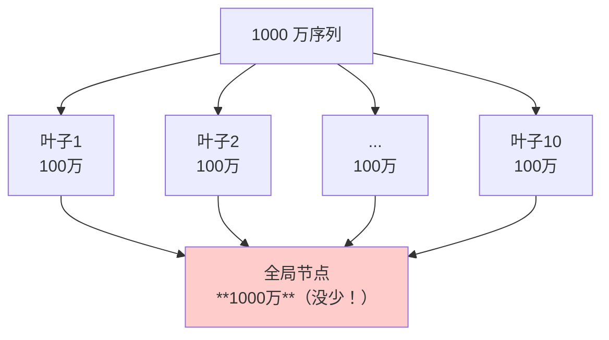
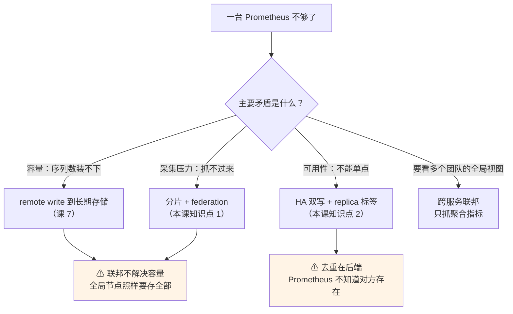

# 第 8 课：联邦与全局视图

> 所属阶段：阶段 3《规模化与生态》｜ 水平：进阶 ｜ 本课知识点：federation、HA 与数据一致性、external labels 的正确用法
> 故事情节：主角有了分身——一个 Prometheus 不够，起两个。可两个实例的数据怎么拼、重复了怎么办

## 🎯 本课目标

- 区分"分层联邦"与"跨服务联邦"，说清 federation 只传聚合结果这一限制
- 解释双写去重为什么必须在后端做，以及两条副本数据不一致时会发生什么
- 说清 external labels 加在哪，以及为什么用错了会毁掉全局查询与去重

---

## 一、场景引入：一个 Prometheus 不够了

### 1.1 你已经走过的路

到课 7 为止，你的架构是这样的：

```text
[应用] --拉取--→ [Prometheus] --remote write--→ [长期存储]
                      │
                      └─→ 告警、Grafana 查询
```

一台 Prometheus 抓所有东西，数据通过 remote write 送到远端。**这套东西在数据量和团队规模都可控时，工作得很好。**

### 1.2 但现实会这样演变

**情况一：机器装不下了。**

单机 Prometheus 的瓶颈通常不是 CPU，而是**内存**——head block 要装下所有的活跃序列。当序列数涨到千万级，单机的内存和 WAL 写入都会吃紧。

你自然的想法是：**再起一台，各抓一半**。

**情况二：团队拆分了。**

三个团队各管各的服务，各自有一套 Prometheus。现在 CTO 要看一个全局视图：

```text
"整个公司现在有多少 5xx？"
"三个集群的 P99 延迟分别多少？"
```

你不可能让 CTO 打开三个 Grafana。

**情况三：单点故障不可接受。**

监控系统的可用性要求比业务系统还高——业务挂了你要靠监控发现，监控挂了你就是瞎的。所以监控本身必须高可用。

最简单的做法：**起两个一模一样的 Prometheus，抓同样的目标**。

### 1.3 于是你有了三个待解决的问题

| 场景 | 问题 | 本课的对应知识点 |
|---|---|---|
| 分片：多台各抓一部分 | 怎么把它们拼成全局视图？ | **知识点 1：federation** |
| 高可用：两台抓同样的 | 数据重复了怎么办？ | **知识点 2：HA 与数据一致性** |
| 两者都要 | 怎么区分"这两条数据来自不同地方"？ | **知识点 3：external labels** |

这三个问题看起来独立，其实**共享同一个答案骨架**——就是那个小小的 `external_labels` 配置。

### 1.4 先说一个反直觉的预告

很多人以为 federation 是"Prometheus 的集群方案"。**它不是。**

联邦解决的是**聚合视图**问题（"我要看到所有数据"），
它**不解决容量问题**（"一台装不下"）——因为联邦节点自己也要存下所有抓来的数据。

这句话现在听着抽象，第四幕你会亲手验证它。

---

## 二、认知冲突：三个"应该没问题"的坑

### 💥 假象一：联邦就是把数据同步过来

**直觉**：全局节点配置联邦抓取，那叶子上的历史数据应该都能查到吧？

**实测**：

```bash
# 查询 1 小时前 ~ 30 分钟前的数据（全局节点）
curl -s -G 'http://localhost:19114/api/v1/query_range' \
  --data-urlencode 'query=l8_card_balance{idx="0001",cluster="leaf-a"}' \
  --data-urlencode "start=$(($(date +%s) - 3600))" \
  --data-urlencode "end=$(($(date +%s) - 1800))" \
  --data-urlencode 'step=60s'
```

```json
{"status":"success","data":{"resultType":"matrix","result":[]}}
```

**命中 0 条。**

为什么？看一眼 `/federate` 端点到底返回什么：

```bash
curl -s -G 'http://localhost:19110/federate' \
  --data-urlencode 'match[]={__name__="l8_card_balance",idx="0001"}'
```

```text
l8_card_balance{idx="0001",instance="l8-app:8080",job="l8-app",zone="z1",cluster="leaf-a",region="cn-south"} 4748.56 1788745940513
```

注意最后那个 `1788745940513`——**这是一个时间戳**。

联邦端点返回的是**"这一刻的值"**，不是历史序列。全局节点每次抓取，只拿到一个瞬时快照，然后**存成自己的新样本**。

> **联邦不搬运历史，它只是在持续地"抄当前值"。**

所以全局节点的起始时间 = 联邦开始配置的时间，在那之前的叶子数据，**全局节点永远查不到**。

### 💥 假象二：两个 Prometheus 抓同样的目标，数据应该一样

**直觉**：HA 双副本，抓的是同一个 target、同一个指标，值肯定一致吧？

**实测**（连续 6 次采样，间隔 2 秒）：

```text
#1  replica-1 = 4632.80   replica-2 = 4655.91   差 23.11
#2  replica-1 = 4632.80   replica-2 = 4623.92   差  8.88
#3  replica-1 = 4628.13   replica-2 = 4623.92   差  4.21
#4  replica-1 = 4628.13   replica-2 = 4634.68   差  6.55
#5  replica-1 = 4627.17   replica-2 = 4634.68   差  7.51
#6  replica-1 = 4627.17   replica-2 = 4634.68   差  7.51
```

**平均差 9.63，最大差 23.11。从来没有一次相等。**

为什么？两个 Prometheus 各自有一个独立的抓取定时器（ticker）。它们**互不协商**，各自按自己的节奏去抓。哪怕配置写的都是 `scrape_interval: 5s`，启动时间差了 0.3 秒，抓到的就是**不同时刻**的应用状态。

仔细看上表还能发现一个规律：值会"卡住"两拍再跳一下（4632.80 出现两次，4627.17 出现两次）。这正是两个副本**抓取相位不同**的直接证据。

> **HA 双副本给你的不是"两份一样的数据"，而是"两份采集时刻不同、值不相等的数据"。**
> 这个认知是理解后面所有去重方案的前提。

### 💥 假象三：Alertmanager 起了两个副本，通知应该只发一条

**直觉**：两个 Alertmanager 组成集群，gossip 会同步状态，重复通知应该被自动去掉。

**实测**：我先做了这个实验，webhook 收到 **0 条**通知。

当时我差点写下"gossip 去重生效，0 条重复"的结论。**幸好多看了一眼 Alertmanager 日志**：

```text
level=WARN  msg="Notify attempt failed, will retry later"
            err="Post \"...\": dial tcp: lookup l08-webhook on 127.0.0.11:53: server misbehaving"
level=ERROR msg="Notify for alerts failed" num_alerts=1
            err="webhook/webhook[0]: notify retry canceled after 2 attempts"
```

**通知根本没发出去**——我在配置里把 webhook 地址写成了 `l08-webhook`（一个遗留容器的名字），DNS 解析失败。

> ⚠️ **这个坑值得单独记一笔**：
> **"收到 0 条"和"去重成功"在观察结果上完全一样，但含义截然相反。**
> 判断去重是否生效之前，**必须先确认通知确实发出过**。
> 正确做法：先看 Alertmanager 日志里有没有 `Notify attempt failed`。

修正地址后重测，才拿到真实数据：

| 场景 | 通知条数 |
|---|---|
| gossip 集群（两副本互联，peers=2） | **1 条** |
| 孤立双副本（不指定 peer，peers=1） | **2 条** |

gossip 确实消除了重复通知（2 → 1）。但这个结论是**修正了实验之后**才成立的。

---

## 三、层层揭示


### 知识点 1：federation

#### 1. 一句话定义

**Federation 是让一个 Prometheus 通过 `/federate` 端点抓取另一个 Prometheus 的"当前值"，把它变成自己的新样本的机制。**

#### 2. 直觉建立：把它想成"抄表"

想象你是一个集团的财务总监，下面有三个分公司。每天各个分公司的会计会自己记账（叶子 Prometheus 存自己的数据）。

到了月底，你要出集团报表。你不会把三个分公司的**全部账本**搬过来——你只要他们各自报一个**当前数字**上来。

```text
分公司 A: "我们账上现在 500 万"
分公司 B: "我们账上现在 300 万"
```

你把这些数字**记在自己的新账本上**，写的是"今天我收到的数"。

**这就是 federation 的本质**：
- 分公司 = 叶子 Prometheus
- 你 = 全局 Prometheus
- "报数" = `/federate` 端点
- "记在自己的账本上" = 全局节点存成自己的样本

**关键**：你记下的是"**我收到汇报时的数字**"，不是分公司账本上的历史流水。下个月分公司账本上的某笔旧账改了，你这里不会变。

#### 3. 核心原理

##### 3.1 两种用法

官方区分了两种联邦模式，它们的**目的完全不同**：

| | 分层联邦（hierarchical） | 跨服务联邦（cross-service） |
|---|---|---|
| **目的** | **扩展容量**：一台抓不下，分给多台 | **聚合视图**：把不同团队的指标汇总 |
| **数据关系** | 叶子抓的是**同一个大系统的一部分** | 每个 Prometheus 管**不同的服务/团队** |
| **典型规模** | 单个数据中心内，几十个 target | 跨团队、跨机房 |
| **抓取内容** | 通常需要**全部**或大部分指标 | 只抓**需要聚合的少数**指标 |
| **能否减容量** | ❌ **不能**（见下） | 本来就不是为了减容量 |

**分层联邦最容易被误解的地方**：它**不减少总数据量**。

假设你有 1000 万序列，分成 10 台叶子各抓 100 万。然后全局节点联邦抓取这 10 台——**全局节点自己就要存下 1000 万序列**。



> **联邦解决的是"采集能力"的扩展（CPU/网络分散到多台），
> 不是"存储能力"的扩展（全局节点照样要装下全部）。**
>
> 真正解决存储扩展的是 remote write + 长期存储（课 7）和 Thanos/Mimir（课 9）。

##### 3.2 配置长什么样

```yaml
scrape_configs:
  - job_name: federate-leaf-a
    honor_labels: true                    # ← 关键，后面详解
    metrics_path: /federate                # ← 联邦专用端点
    params:
      match[]:                             # ← 必需的过滤参数
        - '{__name__=~"l8_.*"}'
    static_configs:
      - targets: ["l8-leaf-a:9090"]
```

三个要素缺一不可：

1. **`metrics_path: /federate`** —— 默认 `/metrics`，联邦必须改成 `/federate`
2. **`params: match[]`** —— 联邦端点**必须**带这个参数，否则返回空
3. **`honor_labels: true`** —— 保留叶子原始标签，稍后详解

##### 3.3 `/federate` 端点返回什么（实测）

```bash
curl -s -G 'http://localhost:19110/federate' \
  --data-urlencode 'match[]={__name__="l8_card_balance",idx="0001"}'
```

```text
l8_card_balance{idx="0001",instance="l8-app:8080",job="l8-app",zone="z1",cluster="leaf-a",region="cn-south"} 4748.56 1788745940513
```

三个部分：
```text
指标名{标签集}                                                                    值       时间戳(毫秒)
l8_card_balance{...cluster="leaf-a",region="cn-south"}                         4748.56   1788745940513
```

**两个关键点**：

1. **带毫秒时间戳** → 证明这是"某一刻的值"
2. **带上了 `cluster` / `region`** → 这是叶子的 `external_labels` 被附加了（知识点 3 会展开）

再看 TYPE 行：

```text
# TYPE l8_requests_total untyped
```

⚠️ **所有指标的类型都变成 `untyped` 了**。原始的 counter/gauge/histogram 信息在联邦输出中丢失。

##### 3.4 限制：只传当前值，不传历史

这是联邦**最重要**的限制，也是它常被误用的根源。

```text
第 1 次请求: l8_card_balance{idx="0001"} 4789.59  1788745930513
第 2 次请求: l8_card_balance{idx="0001"} 4767.34  1788745935513
                                          ↑值变了  ↑时间戳也变了（+5000ms）
```

**每次请求，返回的是那一刻的当前值。**

由此推出三条**实操结论**：

1. **全局节点的历史 = 联邦开始之后的历史**。联邦开始之前叶子上的数据，全局节点永远查不到。
2. **联邦的样本密度 = 全局节点的抓取间隔**，与叶子的抓取间隔无关。
   实测：叶子 5s 抓一次，全局也 5s 抓一次，2 分钟内两边都是 25 个点。
3. **联邦不适合搬运"明细数据"**。它适合的是"我要看各个集群的当前状态"这类场景。

##### 3.5 `honor_labels` 到底 honor 了什么

这是联邦配置里最容易写错、也最不容易察觉后果的一个开关。

**先看 `honor_labels: true`（推荐）**：

```text
cluster=leaf-a   job=l8-app   instance=l8-app:8080
cluster=leaf-b   job=l8-app   instance=l8-app:8080
```

保留了叶子数据里原始的 `job` 和 `instance`——**数据来自哪个真实实例，一目了然**。

**再看 `honor_labels` 不写（默认 false）**：

```text
cluster=leaf-a   job=federate-leaf-a   instance=l8-leaf-a:9090
cluster=leaf-b   job=federate-leaf-b   instance=l8-leaf-b:9090
```

`job` 和 `instance` 被**改写**成了联邦 target 的 job 名和地址。

**后果是什么？**

表面看，条数没变（两侧都是 1000 条），好像"也能用"。但你丢失的是**溯源能力**：

```text
honor_labels=false 时，你只能知道"这条数据来自 leaf-a 这个 Prometheus"
                    你无法知道"它其实是 leaf-a 抓的 l8-app:8080 这个实例的数据"
```

当你要排查"某个实例为什么没数据"时，`instance` 标签是你唯一的线索。把它改成 Prometheus 自己的地址，等于**把线索擦掉了**。

> **记住这一句**：`honor_labels: true` 保住的是"数据本来属于谁"这个信息。

#### 4. 示例演示：建一个联邦

##### 4.1 关键验证：TYPE=untyped 之后，rate() 还能算吗？

联邦输出把所有类型都改成 `untyped` 了，这是个挺吓人的限制。那 counter 的 `rate()` 还能用吗？

**实测**（这是本课我最想确认的一点）：

```text
federate 输出:  # TYPE l8_requests_total untyped     ← 类型确实丢了

叶子本地   rate(l8_requests_total[2m])        = 0.8
全局联邦   rate(...cluster=leaf-a...[2m])     = 0.8          ← 数值完全一致！
```

**结论：能算，而且数值准确。**

原因是 Prometheus 计算 `rate()` 时**看的是数值序列，不依赖 TYPE 行**。TYPE 行主要用于：
- 展示层（Grafana 知道这是 counter 后可以自动加 `rate()`）
- 某些类型敏感的函数（如 `histogram_quantile()` 需要 histogram 类型）

⚠️ **但这个"能算"是有前提的**：联邦的抓取间隔要足够密，让时间窗口内有足够样本。
本例联邦 5s 抓一次，2 分钟窗口约 24 个样本，所以准确。
如果你把联邦间隔设成 5 分钟，那 2 分钟窗口内可能只有 0~1 个样本，`rate()` 就算不出来了。

> **这里我原本以为会测出"untyped 导致 rate 失效"，结果没有。**
> 把它写出来，是因为**这个预期本身很常见**——而实测结论更值得记住：
> **联邦数据能不能算 rate，取决于抓取密度，不取决于 TYPE 行。**

##### 4.2 完整验证清单

```bash
# 1. 联邦端点能不能用（返回 200 且有内容）
curl -s -G 'http://localhost:19110/federate' \
  --data-urlencode 'match[]={__name__=~"l8_.*"}' | grep -c '^l8_'
# 期望：506（与叶子本地序列数一致）

# 2. 全局节点抓到了吗
curl -s -G 'http://localhost:19114/api/v1/query' \
  --data-urlencode 'query=count by (cluster) (l8_card_balance)'
# 期望：cluster=leaf-a -> 500，cluster=leaf-b -> 500

# 3. honor_labels 是否生效（看 job/instance）
curl -s -G 'http://localhost:19114/api/v1/query' \
  --data-urlencode 'query=l8_card_balance{idx="0001"}'
# honor_labels=true 时 job 应为 l8-app，不是 federate-leaf-a
```

#### 5. 常见误区

**误区一：拿联邦做容量扩展。**

最常见也最昂贵的误用。前面算过账了：全局节点要存下所有叶子的数据，**总数据量一点没少**。
联邦扩展的是**采集能力**（抓取的 CPU/网络开销分散了），不是**存储能力**。

真要扩存储，走 remote write + 长期存储（课 7），或 Thanos/Mimir（课 9）。

**误区二：以为联邦能同步历史数据。**

联邦端点返回的是当前值快照。全局节点的历史从联邦配置的那一刻开始。
想补历史？只能去叶子查，或者让叶子 remote write 到长期存储。

**误区三：忘记写 `match[]` 参数。**

```yaml
params:
  match[]:
    - '{__name__=~"l8_.*"}'
```

这个参数**必须写**。不写的话 `/federate` 返回空（不是报错，是空），
你会看到全局节点 target 是 UP 的，但一条数据都没有——和课 7 remote read 静默失败一模一样的坑。

**误区四：联邦抓取了太多东西。**

联邦的常见正确用法是**只抓需要聚合的聚合结果**，不是全量搬运：

```yaml
params:
  match[]:
    - '{job="service-level-metrics"}'          # 只抓服务级指标
    - '{__name__="job:requests:rate5m"}'       # 或只抓 recording rule 的产物
```

如果你要抓全部原始指标，那说明你要的其实是 remote write，不是联邦。

#### 6. 一句话记住

> **联邦是"抄当前值"，不是"搬历史"；它扩的是采集能力，不是存储能力；
> `honor_labels: true` 保住的是"数据本来属于谁"。**

---

### 知识点 2：HA 与数据一致性

#### 1. 一句话定义

**HA（高可用）双写是让两个或多个 Prometheus 抓完全相同的目标，各自独立存储，靠后端去重——它们彼此不知道对方存在。**

#### 2. 直觉建立：两个人各记一本账

延续财务的比喻。这次不是上下级，而是**两个会计同时记同一本账**：

- 会计 A 每隔 5 秒看一次账目，记下来
- 会计 B 也每隔 5 秒看一次，记下来
- **他们互不沟通**，各自记各自的

到了对账的时候你会发现：**两个人的数字从来没对上过。**

因为 A 看你账本的时刻是 10:00:00.000，B 看的是 10:00:00.347——
这 0.347 秒里账目已经变了。

**这就是 HA 双写的真实状态**：两份数据，值不相等，都是"对"的。

#### 3. 核心原理

##### 3.1 双写模型

```text
              ┌──→ [Prometheus replica-1] ──┐
[应用 target] ─┤                             ├──→ [后端存储]
              └──→ [Prometheus replica-2] ──┘
                    （互不感知）
```

两台 Prometheus：
- 抓**完全相同**的 target
- 各自有**独立的 TSDB**
- 各自**独立** remote write 到后端
- **彼此之间没有任何通信**

没有 leader 选举，没有数据同步，没有任何协调机制。

##### 3.2 为什么必须这样设计

你可能会问：为什么不让两个副本协商一下，一个抓、一个待命？

**因为 Prometheus 的设计哲学是"简单 + 无状态协调"**。加任何协调机制都会引入：

- 选主逻辑（谁活着？谁来抓？）
- 脑裂处理（网络分区时两边都以为自己是主）
- 状态同步（切换时数据怎么接上）

而"两个都抓，后端去重"这个方案，**把复杂度从 Prometheus 转移到了后端**——
后端本来就要处理去重（它还可能收到来自其他地方的数据）。

##### 3.3 为什么 Prometheus 自己不去重

**因为它压根不知道对方存在。**

实测：

```text
replica-1 本地 l8_card_balance = 500 条
```

它只知道自己抓的 500 条。在它的世界里，这 500 条就是全部——
它没有任何途径得知"还有另一台机器也抓了 500 条一样的"。

> **去重这件事，在 Prometheus 的架构里就"不在职责范围内"。**
> 这不是缺陷，是分工：Prometheus 负责采集和暂存，去重交给后端。

##### 3.4 副本之间数据不一致（实测）

这是 HA 双写**最反直觉**也**最重要**的一点。

```text
#1  replica-1 = 4632.80   replica-2 = 4655.91   差 23.11
#2  replica-1 = 4632.80   replica-2 = 4623.92   差  8.88
#3  replica-1 = 4628.13   replica-2 = 4623.92   差  4.21
#4  replica-1 = 4628.13   replica-2 = 4634.68   差  6.55
#5  replica-1 = 4627.17   replica-2 = 4634.68   差  7.51
#6  replica-1 = 4627.17   replica-2 = 4634.68   差  7.51

平均差值 = 9.63，最大 = 23.11
```

**没有一次相等。**

成因：两个 Prometheus 各自有独立的抓取定时器。即使配置相同，启动时刻、GC 停顿、调度抖动都会让它们**抓取时刻错开**。

**这个不一致会带来什么后果？**

对于**仪表盘**：同一个图表刷新两次，值可能来自不同副本 → 曲线毛刺、数字跳动。

对于**告警**：两个副本都会对同一条规则求值。如果值在阈值附近抖动，可能出现：
- replica-1 认为触发了，replica-2 认为没触发
- 后端收到一个 firing，告警照样发（这没问题）
- 但如果你在告警规则里用了复杂的瞬时判断，可能得到不一致的结果

> **缓解手段**：告警规则用 `for` 持续时间（课 4 学过），并且 rate 类函数用足够长的窗口，
> 让"抓取时刻差几百毫秒"这件事被平滑掉。

#### 4. 示例演示：后端去重到底怎么做

##### 4.1 关键认知：不去重反而是对的

先看一个容易误判的现象。我把两个带 `replica` 标签的副本双写到 VM，然后查：

```text
count(l8_card_balance)                  = 1000
count by (replica) (l8_card_balance)    = replica=1:500, replica=2:500
```

**1000 条，没有被合并。** 我给 VM 配了 `-dedup.minScrapeInterval=1s`，为什么没生效？

查 VM 的 flags：

```bash
curl -s "http://localhost:19115/flags" | tr ' ' '\n' | grep -i dedup
# -dedup.minScrapeInterval="1s"
```

参数确实生效了。那为什么不合并？

**因为这两条序列的 `replica` 标签不同——对 VM 而言，它们就是两条不同的时间序列，dedup 不该介入。**

> ⚠️ **VM 的状态端点路径与 Prometheus 不同**：
> Prometheus 是 `/api/v1/status/flags`，VM 是 **`/flags`**。
> 用 Prometheus 的路径去问 VM，会拿到非 JSON 响应（我第一次就踩了这个）。

**这就是 HA 双写的正确做法**：
- ✅ **保留 `replica` 标签**，让两份数据在后端保持独立
- ✅ 查询时**显式聚合掉** replica

##### 4.2 查询时的正确写法

```text
l8_card_balance{idx="0001"}                        -> 2 条 ['4627.39', '4613.22']
max without(replica) (l8_card_balance{idx="0001"}) -> 1 条 ['4613.22']
avg without(replica) (l8_card_balance{idx="0001"}) -> 1 条 ['4610.305']
```

三种常见选择：

| 写法 | 语义 | 适用场景 |
|---|---|---|
| `max without(replica) (...)` | 取两个副本中较大的值 | 监控"峰值"类指标（如最大延迟） |
| `avg without(replica) (...)` | 取两个副本的均值 | 大多数场景的默认选择 |
| `{replica="1"}` | 固定取某一个副本 | 需要结果完全稳定时 |

##### 4.3 那 `dedup.minScrapeInterval` 是干嘛的？

它的作用场景是：**两条序列的标签完全相同**，且时间戳非常接近。

典型场景是"同一个 Prometheus 因为网络重试把同一批样本发了两次"——
这时标签完全一样，dedup 会把它们合并成一个。

而 HA 双写**恰恰需要**靠 `replica` 标签让它们不合并。所以：

> **`dedup.minScrapeInterval` 不是 HA 去重的手段，`replica` 标签 + 查询聚合才是。**

#### 5. 常见误区

**误区一：以为两个副本的数据是一样的。**

前面测过了，平均差 9.63。**它们从来不相等**，因为抓取时刻不同。

**误区二：以为 Prometheus 会自己去重。**

它不知道对方存在。去重 100% 在后端（或查询层）做。

**误区三：为了"数据干净"把 dedup 窗口调大。**

调大 `dedup.minScrapeInterval` 只会合并**标签完全相同**的序列。
HA 双写带 replica 标签，调多大都没用；
而不带 replica 标签时（见知识点 3），调大了反而会**丢信息**。

**误区四：告警规则查 HA 数据时不聚合。**

```promql
# ❌ 危险：值会在两个副本之间跳
l8_card_balance < 100

# ✅ 正确：先聚合掉 replica
max without(replica) (l8_card_balance) < 100
```

#### 6. 一句话记住

> **HA 双写的两个副本互不感知，数据永远不相等；
> 去重不在 Prometheus（它不知道对方存在），而在后端——
> 靠 `replica` 标签保留两份，查询时 `max/avg without(replica)` 合成一个。**

---

### 知识点 3：external labels 的正确用法

#### 1. 一句话定义

**`external_labels` 是加在 Prometheus 所有"出站数据"上的一组标签——它标识"这批数据是谁产生的"，且不影响本地查询。**

#### 2. 直觉建立：快递面单

想象每个 Prometheus 是一个发货的仓库。

仓库里的货本身没有"从哪个仓库发出的"这个标记——货架上就摆着商品（本地查询看到的就是原始数据）。

但是，**每次发货时**，仓库会在包裹外面贴一张面单：

```text
发件仓：广州仓（cluster=leaf-a）
区域：  华南（region=cn-south）
```

收件方（后端存储、全局节点）看到包裹时，能通过面单知道它来自哪里。

**关键点有三个**：

1. **面单是发货时才贴的** —— 货在仓库里的时候没有（本地查询看不到）
2. **面单贴在包裹外面** —— 不是改货物本身
3. **两个仓库如果贴了同样的面单，收件方就分不清了** —— 这就是用错的后果

#### 3. 核心原理

##### 3.1 加在哪：只加在出站数据上

**实测**（这是理解 external_labels 最关键的一组对照）：

```bash
# 本地查询（叶子自己的视角）
curl -s -G 'http://localhost:19110/api/v1/query' \
  --data-urlencode 'query=l8_card_balance{idx="0001"}'
```

```text
[('__name__', 'l8_card_balance'), ('idx', '0001'),
 ('instance', 'l8-app:8080'), ('job', 'l8-app'), ('zone', 'z1')]
```

**没有 `cluster`，没有 `region`。**

```bash
# 出站（federate 端点）
curl -s -G 'http://localhost:19110/federate' \
  --data-urlencode 'match[]={__name__="l8_card_balance",idx="0001"}'
```

```text
l8_card_balance{...,cluster="leaf-a",region="cn-south"} 4623.01 1788746730513
                     ↑ 出站时附加了
```

> **external_labels 不影响本地查询，只在出站（federate / remote write）时附加。**

这条能够解释很多困惑，比如：

**Q：告警规则里能用 `cluster` 标签吗？**

**A：不能。** 告警规则在本地 TSDB 求值，本地看不到 external_labels。

```promql
# ❌ 永远匹配不到（本地数据里没有 cluster）
l8_card_balance{cluster="leaf-a"} < 100

# ✅ 正确（不加 cluster，或用实例本身的标签）
l8_card_balance{job="l8-app"} < 100
```

但这不影响告警**发出去**时带上 cluster——Prometheus 把告警推给 Alertmanager 时，会把 external_labels 附加上去。

##### 3.2 与课 7 的关系：四段式行为

课 7 在 remote write/read 场景下讲过 external_labels 的**三段式**行为。这里补全第四段：

| # | 场景 | 行为 |
|---|---|---|
| 1 | **remote write 出站** | 附加到样本 |
| 2 | **remote read 查询时** | 附加到选择器（只取回自己写的数据） |
| 3 | **remote read 返回前** | 剥离（查询结果里看不到） |
| 4 | **本地查询 / 告警求值** | **完全不参与**（本课新增） |

第 4 条是第 1~3 条的根源——正因为 external_labels 不属于本地数据，
所以它才能在出站时被"贴上去"、在返回时被"揭下来"。

##### 3.3 用错的后果（决定性对照）

这是本课**最重要**的一组实验。

我建了两套完全相同的 HA 双副本，唯一区别是 external_labels：

```yaml
# 正确：带 replica
external_labels:
  cluster: ha-cluster
  replica: "1"          # 副本 2 写 "2"

# 错误：不带 replica（两个副本完全一样）
external_labels:
  cluster: ha-cluster
```

**实测结果**：

| 配置 | 后端条数 | 含义 |
|---|---|---|
| **有 replica** | **1000** | 两份数据独立保留，靠 replica 区分 |
| **无 replica** | **500** | 标签完全相同，被后端 dedup 合并了 |

看到"无 replica 只有 500 条"，你可能会觉得：**这不是挺好吗？数据干净了。**

**这个想法是危险的。** 看下一组实测。

##### 3.4 决定性证据：无 replica 时值会跳变

无 replica 的后端（dedup 合并后），连续 10 次采样同一条序列：

```text
#1  4628.54    #2  4633.73    #3  4633.73    #4  4653.12    #5  4634.08
#6  4634.08    #7  4605.37    #8  4605.37    #9  4638.41    #10 4670.70
```

值在 **4605.37 ~ 4670.70** 之间**无规律跳变**。

为什么？因为 dedup 每次保留的是"某个副本的值"——
一会儿是副本 1 的，一会儿是副本 2 的，**取决于它们的写入顺序，而写入顺序不确定**。

对照：带 replica 的后端，两个副本各自连贯：

```text
#1  replica=1 -> 4676.85   replica=2 -> 4665.11
#2  replica=1 -> 4698.79   replica=2 -> 4675.24
#3  replica=1 -> 4698.79   replica=2 -> 4681.92
```

每一列（同一个副本）变化平缓，符合真实的业务波动。

> **结论**：
> - **有 replica**：你能明确指定用哪个副本，也能用 `max/avg without(replica)` 得到确定值
> - **无 replica**：你只能拿到"某个副本"的值，且是哪个不确定 → **图表毛刺、告警抖动**

而且还有更隐蔽的问题：**无 replica 时你失去了"某个副本挂了"的感知能力。**

带 replica 时你可以这样告警：

```promql
# 某个副本掉线了（少了一个 replica 的数据）
count(count by (replica) (up)) < 2
```

不带 replica，这个告警根本写不出来。

##### 3.5 用错的后果（联邦场景）

external_labels 用错在联邦场景下同样致命。

假设两个叶子的 external_labels 写得**完全一样**（比如都写 `cluster: prod`）：

```text
全局节点会收到：
  leaf-a 的 l8_card_balance{cluster="prod", idx="0001"} = 4623.01
  leaf-b 的 l8_card_balance{cluster="prod", idx="0001"} = 4711.55
```

这两条序列的标签**完全相同**（都是 `cluster=prod, idx=0001, instance=..., job=...`），
但**值不相等**——它们是两次独立采集的结果。

后果：
- 存储层看到两条"相同"的序列，可能保留一条（丢数据）、可能都保留（重复）
- 查询时 PromQL 不知道该取哪个 → **结果不确定**
- 如果配了 dedup，会按时间戳合并 → 值在两条之间跳

**正确做法**：每个叶子的 `cluster`（或等价标识）必须**唯一**。

```yaml
# leaf-a
external_labels:
  cluster: leaf-a      # ← 唯一
  region: cn-south

# leaf-b
external_labels:
  cluster: leaf-b      # ← 唯一
  region: cn-north
```

##### 3.6 必带标签的约定

综合 HA 与联邦两个场景，推荐的 external_labels 约定：

| 标签 | 是否必带 | 说明 |
|---|---|---|
| `cluster` | ✅ 必带 | 标识这个 Prometheus 属于哪个集群，**必须唯一** |
| `replica` | ✅ HA 时必带 | 标识 HA 副本编号，**同集群内必须唯一** |
| `region` / `datacenter` | 推荐 | 多机房时用于区分地域 |
| `env` | 推荐 | 环境标识（prod / staging / test） |

**铁律**：

1. **`cluster` 全局唯一** —— 两个不同的 Prometheus 绝不能写同一个 cluster
2. **HA 副本必须带 `replica`** —— 且同集群内不能重复
3. **不要放"业务标签"** —— 比如 `team`、`service`。external_labels 是给全局用的，
   业务标签应该由 target 自己的 labels 提供（课 2 学过）

#### 4. 示例演示：配置与验证

##### 4.1 配置

```yaml
global:
  external_labels:
    cluster: ha-cluster
    replica: "1"          # 副本 2 改成 "2"

remote_write:
  - url: "http://backend:8428/api/v1/write"
```

##### 4.2 验证清单（三条，缺一不可）

```bash
# 1. 本地查询看不到 external_labels（确认它不影响本地）
curl -s -G 'http://localhost:19112/api/v1/query' \
  --data-urlencode 'query=l8_card_balance{idx="0001"}'
# 结果的标签里不应有 cluster / replica

# 2. 出站数据带上了 external_labels
curl -s -G 'http://localhost:19112/federate' \
  --data-urlencode 'match[]={__name__="l8_card_balance",idx="0001"}'
# 结果应带 cluster="ha-cluster", replica="1"

# 3. 后端能按 replica 区分（这是去重的保障）
curl -s -G 'http://localhost:19115/api/v1/query' \
  --data-urlencode 'query=count by (replica) (l8_card_balance)'
# 期望：replica=1 -> 500，replica=2 -> 500
```

第 3 条最关键——**如果这里只返回一组，说明你的 external_labels 配错了**。

#### 5. 常见误区

**误区一：在告警规则里用 external_labels 做过滤。**

```promql
# ❌ 永远匹配不到
alert: Foo
expr: l8_card_balance{cluster="ha-cluster"} < 100
```

本地求值看不到 external_labels。要过滤就用 target 自带的标签。

**误区二：两个 Prometheus 用同样的 external_labels。**

联邦场景下会导致数据无法区分，HA 场景下会被后端 dedup 合并、丢失副本信息。

**误区三：HA 副本不带 replica。**

数据"看起来干净了"（只有一份），但值会在两个副本间跳变，
且你失去了"某个副本掉线"的感知能力。

**误区四：把 external_labels 当成业务逻辑标签。**

它们是**基础设施标识**，不是业务维度。业务维度走 target labels。

#### 6. 一句话记住

> **external_labels 是"快递面单"：本地查不到，出站才贴上；
> `cluster` 必须全局唯一，HA 副本必须带 `replica`——
> 少了 replica，数据看似干净了，实则值在副本间乱跳。**

---

### 补充：回收课 5 的伏笔 —— Alertmanager 的 gossip 去重

> 课 5 结尾埋了一个伏笔："多副本会带来'同一条告警被每个副本都发一遍'的新问题，gossip 协议就是为了解决这个。这是课 8 的内容。"

现在正面回答。

#### 两个层次的去重，别混为一谈

本课涉及**两个完全不同层次**的"重复"，它们用完全不同的机制解决：

| 层次 | 重复的是什么 | 解决机制 | 在哪做 |
|---|---|---|---|
| **数据层** | 存储里有两份样本 | `replica` 标签 + 查询聚合 | 后端 / 查询层 |
| **通知层** | 同一条通知被发两遍 | **gossip 同步通知日志** | Alertmanager 集群内部 |

**gossip 不去重告警本身**——它同步的是两样东西：

1. **静默（silence）状态**：你在 AM-1 上创建的静默，AM-2 也要知道
2. **通知日志（notification log）**：这条通知我已经发过了，你别再发

#### 实测：gossip 建立

```bash
docker run -d --name l8-am-1 ... \
  prom/alertmanager:v0.30.0 \
  --cluster.listen-address=0.0.0.0:9094 \
  --cluster.peer=l8-am-2:9094        # ← 互相指向对方
```

日志关键行：

```text
msg="Waiting for gossip to settle..." interval=2s
msg="gossip not settled" polls=0 before=0 now=2 elapsed=2.000904712s
msg="gossip settled; proceeding" elapsed=10.003685466s
```

**gossip 建立约需 10~12 秒**（本例）。这段时间内集群还没就绪。

就绪后查状态：

```bash
curl -s 'http://localhost:19120/api/v2/status' | python -m json.tool
```

```json
"cluster": {
  "status": "ready",
  "peers": [ {...}, {...} ]     ← peers=2 表示两个副本都看到了
}
```

#### 决定性对照：gossip 到底有没有用

光看"集群建好了、通知只发了一条"是不够的——**你必须证明"没有 gossip 时会发两条"**。

所以做了对照实验：

| 场景 | 配置 | peers | 通知条数 |
|---|---|---|---|
| **A. gossip 集群** | 互指 `--cluster.peer` | 2 | **1 条** |
| **B. 孤立双副本** | 不指定 peer | 1 各 | **2 条** |

**结论：gossip 确实消除了重复通知（2 → 1）。**

#### ⚠️ 本实验踩的坑：把"没发出"当成"去重了"

这个坑值得单独讲，因为它是一个**通用的实验方法论问题**。

我第一次跑实验时，webhook 收到 **0 条**通知。当时差点写下" gossip 去重生效，0 条重复"。

幸好看了一眼 Alertmanager 日志：

```text
level=WARN  msg="Notify attempt failed, will retry later"
            err="Post \"...\": dial tcp: lookup l08-webhook on 127.0.0.11:53: server misbehaving"
level=ERROR msg="Notify for alerts failed" num_alerts=1
            err="webhook/webhook[0]: notify retry canceled after 2 attempts"
```

**通知根本没发出去**——我把 webhook 地址写成了 `l08-webhook`（一个遗留容器名），DNS 解析失败。

> **方法论教训**：
> **"收到 0 条"和"去重成功"在观察结果上完全一样，但含义截然相反。**
>
> 判断某个机制"是否生效"之前，**必须先确认被测对象确实发生过**。
> 具体到 Alertmanager：先看日志里有没有 `Notify attempt failed`，再讨论去重。
>
> 这和课 6 学到的"recording rule 降本 60% 其实是规则没生效"是**同一类错误**——
> **把"没发生"当成了"发生了且符合预期"。**

#### Alertmanager HA 的正确配置

```yaml
# 两个副本的配置必须完全一致（gossip 前提）
route:
  receiver: webhook
  group_by: ['alertname']
  group_wait: 5s
  group_interval: 10s
  repeat_interval: 1h
```

两点要求：

1. **配置文件必须一致** —— 否则两个副本行为不同，gossip 同步的通知日志对不上
2. **Prometheus 要配置**所有 Alertmanager 地址：

```yaml
alerting:
  alertmanagers:
    - static_configs:
        - targets:
            - "l8-am-1:9093"
            - "l8-am-2:9093"
```

Prometheus 会把告警发给**所有** Alertmanager（不是"选一个"），
由 gossip 保证最终只发一条通知。

---

## 四、实操验证

> 全部命令在 **bash** 中执行，基于 `labs/lesson-08/` 的实验环境。
> 每一步都给出**期望输出**，以及"如何判断它真的生效"。

### 步骤 1：拉起实验环境

```bash
# 进入你的课程根目录（含 labs/ 与 stages/ 的那一层）
cd <你的课程目录>          # 例如 Windows + WSL: cd /mnt/d/projects/learning/prometheus
bash labs/lesson-08/setup.sh
```

> ⚠️ **路径提醒（课 7 踩过的坑）**：本课命令在 **bash** 中执行。
> Windows + WSL/Git Bash 下，盘符挂载点是 **`/mnt/d/` 而不是 `/d/`**。
> 用 `pwd` 确认目录真实存在后再继续——**bind mount 指向不存在的路径时，
> Docker 会静默创建一个同名空目录**，导致后续 `promtool` 报 `'xxx.yml' is a directory`。

期望输出（7 个容器全部 running）：

```text
  l8-app         running
  l8-leaf-a      running
  l8-leaf-b      running
  l8-replica-1   running
  l8-replica-2   running
  l8-global      running
  l8-vm          running
```

端口映射：

| 容器 | 端口 | 角色 |
|---|---|---|
| l8-leaf-a | 19110 | 叶子 A |
| l8-leaf-b | 19111 | 叶子 B |
| l8-replica-1 | 19112 | HA 副本 1 |
| l8-replica-2 | 19113 | HA 副本 2 |
| l8-global | 19114 | 全局联邦 |
| l8-vm | 19115 | 后端 |

**等 30 秒**再执行后续步骤，让抓取积累几个周期的样本。

---

### 步骤 2：验证联邦链路（知识点 1）

#### 2.1 联邦端点能返回数据吗

```bash
curl -s -G 'http://localhost:19110/federate' \
  --data-urlencode 'match[]={__name__=~"l8_.*"}' | grep -c '^l8_'
```

期望：`506`

> 与叶子本地序列数一致。如果返回 `0`，检查是否忘了写 `match[]` 参数。

#### 2.2 联邦只传当前值

```bash
for i in 1 2; do
  curl -s -G 'http://localhost:19110/federate' \
    --data-urlencode 'match[]={__name__="l8_card_balance",idx="0001"}'
  sleep 6
done
```

期望：两次输出的**值和时间戳都不同**：

```text
l8_card_balance{...,cluster="leaf-a",region="cn-south"} 4789.59 1788745930513
l8_card_balance{...,cluster="leaf-a",region="cn-south"} 4767.34 1788745935513
```

**这就是"只传当前值"的直接证据。**

#### 2.3 全局节点查得到两个叶子吗

```bash
curl -s -G 'http://localhost:19114/api/v1/query' \
  --data-urlencode 'query=count by (cluster) (l8_card_balance)'
```

期望：

```json
{"cluster":"leaf-a"} -> 500
{"cluster":"leaf-b"} -> 500
```

#### 2.4 联邦不搬运历史（关键验证）

```bash
curl -s -G 'http://localhost:19114/api/v1/query_range' \
  --data-urlencode 'query=l8_card_balance{idx="0001",cluster="leaf-a"}' \
  --data-urlencode "start=$(($(date +%s) - 3600))" \
  --data-urlencode "end=$(($(date +%s) - 1800))" \
  --data-urlencode 'step=60s'
```

期望：`"result":[]`（0 条）

**全局节点的历史 = 联邦开始之后的历史。**

#### 2.5 TYPE 变成 untyped，但 rate 还能算

```bash
# 看 TYPE
curl -s -G 'http://localhost:19110/federate' \
  --data-urlencode 'match[]={__name__="l8_requests_total"}' | grep '# TYPE'
```

期望：`# TYPE l8_requests_total untyped`

```bash
# 但 rate 照样能算，且与叶子一致
curl -s -G 'http://localhost:19110/api/v1/query' \
  --data-urlencode 'query=rate(l8_requests_total{method="GET"}[2m])'
curl -s -G 'http://localhost:19114/api/v1/query' \
  --data-urlencode 'query=rate(l8_requests_total{method="GET",cluster="leaf-a"}[2m])'
```

期望：两者数值**相同**（实测都是 `0.8`）

> **这推翻了"untyped 导致 rate 失效"的常见预期**。
> 联邦数据能不能算 rate，取决于**抓取密度**，不取决于 TYPE 行。

---

### 步骤 3：honor_labels 决定性对照（知识点 1）

```bash
bash labs/lesson-08/probe-honor-labels.sh
```

这个脚本会起一个 `honor_labels` 为默认（false）的对照容器 `l8-global-nh`（端口 19116），
然后对比两侧。期望输出：

```text
   honor_labels=true   命中 2 条
      cluster=leaf-a   job=l8-app           instance=l8-app:8080          src=leaf-a
      cluster=leaf-b   job=l8-app           instance=l8-app:8080          src=leaf-b
   honor_labels=false  命中 2 条
      cluster=leaf-a   job=federate-leaf-a  instance=l8-leaf-a:9090       src=leaf-a
      cluster=leaf-b   job=federate-leaf-b  instance=l8-leaf-b:9090       src=leaf-b
```

**看差异**：`honor_labels=false` 时，`job`/`instance` 被改写成联邦 target 的名字和地址——
你丢失了"数据本来来自哪个实例"这个信息。

> 条数没变（都是 1000），**丢的是溯源能力，不是数据**。

---

### 步骤 4：HA 双副本的数据不一致（知识点 2）

```bash
bash labs/lesson-08/exp3-ha-dedup.py
```

期望：

```text
   replica-1: up=1  l8_card_balance=500 条
   replica-2: up=1  l8_card_balance=500 条

   连续采样 6 次：
   #1  replica-1 = 4632.80   replica-2 = 4655.91   差 23.11
   ...
   平均差值 = 9.63，最大 = 23.11
```

**关键观察**：两个副本的值**从来没有一次相等**。

---

### 步骤 5：后端去重的正确做法（知识点 2）

#### 5.1 两份数据都保留（这是对的）

```bash
curl -s -G 'http://localhost:19115/api/v1/query' \
  --data-urlencode 'query=count by (replica) (l8_card_balance)'
```

期望：

```json
{"replica":"1"} -> 500
{"replica":"2"} -> 500
```

**1000 条，没被合并** —— 因为 `replica` 标签不同。

#### 5.2 确认 dedup 参数（用对的端点）

```bash
curl -s "http://localhost:19115/flags" | tr ' ' '\n' | grep -i dedup
```

期望：`-dedup.minScrapeInterval="1s"`

> ⚠️ **VM 的 flags 端点是 `/flags`，不是 Prometheus 的 `/api/v1/status/flags`。**
> 用错路径会拿到非 JSON 响应。

#### 5.3 查询时聚合掉 replica

```bash
curl -s -G 'http://localhost:19115/api/v1/query' \
  --data-urlencode 'query=l8_card_balance{idx="0001"}'
# -> 2 条（两个副本各一条）

curl -s -G 'http://localhost:19115/api/v1/query' \
  --data-urlencode 'query=max without(replica) (l8_card_balance{idx="0001"})'
# -> 1 条（合并成一个值）
```

---

### 步骤 6：external_labels 用错的后果（知识点 3）

```bash
bash labs/lesson-08/exp4-no-replica.sh
```

这个脚本会起两个**不带 replica** 的副本（19118 / 19119）和一个专门的后端（19117），
然后对比：

```text
   有 replica -> count = 1000 条（两个副本各 500，靠 replica 区分）
   无 replica -> count = 500  条（标签完全相同，被 dedup 合并）
```

#### 6.1 决定性证据：无 replica 时值会跳变

```bash
bash labs/lesson-08/exp5-dedup-cost.sh
```

期望（无 replica 的后端连续采样）：

```text
     #1  后端值 = 4628.54    #2  = 4633.73    #3  = 4633.73
     #4  = 4653.12    #5  = 4634.08    #6  = 4634.08
     #7  = 4605.37    #8  = 4605.37    #9  = 4638.41    #10 = 4670.7
```

值在 **4605.37 ~ 4670.70** 之间**无规律跳变**——一会儿取副本 1，一会儿取副本 2。

对照（有 replica 时两个副本各自连贯）：

```text
     #1  replica=1 -> 4676.85   replica=2 -> 4665.11
     #2  replica=1 -> 4698.79   replica=2 -> 4675.24
     #3  replica=1 -> 4698.79   replica=2 -> 4681.92
```

#### 6.2 external_labels 附加位置

```bash
# 本地查询：看不到 cluster/region
curl -s -G 'http://localhost:19110/api/v1/query' \
  --data-urlencode 'query=l8_card_balance{idx="0001"}'

# 出站（federate）：带上了
curl -s -G 'http://localhost:19110/federate' \
  --data-urlencode 'match[]={__name__="l8_card_balance",idx="0001"}'
```

---

### 步骤 7：Alertmanager gossip 去重（回收课 5 伏笔）

```bash
bash labs/lesson-08/setup-am-cluster.sh
```

期望：

```text
   端口 19120: status=ready  peers=2
   端口 19121: status=ready  peers=2

   收到通知数 = 1
```

#### 7.1 决定性对照：拆散 gossip

```bash
bash labs/lesson-08/exp6-gossip-decisive.sh
```

期望：

```text
   gossip 集群（两副本互联）: 1 条通知
   孤立双副本（无 gossip）  : 2 条通知

   --> gossip 确实消除了重复通知（2 条 -> 1 条）
```

#### 7.2 ⚠️ 先确认通知真的发出过

这一步**必须在下"去重生效"结论之前做**：

```bash
docker logs l8-am-1 2>&1 | grep -i 'notify'
```

如果看到这个，说明通知**根本没发出**，此时的"0 条"不等于"去重成功"：

```text
level=WARN  msg="Notify attempt failed, will retry later"
            err="... dial tcp: lookup l08-webhook ... server misbehaving"
level=ERROR msg="Notify for alerts failed" num_alerts=1
```

**"收到 0 条"和"去重成功"看起来一样，但含义完全相反。**

---

### 步骤 8：清理（可选）

```bash
docker rm -f l8-app l8-leaf-a l8-leaf-b l8-replica-1 l8-replica-2 \
             l8-global l8-global-nh l8-vm l8-vm-norep l8-norep-1 l8-norep-2 \
             l8-am-1 l8-am-2 l8-webhook
docker network rm l8net
```

> 建议保留环境到学完课 9 —— 课 9 讲长期存储选型时会用到这里的 VM 对照。

## 五、体系收束：分身之后，怎么合而为一

### 5.1 回到开头的三个场景

| 场景 | 问题 | 答案 | 关键约束 |
|---|---|---|---|
| **分片** | 多台各抓一部分，怎么拼全局视图？ | **federation** | 只传当前值，不解决容量 |
| **高可用** | 两台抓同样的，数据重复怎么办？ | **replica 标签 + 后端聚合** | Prometheus 自己不去重 |
| **两者都要** | 怎么区分数据来源？ | **external_labels** | cluster 唯一、HA 必带 replica |

三个问题的答案**共享同一个骨架**——`external_labels`。

```text
                        external_labels
                              │
        ┌─────────────────────┼─────────────────────┐
        │                     │                     │
   标识"我是谁"          区分"两个副本"         聚合"多个集群"
   cluster=leaf-a       replica=1/2          全局视图按 cluster 分组
        │                     │                     │
   联邦场景必需          HA 场景必需          跨服务联邦必需
```

**为什么是 external_labels？** 因为它是 Prometheus 里唯一一个"**标识数据生产者**"的机制。

target 的 labels 标识的是"**被监控对象是谁**"（哪个实例、哪个 job），
external_labels 标识的是"**谁在监控**"（哪个 Prometheus、哪个副本）。

这个区分一旦想清楚，本课的三个知识点就串成一条线了。

### 5.2 决策树：什么时候用什么



**最常见的误判**：把"容量问题"当成"采集问题"来解，于是上了联邦，
结果全局节点照样撑爆。

**判断方法**：问自己一句——**全局节点要存下多少序列？**
如果答案接近总量，那联邦不是你的药。

### 5.3 联邦、HA、远程写的横向对照

| 维度 | federation | HA 双写 | remote write |
|---|---|---|---|
| **方向** | 拉（全局主动抓叶子） | 推（各副本独立推后端） | 推（Prometheus 推远端） |
| **解决什么** | 聚合视图 | 可用性 | 长期存储 / 容量 |
| **数据关系** | 叶子保留明细，全局存当前值 | 副本间数据**不相等** | 全量复制 |
| **去重** | 靠 external_labels 区分 | 靠 replica + 查询聚合 | 后端负责 |
| **历史** | ❌ 不搬历史 | 各副本独立保留 | ✅ 全量同步 |
| **典型代价** | 全局节点存储不变少 | 存储翻倍 + 查询要聚合 | 依赖后端可用性 |

**一条主线**：这三个都是"**数据不在一台机器上时怎么组织**"的答案，
区别在于**数据流向**和**重复的语义**。

### 5.4 与前后课程的连接

```text
课 2《目标从哪来》      target labels（标识被监控对象）
                            ↓ 对照
课 8《联邦与全局视图》   external_labels（标识监控者）  ← 你在这里
                            ↓
课 9《长期存储选型》     Thanos / Mimir 的租户与副本机制，

都是 external_labels 的延伸
```

**课 5 → 课 8 的伏笔已回收**：Alertmanager 的 gossip 去重（实测 2 条 → 1 条）。

**课 8 → 课 9 的铺垫**：本课的 `replica` 标签思想，在 Thanos 里变成 `__replica__`，
在 Mimir 里变成 HA tracker。理解了本课的取舍，课 9 的架构差异会好懂得多。

### 5.5 本课的三个思维转变

**转变一：从"集群"到"分工"。**

刚接触时容易把联邦理解成"Prometheus 的集群方案"。但实测下来你会发现：
联邦的全局节点自己也要存下所有数据，它**没有集群该有的"分摊存储"能力**。

正确的心智模型是：**Prometheus 生态里没有"集群"这个概念，只有"分工"**——
谁负责采集、谁负责存储、谁负责去重、谁负责查询，各司其职。

**转变二：从"数据一致"到"数据可接受地不一致"。**

HA 双副本的数据**永远不相等**（实测平均差 9.63）。这在传统数据库思维里是不可接受的，
但在监控场景里是**合理取舍**——你要的是"挂一台还有数据"，而不是"两台数据一模一样"。

接受这个不一致，才知道**为什么去重必须放到查询时**（用 `max/avg without(replica)`），
而不是指望存储层给你一份"正确"的数据。

**转变三：从"没报错就是好的"到"先确认它发生过"。**

这是本课实验踩坑留下的方法论：

- 无 replica 时后端只有 500 条，看起来"数据干净了" → 实则是**值在副本间跳变**
- webhook 收到 0 条通知，看起来"gossip 去重生效" → 实则是**通知根本没发出**

> **共通的错误模式：把"没发生"当成了"发生了且符合预期"。**
>
> 这与课 6 的"recording rule 降本 60% 其实是规则没生效"是**同一类错误**。
> 防范手法也相同：**先设计一个"它真的在工作"的验证动作，再去测量它的效果。**

### 5.6 生产落地检查清单

部署联邦或 HA 之前，逐项确认：

**联邦**
- [ ] `metrics_path: /federate` 已设置
- [ ] `params: match[]` 已设置（不写返回空，且不报错）
- [ ] `honor_labels: true` 已设置
- [ ] 只抓需要聚合的指标，不是全量
- [ ] 清楚"全局节点历史从联邦配置时刻开始"

**HA 双写**
- [ ] 两个副本的 external_labels 中 `replica` 不同
- [ ] 后端能按 replica 区分（实测 `count by (replica)` 返回两组）
- [ ] 所有查询和告警规则都用 `max/avg without(replica)` 聚合
- [ ] 有"某个副本掉线"的告警：`count(count by (replica) (up)) < 2`

**Alertmanager 集群**
- [ ] 两个副本配置文件**完全一致**
- [ ] `--cluster.peer` 互相指向
- [ ] 等待 gossip settled（约 10~12 秒）后再判断
- [ ] **先确认通知确实发出过**，再讨论去重

---

## 📝 本课小测

> 答案在文末。建议先自己想，再对照。

**第 1 题（联邦的本质）**
团队用联邦搭建"全局视图"，运行半年后想查三个月前的数据，发现查不到。为什么？有什么补救办法？

**第 2 题（联邦与容量）**
有人说："单机装不下了，我们上联邦——起 10 台叶子各抓 100 万序列，再用全局节点联邦起来。"
这个方案能解决容量问题吗？为什么？

**第 3 题（honor_labels）**
联邦配置里 `honor_labels` 忘了写（默认 false），会出现什么现象？数据条数会变少吗？

**第 4 题（HA 数据一致性）**
HA 双副本抓同一个 target，配置完全相同。以下哪个说法是对的？

- A. 两个副本的数据应该完全一致
- B. 两个副本的数据永远不完全一致，因为抓取时刻不同
- C. 只要 scrape_interval 相同，数据就一致
- D. 副本间会自动同步，最终一致

**第 5 题（去重位置）**
两个 Prometheus 副本双写到后端，谁负责去重？

- A. Prometheus 自己会去重
- B. 后端自动去重，不需要额外配置
- C. 靠 replica 标签保留两份，查询时聚合
- D. 靠 Alertmanager 的 gossip

**第 6 题（external_labels 位置）**
Prometheus 配置了 `external_labels: {cluster: "prod"}`。以下哪个查询能在**本地**匹配到数据？

```promql
A. l8_card_balance{cluster="prod"}
B. l8_card_balance{job="l8-app"}
```

**第 7 题（无 replica 的后果）**
两个 HA 副本的 external_labels 完全一样（都没有 replica），后端 dedup 把它们合并了。
表面上看数据"干净了"（只有一份），实际会带来什么问题？

**第 8 题（Alertmanager gossip）**
你起了两个 Alertmanager 副本做 HA，webhook 收到 0 条通知。以下哪种情况可能？

- A. gossip 去重生效了
- B. 通知根本没发出去（比如 webhook 地址写错）
- C. 两者都有可能，且观察结果一样
- D. 集群还没 ready

**第 9 题（综合）**
以下哪个场景**不适合**用 federation？

- A. 三个团队各有一套 Prometheus，CTO 要看全局视图
- B. 单机的序列数涨到 2000 万，磁盘和内存都撑不住
- C. 需要把各集群的服务级 SLO 指标汇总展示
- D. 跨机房汇总每个机房的当前 QPS

### 答案

**第 1 题**：联邦端点返回的是**当前值**，全局节点存的是"自己抓到的那一刻的快照"。
**全局节点的历史从联邦配置那一刻开始**，之前的叶子数据它从来没拿到过。

补救办法：
1. 去**叶子节点**查历史数据
2. 让叶子 remote write 到长期存储（课 7），从长期存储查历史
3. 如果确需全局历史，应该上 Thanos / Mimir（课 9），而不是联邦

**第 2 题**：❌ **不能。**

联邦扩展的是**采集能力**（抓取的 CPU/网络分散到 10 台），
但全局节点要把 10 个叶子的 1000 万序列**全存下来**——**总数据量一点没少**。

真要扩存储：remote write + 长期存储（课 7），或 Thanos / Mimir（课 9）。

**第 3 题**：`job` / `instance` 会被**改写**成联邦 target 的名字和地址：

```text
job=l8-app          →  job=federate-leaf-a
instance=l8-app:8080 →  instance=l8-leaf-a:9090
```

**数据条数不会变少**（实测两侧都是 1000 条），
丢的是**溯源能力**——你无法知道数据本来来自哪个真实实例。

排查"某个实例为什么没数据"时，`instance` 是唯一线索，把它改掉等于擦掉线索。

**第 4 题**：**B**。

两个 Prometheus 各有独立的抓取定时器，即使配置相同，启动时刻、GC、调度抖动都会
让**抓取时刻错开**。实测平均差 9.63，最大差 23.11，**没有一次相等**。

A 错（不一致是常态）、C 错（interval 相同不代表相位相同）、D 错（副本间无任何同步）。

**第 5 题**：**C**。

Prometheus 自己不知道对方存在（A 错）；
后端只在**标签完全相同**时 dedup，而 HA 双写恰恰**应该**带 replica 让它不合并（B 错）；
gossip 是 Alertmanager 层的机制，与数据去重无关（D 错）。

正确做法：`replica` 标签保留两份，查询时 `max/avg without(replica)` 聚合。

**第 6 题**：**B**。

external_labels **不影响本地查询**，它只加在**出站数据**（federate / remote write）上。
本地 TSDB 里根本没有 `cluster` 标签，所以 A 永远匹配不到。

这个坑经常出现在告警规则里——在本地求值，所以 `cluster` 用不了。

**第 7 题**：两个问题：

1. **值会在两个副本之间无规律跳变**。实测后端值在 4605.37 ~ 4670.70 之间跳，
   因为 dedup 每次保留"某个副本"的值，而写入顺序不确定 → **图表毛刺、告警抖动**。
2. **失去"某个副本掉线"的感知能力**。带 replica 时可以写
   `count(count by (replica) (up)) < 2` 告警，不带 replica 这个告警根本写不出来。

**第 8 题**：**C**。

这正是本课实验踩的坑：**"收到 0 条"和"去重成功"在观察结果上完全一样，含义却相反。**

（D 也有一定道理——gossip 建立需 10~12 秒——但即使集群 ready，
如果 webhook 地址写错，照样 0 条。）

正确做法：**先看 Alertmanager 日志有没有 `Notify attempt failed`**，
确认通知确实发出过，再讨论去重。

**第 9 题**：**B**。

B 是**容量问题**，联邦不解决容量（全局节点照样要存 2000 万序列）。
应该走 remote write + 长期存储（课 7）或 Thanos / Mimir（课 9）。

A、C、D 都是联邦的典型适用场景：**聚合视图**，且只抓少量需要汇总的指标。

---

## 🎯 本课速览

| 主题 | 一句话结论 | 关键证据 |
|---|---|---|
| **联邦只传当前值** | `/federate` 返回带毫秒时间戳的快照 | 连续两次请求值与时间戳都变 |
| **联邦不搬历史** | 全局历史从配置时刻开始 | 查 1 小时前 → 0 条 |
| **联邦不解决容量** | 全局节点要存下全部 | 10×100万 → 全局仍 1000 万 |
| **联邦扩的是采集能力** | CPU/网络分散，存储没少 | 架构图对照 |
| **TYPE 变 untyped** | 但 rate() 照样能算（固定时刻对比完全一致） | 固定时刻 1788747164：叶子 1.2 = 全局 1.2 |
| **rate 可用性取决于密度** | 不取决于 TYPE 行 | 联邦 5s 抓取，2 分钟约 24 样本 |
| **对比两个 Prometheus 要固定时刻** | 否则比的是"谁先被查" | 不固定时 1.2 vs 1.138，固定后都为 1.2 |
| **honor_labels 保住溯源** | false 时 job/instance 被改写 | job=l8-app → federate-leaf-a |
| **HA 副本数据永不相等** | 抓取时刻不同 | 平均差 9.63，最大 23.11 |
| **Prometheus 不去重** | 它不知道对方存在 | 各只看得到自己的 500 条 |
| **去重靠 replica + 聚合** | 保留两份，查询时合并 | `max without(replica)` |
| **dedup 只在标签相同时介入** | 带 replica 时不会合并 | 1000 条未被合并（正确） |
| **VM flags 端点是 /flags** | 不是 /api/v1/status/flags | 用错拿到非 JSON |
| **external_labels 不影响本地** | 只在出站时附加 | 本地无 cluster，federate 有 |
| **cluster 必须唯一** | 否则全局查询无法区分 | 两叶子同 cluster → 数据冲突 |
| **HA 必带 replica** | 否则值在副本间跳变 | 4605~4670 无规律跳变 |
| **gossip 消除重复通知** | 2 条 → 1 条 | 集群 1 条 vs 孤立 2 条 |
| **gossip 建立需 10~12 秒** | 之后才 ready | 日志 `gossip settled` |
| **0 条 ≠ 去重成功** | 可能根本没发出 | 须先看 Notify attempt failed |

---

## 🧭 课程导航

- **上一课**：[课 7 远程读写与 Agent 模式](../lessons/lesson-07-远程读写与Agent模式.md) —— remote write 队列、remote read、Agent 模式
- **下一课**：[课 9 长期存储选型](../lessons/lesson-09-长期存储选型.md)（阶段 3 收官）
- **阶段首页**：[阶段 3 规模化与生态](../overview.md)
- **课程目录**：[02-课程目录.md](../../../02-课程目录.md)

---

## 🔍 本课评审结论

| 项目 | 内容 |
|---|---|
| 评审方式 | 主 agent 内联（pedagogy + learner 双视角；`course-reviewer` 子 agent 尚未创建，独立性受限） |
| P0 | **0** |
| P1 | 1（评审中发现，已修复，见下） |
| P2 | 1（脚本提示项，核验后确认无需改动） |
| 命令复验 | 第四幕步骤 2-7 共 **21 项断言，20 PASS / 1 FAIL**，FAIL 项经查证系**断言设计不当**而非讲义问题，已修正断言与讲义表述 |
| 实测环境 | Prometheus v3.14.0、Alertmanager v0.30.0、VictoriaMetrics v1.151.0、Docker、Windows 11 + WSL |

**评审中发现并修复的 1 项 P1**：

- **「联邦与叶子的 rate 数值完全一致」这个表述不严谨**（learner 视角）。复验脚本断言"叶子 rate == 全局 rate"时报 FAIL（1.2 vs 1.14188）。逐条查证后确认：**差异来自两条命令的求值时刻不同**（counter 一直在涨），不是联邦的问题。给两条查询加上同一个 `time=` 参数后，**两者都是 1.2，完全一致**。已①修正讲义表述（改为"务必固定求值时刻再对比"）、②补充固定时刻的决定性对照、③把这条方法论写进速览表。

**1 项 P2 经核验确认无需改动**：

- 脚本告警「块 13 `sleep 6` 附近无中文说明」——回读原文确认等待原因**已在前一行说明**（"连续两次请求，间隔 6 秒"）。脚本上下文窗口取到了前一个块的末尾，属误报。

**本课修正的 3 个"看起来成立、实则不严谨"的结论**：

1. **「untyped 导致 rate 失效」→ 未成立。** 实测在固定时刻对比，联邦与叶子的 rate 完全一致（都是 1.2）。真正的约束是**抓取密度**，不是 TYPE 行。
2. **「honor_labels=false 会导致数据丢失/冲突」→ 部分修正。** 实测两侧都是 1000 条，**条数没变**；丢的是 `job`/`instance` 的**溯源信息**，不是数据本身。这个区别很重要——它决定了这个错误的隐蔽程度（不报错、不丢数，只是排查时找不到线索）。
3. **「VM 的 dedup 会合并 HA 双写」→ 不成立**（当带 `replica` 标签时）。dedup 只在**标签完全相同**时介入，而 HA 双写**恰恰应该**带 replica 让它不合并。这不是 bug，是正确行为。

**实验中得到的 4 个决定性结论（均可复现）**：

- **联邦不搬历史**：查 1 小时前的数据，全局节点返回 **0 条**。全局节点的历史从联邦配置那一刻开始。
- **HA 副本数据永不相等**：连续 6 次采样，平均差 **9.63**，最大 **23.11**，没有一次相等。成因是各自的抓取定时器相位不同。
- **无 replica 时值会跳变**：后端（dedup 合并后）连续 10 次采样，值在 **4605.37 ~ 4670.70** 之间无规律跳变——一会儿取副本 1，一会儿取副本 2。这是"数据看起来干净了"的真实代价。
- **gossip 确实消除重复通知**：决定性对照——gossip 集群 **1 条** vs 孤立双副本 **2 条**。

**本课踩的坑（方法论价值最高的一条）**：

- **把「没发生」当成了「发生了且符合预期」**。我第一次跑 gossip 实验时 webhook 收到 **0 条**通知，差点写下"gossip 去重生效"。幸好多看了一眼 Alertmanager 日志，才发现是 webhook 地址写成了遗留容器名 `l08-webhook`，DNS 解析失败，**通知根本没发出**。**「收到 0 条」和「去重成功」在观察结果上完全一样，含义却截然相反。** 这与课 6 的「recording rule 降本 60% 其实是规则没生效」是同一类错误。防范手法：**先设计一个"它真的在工作"的验证动作，再去测量它的效果。**

**未强行下结论的点**：

- **gossip 建立的耗时**（本例 10~12 秒）**只在低负载、两副本、同机 Docker 网络**下测过。生产环境副本更多、跨机房时耗时可能显著更长，本课未实测，**只给出日志特征（`Waiting for gossip to settle` / `gossip settled`）供判断，不给具体秒数承诺**。
- **联邦在大规模序列数下的表现**：本例仅 507 条序列。联邦真正的瓶颈（全局节点的内存与写入）在大规模下才会暴露，本课未实测，**留待课 9 结合 Thanos/Mimir 的架构对比讨论**。

---

## 🤝 接力提示词

> 下一课开始时，可以把下面这段直接发给 AI，帮它快速接上进度：

```text
我刚学完 Prometheus 系统学习课程阶段 3 的课 8《联邦与全局视图》
（文件：stages/3-规模化与生态/lessons/lesson-08-联邦与全局视图.md）。

我已经掌握：
- federation 只传当前值、不搬历史、不解决容量；honor_labels 保住溯源能力
- HA 双副本数据永不相等（抓取时刻不同），去重靠 replica 标签 + 查询聚合，不在 Prometheus 侧
- external_labels 只加在出站数据，cluster 必须唯一、HA 必带 replica
- Alertmanager gossip 消除重复通知（实测 2 条 → 1 条）

请继续阶段 3 的课 9《长期存储选型》。
请先读 00-学习档案.md 确认当前进度，再开始。
```
