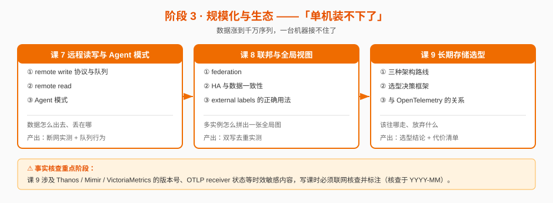

# 阶段 3：规模化与生态

> 所属课程：Prometheus ｜ 故事章节：**"单机装不下了"** —— 数据涨到千万序列，一台机器接不住了 ｜ 上一阶段：[阶段 2 规则与告警](../2-规则与告警/overview.md)

## 🎯 本阶段目标

- 能画出 remote write 的完整数据路径，指出每个可能丢数据的点，并给出对应的配置缓解手段
- 能判断"单机装不下时该往哪走"，对 Thanos / Mimir / VictoriaMetrics 给出**有依据**的选型结论（含代价，不说"看情况"）
- 能说清 Prometheus 与 OpenTelemetry 的关系边界：什么时候该用 OTLP 直投，什么时候该保留拉取

## 📍 学习重点

- **remote write 的队列与重试语义**：这是**丢数据的重灾区**。队列满了怎么办、WAL 重放到哪、后端 5xx 时数据去哪了、重启会不会丢——这些问题的答案都在队列与 WAL 的交互里，不在文档的第一页。
- **联邦与 HA 双写的真实代价**：federation 常被当成" scaling 方案"误用，它解决的是"聚合视图"不是"容量问题"。HA 双写则会带来数据重复，去重靠 external labels + 后端，而不是 Prometheus 自己。
- **三条长期存储路线的架构差异**：Thanos（无 sidecar / agent 模式下的对象存储路线）、Mimir（微服务 + 多租户）、VictoriaMetrics（单体/集群，替换存储）。**选型课涉及时效敏感版本号，须过事实核查闸门**。

## ✅ 必须掌握的知识点

| 知识点 | 所属课 | 学完应能 |
|--------|--------|----------|
| remote write 协议与队列 | 课 7 | 画出 remote write 的 shards / queue / WAL 结构，说清队列满与后端故障时的行为，给出不丢数据的配置要点 |
| remote read | 课 7 | 解释 remote read 的三种模式（含 3.x 的流式 chunk 读取），并说明为什么它通常不该作为主查询路径 |
| Agent 模式 | 课 7 | 说清 Agent 模式砍掉了什么（本地 TSDB、查询、告警）、保留了什么，以及它适配的部署形态 |
| federation | 课 8 | 区分"分层联邦"与"跨服务联邦"两种用法，并说清 federation 只传聚合结果这一限制 |
| HA 与数据一致性 | 课 8 | 解释双写去重为什么必须在后端做，以及两条副本数据不一致时会发生什么 |
| external labels 的正确用法 | 课 8 | 说清 external labels 加在哪、为什么错了会毁掉全局查询与去重 |
| 三种架构路线 | 课 9 | 描述 Thanos / Mimir / VictoriaMetrics 的组件构成与数据流，指出各自的单点与扩展瓶颈 |
| 选型决策框架 | 课 9 | 按"规模 / 团队 / 租户 / 查询模式"四个维度给出选型结论，并说明放弃另外两个方案的代价 |
| 与 OpenTelemetry 的关系 | 课 9 | 说清 OTLP 直投 vs 拉取的适用边界，以及 Prometheus 3.x 的 OTLP receiver 状态（**须事实核查**） |

## 📌 课 7 完成情况（2026-09-04）

**状态**：✅ 已完成 ｜ 双视角评审 P0 清零 ｜ 命令复验 **32 项断言全 PASS**

**核心结论（均本机 v3.14.0 实测）**：

1. **remote write 的数据路径与丢失点**：TSDB WAL → shard 队列 → HTTP 客户端三层。`pending` 可超 `capacity`（1199 > 1000）因 WAL 在外层兜底；500/503 是**可重试错误**（`failed_total` 恒为 0）；积压会完整补发（恢复期 **2.00x**）。**真正丢数据的位置只有一个：WAL 被截断**——实测连续 45 分钟两侧磁盘**只增不减**，截断只由 TSDB 保留期驱动，与发送确认**解耦**。
2. **remote read 不该作为主路径**：代价 **2.69x**（本地 1.6ms vs 远端 4.4ms），且**失败是静默的**（`status` 仍为 `success`，原因只在 `warnings`）。告警与规则求值**只走本地 TSDB**。
3. **Agent 模式的能力边界**：`--agent` 是独立 flag（3.0 转正）；**拒绝任何 `rule_files`，含 recording rules**；查询类 API 返回 **422**（端点存在但模式禁用）；无 `head_series`；WAL 只留 **4h**；自监控**必须外置**。同起点实测内存 **-25%**，磁盘 15 分钟 1.2x、45 分钟 1.63x。

**本阶段目标对照**：阶段目标第 1 条「画出 remote write 完整数据路径，指出每个可能丢数据的点，并给出配置缓解手段」——**已达成**，讲义第五幕给出了三条配套告警规则（积压 / 入队失败 / 永久失败），设计思路是**前两条作为提前量，在 WAL 被截断之前给出抢救窗口**。

**推翻的预设（已登记 [00-学习档案.md](../../00-学习档案.md) 事实核查表）**：Agent 保留 recording rules（**错，实测拒绝**）、`--enable-feature=agent`（**旧写法**）、Agent 磁盘省 97%（**自己的测量错误**）、pending 上限存在模式差异（**实为 capacity 配置不同**）。

**留给课 8 / 课 9 的挂账项**：
- **Alertmanager 多副本的 gossip 去重**（课 5 埋）→ 课 8《联邦与全局视图》正面处理
- **remote read 三种模式的分模式性能差异** → 课 9《长期存储选型》
- **Thanos / Mimir 的远端侧背压机制**：本课只讲清了 Prometheus 侧的队列与 WAL
- **Agent 在大规模序列数下的资源优势** → 阶段 4 课 11（本例仅 507 条序列）

## 📌 课 8 完成情况（2026-09-07）

**状态**：✅ 已完成 ｜ 双视角评审 P0 清零 ｜ 命令复验 **21 项断言，20 PASS / 1 FAIL**（FAIL 经查证系断言未固定求值时刻，已修正）

**核心结论（均本机实测）**：

1. **federation**：`/federate` 返回的是**带毫秒时间戳的当前值**，不是历史序列。**不搬历史**（查 1 小时前返回 0 条，全局节点历史从配置时刻开始）。**不解决容量**——全局节点要存下全部数据（10×100 万 → 全局仍 1000 万），它扩的是**采集能力**。`TYPE` 全变 `untyped` 但**不影响 `rate()`**（固定求值时刻对比：叶子 1.2 = 全局 1.2）。`honor_labels=false` 时 `job`/`instance` 被改写成联邦 target——**丢的是溯源信息，条数不变**。
2. **HA 与数据一致性**：双副本**互不感知**，数据**永远不相等**（平均差 **9.63**、最大 **23.11**，成因是抓取定时器相位不同）。**Prometheus 自己不去重**（不知道对方存在）；去重在后端，靠 **`replica` 标签保留两份 + 查询时 `max/avg without(replica)`**。VM 的 `dedup.minScrapeInterval` 只在**标签完全相同**时介入，带 replica 时不合并——**这是正确行为**。
3. **external labels**：只加在**出站数据**（federate / remote write），**不影响本地查询**（告警规则里也用不了）。`cluster` 必须**全局唯一**；HA 副本**必须带 `replica`**——无 replica 时后端 dedup 合并成一份，看似干净，实则**值在副本间无规律跳变**（实测 4605.37~4670.70）且**失去「某个副本掉线」的感知能力**。

**本阶段目标对照**：阶段「学习重点」第 2 条「联邦与 HA 双写的真实代价——federation 常被当成 scaling 方案误用，它解决的是聚合视图不是容量问题；HA 双写会带来数据重复，去重靠 external labels + 后端，而不是 Prometheus 自己」——**三条断言全部经实测确认**。

**课 5 伏笔已回收**：Alertmanager 多副本 gossip 去重。决定性对照——gossip 集群（peers=2）**1 条通知** vs 孤立双副本（peers=1）**2 条通知**。gossip 同步的是**静默状态**与**通知日志**，不是告警本身。

**修正的 3 个「看起来成立、实则不严谨」的结论**（已登记 [00-学习档案.md](../../00-学习档案.md) 事实核查表）：「untyped 导致 rate 失效」未成立、「honor_labels=false 导致数据丢失」部分修正（丢的是溯源信息不是数据）、「VM dedup 会合并 HA 双写」不成立。

**留给课 9 / 阶段 4 的挂账项**（本课已交接）：
- **联邦在大规模序列数下的表现**（课 9）：本例仅 507 条，瓶颈在大规模下才暴露 → **课 9 未实测**（规模仍不足），继续挂账
- **`replica` 思想在 Thanos / Mimir 中的演进**（课 9）：Thanos 的 `__replica__`、Mimir 的 HA tracker → **课 9 已回收**
- **remote read 三种模式的分模式性能差异**（课 9）：课 7 只验证了整体代价 2.69x
  → **课 9 首次未取得，同日补做完成（2026-09-07）**。补做中更正了课 7 的表述错误：
  实为**两种模式**（`SAMPLES` / `STREAMED_XOR_CHUNKS`），`STREAMED_CHUNKS` 不存在，
  `read-max-bytes-in-frame` 是分帧参数非模式。结论：体积有交叉点
  （≤18 序列时流式省 3.2x，≥500 序列时 SAMPLES 省），内存上流式恒赢
  （SAMPLES +8~10 MiB，STREAMED −7~10 MiB）。数据见 [RR-DATA.md](../../labs/lesson-09/RR-DATA.md)
- **gossip 建立耗时在生产环境的数值**（阶段 4 课 11）：本例 10~12 秒是同机两副本低负载下的值

## 📌 课 9 完成情况（2026-09-07）

**状态**：✅ 已完成 ｜ 双视角评审 P0 清零 ｜ 命令复验 **24 项断言全 PASS** ｜ 结构校验 19 项全 PASS ｜ **事实核查闸门已过（核查 13 条）**

**核心结论（均本机实测）**：

1. **三种架构路线**：Thanos 是「给 Prometheus 加外挂」（保留完整 Prometheus，sidecar 传 block）；Mimir 是「拆微服务」（Prometheus 降级为采集器，单体模式实测 **1 容器 / 8 秒 ready / 72.68MiB**）；VM 是「换存储引擎」。**对象存储对 Thanos、Mimir 是硬依赖，对 VM 不是**——没有对象存储时前两者直接出局。
2. **选型决策框架**：先问「**有没有对象存储**」和「**要不要多租户**」，这两条能淘汰三分之二选项。Mimir 是三者中**唯一原生多租户**（实测：无租户头 401、跨租户查询 0 条，属**存储级隔离**非查询过滤）；Thanos **无租户概念**。
3. **HA 去重的语义不等价**（本课最危险结论）：Thanos 在**查询层**去重，漏配 `--query.replica-label` 会让所有聚合查询**翻倍**——实测 `sum` **62162 vs 124347**、`count` **1 vs 2**、range 查询 **3/63 vs 6/126（精确 2 倍）**，且**不报任何错**，告警阈值会全部失效。
4. **与 OpenTelemetry 的边界**：OTLP 直投只适合「**拉不到的目标**」（短生命周期任务、NAT 后、已是 OTel 原生），官方文档明确保留警告「not suitable for replacing the ingestion via scraping」。

**本阶段目标对照**：阶段「学习重点」第 3 条「三条长期存储路线的架构差异——**选型课涉及时效敏感版本号，须过事实核查闸门**」——**已过闸门**，核查出 **13 条**版本漂移与常见误解，全部记录于 [00-学习档案.md](../../00-学习档案.md) 课 9 事实核查表。四条最容易踩的：①Thanos v0.42.4 的 S3 字段是 `bucket_lookup_type: path`，教程通用的 `s3forcepathstyle` 会让组件**直接启动失败**；②Thanos `--store` flag 已移除、`--endpoint` 已 Deprecated，推荐 `--store.sd-files`；③Prometheus 3.x OTLP 启用方式是 `--web.enable-otlp-receiver`（2.x 的 `--enable-feature=otlp-write-receiver` 已移除），端点为 `/api/v1/otlp/v1/metrics`（**短路径 `/api/v1/otlp` 返回 404**）；④VM 集群版查询必须加 `/select/<tenantID>/` 前缀（单节点路径返回 **400**，迁集群时 Grafana 数据源与告警规则 URL 全要改）。

**回收的挂账项**：课 8 的「`replica` 思想在 Thanos / Mimir 中的演进」——已用 Thanos 去重开关的决定性对照回收（Q1 去重 / Q2 不去重）。

**「0 条」陷阱本课出现 5 次，全部不是真的没有**：store 发现延迟 35 秒、app 容器未启动（`up=0`）、VM 写入可见性延迟（计数器 754 行已写入）、OTLP 路径错误、`thanos tools bucket list` 子命令错误致**报错掩盖字段校验**（五个候选字段全误判 ACCEPTED）。

**诚实披露（4 项未实测，未编造数字）**：remote read 分模式性能差异（环境已建但未构造出可复现对照，顺延）、联邦大规模表现、Thanos/Mimir 远端侧背压、Thanos compactor 单例约束（引官方文档）。

**阶段 3 收官**：三课的目标全部达成——remote write 数据路径与丢失点（课 7）、联邦与 HA 双写的真实代价（课 8）、长期存储选型（课 9）。

## 🗺️ 本阶段路径图

## 本阶段产出

- [x] `lessons/lesson-07-远程读写与Agent模式.md` — 2026-09-04 交付（66KB，五幕结构，双视角评审 P0 清零，命令复验 32 PASS）
- [x] `lessons/lesson-08-联邦与全局视图.md` — 2026-09-07 交付（62KB，五幕结构，双视角评审 P0 清零，命令复验 20 PASS）
- [x] `lessons/lesson-09-长期存储选型.md` — 2026-09-07 交付（57KB，五幕结构，双视角评审 P0 清零，命令复验 24 PASS，事实核查闸门已过）

**阶段状态**：✅ **阶段 3《规模化与生态》全部完成**（课 7 / 8 / 9，共 9 个知识点）。下一阶段：[阶段 4 生产运维](../4-生产运维/overview.md)
