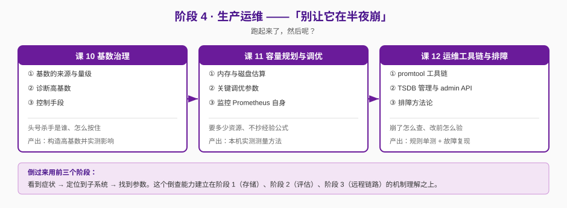

# 阶段 4：生产运维

> 所属课程：Prometheus ｜ 故事章节：**"别让它在半夜崩"** —— 跑起来了，然后呢？ ｜ 上一阶段：[阶段 3 规模化与生态](../3-规模化与生态/overview.md)

## 🎯 本阶段目标

- 能诊断一次 Prometheus OOM / 写入变慢的根因，而不是靠重启蒙过去
- 能对一套给定的监控规模做出**有实测依据**的容量估算，并给出调优参数
- 能用 promtool 与 TSDB admin API 在做变更前验证配置、在出事后安全处置

## 📍 学习重点

- **基数（cardinality）是 Prometheus 的头号杀手**：它决定内存占用、查询延迟、存储成本。控制基数不是"删几个标签"这么简单，是要建立一整套从暴露端到存储端的治理习惯。
- **容量估算的实测方法**：业界流传的"每序列 2 字节""每百万序列 8GB 内存"都是粗略经验值，真实数字取决于标签长度、样本密度、chunk 分布。**本课要带你在真实容器里量一遍**，而不是抄结论。
- **排障方法论**：把前三个阶段讲的机制反过来用——看到症状，能定位到是哪个子系统的哪个参数在起作用。

## ✅ 必须掌握的知识点

| 知识点 | 所属课 | 学完应能 |
|--------|--------|----------|
| 基数的来源与量级 | 课 10 | 识别高基数的四类来源（实例 churn / 标签值失控 / 直方图桶 / 元数据），并估算各自的序列放大倍数 |
| 诊断高基数 | 课 10 | 用 `topk` + `tsdb` 状态 API 定位到具体是哪个指标、哪个标签在涨 |
| 控制手段 | 课 10 | 给出从暴露端、抓取端、存储端三个层次的降级与截断手段，并说明各自的副作用 |
| 内存与磁盘估算 | 课 11 | 在真实容器里测量给定规模的内存与磁盘占用，给出可复现的测量方法（不是抄经验公式） |
| 关键调优参数 | 课 11 | 说清抓取间隔、保留时间、chunk 相关参数各自影响什么，以及改动的连带后果 |
| 监控 Prometheus 自身 | 课 11 | 列出必看的自身指标与对应的告警规则（谁来看着看门人） |
| promtool 工具链 | 课 12 | 用 promtool 做配置校验、规则单测、查询基准测试、数据推送与调试 |
| TSDB 管理与 admin API | 课 12 | 安全执行快照、删除序列、清理 tombstone，并说清各项操作的破坏性与前置条件 |
| 排障方法论 | 课 12 | 按"症状 → 子系统 → 参数"的倒查路径，独立定位一类典型故障 |

## 🗺️ 本阶段路径图

## 本阶段产出

- [x] `lessons/lesson-10-基数治理.md`
- [x] `lessons/lesson-11-容量规划与调优.md`
- [x] `lessons/lesson-12-运维工具链与排障.md`

## 课 10 完成情况（2026-09-07）

**状态**：✅ 已完成（三个知识点全部有本机实测支撑）

**核心实测结论**：

| 项 | 实测值 |
|---|---|
| 基线序列数（无业务指标） | 21 |
| 加 5000 个 `user_id` | 5 021（+5 000，严格 1:1） |
| 加 2000 个 URL 路径 | 2 021（+2 000） |
| 加 1000 个 `request_id` | 1 021（+1 000） |
| histogram 展开（3 route × 12 桶） | `bucket` = 36 条（12x 放大） |
| `metric_relabel` drop 两个高基数指标 | 3 557 → 557，target 仍 `up=1` |
| `sample_limit: 100` | `up=0`，整批作废（熔断非限流） |
| `label_limit: 3` | `up=0`，且拦在了无关的 GC 指标上 |

**两处对常见说法的更正**：

1. `prometheus_tsdb_head_series` **在本环境不存在**（已查证 `/api/v1/label/__name__/values`），
   诊断基数应优先用 `/api/v1/status/tsdb`。
2. `sample_limit` / `label_limit` 是**熔断**不是限流：触发后整个 target `up=0`，
   且 `label_limit` 是 per-target 全局的，会误伤无关指标。

**遗留挂账（留待课 11）**：

- **每序列内存占用系数**：本机规模测不出（3 轮复现基线波动 31.43~38.79 MiB），
  课 11 需用 10 万级序列 + 多次采样重测
- 10 万级以上序列的查询延迟劣化
- 实例 churn 的时间维度累积效应

**遗留挂账（留待课 12）**：

- `--storage.tsdb.max-series-per-*` 系列硬限制的实际触发行为
- 删除高基数指标后磁盘未释放的 tombstone / compaction 实测

完整数据见 [CARDINALITY-DATA.md](../../labs/lesson-10/CARDINALITY-DATA.md)

## 课 11 完成情况（2026-09-07）

**状态**：✅ 已完成（三个知识点全部有本机实测支撑，**已补上课 10 欠的内存系数**）

**核心实测结论**：

| 项 | 实测值 |
|---|---|
| 每序列内存（1 标签） | **1.662 KiB**（拟合 R²=0.9969） |
| 拟合截距 / 实测空实例 | 27.71 MiB / **29.10 MiB**（互相印证） |
| 每标签内存 | **0.202 KiB/序列/标签** |
| 100 万序列（1/3/5 标签） | 1.76 / 2.12 / **2.54 GiB** |
| 并发 5 全量查询峰值 | **稳态的 2.96x**（113 → 335 MiB） |
| 每样本磁盘（WAL 口径） | **7.2 字节** |
| self-scrape 前后指标数 | **6 → 328** |
| 测量波动 | 课 10 ±12% → 本课 **±0.2%** |

**★ 对课 10 的错误结论的纠正**：

课 10 称「`prometheus_tsdb_head_series` 在本环境不存在」——**这是错的**。
真实原因是**未配 self-scrape job**。实测加 self-scrape 后指标数 **6 → 328**。
课 10 讲义与数据底稿**均已回填更正**。
（方法建议仍成立：`/api/v1/status/tsdb` 不依赖抓取链路，self-scrape 挂了也能用。）

**两处参数实测**：

1. `scrape_timeout > scrape_interval` → **启动即失败**（不会带病运行）
2. `retention` 改配置 + SIGHUP → 日志显示配置已读取，但 **retention 仍是旧值**，**必须重启**

**遗留挂账（留待课 12）**：

- **compaction 后 block 的真实磁盘占用**：3.14 已移除 `--storage.tsdb.max-block-duration`，
  无法在合理时间内强制落盘，本课磁盘数字是 **WAL 口径**
- tombstone / `cleanTombstones` 后磁盘何时真正释放
- `--storage.tsdb.max-series-per-*` 硬限制的实际触发行为

**本机测量边界**：可信上限约 **15 万序列**（31 GiB 总内存 / 约 7 GiB 可用），
20 万序列 3 轮极差 45.67 MiB，不可用。

完整数据见 [CAPACITY-DATA.md](../../labs/lesson-11/CAPACITY-DATA.md)

## 课 12 完成情况（2026-09-07）

**状态**：✅ 已完成（三个知识点全部有本机实测支撑，**还清课 10/11 的四笔挂账**）

**核心实测结论**：

| 项 | 实测值 |
|---|---|
| `check config` 拦截能力 | 拦住 `timeout>interval`、YAML 缩进；**放行**不存在的元标签 |
| `test rules` 拦错能力 | ✅ 反向验证 FAIL（`exp:[]` vs `got:[...]`） |
| `check metrics --extended` | 出基数 Top 表；报出 Prometheus **自身 5 条**命名违规 |
| `check healthy/ready` | **只连 `localhost:9090`**，不接受 URL |
| `tsdb create-blocks-from` | 必须 `# EOF`，否则报 `does not end with # EOF` |
| `delete_series` | HTTP 204，但**只删删除时点前的历史** |
| 删除后 headSeries | **不降**（20 782 → 20 782） |
| 删除后磁盘（对照实验） | **净增 0 KB，即不释放** |
| `clean_tombstones` | 对 head 数据**无效**（blocks=0） |
| 重启后删除 | ✅ 仍生效（持久化成功） |
| `--storage.tsdb.max-series-per-*` | ❌ **3.14.0 已移除**（unknown long flag） |
| 超时后 `scrape_duration_seconds` | **1.0009s（截断值）**，源站真实 5.99s |

**★ 三笔挂账的清偿结论**

1. **删除后磁盘未释放（课 10、课 11 各挂一次）**：对照实验（A 删 / B 不删）实测**净增 0 KB**，
   即删除**不释放**磁盘。本课**推翻了自己初判的「磁盘反涨」**——那是 self-scrape 自然增长，
   不是 tombstone 的锅。真正的释放要等数据落盘成 block 后 `clean_tombstones` 才有效。
2. **`--storage.tsdb.max-series-per-*` 触发行为（课 10、课 11 各挂一次）**：
   **该 flag 在 3.14.0 根本不存在**（`unknown long flag`），tsdb flag 只剩 6 个。
   防基数爆炸只能靠**抓取端** `sample_limit` / `label_limit` / `metric_relabel_configs`。
3. **compaction 后 block 磁盘占用（课 11 挂）**：本课用 `tsdb create-blocks-from`
   离线造出真实 block 并用 `tsdb analyze` 分析，但**运行中实例的 block 落盘仍需 2 小时**，
   该数字仍未拿到，**继续挂账**（建议：长期运行实例或课后续做）。

**一个实验方法上的自我纠错**

本课实验中一度判「删除后重启，数据复活」，**这是误判**。真因是 **app 持续产生新数据**——
`delete_series` 只删**删除时点之前**的历史，不阻止新样本入库，所以 count 立刻回填。
停掉 app 后重测，删除正常生效且重启后仍生效。
（此误判已作为方法论素材写入讲义：判断「删除是否生效」必须先切断数据源。）

完整数据见 [TOOLING-DATA.md](../../labs/lesson-12/TOOLING-DATA.md)

---

**阶段 4 状态**：✅ **全部完成**（课 10 / 11 / 12，9/9 知识点）
