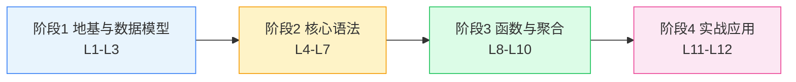

# PromQL 学习路径总览

> 零基础 + 实操导向 | 4 阶段 12 课 | 每课含动手练习

## 路径地图

## 各阶段定位

### 阶段 1：地基与数据模型（L1-L3）

**要解决的问题**：PromQL 查的东西到底是什么？

从「为什么需要监控」讲起，认识 Prometheus 的角色，理解指标、标签、时间序列三种核心概念，区分四种指标类型。这是后面一切语法的地基：不懂 Counter 的递增特性，就永远理解不了为什么要用 `rate()`。

### 阶段 2：核心语法（L4-L7）

**要解决的问题**：怎么取数、怎么算数、怎么拼数据？

瞬时向量与范围向量的区别是 PromQL 第一道分水岭；标签匹配器负责筛选；运算符负责计算；向量匹配负责把两个指标拼在一起。学完本阶段，你能独立写出中等复杂度的查询。

### 阶段 3：函数与聚合（L8-L10）

**要解决的问题**：日常监控查询的 80% 套路。

`rate()` 系列、`sum() by ()` 系列、`histogram_quantile()` 是生产环境出现频率最高的三组工具。本阶段把它们一次讲透，附带常见误用。

### 阶段 4：实战应用（L11-L12)

**要解决的问题**：查询怎么变成真正的告警和面板？

把前三阶段的能力组装起来：写 Prometheus 告警规则文件、配 Grafana 面板、避开生产环境常见坑（查询打爆服务器、告警风暴等）。

## 实操环境说明

全程使用在线演练场 [demo.promlens.com](https://demo.promlens.com/)，浏览器打开即用，无需安装任何软件。数据为预置的 demo 服务指标，涵盖 CPU、内存、HTTP 请求等常见监控对象。
