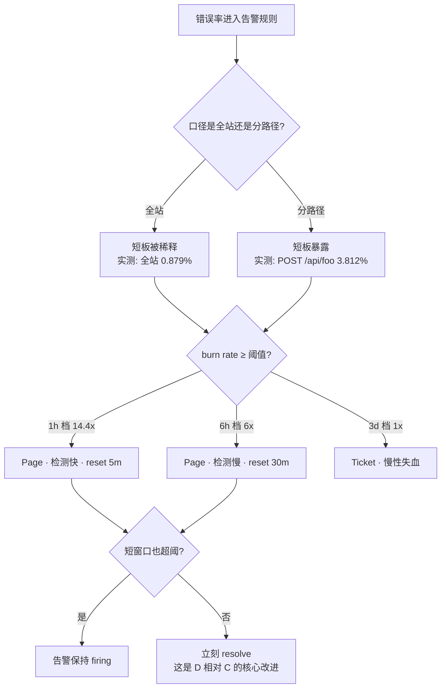

# PromQL 场景解法库

> **怎么用**：每个场景先自己想 30 秒，再展开看解法。**先想后看，设计能力才长出来**——照着抄答案你只会抄到这 6 个场景，学会权衡你能应付第 7 个。
>
> 配套：[08-实战经验.md](08-实战经验.md)（为什么会崩）｜ [09-排障速查手册.md](09-排障速查手册.md)（崩了怎么止血）。
>
> **三份怎么分工**：经验层讲原理（坐着读）、手册给动作（崩了翻）、本库给**多方案权衡**（要设计了读）。别拿本库当排障手册用——设计题里没有"唯一正确答案"。

## 证据说明

- **实测数据**：标注「实测」的数字均来自演练场 `demo.promlabs.com`，**2026-08-31 现场拉取**（`/api/v1/query` 与 `/api/v1/query_range?stats=all`）。环境为 3 实例 demo 服务，`demo.*` 指标共 **837 条序列**。
- **推演数据**：标注「推演」的部分是基于实测基数按比例推算，或本环境无法构造的场景（如实例频繁上下线、批处理任务），**不冒充实测**。
- **官方结论**：版本号、推荐参数、官方警告均标注 `（核查于 2026-08）` 与来源链接，见文末「📚 官方文档」。

> ⏳ **置信度提示**：本库涉及版本状态的内容（如 native histograms）时效敏感，已联网核查并标注版本；升级前请再次核对当前版本。

**已收录 6 个场景**。宁缺毋滥——凑不满就如实写数字，不硬凑凑数场景。选取标准是「领域高频 × 决策价值」，且每个场景都能挂回本课程知识点。

## 🗂️ 场景索引（按你现在的问题找）

| 如果你现在遇到的是… | 翻到 |
|-------------------|------|
| 序列数 / 内存涨得离谱，怀疑加了不该加的标签 | **场景 1**：基数爆炸 |
| SLO 阈值和直方图的桶对不上，查询返回空表 | **场景 2**：桶边界问题 |
| 告警要么不响、要么吵到没人看 | **场景 3**：灵敏度与噪声的拉锯 |
| 实例频繁上下线，曲线断裂、告警乱响 | **场景 4**：实例 churn |
| 一块面板把整个 Prometheus 拖慢 | **场景 5**：查询成本 |
| 批处理任务跑完就没了，抓不到指标 | **场景 6**：短命任务监控 |

---

## 场景 1：加了一个标签，序列数从 837 涨到 27 万

**场景描述**：线上服务为了"能按用户排查问题"，给请求计数指标加了一个 `user_id` 标签。上线后 Prometheus 内存持续上涨，抓取耗时从 200ms 涨到 3s，打开任何面板都要等十几秒。基数审计显示：`demo.*` 指标从 **837 条序列**（本环境实测基线）涨到二十多万条。

> 📐 **27 万这个数字怎么来的（推演，非实测）**：本环境请求计数指标有 27 条序列（`method × path × status` 的组合，实测），乘以 1 万个活跃用户 ≈ **27 万条**。基数爆炸的公式永远是 `序列数 × 新标签取值数`——加标签前先估算这个乘积，是唯一有效的预防手段。

**🔒 先自己想 30 秒**：第一反应是加内存？加机器？还是删数据？如果让你来救火，**第一步**做什么？

<details><summary>💡 提示（分三层想）</summary>

- **数据模型层**：这个标签**真的该加**吗？它的取值有多少？会不会无限增长？
- **抓取层**：能不能在**进 Prometheus 之前**就把它拦下来？
- **查询/存储层**：保留细粒度但缩短保留期？还是预聚合成少量序列长期保存？
- **护栏层**：下次有人再加一个高基数标签，怎么提前发现？

</details>

<details><summary>📖 展开解法</summary>

### 解法一览（5 个，含代价与边界）

| 解法 | 能解决到 | 代价 | 适用边界 |
|------|---------|------|---------|
| **A · 标签降维**：不加 `user_id`，改用有限取值维度（如 `user_tier=gold/silver`、`region`），把用户级明细交给日志/链路追踪 | 治本，序列数不增长 | 失去"按单个用户下钻"的能力；需要与日志系统打通才有替代 | 只要"分群看"就够的场景（绝大多数） |
| **B · 抓取侧拦截**：用 `metric_relabel_configs` 把高基数标签 `drop` 掉，或用 hash 分桶把值收敛到有限集合 | 不用改代码，当天生效 | 需维护 relabel 规则；信息有损；规则写错会误删别的标签 | 埋点已上线、来不及发版的救火场景 |
| **C · 预聚合 + 分层保留**：细粒度序列短保留（如 2 天），用 recording rules 预聚合成服务级序列长期保留 | 保留排障所需的近期明细，长期成本可控 | 失去历史明细；多一层规则要维护 | 既要看近期明细、又要看长期趋势（注意：本地 TSDB **默认只保留 15 天**，若未显式设置 `storage.tsdb.retention.time`，"长期"根本不存在——核查于 2026-08） |
| **D · 扩容 / 换存储**：按服务拆分 Prometheus + 联邦，或换 VictoriaMetrics / Mimir 等水平扩展方案 | 扛住更高基数 | 运维复杂度显著上升；联邦本身也有坑 | 基数**确实**需要这么高（业务合理性已确认） |
| **E · 元告警（护栏）**：用 `count(count by (__name__)({__name__=~".+"}))` 与 `topk` 做基数审计，对"序列数增长率"设告警 | 不解决问题，但能让问题**在下一次上线时被打回** | 需要定期维护阈值 | 任何规模都必须配（它不是解法，是保险丝） |

### 推荐路径（递进，不是一次全上）

1. **先上 E**（当天）：没有护栏，任何治理都会被人下一次上线打回。至少配一条"序列数 1 小时涨 50%"的告警。
2. **紧急止血用 B**（当天）：`metric_relabel_configs` 把 `user_id` drop 掉，先把内存水位降下来。
3. **治本用 A**（下一个发版窗口）：把用户级维度挪到日志/追踪，指标只保留分群维度。
4. **仍要看近期明细才上 C**（一周内）：细粒度序列短保留 + 服务级预聚合长保留。
5. **最后才考虑 D**：先证明"这个基数业务上真的必要"，再谈扩容。否则只是用钱买时间。

```yaml
# B 的写法示例：抓取时丢弃 user_id（在进 TSDB 之前拦下）
scrape_configs:
  - job_name: demo
    metric_relabel_configs:
      - action: labeldrop
        regex: user_id            # 整条标签丢掉，序列数立刻回落
```

```promql
# E 的写法示例：基数审计三连（实测：本环境 demo.* 共 837 条序列）
count({__name__=~"demo.+"})                          # 总量：837
topk(5, count by (__name__) ({__name__=~"demo.+"}))  # 谁最占地方
count by (path, method, status) (demo_api_request_duration_seconds_count)  # 单指标的标签构成
```

### 知识点挂钩

- 标签基数是**序列数**的乘数 → L2《数据模型》
- 预聚合降维靠 `sum by` / `without` → L9《聚合全家桶》
- 序列数 × 时间范围 × 窗口 = 读取样本数 → L12《查询优化》
- 高基数属于"不该用 Prometheus 的场景" → [08-实战经验.md](08-实战经验.md) 适用边界表第 3 行

### 什么情况下此方案不适用

- **真的需要按用户维度做分析**（如"某 VIP 用户的所有请求耗时分布"）——Prometheus **不是**正确的工具，指标天生是聚合视角。这类需求应交给日志（Loki/ELK）或数仓，Prometheus 只负责"总量/分群"层面的信号。
- **基数来自不可避免的维度增长**（如每个租户一条序列，而租户在增长）——这时 B/C 都只是拖延，应直接评估 D。

### 做错会踩的坑

→ [08-实战经验.md](08-实战经验.md) · **故障模式 6**（查询把自己打爆）：基数失控后最典型的症状是面板卡死，而不是"内存告警"。
→ 注意一个反直觉点：**`sum` 聚合救不了已经爆掉的基数**——聚合只减少返回行数，服务端照样要把几百万条序列读进来（见场景 5 的实测）。

</details>

---

## 场景 2：SLO 是 100ms，但桶里根本没有 `0.1` 这个边界

**场景描述**：服务的延迟 SLO 定为"P95 ≤ 100ms"。你信心满满写下 `histogram_quantile(0.95, sum by (le) (rate(..._bucket[5m])))` 配成告警，又写了桶占比口径的合规率面板——结果面板显示 **0%**，而单独查 `_count`、查 `_bucket` 都有数据。

**实测复现**（2026-08-31，本次备课再次复现）：

```promql
sum(rate(demo_api_request_duration_seconds_bucket{job="demo",le="0.1"}[5m]))
# → 0 行。不报错。这就是静默失败。

sum(rate(demo_api_request_duration_seconds_bucket{job="demo",le="0.09852612533569335"}[5m]))
  / sum(rate(demo_api_request_duration_seconds_count{job="demo"}[5m]))
# → 1 行，0.9965（99.65%）

count(count by (le) (demo_api_request_duration_seconds_bucket{job="demo"}))
# → 26（本环境共 26 个桶，×1.5 递增阶梯，0.0985 的下一个是 0.1478）
```

**🔒 先自己想 30 秒**：产品同学说"必须是精确 100ms，不接受 98.5ms"。你会怎么回？

<details><summary>💡 提示（分三个方向想）</summary>

- **口径方向**：SLO 一定要用"分位数"表述吗？"不超过 100ms 的请求占比 ≥ 95%"是不是更直接、更好算、也更好解释？
- **埋点方向**：桶边界是**埋点时就定死**的。事后能不能改？改了历史数据怎么办？
- **技术方向**：有没有一种直方图**不需要预先配置桶边界**？

</details>

<details><summary>📖 展开解法</summary>

### 解法一览（4 个，含代价与边界）

| 解法 | 能解决到 | 代价 | 适用边界 |
|------|---------|------|---------|
| **A · 改用桶占比口径**：SLO 从"P95 ≤ 100ms"改为"≤100ms 的请求占比 ≥ 95%"，用最近且真实存在的桶近似 | 当天可用，零改造；口径比 P95 更好解释给业务方 | 与"P95"这个说法不对齐，需要推动改写 SLO 表述；近似桶比目标略严（0.0985 vs 0.1） | 绝大多数 Web 服务 SLO（**推荐首选**） |
| **B · 改埋点补桶**：在 `buckets` 里显式列出 SLO 边界（如 `[0.05, 0.1, 0.2, 0.5, 1, +Inf]`） | 从根本上对齐，分位数与桶占比都能精确算 | 需要发版；**改桶 = 新序列从 0 开始累积**，历史数据与新数据不可直接比对，过渡期要双写或接受断点 | 能排上发版窗口、且 SLO 边界长期稳定 |
| **C · 换 native histograms**：动态指数桶，无需预先配置边界，桶分辨率更高且存储更省 | 一劳永逸解决"边界对不上"这一类问题 | 需要 Prometheus **v3.8+**；v3.9 起必须显式设置 `scrape_native_histograms: true`（v4 起才默认开启）；客户端库、面板、告警都要适配新类型 | 版本可控、愿意承担迁移成本的新项目 |
| **D · 保留经典桶，抓取时转成 NHCB**：`convert_classic_histograms_to_nhcb: true` 把经典直方图按原有边界转成 **NHCB**（native histogram with custom buckets，即用自定义边界表达的原生直方图） | 边界精确保留（就是原来那些 le 值），存储成本下降 | 不同自定义桶边界之间**可合并性有限**——边界一改，合并后可能只剩一个溢出桶 | 桶布局稳定、且已上 v3.8+ 的场景 |

> ⏳ **版本状态**（核查于 2026-08，来源 [prometheus.io/docs/specs/native_histograms/](https://prometheus.io/docs/specs/native_histograms/)）：native histograms 于 v2.40 作为实验特性引入，**自 v3.8.0 起为 stable feature**；抓取仍须显式开启 `scrape_native_histograms`（v3.8 中 feature flag 的唯一作用是把该项默认置为 true，v3.9 起 feature flag 为 no-op，**必须显式配置**），v4 起二者将默认开启。

### 推荐路径（递进）

1. **今天就用 A**：把 SLO 表述改成"占比"，用真实存在的桶出数。实测本环境 `le="0.0985..."` 得 **99.65%**——数字立刻可用，且与产品要表达的"100ms 内完成"语义完全一致。
2. **下一个发版窗口做 B**：在埋点里显式补上 SLO 边界桶，并做好"历史断点"的沟通（新桶上线后前 N 天的数据不可用，或用双写过渡）。
3. **长期评估 C**：新服务直接上 native histogram；老服务等 v4 生态成熟再迁移。

```promql
# A 的成品查询（SLO 合规率，"≤100ms 占比"，实测 99.65%）
sum(rate(demo_api_request_duration_seconds_bucket{job="demo",le="0.09852612533569335"}[5m]))
  / sum(rate(demo_api_request_duration_seconds_count{job="demo"}[5m]))

# 配成告警（注意：for 与阈值都来自 SLO，不是拍脑袋）
# expr: <上面的式子> < 0.95
# for: 5m
```

### 知识点挂钩

- Histogram 的桶是**累积**的、边界**埋点时固定** → L3《四种指标类型》
- `histogram_quantile` 需要 `le` 参与聚合，缺了就静默返回空表 → L10《histogram_quantile》
- 分位数口径 vs 桶占比口径的权衡 → [结课实战项目 · 设计决策 1](projects/demo服务可观测性体系/设计决策.md)
- 埋点时显式声明桶与指标类型 → 实战项目 `实现/exporter_app.py`

### 什么情况下此方案不适用

- **计费 / 对账 / 合同承诺类数字**：Prometheus 是采样存储（15s 抓一次，抓取失败就丢点），任何口径都只是近似。这类数字必须来自业务系统的精确流水，Prometheus 只做趋势参考。
- **A 方案在"合同写死了 P95"时**无法单独使用——必须先走通 B 把边界补上，否则分位数算出来的不是 100ms 处的真实值。

### 做错会踩的坑

→ [08-实战经验.md](08-实战经验.md) · **故障模式 1**（桶不存在导致静默失败）：匹配不到返回 0 行**且不报错**，是所有坑里最危险的一个——它不哭不闹，只是给你一个 0。
→ **故障模式 4**（le 标签处理错误）：`sum by (path)` 忘了带 `le`，同样返回空表。
→ **预防动作**：任何写 `le="X"` 的查询，先跑一次 `count by (le) (...)` 确认这个桶存在。

</details>

---

## 场景 3：告警要么不响，要么吵到没人看

**场景描述**：错误率告警配的是"全站错误率 > 0.5%，持续 5 分钟"。结果三个月里它只响过两次，两次都是真事故——但更糟的是值班同学早已把它加进了静默列表，因为"它平时从来不响，响了也看不出是哪个接口"。产品投诉过来时，全站看板一片绿色。

**实测现场**（2026-08-31，本环境**真实存在**的持续错误，非演练注入）：

| 口径 | 5m | 30m | 1h | 6h |
|------|-----|------|-----|-----|
| 全站错误率 | 1.149% | 0.883% | 0.879% | 0.863% |
| `POST /api/foo` 错误率 | 6.045% | — | 3.812% | — |
| `POST /api/bar` 错误率 | 2.204% | — | 1.654% | — |
| `GET /api/foo` | 0.850% | — | 0.776% | — |
| `GET /api/bar` | 0.394% | — | 0.391% | — |

> 总 QPS ≈ 176，全站错误率长期稳定在 0.86%~0.88%——**这是一个"稳定的坏状态"，不是毛刺**。

**🔒 先自己想 30 秒**：如果 SLO 定 99.9%（错误预算 = 0.1%），上面这张表换成**燃尽率（burn rate）**分别是多少？哪个口径会先响？

<details><summary>💡 提示</summary>

- burn rate = **实测错误率 ÷ 预算错误率**。全站 1h 是 0.879% ÷ 0.1% = ?
- 一个告警要"既灵敏又不吵"，需要同时控制哪两件事？（提示：**什么时候响** 和 **什么时候停**）
- 全站 vs 分路径，哪个先发现？发现之后是不是更好定位？

</details>

<details><summary>📖 展开解法</summary>

### 解法一览（5 个，含代价与边界）

| 解法 | 能解决到 | 代价 | 适用边界 |
|------|---------|------|---------|
| **A · 单阈值 + `for`**（`错误率 > 0.5% for 5m`） | 最简单，今天就能有 | 阈值靠拍脑袋；灵敏度与噪声绑死在一根绳上；**检测时间不随严重程度变化**（100% 宕机和 0.6% 超标同样是 5 分钟后才响） | 起步阶段；或作为兜底告警 |
| **B · 单窗口 burn rate**（1h 窗口，阈值 14.4×预算） | 阈值有了业务含义（"1 小时烧掉 2% 预算就喊人"）；检测快 | **reset time 长达 1 小时**（故障恢复了，告警还要亮 1 小时）；中等 burn rate（如 35×）仍会漏报 | 想引入"错误预算"概念的第一步 |
| **C · 多 burn rate 分档**（1h/14.4 与 6h/6 报 page，3d/1 报 ticket） | 快慢故障都能覆盖，并按紧急度分级 | 参数变多；3 天窗口导致 reset 更慢；**多个条件同时成立会重复告警，需要抑制** | 有明确 SLO 的服务（主流做法） |
| **D · 多窗口多 burn rate**（每档再加 1/12 长的短窗口，用 `and` 连接） | 在 C 的基础上**大幅缩短 reset time**（实测：故障结束后 5 分钟就停，而不是 1 小时） | 规则最长、参数最多；需要 recording rules 支撑多窗口比率 | **Google SRE 推荐做法**（见下方官方参数表） |
| **E · 分路径 + 抑制**（按 `method,path` 告警，全站只做总览；Alertmanager 用抑制规则去重） | 定位快、不让短板被稀释；噪音可控 | 告警条数可能变多，需要分组策略配合 | 与 B/C/D **叠加**使用，不是替代 |



> 本环境**实测换算**（SLO 假设 99.9%，预算 0.1%）：
> - 全站：1h → **8.79×**（< 14.4，1h 档**不响**）；6h → **8.63×**（> 6，与 30m 的 8.83× 一起命中 6h 档 → 响）
> - `POST /api/foo`：1h → **38.1×**、5m → **60.45×**（双双 > 14.4 → **1h 档立即响**）
>
> **一句话结论**：同一个故障，**全站口径要等 6 小时窗口才响，分路径口径 1 小时内就响**，而且后者直接告诉你"是 `POST /api/foo`"。这就是"分路径"不是可选优化、而是告警设计前提的原因。

**官方推荐参数**（核查于 2026-08，来源 [Google SRE Workbook · Alerting on SLOs](https://sre.google/workbook/alerting-on-slos/) Table 5-8）：

| 严重度 | 长窗口 | 短窗口 | burn rate | 触发时消耗的预算 |
|--------|--------|--------|-----------|-----------------|
| Page | 1 小时 | 5 分钟 | 14.4 | 2% |
| Page | 6 小时 | 30 分钟 | 6 | 5% |
| Ticket | 3 天 | 6 小时 | 1 | 10% |

> 短窗口的经验值：取长窗口的 **1/12**。短窗口的作用是确认"现在还在烧"，从而把 reset time 从长窗口时长压到短窗口时长。

```yaml
# D 的写法（99.9% SLO 示例；比率序列由 recording rules 预计算）
groups:
  - name: slo-burn-rate
    rules:
      - record: job:slo_errors_per_request:ratio_rate1h
        expr: sum(rate(slo_errors[1h])) by (job) / sum(rate(slo_requests[1h])) by (job)
      - record: job:slo_errors_per_request:ratio_rate5m
        expr: sum(rate(slo_errors[5m])) by (job) / sum(rate(slo_requests[5m])) by (job)
      # ... rate30m / rate6h 同理
  - name: slo-alerts
    rules:
      - alert: SLOBurnRateFast
        expr: (
            job:slo_errors_per_request:ratio_rate1h{job="myjob"} > (14.4 * 0.001)
          and
            job:slo_errors_per_request:ratio_rate5m{job="myjob"} > (14.4 * 0.001)
        )
        labels: { severity: page }
      - alert: SLOBurnRateSlow
        expr: (
            job:slo_errors_per_request:ratio_rate6h{job="myjob"} > (6 * 0.001)
          and
            job:slo_errors_per_request:ratio_rate30m{job="myjob"} > (6 * 0.001)
        )
        labels: { severity: page }
```

> ⚠️ **这里故意不写 `for`**：短窗口已经承担了"是否持续"的判断，再叠 `for` 属于重复延迟。Google SRE 明确指出**不建议把 duration 作为 SLO 告警的判据**（`for` 不随故障严重程度缩放：100% 宕机与 0.2% 超标同样等 1 小时；且指标一旦短暂回落计时器就重置，反复横跳的 SLI 可能永远不告警）。这正是 D 相对 A 的核心差异——**用"短窗口"换掉"`for`"**。

### 推荐路径（递进）

1. **先把 A 补上**（不做 SLO 也要有告警）。
2. **引入分路径（E）**——性价比最高的一步，实测证明它比换算法更能提前发现问题。
3. **升级到 C**：引入错误预算概念，用 ticket/page 分级把"慢性失血"和"急性大出血"分开处理。
4. **最后上 D**：加短窗口解决 reset time 过长导致的"告警恢复了但没人敢信"。
5. **配套抑制**：多档同时成立时只让最急的那条响（Alertmanager `inhibit_rules`）。

### 知识点挂钩

- 告警规则结构、`for` 的作用、阈值安全边际 → L11《从查询到告警规则》
- 窗口至少 4 倍抓取间隔 → L8《rate/irate/increase》
- 分路径聚合 `by (method, path)` → L9《聚合全家桶》
- 全站 vs 分路径的权衡 → [结课实战项目 · 设计决策 3](projects/demo服务可观测性体系/设计决策.md)

### 什么情况下此方案不适用

- **低流量服务**：Google 明确指出，多窗口 burn rate 依赖"足够多的请求"才有信号。10 QPS 的服务一次失败就是 10% 错误率、1000× 燃尽率，会立刻 page。低流量服务的四个官方出路：**造人造流量、把小服务合并监控、改造客户端降低单次失败影响、调低 SLO**。
- **极高可用性目标**（如 99.999%）：100% 宕机 26 秒就烧光预算，比告警链路本身还快——这时告警不是防御手段，架构设计（灰度、快速回滚）才是。

### 做错会踩的坑

→ [08-实战经验.md](08-实战经验.md) · **故障模式 8**（阈值贴着水位 → 反复横跳）：burn rate 同样要留安全边际。
→ **故障模式 3**（全站聚合稀释短板）：实测的铁证就在上面那张表里。
→ **故障模式 2**（面板与告警查询不同源）：上了 burn rate 后更容易出现——面板看的是"错误率百分比"，告警看的是"burn rate 倍数"，**两侧必须共用同一条 recording rule 序列**，否则又会对不上。

</details>

---

## 场景 4：实例每天重建几十次，曲线断成一截一截

**场景描述**：服务搬到 K8s 后，Pod 每天因为发版、扩缩容、节点漂移重建几十次。于是：
- 按 `by (instance)` 画的面板曲线一段一段断开，每重建一次就多一段；
- "单实例错误率 > 1%" 的告警每次重建后 firing 一次，值班同学已经学会看到就静默；
- 有一次真的挂了一个 Pod，告警淹没在几十条同类里，没人发现。

> ⚠️ 本环境 3 个实例长期稳定（`up{job="demo"}` 实测 3 行全为 1），**churn 场景为推演**，实测部分只覆盖"聚合收敛"与"absent 防线"两个可直接验证的动作。

**🔒 先自己想 30 秒**：实例消失到底是"故障"还是"正常"？你的告警有没有把这两件事区分开？

<details><summary>💡 提示</summary>

- 区分两件事：**服务整体坏了**（要 page） vs **某个实例被换掉了**（不该 page）。
- 实例标签是"会变的身份"，而服务名是"稳定的身份"——告警应该挂在哪个身份上？
- 如果一个实例**真的**挂了，你觉得应该靠什么发现它？

</details>

<details><summary>📖 展开解法</summary>

### 解法一览（5 个，含代价与边界）

| 解法 | 能解决到 | 代价 | 适用边界 |
|------|---------|------|---------|
| **A · 服务级聚合**：面板与告警一律 `sum without(instance)` 或 `by (method, path)`，把 instance 维度丢掉 | churn 抖动彻底消失；曲线连续 | 看不到"某一个实例"的异常 | 无状态服务（Web/API）——绝大多数场景 |
| **B · 三层可用性防线**：`up == 0`（单实例失联）→ `sum without(instance)(up) == 0`（整体全挂）→ `absent(up)`（连指标都没了），前两层只报 ticket，第三层才 page | 实例级与健康度解耦，噪声大幅下降 | 真正的"单实例故障但流量没掉"需要额外规则（见下） | 所有服务必配 |
| **C · 用 `*_over_time` 看"最近是否出现过"**：`max_over_time(up[10m]) == 0` 判断最近 10 分钟内是否失联过 | 对短命任务 / 瞬时抖动更宽容 | 检测变"钝"，只能回答"发生过吗"不能回答"现在呢" | 探针类、间歇性目标 |
| **D · 加长 `for` / 上 burn rate**：用时间吸收抖动 | 通用降噪手段 | 真实故障也被推迟发现 | 抖动频率中等时 |
| **E · recording rules 固化服务级序列**：`job:request_errors:ratio_rate5m` 之类，面板与告警都读它 | 口径统一 + churn 免疫 + 成本下降 | 多一层规则维护 | 与 A 配合使用效果最好 |

```promql
# A：服务级聚合（churn 免疫）
sum by (method, path) (rate(demo_api_request_duration_seconds_count{job="demo",status=~"5.."}[5m]))
  / sum by (method, path) (rate(demo_api_request_duration_seconds_count{job="demo"}[5m]))

# B：三层防线（实测：up 全局 6 行，必须收窄 job 才不会把监控组件自己算进来）
up{job="demo"} == 0                                  # 单实例失联 → warning/ticket
sum without(instance) (up{job="demo"}) == 0          # 整体全挂   → critical
absent(up{job="demo"})                               # 连序列都没了 → critical

# C：最近 10 分钟是否失联过（对抖动更宽容）
max_over_time(up{job="demo"}[10m]) == 0
```

### 推荐路径（递进）

1. **先做 A + E**：把面板与告警改成读服务级（或 recording rule 固化的）序列，churn 抖动当场消失。
2. **再配 B**：实例级只保留三条可用性防线，且**只有"整体全挂"和"absent"才 page**。
3. **仍有噪声才上 D**：用 `for` 或 burn rate 吸收残余抖动。
4. **有短命任务再用 C**。

### 知识点挂钩

- `up` 与 `absent()` 的三层防线、压轴悖论 → L11《从查询到告警规则》
- `without` 与 `by` 的收敛作用 → L9《聚合全家桶》
- 范围向量与 `*_over_time` → L4《瞬时向量 vs 范围向量》
- recording rules 固化口径 → L12《Grafana 面板套路与查询优化》

### 什么情况下此方案不适用

- **有状态服务**（数据库分片、有本地缓存或本地队列的实例）：单实例异常**必须**可见，不能简单丢掉 `instance` 维度。折中做法是：**面板保留 instance 维度，告警只挂在服务级**。
- **滚动发布期间的健康度**：发布过程中实例必然 churn，应配合发布系统的"静默窗口"，而不是靠监控规则硬扛。

### 做错会踩的坑

→ [08-实战经验.md](08-实战经验.md) · **故障模式 5**（服务挂了告警却集体沉默）：**序列消失时，`错误率 > X` 这类表达式返回空表 = 不触发**。churn 场景下这条悖论更致命——实例重建期间，基于该实例的告警全部"合法地"不响。所以 `absent()` 那一层绝不是可选项。
→ **故障模式 8**（横跳）：churn 引发的 firing → resolved → firing 循环，会被误判为"阈值贴水位"，实际是维度选错了。

</details>

---

## 场景 5：面板要 6 小时实时刷新，Prometheus 顶不住

**场景描述**：业务要求"服务概览大屏"展示最近 6 小时趋势，且希望"准实时"（5 秒刷新）。大屏上线后 Prometheus 明显变慢，其他团队开始抱怨"你们一块面板把我们监控拖垮了"。

**实测成本账**（2026-08-31，6 小时范围 @60s 步长 = 361 步，`?stats=all` 服务端数据）：

| 查询 | 窗口 | 输出行数 | 返回点数 | **服务端读取样本数** | 评估耗时 |
|------|------|---------|---------|------------------|---------|
| `sum(rate(_count[5m]))` | 5m | 1 | 361 | **194,940** | 0.008s |
| `sum(rate(_count[1h]))` | 1h | 1 | 361 | **2,339,280** | 0.014s |
| 分路径错误率（两个 `[1h]` 相除） | 1h | 4 | 1,444 | **3,378,960** | 0.019s |
| P95 **正确聚合**版 | 5m | 1 | 361 | **5,068,440** | 0.146s |
| P95 **忘聚合**版 | 5m | 27 | 9,747 | **5,068,440** | 0.212s |

**从这张表读出三件反直觉的事**：

1. **窗口 ×12 → 样本读取 ×12**（19.5 万 → 234 万）。同样输出 1 行 361 点，成本能差 12 倍——**看输出行数完全看不出真实成本**。
2. **加不加 `sum by`，服务端读取一模一样**（都是 5,068,440）。聚合省的是**返回点数**（361 vs 9,747）和**峰值内存**，**不是**服务端的样本读取。所以"加个聚合就能给 Prometheus 减负"是错的。
3. **分路径只让成本涨 44%**（234 万 → 338 万），却换来定位能力。这是本表性价比最高的一笔买卖。

**🔒 先自己想 30 秒**：5 秒刷新 + 6 小时范围，一分钟刷新 12 次。按上表算，光一块 P95 面板每分钟要读多少样本？你打算从哪一层动刀？

<details><summary>💡 提示（分四层想）</summary>

- **客户端层**：返回多少点？浏览器/网络扛得住吗？
- **查询层**：时间范围、步长、窗口宽度，哪个乘数最大？
- **预计算层**：能不能不每次都从原始序列算一遍？
- **服务端护栏层**：万一有人还是写了个重查询，能不能只炸他自己、不炸所有人？

</details>

<details><summary>📖 展开解法</summary>

### 解法一览（5 个，含代价与边界）

| 解法 | 能解决到 | 代价 | 适用边界 |
|------|---------|------|---------|
| **A · 出口加聚合**：`histogram_quantile(0.95, sum by (le)(rate(...[5m])))` | 返回点数从 9,747 降到 361；峰值内存下降 | **不降服务端样本读取**（实测两者都是 5,068,440） | 所有上图查询的**默认动作** |
| **B · 缩小范围 / 拉大步长 / 缩短窗口** | 线性降本，效果最直接（窗口 ×12 → 成本 ×12） | 分辨率下降；看不出短时毛刺 | 趋势类面板（大屏的正确姿势） |
| **C · recording rules 预聚合**：把 P95、错误率等固化为序列，面板读预聚合结果 | 把"每次刷新重算 506 万样本"变成"读 1 条预聚合序列"；口径同时被统一 | 规则本身每 15s 算一次（成本从查询时转移到规则评估时）；多一层维护 | 任何会被反复看的重查询（**治本**） |
| **D · 降低刷新频率 / 按需刷新** | 成本除以 N；5s → 30s 就是 6 倍 | 实时感下降 | 大屏的正确默认值是 30s~1min，不是 5s |
| **E · 服务端护栏**：`--query.max-samples`（单查询可载入内存的样本上限）、`--query.max-concurrency`（并发查询数）、`--query.timeout` | 单个重查询被掐断，不拖垮全局 | 超限的查询会直接失败；阈值需要按业务调 | 多团队共用一套 Prometheus 时**必配**（此处**不写默认值**——不同版本默认值可能调整，请以当前版本的 Prometheus 命令行文档为准） |

> **成本公式（实测归纳）**：`服务端读取样本数 ≈ 步数 × 序列数 × (窗口 ÷ 抓取间隔)`。
> 想降成本就从这三个乘数里挑一个下手——**窗口**最容易被人忽略（大家只盯时间范围）。

### 推荐路径（递进）

1. **A 当天做**（零成本、零副作用）：所有上图查询出口必须有聚合。
2. **D 当天做**：大屏刷新从 5s 改 30s，一分钟少 5/6 的账单。
3. **B 第二步**：时间范围与步长对齐业务需要（6 小时趋势用 60s 步长足够，秒级分辨率在这里毫无意义）。
4. **C 第三步（治本）**：把 P95、分路径错误率、QPS 等高频查询做成 recording rules——顺带解决"面板与告警不同源"的老问题（一石二鸟）。
5. **E 全程兜底**：护栏不是优化手段，但没它迟早有人一块面板拖垮全场。

```yaml
# C 的写法（把 P95 固化成序列，面板与告警共用同一条）
groups:
  - name: demo-slo-recording
    interval: 15s
    rules:
      - record: job:request_duration_seconds:p95_5m
        expr: histogram_quantile(0.95, sum by (le, method, path) (rate(demo_api_request_duration_seconds_bucket{job="demo"}[5m])))
      - record: job:request_errors:ratio_rate5m
        expr: |
          sum by (method, path) (rate(demo_api_request_duration_seconds_count{job="demo",status=~"5.."}[5m]))
            / sum by (method, path) (rate(demo_api_request_duration_seconds_count{job="demo"}[5m]))
```

### 知识点挂钩

- 成本第一定律、`?stats=all` 的用法、两笔账（返回点数 vs 样本读取） → L12《Grafana 面板套路与查询优化》
- 窗口 ≥ 4 倍抓取间隔，窗口是成本乘数 → L8《rate/irate/increase》
- `sum by` 的收敛与口径统一 → L9《聚合全家桶》
- 11,000 点上限这个保险丝只挡点数、不挡样本读取 → [08-实战经验.md](08-实战经验.md) · 故障模式 6

### 什么情况下此方案不适用

- **即席排障查询（ad-hoc）**：排障时需要任意维度、任意时间窗下钻，无法预先聚合。这类查询不该追求"低成本"，而应追求"偶尔慢一次可以接受"——所以护栏（E）比预聚合（C）更重要。
- **维度还不稳定的新服务**：SLO 口径和标签体系每周都在变，此时上 recording rules 会成为维护负担（每次改口径都要改规则 + 等历史数据重新累积）。

### 做错会踩的坑

→ [08-实战经验.md](08-实战经验.md) · **故障模式 6**（查询把自己打爆）。
→ 最容易犯的错是**只做 A 就以为完事了**：实测证明 A 完全不降服务端读取，真正扛住 6 小时大屏的是 C（预聚合）+ D（降刷新频率）。

</details>

---

## 场景 6：批处理任务跑 3 分钟就没了，怎么监控？

**场景描述**：一个每天凌晨跑 3 分钟的对账脚本。你希望它出问题时能收到告警。但 Prometheus 是 15s 抓一次的 pull 模型——脚本 99% 的时间不存在，抓不到；等它跑完，结果也一起消失了。

> ⚠️ 本环境无 Pushgateway，本场景为**纸面推演**，所有官方结论均来自 Prometheus 官方文档（核查于 2026-08）。

**🔒 先自己想 30 秒**：第一反应大概是"用 Pushgateway 推上去"。那请问：**这个任务失败了没推送，你怎么知道它是"没跑"还是"跑了但失败了"？**

<details><summary>💡 提示</summary>

- 关键区别在于**"没有数据"的三种含义**：任务没跑 / 跑了但失败 / 跑了且成功但推送丢了。你的设计必须能区分它们。
- 这个任务和"某一台机器"有关，还是和"整个服务"有关？官方对这两种情况给出了**不同**的答案。
- 能不能让"结果"以别的形式留下来（文件、日志、业务库）？

</details>

<details><summary>📖 展开解法</summary>

### 解法一览（4 个，含代价与边界）

| 解法 | 能解决到 | 代价 | 适用边界 |
|------|---------|------|---------|
| **A · Pushgateway（service-level 批处理）**：任务结束前推送结果，**不带 instance 标签**，推送后由任务自己清理 | 官方认定的**唯一推荐用例**：捕获服务级批处理任务的产出 | 三大官方警告：**①** 多实例共用会成单点故障与瓶颈；**②** 失去 `up` 的自动健康监测；**③** 它**永不忘记**推送给它的序列（必须手动调 API 删除，否则陈旧数据永久暴露） | **service-level** 批处理（与具体机器无关的任务，如"为整个服务清理一批用户"） |
| **B · Node Exporter textfile collector**：任务把结果写成节点上的 `.prom` 文件，由 node_exporter 抓取 | 官方对"机器相关批处理"的**推荐替代**；无需额外组件 | 结果与某台机器绑定；需要落盘位置约定与文件清理 | **机器相关**的批处理（自动安全更新、配置管理客户端、本地 cron） |
| **C · 改造成常驻服务 / sidecar**：让任务逻辑长驻并暴露 `/metrics`，纳入正常抓取 | 最干净：完全回到 pull 模型，天然有 `up` 健康监测 | 需要改架构（任务 → 服务）；短任务变长驻并不总是合理 | 任务本身可以被服务化（如常驻的调度器） |
| **D · 结果落到日志 / 业务库，用别的链路告警** | 最灵活，能带上完整的任务上下文（处理了多少条、失败在哪一步） | 不在 Prometheus 体系内；需要另一套告警通道 | 结果本身有业务语义、需要明细的场景 |

```bash
# A 的正确用法（service-level，不带 instance 标签）
echo "batch_job_duration_seconds 123.4
batch_job_last_success_timestamp_seconds $(date +%s)" \
  | curl --data-binary @- http://pushgateway:9091/metrics/job/db_backup

# 任务结束时清理自己那一组（否则陈旧数据会永久暴露给 Prometheus）
curl -X DELETE http://pushgateway:9091/metrics/job/db_backup
```

```promql
# "该跑没跑" / "跑了但失败了" 的告警（靠上次成功时间戳，而不是靠 absent）
time() - batch_job_last_success_timestamp_seconds{job="db_backup"} > 86400 + 3600
# → 超过「一个周期 + 1 小时宽限」还没成功过，就告警

# absent 只能证明"从没成功过"，无法区分失败与没跑：
absent(batch_job_last_success_timestamp_seconds{job="db_backup"})
```

> **官方原文要点**（核查于 2026-08，来源 [When to use the Pushgateway](https://prometheus.io/docs/practices/pushing/)）：
> - "我们只推荐在**有限的几种情况**下使用 Pushgateway"。
> - 三大陷阱：多实例共用一个 Pushgateway → **单点故障 + 潜在瓶颈**；失去 `up` 自动健康监测；**永不忘记序列**，除非手动删除。
> - "通常，Pushgateway 唯一有效的用例是捕获 **service-level 批处理任务**的结果"；这类任务的指标**不应带 machine 或 instance 标签**。
> - 与机器相关的批处理 → 用 **Node Exporter 的 textfile collector**。
> - 防火墙/NAT 挡住抓取 → 把 Prometheus 放到同侧网络，或用 **PushProx**（这是网络问题，不是批处理问题）。

### 推荐路径

1. **先判断任务类型**：与机器有关 → 直接 B；服务级 → A。
2. **A 必须配生命周期管理**：推送只是上半场，任务退出时 `DELETE` 才是下半场。只推不删，等于给 Prometheus 制造永不消失的僵尸序列。
3. **告警用"上次成功时间戳"而不是 `absent`**：`time() - last_success > 周期 + 宽限` 能区分"慢了"和"从来没成功"，`absent` 不能。
4. **任务有业务语义时上 D**：把处理条数、失败原因写进日志，用日志告警，监控只保留"有没有跑成功"这一个信号。

### 知识点挂钩

- Counter 记录任务执行次数与耗时 → L3《四种指标类型》
- `absent()` 与"该有却没有"的告警 → L11《从查询到告警规则》
- pull vs push 的架构取舍 → L1《为什么需要 PromQL》
- 高基数与序列生命周期（僵尸序列也是基数负担）→ 场景 1

### 什么情况下此方案不适用

- **别把 Pushgateway 当成"让 Prometheus 变 push 型监控"的手段**——官方 README 明确说它做不到，也**不是**聚合器或分布式计数器。多实例往同一组指标上累加计数，得到的结果没有意义。
- **别用 Pushgateway 监控长驻服务**：长驻服务就该被 scrape，用 Pushgateway 会白白丢掉 `up` 健康监测与实例生命周期自动清理。

### 做错会踩的坑

→ [08-实战经验.md](08-实战经验.md) · **故障模式 5**（服务挂了告警却集体沉默）：Pushgateway 场景下有一个变体——任务崩溃在推送之前，你既收不到成功指标也收不到失败指标，只能靠"上次成功时间戳"兜底。
→ 僵尸序列：只推不删会让 Pushgateway 里的序列无限累积，并持续被 Prometheus 抓取——这是**另一条基数爆炸的路径**。

</details>

---

## 📊 本库实测数据快照

> 全部数据来自 `demo.promlabs.com`，**2026-08-31 实测**。演练场数据会随时间呼吸（L10 已记录过 141~213 QPS 的波动），**看量级与关系，不要看绝对值**。

| 项目 | 实测值 | 用在哪 |
|------|--------|--------|
| `demo.*` 指标总序列数 | **837** 条 | 场景 1 的基数基线 |
| 桶数量（`count by (le)`） | **26** 个（`_bucket` 702 行 = 27 序列 × 26 桶） | 场景 2 |
| `up` 行数 / `up{job="demo"}` 行数 | **6** / **3**（全为 1） | 场景 4 |
| 总 QPS（`[1h]`） | **176.07** | 场景 3 |
| 全站错误率 5m / 30m / 1h / 6h | 1.149% / 0.883% / 0.879% / 0.863% | 场景 3 |
| 分路径错误率（1h） | POST/foo **3.812%**、POST/bar 1.654%、GET/foo 0.776%、GET/bar 0.391% | 场景 3 |
| 全站 P95（`[5m]`，正确聚合） | **54.18ms** | 场景 2 |
| 分路径 P95 | /api/bar **62.39ms**、/api/foo 29.15ms、/api/nonexistent 0.095ms | 场景 2/3 |
| 桶占比 SLO 合规率（`le="0.0985..."`） | **99.65%** | 场景 2 |
| `le="0.1"` 查询结果 | **0 行，不报错**（静默失败复现） | 场景 2 |
| P95 正确聚合版（6h@60s） | 1 行 / 361 点 / **5,068,440** 样本 / 0.146s | 场景 5 |
| P95 忘聚合版（6h@60s） | 27 行 / 9,747 点 / **5,068,440** 样本 / 0.212s | 场景 5 |
| `sum(rate(_count[5m]))` vs `[1h]`（6h@60s） | **194,940** vs **2,339,280** 样本 | 场景 5 |
| 分路径错误率 `[1h]`（6h@60s） | 4 行 / 1,444 点 / **3,378,960** 样本 | 场景 5 |

---

## 📚 官方文档

- [Alerting on SLOs（Google SRE Workbook, Chapter 5）](https://sre.google/workbook/alerting-on-slos/) — 多窗口多燃尽率告警的参数出处（核查于 2026-08）
- [When to use the Pushgateway](https://prometheus.io/docs/practices/pushing/) — 场景 6 的全部官方结论来源（核查于 2026-08）
- [Native Histograms 规范](https://prometheus.io/docs/specs/native_histograms/) — native histograms 版本状态与 NHCB（核查于 2026-08）
- [Storage](https://prometheus.io/docs/prometheus/latest/storage/) — 本地存储默认保留 15 天、容量估算公式（核查于 2026-08）
- [Recording rules](https://prometheus.io/docs/prometheus/latest/configuration/recording_rules/) — 场景 5 预聚合的写法
- [Querying basics](https://prometheus.io/docs/prometheus/latest/querying/basics/) / [Functions](https://prometheus.io/docs/prometheus/latest/querying/functions/)

---

## 🚀 接下来可以做什么

课程制流程（Phase 1–5）至此**全部完成**：12 课讲义 + 结课实战项目 + 实战经验 + 排障速查手册 + 场景解法库。

- **自测检验**：复制「考我一下 PromQL，重点考 SLO 口径、桶边界、burn rate 告警、查询成本」→ 进入知识点对齐（Phase 6，选择题自动评分 + 错题巩固）
- **汇总手册**：复制「把 promql 课程汇总成 final-课程手册.md」→ 产出含全部课时与实战项目的汇总手册（Phase 4）
- **换个主题**：复制「我想学 Alertmanager 的分组/抑制/静默」或「用 Docker 搭一套真实的 Prometheus + Grafana，把本课程的纸面交付物全部落地」
- **回到项目**：做 [结课实战项目](projects/demo服务可观测性体系/README.md) 的加分题——**把场景 3 的多窗口 burn rate 告警写进 `rules.yaml`**（本库场景 3 已给出可直接改造的 YAML 与实测换算）

> 💡 **本库的正确读法**：挑一个你最近真遇到过的场景，先自己写一遍方案，**再**展开对照。对着没经历过的场景读解法，读完只会觉得"哦，有道理"——那不是能力，那是错觉。
