# PromQL 系统学习 · 课程手册

> 全课程汇总手册：4 阶段 / 12 课 + 1 个结课实战项目 + 收尾三件套
> 演练场：<https://demo.promlens.com/>（用户指定，全程统一；本机无 Python 与 Docker，埋点代码为纸面交付物）
> 数据基准：全部实测数字来自 2026-08 的演练场，**数据会随时间呼吸，看量级与关系，不要看绝对值**

**导航**

| 想干什么 | 去哪 |
|----------|------|
| 快速回忆某课讲了什么 | [阶段 1](#阶段-1--地基与数据模型) / [2](#阶段-2--核心语法) / [3](#阶段-3--函数与聚合) / [4](#阶段-4--实战应用) |
| 忘了某个数字（QPS、P95、成本样本数） | [全局速查](#全局速查最容易忘的硬数字) |
| 出事了要止血 | [09 排障速查手册](09-排障速查手册.md) |
| 想搞懂为什么会崩 | [08 实战经验](08-实战经验.md) |
| 新需求不知道怎么设计 | [10 场景解法库](10-场景解法库.md) |
| 想看完整的工程交付 | [综合实战项目](#综合实战项目) |
| 该不该用 Prometheus / 怎么选型 | [决策清单](#决策清单) |

**收尾三件套（别混着用）**

- [08-实战经验.md](08-实战经验.md) — **学习态**：为什么会崩（适用边界、反模式、8 条故障模式）
- [09-排障速查手册.md](09-排障速查手册.md) — **使用态**：崩了怎么止血（11 条症状倒查 + 10 条 QRH 式条目）
- [10-场景解法库.md](10-场景解法库.md) — **设计态**：新需求怎么设计（6 场景 × 4-5 解法 + 推荐路径）

---

## 怎么读这份手册

| 你现在的状态 | 从这里读起 |
|--------------|-----------|
| 学完了，想复习 | [故事主线](#故事主线从一次宕机到三位消费者) → 按阶段速览每课的「一图总结」 |
| 忘了某条语法怎么写 | [全局速查](#全局速查最容易忘的硬数字) → 对应课的「落地视角小结」 |
| 要上手做项目 | [综合实战项目](#综合实战项目) 的三条实测发现 → [决策清单](#决策清单) |
| 值班时出了问题 | 直接去 [09 排障速查手册](09-排障速查手册.md)，本手册是复习材料不是急救材料 |
| 要给别人讲 | [故事主线](#故事主线从一次宕机到三位消费者) 的 mermaid 图 + 每课「最容易踩的三条」 |

这份手册**不引入新内容**——每一条结论、每一个数字都能在 12 课讲义或收尾三件套里找到出处。它的价值在于把散在 12 课里的东西压成一张可检索的网。

---

## 故事主线：从一次宕机到三位消费者

L1 开场的那个「凌晨三点」不是修辞，是整个课程的锚点：服务挂了，你有一堆数据却问不出答案。十二课走完，你要做的是让那个场景里的人不再靠猜。

主线只有一句话：**数据的形态决定了你能问出什么问题，而问题的答案要送到三个人手里。**

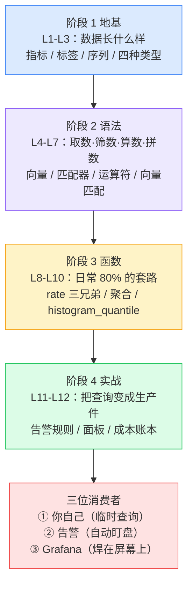

三个贯穿全课程的伏笔，理解它们就理解了课程为什么这么排：

- **伏笔一（L2 → L12）**：L2 说「标签取值必须有限，基数失控 = 生产事故」，L12 才引爆——一块忘了聚合的面板能读 25 万点、跑 2.6 秒。**高基数的第一道防线在打标签那一刻，不在查询时。**
- **伏笔二（L3 → L8 → L10）**：L3 埋下「`rate()` 只对 Counter 有意义」，L8 拆开黑箱讲清重置补偿，L10 兑现成 `rate → sum by (le) → histogram_quantile` 三段流水线——这是你在生产面板上写得最多的一类查询。
- **伏笔三（L1 → L11 → L12）**：L1 画架构图时提到查询有三个消费者，L11 供货第二位（告警），L12 供货第三位（Grafana）。**同一条 P95 查询，在面板上用 `[5m]`（要平滑），在告警里用 `[1m]`（要快）——这不是笔误，是同一拆分的两面。**

---

## 全局速查：最容易忘的硬数字

> 全部实测于 2026-08 的 `demo.promlens.com`。演练场流量会「呼吸」（同一指标不同时段测到 130 / 176 / 213 都正常），**用它们判断量级与倍数关系，别当固定常量背。**

### 环境基线

| 项目 | 实测值 | 出处 |
|------|--------|------|
| 抓取间隔 | **15 秒**（`[1m]` = 4 个点） | L4 / L8 |
| `demo.*` 指标总序列数 | **837** 条 | 10 场景 1 |
| 桶数量（×1.5 递增阶梯） | **26** 个（`_bucket` 702 行 = 27 序列 × 26 桶） | L10 / 10 场景 2 |
| `up` 全环境 / `up{job="demo"}` | **6 行** / **3 行**（demo×3 + node + prometheus + cadvisor） | L11 / 10 场景 4 |
| `demo_num_cpus` | **4** | L7 / L8 |
| CPU 使用率 | **≈50%**（`rate(idle) ÷ num_cpus` = 1.99 ÷ 4 ≈ 0.5） | L8 / 项目 |
| 磁盘水位 | **≈82%**（`avg` ≈0.78，逼近预警线） | L9 / 项目 |

### 延迟与错误率

| 项目 | 实测值 | 出处 |
|------|--------|------|
| 总 QPS | 量级 **130~213**（`[1h]`=176.07，1h 区间 129.6~236.5） | L9 / L10 / 项目 |
| 全站错误率 | **0.83%**（5m/30m/1h/6h = 1.149% / 0.883% / 0.879% / 0.863%） | 10 场景 3 |
| 分路径错误率 | POST/foo **3.812%**、POST/bar 1.654%、GET/foo 0.776%、GET/bar 0.391% | 10 场景 3 |
| 平均延迟（全站） | **16.5ms**（`_sum ÷ _count`，精确值） | L10 |
| 全站分位数（`[5m]`） | P50/P90/P95/P99 = **12.6 / 33.4 / 51.4 / 62.8 ms** | L10 |
| 全站 P95（另一次实测） | **54.18ms** | 10 场景 2 |
| 分路径 P95 | /api/bar **62.39ms**、/api/foo 29.15ms、/api/nonexistent 0.095ms | 10 场景 2 |
| 桶占比 SLO 合规率 | **99.65%**（用 `le="0.09852612533569335"`） | 10 场景 2 |

> ⚠️ **最容易踩的坑**：桶阶梯是 ×1.5 递增的，**没有 `le="0.1"` 这一档**（0.0985 → 0.1478）。写 `le="0.1"` 查 SLO 会返回 **0 行且不报错**——不是没数据，是这个桶根本不存在。100ms 的 SLO 只能用 `0.0985` 桶近似。（见 [09 症状 1](09-排障速查手册.md)）

> ⚠️ **第二个坑**：**全站聚合会稀释短板**。全站错误率 0.83%，但 POST/foo 是 3.812%；全站 P95 52ms 完全看不出 /api/bar 的合规率只有 97.66%。**告警和面板必须分路径，全站口径用来做总览。**

### 查询成本（L12 的成本账本）

| 项目 | 实测值 | 说明 |
|------|--------|------|
| **成本第一定律** | 1 行的 P95 流水线读 **14,040** 样本，702 行的裸查只读 **702** 样本 —— 相差 **20 倍** | 账单按**读取的样本数**算，不按输出行数算 |
| 面板账单（P95 流水线 6h@60s） | **5,068,440** 样本（361 步 × 14,040），耗时 0.146s | 5 秒刷新 = 每分钟 6,000 万+ 样本 |
| 事故三档 | 忘聚合 6h@60s：**253,422** 点 / 2.6s；正确聚合：**361** 点 / 0.37s；忘聚合 @15s：**1,011,582** 点 / 11s | 成本差 **30 倍以上** |
| 窗口是最大乘数 | `sum(rate(_count[5m]))` **194,940** vs `[1h]` **2,339,280** 样本 | 窗口 ×12 → 样本读取 **×12** |
| 单步成本差异巨大 | QPS 类单步读 **540** 样本，P95 流水线单步读 **14,040** 样本 | L12 / 项目决策 2 |
| 系统的保险丝 | **11,000 点/序列上限**（`step=1s` 触发 `exceeded maximum resolution`） | 只挡点数，**不挡账单** |

> ⚠️ **反直觉的一条**：加不加 `sum by`，**服务端样本读取完全一样**（都是 5,068,440）。聚合只降返回点数（361 vs 9,747）和峰值内存——**「加聚合能给 Prometheus 减负」是错的**，聚合是救浏览器和网络的，不是救服务端的。真正降服务端成本的是**收窄窗口**和 **recording rules**。

### 告警

| 项目 | 实测值 | 出处 |
|------|--------|------|
| 预置规则 | **5 条**（组 `demo-service-alerts`，评估间隔 15s） | L11 |
| 状态机 | inactive → pending → **firing**，中途变假计时清零 | L11 |
| `for` 的降噪效果 | `[1m]` 窗口 21 段毛刺 → `for: 1m` 压到 8 段 → `for: 2m` 压到 6 段 → **`for: 5m` 压到 0 段** | L11 |
| 阈值安全边际 | 水位 **52ms** 配 **100ms** 阈值（≈2 倍）；贴水位（50ms）= 73/73 全超永久 firing；远到天边（55ms 之上）= 0/73 摆设 | L11 |
| 分路径降噪 | 3 条路径里只有 /api/bar（60.4ms）一行存活 | L11 |
| 告警本身是指标 | `ALERTS` / `ALERTS_FOR_STATE`（值恒 1，FOR_STATE 是计时起点时间戳） | L11 |

---

## 知识点总索引

> 12 课共 **57 个知识点**（与每课收束段的「心智模型 N 句话」同源：L1 三句、L2 四句、L3–L12 各五句），跨 4 个阶段。

| 课 | 数 | 知识点 |
|----|----|--------|
| L1 | 3 | 监控=记账（指标是账本 / Prometheus 是账房 / PromQL 是查账语言）· 数据四要素（指标名+标签+值+时间戳）· `up` 是自动记录的存活指标 |
| L2 | 4 | 数据三层（样本→序列→指标）· 标签是身份证不是备注 · 查询结果每行=一条序列，指标名本质是 `__name__` · 标签取值必须有限，基数失控=事故 |
| L3 | 5 | Counter=里程表 / Gauge=体重秤 / Histogram=分数段人数表 / Summary=预计算分布 · Counter 的价值在差值，查询永远套 `rate()` · Gauge 原始值直接可用，套 `rate()` 得噪声 · `rate()` 贡献速率语义+重启重置保护 · 桶是累积式的，Summary 不可聚合 |
| L4 | 5 | 瞬时向量=照片（每序列 1 个值）· 范围向量=录像（窗口内全部原始点）· 点数≈窗口÷抓取间隔，时间只能单一单位 · 方括号只取数不计算 · 录像不能直接画图，必须喂给函数 |
| L5 | 5 | 筛选写在 `{}` 里，逗号=AND · 四兄弟 `=` `!=` `=~` `!~` · 正则**全锚定**（包含要写 `.*x.*`）· 正则生存包（`|` `.` `.*`）· 筛选只挑序列不碰值 |
| L6 | 5 | 算术=换算器（值变序列数不变）· 比较默认=闸机（不达标的消失）· bool=打分器（全员保留改 0/1）· 逻辑=名单对碰（and/or/unless，值取左）· 混用运算符永远加括号 |
| L7 | 5 | 默认配对=标签组全同（指标名不算）· `ignoring` 黑名单 / `on` 白名单，哪个短用哪个 · `group_left` 声明右边是对照表（值广播、标签保留左）· 空表=配不上，报错=配歧义 · 两种失败模式一眼分清 |
| L8 | 5 | Counter 是里程表，裸值只说明累计 · rate 三步（窗口增量÷秒数，含重置补偿）· 三兄弟 rate 问平均 / irate 问瞬时 / increase 问总量 · rate 只吃范围向量，忘写 `[5m]`=新手 Top 1 报错 · rate 是 Counter 专属，用在 Gauge 上不报错只静默胡说 |
| L9 | 5 | 聚合是压行机（sum 造新序列 / topk 选秀）· by 白名单、without 黑名单，扔掉的标签回不来 · **先 rate 后聚合**（顺序反了语法都过不去）· topk 只认当下值，对裸 Counter 排名=比谁开机久 · 占比明细=明细÷组汇总（group_left 主力场景） |
| L10 | 5 | 平均延迟 `_sum÷_count` 精确、分位数用桶近似 · histogram_quantile 三步（名次→找桶→线性插值）· 生产公式 `rate → sum by (le) → histogram_quantile` · 两大翻车（聚合吞 le→空表 / 忘套 rate→终生分位）· `quantile` 聚合器 ≠ `histogram_quantile` |
| L11 | 5 | expr=比较过滤（非空序列即告警，禁用 bool）· `for` 是防抖旋钮（三态两门）· 阈值以水位为参照（留 2 倍安全边际）· 聚合降噪、`severity` 分流 · expr 看不见消失的序列，需 `up==0` + `absent()` + 业务 expr 三层防线 |
| L12 | 5 | 面板=焊在屏幕上的查询（每 5 秒全额重付成本）· 一块面板一个业务问题（健康度线用 `up == bool 1`）· 成本第一定律（按样本数不按行数）· 事故公式：样本读取×步数×刷新频率 · 优化三件套（窗口/步长、recording rules、聚合与基数审计） |

---

## 阶段 1 · 地基与数据模型

> 阶段目标：**看懂数据长什么样**。这一阶段不教查询技巧，但它决定了后面所有查询的成败——L2 的基数红线在 L12 才爆炸，L3 的 `rate()` 伏笔在 L8 才回收。

### L1 · 为什么需要 PromQL：从一次宕机说起


🎯 **落地视角小结**：监控不是外挂系统，是程序**运行时顺手记账**。`up` 是 Prometheus 自动记录的特殊指标，零成本就能知道目标活着没有——这也是你在演练场里的第一条查询。

⚠️ **最容易踩的三条**
1. 把「监控」想成事后加的旁路系统 —— 实际是埋在代码里的记账动作，指标设计是开发期的决定。
2. 以为指标只有一个数值 —— 每条数据是「指标名 + 标签 + 值 + 时间戳」四要素，缺一不可。
3. 忽略 `up` —— 它是唯一不需要你埋点就能用的指标，也是后面三层防线的第一层（L11）。

📖 [课 1 全文](stages/1-地基与数据模型/lessons/lesson-01-为什么需要PromQL.md)

---

### L2 · 数据模型：指标、标签与时间序列

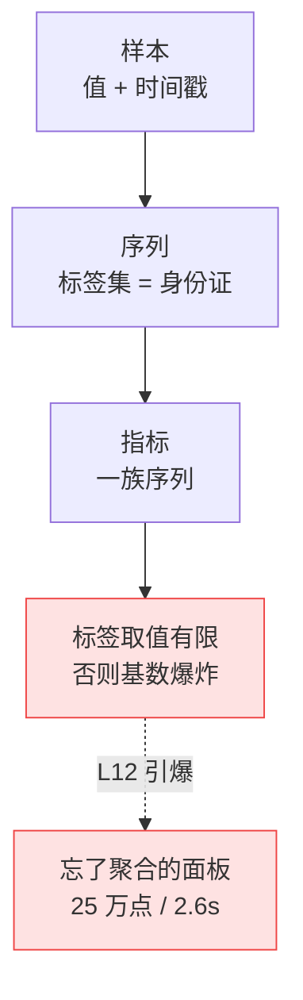

🎯 **落地视角小结**：**标签是身份证，不是备注**。标签集完全相同才是同一条序列，改一个标签值就是新序列。指标名本质上只是 `__name__` 这个特殊标签——所以 `{__name__="up"}` 和 `up` 等价。

⚠️ **最容易踩的三条**
1. 把高基数信息（user_id / request_id / trace_id）塞进标签 —— **这类字段进标签就是生产事故**，该放日志和链路追踪。
2. 以为「多加个标签方便以后过滤」没成本 —— 序列数 = 各标签取值数的**乘积**，2 个 100 取值的标签就是 10,000 条序列。
3. 忘了指标名也是标签 —— 影响 L7 的向量匹配（指标名不参与配对），也影响 `{__name__=~"..."}` 这类高级写法。

📖 [课 2 全文](stages/1-地基与数据模型/lessons/lesson-02-数据模型.md)

---

### L3 · 四种指标类型：Counter、Gauge、Histogram、Summary

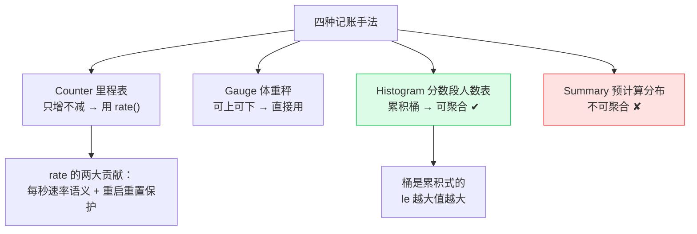

🎯 **落地视角小结**：**Counter 的价值在差值，原始值几乎没用**——CPU 秒数累计到 3,628,800（约 42 天）这种天文数字，只有套上 `rate()` 才变成「每秒用了几核」。反过来，Gauge 套 `rate()` 会得到几千万的荒唐值，而且**不报错**（L8 实测 7043 万~7769 万）。

⚠️ **最容易踩的三条**
1. 对 Gauge 用 `rate()` —— 不报错，只静默胡说，**比报错更危险**。
2. 以为 Histogram 的桶是「区间人数」—— 是**累积**的（le 越大值越大），`le="0.1"` 表示「≤0.1 秒的请求数」。
3. 优先选 Summary 因为「看起来方便」—— Summary 的分位数**不可聚合**，多实例场景算不出全局分位数。**桶可加、预计算分位数不可加**，这是 Histogram 胜出的底层原因。

📖 [课 3 全文](stages/1-地基与数据模型/lessons/lesson-03-四种指标类型.md)

---

## 阶段 2 · 核心语法

> 阶段目标：**会取数、会筛数、会算数、会拼数**。四课拼图合体后，你能独立写出「磁盘使用率」「内存使用率」这类完整业务查询——阶段 2 的通关标准。

### L4 · 瞬时向量 vs 范围向量：[5m] 到底取了什么

```mermaid
flowchart TD
    A["裸指标 up"] --> B["瞬时向量 = 照片<br/>每序列 1 个值（最近采样）"]
    A -->|加 [5m]| C["范围向量 = 录像<br/>窗口内全部原始点"]
    C --> D["点数 ≈ 窗口 ÷ 抓取间隔<br/>本环境 15s → [1m] = 4 点"]
    C --> E["录像不能直接画图"]
    E --> F["必须喂给 rate() 等函数<br/>加工成照片"]
    style B fill:#dbeafe,stroke:#3b82f6
    style C fill:#fef3c7,stroke:#f59e0b
```

🎯 **落地视角小结**：**方括号只取数、不计算**。计算永远是函数的事——这就是 `rate()` 必须带方括号的完整原因。时间只能写单一单位（`[1h30m]` 合法，`[90m]` 也合法，`[1h 30m]` 不合法）。

⚠️ **最容易踩的三条**
1. 直接把范围向量丢给 Grafana —— 会报错，录像必须先加工成照片。
2. 以为 `[5m]` 是「5 分钟前的那个值」—— 是**窗口内所有点**，本环境 15 秒抓取，`[5m]` 约 20 个点。
3. 时间单位混写 —— 只能用单一单位，且 `d`/`w`/`y` 不支持（PromQL 的时间单位不支持天/周/年，因为每月天数不固定）。

📖 [课 4 全文](stages/2-核心语法/lessons/lesson-04-瞬时向量与范围向量.md)

---

### L5 · 标签匹配器四兄弟：= != =~ !~

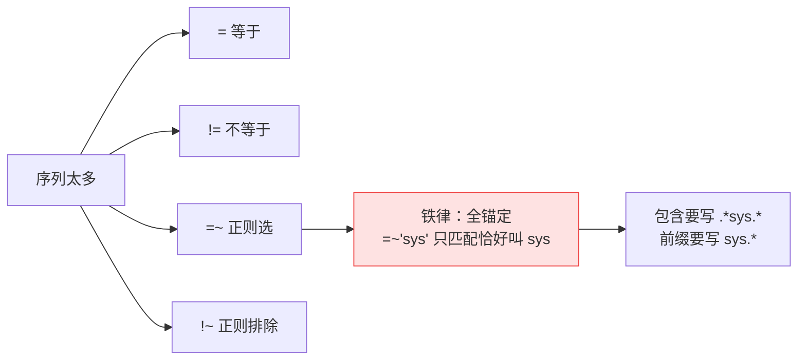

🎯 **落地视角小结**：筛选写在 `{}` 里，多个条件逗号隔开**全部同时满足（AND）**。筛选**只挑序列、不碰值**——对值做加工是 L6 的事。

⚠️ **最容易踩的三条**
1. 以为 `=~"sys"` 是「包含 sys」—— **全锚定**，它只匹配恰好叫 `sys` 的。包含必须写 `.*sys.*`。
2. 用 `!=` 排除时漏掉没该标签的序列 —— `!=` 只排除**值等于**的，标签不存在的不受影响。
3. 在匹配器里做数值比较 —— 匹配器只处理字符串，`status > 500` 是 L6 运算符的活。

📖 [课 5 全文](stages/2-核心语法/lessons/lesson-05-标签匹配器.md)

---

### L6 · 运算符：算术、比较、逻辑与 bool 修饰符

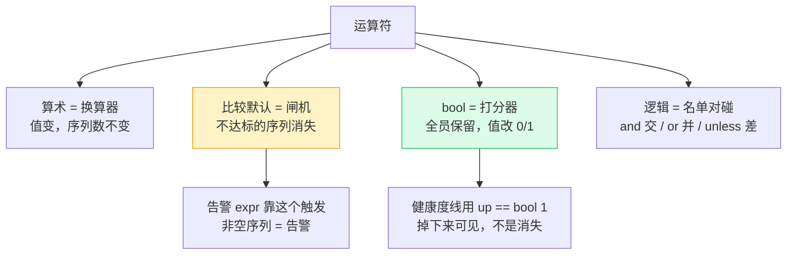

🎯 **落地视角小结**：比较运算符默认是**闸机**（过滤掉不达标的），加 `bool` 变成**打分器**（保留全部、值改 0/1）。这个区别在 L11 和 L12 各有用处：告警依赖「行消失/出现」来触发，所以 **expr 里禁用 bool**；面板的健康度线反过来要「掉下来看得见」，所以用 `up == bool 1`。

⚠️ **最容易踩的三条**
1. 在告警 expr 里写 `bool` —— 抹掉了「行消失」这个触发信号，告警永远不响。
2. 裸写 `up == 1` 当健康度线 —— 抓取失败时其实是 `up = 0`（序列还在，值变了），线不会掉；要 `up == bool 1` 才能看见掉线。
3. 混用运算符不加括号 —— 优先级记不住就加括号，成本是零，收益是不用背优先级表。

📖 [课 6 全文](stages/2-核心语法/lessons/lesson-06-运算符.md)

---

### L7 · 向量匹配：on/ignoring 与 group_left 拼接

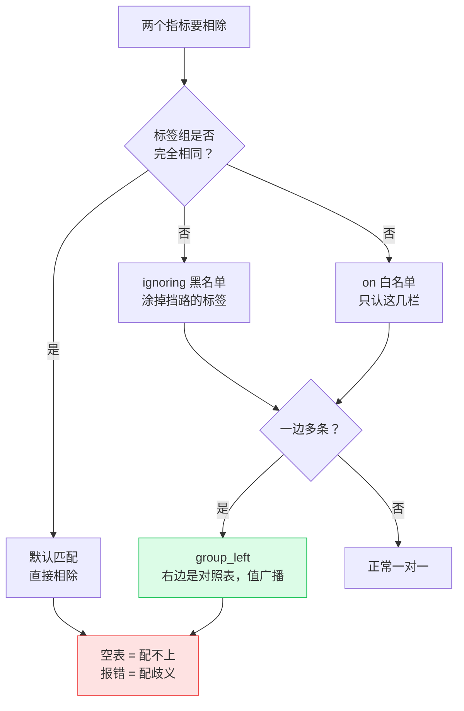

🎯 **落地视角小结**：`ignoring` 是黑名单、`on` 是白名单，**哪个清单短用哪个**。一边多条时用 `group_left`（左边多所以是 left），声明「右边是对照表」——值广播、标签保留左边。

⚠️ **最容易踩的三条**
1. 分不清「空表」和「报错」—— **空表 = 配不上**（标签没对齐），**报错 = 配歧义**（一边多条没加 `group_left`）。两种失败模式要一眼分清。
2. 忘了指标名不参与配对 —— 两个不同指标名也能配对，只要其余标签全同。
3. 用 `by(instance)` 聚合后还想跟原始明细配对 —— 扔掉的标签回不来，聚合会断掉后面的配对（L9 的坑）。

📖 [课 7 全文](stages/2-核心语法/lessons/lesson-07-向量匹配.md)

---

## 阶段 3 · 函数与聚合

> 阶段目标：**掌握日常 80% 的查询套路**。rate 系列、聚合系列、histogram_quantile 三组工具就位后，`rate → sum by → histogram_quantile` 这条三段流水线会成为你写得最多的一类查询。

### L8 · rate/irate/increase：Counter 的正确打开方式

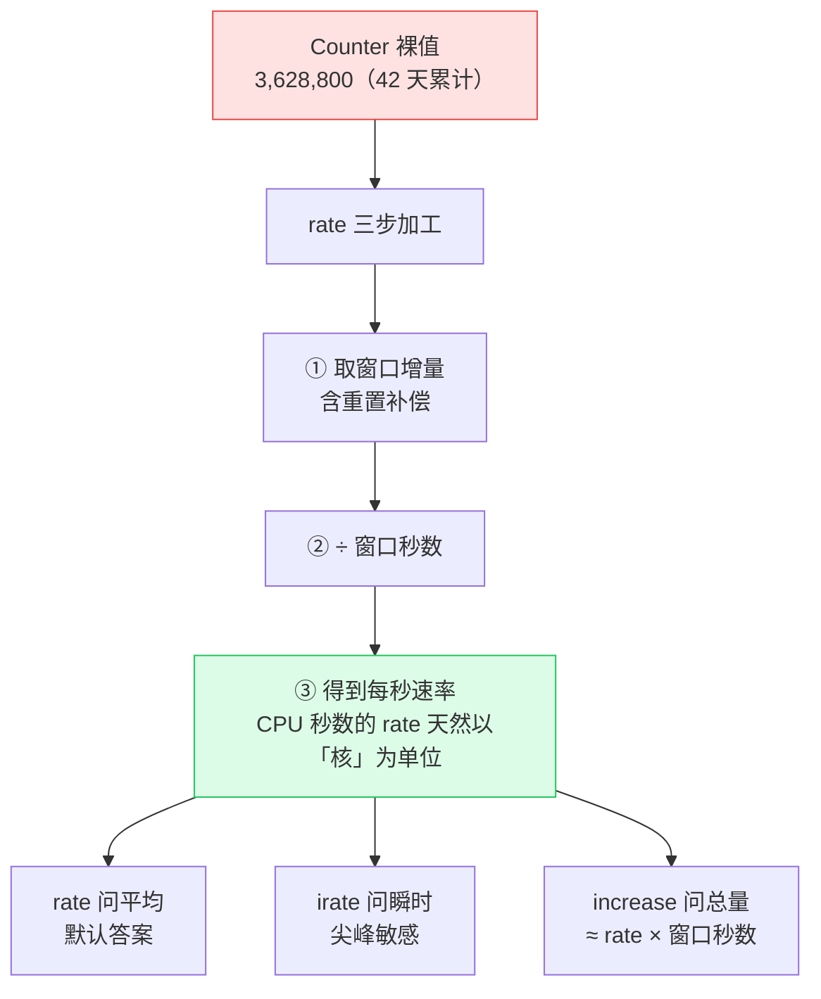

🎯 **落地视角小结**：**rate 是 Counter 专属**。用在 Gauge 上不报错、只静默胡说（实测内存 Gauge 算出 7043 万~7769 万 bytes/s）——比报错更危险。忘写 `[5m]` 是新手 Top 1 报错，见到就认得。

⚠️ **最容易踩的三条**
1. 对 Gauge 用 `rate()` —— 不报错，结果荒唐。**这是全课程最危险的一类错误，因为没人会告诉你错了。**
2. 忘写方括号 —— `rate(demo_x)` 直接报「expected type range vector」，新手 Top 1。
3. 窗口选太短 —— 至少要覆盖 **4 倍抓取间隔**（15s 抓取 → 至少 `[1m]`），否则会漏采样点导致速率抖动。

📖 [课 8 全文](stages/3-函数与聚合/lessons/lesson-08-rate-irate-increase.md)

---

### L9 · 聚合全家桶：sum/avg/topk 与 by/without

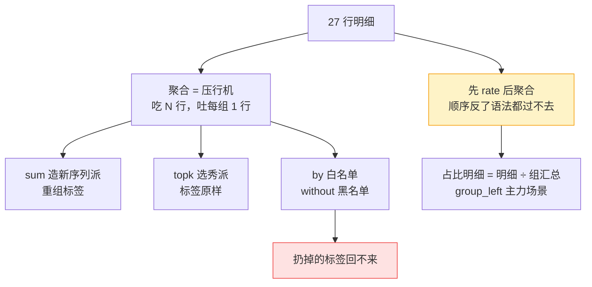

🎯 **落地视角小结**：`by` / `without` 与 L7 的 `on` / `ignoring` 是**同款规则、同款选择原则**（哪个清单短用哪个）。**先 rate 后聚合**——rate 在内层逐实例做重置补偿，聚合在外层合并，顺序反了连语法都过不去。

⚠️ **最容易踩的三条**
1. 先聚合后 `rate` —— 语法直接报错；即便绕过，也丢失了逐实例的重置补偿。
2. 对裸 Counter 用 `topk` —— **等于比谁开机久**。必须先 `rate` 再排。
3. 聚合时扔掉后面还要用的标签 —— 扔掉的标签回不来，会断掉后续的 `group_left` 配对和分路径下钻。

📖 [课 9 全文](stages/3-函数与聚合/lessons/lesson-09-聚合全家桶.md)

---

### L10 · histogram_quantile：算出 P95 延迟

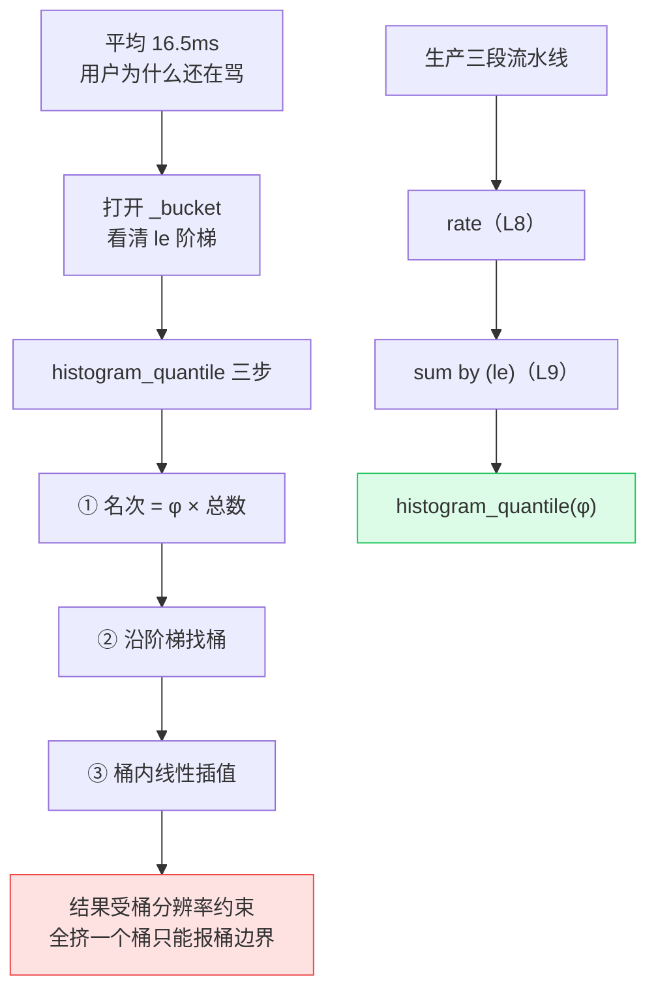

🎯 **落地视角小结**：一个 Histogram 家族回答两类问题——**平均延迟用 `_sum ÷ _count`（精确值），分位数用 `_bucket` + `histogram_quantile`（近似值）**。生产公式是三课流水线：`rate` → `sum by (le)` → `histogram_quantile`。

⚠️ **最容易踩的三条**
1. **聚合吞掉 `le`** —— `sum by (path)` 会把 `le` 扔掉，`histogram_quantile` 拿不到阶梯，**返回空表**（不是报错）。`le` 是骨架，必须用 `sum by (le, path)`。
2. **忘套 `rate`** —— 得到的是「自服务启动以来的终生分位数」（实测 53.2ms），不报错但语义全错。
3. 混淆 `quantile` 聚合器与 `histogram_quantile` —— 前者给已有的数字排序（实测 24.95 次/秒），后者从桶计数反推分布。

📖 [课 10 全文](stages/3-函数与聚合/lessons/lesson-10-histogram-quantile.md)

---

## 阶段 4 · 实战应用

> 阶段目标：**把查询变成生产件**。前三个阶段攒的查询能力，在这里第一次组装成会报警的规则和焊在屏幕上的面板。

### L11 · 实战一：从查询到告警规则

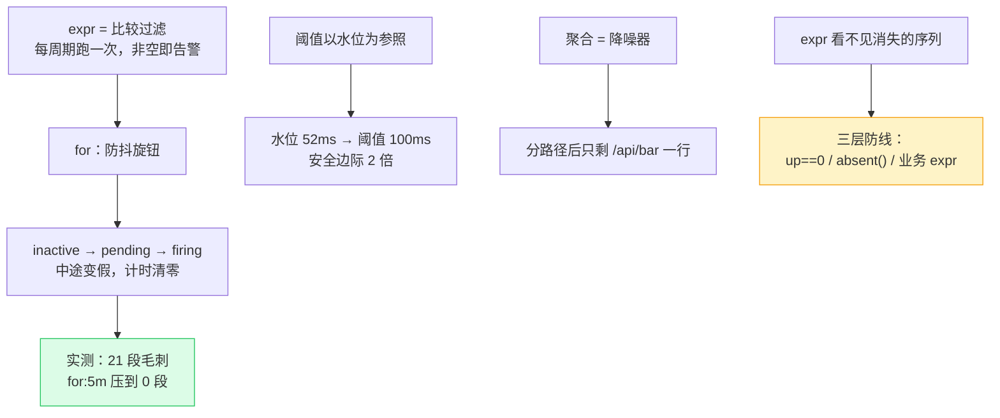

🎯 **落地视角小结**：**`for` 是防抖旋钮，不是延迟**。实测同一条毛刺曲线，`[1m]` 窗口有 21 段超阈，`for: 5m` 压到 0 段——毛刺不配叫醒人。**阈值以水位为参照**：贴着水位 = 永久 firing 的狼来了，远到天边 = 摆设，正确姿势是留约 2 倍安全边际。

⚠️ **最容易踩的三条**
1. expr 里写 `bool` —— 抹掉「行消失」信号，告警永不触发。
2. 阈值贴着日常水位 —— 实测 50ms 阈值下 73/73 全超，**永久 firing**，等于没有告警。
3. 只靠业务 expr —— **expr 看不见消失的序列**（服务整个挂掉时数据没了，expr 返回空表=不告警）。必须配 `up == 0` + `absent()` + 业务 expr 三层，各盯一种死法。

📖 [课 11 全文](stages/4-实战应用/lessons/lesson-11-实战一-从查询到告警规则.md)

---

### L12 · 实战二：Grafana 面板套路与查询优化

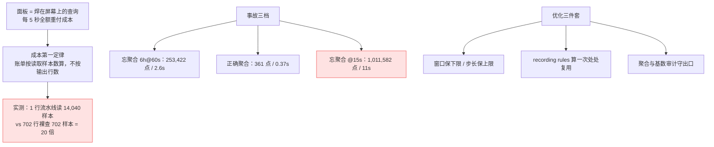

🎯 **落地视角小结**：**一块面板只回答一个业务问题**，图例的每一行都得能读出业务结论。健康度线用 `up == bool 1`（掉下来可见），不用 `up == 1`（消失难察）。成本账本记牢：**账单按读取的样本数算，不按输出行数算**。

⚠️ **最容易踩的三条**
1. 以为「输出行数少 = 便宜」—— 实测 1 行的 P95 流水线比 702 行的裸查贵 **20 倍**。**输出行数是给浏览器看的，成本是服务端读的样本数。**
2. 以为加 `sum by` 能给 Prometheus 减负 —— 实测加不加，服务端样本读取**完全一样**（均 5,068,440）。聚合救的是浏览器和网络。真正降成本的是**收窄窗口**（×12 窗口 = ×12 成本）和 **recording rules**。
3. 迷信 11,000 点保险丝 —— 它只挡**点数**，不挡账单。事故档 @15s 的 1,011,582 点照样跑满 11 秒。

📖 [课 12 全文](stages/4-实战应用/lessons/lesson-12-实战二-Grafana面板套路与查询优化.md)

---

## 综合实战项目

> **[demo 服务可观测性体系（SLO 驱动的监控闭环）](projects/demo服务可观测性体系/README.md)** — 跨 4 阶段 12 知识点，6 文件工程

**一句话需求**：为 demo 服务建一套**能真正值班用**的可观测性体系——定义 SLO、产出黄金四指标面板、分级告警规则，并让每一条查询都过成本关。

### 项目指标

| 维度 | 数量 | 说明 |
|------|------|------|
| 覆盖知识点 | **12** 个 | 跨 4 阶段（每阶段 3 项），门槛 ≥3 ✅ |
| 非功能约束 | **4** 项 | 成本 / 正确性 / 可维护性 / 降噪，门槛 ≥2 ✅ |
| 真权衡决策 | **3** 个 | SLO 口径 / 预聚合范围 / 告警粒度，门槛 ≥2 ✅ |
| 文件数 | **6** | README / 设计决策 / 反例对照 / 实现×3 / 验收清单 ✅ |
| 面板 | **7** 块 | QPS / 分路径 QPS / 错误率 / P95 / 合规率 / 饱和度 / 告警数 |
| 告警规则 | **10** 条 | 每条带 `for` 与降噪理由，分 critical / warning |
| 预聚合规则 | **5** 条 | 决策文档定「3 条」（QPS / 错误率 / P95），实现又补了 SLO 合规率与 CPU 使用率，**以实现文件为准** |
| 反例对照 | **6** 条 | 「能跑但很糟」的版本逐项对比 |
| 验收项 | 功能 8 + 非功能 5 + 理解 6 + 加分 3 | 详见 [验收清单](projects/demo服务可观测性体系/验收清单.md) |

> 本项目**主战场是演练场**：查询侧（queries / rules / dashboard / recording-rules）全部实测可跑；埋点代码 `exporter_app.py` 为**纸面交付物**（本机无 Python 与 Docker，已按 prometheus-client 0.26.0 官方 API 编写）。**它只影响数据怎么产生，不影响本项目的查询能力。**

### 三条核心实测发现（驱动了全部设计决策）

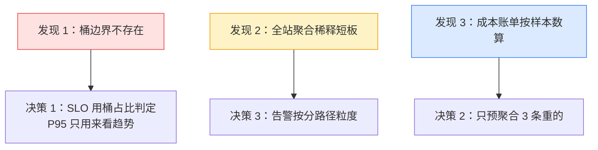

1. **桶阶梯 ×1.5 递增，没有 `le="0.1"`**（0.0985 → 0.1478）。100ms 的 SLO 只能用 `le="0.09852612533569335"` 近似，而写 `le="0.1"` 返回 **0 行且不报错**——静默失败，最危险的坑。
2. **全站聚合把短板稀释掉**。全站错误率 0.83% 看着安全，但 POST/foo 已达 **2.56%**；全站 P95 52ms 完全看不出 /api/bar 的合规率只有 **97.66%**。
3. **成本与输出行数无关**。1 行的 P95 流水线读 5,068,440 样本（361 步 × 14,040），且**加不加 `sum by` 服务端读取完全一样**——聚合救的是浏览器不是服务端。

### 三个设计决策（含翻转条件）

| 决策点 | 选择 | 一句话理由 | **什么时候该改选另一个** |
|--------|------|-----------|------------------------|
| SLO 口径 | P95 看趋势 + **桶占比做判定** | 桶里没有 100ms，且 P95 不可聚合 | 只做看板不做告警 → 纯 P95 即可 |
| 预聚合范围 | 只做「重且稳定」的（决策定 3 条，**实现落到 5 条**：QPS / 错误率 / P95 / SLO 合规率 / CPU） | 优化要做在刀刃上，Gauge 类本身很便宜 | 面板 < 5 块 → 完全不做；秒级熔断告警 → 该条改回直算 |
| 告警粒度 | **分路径**（method × path） | 全站口径把 2.5% 的短板稀释成 0.83% | 接口数 > 100 → 回到全站 + 分路径下钻 |

**决策咬合链**：发现 1 逼出决策 1（不能用 P95 判 SLO）→ 决策 1 决定了「合规率」必须是桶占比口径 → 桶占比口径要求分路径才准（发现 2）→ 分路径又带来决策 3 的告警粒度代价（规则条数变多，需 `severity` 分流）。**三个决策不是并列的三道题，是一条链上的三个扣。**

### 六个反例（能跑通，但在真实故障面前集体失灵）

| # | 维度 | ❌ 反例 | ✅ 正确做法 |
|---|------|---------|------------|
| 1 | 窗口选择 | 错误率用 `[1m]`（只有 4 个样本点） | `[5m]`（面板）；实测 `[1m]` 有 21 段超阈，`[5m]` 有 0 段 |
| 2 | 聚合粒度 | 全站一条 | `sum by (method, path)`；全站 0.83% 藏着 POST 的 2.56% |
| 3 | 分位数聚合 | 对未聚合的 rate 直接求分位数 | 先 `sum by (le)`；否则输出 27 行且**不可加总** |
| 4 | 标签完整性 | 匹配器没有 `job="demo"` | 全部带 job；否则把 node/prometheus/cadvisor 算进来 |
| 5 | **桶边界** | `le="0.1"` | `le="0.09852612533569335"`；**匹配不到返回 0 行不报错，合规率算出 0%（假故障）** |
| 6 | 规则元数据 | 无 `for`、无 `severity`、无 annotations | `for: 5m` + 分级 + 模板化 annotations |

> 📌 第 5 条最容易被忽略——因为它是**唯一一个不报错**的错误。

### 怎么跑

```text
1. 打开 https://demo.promlens.com/
2. 按 实现/queries.md 的顺序逐条粘贴执行（每条都标注了预期输出）
3. 用 实现/rules.yaml 对照演练场预置的 5 条生产规则，逐条说出你的规则差异与理由
4. 用 实现/dashboard.md 的规格表，在纸上（或真实 Grafana）组装服务概览页
5. 埋点代码 实现/exporter_app.py 为纸面交付物
```

**跑完你能回答三个问题**：服务现在健康吗？哪个接口是短板？哪条查询最贵？

---

## 决策清单

### 该不该用 Prometheus / PromQL

| 用它 | 别用它 |
|------|--------|
| 基础设施与服务的**数值型**时序监控 | 需要**原始事件明细**（用日志系统） |
| 需要**多维下钻**（标签随便切） | 需要**精确计费/审计级**数据（Prometheus 会丢采样） |
| 告警 + 面板 + 临时查询三位一体 | 需要长期（>1 年）原始精度留存（本地默认 retention 15 天） |
| 团队能接受「近似值」（分位数受桶约束） | 需要 100% 精确的分布式追踪（用链路追踪系统） |

### 写一个新查询时的自检顺序

1. **这是 Counter 还是 Gauge？** Counter 套 `rate()`，Gauge 直接用。
2. **窗口 ≥ 4 倍抓取间隔了吗？**（15s 抓取 → 至少 `[1m]`）
3. **匹配器带 `job` 了吗？**（否则混入监控组件自己）
4. **聚合会不会把短板稀释掉？**（全站口径 vs 分路径）
5. **分位数是不是「先 `sum by (le)` 再 `histogram_quantile`」？**（顺序错了输出 N 行且不可加总）
6. **用到的桶边界真实存在吗？**（`count by (le) (...)` 验证一遍）
7. **这条查询的成本是多少？**（窗口 ×12 = 成本 ×12）

### 上生产前必查的六项

| # | 检查项 | 不做的后果 |
|---|--------|-----------|
| 1 | 告警全部带 `for` | 每次毛刺叫醒人 → 告警疲劳 → 真事故被忽略 |
| 2 | 阈值与实测水位留 ≥2 倍安全边际 | 贴水位 = 永久 firing 的狼来了 |
| 3 | `up == 0` + `absent()` + 业务 expr 三层防线 | 服务整个挂掉时 expr 返回空表，**告警集体哑火** |
| 4 | 高基数字段（user_id / request_id / trace_id）绝不进标签 | 序列数按标签取值**乘积**增长，直接 OOM |
| 5 | 重查询配 recording rules | 面板 5 秒刷新 × 500 万样本 = 每分钟 6,000 万+ |
| 6 | 面板与告警的 expr **同源复用** | 面板 2.5% 而告警不响，值班员不知道该信谁 |

### 出问题时的三条分流

| 现象 | 先去哪 |
|------|--------|
| 查询报错 | [09 症状 9（向量类型不匹配）](09-排障速查手册.md) / [症状 10（缺 group_left）](09-排障速查手册.md) |
| 查询不报错但数字不对 | [09 症状 1（桶不存在）](09-排障速查手册.md) / [症状 3（聚合稀释）](09-排障速查手册.md) / [症状 4（le 被吞）](09-排障速查手册.md) |
| Prometheus 变慢 / 浏览器卡死 | [09 症状 6（查询打爆自己）](09-排障速查手册.md) → [10 场景 5](10-场景解法库.md) |

不知道是哪一类时，先做 [09 的通用止血动作](09-排障速查手册.md)：**把范围拉到最小、把刷新停掉、把最贵的面板先下线**，损失止住再定位。

---

## 🚀 接下来可以做什么

| 方向 | 说明 |
|------|------|
| **知识点对齐** | 「考我一下 PromQL，重点考 SLO 口径、桶边界、burn rate 告警、查询成本」 |
| **落地纸面交付物** | 本机无 Docker；有条件时用 Docker 起真实 Prometheus + Grafana，把 `dashboard.md` 的 7 块面板与 `rules.yaml` 的 10 条规则真正装进去 |
| **进阶主题** | Alertmanager（分组 / 抑制 / 静默——L11 提过的下游第二道闸） |
| **回做加分题** | 多窗口 burn rate 告警设计，[10 场景 3](10-场景解法库.md) 已给出可直接改造的 YAML 与本环境实测换算 |
| **横向扩展** | native histograms（v3.8.0 起 stable，v3.9 起须显式开启 `scrape_native_histograms`）——它正是为解决「桶边界对不上 SLO」而生的 |

十二课走完，L1 那次「凌晨三点」的电话依然会响，但接电话的人手里有了岗哨：数据模型让你知道该记什么，语法让你问得出问题，函数与聚合让你问得准，告警与面板让答案自动送到该知道的人手里。

> 祝值班夜平安。

---

## 📚 官方文档

- [Prometheus 查询基础](https://prometheus.io/docs/prometheus/latest/query/basics/)
- [Recording rules](https://prometheus.io/docs/prometheus/latest/configuration/recording_rules/)
- [Grafana Prometheus 数据源](https://grafana.com/docs/grafana/latest/datasources/prometheus/)

---

> 📄 本手册为 [PromQL 系统学习](02-课程目录.md) 的汇总件，与 [08-实战经验.md](08-实战经验.md)、[09-排障速查手册.md](09-排障速查手册.md)、[10-场景解法库.md](10-场景解法库.md) 同源。
> 所有数字实测于 2026-08 的 `demo.promlens.com`，**演练场数据会呼吸，看量级与关系，不要看绝对值**。
