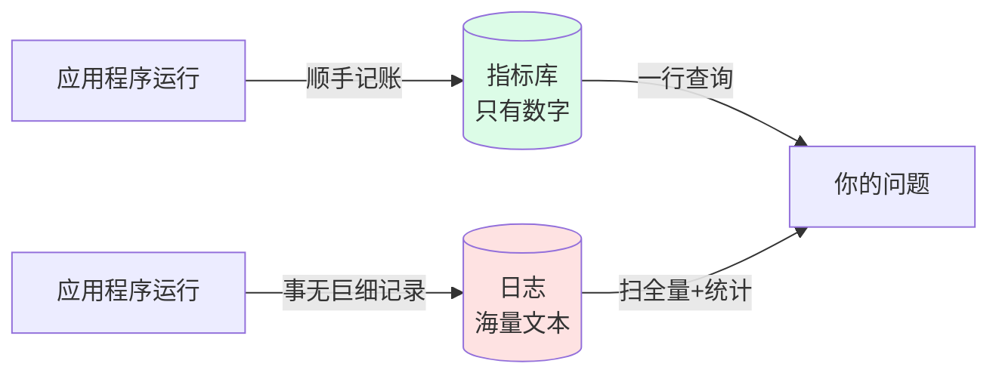
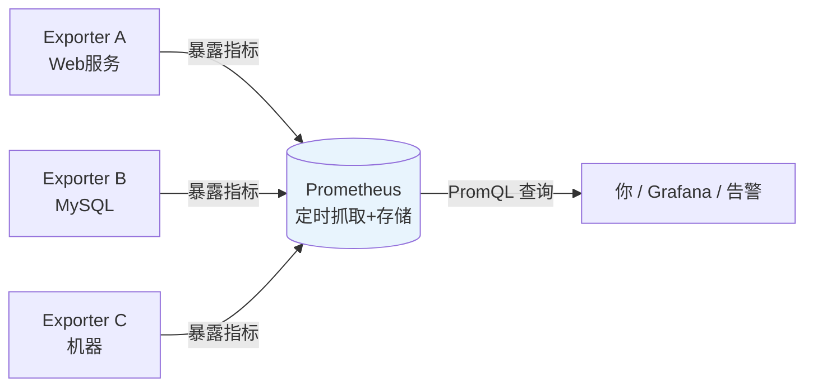

# L1 为什么需要 PromQL：从一次宕机说起，完成第一次查询

> 阶段 1 · 地基与数据模型 | 零基础 + 实操 | 预计 25 分钟

## 第一幕：凌晨三点的电话

想象你是一个电商网站的运维负责人。凌晨三点，手机响了。

「你们的网站打不开购物车了！」

你睡眼惺忪地爬起来打开电脑，面对的第一个问题是：**现在系统是什么状态？**

- 服务器还活着吗？
- 从什么时候开始出问题的？
- 是所有服务都挂了，还是只有一个？
- 问题是「请求全部失败」还是「变得特别慢」？

如果没有监控，你只能一台台机器登录上去手动看日志、敲命令排查。运气好十分钟定位，运气不好排查一整夜。

**监控系统的意义就在这里：让你不用登录机器，就能随时回答「系统现在怎么样、从什么时候开始不正常」。**

而 Prometheus 就是当下最流行的开源监控系统，PromQL 就是它的查询语言——你问它「系统状态」时使用的语言。这门课要教的，就是怎么把这句话问对、问准。

## 第二幕：一个直觉的误区

你可能会想：系统出问题看日志不就行了？为什么还需要「指标」？

试试用日志回答这个问题：**「过去一小时，购物车接口平均每秒处理多少请求？」**

用日志做的话，你需要：把一小时内的日志全部捞出来、过滤出购物车接口的行、数总行数、再除以 3600。日志量小还行，高流量系统一小时几个 GB，这种问题问一次就要扫几个 GB。

指标（metric）的思路完全不同：**程序在运行时自己顺手记账**。每处理一个请求，计数器加一；每占一块内存，仪表盘更新一下。账本只有数字，随时可查，回答上面的问题只需要一行除法。



日志用来查「某次请求为什么错」，指标用来答「系统整体怎么样」。两者互补，而这门课的主角是指标。

## 第三幕：Prometheus 和 PromQL 的分工

一个完整的理解需要三个角色各就各位：

- **Exporter（记账员）**：内嵌在程序里或以旁路进程运行，把程序状态暴露成指标。比如 Node Exporter 报告 CPU、内存，程序框架自己报告请求数、耗时。
- **Prometheus（账房先生）**：每隔一段时间（默认 15 秒）主动拉取所有记账员的最新数字，按时间顺序存下来。它本质上是一个**按时间排列的数字仓库**（时序数据库）。
- **PromQL（查账语言）**：你向账房先生提问用的语言。类比关系：Prometheus 之于 PromQL，就像 MySQL 之于 SQL。



存进来的每一条数据长这样（概念示意）：

```
up{job="node", instance="192.168.1.10:9100"}   1   @2026-08-27 03:00:00
└── 指标名 ──┘└──────── 标签 ─────────────┘    └─值─┘ └── 时间戳 ──┘
```

指标名说明「记的是什么账」，标签说明「是谁的账」，值是数字本身，时间戳说明「什么时候记的」。这一行就是后面所有课程反复出现的主角，L2 会把它拆开细讲。

## 第四幕：动手，完成你的第一次查询

不装任何软件，5 分钟上手。

### 步骤 1：打开演练场

浏览器访问 **https://demo.promlens.com/**

这是 Prometheus 官方维护的在线环境，预置了 demo 服务的真实指标数据，页面上方就是查询输入框。（如果打不开，备选方案：本地 Docker 起一套，文末附命令。）

### 步骤 2：查询第一个指标

在输入框中输入，然后按回车，或点右上角 **Execute**：

```promql
up
```

切换到 **Table** 标签页（默认就是），你会看到类似这样的结果：

| 指标 | 值 |
|------|-----|
| `up{instance="demo.service:1", job="demo"} ` | 1 |
| `up{instance="demo.service:2", job="demo"} ` | 1 |
| `up{instance="demo.service:3", job="demo"} ` | 1 |
| `up{instance="prometheus-play:9090", job="prometheus"} ` | 1 |

### 步骤 3：读懂你刚看到的东西

`up` 是 Prometheus 每次抓取时**自动记录**的指标：抓取目标活着就是 1，挂了就是 0。刚才的结果翻译成人话：

- 一共盯着 4 个抓取目标（3 个 demo 服务实例 + 1 个 Prometheus 自己）
- 每个目标后面都跟着 `instance` 和 `job` 两个标签，标记「是谁的账」
- 值全是 1：所有目标当前都活着

恭喜，你已经完成了一次完整的 PromQL 查询：写表达式 → 提交给 Prometheus → 拿到各目标当前状态。

### 步骤 4：换个角度再查一次

点 **Graph** 标签页再执行一次 `up`。Table 给你「此刻的快照」，Graph 给你「这段时间的走势」。这就是后面 Grafana 面板的雏形。

### 本课实操任务

1. 打开演练场，执行 `up`，找到结果中标签 `job` 的所有不同取值
2. 切到 Graph 标签页，观察曲线形态（`up` 应该是一条贴着 1 的直线）
3. 思考题（不操作，纯想）：如果某个实例凌晨挂了 10 分钟，`up` 的 Graph 曲线会是什么形状？

## 第五幕：收束与预告

本课的心智模型，三句话：

- 监控 = 程序运行时顺手记账，指标是账本，Prometheus 是账房，PromQL 是查账语言
- 每条数据 = 指标名 + 标签 + 值 + 时间戳
- `up` 是最特殊的免费指标：Prometheus 自动记录的「目标存活状态」

**下一课预告（L2 数据模型）**：第一次查询里那个「一列结果、每行标签不同」的现象，背后是 PromQL 最核心的概念「时间序列」。标签为什么能决定序列身份？`up` 为什么天然有多行？下节课拆开讲。

---

### 附：本地环境备选方案（现在可以跳过）

如果更想在自己电脑跑一套（后续阶段也够用）：

```bash
docker run -d -p 9090:9090 -v prom-data:/prometheus \
  -e TZ=Asia/Shanghai --name prom prom/prometheus
```

启动后访问 http://localhost:9090 即可，查询界面与演练场完全一致。区别是本地没有 demo 数据，只有 Prometheus 自身的指标，学习前中期建议优先用演练场。

---

> ## 👉 进入下一课
>
> 完成本课实操任务后，回复「**继续**」进入 **L2《数据模型：指标、标签与时间序列》**——它将解释：为什么 `up` 一条查询会返回多行结果，标签如何决定每条序列的身份。

---

## 🧭 课程导航

➡️ **下一课**：[L2 数据模型：指标、标签与时间序列](lesson-02-数据模型.md)

📚 **返回目录**：[课程目录](../../02-课程目录.md)
