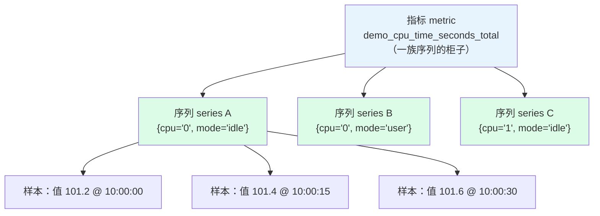

# L2 数据模型：指标、标签与时间序列

> 阶段 1 · 地基与数据模型 | 零基础 + 实操 | 预计 30 分钟

## 第一幕：一条查询为什么返回四行

上一课你执行了 `up`，返回的不是「一个数」，而是四行，每行的标签组合都不同。这件事值得追问：Prometheus 到底是怎么组织数据的？为什么一个指标名能对应这么多行？

答案藏在一个词里：**时间序列（time series）**。它是整个 Prometheus 数据模型的基石，也是后面所有查询行为（返回多行、`rate()` 只对某些指标有意义、`by (job)` 能分组）的底层原因。

## 第二幕：标签不是备注，是身份证

直觉上，多数人会把数据想象成「指标名是主体，标签是附加说明」，就像商品名和商品备注。

实际正好相反。想象一个柜子：

- **指标名只是柜子的名字**，比如「CPU 时间」这个柜子
- 柜子里放着一本一本的账本，**每一本账 = 一组完整的标签组合**
- `{cpu="0", mode="idle"}` 是一本账，`{cpu="0", mode="user"}` 是另一本账——尽管指标名相同，它们是完全独立的两条时间序列

**标签组合决定身份（identity）：改一个标签的值、多一个标签、少一个标签，都是另一条序列。** 值和时间戳只是每本账里按时间追加的流水。

## 第三幕：数据的三层结构

把数据模型从大到小拆成三层：



- **样本（sample）**：最小单位，一个浮点值 + 一个毫秒时间戳
- **时间序列（series）**：指标名 + 完整标签集构成的身份；同一身份下按时间排列的一串样本
- **指标（metric）**：指标名相同的一族序列

一句话记忆：**身份不变，值随时间流动。**

```
demo_cpu_time_seconds_total{cpu="0", mode="idle"}   @10:00:00 → 101.2
└────────────── 身份（标签集决定）──────────────┘   @10:00:15 → 101.4
                                                    @10:00:30 → 101.6 ...
```

由此推出三个关键认知：

**认知一：查询结果的每一行 = 一条时间序列。** 你查 `up` 得到四行，因为此刻有四条序列。这也解释了为什么后面学聚合时 `sum(up)` 会把四行压成一行——聚合就是把一族序列合成一条新序列。

**认知二：指标名其实也是个标签。** 它的名字叫 `__name__`。所以更严格地说，身份 = 完整标签集（含 `__name__`）。这个设计不是炫技，第四幕你会亲手验证它。

**认知三：值只能是浮点数，没有字符串。** 想表达「服务状态」，要么用数值编码（活着 1、死了 0），要么把状态本身做成标签（`status="alive"`）。字符串内容属于日志，不属于指标。

## 第四幕：动手验证数据模型

打开 **https://play.prometheus.io**，逐一验证上面三个认知。

### 验证一：一个指标 = 一族序列

在查询框输入 `demo_`，注意弹出的自动补全下拉框——这是**指标浏览器**，列出了环境里所有可用指标。选中一个 CPU 相关指标（如 `demo_cpu_time_seconds_total`，以你环境中自动补全显示的名字为准），执行。

Table 里你会看到很多行：不同 `instance`、`cpu`、`mode` 组合，每行一条序列。这就是「柜子里的账本们」。

### 验证二：标签过滤 = 从柜子里抽出特定账本

```promql
demo_cpu_time_seconds_total{cpu="0", mode="idle"}
```

行数骤减，只剩 `cpu="0"` 且 `mode="idle"` 的序列（每个实例一条，3 个实例共 3 行）。标签匹配器 L5 会系统讲，现在先感受「按身份选账本」。

### 验证三：指标名是标签

```promql
{__name__="up"}
```

结果和直接查 `up` 一模一样。因为二者本来就是同一个东西。

### 验证四：数一数序列条数（提前偷看聚合）

```promql
count(up)
```

返回一个数字，就是 `up` 这族序列的条数。`count()` 是 L9 聚合全家桶的成员，这里先混个脸熟。

### 本课实操任务

1. 查询一个 `demo_` 开头的多标签指标，数一数返回多少行，指出每行身份的差异来自哪些标签
2. 用一组标签过滤，把结果压缩到只剩 1-2 行
3. 执行 `{__name__="up"}` 和 `count(up)`，确认认知二和四
4. 切到 Graph 标签页再看验证一：每条序列一条曲线，一族序列一组线
5. 思考题：如果把 HTTP 请求的完整 path（如 `/user/12345/profile`）做成标签，会发生什么？

## 第五幕：标签基数，第一条生产红线

思考题的答案就是本课最重要的一条生产红线。

标签取值数量称为**基数（cardinality）**。`mode` 只有几种取值，`cpu` 编号有限，这些都安全。但 `path` 里嵌着用户 ID，10 万用户就是 10 万种取值：

**序列数 = 各标签取值数的乘积。** 假设某指标有 3 个实例、100 个 path 变体，序列数就是 300；path 带用户 ID 时轻松冲到几十万。每条序列每 15 秒写一个样本，内存和查询耗时都会被打爆。历史上多次「Prometheus OOM」事故的根因就是某个标签基数失控。

规则一句话：**标签取值必须是有限的小集合**（实例名、CPU 编号、状态码、环境名）。带随机性、无限性的内容（用户 ID、session、完整 URL）放日志，不放标签。

## 收束与预告

本课的心智模型，四句话：

- 数据三层：样本（值+时间戳）→ 序列（标签身份）→ 指标（一族序列）
- 标签是身份证不是备注：标签集相同才是同一条序列
- 查询结果每行 = 一条序列，指标名本质上只是 `__name__` 标签
- 标签取值必须有限：基数失控 = 生产事故

**下一课预告（L3 四种指标类型）**：同样是「按时间记账」，程序其实有四种记账手法——只增不减的 Counter、可上可下的 Gauge、记录分布的 Histogram 和 Summary。为什么 CPU 时间用 Counter 记、内存用 Gauge 记？为什么 `rate()` 只对 Counter 有意义？下一课揭晓。

---

> ## 👉 进入下一课
>
> 完成本课实操任务后，回复「**继续**」进入 **L3《四种指标类型：Counter、Gauge、Histogram、Summary》**——认识程序的四种记账手法，理解为什么 `rate()` 只对 Counter 有意义。

---

## 🧭 课程导航

⬅️ **上一课**：[L1 为什么需要 PromQL](lesson-01-为什么需要PromQL.md)

➡️ **下一课**：[L3 四种指标类型：Counter、Gauge、Histogram、Summary](lesson-03-四种指标类型.md)

📚 **返回目录**：[课程目录](../../02-课程目录.md)
