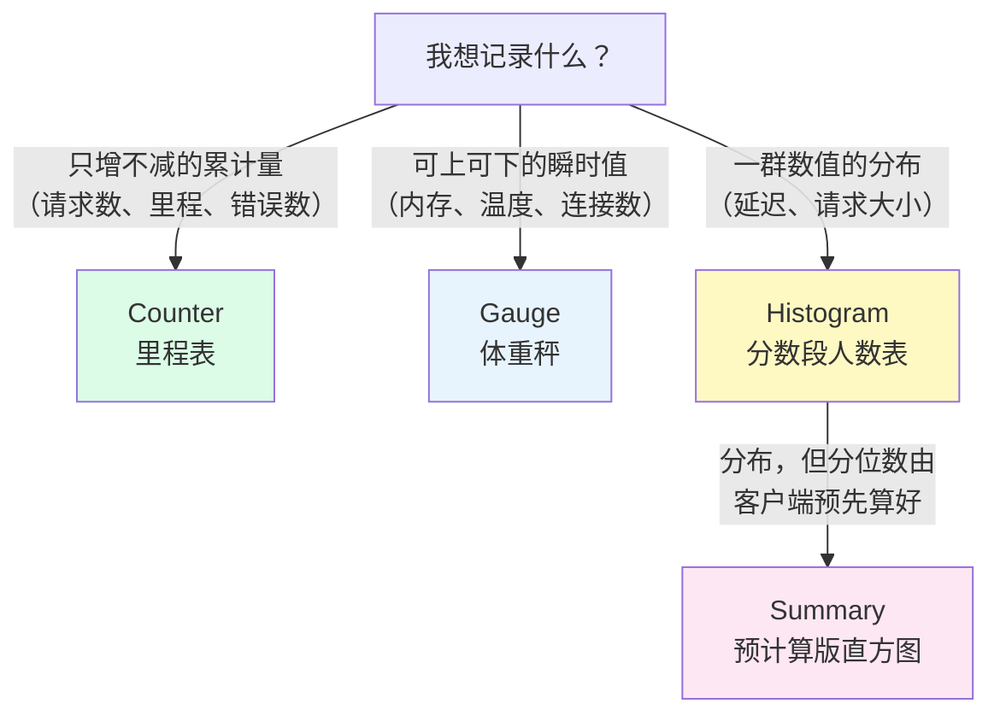

# L3 四种指标类型：Counter、Gauge、Histogram、Summary

> 阶段 1 · 地基与数据模型 | 零基础 + 实操 | 预计 35 分钟

## 第一幕：同样是记账，为什么要有四种手法

上一课你知道了数据怎么组织（序列、标签、样本）。但还有一个问题没回答：**程序往账本里记数时，记的是什么？**

想象你在记录一家奶茶店：「今天卖了 200 杯」和「此刻店里有 8 个客人」是两种完全不同的数——前者是**从开业起的累计**，后者是**当下的瞬时状态**。如果再加一个需求「想知道出餐平均要多久」，光一个数就不够了，得记**每个时间段各有多少单**。

Prometheus 把记账手法分成四种类型：**Counter、Gauge、Histogram、Summary**。看不懂类型，你就看不懂图，更写不对查询。

## 第二幕：新手最常见的一张废图

新手拿到「总请求数」指标，直接画图，得到一条一路向右上方爬升的线——从 0 涨到几百万。看起来很唬人，其实是张**废图**：它只告诉你「程序活着」，看不出任何趋势、异常、高峰。

直觉会说：「那我取两个时间点做减法，算每小时增量不就行了？」问题在程序重启：计数器归零，减法得出一个巨大的**负数**，图直接崩穿底部。

这两个坑，Counter 的类型语义 + `rate()` 函数就是解药。先把四种类型看全。

## 第三幕：四种记账手法



### Counter：里程表

**只增不减**，程序重启时归零重来。名字约定俗成以 `_total` 结尾（如 `http_requests_total`）；Histogram 的 `_count` 系列（如 `demo_api_request_duration_seconds_count`）本质上也是 Counter。

Counter 的原始值几乎没用（几百万而已），它的价值在**差值**：一段窗口内的增量，即「这段时间发生了多少事」。所以 Counter 的正确读法永远是套一层 `rate()` 或 `increase()`——这正是下一幕的主角。

### Gauge：体重秤

**当前时刻的值，可上可下**。内存用量、CPU 使用率、队列长度、温度、磁盘剩余空间，以及你已经认识的 `up`。

Gauge 的原始值直接画图就有意义（内存曲线本身就在讲故事），不需要 `rate()`。想看它的变化用 `delta()`（窗口首尾差）、`idelta()`（最后两个样本之差）或 `deriv()`（每秒变化率）。

### Histogram：分数段人数表

想回答「95% 的请求有多快」，一个平均值不够——得知道**分布**。Histogram 的记法是：把观测值按预先定义的**桶（bucket）边界**分档计数，像考试成绩按 `≤60、≤80、≤100` 统计各档人数。

一个 Histogram 指标会展开成一族序列：

- `xxx_bucket{le="0.1"}`：小于等于 0.1 的观测次数（le = less than or equal，**累积式**，le 越大值越大）
- `xxx_sum`：所有观测值的总和
- `xxx_count`：观测次数（本质上是个 Counter）

桶边界在**服务端暴露指标时**就固定死了。想知道为什么累积式桶能算出 P95，L10 用 `histogram_quantile()` 揭晓。

### Summary：预计算版直方图

同样记录分布，但分位数（如 P50、P90）由**客户端程序在记录时就算好**，直接暴露成 `xxx{quantile="0.9"}` 这样的序列，查询端拿来即用。

代价：分位数**只能在客户端预先选定**，事后想看 P93 就没了；而且多实例的 Summary 分位数**无法聚合**（P95 的平均不是 P95）。Histogram 的分位数是查询时算的，可以跨实例聚合。**现代实践：优先 Histogram。** 看懂它，Summary 自然就看懂了。

### 对比速查表

| 类型 | 记什么 | 曲线长相 | 典型查询 | 命名线索 |
|------|--------|----------|----------|----------|
| Counter | 只增不减的累计量 | 一路爬升，重启归零 | `rate()` / `increase()` | `_total`、`_count` |
| Gauge | 可上可下的瞬时值 | 任意波动 | 直接查、`avg_over_time()` | 无固定后缀（`up`、内存类） |
| Histogram | 观测值分布（分桶计数） | 多条 `le=` 阶梯线 | `histogram_quantile()` | `_bucket`、`_sum` |
| Summary | 分布（客户端预计算分位数） | 几条 `quantile=` 平线 | 直接查 | `_sum`、`{quantile=}` |

## 第四幕的主角：为什么 rate() 只对 Counter 有意义

`rate(xxx[5m])` 的语义是「这段窗口内**平均每秒**增长了多少」。它对 Counter 有意义，靠两件事：

**第一，语义成立。** Counter 是累积量，「每秒发生多少次」是有业务含义的物理量（QPS、每秒字节数）。Gauge 的差值除以时间通常没有含义——「内存每秒增长 3.7 字节」描述不了任何东西，你要的是「内存现在多少」或「比昨天多了多少」，直接查或做差即可。

**第二，重置保护。** `rate()` 在窗口内看到值**下降**，就知道发生了重启归零，会自动把「下降前的值 + 重置后的增量」拼起来，得出正确的增速。对 Counter 用裸减法会算出负数的天坑，`rate()` 天然免疫；而 Gauge 的下降是真实业务变化，绝不能当重启去「修正」。

所以规矩很简单：**`_total` 一律套 `rate()`，Gauge 直接用**。这条规矩会让你避开 90% 的新手曲线灾难。

## 第五幕（实操）：在演练场验证四种类型

打开 **https://demo.promlens.com/**，全部切到 **Graph** 标签页看曲线形状。

### 验证一：Counter 一路爬升

```promql
demo_api_request_duration_seconds_count
```

曲线只涨不跌（演练场服务长期不重启，是完美的单调递增线）。

### 验证二：rate() 点石成金

```promql
rate(demo_api_request_duration_seconds_count[1m])
```

同样的指标，套上 `rate()` 后变成一条有起伏的速率曲线——这就是每秒请求数（QPS），废图秒变核心指标。

### 验证三：Gauge 的波动

```promql
demo_disk_usage_bytes
```

有涨有跌的锯齿/波浪线，这就是 Gauge 的长相。给它套 `rate()` 会得到一串接近 0 的噪声，亲手体会「为什么没意义」。

### 验证四：看一眼 Histogram 的桶

```promql
demo_api_request_duration_seconds_bucket
```

会看到多条曲线，每条带一个 `le="..."` 标签，且 `le` 越大的曲线值越高（累积式）。这就是分布的原始材料，L10 再加工。

### 本课实操任务

1. 依次执行验证一至四，截图或记住四种曲线长相：单调爬升 / 速率波动 / 上下震荡 / le 阶梯
2. 把验证二的窗口从 `[1m]` 改成 `[5m]` 再改成 `[30s]`，观察曲线平滑度变化
3. 对 Gauge 指标执行 `rate(demo_disk_usage_bytes[1m])`，确认结果是一串没意义的噪声
4. 思考题：为什么不能用 Gauge 记「总请求数」（每次采样直接上报当前窗口的请求数）？（提示：上次采样到这次采样之间的历史，之后还算得回来吗？）

## 收束与预告

本课的心智模型，五句话：

- Counter = 里程表（只增不减），Gauge = 体重秤（可上可下），Histogram = 分数段人数表（分布），Summary = 预计算的分布
- Counter 的价值在差值，原始值几乎没用，所以查询时永远套 `rate()`
- Gauge 原始值直接可用，套 `rate()` 反而得到噪声
- `rate()` 对 Counter 的两大贡献：每秒增速的语义 + 重启归零的重置保护
- Histogram 桶是累积式的（le 越大值越大），Summary 不可聚合、优先 Histogram

**下一课预告（L4 瞬时向量 vs 范围向量）**：本课反复出现的 `[1m]`、`[5m]` 到底取了什么？为什么 `rate()` 必须带方括号、而裸指标不能带？阶段 2 第一课，拆开 PromQL 里最重要的两个数据形态。

---

> ## 👉 进入下一课
>
> 完成本课实操任务后，回复「**继续**」进入 **L4《瞬时向量 vs 范围向量：[5m] 到底取了什么》**——进入阶段 2 核心语法，理解方括号背后的两种数据形态。

---

## 🧭 课程导航

⬅️ **上一课**：[L2 数据模型：指标、标签与时间序列](lesson-02-数据模型.md)

➡️ **下一课**：[L4 瞬时向量 vs 范围向量：[5m] 到底取了什么](../../2-核心语法/lessons/lesson-04-瞬时向量与范围向量.md)

📚 **返回目录**：[课程目录](../../02-课程目录.md)
