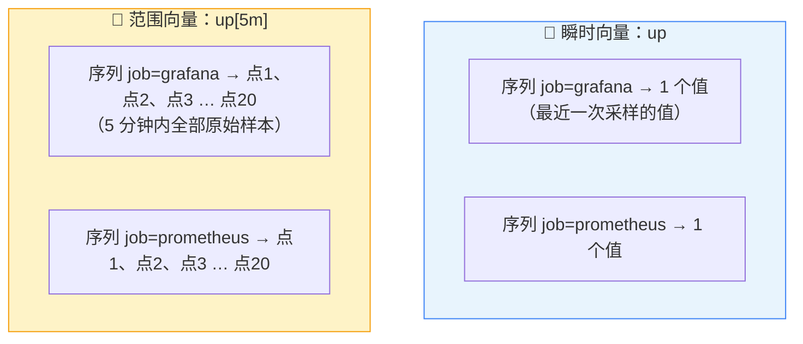

# L4 瞬时向量 vs 范围向量：[5m] 到底取了什么

> 阶段 2 · 核心语法 | 零基础 + 实操 | 预计 30 分钟

## 第一幕：L3 留下的那个方括号

L3 里你已经两次和方括号打交道了：跑过 `rate(demo_api_request_duration_seconds_count[1m])`，还亲手把窗口改成 `[5m]`、`[30s]`，看到曲线从毛刺变平滑。但有个问题一直悬着：**这个方括号，到底从数据库里取出了什么东西？**

先来个生活类比。打开股票 App，一只股票的首页大字是「现价 12.34 元」——就一个数；点进分时图，看到的是过去一小时密密麻麻的一串成交价。你向 PromQL 发出的每个查询，本质上也是在要这两种东西之一：**一个现值**，或**一段时间的一串原始记录**。

Prometheus 给这两种东西起了名字：**瞬时向量（Instant Vector）** 和**范围向量（Range Vector）**。这是 PromQL 的第一道分水岭——后面所有函数、所有告警规则，都建立在你分得清这两种形态上。

## 第二幕：多一个方括号，怎么就报错了

两个你马上就能在演练场亲手复现的怪现象：

- 查 `up`，Graph 标签页正常画出一条线；
- 查 `up[5m]`——只是加了个方括号——Graph 直接拒绝，报错说表达式类型不对（range vector 不能用来画图）。切到 Table 倒是能看，但每个序列的结果从「一个数」炸开成「一长串带时间戳的记录」。

困惑来了：**明明只是把「一个数」换成了「一串数」，为什么一个能画图、一个直接报错？这串数到底是什么，留着有什么用？**

说不清方括号取了什么，后面所有带 `[xx]` 的函数对你来说都是黑盒咒语——你会用，但不知道为什么这么写。本课就把这个黑盒拆开。

## 第三幕：两种数据形态



### 瞬时向量：一张照片

**一句话定义**：查询那一刻，每条序列各取**一个**样本，组成的一组「序列 → 值」。

它像**拍照**：按下快门的瞬间，所有序列的最新状态被定格成一张照片。你在 Table 里查 `up`，看到的每个序列后面只跟着一个数——这就是照片。

一个不显眼但重要的细节：照片上的值不一定是在你按下快门**那一毫秒**采集的。Prometheus 的规矩是：取每条序列**最近一次**采到的值，只要这个值「足够新」（默认 5 分钟内采过就算数；间隔由服务端配置，一般不用改）。所以 `up` 的结果不会因为采样发生在几秒前而消失。

### 范围向量：一段录像

**一句话定义**：每条序列在一段窗口内的**全部**原始样本（时间戳 + 值 成对出现），组成的一组「序列 → 一串点」。

它像**录像**：`up[5m]` 就是「把过去 5 分钟的监控录像调出来」。录像里每条序列不再是一个数，而是一串按时间排列的原始点。

**这串点有多少个？** 一个简单的估算：

> 点数 ≈ 窗口长度 ÷ 抓取间隔

演练场大约每 15 秒抓取一次，所以 `[5m]`（300 秒）约 20 个点，`[1m]`（60 秒）约 4~5 个点。（窗口边界怎么切会让结果差一两个点，量级对就够了。第四幕带你亲手数一数验证。）

### 方括号里的时间怎么写

完整的时间单位表（从小到大）：

| 单位 | 含义 | 示例 |
|------|------|------|
| `ms` | 毫秒 | `up[100ms]` |
| `s` | 秒 | `up[30s]` |
| `m` | **分钟** | `up[5m]` |
| `h` | 小时 | `up[1h]` |
| `d` | 天 | `up[1d]` |
| `w` | 周 | `up[1w]` |
| `y` | 年 | `up[1y]` |

零基础两大高频坑：

- **`m` 是分钟（minute）**，不是「米」也不是「月」。想写「一个月」得用 `30d`。
- **只能用单一单位，不能组合**。`1h30m` 这种组合写法是非法的，跨小时直接写 `90m`。

### 为什么「录像」不能直接看

Graph 画线的逻辑是：一个序列在某个时刻对应一个值，才能落成一个点、连成一条线。范围向量一个序列带着 20 个值，**根本没法落成单个点**，所以 Graph 直接报错拒绝。

那录像拿来干什么？Prometheus 的设计是：**范围向量专门用来喂给函数**。`rate()`、`max_over_time()`、`avg_over_time()` 这类函数，吃进一段录像（范围向量），消化后吐出一张照片（瞬时向量）——比如 `rate(up[5m])` 哪怕语法上能跑，本质也是「吃录像、吐照片」。

这就解开了本课所有悬念：

- **方括号本身只负责「取数」，不做任何计算**。`up[5m]` 不会帮你算平均、算速率，它只是把原始录像带搬出来。
- 所以 L3 的规矩 `rate(xxx_total[5m])` 里，`[5m]` 供应原材料（录像），`rate()` 负责加工（算出每秒增速）。缺方括号，rate 没米下锅；不套函数，录像没法直接上图。

> 💡 **进阶细节（选读，跳过不影响后续）**：前面说瞬时向量取「最近一次采样」，那多旧的采样会被淘汰？默认回看 5 分钟（服务端参数 `lookback-delta`）。这也解释了为什么某台机器挂了 5 分钟后，它的序列才从 `up` 的结果里消失——太久没采样，照片上就不再有它。

### 对比速查表

|  | 瞬时向量 | 范围向量 |
|--|----------|----------|
| 长相 | `up` | `up[5m]` |
| 比喻 | 一张照片 | 一段录像 |
| 每条序列几个值 | 1 个（最近采样） | 一串（窗口内全部原始点） |
| Graph 画图 | ✅ 正常画线 | ❌ 报错（类型不合法） |
| Table 查看 | ✅ 每序列一个数 | ✅ 每序列一串带时间戳的点 |
| 直接用于运算 / 画图 / 告警 | ✅ | ❌ 必须先过函数（`rate()` 等）加工 |

📚 **官方文档**：[Prometheus 查询基础（数据类型与时间单位）](https://prometheus.io/docs/prometheus/latest/querying/basics/)

## 第四幕（实操）：在演练场亲眼看到两种形态

打开 **https://demo.promlens.com/**，按顺序做四个验证。

### 验证一：照片长什么样

切到 **Table** 标签页，执行：

```promql
up
```

每个序列一行，行尾**只有一个值**（1 或 0）。这就是瞬时向量：此刻的快照。

### 验证二：录像长什么样

Table 标签页继续，执行：

```promql
up[5m]
```

每个序列的结果炸开成**一长串「时间戳 + 值」**。这就是范围向量：过去 5 分钟的原始录像带。顺手数一数一个序列有几个点（大约 20 个上下）。

### 验证三：亲手触发那个报错

切到 **Graph** 标签页，先执行 `up`（正常画线），再执行：

```promql
up[5m]
```

Graph 拒绝执行，报错提示表达式类型不合法（range vector 不能画图）。**记住这个报错**——以后看到它，第一反应应该是「我在 Graph 里喂了录像，套个 `rate()` 之类的函数把它变成照片」。

### 验证四：数点数，反推抓取间隔

Table 标签页，执行：

```promql
up[2m]
```

挑一个序列，数它的点数（比如 8 个），做个除法：`120 秒 ÷ 8 = 15 秒`——你刚刚**反推出了演练场的抓取间隔**。再把窗口改成 `[4m]`，点数应该翻倍（约 16 个）。

这个小游戏同时验证了核心公式：**点数 ≈ 窗口长度 ÷ 抓取间隔**。

### 本课实操任务

1. 完成验证一至四，确认亲眼见过：单值 / 点串 / 报错 / 点数随窗口翻倍
2. 把 `up[5m]` 的窗口依次改成 `[30s]`、`[1h]`，在 Table 里对比点数变化，验证公式
3. 在 Graph 里执行 `up[30s]`，确认同样报错（换窗口长度不改变「录像不能直接画」的规矩）
4. 思考题：`rate(up[5m])` 在 Graph 里能画出线吗？画出来的线有意义吗？（提示：语法上「录像喂给函数」是成立的，能画；但回忆 L3——`up` 是什么指标类型？`rate()` 对哪种类型才有意义？画出来的会是什么？）

## 收束与预告

本课的心智模型，五句话：

- **瞬时向量 = 照片**：每条序列取 1 个值（最近采样），`up` 这种裸指标就是它
- **范围向量 = 录像**：每条序列取窗口内全部原始点，`up[5m]` 就是它
- **点数 ≈ 窗口长度 ÷ 抓取间隔**；`m` 是分钟，时间只能用单一单位
- **方括号只取数、不计算**；计算永远是函数的事
- **录像不能直接画图**，必须喂给 `rate()` 等函数加工成照片——这就是 `rate()` 必须带方括号的完整原因

**位置与伏笔**：本课是阶段 2（核心语法）的第一课。接下来三课都在「照片」上做文章：L5 学怎么用标签匹配器从照片里**筛出你要的序列**；L6 学对照片做**运算和比较**；L7 学把两张照片**拼在一起**算出使用率这类指标。而「录像」会一直陪到你见 `rate()` 全家（L8）——现在你已经知道它吃的是什么了。

---

> ## 👉 进入下一课
>
> 完成本课实操任务后，回复「**继续**」进入 **L5《标签匹配器四兄弟：= != =~ !~》**——学会从几百条序列里精准捞出你要的那几条。

---

## 🧭 课程导航

⬅️ **上一课**：[L3 四种指标类型：Counter、Gauge、Histogram、Summary](../../1-地基与数据模型/lessons/lesson-03-四种指标类型.md)

➡️ **下一课**：[L5 标签匹配器四兄弟：= != =~ !~](lesson-05-标签匹配器.md)

📚 **返回目录**：[课程目录](../../../02-课程目录.md)
