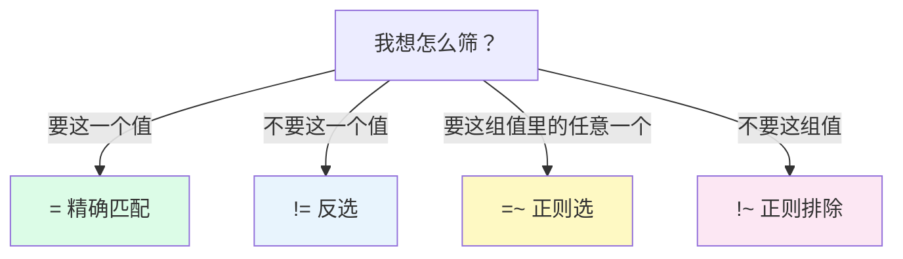

# L5 标签匹配器四兄弟：= != =~ !~

> 阶段 2 · 核心语法 | 零基础 + 实操 | 预计 35 分钟

## 第一幕：照片拍下来了，可上面人太多

L4 结尾你已经会取「照片」了：一条查询，每条序列一个现值。但照片真拍出来你会发现——**序列太多了**。`demo_cpu_usage_seconds_total` 一查就是几十条曲线：每个实例 × 每个 CPU × 每种 mode 的序列全挤在一张图上，想找「这台机器的 CPU 空闲」那条线，堪比在合家福照片里找表弟。

你在淘宝买鼠标时也遇到过同样的问题：搜索结果几百万件。你的动作不是一页页翻，而是点筛选器——品牌选罗技、价格 100-300、再勾上无线。三个条件**同时生效**，几百万件瞬间变几十件。

PromQL 的筛选器写在指标名后面的**花括号 `{}`** 里，主角是四个匹配器：`= != =~ !~`。这一课把它们认全。

## 第二幕：一次满怀信心的空表

新手的两个典型时刻：

第一个：面对几十条曲线肉眼找目标序列，找到眼花，还容易看串行。

第二个更扎心。你听说了 `=~` 支持「正则匹配」，心想 system 里含有 sys，那这么写肯定能匹配到：

```promql
demo_cpu_usage_seconds_total{mode=~"sys"}
```

回车——**空表**。一行结果都没有。不报错、不提示，就是空。你大概率开始怀疑：指标名拼错了？环境坏了？

都不是。这是一条隐藏规则在起作用——正则的**全锚定**。规则本身 30 秒就讲得完，但不知道的人几乎 100% 会栽在这里。第三幕揭晓。

## 第三幕：四兄弟与一条铁律

### 语法长什么样

筛选条件写在花括号里，跟在指标名后面：

```promql
指标名{标签1="值1", 标签2=~"值2"}
```

多个条件用逗号隔开，**必须全部同时满足**——就像淘宝里「品牌=罗技」和「价格 100-300」要同时成立，只满足其中一个的商品不会出现。

### 先备工具：正则生存包（三分钟速成）

四兄弟里 `=~` 和 `!~` 的引号里要写**正则表达式**，先把工具备好。零基础第一次见不用慌，日常筛选只需要三个符号：

| 符号 | 含义 | 例子 |
|------|------|------|
| `|` | 或者 | `user|system` = user 或 system |
| `.` | 任意单个字符 | `5..` = 任何「3 个字符且第 1 个是 5」的值，如 500、503 |
| `.*` | 任意一串（可以为空） | `sys.*` = 以 sys 开头的任何值 |

### 四兄弟逐一亮相



**`=` 精确匹配**：标签值和给定值完全相等才留下。`{mode="idle"}` 只留 idle 的序列。最常用，拿不准时先用它。

**`!=` 反向精确**：不等于这个值的才留下。`{mode!="idle"}` 把 idle 扔掉，其余全留。

**`=~` 正则匹配**：标签值要匹配一个正则表达式。`{mode=~"user|system"}` 留下 user 或 system——一个条件选中多个值，这是它比 `=` 强的地方。

**`!~` 反向正则**：匹配正则的扔掉，其余留下。`{mode!~"idle|iowait"}` 一次排除两个值。

### 铁律：全锚定

第二幕空表的谜底：**PromQL 会给正则两头隐式补上锚点，要求标签值从头到尾整条匹配**。

正则匹配像按门禁密码：密码是 5870，你按 587 不开门，按 58701 也不开门——必须不多不少整条对上。`sys` 对不上 `system`，因为 `system` 比「密码」多了一截。

所以这三种写法含义完全不同：

| 写法 | 含义 | 能匹配 system 吗 |
|------|------|------------------|
| `=~"sys"` | 恰好等于 sys | ❌ |
| `=~"sys.*"` | 以 sys 开头 | ✅ |
| `=~".*sys.*"` | 包含 sys | ✅ |

一句话记法：**想要「包含」，两边的 `.*` 要自己写足**。Prometheus 不提供模糊搜索。

### 对比速查表

| 匹配器 | 语义 | 例子 | 结果 |
|--------|------|------|------|
| `=` | 等于这个值 | `mode="idle"` | 只要 idle |
| `!=` | 不等于这个值 | `mode!="idle"` | 除 idle 外全部 |
| `=~` | 整条匹配正则 | `mode=~"user|system"` | user、system |
| `!~` | 匹配正则的都不要 | `mode!~"idle|iowait"` | 除这两个外全部 |

📚 **官方文档**：[Prometheus 查询基础（标签匹配器）](https://prometheus.io/docs/prometheus/latest/querying/basics/)

> 💡 **进阶细节（选读，跳过不影响后续）**：不存在的标签会被当成空字符串参与匹配：`{mode=""}` 能选出**没有** mode 标签的序列，`{mode!=""}` 选出**有** mode 标签的序列。另外，`up` 其实是 `{__name__="up"}` 的简写——指标名本身也像个标签，高阶玩法里能用 `{__name__=~"demo_cpu.*"}` 一次选中一族指标，混个脸熟即可。

## 第四幕（实操）：在演练场亲手筛一遍

打开 **https://demo.promlens.com/**，全程用 **Table** 标签页看序列清单（Graph 也行，但 Table 数序列最直观）。

### 验证一：`=` 先看全量，再一刀切下去

Table 执行：

```promql
demo_cpu_usage_seconds_total
```

感受一下序列数量：一大片。接着：

```promql
demo_cpu_usage_seconds_total{mode="idle"}
```

瞬间只剩 idle 的序列。**筛选就是做减法**：从全量里挑出子集，值本身一点没动。

### 验证二：`!=` 反着切

```promql
demo_cpu_usage_seconds_total{mode!="idle"}
```

非 idle 的 mode（user、system）全在。和验证一对照：一个把 idle 挑出来，一个把 idle 扔掉，两次查询的结果正好把全量分成互补的两半——每个序列要么是 idle，要么不是，不重不漏。

### 验证三：亲手复现第二幕的空表

```promql
demo_cpu_usage_seconds_total{mode=~"sys"}
```

空表。**记住：空表不是报错**，只是没有任何序列能整条匹配上 sys。然后换成前缀写法：

```promql
demo_cpu_usage_seconds_total{mode=~"sys.*"}
```

system 回来了。你刚刚亲手撞上了「全锚定」这堵墙，又翻了过去。

### 验证四：组合条件，筛出有业务含义的东西

先说明：这个指标的值是 L3 讲过的累计大数，本课只关心筛出了哪些序列，别管数值大小。

```promql
demo_api_request_duration_seconds_count{method="POST", status=~"500|503"}
```

「POST 请求里的 5xx 错误」——两个条件同时生效，一条查询就有了业务语义。再换成黑名单写法跑一次：

```promql
demo_api_request_duration_seconds_count{method="POST", status!~"200"}
```

当前结果和上一条一样（演练场的状态码只有 200/500/503 三种）。但两者语义并不相同——这正是思考题的素材。

### 本课实操任务

1. 完成验证一至四，重点确认两件事：空表不是报错；`sys.*` 能把 system 救回来
2. 数行数验证「筛选是减法」：在 `demo_api_request_duration_seconds_count` 上，`{method="GET"}` 的行数 + `{method="POST"}` 的行数 = 不带筛选的全量行数（method 只有 GET/POST 两个取值，互补关系最干净）
3. 把验证四的 `status=~"500|503"` 改成 `status=~".*"` 跑一下，再对比不带 status 条件的写法（答案：结果一样——`.*` 匹配一切，等于没筛）
4. 思考题：将来服务新增了 404 状态码，`status!~"200"` 和 `status=~"500|503"` 的结果还一样吗？如果 404 也算你眼里的「错误」，该用哪条？（提示：黑名单是「除了它都要」，白名单是「只要这几个」）

## 收束与预告

本课的心智模型，五句话：

- 筛选写在 `{}` 里，多个条件逗号隔开，**全部同时满足（AND）**
- 四兄弟：`=` 等于、`!=` 不等于、`=~` 正则选、`!~` 正则排除
- **正则全锚定**：`=~"sys"` 只匹配恰好叫 sys 的；包含要写 `.*sys.*`，前缀要写 `sys.*`
- 正则生存包三件套：`|` 或、`.` 任意单个字符、`.*` 任意一串
- 筛选只挑序列、不碰值——对「值」做加工是 L6 运算符的事

**位置与伏笔**：阶段 2 第二课。你已经会把不要的序列筛掉了，接下来 L6 学对剩下的值做**运算**：字节数除以 1024² 变成 GB、只保留超过阈值的曲线。L7 再学把两张照片按标签**拼在一起**。从 L8 开始，你写的每一行查询里几乎都会有今天这四个匹配器的身影。

---

> ## 👉 进入下一课
>
> 完成本课实操任务后，回复「**继续**」进入 **L6《运算符：算术、比较、逻辑与 bool 修饰符》**——学会对查出来的值做加减乘除和阈值过滤。

---

## 🧭 课程导航

⬅️ **上一课**：[L4 瞬时向量 vs 范围向量：[5m] 到底取了什么](lesson-04-瞬时向量与范围向量.md)

➡️ **下一课**：[L6 运算符：算术、比较、逻辑与 bool 修饰符](lesson-06-运算符.md)

📚 **返回目录**：[课程目录](../../../02-课程目录.md)
