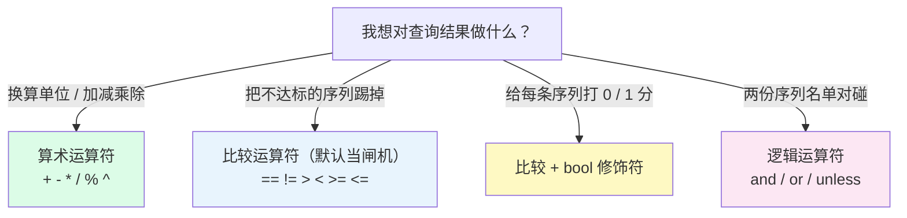

# L6 运算符：算术、比较、逻辑与 bool 修饰符

> 阶段 2 · 核心语法 | 零基础 + 实操 | 预计 40 分钟

## 第一幕：L5 的预告，现在兑现

L5 收束时留了一句话：**筛选只挑序列、不碰值——对「值」做加工是 L6 运算符的事。** 现在兑现。

先看两个真实场景。

场景一：你查 `demo_cpu_usage_seconds_total{mode="idle"}`，Table 里的值像 `3628800`——这是开机以来 CPU 空闲了多少**秒**。天文数字，没人读得懂。你想要的是「多少**小时**」。

场景二：环境里有好几个服务，你只关心一件事——**有没有挂掉的**。`up` 查出来一堆 1，健康的和不健康的混在一起，你想让异常自己跳出来。

两个场景，正好对应两类运算符。生活里你早就在用它们：

- **算术**像**汇率换算**：代购标价 5000 日元，你心里除以 20 变成 250 元人民币——商品还是那件商品，只是标价被换算了
- **比较**像**过山车身高闸机**：不足 1.2 米的游客被拦下，达标的原样放行——放行的人没被改变，只是不够格的请出去了

## 第二幕：`==` 不说真话

带着场景二的需求，你很自然地写下：

```promql
up == 1
```

心想：等于 1 的返回 true 吧？回车——Table 里出现的是**序列本身**，一行行 up 序列，值还是原来的 1。没有 true，没有 false。

再试 `up == 0`，想捞出挂掉的——**空表**（当前所有服务都活着，本来就该空）。

你开始怀疑：这个 `==` 到底在干什么？我想要的「对/错」呢？

谜底：**PromQL 的比较运算符默认不是打分器，是闸机（过滤器）**。`up == 1` 的真实含义是「值等于 1 的序列放行，其余拦下」——所以活着的序列原样出现，值原封不动。空表不是出错，是「没有任何序列能通过闸机」。

那想要 0/1 打分怎么办？在比较符后面加一个关键字：`bool`。它就是本课标题里的最后一块拼图。

## 第三幕：三类运算符 + 一个修饰符



### 算术运算符：换算器

七个：`+` `-` `*` `/` `%`（取余）`^`（乘方）。

场景一的解法：

```promql
demo_cpu_usage_seconds_total{mode="idle"} / 3600
```

3628800 秒 → 1008 小时，一眼能懂（约 42 天没重启的机器）。

规则一句话：**向量和标量（单个数字）运算，= 每条序列各自算一遍**。序列一条不多、一条不少，只有值被换算。

> ⚠️ 注意：两个**向量**之间的算术（A 指标 ÷ B 指标，比如内存使用率）需要「配对规则」才能算——那是 L7 的主菜，今天先按住不表。

### 比较运算符：闸机

六个：`==` `!=` `>` `<` `>=` `<=`。

默认行为：**当闸机用**。每条序列的值去过闸——满足条件的**原样放行（值不变）**，不满足的**直接消失**。

```promql
up == 0
```

= 「只放行值为 0 的序列」= 把挂掉的服务找出来。空结果 = 一个都没挂，好消息。

### bool 修饰符：把闸机换成打分器

```promql
up == bool 1
```

加上 `bool`，行为整个反转：**谁也不拦，全员保留，但值统一改写——过闸的记 1，没过的记 0**。

什么时候用它？当你想画一条 **0/1 状态线**的时候（比如「服务健康度」面板）。一句话记住两者的区别：

> **默认模式：不过关的会「消失」；bool 模式：不过关的「在场」，记 0 分。**

### 逻辑运算符：名单对碰

三个，操作对象是**两份序列名单**（两个向量），像拿两张名单对碰：

| 写法 | 语义 | 结果值 |
|------|------|--------|
| `A and B` | 交集：两边都有的序列 | 取 A 的值 |
| `A or B` | 并集：A 全保，再补上 B 里 A 没有的 | A 的值（补上的取 B） |
| `A unless B` | 差集：A 里去掉 B 也有的 | 取 A 的值 |

一个你现在就能跑的例子：

```promql
demo_api_request_duration_seconds_count{method="POST"} and demo_api_request_duration_seconds_count{status="500"}
```

POST 名单 ∩ 500 名单 = POST 且 500 的序列——效果上等价于 L5 学的 `{method="POST", status="500"}`。你可能会问：既然等价，要它干嘛？因为 **and 的两边可以塞进完全不同的查询**（不同指标、聚合结果……），那才是它真正的主场，L7 见分晓。

配对规则今天只记一条：**默认按「标签组完全相同」对碰**（值不参与）。灵活配对（`on`/`ignoring`）是 L7。另外，逻辑运算符两边必须是向量，`up and 1` 这种写法不合法。

### 优先级：拿不准就加括号

| 优先级 | 运算符 |
|--------|--------|
| 最高 | `^` |
| ↓ | `*` `/` `%` |
| ↓ | `+` `-` |
| ↓ | 比较六兄弟 |
| ↓ | `and` `unless` |
| 最低 | `or` |

顺手验证：`1 + 2 * 3` 的结果是 7 不是 9（先乘除后加减）。实操建议：**混用运算符时永远写括号**，给自己和未来的同事省脑细胞。

### 对比速查表

| 类别 | 代表写法 | 序列数 | 值 |
|------|----------|--------|-----|
| 算术 | `/ 3600` | 不变 | 变（换算） |
| 比较（默认） | `== 0` | 变（过滤） | 不变 |
| 比较 + bool | `== bool 1` | 不变 | 变（0/1） |
| 逻辑 | `and` 等 | 变（集合运算） | 取 A（or 补位的取 B） |

「序列数变不变、值变不变」就是四类操作的身份识别卡，拿这张卡去认现场任何一个表达式。

📚 **官方文档**：[Prometheus 运算符](https://prometheus.io/docs/prometheus/latest/querying/operators/)

> 💡 **进阶细节（选读，跳过不影响后续）**：算术和 bool 的运算结果会**丢掉指标名**——Table 里序列只剩 `{instance=..., job=...}`，因为「换算过的值已经不是原指标了」。只有比较默认模式（当闸机）保留指标名——毕竟它什么都没动，只是拦人。第四幕验证一时会亲眼看到。

## 第四幕（实操）：在演练场把四类操作全跑一遍

打开 **https://demo.promlens.com/**，全程 **Table** 标签页（Graph 留给验证四）。

### 验证一：算术换算，秒变小时

先跑原始值：

```promql
demo_cpu_usage_seconds_total{mode="idle"}
```

再跑换算：

```promql
demo_cpu_usage_seconds_total{mode="idle"} / 3600
```

对比两次结果：值全部缩了 3600 倍，行数一模一样（换算器不动序列数）。顺手留意：结果序列名里 `demo_cpu_usage_seconds_total` 不见了——原因见第三幕进阶细节。

### 验证二：闸机过滤，找出挂掉的

```promql
up == 1
```

然后：

```promql
up == 0
```

前者放行所有活着的服务；后者大概率空表——空 = 没有服务挂掉，这是**好消息**，不是查询失败。

顺带一提：在人人都是 1 的环境里，`up == 1` 跑出来和 `up` 长得一模一样——闸机只有拦下人时才显出存在感。想亲眼看到它拦人，试试：

```promql
up > 1
```

up 的值只有 0 和 1 两种，没有任何序列大于 1——全员被拦，空表。这回闸机真的干活了。

### 验证三：阈值二分，亲手摸到最大值

```promql
demo_api_request_duration_seconds_count > 100000
```

看剩几行。把阈值不断乘 10，直到空表；如果一开始就空，就砍半往回找。空表边缘的那个阈值，就是这些序列值的**天花板附近**——你刚刚用比较运算符做了一次二分搜索，亲手摸到了数据的量级。

### 验证四：bool 打分，画一条健康线

```promql
up == bool 1
```

序列全员在场，值统一变 1。切到 **Graph**：一条条笔直的水平线——这就是「服务健康度」面板的原料。再对比跑 `up` 和 `up == 1`：三者的值眼下都是 1，但注意看序列名——bool 版本把 `up` 这个名字弄丢了。

### 验证五：名单对碰

交集：

```promql
demo_api_request_duration_seconds_count{method="POST"} and demo_api_request_duration_seconds_count{status="500"}
```

再跑 `{method="POST", status="500"}` 对照——行数、值完全一致（同指标两边，and 等价于合并筛选条件）。

并集：

```promql
demo_api_request_duration_seconds_count{method="GET"} or demo_api_request_duration_seconds_count{method="POST"}
```

GET 名单 ∪ POST 名单 = 全量（method 只有这两个取值，行数回到不带筛选的样子）。同指标之间玩 or 看起来无聊，但它真正的价值在于**两边可以塞完全不同的查询**——L7 见分晓。

差集：

```promql
up unless up{job="prometheus"}
```

`job="prometheus"` 的那行从结果里消失了，其余 up 序列原样保留——unless 就是「名单减法」。

### 本课实操任务

1. 完成验证一至五，重点体感：算术变值不变行数、比较变行数不变值
2. 跑 `1 + 2 * 3` 确认结果是 7，再给算式加上括号 `(1 + 2) * 3` 看它变成 9
3. 验证 `demo_cpu_usage_seconds_total{mode="idle"} / 60 / 60` 和 `/ 3600` 结果一致（换算可以链着写）
4. 思考题：要在 Grafana 上画「服务健康度」曲线，挂掉的时刻你希望看到什么？该用 `up == 1` 还是 `up == bool 1`？为什么？（提示：服务挂掉时它的 up 值是 0——默认模式下这条序列的命运是什么？面板上「曲线归零」和「曲线无声消失」，哪个更可怕？）

## 收束与预告

本课的心智模型，五句话：

- **算术 = 换算器**：值变、序列数不变（`/ 3600` 秒变小时）
- **比较默认 = 闸机**：不达标的序列消失、幸存者值原样（`up == 0` 捞挂掉的）
- **bool = 打分器**：全员保留、值改写成 0/1（`up == bool 1` 画健康线）
- **逻辑 = 名单对碰**：and 交集、or 并集、unless 差集，结果值取左边
- **混用运算符，永远加括号**

**位置与伏笔**：阶段 2 第三课。你已经会「筛序列」（L5）也会「算值」（L6），L7 把两者合体：**两个不同指标的序列按标签配对相除**——「内存使用率 = 已用 ÷ 总量」这种黄金指标，就差最后一块拼图：配对规则 `on` / `ignoring` / `group_left`。今天学的 `/` 到时候要立大功。

---

> ## 👉 进入下一课
>
> 完成本课实操任务后，回复「**继续**」进入 **L7《向量匹配：on/ignoring 与 group_left 拼接》**——学会把两个不同指标拼在一起，算出内存使用率这类真正的业务指标。

---

## 🧭 课程导航

⬅️ **上一课**：[L5 标签匹配器四兄弟：= != =~ !~](lesson-05-标签匹配器.md)

➡️ **下一课**：L7《向量匹配：on/ignoring 与 group_left 拼接》（尚未编写，成课后此处更新为链接）

📚 **返回目录**：[课程目录](../../02-课程目录.md)
