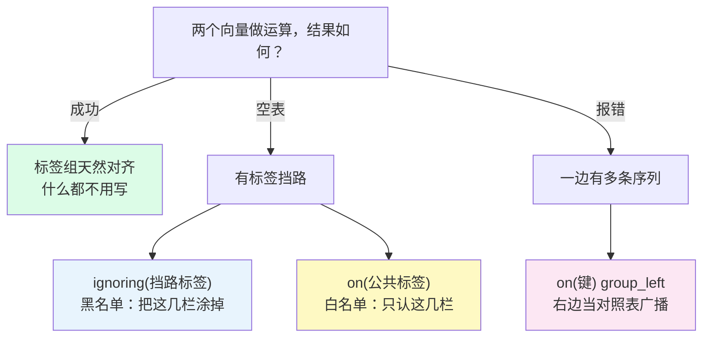

# L7 向量匹配：on/ignoring 与 group_left 拼接

> 阶段 2 · 核心语法 | 零基础 + 实操 | 预计 45 分钟

## 第一幕：L6 的悬案，与一对天生互补的指标

L6 结尾预告：**两个不同指标的序列按标签配对相除——「使用率 = 已用 ÷ 总量」这种黄金指标，就差配对规则这块拼图。** 现在兑现，而且第一个例子比你想的顺利。

先摸家底，裸跑两个指标：

```promql
demo_disk_usage_bytes
```

```promql
demo_disk_total_bytes
```

各 3 行：每台机器一条已用空间、一条总空间（注意看序列名——instance、job 两栏两两边完全一样）。

然后直接相除：

```promql
demo_disk_usage_bytes / demo_disk_total_bytes
```

**磁盘使用率，一次成功**：3 行，每台机器一个小数（约 `0.77`，也就是 77% 左右）。乘个 100（L6 的算术）就是能直接贴上 Grafana 的面板数字。

为什么这么顺？因为两个向量做运算时，Prometheus 默认的配对规则是：

> **左边每条序列，去右边找「标签组一字不差」的序列当搭档**（指标名 `__name__` 不参与比较）——找到就配对运算，找不到这条序列就出局。

用个类比：**配对舞会**。每条序列的名片就是它的标签组，默认规则是「名片上每个字都一样才牵手」。磁盘这对指标是天生一对——两张名片除了名字栏（指标名），instance、job 两栏完全相同，一牵一个准。

但别高兴太早。这种「天作之合」可遇不可求，第二幕马上让你撞墙。

## 第二幕：内存使用率的连环墙

现在做 L6 的原版悬案：**内存使用率**。先摸家底：

```promql
demo_memory_usage_bytes
```

12 行！这个指标没有「总量」兄弟指标，内存的四个分项全靠 `type` 标签区分：**used / free / cached / buffers**，3 台机器 × 4 分项。环境里根本不存在 `demo_memory_total_bytes`——总内存得自己拼出来：used + free + cached + buffers。

先从最简单的两分项开始。你心想：used 加 free，这还不简单？

```promql
demo_memory_usage_bytes{type="used"} + demo_memory_usage_bytes{type="free"}
```

回车——**空表**。又是空表（L5、L6 都见过），但这次的原因最隐蔽。

排查一下：左边序列的名片是 `{instance, job, type="used"}`，右边是 `{instance, job, type="free"}`——**type 一栏写着不同的字，名片对不上，直接判死刑**。

本课最反直觉的洞察来了：

> **恰恰是「区分这两条序列」的 type 标签，阻碍了它们配对。**

回想 L5：筛选时你靠 type 把 used 从一堆分项里挑出来——它是你的分身标识。到了 L7 配对时，它反过来成了枷锁。标签的两面性，这就是。

## 第三幕：配对规则全家福



### ignoring：把挡路的那一栏涂掉

解法直白得惊人：入场前把名片上的 type 栏**涂掉**，再按默认规则比对：

```promql
demo_memory_usage_bytes{type="used"} + ignoring(type) demo_memory_usage_bytes{type="free"}
```

→ **3 行**！每台机器一条「used + free 小计」（约 4-5GB，demo 环境的内存值在实时波动，数字对不上讲义别慌）。涂掉 type 后，两边名片只剩 instance、job，一字不差，牵手成功。

### on：反向操作，只认这几栏

`on(...)` 是白名单：名片**只保留**括号里列出的栏，其余全涂掉。刚才的查询等价写法：

```promql
demo_memory_usage_bytes{type="used"} + on(instance, job) demo_memory_usage_bytes{type="free"}
```

→ 同样 3 行。两条路殊途同归，选择原则一句话：

> **挡路的标签少 → 用 ignoring（黑名单短）；公共的标签少 → 用 on（白名单短）。哪个清单短用哪个。**

注意 on 选键的坑：如果写成 `on(type)`——只按 type 配对——三台机器的 used 序列 type 值全是 `"used"`，会全挤进同一个匹配组里，配对直接歧义。这个坑长什么样，留给实操思考题亲手踩。

### group_left：一边多条怎么办

换个新场景。环境里有个规格类指标 `demo_num_cpus`（每台机器一条，值 4）。现在想把内存的**每个分项**都乘上核数：

```promql
demo_memory_usage_bytes * on(instance) group_left demo_num_cpus
```

看结构：左边每实例 **4 条**（type 四分项），右边每实例 **1 条**。一对一规则破产——一条 num_cpus 要应付 4 条 memory 序列。

`group_left` 的语义：**声明「左边多、右边一」，把右边当对照表**——按 `on(instance)` 查表，把右边的值**广播**给左边每一条序列。结果 12 行，每行的值 = 原分项值 × 4，标签组保留左边的（type、instance、job 都在）。

类比：一个教练（右边 1 条）带一支队伍（左边多条）——教练的指令广播给全队，每个队员保留自己的号码牌（标签）。

坦白说：内存 × 核数没什么业务含义，这是纯机制演示。group_left 真正的主力场景是「**聚合结果（每机器 1 条）拼回明细序列**」，那要等 L9 学完 `sum` 才能解锁——到时候回来，你会感谢今天学的 group_left。

### 不写 group_left 会怎样：第一次见到真正的报错

把 group_left 删掉再跑一次：

```promql
demo_memory_usage_bytes * on(instance) demo_num_cpus
```

这次不是空表——**红色报错**，原文是：

> multiple matches for labels: many-to-one matching must be explicit (group_left/group_right)

Prometheus 检测到右边一条序列要配左边 4 条，它拒绝替你猜，直接罢工。至此你集齐了向量运算的两种失败模式，也是本课最重要的对照记忆：

| 失败模式 | 原因 | 一句话 |
|----------|------|--------|
| 空表 | 标签组对不上，谁也配不上谁 | 「**配不上**」 |
| 报错 | 配出来一堆，不知道选哪条 | 「**配歧义**」 |

`group_right` 一句话带过：group_left 的镜像（多的一边放右边）。实践中习惯把多的一边放左边用 group_left，查询读起来顺。

### 速查表

| 写法 | 匹配键 | 何时用 |
|------|--------|--------|
| 什么都不写 | 标签组完全相同 | 两边标签天然对齐（磁盘案例） |
| `ignoring(标签)` | 除列出的以外全部 | 挡路的标签少（内存案例） |
| `on(标签)` | 只看列出的 | 公共的标签少 |
| `on(标签) group_left` | 只看列出的 + 多对一 | 右边是对照表（每机器 1 条的规格类指标） |

📚 **官方文档**：[Prometheus 向量匹配](https://prometheus.io/docs/prometheus/latest/querying/operators/#vector-matching)

> 💡 **进阶细节（选读，跳过不影响后续）**：`group_left(标签名)` 还能把右边的关键标签「随身带过来」贴到结果上——比如把 num_cpus 的取值变成结果的一个新标签。混个脸熟即可，实战阶段（L11）遇到再展开。

## 第四幕（实操）：把三种配对全部亲手跑通

打开 **https://demo.promlens.com/**，全程 **Table** 标签页。

### 验证一：磁盘使用率，天作之合

先裸跑 `demo_disk_usage_bytes` 和 `demo_disk_total_bytes`，亲眼确认两边 3 行序列的 instance、job 完全一样。然后：

```promql
demo_disk_usage_bytes / demo_disk_total_bytes
```

3 行，约 `0.77`。再乘 100 变百分比——`* 100` 接在后面就行（想想 L6：标量运算对每条序列各算一遍）。

### 验证二：亲手复现内存空表

```promql
demo_memory_usage_bytes{type="used"} + demo_memory_usage_bytes{type="free"}
```

空表。对照验证一：同样是「两个向量做运算」，一个成功一个空——差别只在标签组。顺带跑一下裸的 `demo_memory_usage_bytes`（12 行），数一数 3 实例 × 4 分项。

### 验证三：ignoring 与 on 双解法

```promql
demo_memory_usage_bytes{type="used"} + ignoring(type) demo_memory_usage_bytes{type="free"}
```

```promql
demo_memory_usage_bytes{type="used"} + on(instance, job) demo_memory_usage_bytes{type="free"}
```

两条都返回 3 行小计。体会一下：ignoring 涂掉一栏，on 只留两栏，殊途同归。

### 验证四：group_left 广播，与报错对照

先跑广播版：

```promql
demo_memory_usage_bytes * on(instance) group_left demo_num_cpus
```

12 行，每行的值是原来的 4 倍（核数广播上去了）。再删掉 group_left 跑：

```promql
demo_memory_usage_bytes * on(instance) demo_num_cpus
```

红色报错：many-to-one matching must be explicit。**空表 vs 报错**，两种失败模式一次集齐。

### 验证五（挑战）：完整版内存使用率

总内存 = 四项之和。四个分项连着加（每个 `+` 都要 ignoring(type)），再让 used 除以它：

```promql
demo_memory_usage_bytes{type="used"} / ignoring(type) (demo_memory_usage_bytes{type="used"} + ignoring(type) demo_memory_usage_bytes{type="free"} + ignoring(type) demo_memory_usage_bytes{type="cached"} + ignoring(type) demo_memory_usage_bytes{type="buffers"})
```

3 行，约 15%-22%（环境实时波动）。这条查询串起了 L5 的筛选、L6 的算术、L7 的配对——**阶段 2 通关标准的完整体**。跑通它，回头看一眼：从 L1 连第一条查询都要照着抄，到现在能独立拼出一条业务级查询，你只用了一门课的时间。

### 本课实操任务

1. 完成验证一至五（验证五是挑战题，卡住就把括号里的分母单独跑，看它返回 3 行总量再拼回去）
2. 数行数三连并各说一句「为什么」：磁盘除法 3 行、ignoring 小计 3 行、group_left 12 行
3. 思考题：把验证三的 `on(instance, job)` 改成 `on(type)` 跑一下——先预测（空表还是报错？），再回车验证（提示：on(type) 意味着只按 type 配对，三台机器的 used 序列 type 值全是 "used"，它们会挤进同一个匹配组……）
4. 思考题：磁盘使用率为什么什么都不用写？（一句话答案在第一幕）

## 收束与预告

本课的心智模型，五句话：

- **默认配对 = 名片全同才牵手**：标签组一字不差（指标名不算），缺一个字就配不上
- **区分你的标签恰恰阻碍配对**：涂掉它（`ignoring`），或只认公共栏（`on`）
- ignoring 是黑名单、on 是白名单，**哪个清单短用哪个**
- 一边多条：`group_left` 声明「右边是对照表」——值广播、标签保留左边
- **空表 = 配不上，报错 = 配歧义**，两种失败模式一眼分清

**位置与伏笔**：阶段 2 收官，四课拼图合体——取形态（L4）→ 筛序列（L5）→ 算值（L6）→ 配对拼接（L7）。你已经能独立写出「磁盘使用率」「内存使用率」这类完整业务查询，阶段通关标准达成。

但有个东西从 L6 一直悬着：`demo_cpu_usage_seconds_total` 的值是 `3628800` 这种天文数字（累计了约 42 天的空闲秒数），「CPU 使用率」必须先把累计值变成**每秒速率**——这就是 `rate()` 的活，L3 埋的「rate() 只对 Counter 有意义」伏笔在 L8 正式回收。剧透一下：`rate(idle)` 除以 `rate(total)` 那一步，今天学的 ignoring 还要再立一功。

---

> ## 👉 进入下一课
>
> 完成本课实操任务后，回复「**继续**」进入 **L8《rate/irate/increase：Counter 的正确打开方式》**——进入阶段 3《函数与聚合》，把天文数字般的累计值变成每秒速率。

---

## 🧭 课程导航

⬅️ **上一课**：[L6 运算符：算术、比较、逻辑与 bool 修饰符](lesson-06-运算符.md)

➡️ **下一课**：[L8 rate/irate/increase：Counter 的正确打开方式](../3-函数与聚合/lessons/lesson-08-rate-irate-increase.md)

📚 **返回目录**：[课程目录](../../02-课程目录.md)
