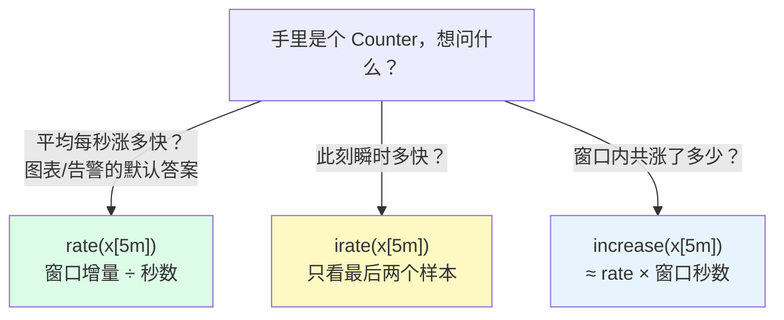

# L8 rate/irate/increase：Counter 的正确打开方式

> 阶段 3 · 函数与聚合 | 零基础 + 实操 | 预计 45 分钟

## 第一幕：42 天的天文数字

L7 结尾的预告兑现：`demo_cpu_usage_seconds_total` 的值是个天文数字。先亲眼看看：

```promql
demo_cpu_usage_seconds_total{mode="idle"}
```

3 行，每行的值在 **3,600,000** 上下。单位是秒——360 万秒 ≈ **42 天**。这是每台机器**自进程启动以来累计空闲的 CPU 秒数**。

现在问你：这台机器**此刻**闲吗？答不上来。「累计空闲了 42 天」就像「这辆车累计跑了 10 万公里」——是事实，但回答不了「现在开多快」。

L3 说 Counter 是**里程表**，当时一笔带过；L3 验证二你还偷偷用过一次 `rate()`（对着请求计数器一点，废图变 QPS 曲线，当时叫「点石成金」）——黑箱直接用了。今天把这个黑箱拆开：**里程表要发动了，算车速**。

还有一个 L3 埋的问题今天一并了结：「`_total` 一律套 `rate()`，Gauge 直接用」这条规矩，凭什么？

## 第二幕：rate() 的三步加工

L4 学的两种数据形态，今天迎来头号消费者：**rate() 只吃范围向量**。把 `[5m]` 交给它：

```promql
rate(demo_cpu_usage_seconds_total{mode="idle"}[5m])
```

→ 3 行，值 ≈ **1.99**。

三步加工（对着结果读）：

1. **窗口内取增量**：`[5m]` 范围向量里躺着约 20 个样本（演练场 15 秒抓一次），rate 算出首尾之间的总增量——约 596 秒的空闲时间
2. **重置补偿**：中途值变小了？说明进程重启、计数器清零——rate 自动按「清零后重新爬」补正（下面细讲）
3. **÷ 窗口秒数**：596 秒 ÷ 300 秒 = **1.99**（还会向窗口两端做少量外推，细节选读，不影响理解）

**重置补偿**是 L3 那句「重置保护」的数字版。假设某请求计数器在窗口内的样本长这样：

```text
13:15   120 次
13:30    35 次   ← 值变小 = 进程重启，计数器从 0 重新爬
13:45    55 次
```

朴素地「末 − 首」= 55 − 120 = **−65**——请求数负增长，荒谬。rate 的处理：120→35 这段值下降，判定为重启，按「重启后从 0 爬到 35」记 **+35**；35→55 再记 **+20**；窗口增量 = **55**。宁可保守，绝不输出负数。这就是「Counter 的正确打开方式」的第一层含义：**对重启免疫**。

（诚实标注：演练场很稳定，27 条请求计数器序列最近一天零重置，你现场跑不出重置案例；生产环境进程一重启就重置，这套补偿天天在干活。）

现在解读 **1.99**——本课最重要的「啊哈时刻」：

> 单位是「**每秒空闲多少秒 CPU 时间**」。秒 ÷ 秒，无量纲，恰好等于**几个核在闲**。
>
> 1.99 = 这台机器此刻约 **2 个核**处于空闲（一共 4 核，`demo_num_cpus`，L7 的老朋友）。

`rate()` 一个函数，完成「累计值 → 此刻速率 → 核数占用」的三级跳。生产环境的 CPU 使用率、网卡流量、QPS，全是这一个套路。

## 第三幕：三兄弟全家福

Counter 的速率家族有三兄弟，一张图看清分工：



### rate：默认答案

99% 的场景用它。窗口首尾算增量、抗抖动，图表和告警的标配。上面拆的机关就是它的。

### irate：瞬时速度，尖峰敏感

只取窗口**最后两个样本**算斜率。灵敏是优点也是缺点：数据一抖它就跳。实测同一查询：rate 稳在 **1.99**，irate 在 **1.95 ~ 2.02** 之间乱蹦（每次刷新都变，因为最后两个样本一直在换）。用途窄：短窗口里捕捉瞬时尖峰。记不住就全用 rate，不亏。

### increase：窗口总增量

问「次数」而不是「速率」：最近 5 分钟处理了多少请求、涨了多少错误。数学上 **increase ≈ rate × 窗口秒数**（`[5m]` 就是 ×300），实测验证：rate 1.9854 × 300 = 595.6，increase 实测 **595.7**——严丝合缝。既然能换算，为什么还要它？**单位语义直白**：给业务方看「这 5 分钟发生了 7,900 次」，比「每秒 26.3 次」自然。

### 速查表

| 函数 | 回答的问题 | 算法 | 演练场实测（idle [5m]） |
|------|-----------|------|------|
| `rate` | 平均每秒涨多少？ | 窗口增量 ÷ 秒数（含重置补偿） | ≈ 1.99，稳 |
| `irate` | 此刻每秒涨多少？ | 只用最后两个样本 | 1.95 ~ 2.02，跳 |
| `increase` | 窗口内共涨多少？ | ≈ rate × 窗口秒数 | ≈ 596 |

> 💡 **窗口怎么选（选读）**：经验法则——至少覆盖 4 个抓取间隔。演练场 15 秒一抓，`[1m]` 恰好 4 个点，是底线；日常图表与告警用 `[5m]` / `[10m]` 最普遍。实测感受一下：`[1m]` 的 rate 在 1.97 ~ 2.00 出头之间跳（偶尔破 2），`[5m]` 以上就稳了。窗口越长越平滑，但反应越迟钝。

📚 **官方文档**：[Prometheus rate 函数](https://prometheus.io/docs/prometheus/latest/querying/functions/#rate)

## 第四幕（实操）：从天文数字到 CPU 使用率

打开 **https://demo.promlens.com/**，Table 标签页为主。

### 验证一：亲手把 42 天变成 1.99

先裸跑 `demo_cpu_usage_seconds_total{mode="idle"}`（三百多万），再跑：

```promql
rate(demo_cpu_usage_seconds_total{mode="idle"}[5m])
```

3 行 ≈ 1.99。读出声来：「每台机器每秒空闲约 2 秒 CPU 时间 = 约 2 核在闲」。

### 验证二：手拼总量，发现一个不变量

分别跑 user 和 system 的 rate（约 **1.19** 和 **0.79**），然后把三项相加——L7 的 `ignoring` 先热个身：

```promql
rate(demo_cpu_usage_seconds_total{mode="user"}[5m]) + ignoring(mode) rate(demo_cpu_usage_seconds_total{mode="system"}[5m]) + ignoring(mode) rate(demo_cpu_usage_seconds_total{mode="idle"}[5m])
```

→ 3 行 ≈ **3.97 ≈ 4**。三个 mode 的速率之和恰好约等于核数——每个核每秒产生 1 秒 CPU 时间，4 核就是 4 秒/秒。（差的零点零几是外推的痕迹，别纠结。）

顺带一个 L7 没细说的彩蛋：看结果的标签——**mode 栏没了**。`ignoring(mode)` 除了管配对，还会把被忽略的标签从**结果**里删掉。所以每台机器只剩干干净净一条总量。

### 验证三：三兄弟对照

同一个 idle 查询换三个函数跑：

```promql
rate(demo_cpu_usage_seconds_total{mode="idle"}[5m])
```

```promql
irate(demo_cpu_usage_seconds_total{mode="idle"}[5m])
```

```promql
increase(demo_cpu_usage_seconds_total{mode="idle"}[5m])
```

rate ≈ 1.99 稳定；irate 每次刷新都在 1.95 ~ 2.02 之间跳；increase ≈ 596——顺手验算 1.99 × 300。

再试一个业务问法的 increase：「最近 5 分钟 /api/foo 成功的 GET 有多少次？」

```promql
increase(demo_api_request_duration_seconds_count{path="/api/foo", method="GET", status="200"}[5m])
```

3 行，每台约 **8,000** 次上下（演示流量在波动，别对具体数字较真）。指标名眼熟吗？`demo_api_request_duration_seconds_count`——L3 讲 Histogram 时点过名：`_count` 后缀本质上就是个 Counter（请求计数器）。L10 会回到这个指标算 P95 延迟，先混个脸熟。

### 验证四：新手 Top 1 报错

把 `[5m]` 忘掉：

```promql
rate(demo_cpu_usage_seconds_total{mode="idle"})
```

红色报错，关键一句：

> expected type range vector in call to function "rate", got instant vector

翻译：「rate 要的是**范围向量**，你给了**瞬时向量**」。L4 的两种数据形态在这里收口：**函数签名决定它吃什么形态**。修法：把 `[5m]` 补回去。这个错你以后还会反复遇到，遇到就默念一遍「rate 吃范围向量」。

### 验证五：把 rate 用在 Gauge 上（荒唐数字展）

L3 你跑过磁盘版：慢吞吞的 Gauge 套 rate，得到一串接近 0 的噪声。今天看**暴脾气**的 Gauge——内存：

```promql
rate(demo_memory_usage_bytes{type="used"}[5m])
```

有结果！数值 **7,000 多万**——「每秒内存涨 70 MB」？这台机器内存总共才几个 GB，照这个速率 5 分钟要涨出 20 多 GB，物理学家看了都摇头。

荒唐在哪：used 内存是 Gauge，**一会儿涨一会儿跌**。每次下跌都被 rate 判定成「重启清零」，把下跌后的**整个读数**记成一次增量；内存来回涨跌十几个来回，垃圾数字越滚越大。这是 L3 那句「rate 只对 Counter 有意义」的完整版本：

> **rate 用在 Gauge 上不会报错——它静默胡说。报错你还会去修，胡说你可能真信了。**

Gauge 想看窗口内的均值另有专门的 `avg_over_time` 函数族，本课程不展开，知道存在即可。

### 验证六（挑战）：CPU 使用率，阶段 3 第一块完整拼图

素材全齐：空闲速率 ÷ 总速率 = 空闲占比，1 减它就是使用率，×100 出百分比：

```promql
100 * (1 - rate(demo_cpu_usage_seconds_total{mode="idle"}[5m]) / ignoring(mode) (rate(demo_cpu_usage_seconds_total{mode="user"}[5m]) + ignoring(mode) rate(demo_cpu_usage_seconds_total{mode="system"}[5m]) + ignoring(mode) rate(demo_cpu_usage_seconds_total{mode="idle"}[5m])))
```

→ 3 行 ≈ **50%**（这个环境模拟的就是半负载，三台几乎一样）。

由内向外拆着读：

- 最里层括号：验证二手拼的总量（≈ 4）
- `rate(idle) / ignoring(mode) (总量)`：空闲占比，1.99 ÷ 4 ≈ 0.5。**这里就是 L7 预告的「ignoring 再立一功」**：左边标签里 mode="idle"，右边的 mode 早被上一层 ignoring 删了——两边标签组对不上，不加 `ignoring(mode)` 直接空表
- `1 - 占比` 再 `* 100`：L6 的标量运算收尾

卡住就分层拆跑：先单独跑括号里的分母（验证二跑过，3 行 ≈ 4），确认无误再一层层包回去。

> 💡 **L9 剧透**：那个手拼三项的分母太笨了。下一课的 `sum by (instance) (rate(...))` 一行搞定，group_left 的主力场景也一起解锁。

### 本课实操任务

1. 完成验证一至六（验证六卡住就分层拆跑）
2. 验算三连：increase ≈ rate × 300；三 mode 速率之和 ≈ 4 = 核数；挑战题 ≈ 50%
3. 思考题：把验证六里的 `/ ignoring(mode)` 改成 `/`（删掉修饰符）——先预测（空表还是报错？），再回车验证（提示：左边 mode="idle"，右边连 mode 标签都没有，L7 的两种失败模式该选哪个……）
4. 思考题：验证五的荒唐数字为什么是「巨大」而不是「接近 0」？（L3 的磁盘版可是接近 0 的噪声——提示：两个 Gauge 的「脾气」差在哪，下跌次数与幅度对增量各贡献什么）
5. 选做：验证三的 rate 版和 irate 版分别切到 Graph 标签页看曲线。本环境负载恒定，锯齿比较温和，感受一下即可；生产环境负载忽高忽低时，rate 平滑、irate 锯齿的差异一眼可见

## 收束与预告

本课的心智模型，五句话：

- **Counter 是里程表**：裸值只说明「累计」，套上 rate 才有「现在」
- **rate 三步**：窗口增量（重置补偿、对重启免疫）÷ 秒数——CPU 秒数的 rate 天然以「核」为单位
- **三兄弟**：rate 问平均、irate 问瞬时、increase 问总量（≈ rate × 窗口秒数）
- **rate 只吃范围向量**：忘写 `[5m]` = 新手 Top 1 报错，见到就认得
- **rate 是 Counter 专属**：用在 Gauge 上不报错，只静默胡说——比报错更危险

**位置与伏笔**：阶段 3 开篇，生产环境出现频率最高的三组函数亮出第一组。四条线在此汇合：L3 的 Counter 特性与重置保护、L4 的范围向量、L7 的 ignoring，全部为 `rate()` 供电。还剩两个悬念：手拼三项分母的笨办法（L9 的 `sum` 一行收编），以及 `duration_seconds` 这个 Histogram 名字（L10 的 `histogram_quantile` 正式回收，算出「95% 的请求有多快」）。

---

> ## 👉 进入下一课
>
> 完成本课实操任务后，回复「**继续**」进入 **L9《聚合全家桶：sum/avg/topk 与 by/without》**——把几十行明细压成几行汇总，本课手拼的分母一行收编。

---

## 🧭 课程导航

⬅️ **上一课**：[L7 向量匹配：on/ignoring 与 group_left 拼接](../../2-核心语法/lessons/lesson-07-向量匹配.md)

➡️ **下一课**：[L9 聚合全家桶：sum/avg/topk 与 by/without](lesson-09-聚合全家桶.md)

📚 **返回目录**：[课程目录](../../../02-课程目录.md)
