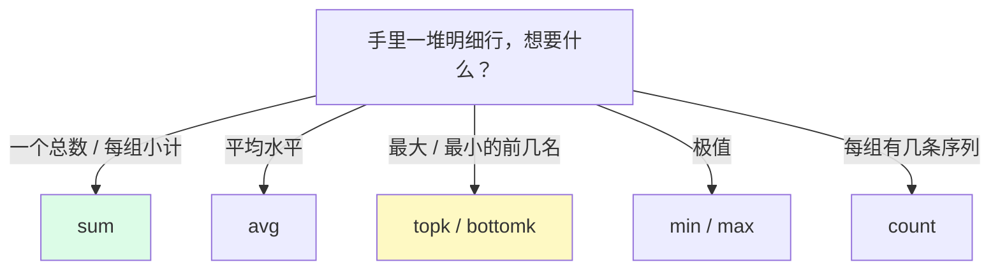

# L9 聚合全家桶：sum/avg/topk 与 by/without

> 阶段 3 · 函数与聚合 | 零基础 + 实操 | 预计 45 分钟

## 第一幕：老板要一个数，你手里有 27 行

L8 你学会了把 Counter 变成速率。现在场景来了：老板走到你工位，「现在系统每秒处理多少请求？」

你掏出 L8 的手艺：

```promql
rate(demo_api_request_duration_seconds_count[5m])
```

**27 行**。每行一个「实例 × 方法 × 路径 × 状态码」组合的 QPS——明细很专业，但老板要的是**一个数**。你总不能跟他说「您把这 27 行加一下」。

压行机登场：

```promql
sum(rate(demo_api_request_duration_seconds_count[5m]))
```

→ **1 行，约 213**。整个系统每秒约 213 次请求，老板满意走了。这就是聚合器干的事：**吃进 N 行明细，吐出 1 行（或每组 1 行）汇总**。

（提前打招呼：演示环境的流量在实时波动，本课引用的数值都以「约」为准——你跑出来的数字跟讲义差个百分之一二，完全正常，别慌。）

聚合器不止 sum 一个，先认全家：



L4 开的「数据形态」主线，今天又推进一格：

- L8 的 `rate`：**吃范围向量，吐瞬时向量**
- 聚合器：**吃瞬时向量，吐瞬时向量**——行数变少，形态不变
- `topk` 特殊：多吃一个数字参数，写成 `topk(3, ...)`

所以聚合器和 rate 是**上下游关系**：rate 先把范围向量变成瞬时向量（顺便做完重置补偿），聚合器再压行。「**先 rate 后聚合**」这个顺序是铁律——为什么是铁律、反了会怎样，实操思考题见。

写法约定：`sum by (标签) (表达式)`（前缀式，修饰符夹在中间）。也能写 `sum(表达式) by (标签)`（后缀式），两者等价；本课统一用前缀式，多层嵌套时读起来顺。

## 第二幕：by/without——压成几行、按什么压

老板又回头：「流量都打在哪些路径上？」

```promql
sum by (path) (rate(demo_api_request_duration_seconds_count[5m]))
```

→ **3 行**：`/api/foo` 约 129、`/api/bar` 约 80、`/api/nonexistent` 约 4.3。

第三个是什么鬼？对**不存在的路径**的请求——明细一看，是 3 条 `GET /status=404` 序列，每秒约 4 次一直在打。哪来的？多半是哪个探活脚本或坏配置。这种信号埋在 27 行明细里一眼扫不出来，**按路径聚合后反而冒头**——聚合的隐藏福利：换个视角，异常自己现身。

`by` 是**白名单**：分组键只保留列出的标签，其余全扔。类比 Excel 透视表「按 path 汇总」——27 行明细按 path 归堆，每堆一行。换分组键就是换报表：

- `by (instance)` → 3 行，每实例约 71
- `by (path, instance)` → 9 行，多级分组（透视表加一列维度）

验算一下：71 + 71.2 + 71.4 ≈ 213.6 = 第一幕的总数。**分组小计之和永远等于总数**——聚合的守恒律，也是你自检查询的好习惯。

### without：黑名单版

`sum without (标签)` 反着来：**只涂掉列出的标签，其余保留**。跟 by 一体两面，选择规则眼熟吗？

| 配对修饰符（L7） | 聚合修饰符（本课） | 名单性质 |
|------|------|------|
| `on(标签)` | `by (标签)` | 白名单：只留这些 |
| `ignoring(标签)` | `without (标签)` | 黑名单：涂掉这些 |

**同款规则：哪个清单短用哪个。** L7 的配对、L9 的聚合，底层是同一个问题——「哪些标签算数」。

### 兑现 L8 的支票：一行收编手拼分母

L8 验证六的挑战题，分母是三项 `ignoring` 连加，写到手酸。现在：

```promql
sum without (mode) (rate(demo_cpu_usage_seconds_total[5m]))
```

→ 3 行约 3.98，标签 `{instance, job}`——跟手拼版**一字不差**（行数、标签完全一致，连 mode 被 ignoring 删掉的细节都复刻了；数值本身随时间微幅波动）。完整重写版：

```promql
100 * (1 - rate(demo_cpu_usage_seconds_total{mode="idle"}[5m]) / ignoring(mode) sum without (mode) (rate(demo_cpu_usage_seconds_total[5m])))
```

实测约 50%，跟 L8 手拼版同一答案，长度砍半。L8 的支票兑现。

### by(instance) 不行吗？——扔标签的代价

你可能会问：分组键写 `by (instance)` 岂不更短？跑跑看：**值一模一样**（约 3.98），但标签只剩 `{instance}`——**job 被扔了**。平时无所谓，拿去当除法分母时就出事：

```promql
rate(demo_cpu_usage_seconds_total{mode="idle"}[5m]) / ignoring(mode) sum by (instance) (rate(demo_cpu_usage_seconds_total[5m]))
```

→ **空表**。右边只剩 `{instance}`，左边 `ignoring(mode)` 后是 `{instance, job}`——job 一栏对不上（右边压根没这栏），L7 的「配不上」模式。修法两条路，正好把 L7 和 L9 的对称性串成一个十字：

- 分母 `without (mode)`（保住 job）+ 左边 `ignoring(mode)`——黑名单配黑名单
- 分母 `by (instance)`（扔掉 job）+ 左边 `on(instance)`——白名单配白名单

两条路实测都通（3 行约 0.50）。记住这条：**扔掉的标签回不来**——by/without 不只是风格选择，扔错标签会断掉后面的配对。这是本课最容易被轻视的坑。

## 第三幕：排座次（topk）与平均水平（avg）

### topk：谁最忙？

「哪 3 个组合 QPS 最高？」

```promql
topk(3, rate(demo_api_request_duration_seconds_count[5m]))
```

→ 3 行，全是 `GET /api/foo 200`（每实例一条，约 38）。注意标签：**原封不动**。topk 不造新序列，只从原序列里**选前 k 名**——「选秀派」，跟 sum 的「造新序列派」（压完行还重组标签）是聚合器里的两个门派。

### 大坑：对裸 Counter 排名

把 rate 去掉试试：

```promql
topk(3, demo_api_request_duration_seconds_count)
```

→ 还是那 3 行 `GET /api/foo 200`！本环境**侥幸**：三台实例差不多同时启动、计数器跑了同样长的时间，累计值排名恰好等于速率排名。生产环境千万别这么干——实例重启时间各不相同，裸 Counter 排名比的是「谁开机久」，L8 那 42 天天文数字的坑换了件马甲又出现了。规矩同 L8：**先 rate 再排名**。

### 聚合套聚合：最忙的路径

27 行明细太碎，想直接对路径排名？聚合的结果还是瞬时向量，可以再聚合——先汇总、再排座次：

```promql
topk(2, sum by (path) (rate(demo_api_request_duration_seconds_count[5m])))
```

→ 2 行：`/api/foo`、`/api/bar`。`bottomk` 同款用法找最闲的：`bottomk(2, ...)` → nonexistent 和 bar。

### avg：平均水平

「集群的平均磁盘使用率多少？」——L7 的除法（每实例一条使用率）+ 本课的 avg（压成集群平均）：

```promql
avg(demo_disk_usage_bytes / demo_disk_total_bytes)
```

→ 1 行约 0.78。

sum / avg / count 还有个三角关系：**avg = sum ÷ count**。实测：`avg by (instance)`（每实例 9 条序列的平均 QPS）约 7.85，`count by (instance)` = 9，7.85 × 9 ≈ 70.7 ≈ `sum by (instance)` 的 71。三个聚合器互相验算，数字对得上，说明你对数据结构的理解也对得上。

### 速查表

| 聚合器 | 回答的问题 | 门派 |
|------|------|------|
| `sum` | 总量 / 小计 | 造新序列 |
| `avg` | 平均水平 | 造新序列 |
| `min` / `max` | 极值 | 造新序列 |
| `count` | 每组几条序列 | 造新序列 |
| `topk` / `bottomk` | 前几名 / 后几名 | 选秀（标签原样） |

> 💡 冷门家族一句话带过：`stddev` / `stdvar`（离散程度）、`count_values`（按值分箱计数）、`group`（只留标签值置 1）、`quantile`（跨序列算分位数——注意它跟 L10 的 `histogram_quantile` **不是一回事**，名字像而已，别混）。用到再查。

📚 **官方文档**：[Prometheus 聚合运算符](https://prometheus.io/docs/prometheus/latest/querying/operators/#aggregation-operators)

## 第四幕：支票兑现——聚合结果拼回明细（group_left）

L7 埋的钩子今天到期：「group_left 真正的主力场景是**聚合结果（每机器 1 条）拼回明细序列**，那要等 L9 学完 sum 才能解锁——到时候回来，你会感谢今天学的 group_left。」

业务问题：**CPU 时间都花在哪了？**——user 和 system 各占总 CPU 时间的百分之几。左边明细，右边聚合：

```promql
rate(demo_cpu_usage_seconds_total{mode!="idle"}[5m])
```

```promql
sum without (mode) (rate(demo_cpu_usage_seconds_total[5m]))
```

左边 6 行（3 实例 × user/system 两个非空闲 mode），右边 3 行（每实例一条总量）——左边每实例 2 条挤向右边 1 条，L7 的多对一结构，一模一样。三步走，把 L7 的失败模式表整个复习一遍：

1. 直接除：左边名片有 mode 栏，右边没有（被 without 涂了）→ **空表**（配不上）
2. 加 `ignoring(mode)`：mode 涂掉了，但左边每实例 2 条对右边 1 条 → **报错** many-to-one（配歧义），报错原文与 L7 一字不差：`multiple matches for labels: many-to-one matching must be explicit (group_left/group_right)`
3. 加 `group_left`：声明「左边是明细、右边是对照表」，右边的总量广播给左边每一条

```promql
100 * rate(demo_cpu_usage_seconds_total{mode!="idle"}[5m]) / ignoring(mode) group_left sum without (mode) (rate(demo_cpu_usage_seconds_total[5m]))
```

→ 6 行：**user 约 30%、system 约 20%**。验算：30 + 20 = 50 ≈ L8 挑战题的 CPU 使用率——同一份数据，L8 从「1 − 空闲占比」正面攻，本课从「各 mode 占比」侧面攻，两条路在 50% 会师。

这条查询就是 group_left 主力场景的标准形态：**占比明细 = 明细 ÷ 该组汇总**。生产环境的「每接口错误率 = 错误数 ÷ 该接口总数」「每实例内存分项占比」全是这个套路：左边保留明细标签（mode/method/path），右边一个同维度的汇总当分母。

## 第五幕（实操）：把聚合全家亲手跑通

打开 **https://demo.promlens.com/**，全程 **Table** 标签页。

### 验证一：一个数的诞生

先跑 27 行明细（`rate(demo_api_request_duration_seconds_count[5m])`），再跑 `sum(...)` 得到 1 行约 213。对着数字读出声：「每秒约 213 次请求」。

### 验证二：by 三连与守恒律

`sum by (path)`（3 行）、`sum by (instance)`（3 行）、`sum by (path, instance)`（9 行）。验算守恒律：`by (instance)` 三行之和 ≈ 总数，`by (path)` 三行之和 ≈ 总数——分组换了，总和不变。

### 验证三：收编 L8 分母

跑 `sum without (mode) (rate(demo_cpu_usage_seconds_total[5m]))`（3 行约 3.98，标签含 job）和 `sum by (instance) (...)`（同值，标签只剩 instance）。对照 L8 的手拼三项连加：值一样、行数一样。再跑第二幕的完整重写版（约 50%），跟 L8 挑战题互相印证。

### 验证四：topk 对照与聚合后排名

`topk(3, rate(...))` → 3 行 GET /api/foo 200；去掉 rate 的裸 Counter 版对照（本环境同榜，想想生产环境为什么不行）；`topk(2, sum by (path) (...))` → 最忙路径；`bottomk(2, ...)` → 最闲路径。

### 验证五：avg 与三角验算

`avg(demo_disk_usage_bytes / demo_disk_total_bytes)` 约 0.78；`avg by (instance) (rate(...))` 约 7.85、`count by (instance)` = 9、`sum by (instance)` 约 71——验算 7.85 × 9 ≈ 71。

### 验证六（挑战）：group_left 占比明细

按第四幕三步走亲手踩：裸除（空表）→ 加 `ignoring(mode)`（报错）→ 加 `group_left`（6 行约 30/20）。三步全踩完，L7 的失败模式表就长进肌肉记忆了。

### 本课实操任务

1. 完成验证一至六（验证六卡住就分两边单独跑：左边 6 行、右边 3 行，看清多对一结构再拼）
2. 验算三连：守恒律（两组分组小计之和都 ≈ 213）、三角关系（avg × count ≈ sum）、会师律（挑战题 user + system ≈ 50% = L8 挑战题）
3. 思考题：预测 `sum(demo_cpu_usage_seconds_total[5m])` 的报错文本再回车验证（提示：L8 验证四的镜像——这次是谁吃错了什么形态？）
4. 思考题：把验证三分母的 `without (mode)` 换成 `by (instance)`，完整重写版还跑得通吗？先预测再验证；然后修好它（两条路，第二幕讲过）
5. 思考题：为什么「先 rate 后聚合」是铁律？除了语法（聚合器不吃范围向量），还有一个语义层面的理由——提示：假设三台实例里有一台重启了，先 sum 后 rate 会把**没重启那台的存量**当成什么？

## 收束与预告

本课的心智模型，五句话：

- **聚合是压行机**：吃 N 行瞬时向量，吐每组 1 行；sum 是「造新序列派」（重组标签），topk 是「选秀派」（标签原样）
- **by 白名单 / without 黑名单**——与 on/ignoring 同款规则、同款选择原则；扔掉的标签回不来，扔错标签会断掉后面的配对
- **先 rate 后聚合**：rate 在内层逐实例做重置补偿，聚合在外层合并；顺序反了连语法都过不去
- **topk 只认当下值**：对裸 Counter 排名 = 比谁开机久，先 rate 再排
- **占比明细 = 明细 ÷ 组汇总**：group_left 的主力场景（L7 支票兑现），错误率、占比类查询全靠它

**位置与伏笔**：阶段 3 过半，三组高频工具已就位两组（rate 系列、聚合系列）。最后一组：`histogram_quantile`。L8 点过名的 `demo_api_request_duration_seconds` 家族——`_bucket` 的 le 阶梯、`_count` 的 27 行明细——在 L10 正式回收，「95% 的请求有多快」从桶里算出来。顺带一提：「平均延迟」其实你现在已经会了：`_sum ÷ _count`，L3 的三件套加本课的除法，就差临门一脚。

---

> ## 👉 进入下一课
>
> 完成本课实操任务后，回复「**继续**」进入 **L10《histogram_quantile：算出 P95 延迟》**——阶段 3 收官，从桶里把分位数算出来。

---

## 🧭 课程导航

⬅️ **上一课**：[L8 rate/irate/increase：Counter 的正确打开方式](lesson-08-rate-irate-increase.md)

➡️ **下一课**：[L10 histogram_quantile：算出 P95 延迟](lesson-10-histogram-quantile.md)

📚 **返回目录**：[课程目录](../../../02-课程目录.md)
