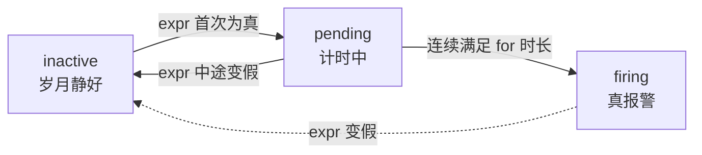

# L11 实战一：从查询到告警规则

> 阶段 4 · 实战应用 | 零基础 + 实操 | 预计 55 分钟

## 第一幕：凌晨三点，谁在盯你的 P95

L10 结尾留了张支票：「你的 P95 51.4ms，很快就有用武之地」。现在它就躺在你的查询框里。但查询有个致命弱点：**得有人去看**。

设想：P95 半夜从 52ms 爬到 500ms。如果没人打开面板，这条曲线和不存在没有区别。回看 L1 第一课的架构图，PromQL 查询有三位消费者——「你 / Grafana / 告警」。前十课你一直在给前两位供货：给自己写查询、给 Grafana 预热。今天正式给第三位供货。

核心认知转变一句话：**查询是「拉」（人去问），告警是「推」（机器喊人）**。把查询变成告警规则，Prometheus 就替你 24 小时盯屏，值不值班它都在。

好消息是：告警规则的 `expr` 字段里装的就是普通 PromQL——前 10 课的一切照单全收。本课要学的是「规则的外壳」（YAML 怎么写）和「告警的脾气」（怎么不让它变成噪声制造机）。

## 第二幕：解剖一条告警规则

不用造样本。演示环境的 Prometheus 里**真实跑着 5 条告警规则**（备课实测拉取），先看与我们最亲的一条——P99 延迟告警，正是 L10 流水线的生产版：

```yaml
- alert: DemoServiceHighLatency
  expr: histogram_quantile(0.99, sum without (status, instance) (rate(demo_api_request_duration_seconds_bucket{job="demo"}[5m]))) > 0.2
  for: 1m
  labels:
    severity: critical
  annotations:
    title: High latency for {{ $labels.method }} on {{ $labels.path }}
    description: The 99th percentile latency for path {{ $labels.path }} with method {{ $labels.method }} in {{ $labels.job }} is {{ printf "%.2f" $value }}s.
```

逐字段解剖（`for` 经 API 拉取显示为 60 秒，YAML 等价写法 `1m`）：

| 字段 | 作用 | 一句话 |
|------|------|--------|
| `alert` | 告警名 | 告警的「姓」，同一条规则触发的所有实例共用 |
| `expr` | 触发条件 | **普通 PromQL**，每个评估周期跑一次 |
| `for` | 耐心值 | 条件要连续满足多久才真正报警（第三幕主角） |
| `labels` | 附加标签 | 最常见 `severity: warning/critical`，值班分流用 |
| `annotations` | 说明书 | 模板变量渲染成人类可读的文字 |

### expr：规则的心脏（L6 的回收时刻）

`expr` 的语义就是 **L6 学的比较运算符过滤**：每个评估周期（演示环境 15 秒一次），Prometheus 跑一遍 expr，**返回的非空序列 = 触发的告警**——每行一个告警实例，序列的标签原样成为告警的标签。

拿我们的 P95 流水线当场实测（当前 P95 ≈ 52.7ms）：

```promql
histogram_quantile(0.95, sum by (le) (rate(demo_api_request_duration_seconds_bucket[5m]))) > 0.1
```
→ **空表**。52.7ms 没超 100ms，没有序列存活 → 没有告警。

```promql
histogram_quantile(0.95, sum by (le) (rate(demo_api_request_duration_seconds_bucket[5m]))) > 0.05
```
→ **1 行**（值 0.0527）。一行序列存活 = 一条告警实例，它的标签（`job="demo"`）就是告警的标签。

L6 当时学「比较运算符默认是过滤器不是改值器」像句刁钻的语法规定——今天谜底揭晓：**这是给告警准备的**。空结果 = 安静，非空 = 报警，「有/无」本身就是信号。

顺带回收 L4 的伏笔（「所有告警规则都建立在分得清两种向量上」）：expr 必须是**瞬时向量**表达式。范围向量直接当 expr 是语法错误，`rate(...[5m])` 先把范围向量加工成瞬时向量，才能进告警管道——这是 L4 那张水路图在告警侧的延续。

### bool：expr 里的禁字

同一查询加 `bool` 试试（实测）：

- `... > bool 0.05` → 1 行，值 **1**（52.7 > 50 为真）
- `... > bool 0.1` → 1 行，值 **0**（52.7 > 100 为假）

看出问题了吗？**bool 版永远返回一行**——真返回 1，假返回 0，序列永不消失。放进 expr 里 = 永远有告警在触发，包括服务健康的时候。所以 expr 里几乎从不写 bool：告警靠的是「行消失/出现」，bool 把这个信号抹掉了。

### annotations：模板把数字翻译成人话

`{{ $labels.path }}`、`{{ $value }}` 在告警触发时被渲染。拿当时正在 firing 的错误率规则（`DemoServiceHighErrorRate`）做样本，模板原文 vs 真实触发后的成品（alerts API 拉取的实况）：

| 模板原文（rules） | 渲染成品（alerts 实测） |
|------|------|
| `High 5xx rate for {{ $labels.method }} on {{ $labels.path }}` | `High 5xx rate for POST on /api/foo` |
| `... in {{ $labels.job }} is {{ printf "%.2f" $value }}%.` | `... for path /api/foo with method POST in demo is 1.66%.` |

`$labels` 就是触发行的全部标签，`$value` 就是触发行的值——第二幕 expr 的输出，就是 annotations 的原料。模板里还能做算术（如 `{{ $value * 1000 }}` 把秒换算成毫秒），本课用 `printf "%.2f"` 保守写法即可。

### 规则住在哪里

生产上规则长在一个 YAML 文件里（`groups: → rules:` 两层嵌套，上面那条是其中一条 rule），挂到 Prometheus 配置的 `rule_files` 路径，重载生效。它进版本库、走 Code Review、随代码发布——规则是**基础设施代码**，不是网页上点两下的设置。演示环境的规则组名 `demo-service-alerts`，评估间隔 15 秒。

📚 **官方文档**：[告警规则配置](https://prometheus.io/docs/prometheus/latest/configuration/alerting_rules/)、[告警生命周期与 ALERTS 指标](https://prometheus.io/docs/prometheus/latest/concepts/alerting/)

## 第三幕：for 与告警状态机

### 为什么需要耐心值

L8 讲过：rate 的窗口越小越毛。告警规则直面这个问题。同一条 P95 流水线，换窗口看曲线（备课实测）：

- `[5m]` 窗口，过去 6 小时：73 个点，全程 **51.8~54.2ms**，平滑得像尺子画的
- `[1m]` 窗口，过去 1 小时：61 个点，**46.3~81.5ms**，35ms 宽的毛刺带（还有一根 81.5ms 的尖刺）

如果拿 50ms 当阈值、告警**不带 for**（毛刺直接报警），`[1m]` 这条曲线一小时内会报警多少次？统计超阈值的连续段（实测）：

| 阈值 50ms 下的连续段 | 段数 | 对应 for 取值 | 实际报警次数 |
|------|------|------|------|
| 所有超阈值段 | **21 段** | for: 0s | 21 次弹跳 |
| 持续 ≥ 2 分钟的段 | 8 段 | for: 1m | 8 次 |
| 持续 ≥ 3 分钟的段 | 6 段 | for: 2m | 6 次 |
| 持续 ≥ 5 分钟的段 | **0 段** | for: 5m | **0 次** |

同一曲线，for 从 0 调到 5m，告警从 21 次降到 0 次。**for 就是把毛刺翻译成沉默的旋钮**。

### 状态机：三态两门



`for: 1m` 的含义：expr 变真后**先进入 pending 计时**，连续满足 1 分钟才转 firing；中途 expr 变假，计时清零回 inactive。firing 后 expr 变假才解除（resolved）。

### 活体样本：四张快照（全部实测，间隔仅几分钟）

演示环境当前正上演一场教科书级的状态机演化（`DemoServiceHighErrorRate` 规则：POST/GET 各路径的 5xx 错误率 > 0.5%，for: 1m；另有 HighLatency：P99 > 200ms）。备课期间连续抓拍：

| 抓拍 | 时刻(UTC) | firing | pending |
|------|------|------|------|
| A | 06:02:30 | 错误率 POST /api/foo（04:08 起） | 错误率 POST /api/bar、GET /api/bar |
| B | ~06:03:30 | 错误率 POST /api/foo、POST /api/bar | 错误率 GET /api/foo；**延迟 P99 POST /api/bar** |
| C | 06:05:54 | 错误率 POST /api/foo、GET /api/foo；**延迟 P99 POST /api/bar** | 错误率 POST /api/bar |
| D | 06:06:45 | 错误率 POST /api/foo；延迟 P99 POST /api/bar | 错误率 GET /api/foo、POST /api/bar |

三个观察，每个都是知识点：

- **转正**：抓拍 B 里 pending 的 GET /api/foo 和 P99 延迟告警，到 C 都转 firing——for: 1m 走满，正常转正。P99 那条触发值 212.3ms（POST /api/bar，实测量级），真超阈。
- **回退必经清零**：POST /api/bar 的错误率在 B 是 firing，C 却回到 pending——状态机没有「firing 退回 pending」的边，唯一路径是中途 expr 变假（告警解除消失）、之后重新变真从零计时。抓拍 D 的 for-state 时间戳证实：它的计时器 06:06:16 重新起算。
- **真问题与噪声的形态差异**：POST /api/foo 的错误率告警从 04:08 一路 firing 到现在（约 2 小时，实测错误率 2.15% 稳定超标）——真问题长这样，**稳定 firing 不撒手**。而那批在 0.5% 阈值附近横跳的（1.0~1.5% 的错误率配 `[1m]` 毛窗口），pending/firing/resolved 反复横跳——噪声长这样。值班员扫一眼告警列表就能分诊，这是告警设计的隐性目标：让真问题一眼可辨。

### ALERTS：告警本身就是指标

活跃告警被 Prometheus 合成为内置时序，用 PromQL 直接查（学员实操可跑）：

```promql
ALERTS{alertname=~"DemoService.*"}
```
→ 4 行，每行一个活跃告警实例，`alertstate="pending"/"firing"` 标签区分状态，值恒为 1（存在性指标）。想看每个告警的 for 计时起点，查 `ALERTS_FOR_STATE`（值是计时起点的 Unix 时间戳——快照 D 的取证就靠它）。

## 第四幕：告警风暴的四个源头 + 一个悖论

「不让告警变成风暴」是 L10 预告的本课另一半。告警风暴=值班群每分钟几十条告警，真正的故障反而被淹没。四个源头，逐一拆解：

### 源头一：阈值贴着日常水位

实测：`[5m]` P95 过去 6 小时水位 51.8~54.2ms（73 个点）。试三个阈值：

- 阈值 **50ms** → 73/73 点全超 → **永久 firing**。告警常亮，三个月后没人再看它一眼（狼来了）
- 阈值 **55ms** → 0/73 点超 → **永不响**。摆设
- 阈值 **100ms**（SLO 口径）→ 当前 0 点超，但真出事（P95 翻倍）立刻响 → **正确姿势**

阈值不是拍脑袋的数字，是**以日常水位为参照系选出来的**：水位 52ms 配 100ms 阈值，安全边际近 2 倍——既不被呼吸抖醒，真故障也跑不掉。这就是 L10 说「P95 51.4ms 马上有用武之地」的含义：它是选阈值的基准线。

### 源头二：毛刺没 for 兜底

第三幕 21 段 → 0 段的实测已量化，不赘述。记住组合拳：**窗口管平滑（[5m]），for 管持续（5m）**，两个旋钮都在把噪声滤出告警管道。预置规则印证：延迟规则用 `[5m]` 窗口（分位数要稳），错误率规则用 `[1m]` 窗口 + for: 1m 兜底（错误率要快）——窗口长短是场景驱动的选择，不是越大越好。

### 源头三：告警粒度失控

如果延迟告警的 expr 不聚合，27 条序列 27 条告警同时响。预置规则的示范：`sum without (status, instance)` 把 27 条压成 method×path 组合（实测 5 种组合，`/api/nonexistent` 只有 GET），哪个组合真超阈哪个响——L9 聚合的隐藏身份：**告警的降噪器**。当场实测我们的 P95 版：

```promql
histogram_quantile(0.95, sum by (le, path) (rate(demo_api_request_duration_seconds_bucket[5m]))) > 0.05
```
→ 3 条路径只有 **1 行**（`/api/bar`，60.4ms）存活。三条路径一条告警，粒度刚刚好：知道哪条路坏了，又不轰炸。

### 源头四：分级缺失

预置规则组埋了 severity 梯子：单实例宕机 = `warning`（一台挂了，天没塌）、全部宕机/指标消失/错误率/P99 超标 = `critical`（真出事了）。severity 是值班分流器：warning 进群聊、critical 打电话。全 critical 等于没有 critical（实操思考题 5 见）。

（边界说明：Prometheus 只管「发」；分组、抑制、静默这些降噪的第二道闸在下游 Alertmanager——本课不展开，知道分工即可。）

### 压轴悖论：指标消失时，告警集体哑火

细想 `P95 > 0.1` 的死穴：服务进程彻底挂掉、序列**消失**时，expr 返回空表——Prometheus 的解读是「没有序列超阈值」，而不是「出大事了」。**expr 只能看见存在且超标的序列，看不见本该存在却消失的序列**。服务死透的那一刻，业务告警反而全体沉默。

解法就在预置规则里（三层防线，前两层可直接实测复现）：

```promql
up{job="demo"} == 0        # 防线一：抓取失败（L1 的 up 绕了一圈回来了）→ 当前 3 行全 1，不触发
absent(up{job="demo"})     # 防线二：目标从配置里消失，序列无中生有 → 当前空表，不触发
```

`absent()` 的绝活是**把「无」翻译成「有」**：序列存在 → 空表；序列消失 → 冒出一行值为 1 的新序列（匹配器里的标签还会带进结果）。实测感受：

```promql
absent(demo_api_request_duration_seconds_bucket{path="/api/deleted"})
```
→ **1 行**：`{path="/api/deleted"}` = 1——一条不存在的路径，absent 让它「显形」，标签还告诉你消失的是谁。对照 `absent(...{path="/api/nonexistent"})`（存在的序列）→ 空表。防线三才是业务 expr（P95 超标）。三层各盯一种死法：抓不到、没配置、真超阈。

### 品鉴：一条规则串起十一课

最后把预置的 5xx 错误率规则拆开看，它把全课程串成了一条线：

```promql
sum without (status, instance) (rate(demo_api_request_duration_seconds_count{job="demo",status=~"5.."}[1m]))
/ sum without (status, instance) (rate(demo_api_request_duration_seconds_count{job="demo"}[1m]))
* 100 > 0.5
```

- `status=~"5.."`——L5 正则匹配器筛 5xx
- 分子分母都 `without (status, instance)`——L9 黑名单聚合，且**两边的输出标签集合必须一致**（L7 向量匹配的老规矩：签名不同除法配不上对）
- `rate(...[1m])`——L8：Counter 先 rate；`[1m]` 窗口是错误率场景「要快」的选择
- `/ ... * 100 > 0.5`——L6：算术算百分比，比较过滤定阈值
- 套上 `for` + `labels` + `annotations`——本课的外壳

这条规则当前正 firing（POST /api/foo 错误率 2.15%）——演示环境埋的剧情：**POST /api/foo 是问题接口**。你已经具备逐行读懂生产规则的能力了。

## 第五幕（实操）：在演练场当一次值班员

先说清环境边界：演练场是**查询环境**，不能配置规则（规则文件要改 Prometheus 服务端配置并重载）。但 expr 的每个部件、活跃告警的实时状态，全都能用 PromQL 验证——规则文件本体是纸面作业（本课核心交付物）。打开 **https://demo.promlens.com/**，全程 Table 标签页。

> ⚠️ 数值波动提示：告警是**活的**——本课快照 A~D 间隔仅 4 分钟就换了三轮成员。你跑出来的告警清单、错误率、P95 数值与讲义不同是常态，重点看结构与状态逻辑。

### 验证一：expr 的过滤语义

跑第二幕两查询（`> 0.1` 空表、`> 0.05` 一行，当前水位 52.7ms 上下浮动）。再补 `> bool 0.1` → 恒 1 行值 0——亲眼确认 bool 抹掉了「行消失」这个信号。

### 验证二：分路径降噪

第四幕的分路径 P95 查询 → 只 `/api/bar` 一行存活。思考：为什么 `/api/nonexistent`（0.1ms）永远不触发？

### 验证三：值班台

```promql
ALERTS{alertname=~"DemoService.*"}
count by (alertstate) (ALERTS)
```
→ 数数 firing 和 pending 各几条、都是哪个 method×path。跟快照 D 对照：成员肯定不同了——**pending 和 firing 的区别**才是要带走的东西。

### 验证四：absent 的「无中生有」

跑第四幕 absent 两查询（不存在的 `/api/deleted` → 1 行；存在的 `/api/nonexistent` → 空表）。注意看 1 行结果的标签。

### 验证五：复现生产规则

原样跑 5xx 错误率 expr（第四幕品鉴段）→ 数存活行数，跟 `ALERTS{alertname="DemoServiceHighErrorRate"}` 的行数对照：**expr 此刻的真，就是告警此刻的命**。再跑 `up{job="demo"} == 0` → 空表，想想它为什么安安静静。

### 验证六（挑战）：手写渲染结果

拿验证二的触发行（`/api/bar`，值 ≈ 0.06），笔算这条告警 firing 后 annotations 会渲染成什么：

```
summary: "P95 延迟超标：{{ $labels.path }}（当前 {{ printf \"%.2f\" $value }}s）"
```
→ 写下你的答案，对照模板规则（第二幕的渲染对照表就是范例）。

### 本课实操任务

1. 完成验证一至六（验证六务必动笔再验证）
2. **纸面作业（核心交付物）**：为 demo 服务写一条 P95 延迟告警规则，需求：路径级 P95、阈值 100ms（SLO）、for 5m、severity: warning、summary 和 description 都要带模板变量。完整 YAML 写出来（参考答案在本课末尾，先写再看）
3. 思考题：错误率规则用 `[1m]` 窗口 + for: 1m，延迟规则用 `[5m]` 窗口 + for: 1m——为什么错误率敢用毛窗口？延迟为什么不敢？（提示：第三幕 35ms 毛刺带 vs 2.4mm 水位带，想想毛刺带占水位的比例）
4. 思考题：把延迟规则的 for 从 1m 改成 0s，用第三幕 21/8/6/0 段的数字推演告警行为的变化——多出来的告警是「更早发现问题」还是「更多假警报」？
5. 思考题：如果所有告警（包括单实例宕机）都标 `severity: critical`，值班三个月后会发生什么？（提示：狼来了；分流器失灵意味着什么）

## 收束与预告

本课的心智模型，五句话：

- **expr = 比较过滤**：每评估周期跑一次，非空序列即告警，一行一实例——L6 过滤语义与 L4 瞬时向量的回收时刻；`bool` 抹掉「行消失」信号，禁用
- **for 是防抖旋钮**：inactive → pending → firing 三态，中途变假计时清零；实测同一曲线 21 段毛刺被 for: 5m 压到 0 段——毛刺不配叫醒人
- **阈值以水位为参照**：水位 52ms 配 100ms 阈值（安全边际 2 倍）；贴水位 = 永久 firing 的狼来了，远到天边 = 摆设
- **聚合是降噪器、severity 是分流器**：`sum by/without` 把 27 条序列压成业务维度组合；warning/critical 梯子让值班员扫一眼就分诊
- **expr 看不见消失的序列**：`up == 0` + `absent()` + 业务 expr 三层防线，各盯一种死法；告警本身就是指标（`ALERTS`/`ALERTS_FOR_STATE`），PromQL 能查

**位置与伏笔**：阶段 4 第一课。查询的三位消费者已供货两位（你、告警），最后一位 Grafana 在 L12 登场——面板是把查询焊在屏幕上的艺术，顺带解决大纲预告的最后一个坑：**查询优化**（一条查询打爆服务器的事故现场：预聚合、窗口选择、高基数陷阱）。你的 P95 流水线、100ms 阈值、`ALERTS` 指标，L12 都会上面板。

### 纸面作业参考答案

```yaml
groups:
  - name: demo-service-slo
    rules:
      - alert: ApiP95LatencyHigh
        expr: histogram_quantile(0.95, sum by (le, path) (rate(demo_api_request_duration_seconds_bucket{job="demo"}[5m]))) > 0.1
        for: 5m
        labels:
          severity: warning
        annotations:
          summary: "P95 延迟超标：{{ $labels.path }}（当前 {{ printf \"%.2f\" $value }}s）"
          description: "路径 {{ $labels.path }} 的 P95 延迟已超过 100ms 阈值并持续 5 分钟，SLO 承诺 P95 < 100ms。"
```

对照预置规则 `DemoServiceHighLatency` 的差距即进阶方向：它用 `sum without (status, instance)` 保留了 method 维度（POST 慢 ≠ GET 慢）和 job 标签（多服务共用规则时知道是谁家）、P99 比 P95 更严苛、critical 比 warning 更紧急——你的版本与生产版本之间，每个字段差都是一节课的经验值。

---

> ## 👉 进入下一课
>
> 完成本课实操任务后，回复「**继续**」进入 **L12《实战二：Grafana 面板套路与查询优化》**——课程收官：查询的第三位消费者 Grafana 正式登场，P95 流水线上面板，顺带拆解「一条查询打爆服务器」的事故现场。

---

## 🧭 课程导航

⬅️ **上一课**：[L10 histogram_quantile：算出 P95 延迟](../3-函数与聚合/lessons/lesson-10-histogram-quantile.md)

➡️ **下一课**：[L12 实战二：Grafana 面板套路与查询优化](../4-实战应用/lessons/lesson-12-实战二-Grafana面板套路与查询优化.md)

📚 **返回目录**：[课程目录](../../02-课程目录.md)
